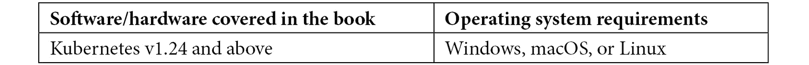

# 前言

Kubernetes 背后的理念是让工程师的工作变得更轻松，对吧？虽然这个说法是对的，但每项技术和平台都有其优缺点。归根结底，Kubernetes 的确使得容器化的管理更加高效，但这并不意味着它很容易。许多组织和工程师需要付出大量的努力，才能让 Kubernetes 按照应有的方式运行。

本书的目标以及整体的 50 个概念，旨在帮助缓解这些难题。虽然一本书无法解决所有可能出现的问题，也无法让每个组件都按照预期工作，但总体目标是帮助你以更简便的方式在生产环境中使用 Kubernetes，包括从云到本地到监控和安全等方面的 50 个关键点，涵盖了方方面面。如今，网络上充满了大量的内容和教学方式，旨在帮助你学习 Kubernetes。本书的目的是帮助你提升到下一个水平。

在本书中，你将看到从创建环境到部署服务网格和 Kubernetes 资源的所有内容。老实说，本书中的很多话题实际上足够构成一本书。因此，书中的解释和内容整体有所精简。正因如此，你可能不会在这本书中找到所有答案，但它会为你开始 Kubernetes 生产环境之旅提供一个极好的起点。

有了这 50 个概念，你应该能够将你在本书中学到的知识运用到生产环境中，并最终扩展它们。将你所学应用到实际中，最终能帮助你明白如何深入学习这些概念的方向。

# 本书适合的人群

本书是为那些希望在生产环境中使用 Kubernetes 的工程师准备的。也许你刚刚学会了 Kubernetes 的基础和初学者知识，现在准备提升到下一个层次。或者，你可能正在准备将 Kubernetes 实施到生产环境中，或者测试适合你环境的容器化工作负载。在这两种情况下，你都可以使用本书作为参考，展示你在生产环境中应考虑的事项。

把这本书当作一本“指南”。它既有理论部分，也有实践部分，还有从头到尾实际可用的代码，帮助你创建和部署 Kubernetes 资源。如前言中所述，这本书无法涵盖每个话题的深度，因为很多话题本身就足够构成一本书，但你可以将它当作“指南”来部署到生产环境。

# 本书内容概述

*第一章*，*当今世界的 Kubernetes*，从理论角度讲解了你在当前生态系统中应该如何看待 Kubernetes —— 比如它为何重要，“云原生”究竟意味着什么，以及容器化整体上为工程师做了什么。

*第二章*，*启动 Kubernetes 和三大云平台之旅*，快速启动集群部署。你将学习如何在 Azure、AWS 和 GCP 中部署 Kubernetes 集群。你将从 UI/GUI 的角度看到如何通过代码部署集群。本章使用 Terraform 进行**基础设施即代码**（**IaC**），因为这是当前生产环境中最流行的方法。

*第三章*，*与其他云伙伴一起运行 Kubernetes*，教你如何部署三大最流行的托管 Kubernetes 服务。然而，这并不意味着这些是唯一的方法。在本章中，你将看到一些在生产环境中常用的其他流行选项，它们大多用于测试生产工作负载，因为从成本角度来看它们稍微便宜一些。

在当今云为中心的世界里，你在社交媒体上看到的许多技术营销和内容并未涉及本地部署。现实是，本地部署，尤其是本地 Kubernetes 集群，依然是非常常见的。在*第四章*，*本地 Kubernetes 现实检查*中，你将了解如何从理论角度和一些实践操作来思考本地部署。

*第五章*，*像真正的云原生一样部署 Kubernetes 应用*，开始了你将应用部署到云的旅程。在前几章中，你学习了集群管理，这非常重要，但只是整个拼图的一半。拼图的第二部分是实际的 Kubernetes 资源部署。

从上一章的结束处开始，*第六章*，*Kubernetes 部署——同样的游戏，下一个层次*，将 Kubernetes 资源部署提升到一个新的层次。你将接触到 CI/CD、GitOps 和服务网格部署等概念。这被认为是 Kubernetes 资源部署的“高级”部分，你将在生产中看到很多。

到目前为止，你已经学会了如何部署和管理集群与应用。一旦集群和应用部署完成，你还需要确认它们是否按预期运行。此时，观察性和监控就显得尤为重要，我们将在*第七章*，*Kubernetes 监控* *与观察性*中讨论这个话题。

为了完成任何 Kubernetes 生产部署，你需要在任何资源到达生产环境之前考虑一个重要因素——安全性。安全性是决定一个环境成功与否的关键因素，它决定了你是拥有一个成功的环境，还是度过一个不断处理问题的漫长周末。在*第八章*，*安全性现实检查*中，你将学习到如何确保 Kubernetes 环境的安全，以及你可以使用的一些关键工具和平台来实现这一目标。

# 为了最大程度地从本书中受益

本书是理论与实践的良好结合。这是因为理论很重要，但如果你不知道如何实现它，它在实际生产中将没有太大用处。为了跟上本书的内容，你应该能够访问主要的云平台，拥有一些虚拟机，并且可能需要花费一些资金来搭建环境。



如果你使用的是本书的数字版，我们建议你自己输入代码或访问本书的 GitHub 仓库中的代码（链接在下一节提供）。这样可以帮助你避免因复制和粘贴代码而导致的潜在错误。

# 下载示例代码文件

你可以从 GitHub 下载本书的示例代码文件，网址是 [`github.com/PacktPublishing/50-Kubernetes-Concepts-Every-DevOps-Engineer-Should-Know`](https://github.com/PacktPublishing/50-Kubernetes-Concepts-Every-DevOps-Engineer-Should-Know)。如果代码有更新，GitHub 仓库中的代码将会更新。

我们还提供了来自我们丰富书籍和视频目录的其他代码包，可以在 [`github.com/PacktPublishing/`](https://github.com/PacktPublishing/) 上查看！快来看看吧！

# 下载彩色图像

我们还提供了一份包含本书中使用的截图和图表的彩色图像的 PDF 文件。你可以在此下载：[`packt.link/FQMAS`](https://packt.link/FQMAS)。

# 使用的约定

本书中使用了多种文本约定。

`文中的代码`：表示文中的代码词汇、数据库表名、文件夹名、文件名、文件扩展名、路径名、虚拟网址、用户输入和 Twitter 账户名。以下是一个示例：“将下载的 `WebStorm-10*.dmg` 磁盘映像文件作为系统中的另一个磁盘挂载。”

代码块如下所示：

```

terraform {
  required_providers {
    azurerm = {
      source  = "hashicorp/azurerm"
    }
  }
}
```

当我们希望引起你对代码块中特定部分的注意时，相关行或项目会以粗体显示：

```

variable "name" { 
       type = string 
       default = "aksenvironment01" 
}
```

任何命令行输入或输出都按如下格式书写：

```

sudo systemctl daemon-reload 
sudo systemctl enable crio --now
```

**粗体**：表示新术语、重要词汇或屏幕上显示的词语。例如，菜单或对话框中的词语通常以**粗体**显示。以下是一个示例：“从**管理**面板中选择**系统信息**。”

提示或重要说明

以这种方式显示。

# 联系我们

我们始终欢迎读者的反馈。

**一般反馈**：如果你对本书的任何方面有疑问，请发送邮件至 customercare@packtpub.com，并在邮件主题中提及书名。

**勘误**：尽管我们已尽力确保内容的准确性，但错误仍然可能发生。如果你发现了本书中的错误，我们将非常感激你向我们报告。请访问 [www.packtpub.com/support/errata](http://www.packtpub.com/support/errata) 并填写表格。

**盗版**：如果您在互联网上遇到任何我们作品的非法复制品，请提供该位置地址或网站名称，我们将不胜感激。请通过版权@packt.com 与我们联系，并附上材料的链接。

**如果您有兴趣成为作者**：如果您有专长的主题并且有兴趣撰写或贡献书籍，请访问 [authors.packtpub.com](https://authors.packtpub.com)。

# 分享您的想法

一旦您阅读完*50 个每个 DevOps 工程师应该知道的 Kubernetes 概念*，我们很想听听您的想法！请[点击这里直接前往 Amazon 评论页面](https://packt.link/r/1804611476)并分享您的反馈。

您的评价对我们和技术社区非常重要，它将帮助我们确保提供优质的内容。

# 下载此书的免费 PDF 副本

感谢您购买本书！

您喜欢随时随地阅读，但无法将纸质书籍随身携带吗？

您的电子书购买是否无法与您选择的设备兼容？

不用担心，现在购买每本 Packt 图书，您都可以免费获得该书的无 DRM PDF 版本。

随时随地、在任何设备上阅读。直接将您最喜欢的技术书籍中的代码搜索、复制并粘贴到您的应用程序中。

福利不仅仅如此，您还可以独享折扣、新闻通讯以及每天直接送到您邮箱的优质免费内容。

按照以下简单步骤获得福利：

1.  扫描二维码或访问以下链接


https://packt.link/free-ebook/9781804611470

1.  提交您的购买凭证

1.  就是这样！我们将直接通过电子邮件发送您的免费 PDF 和其他福利。
