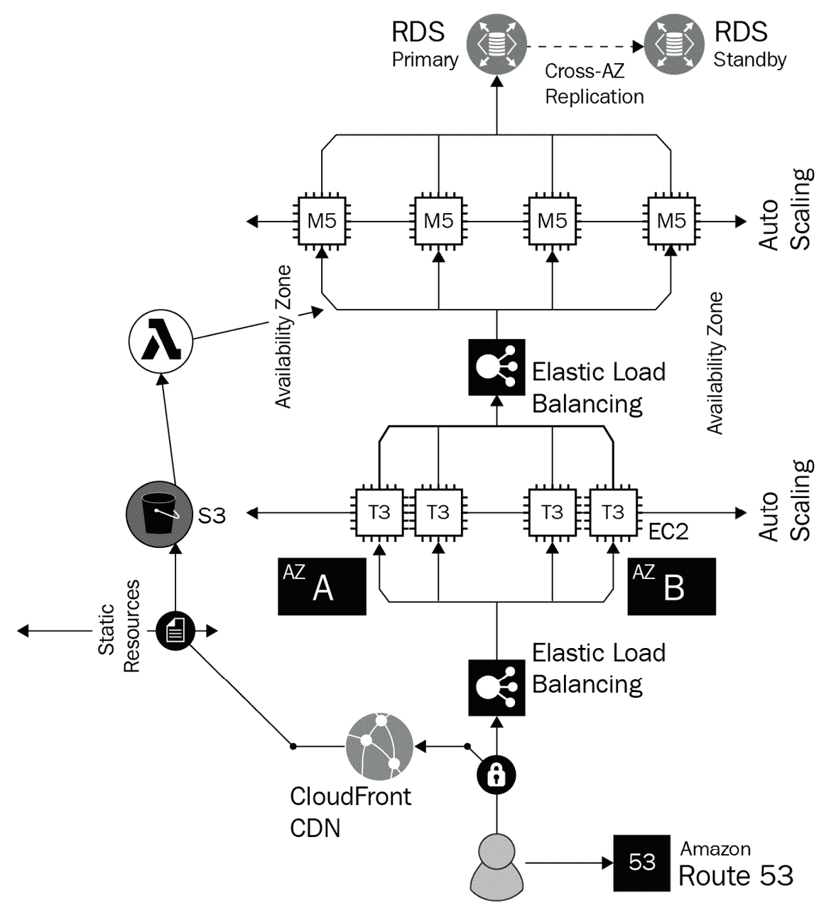

# 第一章：Kubernetes 在今天的世界

如果你正在阅读这本书，那么很可能你曾经或者仍然在某个层面上身处于技术/IT 领域，无论是从运维方面，开发方面，还是两者兼有——甚至可能是技术领导或产品管理。无论如何，你很可能已经听说过一种叫做**Kubernetes**的平台/技术。从每个公司，无论大小，都在讨论 Kubernetes 来看，许多工程师和领导人员认为它能够解决很多问题。虽然这是事实，但事情并不简单，像所有让我们生活更轻松的事物一样，Kubernetes 也有一些陷阱。

本章主要是理论性的内容，将回答你关于迁移到云端、混合环境、云原生/特定应用程序以及 Kubernetes 如何接管微服务生态系统等问题的许多疑问。

到本章结束时，你将能够回答一些关于实施 Kubernetes 的优缺点的问题。你将对为什么工程师和领导团队都在转向 Kubernetes 有一个扎实的理解。你也会开始思考你当前的应用程序是什么样子，以及 Kubernetes 是否适合它们。

本章将涵盖以下主题：

+   向云端转型

+   Kubernetes，新的云操作系统和数据中心

+   云原生应用程序及其重要性

+   抽象更容易了，但有个转折

+   慢慢开始，快速前进

# 技术要求

本章内容更多是理论而非实践，所以你不必担心任何编码或实验。要跟上本章的内容，以及本书的内容，你应该具备 Kubernetes 初学者水平的知识，具有中级云计算知识，并且有一些应用程序和架构的经验。

在接下来的章节中，本书将包括实验和动手操作。你可以在本书的 GitHub 仓库中找到每个练习的代码：[`github.com/PacktPublishing/50-Kubernetes-Concepts-Every-DevOps-Engineer-Should-Know`](https://github.com/PacktPublishing/50-Kubernetes-Concepts-Every-DevOps-Engineer-Should-Know)。

# 向云端转型

在深入了解 Kubernetes 之前，有一个重要的问题需要问：为什么使用 Kubernetes？现实情况是，许多组织已经多年没有 Kubernetes 也在部署应用程序。1980 年代，工程师们写软件到软盘上时并没有 Kubernetes。那么，为什么现在需要它？

这个问题的答案是复杂的，最好的起点是思考云计算为我们做了什么——不仅仅是云计算本身是什么，更重要的是，从架构师、工程师和管理的角度来看，云计算在部署软件和系统时帮助我们思考了什么。在本节中，你将了解云计算的以下几个方面：

+   为什么组织关心云计算

+   云计算为工程师做了什么

+   抽象如何帮助我们从错误中学习

+   云计算并不完全是人们想象的那样

让我们仔细看看。

## 为什么组织关心云计算

组织中的领导团队，无论是 CIO、CTO 还是其他技术领导者，通常会把 Kubernetes 与云计算联系在一起。然而，这其实与事实相去甚远。其原因可能是极其优秀的技术营销，也可能是由于没有足够的亲身经验，无法真正理解云环境下的底层运作。然而，让我们暂时离开这个话题，思考一下为什么每个人都关心云计算。最好的方法是通过一个视觉图示，所以让我们来看看以下图示：

图 1.1 – 数据中心 Web 应用架构

上述图示展示的是一个数据中心架构。它包含了很多组件，有些已经标出，有些则没有，包含以下内容：

+   服务器

+   网络设备

+   服务器之间的连接

+   以太网电缆和电源电缆

所有这些硬件不仅带来了购买成本，还有雇佣工程师来管理、维护它并保持数据中心正常运转的费用。更不用说，建立一个完整的数据中心大约需要 4 到 6 个月的时间。考虑到数据中心建设所需的时间，再加上硬件的成本和管理，基于云的系统对于任何组织的高级领导团队来说，尤其是从初创企业到财富 500 强企业，开始变得非常有意义。

现在，让我们来看看*图 1.2* 中的架构。该图展示了一些内容，包括以下几点：

+   RDS（亚马逊的数据库服务）

+   负载均衡器

+   CDN（内容分发网络）

+   S3 存储桶（AWS 中的云存储）

+   Route 53（AWS 的 DNS 服务）

*图 1.2* 中的架构图与*图 1.1* 类似，它们都是数据中心，但只有*图 1.2* 是虚拟化的，完全体现了数据中心的样子。你可以看到网络组件、存储、数据库、服务器以及一切相关内容。最大不同在于，这里看到的是虚拟化的。这是一个虚拟数据中心，包含虚拟服务。因为有工程师在 AWS 工作，管理硬件、网络和其他外围设备，你不再需要亲自去做这些。你只需关注服务本身，确保它们按预期工作。

不再需要购买硬件。不再需要更换硬盘。不再需要等待 4 到 8 个月，等硬件运送到你的数据中心，然后才能开始构建。相反，一个完整的数据中心只需要几次点击按钮或几行自动化代码就能实现：

图 1.2 – 云 Web 应用架构

根据前面的图示，Kubernetes 就是发挥作用的地方。无论你选择哪种方式，无论是本地部署还是云端，都有大量内容需要管理。即使云计算使基础设施管理变得更简单，创建所有云基础设施仍然需要大量的人员投入和巨大的成本。

以下是需要管理的几个组成部分：

+   负载均衡器

+   虚拟机（或裸机服务器）

+   网络设备（虚拟或物理）

+   子网、私有 IP、公有 IP 和网关

+   多个虚拟化硬件和服务的安全性

这只是概括了主要类别。每个类别内都有多个组件（物理和/或虚拟）需要管理。有了 Kubernetes，这些都被抽象化了。没有防火墙或网关，因为它们是通过 kube-proxy 管理的。除了 Kubernetes 节点，你无需部署其他虚拟机，因为应用程序是在 Kubernetes Pods 中运行的。

如果你在 **Azure Kubernetes Service**（**AKS**）或 GKE 等 Kubernetes 服务中运行 Kubernetes，控制平面（有时被称为 API 服务器或主节点，这种描述控制平面已被弃用）的管理完全由你抽象化处理。

AKS、GKE 或其他云 Kubernetes 服务在后台做的事情和你在一堆虚拟机中运行原生 Kubernetes 集群时所做的事情是一样的。底层技术、运作方式以及使用方式都没有变化。唯一改变的是抽象层。

这就是为什么云计算对 Kubernetes 很重要，也就是为什么 CIO、CTO 和工程师应该关注它。

## 云计算为工程师做了什么

“*云就是别人的计算机*”，正如有些人可能随口说或贴在有趣的贴纸上。正如我们所知，每个笑话中都有一些真理。真相就是，这是对的。当你与云互动时，并不是与某种神奇的服务互动，这些服务*就是存在*的。相反，你是在与由其他工程师管理的服务互动。

例如，假设你正在使用 Azure 虚拟机或 AWS 中的 EC2 实例。从你的角度来看，你登录到其中一个门户或编写一些 **基础设施即代码**（**IaC**），几分钟后，你的新虚拟服务器/云服务器就部署好了。在后台，涉及的事情远不止这些。这里面有很多不同的部分，其中包括以下内容：

+   自动扩展服务器

+   进行多次检查，确保所使用的物理/裸机服务器有足够的硬盘、CPU 和 RAM 空间。

+   网络设置

+   大量自动化

记住，因为你部署的云服务器运行在裸机服务器上，所以必须有人来管理这些服务器并进行维护。云计算是一个你看不见的抽象层。话虽如此，云计算确实为工程师做了很多事情。

让我们以一个初创公司为例。几年前，如果一家初创公司想要在科技领域有所作为，他们需要服务器来托管应用程序和网站。对于一个在狭小办公室甚至某人家中办公的小公司来说，拥有高可用性、冗余性和可扩展性的一层是不可能的。他们根本无法负担硬件、空间和员工来实现这些目标。

借助云计算，他们不再需要担心所有这些事情。相反，初创公司可以专注于构建应用程序并将其部署到云端。将应用程序部署到云端并不容易，确实有其自身的复杂性，但背后的理念是将那些公司可能不想/不必担心的物理需求（服务器、基础设施等）抽象化。

# Kubernetes，新的云操作系统和数据中心

Kubernetes 是一个大家都在关注的话题，但与此同时，许多人并不理解为什么。是平台本身吗？还是平台在当今世界为工程师们做了些什么？这些问题的答案是——有点两者兼而有之。Kubernetes 做了很多事情，但其中的主要部分包括以下几点：

+   部署你的容器化应用程序

+   扩展你的应用程序

+   确保你的应用程序高度可用

+   让你能够保护你的应用程序及其访问用户的安全

这四个要点听起来像是工程师自从第一台大型计算机问世以来就一直在做的事情。那么问题来了，为什么 Kubernetes 这么受欢迎？

## 云中的 Kubernetes

无论你往哪里看，都感觉总有一种新的方式可以利用 Kubernetes 平台，或者某个新的工具可以让你的生活更轻松。其中一些平台包括以下内容（你将在接下来的章节中了解更多）：

+   云 Kubernetes 服务，如 AKS、**谷歌 Kubernetes 引擎**（**GKE**）和亚马逊**弹性 Kubernetes 服务**（**EKS**）

+   **平台即服务**（**PaaS**）如 OpenShift

+   无服务器 Kubernetes 平台，如 Azure 容器应用和 AWS Fargate 在 EKS 上的配置

虽然这并不是一个详尽的清单，但你可以看到，仅仅是平台的数量之多，就可能让选择最终该使用哪个变得非常困难。对此问题的半公认答案是，这完全取决于你当前的生态系统。如果你在 AWS，使用 EKS。如果你在 Azure，使用 AKS。如果你是 Red Hat Enterprise 客户，看看 OpenShift。原因是，归根结底，所有这些 Kubernetes 服务都在做同样的事情。它们都在幕后使用 Kubernetes，并利用云服务让你的生活更轻松。

举个例子，如果你使用的是 AKS，可能你会想用 **Azure Active Directory** (**AAD**) 来管理谁能访问 AKS 集群中的哪些内容。Azure 使得实现这一点非常简单，因为云中 Kubernetes 服务的目标正是实现这一点。无论你使用哪个云服务，所有公共云的目标都是让你的生活更轻松。一个很好的例子是，你可以通过与 Cloud Identity 的联合，将 AAD 租户、用户和组映射到 GKE 中使用 AAD。

## 为什么选择 Kubernetes？

本章开始时提出的关于为什么人们想要使用 Kubernetes 的问题已经有了些许答案，但仍有更多需要思考的地方。首先，我们必须思考为什么每个人都趋向于使用 Kubernetes，尤其是在云中使用 Kubernetes 服务的原因。人们使用云中 Kubernetes 服务的答案通常类似于以下几种：

+   你无需担心底层基础设施

+   工作节点和控制平面会*自动*进行扩展

尽管这些回答很棒，但如果 Kubernetes 所做的仅仅是大家已经在技术行业做了多年的事情，你依然无法得到为什么要使用 Kubernetes 的答案。它并没有实现任何新颖或与众不同的东西。

简单来说，人们喜欢 Kubernetes 的原因是它允许你通过 API 与基础设施交互。当你运行类似 `kubectl apply -f deployment.yaml` 的 Kubernetes 命令时，你实际上是在与 Kubernetes API 进行交互。当你运行类似 `kubectl get deployments` 的命令时，你也是在与 API 交互。你与 Kubernetes 交互时所做的 99% 的事情都是基于 API 的。这是大量的 `GET` 和 `POST` 请求。Kubernetes 让工程师生活更轻松的原因是，过去为了让一个应用程序在多台服务器上运行，你需要做的工作现在都被抽象化了，所有这些都变成了程序化层面的操作，都是 API。

## Kubernetes 作为数据中心

记得数据中心吗？那些有着大而嘈杂的计算机运行、配有一堆风扇和空调的地方？也许你曾经是那个在数据中心里花费几个小时、安装和堆叠服务器，并用背包当枕头在数据中心地板上小睡的人。如果你从来没有做过这些事情，恭喜你算是一个幸运的人！

当我们考虑数据中心时，有几个组件，但我们先来思考工程师关心的主要部分：

+   服务器

+   网络设备（防火墙、负载均衡器、路由器、交换机、网关等等）

+   外部和内部连接性

+   安全性

+   在服务器上运行软件和虚拟化的能力

像 LXC 和 Docker 这样的容器化平台能够为我们提供这里提到的第五点——操作系统虚拟化和运行软件的能力——但其他方面怎么办呢？工程师们需要一种方式来编排和管理软件与虚拟化的操作系统。这就是 Kubernetes 的作用所在。

Kubernetes 填补了数据中心每一块拼图：

+   网络，包括 Pod 到 Pod 的通信、服务、服务网格、Ingress、负载均衡和路由。

+   Pods 和服务之间的安全性与加密

+   集群的高可用性

+   部署、管理、扩展和维护各种应用的能力（必须是容器化的）

+   来自第三方工具（如 AAD 和 IAM 用户/角色）的认证与授权能力

Kubernetes 是一个一站式的解决方案，涵盖了你在数据中心中会遇到的所有内容。最大的区别在于，基础设施（如果你是在云上运行而非本地部署）是完全抽象化的。你不需要担心第一天的操作；你只需要关心如何部署、编排并使应用按照你和团队的需求正常工作。

这里需要考虑的一个重要信息是，新的技术带来新的问题。Kubernetes 并不简单。仅仅因为你不需要在数据中心地板上过夜，并不意味着你不会面临一套全新的问题，去理解并解决。Kubernetes 会让你的工程师生活更轻松吗？是的。Kubernetes 会让你的生活更艰难吗？是的。尽管如此，目标是让你在使用 Kubernetes 时稍微轻松一点，请记住，它不是一个你设定好就能忘记的魔法盒子。

# 云原生应用及其重要性

在思考创建任何类型的应用、自动化代码或软件时，总是需要某种标准。问题是，存在许多标准，并没有一个适用于所有的解决方案。当然，对于编写代码有一些（应该是）强制性的标准，比如将代码存储在源代码管理中并运行某些类型的测试，但每个组织的工作流将会截然不同。

对于云原生应用和在 Kubernetes 上运行的应用，工作流的思维方式与任何其他应用相同，但有一些真实的、标准化的流程会自动为你实现。这包括以下内容：

+   简单的自动扩展

+   自愈能力

+   开箱即用的网络

+   以及更多

在接下来的章节中，我们将基于你之前学到的内容，深入探讨云原生应用如何为组织带来价值。

## 云原生应用为组织带来的价值

从定义上来说，云原生应用使你能够做到以下几点：

+   轻松扩展

+   开箱即用地提供高可用性

+   更高效的部署

+   相比于裸机/数据中心环境，Kubernetes 使得持续改动变得更加轻松

在考虑云原生应用程序和前述内容时，通常会联想到微服务。微服务的背后理念，正是云原生背后的重要理念之一，即实现更快速、更高效的变更。当你在处理一个单体应用时，应用程序有很多依赖，基本上是紧密结合的。你不能更新应用程序的某一部分而不影响到其余部分。由于单体应用的紧密耦合，蓝绿部署和金丝雀部署会变得更加复杂。自我修复和可扩展性意味着需要扩展整个应用程序，而不仅仅是需要扩展的部分，这通常意味着消耗比实际需要更多的资源（如 RAM、CPU 等）。

云原生和微服务思维方式旨在解决这个问题。在 Kubernetes 中运行微服务带来了一些极大的好处。你可以管理应用程序的副本（副本数）数量。这样，当需要时，你可以将它们扩展或缩减。Pod 的自我修复效率更高，因为如果运行在 Pod 中的某个应用程序部分出现故障，这不是什么大问题，因为它会自动重新启动。运行在 Pod 中的应用程序，Pod 内包含一个或多个容器，采用松散耦合的方式，因此在蓝绿部署或金丝雀部署场景下，使用滚动更新来更新/升级应用程序版本时，失败的可能性要小得多。

在团队方面，尤其是针对单个工程师，微服务帮助非常大。对于单体应用程序，在更改代码库中的任何内容时，团队之间必须进行相当多的协调。尽管团队合作和沟通至关重要，但不应该让每个人都知道你在开发环境中进行的代码更改，尤其是你在测试某个功能时，不想破坏其他人的代码。在当今这个组织希望快速推进的时代，这个过程会使工程团队的效率大幅下降，甚至停滞不前。更不用说，如果工程师想测试某个功能如何与其他应用程序集成时，他们不应该担心整个应用程序的崩溃。这正是微服务的优势所在。

在构建 Kubernetes 架构时，其思想与云原生应用程序相同——一种松散耦合的架构，易于扩展，并且没有大量依赖（因此出现了微服务运动）。你可以在 Kubernetes 上运行单片应用吗？完全可以。它们仍然会自我修复和自动扩展。云原生应用环境和云原生 Kubernetes 的理念是使用微服务风格的架构，但这不应阻止你开始使用 Kubernetes。主要目标是拥有可以通过**应用程序编程** **接口**（**API**）访问的独立服务。

最后的难题是容器化应用程序。甚至在将应用程序放入 Kubernetes 运行之前，它必须先进行容器化。在 Docker 出现之前，关于容器的想法早已存在，其思想是将整个应用程序分解为微小的微服务。构建容器时，它们与以下方面具有相同的思维模式：

+   自包含执行环境

+   虚拟化操作系统

+   具有将整个应用程序分割并合并到单个容器中的能力的微服务架构，以便轻松扩展、更新和替换

## 世界是基于云的

在今天的工程视角下，组织可以做的最糟糕的事情之一是被抛在后面。组织最不希望看到的情况是，10 年后意识到其系统和依赖关系如此老旧，以至于没有任何组织或软件公司支持它们。在 2015/2016 年之前的黄金法则是确保每 5 到 10 年进行一次架构更新和人员/工程师更新。现在，随着技术发展的速度加快，这个周期更像是每 2 到 5 年。

当看到微软、谷歌和 AWS 等组织时，它们一直在不断发布重大的变化和更新。参加像微软 Build 或 AWS Summit 这样的会议时，主题演讲充斥着变革性技术，云平台上的大量新服务也随时都在推出。事实是，如果组织不想落后，就不能等待超过 5 年来考虑最新的技术。

话虽如此，许多组织不能简单地每六个月或每年升级系统，因为它们规模太大，没有足够的人手进行这些迁移和更新。然而，技术领导者需要开始考虑这将会带来什么样的变化，因为公司的未来将会受到影响。例如，让我们看看过去几年中 Windows Server 的变化。微软过去常常在每次会议上谈论新的 Windows Server 版本和功能。现在，一切都集中在 Azure 上。技术世界正在发生巨大的变化。

Kubernetes 在这里的作用是，它几乎自动地帮助你做出云原生和快速发展的决策。例如，假设（在一个疯狂的世界里）Kubernetes 在三年内消失了。你依然拥有容器化的应用程序和保存在源代码控制中的代码库，并且它们是松耦合的，这意味着你可以将它们运行在任何地方，比如在无服务器服务中，甚至是虚拟机中，万一需要这样做。根据当前的技术趋势，问题不在于是否始终使用 Kubernetes 来防止组织倒下，而是 Kubernetes 为工程师所做的事情，它让你能够在 API 层面管理基础设施和应用程序。

## 工程人才正向云计算发展

我们最后要讨论的一个小话题是工程师自身的未来。新一代技术专业人士热衷于学习最新最前沿的技术。为什么？因为他们希望能够保持竞争力并获得工作机会。他们希望保持与时俱进，从而拥有长久而健康的职业生涯。这意味着，他们不太愿意学习如何运行数据中心，因为科技界正在告诉每个人要学习云计算。

随着时间的推移，组织越来越难以找到能够管理和维护遗留系统的人才。尽管如此，遗留系统的消失似乎没有尽头。因此，像银行这样的组织仍然在寻找 COBOL 开发人员。问题是，没有哪个工程师愿意在 20 多岁时把自己的职业生涯押注在学习这些遗留技术上。

# 抽象更简单了，但有个小变化

今天，技术领域最热门的词之一就是*抽象*。抽象，在最高层次上，意味着将你需要做的某些工作移除掉。例如，如果一个开发者需要运行代码，那么他只需要运行代码。他不需要构建虚拟机或部署网络，他只需要运行应用程序。去除虚拟机或网络的需求就是在抽象出开发者不需要花时间和精力去关注的部分。

## 抽象的作用

让我们从两个角度来看抽象的作用——开发和运维。

从开发者的角度来看，开发者的目标是规划应用程序的各个部分，编写代码使这些部分能够正常工作，并将其部署以查看各部分如何协同工作。然而，为了部署代码，过去你需要一个服务器、一个操作系统以及其他组件。像 Kubernetes 这样的平台如今不再需要这些。开发者不再需要担心部署虚拟机，只需编写一个包含应用程序的容器镜像的 Kubernetes 清单。再也不需要为第一天的操作而烦恼。

从运营的角度来看，基础设施工程师或云工程师不再需要担心为了订购服务器、部署虚拟机、并努力让操作系统按预期运行而中断当前的工作。相反，他们可以编写 Kubernetes 清单以及其他基于 API 的技术（如 IaC）来确保 Kubernetes 集群能够启动并运行，保持运作，并准备好托管开发者的代码/容器镜像。

## 抽象化不能做的事情

抽象化不能做的主要事情之一是去除工程相关工作中对逻辑思维和架构思考的需求。抽象化移除了现在被认为是环境中*低悬果实*的部分。例如，虚拟机需要部署操作系统并管理所有组件，现在可以视为低悬果实，因为另一种选择是部署 Kubernetes 集群，并在 API 层面管理基础设施。

需要记住的重要一点是，工程师和开发者仍然需要思考。抽象化并不是让你按下一个或两个按钮，哗啦一下，应用程序就能运行，并具备扩展性和高度可用性。在这个层次上的抽象化仍然需要扎实的架构、规划和可重复的流程。

# 从慢慢开始，快速前进

本章的最后部分将涉及如何在实现 Kubernetes 时，既能从慢开始，又能迅速前进的策略。这个想法是你要理解你组织内部发生了什么，才能真正了解 Kubernetes 的需求。一旦你了解了这一点，就可以尽可能快地开始实施，而不必承担技术债务和管理上的困扰。当考虑如何从慢开始、快速前进时，前提是理解围绕 Kubernetes 的对话背后的*为什么*，然后一旦你知道了这一点，就可以开始迭代。

## 理解 Kubernetes 的工程需求

每个优秀的工程师都有很多目标，但以下是一些主要目标：

+   让我的生活更轻松

+   移除那些不重要的工作

+   为组织开展以价值为驱动的工作

在解决问题时，凌晨 2:00 醒来并急匆匆地去为开发者让服务器运行起来并不是工程师一天中最有趣的部分。相反，他们更想专注于为组织提供价值。抽象化帮助大量消除不必要的工作，正如去除琐事一样。

开发者也是如此。他们不想担心等待数天或数周（甚至更久）才能让服务器运行并托管应用程序。他们希望有一种快速、高效且可扩展的方式来托管应用程序，而无需坐等。

为了让工程师理解 Kubernetes 的必要性，目标是理解最新和最伟大的技术，以便能够实施它们。这对许多工程师来说通常是有趣的部分，无论是在运维还是开发方面。然而，最重要的部分是理解 Kubernetes 可以消除设置环境的低效果果，而是允许您专注于价值驱动的工作。

## 理解 Kubernetes 的业务需求

在任何组织的技术计划中，技术/工程方面和业务方面总有两面性。在业务方面，主要的重要部分如下：

+   Kubernetes 是否帮助我们更快地前进？

+   Kubernetes 是否使我们更有效率？

+   Kubernetes 是否帮助我们更快地进入市场？

+   Kubernetes 是否帮助我们减少停机时间和工程开销？

这些问题的答案是肯定的和否定的，作为一名工程师，您必须准备好回答这些问题。黄金法则是，Kubernetes 消除了机房架构和堆栈的复杂性，就像云一样。在与业务讨论 Kubernetes 时，这不是关于“实施这个 Kubernetes 东西，然后所有问题都解决了”的对话。对话更多是围绕“这个 Kubernetes 东西将使我们的生活更轻松”。

## 规划是困难的部分

作为工程师，无论是在开发还是运维方面，玩耍新技术都是有趣的。学习新技巧、新平台，并加强您的简历以在市场上保持竞争力，这是许多人考虑的事情。虽然这很棒，但您也必须考虑实施 Kubernetes 背后的原因。

在进入下一章之前，请考虑以下三点：

+   我为什么觉得 Kubernetes 很重要？

+   Kubernetes 如何帮助我的环境进步？

+   Kubernetes 如何使软件部署更容易？

现在，让我们总结一下本章学到的内容。

# 摘要

在您甚至考虑实施 Kubernetes 之前，您需要了解云对工程师的作用，云原生应用对工程师的作用，以及为什么组织需要开始思考 Kubernetes。这始终是任何工程相关决策的第一步，因为它不仅影响您，还影响整个组织。由于技术世界的变化方式，理解实施基于云的解决方案的必要性以及如何快速移动但慢慢开始，是组织成功实施 Kubernetes 部署和顺畅过渡传统单片应用程序到实施微服务的关键。

现在您知道了实施云原生技术（例如 Kubernetes）背后的原因以及云原生应用程序对组织的影响，现在是时候开始学习如何开始使用 Kubernetes。我们将通过了解如何在前三个云中实现 Kubernetes 服务来开始下一章。

# 进一步阅读

要了解本章涵盖的更多主题，请查看以下资源：

+   *架构云计算解决方案*，由 Kevin L. Jackson 和 Scott Goessling 著作：[`www.packtpub.com/cloud-networking/cloud-computing`](https://www.packtpub.com/cloud-networking/cloud-computing)

+   *vSphere 虚拟机管理*，由 Rebecca Fitzhugh 著作：[`www.packtpub.com/product/vsphere-virtual-machine-management/9781782172185`](https://www.packtpub.com/product/vsphere-virtual-machine-management/9781782172185)

+   *云原生架构*，由 Tom Laszewski、Kamal Arora、Erik Farr 和 Piyum Zonooz 著作：[`www.packtpub.com/product/cloud-native-architectures/9781787280540`](https://www.packtpub.com/product/cloud-native-architectures/9781787280540)
