# 2

# 使用 Kubernetes 和三大云平台快速入门

在开始你的 Kubernetes 之旅时，典型的第一步是创建一个 Kubernetes 集群。原因是，如果你从创建 Kubernetes Manifest（后续章节会详细介绍）开始，你将没有地方可以部署该 Manifest，因为你没有 Kubernetes 集群。另一点是，Kubernetes 需要大量的云原生运维管理 – 比如监控集群、自动化部署集群和扩展集群等。因此，理解集群创建是 Kubernetes 之旅中至关重要的一步。

在上一章中，你不仅了解了 Kubernetes 为什么如此重要，还了解了为什么工程师在当今世界中想要使用容器编排技术。在本章中，你将通过在三大云平台上创建和管理你自己的 Kubernetes 集群，迅速上手 – 包括 Azure、**Amazon Web Services**（**AWS**）和 **Google Cloud Platform**（**GCP**）。

到本章结束时，你将能够在三大云平台中完全创建、部署、管理和自动化 Kubernetes 集群。你在本章中学到的技能还可以应用到其他 Kubernetes 集群部署中。例如，你将使用 Terraform 自动化 Kubernetes 集群的创建，并且可以使用 Terraform 在其他云平台和本地环境中部署 Kubernetes 集群。

本章我们将涵盖以下主题：

+   Azure Kubernetes Service

+   AWS EKS

+   GKE

在每个主题中，你将学习如何在生产环境中正确运行它们。在本章的其余部分，你将深入参与多个以实践为主的实验室，自动化和手动创建资源。

# 技术要求

在本章开始之前，你应该已经知道如何浏览每个云平台的控制台，并对如何自动化创建云基础设施有一般的理解。虽然深入这些主题会非常有帮助，但这些内容非常庞大，市面上有专门的书籍来讲解它们。因此，在开始之前，你应该了解自动化工作流、Terraform 以及云的基本知识。

要在云中工作，你将需要以下内容，所有这些你都可以注册并获得免费额度：

+   一个 Azure 账户

+   一个 AWS 账户

+   一个 GCP 账户

+   一个基础设施自动化工具，如 Terraform

本章的代码可以在 GitHub 仓库或目录中找到：[`github.com/PacktPublishing/50-Kubernetes-Concepts-Every-DevOps-Engineer-Should-Know/tree/main/Ch2`](https://github.com/PacktPublishing/50-Kubernetes-Concepts-Every-DevOps-Engineer-Should-Know/tree/main/Ch2)。

# Azure Kubernetes Service

在使用 Microsoft Azure 时，你有几种选择可以在容器和 Kubernetes 中使用：

+   **Azure Kubernetes** **服务** (**AKS**)

+   Azure 容器实例

+   **Azure 容器** **应用** (**ACA**)

AKS 是在 Azure 中运行 Kubernetes 工作负载的主要方式。你无需担心管理控制平面或 API 服务器，而是只需处理应用程序的部署、扩展和管理或维护云基础设施。然而，仍然有一些工作是需要你管理的，特别是对于工作节点。例如，如果你想扩展 Kubernetes 集群、采用多云模型或实施某种混合云模型，你将完全负责实施该设置。AKS 抽象了管理和扩展控制平面或 API 服务器的需求，但其他所有事情（如扩展工作负载、监控和可观测性）都由你负责。

重要提示

有一项新的服务最近在 2022 年微软 Build 大会上发布，称为 ACA，并且已**全面可用**(**GA**)。虽然我们在本书中不会详细讲解 ACA，但你应该知道它本质上是 *无服务器 Kubernetes*。与 AKS 相比，它有很大的不同，因此，如果你计划使用 ACA，请确保提前了解这些技术领域。

在接下来的章节中，你将首先学习如何手动创建 AKS 集群。之后，你将从手动角度学到的内容应用到 Terraform 中，学习如何自动化这一过程。接着，你将学习从垂直自动扩展的角度来扩展 AKS 集群。最后，你将学习无服务器 Kubernetes。我们开始吧！

## 手动创建 AKS 集群

在管理 AKS 集群之前，你需要学习如何创建一个。在当今的世界里，你很可能永远不会手动执行这个过程，因为每个组织都需要追求自动化和可重复的思维方式。然而，因为你无法在没有先手动做一遍的情况下进行自动化，所以你将在本节中学习如何手动完成这一过程：

1.  登录到 Azure 门户。

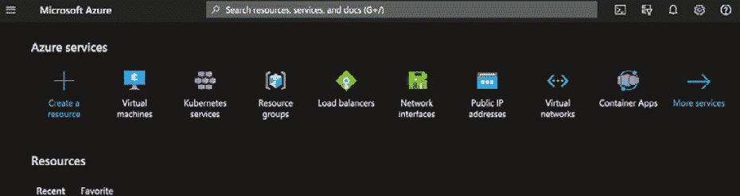

图 2.1 – Azure 门户

1.  搜索 `azure` `kubernetes services`：

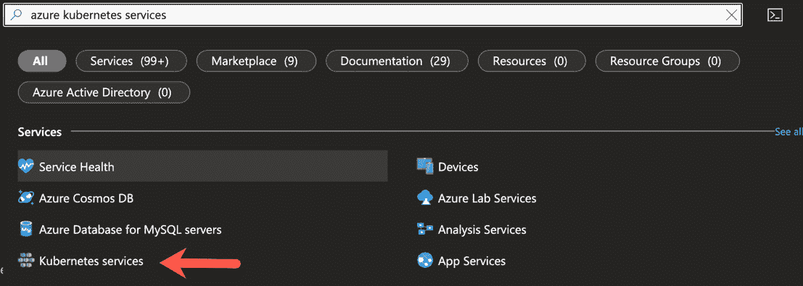

图 2.2 – 搜索 AKS

1.  点击 **创建** 下拉菜单，选择 **创建 Kubernetes** **集群** 选项：

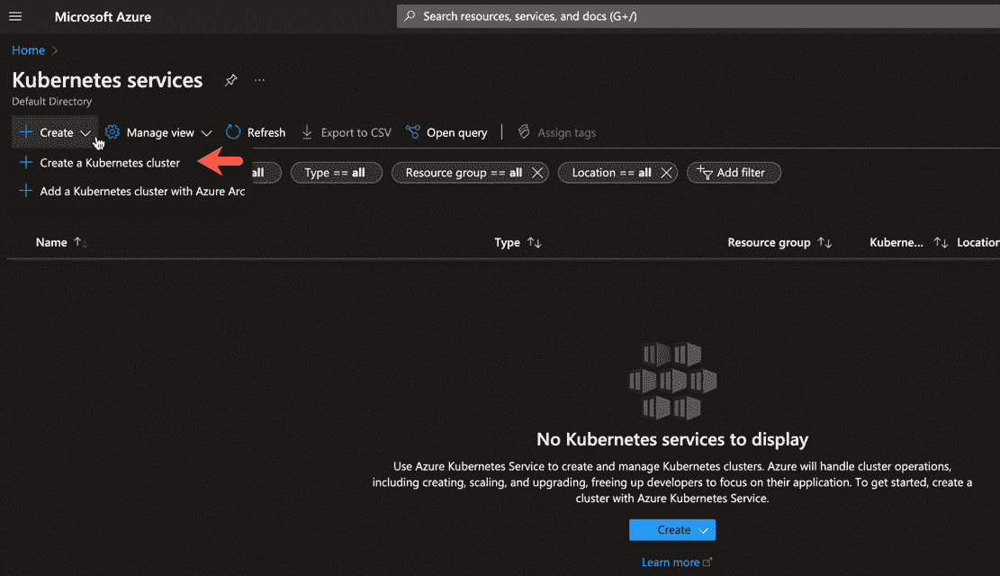

图 2.3 – 创建 AKS 集群

1.  选择 Kubernetes 集群的选项，包括集群的名称和你的 Azure 资源组：

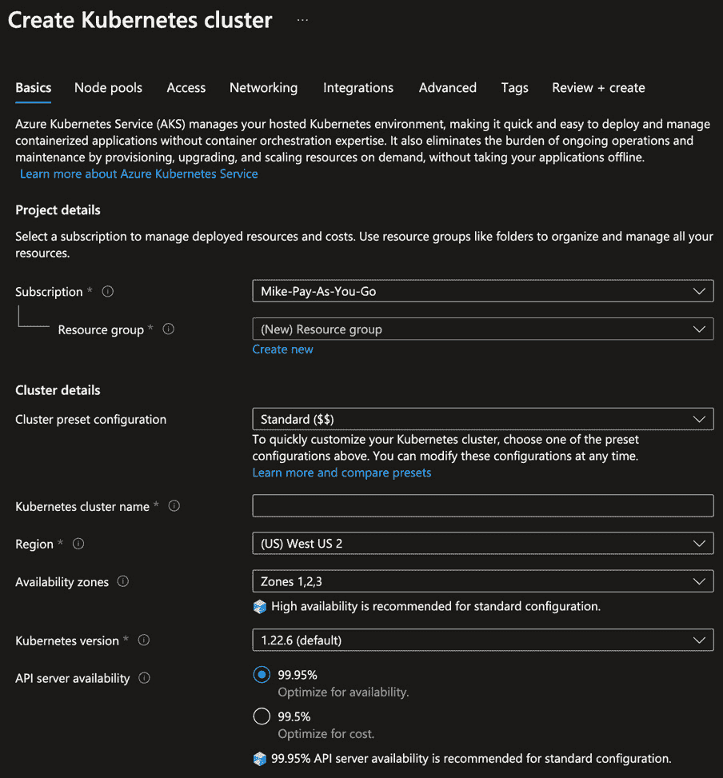

图 2.4 – 在创建集群之前添加集群详细信息

1.  在**主节点池**部分，你可以选择希望为 Kubernetes 工作节点提供的**虚拟机**（**VM**）大小、节点数量以及是否希望启用自动扩展。云 Kubernetes 服务（如 AKS）的一大优势就是自动扩展。在生产环境中，建议根据需要启用自动扩展。然而，你也需要明白这会带来额外的成本，因为会预配置额外的虚拟机。现在暂时保持默认设置，向下滚动到**主节点池**部分：

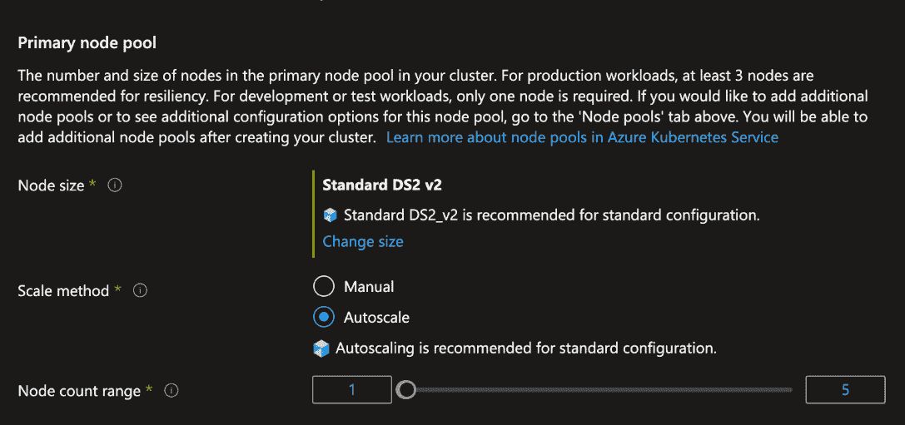

图 2.5 – 指定工作节点大小、节点数量和扩展方法

1.  一旦选择了你的选项，在开发环境中可能只有一个节点，但在生产环境中会有所不同，点击蓝色的**审查 + 创建**按钮。你的 AKS 集群现在已经创建。

现在你知道如何手动创建 AKS 集群了，接下来学习如何使用 Terraform 创建它，以确保你在环境中的过程是可重复的。

## 使用自动化创建 AKS 集群

在许多生产级别的情况下，你将在 CI/CD 管道中运行以下 Terraform 代码以确保可重复性。为了本节的目的，你可以在本地运行它。你首先会看到 `main.tf` 配置文件，然后会查看 `variables.tf`。

让我们逐步解析代码。

首先是 Terraform 提供程序本身。`azurerm` Terraform 提供程序用于通过 API 调用来编程访问 Azure：

```

terraform {
  required_providers {
    azurerm = {
      source  = "hashicorp/azurerm"
    }
  }
}
provider "azurerm" {
  features {}
}
```

接下来是 `azurerm_kubernetes_cluster` Terraform 资源块，用于创建 AKS 集群。这里有几个关键参数，包括名称和 `default_node_pool` 参数块。你可以指定虚拟机大小、节点数量以及节点池名称：

```

resource "azurerm_kubernetes_cluster" "k8squickstart" {
  name                = var.name
  location            = var.location
  resource_group_name = var.resource_group_name
  dns_prefix          = "${var.name}-dns01"
  default_node_pool {
    name       = "default"
    node_count = var.node_count
    vm_size    = "Standard_A2_v2"
  }
  identity {
    type = "SystemAssigned"
  }
  tags = {
    Environment = "Production"
  }
}
```

把所有内容整合在一起，你将拥有一个 Terraform 配置，用于在 Azure 中创建 AKS 集群。

现在你有了 Terraform 配置，接下来需要传入变量。这些变量使你的代码保持可重复性——遵循 **不要重复自己**（**DRY**）原则——这样你就不必不断更改硬编码的值或为每个环境创建新的配置。

有四个变量：

+   `name`：AKS 集群的名称

+   `resource_group_name`：AKS 将所在的资源组

+   `location`：AKS 集群所在的区域

+   `node_count`：AKS 集群中将有多少个 Kubernetes 工作节点

以下代码块中可以看到这些变量：

```

variable "name" {
  type = string
  default = "aksenvironment01"
}
variable "resource_group_name" {
  type = string
  default = "devrelasaservice"
}
variable "location" {
  type = string
  default = "eastus"
}
variable "node_count" {
  type = string
  default = 3
}
```

将 `main.tf` 和 `variables.tf` 配置文件放在同一目录下，将创建一个用于创建 AKS 集群的 Terraform 模块。你可以在几乎任何环境中使用它，根据需要更改配置（例如节点数量），并使你的过程保持可重复。

## 扩展 AKS 集群

扩展 AKS 集群是通过实现 Kubernetes 集群自动扩展器来实现的。就像 Azure 虚拟机的自动扩展组一样，AKS 根据工作节点的负载决定如何以及为什么扩展集群，而工作节点就是后台的 Azure 虚拟机。集群自动扩展器通常会以`cluster-autoscaler`容器镜像的形式部署到 Kubernetes 集群。

登录到 Azure 门户，进入 AKS 服务。在那里，进入**设置** | **节点池**：

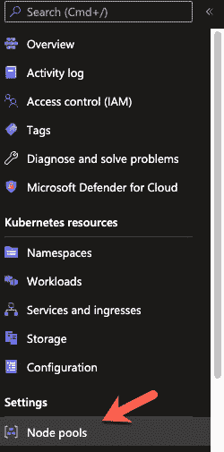

图 2.6 – 节点池设置

按照以下截图点击三个点，然后选择**扩展节点池**选项：

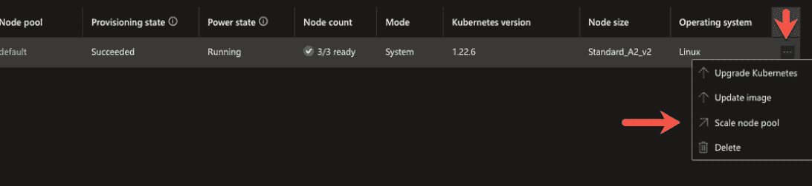

图 2.7 – 扩展节点池

**扩展节点池**窗格会弹出，你将看到自动扩展节点池或手动扩展的选项，并选择你希望提供的节点数量：

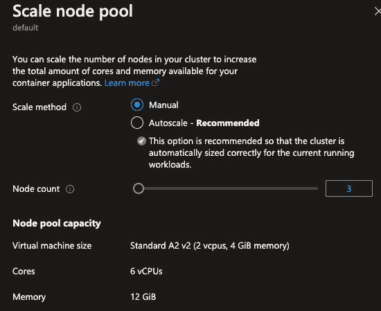

图 2.8 – 指定节点数量和扩展方法

从自动化和可重复性的角度来看，你可以做同样的事情。以下是使用`enable_auto_scaling`参数设置为`true`时，创建`azurerm_kubernetes_cluster_node_pool` Terraform 资源的示例：

```

resource "azurerm_kubernetes_cluster_node_pool" "example" {
  name                  = "internal"
  kubernetes_cluster_id = azurerm_kubernetes_cluster.example.id
  vm_size               = "Standard_DS2_v2"
  node_count            = 1
  enable_auto_scaling = true
  tags = {
    Environment = "Production"
  }
}
```

节点池实际上是作为 Kubernetes 工作节点运行的 Azure 虚拟机。在考虑自动扩展时，记住水平自动扩展是有成本的。虽然它非常必要，但你应该限制可用的 Kubernetes 工作节点数量。这样，你可以跟踪成本以及容器化应用所需的资源。

## AKS 和虚拟 Kubelet

在总结 AKS 时，还有虚拟 Kubelet。虚拟 Kubelet 不是 AKS 特有的。虚拟 Kubelet 允许你将 Kubernetes 连接到其他 API。Kubelet 是运行在每个节点上的节点代理，负责将节点注册到 Kubernetes。AKS 虚拟 Kubelet 注册无服务器容器平台。

在 Azure 中，它是**Azure 容器实例**（**ACI**）。ACI 是一种无需使用 Kubernetes 即可运行容器的方式。如果某个使用 Kubernetes 的人由于成本或管理原因不想扩展工作节点，他们可以使用 ACI 扩展，它使用虚拟 Kubelet。它本质上告诉 Kubernetes 将部署、Pod 和其他工作负载发送到 ACI，而不是将它们保留在本地 Kubernetes 集群中。

现在，ACA 已经 GA，你可能会看到这种类型的实现减少。然而，对于那些想要扩展，但不想管理大型 AKS 集群的团队来说，它仍然是一个很好的用例。

## 管理和维护 AKS 集群

一旦 Kubernetes 集群创建并运行，思维模式将从第一天的运维转向第二天的运维。第二天的运维将专注于以下内容：

+   管理集群

+   监控和维护集群

+   部署应用程序并启动服务

在管理 AKS 集群时，最需要考虑的是配置存放的位置以及你正在使用哪些工具来管理它。例如，Terraform 配置可能存放在 GitHub 中，而你可能通过 Azure Monitor 和 AKS 集群中可用的其他 Azure 配置来管理集群。第二天操作（Day-two Ops）是确保集群和配置按照预期运行。重点实际上是在“*我的环境是否按预期工作并且表现良好*”这个问题上。

在监控、告警和整体可观察性方面，有几个选择。Azure Monitor 和 Azure Insights 已集成在 Azure 中，但如果你有一个多云或混合云环境，你可能需要查看其他选项。此时，Prometheus 和 Grafana 的组合就派上用场了。你选择哪个工具（因为有好几个工具）并不重要，重要的是你监控的内容。你需要同时监控集群本身和集群内的 Kubernetes 资源（例如 Pods、Services 或 Ingresses）。

因为管理 Kubernetes 集群的方式差别不大（除了原生云工具），所以可以安全地假设，无论你使用的是 AKS、EKS 还是 GKE，前进的路径都将是相同的。

# AWS EKS

在使用 AWS 时，你有一些选择可以用来使用容器和 Kubernetes：

+   EKS

+   使用 Fargate 配置文件的 EKS

+   **弹性容器** **服务**（**ECS**）

EKS 是在 AWS 内运行 Kubernetes 工作负载的主要方式。如果你不想走 Kubernetes 路线，但仍然希望具有可扩展性，你可以使用 ECS，它能够让你扩展并创建可靠的微服务，但无需使用 Kubernetes。

与 AKS 一样，在 EKS 中，你无需担心管理控制平面或 API 服务器。你只需要关注管理和扩展工作节点。如果你愿意，你甚至可以更进一步，使用 Fargate 配置文件实现 EKS，它将控制平面或 API 服务器以及工作节点抽象化，确保实现一个完全的 *无服务器* *Kubernetes* 体验。

与 AKS 一样，在接下来的几个部分中，你将首先学习如何手动创建 EKS 集群。之后，你将从手动角度学到的内容自动化使用 Terraform。然后，你将学习如何从垂直自动扩展的角度扩展 EKS 集群。最后，你将结束于无服务器 Kubernetes。

## 手动创建 EKS 集群

与 AKS 集群类似，在从自动化角度创建 EKS 集群之前，你必须学习如何手动部署它们。在本节中，你将学习如何在 AWS 控制台中使用节点组部署 EKS 集群：

1.  登录 AWS 门户并搜索 EKS 服务：

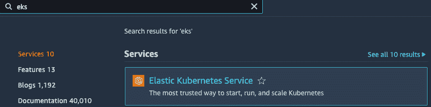

图 2.9 – AWS 门户

1.  点击橙色的 **添加集群** 按钮并选择 **创建** 选项：

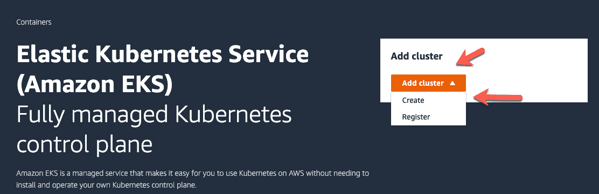

图 2.10 – 添加集群

1.  配置 EKS 集群时，您需要提供一些选项来唯一标识它，包括以下内容：

    +   EKS 集群名称

    +   Kubernetes API 版本

    +   IAM 角色

IAM 角色非常重要，因为必须将特定的策略附加到分配给 EKS 集群的角色。这些策略包括以下内容：

+   `AmazonEC2ContainerRegistryReadOnly`

+   `AmazonEKSClusterPolicy`

没有前述策略，EKS 集群将无法按预期工作：

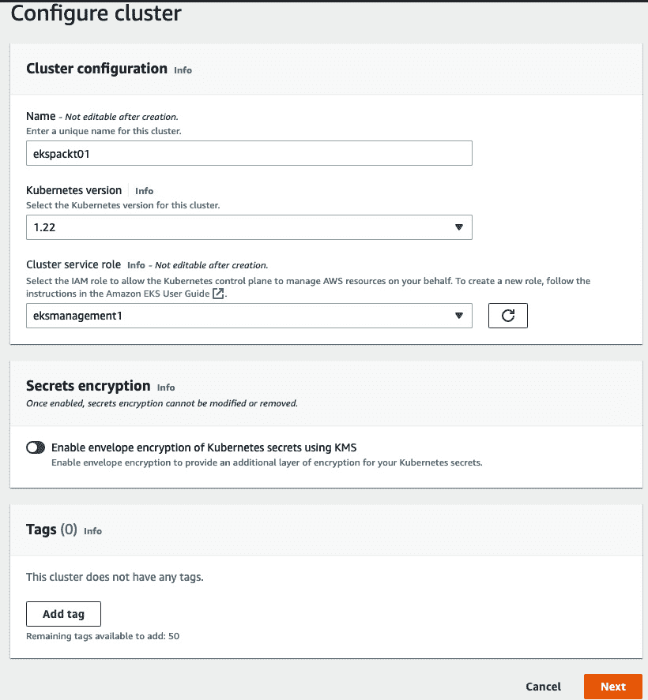

图 2.11 – 配置集群

1.  接下来，您需要设置网络。您希望使用的最少子网数量是两个公共子网，这些子网在不同的可用区中具有不同的 CIDR。有关完整的推荐列表，请查看 AWS 文档（[`docs.aws.amazon.com/eks/latest/userguide/network_reqs.html`](https://docs.aws.amazon.com/eks/latest/userguide/network_reqs.html)）：

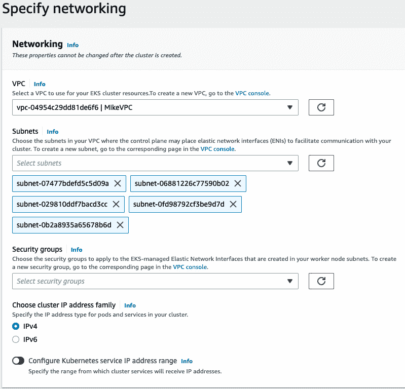

图 2.12 – 指定网络配置

1.  在配置集群端点访问时，您有三个选项：

    +   **公共**意味着 EKS 集群基本上对外开放

    +   **公共和私有**意味着 API 服务器或控制平面对外部开放，但工作节点流量将保持内部。

    +   **私有**意味着 EKS 集群仅在 AWS **虚拟私有** **云**（**VPC**）内部可用：

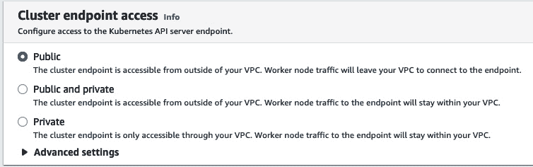

图 2.13 – 配置集群 API 访问

1.  从网络角度来看，最后一步是选择**容器网络接口**（**CNI**）和 CoreDNS 的版本。选择最新版本通常是最合适的：

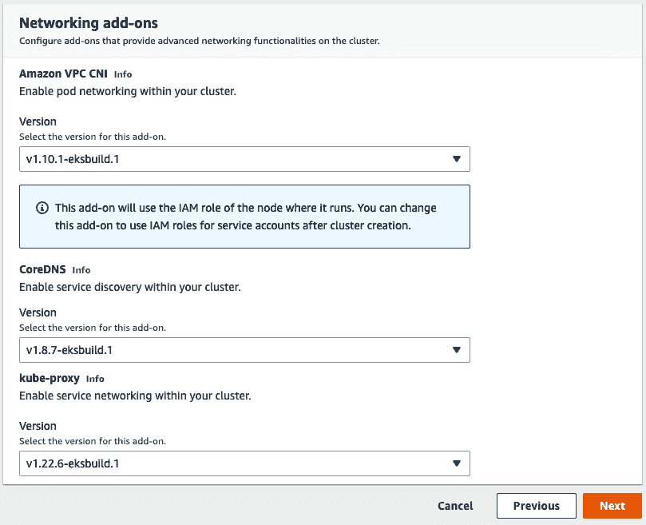

图 2.14 – 网络附加组件

1.  点击橙色的**下一步**按钮。

1.  创建 EKS 集群的最后一步是 API 日志记录。无论您计划将日志、追踪和指标保存在何处，从可观察性角度来看，如果您希望集群记录任何类型的日志，都必须将此选项设置为*开启*：

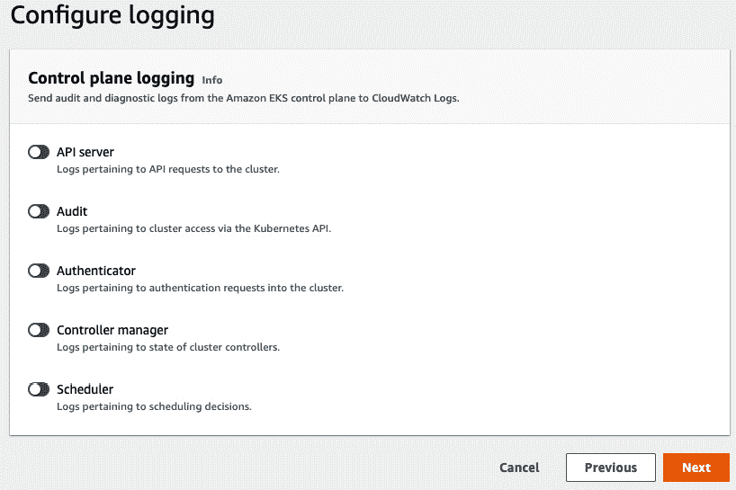

图 2.15 – 配置可观察性

1.  选择日志选项后，点击橙色的**下一步**按钮，您将进入最后一页，审核并创建您的 EKS 集群。

现在您已经了解了如何手动创建 EKS 集群，是时候学习如何使用 Terraform 创建它，以确保在您的环境中实现可重复的流程。

## 使用 Terraform 创建 EKS 集群

在许多生产级案例中，您将在 CI/CD 流水线中运行以下 Terraform 代码，以确保可重复性。对于本节的目的，您可以在本地运行它。

首先，您将看到`main.tf`配置，然后查看`variables.tf`。

因为 AWS EKS 的 `main.tf` 配置比 EKS 本身要长得多，所以我们将其分成几个部分，以便更容易理解：

1.  首先是 Terraform 提供者块。为了确保整个团队的可重复性，你可以使用 S3 存储桶作为 `TFSTATE` 的后端。Terraform 块还包括 AWS Terraform 提供者：

    ```

    terraform {
    ```

    ```

      backend "s3" {
    ```

    ```

        bucket = "terraform-state-k8senv"
    ```

    ```

        key    = "eks-terraform-workernodes.tfstate"
    ```

    ```

        region = "us-east-1"
    ```

    ```

      }
    ```

    ```

      required_providers {
    ```

    ```

        aws = {
    ```

    ```

          source = "hashicorp/aws"
    ```

    ```

        }
    ```

    ```

      }
    ```

    ```

    }
    ```

1.  接下来，创建第一个资源。该资源允许将 IAM 角色附加到 EKS 集群。为了让 EKS 访问 AWS 的各种组件和服务以及工作节点，需要附加一些策略：

    ```

    resource "aws_iam_role" "eks-iam-role" {
    ```

    ```

      name = "k8squickstart-eks-iam-role"
    ```

    ```

      path = "/"
    ```

    ```

      assume_role_policy = <<EOF
    ```

    ```

    {
    ```

    ```

      "Version": "2012-10-17",
    ```

    ```

      "Statement": [
    ```

    ```

        {
    ```

    ```

          "Effect": "Allow",
    ```

    ```

          "Principal": {
    ```

    ```

            "Service": "eks.amazonaws.com"
    ```

    ```

          },
    ```

    ```

          "Action": "sts:AssumeRole"
    ```

    ```

        }
    ```

    ```

      ]
    ```

    ```

    }
    ```

    ```

    EOF
    ```

    ```

    }
    ```

1.  在 IAM 角色后面是需要附加到角色的 IAM 策略。成功部署 EKS 所需的两项策略如下：

    +   `AmazonEKSClusterPolicy`：为 Kubernetes 提供所需的权限，以便代表你管理资源：

        ```

        resource "aws_iam_role_policy_attachment" "AmazonEKSClusterPolicy" {
        ```

        ```

          policy_arn = "arn:aws:iam::aws:policy/AmazonEKSClusterPolicy"
        ```

        ```

          role       = aws_iam_role.eks-iam-role.name
        ```

        ```

        }
        ```

    +   `AmazonEC2ContainerRegistryReadOnly`：如果你决定将容器镜像放置在 Elastic Container Registry 中，这个策略将提供只读访问权限：

        ```

        resource "aws_iam_role_policy_attachment" "AmazonEC2ContainerRegistryReadOnly-EKS" {
        ```

        ```

          policy_arn = "arn:aws:iam::aws:policy/AmazonEC2ContainerRegistryReadOnly"
        ```

        ```

          role       = aws_iam_role.eks-iam-role.name
        ```

        ```

        }
        ```

1.  一旦定义了 IAM 角色和策略，就该创建 EKS 集群本身了。EKS 集群资源将创建 EKS 本身，启用日志记录，并附加你之前创建的 IAM 角色：

    ```

    resource "aws_eks_cluster" "k8squickstart-eks" {
    ```

    ```

      name = "k8squickstart-cluster"
    ```

    ```

      role_arn = aws_iam_role.eks-iam-role.arn
    ```

    ```

      enabled_cluster_log_types = ["api", "audit", "scheduler", "controllerManager"]
    ```

    ```

      vpc_config {
    ```

    ```

        subnet_ids = [var.subnet_id_1, var.subnet_id_2]
    ```

    ```

      }
    ```

    ```

      depends_on = [
    ```

    ```

        aws_iam_role.eks-iam-role,
    ```

    ```

      ]
    ```

    ```

    }
    ```

1.  下一个资源是另一个 IAM 角色，用于工作节点。创建 EKS 集群时，你将创建多个资源，因为你正在创建两套服务：

    +   EKS 集群本身及其所需的所有权限和策略：

    +   Kubernetes 工作节点具备所需的所有权限和策略：

        ```

        resource "aws_iam_role" "workernodes" {
        ```

        ```

          name = "eks-node-group-example"
        ```

        ```

          assume_role_policy = jsonencode({
        ```

        ```

            Statement = [{
        ```

        ```

              Action = "sts:AssumeRole"
        ```

        ```

              Effect = "Allow"
        ```

        ```

              Principal = {
        ```

        ```

                Service = "ec2.amazonaws.com"
        ```

        ```

              }
        ```

        ```

            }]
        ```

        ```

            Version = "2012-10-17"
        ```

        ```

          })
        ```

        ```

        }
        ```

1.  一旦创建了工作节点的 IAM 角色，接下来需要附加一些策略：

    +   `AmazonEKSWorkerNodePolicy`：为 Kubernetes 提供所需的权限，以便代表你管理资源：

        ```

        resource "aws_iam_role_policy_attachment" "AmazonEKSWorkerNodePolicy" {
        ```

        ```

          policy_arn = "arn:aws:iam::aws:policy/AmazonEKSWorkerNodePolicy"
        ```

        ```

          role       = aws_iam_role.workernodes.name
        ```

        ```

        }
        ```

    +   `AmazonEKS_CNI_Policy`：为 Kubernetes 内部网络（kubeproxy）附加 CNI 策略：

        ```

        resource "aws_iam_role_policy_attachment" "AmazonEKS_CNI_Policy" {
        ```

        ```

          policy_arn = "arn:aws:iam::aws:policy/AmazonEKS_CNI_Policy"
        ```

        ```

          role       = aws_iam_role.workernodes.name
        ```

        ```

        }
        ```

    +   `EC2InstanceProfileForImageBuilderECRContainerBuilds`：EC2 Image Builder 使用服务关联角色授权其他 AWS 服务代表你执行操作：

        ```

        resource "aws_iam_role_policy_attachment" "EC2InstanceProfileForImageBuilderECRContainerBuilds" {
        ```

        ```

          policy_arn = "arn:aws:iam::aws:policy/EC2InstanceProfileForImageBuilderECRContainerBuilds"
        ```

        ```

          role       = aws_iam_role.workernodes.name
        ```

        ```

        }
        ```

    +   `AmazonEC2ContainerRegistryReadOnly`：如果你决定将容器镜像放在 Elastic Container Registry 中，这个策略将提供只读访问权限：

        ```

        resource "aws_iam_role_policy_attachment" "AmazonEC2ContainerRegistryReadOnly" {
        ```

        ```

          policy_arn = "arn:aws:iam::aws:policy/AmazonEC2ContainerRegistryReadOnly"
        ```

        ```

          role       = aws_iam_role.workernodes.name
        ```

        ```

        }
        ```

    +   `CloudWatchAgentServerPolicy`：允许工作节点运行 CloudWatch 代理进行监控、日志记录、追踪和指标收集：

        ```

        resource "aws_iam_role_policy_attachment" "CloudWatchAgentServerPolicy-eks" {
        ```

        ```

          policy_arn = "arn:aws:iam::aws:policy/CloudWatchAgentServerPolicy"
        ```

        ```

          role       = aws_iam_role.workernodes.name
        ```

        ```

        }
        ```

1.  创建 IAM 角色和策略后，最后一步是创建 EKS 节点组资源，也就是 Kubernetes 工作节点。你将定义以下内容：

    +   IAM 角色和子网 ID：

        ```

        resource "aws_eks_node_group" "worker-node-group" {
        ```

        ```

          cluster_name    = aws_eks_cluster.k8squickstart-eks.name
        ```

        ```

          node_group_name = "k8squickstart-workernodes"
        ```

        ```

          node_role_arn   = aws_iam_role.workernodes.arn
        ```

        ```

          subnet_ids      = [var.subnet_id_1, var.subnet_id_2]
        ```

        ```

          instance_types = ["t3.xlarge"]
        ```

    +   自动扩展所需的目标规模大小：

        ```

          scaling_config {
        ```

        ```

            desired_size = 3
        ```

        ```

            max_size     = 4
        ```

        ```

            min_size     = 2
        ```

        ```

          }
        ```

    +   资源所依赖的策略：

        ```

          depends_on = [
        ```

        ```

            aws_iam_role_policy_attachment.AmazonEKSWorkerNodePolicy,
        ```

        ```

            aws_iam_role_policy_attachment.AmazonEKS_CNI_Policy,
        ```

        ```

          ]
        ```

        ```

        }
        ```

1.  现在你已经有了 Terraform 配置，你需要传入变量。变量让你的代码保持可重复性，这样你就不需要不断更改硬编码值或为每个环境创建新的配置：

你需要的两个变量是你选择的 VPC 中的子网 ID，这些子网将与 EKS 一起使用。你可以传入两个位于不同可用区的公共子网 ID：

```

variable "subnet_id_1" {
  type = string
  default = ""
}
variable "subnet_id_2" {
  type = string
  default = ""
}
```

综合来看，你将拥有一个 Terraform 配置，它创建了一个 AKS 集群。

## 扩展 EKS 集群

扩展 EKS 集群的可能性是通过实现 Kubernetes 集群自动扩展器（Cluster Autoscaler）来实现的。与自动扩展 EC2 实例类似，EKS 根据负载的视角决定如何以及为何扩展集群。集群自动扩展器通常使用 `cluster-autoscaler` 容器镜像部署到 Kubernetes 集群中。

在 Kubernetes 的 GitHub 仓库中，`cluster-autoscaler` 目录下有一个云提供商列表。其中一个云提供商是 AWS。在 AWS 目录下，有一个名为 `cluster-autoscaler-autodiscover.yaml` 的 Kubernetes Manifest 示例，显示它正在使用 `cluster-autoscaler` 容器镜像。它作为 Kubernetes Deployment 运行在你的集群上，并监听某些资源限制。为了自动扩展集群，你需要一个附加了 `AmazonEKSClusterAutoscalerPolicy` 策略的 IAM 角色。

现在你了解了如何通过 `cluster-autoscaler` 扩展 EKS 集群，并知道了如何实现，接下来让我们来谈谈 AWS Fargate 配置文件的无服务器 Kubernetes，以及它们如何帮助自动化日常操作。

## EKS Fargate 配置文件

关于 Fargate 配置文件的内容与 AKS 虚拟 Kubelet 和 ACI 爆发类似。然而，你不需要像在 AKS 中那样手动部署虚拟 Kubelet。相反，你可以设置 Fargate 配置文件，作为你的 Kubernetes 工作节点。虚拟 Kubelet 仍然在 Fargate 上运行，与 EKS API 服务器或控制平面交互，但这一切几乎是自动完成的。

这里最大的区别在于，你不需要管理工作节点。相反，Fargate 配置文件就像是无服务器 Kubernetes。你部署的是 EKS 集群，它是 API 服务器或控制平面。然后，你部署一个 Fargate 配置文件，这是你的 Kubernetes 资源（例如，Deployments、Pods 和 Services）运行的地方。你不需要担心集群管理或维护 EC2 实例，后者通常作为 Kubernetes 工作节点运行。

要在 EKS 集群上添加 Fargate 配置文件，你进入 EKS 集群的 **计算** 选项卡，然后你会看到一个添加或创建 Fargate 配置文件的选项，如下图所示：

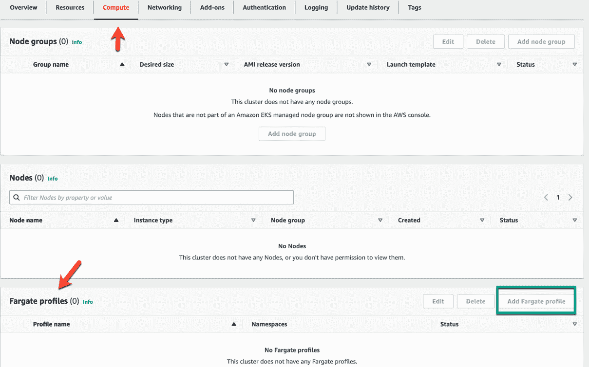

图 2.16 – Fargate 配置文件和计算

现在你知道如何手动和自动创建 EKS 集群，并且熟悉了自动扩展和无服务器 Kubernetes 的日二操作考虑事项，接下来是时候学习最后一个 *大 3* Kubernetes 服务 —— GKE。

# GKE

当你使用 GCP 时，在使用容器和 Kubernetes 时，你有几个选项可以选择：

+   GKE

+   GKE 自动驾驶

+   Google Cloud Run

GKE 是在 GCP 内部运行 Kubernetes 工作负载的主要方式。如果您不想走 Kubernetes 路线，但仍然希望具备可扩展性，您可以使用 Google Cloud Run。Cloud Run 使您能够扩展并创建可靠的微服务，但无需 Kubernetes。它支持 Node.js、Go、Java、Kotlin、Scala、Python、.NET 和 Docker。

与 AKS 和 EKS 一样，使用 GKE 时，您无需担心管理控制平面或 API 服务器。您只需要关注管理和扩展工作节点。如果您愿意，您甚至可以进一步实施 GKE Autopilot，它将控制平面和 API 服务器以及工作节点抽象化，从而确保一个完全的 *无服务器* *Kubernetes* 体验。

在容器和 DevOps 社区中，关于哪种云端 Kubernetes 服务是更优选择的讨论一直不断。虽然我们不打算站队，但很多工程师钟爱 GKE，并认为它是实现 Kubernetes 的一种卓越方式。由于 Kubernetes 起源于 Google，因此 GKE 服务在具有深思熟虑的特性和实现上，肯定是非常可靠的。

在以下部分，您将学习如何使用 Terraform 自动创建 GKE 集群，并了解如何通过 GKE Autopilot 思考无服务器 Kubernetes。

重要提示

我们跳过了关于 GKE 集群扩展的部分，因为它与其他云的概念相同。它在后台使用 Kubernetes Autoscaler。所有的自动扩展器都被视为水平自动扩展器，因为它们创建新的工作节点或虚拟机来运行 Kubernetes 工作负载。

## 使用 Terraform 创建 GKE 集群

在本章中，您已经学习了几种在云中创建 Kubernetes 集群的手动方式。与其继续沿着手动操作的路走，不如直接开始使用 Terraform 自动化创建 GKE 集群的可重复过程。

使用 GKE，您会发现与 EKS 等相比，它所需的代码要少得多。首先，您会看到 `main.tf` 配置文件，然后查看 `variables.tf` 文件。让我们解析以下代码：

1.  首先，您需要使用 Google Terraform 提供程序，在其中指定您要部署 GKE 集群的 GCP 项目 ID 和区域：

    ```

    provider "google" {
    ```

    ```

      project     = var.project_id
    ```

    ```

      region      = var.region
    ```

    ```

    }
    ```

1.  接下来，您将创建 `google_container_cluster` 资源，即 GKE 集群。它将指定集群名称、区域和工作节点数：

    ```

    resource "google_container_cluster" "primary" {
    ```

    ```

      name     = var.cluster_name
    ```

    ```

      location = var.region
    ```

    ```

      remove_default_node_pool = true
    ```

    ```

      initial_node_count       = 1
    ```

    ```

      network    = var.vpc_name
    ```

    ```

      subnetwork = var.subnet_name
    ```

    ```

    }
    ```

1.  最终要创建的资源是 `google_container_node_pool` 资源，它用于创建 Kubernetes 工作节点。在这里，您可以指定：

    +   工作节点数量：

        ```

        resource "google_container_node_pool" "nodes" {
        ```

        ```

          name       = "${google_container_cluster.primary.name}-node-pool"
        ```

        ```

          location   = var.region
        ```

        ```

          cluster    = google_container_cluster.primary.name
        ```

        ```

          node_count = var.node_count
        ```

    +   您希望 GKE 拥有访问权限的 GCP 范围（或服务）：

        ```

          node_config {
        ```

        ```

            oauth_scopes = [
        ```

        ```

              "https://www.googleapis.com/auth/logging.write",
        ```

        ```

              "https://www.googleapis.com/auth/monitoring",
        ```

        ```

            ]
        ```

        ```

            labels = {
        ```

        ```

              env = var.project_id
        ```

        ```

            }
        ```

    +   虚拟机类型或大小：

        ```

            machine_type = "n1-standard-1"
        ```

        ```

            tags         = ["gke-node", "${var.project_id}-gke"]
        ```

        ```

            metadata = {
        ```

        ```

              disable-legacy-endpoints = "true"
        ```

        ```

            }
        ```

        ```

          }
        ```

        ```

        }
        ```

将所有内容结合在一起，您将拥有一个 `main.tf` 配置文件，可以用来设置 GKE 集群。

1.  接下来，让我们看看 `variables.tf`，它将包含以下内容：

    +   GCP 项目 ID：

        ```

        variable "project_id" {
        ```

        ```

          type = string
        ```

        ```

          default = "gold-mode-297211"
        ```

        ```

        }
        ```

    +   GCP 区域：

        ```

        variable "region" {
        ```

        ```

          type = string
        ```

        ```

          default = "us-east1"
        ```

        ```

        }
        ```

    +   GKE 所在的 GCP VPC 名称：

        ```

        variable "vpc_name" {
        ```

        ```

          type = string
        ```

        ```

          default = "default"
        ```

        ```

        }
        ```

    +   你希望 GKE 附加到的 VPC 内子网名称：

        ```

        variable "subnet_name" {
        ```

        ```

          type = string
        ```

        ```

          default = "default"
        ```

        ```

        }
        ```

    +   代码计数（Kubernetes 工作节点）：

        ```

        variable "node_count" {
        ```

        ```

          type = string
        ```

        ```

          default = 2
        ```

        ```

        }
        ```

    +   GKE 集群名称：

        ```

        variable "cluster_name" {
        ```

        ```

          type = string
        ```

        ```

          default = "gkek8senv"
        ```

        ```

        }
        ```

你现在可以将接下来的代码放入适当的 `main.tf` 和 `variables.tf` 配置文件中，以创建你的 GKE 环境。

## GKE 自动驾驶模式

为了总结 *GKE* 部分，我们快速讨论一下 GKE 自动驾驶模式。自动驾驶模式和 EKS Fargate 的概念相同。它是无服务器 Kubernetes，这意味着你不必担心管理 GKE 集群的工作节点。相反，你只需关注部署应用程序，并设置任何你希望从 GKE 集群捕获的监控、日志、追踪、警报和指标。

## 关于多云的一点说明

很多刚开始接触 Kubernetes 的工程师可能不会遇到太多相关问题，但多云环境确实是现实存在的。就像组织不希望仅依赖一个数据中心进行冗余一样，有些组织也不希望仅依赖一个云进行冗余。相反，他们希望考虑多云方法——例如，将 Kubernetes 工作负载从 AKS 扩展到 GKE。

这个实现可能相当复杂，需要大量的与安全相关的权限、跨云的认证和授权能力，以及大量的网络知识，以确保不同云之间的 Kubernetes 集群能够相互通信。因此，强烈建议在实施之前进行充分的研究，并确保所有适当的测试都按预期进行。

# 总结

虽然多云方法可能不是每个人都关注的焦点，但理解三大云如何与 Kubernetes 一起工作依然非常关键。原因在于，几乎可以肯定，在你使用 Kubernetes 的过程中，你可能会先在一个云中工作，但当需要使用其他云时，你应该做好准备。

在本章中，你学习了如何在 Azure、AWS 和 GCP 中设置、管理和维护 Kubernetes 集群。最大的收获之一是，最终在多个云中设置 Kubernetes 并没有太大区别。它们基本上是在做相同的事情，只是服务名称不同。

# 进一步阅读

+   *构建 Google 云平台解决方案* 由 Ted Hunter、Steven Porter 和 Legorie Rajan PS 编写：

[`www.packtpub.com/product/building-google-cloud-platform-solutions/9781838647438`](https://www.packtpub.com/product/building-google-cloud-platform-solutions/9781838647438)

+   *在 Azure 上实践 Kubernetes – 第二版* 由 Nills Franssens、Shivakumar Gopalakrishnan 和 Gunther Lenz 编写：

[`www.packtpub.com/product/hands-on-kubernetes-on-azure-second-edition/9781800209671`](https://www.packtpub.com/product/hands-on-kubernetes-on-azure-second-edition/9781800209671)

+   *学习 AWS – 第二版* 由 Aurobindo Sarkar 和 Amit Shah 编写：

[`www.packtpub.com/product/learning-aws-second-edition/9781787281066`](https://www.packtpub.com/product/learning-aws-second-edition/9781787281066)
