# 3

# 与其他云服务伙伴一起运行 Kubernetes

很可能在本书的整个过程中，甚至到目前为止，你会因为发现有那么多地方和不同的方式可以部署 Kubernetes 而感到目不暇接。现实是，在实际工作中，你将会遇到更多这种“鞭打”的情况。无论你是全职 Kubernetes 工程师还是顾问，每个你去的公司，在部署 Kubernetes 的方式和地点上都会有所不同。

在上一章中，你了解了三大 Kubernetes 云服务——AKS、EKS 和 GKE。然而，在私有云和**平台即服务**（**PaaS**）解决方案中，仍有许多其他出色的选项。虽然你会看到许多组织，从初创公司到财富 200 强及以上，都在使用流行的 Kubernetes 云服务，如 AKS、EKS 和 GKE，但越来越多的组织开始为次级 Kubernetes 集群使用私有云，甚至是为了节省成本，因为大型云服务提供商通常价格更高。更进一步，一些组织完全放弃了在云中部署 Kubernetes 集群的想法，转而使用 PaaS，接下来的章节会向你解释原因。

在本章结束时，结合上一章的内容，你将能够确定你的组织应该选择哪种解决方案，并理解其使用价值。从个人角度来看，你将掌握多种托管 Kubernetes 服务的知识。这样，你在求职市场中将更具竞争力，并能够使用所有不同的平台。

在本章中，我们将涵盖以下主题：

+   理解 Linode Kubernetes 引擎

+   探索 DigitalOcean 托管 Kubernetes

+   什么是 Kubernetes PaaS，它与其他服务有何不同？

# 技术要求

对于本章，你应该已经了解一些云技术。关键是所有的云服务或多或少都是相同的。服务名称上有所不同，但它们做的事情基本相同。

如果你对云服务已经比较熟悉，并且曾在一些云服务平台上工作过，那么你在阅读本章时会非常顺利。

要在云服务中工作，你将需要以下内容：

+   一个 Linode 账户

+   一个 DigitalOcean 账户

+   一个 Red Hat 账户

+   一个 AWS 账户（用于本章的最后部分）

你可以注册所有这些服务并获得免费额度。只需确保在完成操作后关闭 Kubernetes 环境以节省费用。

本章的代码可以在本书的 GitHub 仓库找到，地址是[`github.com/PacktPublishing/50-Kubernetes-Concepts-Every-DevOps-Engineer-Should-Know/tree/main/Ch3`](https://github.com/PacktPublishing/50-Kubernetes-Concepts-Every-DevOps-Engineer-Should-Know/tree/main/Ch3)。

# 理解 Linode Kubernetes 引擎

Linode，最近被 Akami Technologies 收购，是一个开发者友好的私有云平台，因其简洁的仪表盘和功能丰富的平台而广为人知，同时又不会过于复杂。Linode 专注于易用性，秉持“为所有人提供云服务”的理念。Linode 的一些关键特点包括透明定价，几乎无需猜测，工作负载易于扩展，提供完整/公开的 API，以及基于图形界面的云管理器。最重要的是，Linode 以其*始终有人*的客户支持而闻名。

在比较 Linode 与其他私有云提供商时，Linode 通过提供云 GPU 和高速的出站传输速率，以及出色的客户支持脱颖而出。

在本节中，你将了解为什么你要使用**Linode Kubernetes Engine**（**LKE**），以及如何设置 LKE 门户、手动创建 LKE 中的 Kubernetes 集群、将相同的手动过程自动化，并部署你的 Kubernetes 工作负载。

## 为什么选择 LKE？

当你选择云服务时，最后你不希望的事情就是不得不猜测每月账单的金额。这也是人们对云服务以及无服务器技术感到担忧的原因。月度费用可能是未知的，这对于 CFO 来说并不是一个最佳答案。使用 Linode 时，费用是捆绑在一起的，所以你确切知道自己要为哪些服务付费，这对于账单管理员和工程师来说都非常重要。在扩展方面，无论是水平扩展还是垂直扩展，任何工程师都不希望需要坐下来手动计算环境每月会给公司带来多少费用。

另一个显著的成本节省来源是控制平面。与任何 Kubernetes 云服务类似，思想是将 Kubernetes 控制平面/API 服务器抽象化，这样你就不需要担心管理除工作节点和应用程序外的其他任何事情。Linode 不收取控制平面费用，而其他云服务提供商则收取。例如，EKS 和 GKE 每个集群的管理费用为每小时 $10 或每月 $73.00。虽然这看起来不多，但对于那些依靠启动资金并且账单已够多的初创公司来说，他们可能不想再增加一项费用。

## 手动设置 LKE

现在，你已经了解了选择 Linode 的背后理论，以及一些定价指标和其他使 Linode 优秀的方面，是时候亲自动手，了解如何设置 LKE 了。

在本节中，确保你已通过选择的网页浏览器登录到 Linode。按照以下步骤操作：

1.  在 Linode 仪表盘中，选择**Kubernetes**：

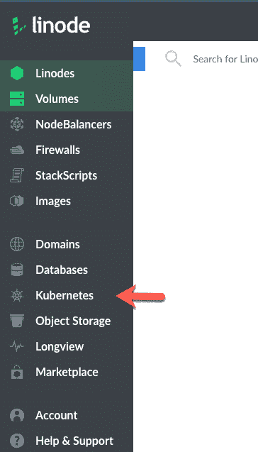

图 3.1 – LKE 门户

1.  点击蓝色的**创建** **集群**按钮：

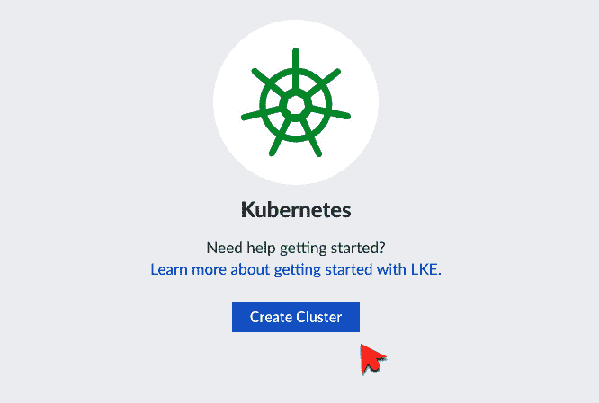

图 3.2 – 创建集群按钮

1.  选择你的集群名称、LKE 集群所在的区域/位置，以及 Kubernetes API 版本：

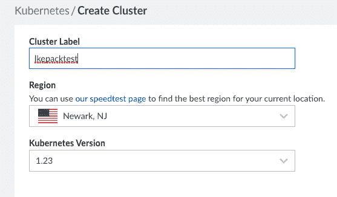

图 3.3 – 添加集群标签、区域和 Kubernetes 版本

1.  在选择节点池时，你有几个选项：

    +   **专用 CPU**：适用于对一致性性能要求较高的工作负载，尤其是日常工作流程

    +   **共享 CPU**：适用于中等工作负载，如秘密引擎（流量较小的应用）

    +   **高内存**：适用于对内存要求高的应用程序，如较旧的 Java 应用程序、内存数据库和缓存数据

对于这一部分，你可以选择**共享 CPU**，因为它是最具成本效益的：

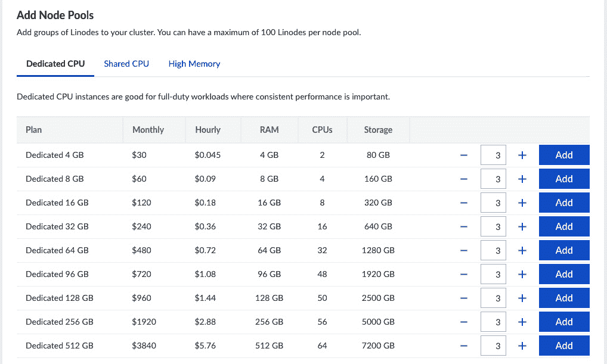

图 3.4 – 工作节点大小

1.  为了保持成本效益，选择**Linode 2 GB**选项，并确保将其缩减为*1*个节点：

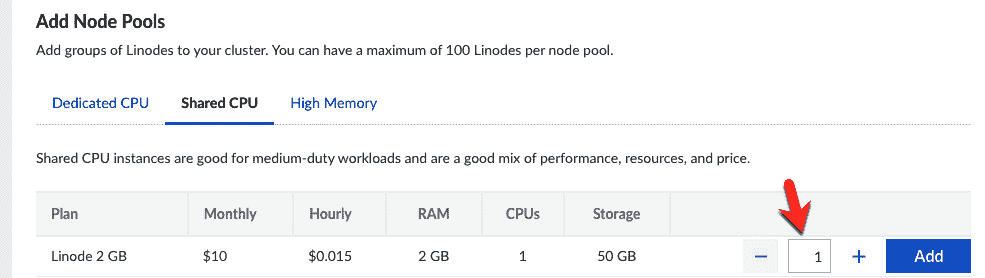

图 3.5 – 添加节点池页面

1.  在任何生产级环境中，你总是要考虑**高可用性**（**HA**）。对于 Kubernetes 来说也不例外。LKE 提供了启用 Kubernetes 控制平面的 HA 功能。对于生产环境，你 100%会想要实现这一点。而对于实验/开发环境（即你现在为了学习而构建的环境），你不必启用 HA。完成后，点击蓝色的**创建** **集群**按钮：

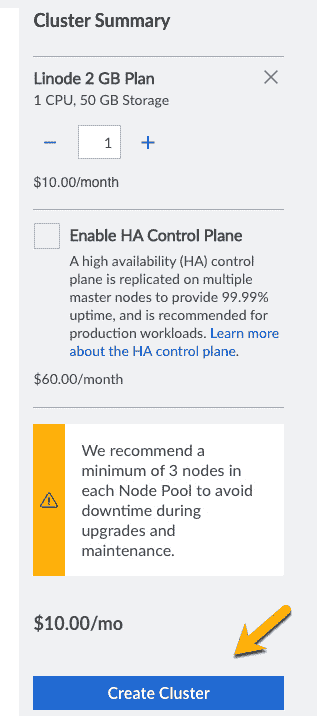

图 3.6 – HA 控制平面

现在你已经熟悉了手动创建 LKE 集群的过程，是时候学习如何将其自动化，并使该过程在生产级环境中可重复。

## 自动化 LKE 部署

现在你知道如何手动创建 LKE 集群，是时候学习如何使用 Terraform 创建它，以确保在你的环境中实现可重复的过程。在许多生产级案例中，你将在 CI/CD 管道中运行以下 Terraform 代码，以确保可重复性。对于这一部分，你可以在本地运行它。

首先，你会看到`main.tf`配置，然后查看`variables.tf`。

首先是 Terraform 提供程序。该提供程序将使用最新版本的 Linode Terraform 提供程序。为了让 Terraform 与 Linode API 进行交互，你需要传入一个 API 密钥，该密钥可以在你的 Linode 账户中创建：

```

terraform {
  required_providers {
    linode = {
      source = "linode/linode"
    }
  }
}
provider "linode" {
  token = var.token
}
```

接下来是`linode_lke_cluster`资源，它将创建 LKE 集群。在动态块内，你会看到一个`for_each`循环，指定了基于池数量将创建多少个工作节点。池数量是你希望部署的工作节点的数量（建议生产环境中设置为 3 到 4 个）：

```

resource "linode_lke_cluster" "packtlke" {
    k8s_version = var.apiversion
    region = var.region
    dynamic "pool" {
        for_each = var.pools
        content {
            type  = pool.value["type"]
            count = pool.value["count"]
        }
    }
}
```

最后一段代码是`kubeconfig`的输出，其中包含所有用于连接 Kubernetes 集群的身份验证和授权配置：

```

output "kubeconfig" {
   value = linode_lke_cluster.packtlke.kubeconfig
   sensitive = true
}
```

现在你已经有了主要的 Terraform 配置，你还需要传递一些变量。这些变量使得你的代码保持可重复性，这样你就不必不断地更改硬编码的值或为每个环境创建新的配置。之所以这么做，是因为由于格式问题，在你阅读本章时，它可能会显得有些不寻常。

在这一部分，你可以在 GitHub 上查看变量，地址是 [`github.com/PacktPublishing/50-Kubernetes-Concepts-Every-DevOps-Engineer-Should-Know/blob/main/Ch3/LKE/variables.tf`](https://github.com/PacktPublishing/50-Kubernetes-Concepts-Every-DevOps-Engineer-Should-Know/blob/main/Ch3/LKE/variables.tf)。

尽管这些都是标准的 Terraform 变量，不需要太多解释，但有一个变量需要特别注意，那就是`pools`变量。请注意，变量指定了列表类型，其中包括 Linode 上工人节点的数量和大小。之所以将变量设为列表类型，是因为在`main.tf`配置中，`dynamic “pool”`块在使用`for`循环时需要调用一个列表。

在使用 LKE 时，需要牢记的一点是理解 Linode。尽管 Linode 是一个很棒的云服务提供商，但事实上，它在 Kubernetes 的服务和功能方面不如 EKS。例如，EKS 提供了可以配置的 IAM 角色和 RBAC 相关的权限、与 Route53 的 DNS 管理、Secrets 管理、容器注册表以及用于无服务器 Kubernetes 的 Fargate 配置文件。即使是 Azure 和 GCP 也有类似的服务。然而，像 Linode 这样的提供商并没有这些服务。这并不是说 Linode 不好，或者它不是一个优秀的 Kubernetes 提供商，事实上，它非常优秀。然而，Linode 不具备内建的 IAM/RBAC 功能，可能会成为许多生产工程和安全团队的决定性障碍。

现在你已经了解了如何手动和自动创建 LKE 集群，接下来是时候进入下一部分了。

# 探索 DigitalOcean 托管的 Kubernetes

DigitalOcean 和 Linode 类似，面向的市场是易于使用的云，相较于其他大型云服务（它们似乎有成千上万的服务可供选择）。DigitalOcean 的口号是 *更简单的云。更开心的开发者。更好的结果*。多年来，DigitalOcean 不仅以其云平台闻名，还以其博客和操作指南而著称。对于许多工程师来说，DigitalOcean 成为学习如何动手实践的标准在线位置。许多作者使用 DigitalOcean 为作者/博主创建的技术写作指南，以遵循最佳实践。

在这一部分，你将学习为什么要使用**DigitalOcean 托管的 Kubernetes**，Kubernetes 服务的优点，如何手动设置 DigitalOcean 托管的 Kubernetes，并将相同的手动过程以自动化的方式通过 Terraform 实现。

## 为什么选择 DigitalOcean Kubernetes 引擎？

自 2011 年 DigitalOcean 成立以来，全球开发者一直在使用它，因其易于使用和简单的部署方式。许多工程师甚至使用 DigitalOcean 来托管他们的项目（个人网站、博客、服务器等等）。在许多情况下，它比在大型公共云中创建一堆服务要简单得多。

从易用性的角度来看，DigitalOcean Kubernetes 引擎表现不负众望。与其他任何 Kubernetes 服务类似，其目的是抽象掉管理底层控制平面/API 服务器的需求。这里的核心思想是降低使用 Kubernetes 服务时的进入门槛。

与其他产品如 EKS/GKE/AKS 相比，DigitalOcean Kubernetes 引擎更侧重于 Kubernetes 的 Day Two 操作部分。许多 Kubernetes 服务的复杂性有时会让工程师望而却步，因为他们希望有一个*开箱即用*的解决方案。

重要提示

尽管 DigitalOcean 托管 Kubernetes 易于使用，但与其他同类产品相比，它从 Kubernetes API 的角度来看有些过时。许多 Kubernetes 服务提供 v1.23 及以上版本的 Kubernetes API，而 DigitalOcean 在撰写本文时只提供到 v1.22.8。请记住这一点，并时常检查，因为你可能需要不同的 API 版本。

## 手动设置 DigitalOcean 托管 Kubernetes

现在你已经了解了为什么要选择 DigitalOcean 的理论基础，以及一些定价指标和其他使 DigitalOcean 出色的因素，接下来是实际操作，学习如何设置 DigitalOcean Kubernetes 引擎。

对于本节内容，确保你已通过选择的 Web 浏览器登录到 DigitalOcean。按照以下步骤操作：

1.  在 DigitalOcean 仪表板上，选择**Kubernetes**：

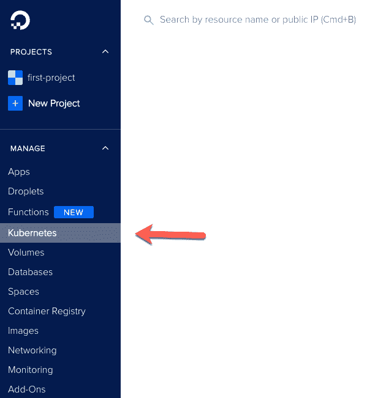

图 3.7 – DigitalOcean 托管 Kubernetes

1.  点击蓝色的**创建 Kubernetes** **集群**按钮：

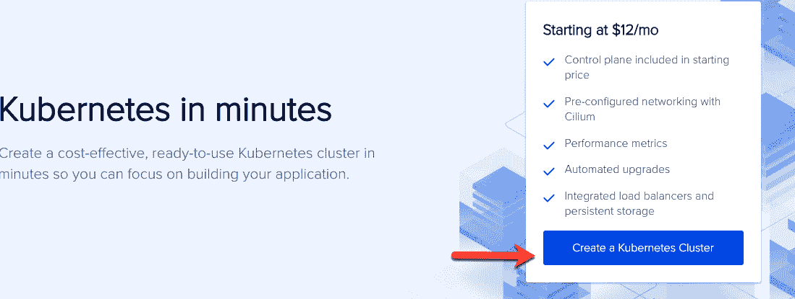

图 3.8 – 创建 Kubernetes 集群按钮

1.  选择你的地区、VPC 名称和 Kubernetes API 版本。一般建议的 API 版本是始终使用最新版本，除非你有特定的理由不使用最新版本（这个规则适用于任何 Kubernetes 环境）：

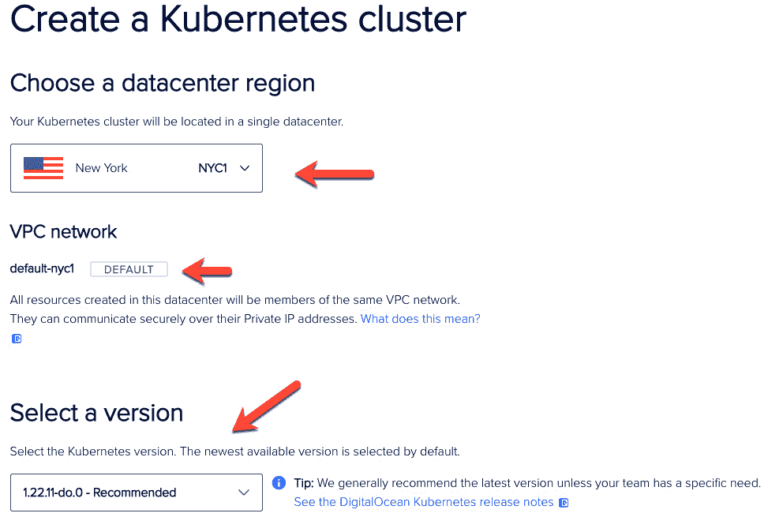

图 3.9 – 添加集群详细信息

1.  选择集群容量。这里有两个非常重要的部分：

    +   **机器类型**：在这一步，你需要选择最适合你和你的生产环境的选项。虽然 DigitalOcean 没有 Linode 那么多的选项，但你可以从基本节点、基于 Intel 的节点或基于 AMD 的节点中选择（从 CPU 角度来看）。

    +   **高可用性控制平面**：对于这一点，你总是希望确保控制平面具有高可用性。控制平面包含调度器、etcd 以及许多其他重要的 Kubernetes 组件。没有它们，Kubernetes 就无法工作。

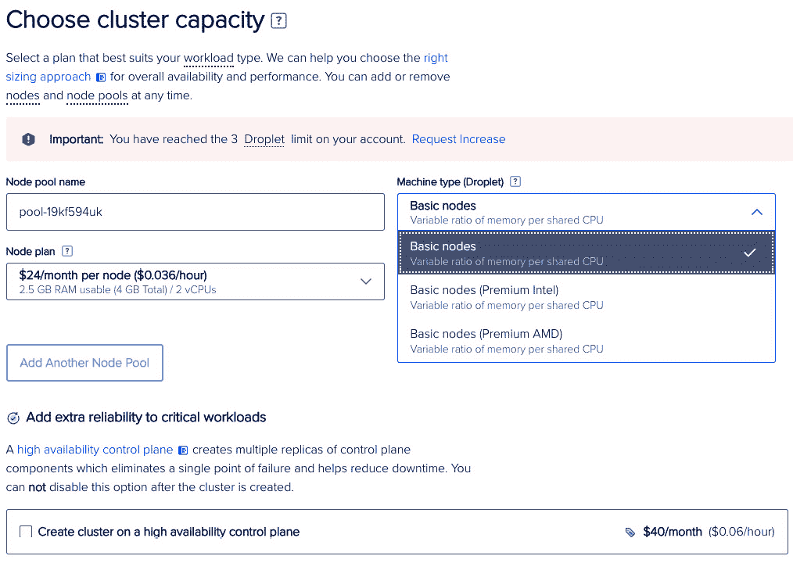

图 3.10 – 工作节点大小

1.  通过查看每月费用并点击绿色的 **创建** **集群** 按钮，确认你的集群：

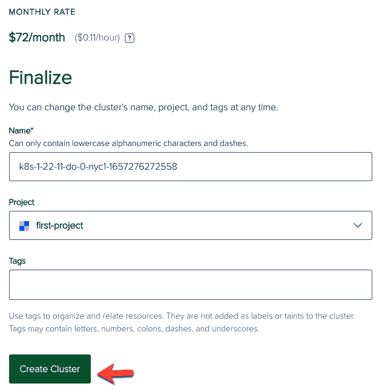

图 3.11 – 完成集群

现在你已经熟悉了手动创建 DigitalOcean Kubernetes 引擎集群的过程，是时候学习如何自动化它，并使这一过程在生产级环境中可重复执行。

## 自动化 DigitalOcean 管理的 Kubernetes

从自动化的角度来看，你有几种选择。最流行的两种是 DigitalOcean CLI 和 **基础设施即代码**（**IaC**）。在本节中，你将学习如何使用 Terraform 创建一个 DigitalOcean 管理的 Kubernetes 集群。

在许多生产级案例中，你将在 CI/CD 流水线中运行以下 Terraform 代码，以确保可重复性。对于本节内容，你可以在本地运行它。

就像我们为 LKE 所做的那样，首先，我们将查看 `main.tf` 配置，然后你将查看 `variables.tf`。

Terraform 配置像所有其他配置一样开始：从提供商开始。DigitalOcean Terraform 提供商要求你传入一个 DigitalOcean API 令牌，你可以从 DigitalOcean UI 生成它：

```

terraform {
  required_providers {
    digitalocean = {
      source = "digitalocean/digitalocean"
    }
  }
}
provider "digitalocean" {
  token = var.do_token
}
```

接下来，需要一个资源块，用于创建整个集群和节点池。这些是 DigitalOcean Droplets，最终将成为 Kubernetes 工作节点。它还创建了水平自动扩展。对于某些 DigitalOcean 账户，最大 Droplet 数量为三，因此你很可能需要为生产环境增加这个数量：

```

resource "digitalocean_kubernetes_cluster" "packtdo" {
  name    = var.cluster_name
  region  = var.region
  version = var.k8s_version
  node_pool {
    name       = "autoscale-worker-pool"
    size       = "s-2vcpu-2gb"
    auto_scale = true
    min_nodes  = 2
    max_nodes  = 3
  }
}
```

现在你已经有了 Terraform 配置，你需要传递变量。这些变量允许你的代码保持可重复性，这样你就不需要不断更改硬编码值或为每个环境创建新配置。

有四个变量，如下所示：

+   `region`：DigitalOcean Kubernetes 引擎集群运行的区域。

+   `cluster_name`：Kubernetes 集群的名称。

+   `K8s_version`：Kubernetes API 版本。

+   `do_token`：DigitalOcean API 令牌。对于生产级环境，你会希望将其存储在某种类型的密钥存储中，并让 Terraform 通过数据块提取它。将 API 令牌写入变量并推送到源代码控制中是绝对不允许的：

```

variable "region" {
    type = string
    default = "nyc1"
}
variable "cluster_name" {
    type = string
    default = "packtdo01"
}
variable "k8s_version" {
    type = string
    default = "1.22.11-do.0"
}
variable "do_token" {
    type = string
    default = ""
    sensitive = true
}
```

在这一部分关于 DigitalOcean 的内容总结时，需要记住的一个点是，在 *理解 Linode Kubernetes 引擎* 部分中提到的相同内容——更大的云服务商将拥有更多可以与托管的 Kubernetes 服务相结合的服务。在你决定什么最适合你的环境时，这一点需要特别注意。

在本章的下一节也是最后一节中，你将从理论和实践的角度了解 OpenShift 上的 PaaS。

# 什么是 Kubernetes PaaS，它有什么不同？

工程师们感觉到，以不同方式部署 Kubernetes 集群好像是逐步发展的。最初是原生 Kubernetes 集群。你必须手动部署所有东西，从控制平面到 **证书授权机构** (**CA**) 及其间的一切。之后，出现了云中的 Kubernetes 服务，如 AKS、GKE 和 EKS。现在，有了无服务器 Kubernetes，如 GKE AutoPilot 和 EKS Fargate，正如你在上一章中所学到的那样。

另一个特别突出的选项，尤其是在企业中，是基于 PaaS 的 Kubernetes 解决方案，例如 Red Hat 的 **OpenShift**。

在本节中，你将了解为什么要使用 OpenShift，企业如何利用基于 PaaS 的 Kubernetes（如 OpenShift），以及如何在本地计算机上使用 OpenShift 设置 Dev 环境，开发和部署生产就绪的 OpenShift 集群到主要的云服务商，并在 OpenShift 内部部署生产就绪的应用程序。

## OpenShift

OpenShift 是一个充满矛盾的存在，介于完整的 Kubernetes 和它自己独立的调度系统之间。OpenShift 在底层使用 Kubernetes。如果你为 Deployment、Pod 等编写 Kubernetes 清单，你可以在 OpenShift 上使用它。从本质上讲，Kubernetes 和 OpenShift 在功能上没有区别。然而，在管理 OpenShift 和管理 Kubernetes 的方式上有所不同。OpenShift 是一个 PaaS，而 Kubernetes 可以由云服务商进行管理，所以它在某种程度上感觉像是 **软件即服务** (**SaaS**)，并且可以从裸机角度进行管理。由于 Kubernetes 是一个非常灵活的平台，它不能被归类为单一类别。

使用 OpenShift 时必须记住的一点是，它是企业专用的。除非是为了学习（这正是你在本章所做的），否则工程师不太可能在实验环境中使用 OpenShift。使用 Kubernetes，你有更多的部署选择以及关于部署位置的选择。而 OpenShift 限制了你使用某种类型的虚拟机，以及部署的位置/方式。这并不意味着它是坏事。OpenShift 不是为了让工程师像使用 minikube 和 Docker Desktop 那样做实验而设计的，它是为了企业客户而构建的。如果你有兴趣深入了解这个话题，我强烈推荐阅读 Tomasz Cholewa 关于 Kubernetes 和 OpenShift 比较的这篇博客：[`blog.cloudowski.com/articles/10-differences-between-openshift-and-kubernetes/`](https://blog.cloudowski.com/articles/10-differences-between-openshift-and-kubernetes/)。

根据 Red Hat 的定义，OpenShift “*Red Hat OpenShift 为传统和云原生应用提供了完整的应用平台，使它们能够在任何地方运行。基于 Red Hat Enterprise Linux，并兼容 Red Hat Ansible Automation Platform，Red Hat OpenShift 实现了在 Kubernetes 集群内外的自动化*。”

简而言之，它允许您在 PaaS 环境中编排和管理容器化应用程序。

## OpenShift 在企业中的应用

此时，你可能会想知道为什么有人会选择在标准 Kubernetes 部署之上使用 OpenShift。Kubernetes 获得了大量支持，被所有主要的云提供商支持，并且是最新最好的技术。在企业环境中，Kubernetes 的认知有所不同。

对于领导团队来说，Kubernetes 往往被认为是一个神秘的黑盒子，会花费大量金钱来维护和支持。事实上，在企业环境中，领导团队希望在出现问题时能够拨打支持电话或联系客户经理。他们希望有*企业软件*，这样如果（或者说当）出现问题，工程团队就知道有人可以联系。尽管工程师们很可能会花更多的时间等待支持回复，而不是自己动手解决，*企业许可*给领导团队带来了安心感。然而，安心也伴随着成本。OpenShift 许可费用非常昂贵，而且还要记住，你需要在某个地方运行它，这也会产生费用。例如，如果你在 AWS 上运行 OpenShift，你需要支付在 AWS 上运行的云基础设施费用、OpenShift 许可费用和 Red Hat 支持费用。如果你决定选择 OpenShift，确保你的领导团队了解这些成本。

从技术和工程的角度来看，OpenShift 和 Kubernetes 并没有做什么不同的事情。当然，要让 Kubernetes 像 OpenShift 一样工作，需要一些工作和工程努力来构建，但这些都是完全可行的。虽然 OpenShift 是一个很棒的平台，但与 Kubernetes 相比，并没有做什么特别出众的事情。

## 开始使用 OpenShift 沙盒

在花费资金购买 OpenShift 之前，您可以在沙盒环境中使用 OpenShift ReadyContainers 进行测试。虽然沙盒环境不适合生产使用，但这是一个测试和熟悉 OpenShift 工作方式的好方法。它也非常适合实验室环境！请按照以下步骤操作：

重要提示

如果你使用的是 M1 Mac，OpenShift ReadyContainers 目前不支持 ARM 设备，因此这个实验不适合你。

1.  登录红帽控制台：[`console.redhat.com/`](https://console.redhat.com/)。

1.  点击 **OpenShift**：

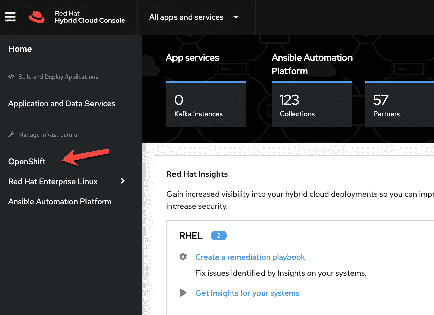

图 3.12 – 红帽控制台

1.  选择 **Clusters** 选项：

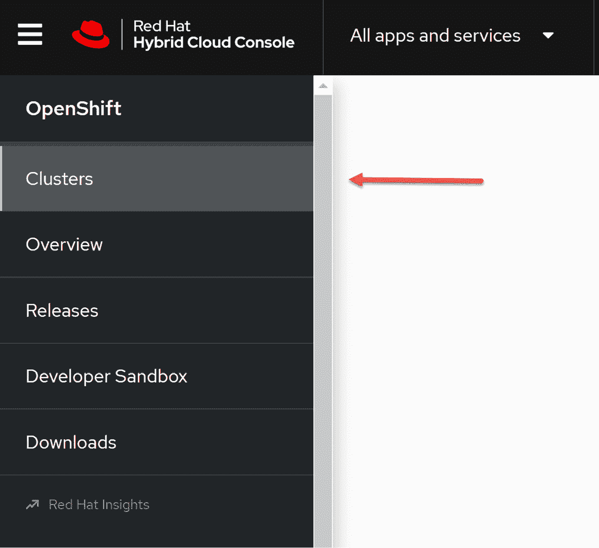

图 3.13 – 集群

1.  在 **Clusters** 选项下，你会看到三个选项 – **Cloud**、**Datacenter** 和 **Local**。选择 **Local**：

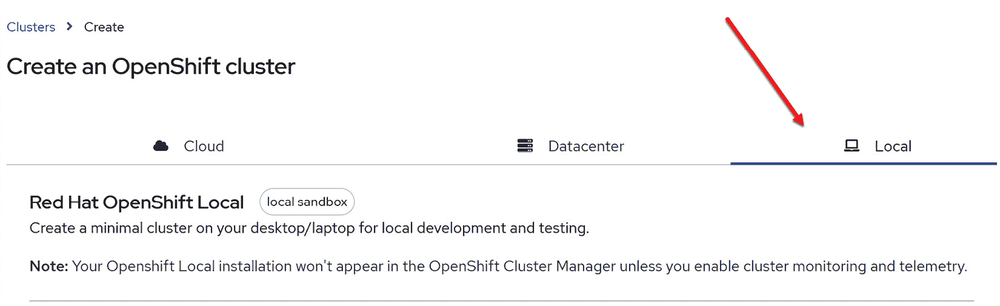

图 3.14 – 本地集群

1.  点击蓝色 **Download OpenShift** **Local** 按钮下载 OpenShift 本地：

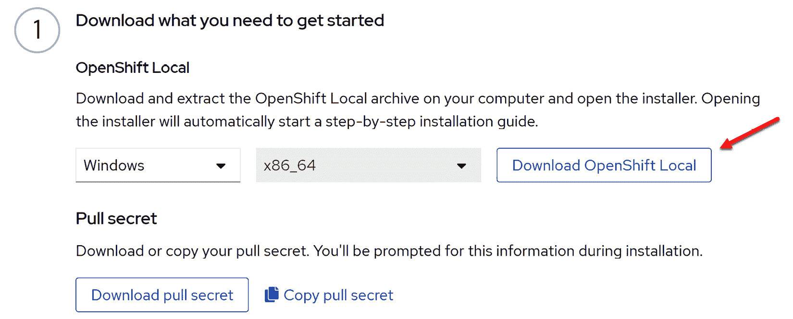

图 3.15 – 下载 OpenShift 本地

1.  一旦安装了 OpenShift Local，你将需要运行两个命令（安装 CRC 的说明可以在这里找到：[`crc.dev/crc/#minimum-system-requirements-operating-system_gsg`](https://crc.dev/crc/#minimum-system-requirements-operating-system_gsg)）：

    1.  `crc setup`: 设置配置以进行 Red Hat 认证

    1.  `crc start`: 启动本地 OpenShift 集群：

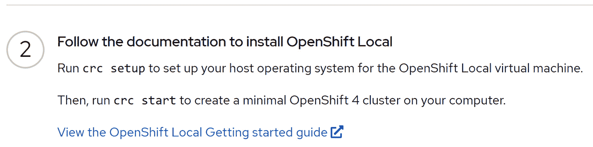

图 3.16 – OpenShift 本地设置

1.  当你运行 `crc start` 命令后，你会在终端上看到类似以下的输出：

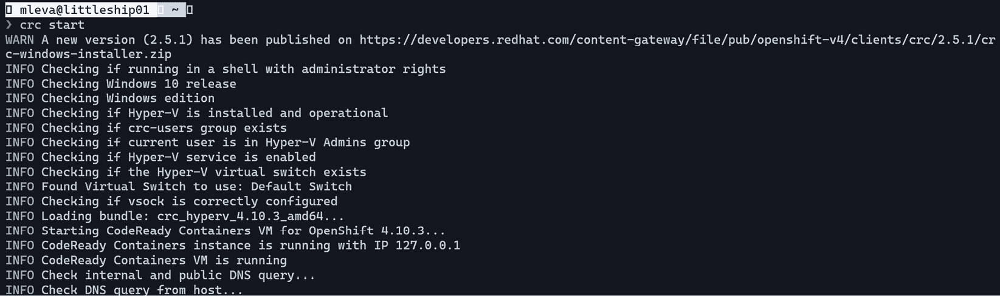

图 3.17 – 启动 OpenShift 本地

根据你阅读的时间和基于版本变化，你可能需要一些配置，包括在本地主机传递 OpenShift 令牌进行身份验证。为了简化这些步骤，因为这些信息已经在 Red Hat 提供的安装指南中可用，你可以在这里按照安装说明操作：[`access.redhat.com/documentation/en-us/red_hat_openshift_local/2.5/html/getting_started_guide/installation_gsg#installing_gsg`](https://access.redhat.com/documentation/en-us/red_hat_openshift_local/2.5/html/getting_started_guide/installation_gsg#installing_gsg)。

虽然在本节中我们没有涉及到，但还有第二个实验环境选项称为 OpenShift Sandbox，它不同于 ReadyContainers。你可以在这里设置 OpenShift Sandbox：[`developers.redhat.com/developer-sandbox`](https://developers.redhat.com/developer-sandbox)。

现在你知道如何启动和运行 OpenShift 沙盒了，让我们学习如何在 AWS 上设置一个生产就绪的 OpenShift 集群。

## 在 AWS 上的 OpenShift

CodeReady containers 非常棒，因为它们允许你利用本地计算机学习 OpenShift，就像 Minikube 让你免费学习 Kubernetes 和 Docker Desktop 让你免费学习 Docker 一样。

现在你已经了解了免费版本，让我们快速看看如何将 OpenShift 部署到云端。在本例中，你将学习 AWS，但其他支持的云提供商有相同的工作流程。

对于本节，确保你通过 AWS CLI 登录到 AWS 控制台，并且你也已经登录到你的 Red Hat 账户。按照以下步骤操作：

1.  登录到 Red Hat 控制台：[`console.redhat.com/`](https://console.redhat.com/)

1.  点击 **OpenShift**：

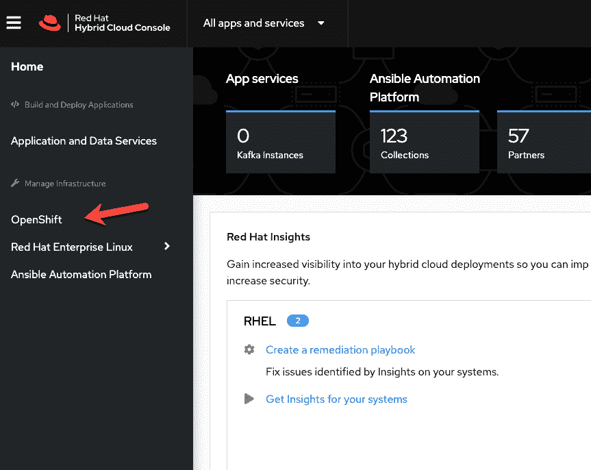

图 3.18 – OpenShift 管理器

1.  点击 **Clusters** 按钮，然后点击蓝色 **Create** **cluster** 按钮：

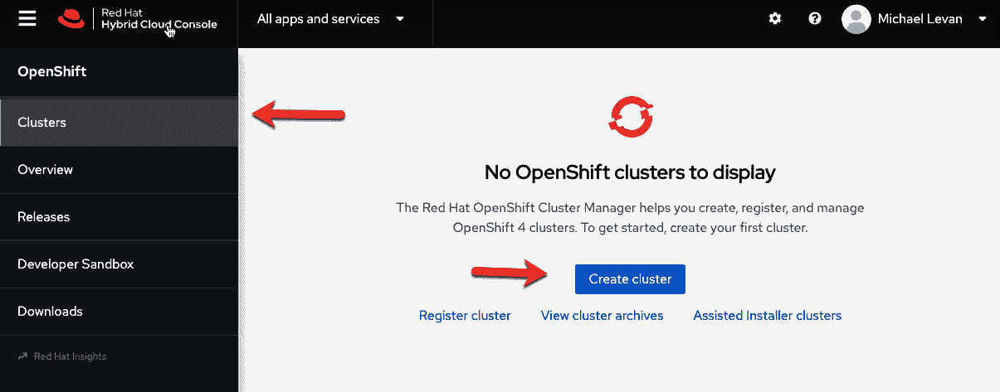

图 3.19 – 创建集群

1.  你将看到多个选项，包括 Azure 和 IBM Cloud。点击 AWS 选项下的蓝色 **创建集群** 按钮：

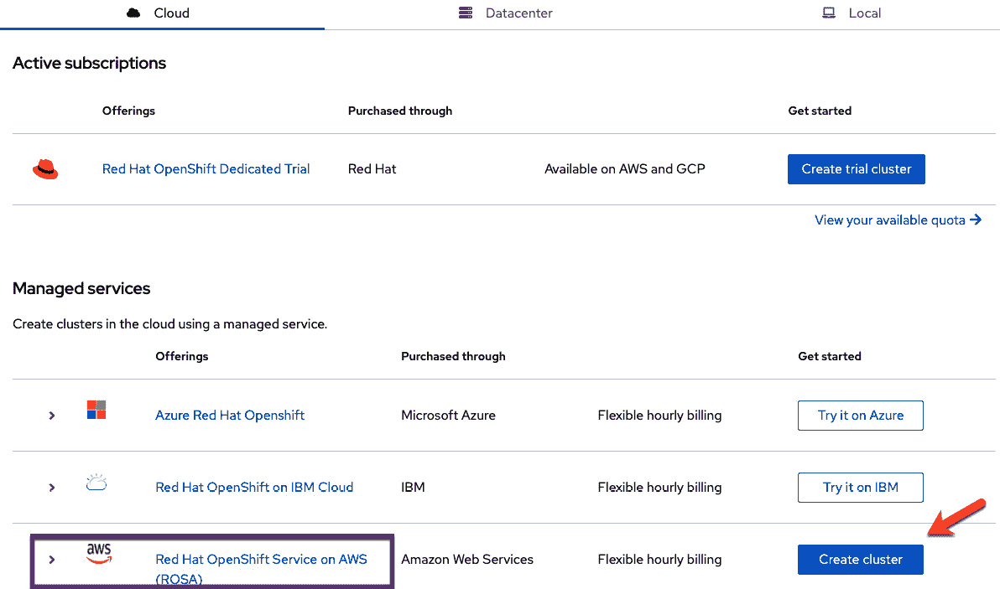

图 3.20 – AWS ROSA

1.  第一个页面将关联你的 AWS 账户与 Red Hat，如果你还没有完成这一步。点击 **选择账户** 按钮，并按照引导完成配置 ROSA 的流程，ROSA 是 AWS 上的 Red Hat OpenShift 服务：

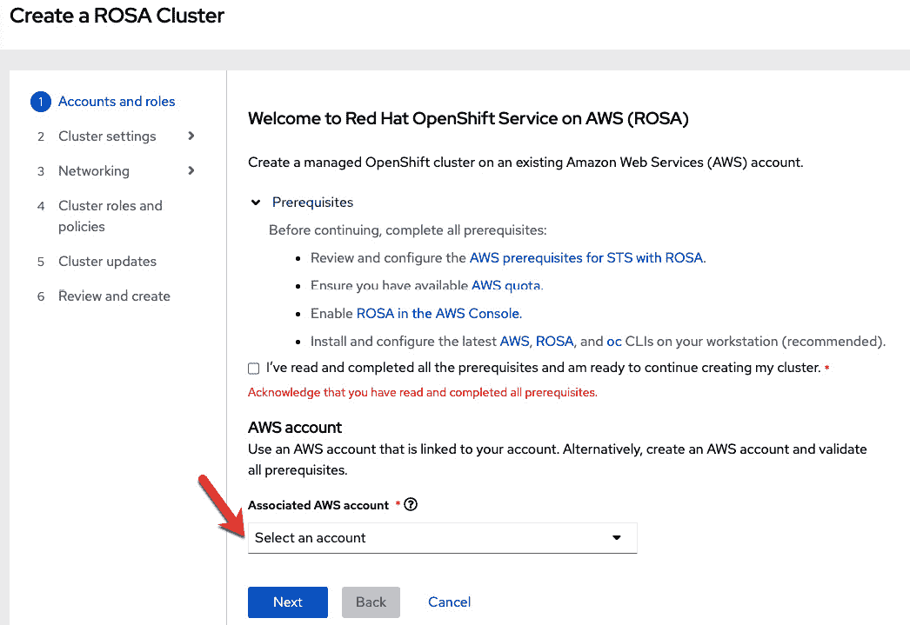

图 3.21 – 创建 ROSA 集群页面

1.  一旦你为 ROSA 设置了 AWS 账户权限和角色，下一页将是配置集群的页面，其中包括集群名称、OpenShift 版本、区域和可用性选项。OpenShift 提供的一个很酷的选项是能够加密 etcd 并使用客户密钥创建持久卷。这个附加的安全性通常在企业中受到密切关注：

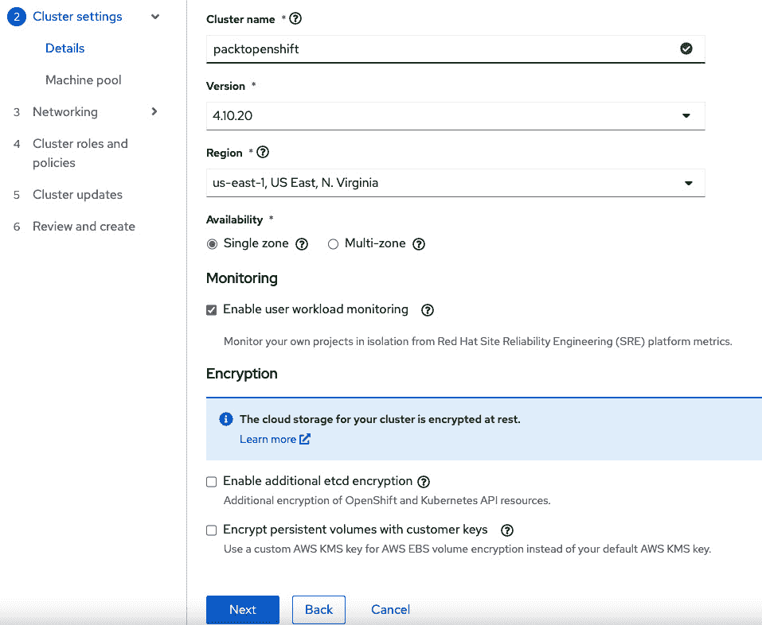

图 3.22 – 添加集群详细信息

1.  选择你的机器池，其中包括 AWS EC2 实例的大小和自动扩展功能：

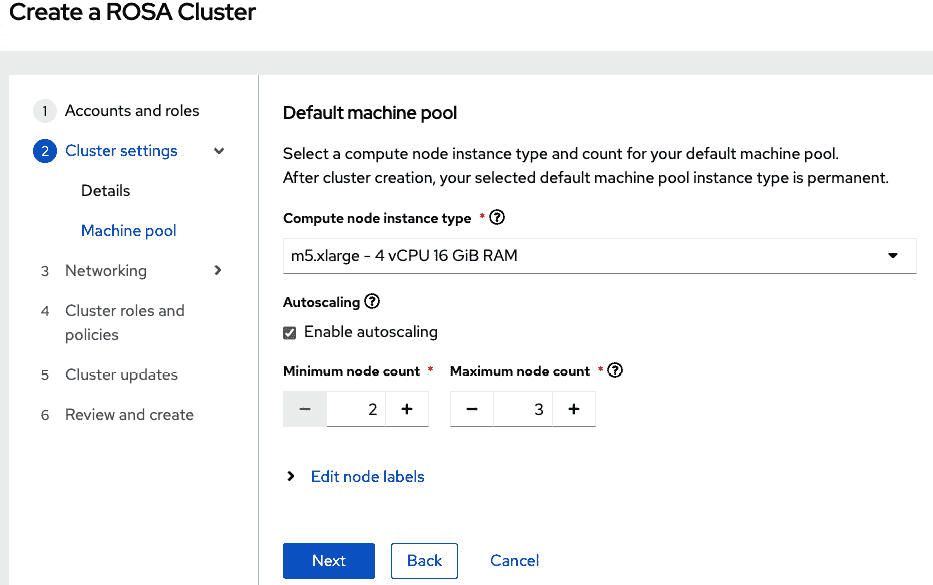

图 3.23 – 工作节点大小

1.  接下来是网络选项，包括你是否希望 Kubernetes 控制平面/API 服务器是公开的还是私有的，以及是否希望为 OpenShift 创建一个新的 AWS VPC，还是将 ROSA 集群安装到现有的 VPC 中。一旦选择 **虚拟私有云 (VPC)** 选项，你需要选择 Kubernetes Pod 内部网络和集群 IP 范围的 CIDR：

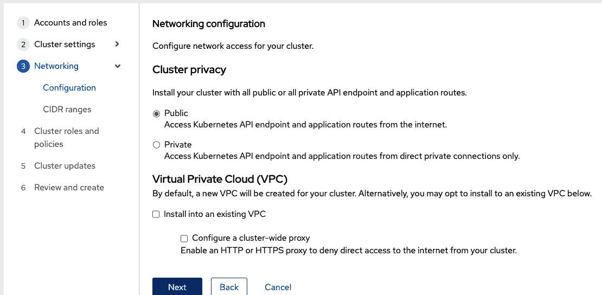

图 3.24 – 网络配置

1.  对于集群角色和策略，你可以选择手动设置角色和策略，或者让 OpenShift 自动为你设置：

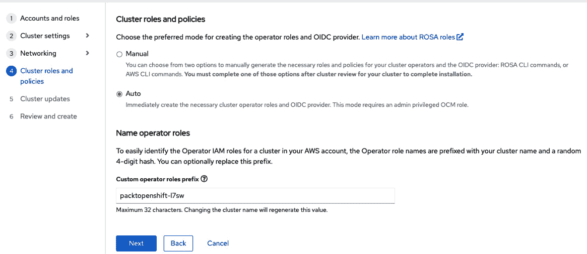

图 3.25 – 集群角色和策略

1.  对于最后一步，你可以选择如何为 ROSA 集群实施更新。更新的发生是基于来自 **国家漏洞数据库** (**NVD**) 的 CVE 分数：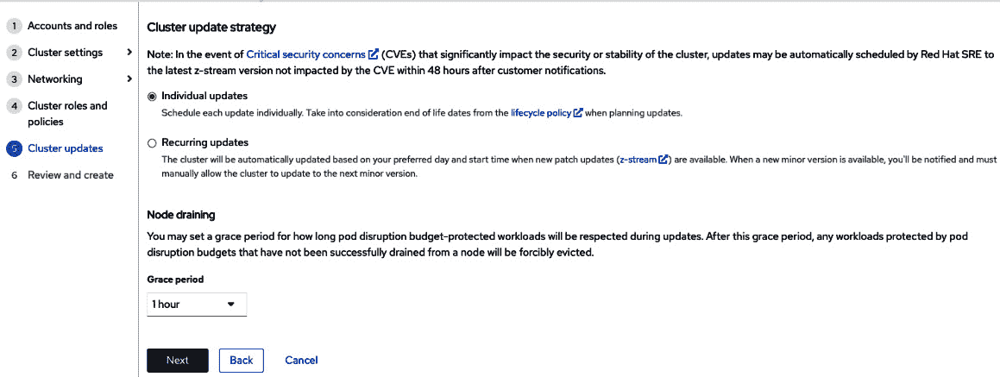

图 3.26 – 漏洞扫描

1.  一旦填写完所有选项，你就可以正式创建你的 ROSA 集群。

现在你已经知道如何在本地和云端启动 OpenShift，让我们总结一下本章内容。

# 总结

无论你选择在哪个环境中部署 Kubernetes，无论是在大型云平台、小型云平台还是 PaaS 解决方案中，目标始终是相同的，永远不会改变——构建一个能够管理容器化应用的 orchestration 平台。

市面上有很多炫酷的工具，各种不同的平台，以及许多承诺每一个新平台都能从 Kubernetes 角度让你的生活变得更轻松。事实是，无论如何，它们都有一个共同的目标。

目标是使用 Kubernetes 来编排和管理容器化应用。确保在使用每个平台和工具时，记住这一点——*编排我的容器化应用*。如果你牢牢记住这一点，选择和排除市场营销噪音将变得更加容易。

在下一章中，我们将学习本地 Kubernetes，并了解理解 Kubernetes 集群的底层组件为什么重要，以及为什么它如此重要。

# 进一步阅读

要了解更多关于本章涉及的主题，请查看以下资源：

+   *学习 OpenShift*，作者：Denis Zuev、Artemii Kropachev 和 Aleksey Usov：[`www.packtpub.com/product/learn-openshift/9781788992329`](https://www.packtpub.com/product/learn-openshift/9781788992329)
