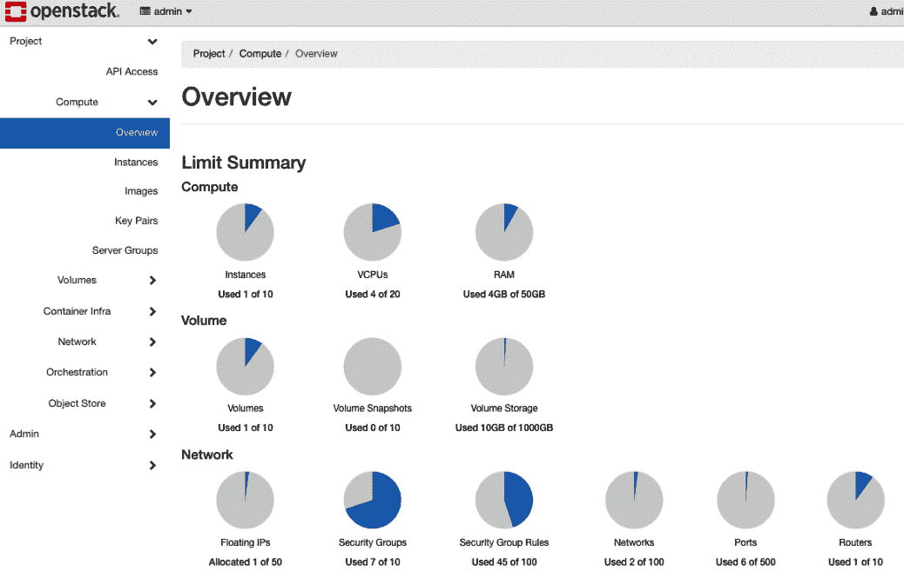

# 4

# 本地 Kubernetes 现实检查

我知道你在想什么——*本地部署？为什么这个家伙在教我们本地 Kubernetes？不是都在* *云端吗！*

尽管从技术营销和大型云服务提供商大肆宣传 Kubernetes 似乎是这样，但在生产环境中，实际上有很多本地 Kubernetes 集群，也有很多工程师在管理它们。德国著名汽车制造商梅赛德斯·奔驰在 OpenStack 上托管着超过 900 个 Kubernetes 集群，而 OpenStack 是一个私有云解决方案。所有这些集群都位于数据中心，而不是公共云中。如果你揭开云服务提供商运行 Kubernetes 集群的层面，你会发现他们做的事情很相似。他们有几个数据中心，像你在本地部署或在 eBay 上购买的服务器一样运行 Kubernetes。唯一的区别是，云服务商是在全球范围内大规模地运行 Kubernetes。然而，Kubernetes 运行的*方式*并没有什么不同。

事实上，本章本身可以是一本完整的书——它可能是几本书。Kubernetes，尤其是在没有云抽象的情况下，是一个极为庞大的话题。人们说 Kubernetes 就像是一个自带数据中心，这背后有其原因。仅仅是如何以及在哪里运行本地 Kubernetes 就是一个深奥的话题。例如，使用什么规模的基础设施，如何扩展工作负载，纵向和横向扩展，网络带宽，高可用性，以及更多的内容都涉及到使用何种系统以及在哪些地方运行它们的问题。

本章结束时，你将理解运行本地 Kubernetes 有多么复杂，但与此同时，对于那些在 Kubernetes 上投入大量努力的组织来说，它又是多么有回报。你将具备实践技能和理论知识，了解如何思考组织 Kubernetes 环境的扩展问题。从本章你将学到的一件事是，使用*酷技术*远不如从架构角度思考平台团队应该是什么样的。

在本章中，我们将涵盖以下主题：

+   了解操作系统和基础设施

+   排查本地 Kubernetes 集群的问题

+   介绍混合服务

+   探索网络和系统组件

+   了解虚拟化裸金属

本章将结合实践操作和理论知识。由于我们只有一章来讨论这个话题，可以说我们无法展示你需要了解的所有内容。然而，这应该是你生产环境之旅的一个良好起点。

# 技术要求

要完成本章，你应该首先阅读 *第二章* 和 *第三章*。虽然这听起来很显而易见，但我们还是要强调这一点，因为在深入了解 Kubernetes 的本地需求之前，理解不同的部署方式是至关重要的。因为基于云的 Kubernetes 部署抽象了很多本地部署时需要做的事情，但它依然展示了组件需要部署的整体工作流。

要学习本章内容，你应该具备一定的基础设施和故障排除背景。对于本地 Kubernetes 集群而言，它们对基础设施的依赖非常大，因此如果没有这些知识，完成本章可能会比较困难。至少，你应该具备以下内容：

+   Linux 知识

+   服务器知识

本章的代码可以在本书的 GitHub 仓库中找到，地址是：[`github.com/PacktPublishing/50-Kubernetes-Concepts-Every-DevOps-Engineer-Should-Know/tree/main/Ch4`](https://github.com/PacktPublishing/50-Kubernetes-Concepts-Every-DevOps-Engineer-Should-Know/tree/main/Ch4)。

本章的 Kubeadm 部分，如果你有两台虚拟机可用，你可以跟着一起操作。如果没有也完全没问题：你可以从理论的角度来阅读本章内容。如果你有两台额外的虚拟机可用，无论是本地的还是云端的，都将帮助你更好地理解本章的整体讲解。

# 操作系统和基础设施的理解

一切都从服务器开始。不管你是在云端、无服务器平台还是容器上运行工作负载——一切都从服务器开始。工程师们不总是考虑服务器，或者说不总是考虑工作负载从哪里开始，这一点在今天的世界里是常见的，因为底层的基础设施已被抽象化了。在云计算的世界里，你很少需要问，*你用什么硬件来运行这些虚拟机？戴尔？惠普？* 相反，你更关心的是服务器部署后的事情，这有时被称为“第二天操作”（这里插入更多流行词）。我们所指的意思是，现在工程师们更多关注的是自动化、应用部署、平台和可扩展性，而不是在线订购服务器、将它们上架并配置虚拟化管理程序（如 ESXi、KVM、Hyper-V 等）。

在许多初创公司和中小型组织中，典型的现实是使用云计算。对于大型组织，另一个现实是本地工作负载，这些工作负载要么是虚拟化的，要么是纯粹的裸金属。如果在讨论中提到云与本地结合的情况，这时像混合解决方案这样的内容就会出现，你将在本章稍后学习到这些内容。

假设你现在正在阅读这篇文章，并且 100%在云端工作。你仍然需要了解虚拟机大小、扩展、虚拟机的位置（数据中心 – 区域、可用性区域、地理位置等）、网络延迟以及其他大量属于系统和基础设施类别的内容。例如，在上一章中，你学习了如何为 DigitalOcean 和 Linode 中的高 CPU、高内存和中等 CPU/内存工作负载选择工作节点大小。

在本节中，你将了解在架构本地 Kubernetes 平台时必须考虑的核心系统和基础设施需求。

## Kubeadm 部署

在进入理论之前，我想展示一下如何通过 Kubeadm 启动 Kubernetes 集群。主要目的是展示实际部署 Kubernetes 的过程，同时让你看到部署过程中不被抽象化的部分。抽象化是一个很棒的东西，但只有在你了解手动部署的方法后，它才显得有意义。否则，抽象化只会引起混淆。

对于虚拟机，安装基于 Ubuntu。然而，如果你使用的是其他 Linux 发行版，它也能工作，但你需要稍微修改命令以适应特定的发行版。例如，Ubuntu 使用 Aptitude 包管理器，而 CentOS 使用 Yum 包管理器。

### 安装控制平面和工作节点

让我们开始吧。

1.  首先，确保更新 Ubuntu：

    ```

    sudo apt update -y
    ```

1.  安装传输层：

    ```

    sudo apt-get install -y apt-transport-https curl
    ```

1.  在 Ubuntu 上安装 Kubernetes 包：

    ```

    curl -s **https://packages.cloud.google.com/apt/doc/apt-key.gp**g | sudo apt-key add -
    ```

    ```

    echo "deb **https://apt.kubernetes.io**/ kubernetes-xenial main" | sudo tee /etc/apt/sources.list.d/kubernetes.list
    ```

1.  更新 Ubuntu，确保 Kubernetes 包已存在：

    ```

    sudo apt update -y
    ```

1.  接下来，切换到 root 用户：

    ```

    sudo su -
    ```

1.  安装并配置 CRI-O 容器运行时：

    ```

    OS=xUbuntu_20.04
    ```

    ```

    VERSION=1.22
    ```

    ```

    echo "deb **https://download.opensuse.org/repositories/devel:/kubic:/libcontainers:/stable/$OS**/ /" > /etc/apt/sources.list.d/devel:kubic:libcontainers:stable.list
    ```

    ```

    echo "deb **http://download.opensuse.org/repositories/devel:/kubic:/libcontainers:/stable:/cri-o:/$VERSION/$OS**/ /" > /etc/apt/sources.list.d/devel:kubic:libcontainers:stable:cri-o:$VERSION.list
    ```

    ```

    curl -L **https://download.opensuse.org/repositories/devel:kubic:libcontainers:stable:cri-o:$VERSION/$OS/Release.ke**y | apt-key add -
    ```

    ```

    curl -L **https://download.opensuse.org/repositories/devel:/kubic:/libcontainers:/stable/$OS/Release.ke**y | apt-key add -
    ```

1.  退出 root 用户：

    ```

    exit
    ```

1.  现在，更新 Ubuntu，确保`CRI-O`可用：

    ```

    sudo apt update –y
    ```

1.  安装`CRI-O`：

    ```

    sudo apt install cri-o cri-o-runc -y
    ```

1.  重新加载守护进程并启用 CRI-O：

    ```

    sudo systemctl daemon-reload
    ```

    ```

    sudo systemctl enable crio --now
    ```

1.  检查 CRI-O 是否安装正确：

    ```

    apt-cache policy cri-o
    ```

1.  关闭交换分区：

    ```

    swapoff -a
    ```

1.  配置`sysctl`设置和`ip`表：

    ```

    sudo modprobe overlay
    ```

    ```

    sudo modprobe br_netfilter
    ```

    ```

    sudo tee /etc/sysctl.d/kubernetes.conf<<EOF
    ```

    ```

    net.bridge.bridge-nf-call-ip6tables = 1
    ```

    ```

    net.bridge.bridge-nf-call-iptables = 1
    ```

    ```

    net.ipv4.ip_forward = 1
    ```

    ```

    EOF
    ```

    ```

    sudo sysctl --system
    ```

1.  安装 kubeadm：

    ```

    sudo apt-get install -y kubelet kubeadm kubectl
    ```

下一步是配置。

### 配置控制平面

我们需要为`kubeadm init`命令定义变量。这将包括 IP 地址和 Pod CIDR 范围。根据你的部署位置，可能只有一个公共子网，或者同时有公共和私有子网。

如果你只有一个公共子网，使用相同的`ip_address`和`publicIP`值，以及`CIDR`范围。如果你有公共子网和私有子网，使用公共 IP 作为`publicIP`，私有 IP 作为`ip_address`，并使用私有 IP 范围作为`CIDR`。

```

ip_address=10.116.0.9
cidr=172.17.0.0/16
publicIP=146.190.219.123
```

接下来，在控制平面上初始化`kubeadm`：

```

sudo kubeadm init --control-plane-endpoint $publicIP --apiserver-advertise-address $ip_address --pod-network-cidr=$cidr --upload-certs
```

如果你在云端部署，可能会遇到`init`失败的情况，因为 Kubelet 无法与 API 服务器进行通信。这种情况通常发生在公有云中，由于网络限制。如果发生这种情况，请打开以下端口：

在 Kubeadm `init`成功之后，你会看到一些命令输出，显示如何加入更多控制平面以及如何加入工作节点。复制工作节点加入命令，并在你配置为工作节点的 Ubuntu 服务器上运行它。

接下来，安装 CNI。

如果你不想使用 Weave，可以查看这里列出的网络框架：。

```

kubectl apply -f https://github.com/weaveworks/weave/releases/download/v2.8.1/weave-daemonset-k8s.yaml
```

接下来，我们将看一下系统规模。

## 系统规模

关于系统类型、大小和节点数量的考虑对于如何思考本地部署至关重要。最终，关键是你打算在 Kubernetes 集群上运行什么。如果你刚开始你的第一个 Kubernetes 集群，想尝试容器化一个应用程序，看看它是如何工作的，依赖是如何运作的，最终开始你的旅程，那将与运行 50 个以上 Kubernetes 集群、处理股票交易/量化应用的情况不同。归根结底，你使用的系统规模将完全取决于你正在运行的工作负载。

在你考虑创建一个本地 Kubernetes 集群之前，你必须考虑两个重要方面：

+   我有可用的硬件吗？如果没有，我需要购买什么硬件？

+   我计划在接下来的 3 到 6 个月里运行什么类型的应用程序？

例如，假设你购买了 10 台服务器，并计划在上面运行你的应用程序。那么这些服务器需要多大？如何进行扩展？你是有内存密集型应用和标准日常应用的组合吗？

另一个重要的考虑因素是*扩展*。如果你是水平扩展，意味着会创建更多的 Pod，因此会消耗更多的虚拟化硬件。如果你是垂直扩展，意味着你的 Pod 的内存和 CPU 会增加，而不需要创建更多的 Pod（这就是垂直自动扩展）。你不仅要规划一开始运行什么应用程序，还要规划这些应用程序如何被使用。如果今天你有 500 个用户，并且根据公司预测在 3 个月内你会有 2,000 个用户，那就意味着 Pod 的使用速度会加快，可能需要更多的 Pod。更多的使用意味着自动扩展，自动扩展意味着需要更多的资源。

### 尺寸考虑

以下是构建 Kubernetes 集群时标准尺寸的考虑事项：

+   **标准工作节点**：这些是你日常使用的 Web 服务器 Pod 或中间件，仍然需要虚拟化硬件资源，但不像更强大的应用那样要求高。它们可以算是你的*通用应用*。这里运行的工作节点中等到较大的尺寸。如果你刚开始搭建 Kubernetes 集群，并且可能在开始时将一两个容器化应用迁移到 Kubernetes，标准工作节点完全可以帮助你起步。

+   **内存密集型工作节点**：你知道将需要比其他应用程序更多内存/内存的应用程序，应该为这些应用程序安排更多 RAM 的工作节点，而不是标准的工作节点。你需要确保，如果一个 Pod 需要进行副本扩展，或者添加了更多 Pods，你有足够的内存。否则，Pods 将无法启动，并且会一直处于待定状态，直到内存分配给它们，调度器才能重新尝试将 Pod 调度到节点。

+   **CPU 密集型工作节点**：某些应用程序会要求更多的 CPU 和可用线程来运行应用程序。与内存密集型应用程序相同的规则适用于此——如果调度器由于资源不足而无法调度 Pods，它将等待直到资源释放。

+   **特殊情况工作节点**：特殊情况的 Pod 通常是运行图形密集型工作负载的应用程序，这些工作负载需要特定类型的 **图形处理单元**（**GPU**），这意味着工作节点需要一个专用的 GPU，或者是一个需要更快带宽的应用程序，因此它需要某种类型的 **网络接口卡**（**NIC**）。

## 系统位置

运行 Kubernetes 时，主要有两种类型的节点：

+   **控制平面**：控制平面是 API 服务器所在的地方。没有 API 服务器，你在 Kubernetes 中几乎无法做什么。它还包含调度器（Pods 如何知道该去哪个节点）、控制器管理器（用于 Pods、Deployments 等的控制器，以确保达到所需的状态）以及集群存储/数据库（etcd）。

+   **工作节点**：工作节点是 Pods 安装的地方，在控制平面之后，并且在工作节点上运行。它们运行 kubelet（代理）、容器运行时（容器的运行方式）、kube-proxy（Kubernetes 网络）以及正在运行的任何其他 Pod。

牢记这两种节点类型后，你需要弄清楚想要使用哪些自动化技术来运行它们，最终决定在哪里/如何运行它们。这是一个不容小觑的考虑因素。你最不希望发生的事情就是部署了 Pods，然后才意识到它们运行的节点无法处理正在运行的容器化应用程序。正如前面提到的，控制平面是 Kubernetes API 所在的位置。Kubernetes API 是你在 Kubernetes 中做一切事情的方式。如果没有它，Kubernetes 就无法存在。话虽如此，选择在哪里以及如何运行控制平面是正确使用 Kubernetes 与每天都在不断排查故障之间的分水岭。

重要说明

解释控制平面和工作节点可能需要一章内容。由于本书已假设你了解 Kubernetes，我们不会深入探讨 Kubernetes 节点的类型。然而，如果你对控制平面和工作节点不了解，我们强烈建议你在继续之前花时间学习它们。一个很好的起点是 Kubernetes 文档。

### 数据中心和区域位置

数据中心会宕机，区域会宕机，**互联网服务提供商**（**ISP**）会宕机。当你架构 Kubernetes 运行位置时，有几个因素必须考虑。

第一件事是你在哪里运行。例如，如果你的客户在英国，而你决定在新泽西州运行数据中心，那么就会出现大量带宽问题和延迟问题。相反，最好是在英国拥有一个数据中心和几个联合位置。

说到联合位置，你必须确保没有单点故障。现实情况是，数据中心确实会出现故障。它们可能会面临互联网问题、洪水、电力问题和停电等。如果发生这些问题，最后你最不希望的就是只有一个位置。相反，你应该至少考虑两个数据中心位置。如果其中一个数据中心发生故障，则需要启用高可用性来*启动*另一个数据中心。例如，你可以采用*热/热*或*热/冷*的高可用性方案。推荐使用*热/热*，因为所有数据默认会复制到第二个数据中心。如果第一个数据中心出现故障，第二个数据中心会接管第一个数据中心的工作。另一个需要考虑的因素是数据中心的位置。如果两个数据中心之间仅有 5 英里远，而一场暴风雨来临时，两个数据中心都可能受到影响。因此，你需要在数据中心之间保持一定的距离。

### Kubernetes 的运行位置和方式

如你在前面的部分看到的，弄清楚本地 Kubernetes 基础设施的第一步是决定你需要什么硬件和资源来运行你计划运行的应用程序。接下来，重点是弄清楚你需要什么类型的工作节点。它们很可能是标准工作节点和需要更多 CPU 和内存的高强度工作节点的组合。最后一步（至少对于本节来说）是弄清楚如何以及在哪里运行它。

还有其他一些选项，但以下是一些流行的选项：

+   **OpenStack**：尽管今天的许多工程师认为 OpenStack 已经死掉，但许多大型组织仍在使用它。例如，几乎每个电信服务提供商都在使用 OpenStack。奔驰（截至写作时）正在托管超过 900 个（没错，900 个）运行在 OpenStack 上的 Kubernetes 集群。OpenStack 给你一种云端的感觉，但其实一切都在本地，你自己在托管私人云。开放基础设施基金会在使用工具（如 Magnum）在 OpenStack 上运行 Kubernetes 上投入了大量精力，Magnum 是运行编排平台（如 Kubernetes、Mesos、Docker Swarm 等）的标准，而 Loki 则是 Linux/OpenStack/Kubernetes/基础设施栈。

+   **Kubeadm**：如果你不想走 OpenStack 路线，并且使用的是像虚拟化管理程序这样的工具，那么 kubeadm 无疑是最佳选择。虽然有一些不同的自动化方式可以让 Kubernetes 集群快速搭建，但 kubeadm 基本上是最为精细的。使用 kubeadm，你可以创建一个符合最佳实践的 Kubernetes 集群。除了在 Linux 服务器上安装 Kubernetes 运行的前提条件外，kubeadm 基本上是自动化的。kubeadm 提供了一组命令，你可以运行这些命令，它会对 Linux 服务器进行多个检查，以确认是否具备所有前提条件，然后安装控制平面。之后，终端会输出一个命令，告诉你如何运行更多的控制平面和/或运行工作节点。你只需将输出的命令复制，并粘贴到另一个通过终端 SSH 连接的服务器上运行即可。kubeadm 的另一个优点是，它让你意识到在本地运行 Kubernetes 是非常简单的。你甚至可以在你的笔记本电脑或 Raspberry Pi 上运行它。要运行它的门槛并不高，尤其是在开发环境中。

+   **Rancher**：Rancher 既是 Kubernetes 集群创建工具，又是 Kubernetes 集群管理工具。在 Rancher 中，你可以创建 Kubernetes 集群并将其托管在 Rancher 上，或在云中创建 Kubernetes 集群，或者通过提供 Linux 虚拟机来创建原生 Kubernetes 集群。你还可以通过 Rancher 管理你的 Kubernetes 集群。例如，如果你有一个使用 kubeadm 或 OpenShift 运行的裸金属 Kubernetes 集群，你可以通过 Rancher 管理它。你还可以管理云中的 Kubernetes 集群。

+   **Kubespray**：虽然（在我们看来）Kubespray 并不是最佳的生产级选择，但它仍然是一个选项。Kubespray 使用 Ansible 或 Vagrant 部署一个生产就绪的 Kubernetes 集群，可以在虚拟机或云环境中运行。因为你只需要 kubeadm，而不是像 Vagrant 或 Ansible 这样的 *中间件*，所以直接使用 kubeadm 可以省去创建集群时的额外步骤。有趣的是，Kubespray 在幕后使用了 kubeadm 来创建集群（[`github.com/kubernetes-sigs/kubespray/blob/master/docs/comparisons.md`](https://github.com/kubernetes-sigs/kubespray/blob/master/docs/comparisons.md)），这更进一步证明了不需要使用 Kubespray 的额外步骤，直接使用 kubeadm 更加高效。

## 操作系统

要运行 Kubernetes 平台，你需要一个操作系统来承载它。你有以下两种选择：

+   运行裸金属服务器，并让操作系统直接在服务器上运行

+   具有虚拟化管理程序，如 ESXi，可以虚拟化硬件并允许你在其上安装操作系统

在今天的世界里，您很可能会使用虚拟化管理程序。除非有特殊需求需要运行裸机服务器并直接在服务器上运行操作系统，否则工程师通常会选择虚拟化管理程序。这种方法更易于管理，具有很好的可扩展性，并且能让您充分利用硬件资源。

在操作系统选项方面，大致上通常有两个可选项。一个肯定比另一个使用得更多，但另一个正在获得越来越高的关注度。

### Linux

很可能，您将以 Linux 发行版的形式运行工作节点。经过实践验证的最流行的发行版是 Red Hat、CentOS 和 Ubuntu。Linux 通常是 Kubernetes 工作节点的 *开箱即用* 解决方案，并且在写本书时，您只能在 Linux 服务器上运行 Kubernetes 控制平面。

### Windows

尽管不太常见，尤其是在 .NET 开源和跨平台版本的影响下，您仍然可以将 Windows Server 作为 Kubernetes 工作节点来运行。如果您想将 Windows Server 作为工作节点运行，需要考虑一些问题。首先，您必须运行 Windows Server LTSC 2019 或更高版本。在写本书时，当前可用的两个选项是 Windows Server 2019 和 Windows Server 2022。

使用 Windows Server 选项时，您需要购买许可证并考虑 **客户端访问许可证**（**CAL**）的问题。

现在，您已经了解了本地 Kubernetes 集群的整体操作系统和基础设施组件，在下一部分中，您将学习如何排查您正在构建的环境。

# 本地 Kubernetes 集群的故障排除

如果您来自系统管理员/基础设施背景，故障排除 Kubernetes 集群会对您来说非常自然。归根结底，Kubernetes 集群由服务器、网络、基础设施和 API 组成，这些正是基础设施工程师日常工作的内容。

如果您是开发人员，其中一些概念可能对您来说是新的，比如故障排除网络。然而，您也会对一些故障排除技术非常熟悉，例如查看和分析日志。

故障排除 Kubernetes 集群的整体思路是从两个方面进行观察：

+   集群本身

+   集群内部运行的 Pods

集群本身，包括网络、服务器、操作系统和可扩展性，将更多地从基础设施的角度来考虑，此时类似 **认证 Kubernetes 管理员**（**CKA**）的概念非常适用。Pods、Deployments、容器错误以及 Pods 无法正常启动等问题，将更多地从开发人员的角度来考虑，因此学习 **认证 Kubernetes 应用开发者**（**CKAD**）的概念将是一个很好的起点。

在这一部分中，你将学习如何以易于理解的方式思考 Kubernetes 集群的故障排除，并找出问题的关键方法。

## 服务器日志和基础设施故障排除

尽管本书中有一整章内容讲解日志记录和可观察性（*第七章*），但我们还是先来谈谈集群中的日志记录。通常，在 Kubernetes 环境中，工程师主要关注应用程序的日志。这些日志帮助他们排查应用程序故障并弄清楚问题的根源。然而，从 Kubernetes 本地部署的角度来看，服务器日志是一个至关重要的部分。

大多数情况下，除非另有说明，来自控制平面和工作节点的所有日志通常都会保存在 Linux 服务器的 `/var/log` 中。控制平面的日志位于以下路径：

+   `/``var/log/kube-apiserver.log`

+   `/``var/log/kube-scheduler.log`

+   `/``var/log/kube-controller-manager.log`

对于工作节点，日志位于以下路径：

+   `/``var/log/kubelet.log`

+   `/``var/log/kube-proxy.log`

默认情况下，Kubernetes 并没有使用特定的日志机制。这基本上是由你来决定的。工程师收集集群日志的两种主要方式如下：

+   使用在集群每个节点上运行的节点日志代理

+   使用日志聚合器捕获 `/var/log` 中的日志并将其发送到日志平台

你可以在 [`kubernetes.io/docs/tasks/debug/debug-cluster/`](https://kubernetes.io/docs/tasks/debug/debug-cluster/) 上找到更多关于故障排除集群的文档。

## 网络可观察性

Kubernetes 集群的网络部分，稍后你将了解，它本身是 Kubernetes 中一个极为复杂的组件。Kubernetes 内部的网络和 Kubernetes API 以及其他所有组成 Kubernetes 的部分一样重要。

你需要关注的两个方面是**集群延迟**和**Pod 延迟**。对于集群延迟，问题很可能归结为标准的系统管理故障排除，主要是检查带宽、路由器的 QoS、数据包传输量、网卡等。从 Pod 延迟的角度来看，问题可能会从集群层面开始，涉及集群可能存在的问题，但要进行故障排除，你很可能需要查看类似服务网格的内容。

服务网格本身是一个庞大的话题，可能需要涵盖一整本书/课程，但你将在*探索网络和系统* *组件*部分学习如何开始使用它。

## Kubernetes 指标

在 Kubernetes 中创建的大多数资源（如部署、Pod、服务等）都包含一个指标端点，可以通过 API 调用 Kubernetes 资源时的 `/metrics` 路径找到。

指标服务器收集来自 kubelets 的日志，kubelet 是运行在每个 Kubernetes 节点上的代理，并通过指标 API 将它们暴露给 Kubernetes API 服务器。然而，这主要用于自动扩缩的需求。例如，指标会告诉 Kubernetes，*嘿，Pods 的内存利用率很低；我们需要一个新的 Pod 来处理应用程序的负载*。然后，垂直或水平自动扩展器会启动并完成任务，创建一个新的 Pod 或垂直扩展当前的 Pod。

如果你想收集例如用于可观察性的监控平台的度量指标，你需要直接从`/metrics/resource/resource_name` kubelet 收集这些度量数据。像 Prometheus 这样的许多可观察性平台会接收这些度量数据，并用它们进行故障排除和性能调试。

## crictl

在每个 Kubernetes 集群内部，特别是在工作节点上，都有一个容器运行时。像 containerd 和 CRI-O 这样的容器运行时在 Kubernetes 环境中被广泛使用。容器运行时帮助容器和 Pod 运行。因此，确保容器运行时按预期工作非常重要。

`crictl`帮助你排查容器运行时的问题。你可以运行一些针对 Pod 的命令，帮助你理解容器内部发生了什么。请记住，`crictl`仍处于 beta 阶段，但它依然是一个非常好的故障排除工具。

在以下示例中，`crictl`列出了一个 Pod 集合：

```

crictl pods
```

然后，它可以查看每个 Pod 内部运行的容器：

```

crictl pods -name pod_name
```

你还可以列出正在运行的容器，并绕过 Pod：

```

crictl ps -a
```

你可以在[`github.com/kubernetes-sigs/cri-tools/blob/master/docs/crictl.md`](https://github.com/kubernetes-sigs/cri-tools/blob/master/docs/crictl.md)找到更多关于`crictl`的信息。

## kubectl

在本节结束时，让我们讨论一下`kubectl`命令，这是工程师通过 CLI 与 Kubernetes 互动的典型方式。你会看到用于故障排除的三条主要命令：

+   `kubectl describe`：该命令告诉你 Kubernetes 部署的具体构成，例如它是如何运行的，里面运行了哪些容器，使用了哪些端口等。这是理解部署内部可能出问题的好第一步。

例如，如果你有一个名为`nginx-deployment`的 Deployment，你需要运行以下命令：

```

kubectl describe deployment nginx-deployment
```

以下输出展示了`describe`在 Deployments 中的表现。

![图 4.1 – Kubernetes Deployment 输出]

](img/B19116_04_01.jpg)

图 4.1 – Kubernetes Deployment 输出

+   `kubectl cluster-info dump`：该命令是集群中每一项已记录事件的文字转储。默认情况下，所有输出都会发送到 STDOUT，因此你最好将输出发送到文件并查看它，因为它非常冗长，包含大量数据。

以下屏幕截图为简化起见有所裁剪，但它展示了通过`kubectl cluster-info` `dump`命令显示的信息：


图 4.2 – 集群转储输出

+   `kubectl logs`：此命令是理解 Pod 内部发生情况的基本命令。例如，假设您有一个名为`nginx-deployment-588c8d7b4b-wmg9z`的 Pod。您可以运行以下命令来查看 Pod 的日志输出：

    ```

    kubectl logs nginx-deployment-588c8d7b4b-wmg9z
    ```

以下屏幕截图显示了 Pod 日志的示例。


图 4.3 – Nginx Pod 日志输出

无论 Kubernetes 集群在哪里运行，您总是需要排查它的某些方面。本节中的提示应该有助于解决本地和有时云端的相关场景。

# 引入混合服务

从 2014 年到 2015 年，大多数组织和工程师看到的内容大致是*数据中心将消失*、*云是未来*和*所有不使用云的公司将被淘汰*。组织开始感受到向云迁移的压力，而工程师们则开始感到紧张，因为他们多年来培养的技能变得过时了。回到现在，也就是本书写作时的 2022 年，主机仍然存在……所以，是的，许多组织仍在运行本地工作负载。拥有基础设施和系统背景的工程师在新的云原生时代中过得相当不错。原因是，除了机架和堆叠服务器之外，他们所学到的 100%的技能仍然非常适用于云和 Kubernetes。

在*理解操作系统和基础设施*部分，您可能还记得关于本地工作负载的内容，以及它们在今天的世界中仍然具有的重要性。尽管技术营销可能让你产生不同的感觉，事实是，本地工作负载在今天仍然被广泛使用。它们的使用量如此之大，以至于像 AWS、微软和谷歌这样的组织也意识到了这一点，并且正在构建服务和平台来支持真正的混合环境需求，这意味着同时使用本地和云端工作负载，并且通常在同一个位置进行管理。

在本节中，您将学习主要云服务提供商的混合服务，以及一些其他公司在这一领域的努力。

## Azure Stack HCI

**Azure Stack HCI** 是微软的混合云产品。它使您能够将本地环境连接到 Azure。Azure Stack HCI 通常运行在供应商提供的服务器上，尽管您也可以在兼容的服务器和硬件上自行安装。它的安装过程与其他操作系统相似，但其要求有很大的复杂性。以下是一些要求：

+   至少一台服务器，最多 16 台服务器

+   必须部署到两个不同的站点

+   所有服务器必须来自相同制造商，并使用相同型号

+   至少 32GB RAM

+   硬件需要支持虚拟化（你必须在 BIOS 中启用此功能）

你可以深入了解一些需求，你会发现它涉及非常深入。从时间的角度来看，你可能更适合从供应商那里购买一台适配 Azure Stack HCI 的服务器。

Azure Stack HCI 的一个有趣之处在于其背后的原理——它实际上就是运行 Windows Admin Center 的 Windows Server 2022。因此，你可以完全绕过 Azure Stack HCI，而选择做以下操作：

1.  运行一堆 Windows Server 2022 Datacenter 服务器。

1.  将它们集群化。

1.  安装 Windows Admin Center。

1.  将服务器连接到 Azure。

1.  在服务器上运行 AKS。

## Google Anthos

**Anthos**可以说是目前最成熟的混合云解决方案。比如，可以使用 Ansible 等工具自动化安装 Anthos，其硬件需求相比 Azure Stack HCI（在写书时）轻量得多。

硬件需求如下：

+   最低四核 CPU，推荐八核

+   最低 16GB RAM，推荐 32GB

+   最低 128GB 存储，推荐 256GB

与 Azure Stack HCI 类似，Anthos 在本地数据中心运行，并连接到 GCP，通过 GCP 的 UI 或命令/API 进行管理。这里的目标是通过 GCP 管理本地和云端的 Kubernetes 集群。

## 关于其他基础设施管理工具的简要说明

尽管它本身作为一个平台可能不被视为混合云，但有几个平台可以帮助你在任何地方管理工作负载。在写作时，以下是两个主要的：

+   **Azure Arc**：顾名思义，Azure Arc 需要 Azure 订阅。不过，它的一个亮点是，你可以在任何地方管理 Kubernetes 集群。如果你在 AWS 中有 Kubernetes 集群，可以通过 Azure Arc 管理它们。如果你有本地的 Kubernetes 集群，也可以用 Azure Arc 来管理。

+   **Rancher**：Rancher 是一个供应商无关的解决方案，提供类似 Azure Arc 的所有管理功能，还包括一些其他关键特性，如日志记录、Kubernetes 服务器部署和安全功能，帮助你全面管理运行在任何地方的 Kubernetes 集群。

在下一部分，你将了解 Kubernetes 集群中所需的整体网络管理。

# 探索网络和系统组件

Kubernetes 集群中的网络，除了 Kubernetes API 本身，才是真正让 Kubernetes *运转* 的关键。网络在多个方面发挥作用，包括以下几点：

+   Pod 间通信

+   服务间通信

+   节点如何在集群内部相互通信

+   用户如何与容器化应用程序交互

没有网络，Kubernetes 将无法执行任何操作。即使从控制平面/工作节点的角度来看，工作节点也无法成功与控制平面通信，除非设置了适当的网络。

这一部分至少可以分成两章来讲解。由于我们只有一个章节来讲解这些知识点，让我们谈谈关键组件。

## kube-proxy

当你第一次开始学习 Kubernetes 内部网络是如何工作的，以及所有资源如何相互通信时，一切都从 kube-proxy 开始。kube-proxy 几乎就像数据中心中的交换机/路由器。它运行在每个节点上，负责本地集群的网络。

它确保以下内容：

+   每个节点都会获得一个唯一的 IP 地址

+   它实现了本地的 iptables 或 IPVS 规则

+   它处理流量的路由和负载均衡

+   它使 Pods 之间的通信成为可能

简而言之，它是 Kubernetes 集群中每个资源如何通信的方式。

## CNI

第一步是 kube-proxy，但为了部署它，需要有一个后端。这个*后端*就是**容器网络接口**（**CNI**）。试图在没有 CNI 的情况下运行 kube-proxy，就像在没有 Cisco 设备的情况下尝试在 Cisco 上运行网络——根本行不通。

CNI 是一个网络插件，有时被称为网络框架，负责将网络框架插入 Kubernetes 集群，以启用通信，也就是说，启用 kube-proxy。

有很多流行的 CNIs，包括以下几种：

+   Weave

+   Flannel

+   Calico

## Kubernetes 资源通信

当你部署 Pods，尤其是微服务时，微服务是由*X*数量的 Pods 组成一个应用程序，你需要确保 Pod 到 Pod 以及服务到服务的通信能够正常工作。

Pods 通过 IP 地址相互通信，这个地址是由 kube-proxy 提供的。服务之间的通信方式是通过主机名和 IP 地址，而这些都是由 CoreDNS 提供的。服务为与该服务相关联的一组 Pods 提供一致的 DNS 名称和 IP 地址。CoreDNS 确保主机名到 IP 地址的转换。

## DNS

在背后，Kubernetes 运行 **CoreDNS**，这是一个流行的开源 DNS 平台，用于将 IP 地址转换为名称。当一个 Pod 或服务有一个 DNS 名称时，是因为 CoreDNS 服务（这是一个运行中的 Pod）在 Kubernetes 上正确运行。

## 服务网格与 Ingress

就像本章中的许多其他主题一样，服务网格本身可以成为一整章——这里提到的两个主题甚至可以写成一本书。然而，让我们尝试将其简化为一节内容。

Ingress 控制器允许你通过一个控制器或负载均衡器访问多个 Kubernetes 服务。例如，你可以有三个名为 App1、App2 和 App3 的 Kubernetes 服务，它们都连接到同一个 Ingress 控制器，并可以通过 `/app1`、`/app2` 和 `/app3` 路径进行访问。这是通过为 Ingress 控制器创建路由规则来实现的。

服务网格简而言之，帮助你加密东西-东西流量或服务与服务之间的流量，并解决网络延迟问题。

有时候，取决于你使用的服务网格，你可能不需要 Ingress 控制器，因为服务网格可能自带一个。

对于 Ingress 控制器，可以查看 Nginx Ingress、Traefik 和 Istio。对于服务网格，可以查看 Istio。

在下一部分，你将了解如何思考虚拟化裸金属的各个方面，并了解一些帮助你在这条路上前进的供应商。

# 了解虚拟化裸金属

如果/当你计划在本地运行 Kubernetes 时，可能会出现两个问题：

+   我们在哪里运行 Kubernetes？

+   我们如何运行 Kubernetes？

在今天的世界里，你很可能不会直接在裸金属上运行 Kubernetes（尽管你可以这样做，并且一些公司确实这么做）。你可能会在像 ESXi 这样的虚拟化管理程序上运行 Kubernetes，或者在像 OpenStack 这样的私有云上运行。你也可能会在虚拟化裸金属上运行 Kubernetes，这与在虚拟化管理程序上运行是不同的。

在这一部分，让我们了解什么是虚拟化裸金属以及如何运行它的几种方式。

## 虚拟化你的环境

当谈到虚拟化裸金属时，很多工程师很可能会想到像 VMware 的 ESXi 或 Microsoft 的 Hyper-V 这样的虚拟化管理程序。这两者都是非常好的解决方案，可以让你将曾经只能运行一个操作系统的裸金属服务器，变成可以运行多个操作系统的服务器。虚拟化环境还有许多其他组成部分，如虚拟化硬件、网络等，所有这些都是广泛的主题，足以成为一本完整的书。

这不仅帮助你尽可能多地利用服务器的资源，还能帮助你节省成本，因为服务器很昂贵。

另一种解决方案是尽可能接近裸金属运行，但你不进行托管。相反，你*租用*来自托管提供商的裸金属服务器。当你租用这些服务器时，提供商会给你 SSH 或 RDP 访问权限，你可以像服务器位于你的数据中心一样访问它们。你可以使用一个用户界面来创建这些服务器，如果平台允许的话，可能还会有一些自动化方式，并且你可以像在任何其他平台上创建服务器一样，创建 Windows 和/或 Linux 服务器，就像你在创建 Web 服务或托管应用程序的服务器时那样。

## 在哪里运行 Kubernetes

当考虑在哪儿运行 ESXi 或 Hyper-V 时，这通常取决于您当前拥有的服务器、您公司与供应商的合作关系，以及您对服务器所需资源（如 CPU、RAM 等）的需求。

关于“*尽可能接近裸金属*”的选项，虽然有很多供应商，但在 Kubernetes 领域，有两个供应商尤为突出：

+   **Equinix**：Equinix 允许您不仅从 UI 角度，而且从自动化角度，使用像 Terraform 这样的工具，为 Linux 和 Windows 发行版创建虚拟化的裸金属服务器。您还可以管理网络组件，如 BGP 和其他路由机制，并使用按需、预留和竞价服务器：


图 4.4 – Equinix Metal 服务器创建

在以下截图中，您可以看到在 Equinix 中启动服务器部署的一般起点：


图 4.5 – Equinix Metal 部署页面

+   **OpenMetal**：OpenMetal 是一个完整的虚拟化裸金属解决方案，用于运行 OpenStack。OpenMetal 的一个很酷的特点是，您可以通过 SSH 访问运行 OpenStack 的实际服务器，因此您可以像在任何其他 OpenStack 环境中一样，获得极大的灵活性和定制选项。唯一不能访问的就是实际的硬件，因为它由 OpenMetal 管理，但如果您需要一个虚拟化的裸金属解决方案，您可能也不想直接访问硬件：


图 4.6 – OpenMetal 仪表板

以下截图显示了在 OpenStack 中的标准 UI，该 UI 运行在 OpenMetal 上。这表明，使用 OpenStack 在任何其他环境中没有什么不同，对于那些已经习惯它的工程师来说，这是一个好消息：



图 4.7 – OpenStack 概览仪表板

如果您有兴趣在本地运行 Kubernetes，但仍然希望拥有类似 *云* 环境的感觉，运行在 OpenMetal 上的 OpenStack 是一个很好的起点。

# 总结

本章中有很多内容没有涉及——存储、不同的接口类型、硬件类型、Kubernetes 集群的来龙去脉等等。原因是本章的篇幅有限，许多主题可能需要一个完整的章节来讲解。

然而，本章的目标是为您提供一个起点。

正如你在这一章中学到的内容，并且可能已经意识到的那样，在本地管理 Kubernetes 几乎可以感觉像是管理一个完整的数据中心。你需要考虑网络问题、可扩展性问题、存储问题、网络问题……问题层出不穷。然而，如果你希望自己管理 Kubernetes 而不依赖云服务提供商，那么本章已经介绍了你从一开始就需要考虑的事项。

在本地运行 Kubernetes 绝非易事。你很可能需要一支工程师团队——至少需要两到三名具有非常强的系统管理和网络管理背景的工程师。如果你还没有这些技能，或者你的团队没有，这一章应该为你提供了一个很好的起点，帮助你找到需要学习的方向。

在下一章中，你将开始了解在 Kubernetes 上部署应用程序的*方式*和*原因*。

# 进一步阅读

要了解更多关于本章涉及的主题，可以查看以下资源：

+   *OpenStack Cookbook*，作者 Kevin Jackson、Cody Bunch 和 Egle Sigler：[`www.packtpub.com/product/openstack-cloud-computing-cookbook-fourth-edition/9781788398763`](https://www.packtpub.com/product/openstack-cloud-computing-cookbook-fourth-edition/9781788398763)
