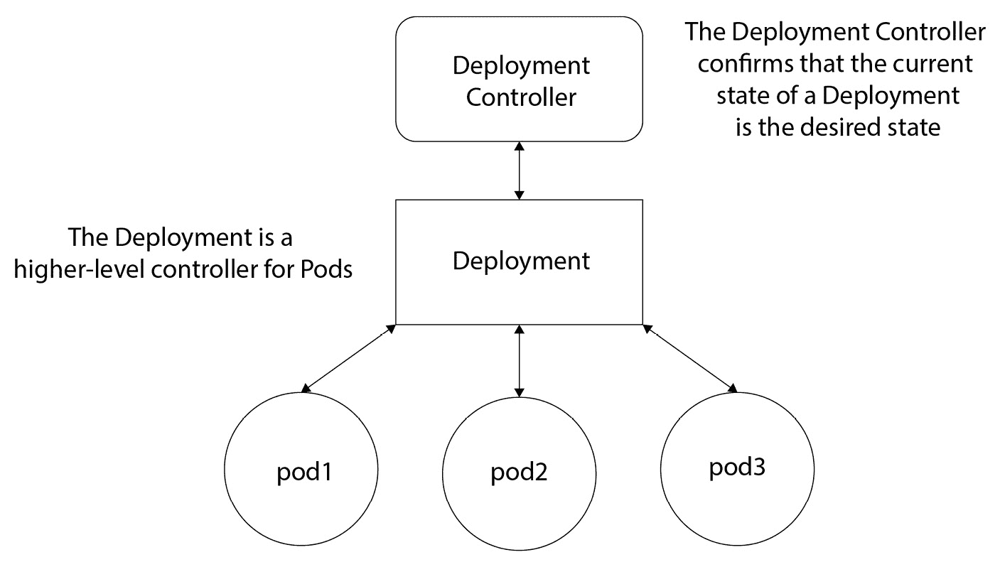
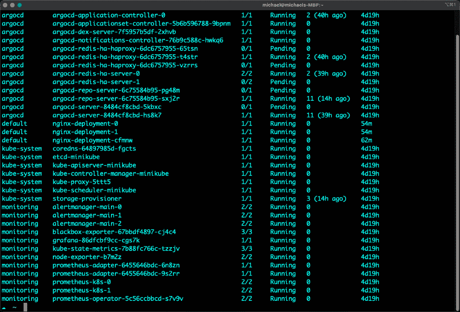
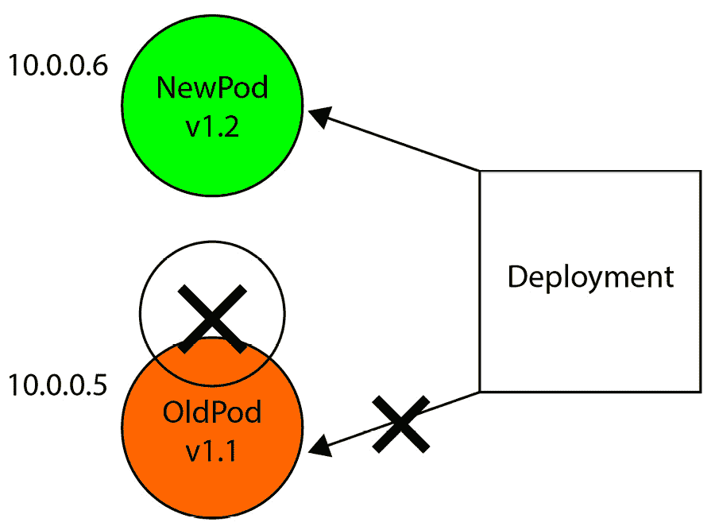

# 像真正的云原生应用一样部署 Kubernetes 应用

当工程师开始听说 Kubernetes 或者想要开始实施它时，通常是出于管理和部署应用的开发视角。Kubernetes 使工程团队生活更轻松的整个前提，无论是开发还是运维，都是基于应用部署的。

部署应用是每个企业头脑中的重点，不管是网站、移动应用，还是任何公司的内部应用，从软件公司到汽车零件公司再到啤酒制造商。无论行业如何，几乎每家公司都部署某种类型的应用和软件。正如所有工程师所知道的那样，成功部署和维护一个应用并不是一件容易的事情。无论你是在裸金属上、虚拟机上、云端，还是甚至在容器中运行应用，这个应用可能是（而且很可能是）决定一个成功的企业和破产公司的关键。

在本章中，你会发现很多话题会让你想起其他应用部署的方式。从实际部署到扩展和升级，整体概念是相同的。例如，扩展应用就是扩展应用。在 Kubernetes 中没有什么神奇的新方法。然而，Kubernetes 给你带来的好处是扩展的简易性。话虽如此，你会注意到的一个重要点是，Kubernetes 并没有重新发明轮子。它只是让我们已经做了 30 多年的事情变得更加简单。

本章将涵盖以下主要话题：

+   云原生应用

+   控制器、控制器部署和 Pods

+   隔离和命名空间

+   无状态应用和有状态应用

+   升级部署

# 技术要求

为了跟上本章的内容，你应该已经通过 Kubernetes 清单部署了一个 Kubernetes 应用。本章将详细讲解部署应用的过程以及什么是 Kubernetes 清单，但要完全理解本章，你应该熟悉部署过程。可以这样想——你应该处于 Kubernetes 部署过程的初级/中级水平，而本章将帮助你达到生产级水平。

本章的代码可以在以下 GitHub 链接中找到：[`github.com/PacktPublishing/50-Kubernetes-Concepts-Every-DevOps-Engineer-Should-Know/tree/main/Ch5`](https://github.com/PacktPublishing/50-Kubernetes-Concepts-Every-DevOps-Engineer-Should-Know/tree/main/Ch5)

# 理解云原生应用

尽管今天的*云原生*概念可能感觉有些像流行词，但构建云原生应用的想法还是有一定价值的。应用的架构方式很重要，因为它关系到应用后期如何部署、管理和维护。平台的构建方式也很重要，因为这是应用如何部署和运行的起点。

在技术发展多年的过程中，关于应用架构和构建方法，曾经有过多种不同的思路。最初的方法围绕着本地系统形成，比如大型主机和服务器。之后，应用开始针对虚拟化硬件平台进行架构设计，比如 ESXi 和其他虚拟化产品，目的是利用服务器的更多资源，而不是像裸金属时代那样仅运行单一工作负载。虚拟化之后，应用的架构和规划开始围绕云工作负载展开，这引入了云原生的概念，即如果应用仅在云中运行，它们将如何工作。带宽、服务器大小以及整体成本等因素引发了许多关于云工作负载的讨论，而且至今仍在讨论之中。

现在，我们正面临着*第四阶段*——容器化工作负载。容器化工作负载真正推动了云原生应用和部署的关注，特别是随着微服务概念开始成为许多组织的现实，五年前它们可能还认为这是不可能的。

在这一部分，你将学习云原生应用是什么，以及应用架构、云部署和微服务的简要历史。

## 什么是云原生应用？

在以云原生方式部署应用之前，让我们先退一步，思考一个核心计算机科学概念——分布式计算。

分布式计算是研究分布式系统的领域，而分布式系统是指那些其组件位于不同网络连接的计算机上的系统。这些不同的网络连接的计算机随后相互通信，来来回回地发送数据或数据包。

这里重要的是——分布式系统等于多个系统上的多个软件组件，它们作为一个单一系统运行。分布式计算听起来像微服务，对吧？（稍后会详细介绍微服务。）

云原生将分布式计算的概念扩展到一个全新的层次。想象一下从 AWS 或 Azure 的角度来看。AWS 和 Azure 从定义上来说就是分布式系统。当你登录 AWS 控制台时，数不清的服务触手可及——EC2、数据库、存储，还有更多其他服务。你与这些服务的互动来源于一个*单一系统*，但构成该*单一系统*的网络组件跨越了全球多个数据中心，涵盖了成千上万台服务器。然而，云原生并不仅仅意味着公共云。请记住，云是服务的分布。举个例子，*云原生*的东西也可以是一个完整的 OpenStack 服务器集群。

结合云原生和分布式计算的整体概念，你会得到一个主要概念——云原生应用。云原生应用旨在赋予你设计和构建以下类型应用的能力：

+   易于扩展

+   韧性

+   弹性

需要记住的重要一点是，这些概念与我们在工程领域中已经有的并没有什么不同。我们已经有了分布式计算很长时间。我们已经有了分布式应用一段时间。我们以前没有的是轻松实现分布式计算的能力。回想之前提到的 AWS 或 Azure 的例子，我们需要多久才能构建出像 Azure 或 AWS 那样的基础设施？再想想，管理和维护这些基础设施需要多少人。借助云级别的分布式计算，所有的*第一天*配置都已经被抽象出来，你只需要担心*第二天*的复杂性，构建云原生/分布式计算应用。

在云中，如果你想要扩展应用，只需要点击几个按钮，写几行代码，瞬间就能创建自动扩展组。如果你想构建韧性强的应用，只需要指点并点击选择数据中心来运行你的应用，而无需物理建设这些数据中心。再次强调，分布式计算的概念与云原生及云原生应用是相同的。不同之处在于，你无需担心构建数据中心，你只需关注应用的扩展。

## 云特定的云原生

无论是在云中进行标准应用部署，还是在 Kubernetes 中进行应用部署，必须记住的一个重要点是，*云原生*并不仅仅意味着*云*。它更多的是一个整体概念，但再说一次，云原生的核心思想是分布式计算，而无需关注第一天的实现和配置。

例如，假设我们以 OpenStack 为例。OpenStack 是一个私有云。你可以在自己的数据中心部署 OpenStack，并像使用任何其他云服务一样与之互动。然而，问题在于——一些团队可能会将其视为云原生，而另一些团队则可能将其视为一般的分布式计算。正在构建 OpenStack 的基础设施团队将看到*幕后*的配置，例如构建硬件并在多个数据中心之间扩展。对他们来说，这与标准的分布式计算环境没有什么不同。对于构建、管理和维护 AWS 或 Azure 基础设施的工程师们来说，也是如此。然后，还有一些团队会在 OpenStack 已经搭建好后与其互动。他们通过 UI 登录并通过 CLI 以及其他 API 方法与 OpenStack 通信，因此他们体验到的是真正的云原生环境的完整满足感，就像许多工程师在与 AWS 和 Azure 互动时，能够充分满足对基础设施和本地服务无需担心的需求。

另一个例子是混合云。如果你在本地运行 Azure Stack HCI，那么意味着你正在使用某些服务器运行 Azure Stack HCI 操作系统，并与 Azure 云进行交互。管理 Azure Stack HCI 的工程师们看到的是幕后发生的事情。而那些仅仅与**Azure Kubernetes 服务**（**AKS**）互动的工程师则看不到底层基础设施。他们只知道他们去特定的位置创建一个新的 Kubernetes 集群。

无论平台或应用程序在哪里部署，它对于某些人来说可能是云原生的，而对于另一些人来说则是标准的分布式计算。你可以是一个正在构建云原生平台的工程师，以便其他人可以以云原生的方式与之互动。

## 什么是微服务？

将分布式计算和云原生的概念提升到一个新高度，就得到了微服务。按定义，微服务是一种松耦合架构，组件之间没有相互依赖。

假设你有五个部分组成你的应用程序：三个后端 API，一些中间件用于连接后端和前端，和一个由多个路径组成的前端网站。在单体式环境中，你会将整个应用程序打包，部署到服务器上并运行二进制文件。然后，如果你需要更新或升级该应用程序的任何部分，例如某个后端 API，你就必须关闭其他部分的应用程序。这样不仅会导致生产环境停机，还会减缓推出新更新和新功能的能力，因为你必须指定一个特定的时间窗口来关闭整个平台。

微服务允许你将应用程序的这五个部分拆分成各自独立的部分。然后，你可以单独管理这些*部分*，而不是担心将它们组合起来进行部署并确保平台正常工作。

在 Kubernetes 环境中，你将拥有以下内容：

+   后端 API 1 的一个容器镜像

+   后端 API 2 的一个容器镜像

+   后端 API 3 的一个容器镜像

+   中间件的一个容器镜像

+   前端的一个容器镜像

然后，每个容器镜像都可以分别进行更新、升级、部署和管理。

重要的是要注意，微服务不仅适用于容器和 Kubernetes。之前讨论的相同概念在五个不同的 Ubuntu 虚拟机上也可以很好地工作。只是从微服务的角度管理容器要比从虚拟机的角度管理容器更容易。在 Kubernetes 中做同样的事情，比在虚拟机上做需要的自动化和可重复实践要少得多。虽然这完全可行，但需要更多的努力。

在下一节中，你将把本节所学的内容应用到基于 Kubernetes 的场景中。

# 学习 Kubernetes 应用程序部署

当工程师首次开始将应用程序部署到 Kubernetes 集群时，它看起来像这样：

1.  创建一个 Kubernetes 清单。

1.  运行类似`kubectl apply -f`或`kubectl create -f`的命令，针对清单进行操作。

1.  确保应用程序有 Pods 正在运行。

1.  访问你的应用程序，以确保它按照预期的方式运行。

虽然这是一种很好的开始部署应用程序到 Kubernetes 的方法，但我们必须深入探讨，以便完全理解应用程序部署过程是如何进行的，为什么它以这种方式工作，清单如何与 Kubernetes 交互以确保应用程序部署，以及 Kubernetes 如何保持 Pods 的期望状态。

看起来 Kubernetes 部署应用程序的方式简直像是在平台上发生的魔法，因为它就是这样构建的，应该就是这种方式，但实际上，Kubernetes 背后有着大量的组件，它们使得 Kubernetes 看起来像是一个神奇的部署平台。

在本节中，你将从头到尾学习 Kubernetes 中应用程序部署的工作原理以及成功部署所需的一切内部细节。

## Kubernetes 清单

在实际部署应用程序之前，你需要了解大多数应用程序是如何部署到 Kubernetes 的——一个**Kubernetes 清单**。这个概念是你已经知道什么是 Kubernetes 清单，但可能不了解 Kubernetes 清单的内部结构。

Kubernetes 清单是一个基于 YAML 或 JSON 的配置，它以不同的方式与 Kubernetes API 进行交互。Kubernetes 清单是你指定想要使用哪个 API，以及从该 API 中要操作哪个资源的地方。API 分为两大类：

+   `/api/v1`

+   `/apis/$GROUP_NAME/$VERSION`

例如，以下是一个代码片段，展示了 Deployment 资源位于 `/``api/v1` 组中：

```

apiVersion: apps/v1
kind: Deployment
```

以下是另一个 Ingress 控制器的示例，你可以看到它位于 `/apis/networking.k8s.io/v1`：

```

apiVersion: networking.k8s.io/v1
kind: Ingress
```

`apiVersion` 是你正在使用的 Kubernetes API，`kind` 是你正在创建、更新或删除的 Kubernetes 资源。

一个 Kubernetes 清单由四个关键部分组成：

+   `apiVersion`: 你用来创建对象/资源的 Kubernetes API 版本

+   `Kind`: 你想要创建、更新或删除的对象类型

+   `Metadata`: 帮助唯一标识资源/对象的数据

+   `Spec`: 你希望资源的样子

以下是一个 Kubernetes 清单：

```

apiVersion: apps/v1
kind: Deployment
metadata:
  name: nginx-deployment
spec:
  selector:
    matchLabels:
      app: nginxdeployment
  replicas: 2
  template:
    metadata:
      labels:
        app: nginxdeployment
    spec:
      containers:
      - name: nginxdeployment
        image: nginx:latest
        ports:
        - containerPort: 80
```

让我们来解析一下。

首先是 API 版本。你可以看到 API 版本表示它正在使用核心组中的资源。接下来是 `kind`，它指定你正在创建/更新/删除的资源类型。然后是 `metadata`，它为部署指定了一个名称，以便通过元数据唯一标识它。最后是 `spec`，它表示你希望容器化应用的样子。例如，之前显示的 spec 指示清单正在使用最新版本的 Nginx 容器镜像并使用端口 `80`。

为了总结这一部分，你需要了解关于 Kubernetes 清单以及 Kubernetes 的一般工作方式的一点是，它是声明式的。声明式意味着“*告诉我做什么，而不是如何做*”。命令式意味着“*告诉我做什么以及如何做*”。

例如，假设你在教别人如何做蛋糕。如果是命令式，你会告诉这个人使用什么食材、每种食材的分量以及如何一步步操作，最终引导他们完成成品。声明式则意味着你告诉他们需要哪些食材，剩下的由他们自己想办法完成。

Kubernetes 清单是声明式的，因为你告诉 Kubernetes 你想创建什么资源，包括资源的名称、端口、卷等，但你并不告诉 Kubernetes 如何创建该资源。你只需定义你想要的内容，而不告诉它怎么做。

### 常见但非唯一的方式

十有八九，当你将资源部署到 Kubernetes 时，你很可能会使用 Kubernetes 清单。然而，正如你在本书中所学到的那样，Kubernetes 的核心是一个 API。因为它是一个 API，所以你可以使用任何编程方法与它进行交互。

例如，以下是使用 Pulumi（一种流行的 IaaS 平台）在 Kubernetes 内创建 Nginx 部署的代码片段。此代码需要更多步骤才能运行，所以不要尝试运行它。这只是一个伪代码示例。

这里没有 YAML，也没有配置语言。它是原生的 Go (Golang) 代码与 Kubernetes API 交互：

```

        deployment, err := appsv1.NewDeployment(ctx, conf.Require("deployment"), &appsv1.DeploymentArgs{
            Spec: appsv1.DeploymentSpecArgs{
                Selector: &metav1.LabelSelectorArgs{
                    MatchLabels: appLabels,
                },
                Replicas: pulumi.Int(2),
                Template: &corev1.PodTemplateSpecArgs{
                    Metadata: &metav1.ObjectMetaArgs{
                        Labels: appLabels,
                    },
                    Spec: &corev1.PodSpecArgs{
                        Containers: corev1.ContainerArray{
                            corev1.ContainerArgs{
                                Name:  pulumi.String(conf.Require("containerName")),
                                Image: pulumi.String(conf.Require("imageName")),
                            }},
                    },
                },
            },
        })
        if err != nil {
            return err
        }
```

虽然你不会经常看到这种方法，但你应该知道这种方法的存在，你可以在 Kubernetes 中以任何编程方式创建任何资源，只要你通过 Kubernetes API 来操作。

## 控制器和操作员

Kubernetes 默认提供了一种方式来确保已部署应用程序的当前状态是期望的状态。例如，假设你部署了一个 Kubernetes 部署，它应该有两个副本。然后，由于某种原因，其中一个 Pod 被删除。部署控制器会察觉到这一点，并做出相应处理，确保创建第二个副本/Pod。所有可以在 Kubernetes 中创建的资源（如 Pods、Services、Ingress、Secrets 等）都有一个 **控制器**。

**操作员**是控制器的一种特殊形式。操作员实现了控制器模式，它们的主要工作是将 Kubernetes 集群中的资源移动到期望的状态。

操作员还通过使用 **CustomResourceDefinitions** (**CRDs**) 扩展了 Kubernetes API，CRD 是一种让工程师可以利用现有 Kubernetes API 的方式，而无需构建整个控制器，而是直接使用 CRD 控制器。你会看到许多与 Kubernetes 集成的产品/平台来创建 CRD。

构建你自己的操作员和控制器的流行方式是使用 Kubebuilder：[`book.kubebuilder.io/`](https://book.kubebuilder.io/)。



](img/B19116_05_01.jpg)

图 5.1 – 控制器

你会听到 *操作员* 和 *控制器* 这两个术语交替使用。为了帮助理解，只需记住，操作员就像是高层的大老板，确保组织运作良好，而控制器则像是工程师，亲自操作，确保组织得到所需的资源。

其中一种日益流行的形式是 GitOps。GitOps 查看存储在源代码管理中的 Kubernetes 清单的期望状态，而不是像控制器那样查看 Kubernetes 集群中当前部署的内容。

## 使用更高层次控制器的不同部署方式

当你单独部署一个 Pod 时，清单可能看起来如下所示：

```

apiVersion: v1
kind: Pod
metadata:
  name: static-web
  labels:
    role: myrole
spec:
  containers:
    - name: web
      image: nginx
      ports:
        - name: web
          containerPort: 80
          protocol: TCP
```

这种方法的问题在于你没有一个高层次的控制器来管理 Pod。如果没有像 Deployment 或 DaemonSet 这样的高层次控制器，当 Pod 失败时，kubelet 会监视静态 Pod 并在其失败时重新启动它。并且也没有对当前状态和期望状态的管理。从生产角度来看，你永远不应该单独部署一个 Pod 资源。如果你想测试一个容器镜像，那是可以的，但就仅此而已。它应该仅用于测试/开发目的。

并非总是如此，但大多数情况下，你会看到以下这些管理 Pods 的生产级控制器：

+   **Deployments**：部署是 Core API 组中最高层次的控制器之一。它让你能够控制一个 Pod 或多个副本，并在集群中进行扩展。Deployments 还让你具备自我修复能力，并确认已部署的容器化应用的当前状态是期望的状态。以下是一个部署资源的示例代码：

    ```

    apiVersion: apps/v1
    ```

    ```

    kind: Deployment
    ```

    ```

    metadata:
    ```

    ```

      name: nginx-deployment
    ```

    ```

    spec:
    ```

    ```

      selector:
    ```

    ```

        matchLabels:
    ```

    ```

          app: nginxdeployment
    ```

    ```

      replicas: 2
    ```

    ```

      template:
    ```

    ```

        metadata:
    ```

    ```

          labels:
    ```

    ```

            app: nginxdeployment
    ```

    ```

        spec:
    ```

    ```

          containers:
    ```

    ```

          - name: nginxdeployment
    ```

    ```

            image: nginx:latest
    ```

    ```

            ports:
    ```

    ```

            - containerPort: 80
    ```

+   **DaemonSets**：这类似于一个部署资源，但它是集群范围的。它确保所有节点或你选择的节点都运行 Pod 的副本/复制品。你会看到 DaemonSet 的一个关键区别是没有副本字段。这是因为 Pod 的副本数不能超过工作节点的数量，也就是说，如果你只有三个工作节点，就不能有五个 Pod 副本。在这种情况下，你只能有三个 Pods。以下是一个 DaemonSet 示例代码：

    ```

    apiVersion: apps/v1
    ```

    ```

    kind: DaemonSet
    ```

    ```

    metadata:
    ```

    ```

      name: nginx-deployment
    ```

    ```

    spec:
    ```

    ```

      # nodeSelecter: Field that you can specify what worker nodes you want the Pod to deploy to
    ```

    ```

      selector:
    ```

    ```

        matchLabels:
    ```

    ```

          app: nginxdeployment
    ```

    ```

      template:
    ```

    ```

        metadata:
    ```

    ```

          labels:
    ```

    ```

            app: nginxdeployment
    ```

    ```

        spec:
    ```

    ```

          containers:
    ```

    ```

          - name: nginxdeployment
    ```

    ```

            image: nginx:latest
    ```

    ```

            ports:
    ```

    ```

            - containerPort: 80
    ```

+   `StatefulSet`：

    ```

    apiVersion: apps/v1
    ```

    ```

    kind: StatefulSet
    ```

    ```

    metadata:
    ```

    ```

      name: nginx-deployment
    ```

    ```

    spec:
    ```

    ```

      selector:
    ```

    ```

        matchLabels:
    ```

    ```

          app: nginxdeployment
    ```

    ```

      serviceName: nginxservice
    ```

    ```

      replicas: 2
    ```

    ```

      template:
    ```

    ```

        metadata:
    ```

    ```

          labels:
    ```

    ```

            app: nginxdeployment
    ```

    ```

        spec:
    ```

    ```

          containers:
    ```

    ```

          - name: nginxdeployment
    ```

    ```

            image: nginx:latest
    ```

    ```

            ports:
    ```

    ```

            - containerPort: 80
    ```

    ```

    ---
    ```

    ```

    apiVersion: v1
    ```

    ```

    kind: Service
    ```

    ```

    metadata:
    ```

    ```

      name: nginxservice
    ```

    ```

    spec:
    ```

    ```

      selector:
    ```

    ```

        app: nginxdeployment
    ```

    ```

      ports:
    ```

    ```

        - protocol: TCP
    ```

    ```

          port: 80
    ```

    ```

      clusterIP: None
    ```

在选择使用哪个控制器时，这将取决于你的使用场景。除非是一些直接明了的情况，比如，如果你有一个需要保持其网络 ID 的容器化应用，那么你将使用 StatefulSet。

## 扩展

Kubernetes 的一个关键组件是它能够轻松地实现水平和垂直扩展。从生产角度来看，这大大减轻了你的负担。在标准的虚拟机环境中，你需要担心部署新的服务器、安装操作系统、更新软件包并部署应用程序二进制文件，最后，应用才会运行。

水平 Pod 自动扩展是最常见的方式，这意味着会创建更多的 Pods 来处理负载。垂直自动扩展意味着提升 Pod 的 CPU/内存。垂直 Pod 自动扩展并不常见，但也是可行的。

在扩展时，你可以使用标准的 ReplicaSets，但在生产环境中，副本数可能并不那么简单。例如，如果你有三个副本，但可能需要四个或十个副本，你需要一种方法来应对这种情况。你能做的最好的事情是至少从三个到四个副本开始，如果需要，逐步增加。如果你必须扩展到五个或十个副本，你可以更新 Kubernetes 清单，并使用 GitOps 解决方案或其他可重复的方式，使用`kubectl apply -f` `name_of_manifest.yaml`命令重新部署。

当你在扩展一个 Pod，或者说，当你在进行任何 Pod 部署操作时，永远不要使用像`kubectl patch`这样的命令，或者在命令行上的其他快速修复方法。如果你这么做，每次 Pod 被重新部署时，你的配置将不复存在，因为你是在命令行上临时/手动修改的。始终在 Kubernetes 清单中进行更改，并正确部署（记住，当前状态与期望状态的关系）。

### 如何水平扩展 Pods

当你水平扩展 Pods 时，关键在于副本数。例如，假设你有一个像下面这样的 Kubernetes 清单，其中包含两个副本：

```

apiVersion: apps/v1
kind: Deployment
metadata:
  name: nginx-deployment
spec:
  selector:
    matchLabels:
      app: nginxdeployment
  replicas: 2
  template:
    metadata:
      labels:
        app: nginxdeployment
    spec:
      containers:
      - name: nginxdeployment
        image: nginx:latest
        ports:
        - containerPort: 80
```

你在前述清单上运行`kubectl apply -f nginx.yaml`，然后你意识到，由于 Nginx 前端的用户负载，你需要将副本数从两个增加到四个。此时，你可以更新 Kubernetes 清单，将副本数从两个更改为四个：

```

apiVersion: apps/v1
kind: Deployment
metadata:
  name: nginx-deployment
spec:
  selector:
    matchLabels:
      app: nginxdeployment
  replicas: 4
  template:
    metadata:
      labels:
        app: nginxdeployment
    spec:
      containers:
      - name: nginxdeployment
        image: nginx:latest
        ports:
        - containerPort: 80
```

这种方法不会重新创建任何东西，因为你使用的是`kubectl apply -f`而不是`kubectl create -f`。`create`用于创建全新的资源，而`apply`用于更新/修补现有资源。

### 如何垂直扩展 Pods

如前所述，垂直扩展 Pods 并不是常见的做法。然而，它是可行的。典型的方法是使用来自`autoscaling.k8s.io` API 的`VerticalPodAutoscaler`资源。它使你能够指向现有的部署，以便该部署由自动扩展器管理。例如，以下 Kubernetes 清单显示了一个名为`nginxdeployment`的部署的目标引用：

```

apiVersion: autoscaling.k8s.io/v1
kind: VerticalPodAutoscaler
metadata:
  name: nginx-verticalscale
spec:
  targetRef:
    apiVersion: "apps/v1"
    kind:       Deployment
    name:       nginxdeployment
  updatePolicy:
    updateMode: "Auto"
```

请注意，启用垂直 Pod 自动扩展器并将更新模式设置为`Auto`时，它将具备以下能力：

+   删除 Pods

+   调整 CPU

+   调整内存

+   创建一个新的 Pod

这需要重新启动在 Pod 内运行的应用程序。

## 多容器 Pods

**Sidecar**，有时也叫做**多容器 Pod**，是一种将容器紧密耦合到一个 Pod 中的方式。通常，尤其从应用程序的角度来看，一个 Pod 运行一个容器。然而，也有一些使用场景需要运行 sidecar。最大的使用场景是当你运行某种日志收集器/聚合器时。许多工程师会将运行日志收集器的容器放到与应用程序一起运行的同一个 Pod 中。这样，容器之间可以直接通信，并且可以从应用程序中拉取日志，因为 Pod 内的容器共享相同的 IP 地址，但可以通过不同的端口进行访问。

你绝对不应该做的一件事是将多个应用程序运行在一个 Pod 中。例如，你绝对不想把前端应用和后端应用放在同一个 Pod 中。这完全违背了容器和微服务的初衷。Sidecar 仅适用于非常特定的用例，并且只有在绝对必要的情况下才使用。我个人的看法是，除非你真的必须使用，否则绝不要使用 sidecar。其他工程师可能不同意我，但我认为一个 Pod 应该只运行一个工作负载。这正是微服务架构的目的。我认为唯一绝对必要的情况是，当你运行服务网格并且需要将服务网格代理放入 Pod 中时。

以下是如果你在 Pod 中有多个容器，Kubernetes 清单将是什么样子。注意在`spec.containers`下有`container1`和`container2`：

```

apiVersion: v1
kind: Pod
metadata:
  name: testsidecar
spec:
  containers:
  - name: container1
    image: nginx
  - name: container2
    image: debian
    command: ["/bin/sh", "-c"]
```

## 活跃性和就绪性探针

每当你部署任何类型的应用程序时，无论它是否容器化，你都需要确保该应用程序按预期运行。在容器化环境中，情况也是一样的。假设你有一个运行 Nginx 前端的 Pod。Pod 可能已经启动并运行，具备所有适当的资源，等等。然而，这并不意味着 Pod 内运行的二进制文件按预期工作。为了确保实际应用程序按预期运行，你可以使用**活跃性探针**和**就绪性探针**。

活跃性探针表示容器是否正在运行。它帮助 Kubernetes 了解 Pod 的整体健康状况。kubelet 会不断向容器发送类似*ping*的信号，确保容器按预期运行。如果活跃性探针认为容器不健康，kubelet 会重启 Pod。

就绪性探针表示容器是否准备好接收请求。从应用程序的角度来看，就绪性探针更为重要，因为它告诉 Kubernetes 是否将服务流量路由到 Pod。如果服务尝试将流量路由到一个 Pod，而这个 Pod 已经宕机或不健康，应用程序将无法访问。就绪性探针告诉服务哪些 Pod 已准备好接收请求，哪些没有。

以下是一个就绪性探针的示例：

```

apiVersion: apps/v1
kind: Deployment
metadata:
  name: nginx-deployment
spec:
  selector:
    matchLabels:
      app: nginxdeployment
  replicas: 2
  template:
    metadata:
      labels:
        app: nginxdeployment
    spec:
      containers:
      - name: nginxdeployment
        image: nginx:latest
        imagePullPolicy: Never
        ports:
        - containerPort: 80
        readinessProbe:
          tcpSocket:
            port: 8080
          initialDelaySeconds: 5
          periodSeconds: 10
```

以下是一个活跃性探针的示例：

```

apiVersion: apps/v1
kind: Deployment
metadata:
  name: nginx-deployment
spec:
  selector:
    matchLabels:
      app: nginxdeployment
  replicas: 2
  template:
    metadata:
      labels:
        app: nginxdeployment
    spec:
      containers:
      - name: nginxdeployment
        image: nginx:latest
        imagePullPolicy: Never
        ports:
        - containerPort: 80
        livenessProbe:
          httpGet:
            scheme: HTTP
            path: /index.html
            port: 80
          initialDelaySeconds: 5
          periodSeconds: 5
```

所有生产级的 Kubernetes 部署都应该使用就绪探针（readiness probes）。

在下一节中，你将深入探讨一个重要的话题——如何隔离你的容器化应用程序，以及几种不同的实现方式。

# 探索隔离和命名空间

一旦应用程序部署完成，工程师们会擦去额头上的汗水，与团队击掌庆祝胜利。然而，部署之后发生了什么呢？更重要的是，如果你需要重新部署这些应用程序呢？或者部署其他类型的应用程序？或者部署到不同的位置或隔离点？（隔离将在本章后面讨论。）让一个应用程序上线本身就是一项心理挑战，但你问自己的*接下来会发生什么*的问题通常是最重要的。这些问题包括以下内容：

+   下一次部署会是自动化且可重复的吗？

+   如果你需要重新部署应用程序，这次部署会有效吗？

+   应用程序能（或应该）相互靠得这么近一起运行吗？

+   哪些工程师应该访问哪些应用程序，为什么？

部署应用程序是一项巨大的胜利，但设计应用程序应该如何运行以及在哪运行，是决定成功与失败生产环境之间的关键。关于应用程序隔离和多租户的问题常常让工程师们彻夜难眠，因为它们不仅仅是*工程*工作，更是规划和架构工作。它们更少涉及实际的键盘操作，而更多是需要从更高层次进行批判性思考，而非埋头写代码。

在本节中，你将学习一些最流行的隔离技术。让我们开始吧！

## 命名空间

隔离的第一个层次通常是**命名空间**。当你部署 Pods 时，最不希望做的事就是将所有东西都部署到默认命名空间。相反，你希望确保应用程序有各自的命名空间。在网络层面，一个命名空间中的 Pods 可以与另一个命名空间中的 Pods 通信。然而，如果你有一个用于在某个命名空间中部署 Pods 的服务账户，而另一个命名空间有一个用于部署 Pods 的服务账户，那么同一个服务账户就不能用于管理所有 Pods。这从 Pod 管理的角度提供了一定程度的隔离，并确保有适当的身份验证和授权。但从网络的角度来看，Pods 仍然可以与其他命名空间中的 Pods 进行通信。

请注意*图 5.2*中有三个命名空间：

+   `argoCD`

+   `kube-system`

+   `monitoring`



](img/B19116_05_02.jpg)

图 5.2 – Kubernetes 资源

上面的截图显示，`argocd`命名空间中的所有内容都与`kube-system`命名空间中的所有内容隔离/分开。如果工程师运行`kubectl get pods`，他们将只会看到他们有权限访问的命名空间中的 Pods。

## 单一租户

将隔离和分离推向更深层次的是**租户模型**。首先，让我们从**单租户**开始，但在深入之前，先讨论一下 Kubernetes 中的租户模型是什么意思。

通过租户隔离可以涉及用户、工程师、应用以及各种不同的资源。例如，单租户可能意味着在集群上运行一个容器化的应用，或者可能意味着确保一个工程师可以访问一个集群，而其他人无法访问，但他们可以运行任意多的应用。

单租户的一个典型场景是隔离开发环境。假设你是一个开发人员，需要一个 Kubernetes 集群来测试应用栈。场景是，平台工程团队，或任何管理 Kubernetes 集群的团队，给你一个专属的 Kubernetes 集群来测试应用栈。这是执行单租户的一个好方法，因为它允许不同技术栈的所有工程师在不干扰或影响其他应用栈的情况下测试他们的代码。

## 多租户

相对而言，**多租户**则是另一种情况。多租户指的是多个工程师、用户或应用在同一个 Kubernetes 集群上运行。如果你再次查看显示命名空间的*Figure 5**.2*，你会看到 Prometheus、ArgoCD 和 Nginx 运行在同一个集群上。这被认为是一个多租户集群。如果 ArgoCD、Nginx 和 Prometheus 分别运行在不同的集群上，那就是单租户。

在现实世界中，很少看到应用程序运行在不同的集群上，或者说每个集群运行一个应用程序。相反，你通常会看到应用程序使用多租户模型，而开发人员测试应用栈时使用单租户模型，一旦应用栈经过测试，它就会与其他应用一起迁移到 Kubernetes 集群中。

在下一节中，你将学习如何理解无状态应用、有状态应用和卷。

# 调查无状态和有状态应用

从高层次来看，应用有两种形式——需要存储数据的应用和不关心数据是否存储状态的应用。让我们思考两个不同的场景。

当你登录到 Gmail 帐户或其他电子邮件服务提供商时，一切都会保持在应该存在的位置。你可以看到收件箱中的邮件、已发送的邮件、垃圾桶中的邮件，等等。应用程序/平台保持正常工作，因为数据是有状态的。现在，换一个角度来讲，考虑一下`www.google.com`。当你在网页浏览器中访问`www.google.com`时，你总是从头开始。输入问题的框在那儿，但是你之前向 Google 提出的问题的结果却没有显示。它总是一个全新的、干净的页面。这是因为`www.google.com`是无状态的，也就是说，它不会在每次搜索后将你的数据保存到网页浏览器中（当然，它确实会保存一些数据，但那是另一个话题）。

当然，有状态与无状态的问题是一个更为深刻的讨论，但这只是你可以用来理解这两种不同类型应用的一个高层次定义。

在下一节中，你将学习 Kubernetes 中有状态和无状态应用的不同部署方法，以及包括 Pod 的限制、配额和请求在内的资源考虑因素，以确保你运行的生产级环境是可持续的。

## 有状态与无状态

在本节开头，我分享了 Gmail 的例子，实际上展示了什么是有状态应用，什么是无状态应用。从 Kubernetes 的角度来看，关键区别在于无状态应用不需要存储数据。 有状态应用需要后端存储，例如卷。另一个关键区别是，有状态应用需要保持唯一的 ID，所以如果一个 Pod 宕机，替代它的 Pod 必须拥有相同的唯一 ID。而无状态应用则不需要保持唯一的 ID。

一个常见的误解是，无状态应用从不使用卷，但事实并非如此。例如，你可以有一个无状态应用，它可能需要一个后端数据库或一个卷/硬盘来存储值。

卷和硬盘并不是构成有状态应用的因素，唯一的 ID 才是构成有状态应用的关键。

## 容器存储接口

为了使 Kubernetes 与非本地的外部组件进行交互，必须有一种插件。你在前几章中学习了**容器网络接口**（**CNI**），它是一个插件，可以在 Kubernetes 中使用不同的网络框架。**容器存储接口**（**CSI**）与此类似，但它是针对存储设备的。例如，你可以为 NetApp、AWS S3、Azure 存储以及许多其他存储提供商使用 CSI。

在有了这些接口之前，组织必须将代码放入以连接不在核心 Kubernetes 代码中的资源。仅举个例子，假设 Azure 想允许 Kubernetes 工程师在 Kubernetes 内部使用 Azure 存储来存储 Pod 的输出。在 CSI 出现之前，Azure 必须将使这一切成为可能的代码放入核心 Kubernetes 代码中。这是一个很大的麻烦，因为 Azure 不仅需要等待 Kubernetes API 的新版本发布才能推出该功能，而且如果存在 Bug 或需要推出新更新，它们还必须等待下一个 Kubernetes API 发布。

CSI，以及 Kubernetes 中的通用接口/插件，确保组织可以单独为 Kubernetes 创建插件，而不是依赖核心 Kubernetes 代码。

如果你想看一个 CSI 的例子，可以在 GitHub 上查看：[`github.com/kubernetes-sigs/azuredisk-csi-driver.`](https://github.com/kubernetes-sigs/azuredisk-csi-driver%0D)

## 卷

**Volumes** 是硬盘，简单明了。

有了卷，你可以让一个 Pod 或多个 Pod 在某个位置存储数据。该位置可以是 Azure、AWS、NetApp、其他某个存储提供者，甚至是 Pod 运行的 worker 节点（绝对不推荐。这只是一个例子）。

当为 Pod 创建卷时，通常有三个步骤：

+   **StorageClass**: 存储类是向某个存储供应商（动态地）请求硬盘的一种方式。例如，你可以创建一个连接到 EBS 的存储类。然后，稍后可以使用卷（你马上就会学到的）调用该存储类，并利用与存储的连接。你可以在 Azure、GCP 和所有其他云提供商，包括大多数存储提供者中做同样的事情：

    ```

    kind: StorageClass
    ```

    ```

    apiVersion: storage.k8s.io/v1
    ```

    ```

    metadata:
    ```

    ```

      name: azurefile-csi
    ```

    ```

    provisioner: file.csi.azure.com
    ```

    ```

    allowVolumeExpansion: true
    ```

    ```

    mountOptions:
    ```

    ```

      - dir_mode=0777
    ```

    ```

      - file_mode=0777
    ```

    ```

      - uid=0
    ```

    ```

      - gid=0
    ```

    ```

      - mfsymlinks
    ```

    ```

      - cache=strict
    ```

    ```

      - actimeo=30
    ```

    ```

    parameters:
    ```

    ```

      skuName: Premium_LRS
    ```

+   **PersistentVolume**: 持久化卷由工程师手动创建，使用存储类从可用源利用存储。例如，持久化卷将连接到先前示例中的 EBS 存储类：

    ```

    apiVersion: v1
    ```

    ```

    kind: PersistentVolume
    ```

    ```

    metadata:
    ```

    ```

      name: azure-pv
    ```

    ```

    spec:
    ```

    ```

      storageClassName: " azurefile-csi "
    ```

    ```

      claimRef:
    ```

    ```

        name: azurefile
    ```

    ```

        namespace: default
    ```

+   **PersistentVolumeClaim**: 最后一部分是持久化卷索取，这是用户通常在创建 Pod 的 Kubernetes 清单中提出的请求，以使用存储类中可用的一些存储空间。工程师可以说：“嘿，我想要从这个存储类中为我的 Pod 使用 10 GB 存储空间”：

    ```

    apiVersion: v1
    ```

    ```

    kind: PersistentVolumeClaim
    ```

    ```

    metadata:
    ```

    ```

      name: azurefile
    ```

    ```

    spec:
    ```

    ```

      accessModes:
    ```

    ```

        - ReadWriteMany
    ```

    ```

      storageClassName: azurefile-csi
    ```

    ```

      resources:
    ```

    ```

        requests:
    ```

    ```

          storage: 10Gi
    ```

这时，你可能会想：“如果我可以通过声明自动请求一些存储，那为什么还需要持久化存储卷呢？”这是个好问题。答案取决于你的环境。如果你使用的是 NetApp 存储，且你有 1,000 GB 的存储空间，你需要工程师创建持久化存储卷并管理这些存储卷，因为你只有 1,000 GB 的存储。如果你尝试超过 1,000 GB，故障就会开始发生，因此让有人来管理它是有意义的。反过来，如果你使用的是云存储，如 Azure 或 AWS，那么这些存储对于用户来说是*无限*的（当然，你需要为此付费），所以直接申请一个持久化存储卷而不是让工程师创建持久化存储卷会更合理。

## 资源请求和限制

在任何生产环境中，你都有 Kubernetes 集群在服务器上运行，无论它是在本地还是托管的 Kubernetes 服务中。因为它们运行在服务器上，所以这些服务器有硬件资源，而所有服务器都有其资源限制。服务器上没有*无限的 CPU*或*无限的内存*。服务器的资源是有限的，服务器也能达到 100%的容量。

因此，当你创建 Pod 时，你应该指定资源限制和请求。你绝不希望让任何东西——无论是虚拟化的虚拟机还是容器化的应用程序——在环境中自由地占用尽可能多的 CPU 和内存。如果你不控制资源（例如内存和 CPU），每个应用程序都可能会随意占用它所需要的资源。

让我们考虑一个基本的例子。假设你有一个存在内存泄漏的应用程序。如果你将其容器化，那么它所在的 Pod 将持续消耗越来越多的内存，直到工作节点最终失败或应用程序崩溃，而你只能在为时已晚时才会知道。

在深入了解之前，我们先定义一下**限制**和**请求**之间的区别。

限制是告诉 Pod：“你不能超过这个限制。”例如，如果你为 Pod 指定了*X*数量的 CPU 或内存，那么该 Pod 就不能超过这个限制。它被完全封锁。

以下是限制的示例。如你所见，Nginx 应用程序的内存限制为 128 Mi。超过这个值，Kubernetes 会说：“不行，你不能拥有更多”：

```

    spec:
      containers:
      - name: nginxdeployment
        image: nginx:latest
        resources:
          limits:
            memory: "128Mi"
        ports:
        - containerPort: 80
```

请求是 Pod 能够保证获得的资源。如果 Pod 请求某个资源，Kubernetes 只会将它调度到能够提供该资源的工作节点上。

以下是请求的示例。在这个例子中，Kubernetes 会说：“好吧，你想要 64 Mi 内存和 250m 的 CPU。让我把你调度到一个可以处理这些的工作节点上”：

```

    spec:
      containers:
      - name: nginxdeployment
        image: nginx:latest
        resources:
          requests:
            memory: "64Mi"
            cpu: "250m"
        ports:
        - containerPort: 80
```

以下是完整的清单示例：

```

apiVersion: apps/v1
kind: Deployment
metadata:
  name: nginx-deployment
spec:
  selector:
    matchLabels:
      app: nginxdeployment
  replicas: 2
  template:
    metadata:
      namespace: webapp
      labels:
        app: nginxdeployment
    spec:
      containers:
      - name: nginxdeployment
        image: nginx:latest
        resources:
          requests:
            memory: "64Mi"
            cpu: "250m"
          limits:
            memory: "128Mi"
        ports:
        - containerPort: 80
```

### 你应该选择哪个？

对于请求和限制的工作方式，存在一些困惑。

当 Pods 使用完内存后，它们会将内存归还给工作节点，然后这些内存会回到资源池中供其他 Pods 使用。而 CPU 则不同，它不会被归还。Pod 会继续占用这个 CPU。因为这个原因，最佳实践不是让 Pod 一直占用 CPU 直到它被删除，因为它可能并不总是需要这么多的 CPU。这实际上是在浪费 CPU 资源。

那么，您应该选择哪一个呢？

在每个生产环境中，您应该始终设置请求，但您只应限制 CPU。

### 命名空间配额

当涉及到限制和请求时，您可以做的其中一件非常棒的事情就是为命名空间设置它们。例如，您可以为一个命名空间设置 1,000 Mi 的限制和 512 Mi 的请求。这样，所有在该命名空间中运行的节点会自动被限制到所需的资源，这意味着您不需要在每一个 Kubernetes Pod 清单中都设置限制和请求。以下代码块展示了资源配额：

```

apiVersion: v1
kind: namespace
metadata:
  name: test
---
apiVersion: v1
kind: ResourceQuota
metadata:
  name: memorylimit
  namespace: test
spec:
  hard:
    requests.memory: 512Mi
    limits.memory: 1000Mi
```

在接下来的最后一节中，您将学习如何升级应用程序以及不同类型的更新方法。

# 升级 Kubernetes 应用

在本章中，您学到了一些非常重要的知识：

+   如何部署应用程序

+   如何在 Kubernetes 上部署不同类型的应用

+   如何确保应用程序正确扩展

+   如何确保应用程序按预期运行

一旦您将应用程序部署到理想的状态，那将是一个巨大的成就。然后，不久之后，您就需要升级或更新应用程序，而您必须重新开始这整个过程。您必须测试新版本的应用程序，在不影响整个生产环境的情况下进行部署，并重新测试所有组件，以确保它按预期运行。

可能还有一些情况下，尤其是非常常见的情况，您必须将更新或升级回滚到先前的应用版本。也许它在预发布环境中没有经过充分测试，或者出现了 QA/回归测试没有捕获到的问题。无论如何，您都需要有一个可靠的计划和方法来进行回滚操作。

在本节中，您将学习几种不同的方式来测试应用程序的更新和升级，如何升级和更新在 Kubernetes 中运行的应用程序，以及如何在必要时回滚更新和升级。

## 升级类型

首先，让我们解析 Kubernetes 中的典型升级类型。

A/B 测试是一种将一组用户放在应用程序的一个版本上，另一组用户放在另一个版本上的方法。例如，假设您正在测试应用程序的两个版本，v1.1 和 v1.2。一个用户组将使用 v1.1，另一个用户组将使用 v1.2。此时，您可以测试诸如性能、用户如何与新版本应用程序交互、漏洞和问题等内容。这种测试类型是一种受控实验。

金丝雀发布与 A/B 测试几乎相同，只不过它是通过真实用户进行的。以之前的例子为例，假设你有 v1.1 和 v1.2 两个版本的应用。你将 v1.2 版本投入生产，并将一部分用户分配到 v1.2 版本，而另一部分用户仍然使用 v1.1 版本。通过这种方式，你可以观察用户如何与生产环境中的新版本进行互动。

蓝绿测试是指你有两个生产环境，一个运行 v1.1 版本，一个运行 v1.2 版本。所有用户仍然在 v1.1 上，但你会逐步将所有用户迁移到 v1.2 版本。一旦确认 v1.2 版本运行正常，所有用户都会迁移到 v1.2 版本。

在 Kubernetes 中，最常用的升级方法是**滚动更新**，根据之前的解释，它属于蓝绿部署。

## 升级中的应用会发生什么？

当你在 Pod 中升级容器镜像时，发生的过程是新 Pod 启动并经过测试，旧 Pod 随后被删除。

让我们通过以下图示，回顾之前提到的 v1.1 和 v1.2 版本的例子：



图 5.3 – 滚动更新

在之前的架构图中，发生的情况是 v1.1 在 IP 地址为 10.0.0.5 的 Pod 上运行。然后，运行 v1.2 的新 Pod 启动，并与旧 Pod 同时运行。一旦部署确认 v1.2 版本的 Pod 正常工作并按预期进行，用户将开始迁移到新 Pod 上。一旦所有用户都迁移到运行 v1.2 的新 Pod，旧 Pod（运行 v1.1）将被删除。

## 滚动更新

前一节中解释的是滚动更新。让我们从代码角度看一下。以下是一个 Kubernetes 清单，运行的是一个部署规范，使用的是 v1.1 版本的容器化 Nginx 镜像：

```

apiVersion: apps/v1
kind: Deployment
metadata:
  name: nginx-deployment
spec:
  selector:
    matchLabels:
      app: nginxdeployment
  replicas: 2
  template:
    metadata:
      labels:
        app: nginxdeployment
    spec:
      containers:
      - name: nginxdeployment
        image: nginx:1.1
        ports:
        - containerPort: 80
```

然后，容器化应用的升级时刻到来了。要使用`RollingUpdate`（蓝绿部署）升级应用，你需要将`nginx:1.1`容器镜像版本替换为`nginx:1.2`。`RollingUpdate`配置包含`progressDeadlineSeconds`和`minReadySeconds`配置，用于确认容器化应用的新版本能够正确启动。在策略映射中，你需要指定`RollingUpdate`类型，并确保在更新进行时，始终有一个副本运行旧的容器化应用版本。这样，用户就不会被迫退出应用。以下代码将执行正确的滚动更新操作：

```

apiVersion: apps/v1
kind: Deployment
metadata:
  name: nginx-deployment
spec:
  selector:
    matchLabels:
      app: nginxdeployment
  revisionHistoryLimit: 3
  progressDeadlineSeconds: 300
  minReadySeconds: 10
  strategy:
    type: RollingUpdate
    rollingUpdate:
      maxUnavailable: 1
      maxSurge: 1
  replicas: 4
  template:
    metadata:
      labels:
        app: nginxdeployment
    spec:
      containers:
      - name: nginxdeployment
        image: nginx:1.2
        ports:
        - containerPort: 80
```

然后，你将运行`kubectl apply -f`命令，执行 Kubernetes 清单，滚动更新就会开始。

## 回滚

如果你想回滚`RollingUpdate`，你需要执行两个命令。

首先，通过以下命令获取你想要回滚的修订版本号：

```

kubectl rollout history deployment nginxdeployment
```

接下来，撤销`RollingUpdate`：

```

kubectl rollout undo deployment/nginxdeployment --to-revision=whichever_revision_number_youd_like
```

更新和回滚不仅在教育角度非常重要，而且在你的组织转向更多微服务驱动的方式时，你很可能会经常遇到这些操作。

# 摘要

在 Kubernetes 中，有许多类型的资源部署方式，通常没有明确的“对”与“错”之分，选择哪种方式取决于具体情况。只有在部署特定应用时，才会有真正的“对”与“错”。如果你有一个有状态的应用程序，你应该使用 StatefulSet。关于你应该使用哪种控制器，实际上没有什么神秘的，*也没有好坏之分*。这仅仅取决于你需要部署和管理的应用程序和工作负载类型。

在下一章，我们将从更高级的角度深入探讨不同类型的部署。

# 进一步阅读

+   *Kubernetes – 企业指南* 由 Marc Boorshtein 和 Scott Surovich 编著：[`www.packtpub.com/product/kubernetes-an-enterprise-guide-second-edition/9781803230030`](https://www.packtpub.com/product/kubernetes-an-enterprise-guide-second-edition/9781803230030)
