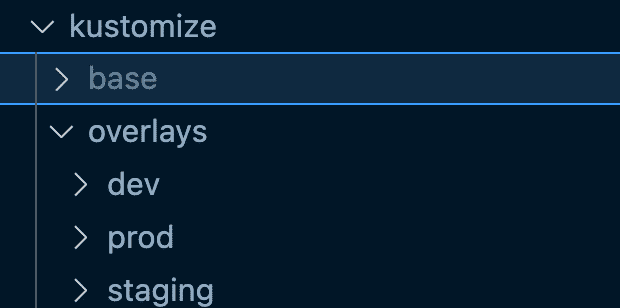
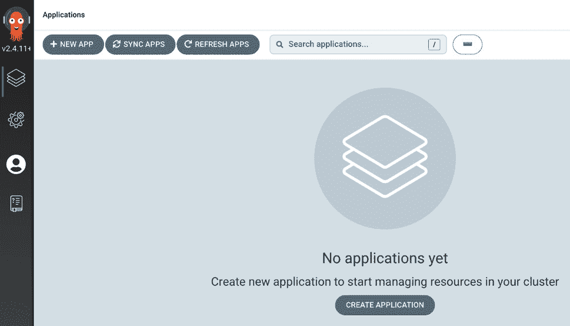

# 6

# Kubernetes 部署– 同样的游戏，下一阶段

在上一章中，你深入探讨了不同的部署场景，以及如何不仅仅考虑控制器，还要考虑应用的升级、要部署的不同类型的应用，以及让应用运行起来的不同方法。在本章中，你将进一步深入探讨不同的部署风格以及故障排除，而不仅仅是进行部署。

部署的第一步是搞清楚你要做什么——它是什么类型的应用，想使用哪种类型的 Kubernetes 资源，以及你可能想使用的不同插件，比如 CSI。了解了你要部署的内容后，下一步就是思考如何部署。

使用 Kubernetes 有很多不同的部署方法——自动化部署、手动部署，以及介于自动化和手动之间的一些方法。执行部署的方法有很多种，因此你不会学到所有方法，因为那可能会占据六章书的篇幅，但你会学习主要的部署方式以及如何打包 Kubernetes Manifests。

学习了部署之后，思考当某些事情不可避免地出错时如何进行故障排除是一个好的、合乎逻辑的下一步。通常，工程师会在实际操作中学习故障排除技巧，但在问题发生之前就思考故障排除技术是一种很好的方法。

在学习了故障排除和部署容器化应用后，你将学习如何管理运行在 Kubernetes 上的应用之间的网络连接，以及如何迁移现有的、更为单体化的应用。

在本章中，我们将涵盖以下主题：

+   了解 Helm charts 和 Kustomize

+   使用 CI/CD 和 GitOps 进行部署

+   故障排除应用部署

+   服务网格和 Ingress

# 技术要求

在本节中，你将基于上一章中学习到的不同类型的部署和 Kubernetes 资源思考方法的知识，进一步拓展这一知识。你应该对自动化部署方法如 CI/CD 有一个简要了解，并对服务网格的概念有一个高层次的理解，同时也具备一些应用架构的知识。如往常一样，你会在 GitHub 上找到本章的代码：[`github.com/PacktPublishing/50-Kubernetes-Concepts-Every-DevOps-Engineer-Should-Know/tree/main/Ch6`](https://github.com/PacktPublishing/50-Kubernetes-Concepts-Every-DevOps-Engineer-Should-Know/tree/main/Ch6)

# 了解 Helm charts 和 Kustomize

当你在使用 Kubernetes 时，除非是用于测试的开发环境，否则几乎不可能只有一个 Kubernetes 清单。你很可能有多个清单，涉及各种资源，例如部署（Deployments）、服务（Services）、守护进程集（DaemonSets）、配置映射（ConfigMaps）、入口（Ingresses），以及其他许多 Kubernetes 资源。几乎每个部署到集群的 Kubernetes 平台或工具都使用 Kubernetes 清单。

在所有这些 Kubernetes 清单中，你需要传递许多不同的值和参数才能让一切正常工作。在这一部分，你将学习两种不同的 Kubernetes 清单管理方法——**Helm charts** 和 **Kustomize**。

## 为什么要考虑清单的部署方法？

在深入探讨不同的部署方法之前，首先理解为什么你会考虑使用其他部署方法而不是仅仅通过终端部署清单，是有意义的。

有三个主要的要点，我们将在接下来的子部分中讨论。

### 扩展性

当考虑到扩展性时，如果工程师总是从他们的笔记本电脑进行部署，根本无法扩展部署。工程师可能使用不同的插件、不同的 IDE、不同的终端设置，甚至是不同的操作系统。所有这些环境的不确定性本身就可能导致大量的错误。如果每个工程师都依赖于自己的计算机来部署环境，那如果他们的笔记本电脑崩溃了怎么办？或者在一天中的某个时刻突然有了更新？又或者有些人不在办公室？有如此多的变量影响，依赖本地计算机进行部署是一个糟糕的主意。相反，从一个中心化的位置进行部署更加合理。环境保持一致，每个人都能使用，你可以根据团队的需求进行定制，而且不必担心有人不在办公室。

### 任何事情都有可能出错

进入第二个要点，这与第一个要点有些相似，任何事情都有可能出错。每个组织的目标都是确保每次部署都能成功，零差错，并能够随时进行部署。市场团队在我们的脑海中描绘出这样的场景：“使用这个工具每天可以部署 20 次，而且每次都能成功。”但正如所有工程师所知道的那样，这并不是现实。任何像网络波动或者在输入变量名时犯错误这样的简单事情，都可能导致部署失败，进而导致应用程序宕机。因此，拥有一个正确的部署策略对于 Kubernetes 的可重复性至关重要，而对于一般的可重复性也是如此。拥有一个正确的流程和*规则*来规定某个部署任务如何进行、何时进行或在哪里进行，是成功更新和团队成员通宵修复问题之间的分水岭。

### 它是手动的

最后一点需要明确的是，在终端上运行命令来部署配置是一个非常手动的过程。在今天的世界里，工程师们希望花时间专注于价值驱动的工作，而不是解决问题。事实上，这正是自动化和可重复性存在的重要原因。工程师们希望节省时间，停止处理单调的任务。如果您经常在计算机上部署到环境中，那么您正在重复手动工作的“糟糕”体验。当然，有些情况下，您可能希望从 localhost 部署。例如，当我部署到开发环境或第一次测试新配置时，我不会创建一个可重复使用的解决方案，因为我不确定它是否有效。然而，一旦我知道它有效并且我的初始开发测试完成，我将自动化工作流程。

在本章中，继续前进时，请记住，思考部署工作流的原因是尽可能减少上述三点的影响。

## Helm 图表

可重复部署策略的理念是为了让您的生活更轻松，但随着新策略的出现，您需要了解不同的实施方法。了解的第一种方法是 Helm 图表。

Helm 是一个开源项目，最初由 DeisLabs 创建，并捐赠给 CNCF；现在由 CNCF 维护该项目。Helm 最初发布时的目标是为工程师提供一种更好的方式来管理所有创建的 Kubernetes Manifests。Helm 是为 Kubernetes 设计的工具和平台，所以它使用的仍然是您熟悉的 YAML，只是以不同的方式打包 - 确切地说，只是 YAML。Kubernetes 的初衷是提供一种声明式地部署容器化应用程序的方法。它并非旨在为您提供一种有意义地打包一堆 Kubernetes Manifests 以便一起使用的方式。这就是 Helm 的作用所在。此外，Helm 还会保留所有已部署图表的发布历史记录。这意味着如果出现问题，您可以返回到先前的一个发布版本。

2016 年 1 月，该项目与名为 Kubernetes 部署管理器的 GCS 工具合并，并将项目移到 Kubernetes 之下。Helm 于 2018 年 6 月从 Kubernetes 子项目晋升为 CNCF 项目。

简而言之，Helm 是一种将一堆 Kubernetes Manifests 打包成应用程序并部署的方法。

### 使用 Helm 图表

现在您已经了解了 Helm，让我们从实践的角度深入了解它：

1.  首先，您需要安装 Helm。由于基于操作系统的不同，您可以在这里找到几种不同的安装方法：[`helm.sh/docs/intro/install/`](https://helm.sh/docs/intro/install/)。

1.  安装 Helm 后，请找到或创建一个目录，您希望您的第一个 Helm 图表存在于其中。最好是一个空目录：

    ```

    mkdir myfirsthelmchart
    ```

1.  接下来，进入终端中的那个目录。

1.  在新目录中，运行以下命令创建一个 Helm chart：

    ```

    helm create name_of_chart
    ```

一旦你这样做，你应该会看到一个类似以下截图的目录结构。在这个例子中，chart 被命名为 `newchart`。


图 6.1 – Helm chart

如果你打开 `templates` 目录，你会看到一堆关于部署、Ingress 和其他很多内容的示例。


图 6.2 – 示例 Helm

如果你打开 `values.yaml` 文件，你会看到可以开始添加你希望传递到模板中的值的位置。


图 6.3 – 值文件

1.  要部署 Helm chart，请运行以下命令：

    ```

    helm install nginxapp .
    ```

1.  要安装 Helm chart，请运行以下命令。` . ` 符号表示当前目录，即 Helm chart 所在的目录：

    ```

    helm install mynewapp .
    ```

当然，这不是关于 Helm 所有的知识。实际上，关于 Helm 的书籍有很多。这一节的目标是让你走上正确的道路。

### Helm Chart 最佳实践

以下是使用 Helm 在生产环境中遵循的最佳实践列表：

+   在存储 Helm Charts 时，确保根据需要将其设置为公开或私有。你最不希望的就是将 Helm chart 推送到本不该公开的公共注册表。

+   记录你的 charts 做了什么。

+   确保将 Charts 存储在源代码控制中。

+   在做出更改后，始终测试 Helm charts。

## Kustomize

Helm 和 Kustomize 很相似，但也有一些独特的差异。Helm 的一个主要用例是拥有一个 `values.yaml` 文件来存储要传递到 Kubernetes Manifest 的值。Kustomize 也有类似的概念。

使用 Kustomize 时，你有一个模板，通常称为基础模板。这个基础模板是你想要使用的模板，可能是 Kubernetes 的部署、服务、Pod，或任何你想要的东西。模板就是你传入值的实际基础。除了模板之外，你还有一个 `kustomization.yaml` 文件，它告诉 Kustomize 使用哪些模板。例如，假设你有一个 `deployment.yaml` 和 `service.yaml` 文件，你会将这两个文件名放入 `kustomization.yaml` 文件中，这样 Kustomize 就会知道应该将值推送到这两个文件中。

*值*已经提到过几次，但没有彻底解释。值可以是你在运行时希望传递的任何内容。例如，假设你有三个环境——开发（dev）、预发布（staging）和生产（prod）。在开发环境中，你有一个副本；在预发布环境中，你有两个副本；在生产环境中，你有三个到四个副本。你可以使用 Kustomize 将这些值传递到一个模板中，这样你就不需要拥有三个具有不同副本值的清单，而是通过一个模板来传递这些值。

但是如何传递这些值呢？

在 Kustomize 目录中，通常有两个目录——base 和 overlays。base 是模板存放的地方，overlay 目录是每个环境存放特定值的地方。例如，假设你有`dev`、`staging`和`prod`等环境。



图 6.4 – 基础配置

`dev`覆盖目录，以及其他目录，都应包含一个`kustomization.yaml`文件。


图 6.5 – 开发环境覆盖配置

在`kustomization.yaml`文件中，你可以找到副本数的配置。


图 6.6 – Kustomization 文件

请注意，`resources`映射指向的是`base`目录，`replicas`映射指定了部署以及副本数。

Helm 和 Kustomize 的主要区别在于，Helm 的主要目的是将多个 Kubernetes 清单打包并像应用程序一样进行部署，而 Kustomize 的主要目的是拥有一个模板，将你的值（如副本数）推送进去。Helm 也可以做到这一点，但这不是 Helm 的主要目的。

### 使用 Kustomize 配置

现在你了解了 Kustomize，让我们从实践的角度深入了解它：

1.  首先，你需要安装 Kustomize。由于安装方法因操作系统而异，你可以在这里找到几种不同的安装方法：[`kubectl.docs.kubernetes.io/installation/kustomize/`](https://kubectl.docs.kubernetes.io/installation/kustomize/)。

1.  安装完 Kustomize 后，找到或创建一个目录，存放你的 Kustomize 配置。你可以将其命名为`kustomize`。

1.  在`kustomize`目录下创建两个新目录，分别命名为`overlays`和`base`。在`overlays`目录下，创建一个名为`dev`的新子目录。它应该类似于以下截图所示。


图 6.7 – 开发环境覆盖配置

1.  在`base`目录下，创建一个名为`deployment.yaml`的新文件，并将以下代码粘贴进去：

    ```

    apiVersion: apps/v1
    ```

    ```

    kind: Deployment
    ```

    ```

    metadata:
    ```

    ```

      name: nginx-deployment
    ```

    ```

    spec:
    ```

    ```

      selector:
    ```

    ```

        matchLabels:
    ```

    ```

          app: nginxdeployment
    ```

    ```

      replicas: 2
    ```

    ```

      template:
    ```

    ```

        metadata:
    ```

    ```

          labels:
    ```

    ```

            app: nginxdeployment
    ```

    ```

        spec:
    ```

    ```

          containers:
    ```

    ```

          - name: nginxdeployment
    ```

    ```

            image: nginx:latest
    ```

    ```

            ports:
    ```

    ```

            - containerPort: 80
    ```

1.  接下来，在`base`目录下创建一个名为`kustomization.yaml`的新文件，并将以下配置粘贴进去，告诉 Kustomize 使用哪个 Kubernetes 清单：

    ```

    apiVersion: kustomize.config.k8s.io/v1beta1
    ```

    ```

    kind: Kustomization
    ```

    ```

    resources:
    ```

    ```

      - deployment.yaml
    ```

1.  在最后一步，在`overlays` | `dev`目录下创建一个新文件，命名为`kustomization.yaml`，并将以下清单粘贴进去：

    ```

    apiVersion: kustomize.config.k8s.io/v1beta1
    ```

    ```

    kind: Kustomization
    ```

    ```

    resources:
    ```

    ```

    - ../../base/
    ```

    ```

    replicas:
    ```

    ```

    - name: nginx-deployment
    ```

    ```

      count: 1
    ```

1.  配置和目录准备好后，`cd`进入`base` | `dev`目录并运行以下命令：

    ```

    kubectl kustomize
    ```

你将看到类似以下截图的输出，它为你提供了一个副本数为 1 的配置，而不是模板中包含的 2 个副本。


图 6.8 – Kustomize 输出

与 Helm 图表一样，Kustomize 的主题可以写成一本小书，这意味着本节内容无法涵盖所有内容。然而，它应该能帮助你朝着正确的方向迈出第一步。

### Kustomize 最佳实践

以下是使用 Kustomize 时在生产环境中应遵循的最佳实践清单：

+   确保将`overlays`放入各自的目录中。你不必这样做，但这样可以使配置更整洁。

+   确保所有代码都存储在源代码控制中。

+   遵循标准目录结构——`base`是模板所在的目录，`overlays`是你希望传递给模板的值。

在下一节中，你将学习关于容器化应用的两种主要部署方法。

# 使用 CI/CD 和 GitOps 进行部署

Kubernetes 部署分为三个阶段：

+   在本地计算机上部署清单

+   使用自动化解决方案（如 CI/CD）部署清单，最终只会运行`kubectl apply -f`命令，和你本地计算机上的操作相同

+   一种全新的、完全自动化的解决方案，从部署角度来看，它（通常）是 100%免操作的

在第一阶段，它根本不可扩展。一堆工程师在自己的本地机器上运行命令来部署一个容器化应用，而且每个人的做法都不一样，使用不同的代码编辑器和插件。那是一团糟，无法支持部署过程的扩展性，也阻碍了工程师们进行价值驱动的工作，反而他们不得不整天呆在终端上运行命令。

在本节中，你将学习更多常见的、自动化的以及新的应用部署方法，这些方法主要围绕 CI/CD 和 GitOps 展开。

## 什么是 CI/CD？

在 CI/CD 方面，假设你正在阅读这本书，你已经在 CI/CD 中工作并知道它是什么。因此，本书不会对 CI/CD 进行全面的拆解，而是提供一个简要概述。

从定义上讲，CI/CD 是一种创建应用程序工件并将其自动化地部署到目标目的地的方法。随着 CI/CD 的普及，工程师们开始将其用于其他目的——例如，将 Terraform 代码打包成工件并运行，以便自动创建基础设施。

在 CI 过程中，工程师们关注以下问题：

+   测试代码

+   打包代码

+   确保所有前提条件和依赖项都已满足

+   构建容器镜像

在 CD 过程中，工程师们关注以下问题：

+   部署工作负载

+   确保它们到达正确的目的地

+   确保应用或服务和基础设施按预期启动并运行

## 使用 CI/CD 进行 Kubernetes 部署

和其他技术一样，几乎每件事都有成千上万种方式可以做。因此，我们不能在这里列出每种 CI/CD、自动化和云场景。为了简化起见，本文将展示 GKE 的 Terraform 代码和 GitHub Actions 的 YAML 流水线。这被视为伪代码，但它在正确的环境中是可以工作的。

首先，让我们从 Terraform 代码开始，并逐步拆解：

1.  首先，你将从 Google 提供者开始，指定区域：

    ```

    provider "google" {
    ```

    ```

      project     = var.project_id
    ```

    ```

      region      = var.region
    ```

    ```

    }
    ```

1.  接下来，指定`google_container_cluster`，以便你可以实现你想要使用的 VPC、子网和工作节点数量：

    ```

    resource "google_container_cluster" "primary" {
    ```

    ```

      name     = var.cluster_name
    ```

    ```

      location = var.region
    ```

    ```

      remove_default_node_pool = true
    ```

    ```

      initial_node_count       = 1
    ```

    ```

      network    = var.vpc_name
    ```

    ```

      subnetwork = var.subnet_name
    ```

    ```

    }
    ```

1.  最后一个资源是`google_container_node_pool`，它实现了 GKE 所需的 Google API，包括节点数量、节点名称和节点大小或类型：

    ```

    resource "google_container_node_pool" "nodes" {
    ```

    ```

      name       = "${google_container_cluster.primary.name}-node-pool"
    ```

    ```

      location   = var.region
    ```

    ```

      cluster    = google_container_cluster.primary.name
    ```

    ```

      node_count = var.node_count
    ```

    ```

      node_config {
    ```

    ```

        oauth_scopes = [
    ```

    ```

          "https://www.googleapis.com/auth/logging.write",
    ```

    ```

          "https://www.googleapis.com/auth/monitoring",
    ```

    ```

        ]
    ```

    ```

        labels = {
    ```

    ```

          env = var.project_id
    ```

    ```

        }
    ```

    ```

        machine_type = "n1-standard-1"
    ```

    ```

        tags         = ["gke-node", "${var.project_id}-gke"]
    ```

    ```

        metadata = {
    ```

    ```

          disable-legacy-endpoints = "true"
    ```

    ```

        }
    ```

    ```

      }
    ```

    ```

    }
    ```

使用 Terraform 代码时，你需要一种部署方法。在当今的世界里，最好的方法是使用 CI/CD。谈到基础设施和服务的部署，CI/CD 是一种非常好且可重复的过程。

要部署代码，你可以使用任何你选择的 CI/CD 平台，但这里的代码是如何通过 GitHub Actions 部署 Terraform 代码的示例。

流水线执行以下操作：

+   指定`workflow_dispatch`，这意味着代码只有在你点击`Deployment`按钮时才会运行

+   使用 Ubuntu 容器运行流水线

+   将代码（克隆）签出到 Ubuntu 容器中

+   在 Ubuntu 容器中配置 Terraform

+   在 Ubuntu 容器中配置 GCP SDK

+   运行`terraform init`，并将其格式化、规划并应用到 GKE 代码所在的目录：

```

name: GKE Kubernetes Deployment
on:
  workflow_dispatch:
jobs:
  build:
    runs-on: ubuntu-latest
    steps:
      - uses: actions/checkout@v3
      - name: Setup Terraform
        uses: hashicorp/setup-terraform@v1
      - name: Set up gcloud Cloud SDK environment
        uses: google-github-actions/setup-gcloud@v0.6.0
        with:
          service_account_email:
          service_account_key:
          project_id:
      - name: Terraform Init
        working-directory: where_the_gke_code_lives
        run: terraform init
      - name: Terraform Format
        working-directory: where_the_gke_code_lives
        run: terraform fmt
      - name: Terraform Plan
        working-directory: where_the_gke_code_lives
        run: terraform plan
      - name: Terraform Apply
        working-directory: where_the_gke_code_lives
        run: terraform apply -auto-approve
```

使用 CI/CD 时，最合理的方式是在 Kubernetes 中使用它。你几乎不会用 CI/CD 来部署 Kubernetes 清单，而是想使用像 GitOps 这样的解决方案，因为它更高效，管理状态，监控工作负载，等等。

## 什么是 GitOps？

根据定义，GitOps 是一组工具，利用 Git 仓库作为可信来源，以代码的形式交付 Kubernetes 资源。它是应用开发、协作、合规和 CI/CD 的最佳操作实践，并将最佳实践应用于基础设施自动化。现在，让我们来看一个更简单的解释。这就是 Kubernetes 的配置管理，仅此而已，简单明了。配置管理就是确保所需状态与当前状态一致，而这正是 GitOps 提供给我们的。

现在你已经了解了 GitOps 的定义，让我们来讨论它到底对 Kubernetes 做了什么。首先，你有一个源代码控制库。该库包含你希望部署到 Kubernetes 上运行应用程序的 Kubernetes 清单。你还有一个 Kubernetes 集群，它可以运行在你喜欢的任何环境中。它可以是本地部署的、原始 Kubernetes 集群，甚至可以是基于云的服务，如 GKE 或 EKS。现在，你有了希望在生产环境中运行的 Kubernetes 清单，以及你希望在其上运行 Kubernetes 清单的 Kubernetes 集群，那么如何部署它们呢？传统的方式是使用类似 `kubectl apply -f` 的命令针对 Kubernetes 清单进行操作，但这需要手动操作，并且存在很多不足之处。相反，你可以实施 GitOps。要实施 GitOps，有几种解决方案。你决定实现一个 GitOps 解决方案，而这个 GitOps 解决方案需要访问你正在运行的 Kubernetes 集群以及源代码控制系统，例如 GitHub 或任何其他存储源代码的 Git 系统。为此，你需要在 Kubernetes 集群上安装 GitOps 解决方案，同时将 GitOps 解决方案与源代码控制系统连接，并进行一些类型的 `kubectl apply -f` 或 `kubectl create -f` 操作。你不再需要手动执行这些命令，而是通过 CLI 或 GitOps 平台提供的其他解决方案来部署 Kubernetes 清单——而且“砰”的一声，你就完成了应用程序的部署！当然，我们都希望它能这么简单。几句话解释一下，啪嗒一下，你就能在生产环境中运行了。然而，事实并没有那么简单，这也是为什么 GitOps 需求如此高，并且它并不是那么容易实现的原因。

在撰写本文时，最流行的 GitOps 平台是**ArgoCD**和 Flux。

## 使用 GitOps 进行自动化部署

了解了创建 Kubernetes 基础设施的过程后，你现在可以使用 GitOps 部署和管理容器化应用程序了。要完成本节内容，你需要有一个正在运行的 Kubernetes 环境，因为 ArgoCD 将被部署到该集群中。

本节将提供一个更为详细的步骤指南，因为无论你在什么地方运行 Kubernetes，以下步骤都可以帮助你启动 ArgoCD。与 CI/CD 部分不同，这里没有大量不同的平台、云环境或配置代码选择，因此，以下解决方案可以在任何环境中使用。

### 配置 ArgoCD

1.  首先，在你的 Kubernetes 集群中为 ArgoCD 创建一个命名空间：

    ```

    kubectl create namespace argocd
    ```

1.  使用来自 ArgoCD 的预配置 Kubernetes 清单安装 ArgoCD，该清单提供了一个高度可用的安装：

    ```

    kubectl apply -n argocd -f https://raw.githubusercontent.com/argoproj/argo-cd/stable/manifests/ha/install.yaml
    ```

    

图 6.9 – ArgoCD 创建输出

1.  获取 ArgoCD 的初始管理员密码以便登录：

    ```

    kubectl get secret -n argocd argocd-initial-admin-secret -o jsonpath="{.data.password}" | base64 -d
    ```

1.  通过 Kubernetes 端口转发打开 ArgoCD 的界面。这样，您可以访问 ArgoCD 的前端，而无需将负载均衡器附加到服务上：

    ```

    kubectl port-forward -n argocd service/argocd-server :80
    ```

1.  现在您知道 UI 可用，登录到服务器通过 CLI。这样，您可以通过 CLI 使用 ArgoCD 部署容器化应用程序，创建一个可重复的过程，而不是通过 UI 执行，因为 UI 操作是手动且重复的。



图 6.10 – ArgoCD 门户

1.  端口是 ArgoCD 从您在上一步中运行的 `kubectl port-forward` 命令中托管的端口。使用以下命令登录 ArgoCD：

    ```

    argocd login 127.0.0.1:argocd_port_here
    ```


图 6.11 – 登录输出

1.  在 Argo CD 界面中，前往 **用户信息** | **更新密码**。将密码从初始的管理员密码更改为您选择的密码。

现在您已经正式部署了 ArgoCD，并且可以在终端和本地计算机上与 GitOps 平台进行交互。

### 部署应用程序

在本节中，您将部署一个应用程序。您将使用的应用程序是一个非常流行的示范应用，许多人用它来展示一个环境如何工作：

1.  为您的新应用程序创建一个命名空间：

    ```

    kubectl create namespace sock-shop
    ```

Sock Shop 是一个流行的微服务示范应用，您可以在这里找到它：[`microservices-demo.github.io/deployment/kubernetes-start.html`](https://microservices-demo.github.io/deployment/kubernetes-start.html)。

1.  在 ArgoCD 中部署 Sock Shop。要部署该应用程序，您需要执行以下操作：

    1.  创建一个新的 ArgoCD 应用程序。

    1.  指向应用程序所在的仓库。

    1.  指向目标服务器，即运行 Kubernetes 的服务器或服务。

    1.  指定目标命名空间：

    ```

    argocd app create socks --repo https://github.com/microservices-demo/microservices-demo.git --path deploy/kubernetes --dest-server https://kubernetes.default.svc --dest-namespace sock-shop
    ```

1.  现在应用程序已经部署，您可以检查应用程序的状态：

    ```

    argocd app get socks
    ```


图 6.12 – Sock Shop 资源

现在您可以检查应用程序是否已在 ArgoCD 界面中部署。


图 6.13 – Sock Shop 应用程序连接

您将看到应用程序的健康状况、是否同步，以及应用程序的状态是否符合预期。

## CI/CD 和 GitOps 的生产使用案例

在生产中考虑 CI/CD 和 GitOps 的两种方式如下：

+   CI/CD 应用于部署集群。

+   GitOps 应用于管理集群内部的 Kubernetes 资源。

换句话说，CI/CD 部署基础设施和集群，而 GitOps 部署并管理应用程序。使用最适合的工具进行工作，这就是基础设施部署类型的工作流程。

无论您使用哪种 GitOps 和 CI/CD 解决方案，您始终要记住，目标是自动化并创建对您和您的团队有效的可重复工作流程。无论现在是什么 *热门* 工具或平台，您都要使用最适合您团队的工具，而不是追随 *新兴事物*。

在下一节中，你将深入了解在 Kubernetes 集群中运行的容器化应用程序的多种故障排除方法。

# 故障排除应用程序部署

故障排除环境和应用程序通常总是看起来相似，并遵循典型的顺序：

+   上次部署是什么时候？

+   发生了什么变化？

+   查看日志

+   谁可以访问这个应用，谁不能访问，如果有的话？

对于 Kubernetes，应用程序故障排除也非常相似。通常的工作流程如下：

1.  检查容器中运行的应用程序。

1.  检查 Pod(s) 的整体健康状态。

1.  检查服务或路由。

通过这三个步骤，你通常可以找出发生了什么问题，因为实际上，其他问题不可能存在。要么是应用本身没有工作，要么是 Pod 本身有问题，要么是服务或路由没有按预期工作。

尽管从高层次来看，可能只有三个潜在问题，但当你深入探讨这些问题时，可能会有多种方式来排除你当前遇到的故障，你将在本节中了解这些方法。

与所有故障排除技术一样，你应该按以下顺序考虑问题：

+   问题是什么？

+   有什么变化吗？

+   问题可能出在哪里？也就是说，Pod 可能出现故障，但它可能不是因为应用程序的问题。它可能是由于复制控制器的问题。

## 故障排除 Pods

下面是帮助你调试 Pods 的两个命令：

+   `kubectl describe`

+   `kubectl logs`

使用以下 Kubernetes Manifest 并进行部署。注意，容器标签拼写为 `lates`。这是故意为之，因为你希望容器失败：

```

apiVersion: apps/v1
kind: Deployment
metadata:
  name: nginx-deployment
spec:
  selector:
    matchLabels:
      app: nginxdeployment
  replicas: 2
  template:
    metadata:
      labels:
        app: nginxdeployment
    spec:
      containers:
      - name: nginxdeployment
        image: nginx:lates
        ports:
        - containerPort: 80
```

使用以下命令获取 Pod 的名称：

```

kubectl get pods
```

你将看到类似以下的输出：


图 6.14 – 容器镜像拉取错误

请注意，一开始你就可以开始故障排除过程。状态显示拉取镜像时出错。现在你知道问题出在镜像上，接下来我们可以更深入地探讨。

运行以下命令：

```

kubectl describe pods pod_name
```

你将看到类似以下的屏幕截图输出：


图 6.15 – Pod 描述

`describe` 命令的一个优点是，它会在 `Events` 部分下方显示日志输出。你现在可以看到问题出在它无法根据你提供的名称和标签拉取容器镜像。

最后一步是运行 `logs` 命令，查看是否有其他数据可以使用：

```

kubectl logs pod_name
```


图 6.16 – Pod 日志

从这里的屏幕截图可以看到，除了 `describe` 命令提供的信息外，几乎没有更多线索，因此故障排除已成功完成。

## 故障排除服务

在故障排除服务时，首先要确认的是服务是否存在。如果在 Kubernetes 集群中没有运行服务，你可以使用这个示例清单：

```

apiVersion: apps/v1
kind: Deployment
metadata:
  name: nginx-deployment
spec:
  selector:
    matchLabels:
      app: nginxdeployment
  replicas: 2
  template:
    metadata:
      labels:
        app: nginxdeployment
    spec:
      containers:
      - name: nginxdeployment
        image: nginx:latest
        ports:
        - containerPort: 80
---
apiVersion: v1
kind: Service
metadata:
  name: nginxservice
spec:
  selector:
    app: nginxdeployment
  ports:
    - protocol: TCP
      port: 80
  type: LoadBalancer
```

由于 Pod 网络与主机网络是分开的，你需要有一个 Pod 来执行或通过 SSH 进入，以便进行故障排除。以下是你可以使用的命令，用于基于 `busybox` 容器镜像配置一个用于故障排除的 Pod，这是一种常用于故障排除的镜像：

```

kubectl run -it --rm --restart=Never busybox --image=gcr.io/google-containers/busybox sh
```

首先，查看服务是否正在运行。你将在 `busybox` 容器镜像外部执行此操作：

```

kubectl get service
```

你应该会得到以下输出。


图 6.17 – 服务配置

如果服务正在运行，请确认你可以通过 DNS 访问该服务：

```

nslookup service_name
```

你将看到类似于以下配置的输出：


图 6.18 – Pod 的 nslookup

如果标准的 `nslookup` 命令无效，或者你需要其他类型的确认，请尝试 FQDN：

```

nslookup service_name.namespace_name.svc.cluster.local
```

你将看到类似于以下截图的输出。


图 6.19 – FQDN 服务查找

检查并确认服务是否正确定义：

```

kubectl get service name_of_service -o json
```

你将看到类似于以下截图的输出。


图 6.20 – 服务的 JSON 输出

检查服务是否有端点——即确认服务指向的 Pods 是否存在：

```

kubectl get pods -l app=name_of_deployment
```

你将看到类似于以下截图的输出：


图 6.21 – 基于标签检索 Pods

最后，虽然应该已经知道，但为了保险起见，检查并确认服务指向的 Pods 是否正常工作：

```

kubectl get pods
```

最后一部分，你将在下一节中学习到，它涉及到实现服务网格以进行故障排除。服务网格有几个功能，其中一个功能是简化服务之间延迟问题的故障排除，同时确保服务按预期运行。

## 故障排除部署

帮助你调试部署的主要命令类似于调试 Pods：

`kubectl` `describe deployment`

除非 Deployment 控制器本身有问题，否则通常不会出现实际的 Deployment 问题。通常是部署内的 Pods 存在问题。然而，你仍然可能需要检查 Deployment 本身。

为此，你需要运行以下命令：

```

kubectl describe deployment deployment_name
```

你应该会得到类似于以下截图的输出：


图 6.22 – 描述 nginx 部署

`describe`命令的目标不是告诉你日志、事件或发生了什么——而是帮助你完全理解已部署的内容及其部署方式。这样，你就可以追溯并查看部署的内容是否是实际应该存在的。

在下一节中，我们将通过讨论什么是服务网格，什么是 Ingress，以及如何思考实施它们来总结本章内容。

# 服务网格和 Ingress

几乎每个容器化应用程序都需要以某种方式进行路由——无论是让外部用户使用应用程序、应用程序之间进行通信，还是一个应用程序需要连接到另一个应用程序。在 Kubernetes 中，路由和服务至关重要，这也是服务网格和 Ingress 在其中发挥巨大作用的原因。

在许多情况下，你需要更好地可视化服务的运行状况、流量是如何路由的，以及应用程序如何路由到不同的负载均衡器和 IP 地址。你最终还需要一种加密服务间流量的方式，而 Kubernetes 默认并不提供。

服务网格和 Ingress 通常是更高级的主题，但在本书中，也许在你职业生涯的这个阶段，你已经准备好深入了解并完全理解使用这两个工具、插件和平台的优缺点。

## 为什么需要 Ingress？

在 Kubernetes 之旅的这一阶段，你几乎可以确定已经见过 Kubernetes 服务。事实上，你在本书中已经多次见到它们。很多时候，Kubernetes 服务会附带一个前端应用，需要为用户提供与 Kubernetes 服务交互的方式。它通常位于负载均衡器前面。

这样做的问题在于，如果你在服务前面有负载均衡器，则需要执行以下操作：

+   如果你使用的是云 Kubernetes 服务，则需要额外支付云负载均衡器的费用

+   如果你使用的是本地 Kubernetes 集群，则需要设置虚拟负载均衡器

+   需要管理一堆负载均衡器

有了 Ingress 控制器，你就不必担心这个问题了。

你可以拥有多个不同的 Kubernetes 服务，并让 Ingress 控制器指向它们，且每个服务都可以通过不同的路径进行访问。

Ingress 控制器为工程师节省了时间、金钱、管理和精力。

### 使用 Ingress

现在你了解了 Ingress 控制器，让我们来看看如何使用（在撰写时）最流行的选项 Nginx Ingress 来配置它。

首先，你需要一个 Kubernetes 部署和服务来进行部署。如果你还没有这些，且希望保持简单，可以使用以下 Kubernetes 清单，它是一个示例 Azure 应用。它不一定要在 Azure 上运行才可以工作：

```

apiVersion: apps/v1
kind: Deployment
metadata:
  name: aks-helloworld-one
spec:
  replicas: 1
  selector:
    matchLabels:
      app: aks-helloworld-one
  template:
    metadata:
      labels:
        app: aks-helloworld-one
    spec:
      containers:
      - name: aks-helloworld-one
        image: mcr.microsoft.com/azuredocs/aks-helloworld:v1
        ports:
        - containerPort: 80
        env:
        - name: TITLE
          value: "Welcome to Azure Kubernetes Service (AKS)"
---
apiVersion: v1
kind: Service
metadata:
  name: aks-helloworld-one
spec:
  type: ClusterIP
  ports:
  - port: 80
  selector:
    app: aks-helloworld-one
```

一旦应用程序本身部署完成，你就可以部署 Ingress 控制器。Ingress 控制器是 Kubernetes 原生 API 集的一部分，因此你无需担心安装其他 CRD 或控制器：

```

apiVersion: networking.k8s.io/v1
kind: Ingress
metadata:
  name: hello-world-ingress-static
  annotations:
    nginx.ingress.kubernetes.io/ssl-redirect: "false"
spec:
  ingressClassName: nginx
  rules:
  - http:
      paths:
      - path: /
        pathType: Prefix
        backend:
          service:
            name: aks-helloworld-one
            port:
              number: 80
```

最后的步骤是将端口转发到应用服务，以便你可以在本地访问该应用：

```

kubectl port-forward service/aks-helloworld-one :80
```

你应该能得到类似以下截图的输出：


图 6.23 – 端口转发服务通信

你应该能够通过本地主机访问该应用。


图 6.24 – AKS 应用

现在你从理论和实践的角度了解了什么是 Ingress，让我们继续探讨服务网格，并看看如何使通信更安全。

## 为什么选择服务网格？

当你将容器化应用程序部署到 Kubernetes 集群时，有两种主要的通信方式：

+   服务

+   Pod 到 Pod 的通信

不推荐 Pod 到 Pod 的通信，因为 Pod 是短暂的，这意味着它们不是永久性的。它们设计为随时可能停止运行，只有当它们是 StatefulSet 的一部分时，才会保留任何类型的唯一标识符。然而，Pod 仍然需要能够相互通信。后端需要与前端通信，中间件需要与后端和前端通信，等等。

下一种通信方式，也是主要的通信方式，是服务到服务。服务到服务是首选方法，因为服务不是短暂的，只有在手动删除时才会被删除。Pod 可以通过选择器或标签连接到服务。如果一个 Pod 停止运行，但部署该 Pod 的 Kubernetes 清单中的选择器没有改变，新的 Pod 将会连接到该服务。

目前为止，所有描述的内容存在一个主要问题——所有的流量都是未加密的。Pod 到 Pod 的通信，或者有些人喜欢称之为东-西流量，都是未加密的。这意味着如果因为某种原因一个 Pod 被攻破，或者你有一些隔离问题，默认情况下你无法采取任何措施。

这就是服务网格发挥作用的地方。服务网格具有以下功能：

+   加密微服务之间的流量

+   帮助排查网络延迟问题

+   安全连接 Kubernetes 服务

+   执行可观察性以进行跟踪和警报

### 使用服务网格

现在你了解了服务网格，让我们学习如何设置一个。市面上有很多不同的服务网格平台，它们各自有不同的安装和配置方法。

由于这是一个复杂的话题，无法在这一部分全部讲解。事实上，关于服务网格有专门的书籍。让我们学习如何设置一个 Istio 服务网格。

首先，下载 Istio：

```

curl -L https://istio.io/downloadIstio | sh
```

接下来，导出 `$PATH` 变量的路径：

```

export PATH=$PWD/bin:$PATH
```

输出 `$PATH` 变量到 `bashrc`：

```

echo "export PATH=$PATH:$HOME/istio-1.15.0/bin" >> ~/.bashrc
```

在你的 Kubernetes 集群上安装 Istio。注意，Ingress 设置为 `false`。如果你想使用 Istio Ingress，可以将其设置为 `true`。如果你使用的是其他 Ingress 控制器，如 Nginx Ingress，可以将其保持为 `false`：

```

istioctl install --set values.gateways.istio-ingressgateway.enabled=false
```

Istio 是一个优秀的服务网格，但开箱即用时没有 UI。查看服务网格图形化界面的一种流行方式是使用 Kiali，这是一种简单的安装方式：

```

kubectl apply -f https://raw.githubusercontent.com/istio/istio/release-1.15/samples/addons/kiali.yaml
```

设置端口转发到 Kiali，以便你可以在本地访问 UI：

```

kubectl port-forward -n istio-system service/kiali :20001
```

最后一步是获取一个 Kubernetes 清单，就像你在本章中使用的那样，并将 sidecar（服务网格容器）注入到你的 Kubernetes 部署中：

```

istioctl kube-inject -f nginx.yaml | kubectl apply -f –
```

到此为止，你已经拥有了理论基础，并且掌握了一些实践知识，了解如何在你的服务网格之旅中向前迈进。

# 总结

总体而言，容器化应用程序的部署、故障排除以及第三方工具将成为你 Kubernetes 集群的核心组成部分。如果没有适当的故障排除，你将无法成功部署。如果没有像 Ingress 控制器这样的第三方工具，你将无法正确管理前端应用程序。Kubernetes 开箱即用，提供了大量工具来使事情顺利运行。然而，你还需要采取更多步骤。无论是好是坏，Kubernetes 不是那种你可以轻松部署后就不管的个平台。它需要管理和工程技能来确保其按预期工作。

在下一章中，你将学习如何监控你在本书中部署的工作负载。

# 进一步阅读

+   *学习 Helm* 由 Andrew Block 和 Austin Dewey 编写：[`www.packtpub.com/product/learn-helm/9781839214295`](https://www.packtpub.com/product/learn-helm/9781839214295%0D)

+   *精通服务网格* 由 Anjali Khatri 和 Vikram Khatri 编写：[`www.packtpub.com/product/mastering-service-mesh/9781789615791?_ga=2.161313023.37784508.1672298745-664251363.1663254593`](https://www.packtpub.com/product/mastering-service-mesh/9781789615791?_ga=2.161313023.37784508.1672298745-664251363.1663254593)
