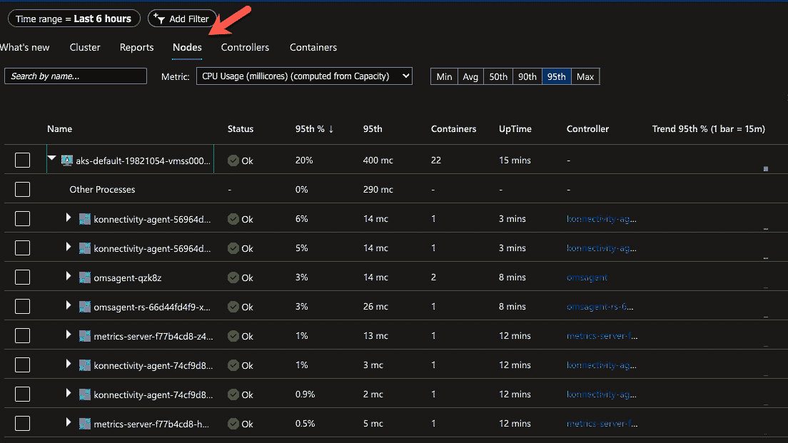

# 第七章：Kubernetes 监控与可观察性

对于运维（Ops）和开发（Dev）团队来说，监控和可观察性一直是至关重要的。运维团队以前主要关注基础设施的健康（虚拟机、裸机、网络、存储等），而开发团队则专注于应用程序的健康。随着 Kubernetes 的出现，这些界限变得模糊。在传统的数据中心环境中，监控和可观察性的责任通常很容易划分。但是 Kubernetes 混合了这些界限，因为例如，Pod 在某种意义上是基础设施的一部分，因为它们需要扩展，并且在传统意义上它们有点像*虚拟机*。它们是容纳应用程序的地方。然而，应用程序运行在 Pod 中，因此如果你在监控 Pod，你实际上也在监控 Pod 内运行的容器。

由于这些界限已经模糊，两个团队都在进行监控过程的各个部分。在平台工程或 DevOps 工程团队中，这些团队将同时监控应用程序和基础设施的各个部分。

不再有明确的界限来划分哪个团队负责监控并为 Kubernetes 的特定部分创建可观察性实践。相反，现在的目标是拥有一个更加统一的前线，确保整个环境和应用程序按预期工作。

本章将从理论和实践两方面深入探讨 Kubernetes 中的监控和可观察性。目标是让你能够将你在本章中学到的内容和在实验室中实现的内容，真正应用到生产环境中。首先，你将了解监控和可观察性到底是什么。接下来，你将了解监控和可观察性在基础设施层的意义，即运行 Kubernetes 环境的虚拟机，以及关于控制平面和工作节点监控的具体内容。之后，你将深入了解 Kubernetes 资源的监控和可观察性，例如 Pods 和 Services。最后，你将了解当今常用的监控和可观察性工具和平台。

如果没有监控，工程师将无法知道系统或应用程序内部发生了什么。DevOps 和平台工程师的工作就是获取这些信息，并利用这些信息修复任何出现的问题。

本章将涵盖以下主要内容：

+   监控与可观察性的区别

+   Kubernetes 的监控和可观察性工具

+   可观察性实践

+   Kubernetes 资源监控

# 技术要求

本章不会对监控进行详细的解释。虽然会有一些简短的说明作为回顾或起点，但你需要对监控和可观察性有一定的经验。例如，或许你之前使用过 Kubernetes Dashboard，或者你曾查看过 Azure 或 AWS 中预设的监控。甚至可能有过在本地桌面进行监控的经验。

你可以在这里找到 GitHub 仓库：[`github.com/PacktPublishing/50-Kubernetes-Concepts-Every-DevOps-Engineer-Should-Know/tree/main/Ch7/prometheus/helm`](https://github.com/PacktPublishing/50-Kubernetes-Concepts-Every-DevOps-Engineer-Should-Know/tree/main/Ch7/prometheus/helm)

# 监控和可观察性有什么不同？

监控和可观察性是两个最常被混淆的工作流，它们在语言和解释上最为接近。虽然本章并不专门讨论可观察性，但要真正理解监控与可观察性之间的差异，你必须了解这两者，并最终看到它们是如何工作的。在本节的解释后，你会发现监控和可观察性之间有关键的区别，以及它们在使用方式、使用时机和最佳实践上的不同。

在一些组织中，你可能会遇到监控和可观察性被混为一类的情况，这取决于其工程团队的成熟度。它们要么被看作相同的事物，要么工程团队认为自己在做可观察性，其实他们只是在做监控。本章的目标之一是帮助你区分这两者，因为根据你使用的平台和工具，可能会有一些界限模糊的情况。例如，我们来看两个最流行的平台——Datadog 和 New Relic。这两个平台都被视为监控平台和可观察性平台。它们都能进行监控和可观察性，而且做得很好。但并非总是如此。例如，像 Prometheus 这样的平台仅用于可观察性和收集指标，但你可以将其与监控平台/工具（如 Grafana）配合使用，提供环境内部发生的情况的可视化。

监控和可观察性都是相当复杂的话题，尤其是在 Kubernetes 中。Kubernetes 中的监控和可观察性与其他平台和系统的概念类似，但也有很大的不同。

在接下来的章节中，你将了解监控和可观察性的定义，以及如何判断应该使用哪一个。我们还将探索一些监控与可观察性的例子。

## 什么是监控？

你是否曾经在 Windows 中打开过**任务管理器**，进入性能设置，查看内存和/或 CPU 使用情况？或者在 macOS 上使用过**活动监视器**，查看哪些应用程序和程序正在使用内存和 CPU？如果你做过这些事情，可以合理推测大多数工程师都在某个时刻做过，你就已经在进行系统监控了！现在，你可能会想，检查台式机或笔记本电脑的内存和 CPU 使用情况与在服务器上监控是截然不同的，但实际上并没有那么大差异。无论是台式机还是整个服务器机架，RAM 就是 RAM，CPU 就是 CPU，存储就是存储。这在不同系统之间是不会改变的。唯一的区别是 CPU、内存和存储的数量。

那么，什么是监控？

监控是实时查看系统资源、性能和使用情况的能力。你可以监控 Kubernetes 集群中的任何内容，包括以下内容：

+   工作节点

+   控制平面

+   Pod

+   部署

+   配置映射

除了这些，你还可以监控集群中运行的任何其他 Kubernetes 资源。从应用层到基础设施层，再到网络层，都可以进行监控。

通过监控，你还可以创建警报。我记得当我刚进入技术行业，拿到我的第一个实习时，最酷的事情就是走进**网络运维中心**（**NOC**），看到大屏幕上显示着各种监控画面。那感觉就像我们在保护核发射代码一样。看到每个系统都可以被监控，工程师们能够理解系统内部发生了什么，真是太棒了。

在今天的世界里，工程师们仍然使用网络运维中心的大屏幕进行监控，但随着在家工作和远程办公成为新常态，工程师们也可以登录到监控平台，查看系统的运行情况。工程师可以登录到像 Datadog、CloudWatch 或 Azure Monitor 这样的工具，查看每个服务的运行情况。

让我们看看*图 7.1*中来自 Azure 的截图。如你所见，有许多可用的监控选项。


图 7.1 – AKS 监控选项

在**监控**部分中看到的监控选项也包含了一些可观察性实践（例如**指标**），这与本章前面提到的一个观点相呼应——在分离监控和可观察性实践时，确实存在一些混淆。

从监控的角度来看，你应该关注的是实际的监控工具。


图 7.2 – AKS 监控

你可以从 AKS 或几乎任何其他 Azure 服务中提取的监控信息，使你能够查看当前发生的情况或过去一段时间发生的情况。这使你能够从临时的角度理解系统的性能。


](img/B19116_07_03.jpg)

图 7.3 – 硬件指标

这种监控的目的是查看和理解集群资源（如 CPU、内存、存储和带宽（进出流量））的表现，以确保你能够做出关于如何管理集群的决策。

你还可以监控正在运行的应用程序，查看它们的运行时间、消耗的资源量以及应用程序的整体性能。

### 监控 Kubernetes 集群的具体情况

你应该监控的控制平面组件包括 API 服务器、etcd（集群存储）、控制器和调度器。你应该监控的工作节点组件包括 Kubelet、容器运行时、kube-proxy 和 DNS。还有需要监控 Pods，但你将在本章末尾进一步学习这部分内容。

在任何情况下，无论是控制平面的组件还是工作节点上的组件，你都应该确保 Metrics Server 正在运行。你可以通过 `/metrics/resource` 端点（例如：`/metrics/pods`）来技术性地获取指标，但那意味着你必须查询每个资源。Metrics Server 会访问每个资源，获取指标并将其暴露出来，而不需要你一个一个地获取它们。你可以在这里找到可以在任何 Kubernetes 集群中使用的 Metrics Server：[`github.com/kubernetes-sigs/metrics-server/releases/latest/download/components.yaml`](https://github.com/kubernetes-sigs/metrics-server/releases/latest/download/components.yaml)。

Metrics Server 端点来源于 Kubernetes **特定兴趣小组** (**SIG**)，可以部署在任何地方。无论是运行在 AWS 上的 Kubernetes 集群，还是运行在你 Windows 10 笔记本上的 Kubeadm 集群，集群存在的地方并不重要。

### 监控的缺点是什么？

监控的缺点，尽管它非常强大，是除非实时发生，否则你对数据的处理能力有限。当然，如果资源出现问题，你可以收到警报，但这意味着工程师必须处于待命状态来解决问题。他们必须停下手头的工作来处理突发事件。随着科技世界的发展，这种模式已经不再可持续。

与此相伴，工程师希望能够花更多时间创造有价值的工作。他们不希望在凌晨 2 点因收到警报而醒来，也不希望因为警报而停止编写新功能。相反，他们希望能够为警报创建自动化和可重复的处理流程。例如，如果警报触发，工程师希望能够创建一个自动化的流程，在出现问题时能及时修复。这样，他们就不必停止手头的工作去处理突发问题，而可以继续专注于创造有价值的工作。

这就是可观察性发挥作用的地方。

## 什么是可观察性？

由于在解释监控和可观察性时，有时这两个词是可以互换使用的，因此了解它们之间的区别非常重要。这样，当你深入了解监控时，就能更容易理解这两者的差异。

可观察性主要出现在 Kubernetes 和几乎所有其他云原生系统中。然而，监控和可观察性在含义上开始有所交融。例如，在*图 7.1*中，你看到了**监控**部分。在**监控**部分下，有一个**指标**子部分。问题是，指标从技术上来说属于可观察性范畴。

监控和可观察性之所以开始混为一谈，换句话说，可观察性之所以越来越受欢迎，是因为通过可观察性，你可以基于接收到的数据做出决策并自动化工作负载。

可观察性实践的关键数据点包括日志、指标和追踪。

再次强调，这一部分我们不想讲得过于深入，因为可观察性有一整章内容。只需记住三点：

+   可观察性使你能够根据接收到的数据采取实际行动。这个行动可能是自动修复导致问题的资源。

+   它正变得越来越流行，超越了传统的监控方式。

+   可观察性有三个关键方面：日志、指标和追踪。

关于指标的简短说明

大多数 Kubernetes 资源的指标是公开的。它们通过 `/metrics/resource` 端点进行公开。例如，`/metrics/pods` 就是 Kubernetes 中 Pods 资源的指标。

为了简化操作，Metrics Server（它不会默认安装在 Kubernetes 中，具体取决于云服务提供商，但默认指的是一个原始的 Kubernetes 集群安装）可以抓取并整合 Kubernetes 资源的所有指标端点。这样，你就不必一一尝试通过每个资源去获取指标。

为了更进一步提升功能，可以使用 kube-state-metrics 工具，它可以安装在 Kubernetes 服务器上；它的主要任务是专注于集群中 Kubernetes 资源/对象的健康状况。例如，kube-state-metrics 会检查并确认 Pods 是否实际上可用且准备就绪。

如果你在想 Metrics Server 和 kube-state-metrics 之间的区别，Metrics Server 显示的是集群资源使用情况，例如 CPU 和内存。另一方面，kube-state-metrics 关注的是 Kubernetes 资源的健康状态。

## 监控与可观测性示例

当考虑如何实现监控、可观测性，或两者时，最好从场景的角度思考实现细节。

让我们举两个场景 – 一个从监控角度看待容器化应用，另一个则是从可观测性角度看待相同的容器化应用。

以下示例并不是一个完整的逐步指南。代码是可用的，但不会详细解释如何具体部署和运行它。你可以在自己的系统中试试看，但本章的目标是展示工作流的示例，而不是一个完整的逐步教程。

### 监控使用案例

第一个场景可以看作是一个前端应用。例如，它可以是一个简单的 Nginx Web 应用，用于托管网站。它可以是如下的简单 Nginx 配置：

```

apiVersion: apps/v1
kind: Deployment
metadata:
  name: nginx-deployment
spec:
  selector:
    matchLabels:
      app: nginxdeployment
  replicas: 2
  template:
    metadata:
      labels:
        app: nginxdeployment
    spec:
      containers:
      - name: nginxdeployment
        image: nginx:latest
        ports:
        - containerPort: 80
```

使用前面的 Kubernetes 清单，你可以想象一个正在 Kubernetes 集群中运行并有两个副本的应用。要获取 Pod 的内存和 CPU 信息，可以运行 `kubectl` `top` 命令：

```

kubectl top pod pod_name
```


图 7.4 – top 命令

如果没有启用 Metrics API，可能会出现错误，因为它默认是禁用的。如果你想启用它，请查看你所运行的 Kubernetes 集群的文档。例如，这里是如何在 `minikube` 上启用 Metrics API 的：

```

minikube addons enable metrics-server
```

为了进行压力测试负载，你可以使用压力/性能测试工具，如 `k6`。以下是你可以使用的示例配置：

```

import http from 'k6/http';
import { sleep } from 'k6';
export default function () {
  http.get('https://test.k6.io');
  sleep(1);
}
```

然后，你可以保存前面的配置，并使用以下命令作为压力测试，指定 100 个虚拟用户并运行 30 秒：

```

k6 run --vus 100 --duration 30s test.js
```


图 7.5 – 基准测试

再次运行 `kubectl top` 命令，你可以看到内存增加了：


图 7.6 – Pod 的 kubectl top 命令

登录到一款监控软件后，例如 Kubernetes Dashboard（你将在接下来的章节中学习到），你将能够看到两个 Pods 的 CPU 和内存使用情况。


图 7.7 – 正在运行的 Pods

这些信息让你能够监控当越来越多的用户访问你的应用时发生的情况，这对于前端应用来说是很常见的。

### 可观测性使用案例

第二个场景将围绕查看前一部分中 Nginx 配置创建的 Nginx Pods 和服务。最终，你将能够看到如何在一个可观察性工具中捕获和查看指标数据。尽管*图 7.8* 显示了 Prometheus，但无论你使用哪种可观察性工具，你仍然会看到相同的数据，因为它是通过 Kubernetes 指标 API 获取的。

当在 Kubernetes 集群上启用 Metrics Server 时，它会暴露几个资源指标端点。其中一个资源指标端点是 Pods。你可以根据**服务发现**来确认你的 Pod 指标是否已被导入到 Prometheus 中。


图 7.8 – 一个 Pod 的发现

然后，你可以根据 Prometheus 允许你检查的不同查询来确认 Pods 的运行情况。例如，以下截图显示了 Kubernetes 服务的资源信息，你可以看到 Nginx 服务正在运行。


图 7.9 – Kubernetes 服务指标

你还可以深入挖掘，并根据特定的硬件资源（如内存和 CPU）进行查询。这样，你就能了解每个 Pod 占用了多少资源（内存、CPU 等）。

例如，以下片段是一个查询，用于查看内存使用情况：

```

avg((avg (container_memory_working_set_bytes{pod="nginx-deployment-588c8d7b4b-6dm7m"}) by (container_name , pod ))/ on (container_name , pod)(avg (container_spec_memory_limit_bytes>0 ) by (container_name, pod))*100)
```

注意如何指定 Pod 名称；这将展示与指定 Pod 的内存相关的可观察性指标。

# Kubernetes 的监控和可观察性工具

通常，在任何技术书籍中，理论/实践知识首先出现，然后才是工具。然而，监控和可观察性稍有不同，因为如果不提及或展示某些工具/平台，实际上你无法讨论具体的内容。因此，在深入探讨*如何*监控和实现可观察性之前，你需要先了解一些关键工具。

本节的目标是帮助你首先了解这些工具的样子，然后将你学到的理论应用到这些工具中。当你将工具的知识和视觉界面（UI）与对真正的监控和可观察性的理解相结合时，你就能在你的环境中成功地实现它们。

监控的一大有趣之处在于，你可以从理论角度完全理解它，但实际实现起来可能会是一个挑战。例如，你可以理解 Kubernetes 中的指标端点是什么，它是如何工作的，暴露了哪些指标，以及你可以从这些指标中监控哪些资源。然而，实际上设置一个平台来*监听*这些指标并配置这个监听器，与阅读有关指标如何工作的内容截然不同。

虽然本节不会涵盖所有用于监控 Kubernetes 的工具和平台，但这个列表是一个很好的起点，因为它们在组织中是最广泛使用的。好消息是，即使你遇到的监控工具本节没有介绍，监控就是监控。这意味着，一旦你理解了监控及其如何与 Kubernetes 配合工作，学习其他监控工具也就不成问题了。归根结底，它们的原理是一样的。监控的基本组件不会改变，唯一的不同是仪表板的显示方式。

在本节中，你将学习以下内容：

+   内置的 Kubernetes Dashboard

+   云特定的监控和可观察性工具

+   Grafana/Prometheus

+   如何使用和设置监控工具

## Kubernetes Dashboard

Kubernetes Dashboard 是一种*原生*的监控和可观察性工具。虽然它并未开箱即用，但几乎可以在任何环境中轻松进行配置。它是查看 Kubernetes 集群内部发生的事情的最快方式。

重要提示

我们使用`minikube`是因为它简单明了。如果你决定在其他 Kubernetes 集群上使用 Kubernetes Dashboard，仪表板的视觉效果不会有什么不同。唯一的区别是你所看到的 Kubernetes 资源。

首先，启动`minikube`。如果你还没有安装`minikube`，可以在这里安装：[`minikube.sigs.k8s.io/docs/start/`](https://minikube.sigs.k8s.io/docs/start/)：

```

minikube start
```


图 7.10 – 启动 minikube

接下来，运行以下命令以启动仪表板：

```

minikube dashboard –url
```


图 7.11 – 默认的 Kubernetes Dashboard

此时，你可以看到有关`minikube`集群的多个不同信息，从 Pod 信息到其他 Kubernetes 资源。你可以看到正在运行且健康的 Pods，以及可能需要修复的工作负载。


图 7.12 – 一个部署示例

接下来，你可以看到整体部署状态。


图 7.13 – Pod 状态

之后，你可以深入查看**部署**选项卡中正在运行的 Pods。


图 7.14 – 运行中的 Pods

需要指出的一点是，Kubernetes Dashboard 几乎从未用于生产级别的场景。它通常用于快速查看一些信息。如果需要进行真实的可观察性和警报设置，通常会使用更合适的（生产就绪型）监控和可观察性工具，接下来你将看到这些工具。

## Azure Monitor

如果您严格使用 Azure 工作负载，或甚至在 Azure 外部的工作负载，并且您正在使用 Azure Arc（例如本地部署），Azure Monitor 是一个非常好的内建解决方案。您可以捕获日志和指标，创建警报，并实时查看您的环境中发生的情况。例如，您可以查看集群的 CPU 和内存使用情况，以及 Pod 和其他 Kubernetes 资源的数据。

在*第二章*中，您学习了如何使用 Terraform 创建 AKS 集群。您可以使用相同的代码来完成本节内容。为了更快参考，以下是链接：[`github.com/PacktPublishing/50-Kubernetes-Concepts-Every-DevOps-Engineer-Should-Know/tree/main/Ch2/AKS`](https://github.com/PacktPublishing/50-Kubernetes-Concepts-Every-DevOps-Engineer-Should-Know/tree/main/Ch2/AKS)。

一旦您的 AKS 集群配置完成，登录 Azure 门户并进入**Kubernetes 服务**。然后，您应该可以在**监控**下看到一个**洞察**选项卡。

通过点击蓝色的**配置 Azure** **监视**按钮启用洞察。


图 7.15 – Azure 洞察

Azure 洞察使您能够从整个环境到节点，再到 Pod 和容器，全面监控您的 AKS 集群中的一切。


图 7.16 – 洞察数据

例如，通过深入**容器**（Pod），您可以查看状态、利用率和正常运行时间。


图 7.17 – 容器数据

在**节点**中，您可以看到每个工作节点上运行的特定 Pod，包括 Pod 的健康状况。



图 7.18 – 节点数据

Azure Monitor 和洞察是 Kubernetes 工作负载的一个很好的整体解决方案。如果您在 Azure 生态系统中，我不建议考虑其他解决方案。坚持使用本地的。

## AWS 容器洞察

容器洞察是 AWS CloudWatch 家族的一部分，使您能够查看容器化工作负载的性能和监控相关操作。您可以基于容器洞察创建警报，并提取日志和指标，以便从自动化和可重复的角度对可能发生的任何情况采取行动。

在*第二章*中，您学习了如何使用 Terraform 创建 EKS 集群。您可以使用相同的代码来完成本节内容。为了更快参考，以下是链接：[`github.com/PacktPublishing/50-Kubernetes-Concepts-Every-DevOps-Engineer-Should-Know/tree/main/Ch2/AWS`](https://github.com/PacktPublishing/50-Kubernetes-Concepts-Every-DevOps-Engineer-Should-Know/tree/main/Ch2/AWS)。

在运行 EKS Terraform 配置后，运行以下命令从 EKS 集群中获取 Kubernetes 配置（`kubeconfig`）：

```

aws eks update-kubeconfig –region region_where_cluster_exists –name name_of_your_cluster
```

要确认当前上下文已设置，运行以下命令，你应该会看到类似的输出：

```

kubectl get nodes
NAME                             STATUS   ROLES    AGE    VERSION
ip-192-168-16-238.ec2.internal   Ready    <none>   18m    v1.23.9-eks-ba74326
```

接下来，为你的集群配置 AWS 容器洞察：

```

ClusterName= name_of_your_cluster
RegionName= region_where_cluster_exists
FluentBitHttpPort='2020'
FluentBitReadFromHead='Off'
[[ ${FluentBitReadFromHead} = 'On' ]] && FluentBitReadFromTail='Off'|| FluentBitReadFromTail='On'
[[ -z ${FluentBitHttpPort} ]] && FluentBitHttpServer='Off' || FluentBitHttpServer='On'
curl https://raw.githubusercontent.com/aws-samples/amazon-cloudwatch-container-insights/latest/k8s-deployment-manifest-templates/deployment-mode/daemonset/container-insights-monitoring/quickstart/cwagent-fluent-bit-quickstart.yaml | sed 's/{{cluster_name}}/'${ClusterName}'/;s/{{region_name}}/'${RegionName}'/;s/{{http_server_toggle}}/"'${FluentBitHttpServer}'"/;s/{{http_server_port}}/"'${FluentBitHttpPort}'"/;s/{{read_from_head}}/"'${FluentBitReadFromHead}'"/;s/{{read_from_tail}}/"'${FluentBitReadFromTail}'"/' | kubectl apply -f –
```

在前面的代码运行后，你将看到类似于终端输出的结果，如下所示：

```

namespace/amazon-cloudwatch created
serviceaccount/cloudwatch-agent created
clusterrole.rbac.authorization.k8s.io/cloudwatch-agent-role created
clusterrolebinding.rbac.authorization.k8s.io/cloudwatch-agent-role-binding created
configmap/cwagentconfig created
daemonset.apps/cloudwatch-agent created
configmap/fluent-bit-cluster-info created
serviceaccount/fluent-bit created
clusterrole.rbac.authorization.k8s.io/fluent-bit-role created
clusterrolebinding.rbac.authorization.k8s.io/fluent-bit-role-binding created
configmap/fluent-bit-config created
daemonset.apps/fluent-bit created
```

此时，如果你登录到 AWS 并进入 **CloudWatch** | **容器洞察**，你将看到容器洞察已正确配置。


图 7.19 – 容器洞察输出

接下来，我们将深入了解 Kubernetes 领域中非常流行的技术栈——Grafana 和 Prometheus。

## Grafana/Prometheus

可以说，Grafana 和 Prometheus 是 Kubernetes 监控/可观测性场景中最流行的实现。Grafana 和 Prometheus 也可以在 Kubernetes 以外的环境中工作，但它们在 Kubernetes 生态系统中变得非常流行。事实上，Kubernetes 甚至有一个 Prometheus 操作员。

除了标准的监控和可观测性好处外，工程师们真的很喜欢这个组合，因为它是 100% 开源的。例如，在 Grafana 中，你可以使用一点代码创建任何你想要的仪表板，而且这一切都是免费的。Grafana 和 Prometheus 也可以在任何地方运行。这个栈可以在你的 Kubernetes 集群内部运行，或者完全在独立的服务器上运行。

尽管你可以单独配置 Prometheus 和 Grafana，添加所有的功能，但我们将利用 **Prometheus 社区 Helm 图表** 的强大功能。原因是它从自动化和可重复的角度简化了 Prometheus 和 Grafana 的安装。它会安装 Prometheus 和 Grafana，并为我们设置仪表板。

在开始之前，有一件事无论你使用哪个监控和可观测性平台，你都必须确保你正在以期望的方式收集指标。例如，Kubernetes 的指标服务器或类似的适配器。例如，Prometheus 有一个适配器可以代替指标服务器。你也可以通过使用 `/metrics/resource`（例如，`/metrics/pods`）的指标端点直接访问源数据，但通常工程师选择使用指标服务器。


图 7.20 – 指标 Pods

如果你没有暴露指标端点，Kubernetes 将不会允许系统使用这些指标。在启用指标服务器方面，这取决于你运行 Kubernetes 的环境。例如，在 AKS 中，它会自动为你暴露。如果你在 `kube-system` 命名空间中看不到 Kubernetes 集群的指标 Pods（这取决于你部署 Kubernetes 的环境），请查看该类型 Kubernetes 环境的文档，了解如何启用指标端点。

首先，为 `prometheus-community` 添加 `helm repo`：

```

helm repo add prometheus-community https://prometheus-community.github.io/helm-charts
```

接下来，确保你的仓库是最新的：

```

helm repo update
```

在最后一步，安装 Helm chart 到 `monitoring` 命名空间：

```

helm install prometheus prometheus-community/kube-prometheus-stack –namespace monitoring –create-namespace
```

安装完成后，你应该可以看到在 `monitoring` 命名空间中创建的几个 Kubernetes 资源。要访问 Grafana，你可以使用端口转发：

```

kubectl -namespace monitoring port-forward svc/prometheus-grafana :80
```

Grafana 的默认用户名/密码是 `admin/prom-operator`。

登录 Grafana 后，查看 `kube-system` 命名空间中的 Pods 仪表板。你可以看到，来自所有命名空间的指标正被 Prometheus 获取并推送到 Grafana。

要查看指标，进入 **仪表板** | **浏览**：


图 7.21 – 浏览仪表板

点击 **Kubernetes / 计算资源 / 命名空间（****Pods）** 选项：


图 7.22 – Pods 仪表板

将命名空间更改为已有 Pod 的命名空间，例如 `kube-system`，你可以在以下截图中看到 Pod 的指标：


图 7.23 – 命名空间选择

Prometheus/Grafana 是一个强大的组合，允许你保持供应商中立，并作为开源选项获取所需的一切。

# 可观察性实践

现在，让我们通过查看日志、跟踪和指标来定义可观察性到底是什么。当你使用像 Prometheus 这样的工具时，你是在做可观察性的一部分。当你使用其他工具，例如 Logz.io 或其他日志聚合器时，你也在使用可观察性的另一部分。

## 日志记录

日志记录是聚合和存储由程序和系统写入的事件日志消息。正如你所想象的那样，根据应用程序中日志的详细程度，可能会有大量的事件。系统管理员最喜欢的工具就是日志，因为它从事件的角度几乎能显示任何可能发生的事情。然而，单纯通过眼睛查看所有日志并不高效。相反，通过使用可观察性实践，你可以将日志发送到日志聚合器，并确保某个特定类型的日志触发警报或某种自动化，进而修复问题。


图 7.24 – 日志服务发现

在容器日志记录方面，有一些日志记录实践：

+   **应用程序转发**：通过应用程序直接发送日志。例如，假设你在应用程序中使用了 Prometheus 库来收集日志、指标和跟踪，并将其发送到你使用的后端日志平台。

+   **Sidecar**：使用 sidecar 容器管理应用程序的日志。例如，你可以将一些日志系统容器化，以便作为辅助/sidecar 容器在 Pod 内部运行。sidecar 容器的任务是做一件事：获取并发送关于 Pod 上发生的事情的日志。

+   **节点代理转发**：在每个工作节点上运行一个 Pod，将所有容器日志转发到后端。

## 指标

度量数据用于收集时间序列数据，这些数据可以用来预测预期范围和预测值，展示在仪表板上（如 Grafana 或其他以 UI 为中心的仪表板），并进行告警。度量端点会提供一堆可以操作的信息。从纯 Kubernetes 的角度来看，度量端点收集每个工作节点上运行的 kubelet 的 Kubernetes 资源数据，并通过度量 API 将其暴露给 API 服务器。

如本章所述，有一个作为 Pod 运行的度量端点。根据你运行的 Kubernetes 集群类型，Pod 可能默认启用，或者你可能需要手动开启。

例如，在 AKS 集群中，度量 Pod 正在运行，这意味着所有 Kubernetes 资源都有可以消费的度量端点。


图 7.25 – 度量 Pod

对于另一种类型的 Kubernetes 集群，例如运行在 Kubeadm 上的集群，你需要通过部署 Pod 来启用度量端点。你可以通过部署 GitHub 上 `kubernetes-sigs` 仓库中的 Kubernetes 清单来做到这一点：

```

kubectl apply -f https://github.com/kubernetes-sigs/metrics-server/releases/latest/download/components.yaml
```

然而，这还不够。因为像 Kubeadm 这样的集群配置有节点 IP 地址，这些 IP 地址不在集群证书的 SAN（Subject Alternative Name）中，度量端点会因 TLS 连接错误而失败。

为了绕过这个问题，你需要在一些配置中添加以下行：

```

serverTLSBootstrap: true
```

你需要将它添加到两个地方。

首先，Kubeadm 配置。你可以通过运行 `kubectl edit cm -n kube-system kubeadm-config` 来编辑它，然后添加 `serverTLSBootstrap:` `true` 行。


图 7.26 – kubeadm 配置

接下来，你需要更新每个节点（所有控制平面和工作节点）上的 kubelet，使用相同的命令行。要编辑每个节点上的 kubelet，你可以运行以下命令并添加配置：

```

sudo vim /var/lib/kubelet/config.yaml
```


图 7.27 – kubelet 配置

## 跟踪

跟踪数据主要是告诉你从端到端的角度，应用程序的健康状况。

你可以把一个跟踪看作是请求在系统中的*路径*或*旅程*。例如，当你访问 `www.google.com` 时，尽管这一过程发生得非常快，但背后有大量的工作在进行。总体上，你创建的 `GET` 请求会经过前端，可能经过一些中间件，再到后台。当你搜索诸如 `夏季十大旅游地点` 时，后台数据库会通过多个请求获取相关信息。

从你执行 Google 搜索请求到信息显示给你的整个过程——这就是一个跟踪（trace）。

因为这是一个漫长的旅程，尽管对我们人类来说只有几秒钟，但它可以从工程角度为我们提供大量关于应用程序性能的信息。我们可以基于可重复的方法论来处理这些性能问题，而不是手动修复问题，或从故障排除的角度进行处理。如果你正在查看一个跟踪记录，并意识到*旅程*在到达后端时停止或遇到阻碍，你现在就知道该从哪里开始故障排除。

# 监控 Kubernetes 资源

在上一节中，你了解了从整体可观测性角度进行监控，特别是如何设置某些工具并确保它们对你有效。现在是时候深入 Kubernetes 的内部，开始思考从资源角度可以监控什么了。记住，Kubernetes 资源（有时称为对象）可以是任何东西，从服务到入口控制器，再到 Pods。因此，有很多东西需要监控。

从这个角度思考。你正在运行一个 Pod，而该 Pod 内部运行着一个容器。Pod 本身运行得很好。容器镜像正常工作，没有 CPU 或内存问题，所有事件状态显示 Pod 正在成功运行。然而，存在一个问题——容器内部运行的二进制文件（即应用程序入口点）可能已停止，或者没有按预期工作。因此，你需要一种方法来真正地深入了解 Pod 本身的内部状态！

正如你在本书中学到的，无论你在哪里运行 Kubernetes，都不重要。它如何运行的核心组件以及你如何与它交互是相同的。监控也不例外。因此，本章的这一部分将展示在 AKS 中的监控。然而，正如你很快会看到的，无论这些 Pods 是否在 AKS 中运行，都没有区别。即使你使用不同的监控系统，这些 Pods 的监控方式也是一样的。

本节中的代码，以及正在部署的演示应用程序，可以在任何 Kubernetes 集群上使用。

## 监控 Pods

在 Pod 内部可以是一个或多个容器。无论是一个容器还是多个容器，实际运行应用程序的是这些容器。也许它是一个核心应用程序，一个日志软件，甚至是像 HashiCorp Vault 或服务网格代理这样的东西。这些与主应用程序并列的容器被称为边车容器。由于一个 Pod 内可能运行多个容器，因此你必须确保每个容器都按预期正常运行。否则，Pod 本身可能运行正常，主应用程序也许也在正常运行，但完整的工作负载（如边车容器）可能没有正常运行。

首先，确保 HashiCorp Consul Helm 图表存在：

```

helm repo add hashicorp https://helm.releases.hashicorp.com
```

接下来，创建一个名为 `consul` 的新命名空间：

```

kubectl create namespace consul
```

一旦`consul`命名空间存在，将 Consul 部署到 `consul` 命名空间中的 Kubernetes 内：

```

helm upgrade –install -n consul consul hashicorp/consul –wait -f - <<EOF
global:
  name: consul
server:
  replicas: 1
  bootstrapExpect: 1
connectInject:
  enabled: true
EOF
```

最后一步是部署演示应用，并确保存在用于注入 `consul` 作为 sidecar 的注解：

```

Curl -sL https://run.linkerd.io/emojivoto.yml \
  | sed 's|    metadata: |    metadata:\n      annotations:\n         consul.hashicorp.com/connect-inject" "tr"e'|' \
  | se' 's|targetPort: 8080|targetPort: 2000'|' \
  | kubectl apply -f -
```

部署应用后，你应该能看到类似以下截图的输出：


图 7.28 – Linkerd 部署

登录到 Azure 门户，进入你的 AKS 集群，并开启 Azure Insights（如果它尚未开启）：


图 7.29 – 启用容器 Insights

一旦**Insights**启用，你应该能够看到几个可用的资源。点击**Controllers**按钮。


图 7.30 – Controllers 仪表盘

查看 **Controllers** 仪表盘，你可以看到所有正在运行的 Kubernetes 资源，及其状态、正常运行时间和每个资源中存在的容器数量。


图 7.31 – Kubernetes 资源正在运行

更深入地查看，你可以看到对于每个有多个 Pod 的资源，你可以查看不同的容器。


图 7.32 – Pods 中的资源

但和往常一样，事情可能会出错。你可以在以下截图中看到，Kubernetes 资源正在运行，但某些容器并未按预期运行：


图 7.33 – 警告资源

当你深入挖掘时，你会看到容器的状态是等待创建。


图 7.34 – 警告说明

因此，即使 Pod 可能已启动并运行，如容器中的应用程序运行，其他 sidecar 容器可能没有启动。从外部看，应用已经运行，所以看起来一切正常。然而，仔细查看后，你会发现其实并不是。 这就是监控服务器上运行的应用与 Pod 之间的巨大区别。在一个 Pod 内，可能有多个二进制文件需要关注。

# 总结

本章内容涵盖了很多，约 35 页，实际上，这些话题本身可能会需要两三本书来详细讲解。由于这个原因，并不是所有内容都被覆盖到最可能需要的深度。然而，好消息是，你现在已经对如何开始在生产环境中实现这些平台、技术和方法有了坚实的理解。

本章我们讨论了很多话题，涵盖了监控是什么，观察性是什么，以及它们之间的总体区别。接着，你深入了解了使监控和观察性在 Kubernetes 环境中生效的具体工具和平台。

在下一章，也是最后一章，你将学习从 Kubernetes 的角度看待安全性。

# 进一步阅读

+   *Azure 上的 Kubernetes 实战 – 第二版* 作者：Nills Franssens, Shivakumar Gopalakrishnan 和 Gunther Lenz: https://www.packtpub.com/product/hands-on-kubernetes-on-azure-second-edition/9781800209671

+   *Prometheus 实战：基础设施监控* 作者：Joel Bastos 和 Pedro Araújo: [`www.packtpub.com/product/hands-on-infrastructure-monitoring-with-prometheus/9781789612349`](https://www.packtpub.com/product/hands-on-infrastructure-monitoring-with-prometheus/9781789612349)
