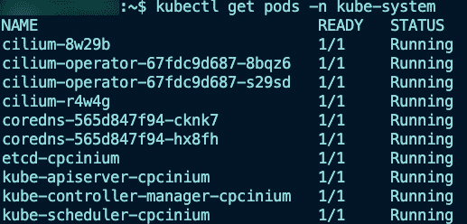
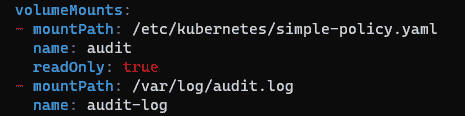

# 安全现实检查

安全性，尤其是在 Kubernetes 中的安全性，是一个具有讽刺意味的问题。每个人都知道它很重要，但它并没有像开发人员那样被视为同等必要的事物。事实上，如果你看一下比例，可能是 1 个安全工程师对 100 个开发人员。环境本身并不安全，尤其是在访问控制方面，然而安全性无疑是 Kubernetes 中最被忽视的部分之一。由于缺乏关于 Kubernetes 的安全意识，本章将重点讨论在保护 Kubernetes 环境时你应该考虑的各个方面。

从理论角度来看，你将学习如何思考 Kubernetes 中的安全性。从实践角度来看，你不仅将学习如何实施安全实践，还将学习使用哪些工具和平台。

在考虑生产环境时，本章可能是整本书中最重要的一章。你必须先学会走路，然后才能跑步，因此，在你能够保护它之前，必须先学会如何在生产中使用 Kubernetes。本书*第 1 至第七章*的重点是帮助你达到这个阶段。然而，本章的重点是将事情提升到一个新的层次，就像**信息技术**（**IT**）的许多领域一样，*下一个层次*就是安全性。

本章结束时，你将知道在保护 Kubernetes 环境时应采用哪些实践，从集群本身到运行在集群内的容器化应用程序。你还将知道使用哪些工具和平台来完成任务。

在本章中，我们将讨论以下主要内容：

+   默认 Kubernetes 安全性

+   调查集群安全性

+   理解**基于角色的访问** **控制**（**RBAC**）

+   Kubernetes 资源（对象）安全性

+   Kubernetes Secrets

重要提示

就像所有与工程相关的书籍和研究分析师的分析一样，本章中使用的数字/百分比基于不同领域的经验。在本书中，如果有一些数字没有具体的关联数据源，这些数据是从作者 Michael Levan 的生产经验中汇总的。

# 技术要求

本章与本书中的大多数章节一样，你需要运行一个 Kubernetes 集群。虽然你可以在 Minikube 等环境中进行测试，但强烈建议你在云中创建一个 Kubeadm 集群或一个托管的 Kubernetes 服务集群，例如**Azure Kubernetes Service**（**AKS**）、**Amazon Elastic Kubernetes Service**（**Amazon EKS**）或**Google Kubernetes Engine**（**GKE**）。原因是你应该从生产环境的角度了解运行 Kubernetes 安全测试的真正情况，这将让你看到它默认情况下是多么不安全，或者你可以做些什么来降低这些风险。

如果你想部署一个 Kubeadm 集群，可以查看这个 Git 仓库获取帮助：

[`github.com/AdminTurnedDevOps/Kubernetes-Quickstart-Environments/tree/main/Bare-Metal/kubeadm`](https://github.com/AdminTurnedDevOps/Kubernetes-Quickstart-Environments/tree/main/Bare-Metal/kubeadm%0D)

本章所用的整体代码可以在这里找到：

[`github.com/PacktPublishing/50-Kubernetes-Concepts-Every-DevOps-Engineer-Should-Know/tree/main/Ch8`](https://github.com/PacktPublishing/50-Kubernetes-Concepts-Every-DevOps-Engineer-Should-Know/tree/main/Ch8)

# 开箱即用的 Kubernetes 安全性

到目前为止，通常有两类人群——那些完全新接触 Kubernetes 的人和那些几乎可以称为*专家*的人。

对于那些刚接触 Kubernetes 的群体，他们只是想了解环境的构成。他们甚至还没有到思考安全性的阶段。

对于那些高级的群体——是的，他们正在实施安全实践。问题在于，相对于那些刚接触 Kubernetes 的群体，先进的群体是非常小的。

然后，还有一些工程师介于两者之间。他们不是完全新手，但也没有达到非常高级的水平。这是很多工程师所处的群体，坦白说，这个群体正是开始思考安全性问题的群体。

与大多数平台一样，没有任何系统可以开箱即用就做到 100%的安全。事实上，无论你花多长时间来保护一个环境，它永远也不可能是 100%安全的。安全的整体目标是尽可能降低风险，但你永远无法消除 100%的风险。

从理论角度来看，我们来讨论一下整体安全性和 Kubernetes 安全性的一些问题。

## 安全漏洞

网络安全从定义上来说是保护系统和网络免受系统泄露。这意味着保护从物理服务器/计算机本身到操作系统，再到服务器/计算机或网络上的任何数据和元数据。如果你仔细想一想，这涉及的信息量非常大。你认为每天有多少邮件通过 Gmail 发送？Gmail 的具体数字不确定，但所有电子邮件提供商的总数是 3196 亿（B）。从理论上讲，但也很可能准确地猜测，至少有 25%的邮件是通过 Gmail 发送的。

重点是什么？

仅仅是邮件就包含了大量的信息，那么其他的一切呢？从一个国家到另一个国家通过网络传输的信息；硬盘上的数据：这些都属于*系统保护* *和网络保护*的一部分。

Norton 在最近的一篇博客中提到（[`us.norton.com/blog/emerging-threats/cybersecurity-statistics#`](https://us.norton.com/blog/emerging-threats/cybersecurity-statistics#)），每天大约有 2200 起网络安全攻击。老实说，这个数字似乎有点低。然而，即使这个数字准确，也意味着每年有 80 万次网络攻击。这个数字可不小。

基于这些知识，作为工程师，我们必须为这种类型的行为准备好我们的系统和网络。随着云计算的持续发展以及 Kubernetes 的日益普及，未来会有更多直接与 Kubernetes 相关的攻击。

正如本节开头所讨论的那样，安全的理念并不是阻止所有风险。事实上，你永远无法阻止一切。专注于安全实施的安全工具、平台和工程师有一个共同的目标——尽可能多地阻止安全威胁。如果一个系统是安全的，操作系统可能不安全；如果操作系统是安全的，网络可能不安全；如果网络是安全的，应用程序可能不安全……如此循环往复。安全是永远无法做到 100% 的，但工程师可以采取预防措施，使安全性尽可能接近 100%。

考虑到本节中的所有内容，问题回到这里：*什么是安全？* 简而言之，它是一种保护数据的方法。

## Kubernetes 安全

来自 Red Hat 的 *Kubernetes 状态* 安全报告（[`www.redhat.com/en/resources/state-kubernetes-security-report`](https://www.redhat.com/en/resources/state-kubernetes-security-report)）突出了与 Kubernetes 安全领域直接相关的安全问题：

+   93% 的受访者在过去 12 个月里在其 Kubernetes 环境中经历过至少一次安全事件。

+   超过一半的受访者（55%）因为安全问题而不得不推迟应用程序的发布。

+   Kubernetes 中约有 70% 的安全问题源于配置错误（根据 Gartner 的数据，实际比例是 99%）。

当你查看来自 Red Hat 的安全报告中的这些统计数据时，有一个趋势是每个人都能轻易看出的——安全在 Kubernetes 领域是一个巨大的问题。

事实上，正如许多工程师和高管所言，Kubernetes 领域的安全问题现在确实很乱。没有特别明确的原因，但有一个合理的猜测。如果你看一下 Red Hat 之前提到的统计数据，70% 的安全问题源于配置错误，那意味着主要原因是工程师们仍在摸索如何使用 Kubernetes。

正如你在本书中学到的内容，正如我相信你在网上看到的，几乎每个人仍然在尝试弄清楚 Kubernetes。没有 Kubernetes 专家，因为它的格局每天都在变化。没有 Kubernetes 的终极目标，因为它不断变化。这不像数学方程式，解开它就完成了。一旦你*解决*了 Kubernetes，围绕 Kubernetes 的 10 个问题就会浮现出来。因此，如何可能不经常发生配置错误呢？特别是对于那些不仅仅专注于 Kubernetes，而是关注多个领域的工程师而言。如果 Kubernetes 总是在变化，工程师如何才能尽可能接近 Kubernetes 的*专家*？配置错误总是不可避免的。

因此，Kubernetes 安全的现状非常混乱。事实上，可能会持续很长时间。要确保一个持续变化的东西是非常困难的。

然而，隧道的尽头还是有一些曙光的。像所有平台和环境一样，确实有一些最佳实践可以遵循。再说一次，考虑安全性，目标是什么？不是修复所有问题，而是尽可能地减轻更多的风险。本章的目的是做到这一点：尽可能减轻 Kubernetes 环境中的安全风险。

让我们开始吧！

# 调查集群安全性

摒除 Kubernetes 来看，让我们思考整体基础设施和/或云安全。在高层次上，你需要考虑网络、服务器、连接到服务器的方式、用户访问权限以及确保服务器上安装的应用程序是安全的。在云计算的世界里，你不必担心物理安全方面的问题。但如果你的集群在数据中心，你就必须考虑物理安全。数据中心机架上的锁可以确保没有人能插入任何 USB 密钥，也没有人能够直接把服务器从机架上取下来并带走。

服务器安全是由运行在服务器内外的内容组成的——运行的应用程序、执行的程序以及整个操作系统本身。例如，假设你运行的是一个较旧版本的 Ubuntu。那么你应该绝对检查并确认没有安全漏洞。这对任何运行在 Ubuntu 上的 Kubernetes 集群来说依然非常重要。然而，Kubernetes 自己有一套标准。

从网络的角度来看，安全性在 Kubernetes 中同样适用，就像在任何其他环境中一样。如果你有一个前端或后端的 Kubernetes 服务，接受来自任何地方的流量，这基本上意味着你有一个完全开放的防火墙。如果你没有用像服务网格或以安全为中心的**容器网络接口**（**CNI**）这样的方式加密 Pod 到 Pod 和/或服务到服务的通信，你可能会面临更多的风险。

例如，Kubernetes 本质上是一个 API。像所有 API 一样，它可能存在安全风险。这意味着，最大的安全重点之一就是确保您当前使用的 Kubernetes API 版本没有重大安全风险，因为这可能会让您的整个环境陷入瘫痪。

Kubernetes 安全的一个重要部分是基准和其他自动化测试，您将在本节中学习到这些内容。

## 集群加固与基准

**互联网安全中心**（**CIS**）多年来一直是系统加固的事实标准。CIS 基准是一组全球公认的标准和最佳实践，旨在帮助工程师设置他们的安全防御措施。无论是在云端、本地环境，还是特定的应用/工具，都有相应的最佳实践，CIS 正是帮助您确定这些最佳实践的工具。

由于 CIS 本质上是一个最佳实践的清单，您必须想象它覆盖了数千种不同的最佳实践，分布在各种平台和环境中。如果您考虑到像 Ubuntu 这样的 Linux 发行版，它就有专门针对该发行版的最佳实践。如果考虑到像 **亚马逊 Web 服务**（**AWS**）这样的整个平台，那最佳实践就更多了。

当您了解 CIS 时，您会发现有大量预先配置的 CIS 环境。例如，在 AWS 中，有 CIS 加固的 **亚马逊机器镜像**（**AMIs**）：


图 8.1 – 加固的 AMI

在其他云平台，如 **谷歌云平台**（**GCP**）或 Azure 中，也有类似的内容。即使在像 iPhone 这样的手机上，也有 CIS 基准：


图 8.2 – iOS 加固

CIS 实际上可以成为一本完整的书籍，所以这里是要点——CIS 基准是一个最佳实践和标准的清单，旨在从安全角度为各种系统、平台、应用和环境提供指导。

由于 Kubernetes 的普及，CIS 在 2017 年与社区合作，创建了专门针对 Kubernetes 的基准：


图 8.3 – 安全化 Kubernetes

甚至有针对特定 Kubernetes 环境的 CIS 基准，例如 GKE。

当您浏览本章内容时，以及在您的 Kubernetes 安全之旅中，您会看到许多工具和平台使用 CIS 基准进行容器镜像扫描和集群扫描。像 Checkov、`kube-bench`、Kubescape 以及其他一些流行的安全工具，都是基于 CIS 和**国家漏洞数据库**（**NVD**）进行扫描的。

您可以免费下载最新的 Kubernetes CIS 基准，只需在 https://www.cisecurity.org/benchmark/kubernetes 上填写您的姓名和电子邮件。

### 浏览 Kubernetes CIS 基准

Kubernetes 中的 CIS 基准是一个庞大的 PDF，您可以下载并浏览，确保您实现的 Kubernetes 环境符合您所运行的 Kubernetes API 版本的最佳标准和最佳实践。

让我们学习如何下载 Kubernetes CIS 基准的 PDF。请按照以下步骤操作：

1.  访问此链接并填写您的信息：[`www.cisecurity.org/benchmark/kubernetes`](https://www.cisecurity.org/benchmark/kubernetes)。

1.  填写完信息后，您应该会收到一封电子邮件，下载 PDF 文件。文件将会很多，所以请搜索 `Kubernetes`。然后您应该会看到所有的 Kubernetes 基准。

1.  选择第一个选项，目前为 Kubernetes API 版本 1.23，并点击橙色的**下载** **PDF**按钮：


图 8.4 – Kubernetes CIS 信息

该文档有 302 页，因此实际情况是，您可能不希望通篇阅读，尤其是在阅读完本章之后（或者您可能想要读！）。您可以浏览并搜索感兴趣的内容。我个人喜欢 Kubernetes Secrets 部分，它明确指出您应该考虑使用外部 Secrets 存储。

### 关于一般服务器加固的说明

服务器加固应该是任何环境中的首要任务。无论您是运行 Windows 服务器、Linux 服务器，还是两者的混合，系统加固是减少系统层面安全漏洞的关键。

由于 CIS 已经存在了很长时间，因此几乎所有的内容都有相应的基准。例如，这里有一张截图展示了可用的一些基准：


图 8.5 – 基准选项

即便是从桌面的角度来看，您也可以对某些应用程序和工具（如 Google Chrome 或 Microsoft Office）运行 CIS 基准：


图 8.6 – 桌面基准选项

要查看完整列表，请访问 [`www.cisecurity.org/cis-benchmarks/`](https://www.cisecurity.org/cis-benchmarks/)。

## 系统扫描

虽然这不是专门针对 Kubernetes 或 Kubernetes 扫描的工具，但事实上，如果您正在运行任何类型的系统，且该系统位于 Kubernetes 环境中的控制平面、工作节点或两者兼有，您应该运行系统扫描，确保环境配置正确。操作步骤如下：

1.  从 [`learn.cisecurity.org/cis-cat-lite`](https://learn.cisecurity.org/cis-cat-lite) 下载 CIS-CAT® Lite 工具（它是免费的）。

1.  接下来，解压并打开 `Assessor-GUI` 二进制文件：


图 8.7 – GUI 二进制文件

1.  在 GUI 工具中，选择**高级**选项，以便您可以指定远程主机：


图 8.8 – 高级选项

1.  选择一个能够让你添加远程系统的选项：


图 8.9 – 添加目标系统

1.  输入你希望扫描的主机信息，如 IP 地址、名称、系统类型和用户名/密码（或 SSH 密钥）：


图 8.10 – 目标系统信息

1.  如你在下一个截图中看到的那样，并没有专门的 Kubernetes 扫描功能。希望未来会添加这个功能，尽管你稍后会看到本章中有专门用于扫描 Kubernetes 是否符合 CIS 的工具。在这种情况下，你可以选择 Ubuntu Linux 选项：


图 8.11 – 可用基准

1.  点击**保存**按钮：


图 8.12 – 添加目标系统

1.  为确保你能正确扫描服务器，测试连接：


图 8.13 – 指定控制平面

1.  点击**下一步**，测试应该开始：


图 8.14 – 运行安装

1.  然后，你将看到一个界面，要求你选择一个位置来保存报告。保留默认设置，然后开始评估：


图 8.15 – 评估结果

一旦评估完成，你将看到报告输出在先前步骤中看到的默认报告位置：


图 8.16 – 基准报告

## 集群网络安全

在 Kubernetes 中，将有两种不同类型的网络安全——内部安全和主机安全。主机安全当然可以包括你的云 VPC 和安全组，或者在本地环境中运行的防火墙。内部安全则包括 Pod 安全、服务安全，以及总体上 Kubernetes 资源如何相互通信。

为了保持 Kubernetes 相关性，你将学习内部安全而非主机安全。如果你想了解主机安全，强烈建议你查看整个网络如何运作以及防火墙、端口映射、网络路由等安全相关主题。

本节的其余部分，你将学习以下内容：

+   CNI 安全方法

+   **扩展的 Berkeley 数据包** **过滤器** (**eBPF**)

### CNI 安全

在本书的内容中，你已经学习了服务网格，在接下来的章节中，你将学习 eBPF。然而，从 CNI 角度来看，你还可以采取另一种安全方法。在你查看不同的 CNI 时，你会看到多种不同类型的插件。一些插件，如 Flannel，适用于只需启动并运行的初级工程师。它没有任何复杂的功能，功能简化且非常基础，这正是它的目的。

然后，你会看到其他插件，如 Calico，它是一个更高级的 CNI，并且非常注重安全性。实际上，你可以使用 Calico 和 WireGuard 加密 Pod-to-Pod 通信，而无需实现服务网格，这也是工程师实现服务网格的主要原因之一。

当你开始探索内部网络安全时，你应该问自己一个主要问题，那就是你希望如何实现 CNI，以及为什么要实现它。你是希望一个“开箱即用”的 CNI，还是希望一个可能需要更多配置和时间的 CNI，但它具备正确的安全组件，从而在长远来看让你的工作更轻松？

你可以在 [`projectcalico.docs.tigera.io/security/encrypt-cluster-pod-traffic`](https://projectcalico.docs.tigera.io/security/encrypt-cluster-pod-traffic) 了解更多关于 Calico 和 WireGuard 的信息。

### eBPF

eBPF 本身可以写成一本书，但简而言之，它是一种不需要更新 Linux 内核代码就能运行某些程序的方法。从 Kubernetes 的角度来看，它还可以去除 `kube-proxy` 的职责。

当谈到 Kubernetes 和 eBPF 时，让我们关注几个关键部分：

+   移除 `kube-proxy`

+   更简便的扩展

+   安全性

`kube-proxy` 有助于使 Kubernetes 可用。如果没有它，Kubernetes 就无法正常工作。然而，也存在一个问题。`kube-proxy` 使用 iptables。尽管 iptables 已经在 Linux 中存在很长时间，但它的扩展性并不好。iptables 规则以列表的形式存储，当 Pods 建立与 Kubernetes 服务的连接时，它们会逐条检查每个 iptable 规则，直到找到特定的规则。虽然这对少量规则来说可能不算什么，但如果有成千上万条规则（你很可能会有），那么这将是一个性能问题。

从可扩展性的角度来看，随着 Kubernetes 服务（任何类型的 Kubernetes 服务）在集群中的数量增加，连接性能会下降。原因之一是，当你创建 iptable 规则时，它们并不是增量式的，这意味着每次更新时，`kube-proxy` 都会重写整个表格。这会造成巨大的性能影响。

现在你已经了解了一些 eBPF 重要性的理论，尽管这些内容本身可以写成一本书，让我们深入探讨 eBPF 的实践实现：

1.  首先，这一切取决于你使用的集群。和其他所有 Kubernetes 环境一样，如果你使用的是云中的托管 Kubernetes 服务，使用 eBPF 将根据你为 Kubernetes 托管服务部署指定的 CNI 来变化。

如果你打算运行 Kubeadm，例如，以下命令是你应该使用的来移除`kube-proxy`。即使你不使用所有标志，也请确保使用`--skip-phases=addon/kube-proxy`标志，因为这是防止安装`kube-proxy`所必需的：

```

sudo kubeadm init --skip-phases=addon/kube-proxy --control-plane-endpoint $publicIP --apiserver-advertise-address $ip_address --pod-network-cidr=$cidr --upload-certs
```

1.  接下来，如果你还没有安装 Helm，请安装 Helm：

    ```

    curl -fsSL -o get_helm.sh https://raw.githubusercontent.com/helm/helm/main/scripts/get-helm-3
    ```

    ```

    chmod 700 get_helm.sh
    ```

    ```

    ./get_helm.sh
    ```

1.  添加 Cilium Helm 仓库：

    ```

    helm repo add cilium https://helm.cilium.io/
    ```

1.  添加仓库后，你可以使用 Helm 安装 Cilium。注意设置`kube-proxy`替代项的标志：

    ```

    helm install cilium cilium/cilium \\
    ```

    ```

    --namespace kube-system \\
    ```

    ```

    --set kubeProxyReplacement=strict \\
    ```

    ```

    --set k8sServiceHost=ip_address_of_control_plane \\
    ```

    ```

    --set k8sServicePort=6443
    ```

1.  几分钟后，运行以下命令检查 Cilium Pods 是否成功运行：

    ```

    kube get pods -n kube-system
    ```

输出应类似于以下截图：



图 8.17 – Cilium Pods

使用 eBPF 仍然是一个非常新的话题，你可能在所有环境中都看不到它。然而，我可以向你保证，随着 eBPF 的日益普及以及它带来的好处，你将会看到它越来越多的应用。

## 升级 Kubernetes API

在每个 Kubernetes 环境中，你必须跟踪 Kubernetes API。你最不想做的事情就是让任何软件或平台的 API 过时，尤其是 Kubernetes。所有的 API，甚至是 Kubernetes，都可能最终存在需要修补的安全漏洞。你必须确保你的环境做好准备。

当你跟踪 Kubernetes API 时，不可避免地会发生一件事：你将不得不升级 API。这不仅仅是为了功能和保持系统的最新，更从安全的角度来说，你不希望落后太远，因为每个软件的旧版本都会停止修补，安全漏洞会被暴露出来。

在本节的其余部分，你将学习如何在运行 Kubeadm 的集群上执行 Kubernetes 升级。如果你没有 Kubeadm，也没关系——仍然可以跟着做。最终，你将不得不对一个原始的 Kubernetes 集群进行升级，所以了解这些还是很有用的。

重要说明

对于任何类型的升级，特别是在生产环境中，你不仅需要积极地测试升级路径，还应备份你的环境组件。

### 升级控制平面

让我们从升级 Kubeadm 控制平面开始。请按照以下步骤操作：

1.  运行`upgrade`命令，查看可用的升级路径：

    ```

    kubeadm upgrade plan
    ```


图 8.18 – Kubernetes 升级

1.  在以下输出中，你将看到每个可用升级的目标版本，以及需要运行的命令。输出还会显示当前的 Kubernetes API 版本，以及哪些控制平面组件将会被升级：


图 8.19 – 升级路径

1.  在运行升级之前，你需要下载最新版本的 API，并确认将 Kubeadm 保持在暂停状态，以避免一次性升级所有控制平面组件。注意，运行以下命令可能会导致你需要重启服务器：

    ```

    apt-mark unhold kubeadm && apt-get update && apt-get install -y kubeadm=1.25.x-00 && apt-mark hold kubeadm
    ```

1.  完成后，运行升级命令，如下所示：

    ```

    kubeadm upgrade apply v1.25.x
    ```

你会看到类似以下截图的输出：


图 8.20 – 升级输出

以下是前面截图中的第二部分输出：


图 8.21 – 升级输出继续

现在你已经升级了控制平面，让我们学习如何升级工作节点。

### 升级工作节点

1.  在运行升级之前，你需要下载最新版本的 API，并确认将 Kubeadm 保持在暂停状态，以避免一次性升级所有控制平面组件。注意，运行以下命令可能会导致你需要重启服务器：

    ```

    apt-mark unhold kubeadm && apt-get update && apt-get install -y kubeadm=1.25.x-00 && apt-mark hold kubeadm
    ```

1.  接下来，升级工作节点，如下所示：

    ```

    sudo kubeadm upgrade node
    ```


图 8.22 – 节点升级

就这样！与控制平面相比，这个过程相对更简单直接。

### 升级 kubelet

最后的步骤是升级控制平面和工作节点上的 kubelet。请按照以下步骤操作：

1.  运行以下命令来升级 kubelet：

    ```

    apt-mark unhold kubelet kubectl && apt-get update && apt-get install -y kubelet=1.25.x-00 kubectl=1.25.x-00 && apt-mark hold kubelet kubectl
    ```

1.  接下来，重新加载 kubelet，如下所示：

    ```

    sudo systemctl daemon-reload
    ```

    ```

    sudo systemctl restart kubelet
    ```

1.  运行以下命令后，你应该看到 Kubernetes 集群已成功升级：

    ```

    kubectl get nodes
    ```

虽然这看起来不像是纯粹与安全相关的内容，也许它确实不是，但它对安全来说依然至关重要。你不能让旧版本的软件闲置不管，就像你不能让旧版本的 API 闲置不管一样。对平台工程团队而言，这没有什么不同。

## 审计日志记录和故障排除

Kubernetes 生成了多个日志。事实上，大多数 Kubernetes 资源都启用了度量端点。这意味着，任何由该 Kubernetes 资源生成的内容——如身份验证、访问、Pod 崩溃、容器启动、最终用户访问等——都会被记录下来。

问题在于审计日志记录——有时甚至是度量服务器——默认情况下并未启用或安装。你有能力在 Kubernetes 中安装和配置审计日志记录，但它不是开箱即用的。

这意味着 Kubernetes 的审计日志 API 是可用的并且*开箱即用*。它只是不会开始生成任何你能看到的日志，因为你首先需要通过`audit.k8s.io/v1` API 设置一个策略，但策略默认是不存在的——需要工程师自己创建这些策略。这个策略可以是从*展示所有内容*到*展示特定 Kubernetes 资源的读取操作*，可以是高层次的，也可以是非常细致的，取决于你的需求。

有很多策略，包括审计日志，可以被启用。事实上，这可能是一个涉及整个集群的主题。由于这个原因，本节我们将重点讨论审计日志。然而，以下截图展示了 **开放 Web 应用安全项目**（**OWASP**）为 Kubernetes 提出的前 10 大问题，其中之一就是适当的日志记录：


图 8.23 – OWASP 前 10 名

您可以在此处查看更多相关信息：[`github.com/OWASP/www-project-kubernetes-top-ten/blob/main/2022/en/src/K05-inadequate-logging.md`](https://github.com/OWASP/www-project-kubernetes-top-ten/blob/main/2022/en/src/K05-inadequate-logging.md)。

在进入实际操作部分之前，让我们先谈谈审计日志是什么。审计日志由 Kubernetes API 服务器记录。通过这些*记录*（就是日志），它按时间顺序记录了 Kubernetes 集群上操作的顺序。

它生成：

+   用户执行的操作

+   Kubernetes 资源执行的操作

+   控制平面本身

从本质上讲，审计日志让你可以提出以下问题：1）*发生了什么？* 2）*什么时候发生的？* 3）*怎么发生的？* 任何问题都不应该留下未解答的，因为您可以通过审计日志获取 Kubernetes 集群中的任何信息。

有了这些，让我们学习如何设置它们。按照以下步骤操作：

1.  创建一个网络策略，如下所示。为了本节的目的，您可以将其存储在 `/etc/kubernetes/simple-policy.yaml` 下：

    ```

    apiVersion: audit.k8s.io/v1
    ```

    ```

    kind: Policy
    ```

    ```

    rules:
    ```

    ```

    - level: Metadata
    ```

重要提示

如果您使用的是托管 Kubernetes 服务，如 AKS 或 EKS，您需要以不同的方式启用审计日志，具体方式取决于您使用的服务器。然而，您仍然应该阅读这一部分，因为在 Kubernetes 使用过程中，您最终会接触到裸金属/虚拟机环境中的审计日志（尤其是在混合云越来越流行的今天）。

1.  接下来，通过 Vim 或您选择的编辑器打开以下位置：`/etc/kubernetes/manifests/kube-apiserver.yaml`。

1.  按照*图 8.24*所示，添加以下代码。这将使您能够设置审计日志的消费方式，并设置日志保留的时间、审计日志输出的路径以及审计策略的位置：

    ```

    - --audit-log-maxage=7
    ```

    ```

    - --audit-log-maxbackup=2
    ```

    ```

    - --audit-log-maxsize=50
    ```

    ```

    - --audit-log-path=/var/log/audit.log
    ```

    ```

    - --audit-policy-file=/etc/kubernetes/simple-policy.yaml
    ```


图 8.24 – 审计策略路径

1.  在 `volumeMounts` 下，添加以下代码，如*图 8.25*所示。对于 Kubernetes，审计日志的策略和路径需要在集群中挂载：

    ```

    - mountPath: /etc/kubernetes/simple-policy.yaml
    ```

    ```

      name: audit
    ```

    ```

      readOnly: true
    ```

    ```

    - mountPath: /var/log/audit.log
    ```

    ```

      name: audit-log
    ```

    ```

      readOnly: false
    ```



图 8.25 – 策略挂载

1.  在 `hostPath` 下，添加以下内容：

    ```

    - hostPath:
    ```

    ```

        path: /etc/kubernetes/simple-policy.yaml
    ```

    ```

        type: File
    ```

    ```

      name: audit
    ```

    ```

    - hostPath:
    ```

    ```

        path: /var/log/audit.log
    ```

    ```

        type: FileOrCreate
    ```

    ```

      name: audit-log
    ```


图 8.26 – 策略主机路径

1.  通过运行以下命令重新启动 kubelet：

    ```

    sudo systemctl restart kubelet
    ```

1.  确认 kubelet 仍在运行，如下所示：

    ```

    kubectl get nodes
    ```

现在，你可以通过执行以下命令查看控制平面上的审核日志，路径/位置是你存储 `audit.log` 文件的地方：

```

tail -f /var/log/audit.log
```

你应该会看到一大堆日志输出。出于安全考虑，我没有包含展示输出的截图。

如前所述，这种配置类型适用于 Kubeadm 集群或本地部署的集群。对于云环境，将会有所不同。不过，了解这个过程仍然非常重要。记住——云平台将很多东西抽象化，但工程师仍然需要理解系统的底层组件，以便正确地与之协作。

# 理解 RBAC

当涉及到用户、组和服务账户时，你必须问自己两个问题。第一个是：*谁可以访问你的集群？* 哪些用户、服务账户和组有能力在开发、预发布和生产环境中的集群上运行 `kubectl` 命令？这些用户中，哪些有一个 Kubeconfig 配置文件，赋予他们访问特定集群的权限？他们可以连接到哪些环境？

第二个问题是：*他们进入集群后能做什么？* 他们能列出 Pods 吗？创建 Pods 吗？查看 Ingress 控制器吗？创建 Ingress 控制器吗？他们在每个环境中可以与哪些 Kubernetes 资源进行交互？

在设置 Kubernetes 环境时，你还必须考虑身份验证和授权。谁可以访问你的集群，他们能做些什么？此外，你还需要思考用户在每个环境中可以执行的操作。例如，考虑你在前一章学到的单租户模型，一个工程师可能在一个集群上拥有完全的管理员权限，而在另一个集群上仅有只读访问权限。基于此，你还需要考虑在授权方法方面，应该授予用户哪些权限。

在本节中，你将学习如何从权限角度管理 Kubernetes 中的用户、组和团队，使用 RBAC。

请注意，虽然本节内容不多，但它应该能为你指引正确的方向，帮助你思考 RBAC 并开始实施它。

## 什么是 RBAC？

RBAC，和本书中的许多其他主题一样（此时我像个老唱片一样重复），本身可以成为一本完整的书。因此，我们先进行简短的理论解释，然后再深入实践部分。

RBAC 的定义是，确保用户、组和服务账户只拥有它们所需权限的授权方式。RBAC 不进行身份验证——它进行的是授权。身份验证是在 RBAC 之前完成的。一旦用户、组或服务账户被创建，RBAC 就可以启动并开始创建权限。

在 Kubernetes 的 RBAC 中，你有四个主要资源需要使用：

+   `Roles`

+   `ClusterRoles`

+   `RoleBindings`

+   `ClusterRoleBindings`

你将在接下来的章节中了解更多关于它们的内容。

当你在考虑 RBAC 时，思考一下：*我允许这个人在 Kubernetes 内部做什么？*

需要记住的一点是，RBAC 通常是每个安全工程师的噩梦。它是 Kubernetes 中让每个人都想撞墙的话题之一，因为它可能变得非常复杂，而且没有中央方式来管理成百上千的 RBAC 角色和权限。市场上有一些工具和平台在尝试缓解这一问题，例如 Kubescape 的 RBAC 可视化工具。

要继续本章内容，你需要一个用户、组或服务账户。因为 Kubernetes 没有现成的创建用户和组的方法，所以我们使用一个服务账户。

运行以下命令创建一个名为 `miketest` 的新服务账户：

```

kubectl create sa miketest
```

服务账户创建完成后，可以在接下来的部分中使用它。

## Roles 和 ClusterRoles

`Roles` 是你可以赋予用户、组和服务账户的权限，并且它们是命名空间范围的。这意味着，假设你创建了一个名为 `readpods` 的角色。该角色将绑定到一个命名空间——例如，名为 `ingress` 的命名空间。这意味着 `readpods` 角色只在 `ingress` 命名空间中有效，而不与其他命名空间绑定。

如果你想为一个在集群中所有命名空间中使用的用户/组/服务账户设置角色/权限呢？这时 `ClusterRoles` 就派上用场了。`ClusterRole` 与 `Role` 相同，唯一的区别是它没有命名空间范围。

让我们深入学习如何创建 `Roles` 和 `ClusterRoles`。

### Roles

以下代码片段是一个 `Role` 的示例，你可以创建它。它的作用范围是 `ingress` 命名空间，并为 Pod Kubernetes 资源设置只读权限。注意在动词中，它全是读取权限——`get`、`watch` 和 `list`：

```

kind: Role
apiVersion: rbac.authorization.k8s.io/v1
metadata:
  namespace: ingress
  name: reader
rules:
- apiGroups: [""]
  resources: ["pods"]
  verbs: ["get", "watch", "list"]
```

实现前面的 `Role` 将确保你创建了一个适当的角色，以便为用户/组/服务账户在 `ingress` 命名空间中提供只读权限。

### ClusterRoles

与前面的 `Role` 一样，以下 `ClusterRole` 创建了一个名为 `reader` 的 `ClusterRole`，用于对 Pods 进行只读权限。关键区别在于，它并不限制于某个特定的命名空间：

```

kind: ClusterRole
apiVersion: rbac.authorization.k8s.io/v1
metadata:
  name: reader-cluster
rules:
- apiGroups: [""]
  resources: ["pods"]
  verbs: ["get", "watch", "list"]
```

实现前面的 `ClusterRole` 将确保你创建了一个适当的角色，以便为用户/组/服务账户在集群的所有命名空间中提供只读权限。

接下来，让我们学习如何将 `Roles` 绑定到特定的服务账户。

## RoleBindings 和 ClusterRoleBindings

`RoleBinding` 是将 `Role` 绑定/附加到用户/组/服务账户的一种方式。例如，假设你有一个名为 `podreaders` 的 `Role`，并且你想将该角色绑定/附加到 `miketest` 服务账户。你可以使用 `RoleBinding` 来执行这个操作。

就像 `Roles` 和 `ClusterRoles` 一样，唯一的区别是 `RoleBindings` 是命名空间范围的，而 `ClusterRoleBindings` 则没有，它们可以在整个集群中使用。

让我们学习如何实现 `RoleBindings` 和 `ClusterRoleBindings`。

### RoleBinding

以下 `RoleBinding` 将您在上一节中创建的 `Role` 附加到 `miketest` 服务账户。看到这里有一个 `kind` 并且指定了服务账户的种类了吗？在这里，您可以指定一个 `group` 或 `user`。由于这不是一个 `ClusterRoleBinding`，它的作用范围也仅限于 `ingress` 命名空间：

```

apiVersion: rbac.authorization.k8s.io/v1
kind: RoleBinding
metadata:
  name: reader-pod
  namespace: ingress
subjects:
- kind: ServiceAccount
  name: miketest
  apiGroup: ""
roleRef:
  kind: Role
  name: reader
  apiGroup: rbac.authorization.k8s.io
```

### ClusterRoleBinding

与前面的 `RoleBinding` 类似，以下的 `ClusterRoleBinding` 会将 `miketest` 服务账户附加到 `ClusterRole` 并引用以下的 `ClusterRole`：

```

apiVersion: rbac.authorization.k8s.io/v1
kind: ClusterRoleBinding
metadata:
  name: read-pod-global
subjects:
- kind: ServiceAccount
  name: miketest
  apiGroup: ""
roleRef:
  kind: ClusterRole
  name: reader-cluster
  apiGroup: rbac.authorization.k8s.io
```

现在您已经了解了整体的身份验证和授权权限，是时候了解 Kubernetes 资源的整体安全性，以及您可以采取的初步措施，以确保成功的安全部署。

# Kubernetes 资源（对象）安全性

在本章中，您了解了一些 Kubernetes 资源安全性的知识。请记住，Kubernetes 资源可以是从 Pods 到 Ingress 控制器到服务等任何东西。实质上，任何您通过 API 访问的运行在 Kubernetes 集群中的东西都是 Kubernetes 资源。

在本节中，您将学习当前保障 Kubernetes 资源安全的最佳方法，这些方法适用于 Kubernetes 内部和使用第三方工具。

## Pod 安全性

当谈到 Kubernetes 环境中的网络安全时，分为两部分——主机网络和内部网络。由于每个环境都不同，本节不讨论主机网络。无论是不同的物理硬件还是虚拟硬件设置，都没有 *一刀切* 的网络环境。

然而，有一些适用于所有环境的有用建议：

1.  确保您有适当的防火墙规则。

1.  确保您正在实施正确的路由协议，而不仅仅是开放整个网络。

1.  确保您已正确设置端口。

1.  确保您正在记录并观察网络流量。

对于 Kubernetes 网络安全，有网络策略。

Kubernetes 通过`networking.k8s.io/v1` API 内置了网络策略（Network Policies）。网络策略就像是针对入口和出口流量的防火墙规则。不过，网络策略不仅仅是关于允许或禁止特定 IP 地址和端口的问题。你可以通过策略做更多的事情。例如，你可以阻止从特定网络到特定命名空间、从特定命名空间或者到/从特定应用程序的流量。由于网络策略提供了大量选项，你可以有很多选择，但你需要确保设置了正确的策略。一不小心写错了`162.x.x.x`而不是`172.x.x.x`，可能会完全打乱网络策略中的整个工作流程，并且完全停止应用程序的工作负载。

让我们深入了解一下网络策略是什么样子。

要测试这一点，在你的 Kubernetes 环境中运行以下 Pods：

```

kubectl run busybox1 --image=busybox --labels app=busybox1 -- sleep 3600
kubectl run busybox2 --image=busybox --labels app=busybox2 -- sleep 3600
```

上述新的 Pods 将运行一个名为`busybox`的容器镜像，这是一个通常用于测试的小型尺寸。

接下来，获取 Pods 的 IP 地址，像这样：

```

kubectl get pods -o wide
```


图 8.27 – Pod 输出

对`busybox1` Pod 运行 ping 命令：

```

kubectl exec -ti busybox2 -- ping -c3 ip_of_busybox_one
```


图 8.28 – Ping 输出

现在你知道了有一个正确的`busybox1` Pod：

```

kubectl create -f - <<EOF
kind: NetworkPolicy
apiVersion: networking.k8s.io/v1
metadata:
  name: web-deny-all
spec:
  podSelector:
    matchLabels:
      app: busybox1
  ingress: []
EOF
```

再次对`busybox1`运行 ping 命令：

```

kubectl exec -ti busybox2 -- ping -c3 ip_of_busybox_one
```

现在应该有 100%的数据包丢失。

如果你在一个类似标准 Minikube 环境中这样做失败了，原因很可能是你使用的 CNI 不支持或未启用网络策略。

要了解如何启用网络策略，你需要快速搜索如何为你的特定 CNI 实现网络策略。

## 策略执行

在前一节中，你了解了在网络层面上的安全性，这当然是必需的。在网络层之后（或之前）是应用层，在这里围绕 Pods 和容器的策略执行变得至关重要。

策略执行的整个理念是为你提供保护你的 Pods、确保最佳安全实践并为你的组织设置标准的能力。

例如，在生产环境中的一个最佳实践是确保你不在生产环境中使用最新的容器镜像版本。相反，你总是要使用一个经过适当版本化和经过实战测试的容器镜像版本来保护你的应用程序。通过 Kubernetes 中的策略执行，你可以实现这一点。

现在，实施策略执行的两个最重要的方法是使用**开放策略代理**（**OPA**）和 Kyverno。从策略执行的角度来看，它们都是相同的，但最大的区别在于 Kyverno 只能在 Kubernetes 内部工作。因此，许多工程师倾向于使用 OPA，这样他们可以在整个环境中使用它，而不仅仅是在 Kubernetes 中。

因此，在实际操作部分将使用 OPA。

那么，Pod 安全策略（Pod Security Policies）怎么办？

如果你听说过 Pod 安全策略（Pod Security Policies），它们本质上与 OPA 相同。然而，它们在 Kubernetes 的 v1.21 版本中已被弃用，并在 v1.25 版本中被完全移除。

### OPA

当你想配置一个特定的策略时，可以使用像 OPA 这样的策略代理。OPA 允许你使用一种名为 Rego 的 OPA 专用语言编写策略（你将在本节中看到）。当你编写策略时，来自其他 Kubernetes 资源或外部实体的任何请求或事件都会被查询。OPA 的决策代理会给出 *通过* 或 *失败* 的结果。

那么，OPA 如何知道如何实现策略呢？

这就是 OPA Gatekeeper 的作用所在。Gatekeeper 是一个 *中间层*，它允许 Kubernetes 与 OPA 交互。Gatekeeper 安装在 Kubernetes 上，并启用 OPA 策略的使用。

让我们从动手实践的角度来深入了解 OPA 的设置。第一部分将是部署 OPA Gatekeeper，第二部分将是实现策略。按如下步骤进行：

1.  添加 Gatekeeper 的 Helm chart，如下所示：

    ```

    helm repo add gatekeeper https://open-policy-agent.github.io/gatekeeper/charts
    ```

1.  通过运行以下命令安装 Helm chart：

    ```

    helm install gatekeeper/gatekeeper --name-template=gatekeeper --namespace gatekeeper-system --create-namespace
    ```

1.  确认 Gatekeeper 的所有 Kubernetes 资源是否已部署：

    ```

    kubectl get all -n gatekeeper-system
    ```

现在 Gatekeeper 已安装，接下来我们开始实施 OPA 策略。

配置是 OPA Gatekeeper 被允许创建策略的定义/输出。在下面的 `config.yaml` 文件中，由于其编写方式，Gatekeeper 知道它只能为 Pods 指定策略，而不能为其他 Kubernetes 资源指定策略。运行以下代码：

```

kubectl create -f - <<EOF
apiVersion: config.gatekeeper.sh/v1alpha1
kind: Config
metadata:
  name: config
  namespace: "gatekeeper-system"
spec:
  sync:
    syncOnly:
      - group: ""
        version: "v1"
        kind: "Pod"
EOF
```

约束模板是你为环境配置的策略。它是一个模板，因此你可以在多个地方使用它。

以下约束模板中的 Rego 代码/策略确保没有人能使用容器镜像的最新标签。运行以下代码：

```

kubectl create -f - <<EOF
apiVersion: templates.gatekeeper.sh/v1beta1
kind: ConstraintTemplate
metadata:
  name: blocklatesttag
  annotations:
    description: Blocks container images from using the latest tag
spec:
  crd:
    spec:
      names:
        kind: blocklatesttag # this must be the same name as the name on metadata.name (line 4)
  targets:
    - target: admission.k8s.gatekeeper.sh
      rego: |
        package blocklatesttag
        violation[{"msg": msg, "details": {}}]{
        input.review.object.kind == "Pod"
        imagename := input.review.object.spec.containers[_].image
        endswith(imagename,"latest")
        msg := "Images with tag the tag \"latest\" is not allowed"
        }
EOF
```

接下来，你需要创建约束。约束使用你之前创建的模板，允许你在 Kubernetes 集群内使用该模板创建策略：

```

kubectl create -f - <<EOF
apiVersion: constraints.gatekeeper.sh/v1beta1
kind: blocklatesttag
metadata:
  name: nolatestcontainerimage
spec:
  match:
    kinds:
      - apiGroups: [""]
        kinds: ["Pod"]
  parameters:
    annotation: "no-latest-tag-used"
EOF
```

OPA 策略现在已经创建。

为了确认策略是否按预期工作，你可以使用以下两个 Kubernetes 清单来测试：

+   以下带有容器镜像最新标签的清单不应该工作，因为你之前创建的策略。部署本身会部署，但 Pods 不会被调度，也不会上线。

尝试运行以下代码：

```

kubectl create -f - <<EOF
apiVersion: apps/v1
kind: Deployment
metadata:
  name: nginx-deployment
spec:
  selector:
    matchLabels:
      app: nginxdeployment
  replicas: 2
  template:
    metadata:
      labels:
        app: nginxdeployment
    spec:
      containers:
      - name: nginxdeployment
        image: nginx:latest
        ports:
        - containerPort: 80
EOF
```

等待几分钟，当你看到它没有上线时，删除它，方法如下：

```

kubectl delete deployment nginx-deployment
```

+   接下来，尝试以下清单。它会成功，Pods 会上线，因为指定了容器镜像版本：

    ```

    kubectl create -f - <<EOF
    ```

    ```

    apiVersion: apps/v1
    ```

    ```

    kind: Deployment
    ```

    ```

    metadata:
    ```

    ```

      name: nginx-deployment
    ```

    ```

    spec:
    ```

    ```

      selector:
    ```

    ```

        matchLabels:
    ```

    ```

          app: nginxdeployment
    ```

    ```

      replicas: 2
    ```

    ```

      template:
    ```

    ```

        metadata:
    ```

    ```

          labels:
    ```

    ```

            app: nginxdeployment
    ```

    ```

        spec:
    ```

    ```

          containers:
    ```

    ```

          - name: nginxdeployment
    ```

    ```

            image: nginx:1.23.1
    ```

    ```

            ports:
    ```

    ```

            - containerPort: 80
    ```

    ```

    EOF
    ```

OPA 本身是一个庞大的话题。我强烈建议深入了解它。我们在本书中只有几页的篇幅来探讨它，但它的内容远比这深入。

## 扫描容器镜像

许多工程师开始他们安全之旅的一个流行安全类型的*切入点*是通过扫描容器镜像。扫描容器镜像意味着你使用工具或平台查看容器镜像内部，看看是否存在任何漏洞。漏洞列表通常来自 NVD 和 Kubernetes 的 CIS 基准。两者都是从安全角度整理出的最佳实践清单，并且包含已知的漏洞。

在这个领域有很多工具。在这一节中，我们将坚持使用一个尽可能*内建的*工具：Snyk。

Snyk 用于从预定义的最佳实践列表（如前所述）扫描容器中的漏洞。此前，Docker 和 Snyk 合作，确保安全功能本地集成到任何容器化工作负载中。通过这种合作，当你运行 `docker scan` 命令时，实际上是在后台使用 Snyk。

要使用 Snyk，确保你已安装 Docker CLI 并运行以下命令：

```

docker scan containerimage:containerversion
```

例如，假设你想扫描 `ubuntu:latest` 容器镜像，如下所示：

```

docker scan ubuntu:latest
```

一旦你运行 `docker scan` 命令，你可以浏览所有漏洞。你将看到发现的漏洞的摘要，测试了什么内容，以及使用了哪个平台。

漏洞的严重程度从非常基础，最终只是一个需要修复的最佳实践，到非常关键，可能会使你的环境暴露于攻击之中。

# Kubernetes Secrets

本章及整本书的总结，你将学习 Kubernetes Secrets。

简而言之，Secrets 是任何你不希望以明文形式存在的内容。通常，它们是像密码和 API 密钥这样的东西。然而，它们也可以是用户名。任何你不希望以明文形式存在、静态存储或传输的数据都可以被视为 Secret。

在你的工程旅程中，此时假设你不需要学习关于 Secrets 的内容，因此我们将跳过这部分，直接进入实践操作。

## 创建 Kubernetes Secrets

要创建 Kubernetes Secret，你将使用 `v1` 核心 API 组中的 `secret` 资源。

例如，以下是一个名为 `testsecret` 的 Secret，包含用户名和密码：

```

apiVersion: v1
kind: Secret
metadata:
  name: testsecret
type: Opaque
data:
  username: YWRtaW4=
  password: MWYyZDFlMmU2N2Rm
```

通过运行以下命令确认 Secret 是否已创建：

```

kubectl get secrets
```

接下来，通过将 `secret` 放入 Pod 中来使用它，如下所示：

```

apiVersion: v1
kind: Pod
metadata:
  name: nginxpod
spec:
  containers:
  - name: mypod
    image: nginx:latest
  volumes:
  - name: foo
    secret:
      secretName: testsecret
```

## 不要使用 Kubernetes Secrets

虽然你刚刚在几秒钟前创建了一个新的 Kubernetes Secrets，但事实是——这并不是一个推荐的做法。

最大的原因是 Kubernetes Secrets 的默认不透明标准会以明文形式存储机密信息。没错——就是这样。机密信息将以明文形式存储在 `etcd` 数据库中。从另一个角度来看，考虑一下 Kubernetes Manifests。即使机密信息在 Etcd 中不是明文存储，它仍然会以明文形式出现在创建机密信息的 Kubernetes Manifest 中，如果它是明文的，你会把它存在哪里？你不能把 Manifest 推送到 GitHub 上，因为那样你的机密信息就会泄露。因此，许多工程师——坦率地说，甚至 Kubernetes 的官方文档——都强烈推荐使用第三方密钥提供者。目前，Kubernetes 最受欢迎的密钥提供者是 HashiCorp Vault。

# 总结

在阅读本章时，你的脑海中可能会有一些纯粹的困惑。这没关系——我们在面对安全性问题时，尤其是在 Kubernetes 中，大家都会试图去*理解*。

Kubernetes 安全性是一个高级主题，这也是为什么我们将其放在本书的最后一章来讨论的原因。没有 Kubernetes 安全性，环境将继续成为攻击者的目标。然而，在理解 Kubernetes 安全性之前，你必须充分理解如何在生产中使用 Kubernetes。《第 1 至第七章》的目标是帮助你理解 Kubernetes 在生产中的应用。

下一步目标，一旦你读完本书，就是将你在本章学到的内容以及书中提到的各种方法论，在生产环境中应用，以获得最佳效果。

# 进一步阅读

+   *学习 Kubernetes 安全性*，作者 *Kaizhe Huang* 和 *Pranjal* *Jumde*：[`www.packtpub.com/product/learn-kubernetes-security/9781839216503`](https://www.packtpub.com/product/learn-kubernetes-security/9781839216503)
