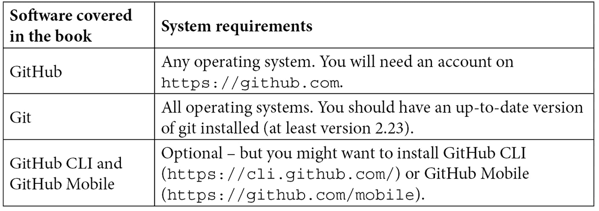

# 序言

我们已经进入了 2020 年代，研究已经向我们展示了超过 10 年，高开发者绩效的公司不仅在速度和吞吐量上胜过竞争对手，而且在质量、创新、安全性、员工满意度以及最重要的客户满意度方面也得分更高。

然而，除了一些*独角兽*公司之外，大多数传统企业都在努力转型。已建立的严格结构和缓慢的流程，单片应用架构以及传统产品的长发布周期使得公司难以改变。

然而，这并不是一个新现象。变革性的改变总是困难的，并且可能需要多年才能成功，如果公司真的成功的话。失败的概率也非常高。这是因为变革必须在许多层面上发生 - 如果这些变化不协调，变革注定会失败。本书将帮助您进行转型 - 不仅提供高开发者绩效的研究，还提供实际例子，说明您如何加速软件交付。

本书是一本关于 DevOps 的实用指南。它帮助已经在 DevOps 旅程中的团队进一步提升，并通过提供简单的解决方案来加速他们的软件交付性能。它将帮助团队找到衡量成功的正确指标，并从其他成功案例中学习，而不仅仅是复制这些团队已经做过的事情。本书使用 GitHub 作为 DevOps 平台，并展示了如何利用 GitHub 的力量进行协作、精益管理以及安全快速的软件交付。

读者在本书结束时将理解什么影响软件交付性能，以及他们如何衡量交付能力。因此，他们将了解自己的位置，并且如何透明地向前迈进，通过跨团队协作的简单解决方案。装备了常见问题的简单解决方案，他们将了解如何利用 GitHub 加速：通过 GitHub Projects 使工作可见，通过 GitHub Insights 测量正确的指标，使用 GitHub Actions 和高级安全性进行坚实和成熟的工程实践，以及转向基于事件的、松耦合的软件架构。

# 适合读者

这本书适合开发人员、解决方案架构师、DevOps 工程师、SRE（Site Reliability Engineer），以及希望增强软件交付性能的工程或产品经理。他们可能是 DevOps 的新手，也可能已经有经验，但难以实现最大的性能。他们可能已经有 GitHub 企业版的经验，或者来自 Azure DevOps、Team Foundation Server、GitLab、Bitbucket、Puppet、Chef 或 Jenkins 等平台。

# 这本书涵盖的内容

*第一章*，*关键指标*，解释了精益管理背后的理论，以及如何衡量绩效和文化变化。它探讨了开发者的生产力以及为什么这一点对于吸引人才和实现卓越的客户满意度如此重要。

*第二章*，*规划、跟踪与可视化你的工作*，讲解了工作洞察：通过应用精益原则加速软件交付绩效。你将学习如何使用 GitHub Issues、Labels、Milestones 和 Projects 规划、跟踪并可视化团队和产品的工作。

*第三章*，*团队合作与协作开发*，解释了软件协作开发的重要性，以及如何利用 GitHub 在不同团队和学科之间进行协作。

*第四章*，*异步工作：随时随地协作*，解释了异步工作方式的好处，以及如何利用它们实现更好的共享责任、分布式团队、更高的质量和跨团队协作。它展示了如何使用 GitHub Mobile、Microsoft Teams、Slack 以及 GitHub Pages、Wikis 和 Discussions 来实现随时随地的协作。

*第五章*，*开放源代码和内部源代码对软件交付绩效的影响*，描述了自由和开源软件的历史以及它在近年来，尤其是在云计算背景下，所获得的重要性。它将教你如何利用开源加速软件交付。此外，它还将解释如何将开源实践应用于内部源代码，以帮助你转型组织，并讨论开源和内部源代码对外包和内包策略的影响。

*第六章*，*使用 GitHub Actions 进行自动化*，解释了自动化对质量和速度的重要性。它介绍了 GitHub Actions，并说明如何使用它们进行各种自动化任务——不仅限于持续交付。

*第七章*，*运行你的工作流程*，解释了如何使用 GitHub Actions 工作流运行器的不同托管选项来应对混合云场景或硬件在回路测试。它展示了如何设置和管理自托管运行器。

*第八章*，*使用 GitHub Packages 管理依赖关系*，描述了如何将 GitHub Packages 与语义版本控制以及 GitHub Actions 结合使用，管理团队和产品之间的依赖关系。

*第九章*，*部署到任何平台*，展示了如何通过简单的实操示例，轻松部署到任何云平台，包括 Microsoft Azure、AWS 弹性容器服务和 Google Kubernetes Engine。它展示了如何通过 GitHub Actions 进行分阶段部署，以及如何使用基础设施即代码（Infrastructure as Code）自动化资源配置。

*第十章*，*特性开关与特性生命周期*，解释了特性开关（或特性切换）如何帮助减少复杂性，并管理特性及软件的生命周期。

*第十一章*，*基于主干的开发*，解释了基于主干的开发的优势，并介绍了最佳 Git 工作流，以加速软件交付。

*第十二章*，*通过左移测试提升质量*，详细探讨了质量保证和测试在开发者速度中的作用，并展示了如何通过测试自动化实现左移测试。本章还涵盖了生产环境中的测试和混沌工程。

*第十三章*，*左移安全与 DevSecOps*，从更广泛的角度探讨了安全在软件开发中的作用，如何将安全嵌入开发流程，并实践 DevSecOps、零信任模型，以及如何左移安全。本章探讨了常见的攻击场景，展示了如何通过攻击模拟和红队/蓝队演习来提高安全意识。本章还介绍了 GitHub Codespaces 作为云中的安全开发环境。

*第十四章*，*保障代码安全*，描述了如何使用 GitHub 高级安全功能，通过 CodeQL 和其他工具执行静态代码分析，消除安全和合规问题，如何通过 Dependabot 有效管理软件供应链，以及如何使用秘密扫描（Secret Scanning）消除代码库中的敏感信息。

*第十五章*，*保障部署安全*，展示了如何确保环境中的部署安全，并如何以安全、合规的方式自动化完整的发布流水线，以满足监管要求。本章涵盖了**软件材料清单**（**SBoM**）、代码和提交签名、动态应用安全测试，以及如何加强发布流水线的安全性。

*第十六章*，*松耦合架构与微服务*，解释了松耦合系统的重要性，以及如何通过演进软件设计来实现这一目标。本章涵盖了微服务、演进设计和基于事件的架构。

*第十七章*，*赋能你的团队*，讲述了组织的沟通结构与系统架构（康威定律）之间的关系，以及如何利用这一点来改进架构、组织结构和软件交付性能。本章涵盖了“两披萨团队”、反向康威操作和单一仓库与多仓库策略。

*第十八章*，*精益产品开发与精益创业*，讲述了精益产品管理在产品和特性层面的重要性。它展示了如何将客户反馈融入产品管理中，创建最小可行产品，以及如何管理企业的产品组合。

*第十九章*，*实验与 A|B 测试*，解释了如何通过进行实验来验证假设，从而不断发展和改进你的产品，使用基于证据的 DevOps 实践，如 A|B 测试。它还解释了如何利用 OKR 来赋能团队进行正确的实验，并构建正确的产品。

*第二十章*，*GitHub：所有开发者的家园*，解释了 GitHub 如何作为一个整体的开放平台来服务你的团队。它解释了不同的托管选项、定价以及如何将其集成到现有的工具链中。

*第二十一章*，*迁移到 GitHub*，将讨论从不同平台迁移到 GitHub 的策略以及其他系统的集成点。它解释了如何找到合适的迁移策略，如何使用 GitHub Enterprise Importer 和 Valet 进行繁重的工作。

*第二十二章*，*组织你的团队*，讲述了如何将仓库和团队结构化成组织和企业的最佳实践，以促进协作和简化管理。本章涉及基于角色的访问、定制角色以及外部协作者。

*第二十三章*，*转型你的企业*，将所有内容汇集在一起。本书提供了许多工具，帮助你推动成功的转型并提升开发者的工作效率。但只有将所有部分结合起来，转型才会成功。本章将解释为什么许多转型失败，以及你应该做些什么来确保转型成功。

# 想要从本书中获得最大的收益



*如果你想跟随动手实验部署到 Azure、AWS 或 Google，你将需要一个相应云环境的账户。*

**如果你使用的是本书的数字版，建议你亲自输入代码，或者从本书的 GitHub 仓库访问代码（下一个章节中会提供链接）。这样做将帮助你避免由于复制粘贴代码而可能产生的错误**。

# 下载示例代码文件

本书的示例和实践实验可以在 GitHub 上找到，网址是 [`github.com/wulfland/AccelerateDevOps`](http://github.com/wulfland/AccelerateDevOps) 和 [`github.com/PacktPublishing/Accelerate-DevOps-with-GitHub`](https://github.com/PacktPublishing/Accelerate-DevOps-with-GitHub)。如果代码或实验有更新，GitHub 仓库会随之更新。

我们还有其他代码包，来自我们丰富的图书和视频目录，欢迎访问 [`github.com/PacktPublishing/`](https://github.com/PacktPublishing/)。快去看看吧！

# 下载彩色图片

我们还提供了本书中使用的截图和图表的彩色图片 PDF 文件。你可以在这里下载：[`packt.link/vzP6B`](https://packt.link/vzP6B)

# 使用的约定

本书中使用了许多文本约定。

`文本中的代码`：表示文本中的代码词汇、数据库表名、文件夹名、文件名、文件扩展名、路径名、虚拟 URL、用户输入和 Twitter 账号。例如：“你可以通过将文件 `config.yml` 添加到 `.github/ISSUE_TEMPLATE` 来自定义对话框以选择问题模板。”

代码块如下所示：

```
name: 💡 Custom Issue Form
```

```
description: A custom form with different fields
```

```
body:
```

```
  - type: input
```

```
    id: contact
```

```
    attributes:
```

```
      label: Contact Details
```

当我们希望引起你对某一部分代码块的注意时，相关的行或项会以粗体显示：

```
blank_issues_enabled: true
```

```
contact_links:
```

```
  - name: 👥 Discussions
```

```
    url:  https://github.com/wulfland/AccelerateDevOps/discussions/new
```

```
    about: Please use discussions for issues that are not a bug, enhancement or feature request
```

任何命令行输入或输出均按如下格式书写：

```
$ gh secret set secret-name
```

**粗体**：表示新术语、重要词汇或你在屏幕上看到的词汇。例如，菜单或对话框中的词汇以**粗体**显示。示例：“打开以下仓库并通过点击仓库右上角的**Fork**来创建一个分支。”

提示或重要说明

如下所示。

# 与我们联系

我们始终欢迎读者的反馈。

**一般反馈**：如果你对本书的任何内容有疑问，请通过电子邮件联系我们，地址是 customercare@packtpub.com，并在邮件主题中提及书名。

**勘误**：虽然我们已尽力确保内容的准确性，但难免会有错误。如果你在本书中发现错误，我们将非常感激你能向我们报告。请访问 [www.packtpub.com/support/errata](http://www.packtpub.com/support/errata) 并填写表格。

**盗版**：如果你在互联网上发现任何非法复制的我们作品的版本，我们将感激你提供其位置或网站名称。请通过电子邮件联系我们 copyright@packt.com，并附上相关链接。

**如果你有兴趣成为作者**：如果你在某个领域有专长，并且有意撰写或参与编写书籍，请访问 [authors.packtpub.com](http://authors.packtpub.com)。

# 分享你的想法

阅读完*加速 DevOps 与 GitHub*后，我们非常希望听到您的想法！请[点击这里直接进入该书的亚马逊评论页面](https://packt.link/r/1801813353)并分享您的反馈。

您的评论对我们以及技术社区非常重要，它将帮助我们确保提供优质的内容。
