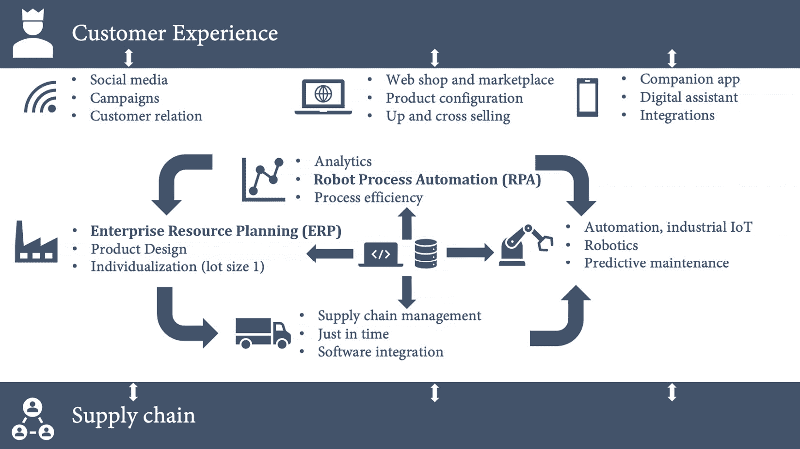
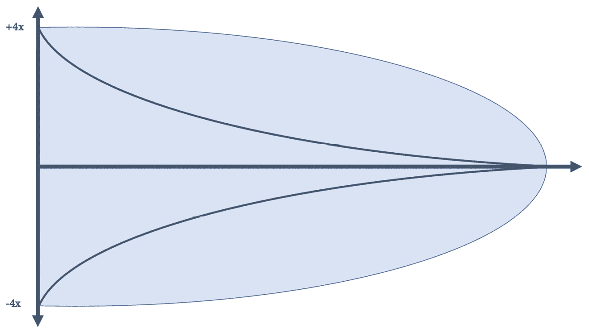
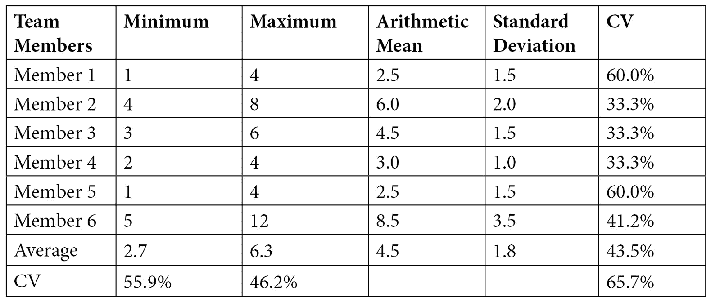
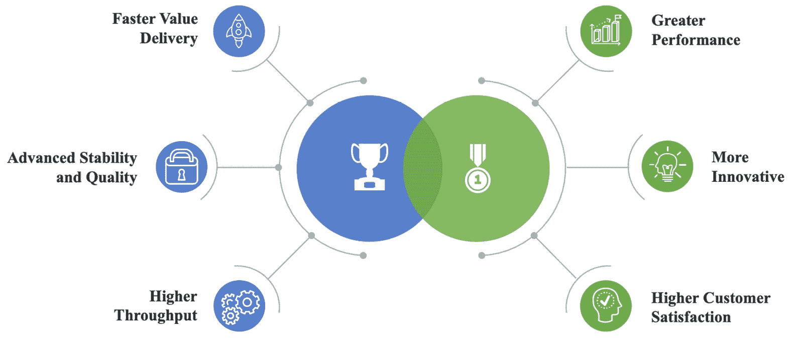
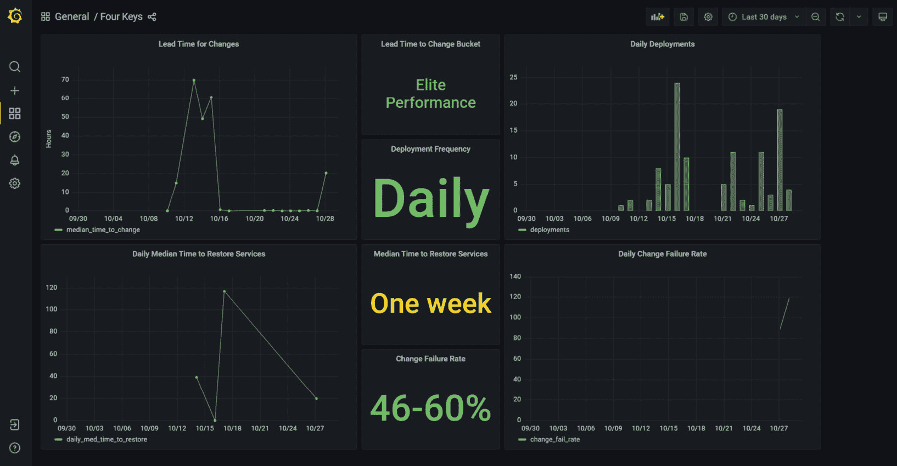
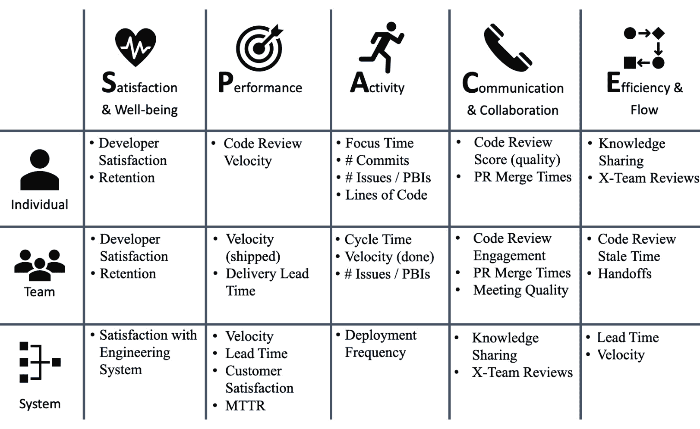
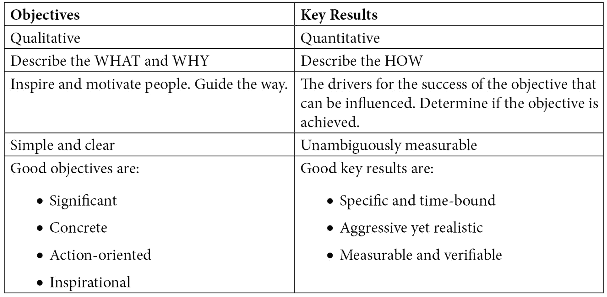
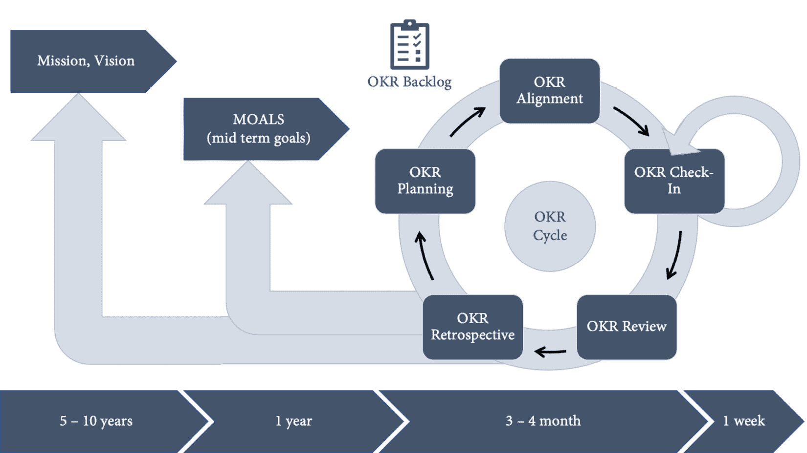
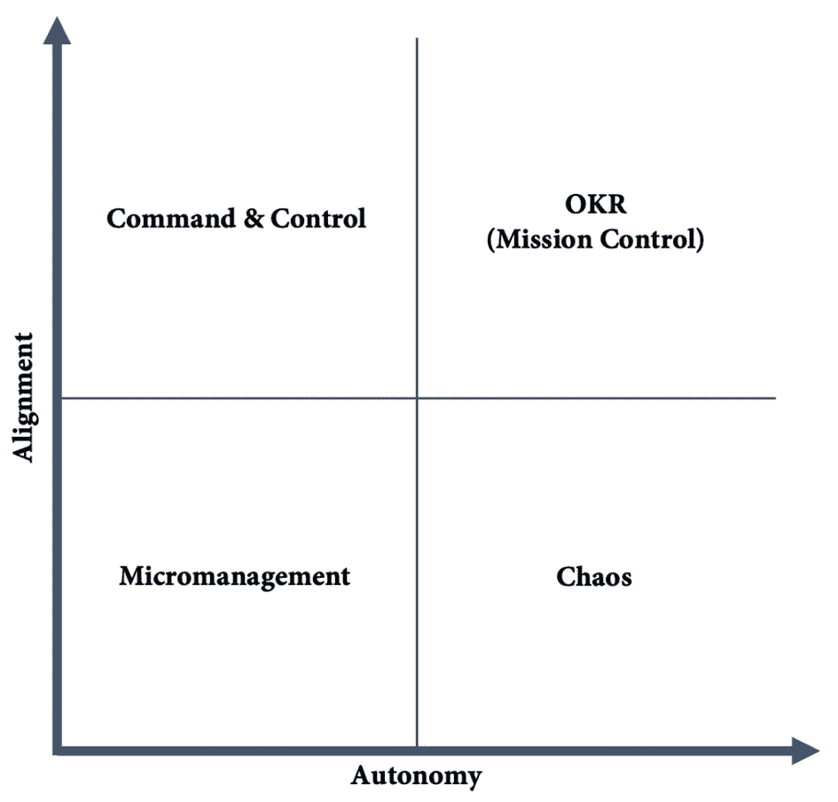

# 第一章：重要的指标

实施**DevOps**时最困难的部分是与管理层的对话转变。管理层习惯于提出以下问题：

+   这将花费多少？

+   我们将从中赚取多少？

从管理角度来看，这些是合理的问题。但在 DevOps 的世界里，如果在错误的时间和错误的方式回答这些问题，它们可能会变得有害，并导致大量的前期规划。在本章中，我将向你展示一些指标，这些指标能够将与管理层的讨论从一般的工程速度和开发者生产力转向实际的努力。

我将解释如何衡量工程速度和开发者生产力，以及如何使 DevOps 加速变得可衡量。

本章将涵盖以下主题：

+   为什么要加速？

+   工程速度

+   高性能公司

+   衡量重要指标

+   **SPACE**）框架用于开发者生产力

+   目标与关键成果

# 为什么要加速？

公司预期寿命正在迅速缩短。根据耶鲁管理学院的理查德·福斯特（Richard Foster）的说法，100 年前，**标准普尔**（**S&P**）**500**上市公司的平均寿命是 67 年。如今，它是 15 年。每两周，一家标准普尔上市公司就会退出市场，到 2027 年，预计 75%的前 500 强公司将被新公司取代。圣塔菲研究所的另一项研究（《公司死亡率》）得出结论，美国各行业公司的平均寿命约为 10 年。

为了保持竞争力，公司不仅需要解决客户的问题；他们还需要提供让客户满意的产品和服务，并且必须能够与市场互动并迅速响应需求的变化。**市场时间**是商业敏捷性最重要的驱动力。

软件是每个行业中每个产品和服务的核心，不仅因为数字体验已变得与（或甚至可能比）物理体验同样重要。软件涉及产品生命周期的每个部分，例如：

+   **生产：**

    +   供应链管理

    +   成本优化/预测性维护/机器人技术

    +   产品个性化（单件生产）

+   **销售、售后和服务：**

    +   网上商店

    +   客户服务和支持

    +   社交媒体

    +   数字助手

+   **数字产品：**

    +   配套应用

    +   集成

    +   移动体验

    +   新商业模式（按需付费、租赁等）

这些只是一些例子，用来说明客户与公司之间的大多数互动是数字化的。今天你不仅仅是买一辆车——你已经通过社交媒体和新闻了解了品牌。你通过网站或与销售人员在店内购买并配置汽车，也可能是通过平板电脑屏幕查看。汽车的价格受机器人和**人工智能**（**AI**）优化装配线的影响。你对汽车做的第一件事是连接你的手机。开车时，你可以听音乐、打电话或用语音回复短信。驾驶助手通过在有障碍物时为你刹车，确保你保持在车道内，帮助你保持安全；很快，汽车将会自动完成大部分驾驶任务。如果你在使用汽车或应用程序时遇到问题，你很有可能会通过应用程序或电子邮件联系售后服务，尤其是年轻一代。汽车主要是一个数字化产品。汽车内不仅有数百万行代码在运行，还有数百万行代码在支持汽车的应用程序、网站以及装配线的工作，（见*图 1.1*）。



图 1.1 – 软件和数据是客户体验的核心

好消息是，软件的更改速度远远快于硬件。为了加快市场推广速度和提高业务敏捷性，软件是关键驱动力。它比硬件组件更具灵活性，可以在几天或几周内进行更改，而不是几个月或几年。它还可以更好地与客户连接。使用你应用程序的客户比在实体店的客户更有可能参与调查。同时，硬件无法提供关于你产品使用情况的遥测数据。

要成为能够持续经营超过 10 年的公司，你的公司必须利用软件的力量，加速市场响应，并通过出色的数字体验取悦客户。

# 工程速度

你们公司如何衡量开发者速度？最常见的做法是通过工作量来衡量。过去有些公司使用如代码行数或代码测试覆盖率等指标，但这些显然是错误的选择，今天我没有听说过有公司还在这样做。如果你能用一行代码解决问题，或者用 100 行代码解决问题，显然一行代码更优，因为每一行代码都有维护成本。代码测试覆盖率也是一样，覆盖率本身并不说明测试质量，而糟糕的测试也会带来额外的维护成本。

注意

我尽量保持措辞对开发方法保持中立。我见过一些团队采纳了 DevOps 实践，使用了敏捷（Agile）、Scrum、**规模化敏捷框架**（**SAFe**）和看板（Kanban），还有瀑布（Waterfall）。但每个系统都有自己的术语，我尽量保持中立。例如，我说需求，而不是用户故事或产品待办项，但我使用的大多数例子基于 Scrum。

衡量开发人员速度的最常见方法是通过估算需求。你将需求拆解为小项——比如用户故事——然后产品负责人分配一个业务价值。接着，开发团队对故事进行估算并分配一个努力值。无论你使用故事点、小时、天数还是其他任何数字都无所谓。这基本上是对完成需求所需努力的表示。

## 用努力来衡量速度

用估算的努力和业务价值来衡量速度，如果你将这些数据报告给管理层，可能会产生副作用。这里有某种*观察者效应*：人们会试图改善数字。对于努力和业务价值，这是容易的——你可以简单地给故事分配更大的数字。这通常是发生的情况，尤其是当你比较不同团队之间的数字时：开发人员会给故事分配更大的数字，产品负责人也会分配更大的业务价值。

虽然这种方法对衡量开发人员的速度并非最优，但如果估算是在团队和产品负责人之间的正常对话中进行的，也不会造成很大危害。但如果估算是在正常开发过程之外进行的，估算可能会变得有毒，并产生非常负面的副作用。

## 有毒的估算

寻找“它需要多少钱？”这个问题的答案，通常会导致在正常开发过程之外进行估算，且在实施决策之前。但我们如何估算一个复杂的特性或计划呢？

我们在软件开发中做的每一件事都是新的。如果你已经做过了，你就可以使用现有的软件，而不是重新编写。因此，即使是完全重写一个现有模块，它仍然是新的，因为它采用了新的架构或框架。任何前所未做的事情只能在有限的确定性下进行估算。这是猜测，而且复杂性越大，*不确定性锥*越大（见*图 1.2*）。



图 1.2 – 不确定性锥

不确定性锥（cone of uncertainty）在项目管理中使用，其前提是项目初期，成本估算具有一定程度的不确定性，随着滚动计划的推进，这种不确定性会逐渐减少，直到项目结束时为零。*x*轴通常表示所用时间，但它也可以与复杂性和抽象性相关：需求越抽象和复杂，估算的不确定性就越大。

为了更好地估算复杂的特性或计划，这些内容会被拆解成更小的部分，以便更好地进行估算。你还需要在工作分解中提出解决方案架构。由于这是在正常开发流程之外进行的，并且是在前期和脱离上下文的情况下完成的，因此会产生一些不希望出现的副作用，具体如下：

+   通常，并不是整个团队都在场。这会导致多样性减少，沟通减少，因此在解决问题时也会导致*更少的创造力*。

+   焦点是*发现问题*。你能提前发现更多问题，估算可能就越准确。特别是如果你后来将估算作为衡量绩效的标准，人们很快会学到，如果他们发现更多问题，就可以争取更多时间，因此可以对需求进行更高的估算。

+   如果有疑问，负责估算的工程师会选择*更复杂*的解决方案。例如，如果他们不确定能否使用现有框架解决问题，他们可能会考虑编写自己的解决方案，以确保万无一失。

如果这些数字仅仅是被管理层用来决定是否实现某个特性，那影响不会太大。但通常情况下，需求——包括估算和解决方案架构——不会被丢弃，而是会在后续用来实现特性。在这种情况下，也会显现出一个针对问题优化而非针对解决方案的较不具创造性的解决方案。这不可避免地会导致在实现特性时缺乏创造力和突破性思维。

#NoEstimates

估算并不糟糕。如果在合适的时机进行，它们可能是有价值的。如果开发团队和产品负责人讨论下一步的故事，估算可以帮助推动讨论。例如，如果团队进行计划扑克（planning poker）来估算用户故事，并且估算结果不同，这表明大家对如何实现存在不同的看法。这可能会引发有价值的讨论，可能更加富有成效，因为你可以在达成共识的情况下跳过一些故事。这一点在商业价值上也适用。如果团队不明白为什么产品负责人会分配一个非常高或非常低的数字，也可能会引发重要的讨论。也许团队已经知道如何实现成功的解决方案，或者不同的角色对问题的看法存在差异。

但是许多团队更倾向于完全不进行需求估算。这通常被称为**#noestimates**。特别是在高度实验性的环境中，估算往往被视为浪费时间。远程和分布式团队也常常不进行估算。他们通常会将面对面的讨论转移到关于问题和**拉取请求**（**PRs**）的讨论中。这也有助于记录讨论，并帮助团队以更异步的方式工作，从而帮助跨越不同时区的差异。

在开发者速度不再是考虑因素的情况下，团队应当允许自己决定是否进行估算。这也可能随着时间的推移而变化。有些团队从中获得了价值，而有些则没有。让团队自行决定什么对他们有效，什么无效。

## 高级项目估算的正确方法

那么，估算更复杂的特性或项目的最佳方式是什么，以便产品负责人决定这些是否值得实施？将整个团队聚集在一起，并提出以下问题：*这能在天数、周数还是月数内交付？* 另一种选择是使用类比估算，并将该项目与已交付的项目进行比较。问题是：*这个项目比之前交付的项目小、相等，还是更复杂？*

最重要的是不要将需求细分或者已经制定解决方案架构——重要的是所有工程师的*直觉*。然后，让每个人为单位分配一个最小值和最大值。对于类比估算，使用相对于原始项目的百分比，并使用历史数据计算结果。

报告这一点最简单的方式是这样的：

```
Given the current team,
```

```
if we prioritize the initiative <initiative name>,
```

```
the team is confident to deliver the feature in between <smallest minimum> and <highest maximum>
```

选择最小的最小值和最大的最大值是最安全的方法，但如果悲观和乐观估算相差很大，这也可能导致数字失真。在这种情况下，平均值可能是更好的选择，如下所示：

```
Given the current team,
```

```
if we prioritize the initiative <initiative name>,
```

```
the team is confident to deliver the feature in between <average minimum> and <average maximum>
```

但是，采用平均值（*算术平均数*；在 Excel 中使用`=AVERAGE()`）意味着偏差可能较大或较小，具体取决于单个估算的分布。偏差越大，你就越不能确定是否能够在规定时间内交付该功能。为了了解你的估算分布情况，你可以计算*标准差*（在 Excel 中使用`=STDEV.P()`）。你可以查看最小值和最大值的偏差，也可以查看每个成员的估算。偏差越小，数值就越接近平均值。由于标准差是绝对值，因此无法与其他估算进行比较。为了获得相对数值，你可以使用`=STDEV.P() / AVERAGE()`（在 Excel 中）。数值越高，表示数值偏离平均值越远；数值越低，表示每个团队成员对估算的信心越大，或者整个团队对最小值和最大值的信心越大。请参见下表中的示例：



表格 1.1 – 估算计算示例

为了表示值的偏差的不确定性，您可以为估算添加一个置信度级别。这个置信度可以是文本（例如`low`、`medium`或`high`）或者百分比级别，如下所示：

```
Given the current team,
```

```
if we prioritize the initiative <initiative name>,
```

```
the team is <confident level> confident to deliver the feature in <arithmetic mean>
```

我在这里不使用固定公式，因为这涉及到对团队的了解。如果你查看示例中的数据（*表 1.1*），你会发现最小值（**2.7**）和最大值（**6.3**）的平均值相差并不远。如果你观察单个团队成员，你会发现有些成员比较悲观，有些成员比较乐观。如果过去的估算能证实这一点，那么即使最小值和最大值的变异系数较高，也能让你非常有信心认为这个平均值是现实的。你的估算可能是这样的：

```
Given the current team,
```

```
if we prioritize the initiative fancy-new-thing,
```

```
the team is 85% confident to deliver the feature in 4.5 months"
```

这种估算方法并非火箭科学。它与复杂的估算和预测系统无关，比如三点估算技术（[`en.wikipedia.org/wiki/Three-point_estimation`](https://en.wikipedia.org/wiki/Three-point_estimation)）、PERT 分布（[`en.wikipedia.org/wiki/PERT_distribution`](https://en.wikipedia.org/wiki/PERT_distribution)）或蒙特卡洛模拟方法（[`en.wikipedia.org/wiki/Monte_Carlo_method`](https://en.wikipedia.org/wiki/Monte_Carlo_method)），这些方法都依赖于需求的详细拆解和任务（工作）层面的估算。其核心理念是避免提前规划和拆解需求，更依赖工程团队的直觉感知。这里的技巧只是为了给你一些关于团队收集的数据点的见解，依然只是猜测。

## 从开发者到工程速度

努力并不是衡量开发者速度的一个好指标，特别是当它基于估算时，在跨职能团队中，速度不仅仅取决于开发者。那么，如何从开发者速度转变为工程速度呢？

# 高绩效公司

拥有高工程速度的组织能够超越竞争对手并颠覆市场。那么，究竟什么是高绩效公司？

## 开发者速度指数

2020 年 4 月，麦肯锡发布了他们关于**开发者速度指数**（**DVI**）的研究报告（*Srivastava S., Trehan K., Wagle D. & Wang J. (2020)*）。这项研究涉及了来自 12 个行业的 440 家大型组织，分析了 13 个能力领域中的 46 个驱动因素。这些驱动因素不仅包括工程能力，还包括工作实践和组织能力，如公司文化。研究表明，DVI 排名前四分之一的公司在市场上的表现比其他公司高出四到五倍，不仅在整体业务表现上如此。排名前四分之一的公司在以下领域的得分比其他公司高出 40%到 60%：

+   创新

+   客户满意度

+   品牌认知

+   人才管理

该研究对来自 12 个行业的 440 家大型组织的 100 多位高级工程领导进行了访谈。访谈内容涵盖了 13 个能力领域中的 46 个驱动因素，分为以下三个类别：

+   **技术**：架构；基础设施与云计算采用；测试；工具

+   **工作实践**：工程实践；安全性与合规性；开源采用，敏捷团队实践

+   **组织赋能**：团队特征；产品管理；组织敏捷性；文化；人才管理

因此，DVI 远超单纯的开发者速度。它分析了工程速度以及所有影响工程速度的因素，并将其与业务成果相关联，如收入、股东回报、运营利润率，以及诸如创新、客户满意度和品牌认知等非财务绩效指标。

## DevOps 现状

这些发现与**DevOps 研究与评估**（**DORA**）*DevOps 现状*报告（https://www.devops-research.com/research.html#reports）中的结果一致，但通过加入业务成果，将其提升到了一个新层次。*DevOps 报告 2019*指出，精英公司与低效公司之间的比较（*Forsgren N., Smith D., Humble J. & Frazelle J. (2019)*），如以下所述：

+   **更快的价值交付**：它们的**交付时间**（**LT**）比普通公司快 106 倍，从提交到部署。

+   **更高的稳定性与质量**：它们从事故中恢复的速度比普通公司快 2,604 倍，并且**变更失败率**（**CFR**）低 7 倍。

+   **更高的吞吐量**：它们的代码部署频率是普通公司的 208 倍。

高绩效公司不仅在吞吐量和稳定性上表现卓越，而且在创新、客户满意度和业务表现上也更为突出（见*图 1.3*）。



图 1.3 – 高绩效公司

专注于那些突显高绩效公司与中低绩效公司之间差异的能力的指标，你可以使你的转型更加可视化，并为管理层提供更具意义的指标，希望这些指标比代码行数或基于估算的开发速度更能打动他们。

# 衡量重要指标

“成功变革的关键是衡量和理解正确的事物，聚焦于能力。”

– Forsgren. N., Humble, J. & Kim, G. (2018) 第 38 页

为了衡量你在转型旅程中的进展，最好专注于 DORA 使用的四个指标——两个用于绩效，两个用于稳定性，如下所示：

+   **交付绩效指标：**

    +   交付周期时间

    +   部署频率

+   **稳定性指标：**

    +   平均恢复时间

    +   变更失败率

## 交付周期时间

交付周期时间（DLT）是指从工程师开始工作一个特性到特性可供最终用户使用的时间。你可以说是*从代码提交到生产*——但通常情况下，你会从团队开始处理需求并将其状态更改为*进行中*或类似状态时开始计时。

要想将这个指标自动化并从系统中获取并不容易。我将在*第七章*《运行工作流》中展示如何结合使用 GitHub Actions 和 Projects 来自动化该指标。如果你无法从系统中提取该指标，你可以设置一个包含以下选项的调查：

+   少于 1 小时

+   少于 1 天

+   少于 1 周

+   少于 1 个月

+   少于 6 个月

+   超过 6 个月

根据你在这个尺度上的位置，你进行调查的频率会有所不同。当然，系统生成的值更为理想，但如果你处于该尺度的较高位置（几个月），这就无关紧要了。如果你测量的是小时或天数，情况就会更加有趣。

为什么不是领先时间（Lead Time）？

从**精益管理**的角度来看，LT 将是更好的指标：从客户反馈中获得的学习信息要流经整个系统需要多长时间？但软件工程中的需求通常很复杂。通常，在实际工程工作开始之前需要经历很多步骤。结果可能会有很大的变化，如果必须依赖调查数据，指标也很难预测。一些需求可能在队列中停留几个月——而一些需求则可能只停留几小时。从工程的角度来看，集中关注 DLT 会更好。你将在*第十八章*《精益产品开发与精益创业》中了解更多关于 LT 的内容。

## 部署频率

部署频率专注于速度。你交付更改需要多长时间？一个更加注重吞吐量的指标是 DF。你多久将更改部署到生产环境？DF 表示你的批量大小。在精益生产中，减少批量大小是非常理想的。较高的 DF 则表示较小的批量大小。

初看起来，似乎很容易在系统中衡量 DF。但仔细想想，你的部署中有多少最终能到达生产环境呢？在*第七章*《运行工作流》中，我将解释如何使用 GitHub Actions 来捕获该指标。

如果你还无法衡量该指标，你也可以使用调查。使用以下选项：

+   按需（每天多次）

+   每小时一次到每日一次之间

+   每日一次到每周一次之间

+   每周一次到每月一次之间

+   每月一次到每 6 个月一次之间

+   每 6 个月一次以下

## 平均恢复时间

衡量稳定性的一个重要指标是恢复的平均时间（MTTR）。它衡量的是在发生故障时，恢复你的产品或服务所需的时间。如果你衡量的是正常运行时间（uptime），那基本上是指服务不可用的时间段。为了衡量你的正常运行时间，可以使用冒烟测试——例如在 Application Insights 中（见[`docs.microsoft.com/en-us/azure/azure-monitor/app/monitor-web-app-availability`](https://docs.microsoft.com/en-us/azure/azure-monitor/app/monitor-web-app-availability)）。如果你的应用程序安装在客户端机器上且无法访问，则会更复杂。通常，你可以回退到帮助台系统中特定票种的时间。

如果你根本无法衡量它，你仍然可以回退到一个调查，提供以下选项：

+   少于 1 小时

+   少于 1 天

+   少于 1 周

+   少于 1 个月

+   少于 6 个月

+   超过 6 个月

但这应该仅作为最后的手段。MTTR 应该是你能轻松从系统中获取的一个指标。

## 变更失败率

与性能的 DLT 类似，MTTR 是衡量稳定性的时间指标。专注于吞吐量的 DF 的对应指标是变更失败率（CFR）。对于问题*你有多少次部署会导致生产环境的失败？*，CFR 以百分比形式给出。为了确定哪些部署应该计入该指标，您应该使用与 DF 相同的定义。

## 四大关键仪表板

基于 DORA 研究的这四个指标是衡量你在 DevOps 之旅中所处位置的绝佳方式。它们是改变与管理层对话的一个良好起点。把它们放在仪表板上，并为之骄傲。不要担心如果你还不是精英表现者——重要的是在旅程中，并不断改进。

从基于调查的数值开始非常简单。但如果你想使用自动生成的系统数据，可以使用四大关键项目将数据展示在一个漂亮的仪表板上，（见*图 1.4*）。



图 1.4 – 四大关键仪表板

该项目是开源的，并基于 Google Cloud（见[`github.com/GoogleCloudPlatform/fourkeys`](https://github.com/GoogleCloudPlatform/fourkeys)），但它依赖于 webhook 从你的工具中获取数据。你将在*第七章*，*运行你的工作流*中学习如何使用 webhook 将数据发送到仪表板。

## 你不应该做的事

这些指标不应被用来进行团队之间的比较。你可以将它们汇总以获得组织的概况，但不要比较单个团队！每个团队的情况不同。重要的是这些指标朝着正确的方向发展。

此外，指标不应成为目标。仅仅获得更好的指标并不可取。始终应专注于导致这些指标的能力，在本书中我们讨论的正是这些能力。专注于这些能力，指标会随之而来。

# 开发者生产力的 SPACE 框架

DORA 指标是一个完美的起点。它们易于实施，并且有大量数据可供比较。如果您想进一步添加更多指标，可以使用开发者生产力的 SPACE 框架（*Forsgren N., Storey M.A., Maddila C., Zimmermann T., Houck B. & Butler J. (2021)*）。

开发者生产力是实现高工程速度和高 DVI 的关键要素。开发者生产力与开发者的整体幸福感和满意度高度相关，因此是在人才争夺战中蓬勃发展和吸引优秀工程师的最重要因素之一。

但是，开发者生产力不仅仅关乎活动。相反，情况通常相反：在紧急情况和截止日期逼近时，活动通常很高，但通过频繁的任务切换和较少的创造力导致生产力下降。因此，衡量开发者生产力的指标永远不应孤立使用，也不应用于惩罚或奖励开发者。

此外，开发者的生产力不仅仅关乎个人表现。就像团队运动一样，个人表现很重要，但只有整个团队才能获胜。平衡个人和团队表现的度量是至关重要的。

SPACE 是一个多维框架，将开发者生产力的指标分类为以下几个维度：

+   **S**atisfaction and well-being

+   **P**erformance

+   **A**ctivity

+   **C**ommunication and collaboration

+   **E**fficiency and flow

所有这些维度都适用于个人、团队和整个系统。

## 满意度和幸福感

满意度和幸福感关乎我们有多快乐和满足。身体和心理健康也属于这一维度。这里给出了一些示例指标：

+   开发者的满意度

+   **净推荐值**（**NPS**）用于团队（衡量某人会向他人推荐他们的团队的可能性）

+   保留率

+   对工程系统的满意度

## Performance

Performance 是系统或过程的结果。个体开发者的表现难以衡量。但对于团队或系统级别，我们可以使用 LT、DLT 或 MTTR 等度量标准。其他例子包括正常运行时间或服务健康状态。其他好的指标包括客户满意度或产品的 NPS（衡量某人会向他人推荐产品的可能性）。

## Activity

活动可以为生产力提供有价值的见解，但正确衡量它很难。个人活动的一个良好指标是专注时间：开发者在多少时间内不参加会议和沟通？其他指标的例子包括完成的工作项数、问题、PR、提交或错误。

## 沟通与协作

沟通与协作是开发人员生产力的关键因素。衡量它们很难，但查看 PR 和问题可以让你对沟通情况有一个很好的了解。这个维度的指标应该聚焦于 PR 的参与度、会议的质量以及知识共享。此外，跨团队的代码审查（**跨团队**或**X-team**）是一个很好的衡量标准，帮助你了解团队之间的边界。

## 效率与流动性

效率和流动性衡量多少次交接和延迟增加了整体的 LT。好的指标包括交接次数、被阻塞的工作项和中断。对于工作项，你可以衡量总时间、增值时间和等待时间。

## 如何使用 SPACE 框架

“间接地了解一个组织中重要事物的一种方式是查看被衡量的内容，因为它通常传达了被重视的事物，并影响人们的行为和反应方式。”

– Forsgren N., Storey M.A., Maddila C., Zimmermann T., Houck B. & Butler J. (2021) 第 18 页

所有维度都适用于个人、团队、群体和系统层面，（见*图 1.5*）。



图 1.5 – SPACE 指标的示例

重要的是不仅要看维度，还要看范围。一些指标在多个维度中有效。

选择哪些指标被衡量也非常重要。指标会塑造行为，而某些指标可能会产生你最初没有考虑到的副作用。目标是使用少数几个指标，但要确保它们有最大化的正面影响。

你应该从三个维度中选择至少三个指标。你可以混合使用个人、团队和系统范围的指标。要小心个人指标——它们可能产生最难以预见的副作用。

为了尊重开发人员的隐私，数据应该进行匿名化处理，并且你只应该在团队或小组层面报告汇总结果。

# 目标与关键结果

许多实践 DevOps 的公司正在使用目标与关键结果（OKRs）——其中包括谷歌、微软、推特和优步。

OKR 是一个灵活的框架，帮助公司定义并跟踪目标及其成果。

OKR 方法可以追溯到 1970 年代，当时 OKR 的*创始人*安德鲁·格罗夫将这种方法引入英特尔。这个方法叫做**iMBO**，即**英特尔目标管理法**。他在他的书《高效能管理》中描述了这一方法（*Grove, A. S. (1983)*）。

1999 年，约翰·多尔将 OKR 引入谷歌。在安德鲁·格罗夫将 iMBO 引入英特尔时，约翰·多尔也在那里工作。OKR 很快成为谷歌文化的核心部分。约翰·多尔出版了他的书《度量重要的事》（*Doerr, J. (2018)*），使 OKR 变得广为人知。如果你想深入了解 OKR，我强烈推荐阅读这本书。

## 什么是 OKRs？

OKR 是一种框架，帮助组织在实现战略目标时，保持团队和个人的最大自主权，同时实现高度的目标一致性。目标是具有方向性的定性目标，能够激励和鼓舞人心。每个目标都与明确可衡量的定量指标——关键结果相关联。关键结果应侧重于结果而非活动，具体示例如下表所示：



表 1.2 – OKR 的特征

OKR 绝不应与公司的绩效管理体系或员工奖金挂钩！目标不是要实现 100%的成功率——如果达到 100%成功率，意味着 OKR 的挑战性不足。

OKR 的写作格式如下：

```
We will [objective]
```

```
As measured by [set of key results]
```

重要的是，OKR 应专注于结果而不是活动。一个好的例子是谷歌**首席执行官**（**CEO**）桑达尔·皮查伊在 2008 年设定的一个目标，当时谷歌推出了 Chrome 浏览器。这个 OKR 是：

```
We will build the best browser
```

```
As measured by 20 million users by the end of 2008
```

这个目标对于一个新浏览器来说非常大胆，谷歌在 2008 年未能实现这个目标，用户不到 1000 万。到了 2009 年，关键结果被提高到 5000 万用户，但谷歌依然未能实现这个目标，用户大约为 3700 万。但谷歌并没有放弃，2010 年关键结果再次被提高——这次是 1 亿用户！这一次，谷歌超额完成了目标，用户数量达到了 1.11 亿！

## OKR 是如何运作的？

为了使 OKR 发挥作用，公司需要有一个清晰的愿景和使命，以定义*为什么*：*我们为什么要为这家公司工作？* 然后，愿景被分解为**中期目标**（称为**MOALS**）。这些 MOALS 本身也是 OKR，并被细分为每个 OKR 周期的 OKR，通常周期为 3 到 4 个月。在 OKR 规划和对齐过程中，OKR 会在组织中逐层分解，以确保每个个人和团队都有自己的 OKR，并且这些 OKR 最终为更大的目标做出贡献。然后，OKR 会持续被监控，通常是每周一次。在 OKR 周期结束时，OKR 会进行复盘，成果（希望是）被庆祝。根据这一周期的学习，MOALS 会得到更新，并开始新的周期（见*图 1.6*）。



图 1.6 – OKR 周期

理论上的 OKR 很简单，但实施起来并非如此。写出好的 OKR 尤其困难，需要大量的实践。此外，它还强烈依赖于公司文化和现有的衡量指标和**关键绩效指标**（**KPI**）。

## OKR 与 DevOps

一旦正确实施，OKR 可以让你在保持团队自主决策权的同时，实现团队之间的强大协作对齐，决定*他们*要构建什么，而不仅仅是如何构建它，（见 *图 1.7*）。这在我们讨论*第十九章*，*在 GitHub 上的实验和 A/B 测试*时非常重要。你的团队可以定义自己的实验并衡量结果。基于此，他们决定哪些代码应该保留在项目中，哪些不应该。



图 1.7 – OKR 有助于实现自主性和一致性

现在让我们来看一个例子。

你公司的愿景是成为在线视觉项目管理工具的市场领导者。你的产品当前的市场份额为 12%。公司的 MOAL 是如下所示：

```
We will build the best visual project management tool
```

```
As measured by a 75% market share by the end of 2025
```

你的产品由两个团队共同开发：一个团队专注于产品的核心部分，负责项目管理的视觉设计。他们关注现有客户，并致力于构建客户喜爱的产品。他们一致达成以下 OKR：

```
We will build the visual project management tool that is loved by our customers
```

```
As measured by an NPS of higher than 9
```

当前的 NPS（净推荐值）为 7.9，因此团队必须自行找到方法让客户感到满意。经过与一些客户的访谈后，他们提出假设：所有的项目管理工具都基于较旧的项目管理技术，在更注重敏捷的项目世界中显得过于复杂。他们决定对一部分客户进行实验，提出一种全新的可视化项目的概念，以验证或削弱这个假设。

第二个团队是共享服务团队。他们专注于用户管理、企业集成和账单。为了实现公司的 MOAL（最优化客户获取率），产品不仅要让现有客户感到满意，还需要吸引更多新用户。因此，在本次 OKR 周期中的重点是吸引新客户，如下所示：

```
We will build a project management tool that is easy to use for new customers
```

```
As measured by a 20% increased monthly new registered users
```

目前，新注册的用户数量已经趋于平稳，因此目标是重新开始增长。团队分析数据后发现，很多新客户在填写地址和银行信息的详细页面时中途放弃了注册过程。他们假设，如果注册流程更简化，更多客户可能会尝试该产品，并有可能留在平台上。他们决定进行实验，将注册流程简化到仅需进行身份验证的最基本内容。他们为新用户提供 30 天的免费试用期，并在此期间过后才要求提供付款信息。

我将在*第十八章*，*精益产品开发与精益创业*，以及*第十九章*，*在 GitHub 上的实验和 A/B 测试*中，讲解如何进行假设驱动的开发和实验。这些内容与 OKR 独立，但它们可以非常好地协同工作。

如果你对现实世界中的 OKR 感兴趣，GitLab 会公开分享他们的 OKR（[`about.gitlab.com/company/okrs/`](https://about.gitlab.com/company/okrs/)）。他们还分享了整个过程，以及他们如何将 OKR 与史诗和问题关联起来。

OKR 不是 DevOps 的前提条件。但与敏捷实践一样，它们是天生匹配的。如果你没有以敏捷的方式工作并开始进行 DevOps，你的工作方式最终会变得敏捷，而且你可以通过使用 Scrum 等框架来避免重新发明轮子。OKR 也是如此：当你在大规模组织中扩展 DevOps 时，它们会自然而然地出现，且你希望通过保持与全球目标的对齐，为团队提供很大的自主权。

# 总结

在这一章中，我解释了软件如何接管世界，它对公司寿命的影响，以及如果公司希望保持经营，必须加速软件交付。这有助于你通过使工程速度可见来改变与管理团队的对话。

衡量对公司重要的指标，并专注于能力。首先从 DORA 的四个关键指标开始，再从 SPACE 框架的不同维度中添加更多指标。但请记住，指标会塑造行为，因此要小心选择哪些指标。

通过选择正确的指标，你使得 DevOps 转型和加速变得可衡量和透明。

本章的大部分内容集中在效率上：做对的事情。只有 OKR 也涉及效果：做正确的事情。OKR 对于精益产品开发也很相关，且在*第十八章*《精益产品开发与精益创业》中有涉及。

在下一章中，你将学习如何规划、追踪和可视化你的工作。

# 案例研究

**Tailwind Gears**是一家制造公司，生产许多不同的零件，这些零件被集成到其他产品中。他们有五个以产品为中心的部门，总共有 600 多名开发人员。每个部门都有自己的开发流程。有些使用 Scrum，有些使用 SAFe，还有些使用经典的瀑布方法（**验证模型**或**V 模型**）。五个部门中的两个部门负责构建包含关键系统中使用的软件的组件，因此这些部门的产品高度受监管（**国际标准化组织**（**ISO**）*26262*和**通用良好实践**（**GxP**））。这些软件所使用的编程语言包括嵌入式 C 和 C++代码（用于硬件和芯片）、移动应用（Java；Swift）以及 Web 应用（JavaScript；.NET）。

与开发流程一样，工具的生态非常异构。有些团队仍然使用本地部署的老旧**Team Foundation Server**（**TFS**）；有些团队使用 Jira、Confluence 和 Bitbucket，还有些团队使用 GitHub 和 Jenkins。有些团队已经实施了**持续集成/持续部署**（**CI/CD**）实践，而其他团队仍然手动构建、打包和部署。有些团队已经以 DevOps 方式工作并运营自己的产品，而其他团队则仍然将生产版本交给单独的运维团队。

Tailwind Gears 面临以下问题：

+   **管理层无法看到**开发进展情况。由于各团队的工作方式不同，因此没有统一的方式来衡量开发速度。

+   各个部门报告**发布周期缓慢**（从几个月到几年不等）且**失败率高**。

+   每个部门都有自己的团队来支持其工具链，因此存在很多**冗余**。例如，模板和流水线没有共享。

+   很难将开发者和团队分配到最具商业价值的产品上。工具链和开发实践差异太大，且**入职时间**过长。

+   开发者对自己的工作**不满意**且**不高效**。一些开发者已经离开公司，且在市场上招聘新人才变得困难。

为了解决这些问题，公司决定实施一个统一的工程平台，并计划统一开发流程。这项倡议的目标如下：

+   **加速**各部门的软件交付。

+   **提高软件质量**并降低失败率。

+   通过提升协同效应并只设立一个平台团队负责一个工程系统，**节省时间和成本**。

+   通过将开发者和团队分配给价值更高的产品，**提升软件的价值**。

+   **提高开发者满意度**，以留住现有人才，并使招聘新开发者变得更容易。

为了让转型成果可见，公司决定衡量以下四个 DORA 关键指标：

+   DLT

+   DF

+   MTTR

+   CFR

由于目前还没有统一的平台，指标将通过调查问卷收集。计划是逐步将一个团队接入新的统一平台，并在那里使用系统指标。

开发者满意度是转型中的一个重要部分。因此，还将增加两个新的指标，具体如下：

+   开发者满意度

+   对工程系统的满意度

这是至少三个 SPACE 维度的六个指标的组合。当前还没有针对沟通与协作的指标，未来将随着转型进展加入到系统中。

# 进一步阅读

以下是本章中的一些参考资料，你可以用来获取更多关于这些话题的信息：

+   *Srivastava S.*, *Trehan K.*, *Wagle D.* & *Wang J*. (April 2020). *开发者速度：软件卓越如何推动业务绩效：* [`www.mckinsey.com/industries/technology-media-and-telecommunications/our-insights/developer-velocity-how-software-excellence-fuels-business-performance`](https://www.mckinsey.com/industries/technology-media-and-telecommunications/our-insights/developer-velocity-how-software-excellence-fuels-business-performance)

+   *Forsgren N.*, *Smith D.*, *Humble J.* & *Frazelle J.* (2019). *DORA DevOps 现状报告*：https://www.devops-research.com/research.html#reports

+   *Brown A.*, *Stahnke M.* & *Kersten N.* (2020). *2020 年 DevOps 现状报告：* [`puppet.com/resources/report/2020-state-of-devops-report/`](https://puppet.com/resources/report/2020-state-of-devops-report/)

+   *Forsgren N.*, *Humble, J.* & *Kim, G.* (2018). *加速：精益软件与 DevOps 的科学：构建和扩展高效能技术组织*（第 1 版）[电子书]。IT Revolution Press.

+   要了解更多关于四个关键项目的信息，请参阅*Dina Graves Portman*（2020 年）的文章*您是精英 DevOps 表现者吗？通过四个关键项目找出答案*：[`cloud.google.com/blog/products/devops-sre/using-the-four-keys-to-measure-your-devops-performance`](https://cloud.google.com/blog/products/devops-sre/using-the-four-keys-to-measure-your-devops-performance)

+   *Forsgren N.*, *Storey M.A.*, *Maddila C.*, *Zimmermann T.*, *Houck B.* & *Butler J.* (2021). *开发者生产力的 SPACE 空间：* [`queue.acm.org/detail.cfm?id=3454124`](https://queue.acm.org/detail.cfm?id=3454124)

+   *Grove, A. S.* (1983). *高产出管理*（第 1 版）。Random House Inc.

+   *Grove, A. S.* (1995). *高产出管理*（第 2 版）。Vintage.

+   *Doerr, J.* (2018). *衡量重要性：OKR：推动 10 倍增长的简单理念*。Portfolio Penguin
