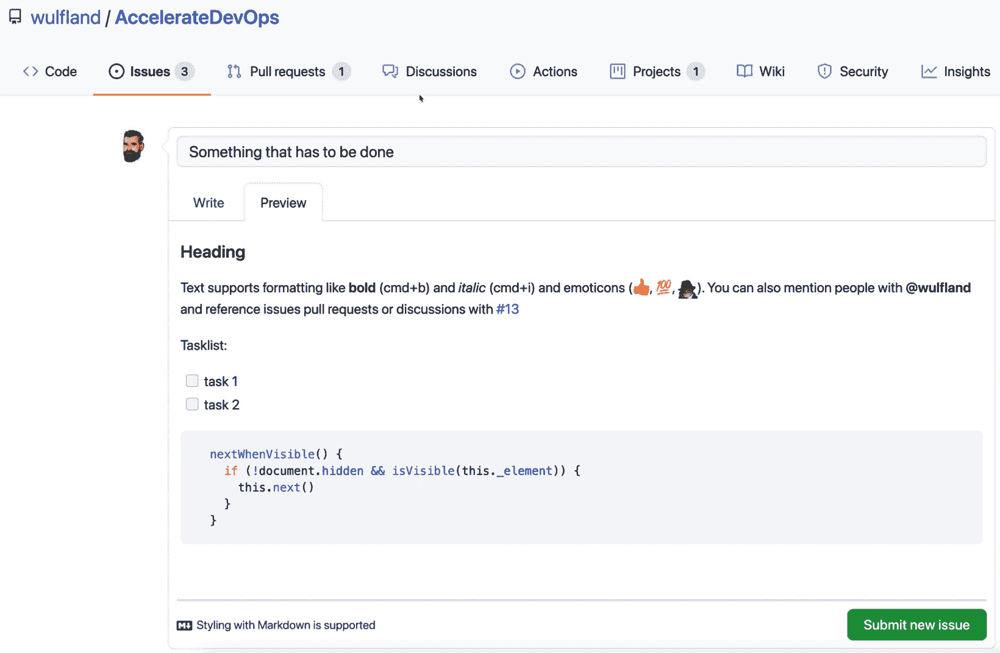
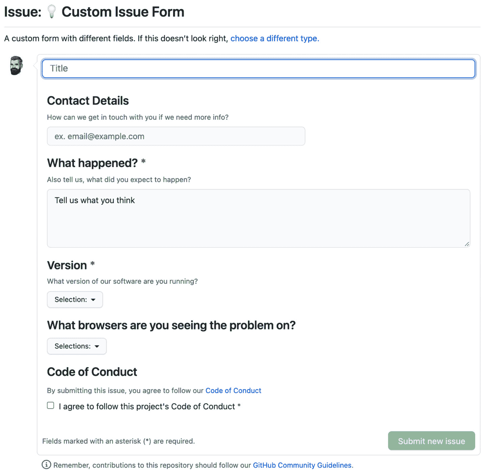

# *第二章*：计划、跟踪和可视化你的工作

在上一章中，你学习了如何衡量工程速度和绩效，以使你的加速过程可视化，并改变与管理层的对话方式。

本章将重点介绍如何在团队内部组织工作并应用**精益原则**。你将学习如何利用 GitHub 的问题和项目来简化工作流。

本章将涉及以下主题：

+   工作就是工作

+   未计划的工作和返工

+   可视化你的工作

+   限制 WIP（工作进行中的数量）

+   GitHub 问题、标签和里程碑

+   GitHub 项目

# 工作就是工作

工作是一种为了实现某个目标或结果而进行的活动。这不仅包括你正在进行的产品或项目，还包括你为公司必须执行的所有活动。在我合作的一些团队中，有些人将多达 50% 的工作时间花费在他们项目/产品团队之外的任务上。有些人是团队负责人，需要与组织团队成员开会和承担责任。有些人是工作委员会的成员。有些人接受个人发展路径的培训。有些人则必须修复他们以前参与的项目中的 bug 和现场问题。

这些任务中的许多不能从团队成员那里去除。团队成员可能喜欢这些任务，也可能不喜欢——但它们通常是他们个人发展的一部分。

这种工作的问题在于，任务的优先级和协调工作是由个人决定的，而且是在他们的团队上下文之外进行的。谁来决定是否应该优先处理开发者在以前系统中处理的一个 bug，而不是当前项目中的 bug？通常，个人会自己进行计划和优先排序。这往往导致前期更多的规划。当团队成员在冲刺开始时报告他们的可用时间时，团队开始围绕这些事件来规划当前的任务。这可能会阻止整个团队建立**拉取**机制，迫使他们去规划依赖任务并将任务分配给单个团队成员（**推动**）。

为了解决这个问题，你应该让团队看到所有的工作，并将其添加到团队的待办事项列表中。你是否在工作委员会中？将其添加到待办事项列表中。你是否有培训？将其添加到待办事项列表中。

所以，第一步是弄清楚*你的团队执行的是什么类型的工作*并将所有任务汇集到**一个待办事项列表**中。

第二步是**简化**。每个人都能让事情变得更加复杂——但要让事情变得简单则需要一点天才。这就是为什么大多数公司中的流程和表单会随着时间的推移变得越来越复杂。我见过有 300 个字段的表单以及基于这些字段的复杂路由规则——只是为了处理现场故障。不要将这种复杂性转移到你的待办事项中。无论背景中的流程如何——工作对你的团队有明确的触发条件，经过团队处理后，便不再是你的责任——所以从你的角度看，它已经完成。一个流程或工单可能会导致你待办事项中的多个小工作项。每个工作项应该简化为**待办**、**进行中**和**完成**。

注意

在*第十八章*《精益产品开发与精益创业》中，我们将更多地关注价值流、约束理论，以及如何优化工作流。在本章中，我们将重点关注团队层面，以及如何开始优化跨团队边界的工作。

# 未计划的工作和返工

所有开发者都知道频繁的**上下文切换**会导致生产力降低。如果我们在编码时被打扰，我们需要一些时间才能重新进入代码，并恢复到打扰发生时的生产力。因此，处理多个项目或任务也会降低生产力。在他的著作《*质量软件管理：系统思维*》中，Gerald M. Weinberg 呈现了一项研究结果，得出结论：当同时只处理两个项目时，性能会下降约 20%（Weinberg G.M. 1991）。每增加一个项目，性能会进一步下降 20%（见*图 2.1*）：


图 2.1 – 上下文切换导致的生产力损失

2017 年的另一项研究表明，从事两三个项目的开发者平均有 17%的时间花费在上下文切换上（Tregubov A., Rodchenko N., Boehm B., & Lane J.A., 2017）。我认为实际的百分比可能因产品和团队而异。开发者在小批量工作时，比起从事大批量工作的人更容易进行上下文切换。事情越复杂，恢复工作时所需的精力就越大。**测试驱动开发**（**TDD**）等实践有助于在上下文切换后更容易恢复工作。

但不管实际百分比如何：上下文切换会降低生产力，开发者在一项任务上花费更多的集中时间，效率会更高。这意味着你应该减少团队的**进行中的工作**（**WIP**）——尤其是未计划的工作和返工。

为了帮助你日后优化，你应该从一开始就正确标记你的工作项。未计划的工作可能来自项目内部或外部。返工可能会发生，例如存在 bug、技术债务或误解的需求。确保从一开始就使用正确的标签，这样你可以在以后分析你的工作。这不需要是一个复杂的治理框架——只需选择一些有助于你日后优化工作的标签即可。*表 2.1*只是一个示例，展示了你可以如何分类你的工作项：


表 2.1 – 工作项的示例分类法

保持简单，选择简单明了且团队能够理解的分类。

# 可视化你的工作

为了专注于重要工作并减少多任务处理和任务切换，你应该将工作可视化——通常以**看板**的形式呈现。看板起源于**精益生产**，但现在已被认为是**精益软件开发**的重要组成部分。看板可以帮助你提高工作流在系统中的效率。

可视化将帮助你完成以下任务：

+   识别瓶颈、等待时间和交接点。

+   优先处理工作并首先处理最重要的任务。

+   将工作分解为小批次。

+   完成工作。

## 建立拉动机制

没有完美的计划。如果你曾经规划过项目，你会知道项目计划只有在有大量缓冲时间的情况下才会有效——而且你总是需要调整计划。因此，即使你只为接下来的 2 到 3 周规划工作，规划也会导致等待时间和上下文切换。解决方案是停止规划并建立拉动系统；团队成员从队列中拉取最高优先级的工作并开始执行。理想情况下，任务会被完成并移至已完成（见*图 2.2*）：


图 2.2 – 从待办事项中拉取工作以表示状态变化

如果你的任务无法仅通过你一个人完成，这可能表明任务过大，需要拆分为更小的任务。如果你必须同时处理多个任务才能完成任何工作，任务可能太小。随着时间的推移，视觉表示会帮助你识别瓶颈和等待时间，从而进行调整。

## 优先排序

使用可视化看板的好处在于，你可以轻松地优先处理你的工作。只需将优先级最高的工作项移到顶部。如果你的看板上有不同种类的工作，你可能需要额外的视觉分隔。这可以通过**泳道**来实现。泳道是在看板上对工作进行的水平分组（见*图 2.3*）：


图 2.3 – 使用泳道在看板上组织工作

如果你的团队需要处理现场问题，你可能需要一个优先级泳道，以向所有团队成员表示当前的问题比正常工作更紧急。或者，如果团队成员有团队外的责任，你也希望将这些责任与正常工作区分开来。

许多看板还允许你为每张卡片设置不同的颜色——通常是通过给卡片应用标签或标记。这也可以帮助你在视觉上区分看板上不同种类的工作。特别是在与泳道结合使用时，彩色卡片可以帮助你一眼看出团队的进展情况，以及哪些任务是需要关注的最重要事项。

## 保持简洁！

从简单开始，使用三列（待办、进行中、已完成），根据需要添加更多列和泳道来优化团队的工作流。但要小心保持简洁！在每次自定义之前问问自己：这有必要吗？这带来价值吗？有没有更简单的方法？

复杂的事物有粘性——在使用看板时，我看到团队将看板发展成了一个怪物，拥有 10 列、8 条泳道（大部分时间都折叠着）以及卡片上有许多字段和信息。

看板的核心是简化——尽量保持尽可能简单！

# 限制 WIP

看板的目标之一是限制 WIP。通过减少 WIP，你可以减少上下文切换，增加专注力。这有助于你完成任务！停止开始，开始完成！

即使是在指导 Scrum 团队时，我也看到过团队在冲刺的前几天就开始处理他们计划中的所有用户故事。每当开发人员被阻塞时，他们就会开始处理另一个故事。到冲刺结束时，所有的故事都处理过了，但没有一个是完成的。

在看板中，你处理的是少量任务——并且保持恒定的节奏。

## 设置 WIP 限制

大多数看板支持 WIP 限制。WIP 限制是指你希望在某一列中同时处理的最大任务数量。假设“正在进行”列的 WIP 限制为五个，而你正在处理三个任务。该列会显示 3/5——通常是绿色的，因为还没有达到限制。如果你开始处理另外三个任务，那么它会显示 6/5，变为红色，因为已达到限制。

WIP 限制可以帮助你专注于少量任务，避免开始过多的工作。从小任务开始，只有在绝对必要时才增加任务量。一个好的默认值是五个。

## 减小批量大小

限制 WIP 可以很好地指示你的工作项是否大小合适。如果很难保持在 WIP 限制内，那么你的工作项可能仍然太大。尝试在增加限制之前将任务拆分为更小的任务。

## 减少交接

对于交接也是如此。如果你的工作项需要许多团队成员的输入——或者更糟，来自团队外部的输入——就会产生等待时间，降低你的 **流程效率**。流程效率是你在工作项上所花的时间除以完成它所需的总时间——包括等待时间：


流程效率是软件工程中一个非常理论化的度量指标，因为通常你不会精确测量工作和等待时间。但是，如果你经历了许多交接和阻塞项，该指标可能有助于查看工作在系统中的流转情况。你可以在将工作项移动到“进行中”时启动工作计时器，在将其移回时启动等待计时器。

# GitHub 问题、标签和里程碑

**GitHub 问题**让你能够跟踪任务、增强功能和错误。它们具有高度的协作性，并且有一个显示历史记录的时间轴。问题可以与提交、拉取请求和其他问题关联。GitHub 问题是开发者在 GitHub 上喜爱的体验的一部分。这也是为什么它们是管理工程团队工作的一种良好解决方案。

## 创建一个新问题

你可以在你的仓库下的 **Issues** | **New Issue** 创建一个新问题。问题包括一个标题和一个支持 Markdown 的正文（参见 *图 2.4*）：


图 2.4 – 创建一个新问题

一个工具栏可以帮助你格式化文本。除了常规格式化（如标题、粗体和斜体文本、列表、链接和图片）外，它还有一些值得注意的功能：

+   `:+1:` (👍) 和 `:100:` (💯)，以及典型的 GitHub 样式的 `:shipit:` 松鼠。你可以在这里找到完整的列表：[`gist.github.com/rxaviers/7360908#file-gistfile1-md`](https://gist.github.com/rxaviers/7360908#file-gistfile1-md)。

+   **提及**：你可以通过 GitHub 用户名提及单个成员，或者提及整个团队。只需按下 *@* 并开始输入。然后从列表中选择成员或团队。他们会收到通知，提及会显示为指向该成员或团队个人资料的链接。

+   **引用**：通过按下 *#* 键并从列表中选择项目，可以引用其他问题、拉取请求或讨论。

+   `– [ ]`。如果任务完成，中心会加上`x`：`- [x]`。

+   ```` ``` ```` 用于打开和关闭代码块。语法高亮由 Linguist（[`github.com/github/linguist`](https://github.com/github/linguist)）处理，并且支持大多数编程语言。

    Markdown

    **Markdown** 是一种非常流行的轻量级标记语言。与 JSON 或 HTML 不同，它基于单行格式化文本，并且没有开闭标签或括号。这就是为什么它非常适合使用 Git 进行版本管理，并通过拉取请求协作进行更改。这也是为什么 YAML 成为机器可读文件的事实标准的原因。Markdown 是人类可读文件的等价物。在 DevOps 团队中，一切都是代码：图表、架构、设计和概念文档、配置文件以及基础设施。这意味着 YAML、Markdown 或两者的混合都在使用。

    如果你还没有学习 Markdown，现在是时候开始了。许多团队在拉取请求中广泛使用 Markdown 来协作处理可读的内容。由于大多数工作管理解决方案也支持 Markdown，它几乎无处不在。

    Markdown 语法非常简单，容易学习。使用几次之后，它应该不会成为负担。

你可以随时切换到预览模式，查看你的 Markdown 输出（见 *图 2.5*）：



图 2.5 – 在新问题中预览 Markdown

在 GitHub 上有一个很好的 Markdown 入门教程，您可以在这里找到：[`guides.github.com/features/mastering-markdown/`](https://guides.github.com/features/mastering-markdown/)。

提示：

如果你经常使用相似的文本块，还可以保存回复。按 *Ctrl* + *.*（Windows/Linux）或 *Cmd* + *.*（Mac），然后从列表中选择回复，或者创建一个新的保存回复。欲了解更多信息，请参见 [`docs.github.com/en/github/writing-on-github/working-with-saved-replies`](https://docs.github.com/en/github/writing-on-github/working-with-saved-replies)。

## 协作处理问题

一旦问题被创建，你可以随时添加评论。你可以将最多 10 个人指派给该问题，并为其应用标签进行分类。所有的变更都会作为事件显示在问题的历史记录中（见 *图 2.6*）：


图 2.6 – 编辑问题

如果你的问题包含任务列表，它用于显示问题的进展。你可以将每个任务转换为一个独立的问题，然后将其链接到当前的问题。如果你点击 **打开转换为问题** 按钮（请注意 *图 2.6* 中鼠标悬停时的显示），该任务就会被转换成一个新问题，并显示为链接。如果你点击该链接并打开问题，你会看到该问题在另一个问题中被追踪（见 *图 2.7*）：


图 2.7 – 创建问题的层级结构

通过这种方式，你可以创建灵活的工作层级结构，并将工作拆分成更小的任务。

## 问题待办事项

问题概览并不是一个真正的待办事项列表，因为它不能通过拖放轻松排序。但它有一个非常先进的语法用于过滤和排序。每个你应用的过滤器都会作为文本添加到搜索框中（见 *图 2.8*）：


图 2.8 – 筛选和排序问题列表

在概述中，你可以看到任务的进展和标签。你还可以看到与问题关联的拉取请求。

## 里程碑

里程碑是一种将问题分组的方法。一个问题只能被分配到一个里程碑。里程碑通过已关闭的问题数量与总问题数量的比例来衡量进展。里程碑有一个标题、一个可选的截止日期和一个可选的描述（见*图 2.9*）：


图 2.9 – 使用里程碑规划问题

里程碑是一种将问题分组的方法，以便发布具有特定目标日期的版本。它们还可以用于将不属于任何发布版本的问题归为一类。

## 固定问题

你最多可以将三个问题固定到你的代码库。这些问题将在问题概览的顶部显示（见*图 2.10*）：


图 2.10 – 固定的问题

固定问题是与其他贡献者或新团队成员沟通重要事项的好方法。

## 问题模板

你可以配置不同的模板来为问题提供预定义内容。如果用户创建一个新问题，他们可以从列表中选择模板（见*图 2.11*）：


图 2.11 – 问题模板

你可以激活`.github/ISSUE_TEMPLATE`。点击**提议更改**并将文件提交到你的代码库。一旦模板文件进入你的代码库，你可以直接在其中编辑或删除它们。你也可以添加新的模板文件。无需通过设置来进行这项操作（添加新的模板文件）。

模板可以是 Markdown（`.md`）文件或 YAML（`.yml`）文件。Markdown 文件包含一个标题，指定名称和描述。它还可以为标题、标签和指派人设置默认值。以下是一个 Markdown 模板的示例：

```
---
```

```
name: 🐞 Bug report
```

```
about: Create a report to help us improve
```

```
title: ‘[Bug]:’
```

```
labels: [bug, unplanned]
```

```
assignees: 
```

```
  - wulfland
```

```
---
```

```
**Describe the bug**
```

```
A clear and concise description of what the bug is.
```

```
**To Reproduce**
```

```
...
```

如果你点击**问题** | **新建问题**，你可以选择模板并点击**开始**。新的问题将会填充模板中的值。结果如*图 2.12*所示：


图 2.12 – 一个 Markdown 问题模板

使用 YAML 模板，你可以定义带有文本框、下拉框和复选框的完整表单。你可以配置控件并将字段标记为必填。一个示例表单可以这样定义：

```
name: 💡 Custom Issue Form
```

```
description: A custom form with different fields
```

```
body:
```

```
  - type: input
```

```
    id: contact
```

```
    attributes:
```

```
      label: Contact Details
```

```
      description: How can we get in touch with you if we need more info?
```

```
      placeholder: ex. email@example.com
```

```
    validations:
```

```
      required: false
```

```
  - type: textarea
```

```
    id: what-happened
```

```
    attributes:
```

```
      label: What happened?
```

```
      description: Also tell us, what did you expect to happen?
```

```
      placeholder: Tell us what you see!
```

```
      value: “Tell us what you think”
```

```
    validations:
```

```
      required: true
```

```
  - type: dropdown
```

```
    id: version
```

```
    attributes:
```

```
      label: Version
```

```
      description: What version of our software are you running?
```

```
      options:
```

```
        - 1.0.2 (Default)
```

```
        - 1.0.3 (Edge)
```

```
    validations:
```

```
      required: true
```

```
  - type: dropdown
```

```
    id: browsers
```

```
    attributes:
```

```
      label: What browsers are you seeing the problem on?
```

```
      multiple: true
```

```
      options:
```

```
        - Firefox
```

```
        - Chrome
```

```
        - Safari
```

```
        - Microsoft Edge
```

```
  - type: checkboxes
```

```
    id: terms
```

```
    attributes:
```

```
      label: Code of Conduct
```

```
      description: By submitting this issue, you agree to follow our [Code of Conduct](https://example.com)
```

```
      options:
```

```
        - label: I agree to follow this project’s Code of Conduct
```

```
          required: true
```

结果如*图 2.13*所示：



图 2.13 – 一个 YAML 问题模板

你可以在这里找到更多关于**YAML 问题模板**的信息：[`docs.github.com/en/communities/using-templates-to-encourage-useful-issues-and-pull-requests/syntax-for-issue-forms`](https://docs.github.com/en/communities/using-templates-to-encourage-useful-issues-and-pull-requests/syntax-for-issue-forms)。

您可以通过向`.github/ISSUE_TEMPLATE`添加`config.yml`文件来自定义对话框以选择 issue 模板。您可以设置是否支持空白 issue 并添加额外的行：

```
blank_issues_enabled: true
```

```
contact_links:
```

```
  - name: 👥 Discussions
```

```
    url:  https://github.com/wulfland/AccelerateDevOps/discussions/new
```

```
    about: Please use discussions for issues that are not a bug, enhancement or feature request
```

结果如*图 2.11*所示——附加链接显示为**打开**按钮。

注意

在撰写本书时，YAML issue 模板仍处于测试阶段，因此可能会发生变化。

# GitHub 项目

GitHub issues 是协作的绝佳方式——但由于它们仅限于仓库范围，并且缺乏拖放式待办事项和可视化的看板，因此它们并不是可视化和跟踪工作任务的完美场所。

在 GitHub 中，管理不同仓库间工作任务的中心枢纽是**GitHub Projects**。它基于 GitHub issues，并支持来自多达 50 个仓库的 issues。

GitHub 项目是一个灵活的协作平台。您可以自定义待办事项列表和看板，并与其他团队或社区共享。

注意：新 GitHub Issues 或 GitHub Projects（测试版）

在撰写本书时，Git 项目正在进行全面重构。新的部分目前被称为**GitHub Projects（测试版）**或**新 GitHub Issues**，并将在准备好后取代 GitHub Projects。目前还不完全清楚最终的名称是什么。由于新的体验是未来的方向，本书将专注于这一部分。

目前，新的体验尚不如 Jira 或 Azure Boards 成熟。但有一支优秀的团队在致力于此，我相信如果它准备就绪，它将成为市场上最好的解决方案之一！

请注意，每月都会有如此多的新功能发布，以至于所有截图可能很快就会过时。请关注*变更日志*（[`github.blog/changelog/`](https://github.blog/changelog/)）以随时了解每月发布的所有新内容。

## 开始使用

GitHub 项目可以包含来自多个仓库的 issues 和 pull requests。因此，它们必须在组织层级或您的个人资料中为个人仓库创建。

要创建一个新项目，请在组织的主页或您的 GitHub 个人资料页面上导航到**项目**，然后点击**新建项目**（参见*图 2.14*）：


图 2.14 – 在您的个人资料或组织中创建新项目

## 向项目中添加工作项

项目的默认视图是表格视图。它经过优化以便于输入数据。按*Ctrl* + *空格*或点击表格的最后一行。您可以直接输入新工作项的名称，稍后将该项转换为一个 issue。或者您可以输入*#*并选择一个仓库，然后选择可用的 issues 和 pull requests（参见*图 2.15*）：


图 2.15 – 向待办事项列表中添加 issues、pull requests 或草稿工作项

## 为您的工作添加元数据

你可以轻松地向项目中添加不同的元数据字段。目前，支持以下类型：

+   **日期字段**：值必须是有效的日期。

+   **数字字段**：值必须是一个数字。

+   **单选**：值必须从值列表中选择。

+   **文本字段**：值可以是任何文本。

+   **迭代**：值必须从一组日期范围中选择。过去的日期范围会自动标记为已完成。包括当前日期的日期范围标记为当前。

要添加新字段，请按 *Cmd* + *K*（Mac）或 *Ctrl* + *K*（Windows/Linux）打开命令面板并开始输入 `Create new field`。你也可以点击右上角的加号并选择 **+ 新建字段**。输入字段名称并选择字段类型。

## 使用表格视图

项目的默认视图是高度灵活的 **表格视图**，你可以使用它来输入数据并通过拖放排序行以进行优先级排列。你可以通过打开列标题菜单或打开命令面板（*Cmd* + *K* 或 *Ctrl* + *K*）并选择其中的命令来对数据进行排序、筛选和分组。如果你对表格视图进行分组，你可以直接将项目添加到组中，或者通过将项目拖动到另一个组中来更改其值（见 *图 2.16*）：


图 2.16 – 表格视图支持分组、筛选和排序

## 使用看板视图

你可以切换视图为 **看板视图**，将你的工作以可配置的看板形式显示。每个字段的每个值都可以显示为一个列！你可以通过视图的 **列字段** 属性进行设置。你可以将项目拖动到另一个列中以更改状态。目前无法对看板进行分组或使用泳道，但你可以筛选看板，以便为不同种类的工作项设置独立的看板（见 *图 2.17*）：


图 2.17 – 看板视图

你可以通过点击看板右侧的加号为你选择的任何字段添加新列。这为你提供了一个非常灵活的方式来可视化你的工作（见 *图 2.18*）：


图 2.18 – 为你的看板选择任何字段作为列字段

看板视图优化了工作可视化，优化了流程，并限制了在制品（WIP）。

## 使用视图

每次对视图中的数据进行排序、筛选或分组，或在表格视图和看板视图之间切换时，标签页标题中的蓝色图标会指示该视图有未保存的更改。你可以在菜单中查看这些更改并保存或放弃它们。你也可以将它们保存为新视图（见 *图 2.19*）：


图 2.19 – 工作视图修改

创建新的自定义视图、重命名它们以及使用拖放功能进行排列都很简单。

## 工作流

你可以使用**工作流**来定义当问题或拉取请求转换到另一个状态时会发生什么。目前，你只能启用或禁用默认的工作流——但未来你将能够编写自己的工作流（见*图 2.20*）：


图 2.20 – 工作流定义了项目状态变化时的行为

## 洞察

你可以为迭代字段获得`@current`或`@next`，也可以为受指派者字段获得`@me`。你可以通过点击图表上的状态来禁用它们，并且可以将鼠标悬停在日期上查看详细信息（见*图 2.21*）：


图 2.21 – 通过实时数据的灵活图表获得洞察

在撰写本文时，洞察功能仅支持一种图表类型——燃尽图——并且仅按项目数和状态进行分类。但这一点很快会改变，你将能够创建多种灵活的图表，并可以修改成各种列。

## 管理访问权限

由于项目可以跨多个仓库共享，你可以在设置中配置可见性和访问权限。项目可以设为公开或私有。这使得你可以创建可以与公众共享的路线图。在组织中，你可以设置组织成员的基础权限为**无访问权限**、**只读**、**写入**或**管理员**。个人项目无法做到这一点，但你可以邀请明确的协作者并授予他们**只读**、**写入**或**管理员**权限。

为了更好的可发现性，你可以将项目添加到仓库（见*图 2.22*）：


图 2.22 – 将项目添加到仓库

GitHub 项目是一个非常灵活的解决方案，帮助你管理工作并根据需要进行调整。要了解更多关于 GitHub 项目的信息，请参阅[`docs.github.com/en/issues/trying-out-the-new-projects-experience/about-projects`](https://docs.github.com/en/issues/trying-out-the-new-projects-experience/about-projects)。

项目仍处于 Beta 版本。但已经发布的功能令人印象深刻，在不久的将来，这将是一个最灵活的解决方案，允许轻松与社区共享你的配置。请关注[`github.blog/changelog/label/issues/`](https://github.blog/changelog/label/issues/)中的更新。

# 第三方集成

如果你已经习惯使用像**Jira**或**Azure Boards**这样的成熟解决方案，你也可以继续使用该解决方案。GitHub 几乎支持所有可用产品的集成。我将在这里向你展示如何与 Jira 和 Azure Boards 进行集成——但是在 GitHub 市场上还有许多其他解决方案。

它简单吗？

Jira 和 Azure Boards 是非常棒的产品，且可以高度自定义。如果你希望继续使用当前工具，确保你已经应用了本章所述的所有内容。它简单吗？你能把所有工作都放进去吗？你有从队列中拉取工作的方式吗？你有设置 WIP 限制吗？流畅度如何？

你可能需要考虑调整你的流程和项目模板，以实现更加精简的工作方式。迁移到新平台是一个减少负担的好机会。如果进行集成，确保不要继承那些会拖慢进度的债务。

## Jira

GitHub 和 Jira 都有各自的应用，可以将这两个应用连接起来。如果你创建了一个新的 Jira 项目，可以在创建过程中直接添加 GitHub（见 *图 2.23*）。你也可以在 Jira 的 **应用** | **查找新应用** 中稍后添加它。


](img/B17827_02_026.jpg)

图 2.23 – 将 GitHub 添加到你的 Jira 项目

安装过程非常简单，详细说明可以参考这里：[`github.com/marketplace/jira-software-github`](https://github.com/marketplace/jira-software-github)。

你需要在 Jira 中安装这两个应用，并连接到 GitHub 组织。在 GitHub 中，你可以选择将所有仓库与组织关联，或者仅选择特定的仓库。如果你的组织有很多仓库，同步可能会需要一些时间！

你可以在 Jira 中通过 **应用** | **管理你的应用** | **GitHub** | **开始使用** 来检查你的配置和同步状态（见 *图 2.24*）：


](img/B17827_02_023.jpg)

图 2.24 – Jira 中的 GitHub 配置与同步状态

一旦同步生效，你可以通过在提交信息中提及 Jira 问题的 ID，将问题、拉取请求和提交与 Jira 问题关联。ID 通常由项目密钥和表示项目项的整数构成（例如，`GI-666`）。

如果你在 GitHub 问题中指定了 Jira 问题 `[GI-1]` 和 `[GI-2]`，文本会自动链接到对应的 Jira 问题（见 *图 2.25*）：


](img/B17827_02_026.jpg)

图 2.25 – 将 GitHub 问题链接到 Jira 问题

如果你在提交信息中提到 Jira 问题，它们会自动在 **开发** 部分与对应的 Jira 问题关联（见 *图 2.26*）。你还可以深入查看提交内容，查看包含更改数量的文件。


](img/B17827_02_025.jpg)

图 2.26 – 将 GitHub 工件链接到 Jira 中

你还可以使用 **智能提交** 来从提交信息中对 Jira 问题执行操作。智能提交具有以下语法：

```
<ignored text> <ISSUE_KEY> <ignored text> #<COMMAND> <optional COMMAND_ARGUMENTS>
```

目前支持三个命令：

+   `comment`：向 Jira 问题添加评论。

+   `time`：添加你在 Jira 问题上花费的时间。

+   `transition`：更改 Jira 问题的状态。

以下是一些智能提交工作原理的示例：

+   以下提交信息向问题 `GI-34` 添加了评论 `纠正缩进问题`：

    ```
    GI-34 #comment corrected indent issue
    ```

+   该提交信息向 `GI.34` 添加了时间：

    ```
    GI-34 #time 1w 2d 4h 30m Total work logged
    ```

+   该提交信息向 `GI-66` 添加了评论并关闭了该问题：

    ```
    GI-66 #close #comment Fixed this today
    ```

关于智能提交的更多信息，请参见 [`support.atlassian.com/jira-software-cloud/docs/process-issues-with-smart-commits`](https://support.atlassian.com/jira-software-cloud/docs/process-issues-with-smart-commits)。

注意！

智能提交仅在提交信息中的电子邮件地址在 Jira 中拥有足够权限时有效！

Jira 和 GitHub 具有紧密的集成。如果你的团队已经习惯使用 Jira，最好继续使用 Jira 并利用与 GitHub 的集成。

## Azure Boards

**Azure Boards** 还与 GitHub 紧密集成，设置起来非常简单。你只需从 GitHub 市场安装 Azure Boards 应用（参见 [`github.com/marketplace/azure-boards`](https://github.com/marketplace/azure-boards)），并按照说明操作。

你可以直接从 Azure Boards 问题（或任何其他工作项类型）链接 GitHub 提交和 GitHub 拉取请求，使用 `AB#<Azure Board 问题的 ID>`（例如，`AB#26`）。

GitHub 链接会显示在卡片上，带有 GitHub 图标（参见*图 2.27*）：


图 2.27 – 在 Azure Boards 中链接 GitHub 工件

如果你在 `AB` 引用之前添加了 `fix`、`fixes` 或 `fixed` 关键词，Azure Boards 问题将自动过渡到 `Done` 状态。请参见以下示例：

+   以下提交信息将链接问题 666，并在提交合并时将该问题转为已完成状态：

    ```
    Fixes AB#666
    Update documentation and fixed AB#666
    ```

+   以下提交信息将链接问题 42 和 666，但仅将 666 转为已完成状态：

    ```
    Implemented AB#42 and fixed AB#666
    ```

+   该关键词仅对一个引用有效。以下提交信息将链接所有三个问题，但只有 666 会被移动到已完成状态：

    ```
    Fixes AB#666 AB#42 AB#123
    ```

+   如果关键词不直接放在引用之前，则不会转移任何问题！

    ```
    Fixed multiple bugs: AB#666 AB#42 AB#123
    ```

你可以在 GitHub 的 README 文件中添加一个徽章，显示 Azure Boards 中的问题数量。你可以从 Azure Boards 的设置中获取徽章的 URL（在看板上方右侧的小齿轮图标）中的**状态徽章**部分。你可以选择显示进行中的问题数量或所有项目的数量（参见*图 2.28*）：


图 2.28 – 向你的 GitHub README 文件添加徽章

Azure Boards 的集成非常简单，感觉也很自然。如果你的团队已经习惯使用 Azure Boards，继续使用 Azure Boards 并与 GitHub 紧密集成是一个不错的选择。

# 案例研究

为了开始他们的 DevOps 转型，**Tailwind Gears** 选择了两个团队，将其迁移到 GitHub 作为新的 DevOps 平台。

战略决策是将所有内容迁移到 GitHub，并使用 **GitHub 项目** 和 **GitHub 问题** 来管理工作。这还实现了某些团队在受监管环境中工作时所需的端到端可追溯性。此外，开发流程应在迁移到新平台时保持一致。

其中一个试点团队已经使用 **Scrum** 超过一年。他们使用 **Jira** 来管理他们的待办事项，并在 3 周的冲刺周期内工作。仔细查看这些冲刺会发现，在每个冲刺中，都有许多问题无法关闭。此外，大多数问题在冲刺开始时就开始同时处理。当被问及时，团队表示他们在冲刺开始时就规划了所有工作，但由于依赖公司 ERP 系统，一些工作被阻塞。当遇到阻塞时，开发人员会转而处理另一个任务。此外，一些开发人员仍然有他们以前项目的职责。他们会从帮助台的工单系统中接收工单，并且必须提供三级支持。这些工单很难规划，导致其他依赖于这些开发人员工作的团队成员的等待时间。

为了开始在新平台上工作，我们从 Jira 导入所有开放的需求，并将其标记为 `requirement`、`planned` 和 `business`。如果有工单进来，我们会手动添加一个新问题，并将其标记为 `bug`、`unplanned` 和 `IT`。我们创建一个单独的 `infrastructure`、`planned` 和 `team` 并将其优先移至待办事项的顶部。

为了减少规划和等待时间，并建立更基于拉动的工作流，我们同意不规划整个冲刺，而是专注于待办事项中排名前三的需求。团队将这三项任务分解，并为正在进行的任务设定 **WIP 限制** 为 5。

第二个团队仍然使用传统的瀑布式方法；他们的需求在 IBM Rational DOORS 中，并且习惯于基于规范文档进行工作。为了向更加敏捷的方式过渡，团队加入了一些新成员：

+   一名充当 **Scrum Master** 的 **敏捷教练**

+   一名充当 **产品负责人** 的 **需求工程师**

+   一名来自架构团队的 **架构师**，负责在开发开始前更新软件架构

+   一名负责在应用程序发布前进行测试的 **质量工程师**

为了开始工作，我们将需求从 DOORS 导出并导入到 GitHub 项目中。我们保留 DOORS ID，以便能够追溯到原始需求。

当我们拆解第一个需求时，发现工作量对迭代周期来说太多了。产品负责人将需求拆分成多个小项，以减小**批量大小**。对最重要的两个项目的拆解显示，这些项目每个大约需要 1 周的时间来完成。虽然架构师和质量工程师仍需等待一段时间，但团队有信心，他们有任务可以让这两位帮助完成。对团队来说，这比将工作交给其他团队的等待时间要快。

# 总结

上下文切换和计划外的工作会降低生产力。在本章中，你学习了如何通过转向精益工作方式来提高生产力。你通过在看板上建立拉动而不是推送、限制在制品数量（WIP）并专注于完成任务，以及减少批量大小和交接，来实现这一点。

你学习了如何使用 GitHub 问题和 GitHub 项目来实现这一点，并且如果你希望继续使用现有的工作管理系统，你还可以将 Jira 和 Azure Boards 集成进来。

在下一章中，我们将更深入地探讨团队合作和协同开发。

# 进一步阅读和参考资料

+   Tregubov A., Rodchenko N., Boehm B., & Lane J.A. (2017). *任务切换和工作中断对软件开发过程的影响*： [`www.researchgate.net/publication/317989659_Impact_of_task_switching_and_work_interruptions_on_software_development_processes`](https://www.researchgate.net/publication/317989659_Impact_of_task_switching_and_work_interruptions_on_software_development_processes)

+   Weinberg G.M. (1991), *质量软件管理：系统思维*（第一版）。Dorset House

+   GitHub 问题：[`guides.github.com/features/issues/`](https://guides.github.com/features/issues/) 和 [`docs.github.com/en/issues/tracking-your-work-with-issues/about-issues`](https://docs.github.com/en/issues/tracking-your-work-with-issues/about-issues)

+   Markdown：[`guides.github.com/features/mastering-markdown/`](https://guides.github.com/features/mastering-markdown/)

+   问题模板：[`docs.github.com/en/communities/using-templates-to-encourage-useful-issues-and-pull-requests/about-issue-and-pull-request-templates`](https://docs.github.com/en/communities/using-templates-to-encourage-useful-issues-and-pull-requests/about-issue-and-pull-request-templates)

+   GitHub 项目：[`docs.github.com/en/issues/trying-out-the-new-projects-experience/about-projects`](https://docs.github.com/en/issues/trying-out-the-new-projects-experience/about-projects)

+   GitHub Jira 集成：[`github.com/atlassian/github-for-jira`](https://github.com/atlassian/github-for-jira)

+   GitHub Azure Boards 集成：[`docs.microsoft.com/en-us/azure/devops/boards/github`](https://docs.microsoft.com/en-us/azure/devops/boards/github)
