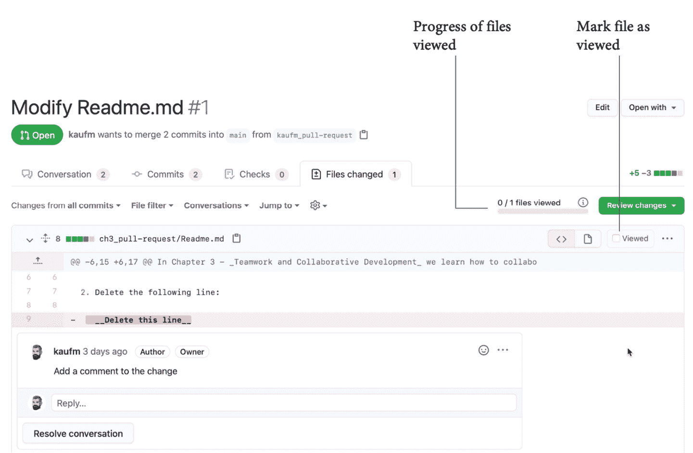

# *第三章*：团队合作与协作开发

高效能的团队不仅仅是其成员的总和，一个高效能的团队才能打造出人们喜爱的产品。

在本章中，你将学习如何通过拉取请求为你的团队设置高效的协作开发流程。你将了解什么是拉取请求，以及哪些功能能够帮助你为团队建立良好的代码审查工作流程。

在本章中，我们将讨论以下核心主题：

+   软件开发是一项团队运动

+   协作的核心：拉取请求

+   实操：创建拉取请求

+   提议变更

+   拉取请求审查

+   实操：提出建议

+   代码审查的最佳实践

# 软件开发是一项团队运动

设计师兼工程师 Peter Skillman 设计了一个实验：他挑战四人一组的团队，在棉花糖挑战中互相竞争。规则很简单——使用以下材料，搭建一个能够支撑棉花糖的最高结构：

+   20 根未煮过的意大利面条

+   1 码长的透明胶带

+   1 码长的绳子

+   1 个棉花糖

这个实验的目的并不是解决问题本身，而是观察各个团队如何合作解决问题。在实验中，斯坦福大学和东京大学的商学院学生队伍与幼儿园小朋友队伍展开竞争。猜猜谁赢了？

商学院的学生们审查了材料，讨论了最佳策略，并精心挑选出最有前景的想法。他们表现得非常专业、理性且聪明，但幼儿园的小朋友们却总是赢得比赛。他们并没有决定最佳策略——他们只是开始动手，进行实验。他们站得很近，通过简短的交流合作：*这里，不，那里！*

幼儿园的小朋友们并不是因为更聪明或更有技能才获胜的，而是因为他们作为团队合作得更好(*Coyle D.(2018)*).

你可以在体育比赛中观察到类似的情况：即便你把最优秀的选手放到一个队里，如果他们不能形成良好的团队合作，仍然会输给一个由技能较差但合作无间的队伍。

在软件工程中，我们追求的是高凝聚力的团队，而不仅仅是能合作的个人专家，而是像“棉花糖实验”中的幼儿一样一起实验的团队成员。我们通过寻找所谓的**E 形**团队成员来实现这一目标，E 形是**T 形**团队成员的进化。**I 形**专家在某一领域有深厚的经验，但在其他领域的技能或经验很少。T 形的人是通才，某一领域有深入的经验，同时在多个领域拥有广泛的技能。进化后的 E 形人——**E**代表**经验**、**专长**、**探索**和**执行**。他们在多个领域拥有深厚的经验和经过验证的执行能力。他们总是在创新，渴望学习新技能。E 形的人是将不同领域的专长结合成一个高协作团队的最佳方式（*Kim G., Humble J., Debois P. 和 Willis J.*）。

你可以通过查看一些**拉取请求**，快速了解你的团队如何进行协作。谁在做代码审查，审查的主题是什么？人们讨论的是什么问题？讨论的语气如何？如果你曾看过高效团队的拉取请求，你就会发现，可以很容易看出一些不太顺利的地方。以下是你可以轻松发现的拉取请求反模式：

+   拉取请求太大，包含了许多更改（**批量大小**）。

+   只有在功能已经完成或冲刺的最后一天时才创建拉取请求（**最后一分钟批准**）。

+   拉取请求被批准时没有任何评论。这通常是因为人们只是为了避免打扰其他团队成员而批准（**自动批准**）。

+   评论中很少包含问题。这通常意味着讨论的内容是**无关紧要的细节**——如格式和风格——而不是关于架构设计的问题。

我稍后会向你展示*代码审查的最佳实践*，以及如何避免这些反模式。首先，我们先仔细看看什么是拉取请求。

# 协作的核心——拉取请求

**拉取请求**不仅仅是传统的代码审查。它还是一种实现以下目标的方式：

+   协作编写代码

+   共享知识

+   创建代码的共享所有权

+   跨团队边界协作

那么拉取请求到底是什么呢？**拉取请求**，也称为**合并请求**，是将其他分支的更改整合到目标分支的过程，通常发生在**Git**仓库中。这些更改可以来自仓库中的其他分支，或者来自**fork**——你仓库的副本。拉取请求通常缩写为**PR**。没有写权限的人可以 fork 你的仓库并创建拉取请求。这允许开源仓库的所有者在不给予每个人写权限的情况下允许贡献。因此，在开源世界中，拉取请求是将更改整合到仓库中的默认方式。

Pull 请求也可以用于跨团队协作，这种方式被称为内源（inner source），类似于开源风格（请参阅 *第五章*，*开源和内源对软件交付性能的影响*）。

关于 Git

`git – 愚蠢的内容跟踪器`（参见 *图 3.1* 中的 Git man 页面）。

Git 是由 Linus Torvalds 于 2005 年创建的，用作 Linux 内核的版本控制系统（RCS）。在 2005 年之前，BitKeeper 被用于这个目的，但由于许可证的变化，BitKeeper 不再可以免费用于开源项目。

Git 是目前最流行的 RCS，并且有许多关于 Git 的书籍（参见 Chacon S. 和 Straub B., 2014；Kaufmann M., 2021；以及更多其他书籍）。Git 是 GitHub 的核心，但在本书中，我将 GitHub 作为 **DevOps** 平台而非 RCS 来讨论。

在 *第十一章*，*基于主干的开发* 中，我将讨论分支工作流，因为它与工程速度相关，但我不会深入探讨分支和合并的问题。请参考 *进一步阅读和参考文献* 部分了解更多信息。

*图 3.1* 显示了 Git 的 `man` 页面：


图 3.1 – Git 的 man 页面 – 愚蠢的内容跟踪器

Git 在逐行的基础上对文本文件进行版本控制。这意味着 pull 请求专注于更改的行：一行可以被添加、删除，或者两者兼有——在这种情况下，你可以看到旧行和新行之间的差异。在合并之前，pull 请求允许你执行以下操作：

+   审查更改并对其发表评论

+   将更改与源代码库中的新代码一起构建和测试，而不必先合并它

只有当更改通过所有检查时，它们才会被 pull 请求自动合并回去。

由于现代软件工程中的一切都是代码，这不仅仅是源代码。你可以在以下方面进行协作：

+   架构、设计和概念文档

+   源代码

+   测试

+   基础设施（作为代码）

+   配置（作为代码）

+   文档

一切都可以在文本文件中完成。在上一章中，我已经讲过 **markdown** 作为人类可读文件的标准。它非常适合用于协作编写概念文档和文档。如果你需要可以归档或发送给客户的实体文档，你还可以将 markdown 渲染为 **便携文档格式**（**PDF**）文档。你还可以通过图表扩展 markdown——例如，使用 *Mermaid*（请参阅 [`mermaid-js.github.io/mermaid/`](https://mermaid-js.github.io/mermaid/)）。虽然 **markdown** 是为人类可读文件设计的，**YAML Ain't Markup Language**（**YAML**）则是为机器可读文件设计的。因此，通过结合源代码、markdown 和 YAML，你可以自动化创建开发生命周期的所有工件，并像协作源代码一样协作处理更改！

示例

在 GitHub 上，一切基本上都使用 Markdown 来处理。即使是法务团队和**人力资源**（**HR**）也使用 Markdown、问题和拉取请求来协作处理合同。一个例子是招聘过程：职位描述存储为 Markdown，整个招聘过程通过问题进行跟踪。其他例子包括 GitHub 站点政策（如*服务条款*或*社区指南*）。它们都是用 Markdown 编写的，并且是开源的（[`github.com/github/site-policy`](https://github.com/github/site-policy)）。

如果你想了解更多关于 GitHub 团队协作的信息，参考[`youtu.be/HyvZO5vvOas?t=3189`](https://youtu.be/HyvZO5vvOas?t=3189)。

# 实操 – 创建拉取请求

如果你是第一次使用拉取请求，最好创建一个来体验它的功能。如果你已经熟悉拉取请求，可以跳过这部分，继续阅读有关*拉取请求功能*的内容。按以下步骤操作：

1.  打开以下仓库，通过点击仓库右上角的**Fork**按钮来创建一个 fork：[`github.com/wulfland/AccelerateDevOps`](https://github.com/wulfland/AccelerateDevOps)。

在 fork 中，导航到`Chapter 3` | `ch3_pull-request/Create-PullRequest.md`）。该文件还包含说明，方便你无需在浏览器和书籍之间切换。

通过点击文件内容上方的**编辑**铅笔图标来编辑文件。

1.  删除文件中标记的行。

1.  添加几行随机文本。

1.  修改一行，删除超出允许长度的字母。

1.  提交你的更改，但不要直接提交到`main`分支。将它们提交到一个新的**分支**，如图 3.2 所示：


图 3.2 – 提交更改到一个新分支

1.  你会自动被重定向到一个页面，在那里你可以创建一个拉取请求。输入标题和描述。注意，你可以使用完整的 Markdown 支持，具备你在 *第二章*中熟悉的所有功能，*规划、跟踪和可视化你的工作*：表情符号（`:+1:`）、提及（`@`）、引用（`#`）、任务列表（`– [ ]`）和带有语法高亮的源代码（```` ``` ````）。你还可以分配受托人、标签、项目和里程碑。

在页面顶部，你会看到目标分支（`base`）是`main`，而要集成的源分支是你刚刚创建的那个。**创建拉取请求**按钮是一个下拉菜单。你也可以选择创建一个草稿拉取请求。现在，我们跳过这个步骤，通过点击**创建拉取请求**按钮来创建一个拉取请求（见*图 3.3*）。


图 3.3 – 为你对文件所做的更改创建拉取请求

1.  在拉取请求中，导航到**更改的文件**，注意你对文件所做的更改：删除的行为红色，添加的行为绿色，修改过的行是先删除一行然后添加一行。如果你将鼠标悬停在行上，左侧会出现一个加号**+**图标。如果你点击该图标，可以添加单行注释。如果你按住图标并拖动它，你可以为多行添加注释。该注释同样支持与问题相同的标记功能，并具有所有丰富的功能！添加注释后，点击**添加单行注释**（见*图 3.4*）：


图 3.4 – 为更改的行添加注释

经典的代码审查和拉取请求之间的重要区别在于，你可以更新拉取请求。这使得你能够回应评论并共同解决问题，直到问题被关闭。为了展示这一点，你将编辑文件并提交到新的分支，查看拉取请求是否会反映这些更改。

1.  你可以直接从拉取请求中编辑文件，方法是打开右上角的菜单并选择**编辑文件**（见*图 3.5*）：


图 3.5 – 从拉取请求中编辑文件

1.  修改文件，添加一行新文本。在创建拉取请求之前，将更改提交到你创建的分支（见*图 3.6*）：


图 3.6 – 将更改提交到你的分支

1.  返回到拉取请求页面，注意到你的更改已自动显示。你可以在**更改的文件**下查看所有更改，或者你可以在**提交**下查看单独的提交更改（见*图 3.7*）：


图 3.7 – 在单独的提交中评论更改

1.  如果你是 GitHub 拉取请求的新手，重要的要点如下：

    +   拉取请求是关于将一个分支的**更改**合并到基础分支。如果你更新了分支，拉取请求会自动更新。

    +   你可以利用 GitHub 问题中已知的丰富功能来**协作**所有更改：任务列表、提及、引用、源代码等。

    +   你可以按**每个文件**或**每个提交**查看更改。这有助于将重要的更改与不重要的更改（例如重构）区分开来。

# 提出更改

GitHub 拉取请求具有丰富的功能集，可以帮助你改善协作流程。

## 草稿拉取请求

什么时候是创建拉取请求的最佳时机？这可以争论，但我会说：越早越好！理想情况下，你应该在开始处理某个任务的瞬间就创建拉取请求。这样，团队成员通过查看打开的拉取请求，始终能知道每个人在做什么。但如果你创建拉取请求太早，审阅者就不知道何时给出反馈。**草稿拉取请求**在此时非常有用。你可以提前创建拉取请求，但大家都知道工作仍在进行中，审阅者不会收到通知，但你仍然可以在评论中提到人员，以便提前获取代码反馈。

在创建拉取请求时，你可以直接将其创建为草稿状态（见*图 3.8*）：


图 3.8 – 创建草稿拉取请求

草稿拉取请求会明确标记为`draft:true`或`draft:false`作为搜索参数：


图 3.9 – 草稿拉取请求会用自己的符号标记

如果你的拉取请求已经处于审查状态，你仍然可以随时通过点击**Reviewers** | **Still in progress?** | **Convert to draft**下方的链接将状态更改回草稿。

如果你的拉取请求准备好进行审查，只需点击**Ready for review**（见*图 3.10*）：


图 3.10 – 移除拉取请求的草稿状态

草稿拉取请求是一个很好的功能，能够以透明的方式在团队中及早合作进行变更。

## 代码所有者

**代码所有者**是一种在仓库中的特定文件发生更改时自动将审阅者添加到拉取请求中的好方法。这个功能还可以跨团队边界协作，或在早期开发阶段添加审批，而不需要在发布流程中进行审批。假设你在仓库中定义了基础设施代码。你可以使用代码所有者来要求共享运维团队中的某个人进行审查，或者你有定义应用外观和体验的文件。每次更改这些文件时，你可能希望获得设计团队的审批。代码所有者不仅仅是关于审批；它们还可以用于在跨团队的实践社区中传播知识。

代码所有者可以是团队或个人。他们需要有写权限才能成为代码所有者。如果拉取请求脱离草稿状态，代码所有者会作为审阅者被添加进来。

要定义代码所有者，你需要在仓库的根目录、`docs/`文件夹或`.github/`文件夹中创建一个名为`CODEOWNERS`的文件。文件的语法非常简单，如下所示：

+   使用`@username`或`@org/team-name`来定义代码所有者。你也可以使用用户的电子邮件地址。

+   使用模式匹配文件来分配代码所有者。顺序很重要：最后匹配的模式优先。

+   使用`#`进行注释，使用`!`来否定模式，使用`[` `]`定义字符范围。

下面是一个代码所有者文件的示例：

```
# The global owner is the default for the entire repository
```

```
*          @org/team1
```

```
# The design team is owner of all .css files
```

```
*.css      @org/design-team
```

```
# The admin is owner of all files in all subfolders of the
```

```
# folder IaC in the root of the repository
```

```
/IaC/      @admin
```

```
# User1 is the owner of all files in the folder docs or 
```

```
# Docs – but not of files in subfolders of docs!
```

```
/[Dd]ocs/* @user1
```

有关更多详细信息，请参见以下页面，*关于代码所有者*：[`docs.github.com/en/github/creating-cloning-and-archiving-repositories/creating-a-repository-on-github/about-code-owners`](https://docs.github.com/en/github/creating-cloning-and-archiving-repositories/creating-a-repository-on-github/about-code-owners)。

代码所有者是跨团队共享知识的一种好方法，它可以将审批从发布管道中的变更委员会转移到变更发生时的早期审批。

## 所需审查

你可以要求在合并拉取请求之前获得指定数量的批准。这是在**分支保护规则**中设置的，该规则可以应用于多个分支之一。你可以在**设置** | **分支** | **添加规则**中创建分支保护规则。在规则中，你可以设置合并前所需的**审查数量**，选择是否在代码更改时取消批准，并强制要求代码所有者的批准（见*图 3.11*）：


图 3.11 – 特定分支所需的审查

有关分支保护的更多信息，请参见 https://docs.github.com/en/github/administering-a-repository/defining-the-mergeability-of-pull-requests/about-protected-branches#about-branch-protection-rules。我将在*第七章*，“*基于主干的开发*”中更详细地讲解这一主题。

## 请求拉取请求审查

如果你的代码准备好进行审查，你可以手动添加所需的审查员数量。GitHub 会根据你修改的代码的作者提供**审查员建议**（见*图 3.12*）。你可以点击**请求**，或者手动搜索人员来进行审查：


图 3.12 – 推荐的审查员

你还可以让 GitHub 自动为你的团队分配审查员。你可以在**设置** | **代码审查分配**中为每个团队进行配置。你可以选择自动分配的审查员数量，并选择以下两种算法之一：

+   **循环轮询**：根据谁最近收到的请求最少来选择审查员

+   **负载均衡**：根据每个成员的总审查请求数量来选择审查员，同时考虑待处理的审查

你可以排除某些成员不参与审查，并且可以选择在分配审查员时不通知整个团队。有关如何为你的团队配置代码审查分配，请参见图 3.13：


图 3.13 – 管理团队的代码审查分配

## 自动合并

我最喜欢的拉取请求功能之一是**自动合并**。这使你在处理小更改时可以提高工作效率，尤其是当你启用了**持续部署**（**CD**）时。如果你完成了更改，你启用自动合并，并且可以继续处理其他更改。如果你的拉取请求获得了所需的审批数量，并且所有自动检查都通过，拉取请求将会自动合并并部署到生产环境。

# 拉取请求审核

如果你被选中进行审核，你可以对许多更改发表评论、提出建议，并最终通过以下符号之一提交你的审核：

+   **评论**

+   **批准**

+   **请求更改**

在前一部分中，我集中介绍了与拉取请求作者相关的功能。在本节中，我描述了一个帮助审阅者进行审核并向作者提供适当反馈的功能。

## 审核拉取请求中的提议更改

你可以通过一次查看一个文件来开始审核。如果你将鼠标悬停在行上，你会看到左侧的**+**图标。可以用它添加单行评论，或者通过拖动它覆盖多行，你可以创建多行评论。如果你有评论，可以选择**开始审核**来开始审核过程，但还不提交评论。如果你添加了更多评论，按钮会变为**添加审核评论**；你可以根据需要向审核添加任意数量的评论。评论在提交审核之前只对你可见！你可以随时取消审核。

## 标记文件为已查看

在审核时，你会看到文件顶部的进度条。当你完成一个文件后，可以勾选**已查看**复选框。该文件将被折叠，进度条会显示进度（参见*图 3.14*）：



图 3.14 – 标记文件为已查看

## 实践练习 – 提出建议

提供反馈的最佳方式是通过提出**建议**，这样拉取请求的作者可以轻松地将这些建议集成到他们的分支中。这个功能非常重要，如果你从未尝试过，值得一试。以下是操作步骤：

1.  打开你在之前实践练习中创建的仓库的 fork：https://github.com/<your user name>/AccelerateDevOps。

在 fork 中，导航至`Chapter 3` | `ch3_pull-request/Review-Changes.md`）。该文件还包含说明，以便你不必在浏览器和书本之间切换。

通过点击源代码块右上角的**复制**图标来复制示例源代码。

1.  导航至`src/app.js`（使用 Markdown 中的链接）。选择你在之前实践练习中创建的分支，点击右上角的**编辑**图标（铅笔）来编辑文件（参见*图 3.15*）：


图 3.15 – 编辑代码文件以添加示例代码

1.  删除 *第 2 行* 并通过按 *Ctrl* + *V* 插入代码。

1.  直接提交到你的拉取请求源分支。

1.  返回拉取请求，查找 **已更改的文件** 中的 `src/app.js`。注意 *第 6 行* 到 *第 9 行* 的嵌套循环没有正确缩进。标记 *第 6 行* 到 *第 9 行* 并创建多行评论。点击 **建议** 按钮，你会看到代码出现在建议框中，包括空格（参见 *图 3.16*）：


图 3.16 – 创建多行评论的建议

1.  请注意，`suggestion` 代码块包含完整的代码，包括空格。为了修正缩进，请在每行开头添加四个空格。

你可以将建议作为审核的一部分提交（**开始审核**），或者直接将建议提交给作者（**添加单条评论**）。对于这个动手练习，我们将建议作为单条评论添加。

## 将反馈融入到你的拉取请求中

由于你既是审核员又是作者，你可以直接切换角色。作为作者，你可以看到所有针对你的拉取请求的建议。

你可以将建议直接提交到你的分支，或者你也可以将多个建议批量处理成一个提交，然后一次性提交所有更改。将更改添加到批量处理并在文件顶部应用批量处理（参见 *图 3.17*）：


图 3.17 – 将建议融入到你的代码中

建议是一种提供反馈和建议代码更改的好方法。对于作者来说，这些建议非常容易融入到他们的代码中。

## 提交审核

如果你已完成审核并添加了所有评论和建议，你可以提交审核。作者会被通知审核结果，并且可以回应你的评论。你可以留下最终评论并选择以下三个选项之一：

+   **批准**：批准更改。这是唯一会计入所需审核员数量的选项！

+   **评论**：提交反馈，但不做批准或拒绝。

+   **请求更改**：表示需要更改以获得你的批准。

完成审核后，点击 **提交审核**（参见 *图 3.18*）：


图 3.18 – 完成你的审核

## 完成你的拉取请求

如果你想放弃你分支中的更改，你可以在不合并的情况下关闭拉取请求。要将更改融入到基础分支中，你有三种 **合并** 选项，概述如下：

+   **创建合并提交**：这是默认选项。它会创建一个合并提交，并将你分支的所有提交显示为历史记录中的一个独立分支。如果你有许多长期存在的分支，这可能会使历史记录显得杂乱无章。你可以在这里看到这种合并选项的表示：


图 3.19 – 如果你做了合并提交，Git 历史是这样的

+   **Squash 和合并**：分支的所有提交将合并为一个提交。这创建了一个干净的、线性的历史，如果在合并后删除分支，这是一个不错的合并方法。如果你还在继续工作，建议不要使用这种方法。你可以在这里看到这种合并选项的表示：


图 3.20 – 如果你做了 squash 和合并，Git 历史是这样的

+   **Rebase 和合并**：将分支的所有提交应用到基础分支的头部。这也创建了线性的历史，但保留了各个提交。如果你还在继续工作，建议不要使用这种方法。你可以在这里看到这种合并选项的表示：


图 3.21 – 如果你做了 rebase 和合并，Git 历史看起来是线性的

选择你想要的合并方法，然后点击**合并拉取请求**（见 *图 3.22*）：


图 3.22 – 完成一个拉取请求

修改合并信息并点击**确认合并**。合并后，如果需要，你可以删除分支。

# 代码审查最佳实践

拉取请求是协作任何代码的一个好方法。本章只触及了你在协作工作流中所能实现的可能性，但为了让你的团队能够有效地协作，你应该考虑一些有效的代码审查最佳实践。

## 教 Git

这看起来可能很显然，但请确保你的团队在 Git 上经过良好的培训。精心编写的提交和**良好的提交信息**，每个提交只做**一个目的**，比分散在多个提交中的许多变化更容易审查。特别是，重构和业务逻辑混在一起会让审查变成噩梦。如果团队成员知道如何修复提交、如何修补他们在不同提交中所做的更改，以及如何编写好的提交信息，那么生成的拉取请求将更容易审查。

## 将拉取请求链接到问题

将拉取请求链接到发起工作对应的问题。这有助于为拉取请求提供背景。如果你使用第三方集成，将拉取请求链接到 Jira 票据、Azure Boards 工作项或任何你与 GitHub 连接的其他来源。

## 使用草稿拉取请求

当团队成员**开始工作**时，让他们立即创建**草稿拉取请求**。这样，团队就能知道谁在做什么。这也鼓励大家在审查开始之前，使用评论和提及来请求他人反馈。对变更的早期反馈有助于加快最终审查的速度。

## 至少需要两名审批人

你应该有至少**两个必需的审批者**。越多越好，具体取决于团队的规模。但一个审批者是不够的。拥有多个审查员能给审查带来某种动态。我注意到通过仅将审批者从一个增加到两个，某些团队的审查实践发生了巨大的变化！

## 进行同伴审查

将审查视为**同伴审查**。不要让高级架构师审查他人的代码！年轻的同事也应该做同伴审查，以便学习。一种好做法是将整个团队作为审查员，并要求一定比例的批准（例如，50%），然后让人们选择他们想要的拉取请求。或者，你可以使用**自动审查分配**，随机分配审查给团队成员。

## 自动化审查步骤

许多审查步骤可以自动化，特别是格式化。让一个好的代码检查工具**检查代码格式**（例如，[`github.com/github/super-linter`](https://github.com/github/super-linter)），或者编写一些测试来检查文档是否完整。使用静态和动态代码分析自动发现问题。你自动化检查琐碎任务的越多，审查就能越集中于重要事项。

## 部署并测试变更

在合并之前自动构建并测试你的变更。如有必要，安装代码进行测试。人们越有信心变更不会破坏任何东西，他们就越能信任这个过程。如果所有审批和验证通过，使用**自动合并**自动合并并发布你的变更。高度的自动化使得人们可以在更小的批次中工作，这使得审查变得更容易。

## 审查准则/行为规范

一些工程师对做事的正确方式有强烈的看法，辩论可能很快失控。你希望进行激烈的讨论，以获得最佳的解决方案，但这些讨论需要以包容的方式进行，让团队中的每个人都能平等参与。有了**审查准则**和**行为规范**作为门卫，如果有人行为不当，你可以引用这些规则。

# 总结

软件开发是一项团队运动，拥有一个共同拥有代码的团队，并紧密协作进行新变更是非常重要的。如果正确使用，GitHub 拉取请求可以帮助实现这一点。

在下一章中，你将了解异步与同步工作，以及异步工作流如何帮助你随时随地进行协作。

# 进一步阅读和参考文献

以下是本章的参考文献，你也可以使用它们获取更多关于这些主题的信息：

+   *Coyle D*。（2018）。*《文化密码：高度成功团队的秘密》*（第 1 版）。*Cornerstone Digital*。

+   *Kim G*., *Humble J.*, *Debois P.* 和 *Willis J.*（2016）。*《DevOps 手册：如何在技术组织中创造世界级的敏捷性、可靠性和安全性》*（第 1 版）。*IT Revolution Press*。

+   Scott Prugh (2014). *持续交付*. [`www.scaledagileframework.com/guidance-continuous-delivery/`](https://www.scaledagileframework.com/guidance-continuous-delivery/)

+   *Chacon S.* 和 *Straub B.* (2014). *Pro Git* (第 2 版). *Apress*. [`git-scm.com/book/de/v2`](https://git-scm.com/book/de/v2)

+   *Kaufmann M.* (2021). *Git für Dummies* (第 1 版，德文). *Wiley-VCH*.

+   Git: [`en.wikipedia.org/wiki/Git`](https://en.wikipedia.org/wiki/Git)

+   拉取请求: [`docs.github.com/en/github/collaborating-with-pull-requests/proposing-changes-to-your-work-with-pull-requests/about-pull-requests`](https://docs.github.com/en/github/collaborating-with-pull-requests/proposing-changes-to-your-work-with-pull-requests/about-pull-requests)

+   代码所有者: https://docs.github.com/en/github/creating-cloning-and-archiving-repositories/creating-a-repository-on-github/about-code-owners

+   分支保护: https://docs.github.com/en/github/administering-a-repository/defining-the-mergeability-of-pull-requests/about-protected-branches#about-branch-protection-rules

+   代码审查分配: https://docs.github.com/en/organizations/organizing-members-into-teams/managing-code-review-assignment-for-your-team

+   自动合并: [`docs.github.com/en/github/collaborating-with-pull-requests/incorporating-changes-from-a-pull-request/automatically-merging-a-pull-request`](https://docs.github.com/en/github/collaborating-with-pull-requests/incorporating-changes-from-a-pull-request/automatically-merging-a-pull-request)

+   拉取请求审查: [`docs.github.com/en/github/collaborating-with-pull-requests/reviewing-changes-in-pull-requests/about-pull-request-reviews`](https://docs.github.com/en/github/collaborating-with-pull-requests/reviewing-changes-in-pull-requests/about-pull-request-reviews)
