# 第四章：异步工作：随时随地协作

在上一章中，您了解了如何通过拉取请求进行协作开发，并且如何利用它们为您构建的代码和产品创建共享所有权。在本章中，我们将重点讨论同步和异步工作，以及如何利用异步工作流的优势，在分布式、远程和混合团队中实现更好的协作，并提高跨团队的协作效率。

本章将涵盖以下主题：

+   比较同步工作和异步工作

+   分布式团队

+   跨团队协作

+   转向异步工作流

+   团队与 Slack 集成

+   GitHub 讨论

+   页面和维基

+   使用 GitHub 移动版在任何地方工作

+   案例研究

# 比较同步工作和异步工作

我们信息工作者所做的每一项工作，基本上都是沟通。即使是编程的所有内容：你必须传达你正在编写的代码，必须传达架构，甚至代码本身也是与未来的人——包括你自己——传达如何修改程序的方式。因此，我们沟通的方式直接影响我们完成工作的效率。

## 通信历史

人类的互动和沟通方式在历史上经历了许多变化。直到 1450 年约翰内斯·古腾堡发明印刷机之前，通信大多是纯口头的，少量是书面通信。印刷机的发明引发了一场印刷革命，对宗教和教育产生了巨大影响，因为它使信息能够更广泛地传播。在 17 世纪，报纸的发明再次革新了沟通方式，极大地缩短了信息从发送者到接收者的传递时间。18 世纪，公共邮政系统变得如此高效，以至于越来越多的沟通通过信件进行。这使得私人通信的速度与报纸一样迅速。在 19 世纪，电报的发明第一次实现了远距离的实时通信。1861 年，菲利普·赖斯在法兰克福发明了第一部电话。虽然传输质量仍有波动，但大多数人低估了这一发明。直到 1876 年，亚历山大·格雷厄姆·贝尔最终获得了电话的专利，这一发明彻底改变了沟通方式，使得实时口头交流成为可能。

在那之前，通讯的变化更多的是与几个世纪而非几十年相关。人们有时间去适应，并且通常可以清晰直观地知道哪种通讯方式是最好的。这种情况在过去 30 年里发生了迅速的变化。到 1990 年代末，手机变得既小巧又负担得起。任何人都可以随时与任何人通话。有趣的是，这导致了一种新现象：人们开始互相发送简短的消息，并且常常偏好异步通讯而非同步通讯。随着互联网的兴起，电子邮件迅速取代了信件。但在最初，互联网并不具备移动性，因此电子邮件的预期回复时间仍然是几天。这一情况在本世纪的第一个十年中发生了变化。互联网变得可以移动，而智能手机使得随时随地访问电子邮件成为可能。同时，新的通讯形式也变得流行起来：Facebook、Twitter、Instagram 和 Snapchat。它们以文本、语音和视频的形式允许与不同群体（传播范围与隐私）进行多种类型的沟通，并且具有不同的信息**存活时间**（**TTL**）或**存活时间**。

图 4.1 展示了我们世界人口的指数增长与沟通行为变化之间的关系：

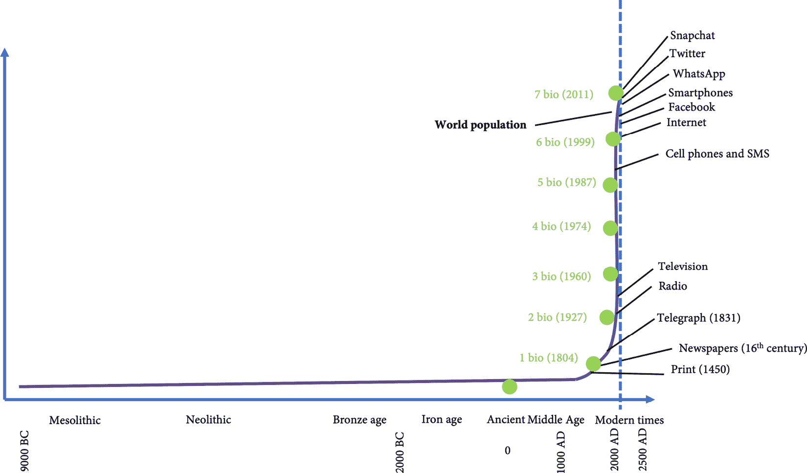

图 4.1 – 指数增长与沟通变化

过去 30 年的迅速发展导致了非常不同的沟通模式。无论你是写短信、打视频电话，还是给一个群体发送故事，更多的是取决于个人偏好，而不是消息的内容。现在已经没有社会共识来决定哪种沟通形式适合某一类消息。

## 工作与沟通

工作不仅仅是沟通。信息工作是对话中所期望输出的增加。你可以将工作分为同步工作和异步工作。同步工作是指两人或更多人在实时互动中共同达成预期的输出。而异步工作则发生在两人或更多人交换消息以达成预期输出时。

如果你在一个传统企业工作，异步工作和同步工作的组合可能依然如图 4.2 所示。至少几年前是这样的。大多数工作通过电子邮件或会议进行，会议通常发生在同一个房间里：

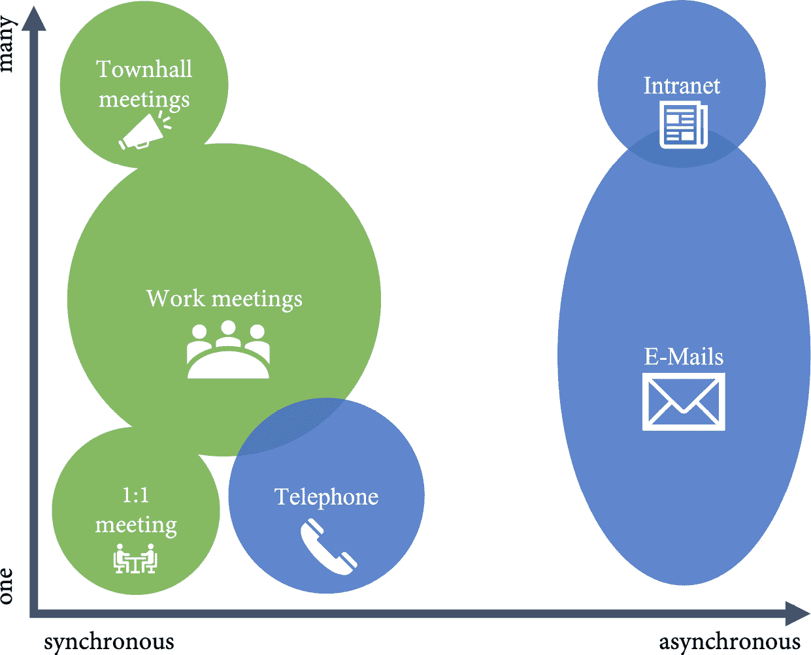

图 4.2 – 传统企业中的工作与沟通

大多数异步工作是通过电子邮件和远程方式进行的，而大多数同步工作则是在面对面会议中进行。主导方式通常取决于公司的文化。在有强大电子邮件文化的公司中，人们通常在几分钟内回复邮件。在这些公司里，许多人在开会时也会打开笔记本电脑，大家通常抱怨邮件太多。而在有强大会议文化的公司中，人们由于参加会议，往往不能及时回复邮件。这导致了邮件减少，但会议增多。

在过去的几年里，这一情况发生了巨大变化。特别是小公司和初创公司，已经放弃了电子邮件，转而使用聊天等其他异步工作媒介。许多公司也发现了远程工作的好处，有些公司是在疫情迫使他们远程工作后才意识到这一点。

我已经在*第二章*中展示了，*规划、跟踪和可视化你的工作*，如何通过上下文切换来破坏生产力。因此，对于开发团队来说，异步工作是可取的，因为它允许你为工作项建立拉取机制，并减少上下文切换。优化过的现代工作模式对于开发人员可能是这样的：

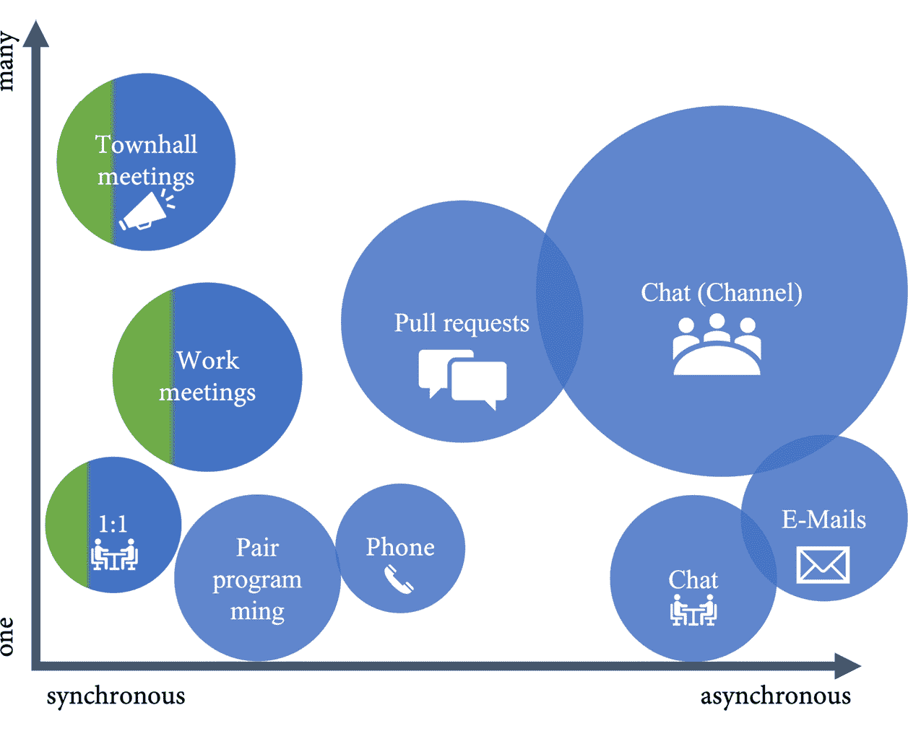

图 4.3 – 为开发优化的工作与沟通

人们越少进行同步工作，就越能在没有上下文切换和规划的情况下集中精力工作。重要的是要有意识地思考：我们应该以同步的方式进行哪类工作，哪些工作可以异步进行？我们应该面对面地进行哪些工作，哪些工作可以远程进行？

## 面对面与远程工作

同步工作可以是面对面进行，也可以是远程进行。两者都有各自的优缺点。

**面对面**会议如果需要说服某人，通常是更可取的。销售人员总是更倾向于面对面会议，而非电话或远程会议，因为面对面的会议更适合社交和建立关系/团队。关键性的反馈和敏感问题也更适合面对面讨论而非远程讨论。对于需要创造力的复杂讨论或问题，物理上的接近也有帮助。

远程会议的优势在于，由于减少了旅行时间，它们更加高效。人们可以独立于物理位置参与，这让你能够拥有跨越多个时区的团队。远程会议可以录制，即使人们未能参与，也可以回放会议。

**远程**会议应该与面对面会议有所不同。一个 8 小时的工作坊（2x4）适合面对面进行，但不适合远程进行。远程会议应当更短小且更有针对性。人们如果长时间面对计算机，往往容易分心。

在未来几年，我们将看到越来越多的**混合工作**。混合工作使员工能够在不同地点独立工作：在家、移动中或办公室内。66%的公司正在考虑重新设计办公室空间以适应混合工作，73%的员工希望获得更多灵活的远程工作选项（参见 [`www.microsoft.com/en-us/worklab/work-trend-index/hybrid-work`](https://www.microsoft.com/en-us/worklab/work-trend-index/hybrid-work)）。混合工作将在组织会议时带来很大的挑战。远程会议优化了个人的需求，而面对面会议则优化了团队的需求。将两者结合起来将是一项挑战，不仅仅是会议室中的技术设备问题，还包括负责组织会议的人。

# 分布式团队

几乎 100% 远程工作的科技公司，以及其团队分布在全球各地的情况，已经存在了一段时间。我知道有一家公司，其招聘过程完全是远程的。每个员工都有预算，可以用来投资自己的家庭办公室，或租用一个共享工作空间。公司团队分布在全球，只会每年一次进行面对面的聚会。

随着疫情以及远程和混合工作模式的兴起，越来越多的公司开始意识到分布式团队的好处，包括以下几点：

+   你不再局限于在某个大都市地区招聘，因此可以招聘到更多的人才和专家（*人才争夺战*）。

+   在其他地区招聘通常伴随着*成本降低*。

+   如果你在多个市场上销售产品，拥有来自这些不同背景的团队成员有助于更好地理解客户（*多样性*）。

+   通过提供支持，你自动可以覆盖更多的工作时间，这意味着工程师在正常工作时间之外的*更少的值班责任*。

**分布式团队**也面临着挑战，最大的问题就是语言。非母语者在沟通上有更多问题，因此需要一个良好的基础语言——如果你希望跨越多个国家，最有可能是英语。此外，文化差异也可能使沟通变得更加困难。团队建设以及团队的文化契合度在远程招聘过程中必须发挥更大作用。

如果你希望通过增加更多远程工程师来扩展团队，一定要相应地计划时区。你应该至少确保不同的时区工作时间有 1 或 2 小时的重叠，具体取决于你的会议数量。这意味着你通常最多可以在一个方向上延伸大约 8 小时，以确保有 1 小时的重叠。如果你已经在一个方向上有 4 小时的时差，那么在另一个方向上最多只能再增加 4 小时的时差（参见 *图 4.4*）。


图 4.4 – 计划有重叠时区的会议时间

请考虑到夏令时和不同的工作时间使得跨时区的重叠规划成为一项相当复杂的任务！

分布式团队有其优势，未来几年我们将会看到这一点。最好从一开始就采用能够让你后来从其他时区的其他国家聘请专家的工作方式。这意味着，所有的沟通都应该使用英语或你所在地区的其他通用语言，并尽可能多地使用异步工作流。

# 跨团队协作

为了加速软件交付，你希望你的团队尽可能自主。能够在任何时候向最终用户交付价值而不依赖于其他团队，是影响工作速度的最大因素之一，但你仍然需要一些团队之间的对齐：设计、安全性和架构是必须跨团队解决的共同问题。良好的**跨团队协作**是团队之间健康对齐的标志。

良好的跨团队协作通常不需要管理层的参与，通常是通过上下指挥链到达第一个共同的管理者。良好的跨团队协作是基于异步工作流的，直接将合适的人聚集在一起解决问题。日常工作中所需的会议越少越好。

# 转向异步工作流

要转向更为异步的工作方式并允许远程和混合工作，你可以轻松采纳一些最佳实践，以下是其中的一些：

+   **偏好聊天而非电子邮件**：依赖电子邮件的工作流有很多缺点：你没有共同的历史；如果团队成员生病或离职，你会被阻碍；等等。尽量将所有与你工作相关的对话转移到聊天平台上，如 Microsoft Teams 或 Slack。

+   **让（大多数）会议成为可选**：让所有与工作相关的会议都成为可选。如果你认为会议没有价值，就离开。这有助于让会议更加专注并且准备充分，因为没有人希望在自己的会议中成为唯一的参与者。当然，一些团队建设或全员大会会议应该是不可选的。

+   **记录所有会议**：记录所有会议使得那些无法参与的人也有机会赶上进度。录制的会议可以以更快的速度观看，这有助于在更短的时间内消化会议内容。

+   **有意为之**：明确你所安排的会议是什么，以及什么是异步工作流（聊天、问题、拉取请求和维基）。

+   **回顾你的设置**：确保了解你的指标，并定期检查你的设置。会议是否成功，或者它们是否可以转移到问题或拉取请求中的讨论？问题和拉取请求中的讨论是否花费了太长时间，是否有些事情可以通过会议更快解决？不要过于频繁地改变设置，因为人们需要一些时间来适应，但至少每 2 到 3 个月要回顾并调整你的设置。

+   **使用提及和代码所有者**：使用提及和代码所有者（请参阅 *第三章*，*团队合作与协同开发*），动态地将合适的人聚集在一起完成任务。这两个功能也非常适合跨团队协作。

+   **将一切视为代码**：尽量将一切视为代码，并像对待代码一样进行协作：基础设施、配置、软件架构、设计文档和概念。

# Teams 和 Slack 集成

如果你更喜欢使用聊天而不是电子邮件，可以利用 GitHub 的集成功能与 **Microsoft Teams**（[`teams.github.com`](https://teams.github.com)）或 **Slack**（[`slack.github.com`](https://slack.github.com)）进行互动。这些功能允许你直接在聊天频道中接收通知，并与问题、拉取请求或部署进行互动。Slack 和 Teams 的功能非常相似，如下所示：

+   **通知**：订阅仓库中的事件。你可以使用分支或标签过滤器来过滤通知。

+   **GitHub 链接的详细信息**：GitHub 链接会自动展开，显示链接指向项的详细信息。

+   **打开新问题**：直接从对话中创建新问题。

+   **互动**：直接在你的频道中与问题、拉取请求或部署批准进行互动。

+   **安排提醒**：在你的频道中接收代码审查提醒。

安装过程非常简单。你必须在 Microsoft Teams 或 Slack 中安装 GitHub 应用，并在你的组织中将相应的 Teams 或 Slack 应用与 GitHub 配对。

安装后，你可以与 GitHub 机器人互动并发送消息。在 Teams 中，你可以通过 `@GitHub` 提及机器人，而在 Slack 中，则通过 `/GitHub` 来提及。如果你提及了机器人，你将收到一份可以使用的命令列表（见 *图 4.5*）：

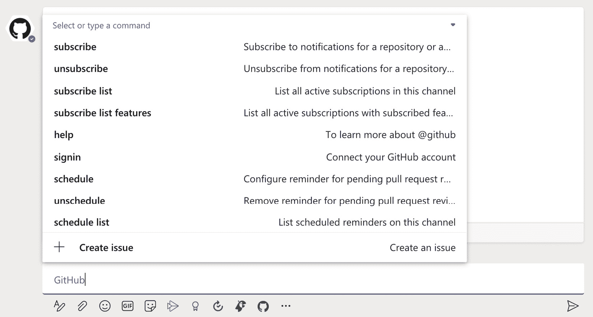

图 4.5 – 向 GitHub 机器人发送命令

第一个必须使用的命令是 `signin`，它会将你的 GitHub 账户与 Teams/Slack 账户关联起来：

```
@GitHub signin
```

之后，你可以订阅通知或安排提醒。链接的展开和与问题的互动无需任何配置。图 4.6 显示了一个从对话中创建的问题，你可以直接对问题进行评论或关闭它：

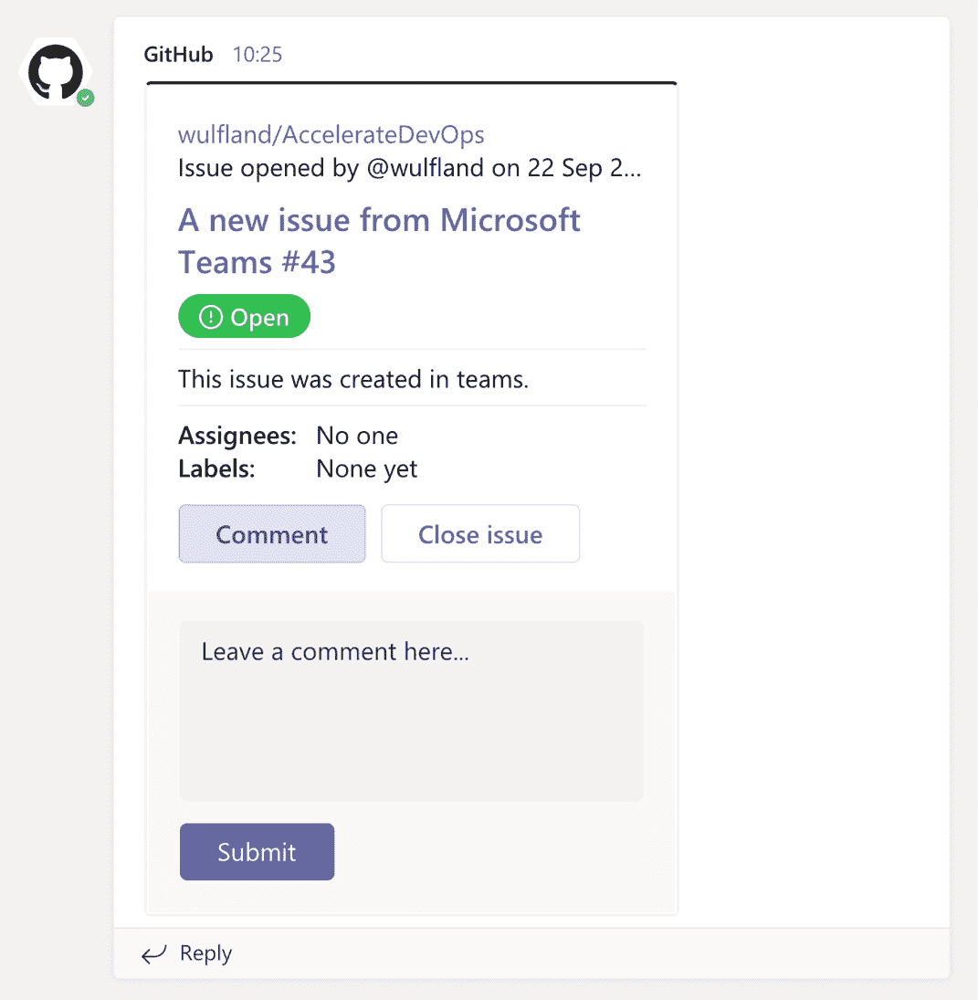

图 4.6 – 在 Microsoft Teams 中集成问题

聊天集成是一个强大的功能，当你越来越多的工作流通过聊天而非会议或电子邮件启动和管理时，这个功能将非常有用。

# GitHub 讨论

在*第二章*，*规划、跟踪和可视化您的工作*，您学会了如何使用 GitHub 问题和 GitHub 项目来管理您的工作。GitHub Discussions 是一个允许成员提问、分享更新并进行开放性对话的社区论坛。讨论是减少问题和拉取请求负荷的一个很好的方式，为长时间的讨论和**问答**（**Q&A**）提供了另一个场所。

## 开始使用 Discussions

要开始使用 GitHub Discussions，您必须在您的存储库中启用它，在**设置** | **选项** | **功能**下勾选**讨论**。一旦勾选了此选项，您的存储库中就会有一个新的主菜单项**讨论**。

注意

**GitHub Discussions** 是在撰写本书时仍处于 Beta 阶段的一个功能。某些功能可能已经发生了变化。您可以在 [`github.com/github/feedback/discussions`](https://github.com/github/feedback/discussions) 下提供反馈并参与讨论，这当然也是一个 GitHub 讨论。

讨论被组织成类别。您可以像搜索和筛选问题一样在讨论中搜索和筛选。讨论本身可以被投票和指示评论数量，并标记是否已回答。您可以将最多四个讨论置顶以发布一些重要公告。排行榜显示了在过去 30 天内回答最多问题的最有帮助的用户。图 4.7 展示了讨论的外观：

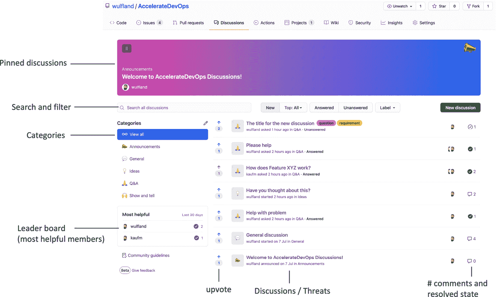

图 4.7 – GitHub Discussions 概述

## 讨论类别

您可以通过点击旁边的编辑铅笔来管理类别**类别**。您可以编辑、删除或添加新的类别。一个类别包括以下内容：

+   图标

+   标题

+   可选描述

这里列出了三种类别：

1.  **问题/答案**：

讨论类别用于提问、建议答案，并投票选出最佳答案。*这种类别类型是唯一允许标记评论已答复的类型*！

1.  **开放性讨论**：

一个不需要对问题给出明确答案的类别。非常适合分享技巧或只是聊天。

1.  **公告**：

与您的社区分享更新和新闻。仅维护者和管理员可以在这些类别中发布新的讨论，但任何人都可以评论和回复。

## 开始讨论

您可以通过单击`#`（引用）、拉取请求和其他讨论以及提到（`@`）其他人、语法高亮显示的代码和附件（参见*图 4.8*）来开始讨论：

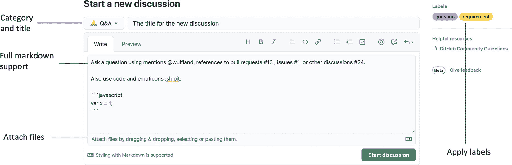

图 4.8 – 开始新讨论

## 参与讨论

你可以评论或直接回答原始讨论描述，或者回答已有的评论。在每种情况下，你都可以完全使用 Markdown 支持！你可以通过表情符号对所有评论和原始描述进行反应。你还可以为讨论或评论/回答点赞。在右侧菜单中，你可以将讨论转换为问题。作为管理员或维护者，你还可以锁定对话，将其转移到另一个仓库，将讨论置顶，或删除它。图 4.9 给出了正在进行的讨论概览：

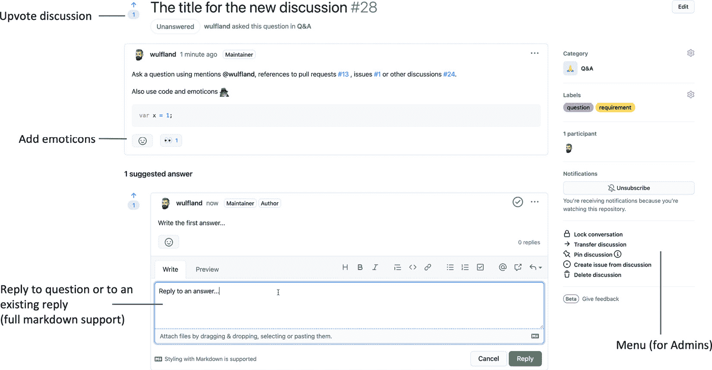

图 4.9 – 参与讨论

Discussions 是一个很好的平台，可以让你与同行以及跨团队边界进行异步协作。有关 Discussions 的更多信息，请参阅 [`docs.github.com/en/discussions`](https://docs.github.com/en/discussions)。

# Pages 和 wikis

你有许多选择可以以协作的方式分享内容。除了问题和讨论外，你还可以使用 **GitHub Pages** 和 **wikis**。

## GitHub Pages

**GitHub Pages** 是一项静态网站托管服务，可以直接从 GitHub 中的仓库提供你的文件。你可以托管常规的 **超文本标记语言** (**HTML**)、**层叠样式表** (**CSS**) 和 JavaScript 文件，并自行构建一个网站。但你也可以利用内置的预处理器 **Jekyll**（请参阅 [`jekyllrb.com/`](https://jekyllrb.com/)），它允许你使用 Markdown 构建漂亮的网站。

GitHub Pages 网站默认托管在 `github.io` 域名下（例如 [`wulfland.github.io/AccelerateDevOps/`](https://wulfland.github.io/AccelerateDevOps/)），但你也可以使用自定义域名。

GitHub Pages 是公共仓库的免费服务。对于内部使用（私有仓库），你需要 GitHub Enterprise。

注意

GitHub Pages 是一项免费服务，但并不适用于运行商业网站！禁止运行网店或任何其他商业网站。它有 1 **吉字节** (**GB**) 的配额，以及每月 100 GB 的带宽限制。有关更多信息，请参见 [`docs.github.com/en/pages/getting-started-with-github-pages/about-github-pages`](https://docs.github.com/en/pages/getting-started-with-github-pages/about-github-pages)。

学习 GitHub Pages 的最佳方式是亲自查看它是如何运作的。方法如下：

1.  如果你已经在前几章的动手练习中 fork 了 [`github.com/wulfland/AccelerateDevOps`](https://github.com/wulfland/AccelerateDevOps) 仓库，你可以直接访问你的 fork。如果没有，点击仓库右上角的 **Fork** 按钮创建一个 fork。这将会在 https://github.com/<USER>/AccelerateDevOps 下创建一个 fork。

1.  在分叉的仓库中，导航到`main`分支，并选择`/docs`文件夹作为网站的根目录。你只能选择仓库的根目录或`/docs`！不能使用其他文件夹。点击**保存**以初始化网站（见*图 4.10*）：

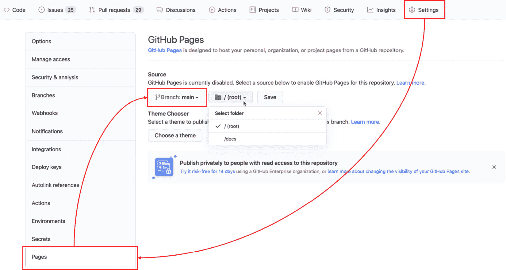

图 4.10 – 为仓库启用 GitHub Pages

1.  创建站点可能需要几分钟的时间。如果站点尚不可用，点击图 4.11 中突出显示的链接，并刷新页面：

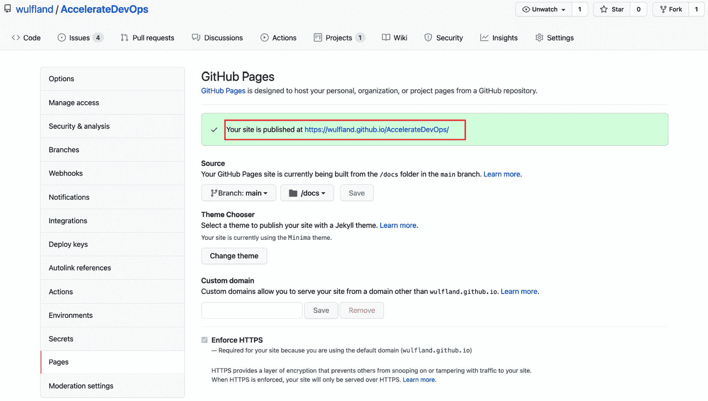

图 4.11 – 导航到网页

1.  检查网站，并注意到它有一个包含静态页面的菜单，以及一个显示带有摘录的帖子菜单（见*图 4.12*）：

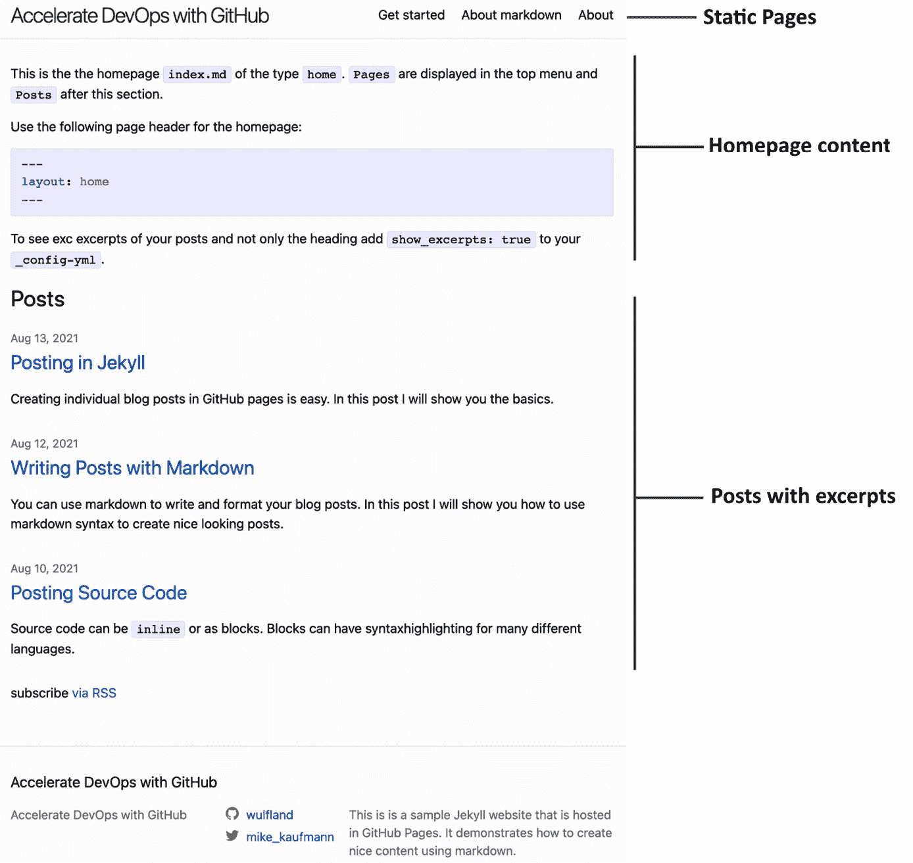

图 4.12 – 使用 Jekyll 的网站

1.  返回到你的代码。首先，检查`/docs/_config.yaml`配置文件。在这里，你可以放置网站的全局配置，例如标题和描述，如以下代码片段所示：

    ```
    title: Accelerate DevOps with GitHub
    description: >-
      This is a sample Jekyll website that is hosted in   GitHub Pages.
      ...
    ```

有许多主题可以用来渲染你的站点。每个主题都有自己的特点，所以一定要查看文档。我使用的是默认的 Jekyll 主题`jekyll-feed`，并且通过`show_excerpts`选项，你可以设置是否在首页显示帖子的摘录，如以下代码片段所示：

```
theme: minima
Markdown: kramdown
plugins:
  - jekyll-feed
show_excerpts: true
```

许多主题支持附加值。例如，你可以设置社交媒体账户，这些账户会显示在你的站点上，如下所示：

```
twitter_username: mike_kaufmann
github_username: wulfland
```

通常，静态页面会按字母顺序显示在顶部导航栏中。要过滤和排序页面，你可以在配置中添加一个部分。由于我们想添加一个新页面，可以在`About.md`前添加一个`my-page.md`条目，像这样：

```
header_pages:
- get-started.md
- about-Markdown.md
- my-page.md
- About.md
```

直接将更改提交到`main`分支。

1.  在`/docs`文件夹中，选择`my-page.md`作为文件名，并在文件中添加以下头部：

    ```
    ---
    layout: page
    title: "My Page"
    permalink: /my-page/
    ---
    ```

如果需要，可以添加更多 Markdown 内容。直接提交到`main`分支。

1.  现在，前往`/docs/_posts/`文件夹。选择`YYY-MM-DD-my-post.md`作为文件名，其中`YYYY`是当前年份，`MM`是两位数的月份，`DD`是两位数的日期。添加以下头部，并将日期替换为当前日期：

    ```
    ---
    layout: post
    title:  "My Post"
    permalink: /2021-08-14_writing-with-Markdown/
    ---
    ```

向页面添加更多 Markdown 内容，并直接提交到`main`分支。

1.  给后台处理器一些时间，然后刷新页面。你应该能看到页面和开始页上的帖子，并且可以导航到它们（见*图 4.13*）：

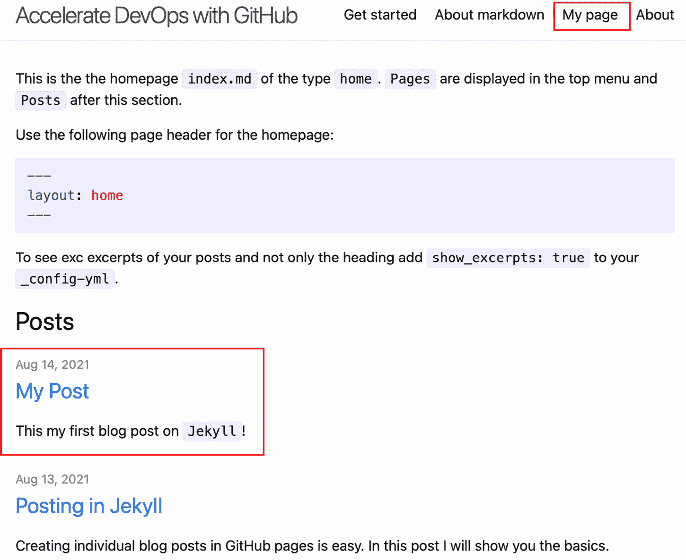

图 4.13 – 检查 Jekyll 中新页面和帖子的情况

你已经看到如何在 GitHub Pages 上发布内容是多么简单。Jekyll 是一个非常强大的工具，你几乎可以自定义一切，包括主题。你还可以在安装 Ruby 和 Jekyll 后离线运行你的站点进行测试（更多详情请见 [`docs.github.com/en/pages/setting-up-a-github-pages-site-with-jekyll/testing-your-github-pages-site-locally-with-jekyll`](https://docs.github.com/en/pages/setting-up-a-github-pages-site-with-jekyll/testing-your-github-pages-site-locally-with-jekyll)）。然而，这是一个非常复杂的话题，超出了本书的范围。

使用 Jekyll 的 GitHub Pages 是一种很好的方式，可以以美观的方式呈现内容，并像处理代码一样通过拉取请求*协作修改内容*。你可以将它用作技术博客或用户文档。在一个分布式团队中，你可以用它发布每个 Sprint 的成果，或许还可以添加小视频。这有助于即使当人们无法参加 Sprint 评审会议时，也能传达你的成功。

## Wiki

GitHub 在每个仓库中都包含了一个简单的 Wiki，但你也可以选择创建一个基于 Markdown 的 Wiki，并将其与代码一起使用。

### GitHub Wiki

每个仓库中都有一个非常简单的**Wiki**。你可以选择以不同的格式编辑页面：**Markdown**、**AsciiDoc**、**Creole**、**MediaWiki**、**Org-mode**、**Prod**、**RDoc**、**Textile** 或 **reStructuredText**。由于 GitHub 中其他所有内容都是 Markdown，我认为这是最好的选择，但如果你已经有了其他格式的 wiki 内容，这也能帮助你迁移内容。

注意

其他编辑格式，如 **AsciiDoc** 或 **MediaWiki**，具有更多高级功能，例如自动生成的**目录**（**ToC**）。如果你的团队已经熟悉这些语法，那么它可能对你有意义，但同时学习 Markdown 本身和另一种 Markdown 语言可能弊大于利。

Wiki 非常简单。你可以编辑主页，并可以添加自定义的侧边栏和页脚。指向其他页面的链接用双大括号表示为 `[[Page Name]]`。如果你想要一个独立的链接文本，可以使用 `[[Link Text|Page Name]]` 格式。如果你创建一个指向尚不存在的页面的链接，它会以红色显示，并且你可以通过点击该链接创建页面。

Wiki 是一个 Git 仓库，其名称与仓库相同，并带有 `.wiki` 扩展名（`<name_of_repository>.wiki`）。你可以克隆一个仓库并在本地的分支中使用 wiki，但不幸的是，直到现在还没有办法使用拉取请求来协作修改！这是 GitHub Wiki 最大的缺点！

此外，Wiki 不支持嵌套页面。所有页面都位于仓库的根目录下。你可以使用侧边栏通过 Markdown 嵌套列表来创建具有层次结构的菜单，如下所示：

```
[[Home]]
```

```
* [[Page 1]]  
```

```
  * [[Page 1.1]]  
```

```
  * [[Page 1.2]]  
```

如果你希望菜单的某些部分是可折叠的，可以使用 `<details></details>` GitHub Markdown 功能。这将在 Markdown 中创建一个可折叠部分，并通过 `<summary></summary>` 自定义标题，如下所示：

```
* [[Page 2]]
```

```
  * <details>
```

```
    <summary>[[Page 2.1]] (Click to open)</summary>
```

```
      * [[Page 2.1.1]]  
```

```
      * [[Page 2.1.2]]  
```

```
    </details>  
```

请注意，空行对于使其正常工作是必要的！结果如图 4.14 所示：

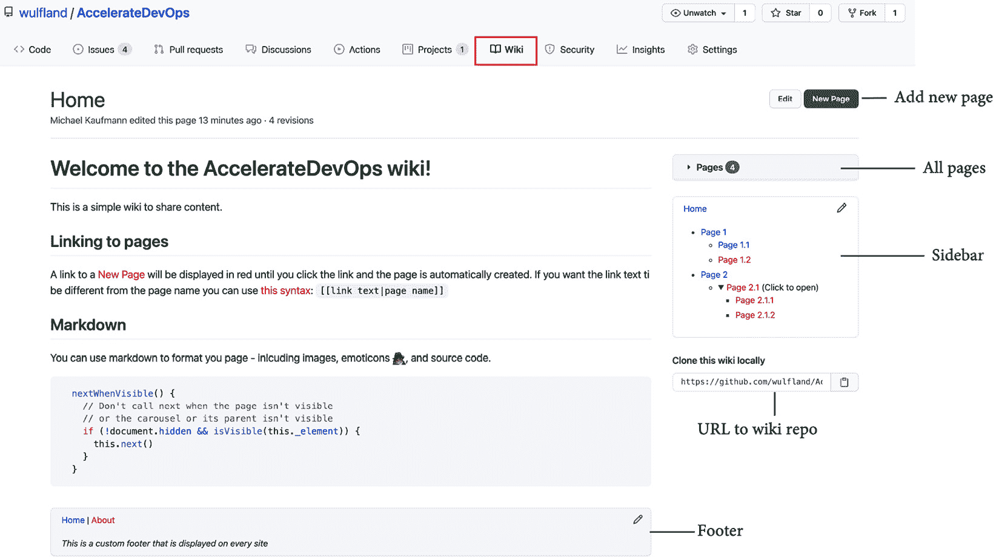

图 4.14 – GitHub Wiki 的结构

GitHub Wiki 是一个非常简单的 Wiki 解决方案，缺乏许多其他 Wiki 解决方案的功能，特别是你不能使用拉取请求，这限制了它在异步工作流中的优势。但幸运的是，你可以在自己的仓库中托管 Markdown 并自己构建一个自定义的 Wiki。

### 自定义 Wiki

如果你不想使用 GitHub Pages 的复杂功能，但仍然希望在 Wiki 上使用拉取请求，你可以将 Markdown 文件直接放入你的仓库中。GitHub 会自动为所有的 Markdown 文件渲染一个目录（参见*图 4.15*）。你可能已经在 GitHub 仓库的 `README` 文件中注意到这一点：

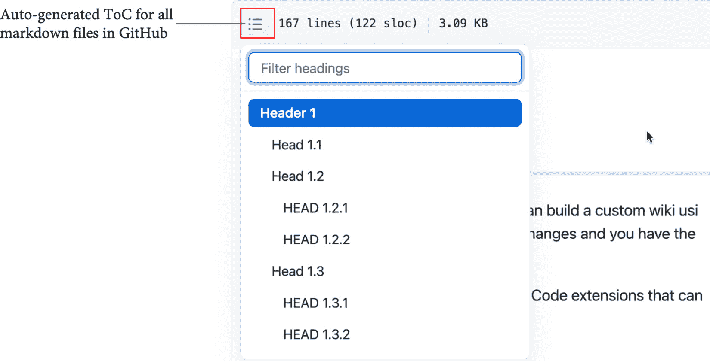

图 4.15 – GitHub Markdown 文件的目录

自定义 Wiki 的问题在于导航。使用 Markdown 嵌套列表和相对链接来构建导航系统是很容易的。你还可以使用 `details` 使其可折叠，如下面的代码示例所示：

```
<details>
```

```
    <summary>Menu</summary>
```

```
* Home  
```

```
* Page1  
```

```
  * Page 1.1
```

```
  * Page 1.2
```

```
* Page2
```

```
</details>
```

但是，如果你需要在每个页面上都有它，那么在更改时必须将其复制粘贴到所有页面。你可以自动化此过程，但它仍然会使历史记录变得冗余。最好是在每个页面上都有类似面包屑的导航，用户可以用来返回主页，并从那里使用菜单。你可以在这里看到一个自定义导航的 Markdown 示例：[`github.com/wulfland/AccelerateDevOps/blob/main/ch4_customWiki/Home.md`](https://github.com/wulfland/AccelerateDevOps/blob/main/ch4_customWiki/Home.md)。

从社区论坛到简单的 Markdown Wiki，再到使用 Jekyll 的完全自定义网页，有很多选项可以在 GitHub 上托管你工作的额外内容。选择适合当前任务的方案并不容易。有时，你只需要尝试找出适合你团队的方案。

# 使用 GitHub 移动端在任何地方工作

大多数时候，你会通过浏览器在 GitHub 问题、拉取请求和讨论中进行协作。但也有其他选项可以帮助你将 GitHub 带到你所在的地方。

GitHub 移动端是一个可以通过 Android 和 Apple 市场下载的移动应用（参见 [`github.com/mobile`](https://github.com/mobile)）。该应用允许你访问所有仓库中的问题、拉取请求和讨论。它具有暗黑模式和亮色模式，你可以将喜欢的仓库固定到首页（参见*图 4.16*）：

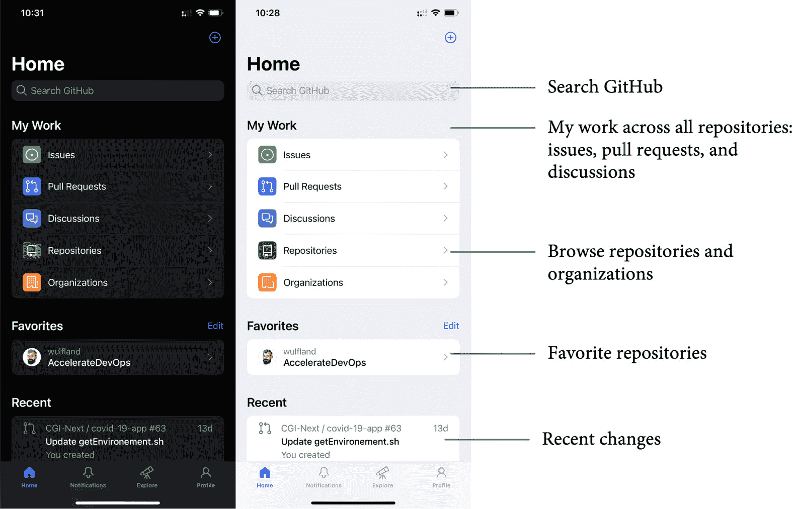

图 4.16 – GitHub 移动版主页的深色和浅色模式

我个人非常喜欢 GitHub 移动版应用——它设计得非常精妙，帮助你在日常工作中不依赖工作站或笔记本电脑，随时协作处理问题和讨论。你可以配置通知，以便在被提及、被分配任务或请求审查时收到通知。这些通知会出现在收件箱中，你可以使用可配置的滑动操作将通知标记为**完成**、**已读**或**未读**；将通知保存；或者取消订阅通知源。默认的标记选项是完成和保存。收件箱的界面如下图 4.17 所示：

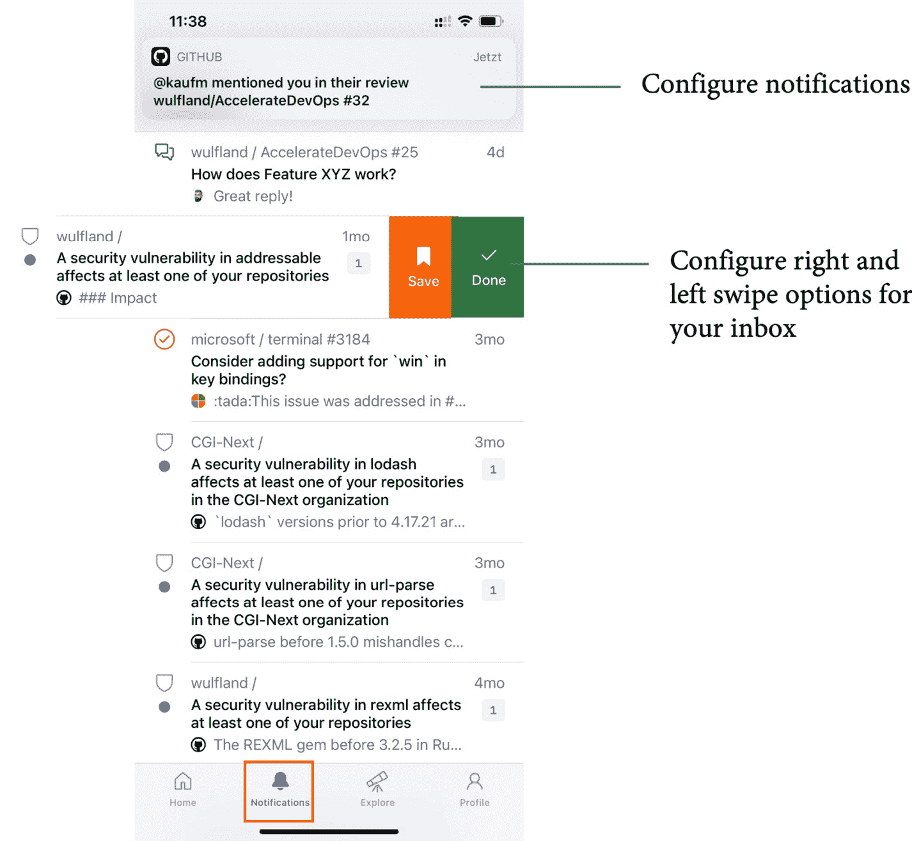

图 4.17 – GitHub 移动版中的通知

我第一次使用该应用时，给我印象最深刻的是它在移动设备上提供的代码审查体验。你可以开启换行功能，这样可以方便地阅读代码、查看更改并进行评论（见*图 4.18*）：

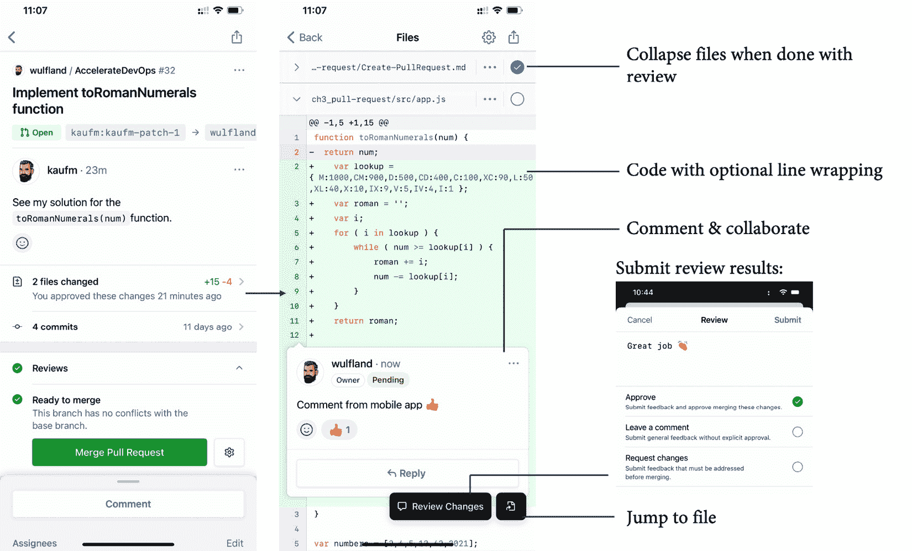

图 4.18 – 使用 GitHub 移动版进行拉取请求审查

GitHub 移动版是解锁团队成员的绝佳方式，即使你不在办公室。它允许你参与讨论并评论代码更改和问题。随时审查小范围更改的可能性有助于团队实现更小的工作批次，因为审批的等待时间更短。

# 案例研究

我们的两个试点团队在**Tailwind Gears**的第一件事就是将他们的代码迁移到 GitHub 仓库。其中一个团队已经在 Bitbucket 服务器上使用**Git**。对于该团队来说，迁移就像将仓库推送到一个新的远程仓库一样简单。另一个团队使用的是**Team Foundation Server**（**TFS**）版本控制，必须先将代码迁移到服务器上的 Git 中，然后再推送到 GitHub。

两个团队决定参加为期 2 天的**Git 培训**，以便充分利用 Git 的强大功能，并编写易于审查的高质量提交。他们使用**草稿拉取请求**，确保团队中的每个人始终知道其他人正在做什么，并且暂时设置了至少两个**必需审阅者**。

许多工作仍然在仓库之外进行，发生在存储在公司 SharePoint 服务器上的 Word、Excel 和 Visio 文档中。一些文档被转换为**便携文档格式**（**PDF**），并在发布符合某些规定的产品之前，由管理层签署。这些文档太多，无法一次性全部转换为 Markdown 格式。团队在他们的代码仓库中创建了一个**自定义**的**基于 Markdown 的维基**，将所有内容都放在接近代码的地方。他们添加了对当前 SharePoint 文档的链接。每当需要更改文档时，内容将移到 Markdown 文件中，并删除链接。管理层不再签署 PDF 文档，而是作为**代码所有者**加入相应文件，并直接在拉取请求中批准更改。结合审计日志，这对所有必要的合规审计是有效的。

在迁移到新平台时，许多方面对两个团队都是相关的，稍后其他团队在迁移到新平台时也会涉及到这些方面。因此，他们创建了一个共享的平台仓库。该仓库包含**GitHub Discussions**，可以与所有工程师合作，即使他们还未加入这两个团队中的任何一个。通过**GitHub Pages**建立了一个技术博客，分享技巧和窍门。Jekyll 网站也被用来协作制定通用的审查指南和行为准则。

# 总结

在本章中，你已了解同步和异步工作的优缺点。你可以利用这些信息创建有效的异步工作流程，从而实现更好的跨团队协作，并使得远程和混合团队能够覆盖多个领域和时区。你已经学会了如何利用 GitHub Discussions、Pages 和维基来为除代码和需求之外的其他话题创建异步工作流程。

在下一章中，我将解释开放源代码和内部源代码对软件交付性能的影响。

# 进一步阅读和参考资料

以下是本章中提供的参考资料，你也可以用它们获取更多关于这些主题的信息：

+   沟通历史: [`en.wikipedia.org/wiki/History_of_communication`](https://en.wikipedia.org/wiki/History_of_communication), [`www.g2.com/articles/history-of-communication`](https://www.g2.com/articles/history-of-communication), 和 [`www.elon.edu/u/imagining/time-capsule/150-years/`](https://www.elon.edu/u/imagining/time-capsule/150-years/)

+   一般历史: [`www.dhm.de/lemo/kapitel`](https://www.dhm.de/lemo/kapitel)（德语）

+   世界人口增长: https://ourworldindata.org/world-population-growth

+   混合工作: https://www.microsoft.com/en-us/worklab/work-trend-index/hybrid-work

+   工作趋势指数: https://www.microsoft.com/en-us/worklab/work-trend-index

+   GitHub 讨论区: https://docs.github.com/en/discussions

+   GitHub Pages: https://docs.github.com/en/pages

+   GitHub 移动端: https://github.com/mobile
