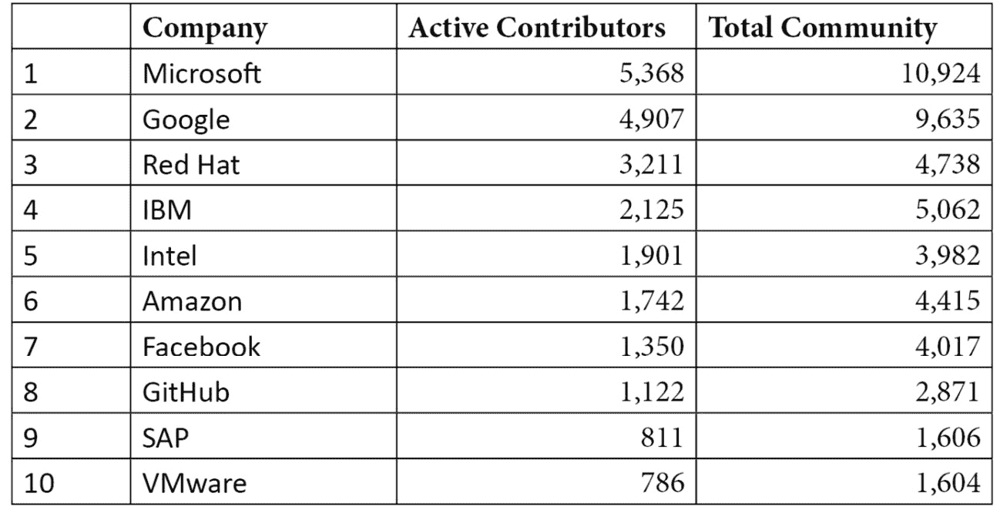
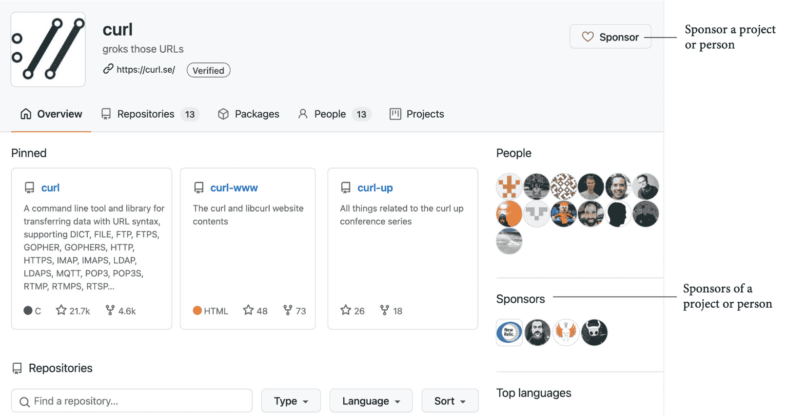
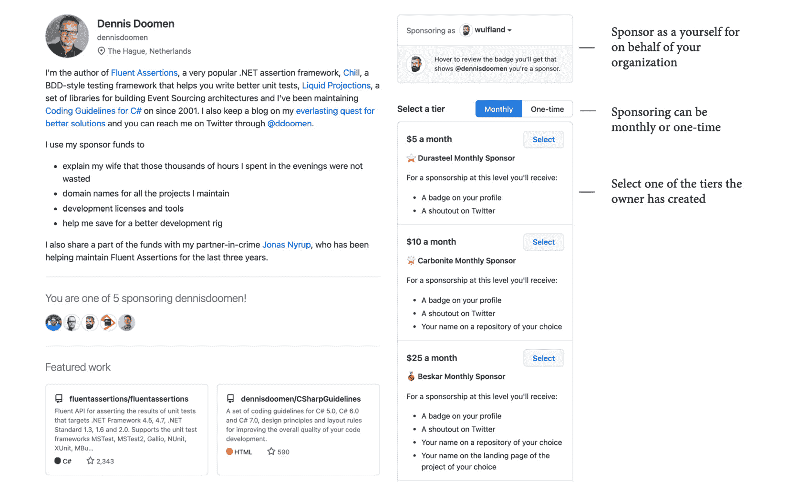
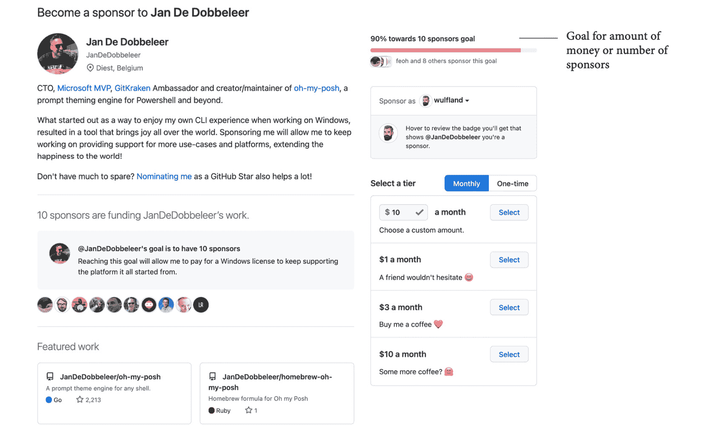

# 第五章: 开源与内部源代码对软件交付性能的影响

20 年前，即 2001 年 6 月 1 日，前微软 CEO Steve Ballmer 在接受《芝加哥星期日时报》采访时曾说过以下话：

“*Linux 是一种癌症，它在知识产权上附着于它接触到的每一个事物。*”

*(Greene T. C. (2001))*

他关注的不仅仅是**Linux**，而是**开源**许可证的整体问题。如今，20 年后，微软已成为全球开源贡献的最大单一公司，超越了 Facebook、Google、Red Hat 和 SUSE。不仅如此，他们拥有许多开源产品，如 PowerShell、Visual Studio Code 和.NET，他们还在 Windows 10 中附带了完整的 Linux 内核，使得用户可以在其上运行任何发行版。微软总裁 Brad Smith 承认，“*当开源在世纪初爆发时，微软站在了历史的错误一方*”（*Warren T. (2020)*）。

如果你查看对开源做出贡献的前 10 家公司，你会发现所有大型科技公司都参与了商业软件的开发：

表格 5.1 – 开源贡献者指数，2021 年 8 月 2 日 (https://opensourceindex.io/)

过去 20 年发生了什么变化，以至于重要的科技公司现在都开始接受开源？

本章将解释自由与开源软件的历史，以及为何它在过去几年变得如此重要。我将阐述它对工程开发速度的影响，并说明如何利用开源原则来促进公司内部团队之间更好的协作（内部源代码）。

本章将涵盖以下主题：

+   自由与开源软件的历史

+   开源与开放开发的区别

+   企业采用开源的好处

+   实施开源战略

+   开放源代码与内部源代码

+   内部源代码的重要性

+   GitHub Sponsors

# 自由与开源软件的历史

要理解开源，我们必须回到计算机科学的早期阶段。

## 公有领域软件

在 1950 年代和 1960 年代，软件的价格相较于所需硬件较低。任何软件的产生主要由学术界和企业研究团队负责。通常，源代码与软件一同发布——通常是作为**公有领域软件**。这意味着软件是自由获取的，不受所有权、版权、商标或专利的限制。这些开放与合作的原则对当时的**黑客文化**产生了深远的影响。

在 1960 年代末期，操作系统和编译器的兴起提高了软件的成本。这是由于一个不断增长的软件行业，与硬件供应商竞争，后者将自己的软件与硬件捆绑销售。

在 1970 年代和 1980 年代，出售软件使用许可证成为常见做法，1983 年，IBM 停止将源代码与购买的软件一起分发，其他软件厂商纷纷效仿。

## 自由软件

*理查德·斯托曼*坚信这是不道德的，他于 1983 年创立了**GNU 项目**，并随后成立了**自由软件运动**。自由软件运动认为，软件只有在接收者被允许执行以下操作时，才算是自由软件：

+   为任何目的运行程序。

+   研究软件并以任何方式修改它。

+   重新分发程序并制作副本。

+   改进软件并发布改进。

理查德于 1985 年创立了**自由软件基金会**（**FSF**）。FSF 以以下名言而闻名：

“*自由如言论自由——而非像免费啤酒那样的自由*。”

这意味着*自由*一词指的是分发自由，而不是免除费用的自由（*Gratis versus libre*）。由于许多自由软件已经是免费的，因此这类免费软件（Freeware）与自由软件和零成本产生了关联。

自由软件运动创造了一个叫做**版权左**（copyleft）的概念。它赋予用户使用和修改软件的权利，但同时保持软件的自由性质。这些许可证的例子包括 GNU **通用公共许可证**（**GPL**）、Apache 许可证和**Mozilla 公共许可证**（**MPL**）。

目前仍在数百万台设备上运行的许多优秀软件，都是通过这些版权左许可证进行分发的；例如，**Linux 内核**（由*林纳斯·托瓦兹*于 1992 年发布）、BSD、MySQL 和 Apache。

## 开源软件

1997 年 5 月，在德国维尔茨堡的 Linux 大会上，*埃里克·雷蒙德*介绍了他的论文《大教堂与集市》(*Raymond, E. S. 1999*)。他反思了自由软件原则、黑客文化以及这些原则对软件开发的好处。该论文引起了广泛关注，并促使 Netscape 将其浏览器**Netscape Communicator**作为自由软件发布。

雷蒙德和其他人希望将自由软件原则带到更多的商业软件厂商，但“*自由软件*”这一术语对于商业软件公司来说具有负面含义。

1998 年 2 月 3 日，在帕洛阿尔托，许多自由软件运动的重要人物聚集在一起，进行战略会议，讨论自由软件的未来。与会者包括*埃里克·雷蒙德*、*迈克尔·蒂曼*和*克里斯蒂娜·彼得森*，他们被认为提出了**开源**这一术语，作为对自由软件的替代。

**开源倡议**（**OSI**）由*埃里克·雷蒙德*和*布鲁斯·佩伦斯*于 1998 年 2 月底成立，雷蒙德为首任主席（*OSI 2018*）。

1998 年，在出版商*Tim O'Reilly*的历史性*自由软件峰会*——后来更名为*开源峰会*——上，术语被迅速采纳，早期支持者包括*Linus Torvalds*、*Larry Wall*（Perl 的创始人）、*Brian Behlendorf*（Apache）、*Eric Allman*（Sendmail）、*Guido van Rossum*（Python）和*Phil Zimmerman*（PGP）（*O'Reilly* *1998*）。

但*理查德·斯托曼*和自由软件基金会（FSF）拒绝了新术语*开源*（*Richard S. 2021*）。这就是为什么**自由开源软件**（**FOSS**）运动至今依然存在分歧，并且使用不同术语的原因。

在 1990 年代末和 2000 年代初的互联网泡沫期间，**开源**和**开源软件**（**OSS**）这两个术语被大众媒体广泛采用，并最终成为了更受欢迎的术语。

## 开源软件的崛起

在过去的二十年里，开源软件的普及度持续上升。像 Linux 和 Apache 这样的软件支撑着大部分互联网。刚开始，商业化 OSS 是很困难的。最初的想法是围绕开源产品提供企业级支持服务。在这方面取得成功的公司有 Red Hat 和 MySQL。但这条路更为艰难，且无法像商业许可那样提供规模效应。因此，那些在开源软件构建上投入大量资金的公司开始创建**开放核心**产品：一个免费的开源核心产品，以及可以由客户购买的商业附加组件。

从传统许可证到**软件即服务**（**SaaS**）订阅的商业模式转变，帮助开源公司将其 OSS 商业化。这激励了传统软件厂商发布他们的软件——至少是核心部分——作为开源，以便与社区进行互动。

不仅像微软、谷歌、IBM 和亚马逊这样的巨大软件公司成为了重要的开源公司。像 Red Hat 和 MuleSoft 这样的纯开源公司也获得了大量的价值和市场认可。例如，Red Hat 于 2018 年被 IBM 以 320 亿美元收购。MuleSoft 也在同年被 Salesforce 以 65 亿美元收购。

所以，今天的开源并不是来自那些创造替代性、自由软件的革命性思维。如今，推动云服务商软件和平台服务的大多数顶尖软件都是开源软件（*Volpi M. 2019*）。

# 开源与开放开发的区别

因此，OSS 指的是在一种许可证下发布的计算机程序，许可证授予用户使用、研究、修改和共享该软件及其源代码的权利。

但将源代码公开并采用 copyleft 许可只是第一步。如果一家公司想要获得开源的所有好处，它必须采纳开源的价值观，这就引出了一个概念——**开放开发**或**开放式开发**。这意味着你不仅仅是提供源代码的访问权限，而是必须使整个开发和产品管理过程透明化。这包括以下内容：

+   要求

+   架构与研究

+   会议

+   标准

.NET 团队是一个很好的例子，他们在 Twitch 和 YouTube 上进行社区站立会议（见 [`dotnet.microsoft.com/live/community-standup`](https://dotnet.microsoft.com/live/community-standup)）。

**开放开发**也意味着创造一个开放和包容的环境，让每个人都能安全地提出更改建议。这包括强有力的道德准则和清晰的代码库，代码库具有高度的自动化，能够让每个人都能快速且轻松地贡献代码。

# 公司采纳开源的好处

那么，开源是如何与更好的开发绩效相关联的？贵公司如何从一个好的开源策略中受益？

## 使用开源软件更快交付

根据不同来源，新产品中已经有 70%到 90%的代码是开源的。这意味着你将自己编写 70%到 90%更少的代码，从而显著提高市场推出的速度。

除了在产品中重用开源代码，许多平台工具也作为开源提供。可重用的 GitHub Actions、测试工具或容器编排……你用来更快交付软件的最有效且最强大的工具，在大多数情况下，都是开源软件。

## 通过与社区互动，打造更好的产品

如果你在公开的环境中开发产品的某些部分，你可以利用社区的集体智慧来构建更好、更安全的软件。它还帮助你从全球的优秀工程师那里获得关于你所做工作的早期反馈。

尤其是对于复杂、关键性和与安全相关的软件，参与社区通常会带来更好的解决方案：

"*问题越大，开源开发者就像磁铁一样，越容易被吸引来解决它。*"

*(Ahlawat P., Boyne J., Herz D., Schmieg F., & Stephan M. (2021))*

## 使用风险较低的过时工具

使用开源可以减少工具过时的风险。如果你自己构建工具，你必须自己维护它们——这并不是你的优先事项。使用来自小供应商的工具或让合作伙伴为你构建工具，则存在工具无法得到维护或合作伙伴退出市场的风险。投资开源工具可以显著降低这些风险。

## 吸引人才

让工程师能够在工作中利用开源并贡献于开源项目，可以对你的招聘能力产生重大影响。参与社区并在开源中发挥作用，将帮助你吸引人才。

## 影响新兴技术和标准

许多新兴技术和标准都是在开放环境中发展的。为这些倡议做出贡献，可以使你的公司有能力影响这些技术，并成为前沿发展的参与者。

## 通过学习开源项目来改进你的流程

当然，如果你拥抱开源，你的公司可以学习协作开发，并将这些原则应用于改善公司内部跨团队的协作（称为**内源**）。

# 实施开源策略

然而，尽管拥抱开源有很多好处，但也有一些风险需要应对。当你在产品和工具链中使用开源软件时，必须小心并确保遵守许可证规定。如果开源组件造成损害，你还需要承担责任，因为你没有供应商可以起诉。此外，如果你依赖太多依赖项——无论是直接还是间接——其中一个发生故障时，你也将面临风险。

注意

在*第十四章*《保护你的代码》中，你将学习到，包中的 11 行代码和一个关于名称的冲突如何造成严重损害并影响到互联网的大片区域。

这就是为什么你的公司应该建立一个**开源策略**。该策略应明确开发者可以使用哪些类型的开源软件，且使用目的是什么。不同的目的可能有不同的规则。如果你希望将开源纳入产品，你需要某种治理机制来管理相关的风险。

策略还应该明确是否允许开发者在工作时间贡献开源代码，以及相关的条件。

我不会深入探讨策略的细节。这很大程度上取决于你如何计划使用开源，以及你如何开发和发布产品。只要确保你的公司有一个关于开源策略的文档——即使它很小。随着开源的成熟和经验增长，它将不断发展。

一个建议是实施一个中心或卓越社区，帮助你制定一个策略，开发者可以在有疑问或者不确定某个开源组件是否合规时寻求帮助（*Ahlawat P., Boyne J., Herz D., Schmieg F., & Stephan M. 2021*）。

# 开源与内源

开源的成功在于其开放和协作的文化。让合适的人在远距离异步合作，可以以最佳的方式解决问题。其原则如下：

+   开放协作

+   开放沟通

+   代码评审

将这些原则应用于组织内的专有软件被称为**内部源代码**。这一术语由 Tim O'Reilly 于 2000 年提出。内部源代码是打破壁垒并促进跨团队和跨产品强大协作的好方法。

但与**开源**和**开放开发**一样，仅仅让你的代码公开并不足以创造一个内部源代码文化。许多成功因素会影响内部源代码方法是否能成功：

+   **模块化产品架构**：如果你的架构庞大且单一，这将限制人们的贡献。此外，代码的质量、文档的完善程度以及理解代码和贡献的速度都会对内部源代码的采纳产生重大影响。

+   **标准化工具与流程**：如果每个团队都有自己的工具链和工作流，这将排除其他工程师的贡献。拥有一个共同的工程系统，以及类似的分支和 CI/CD 方法，能够帮助其他人专注于问题，而不会因为必须先学习其他工具和工作流而受到阻碍。

+   **自主性与自我组织**：只要你的组织将需求推送给团队，且工程师们忙于赶工期，其他团队的贡献就不会发生。只有当团队能够自主地进行优先级排序，并以自我组织的方式工作时，他们才能有自由参与其他社区——包括开放源代码和内部源代码社区。

内部源代码有助于打破壁垒，提高工程效率。但这也与 DevOps 的成熟度息息相关。内部源代码是随着您的 DevOps 能力和开源成熟度的提高而发展的。因此，将其视为加速的输出，而不是输入。

注意

从技术角度讲，内部源代码通常通过在企业内部启用分叉来实现。这与您的分支工作流密切相关，我们将在*第十一章*中讨论，*基于主干的开发*。

# 内部化的重要性

许多公司并不认为软件开发是其核心业务，因此它们倾向于外包。**外包**是指一家公司雇佣另一家公司或自由职业者来执行特定功能。外包通常不是一个坏主意：你有另一家专注于某一领域的公司为你完成工作，这样你就可以将人员和投资集中在核心产品上。专门的公司通常能更便宜、更好地完成工作——而自己培养这些技能可能需要大量时间和资金。

但是现在，软件基本上是所有产品的关键差异化因素。不仅是数字客户体验，智能制造或供应链管理也能为你带来竞争优势。定制软件正成为你核心业务的一部分。因此，许多公司已经有了**内部开发**策略——即招聘和雇佣内部的软件开发人员和 DevOps 工程师。

问题在于，软件开发人员和 DevOps 工程师的市场竞争非常激烈（所谓的**人才争夺战**）。这常常导致一个分散的局面，合作伙伴负责核心产品的开发，而开发人员则维护工具。

一个好的内部开发策略是问自己软件是否是你业务的核心——也就是说，是否能为你提供竞争优势：

+   **核心软件**应由内部开发人员开发。如果你无法雇佣足够的技术熟练开发人员，你可以**联合外包**，并通过你信任的合作伙伴的工程师来增强你的团队。但最终目标应始终是用你自己公司的工程师替代这些外部开发人员。

+   **补充软件**可以外包。在最佳情况下，你可以使用已经存在的产品。如果没有这样的产品，你可以让合作伙伴为你构建。此时，**开源**发挥了重要作用：你可以利用现有的开源解决方案，或者让合作伙伴在开源环境中构建解决方案。这可以降低你成为唯一客户并导致解决方案过时的风险。由于软件仅是你业务的补充部分，因此你并不介意其他公司是否也使用它。相反的是，你的软件被使用的越多，软件过时的风险越小。如果软件是以开放方式开发的，其质量也更可靠。

向其他公司或个人支付费用，让他们为你开发特殊的开源软件或为现有的开源解决方案添加功能并不常见。但随着越来越多的公司采取内部开发策略，以及人才争夺战的持续进行，这种做法将在未来几年大幅增加。

# GitHub 赞助者

**开源策略**似乎与**内部开发策略**存在冲突。但问题更为复杂。对于核心软件来说，向开源项目贡献一个小功能可能比自己实现一个临时解决方案更有用。但在许多公司中，团队层面的**自制还是购买决策**总是倾向于选择自制，因为购买或资助某样东西的过程太复杂。一个好的内部开发策略应该始终包括一个轻量且快速的流程，并拥有一定的预算来投资工具和软件供应链。如果你的公司缺乏内部开发人员，购买软件或资助开源贡献者应该不成问题。

一个让你的团队能够投资开源项目的好方法是利用名为 **GitHub Sponsors** 的功能。它允许你投资你的产品所依赖的项目（即你的 **软件供应链**），并让这些项目继续发展。它还可以让维护者有自由编写**新请求功能**，而不需要你亲自实现它们。

一个积极的副作用是资助对开源社区**可见**。这是一种良好的营销方式，能够提升你公司的信誉，并帮助你**吸引新人才**。

你可以在开发者或组织参与 *GitHub Sponsors* 项目时对其进行资助。你也可以代表你的组织进行资助。此资助可以是一次性支付或每月支付，并且会显示在你的个人资料或你组织的资料中（见*图 5.1*）：

图 5.1 – 已启用 GitHub Sponsors 组织资料

GitHub Sponsors 对用户账户的资助不收取任何费用，因此这些资助的 100% 会直接给到受资助的开发者或组织。

## 赞助层级

赞助者可以为资助设置不同的层级。这既可以用于一次性资助，也可以用于持续的每月支付（见*图 5.2*）：

图 5.2 – 月度或一次性资助选项

所有者可以设置最多 10 个月度资助层级和最多 10 个一次性支付的层级。这样他们可以将定制奖励与不同层级关联。例如，奖励可能如下：

+   **可见性**：赞助者可以在网站或社交媒体上被提及。也可能会有徽章（如银牌、金牌和铂金赞助商），用以区分不同的赞助层级。

+   **访问权限**：赞助者可以获得私有仓库或早期版本的访问权限。

+   **优先处理**：来自赞助者的 Bug 或功能请求可以获得优先处理。

+   **支持**：一些赞助者还会为解决方案提供一定程度的支持。

接下来我们来看看资助目标。

## 资助目标

赞助账户可以设置资助目标。目标可以基于赞助者的数量或每月赞助的美元金额，并显示在赞助页面上（见*图 5.3*）：

图 5.3 – Python 每月目标为 $12,000 的资助计划

资助目标可以与某些里程碑挂钩。例如，维护者可以设置一个目标金额，当他们辞去日常工作，开始全职投入项目时，目标金额达到时即可实现。组织也可以设置一个金额，用于雇佣新的开发者来帮助维护项目。

# 总结

在本章中，您了解了**自由和开源软件**的**历史**、**价值观**和**原则**，以及它们对您的软件交付性能可能产生的影响。一个好的**开源策略**，结合良好的**内包策略**和您的团队能够资助和支持开源项目的能力，可以帮助您显著缩短市场时间，并让您的工程师专注于公司重要的功能。将这些原则应用于您的公司作为**内源**（inner source）可以帮助您建立一种协作文化，实现更好的跨团队协作。

在下一章中，我们将学习如何使用 GitHub Actions 进行自动化。

# 进一步阅读和参考资料

请参考以下资料，了解本章内容的更多信息：

+   Greene T. C. (2001). *Ballmer：Linux 是一种癌症*：[`www.theregister.com/2001/06/02/ballmer_linux_is_a_cancer/`](https://www.theregister.com/2001/06/02/ballmer_linux_is_a_cancer/)。

+   Warren T. (2020). *微软：我们对开源的看法错了*：[`www.theverge.com/2020/5/18/21262103/microsoft-open-source-linux-history-wrong-statement`](https://www.theverge.com/2020/5/18/21262103/microsoft-open-source-linux-history-wrong-statement)。

+   Raymond, E. S. (1999). *大教堂与集市：Linux 和开源的思考，来自一个偶然的革命者*。O'Reilly Media。

+   O'Reilly (1998). *免费软件领袖首次聚集：O'Reilly 组织 Perl、Apache、Linux 和 Netscape 的 Mozilla 创始人会晤*（新闻稿）：[`www.oreilly.com/pub/pr/636`](https://www.oreilly.com/pub/pr/636)。

+   OSI (2018). *开源倡议 - OSI 的历史*：[`opensource.org/history`](https://opensource.org/history)。

+   Richard S. (2021). *为何开源忽视了自由软件的要点*：[`www.gnu.org/philosophy/open-source-misses-the-point.en.html`](https://www.gnu.org/philosophy/open-source-misses-the-point.en.html)。

+   Volpi M. (2019). *开源软件如何征服世界*：[`techcrunch.com/2019/01/12/how-open-source-software-took-over-the-world/`](https://techcrunch.com/2019/01/12/how-open-source-software-took-over-the-world/)。

+   Ahlawat P., Boyne J., Herz D., Schmieg F., & Stephan M. (2021). *你为何需要开源软件策略*：[`www.bcg.com/publications/2021/open-source-software-strategy-benefits`](https://www.bcg.com/publications/2021/open-source-software-strategy-benefits)。

+   *内源*：[`en.wikipedia.org/wiki/Inner_source`](https://en.wikipedia.org/wiki/Inner_source)。

+   *GitHub Sponsors*：[`github.com/sponsors`](https://github.com/sponsors)。
