# *第六章*：使用 GitHub Actions 实现自动化

许多敏捷实践将工程实践视为不如管理和团队实践重要。然而，工程能力如**持续集成**（**CI**）、**持续交付**（**CD**）和**基础设施即代码**（**IaC**）是更频繁、更稳定且更低风险发布的推动力（*Humble, J., & Farley, D. 2010*）。这些实践可以减少部署痛苦，从而减少加班和职业倦怠。

本质上，所有这些实践都涉及自动化：计算机执行重复性任务，以便人们可以专注于重要问题和创造性工作。

"*计算机执行重复性任务，人类解决问题。*"

*Forsgren, N., Humble, J., & Kim, G. 2018*

自动化对企业文化和工作方式有着巨大的影响，因为许多习惯都是为了避免手动的、重复的任务——特别是当这些任务容易出错时。在本章中，我将向你介绍 GitHub Actions——GitHub 提供的自动化引擎，你可以用它做的不仅仅是 CI/CD。

本章将涵盖以下主题：

+   GitHub Actions 概览

+   工作流、管道和动作

+   YAML 基础

+   工作流语法

+   使用机密

+   实践操作 – 你的第一个工作流

+   实践操作 – 你的第一个动作

+   GitHub 市场

# GitHub Actions 概览

**GitHub Actions** 是 GitHub 的本地自动化引擎。它允许你在 GitHub 上的任何事件触发工作流——不仅仅是提交到版本控制！GitHub 可以在问题状态改变或被添加到里程碑时触发工作流，在 GitHub 项目中移动卡片时触发，或者当有人点击你的仓库的*Star*时，或者当评论被添加到讨论时触发。几乎所有的操作都有触发器。这些工作流本身是为重用而构建的。你可以通过将代码放入一个仓库来构建可重用的动作。或者，你也可以通过**GitHub Marketplace**（[`github.com/marketplace`](https://github.com/marketplace)）分享动作，当前该市场上大约有 10,000 个动作。

这些工作流可以在每个主要平台的云端执行：Linux、macOS、Windows、ARM 和容器。你甚至可以配置和托管运行器——无论是在云端还是你的数据中心——而无需打开入站端口。

GitHub 学习实验室

学习 GitHub 的好地方是 **GitHub Learning Lab** ([`lab.github.com`](https://lab.github.com))。它是完全实操的，并通过问题和拉取请求进行自动化。有一个完整的学习路径是 **DevOps with GitHub Actions** ([`lab.github.com/githubtraining/devops-with-github-actions`](https://lab.github.com/githubtraining/devops-with-github-actions))。另外，你也可以参加单独的课程，如 **GitHub Actions: Hello World** ([`lab.github.com/githubtraining/github-actions:-hello-world`](https://lab.github.com/githubtraining/github-actions:-hello-world))。所有课程都是免费的。试试看——特别是如果你是实操型学习者，并且没有 GitHub 经验。

# 工作流、管道和 actions

存放在仓库中的 `.github/workflows` 目录。工作流可以用来构建和部署软件到不同的环境或阶段，并且在其他 CI/CD 系统中通常被称为**管道**。

`runs-on` 属性。作业默认并行运行。可以通过使用依赖关系（使用 `needs` 关键字）将它们串联在一起，按顺序执行。作业可以在特定环境中运行。**环境**是资源的逻辑分组。环境可以在多个工作流中共享，并且可以通过 **保护规则** 进行保护。

一个作业由一系列任务组成，这些任务被称为**步骤**。**步骤**可以运行命令、脚本或**GitHub Action**。**Action**是工作流中可重用的部分。并不是所有的步骤都是 actions——但所有的 actions 都作为步骤在作业中执行。

下表显示了理解工作流时最重要的术语：

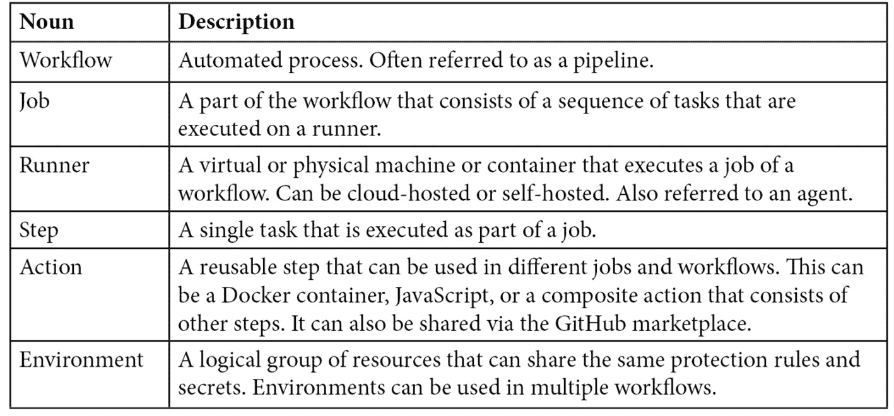

表格 6.1 —— GitHub Actions 的重要术语

# YAML 基础

工作流是编写在 `.yml` 或 `.yaml` 扩展名的 YAML 文件中的。**YAML**（即 *YAML Ain't Markup Language*）是一种数据序列化语言，优化为可以直接被人类编写和读取。它是 **JSON** 的严格超集，但使用语法相关的换行符和缩进来代替大括号。像 Markdown 一样，它也与拉取请求非常兼容，因为变更始终是按行进行的。让我们看一些 YAML 基础知识，帮助你入门。

## 注释

YAML 中的注释以井号 `#` 开始：

```
# A comment in YAML
```

## 标量类型

可以使用以下语法定义单个值：

```
key: value
```

支持多种数据类型：

```
integer: 42
```

```
float: 42.0
```

```
string: a text value
```

```
boolean: true
```

```
null value: null
```

```
datetime: 1999-12-31T23:59:43.1Z
```

请注意，键和值可以包含空格，并且不需要引号。但是你可以使用单引号或双引号引用键和值：

```
'single quotes': 'have ''one quote'' as the escape pattern'
```

```
"double quotes": "have the \"backslash \" escape pattern"
```

跨越多行的字符串——例如脚本块——使用管道符号 `|` 和缩进：

```
literal_block: |
```

```
    Text blocks use 4 spaces as indentation. The entire
```

```
    block is assigned to the key 'literal_block' and keeps
```

```
    line breaks and empty lines.
```

```
    The block continuous until the next element.
```

## 集合类型

嵌套数组类型——也称为**映射**——通常用于工作流中。它们使用两个空格进行缩进：

```
nested_type:
```

```
  key1: value1
```

```
  key2: value2
```

```
  another_nested_type:
```

```
    key1: value1
```

序列在每个项目前使用破折号 `–`：

```
sequence:
```

```
  - item1
```

```
  - item2
```

由于 YAML 是 JSON 的超集，因此你也可以使用 JSON 语法将序列和映射放在一行中：

```
map: {key: value}
```

```
sequence: [item1, item2, item3]
```

这应该足以帮助你开始在 GitHub 上编辑工作流。如果你想了解更多关于 YAML 的内容，可以查看 [`yaml.org/`](https://yaml.org/) 上的规范。现在，让我们来看看工作流语法。

# 工作流语法

你在工作流文件中看到的第一件事就是它的名称，该名称会在你的仓库的 **Actions** 下显示：

```
name: My first workflow
```

这个名称后面跟着触发器。

## 工作流触发器

触发器是`on`键的值：

```
on: push
```

触发器可以包含多个值：

```
on: [push, pull_request]
```

许多触发器包含其他可以配置的值：

```
on:
```

```
  push:
```

```
    branches:
```

```
      - main
```

```
      - release/**
```

```
  pull_request:
```

```
    types: [opened, assigned]
```

有三种类型的触发器：

+   Webhook 事件

+   定时事件

+   手动事件

`push`），如果你创建或更新一个拉取请求（`pull_request`），或者创建或修改一个问题（`issues`）。完整列表请访问 [`docs.github.com/en/actions/reference/events-that-trigger-workflows`](https://docs.github.com/en/actions/reference/events-that-trigger-workflows)。

**定时事件**使用与 cron 作业相同的语法。语法由五个字段组成，分别表示分钟（0 – 59）、小时（0 – 23）、日期（1 – 31）、月份（1 – 12 或 JAN – DEC）和星期几（0 – 6 或 SUN-SAT）。你可以使用下表中所示的操作符：

![表 6.2 – 定时事件的操作符]

](img/B17827_Ch_6_Table_02.jpg)

表 6.2 – 定时事件的操作符

这里是一些示例：

```
on:
```

```
  schedule:
```

```
    # Runs at every 15th minute of every day
```

```
    - cron:  '*/15 * * * *'
```

```
    # Runs every hour from 9am to 5pm
```

```
    - cron:  '0 9-17 * * *'
```

```
    # Runs every Friday at midnight
```

```
    - cron:  '0 0 * * FRI'
```

```
    # Runs every quarter (00:00 on day 1 every 3rd month)
```

```
    - cron:  '0 0 1 */3 *'
```

**手动事件**允许你手动触发工作流：

```
on: workflow_dispatch
```

你可以配置 `homedrive`，并在工作流中使用 `${{ github.event.inputs.homedrive }}` 表达式：

```
on:
```

```
  workflow_dispatch:
```

```
    inputs:
```

```
      homedrive:
```

```
        description: 'The home drive on the machine'
```

```
        required: true
```

```
        default: '/home'
```

你也可以使用 GitHub API 触发工作流。为此，你必须定义一个 `repository_dispatch` 触发器，并为你想要使用的事件指定一个或多个名称：

```
on:
```

```
  repository_dispatch:
```

```
    types: [event1, event2]
```

当发送*HTTP POST*请求时，工作流会被触发。以下是使用 `curl` 发送 HTTP POST 的示例：

```
curl \
```

```
  -X POST \
```

```
  -H "Accept: application/vnd.github.v3+json" \
```

```
  https://api.github.com/repos/<owner>/<repo>/dispatches \
```

```
  -d '{"event_type":"event1"}'
```

以下是使用 JavaScript 的示例（有关**Octokit** API 客户端的更多详细信息，请参阅 [`github.com/octokit/octokit.js`](https://github.com/octokit/octokit.js)）：

```
await octokit.request('POST /repos/{owner}/{repo}/dispatches', {
```

```
  owner: '<owner>',
```

```
  repo: '<repo>',
```

```
  event_type: 'event1'
```

```
})
```

使用 `repository_dispatch` 触发器，你可以在任何系统中使用任何 Webhook 来触发你的工作流。这有助于你自动化工作流并集成其他系统。

## 工作流作业

工作流本身在 `jobs` 部分进行配置。作业是映射而非列表，默认情况下并行运行。如果你希望它们按顺序执行，可以使用 `needs` 关键字让一个作业依赖于其他作业：

```
jobs:
```

```
  job_1:
```

```
    name: My first job
```

```
  job_2:
```

```
    name: My second job
```

```
    needs: job_1
```

```
  job_3:
```

```
    name: My third job
```

```
    needs: [job_1, job_2]
```

每个作业都会在运行器上执行。运行器可以是自托管的，或者你可以从云端选择一个。云端为所有平台提供了不同版本。如果你希望始终使用最新版本，可以选择 `ubuntu-latest`、`windows-latest` 或 `macos-latest`。你将会在 *第七章* *运行你的工作流* 中了解更多关于运行器的内容：

```
jobs:
```

```
  job_1:
```

```
    name: My first job
```

```
    runs-on: ubuntu-latest
```

如果你想以不同的配置运行工作流，可以使用 `${{ matrix.key }}` 表达式：

```
strategy:
```

```
  matrix:
```

```
    os_version: [macos-latest, ubuntu-latest]
```

```
    node_version: [10, 12, 14]
```

```
jobs:
```

```
  job_1:
```

```
    name: My first job
```

```
    runs-on: ${{ matrix.os_version }}
```

```
    steps:
```

```
      - uses: actions/setup-node@v2
```

```
        with:
```

```
          node-version: ${{ matrix.node_version }}
```

## 工作流步骤

一个作业包含一系列步骤，每个步骤可以运行一个命令：

```
steps:
```

```
  - name: Install Dependencies
```

```
    run: npm install
```

字面块允许你运行多行脚本。如果你希望工作流在不同于默认 shell 的 shell 中运行，你可以与其他值一起配置，例如`working-directory`：

```
- name: Clean install dependencies and build
```

```
  run: |
```

```
    npm ci
```

```
    npm run build
```

```
  working-directory: ./temp
```

```
  shell: bash
```

以下是可用的 shells：

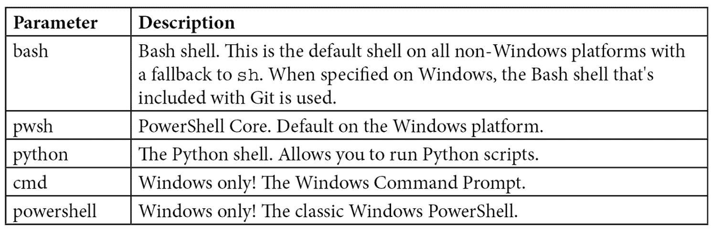

表 6.3 – 工作流中可用的 shells

非 Windows 系统的默认 shell 是`bash`，并回退到`sh`。Windows 上的默认 shell 是`cmd`。你也可以使用`command [options] {0}`语法配置自定义 shell：

```
run: print %ENV
```

```
shell: perl {0}
```

大多数时候，你会重用步骤。可重用的步骤称为`uses`关键字，语法如下：

```
{owner}/{repo}@{ref}
```

`{owner}/{repo}`是 GitHub 上操作的路径。`{ref}`引用的是版本：它可以是一个`label`、一个`branch`，或是通过其**哈希**值引用的单个`commit`。最常见的应用是使用标签进行显式版本控制，带有主版本和次版本：

```
# Reference a version using a label
```

```
- uses: actions/checkout@v2
```

```
- uses: actions/checkout@v2.2.0
```

```
# Reference the current head of a branch
```

```
- uses: actions/checkout@main
```

```
# Reference a specific commit
```

```
- uses: actions/checkout@a81bbbf8298c0fa03ea29cdc473d45769f953 675
```

如果你的操作与工作流位于同一存储库中，你可以使用相对路径引用该操作：

```
uses: ./.github/actions/my-action
```

你可以使用存储在容器注册表中的操作——例如 Docker Hub 或 GitHub Packages——使用`docker//{image}:{tag}`语法：

```
uses: docker://alpine:3.8
```

## 上下文和表达式语法

当我们查看矩阵策略时，你看到了一些表达式。**表达式**具有以下语法：

```
${{ <expression> }}
```

表达式可以访问上下文信息，并将其与运算符结合使用。提供上下文的不同对象包括`matrix`、`github`、`env`和`runner`。例如，使用`github.sha`，你可以访问触发工作流的 commit SHA；使用`runner.os`，你可以获取 runner 的操作系统，而使用`env`，你可以访问环境变量。完整列表，请访问[`docs.github.com/en/actions/reference/context-and-expression-syntax-for-github-actions#contexts`](https://docs.github.com/en/actions/reference/context-and-expression-syntax-for-github-actions#contexts)。

有两种语法可以用来访问上下文属性——字母语法或属性语法，后者更常用：

```
context['key']
```

```
context.key
```

根据键的格式，你可能需要使用第一个选项。如果键以数字开头或包含特殊字符，可能就是这种情况。

表达式通常用于`if`对象中，以在不同条件下运行作业：

```
jobs:
```

```
  deploy:
```

```
    if: ${{ github.ref == 'refs/heads/main' }}
```

```
    runs-on: ubuntu-latest
```

```
    steps:
```

```
      - run: echo "Deploying branch $GITHUB_REF"
```

你可以使用许多预定义的函数，例如`contains(search, item)`：

```
contains('Hello world!', 'world')
```

```
# returns true
```

其他函数示例包括`startsWith()`或`endsWith()`。还有一些特殊函数可以用来检查当前作业的状态：

```
steps:
```

```
  ...
```

```
  - name: The job has succeeded
```

```
    if: ${{ success() }}
```

只有在所有其他步骤都成功的情况下，这个步骤才会被执行。下表显示了所有可以用来响应当前作业状态的函数：

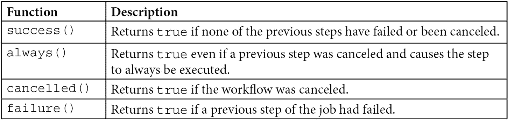

表 6.4 – 检查作业状态的特殊功能

除了函数，你还可以结合上下文和函数使用运算符。下表显示了最重要的一些运算符：

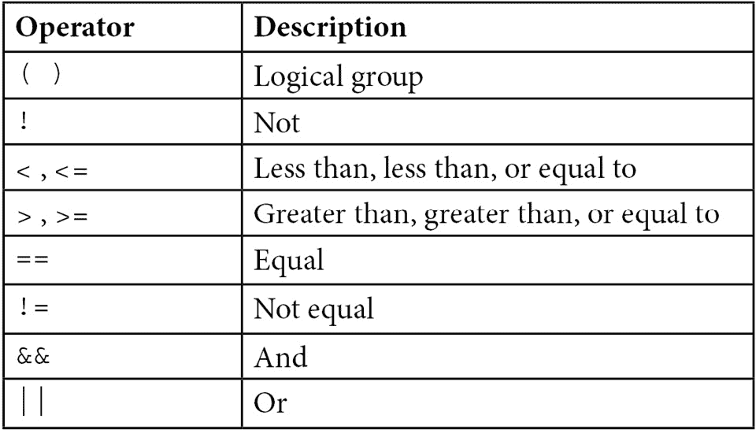

表 6.5 – 表达式的运算符

要了解更多关于上下文对象和表达式语法的信息，请访问[`docs.github.com/en/actions/reference/context-and-expression-syntax-for-github-actions`](https://docs.github.com/en/actions/reference/context-and-expression-syntax-for-github-actions)。

## 工作流命令

要从步骤内部与工作流交互，你可以使用`echo`命令，并通过发送字符串如`::set-output name={name}::{value}`到进程中。以下示例设置一个步骤的输出，并在另一个步骤中访问它。请注意如何使用步骤的 ID 来访问输出变量：

```
- name: Set time
```

```
  run: |
```

```
    time=$(date)
```

```
    echo '::set-output name=MY_TIME::$time'
```

```
  id: time-gen
```

```
- name: Output time
```

```
  run: echo "It is ${{ steps.time-gen.outputs.MY_TIME }}"
```

另一个示例是`::error`命令。它允许你将错误消息写入日志中。你可以选择设置文件名、行号和列号：

```
::error file={name},line={line},col={col}::{message}
```

你还可以写入警告和调试消息，分组日志行，或设置环境变量。有关工作流命令的更多详细信息，请访问[`docs.github.com/en/actions/reference/workflow-commands-for-github-actions`](https://docs.github.com/en/actions/reference/workflow-commands-for-github-actions)。

# 处理机密

所有自动化工作流中一个非常重要的部分是处理机密。无论你是部署应用程序还是访问 API——你总是需要凭据或密钥，而你必须小心处理它们。

在 GitHub 中，你可以在仓库级别、组织级别或环境级别安全存储机密。机密会被加密存储和传输，并且不会出现在日志中。

对于组织级别的机密，你可以定义哪些仓库可以访问该机密。对于环境级别的机密，你可以定义必需的审核者：只有在审核者批准工作流后，他们才能访问机密。

提示

秘密名称不区分大小写，只能包含普通字符（`[a-z]` 和 `[A-Z]`）、数字（`[0-9]`）和下划线字符（`_`）。它们不能以 `GITHUB_` 或数字开头。

最佳实践是使用大写字母并通过下划线（`_`）分隔来命名机密。

## 存储你的机密

要存储加密的机密，你必须是仓库管理员角色的一部分。可以通过网页或 GitHub CLI 创建机密。

要创建新机密，请导航到**设置** | **机密**。机密被分为**Actions**（默认）、**Codespaces** 和 **Dependabot** 类别。要创建新机密，点击**新建仓库机密**，然后输入机密的名称和内容（参见*图 6.1*）：

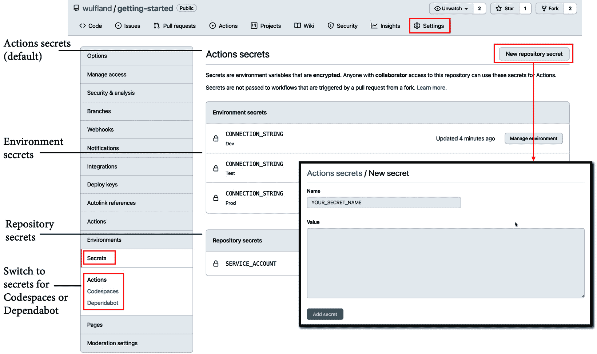

图 6.1 – 管理仓库机密

组织的机密大致相同。你可以在**Settings** | **Secrets** | **New organization secret**下创建机密，并将访问策略设置为以下任意一种：

+   **所有仓库**

+   **私有仓库**

+   **选择的仓库**

当你选择**选择的仓库**时，你可以为单个仓库授予访问权限。

如果你更喜欢使用 GitHub CLI，可以使用`gh secret set`创建新的机密：

```
$ gh secret set secret-name
```

系统将提示你输入机密。你还可以从文件中读取机密，将其通过管道传递给命令，或将其指定为正文（`-b`或`--body`）：

```
$ gh secret set secret-name < secret.txt
$ gh secret set secret-name --body secret
```

如果机密是为某个环境设置的，你可以使用`--env`（`-e`）参数来指定它。对于组织机密，你可以将其可见性（`--visibility`或`-v`）设置为`all`、`private`或`selected`。对于`selected`，你必须使用`--repos`（`-r`）指定一个或多个仓库：

```
$ gh secret set secret-name --env environment-name
$ gh secret set secret-name --org org -v private
$ gh secret set secret-name --org org -v selected -r repo
```

## 访问你的机密

你可以通过`secrets`上下文在工作流中访问机密。将其作为`with:`或`env:`变量添加到工作流文件中的步骤。组织和仓库的机密在工作流运行排队时读取，而环境机密在引用该环境的作业开始时读取。

注意

GitHub 会自动从日志中移除机密。但请小心你在步骤中对机密的处理方式！

根据你的 Shell 和环境，访问环境变量的语法有所不同。在 Bash 中，它是`$SECRET-NAME`，在 PowerShell 中，它是`$env:SECRET-NAME`，在`cmd.exe`中，它是`%SECRET-NAME%`。

以下是如何在不同的 Shell 中将机密作为输入或环境变量进行访问的示例：

```
steps:
```

```
  - name: Set secret as input
```

```
    shell: bash
```

```
    with:
```

```
      MY_SECRET: ${{ secrets.secret-name }}
```

```
    run: |
```

```
      dosomething "$MY_SECRET "
```

```
  - name: Set secret as environment variable
```

```
    shell: cmd
```

```
    env:
```

```
      MY_SECRET: ${{ secrets.secret-name }}
```

```
    run: |
```

```
      dosomething.exe "%MY_SECRET%"
```

注意

这些只是示例，向你展示如何将机密传递给操作。如果你的工作流步骤是`run:`步骤，你也可以直接访问机密上下文，`${{secrets.secret-name}}`。如果你想避免脚本注入，这种做法不推荐。但是，由于只有管理员才能添加机密，你可以考虑出于工作流可读性的考虑使用这种方式。

## `GITHUB_TOKEN`机密

一个特殊的机密是`GITHUB_TOKEN`机密。`GITHUB_TOKEN`机密是自动创建的，可以通过`github.token`或`secrets.GITHUB_TOKEN`上下文进行访问。即使工作流没有将其作为输入或环境变量提供，GitHub 操作仍然可以访问该令牌。该令牌可以用于身份验证，以便访问 GitHub 资源。默认权限可以设置为`permissive`或`restricted`，不过这些权限可以在工作流中调整：

```
on: pull_request_target
```

```
permissions:
```

```
  contents: read
```

```
  pull-requests: write
```

```
jobs:
```

```
  triage:
```

```
    runs-on: ubuntu-latest
```

```
    steps:
```

```
      - uses: actions/labeler@v2
```

```
        with:
```

```
          repo-token: ${{ secrets.GITHUB_TOKEN }}
```

你可以在此链接中找到更多关于`GITHUB_TOKEN`机密的信息：[`docs.github.com/en/actions/reference/authentication-in-a-workflow`](https://docs.github.com/en/actions/reference/authentication-in-a-workflow)。

# 实操——你的第一个工作流

这些理论应该足以让你入门。接下来的章节我们将深入探讨运行器、环境和安全性。如果你是 GitHub Actions 新手，现在正是时候创建你的第一个工作流和第一个 Action。

提示

你可以通过使用 GitHub 的代码搜索，并通过编程语言的 YAML (`language:yml`) 和工作流路径 (`path:.github/workflows`) 进行筛选，找到现有的 GitHub Actions 工作流模板。以下搜索将返回所有关于德国 Corona-Warn-App 的工作流：

`language:yml path:.github/workflows @corona-warn-app`

步骤如下：

1.  通过访问 [`github.com/wulfland/getting-started`](https://github.com/wulfland/getting-started) 并点击右上角的 **Fork** 按钮来 fork 仓库。

1.  在 fork 的项目中，点击 **Actions**。你应该能看到你可以使用的工作流模板。这些模板已针对仓库中的代码进行优化——在这个案例中是 .NET。选择 **设置此工作流**：

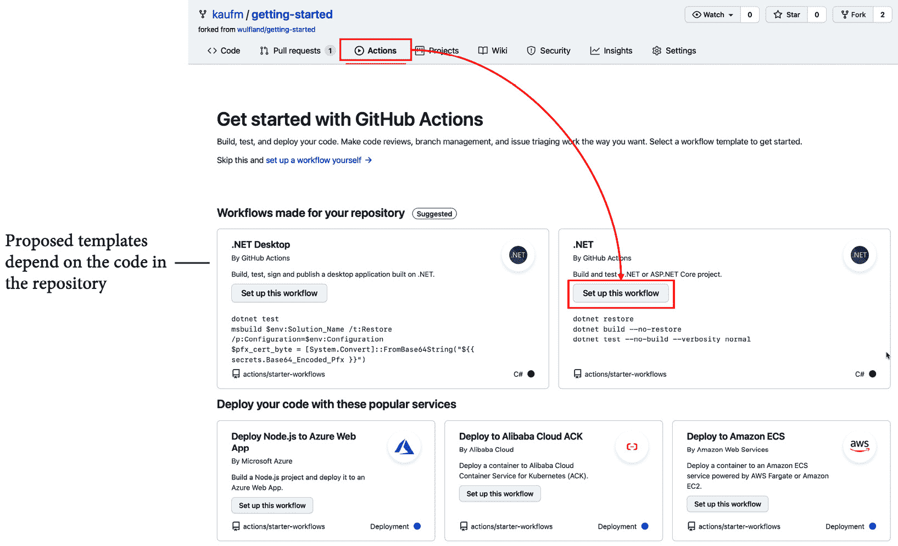

图 6.2 – 为 .NET 设置 GitHub Action

1.  GitHub 创建一个工作流文件并打开编辑器。编辑器支持语法高亮和自动补全（按 *Ctrl* + *Space*）。你可以在市场中搜索 Actions。将 `dotnet-version` 设置为 3.1.x 并提交工作流文件：

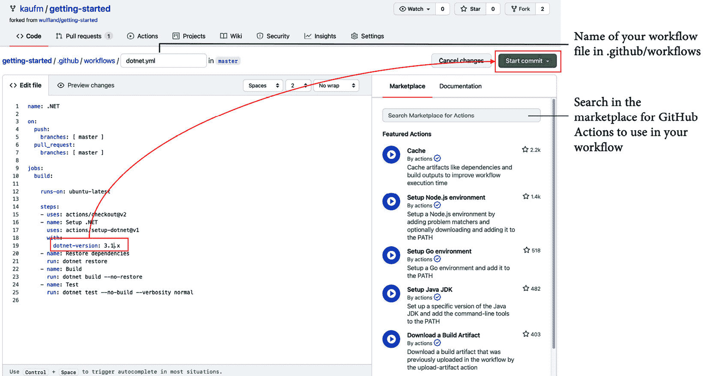

图 6.3 – 设置版本并提交工作流文件

1.  工作流将自动触发，你可以在 **Actions** 下找到该工作流的运行情况。如果你打开它，你可以找到工作流中的作业以及其他头部信息：

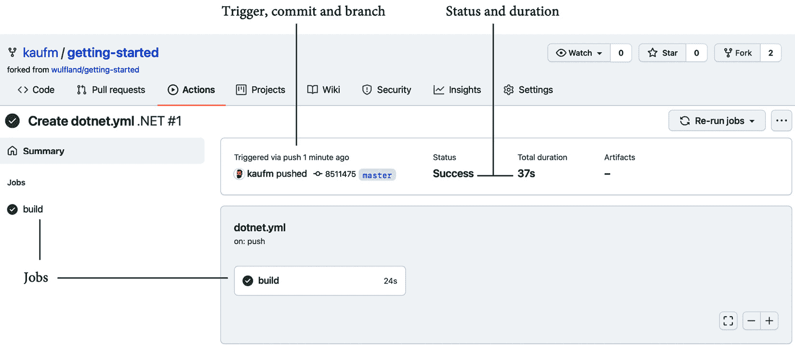

图 6.4 – 工作流摘要页面

1.  点击作业以查看所有步骤的详情：

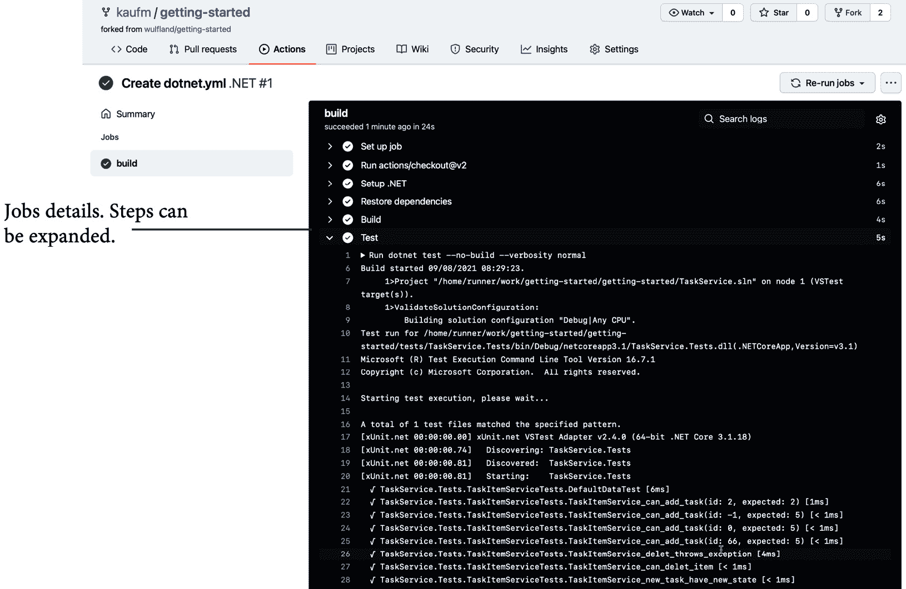

图 6.5 – 作业和步骤详情

如果你更喜欢其他语言，你可以使用以下仓库，它使用 **Java with Maven**：[`github.com/MicrosoftDocs/pipelines-java`](https://github.com/MicrosoftDocs/pipelines-java)。

选择工作流模板时，向下滚动至 **持续集成工作流**，然后点击 **更多持续集成工作流…**。

选择 **Java with Maven**，工作流应该就能正常工作：

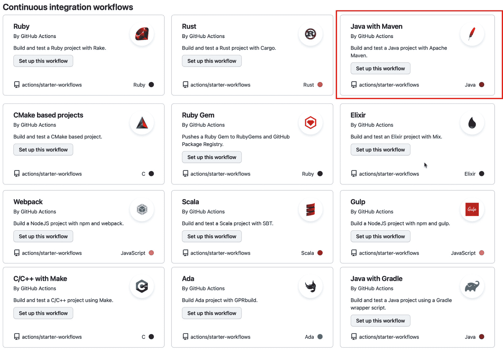

图 6.6 – 其他 CI 模板，例如 "Java with Maven"

所有的内容都有模板。设置一个基本的工作流来构建你的代码应该是很简单的。

# 实践操作 – 你的第一个 Action

GitHub Actions 的强大之处在于其可重用性，因此理解如何创建和使用 Actions 至关重要。在这个实践练习中，你将创建一个在 Docker 容器内运行的容器 Action。

提示

你可以在[`docs.github.com/en/actions/creating-actions/creating-a-docker-container-action`](https://docs.github.com/en/actions/creating-actions/creating-a-docker-container-action)找到这个示例，并可以从那里复制并粘贴文本文件的内容。如果你愿意，也可以使用[`github.com/actions/container-action`](https://github.com/actions/container-action)上的模板仓库并点击**使用此模板**。它会为你创建一个包含所有文件的仓库。

步骤如下：

1.  创建一个名为`hello-world-docker-action`的新仓库并将其克隆到你的工作站。

1.  打开终端并导航到仓库：

    ```
    $ cd hello-world-docker-action
    ```

1.  创建一个名为`Dockerfile`的文件（没有扩展名）。将以下内容添加到该文件中：

    ```
    # Container image that runs your code
    FROM alpine:3.10
    # Copies your code file from your action repository to the filesystem path '/' of the container
    COPY entrypoint.sh /entrypoint.sh
    # Code file to execute when the docker container starts up ('entrypoint.sh')
    ENTRYPOINT ["/entrypoint.sh"]
    ```

将此`entrypoint.sh`文件放入容器中。如果容器被执行，它将运行`entrypoint.sh`。

1.  创建一个名为`action.yml`的新文件，内容如下：

    ```
    # action.yml
    name: 'Hello World'
    description: 'Greet someone and record the time'
    inputs:
      who-to-greet:  # id of input
        description: 'Who to greet'
        required: true
        default: 'World'
    outputs:
      time: # id of output
        description: 'The time we greeted you'
    runs:
      using: 'docker'
      image: 'Dockerfile'
      args:
        - ${{ inputs.who-to-greet }}
    ```

`action.yml`文件定义了操作，以及其输入和输出参数。

1.  现在，创建`entrypoint.sh`脚本。该脚本将在容器中运行并调用其他二进制文件。将以下内容添加到该脚本中：

    ```
    #!/bin/sh -l
    echo "Hello $1"
    time=$(date)
    echo "::set-output name=time::$time"
    ```

输入参数作为参数传递给脚本，并通过`$1`访问。脚本使用`set-output`工作流命令将`time`参数设置为当前时间。

1.  你必须使`entrypoint.sh`可执行。在非 Windows 系统上，你只需在终端运行以下命令，然后添加并提交更改：

    ```
    $ chmod +x entrypoint.sh
    $ git add .
    $ git commit -m "My first action is ready"
    ```

在 Windows 上，这将不起作用。但你可以在将文件添加到索引时将其标记为可执行：

```
$ git add .
$ git update-index --chmod=+x .\entrypoint.sh
$ git commit -m "My first action is ready"
```

1.  Action 的版本管理是通过 Git 标签完成的。添加一个`v1`标签并推送所有更改到远程仓库：

    ```
    $ git tag -a -m "My first action release" v1
    $ git push --follow-tags
    ```

1.  你的操作现在已经准备好使用。返回到`getting-started`仓库中的工作流（`.github/workflows/dotnet.yaml`）并编辑文件。删除`jobs`下的所有内容（第 9 行），并用以下代码替换：

    ```
    hello_world_job:
      runs-on: ubuntu-latest
      name: A job to say hello
      steps:
      - name: Hello world action step
        id: hello
        uses: your-username/hello-world-action@v1
        with:
          who-to-greet: 'your-name'
      - name: Get the output time
        run: echo "The time was ${{ steps.hello.outputs.time }}"
    ```

现在，工作流调用你的操作（`uses`），并指向你创建的仓库（`your-username/hello-world-action`），后面跟着标签`(@v1)`。它将你的名字作为输入参数传递给操作，并接收当前时间作为输出，然后将其写入控制台。

1.  保存文件后，工作流将自动运行。查看详细信息，检查日志中的问候语和时间。

    提示

    如果你想尝试其他类型的操作，可以使用现有模板。如果你想尝试`action.yml`文件（请参见[`docs.github.com/en/actions/creating-actions/creating-a-composite-action`](https://docs.github.com/en/actions/creating-actions/creating-a-composite-action)）。

    处理这些操作的方法是相同的——只是创建方式不同。

# GitHub 市场

你可以使用 GitHub 市场（[`github.com/marketplace`](https://github.com/marketplace)）来搜索可以在工作流中使用的**动作**。发布一个动作到市场非常容易，这也是为什么已经有近 10,000 个动作可用的原因。你可以按类别筛选动作，或者使用搜索栏限制显示的动作数量（见*图 6.7*）：

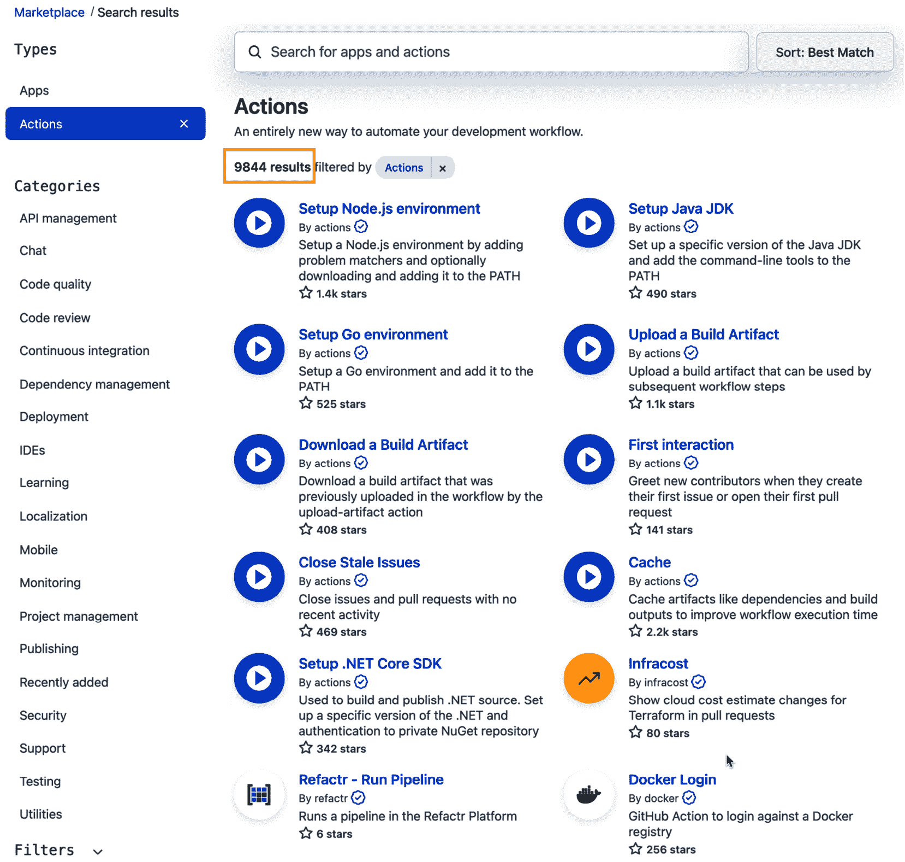

图 6.7 – 市场中包含了近 10,000 个动作

该动作显示来自仓库的 README 和其他信息。你可以查看所有版本的完整列表，并获取有关如何使用当前版本的信息：

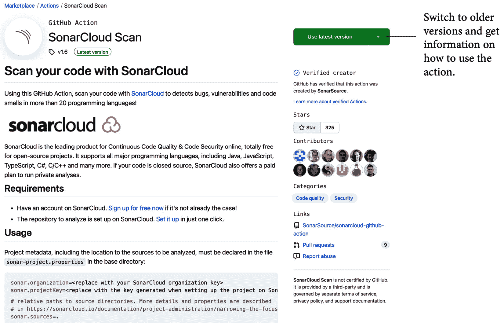

图 6.8 – 市场中的一个动作

发布动作到市场非常容易。确保该动作位于公共仓库中，动作名称唯一，并且动作包含良好的 README。选择一个图标和颜色并将其添加到 `action.yml` 中：

```
branding:
```

```
  icon: 'award'  
```

```
  color: 'green'
```

GitHub 会自动检测到 `action.yml` 文件，并提供一个名为**草拟发布**的按钮。如果你选择**将此动作发布到 GitHub 市场**，你需要同意服务条款，并且你的动作将会检查是否包含所有必需的文件。此时，你可以选择一个标签或创建一个新的标签，并为发布添加标题和描述：

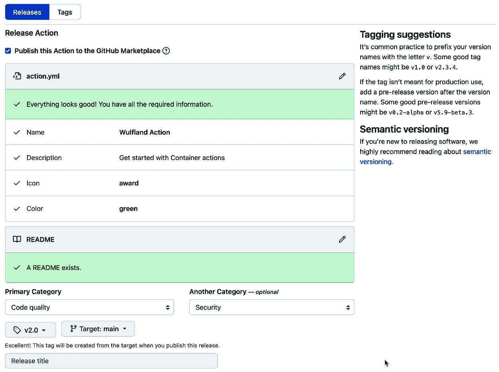

图 6.9 – 将动作发布到市场

发布发布版本或将其保存为草稿。

市场正在快速增长，它使自动化变得简单，因为几乎每个任务都有对应的动作。

# 总结

在本章中，我解释了自动化的重要性，并向你介绍了 GitHub Actions，作为一个灵活且可扩展的自动化引擎。

在下一章，你将学习不同的托管选项以及如何托管工作流运行器。

# 进一步阅读

如需了解本章涉及的更多内容，请查阅以下参考文献：

+   Humble J., & Farley, D. (2010). *持续交付：通过构建、测试和部署自动化可靠的软件发布*。Addison-Wesley Professional。

+   Forsgren, N., Humble, J., & Kim, G. (2018). *加速：精益软件与 DevOps 的科学：构建与扩展高效能技术组织*（第 1 版）[电子书]。IT Revolution Press。

+   *YAML*: [`yaml.org/`](https://yaml.org/)

+   *GitHub Actions*: [`github.com/features/actions`](https://github.com/features/actions) 和 [`docs.github.com/en/actions`](https://docs.github.com/en/actions)

+   *GitHub 学习实验室*: [`lab.github.com`](https://lab.github.com)

+   *工作流语法*: [`docs.github.com/en/actions/reference/workflow-syntax-for-github-actions`](https://docs.github.com/en/actions/reference/workflow-syntax-for-github-actions)

+   *GitHub 市场*: [`github.com/marketplace`](https://github.com/marketplace)
