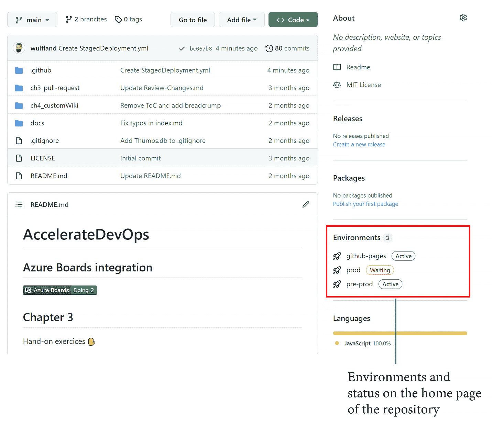

# 第九章：部署到任何平台

现在你已经学会了如何使用 GitHub Actions 作为自动化引擎，并使用 GitHub Packages 轻松分享代码和容器，我们可以通过自动化部署来完成我们的**持续集成/持续交付**（**CI/CD**）能力。

在本章中，我将向你展示如何以安全且合规的方式轻松部署到任何云或平台。

在本章中，我们将涵盖以下主要主题：

+   分阶段部署

+   自动化你的部署

+   基础设施即代码

+   如何部署到 Azure 应用服务

+   如何部署到 AWS **弹性容器服务**（**ECS**）

+   如何部署到 **Google Kubernetes 引擎**（**GKE**）

+   测量成功

    CI/CD

    CI 意味着每次将代码更改推送到你的仓库时，代码都会被构建和测试，并且输出将打包为构建工件。在 CD 中，每当创建新的构建工件时，你将自动将构建工件部署到环境中。

    在实践 CI/CD 时，开发和交付阶段是完全自动化的。代码随时可以部署到生产环境。

    有多种定义区分**持续交付**和**持续部署**（两者都是**CD**）——但这些定义在文献中并不一致，并且对主题的贡献微乎其微。

# 分阶段部署

一个 `Development`、`Test`、`Staging`（或 `Pre-Production`）和 `Production`。通常，`Staging` 或 `Pre-Production` 阶段是生产环境的完整镜像，有时，使用负载均衡切换这两个环境来实现零停机时间部署。通常，越接近生产环境的阶段需要手动批准才能部署。

如果公司使用功能标志（请参见 *第十章*，*功能标志与功能生命周期*）和 CD，通常阶段的数量会减少。我们可以讨论**基于环的部署**或**扩展单元**，而不是使用阶段。基于环的部署的想法是，你有客户处于不同的生产环中。你将更新部署到一个环，并自动监控系统是否出现意外异常或异常指标，如 CPU 或内存使用情况。此外，你可以在生产环境中运行自动化测试。如果没有错误，发布过程将持续进行并部署到下一个环。在讨论基于环的部署时，通常意味着没有手动批准。然而，环之间也可以进行手动批准。

在 GitHub 中，你可以使用**环境**进行分阶段和基于环的部署。你可以在你的仓库的**设置** | **环境**中查看、配置或创建新的环境。

对于每个环境，你可以定义以下内容：

+   **必需的审查员**：这些审查员包括最多五个用户或团队作为手动批准者。在执行部署之前，必须由其中一位批准者批准部署。

+   **等待计时器**：指的是部署执行前的宽限期。最大时间为 43,200 分钟或 30 天。此外，如果你在之前的阶段发现任何错误，可以使用 API 来取消部署。

+   `受保护的分支` 或者定义你自己的模式。该模式可以包含通配符（例如 `release/*`）。

+   **环境密钥**：环境中的密钥会覆盖仓库或组织范围内的密钥。密钥只有在必需审核员批准部署后才会加载。

配置看起来类似于 *图 9.1*：


图 9.1 – 在 GitHub 中配置环境

在工作流文件中，你需要在作业级别指定环境：

```
jobs:
```

```
  deployment:
```

```
    runs-on: ubuntu-latest
```

```
    environment: prod
```

此外，你还可以指定一个 URL，该 URL 将显示在概览页面上：

```
jobs:
```

```
  deployment:
```

```
    runs-on: ubuntu-latest
```

```
    environment: 
```

```
      name: production
```

```
      url: https://writeabout.net
```

使用 `needs` 关键字，你可以定义作业之间的依赖关系，因此也定义了环境之间的依赖（见 *图 9.2*）：


图 9.2 – 阶段性部署的概览页面

环境的状态也会显示在仓库的主页上（见 *图 9.3*）：



图 9.3 – 主页上的环境

如果你想在不同环境中进行实验，你可以在 [`github.com/wulfland/AccelerateDevOps/`](https://github.com/wulfland/AccelerateDevOps/) 的分支上运行 **阶段性部署** 工作流，并将自己添加为某些阶段的必需审核员。

# 自动化你的部署

如果我问我的客户是否自动化了他们的部署，通常的回答是 *是*。然而，仔细一看，自动化意味着 *我们有一个脚本*，或者 *我们有一个安装程序的回答文件*。这只是部分自动化。只要有人需要登录服务器、创建账户或 DNS 记录，或手动配置防火墙，那么你的部署就没有完全自动化！

人类会犯错——机器不会！确保你自动化了部署的所有步骤，而不仅仅是最后几个步骤。由于 GitHub Actions 是完美的自动化引擎，执行所有自动化部署的工作流是一个很好的做法。

# 如何部署到 Azure App Service

为了帮助你快速入门使用 GitHub Actions 进行自动化部署，我创建了三个实操实验：

+   部署到 Azure App Service

+   部署到 AWS ECS

+   部署到 GKE

所有实操实验假设你已经在指定的云平台上设置了帐户。如果你采用单云策略，你可以直接跳到与你相关的实操步骤，跳过其他部分。

实操实验的逐步指导位于 GitHub，链接为 [`github.com/wulfland/AccelerateDevOps/blob/main/ch9_release/Deploy_to_Azure_App_Service.md`](https://github.com/wulfland/AccelerateDevOps/blob/main/ch9_release/Deploy_to_Azure_App_Service.md)。建议按照那里提供的步骤进行操作，因为它提供了易于复制和粘贴的链接。这里，我将以逐步指南的形式，重点介绍如何部署应用程序。

## 部署 Azure 资源

Azure 资源的部署发生在 `setup-azure.sh` 脚本中。该脚本创建资源组、应用服务计划和应用服务。你可以轻松地在工作流中执行该脚本。部署完成后，我们从 Web 应用中获取 `publish` 配置文件并将其存储在 GitHub 的密钥中。你可以通过 Azure 门户或 Azure CLI 获取发布配置文件：

```
$ az webapp deployment list-publishing-profiles \
    --resource-group $rgname \
    --name $appName \
    --xml
```

## 使用 GitHub Actions 部署应用程序

工作流由两个任务组成：`Build` 和 `Deploy`。构建任务为正确的 `dotnet publish` 配置运行器，将网站发布到名为 `publish` 的文件夹中：

```
- name: Build and publish with dotnet
```

```
  working-directory: ch9_release/src/Tailwind.Traders.Web
```

```
  run: |
```

```
    dotnet build --configuration Release
```

```
    dotnet publish -c Release -o publish
```

下一步将工件上传到 GitHub，以便在后续任务中使用。这允许你将相同的包发布到多个环境：

```
- name: Upload Artifact
```

```
  uses: actions/upload-artifact@v2
```

```
  with:
```

```
    name: website
```

```
    path: ch9_release/src/Tailwind.Traders.Web/publish
```

此外，你还可以在工作流完成后查看并检查工件（见 *图 9.4*）：


图 9.4 – 工作流工件

`Deploy` 任务依赖于 `Build`，并将应用程序部署到 `prod` 环境。在环境内，你设置了密钥并添加了一个必要的审阅者：

```
Deploy:
```

```
  runs-on: ubuntu-latest
```

```
  environment: prod
```

```
  needs: Build
```

工作流将工件名为 `website` 的文件下载到一个名为 `website` 的文件夹中：

```
- uses: actions/download-artifact@v2
```

```
  with:
```

```
    name: website
```

```
    path: website
```

然后，它使用 `azure/webapps-deploy` 操作，使用发布配置文件部署网站：

```
- name: Run Azure webapp deploy action using publish profile credentials
```

```
  uses: azure/webapps-deploy@v2
```

```
  with:
```

```
    app-name: ${{ env.appName }}
```

```
    slot-name: Production
```

```
    publish-profile: ${{ secrets.AZUREAPPSERVICE_PUBLISHPROFILE }}
```

```
    package: website
```

最后一步仅是一个示例，展示如何验证部署。当然，你需要使用 `curl` 请求一个同时也指向数据库的站点 URL：

```
u=https://${{ env.appName }}.azurewebsites.net/
```

```
status=`curl --silent --head $u | head -1 | cut -f 2 -d' '`
```

```
if [ "$status" != "200" ]
```

```
then
```

```
  echo "Wrong HTTP Status. Actual: '$status'"
```

```
  exit 1
```

```
fi
```

如果你完成了实操实验中的逐步指南，你将拥有一个可以添加额外环境并部署到不同应用服务部署槽的游乐场（更多信息，请访问 [`docs.microsoft.com/en-us/azure/app-service/deploy-staging-slots`](https://docs.microsoft.com/en-us/azure/app-service/deploy-staging-slots)）。

# 如何部署到 AWS ECS

我们将部署相同的代码到 **AWS**，但这次，我们将通过 **Docker** 容器部署到 **ECS**。ECS 是一种高度可扩展的容器管理服务，允许你在集群中运行、停止和管理容器。你可以在 [`github.com/wulfland/AccelerateDevOps/blob/main/ch9_release/Deploy_to_AWS_ECS.md`](https://github.com/wulfland/AccelerateDevOps/blob/main/ch9_release/Deploy_to_AWS_ECS.md) 上找到逐步指导。

以下是一些附加说明和背景信息。

## AWS 资源的部署

我找不到一个简单的脚本，可以将所有内容部署到 AWS，而且不包含一些复杂的 JSON。这就是为什么我使用实验中的手动步骤。首先，你需要创建一个 `Access Key ID` 和 `Secret Access Key`。

在第一次部署之后，容器已经在注册表中，你可以通过向导与它一起设置你的 ECS 资源。

你需要提取任务定义并将其保存到 `aws-task-definition.json` 文件中。工作流第二次运行时，它会成功地将容器部署到 ECS。

## 使用 GitHub Actions 部署容器

我还将工作流分为 `Build` 阶段和 `Deploy` 阶段。这样可以让你轻松地在之后添加环境和更多的阶段。为了使其生效，你必须将镜像名称从 `Build` 作业传递给 `Deploy` 作业。为此，你可以使用 `job outputs`：

```
jobs:
```

```
  Build:
```

```
    runs-on: ubuntu-latest
```

```
    outputs:
```

```
      image: ${{ steps.build-image.outputs.image }}
```

为了配置认证，我们使用 `configure-aws-credentials` 操作，传入 `Access Key ID` 和 `Secret Access Key` 值。

请注意，GitHub 会隐藏部分镜像名称，并不会将其传递到下一个作业。为了避免这种情况，你必须防止 `configure-aws-credentials` 操作隐藏你的账户 ID：

```
- name: Configure AWS credentials
```

```
  uses: aws-actions/configure-aws-credentials@v1
```

```
  with:
```

```
    aws-access-key-id: ${{ secrets.AWS_ACCESS_KEY_ID }}
```

```
    aws-secret-access-key: ${{ secrets.AWS_SECRET_ACCESS_KEY }}
```

```
    aws-region: ${{ env.AWS_REGION }}
```

```
    mask-aws-account-id: no
```

登录 ECR 返回你在后续操作中使用的注册表名称：

```
- name: Login to Amazon ECR
```

```
  id: login-ecr
```

```
  uses: aws-actions/amazon-ecr-login@v1
```

在下一步中，你构建镜像并将其推送到 ECR。此外，你设置了下一个作业的输出：

```
- name: Build, tag, and push image to Amazon ECR
```

```
  id: build-image
```

```
  env:
```

```
    ECR_REGISTRY: ${{ steps.login-ecr.outputs.registry }}
```

```
    IMAGE_TAG: ${{ github.sha }}
```

```
  working-directory: ch9_release/src/Tailwind.Traders.Web
```

```
  run: |
```

```
    imagename=$ECR_REGISTRY/$ECR_REPOSITORY:$IMAGE_TAG
```

```
    echo "Build and push $imagename"
```

```
    docker build -t $imagename .
```

```
    docker push $imagename
```

```
    echo "::set-output name=image::$imagename"
```

下一个作业依赖于 `Build`，并在 `prod` 环境中运行：

```
Deploy:
```

```
  runs-on: ubuntu-latest
```

```
  environment: prod
```

```
  needs: Build
```

此外，它需要配置 AWS 凭证，然后使用通过 `needs` 上下文传递给作业访问的镜像名称配置 `aws-task-definition.json` 文件：

```
- name: Fill in the new image ID in the ECS task definition
```

```
  id: task-def
```

```
  uses: aws-actions/amazon-ecs-render-task-definition@v1
```

```
  with:
```

```
    task-definition: ${{ env.ECS_TASK_DEFINITION }}
```

```
    container-name: ${{ env.CONTAINER_NAME }}
```

```
    image: ${{ needs.Build.outputs.image }}
```

最后一步是使用前一步任务的输出部署容器：

```
- name: Deploy Amazon ECS task definition
```

```
  uses: aws-actions/amazon-ecs-deploy-task-definition@v1
```

```
  with:
```

```
    task-definition: ${{ steps.task-def.outputs.task-definition }}
```

```
    service: ${{ env.ECS_SERVICE }}
```

```
    cluster: ${{ env.ECS_CLUSTER }}
```

```
    wait-for-service-stability: true
```

如果你按照逐步指南操作，你将拥有一个分阶段的工作流，能够部署到 ECS。你可以添加更多阶段，并在不同的服务中运行不同版本的容器。

# 如何部署到 GKE

我们也将相同的代码部署到 GKE。你可以在 [`github.com/wulfland/AccelerateDevOps/blob/main/ch9_release/Deploy_to_GKE.md`](https://github.com/wulfland/AccelerateDevOps/blob/main/ch9_release/Deploy_to_GKE.md) 找到操作步骤。

在执行这些操作步骤之前，这里有一些关于发生的事情的详细信息。

## Google 资源的部署

完整的部署过程发生在你在 Cloud Shell 中执行的 `setup-gke.sh` 脚本中。该脚本会创建一个包含一个节点的 GKE 集群。为了测试目的，这足够了：

```
gcloud container clusters create $GKE_CLUSTER --num-nodes=1
```

此外，脚本还创建了一个用于 Docker 容器的制品库和一个用于执行部署的服务账户。

在 Kubernetes 中，有一个名为 `Deployment.yaml` 的概念。部署定义了容器并将其绑定到镜像：

```
spec:
```

```
  containers:
```

```
  - name: $GKE_APP_NAME
```

```
    image: $GKE_REGION-docker.pkg.dev/$GKE_PROJECT/$GKE_PROJECT/$GKE_APP_NAME:$GITHUB_SHA
```

```
    ports:
```

```
    - containerPort: 80
```

```
    env:
```

```
      - name: PORT
```

```
        value: "80"
```

我在文件中使用环境变量，并在将它们传递给 `kubectl apply` 命令之前，使用 `envsubst` 进行替换：

```
envsubst < Deployment.yml | kubectl apply -f -
```

一个服务暴露了 Pods —— 在这个例子中，暴露到互联网。该服务使用 `Service.yml` 文件以相同的方式进行部署：

```
spec:
```

```
  type: LoadBalancer
```

```
  selector:
```

```
    app: $GKE_APP_NAME
```

```
  ports:
```

```
  - port: 80
```

```
    targetPort: 80
```

服务的部署需要一些时间。你可能需要多次执行以下命令：

```
$ kubectl get service
```

如果你获得了外部 IP 地址，可以使用它来测试你的部署（见 *图 9.5*）：


](img/B17827_09_005.jpg)

图 9.5 – 获取 GKE 负载均衡器的外部 IP

服务帐户的凭证保存在`key.json`文件中。你必须对它们进行编码，并将它们保存为 GitHub 中的加密密钥，名为`GKE_SA_KEY`：

```
$ cat key.json | base64
```

脚本已经完成了这个步骤。所以，你只需要复制输出并将其粘贴到密钥中。

## 使用 GitHub Actions 部署容器

GitHub Actions 工作流中的部署非常直接。`gcloud` CLI 的身份验证和设置发生在`setup-gcloud`操作中：

```
- uses: google-github-actions/setup-gcloud@v0.2.0
```

```
  with:
```

```
    service_account_key: ${{ secrets.GKE_SA_KEY }}
```

```
    project_id: ${{ secrets.GKE_PROJECT }}
```

```
    export_default_credentials: true
```

然后，工作流会构建并将容器推送到注册表。它使用`gcloud`进行 Docker 注册表的身份验证：

```
gcloud auth configure-docker \
```

```
    $GKE_REGION-docker.pkg.dev \
```

```
    --quiet
```

要将新镜像部署到 GKE，我们使用`get-gke-credentials`操作进行身份验证：

```
- uses: google-github-actions/get-gke-credentials@v0.2.1
```

```
  with:
```

```
    cluster_name: ${{ env.GKE_CLUSTER }}
```

```
    location: ${{ env.GKE_ZONE }}
```

```
    credentials: ${{ secrets.GKE_SA_KEY }}
```

接下来，我们只需替换部署文件中的变量，并将它们传递给`kubectl apply`：

```
envsubst < Service.yml | kubectl apply -f -
```

```
envsubst < Deployment.yml | kubectl apply -f –
```

就这样。按照这些操作步骤，你应该能成功部署到 GKE！

部署到 Kubernetes

部署到 Kubernetes 可能非常复杂；不过，这超出了本书的范围。你可以使用不同的策略：**重建**、**滚动更新**（也称为**渐进更新**）、**蓝绿部署**、**金丝雀部署**和**A/B 测试**。一个很好的起点是官方文档，可以在[`kubernetes.io/docs/concepts/workloads/controllers/`](https://kubernetes.io/docs/concepts/workloads/controllers/)找到。此外，关于这些策略的实用可视化以及如何执行部署的实际示例，可以在[`github.com/ContainerSolutions/k8s-deployment-strategies`](https://github.com/ContainerSolutions/k8s-deployment-strategies)找到。

在与 Kubernetes 配合使用时，还有许多其他工具可供利用。例如，**Helm**（[`helm.sh/`](https://helm.sh/)）是 Kubernetes 的包管理器，而 **Kustomize**（[`kustomize.io/`](https://kustomize.io/)）是一个帮助你管理多个配置的工具。

# 基础设施即代码

**基础设施即代码**（**IaC**）是通过机器可读文件来管理和提供所有基础设施资源的过程。通常，这些文件会进行版本控制，并像代码一样在 Git 中管理。在这种情况下，通常称为 **GitOps**。

*IaC* 可以是命令式的、声明式的，或者两者的结合。命令式意味着文件是过程性的，例如脚本，而声明式则是指使用 YAML 或 JSON 等标记语言描述期望状态的功能性方法。为了充分发挥*IaC*的能力，你应该以一种可以应用更改而不仅仅是完成配置和撤销配置的方式来管理它。这通常被称为**持续配置自动化**（**CCA**）。

## 工具

有许多工具可以用于*IaC*和*CCA*。例如，有些是云特定工具，如**Azure ARM**、**Bicep**或**AWS CloudFormation**。然而，也有许多独立的工具可以用于本地基础设施。以下是一些最受欢迎的工具：

+   **Puppet**：这是由 Puppet 于 2005 年发布的 ([`puppet.com`](https://puppet.com))。

+   **Chef**：这是由 Chef 于 2009 年发布的 ([`www.chef.io`](https://www.chef.io))。

+   **Ansible**：这是由 RedHat 于 2021 年发布的 ([`www.ansible.com`](https://www.ansible.com))。

+   **Terraform**：这是由 HashiCorp 于 2014 年发布的 ([`www.terraform.io`](https://www.terraform.io))。

+   **Pulumi**：这是由 Pulumi 于 2017 年发布的 ([`www.pulumi.com`](https://www.pulumi.com))。

    IaC 和多云部署

    请注意，支持多个云提供商的*IaC* 工具并不意味着它可以将相同的资源部署到多个云！这是一个常见的误解。你仍然需要编写特定于云的自动化脚本。但你可以使用相同的语法和工具。

这只是冰山一角。市场上有许多工具。找到最佳组合的过程可能非常复杂，超出了本书的范围。如果你采用单云策略，可能最好从云原生工具开始。如果你有一个复杂的环境，涉及多个云和本地资源，并希望用相同的工具进行管理，你必须投入时间做详细分析。

## 最佳实践

无论你使用什么工具，在实现*IaC*时，有一些事情需要考虑：

+   将配置存储在 Git 中，并像管理代码一样使用受保护的分支、拉取请求和代码所有者。代码所有者是确保合规性的好方法，特别是当你将其存储在接近应用程序代码的位置时。

+   使用 GitHub Actions 执行部署。虽然在*编写*和调试 IaC 时可以交互式发布资源，但一旦完成，你应该通过工作流实现完全自动化的发布。IaC 就是代码，和应用程序代码一样，从开发者机器上部署它存在无法复现的风险。

+   秘密和密钥管理是 IaC 中最关键的部分。确保不要将它们保存在代码中，而是将它们存储在安全的地方（例如 GitHub Secrets）。像**Hashicorp Vault**或**Azure KeyVault**这样的金库可以在其中一个秘密泄露时轻松进行密钥轮换。此外，它还将你的安全管理与资源配置解耦。

+   如果可能，使用**OpenID Connect**（**OIDC**）。这是为了避免使用凭证来访问云资源，而是使用短期的令牌，这些令牌也可以轮换（更多信息请参考[`docs.github.com/en/actions/deployment/security-hardening-your-deployments`](https://docs.github.com/en/actions/deployment/security-hardening-your-deployments)）。

我在本书中使用了云原生工具。从这些工具过渡到*IaC*或*CCA*工具比反过来要容易。

## 策略

关于如何以可管理、可扩展和符合要求的方式组织你的基础设施代码，有不同的策略。本质上，这取决于你的组织结构以及哪种方式最适合你。以下是一些常见策略：

+   **集中式**：基础设施资源存放在中央仓库中，功能团队可以通过自服务（即触发工作流）从中配置。这种方法的优点是所有资源都集中在一个地方，责任单位可以对其进行强有力的控制。缺点是对开发人员来说灵活性较差，而且从代码到基础设施的*距离*会影响工程师对基础设施的处理方式。

+   **分散式**：基础设施资源与代码一起存放。你可以使用模板（请参考*工作流模板*部分）帮助工程团队设置基础设施。此外，你还可以使用**CODEOWNERS**和受保护分支来要求由共享责任团队进行审批。这种方法非常灵活，但成本控制和治理更加困难。

你可以在每次构建时部署——或者确保基础设施处于正确的状态。但这样会减慢构建速度并消耗宝贵的构建时间。在大多数情况下，最好在需要时通过单独的工作流部署资源。

+   **模板化**：负责共享基础设施的团队提供固定的模板，功能团队可以使用这些模板。这些模板可以是**Actions**，即预配置的本地动作的复合动作，或者是完全自定义的 Docker 或 JavaScript 动作。或者，你可以使用可复用的工作流（请参考*可复用工作流*部分）。无论哪种方式，被复用的工作流或动作的所有权仍然属于中央团队。如果你限制企业中允许的动作数量，这种方法效果很好。

+   **混合**：这是前三种策略的结合。例如，测试和开发基础设施可以是去中心化的，而生产环境则可以是模板化的。

无论您使用哪种策略，都要有意识地去选择。解决方案将大大影响您的团队协作方式以及基础设施在价值交付中的使用！

## 工作流模板

`.github` 仓库中的 `workflow-templates` 文件夹，包含元数据文件和图标文件（见*图 9.6*）：


图 9.6 – 组织的工作流模板

模板本身是一个普通的工作流文件。您可以使用 `$default-branch` 变量在触发器中按默认分支进行过滤。

除模板外，您还需要保存一个 `.svg` 格式的图标和一个属性文件。属性文件如下所示：

```
{
```

```
    "name": "My Workflow Template",
```

```
    "description": "Description of template workflow",
```

```
    "iconName": "my-template",
```

```
    "categories": [
```

```
        "javascript"
```

```
    ],
```

```
    "filePatterns": [
```

```
        "package.json$",
```

```
        "^Dockerfile",
```

```
        ".*\\.md$"
```

```
    ]
```

```
}
```

在此，`name`、`description` 和 `iconName` 是必需的。请注意，`iconName` 值不包含扩展名。在 `categories` 数组中，您可以指定该工作流模板相关的编程语言。对于文件模式也是一样的：您可以为用户的仓库中的特定文件指定模式。如果仓库中包含与某个模式匹配的文件，则模板会被更加显著地展示。

现在，如果组织的用户创建了一个新的工作流，他们将看到该组织的模板（见*图 9.7*）：


图 9.7 – 从模板创建工作流

模板已被复制并*可以修改*！这就是为什么工作流模板不适合用于模板化策略的原因。

要了解更多关于工作流模板的信息，请访问 [`docs.github.com/en/actions/learn-github-actions/creating-workflow-templates`](https://docs.github.com/en/actions/learn-github-actions/creating-workflow-templates)。

## 可重用工作流

`workflow_call` 触发器是可重用的：

```
on: 
```

```
  workflow_call:
```

您可以定义可以传递给工作流的输入。输入可以是 `boolean`、`number`、`string` 或 **secret**：

```
on:
```

```
  workflow_call:
```

```
    inputs:
```

```
      my_environment:
```

```
        description: 'The environment to deploy to.'
```

```
        default: 'Prod'
```

```
        required: true
```

```
        type: string
```

```
    secrets:
```

```
      my_token:
```

```
        description: 'The token to access the environment'
```

```
        required: true
```

您可以通过 `inputs` 上下文（`${{ inputs.my_environment }}`）访问可重用工作流中的输入，通过 `secrets` 上下文（`${{ secrets.my_token }}`）访问机密。

要使用可重用工作流，您必须按以下格式引用该文件：

```
{owner}/{repo}/{path}/{filename}@{ref}
```

工作流在作业中被调用，您可以按如下方式指定输入和机密：

```
jobs:
```

```
  call-workflow-1:
```

```
    uses: org/repo/.github/workflows/reusable.yml@v1
```

```
    with: 
```

```
      my_environment: development
```

```
    secrets:
```

```
      my_token: ${{ secrets.TOKEN }}
```

可重用工作流非常适合避免重复。结合语义版本控制和标签，这是将可重用工作流发布到您组织中团队的绝佳方式。

要了解更多关于可重用工作流的信息，请访问 [`docs.github.com/en/actions/learn-github-actions/reusing-workflows`](https://docs.github.com/en/actions/learn-github-actions/reusing-workflows)。

# 衡量成功

在 *第一章*，*重要的指标* 中，我向你介绍了 **四个关键指标仪表盘**。这是一个显示 DORA 指标的仪表盘。如果你自动将代码部署到生产环境，现在是从调查数据转向真实的指标了。仪表盘是实现这一目标的一种方式。

要安装仪表盘，请按照 [`github.com/GoogleCloudPlatform/fourkeys/blob/main/setup/README.md`](https://github.com/GoogleCloudPlatform/fourkeys/blob/main/setup/README.md) 中的说明操作。

首先，在 Google Cloud 中创建一个启用计费的项目，并记下项目 ID（不是名称！）。然后，打开 **Google Cloud Shell**（位于 [`cloud.google.com/shell`](https://cloud.google.com/shell)），克隆仓库并执行部署脚本：

```
$ git clone \
   https://github.com/GoogleCloudPlatform/fourkeys.git
$ cd fourkeys
$ gcloud config set project <project-id>
$ script setup.log -c ./setup.sh
```

脚本会问你一些问题，你可以根据这些问题来定制你的部署。如果一切顺利，你应该能在 Grafana 中看到一个漂亮的仪表盘。要配置 GitHub 将数据发送到 Google 的事件处理程序，你需要获取事件处理程序的端点和密钥。只需在 Cloud Shell 中执行以下两个命令并复制输出：

```
$ echo $(terraform output -raw event_handler_endpoint)
> https://event-handler-dup4ubihba-uc.a.run.app
$ echo $(terraform output -raw event_handler_secret)
> 241d0765b5a6cb80208e66a2d3e39d254051377f
```

现在，前往你希望将数据发送到仪表盘的 GitHub 仓库，在 **设置** | **Webhooks** | **添加 webhook** 下创建一个 webhook。将事件处理程序的 URL 和密钥粘贴到相应字段中，并选择 **发送所有事件**。点击 **添加 webhook** 以开始将所有事件发送到事件处理程序（见 *图 9.8*）：


图 9.8 – 添加 webhook 以将数据发送到四个关键指标仪表盘

不幸的是，目前你只能将部署数据发送到仪表盘。在之前的版本中，你可以将单独的事件发送到工作流。

要表示现场问题，你必须将名为 `Incident` 的标签添加到一个打开的 issue 中。在正文中，添加 `root cause:` 后跟导致事件的提交的 `SHA`。

**四个关键指标**仪表盘是查看你 DevOps 指标的一个好方法（见 *图 9.9*）：


图 9.9 – 四个关键指标仪表盘

然而，别忘了这些指标不是用来比较团队之间的表现的。不要让指标成为最终目标！

# 案例研究

设置 CI 后，我们 **Tailwind Gears** 的两个试点团队接下来要做的事情是自动化软件的部署和发布流程。

第一个团队运行一些仍托管在本地的 Web 应用。团队决定将这些应用从本地部署迁移到云端的**Kubernetes**托管服务。集群实例、网络和其他云资源已由 IT 部门在过去的冲刺中设置好。因此，团队可以轻松地将部署转移到分阶段的部署流程中。他们将应用部署到测试实例，并运行所有自动化测试。同时，他们还添加了一个使用**curl**的测试，该测试调用一个网站，检查数据库和后端的可访问性，以确保一切正常。如果所有测试通过，部署将自动进行滚动更新，确保用户零停机时间地部署到生产环境。

某些包含共享关注点的 Web 应用代码需要调整以便在云端工作。这些代码也包含在其他团队的 Web 应用中。团队决定将这些代码迁移到**GitHub Packages**（JavaScript 使用**NPM**，.NET 使用**NuGet**），并拥有自己的发布周期和**语义版本控制**，以便将来其他团队在迁移到云端时能更方便地重用这些代码。

第二个团队为硬件产品开发软件，这些硬件产品用于机器中的安全关键功能。这意味着开发过程受到严格监管。他们需要对所有更改进行端到端的可追溯性。由于所有需求已导入 GitHub 问题，并通过嵌套问题进行链接，因此这不成问题。他们只需在提交信息中引用最低级别的问题。除了端到端的可追溯性外，还有一些不同级别需求的测试文档尚未实现自动化。另外，还有一些风险管理文档。为了确保在发布产品之前满足所有这些标准，**必需的审阅者**在部署到生产环境之前手动批准发布，以确保所有要求已到位并符合规范。结合**受保护的分支**和**代码所有者**（必需的文档已经转换为 markdown），这减少了一次性发布大量内容的工作量。

二进制文件安装到硬件上是通过一款由公司拥有并在生产机器上运行的定制工具来执行的。该工具用于从文件共享中提取二进制文件。这对于端到端可追溯性并不理想，因为它依赖于日志文件。部署到测试环境是手动执行的，这意味着二进制文件的分发方式不一致。为了解决这个问题，团队将二进制文件和工具一起放入**Docker 容器**，并将镜像发布到 GitHub Packages 的**容器注册表**。然后，可以使用 Docker 镜像将版本传输到测试机器，并在组装过程中以相同方式进行操作。

# 总结

本章中，您学习了如何使用**GitHub 环境**来阶段性部署并保护您的部署，如何使用 GitHub Actions 安全地部署到任何云平台。我展示了如何使用工作流模板和可重用工作流来帮助您在**IaC**上进行协作。

在下一章中，您将学习如何使用**FeatureFlags**/**FeatureToggles**优化您的功能发布以及整个功能生命周期。

# 深入阅读

下面是本章中提到的参考资料列表，您也可以使用这些资料来获取更多关于我们讨论的主题的信息：

+   CI/CD: [`azure.microsoft.com/en-us/overview/continuous-delivery-vs-continuous-deployment`](https://azure.microsoft.com/en-us/overview/continuous-delivery-vs-continuous-deployment)/

+   部署环: [`docs.microsoft.com/en-us/azure/devops/migrate/phase-rollout-with-rings`](https://docs.microsoft.com/en-us/azure/devops/migrate/phase-rollout-with-rings)

+   *部署到 Azure 应用服务*: [`docs.github.com/en/actions/deployment/deploying-to-your-cloud-provider/deploying-to-azure-app-service`](https://docs.github.com/en/actions/deployment/deploying-to-your-cloud-provider/deploying-to-azure-app-service)

+   *部署到 Google Kubernetes Engine*: [`docs.github.com/en/actions/deployment/deploying-to-your-cloud-provider/deploying-to-google-kubernetes-engine`](https://docs.github.com/en/actions/deployment/deploying-to-your-cloud-provider/deploying-to-google-kubernetes-engine)

+   *部署到 Amazon Elastic Container Service*: [`docs.github.com/en/actions/deployment/deploying-to-your-cloud-provider/deploying-to-amazon-elastic-container-service`](https://docs.github.com/en/actions/deployment/deploying-to-your-cloud-provider/deploying-to-amazon-elastic-container-service)

+   *加强部署安全性*: [`docs.github.com/en/actions/deployment/security-hardening-your-deployments`](https://docs.github.com/en/actions/deployment/security-hardening-your-deployments)

+   Kubernetes 部署: [`kubernetes.io/docs/concepts/workloads/controllers/`](https://kubernetes.io/docs/concepts/workloads/controllers/)

+   Kubernetes 部署策略: [`github.com/ContainerSolutions/k8s-deployment-strategies`](https://github.com/ContainerSolutions/k8s-deployment-strategies)

+   *Helm*: [`helm.sh/`](https://helm.sh/)

+   *Kustomize*: [`kustomize.io/`](https://kustomize.io/)

+   *基础设施即代码*: [`en.wikipedia.org/wiki/Infrastructure_as_code`](https://en.wikipedia.org/wiki/Infrastructure_as_code)

+   IaC 和环境或配置漂移: [`docs.microsoft.com/en-us/devops/deliver/what-is-infrastructure-as-code`](https://docs.microsoft.com/en-us/devops/deliver/what-is-infrastructure-as-code)

+   *创建工作流模板*: [`docs.github.com/en/actions/learn-github-actions/creating-workflow-templates`](https://docs.github.com/en/actions/learn-github-actions/creating-workflow-templates)

+   可重用工作流: [`docs.github.com/en/actions/learn-github-actions/reusing-workflows`](https://docs.github.com/en/actions/learn-github-actions/reusing-workflows)

+   四大关键项目: [`github.com/GoogleCloudPlatform/fourkeys/`](https://github.com/GoogleCloudPlatform/fourkeys/)
