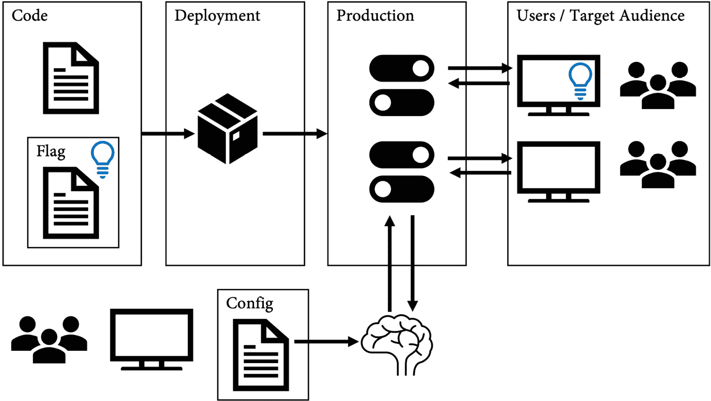
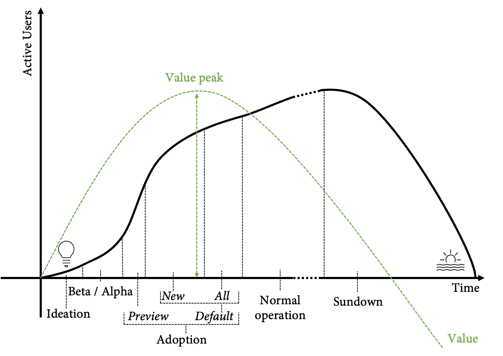
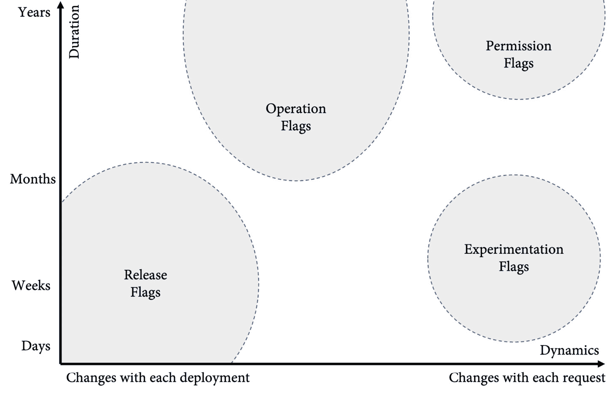
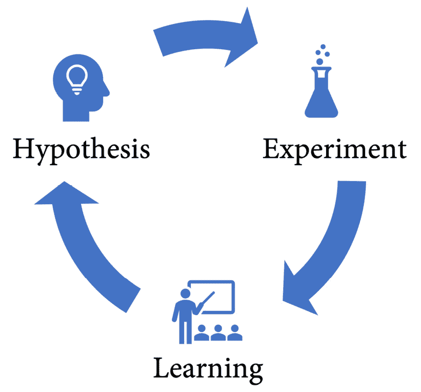
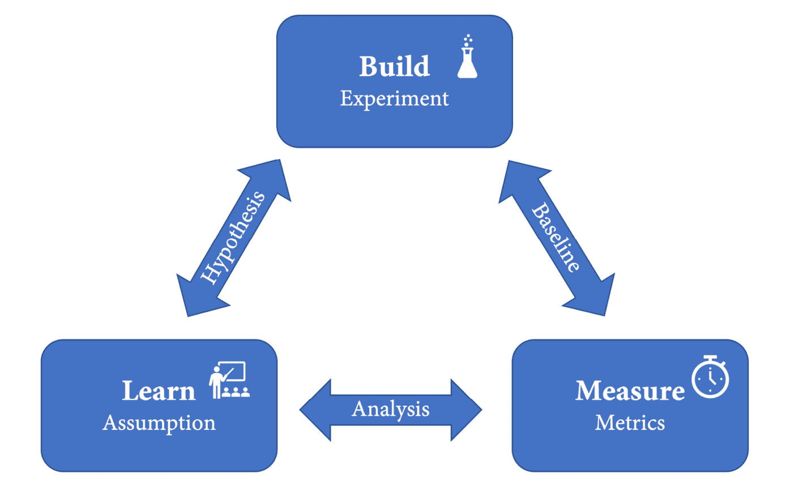

# *第十章*：功能标志与功能生命周期

**功能标志（Feature Flags）**是我在多年与团队合作过程中见过的最具变革性的功能之一。它们有许多不同的用例。功能标志可以帮助你通过提前合并代码来减少开发工作流中的复杂性，或者帮助你执行零停机时间部署。功能标志帮助你通过管理整个功能生命周期来从功能中获得更多的价值。

在本章中，我将解释什么是功能标志——也称为**功能切换（Feature Toggles）**——以及你可以用它们做什么。不幸的是，GitHub 本身没有原生的解决方案来支持功能标志。市面上有许多框架和服务可以用来实现功能标志，但我会为你提供一些选择最佳工具的建议，帮助你根据用例来选择。

本章的主要内容如下：

+   什么是功能标志（Feature Flags）？

+   功能的生命周期

+   功能标志的优势

+   入门功能标志

+   功能标志与技术债务

+   使用功能标志进行实验

# 什么是功能标志（Feature Flags）？

**功能标志（Feature Flags）**是一种软件开发技术，允许在不更改代码的情况下修改运行时行为。它将功能发布与二进制文件的部署解耦，使得功能可以独立于代码更新进行发布。

功能标志像开关或切换一样工作，因此通常被称为**功能切换（Feature Toggles）**或**功能开关（Feature Switches）**，因为它们具有布尔性质。但功能标志有许多不同的用例，可能比简单的切换要复杂。因此，*功能标志（Feature Flag）*这一术语更为合适。

功能标志允许你将新代码封装在一个功能标志后面，并将其推广到生产系统。然后，可以根据特定目标受众的上下文来启用该功能（见*图 10.1*）：



图 10.1 – 功能标志的工作原理

功能标志对于开发者来说是一种非常自然的技术，特别是如果你有持续交付功能，并且有一个独立的团队负责基础设施的话。对于开发者而言，向代码中添加标志比更改基础设施要容易得多，因此你通常会看到功能标志被用来让测试人员执行不同于普通用户的操作，或者让一些 beta 用户测试某些功能。问题在于，如果你没有明确规定功能标志，配置通常会分散在不同的地方：配置文件、组成员资格和应用程序数据库中。明确功能标志有助于提高团队透明度，确保统一的处理方式，同时支持更复杂的用例，确保安全性和可扩展性。

# 功能的生命周期

直到几年前，大多数软件每 1 到 2 年发布一次重大版本，这些版本通常需要单独购买，或者至少与订阅的许可证紧密捆绑。所有的新功能都会被挤进这些新版本中。新版本通常伴随着培训材料、书籍和在线课程，以教授用户使用新功能。

这些销售模式今天几乎已经不存在了。客户希望将软件作为服务使用。无论是像 Facebook 或 WhatsApp 这样的移动应用，还是像 Office 或 Windows 这样的桌面软件，软件都在持续更新和优化，并不断增加新功能。这带来了一个挑战：如何教育最终用户正确使用新功能。直观的用户体验和易于发现的新功能比旧的销售模式下更为重要。功能必须是自我解释的，屏幕上的简单对话框应该足以教导用户如何使用新功能。

此外，价值创造完全不同。客户不再每几年才做一次购买决定。他们每天都在决定是否使用软件来完成手头的任务。因此，重点不再是通过将大量新功能挤进新版本来影响购买决策，而是通过去除不使用的功能或优化它们直到具有高价值，从而提供少而精的高价值功能。

这意味着每个功能都需要经历一个生命周期。功能的生命周期可能类似于*图 10.2*所示：



图 10.2 – 特性生命周期

生命周期包括以下几个阶段：

+   **构思与开发**：新功能的构思之后，实施会从少数内部用户开始。利用这些用户的反馈来改进功能。

+   **Alpha 或 beta**：在 Alpha 和/或 Beta 阶段，该功能提供给更广泛但仍然非常有限的用户群体。这个用户群体可以是内部用户或选定的外部客户。Alpha 或 Beta 阶段可以是封闭（私密的）或开放（公开的），但该阶段的功能仍然非常动态，可能会发生显著变化。

+   **采纳**：如果该功能足够成熟以进入市场，它将逐渐暴露给更广泛的用户群体。采纳阶段可以分为以下几个子阶段：

    1.  **预览版**：用户可以**选择加入**并启用预览功能。

    1.  **新用户默认设置**：该功能是新用户的默认设置，但用户仍然可以**选择退出**，如果他们不想使用该功能。

    1.  **所有用户默认设置**：该功能对所有用户启用，但用户仍然可以选择退出。

+   **正常运行**：该功能被所有用户使用，且不再允许选择退出。功能的旧版本会从系统中移除。正常运行阶段可能会持续多年。

+   **日落**：该特性被一个更新的、更有可能更好的特性所取代。使用该特性的用户数量逐渐下降，维护该特性的成本超过其价值。当所有用户都能转向新特性时，该特性会从系统中移除。

请注意，特性的价值在早期采用阶段最大，因为它吸引了新的用户到你的应用程序中。在正常操作阶段，热度可能已经平稳，竞争对手也从你的特性中学到了东西，并通过调整他们的软件做出了回应。

# 特性标志的好处

在没有使用特性标志的情况下，无法管理特性的生命周期，但还有许多其他的用例，特性标志可以为你的 DevOps 团队带来价值：

+   **发布标志**：这些标志用于在标志后推出代码。发布标志通常会一直存在于代码中，直到特性完全推出。这可能是几周或几个月。发布标志会随着每次部署或系统配置的变化而变化。这意味着它们可以通过读取配置值轻松实现。但是，如果你想使用发布标志进行**金丝雀发布**（逐渐向更多用户曝光特性）或**蓝绿部署**（交换暂存和生产环境），它们会更具动态性。

+   **实验标志**：如果你推出多个版本的相同特性，并将其暴露给不同的受众，这就叫做**A/B 测试**或**实验**。通常用于通过测量用户与特性版本的交互情况来确认或减弱一个假设。实验标志是高度动态的，并依赖于大量的上下文来使用它们以应对不同的目标受众。

+   **权限标志**：特性标志的一个常见用例是控制用户可以访问的内容。这可以是*管理功能*或*测试功能*，仅暴露给特定受众，或*高级功能*，仅暴露给付费客户。权限标志是高度动态的，通常会在代码中存在很长时间——有时直到应用程序生命周期的结束。它们还存在较高的欺诈风险，因此必须谨慎使用。

+   **操作标志**：有些标志用于应用程序的操作方面——例如，*杀死开关*用于禁用某些可能成为其他特性瓶颈的功能（也叫做*断路器*）。用于控制后端系统不同版本的标志也被认为是操作标志。多变体标志通常用于控制日志详细信息或其他操作方面。

*图 10.3* 展示了按动态性和在系统中存在的时间对不同类型的特性标志的概览：



图 10.3 – 特性标志类型

现在我们已经了解了什么是功能标志以及您可以如何使用它们，我将向您展示如何在代码中实现它们。

# 开始使用功能标志

在代码中，功能标志只是一个`if`语句。假设您已经有了一个用于注册新用户对话框的当前实现：

```
function showRegisterDialog(){
```

```
    // current implementation
```

```
}
```

现在，您希望使用功能标志创建一个新的对话框，并能够在运行时打开新的对话框：

```
function showRegisterDialog(){
```

```
    var newRegisterDialog = false;
```

```
    if( newRegisterDialog ){
```

```
        return showNewRegisterDialog();
```

```
    }else{
```

```
        return showOldRegisterDialog();
```

```
    }
```

```
}
```

```
function showNewRegisterDialog(){
```

```
    // new implementation
```

```
}
```

```
function showOldRegisterDialog(){
```

```
    // old implementation
```

```
}
```

要动态启用或禁用功能，您必须将功能标志的验证提取到其自己的函数中：

```
function showRegisterDialog(){
```

```
    if( featureIsEnabled("new-register-user-dialog") ){
```

```
        return showNewRegisterDialog();
```

```
    }else{
```

```
        return showOldRegisterDialog();
```

```
    }
```

```
}
```

有许多选项可以存储功能标志的配置：

+   系统配置

+   用户配置

+   应用程序数据库

+   单独的数据库

+   单独的系统（通过 API 访问）

这高度依赖于您的用例，哪些位置适用或不适用。

# 功能标志和技术债务

如果您开始使用功能标志，通常会得到一个高度可配置的系统，可以在运行时更改其行为 - 通常是通过分散在多个配置源中的许多标志。这些标志往往彼此之间存在依赖关系，因此启用或禁用标志会对系统的稳定性造成很大风险。您设法通过避免并行分支来避免*合并地狱*，但最终却陷入了*功能标志地狱*，数百个标志，没有人知道它们的用途。

要避免这种情况，您应该遵循以下最佳实践：

+   **度量**：即使它们提供了所有的价值，功能标志在您的代码中也是某种技术债务。您应该像测量代码覆盖率或其他与代码相关的指标一样测量它们。测量功能标志的*数量*，它们存在的*时长*，它们在每个环境中的评估情况（*值*，在生产中为 100%可能意味着可以移除该标志），以及标志被使用的频率（*调用*）。

+   **集中管理**：在一个中心位置管理您的标志，特别是如果您使用不同的方法来管理这些标志。每个标志应该有一个*所有者*和一个*描述*。记录功能标志之间的*依赖关系*。

+   **集成到您的流程中**：将功能标志的管理集成到您的流程中。例如，如果您使用 Scrum，可以在*评审*会议中审查功能标志。确保所有定期使用标志的人都仔细查看所有标志，并检查哪些标志可以从系统中移除。

+   作为临时标志的前缀`tmp-`和作为永久标志的前缀`perm-`。不要把它弄得太复杂，但标志的名称应立即表明它是何种类型的标志，以及它在代码库中应该存在多长时间。

一些团队喜欢，而另一些团队不喜欢的技术是**清理分支**。你可以看看这种技术是否适合你。其思路是，在你创建标志并编写代码的那一刻，你最清楚如果标志有一天被移除，代码应该是什么样子。因此，你可以创建一个清理分支并同时创建拉取请求，直到标志被移除为止。这个技术在有良好命名规范的情况下效果最好。

以之前的示例为例，你有一个用于新特性对话框的标志。带有标志的代码如下所示：

```
function showRegisterDialog(){
```

```
    if( featureIsEnabled("tmp-new-register-user-dialog") ){
```

```
        return showNewRegisterDialog();
```

```
    }else{
```

```
        return showOldRegisterDialog();
```

```
    }
```

```
}
```

代码是在`features/new-register-dialog`分支中开发的，你创建了一个拉取请求来合并代码。

你已经知道，当标志被移除后，代码的最终状态将只使用新对话框，因此你创建了一个新的分支（例如，`cleanup/new-register-dialog`）并添加了代码的最终版本：

```
function showRegisterDialog(){
```

```
    return showNewRegisterDialog();
```

```
}
```

然后，你可以创建一个拉取请求，并保持其打开，直到特性完全推出，你希望清理代码。

正如我所说，这种技术并不适合所有团队。在复杂环境中，维护清理分支可能是一项繁重的工作，但你可以尝试一下。

如果特性标志没有被清理，并且没有得到积极维护，那它就是技术债务，但其优点大于缺点。如果你从一开始就小心谨慎，你可以避免进入特性标志的地狱，并且在发布和操作你的应用程序时，只会受益于它们提供的灵活性。

# 框架和产品

在实现特性标志时，有许多可供利用的框架。最适合你的框架在很大程度上取决于你的编程语言和使用案例。有些框架更专注于 UI 集成，有些则更专注于发布和操作。在选择框架时，你应该考虑以下方面：

+   **性能**：特性标志必须快速，不能降低应用程序的性能。应该使用适当的缓存，并且如果数据存储无法及时访问，也应使用默认值。

+   **支持的编程语言**：你的解决方案应该适用于所有的编程语言，特别是当你使用客户端标志时；你还必须在服务器端评估它们以确保安全。你不想在不同的地方配置标志。

+   **UI 集成**：如果你想让用户能够选择是否启用某个功能，那么你需要一个良好的 UI 集成。通常，你需要两个标志：一个控制可见性，另一个启用或禁用功能。

+   **上下文**：当你想使用特性标志进行 A/B 测试和实验时，你需要大量的上下文信息来评估标志：例如用户、组成员资格、地区和服务器。这是许多框架的弱点所在。

+   **中央管理**：例如，为每个环境分别配置的标志是无法维护的。你需要一个中央管理平台，在一个地方控制所有的标志。

+   **数据存储**：一些框架将配置存储在你的应用数据库中。这在许多场景下是有问题的。通常，你在所有环境中都有不同的数据库，因此在各个环境中管理设置是困难的。

构建一个可扩展、高性能且成熟的解决方案需要大量的时间和精力，即使是使用框架时也是如此，但也有一些现成的产品可以安装或作为服务使用。一个存在多年的、成熟的产品是**LaunchDarkly** ([`launchdarkly.com/`](https://launchdarkly.com/))。现在有很多竞争者，包括以下几种：

+   **Switchover** ([`switchover.io/`](https://switchover.io/))

+   **VWO** ([`vwo.com/`](https://vwo.com/))

+   **Split** ([`www.split.io/`](https://www.split.io/))

+   **Flagship** ([`www.flagship.io/`](https://www.flagship.io/))

+   **Azure 应用配置** ([`docs.microsoft.com/en-us/azure/azure-app-configuration/overview`](https://docs.microsoft.com/en-us/azure/azure-app-configuration/overview))

**Unleash** ([`www.getunleash.io/`](https://www.getunleash.io/)) 也值得一提。它有一个**开放核心** ([`github.com/Unleash/unleash`](https://github.com/Unleash/unleash))，可以作为 Docker 容器免费自托管。Unleash 也是 GitLab 使用的解决方案。

我找不到一个好的资源来比较这些解决方案，所以我在 GitHub 上添加了一个页面 ([`wulfland.github.io/FeatureFlags/`](https://wulfland.github.io/FeatureFlags/))，提供了解决方案的独立比较。

在做决策时，关于自建与购买的选择，大多数公司更适合使用现有的服务或产品。构建和运行一个优秀的功能标志解决方案是困难且耗时的，特别是如果你对功能标志还不熟悉的话。从一个好的产品开始。如果经过一段时间后，你仍然觉得有必要自己构建解决方案，至少你已经有了了解一个解决方案应具备功能的经验。

# 使用功能标志进行实验

实验和 A/B 测试不仅可以通过功能标志进行。你也可以在不同的分支中开发容器，并使用 Kubernetes 在生产环境中运行不同版本；然而，这会增加你在 Git 中的复杂性，并且不易扩展。你也无法获得用户的上下文，因此收集数据来验证或削弱你的假设会更加困难。大多数功能标志的解决方案都内置了实验支持，所以这是最快的入门方式。

要进行实验，你需要定义一个假设，进行实验，然后从结果中学习。一个实验可以这样定义（见*图 10.4*）：

+   **假设**：我们相信*{客户群体}*，想要*{产品/功能}*，因为*{价值主张}*。

+   **实验**：为了验证或反驳前述假设，团队将进行一次实验。

+   **学习**：实验将通过影响以下指标来证明假设。



图 10.4 – 使用功能标志进行实验

让我们看一个例子。通过查看你的应用程序的使用数据，你发现新用户注册对话框的第一页浏览量远高于完成注册流程的人数。只有大约 20% 的人完成注册。假设是注册对话框过于复杂，当对话框简化时，完成注册的人数将大幅增加。

为了进行实验，你在应用程序中添加了两个新指标：`started-registration`，每当用户点击时增加；`finished-registrations`，每当用户成功注册应用程序时增加。这两个指标使得计算`aborted-registrations`（注册中止）变得容易。你收集了接下来几周的数据，并确认在这些周里，中止注册的平均率为 80%。你的团队使用`new-register-dialog`功能标志创建了一个新的、简化的对话框。它移除了所有不必要的字段，例如地址和支付信息，这些信息并不是注册本身所必需的，然后将代码部署到生产环境中。数据在结账前 anyway 进行验证，因此即使这可能会成为结账过程中的一个可用性问题，简化后的注册仍然有效。

在生产环境中，你为 50% 的新用户启用功能标志，并比较两组的`aborted-registrations`（注册中止）率。看到旧对话框的用户的中止率保持在大约 70% 到 80% 之间，而看到新对话框的用户的中止率仅为 55%。

结果仍然不完美，所以你开始添加新的指标，以找出用户在对话框中的困难点。这引出了下一个假设（见*图 10.5*）：



图 10.5 – 使用功能标志进行实验

要使用功能标志进行实验，你需要数据。只有具备正确的指标并能够将这些指标与开启或关闭特定标志的受众进行映射，你才能真正进行基于证据的开发。

在*第十九章*，*使用 GitHub 进行实验和 A/B 测试*中，我们将不出所料地深入探讨使用 GitHub 进行实验和 A/B 测试的内容。

# 摘要

功能标志是加速 DevOps 团队工作的重要功能之一。不幸的是，GitHub 目前还没有内建的解决方案。但有许多产品可以帮助你快速上手。

在本章中，你了解了功能生命周期以及如何使用功能标志（Feature Flags）来管理它。你还学会了如何利用功能标志通过提前检查代码来减少复杂性。

在下一章中，你将了解基于主干的开发（trunk-based development）以及支持快速 DevOps 团队的最佳 Git 工作流。

# 进一步阅读

你可以在这里获取更多相关信息：

+   Martin Fowler, *Feature-Toggles（即功能标志）*, 2017: [`martinfowler.com/articles/feature-toggles.html`](https://martinfowler.com/articles/feature-toggles.html)

+   功能标志解决方案比较: [`wulfland.github.io/FeatureFlags/`](https://wulfland.github.io/FeatureFlags/)

+   LaunchDarkly: [`launchdarkly.com/`](https://launchdarkly.com/)

+   Switchover: [`switchover.io/`](https://switchover.io/)

+   VWO: [`vwo.com/`](https://vwo.com/)

+   Split: [`www.split.io/`](https://www.split.io/)

+   Flagship: [`www.flagship.io/`](https://www.flagship.io/)

+   Unleash: [`www.getunleash.io/`](https://www.getunleash.io/) 和 [`github.com/Unleash/unleash`](https://github.com/Unleash/unleash)
