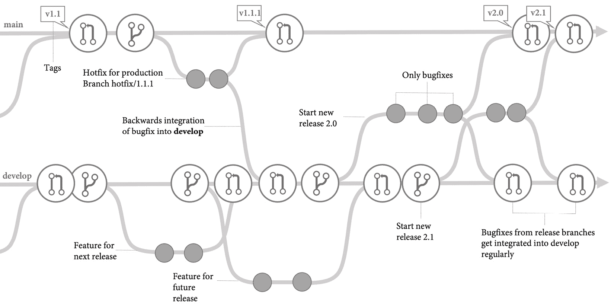
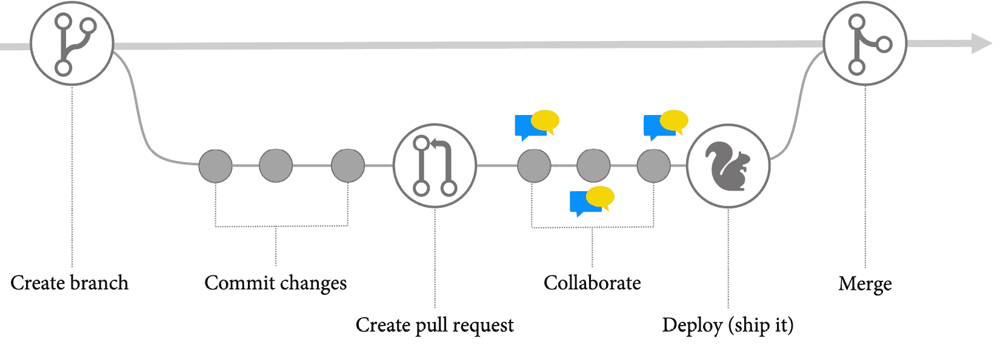
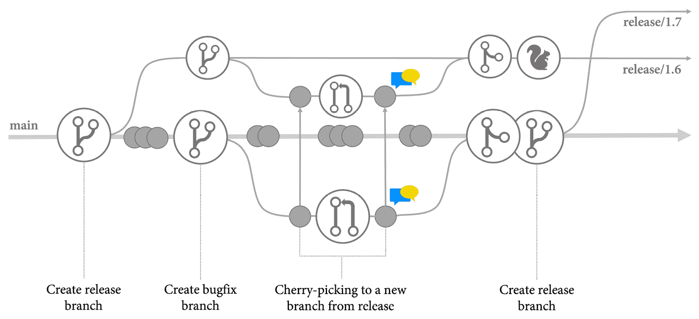
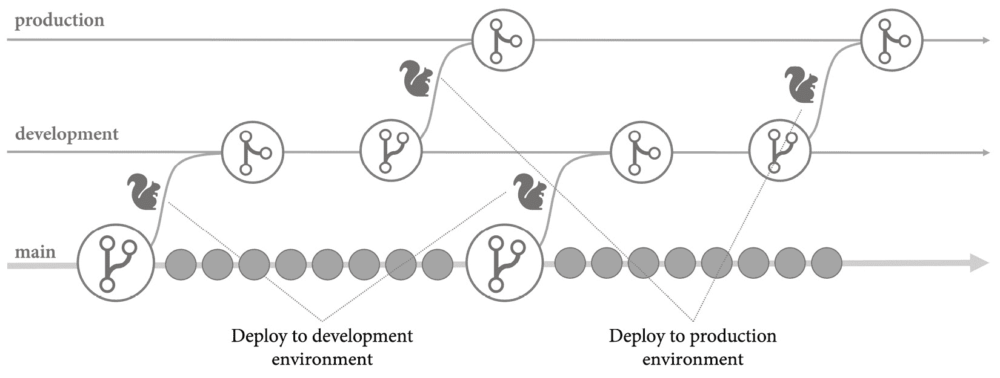
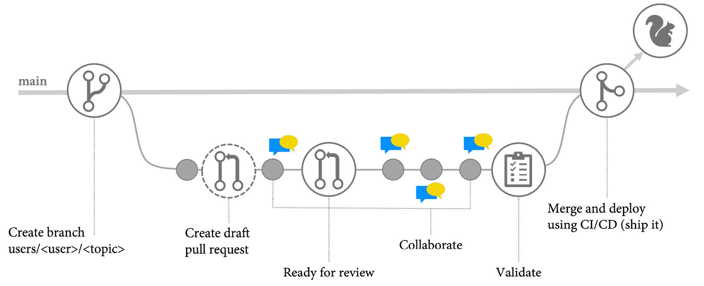
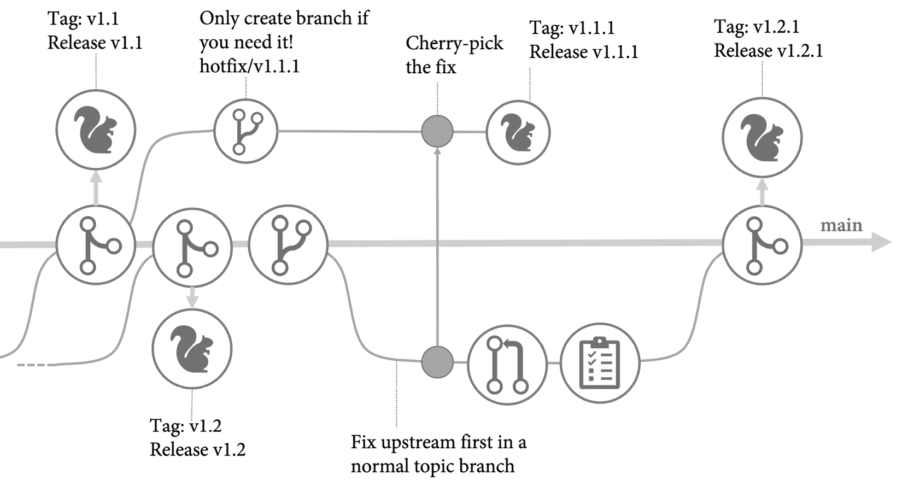

# *第十一章*：基于主干的开发

与加速工程速度高度相关的能力之一是`git` **工作流**，但它实际上是一种自 80 年代以来一直使用的分支模型选择。它定义不够明确，留有很多解释的空间，尤其是在与 GitHub 结合使用时。此外，我个人认为，仅仅转向基于主干的工作流并不会显著提升性能。只有那些在**合并地狱**中困扰的大型团队，才会有显著的影响。对于大多数团队来说，真正有效的是将不同的能力结合起来使用，比如功能标志和**持续集成/持续部署**（**CI/CD**），并与基于主干的工作流配合使用，这才会产生显著的效果。

在本章中，我将解释基于主干的工作流的好处。我们还将讨论它们与其他分支工作流的区别，我将向你介绍我认为是加速软件交付的最佳`git`工作流。

本章涵盖以下主题：

+   基于主干的开发

+   为什么你应该避免复杂的分支

+   其他`git`工作流

+   使用 MyFlow 加速

+   案例研究

# 基于主干的开发

基于主干的开发是一种源代码管理的分支模型，在这种模型中，开发者将小而频繁的更新合并到一个单一的分支（通常称为`git`，常被称为`main`分支），并抵制任何创建长期存在的开发分支的压力（见 https://trunkbaseddevelopment.com）。

其基本理念是，主分支始终保持干净的状态，以便任何开发者在任何时候都能基于主分支创建一个构建成功的新分支。

为了保持分支的干净状态，开发者必须采取多项措施，确保只有不破坏任何东西的代码才能被合并回主分支，具体措施如下：

+   获取主分支的最新更改

+   执行干净测试

+   运行所有测试

+   与团队保持高度凝聚（结对编程或代码审查）

如你所见，这种方式特别适用于保护的主分支和没有分支保护的`main`。在小型、高度凝聚和共同工作的团队中，实践结对编程时，这种方式非常有效，但需要高度的纪律性。在复杂的环境中，或者在分布式、异步工作的团队中，我始终建议使用分支保护和 PR。

# 为什么你应该避免复杂的分支

当我们谈论分支时，我们经常使用长期存在和短期存在这些术语，这些术语涉及时间。我发现这有些误导。分支是关于变更的，而变更几乎无法用时间来衡量。开发人员可以花 8 小时编写大量重构的代码，并试图在 1 天内合并那个非常复杂的分支。即使他们只用时间来衡量，这仍然被认为是短期存在的。相反，如果他们有一个只改变了一行代码的分支——例如，更新代码依赖的包——但是团队必须解决一些关于变更的架构问题，从时间的角度来看，它会是长期存在的，即使在`main`分支上重新基于这些变更会非常简单。

时间似乎不是区分分支好坏实践的最佳衡量标准；它是复杂性和时间的组合。

基础分支从您创建分支到尝试合并您的更改之间发生的更改越多，合并这些变更与您的分支的变更就越困难。复杂性可能来自一个非常复杂的合并，或者来自许多开发人员合并许多小的变更。为了避免合并，许多团队试图在合并回去之前完成功能工作。当然，这会导致更复杂的变更，然后使得其他功能合并变得困难——所谓的**合并地狱**——在发布之前，所有功能必须集成到新版本中。

为了避免合并地狱，你应该定期拉取主分支的最新版本。只要您能够无问题地合并或重新基于，您的分支的集成就不是问题，但如果您的更改变得过于复杂，对其他开发人员来说就是个问题，因为如果您合并您的更改回去，他们可能会遇到问题。这就是为什么在复杂度超过一定程度之前，您应该合并您的更改的原因。复杂性的程度很大程度上取决于您修改的代码，并且您需要考虑以下几点：

+   你是在处理现有代码还是新代码？

+   代码是复杂且具有许多依赖关系，还是简单的代码？

+   您是在处理隔离的代码还是具有高内聚力的代码？

+   同时有多少人改变了代码？

+   同时进行大量代码重构吗？

我认为这就是人们倾向于以时间作为衡量标准而不是复杂性的原因——没有一个好的复杂性衡量标准。因此，作为一个经验法则：如果你在处理更复杂的功能，你应该每天至少将你的更改合并回主分支，但如果你的更改很简单，将你的分支/PR 保持打开更长时间也没有问题。记住，重点不在于时间，而在于复杂性！

# 其他的 git 工作流程

在我们深入研究我认为对使用 GitHub 的 DevOps 团队来说最有效的`git`**工作流程**之前，我想介绍一下最流行的工作流程。

## Gitflow

`git` 如使用标签发布并与合并后会被删除的分支协作（见 *图 11.1*）：



图 11.1 – Gitflow 概览

Gitflow 非常适合那些每几个月向不同客户交付软件、希望将一些特性打包成一个单独授权的新版，并且需要维护多个版本多年的人。在 2010 年，这几乎是所有软件的常见发布流程，但在复杂环境中，这种工作流会引发一些问题。该工作流*不是*基于主干的，并且有多个长期存在的分支。这些分支之间的整合可能会在复杂环境中导致“合并地狱”。随着 DevOps 和 CI/CD 实践的兴起，这种工作流名声不好。

如果你想通过 DevOps 加速软件交付，Gitflow 不是适合你的分支工作流！但很多概念可以在其他工作流中找到。

## GitHub 流程

**GitHub 流程**非常注重与 PR 的协作。你创建一个有描述性名称的分支并进行首次更改。然后，创建一个 PR，通过对代码的评论与评审者进行协作。一旦 PR 准备好，它会被部署到生产环境中，*在*合并到主分支之前（见 *图 11.2*）。



图 11.2 – GitHub 流程

GitHub 流程是基于主干的，且非常流行。基本部分——没有 PR 部署——是大多数其他工作流的基础。问题在于部署。将每个 PR 部署到生产环境会造成瓶颈，且扩展性不佳。GitHub 本身使用 ChatOps 和部署列车来解决这个问题（Aman Gupta, 2015），但对我来说，这似乎有些过度。只有在生产环境中证明有效的变更才会被合并到 `main` 分支上，这个观点很有说服力，但在复杂环境中基本上无法实现。你需要相当长的时间才能确认变更在生产环境中独立运行有效，从而确保它们没有破坏任何东西，但在这段时间里，瓶颈阻止了其他团队或团队成员合并他们的变更。我认为，在一个 DevOps 的世界中，采用 `push` 触发主分支的原则。如果变更破坏了生产环境，你仍然可以部署最后一个有效版本（**回滚**），或者修复错误并立即部署修复（**前进回滚**）。你不需要一个干净的主分支就能执行这两种操作。

我不喜欢 GitHub 流程的另一点是，它对用户数量、分支和 PR 数量不够明确。一个特性分支可能暗示多个开发者会在同一个分支上提交。我并不常看到这种情况，但仅从文档上来看，这并不明确。

## 发布流程

发布流程基于 GitHub 流程，但它不是持续地部署 PR，而是加入了单向的发布分支。这些分支不会被合并回去，bug 修复跟随 `main`，并且变更会被精确挑选合并到发布分支的分支中（Edward Thomson, 2018）。通过这种方式，无法忘记将 bug 修复应用到 `main`（见 *图 11.3*）：



图 11.3 – 发布流程

发布流程不是 CD！创建发布仍然是一个必须单独触发的过程。如果你必须维护软件的不同版本，发布流程是一个不错的选择。但如果可能的话，你应该尝试实现 CD。

## GitLab 流程

GitLab 流程同样基于 GitHub 流程。它增加了环境分支（如开发、预发布、预生产和生产），每次部署都发生在合并到这些环境时（见 *图 11.4*）：



图 11.4 – GitLab 环境分支

由于变更仅向下游流动，你可以确保所有的变更都在所有环境中经过了测试。GitLab 流程同样跟随 `main`，并将变更挑选到所有环境中。Bug 修复在 GitLab 流程中与发布流程中的工作方式相同。

如果你没有支持多个环境的管道——比如 GitHub Actions——GitLab 流程可能提供了一种很好的方式来自动化你的审批和部署到各个环境。就个人而言，如果你在上游执行 bug 修复，我不认为将环境代码分开有什么价值。我更倾向于一次构建代码，然后按顺序将输出部署到所有环境。但在某些情况下，这种工作流是有意义的——例如，对于直接从代码库部署的静态网站。

# 使用 MyFlow 加速

正如你所看到的，`git` 工作流仅仅是为不同使用场景提供的一些解决方案集合。它们之间的主要区别在于是否基于主干，是否在某些方面明确。如果我发现所有工作流都有缺失，我便创建了自己的工作流：**MyFlow**。

MyFlow 是一种基于 PR 的轻量级主干式工作流。MyFlow 并不是一种新发明！许多团队已经在这样工作了。如果你专注于与 PR 的协作，这是一种非常自然的分支和合并方式。我只是给它起了个名字，我相信人们会很容易接受它。

## 主分支

由于 MyFlow 是基于主干的，所以只有一个名为 `main` 的主分支，并且它应该始终保持干净状态。主分支应该始终能够构建，并且应该能够随时发布到生产环境。这就是为什么你应该用分支保护规则来保护 `main`。一个好的分支保护规则至少应该包括以下标准：

+   合并前需要至少两次 PR 审查

+   推送新提交时撤销过时的 PR 审批

+   需要代码所有者的审查

+   在合并之前要求通过状态检查，包括你的 CI 构建、测试执行、代码分析和代码检查工具

+   将管理员包括在限制中

+   允许强制推送

你通过 CI 构建自动化的程度越高，你的分支保持干净的可能性就越大。

所有其他分支总是从`main`分支分出。由于这是默认分支，你在创建新分支时不必指定源分支。这简化了操作并消除了错误的源。

## 私有主题分支

图 11.5 显示了 MyFlow 的基本概念：



图 11.5 – MyFlow 基础

私有主题分支可用于处理新特性、文档、漏洞、基础设施以及你仓库中的其他一切。它们是私有的，意味着它们只属于一个特定用户。其他团队成员可以检出该分支进行测试，但不允许直接推送更改到该分支。相反，他们必须通过 PR 中的`suggestions`建议更改给 PR 的作者。

为了表示分支是私有的，我建议使用一种命名约定，比如`users/*`或`private/*`，这样可以使其一目了然。我还建议在名称中包含**问题标识符**（**ID**）。这样做可以方便日后在提交信息中引用它。一个好的约定可能是这样的：

```
users/<username>/<id>_<topic>
```

要开始处理一个新主题，你需要创建一个新的本地分支，如下所示：

```
$ git switch -c <branch> main
```

你可以在这里看到一个示例：

```
$ git switch -c users/kaufm/42_new-feature main
> Switched to a new branch 'users/kaufm/42_new-feature'
```

创建你的第一次修改并提交，之后推送到服务器。无论你修改了什么都没关系——你可以只是给文件加一个空格。反正以后可以覆盖它。你可以在这里看到一个示例：

```
$ git add .
$ git commit
$ git push --set-upstream origin <branch>
```

现在，这是前面的示例，附加了更多信息：

```
$ git add .
$ git commit -m "New feature #42"
$ git push --set-upstream origin users/kaufm/42_new-feature
```

注意

请注意，我使用**GitHub 命令行界面**（**GitHub CLI**）([`cli.github.com/`](https://cli.github.com/))与 PR 交互，因为我觉得它比使用网页**用户界面**（**UI**）的截图更容易阅读和理解。你也可以使用网页 UI 进行相同的操作。

创建一个 PR 并将其标记为`草稿`，如下所示：

```
$ gh pr create --fill --draft
```

这样，团队就知道你正在处理这个主题。快速查看打开的 PR 列表应能让你清楚地看到团队目前正在处理的主题。

注意

提交更改时，你可以省略`-m`参数，并在默认编辑器中添加多行提交信息。第一行将是 PR 的标题，其余部分将是正文。你也可以在创建 PR 时设置标题（`--title`或`-t`）和正文（`--body`或`-b`），而不是使用`--fill`。

现在，你可以开始在你的主题上工作，并可以使用`git`的全部功能。例如，如果你想向之前的提交添加更改，可以使用`--amend`选项，如下所示：

```
$ git commit --amend
```

或者，如果你想将最后三个提交合并为一个提交，可以运行以下命令：

```
$ git reset --soft HEAD~3
$ git commit
```

如果你想将一个分支中的所有提交合并为一个提交，可以运行以下命令：

```
$ git reset --soft main
$ git commit
```

或者，如果你希望完全自由地重新排列并合并所有提交，可以使用交互式变基，如下所示：

```
$ git rebase -i main
```

要将更改推送到服务器，你可以使用以下命令：

```
$ git push origin +<branch>
```

这是前面示例中已填充分支名称的版本：

```
$ git push origin +users/kaufm/42_new-feature
```

请注意在分支名称前的 `+` 加号。这会导致强制推送，但仅限于特定分支。如果你不想更改分支历史，可以执行正常的 `git push` 操作，并且如果你的分支已得到良好的保护，并且你知道自己在做什么，正常的强制推送可能会更方便，如下所示：

```
$ git push -f
```

如果你希望得到同事对代码的帮助或意见，可以在 PR 评论中提及他们。如果他们想提出更改，他们可以使用 PR 评论中的 `suggestions` 功能。这样，*你* 应用更改，并确保在此之前你的仓库处于干净的状态。

每当你觉得工作已准备好时，可以将 PR 的状态从 `draft` 改为 `ready`，并激活自动合并，方法如下：

```
$ gh pr ready
$ gh pr merge --auto --delete-branch --rebase
```

注意

请注意，我指定了 `--rebase` 作为合并方式。这是一个适合喜欢打造简洁且精确提交历史的小团队的合并策略。如果你更喜欢 `--squash` 或 `--merge`，请相应调整你的合并策略。

你的审阅者仍然可以在评论中提出建议，你可以继续协作。但一旦所有批准和自动化检查完成，PR 将自动合并，且分支将被删除。自动化检查会在 `pull_request` 触发器上运行，可能包括在隔离环境中安装应用程序并运行各种测试。

如果你的 PR 已被合并且分支已被删除，你可以像这样清理本地环境：

```
$ git switch main
$ git pull --prune
```

这将把你当前的分支切换到 `main`，从服务器拉取更改后的分支，并删除已在服务器上删除的本地分支。

## 发布

一旦你的更改合并到 `main`，`main` 上的 `push` 触发器将启动生产环境的部署，不管你是否使用环境或基于环的方式。

如果你需要维护多个版本，可以在工作流中将标签与 `release` 触发器一起使用来部署应用程序，并使用 `GitVersion` 自动生成版本号，如下所示：

```
$ gh release create <tag> --notes "<release notes>"
```

这是一个示例：

```
$ gh release create v1.1 --notes "Added new feature"
```

你还可以利用自动生成发布说明。不幸的是，这个功能目前通过 CLI 不可用。你必须通过 UI 来创建发布，才能使其生效。

由于我们遵循 **上游优先** 原则修复 bug，如果不需要进行热修复，实际上没有必要为每个版本创建发布分支。在你创建发布时生成的标签就足够了。

## 热修复

如果你需要为旧版本提供热修复，可以检出标签并创建一个新的热修复分支，像这样：

```
$ git switch -c <hotfix-branch> <tag>
$ git push --set-upstream origin <branch>
```

以下是一个示例：

```
$ git switch -c hotfix/v1.1.1 v1.1
$ git push --set-upstream origin hotfix/1.1.1
```

现在，切换回 `main` 并修复 `users/kaufm/666_fix-bug` 中的错误。接着，**挑选**带有修复的提交并合并到修复分支，如下所示：

```
$ git switch <hotfix-branch>
$ git cherry-pick <commit SHA>
$ git push
```

你可以使用你想要挑选的提交的**安全哈希算法**（**SHA**）。或者，如果提交是分支的最新提交，你也可以使用分支的名称，如下所示：

```
$ git switch hotfix/v1.1.1
$ git cherry-pick users/kaufm/42_fix-bug
$ git push
```

这将会挑选出主题分支的最新提交。*图 11.6* 展示了如何对旧版本进行热修复：



](img/B17827_11_006.jpg)

图 11.6 – 对旧版本进行热修复

你也可以先将修复合并到 `main` 分支，然后再从那里挑选提交。这样可以确保代码遵循所有分支策略。

你还可以基于修复分支创建一个临时分支并挑选修复，然后通过另一个 PR 合并该修复。这取决于你的环境复杂程度以及主分支和修复分支之间的差异有多大。

## 自动化

如果你的工作流程中有命名约定，那么你可能会非常频繁地使用某些命令序列。为了减少输入错误并简化工作流程，你可以使用 `git` 的 `.gitconfig` 文件在你选择的编辑器中自动化这些命令，像这样：

```
$ git config --global --edit
```

如果 `[alias]` 部分还不存在，添加它，并添加一个别名，像这样：

```
[alias]
```

```
    mfstart = "!f() { \
```

```
        git switch -c users/$1/$2_$3 && \
```

```
        git commit && \
```

```
        git push --set-upstream origin users/$1/$2_$3 && \
```

```
        gh pr create --fill --draft; \
```

```
    };f"
```

这个别名叫做 `mfstart`，在指定用户名、问题 ID 和主题时会被调用，如下所示：

```
$ git mfstart kaufm 42 new-feature
```

它会切换到一个新分支并提交当前在索引中的更改，推送到服务器，并创建一个 PR。

你可以引用单个参数（`$1`，`$2`，……）或使用 `$@` 引用所有参数。如果你想要独立于退出代码串联命令，你必须使用 `;` 来终止命令。如果你只希望第一个命令成功后才执行下一个命令，可以使用 `&&`。请注意，你必须在每一行末尾加上反斜杠（`\`）。这个符号也是用来转义引号的。

你可以添加 `if` 语句来分支你的逻辑，像这样：

```
mfrelease = "!f() { \
```

```
    if [[ -z \"$1\" ]]; then \
```

```
        echo Please specify a name for the tag; \
```

```
    else \
```

```
        gh release create $1 --notes $2; \
```

```
    fi; \
```

```
};f"
```

或者，你可以将值存储在变量中以便稍后使用，像这个示例一样——当前分支名称（`HEAD` 指向的分支）：

```
mfhotfix = "!f() { \
```

```
    head=$(git symbolic-ref HEAD --short); \
```

```
    echo Cherry-pick $head onto hotfix/$1 && \
```

```
    git switch -c hotfix/$1 && \
```

```
    git push --set-upstream origin hotfix/$1 && \
```

```
    git cherry-pick $head && \
```

```
    git push; \
```

```
};f"
```

这些仅仅是示例，自动化依赖于你的工作方式的细节，但它是一个非常强大的工具，可以帮助你提高生产力。

# 案例研究

在自动化发布流程之后，两个试点团队已经注意到生产力大幅提高。**交付时间**和**部署频率**的指标显著上升。

该团队在从 Bitbucket 迁移到 GitHub 之前使用了`git`，并遵循了**Gitflow**作为他们的分支工作流。由于他们的 Web 应用程序可以通过分阶段部署工作流持续发布，他们转向了**基于主干**的工作流，使用 PR 和私有分支，并在合并到主分支后通过 CI/CD 工作流（**MyFlow**）进行部署。为了频繁集成，他们决定使用**功能标志**。由于公司需要在云端和本地管理功能，他们决定选择**Unleash**。团队可以使用**软件即服务**（**SaaS**）服务，且无需等待本地解决方案即可立即开始使用。

第二个从**Team Foundation Server**（**TFS**）迁移过来的团队，习惯于使用复杂的分支工作流，包括长期存在的发布、服务包、热修复分支和集成所有功能的开发分支。由于软件安装在硬件产品上，多个版本会并行稳定，并且有多个版本需要维护多年。这意味着软件不能持续发布。该团队选择了**发布流**来管理发布和热修复。对于开发，他们还使用了带 PR 的私有分支和基于主干的方法。由于这些产品未连接到互联网，团队依赖配置系统来启用功能标志。这项技术之前已经用于在硬件上测试新功能。现在，团队扩展了这一技术，以更频繁地集成更改。

# 总结

`git`工作流彼此之间没有太大差异，大多数工作流都是基于其他工作流构建的。重要的是遵循**快速失败**和**快速前进**的原则，而不是将某个特定工作流视为教条。所有工作流只是最佳实践的集合，你应该根据需要选择合适的部分。

重要的是你更改的大小和合并回去的频率。

始终遵循以下规则：

+   始终从主分支（**基于主干**）分支出你的主题分支。

+   如果你在开发复杂的功能，确保至少**每天提交一次**（使用功能标志）。

+   如果你的更改很简单，只需更改几行代码，你可以让你的 PR 保持开放状态更长时间。但要确保你的**开放 PR**不太多。

只要遵循这些规则，你实际使用的工作流并不那么重要。选择对你有效的部分。

在本章中，你了解了 TBD 的好处，以及如何将其与`git`工作流结合使用，以提高你的工程效率。

在下一章，我将解释如何使用 Shift-left 测试来提高质量并以更大的信心进行发布。

# 进一步阅读

你可以参考本章以下内容，获取更多关于所涵盖主题的信息：

+   *福斯格伦 N.*、*汉布尔 J.*和*金 G.*（2018 年）。*加速：精益软件与 DevOps 的科学：构建和扩展高效能技术组织*（第 1 版）[电子书]。IT 革命出版社。

+   基于主干的开发：[`trunkbaseddevelopment.com`](https://trunkbaseddevelopment.com)

+   Gitflow：*文森特·德里森*（2010 年），*成功的 Git 分支模型*：[`nvie.com/posts/a-successful-git-branching-model/`](https://nvie.com/posts/a-successful-git-branching-model/)

+   *GitLab 流*：[`docs.gitlab.com/ee/topics/gitlab_flow.html`](https://docs.gitlab.com/ee/topics/gitlab_flow.html)

+   *爱德华·汤姆森*（2018 年）。*发布流程：我们如何在 VSTS 团队上进行分支管理*：[`devblogs.microsoft.com/devops/release-flow-how-we-do-branching-on-the-vsts-team/`](https://devblogs.microsoft.com/devops/release-flow-how-we-do-branching-on-the-vsts-team/)

+   *阿曼·古普塔*（2015 年）。*将分支部署到 GitHub.com*：[`github.blog/2015-06-02-deploying-branches-to-github-com/`](https://github.blog/2015-06-02-deploying-branches-to-github-com/)

+   *GitHub 流*：[`docs.github.com/en/get-started/quickstart/github-flow`](https://docs.github.com/en/get-started/quickstart/github-flow)

+   GitHub CLI: [`cli.github.com/`](https://cli.github.com/)
