# *第十二章*：通过左移测试提高质量

**测试**和**质量保证**（**QA**）仍然是大多数公司面临的瓶颈。在本章中，我们将深入探讨 QA 和测试在开发者速度中的作用，以及如何进行左移测试。

本章将涵盖以下主题：

+   使用测试自动化进行左移测试

+   消除不稳定的测试

+   代码覆盖率

+   右移——生产环境中的测试

+   故障注入与混沌工程

+   测试与合规性

+   GitHub 中的测试管理

# 使用测试自动化进行左移测试

如果你实践敏捷开发并尝试频繁发布，那么手动测试就不是一个可扩展的选项。即使你不进行 CI/CD，且仅在一个迭代周期内发布，运行所有必要的回归测试仍然会消耗大量人力、时间和金钱。但是，要做到自动化测试正确并不容易。例如，自动化测试如果由 QA 部门或外包机构创建和维护，*并不*会与更高的工程速度相关联（*Forsgren N., Humble, J., & Kim, G., 2018*, *第 95 页*）。要看到速度上的提升，你需要由团队创建并维护的可靠测试。其背后的理论是，如果开发人员维护测试，他们会生成更多可测试的代码。

每个人都知道一个好的测试组合应该是什么样的：你应该有大量自动化的单元测试（Level 0），较少的集成测试（Level 1），一些需要测试数据的集成测试（Level 2），以及少数功能性测试（Level 3）。这被称为测试金字塔（*见图 12.1*）：

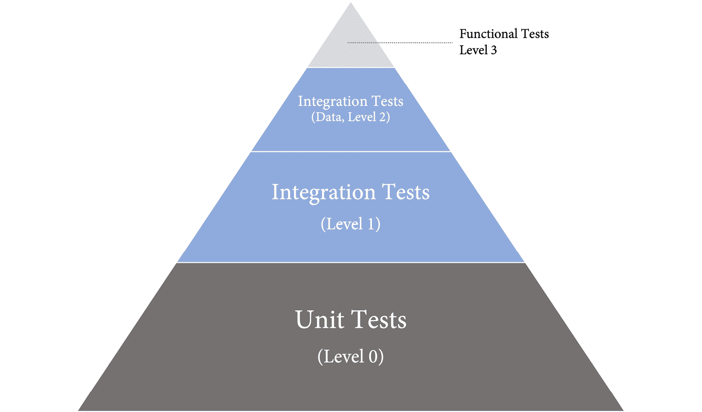

图 12.1 – 测试金字塔

然而，在大多数公司中，测试组合并非如此。有时会有一些单元测试，但其他大多数测试仍然停留在较高的层次（*见图 12.2*）：

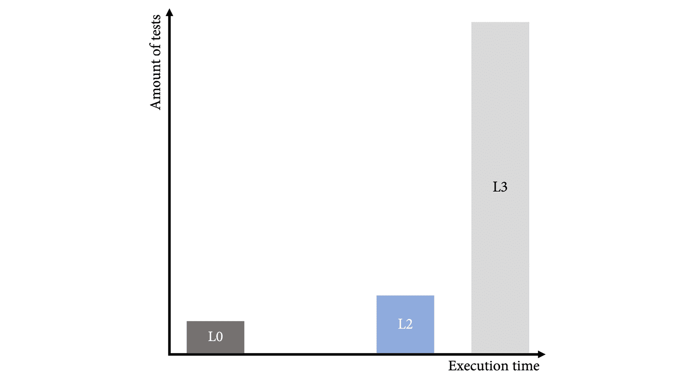

图 12.2 – 示例测试组合

这些高级测试可能是自动化的，也可能是手动的。但即便如此，这也不是一个能帮助你持续高质量发布的测试组合。要实现持续的质量，你必须将测试组合“左移”(*见图 12.3*)：

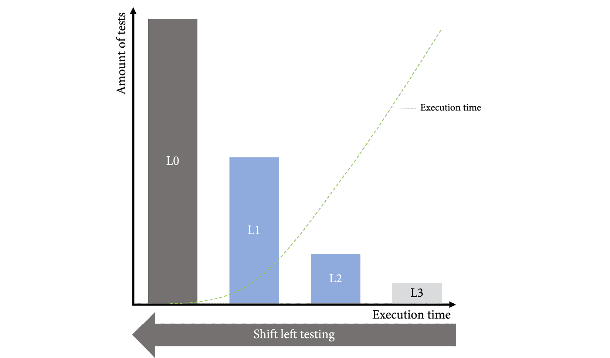

图 12.3 – 左移测试

这不是一项容易的任务。以下是一些有助于左移测试的原则：

+   **所有权**：团队对质量保证（QA）负责，测试与代码一同开发——最好采用先测试后编码的方法。QA 工程师应该成为团队的一部分。

+   **左移**：测试应该始终在可能的最低层次编写。

+   **一次编写，处处执行**：测试应在所有环境中执行，甚至在生产环境中。

+   **测试代码就是生产代码**：适用于普通代码的质量标准同样适用于测试代码。这里不应允许任何捷径。

+   **你写代码 – 你测试它**：作为开发者，你对代码的质量负责，必须确保所有的测试都到位，以确保质量。

2013 年，创建了一个测试宣言，描述了 QA 角色的转变（*Sam Laing, 2015*）：

+   测试贯穿整个过程 *而不是* 在最后进行测试

+   防止错误 *而不是* 发现错误

+   测试理解 *而不是* 检查功能

+   构建最佳系统 *而不是* 破坏系统

+   团队对质量的责任 *而不是* 测试员的责任

听起来很简单，但实际上并非如此。开发人员必须学会像测试员一样思考，而测试员必须学会像工程师一样思考。传达愿景并确保变革的可持续性不是一项容易的任务。

## 测试驱动开发

测试自动化的关键是拥有一个可测试的软件架构。为了实现这一点，你必须尽早开始——也就是说，在内部循环中，当开发人员编写代码时。

**测试驱动开发** (**TDD**) 是一种软件开发过程，你首先编写自动化测试，然后编写使测试通过的代码。它已经存在超过 20 年，并且通过不同的研究证明了其质量效益（例如，*Müller, Matthias M.; Padberg, Frank, 2017* 和 *Erdogmus, Hakan; Morisio, Torchiano, 2014*）。TDD 不仅对调试所花费的时间和整体代码质量有很大影响；它还对稳固和可测试的软件设计产生重要影响。正因如此，它也被称为**测试驱动设计**。

TDD 很简单。步骤如下：

1.  **添加或修改测试**：总是从一个测试开始。在编写测试时，你**设计**你的代码的样子。有时候你的测试不会编译，因为你调用的类和函数还不存在。大多数开发环境支持直接在测试中创建必要的代码。当你的代码编译并且测试可以执行时，这一步就完成了。测试应该失败。如果测试通过，修改它或编写一个新测试，直到它失败。

1.  **运行所有测试**：运行所有测试并验证只有新测试失败。

1.  **编写代码**：编写一些简单的代码使测试通过。在这个阶段，代码不需要很漂亮，允许使用快捷方式。只需确保测试通过。糟糕的代码能让你知道接下来需要什么测试，以确保代码变得更好。

1.  **所有测试通过**：如果所有测试都通过，你有两个选择：编写一个新测试或修改现有的测试。或者，你可以重构你的代码和测试。

1.  **重构**：重构代码和测试。由于你已经拥有了一个可靠的测试框架，你可以进行比通常情况下更加极端的重构，而无需担心没有 TDD 的支持。确保在每次重构后都运行所有的测试。如果有一个测试失败，撤销上一步并重试，直到所有测试在重构后都通过。成功重构后，你可以开始一个新的迭代，进行新的失败测试。

图 12.4 展示了 TDD 循环的概览：

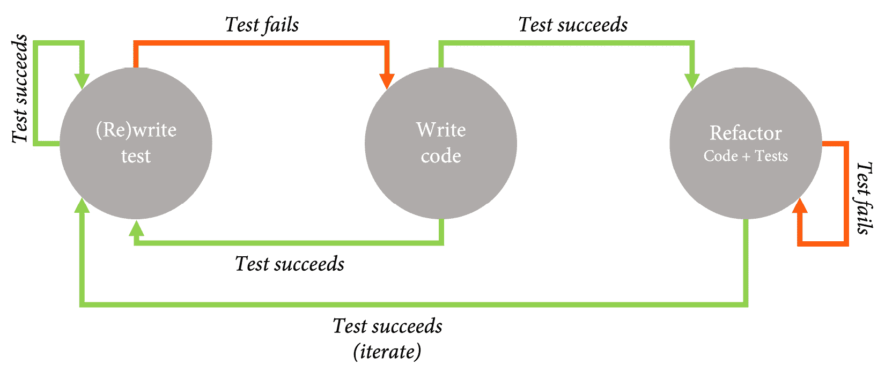

图 12.4 – TDD 循环

一个好的测试遵循以下模式：

+   **安排**：为测试设置必要的对象以及**待测试系统**（**SUT**）本身——通常这是一个类。你可以使用**模拟**和**存根**来模拟系统行为（要了解更多关于模拟和存根的内容，请参考*马丁·福勒，2007*）。

+   **执行**：执行你想要测试的代码。

+   **断言**：验证结果，确保系统的状态符合预期，并确保方法已调用正确的方法，并传递了正确的参数。

每个测试应该是完全自给自足的——也就是说，它不应该依赖于先前测试所操作的系统状态，并且可以在隔离环境下执行。

TDD 也可以用于结对编程，这被称为**乒乓结对编程**。在这种形式的结对编程中，一位开发者编写测试，另一位开发者编写代码使得测试通过。这是一种非常适合结对编程的模式，也是一种很好的方式，帮助年轻的同事理解 TDD 的好处。

TDD 已经存在很久了，并且实践它的团队收获了巨大的价值——然而我遇到过许多没有使用它的团队。有些团队因为他们的代码运行在嵌入式系统上而没有使用 TDD，另一些团队则因为他们的代码依赖于难以模拟的 SharePoint 类而放弃使用它。但这些都只是借口。虽然可能有一些无法测试的管道代码，但当你编写逻辑时，你总是可以先进行测试。

## 管理你的测试组合

使用 TDD，你应该能够迅速得到一个可测试的设计。即使在已有项目的环境中，自动化测试的数量也会迅速增长。问题在于，测试的质量往往不是最优的，而且随着测试库的增长，执行时间会变得非常长，并且测试结果可能会变得不稳定（例如间歇性失败）。最好是有更少但质量更高的测试。长时间的执行会妨碍你快速发布，而不稳定的测试会产生不可靠的质量信号，降低对测试套件的信任（*参见图 12.5*）。随着团队质量保证能力的提升，测试套件的质量会不断提高——即使在首次增长后的测试数量减少：

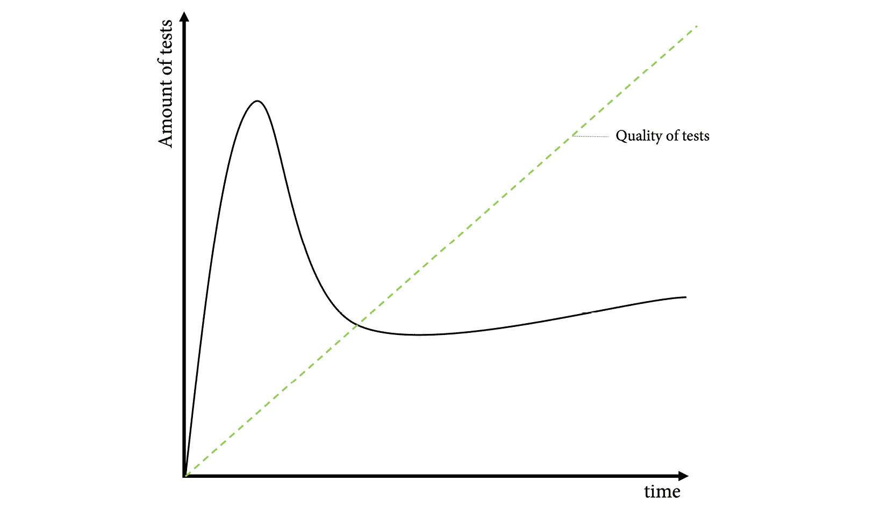

图 12.5 – 自动化测试的数量和质量

为了积极管理你的测试组合，你应该为你的测试定义基本规则，并不断监控测试数量及其执行时间。例如，我们来看微软团队用于其测试组合的**分类法**。

### 单元测试（Level 0）

在这里，我们有的是内存中的单元测试，没有外部依赖，也没有部署。它们应该很快，平均执行时间少于 60 毫秒。单元测试与被测试的代码共同存在。

对于单元测试，你不能更改系统的状态（如文件系统或注册表）、查询外部数据源（如 Web 服务和数据库）或使用互斥锁、信号量、计时器以及`Thread.sleep`等操作。

### 集成测试（Level 1）

这一层涉及更复杂的测试需求，可能依赖于轻量级部署和配置。测试仍然应该非常快速，每个测试必须在 2 秒内完成。

对于集成测试，你不能依赖于其他测试并存储大量数据。你也不能在一个组件中放入太多的测试，因为这会阻止测试并行执行。

### 带数据的功能性测试（Level 2）

功能性测试在可测试的部署环境中运行，并使用测试数据。对像身份验证提供者这样的系统的依赖可以被模拟，从而允许使用动态身份。这意味着每个测试都有一个独立的身份，以便可以在部署环境中并行执行这些测试，且不会互相影响。

### 生产测试（Level 3）

生产测试在生产环境中运行，且需要完全的产品部署。

这只是一个示例，你的分类法可能会有所不同，具体取决于你的编程语言和产品。

如果你已经定义了你的分类法，你可以设置报告并开始转变你的测试组合。确保首先让编写和执行高质量的单元测试和集成测试变得容易。然后，开始分析你的遗留测试——无论是手动测试还是自动化测试——并检查哪些可以丢弃。将其余的转换为良好的功能性测试（*Level 2*）。最后一步是编写你的生产测试。

微软团队从 27,000 个遗留测试（橙色）开始，并在 42 个迭代（126 周）内将其减少为零。大多数测试被替换为单元测试；一些被替换为功能性测试。许多测试直接删除了，但单元测试数量稳步增长，最终超过了 40,000 个（*见图 12.6*）：

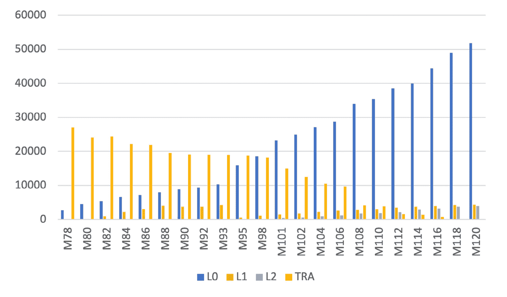

图 12.6 – 测试组合随时间的变化

参见*向左移动以使测试快速且可靠*，在*进一步阅读*部分，了解微软团队如何将其测试组合向左移动。

# 根除不稳定的测试

**非确定性**或**不稳定测试**是那些有时通过、有时失败的测试，即使代码相同（*Martin Fowler, 2011*）。不稳定的测试会破坏对测试套件的信任。这可能导致团队忽略红色测试结果，或者开发人员停用测试，从而降低测试覆盖率和套件的可靠性。

不稳定测试有很多原因。通常，它们是由于缺乏隔离性造成的。许多测试在同一台机器上的同一个进程中运行 —— 所以每个测试必须找到并保持系统的干净状态。另一个常见的原因是异步行为。测试异步代码具有挑战性，因为你无法知道异步任务的执行顺序。其他原因可能包括资源泄漏或对远程资源的调用。

处理不稳定测试的方式有很多种：

+   `git blame`。

+   `git blame`。

一些公司会将不稳定测试隔离，但这样也会阻止你收集额外的数据，因为测试无法运行。最好的做法是继续执行不稳定测试，但将它们从报告中排除。

如果你想了解 GitHub 或 Google 是如何处理不稳定测试的，可以阅读 *Jordan Raine, 2020* 或 *John Micco, 2016*。

# 代码覆盖率

**代码覆盖率**是一个衡量指标（以百分比表示），它计算通过测试调用的代码元素的数量，除以总的代码元素数量。代码元素可以是任何东西，但常见的有代码行、代码块或函数。

代码覆盖率是一个重要的指标，因为它能显示哪些代码部分没有被你的测试套件覆盖。我喜欢在完成代码更改之前查看代码覆盖率，因为我经常忘记为一些边界情况（如异常处理）或更复杂的语句（如 lambda 表达式）编写测试。现在添加这些测试没有问题 —— 但事后再添加就困难得多。

但你不应过于关注绝对数字，因为代码覆盖率本身并不能说明测试的质量。拥有 70%的代码覆盖率且测试质量高，比拥有 90%代码覆盖率但测试质量差更好。根据你使用的编程语言和框架，可能存在一些在测试中耗费大量精力但价值很低的代码。通常，你可以将这些代码排除在代码覆盖率计算之外，这就是为什么代码覆盖率的绝对值是有限的。不过，在每个管道中测量其价值并专注于新代码，有助于随着时间的推移提高自动化测试的质量。

# 向右移动 —— 在生产环境中测试

如果你从自动化测试开始，你会迅速看到质量提升和工程师调试工作的减少。但在某个时刻，你必须大幅增加投入才能看到质量的显著改善。另一方面，测试执行所需的时间会减缓发布管道的速度，尤其是当你将**性能测试**和**负载测试**加入其中时（*见图 12.7*）：

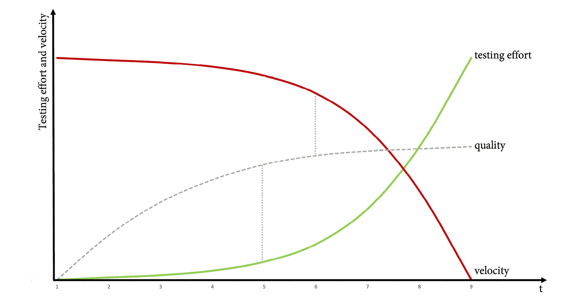

图 12.7 – 测试工作量对质量和速度的影响

如果你的流水线运行时间超过 24 小时，那么一天发布多次是无法实现的！流水线执行时间的增加还会减少你快速推进和部署修复的能力，特别是当生产环境出现 bug 时。

解决这个问题的方法很简单：**向右移**一些测试到生产环境中。所有在生产环境中执行的测试不会影响你快速发布的能力，而且你不需要性能测试或负载测试，因为你的代码已经经历了生产负载。

然而，在生产环境中进行测试有一些前提条件，这些条件能够提高用户的性能质量，而不是降低它。让我们一起来看看。

## 健康数据和监控

对于生产环境中的测试，你必须时刻关注应用程序的健康状况。这超出了普通日志记录的范畴。你需要深入了解应用程序的运行情况。一种好的做法是编写测试代码，调用所有依赖的系统——例如数据库、Redis 缓存或依赖的 REST 服务——并将这些测试结果提供给你的日志解决方案。这样，你可以拥有一个持续的**心跳**，以指示所有系统都在运行并且正常协作。如果测试失败，可以通过警报立即通知团队某些地方出了问题。你还可以自动化这些警报，并触发某些功能，比如启动**熔断器**。

熔断器

**熔断器**是一种模式，防止应用程序反复尝试执行可能失败的操作，使得应用程序能够在不等待失败操作成功的情况下，继续执行经过修改的功能（参见 *Michael Nygard, 2018*）。

## 特性标志和金丝雀发布

你不希望在生产环境中进行测试，从而导致所有客户的完全宕机。这就是为什么你需要特性标志、金丝雀发布、基于环的部署，或者这些技术的组合（参见 *第九章* 和 *第十章*）。逐步暴露变更非常重要，这样如果发生宕机，你就不会让整个生产环境崩溃。

## 业务连续性与灾难恢复

另一种生产环境测试的形式是**业务连续性与灾难恢复**（**BCDR**）或故障转移测试。每个服务或子系统都应该有一个 BCDR，并且你应该定期执行 BCDR 演练。如果系统宕机，而灾难恢复无法正常工作，那是最糟糕的情况。只有定期测试，才能确保它正常工作。

## 探索性测试和可用性测试

测试自动化并不意味着你应该完全放弃手动测试。但手动测试的重点已经从验证功能和每个发布都进行回归测试转移到可用性、快速且高质量的反馈，以及那些通过结构化测试方法难以发现的错误。

**探索性测试**由 Cem Kaner 于 1999 年提出（*Kaner C., Falk J., H. Q. Nguyen, 1999*）。它是一种测试方法，旨在同时关注发现、学习、测试设计和执行。它依赖于测试人员个人发现那些其他测试方法难以发现的缺陷。

有许多工具可以促进探索性测试。它们帮助你记录会话、拍摄带注释的截图，并且通常允许你从已经执行的步骤中创建测试用例。一些扩展与 Jira 集成，如 Zephyr 和 Capture，还有浏览器扩展，如用于 Azure 测试计划的 Test 和 Feedback 客户端。如果以独立模式使用，后者是免费的。这些工具为开发人员提供了来自利益相关者的高质量反馈——不仅仅是关于发现的缺陷。

获取反馈的其他方式包括使用**可用性测试**技术——如**走廊测试**或**游击式可用性测试**——通过在新用户、没有偏见的用户身上测试，来评估你的解决方案。可用性测试的一种特殊形式是 A/B 测试，我们将在*第十九章*，*使用 GitHub 进行实验和 A/B 测试*中详细讨论。

这里的重要部分是，所有这些测试都可以在生产环境中执行。你的 CI/CD 流水线中不应该有任何手动测试。快速发布，并使用功能标志和金丝雀发布允许在生产环境中进行手动测试。

# 故障注入与混沌工程

如果你想提升生产环境中的测试，可以练习**故障注入**——也称为**混沌工程**。这意味着你向生产系统中注入故障，以查看它在压力下的表现，以及你的故障转移机制和断路器是否正常工作。可能的故障包括高 CPU 占用、高内存使用、磁盘 I/O 压力、低磁盘空间，或服务或整个机器被关闭或重启。其他可能的情况包括进程被终止、系统时间被更改、网络流量丢失、延迟注入，以及 DNS 服务器被阻塞。

实践混沌工程能使你的系统更具弹性。这无法与传统的负载或性能测试相比！

不同的工具可以帮助你进行混沌工程。例如，**Gremlin** ([`www.gremlin.com/`](https://www.gremlin.com/)) 是一个基于代理的 SaaS 产品，支持大多数云服务提供商（如 Azure、AWS 和 Google Cloud）以及所有操作系统。它也可以与 Kubernetes 配合使用。**Chaos Mesh** ([`chaos-mesh.org/`](https://chaos-mesh.org/)) 是一个专门为 Kubernetes 设计的开源解决方案。**Azure Chaos Studio** ([`azure.microsoft.com/en-us/services/chaos-studio`](https://azure.microsoft.com/en-us/services/chaos-studio)) 是一个专门为 Azure 设计的解决方案。最适合你的工具取决于你支持的平台。

混沌工程可以非常有效，并使你的系统具备韧性，但它应该仅限于对客户影响较小或没有影响的金丝雀环境。

# 测试与合规性

大多数**合规性**标准，如汽车行业的**ISO26262** 或制药行业的**GAMP**，都遵循**V 模型**作为开发过程。V 模型要求对用户和系统需求进行分解，并在不同的详细层级中创建规格。这是 *V* 的左侧。它还要求验证所有层级，以确保系统满足需求和规格。这是 *V* 的右侧。两个侧面可以在 *图 12.8* 中看到：

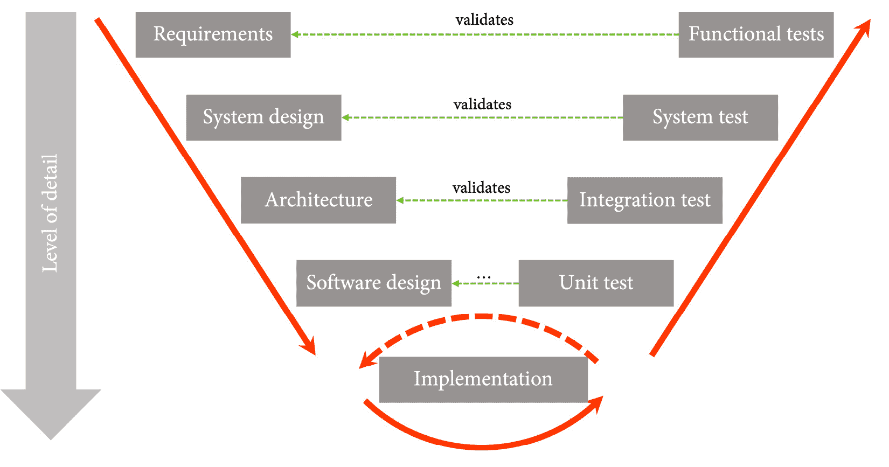

图 12.8 – V 模型中的验证

该模型必须与风险分析结合使用，风险分析在每个细节层级中执行。在发布阶段，许多文档必须签署。这导致了一个缓慢的瀑布流程，包含了较长的规格定义、开发和发布阶段。

但是，标准是基于最佳实践的——如果你的实践优于标准中的实践，你可以在审计中为此辩护。标准并没有要求你手动进行验证，也没有涉及阶段的时间要求。解决方案是自动化所有验证逻辑，并在修改测试时将批准作为代码审查添加到拉取请求中（左移）。不能自动化的测试必须转移到生产环境中（右移）。这样，你可以自动化整个 V 模型并多次执行：

1.  添加或修改需求（例如，问题）。

1.  创建拉取请求并将其链接到问题。

1.  在你的代码库中修改系统设计和架构（例如，在 markdown 中），或在拉取请求中声明无需修改。

1.  编写你的单元测试（即软件设计）和实现代码。

1.  编写或修改你的功能、系统和集成测试。

1.  确保所有必要的角色都批准拉取请求，并在推送新更改时确保批准是过时的。

1.  将你的更改发布到生产环境并在那里运行最终的测试。

你还可以将风险作为代码进行管理。这样，你就可以将它们集成到自动化流程中。如果不能，你仍然可以将文档附加到问题上。这样，你就能对所有的变更、必要的审批和所有完成的验证步骤进行端到端的可追溯性管理。同时，你仍然可以快速迭代并定期发布到生产环境。

# GitHub 中的测试管理

不幸的是，GitHub 没有一个很好的方式来跟踪你随时间变化的测试运行和代码覆盖率，也无法帮助你检测或隔离不稳定的测试。你可以将测试作为工作流的一部分来执行，并将结果反馈给系统——但对于报告，你必须依赖你的测试工具。

一个与 GitHub 很好集成的优秀解决方案是**Testspace**（https://www.testspace.com/）。它是一个 SaaS 服务，开源项目可以免费使用。设置非常简单——只需从市场安装扩展（https://github.com/marketplace/testspace-com），选择你想要的计划，并授予对你的仓库的访问权限。然后，将以下步骤添加到你的工作流中：

```
- uses: testspace-com/setup-testspace@v1
```

```
  with:
```

```
    domain: ${{github.repository_owner}}
```

如果你的仓库是私有的，那么你必须在*Testspace*中创建一个令牌，并将其作为机密添加到该步骤中：`token: ${{ secrets.TESTSPACE_TOKEN }}`。

然后，你必须添加一个步骤，在执行测试后的步骤中，将你的测试和代码覆盖率结果推送到*Testspace*。你可以使用 glob 语法来指定动态文件夹中的文件。确保即使发生错误，也能执行该步骤（`if: '!cancelled()'`）：

```
- name: Push test results to Testspace
```

```
  run: |
```

```
    testspace **/TestResults.xml **/coverage.cobertura.xml
```

```
  if: '!cancelled()'
```

*Testspace* 提供了可靠的检测来处理不稳定的测试。它有一个*构建机器人*，如果有新的结果到达，它会发送通知给你。你可以通过回复邮件来评论结果（*见图 12.9*）：

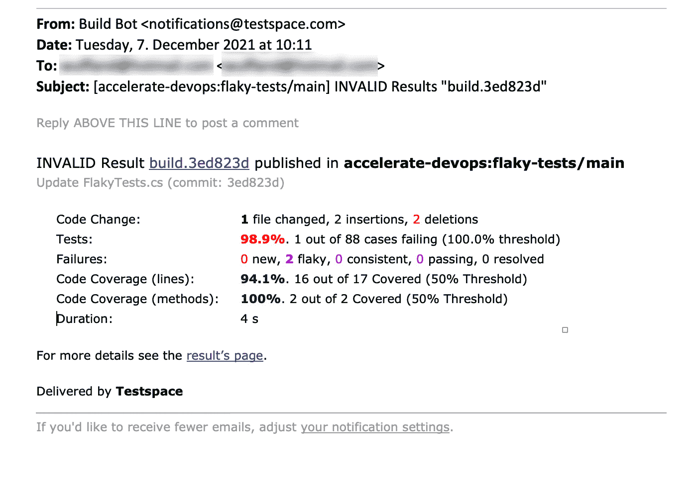

图 12.9 – 来自 Testspace 的构建结果通知

它会自动集成作为拉取请求中的一个检查（*见图 12.10*）：

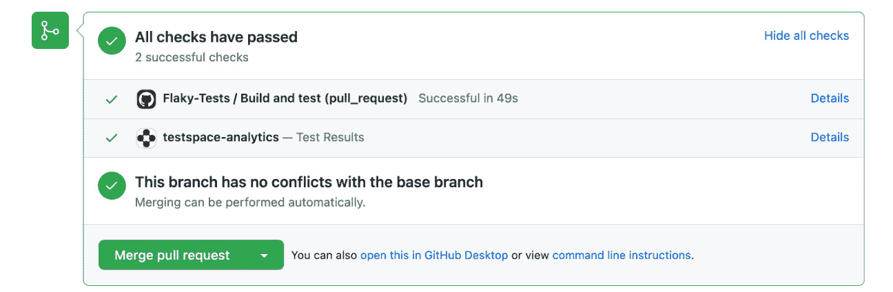

图 12.10 – Testspace 集成到你的拉取请求检查中

*Testspace* 的用户界面看起来并不特别华丽，但它有非常丰富的报告和大量功能（*见图 12.11*）：

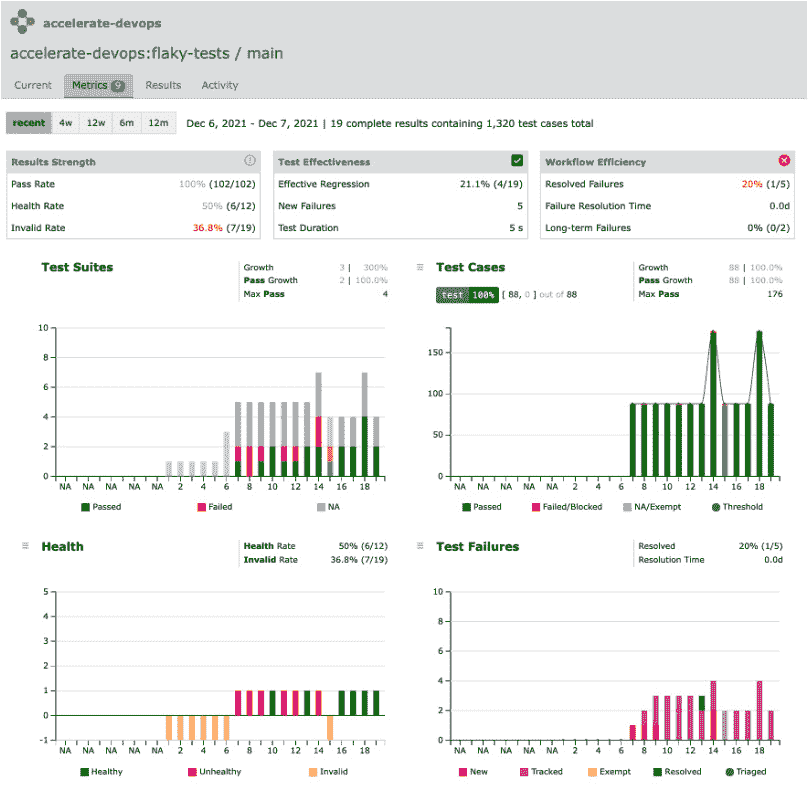

图 12.11 – 你的测试指标的丰富报告

如果你还没有测试管理解决方案，可以尝试*Testspace*。如果你已经有了，它应该很容易集成到你的工作流中。

# 案例研究

**Tailwind Gears**的两个试点团队通过应用 DevOps 实践，取得了显著提高的**交付前置时间**和**部署频率**。由于发布流水线有助于更快地发布修复，**恢复时间均值**也大大改善。然而，**变更失败率**下降了。更频繁的发布意味着更多的部署会失败，且在代码中找出 bug 变得更加困难。来自自动化测试套件的质量信号并不可靠，修复一个 bug 通常会引入另一个模块中的 bug。应用程序中仍有许多部分需要手动测试——但由于团队中只有一名 QA 工程师，这已经不再是一个可行的选项。因此，这些部分中的一些已被 UI 测试替代，而另一些则被直接丢弃。

为了评估测试组合，团队必须引入测试分类法，并在流水线中包括报告。团队中的 QA 工程师负责分类法，报告显示功能性和 UI 测试过多，而单元测试不足。许多工程师仍然不相信 TDD 能够节省时间，也不认为在某些情况下开发嵌入式软件时能够使用 TDD。团队决定一起安排一次 TDD 培训课程，学习并实践 TDD。

之后，所有新代码都以 TDD 编写，并要求新代码的**代码覆盖率**至少达到 90%。团队还将每个迭代中 30%的时间用于消除**不稳定的测试**并重新编写更低层次的测试。

为了发现不稳定的测试，团队在通过绿色测试的流水线上运行可靠性测试。不稳定的测试被优先处理。之后，团队会选择执行时间最长的测试，并决定如何处理每个测试。大多数测试被转换为单元测试，尽管有些被转换为集成测试。有些测试可以被删除，因为它们没有带来额外的价值。

结构化的手动测试完全被**探索性测试**所替代。如果在这些会话中发现任何问题，会在修复之前创建单元测试。

运行 Web 应用程序的团队还增加了一种新的测试类别，其中的测试将在生产环境中执行。他们实现了**应用性能监控**并收集了大量的度量，以便了解应用程序在所有环境中的健康状况。团队还在每个迭代中进行一次首次的 BCDR 演练，开始实施**生产环境中的测试**和**混沌工程**。

# 总结

在本章中，你学到了如何通过测试自动化将测试向左迁移并加速软件交付，随后通过生产中的测试和混沌工程向右迁移。这样，你就可以以快速的节奏发布，而不必在质量上做出妥协。最后，你学到了如何管理你的测试组合，消除不稳定测试，并通过注入故障和混沌使你的应用程序更加具有韧性。

在下一章中，你将学习如何将安全性向左迁移，并将 DevSecOps 实践融入你的开发过程。

# 进一步阅读

本章中使用了以下参考文献，以帮助你进一步了解讨论过的主题：

+   Forsgren N., Humble, J., & Kim, G. (2018). *加速：精益软件和 DevOps 的科学：构建和扩展高效能技术组织*（第 1 版）[电子书]。IT 革命出版社。

+   Eran Kinsbruner (2018)，*DevOps 专业人员的持续测试：来自行业专家的实用指南*（Kindle 版）。CreateSpace 独立出版平台。

+   Sam Laing (2015)，*测试宣言*，[`www.growingagile.co.za/2015/04/the-testing-manifesto/`](https://www.growingagile.co.za/2015/04/the-testing-manifesto/)。

+   Wolfgang Platz, Cynthia Dunlop (2019)，*企业持续测试：为敏捷和 DevOps 转型测试*（Kindle 版），独立出版。

+   Tilo Linz (2014)：*Scrum 中的测试*（电子书），Rocky Nook。

+   Kaner C., Falk J., H. Q. Nguyen (1999)，*计算机软件测试*（第 2 版），Wiley。

+   Roy Osherove (2009)，*单元测试的艺术*（第 1 版），Manning。

+   Martin Fowler (2007)，*模拟对象不是存根* [`martinfowler.com/articles/mocksArentStubs.html`](https://martinfowler.com/articles/mocksArentStubs.html)。

+   Müller, Matthias M.; Padberg, Frank (2017). *关于测试驱动开发的投资回报率*（PDF）。卡尔斯鲁厄大学，德国。

+   Erdogmus, Hakan; Morisio, Torchiano (2014)。*测试优先方法对编程的有效性*。IEEE 软件工程学报，31(1)，2005 年 1 月。（NRC 47445）。

+   *将测试向左迁移，使测试快速且可靠*：https://docs.microsoft.com/en-us/devops/develop/shift-left-make-testing-fast-reliable。

+   Martin Fowler (2011)，*消除测试中的非确定性*，[`martinfowler.com/articles/nonDeterminism.html`](https://martinfowler.com/articles/nonDeterminism.html)。

+   Jordan Raine (2020). *将不稳定的构建减少 18 倍*。[`github.blog/2020-12-16-reducing-flaky-builds-by-18x/`](https://github.blog/2020-12-16-reducing-flaky-builds-by-18x/)。

+   John Micco (2016). *Google 中的不稳定测试及其缓解方法*。[`testing.googleblog.com/2016/05/flaky-tests-at-google-and-how-we.html`](https://testing.googleblog.com/2016/05/flaky-tests-at-google-and-how-we.html)。

+   *右移测试到生产环境*：[`docs.microsoft.com/en-us/devops/deliver/shift-right-test-production`](https://docs.microsoft.com/en-us/devops/deliver/shift-right-test-production)。

+   Michael Nygard（2018）。*发布它！设计与部署生产就绪的软件*（第二版）。O'Reilly。
