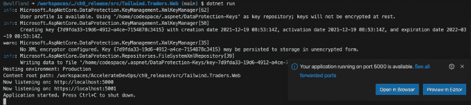

# 第十三章：左移安全与 DevSecOps

报告给**互联网犯罪投诉中心**（**IC3**）的由网络犯罪造成的总损失，已经达到了历史新高，从 2019 年的 35 亿美元（**USD**）增加到 2020 年的 41 亿美元（**USD**）（*IC3*，2019 和 2020 年）。这一趋势在过去几年持续强劲增长（*见图 13.1*）：


图 13.1 – 报告给 IC3 的网络犯罪总损失

受影响的公司包括初创企业，以及*财富 500 强*企业。受影响的有科技巨头如 Facebook、Twitter、T-Mobile 和 Microsoft，也有公共机构如旧金山国际机场，甚至是安全公司如 FireEye。没有公司能够声称网络犯罪对他们没有威胁！

在本章中，我们将更广泛地探讨安全在开发中的角色，以及如何将其融入到你的流程中，并实现零信任文化。

以下是我们将在本章中讨论的关键点：

+   左移安全

+   假设漏洞、零信任和安全优先的思维模式

+   攻击模拟

+   红队-蓝队演练

+   攻击场景

+   GitHub Codespaces

# 左移安全

在传统的软件开发中，安全通常是在下游处理的：当软件准备发布时，安全部门或外部公司会进行安全审查。这个方法的问题在于，到那个时候很难修复架构问题。一般来说，修复安全漏洞越晚，成本就越高；如果不修复漏洞，可能导致数百万的损失，甚至可能导致一些公司破产。在开发生命周期中，越早修复安全漏洞，成本越低（*见图 13.2*）：


图 13.2 – 开发生命周期中修复安全漏洞的成本

这就是我们所说的**左移安全**：将安全融入到开发生命周期中，使其成为所有活动的必要部分。

问题在于，市场上没有足够的安全专家可以将他们安排到每个工程团队中。左移安全就是要通过教育工程师，培养安全优先的思维模式。

# 假设漏洞、零信任和安全优先的思维模式

传统的安全方法是**防止漏洞**。最重要的措施有：

+   **信任层级**：内部网络被认为是安全的，并通过防火墙进行保护。只有公司拥有的设备才能访问网络，并通过**虚拟专用网络**（**VPN**）隧道连接。公众互联网不被信任——两者之间是**非军事区**（**DMZ**）。

+   **风险分析**：通过威胁建模进行风险分析。

+   **安全评审**：来自安全专家的架构和代码审查。

+   **安全测试**：具有特定范围的外部安全测试。

但在防止攻击的方式下，是否公司已经遭受攻击这个问题几乎无法回答。

在 2012 年的一次采访中，前**国家安全局**（**NSA**）和**中央情报局**（**CIA**）局长迈克尔·海登将军表示：

“从根本上说，如果有人想进入，他们就能进入……接受这一点。”

这是假设已被攻破范式的基础：您很可能已经遭到攻击，无论您是否知道。始终假设您已经被攻破。这种思维方式能识别防止攻击方法中的漏洞。您如何做到以下几点？

+   **检测**攻击和渗透？

+   **响应**攻击？

+   **恢复**数据泄漏或篡改？

这改变了安全措施，并增加了全新的重点。在假设已被攻破的范式下，您需要以下内容：

+   一个中央的**安全监控**或**安全信息与事件管理**（**SIEM**）系统，用于检测异常。

+   持续的现场测试您的**事件响应**（**IR**）（**演习**）。

+   战争游戏（**红队-蓝队模拟**）用来发现漏洞、提高意识、学习像攻击者一样思考，并训练响应措施。

+   **现场渗透测试**：包括网络钓鱼、社会工程学和物理安全等复杂的攻击模拟。

+   即使在您的网络中，也不要信任身份和设备（**零信任**）。

如果您的安全主要依赖于防御层次，一旦黑客通过钓鱼、社会工程学或物理攻击进入网络——他们可以轻松向前推进。在一个信任的网络中，通常会发现未保护的文件共享、没有**安全套接字层**（**SSL**）保护的未打补丁的服务器、弱密码以及大多数系统中的**单因素认证**（**SFA**）。在以云为先的世界中，这完全没有意义。

通过零信任访问您的服务，您始终验证身份——例如，通过**多因素认证**（**MFA**），您验证设备、访问权限和参与交易的服务。*图 13.3*展示了如何实现零信任访问您的服务的示例：


图 13.3 – 零信任访问您的公司服务

如果你在公司使用**软件即服务**（**SaaS**）云服务，你可能已经熟悉零信任。你必须使用多因素认证（MFA），但可以信任你的浏览器和设备以提高便利性。如果你出差，你会收到通知或必须批准来自不常见位置的登录尝试。如果你安装第三方应用程序，你必须授予这些应用访问信息的权限，且你可能不能从公共的、不受信任的设备访问高度机密的信息。

零信任意味着对所有服务应用相同的原则，无论你是否从内部网络访问它们。

# 攻击模拟

为了知道在发生事件时该怎么做，你应该定期进行演练，练习你的**标准操作程序**（**SOPs**）以应对 IR 并提高响应时间。就像办公室里的火灾演习一样，如果不进行这些演练，你无法知道你的安全措施在真实火灾发生时是否真的有效。

你应该尝试在以下指标上有所改进：

+   **平均检测时间**（**MTTD**）

+   **平均恢复时间**（**MTTR**）

在这种演练中，你将模拟攻击场景，练习你的 IR 流程，并进行一次**事后分析**，总结演练中的经验教训。

以下是一些攻击场景的例子：

+   服务被妥协

+   内部攻击者

+   远程代码执行

+   恶意软件爆发

+   客户数据被妥协

+   **拒绝服务**（**DoS**）攻击

通过练习这些演练，你可以确认你的 SOP 有效，并在发生真实事件时迅速高效地做出反应。

# 红队-蓝队演练

这些演练的一种特殊形式是**红队-蓝队**演练，也叫**战争游戏**，其中两个团队互相对抗，且都有内部知识。红队是攻击方，试图访问生产系统或窃取用户数据，蓝队则负责防守。如果蓝队检测到攻击并能够阻止它，蓝队获胜。如果红队能够证明他们成功访问了生产系统或窃取了数据，红队获胜。

## 团队构成

与普通攻击模拟的不同之处在于，团队对你的系统拥有的洞察力，因此更容易发现漏洞。红队-蓝队模拟是最复杂的攻击形式，具有最多的洞察力，相比其他所有减少安全风险的努力更具优势（*见图 13.4*）：


图 13.4 – 通过攻击者的洞察力和攻击深度来减少风险

团队应该由来自不同组织单位的成员组成。不要仅仅为红队和蓝队各选一个团队。团队的构成是成功游戏的关键。

对于红队，执行以下任务：

+   使用来自不同团队的创意工程师，这些团队已经对安全感兴趣。

+   添加具有组织内部经验的安全专家，或者寻求外部支持。

对于蓝队，执行以下任务：

+   选择熟悉日志记录、监控和网站可靠性的运维工程师。

+   添加了解网络安全和身份的工程师。

两队都应有向专家求助的可能性。例如，如果红队需要编写**结构化查询语言**（**SQL**）语句来执行复杂的 SQL 注入攻击，他们可以寻求**数据库管理员**（**DBA**）团队的帮助；或者当蓝队需要了解应用程序的内部信息，或者需要应用程序记录额外数据时，可以直接向开发和维护应用程序的团队求助。

## 游戏规则

游戏的主要目标是所有参与者的学习——学习像攻击者一样思考，学习如何检测和响应事件，学习公司中哪些漏洞可能被利用。第二个目标是娱乐。与黑客马拉松类似，这个活动应该是一个团队建设的活动，所有参与者都能感到有趣。

但为了确保游戏的成功而不伤害任何人，你需要一些游戏规则。

### 持续时间

红队与蓝队的演练可能会持续数天、数周甚至数月。选择一个攻击发生的时间段以及攻击本身的持续时间。一个好的起点是 3 周的时间和 3 天的攻击时间。根据需要调整时间。

### 法典和规则

为了让演练成功，你必须建立一些规则和行为准则，参与者必须遵守，具体如下面所述：

+   两队不得造成实际伤害。这也意味着红队不应做超出实现目标所需的事情，且物理攻击应遵循常识（不要骚扰或威胁任何人，不要偷窃同事的钥匙或证件等）。

+   不要透露被攻破人员的姓名。

+   不要让付费客户的服务中断或泄露他们的数据！

+   被攻破的数据必须加密存储和保护，且不能暴露给真实的攻击者。

+   生产系统的安全性不得削弱，不能让客户面临风险。例如，如果红队能够修改源代码，禁用所有生产系统的身份验证，之后在代码中留下注释，并在部署完成后声称获胜。那么，尽管如此，你不能禁用真实客户使用的生产系统的身份验证。

这看起来似乎很显而易见，但如果你有竞争的团队，他们可能会在游戏中过于投入。最好提前阐明这些显而易见的规则。

### 提交物品

游戏结束时，团队提交以下项目：

+   一个待办事项清单，列出必须修复的漏洞。严重漏洞必须立即修复。

+   改进取证和分析能力的待办事项。

+   向整个组织公开演练中的学习成果报告。

记住要让整个过程没有责备，不要暴露出被攻破的人员的名字。

## 从哪里开始

我知道很多人认为红队-蓝队演练只适合成熟度非常高的公司，但我认为红队-蓝队演练是每个公司提高意识、学习和成长的绝佳方式，尤其是在公司还在防止漏洞的发生并认为其内网是安全的情况下。如果你的成熟度不高，攻击会更容易。如果成熟度非常高，攻击需要更加复杂，而且很难成功进行攻击而不造成真正的伤害。

我更倾向于选择红队-蓝队演练而非常规的攻击模拟——它们更有趣，也是更好的学习方式。如果你不知道从哪里开始，可以寻求外部帮助。

如果你在第一次演练中发现了很多问题，而且红队轻松获胜，你可能会考虑更频繁地进行演练。如果没有，每年一次是我看到很多公司成功执行的节奏，但这也很依赖于你的具体情况。

只需完成第一次演练——接下来的进展会自然而然地跟上。

# 攻击场景

大多数人想到的 DevOps 和 DevSecOps 中的第一个攻击场景是利用漏洞执行代码，如**SQL 注入**、**跨站脚本**（**XSS**）或**内存泄漏**，例如**缓冲区溢出**。在*第十四章*《保护你的代码》中，我们将详细了解如何寻找这些漏洞以及如何将这一过程整合到你的交付流水线中。

但是，还有一些更简单的攻击场景，例如以下几种：

+   **未保护的文件共享**和代码库

+   **文本文件**、配置文件和源代码中的机密（例如测试账户、**个人访问令牌**（**PATs**）、连接字符串等）

+   **钓鱼攻击**

钓鱼攻击是一种特别简单的攻击方式。根据 2021 年的一项研究，19.8%的钓鱼邮件接收者点击了邮件中的链接，14.4%下载了附件（见*Terranova 和 Microsoft*，2021），而在定期进行钓鱼攻击演练的公司中，数字大致相同。在我一位客户的公司中，几乎 10%的员工在钓鱼攻击演练期间收到邮件后，点击邮件中的链接并在弹出的登录框中输入了自己的凭证！而这家公司已经进行了多年的钓鱼攻击演练。

网络钓鱼的一个问题是心理效应，叫做**启动效应**。即使你一般知道网络钓鱼攻击的样子以及检测它们的标志，一旦你正在等待某封邮件，或者你认为邮件属于你正在参与的某个情境，你就更容易忽视这些标志。一个好的例子是月底收到的一封钓鱼邮件，声称是来自你**人力资源**（**HR**）部门，内容说你的薪水支付出现了问题。由于是月底，且你在期待薪水，这封邮件看起来并不奇怪。也许之前就曾遇到过问题。也许你刚查过，钱还没到账。它还会制造一定的紧迫感。如果你很急，可能会想尽快解决这个问题，确保薪水按时到账。如果在月末发送这样的钓鱼邮件，那么人们更有可能在整个月内点击类似邮件。另一个例子是共享文档。如果你刚和同事通话，他们说会与您共享一个文件，你可能只是好奇他们为什么选择这种方式，但并不怀疑，因为你本来就期待收到文件。你发送的钓鱼邮件越多，就越有可能有人恰好具备正确的情境，从而让你中招。

一旦攻击者设法攻破了第一个受害者并获得了公司凭证或访问了受害者的机器，局面将完全改变。现在，攻击由**内部攻击者**执行，他们可以从内部地址针对公司中的特定人员进行攻击。这被称为**鱼叉式网络钓鱼**，极其难以检测。

一个好的鱼叉式网络钓鱼目标是管理员或工程师。如果你没有执行**最小特权**用户权限，攻击者可能已经可以访问生产系统，或者已经是域管理员，届时就彻底完蛋了。但如果他们攻破了开发人员的账户，他们同样有多种选择，如下所示：

+   使用`mimikatz`（见 https://github.com/gentilkiwi/mimikatz/wiki）从内存中读取凭证。

+   **测试环境**：许多开发人员可以访问测试环境，通常是作为管理员。攻击者可以登录并使用 mimikatz 窃取其他凭证。

+   **修改代码**：通常只需要一行代码就可以禁用身份验证。攻击者可以尝试修改代码或更改依赖项的版本，将其更改为一个已知存在漏洞并可以被利用的版本。

+   **执行脚本**：如果开发人员可以修改管道代码或在部署过程中执行的脚本，攻击者可以插入在部署期间执行的代码。

这就是为什么在工程领域中，安全性如此重要，必须格外小心的原因。与组织中大多数其他部门相比，攻击面要大得多。

若要从一个已被攻陷的账户获取到域管理员权限，或者至少是具有生产访问权限的管理员权限，你可以使用一个名为**BloodHound**的工具（[`github.com/BloodHoundAD/BloodHound`](https://github.com/BloodHoundAD/BloodHound)）。它支持**Active Directory**（**AD**）和**Azure AD**（**AAD**），并揭示所有隐藏的关系：谁在什么机器上有会话？谁是哪个组的成员？谁是某台机器的管理员？

蓝队和红队都可以使用此工具来分析 AD 环境中的关系。

# GitHub Codespaces

由于开发环境在安全性方面是一个大问题，因此将其虚拟化并为每个产品配置一个专用机器是一个不错的主意。这样，你可以实现最小权限用户权限，工程师们就不需要在自己的机器上使用本地管理员权限了。同时，你还可以限制每个特定产品所需的工具数量，并减少攻击面。

当然，你可以使用传统的**虚拟桌面基础架构**（**VDI**）镜像来实现，但你也可以选择一个更轻量的选项：**开发容器**（请参阅[`code.visualstudio.com/docs/remote/containers`](https://code.visualstudio.com/docs/remote/containers)，这是**Visual Studio Code**（**VS Code**）的一个扩展，建立在其客户端-服务器架构之上）。你可以将 VS Code 连接到正在运行的容器，或实例化一个新的实例。完整的配置存储在代码库中（配置即代码），你可以与团队共享相同的开发容器配置。

**GitHub Codespaces**是开发容器的一种特殊形式，它是一个托管在 Azure 中的虚拟开发环境。你可以选择不同的**虚拟机**（**VM**）规格，范围从 2 核/4 **千兆字节**（**GB**）**随机存取存储器**（**RAM**）/32 GB 存储，到 32 核/64 GB RAM/128 GB 存储。虚拟机的启动时间非常快。默认镜像超过 35 GB，并在不到 10 秒钟内启动！

基础镜像包含了开发 Python、Node.js、JavaScript、TypeScript、C、C++、Java、.NET、`git`、`kubectl`、Gradle、Maven 和`vim`所需的一切。在你的代码空间内部运行`devcontainer-info content-url`，并打开它返回的**统一资源定位符**（**URL**），以查看所有预安装工具的完整列表。

但是你不必使用基础镜像——你可以完全自定义你的代码空间，使用开发容器。你可以通过浏览器中的 VS Code、你本地的 VS Code 实例，或者通过终端使用**安全外壳协议**（**SSH**）来使用代码空间。如果你在代码空间内部运行应用程序，你可以转发端口，从本地机器进行测试。*图 13.5* 展示了 GitHub Codespaces 的架构：


图 13.5 – GitHub Codespaces 架构

你可以在**代码** | **Codespaces** | **新建 Codespace**（*见图 13.6*）下打开例如[`github.com/wulfland/AccelerateDevOps`](https://github.com/wulfland/AccelerateDevOps)的仓库，如果你的帐户已启用 Codespaces。该仓库没有开发容器配置，因此它将加载默认镜像：


图 13.6 – 在 Codespace 中打开仓库

你可以在前面的截图中看到，我已经在`main`分支上运行了一个代码空间。除了创建一个新的代码空间外，我还可以打开已有的代码空间。选择虚拟机大小（*见图 13.7*）：


图 13.7 – 为你的代码空间选择虚拟机大小

在终端中，切换到`ch9_release/src/Tailwind.Traders.Web`目录，并使用以下命令构建并运行应用程序：

```
$ cd ch9_release/src/Tailwind.Traders.Web
$ dotnet build 
$ dotnet run
```

这将启动一个监听`5000`和`5001`端口的 Web 服务器。Codespaces 会自动检测到这一点，并将端口`5000`转发到本地端口。只需点击**在浏览器中打开**，即可在本地浏览器中查看正在你代码空间内运行的应用程序（*见图 13.8*）：



图 13.8 – 将端口转发到你的机器

你还可以在**PORTS**标签中手动添加应该转发的端口，并更改可见性，如果你想与同事共享链接—例如，让他们试用新功能（*见图 13.9*）：


图 13.9 – 在你的代码空间中配置端口转发

如果你想更好地控制开发环境，可以在你的代码空间中创建一个开发容器。通过点击绿色的`Codespaces: 添加开发容器配置文件...`打开 VS Code 中的*命令面板*，然后跟随向导选择要安装的语言和功能。向导会在你仓库的根目录创建一个`.devcontainer`文件夹，并在其中创建两个文件：一个`devcontainer.json`文件和一个`Dockerfile`文件。

`Dockerfile`文件定义了在初始化代码空间时创建的容器。`Dockerfile`文件可以非常简单—只要包含一个`FROM`语句，指示它从哪个基础镜像继承即可。

在`devcontainer.json`文件中，你可以传递镜像创建的参数，可以定义与所有团队成员共享的 VS Code 设置，可以使用默认安装的 VS Code 扩展，还可以在容器创建后运行命令（*见图 13.10*）：


图 13.10 – 示例 Dockerfile 文件和 devcontainer.json 文件

查看 [`code.visualstudio.com/docs/remote/devcontainerjson-reference`](https://code.visualstudio.com/docs/remote/devcontainerjson-reference) 获取关于如何自定义你的 `devcontainer.json` 文件的完整参考资料。

如果你更改了 `Dockerfile` 文件或 `devcontainer.json` 文件，你可以通过打开命令面板并执行 `Rebuild Container` 来重建容器。

如果你在 Codespace 中需要使用机密信息，你可以像处理其他机密一样，在组织或仓库级别的 `settings/secrets/codespaces` 中创建它们。机密信息可以作为环境变量在 Codespace 容器内使用。如果你添加了新的机密信息，你必须停止当前的 Codespace——仅重建容器是不够的。

当然，GitHub Codespaces 不是免费的——你需要为实例的运行时间付费。这些分钟数会每天报告给计费系统，并按月收费。费率取决于虚拟机的大小（*见表 13.1*）：


](img/Table_013.jpg)

表 13.1 – GitHub Codespaces 定价

此外，你需要为所使用的存储付费，每 GB 每月 $0.07。

*如果你关闭浏览器，Codespaces 不会被终止*。如果它们仍在后台运行，你可以更快地连接，但你仍然需要为它们付费。默认的空闲超时为 30 分钟，相当于 4 核机器的 $0.18。这个价格真的很便宜，但毕竟还是花钱的。如果你不再需要它，应该始终停止你的 Codespace。你可以在 **设置** | **Codespaces** 下更改默认的空闲超时。

GitHub Codespaces 不仅在安全方面表现出色——它还可以提高你的入职时间和生产力。GitHub 本身在开发过程中使用它，它将新工程师的入职时间从几天缩短到了不到 10 秒！而且这还是一个几乎有 13 GB 磁盘空间、通常需要 20 分钟才能克隆的仓库（Cory Wilkerson，2021 年）。

Codespaces 可能并不适合所有产品，但对于 Web 应用程序来说，它是未来，它将彻底改变我们管理开发者机器的方式。它还帮助你弥补开发管道中的安全漏洞——你的本地开发机器。

# 总结

在本章中，你已经了解了安全对于开发过程的重要性，以及如何开始**将安全向左转**，并实施**假设被攻破**和**零信任**文化。我介绍了**攻击模拟**和**红队-蓝队**演练，帮助提高对安全的意识，发现漏洞，并练习应急响应（IR）。

我还向你展示了 **GitHub Codespaces** 如何帮助你降低本地开发环境的风险并提高你的生产力。

在下一章中，你将学习如何保护你的代码和软件供应链。

# 深入阅读

你可以使用本章中的以下参考资料获取更多关于所涵盖主题的信息：

+   *IC3* (2020). *2020 年互联网犯罪报告*：[`www.ic3.gov/Media/PDF/AnnualReport/2020_IC3Report.pdf`](https://www.ic3.gov/Media/PDF/AnnualReport/2020_IC3Report.pdf)

+   *IC3* (2019). *2019 年互联网犯罪报告*：[`www.ic3.gov/Media/PDF/AnnualReport/2019_IC3Report.pdf`](https://www.ic3.gov/Media/PDF/AnnualReport/2019_IC3Report.pdf)

+   2020 年的数据泄露：[`www.identityforce.com/blog/2020-data-breaches`](https://www.identityforce.com/blog/2020-data-breaches)

+   2021 年的数据泄露：[`www.identityforce.com/blog/2021-data-breaches`](https://www.identityforce.com/blog/2021-data-breaches)

+   *Terranova* 和 *Microsoft* (2021). *“钓鱼”比赛 - 钓鱼基准全球报告 2021*：[`terranovasecurity.com/gone-phishing-tournament/`](https://terranovasecurity.com/gone-phishing-tournament/)

+   *GitHub Codespaces*：[`docs.github.com/en/codespaces/`](https://docs.github.com/en/codespaces/)

+   `devcontainer.json` *参考资料*：[`code.visualstudio.com/docs/remote/devcontainerjson-reference`](https://code.visualstudio.com/docs/remote/devcontainerjson-reference)

+   *开发容器简介*：[`docs.github.com/en/codespaces/setting-up-your-project-for-codespaces/configuring-codespaces-for-your-project`](https://docs.github.com/en/codespaces/setting-up-your-project-for-codespaces/configuring-codespaces-for-your-project)

+   *Cory Wilkerson* (2021). *GitHub 的工程团队已迁移到 Codespaces*： [`github.blog/2021-08-11-githubs-engineering-team-moved-codespaces/`](https://github.blog/2021-08-11-githubs-engineering-team-moved-codespaces/)
