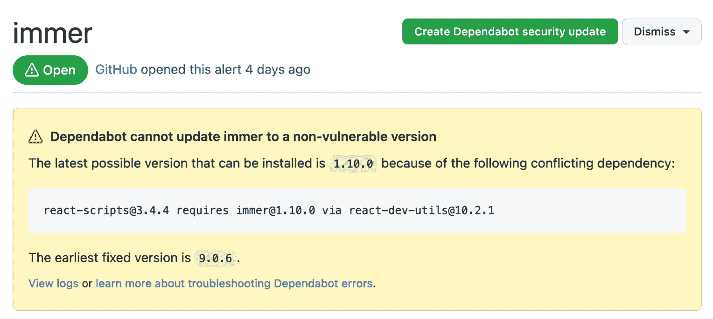
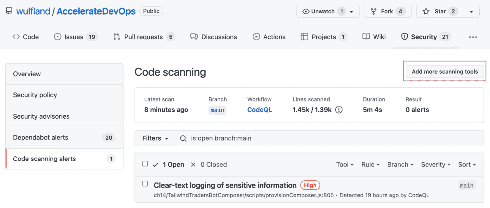
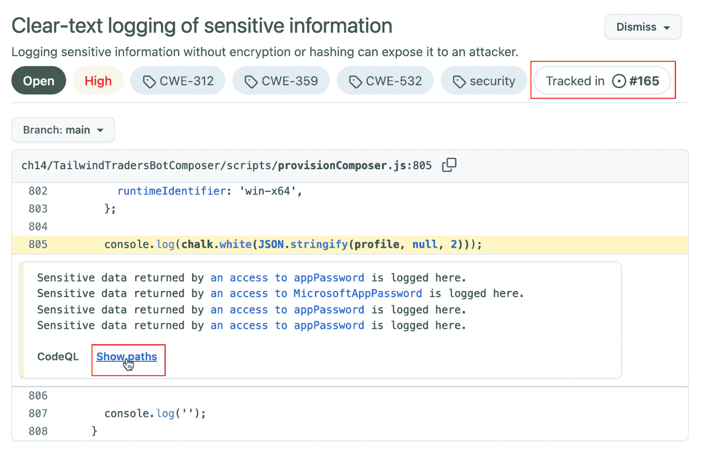

# *第十四章*：保障你的代码安全

2016 年，消息服务 Kik（[`www.kik.com/`](https://www.kik.com/)）与开源贡献者*Azer Koçulu*之间关于*Kik*名称的争执，导致了整个互联网的完全宕机。至少那天每个人都注意到出了问题。发生了什么？由于争执以及 npm 支持消息服务 Kik，Azer 将自己所有的包从 npm 注册表中撤回。撤回的包中包括一个名为`left-pad`的包。这个包的功能是向文本字符串的开头添加字符。`left-pad`是一个只有 11 行代码的简单模块：

```
module.exports = leftpad;
```

```
function leftpad (str, len, ch) {
```

```
  str = String(str);
```

```
  var i = -1;
```

```
  if (!ch && ch !== 0) ch = ' ';
```

```
  len = len - str.length;
```

```
  while (++i < len) {
```

```
    str = ch + str;
```

```
  }
```

```
  return str;
```

```
}
```

这是一个简单的单一功能，每个开发者都应该能够自己编写。然而，这个包却被纳入了全球使用的框架，比如*React*。当然，React 本身并不直接需要这 11 行代码，但它依赖的包又依赖于其他包——而这个依赖树中的某个包就依赖于`left-pad`。这个包的缺失几乎让整个互联网崩溃（参见*Keith Collins 2016*和*Tyler Eon 2016*）。

如今，软件依赖于许多不同的软件——工具、包、框架、编译器和语言——每一个都有自己的依赖树。确保不仅是你自己的代码，整个软件供应链的安全性和许可证合规性都非常重要。

本章中，你将学习如何通过 GitHub Actions 和高级安全功能，帮助你消除代码中的错误和安全问题，并成功管理你的软件供应链。

本章的关键内容如下：

+   依赖管理与 Dependabot

+   秘密扫描

+   代码扫描

+   编写你自己的 CodeQL 查询

    GitHub 高级安全

    本章讨论的许多功能仅在你获得**高级安全许可证**后，才能在 GitHub Enterprise 中使用。其中一些功能对开源项目免费提供——但如果你的组织无法使用某些功能，可能是因为你没有获得相应的许可证。

# 依赖管理与 Dependabot

为了管理你的依赖关系，你可以使用**软件组成分析**（**SCA**）工具。GitHub 提供了**依赖图**、**Dependabot 警报**和**Dependabot 安全更新**来管理你的软件依赖关系。

**依赖图**帮助你了解你的依赖树。**Dependabot 警报**检查你的依赖项是否存在已知漏洞，如果 Dependabot 发现任何问题，它会发出警报。如果你启用**Dependabot 安全更新**，Dependabot 将在依赖包的作者发布漏洞修复后自动创建拉取请求来更新你的依赖项。

依赖图默认对公共仓库启用，但私有仓库则没有启用。Dependabot 的警报和更新必须在所有仓库中启用。你可以在**设置** | **安全性与分析**中完成此操作（见*图 14.1*）：


](img/B17827_14_001.jpg)

图 14.1 – 启用依赖图和 Dependabot

在组织级别，你可以为所有仓库启用这些选项，并将其设为新仓库的默认设置。

## 探索你的依赖关系

如果启用了依赖图，它将开始寻找依赖关系。以下包生态系统是受支持的（参见*表 14.1*）：


表 14.1 – 依赖图和 Dependabot 支持的格式

要探索你的依赖关系，你可以导航到**洞察** | **依赖图**。在**依赖项**标签下，你可以找到仓库中所有的清单文件依赖关系。你可以打开每个依赖项，并浏览树状结构。如果某个依赖项存在已知漏洞，你可以在右侧看到它。漏洞会标明严重性，并且有一个**常见漏洞和暴露**（**CVE**）标识符。通过该标识符，你可以在**国家漏洞数据库**（[nvd.nist.gov](http://nvd.nist.gov)）中查找漏洞详情。点击链接，它会将你引导到数据库中的条目（[`nvd.nist.gov/vuln/detail/CVE-2021-3749`](https://nvd.nist.gov/vuln/detail/CVE-2021-3749)）或**GitHub 安全顾问数据库**（[`github.com/advisories`](https://github.com/advisories)）。如果有修复该漏洞的版本，依赖图会建议你升级到该版本（参见*图 14.2*）：

`


图 14.2 – 使用依赖图探索你的依赖关系

在*组织级别*，在**洞察** | **依赖项**下，你可以找到所有启用了依赖图的仓库中的依赖项。除了仓库的洞察外，你还可以在此处找到所有使用的许可证。这可以帮助你检查产品的许可证合规性（参见*图 14.3*）：


图 14.3 – 组织级别的依赖关系洞察

如果你想利用 GitHub 通知其他依赖你的包的人，你可以在**安全** | **安全顾问** | **新草稿安全顾问**下起草一个新的**安全顾问**。安全顾问包含标题、描述、生态系统、包名称、受影响版本（例如，< 1.2.3）、修复版本（1.2.3）和严重性。你可以选择性地添加多个**常见弱点枚举**（**CWE**）（参见[`cwe.mitre.org/`](https://cwe.mitre.org/)）。如果你已有 CVE ID，可以在此添加；如果没有，你可以选择稍后添加。

草稿在发布之前只对仓库所有者可见。发布后，公共仓库中的安全公告对所有人可见，并会添加到**GitHub Advisory Database**（[`github.com/advisories`](https://github.com/advisories)）。对于私人仓库，只有有权访问仓库的人员可以看到这些公告，且在请求官方 CVE 标识符之前，它们不会被添加到公告数据库中。

## Dependabot

**Dependabot**是 GitHub 中的一个机器人，能够检查你的依赖项是否存在已知漏洞。它还可以自动创建拉取请求，以保持你的依赖项最新。

Dependabot 支持 npm、GitHub Actions、Docker、git 子模块、.NET（NuGet）、pip、Terraform、Bundler、Maven 等多个生态系统。完整的支持列表，请参见 [`docs.github.com/en/code-security/supply-chain-security/keeping-your-dependencies-updated-automatically/about-dependabot-version-updates#supported-repositories-and-ecosystems`](https://docs.github.com/en/code-security/supply-chain-security/keeping-your-dependencies-updated-automatically/about-dependabot-version-updates#supported-repositories-and-ecosystems)。

要启用 Dependabot，在`.github`目录中创建一个`dependabot.yml`文件。你需要选择包生态系统和包含包文件（即`package.json`文件）的目录。你必须指定 Dependabot 是每天、每周还是每月检查更新：

```
version: 2
```

```
updates:
```

```
  - package-ecosystem: "npm"
```

```
    directory: "/"
```

```
    schedule:
```

```
      interval: "daily"
```

你可以使用**Dependabot secrets**对私有注册表进行身份验证。在**Settings** | **Secrets** | **Dependabot**下添加一个新的秘密（见图 14.4**）**：


图 14.4 – 添加 Dependabot 秘密

然后，将注册表添加到`dependabot.yml`文件中，并从`secret`上下文中访问该秘密：

```
version: 2
```

```
registries:
```

```
  my-npm-pkg:
```

```
    type: npm-registry
```

```
    url: https://npm.pkg.github.com
```

```
    token: ${{secrets.PAT}}
```

```
updates:
```

```
  - package-ecosystem: "npm"
```

```
    directory: "/"
```

```
    registries: 
```

```
      - my-npm-pkg
```

```
    schedule:
```

```
      interval: "daily"
```

有许多其他选项可以配置 Dependabot——你可以允许或拒绝某些包，向拉取请求添加元数据（如标签、里程碑和审阅者），自定义提交信息，或者更改合并策略。有关完整选项列表，请参见 [`docs.github.com/en/code-security/supply-chain-security/keeping-your-dependencies-updated-automatically/configuration-options-for-dependency-updates`](https://docs.github.com/en/code-security/supply-chain-security/keeping-your-dependencies-updated-automatically/configuration-options-for-dependency-updates)。

你可以在**Insights** | **Dependency graph** | **Dependabot**下查看 Dependabot 更新的状态。如果有问题，每个更新条目会显示一个状态和警告图标。点击状态查看完整日志（见*图 14.5*）：


图 14.5 – 查看 Dependabot 状态和日志文件

你可以在 **安全** | **Dependabot 警报** 中找到所有的 Dependabot 警报。你可以点击每个项目查看详细信息。如果 Dependabot 已经创建了拉取请求来修复该漏洞，你可以在列表中看到一个带有弹出菜单的链接（参见*图 14.6*）：


图 14.6 – 查看 Dependabot 警报

请注意，这个列表中仅包含安全警报 —— 并不是所有创建的拉取请求都用于更新你的依赖项。这里也有很多尚未修复的安全警报。有时，唯一的修复方法是降级，如果你的某个依赖声明了更高的最低版本，那么就没有自动修复（参见*图 14.7*）：



图 14.7 – 没有修复的漏洞详情

如果你仔细查看 Dependabot 的拉取请求，你会注意到许多附加信息。当然，变更本身只是清单文件中的版本号更新。但在描述中，它会添加包的发布说明 —— 如果有的话 —— 以及新版本中的所有提交的完整列表。Dependabot 还会添加一个兼容性评分，表示该更新与您的代码兼容的可能性有多大（参见*图 14.8*）：


图 14.8 – Dependabot 拉取请求详情

在描述中，你还会找到一份可以通过评论拉取请求发送给机器人的命令列表。你可以使用以下任何一个命令：

+   `@dependabot cancel merge`：取消先前请求的合并。

+   `@dependabot close`：关闭拉取请求，并阻止 Dependabot 重新创建它。你也可以通过手动关闭拉取请求来实现相同的结果。

+   `@dependabot ignore this dependency`：关闭拉取请求，并阻止 Dependabot 为此依赖创建更多拉取请求（除非你重新打开拉取请求或自行升级到该依赖的建议版本）。

+   `@dependabot ignore this major version`：关闭拉取请求，并阻止 Dependabot 为此主版本创建更多拉取请求（除非你重新打开拉取请求或自行升级到该主版本）。

+   `@dependabot ignore this minor version`：关闭拉取请求，并阻止 Dependabot 为此次要版本创建更多拉取请求（除非你重新打开拉取请求或自行升级到该次要版本）。

+   `@dependabot merge`：在你的 CI 测试通过后，合并拉取请求。

+   `@dependabot rebase`：为拉取请求执行变基操作。

+   `@dependabot recreate`：重新创建拉取请求，覆盖对拉取请求所做的任何编辑。

+   `@dependabot reopen`：如果拉取请求已关闭，则重新打开该拉取请求。

+   `@dependabot squash and merge`：在你的 CI 测试通过后，会压缩并合并拉取请求。

只需在拉取请求中的某个命令上评论，Dependabot 会为你处理剩下的工作。

## 使用 GitHub Actions 自动化 Dependabot 更新

你可以使用 GitHub Actions 为 Dependabot 更新添加更多自动化，但需要注意一些事项。如果 Dependabot 触发了一个工作流，则 GitHub 演员是 Dependabot（`github.actor == "Dependabot[bot]"`）。这意味着`GITHUB_TOKEN`默认只有只读权限，若有需要，你必须授予写权限。填充在秘密上下文中的密钥是 Dependabot 的密钥！GitHub Actions 的密钥不能用于工作流。

以下是一个仅在 Dependabot 拉取请求触发时才会启动的工作流示例，并且该工作流会被授予对拉取请求、问题和项目的写权限：

```
name: Dependabot automation
```

```
on: pull_request
```

```
permissions:
```

```
  pull-requests: write
```

```
  issues: write
```

```
  repository-projects: write
```

```
jobs:
```

```
  Dependabot:
```

```
    runs-on: ubuntu-latest
```

```
    if: ${{ github.actor == 'Dependabot[bot]' }}
```

你可以使用`Dependabot/fetch-metadata`动作来提取关于更新依赖的信息。以下是一个示例，使用这些信息为拉取请求应用标签：

```
steps:
```

```
  - name: Dependabot metadata
```

```
    id: md
```

```
    uses: Dependabot/fetch-metadata@v1.1.1
```

```
    with:
```

```
      github-token: "${{ secrets.GITHUB_TOKEN }}"
```

```
  - name: Add label for production dependencies
```

```
    if: ${{ steps.md.outputs.dependency-type == 'direct:production' }}
```

```
    run: gh pr edit "$PR_URL" --add-label "production"
```

```
    env:
```

```
      PR_URL: ${{ github.event.pull_request.html_url }}
```

使用 GitHub CLI，添加自动化非常容易。例如，你可以自动批准并自动合并所有新的修复补丁：

```
- name: Enable auto-merge for Dependabot PRs
```

```
  if: ${{ steps.md.outputs.update-type == 'version-update:semver-patch' }}
```

```
  run: |
```

```
    gh pr review --approve "$PR_URL"
```

```
    gh pr merge --auto --merge "$PR_URL"
```

```
  env:
```

```
    PR_URL: ${{github.event.pull_request.html_url}}
```

```
    GITHUB_TOKEN: ${{ secrets.GITHUB_TOKEN }}
```

GitHub Actions 与 Dependabot 的结合非常强大，可以消除几乎所有手动任务，以保持你的软件最新。结合一个可靠的 CI 构建和测试套件，你基本可以自动合并所有通过测试的 Dependabot 拉取请求。

## 使用 Dependabot 保持你的 GitHub Actions 最新

GitHub Actions 也是你必须管理的依赖项。每个动作都固定在某个版本（`@`后面的部分，例如`uses: Dependabot/fetch-metadata@v1.1.1`）。版本也可以是分支名，但这样会导致工作流不稳定，因为你的动作会在你不知情的情况下发生变化。最好将版本固定为标签或单独的提交 SHA。你可以让 Dependabot 检查更新并为你创建拉取请求，就像其他任何生态系统一样。将以下部分添加到你的`Dependabot.yml`文件中：

```
version: 2
```

```
updates:
```

```
  - package-ecosystem: "github-actions"
```

```
    directory: "/"
```

```
    schedule:
```

```
      interval: "daily"
```

如果有新的版本可用，Dependabot 将创建拉取请求。

# 秘密扫描

最常见的攻击路径之一是纯文本文件中的密钥。密钥绝不应以未加密和未保护的方式存储。GitHub 通过不断扫描你的所有公共仓库中的密钥来帮助你解决这个问题。你还可以为启用了**GitHub 高级安全**的组织中的私有仓库启用此功能。

当前，在公共和私有仓库中，约有 100 个公开的密钥和 145 个私有密钥被检测到——包括 Adobe、阿里巴巴、亚马逊、Atlassian、Azure 等。完整的列表请参见[`docs.github.com/en/code-security/secret-scanning/about-secret-scanning`](https://docs.github.com/en/code-security/secret-scanning/about-secret-scanning)。

作为服务提供商，您可以加入 **秘密扫描合作伙伴计划** （参见 [`docs.github.com/en/developers/overview/secret-scanning-partner-program`](https://docs.github.com/en/developers/overview/secret-scanning-partner-program)）。您的秘密将通过正则表达式检测，然后发送到一个端点，在那里您可以验证秘密是真实的还是误报。合作伙伴决定是撤销秘密还是仅通知客户秘密已泄露。

您可以在 **设置** | **安全与分析** | **GitHub 高级安全** 中为私有存储库启用秘密扫描。在这里，您还可以通过点击 **新模式** 定义自定义模式（参见 *图 14.9*）：


图 14.9 – 启用秘密扫描并添加自定义模式

自定义模式是匹配您想要检测的秘密的正则表达式。您必须提供一些测试字符串以查看您的模式是否有效。GitHub 标记在测试字符串中找到的秘密为黄色（参见 *图 14.10*）：


图 14.10 – 添加自定义秘密模式

您还可以在秘密之前和之后自定义模式，并且可以添加必须匹配或不匹配的模式 – 例如，您可以使用额外模式 (`[A-Z]`) 强制字符串至少包含一个大写字母（参见 *图 14.11*）：


图 14.11 – 自定义模式的高级选项

自定义模式也可以在组织和企业级别定义，GitHub 将扫描启用了 GitHub 高级安全的企业或组织中的所有存储库。

当检测到新的秘密时，GitHub 根据用户的通知偏好通知所有具有存储库安全警报访问权限的用户。如果您正在关注存储库，已启用安全警报或存储库上的所有活动的通知，并且是包含秘密的提交的作者，则会收到警报，并且不会忽略存储库。

您可以在 **安全** | **秘密扫描警报** 下管理警报（参见 *图 14.12*）：


图 14.12 – 管理秘密扫描警报

如果在 GitHub 上提交了一个秘密，即使它只提交到了私有存储库，也应该认为该秘密已经泄露。请更换并撤销秘密。一些服务提供商会为您撤销它。

您可以使用 `Revoked`、`False positive`、`Used in tests` 或 `Won't fix` 状态关闭警报（参见 *图 14.13*）：


图 14.13 – 管理秘密扫描警报的状态

你还可以通过向`.github`文件夹添加`secret_scanning.yml`文件，排除源代码中的路径进行秘密扫描。该文件支持使用通配符的多个路径模式：

```
paths-ignore:
```

```
  - "tests/data/**/*.secret"
```

但要小心！这不应当用于在源文件中存储真实的秘密，即使是为了测试——应该将秘密存储为 GitHub 加密的秘密，或存储在安全的保险库中。

秘密扫描很简单——你基本上只需要启用它。但安全的重要性不容低估。

# 代码扫描

要在自己的代码中查找漏洞，可以使用**静态应用程序安全测试**（**SAST**）。SAST 被认为是白盒测试，因为它可以完全访问源代码。它不仅仅是静态代码分析，通常静态分析包括构建软件。但与**动态应用程序安全测试**（**DAST**）不同——我们将在*第十五章*《保护你的部署》中学习更多——它不是在运行时执行，而是在编译时执行。

## GitHub 中的代码扫描

在 GitHub 中，SAST 被称为**代码扫描**，并且对所有公共仓库以及启用了 GitHub 高级安全的私有仓库都可用。你可以使用支持**静态分析结果交换格式**（**SARIF**）的所有工具进行代码扫描。SARIF 是基于 JSON 的**OASIS 标准**，定义了静态分析工具的输出格式。GitHub 代码扫描目前支持**SARIF 2.1.0**，这是该标准的最新版本（见 https://docs.github.com/en/code-security/code-scanning/integrating-with-code-scanning/sarif-support-for-code-scanning）。因此，任何支持 SARIF 2.1.0 的工具都可以集成到代码扫描中。

## 运行代码扫描

代码扫描使用 GitHub Actions 执行分析。大多数代码扫描工具会自动将结果上传到 GitHub——但如果你的代码扫描工具不这样做，你可以使用以下操作上传任何 SARIF 文件：

```
- name: Upload SARIF file
```

```
  uses: github/codeql-action/upload-sarif@v1
```

```
  with:
```

```
    sarif_file: results.sarif
```

该操作接受单个`.sarif`（或`.sarif.json`）文件，或者包含多个文件的文件夹。如果你的扫描工具不支持 SARIF，但结果可以转换，这很有用。例如，`ESLint`。你可以使用`@microsoft/eslint-formatter-sarif`将输出转换为 SARIF 并上传结果：

```
jobs:
```

```
  build:
```

```
    runs-on: ubuntu-latest
```

```
    permissions:
```

```
      security-events: write
```

```
    steps:
```

```
      - uses: actions/checkout@v2
```

```
      - name: Run npm install
```

```
        run: npm install
```

```
      - name: Run ESLint
```

```
        run: node_modules/.bin/eslint build docs lib script spec-main -f node_modules/@microsoft/eslint-formatter-sarif/sarif.js -o results.sarif || true
```

```
      - uses: github/codeql-action/upload-sarif@v1
```

```
        with:
```

```
          sarif_file: results.sarif
```

然而，大多数代码扫描工具已原生集成到 GitHub 中。

## 入门

要开始使用代码扫描，请转到`/security/code-scanning/setup`，这里会显示代码扫描选项的列表。顶部是 GitHub 原生的代码扫描工具——**CodeQL 分析**。但 GitHub 还会分析你的仓库，展示它可以在市场中找到的其他工具，这些工具适用于在你的仓库中检测到的语言——**42Crunch**、**Anchore**、**CxSAST**、**Veracode** 等等。在本书中，我们将重点介绍**CodeQL**——但其他工具的集成方式相同。如果你点击**设置此工作流**，GitHub 将为你创建一个工作流（见*图 14.14*）：


图 14.14 – 设置代码扫描

如果你已经设置了代码扫描，你可以通过点击**添加更多扫描工具**来从结果页面添加额外的工具（见*图 14.15*）：



图 14.15 – 仓库中的代码扫描警报

工作流模板包含`push`、`pull_request`和`schedule`的触发器。可能会对`schedule`感到意外，但它有一个简单的解释——可能有新的规则检测到代码库中之前未曾识别的漏洞。因此，定期运行构建是一个不错的选择。触发器每周在随机的一天和时间运行一次。当然，GitHub 不希望所有代码扫描在同一时间运行。根据需要调整时间表：

```
on:
```

```
  push:
```

```
    branches: [ main ]
```

```
  pull_request:
```

```
    branches: [ main ]
```

```
  schedule:
```

```
    - cron: '42 16 * * 2'
```

工作流需要对安全事件具有写权限：

```
jobs:
```

```
  analyze:
```

```
    name: Analyze
```

```
    runs-on: ubuntu-latest
```

```
    permissions:
```

```
      actions: read
```

```
      contents: read
```

```
      security-events: write
```

CodeQL 支持 C++（`cpp`）、C#（`csharp`）、Go、Java、JavaScript、Python 和 Ruby。GitHub 会尝试检测你仓库中使用的语言，并设置矩阵，使每种语言独立构建。如有必要，可以添加额外的语言：

```
strategy:
```

```
  fail-fast: false
```

```
  matrix:
```

```
    language: [ 'csharp', 'javascript' ]
```

分析本身相当简单——检查仓库，初始化给定语言的分析，运行`autobuild`，并执行分析：

```
steps:
```

```
- name: Checkout repository
```

```
  uses: actions/checkout@v2
```

```
- name: Initialize CodeQL
```

```
  uses: github/codeql-action/init@v1
```

```
  with:
```

```
    languages: ${{ matrix.language }}
```

```
- name: Autobuild
```

```
  uses: github/codeql-action/autobuild@v1
```

```
- name: Perform CodeQL Analysis
```

```
  uses: github/codeql-action/analyze@v1
```

`autobuild`步骤尝试构建你的源代码。如果失败，你需要更改工作流并手动构建代码。有时，仅仅在环境中设置正确的版本就足够了——例如，Node.js 或 .NET 的版本：

```
- name: Setup Node
```

```
  uses: actions/setup-node@v2.5.0
```

```
  with:
```

```
    node-version: 10.16.3  
```

## 代码扫描警报

你可以在每个仓库的**设置** | **安全与分析** | **代码扫描**下管理代码扫描警报——正如你在*图 14.15*中看到的。在组织级别，你可以看到所有仓库的概览，并跳转到各个结果页面（见*图 14.16*）：


图 14.16 – 组织的安全概述

你可以像处理问题一样过滤、排序和搜索警报。

### 严重性

每个代码扫描警报都有一个分配的严重性。严重性是使用**常见漏洞评分系统**（**CVSS**）计算的。CVSS 是一个用于沟通软件漏洞特征和严重性的开源框架（有关更多信息，请参见*GitHub 博客 2021*）。

严重性有助于你筛查警报。

### 在问题中追踪警报

跟踪代码扫描警报的最佳方式是在问题中。你可以通过点击警报中的**创建问题**来创建一个问题（参见*图 14.17*）：


图 14.17 – 从代码扫描警报创建问题

但这只是打开一个新问题，并将警报的链接添加到 Markdown 任务列表中（参见*图 14.18*）：


图 14.18 – 将问题与代码扫描警报关联

警报会有一个指示器，表明它正被追踪在一个问题中——就像嵌套问题那样（参见下面的*图 14.19*）。

### 数据流分析

在代码下方区域，你可以看到代码中的警报详细信息。CodeQL 支持**数据流分析**，可以检测由数据流通过应用程序时产生的问题。点击**显示路径**以查看数据如何在应用程序中流动（参见*图 14.19*）：



图 14.19 – 代码扫描警报的详细信息

你可以跟踪整个应用程序中的数据流。在此示例中，你可以看到 12 个步骤，其中数据被分配并传递，直到被记录（参见*图 14.20*）：


图 14.20 – 示例数据流

这就是 CodeQL 的真正力量。它不仅仅是对源代码的语义分析。

### CodeQL 查询

在代码扫描警报中，你可以找到触发问题的查询引用。点击**查看源代码**以在 GitHub 上查看该查询（参见*图 14.21*）：


图 14.21 – CodeQL 查询是开源的

这些查询是开源的，你可以在[`github.com/github/codeql`](https://github.com/github/codeql)找到它们。每种语言都有一个文件夹，在 CodeQL 文件夹中，你可以在 `ql/src` 下找到查询。查询的文件扩展名为 `.ql`。

### 时间线

代码扫描警报还包含一个具体的时间线和 git blame 信息——问题首次被检测到的时间和提交？何时以及在哪里被修复？是否重新出现？这些信息有助于你进行警报筛查（参见*图 14.22*）：


图 14.22 – 代码扫描警报的时间线

## 拉取请求集成

代码扫描与拉取请求集成良好。代码扫描结果集成到拉取请求检查中，详情页面显示结果概览（见*图 14.23*）：


图 14.23 – 拉取请求中的代码扫描结果

代码扫描还会在代码中为警报添加评论，你可以直接在此对结果进行分级，修改状态为**误报**、**已用于测试**或**不修复**（见*图 14.24*）：


图 14.24 – 拉取请求源中的代码扫描评论

你可以在**设置** | **安全性与分析** | **代码扫描**下定义哪些警报严重性会导致拉取请求因安全问题和其他发现而失败（见*图 14.25*）：


图 14.25 – 配置导致拉取请求失败的严重性级别

拉取请求集成帮助你保持主分支的清洁，并在合并之前检测问题，使代码分析成为审核过程的一部分。

## 代码扫描配置

有很多选项可以配置代码扫描。工作流中的`init` CodeQL 操作有一个名为`queries`的参数。你可以使用它选择默认查询集之一：

+   `security-extended`：比默认查询更低严重性的更多查询

+   `security-and-quality`：来自`security-extended`的查询，以及可维护性和可靠性查询

```
- name: Initialize CodeQL
```

```
  uses: github/codeql-action/init@v1
```

```
  with:
```

```
    languages: ${{ matrix.language }}
```

```
    queries:  security-and-quality
```

你还可以使用`queries`参数添加自定义查询。该参数接受本地路径或对其他仓库的引用，包括 Git 引用（`branch`、`tag` 或 `SHA`）。添加加号以将查询添加到默认查询之上：

```
  with:
```

```
    queries: +.github/codeql/custom.ql,org/repo/query.ql@v1
```

`packs` 参数：

```
  with:
```

```
    packs: +.github/codeql/pack1.yml,org/repo/pack2.yml@v1
```

重要提示

**CodeQL 包**在写作时仍处于测试阶段。有关包的更多信息，请参见[`codeql.github.com/docs/codeql-cli/about-codeql-packs/`](https://codeql.github.com/docs/codeql-cli/about-codeql-packs/)。

你还可以使用配置文件，例如`./.github/codeql/codeql-config.yml`：

```
- uses: github/codeql-action/init@v1
```

```
  with:
```

```
    config-file: ./.github/codeql/codeql-config.yml
```

如果上述内容位于另一个私有仓库中，则可以添加一个访问令牌，用于加载查询、包或配置文件：

```
    external-repository-token: ${{ secrets.ACCESS_TOKEN }}
```

在配置文件中，你通常会禁用默认查询并指定自己的查询。你还可以排除特定路径。以下是一个示例 – `codeql-config.yml`：

```
name: "Custom CodeQL Configuration"
```

```
disable-default-queries: true
```

```
queries:
```

```
  - uses: ./.github/codeql/custom-javascript.qls
```

```
paths-ignore:
```

```
  - '**/node_modules'
```

```
  - '**/test'
```

你的自定义查询集（`custom-javascript.qls`）可以导入其他查询集（`javascript-security-extended.qls`），并从*CodeQL 包*（`codeql-javascript`）中排除特定规则：

```
- description: "Custom JavaScript Suite"
```

```
- import: codeql-suites/javascript-security-extended.qls
```

```
  from: codeql-javascript
```

```
- exclude:
```

```
    id:
```

```
      - js/missing-rate-limiting
```

你还可以添加单个查询（`- query : <查询路径>`）、多个查询（`-queries: <文件夹路径>`）或查询包（`- qlpack: <包名称>`）。

CodeQL 非常强大，你有很多选项可以精细调整配置。详情请参见 [`docs.github.com/en/code-security/code-scanning/automatically-scanning-your-code-for-vulnerabilities-and-errors/configuring-code-scanning`](https://docs.github.com/en/code-security/code-scanning/automatically-scanning-your-code-for-vulnerabilities-and-errors/configuring-code-scanning)。

# 编写你自己的 CodeQL 查询

CodeQL 附带了许多开箱即用的查询，尤其是如果你使用 `security-and-quality` 套件。但 CodeQL 的完整功能会在你开始编写自己的查询时展现。当然，这并不简单。CodeQL 是一种复杂的查询语言，如果你查看 [`github.com/github/codeql`](https://github.com/github/codeql) 上的一些查询，你会发现它们可能相当复杂。但如果你熟悉你的编程语言，编写一些简单的查询应该相当容易。

要编写 CodeQL 查询，你需要 **Visual Studio Code**（**VS Code**）和 **GitHub CodeQL 扩展**（[`marketplace.visualstudio.com/items?itemName=GitHub.vscode-codeql`](https://marketplace.visualstudio.com/items?itemName=GitHub.vscode-codeql)）。

如果你已经安装了两者，克隆起始工作区：

```
$ git clone --recursive https://github.com/github/vscode-codeql-starter.git
```

注意 `--recursive` 参数！如果你忘记它，你将不得不手动加载子模块：

```
$ git submodule update --remote
```

在 VSCode 中，从起始工作区选择 `vscode-codeql-starter.code-workspace` 文件。

要从你的源代码创建数据库，你需要 **CodeQL CLI**。在 Mac 上，你可以通过 Homebrew 安装它：

```
$ brew install codeql
```

对于其他平台，你可以在此处下载二进制文件：[`github.com/github/codeql-cli-binaries/releases/latest.`](https://github.com/github/codeql-cli-binaries/releases/latest)

将它们提取到一个文件夹中，并将其添加到 `$PATH` 变量中（在 Windows 上为 `%PATH%`）。

现在，进入你想存储数据库的文件夹并运行以下命令：

```
$ codeql database create <database name> \
  --language=<language> \
  --source-root=<path to source code>
```

这将为你的仓库中的语言创建一个数据库。对仓库中的所有语言重复此步骤。

现在，在 VSCode 中打开 QL 扩展并点击 **数据库** | **从文件夹中导入**。选择你在上一步骤中创建的数据库。你可以附加多个数据库并在它们之间切换（见 *图 14.26*）：


图 14.26 – 将数据库附加到 VSCode CodeQL 扩展

你可以在起始工作区中找到所有支持语言的示例查询（`codeql-custom-queries-<language>/example.ql`）。查询文件中有一个带有元数据的注释头：

```
/**
```

```
 * @name Empty block
```

```
 * @kind problem
```

```
 * @problem.severity warning
```

```
 * @id javascript/example/empty-block
```

```
 */ 
```

然后，它们导入必要的模块。这些模块通常以语言命名（`javascript`、`csharp`、`java` 等），但也可能是类似 `DataFlow::PathGraph` 这样的名称：

```
import javascript
```

查询本身有一个变量声明，一个可选的 `where` 块来限制结果，以及 `select` 语句：

```
from BlockStmt b
```

```
where 
```

```
  b.getNumStmt() = 0
```

```
select b, "This is an empty block."
```

查看 GitHub 上的 CodeQL 示例，了解如何开始。你对某种语言了解得越深，写查询就越容易。以下查询会搜索 C# 中的空 catch 块：

```
import csharp
```

```
from CatchClause cc
```

```
where
```

```
  cc.getBlock().isEmpty()
```

```
select cc, "Poor error handling: empty catch block."
```

在 VSCode 中，你拥有完整的 IntelliSense 支持（见 *图 14.27*），这在编写查询时非常有帮助：


图 14.27 – VSCode 中的 IntelliSense

如果你从上下文菜单中运行查询（**CodeQL: 运行查询**），它将在结果窗口中显示结果（见 *图 14.28*）：


图 14.28 – CodeQL 查询结果

`select` 子句中的每个元素都有一个列。你可以点击代码元素，VSCode 会在准确的位置打开相应的源文件。

你完全可以写一本关于 CodeQL 的书。这只是一个非常简短的介绍，但我认为能够使用你自己的规则扩展代码扫描是非常有价值的。

查看 CodeQL 文档和语言参考，获取更多信息。

# 总结

在本章中，你已经学会了如何保护你的代码并控制你的依赖关系：

+   你已经了解了 SCA，并且知道如何使用依赖关系图、Dependabot 警报和 Dependabot 安全更新来管理你的软件依赖。

+   你已经了解了秘密扫描，它可以防止秘密信息在源代码中泄露。

+   你已经学会了 SAST，并且知道如何使用 CodeQL 或其他支持 SARIF 的工具进行代码扫描，在开发过程中就发现问题。现在你可以编写自己的查询，以执行质量和编码标准。

在下一章，我们将看看如何保护我们的发布管道和部署。

# 进一步阅读

这是本章中的一些参考资料，你也可以用来进一步了解这些主题：

+   *如何一个程序员通过删除一小段代码打破了互联网*，*Keith Collins*（2016）：[`qz.com/646467/how-one-programmer-broke-the-internet-by-deleting-a-tiny-piece-of-code/`](https://qz.com/646467/how-one-programmer-broke-the-internet-by-deleting-a-tiny-piece-of-code/)

+   *Kik, Left-Pad, 和 NPM – 哦，天哪！*，*Tyler Eon*（2016）：[`medium.com/@kolorahl/kik-left-pad-and-npm-oh-my-e6f216a22766`](https://medium.com/@kolorahl/kik-left-pad-and-npm-oh-my-e6f216a22766)

+   *每一步都要安全：什么是软件供应链安全，为什么它很重要？*，*Maya Kaczorowski*（2020）：[`github.blog/2020-09-02-secure-your-software-supply-chain-and-protect-against-supply-chain-threats-github-blog/`](https://github.blog/2020-09-02-secure-your-software-supply-chain-and-protect-against-supply-chain-threats-github-blog/)

)

+   *关于依赖关系图*：[`docs.github.com/en/code-security/supply-chain-security/understanding-your-software-supply-chain/about-the-dependency-graph`](https://docs.github.com/en/code-security/supply-chain-security/understanding-your-software-supply-chain/about-the-dependency-graph)

)

+   *关于 Dependabot 版本更新*：[`docs.github.com/en/code-security/supply-chain-security/keeping-your-dependencies-updated-automatically/about-Dependabot-version-updates`](https://docs.github.com/en/code-security/supply-chain-security/keeping-your-dependencies-updated-automatically/about-Dependabot-version-updates)

)

+   *关于密钥扫描*：[`docs.github.com/en/code-security/secret-scanning/about-secret-scanning`](https://docs.github.com/en/code-security/secret-scanning/about-secret-scanning)

+   *关于 GitHub 高级安全性*：[`docs.github.com/en/get-started/learning-about-github/about-github-advanced-security`](https://docs.github.com/en/get-started/learning-about-github/about-github-advanced-security)

)

+   *关于代码扫描*：[`docs.github.com/en/code-security/code-scanning/automatically-scanning-your-code-for-vulnerabilities-and-errors/about-code-scanning`](https://docs.github.com/en/code-security/code-scanning/automatically-scanning-your-code-for-vulnerabilities-and-errors/about-code-scanning)

+   *CodeQL 代码扫描：安全警报的新严重性级别*，GitHub 博客（2021）：[`github.blog/changelog/2021-07-19-codeql-code-scanning-new-severity-levels-for-security-alerts/`](https://github.blog/changelog/2021-07-19-codeql-code-scanning-new-severity-levels-for-security-alerts/)

)

+   *通用漏洞评分系统（CVSS）*：[`www.first.org/cvss/v3.1/specification-document`](https://www.first.org/cvss/v3.1/specification-document)

+   *CodeQL 文档*：https://codeql.github.com/docs/

+   *QL 语言参考*：[`codeql.github.com/docs/ql-language-reference`](https://codeql.github.com/docs/ql-language-reference)
