# *第十五章*：保障你的部署安全

在本章中，我们将讨论如何保障整个部署和发布流水线的安全，超越代码和依赖关系，能够快速、安全、合规地将软件交付到安全环境中并满足监管要求。

本章我们将涵盖以下主要内容：

+   容器和基础设施安全扫描

+   自动化基础设施变更过程

+   源代码和基础设施的完整性

+   动态应用安全测试

+   强化发布流水线的安全

# 容器和基础设施安全扫描

近年来最引人注目的黑客事件之一是**SolarWinds**，这是一家为网络和基础设施监控提供系统管理工具的软件公司。攻击者成功地在**Orion**软件中植入了后门，该软件被推出到超过 30,000 个客户中，并通过这个后门使其遭到入侵。客户中包括国土安全部和财政部（*Oladimeji S., Kerner S. M., 2021*）。

SolarWinds 攻击被视为一起软件供应链攻击，这对安装了被入侵版本的 Orion 客户来说是事实。但对 Orion 的攻击远比单纯更新一个受感染的依赖要复杂，攻击者获得了 SolarWinds 网络的访问权限，并成功在 SolarWinds 的构建服务器上安装了一个名为**Sunspot**的恶意软件。Sunspot 将后门**Sunburst**插入到 Orion 的软件构建中，通过替换源文件而不触发任何构建失败或其他可疑输出（*Eckels S., Smith J., & Ballenthin W., 2020*）。

该攻击展示了如果你的网络被入侵，内部攻击是多么致命，并且强调了保障整个生产线安全的重要性——不仅仅是代码、依赖关系和开发环境。构建服务器和所有其他参与软件生产的系统必须保持安全。

## 容器扫描

容器在今天的每个基础设施中都扮演着重要角色。与传统的**虚拟机**（**VMs**）相比，容器有许多优点，但也存在一些缺点。容器需要一种新的运营文化，现有的流程和实践可能并不完全适用（见 *Souppaya M., Morello J., & Scarfone K., 2017*）。

容器由许多不同的层组成，像软件依赖一样，这些层可能会引入漏洞。为了检测这些漏洞，可以使用所谓的**容器漏洞分析**（**CVA**），也叫做**容器安全分析**（**CSA**）。

GitHub 本身并没有内建的 CVA 工具，但几乎所有的解决方案都可以很好地与 GitHub 集成。

一个非常受欢迎的开源容器镜像和文件系统漏洞扫描器是 Anchore 提供的**grype**([`github.com/anchore/grype/`](https://github.com/anchore/grype/))。它非常容易集成到你的 GitHub Actions 工作流中：

```
- name: Anchore Container Scan
```

```
  uses: anchore/scan-action@v3.2.0
```

```
  with:
```

```
    image: ${{ env.REGISTRY }}/${{ env.IMAGE_NAME }}
```

```
    debug: true
```

另一个 CVA 扫描器的例子是**Clair**([`github.com/quay/clair`](https://github.com/quay/clair))，它是一个开源解决方案，用于对 Docker 和**开放容器倡议**（**OCI**）容器中的漏洞进行静态分析。Clair 可以作为一个容器运行，并将扫描结果存储在 Postgres 数据库中。请查看[`quay.github.io/clair/`](https://quay.github.io/clair/)以获取完整的文档。

有商业化的容器扫描工具，通常是更全面安全平台的一部分。例如，**Aqua**的**容器安全**([`www.aquasec.com/products/container-security/`](https://www.aquasec.com/products/container-security/))就是一个例子。**Aqua 平台**([`www.aquasec.com/aqua-cloud-native-security-platform/`](https://www.aquasec.com/aqua-cloud-native-security-platform/))是一个云原生安全平台，适用于容器化、无服务器和基于虚拟机的应用程序。Aqua 可以作为 SaaS 或者自托管版本运行。

另一个例子是**WhiteSource**([`www.whitesourcesoftware.com/solution-for-containers/)`](https://www.whitesourcesoftware.com/solution-for-containers/))。他们在 GitHub 市场中提供了**GP 安全扫描**操作，用于在将镜像推送到 GitHub Packages 之前进行扫描([`github.com/marketplace/actions/gp-security-scan`](https://github.com/marketplace/actions/gp-security-scan))。

这两个都是很好的解决方案，但由于它们价格不菲且与 GitHub 的高级安全功能有很大重叠，因此我这里不会详细介绍。

## 基础设施策略

并非所有与基础设施相关的内容都是容器。从安全角度来看，还有更多的事项需要考虑，特别是在云环境中。

如果你使用的是云服务提供商，值得查看他们的安全组合。例如，Microsoft Azure 包含了 Microsoft **Defender for Cloud**，这是一款**云安全姿态管理**（**CSPM**）工具，用于保护多云和混合环境中的工作负载，并查找云配置中的薄弱环节([`azure.microsoft.com/en-us/services/defender-for-cloud`](https://azure.microsoft.com/en-us/services/defender-for-cloud))。它支持 Microsoft Azure、AWS、Google Cloud Platform 以及本地工作负载（通过 Azure Arc）。Microsoft Defender for Cloud 中的一些功能对于 Microsoft Azure 是免费的——但并非全部。

Microsoft Azure 还包含了 **Azure Policy** ([`docs.microsoft.com/en-us/azure/governance/policy/`](https://docs.microsoft.com/en-us/azure/governance/policy/))，这是一个帮助你强制执行标准并评估合规性的服务。它允许你定义某些规则作为策略定义，并按需评估这些策略。此示例位于一个每天早上 8 点运行的 GitHub Action 工作流中：

```
on:
```

```
  schedule:
```

```
    - cron:  '0 8 * * *'
```

```
jobs:
```

```
  assess-policy-compliance:
```

```
    runs-on: ubuntu-latest
```

```
    steps:
```

```
    - name: Login to Azure
```

```
      uses: azure/login@v1
```

```
      with:
```

```
        creds: ${{secrets.AZURE_CREDENTIALS}}
```

```
    - name: Check for resource compliance
```

```
      uses: azure/policy-compliance-scan@v0
```

```
      with:
```

```
        scopes: |
```

```
          /subscriptions/<subscription id>
```

```
          /subscriptions/<...>
```

与 AI 驱动的 **安全信息和事件管理**（**SIEM**）系统 **Microsoft Sentinel** ([`azure.microsoft.com/en-us/services/microsoft-sentinel`](https://azure.microsoft.com/en-us/services/microsoft-sentinel)) 一起，这是一个非常强大的安全工具链。但是否适合你取决于你的设置。如果你的主要云提供商不是 Azure，那么你对 CSPM 和 SIEM 的选择可能完全不同，**AWS 安全中心**可能更适合你。

一个很棒的开源工具，用于确保 **基础设施即代码**（**IaC**）的安全性是 **Checkov** ([`github.com/bridgecrewio/checkov`](https://github.com/bridgecrewio/checkov))，这是一个静态代码分析工具，扫描使用 **Terraform**、**Terraform plan**、**CloudFormation**、**AWS 无服务器应用程序模型**（**SAM**）、**Kubernetes**、**Dockerfile**、**Serverless** 或 **ARM 模板** 提供的云基础设施，并检测安全性和合规性错误配置。它内置了超过 1000 个针对不同平台的策略。它在 GitHub 中非常易于使用，只需在工作流中使用 **Checkov GitHub Action** ([`github.com/marketplace/actions/checkov-github-action`](https://github.com/marketplace/actions/checkov-github-action)) 并指向包含你基础设施的目录：

```
- name: Checkov GitHub Action
```

```
  uses: bridgecrewio/checkov-action@master
```

```
  with:
```

```
    directory: .
```

```
    output_format: sarif
```

该操作支持 SARIF 输出，并可以集成到 GitHub 的高级安全功能中：

```
- name: Upload SARIF file
```

```
  uses: github/codeql-action/upload-sarif@v1
```

```
  with:
```

```
    sarif_file: results.sarif
```

```
  if: always()
```

结果会显示在 **Security** | **Code scanning** 警报下（见 *图 15.1*）：

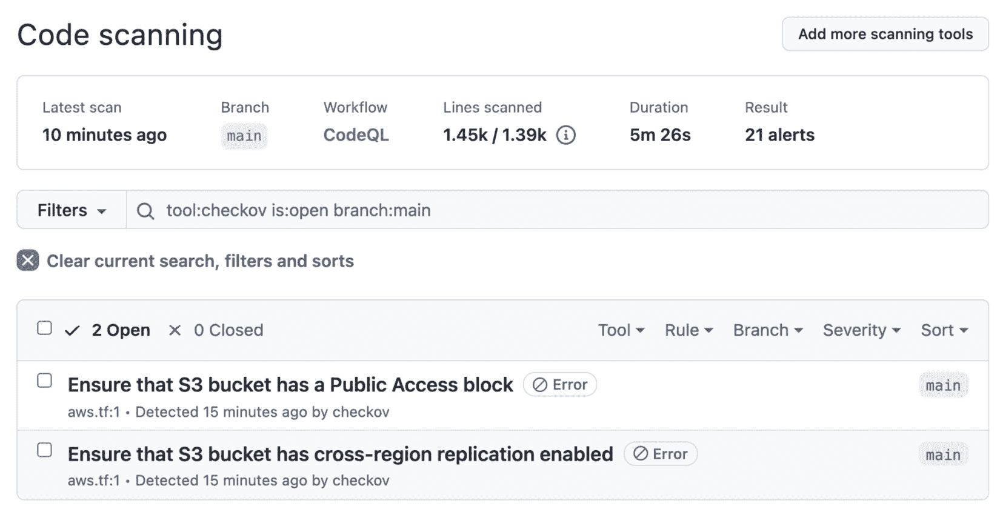

图 15.1 – GitHub 中的 Checkov 结果

Checkov 非常适合检查你的 IaC，但它并不会检查你的基础设施变更。不过，如果你使用的是 Terraform 或 ARM 等解决方案，你可以定期在工作流中运行验证，以确保没有发生变化。

# 自动化基础设施变更过程

大多数 IT 组织都有变更管理流程，以降低操作和安全风险。大多数公司遵循 **信息技术基础设施库**（**ITIL**）。在 ITIL 中，你需要通过 **变更请求**（**RFC**）并由 **变更咨询委员会**（**CAB**）批准。问题在于，CAB 的批准往往与不良的软件交付表现有关（见 *Forsgren N., Humble, J., & Kim, G., 2018*）。

从安全角度来看，**变更管理**和**职责分离**非常重要，而且通常也是合规性要求的一部分。关键是要以 DevOps 方式重新思考这些基本原则。

使用基础设施即代码（IaC）和完全自动化的部署，所有基础设施变更都有完整的审计记录。如果你对过程有完全控制，最好的做法是将 CAB 设置为`CODEOWNERS`，并在拉取请求中进行审批。对于应用层的简单标准变更（例如 Kubernetes 集群中的容器），同行评审可能就足够了。对于更深层次的基础设施变更，涉及网络、防火墙或机密的，审查人员的数量会增加，并且你可以相应地增加专家。这些文件通常也存在于其他代码库中，不会影响开发人员的效率，也不会拖慢发布速度。

如果你受限于企业流程，这可能并不容易。在这种情况下，你需要尝试重新分类你的变更，使大部分变更获得预批准，并为这些变更使用同行评审和自动化检查，以确保安全。然后，为高风险变更自动化该过程，以便为 CAB 提供尽可能完整和准确的信息，以便快速审批（见*Kim G., Humble J., Debois P. & Willis J., 2016, Part VI*，*第二十三章*）。

# 源代码和基础设施的完整性

在制造业中，提供**物料清单**（**BOM**）是生产订单的常规做法。BOM 是一个包含原材料、子组件、中间组件、子部件和用于制造最终产品的零件的清单。

软件领域也有类似的概念：**软件物料清单**（**SBOM**），但它仍然较为少见。

## SBOM

如果你仔细观察软件供应链攻击，例如`npm`包，SBOM 可以帮助进行法医分析，并且可以用来比较不同版本的哈希值。

在`MsBuild.exe`中。为了帮助防止和调查这类攻击，你需要扩展 SBOM，包含构建过程中的所有工具和构建机器上所有正在运行的进程的详细信息。

SBOM 有多种常见格式：

+   **软件包数据交换**（**SPDX**）：SPDX 是一个开放标准的 SBOM，起源于 Linux 基金会。它最初是为了许可证合规性，但也包含版权、安保参考和其他元数据。SPDX 最近被批准为 ISO/IEC 标准（*ISO/IEC 5962:2021*），并且它符合 NTIA 的*软件物料清单的最小元素*要求。

+   **CycloneDX**（**CDX**）：CDX 是一个轻量级的开源格式，起源于**OWASP**社区。它经过优化，旨在将 SBOM 生成集成到发布流水线中。

+   **软件标识**（**SWID**）标签：SWID 是一种 ISO/IEC 行业标准（*ISO/IEC 19770-2*），由各种商业软件发布商使用。它支持自动化软件库存、对机器上软件漏洞的评估、缺少补丁的检测、配置检查清单评估、软件完整性检查、安装和执行白名单/黑名单等安全和操作性用例。它是进行构建机器上安装的软件库存的一个很好的格式。

每种格式有不同的工具和使用场景。**SPDX** 是由 **syft** 生成的。你可以使用 **Anchore SBOM Action**（见 [`github.com/marketplace/actions/anchore-sbom-action`](https://github.com/marketplace/actions/anchore-sbom-action)）为 Docker 或 OCI 容器生成 SPDX SBOM：

```
      - name: Anchore SBOM Action
```

```
        uses: anchore/sbom-action@v0.6.0
```

```
        with:
```

```
          path: .
```

```
          image: ${{ env.REGISTRY }}/${{ env.IMAGE_NAME }}
```

```
          registry-username: ${{ github.actor }}
```

```
          registry-password: ${{ secrets.GITHUB_TOKEN }}
```

SBOM 作为工作流工件上传（见 *图 15.2*）：

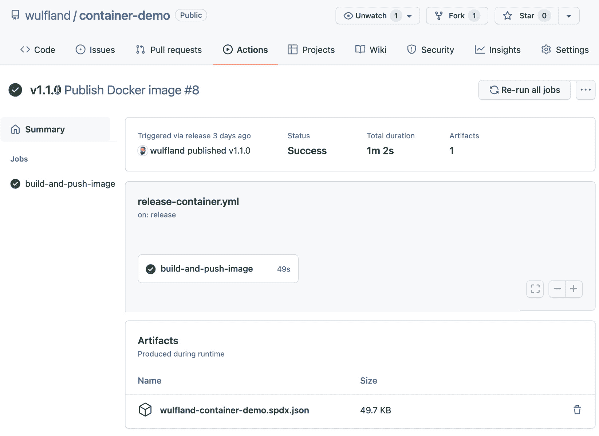

图 15.2 – SPDX SBOM 作为构建工件上传

**FOSSology** ([`github.com/fossology/fossology`](https://github.com/fossology/fossology)) 是一个开源的许可证合规解决方案，它也使用 SPDX。

`.NET`：

```
- name: CycloneDX .NET Generate SBOM
```

```
  uses: CycloneDX/gh-dotnet-generate-sbom@v1.0.1
```

```
  with:
```

```
    path: ./CycloneDX.sln
```

```
    github-bearer-token: ${{ secrets.GITHUB_TOKEN }}
```

与 Anchore 操作不同，SBOM 不会自动上传，你需要手动上传：

```
    - name: Upload a Build Artifact
```

```
      uses: actions/upload-artifact@v2.3.1
```

```
      with:
```

```
        path: bom.xml
```

CDX 也用于 `DependencyTrack` 实例：

```
uses: DependencyTrack/gh-upload-sbom@v1.0.0
```

```
with:
```

```
  serverhostname: 'your-instance.org'
```

```
  apikey: ${{ secrets.DEPENDENCYTRACK_APIKEY }}
```

```
  projectname: 'Your Project Name'
```

```
  projectversion: 'main'
```

SWID 标签更多用于 **软件资产管理**（**SAM**）解决方案，如 snow ([`www.snowsoftware.com/`](https://www.snowsoftware.com/))、**Microsoft System Center** 或 **ServiceNow ITOM**。如果存在，CDX 和 SPDX 可以使用 SWID 标签。

如果你想了解更多关于 SBOM 的信息，可以参见 [`www.ntia.gov/sbom`](https://www.ntia.gov/sbom)。

如果你完全在 GitHub Enterprise Cloud 上工作，并使用托管运行器，那么 SBOM 并不是那么重要。无论如何，所有相关数据都会连接到 GitHub。但如果你使用的是 GitHub Enterprise Server，拥有自托管的运行器，并且在发布管道中有其他商业软件，这些软件没有被公共包管理器消费，那么为所有发布生成 SBOM 可以帮助检测漏洞、许可证问题，并且在发生事件时帮助进行取证。

## 签署你的提交

我经常讨论的一个问题是是否应该签署你所有的提交。Git 是非常强大的，它给你提供了修改现有提交的可能性。但这也意味着，提交的作者不一定就是提交代码的人。一个提交有两个字段：`author` 和 `committer`。这两个字段的值来自 `git config` 中的 `user.name` 和 `user.email`，再加上时间戳。如果你进行 rebase 操作，例如，committer 会变为当前的值，但 author 保持不变。这两个字段与 GitHub 的身份验证完全没有关系。

你可以在 Linux 仓库中查找**Linus Torvalds**的电子邮件地址，配置本地 Git 仓库使用该电子邮件地址，并将其提交到你的仓库。该提交将显示为 Linus 进行的提交（见*图 15.3*）：

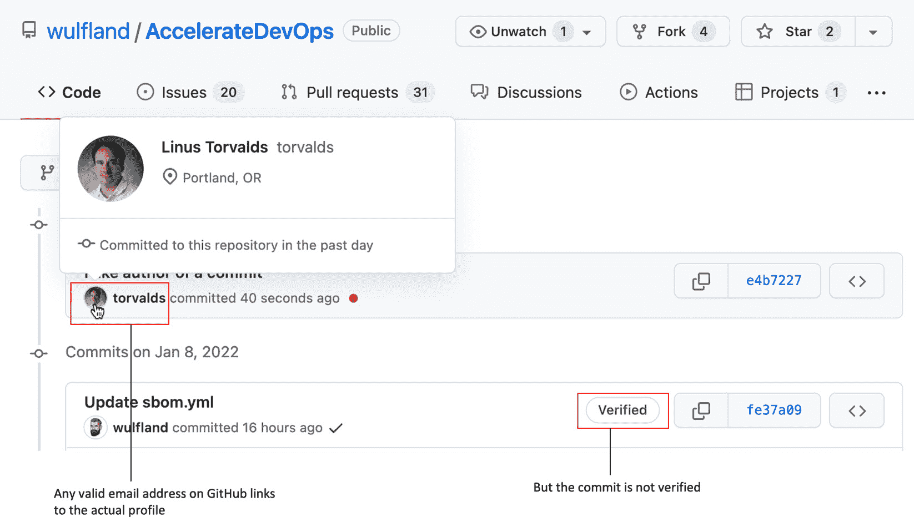

图 15.3 – 提交的作者信息与认证完全解耦

个人资料图片中的链接也可以工作，并会将你重定向到正确的个人资料页面。但该提交不会像你在服务器上通过 Web UI 修改文件或使用拉取请求合并更改时所做的提交那样，带有`Verified`徽章。Verified 徽章表示提交已使用**GNU 隐私保护**（**GPG**）密钥签名，并包含你账户的已验证电子邮件地址（见*图 15.4*）：

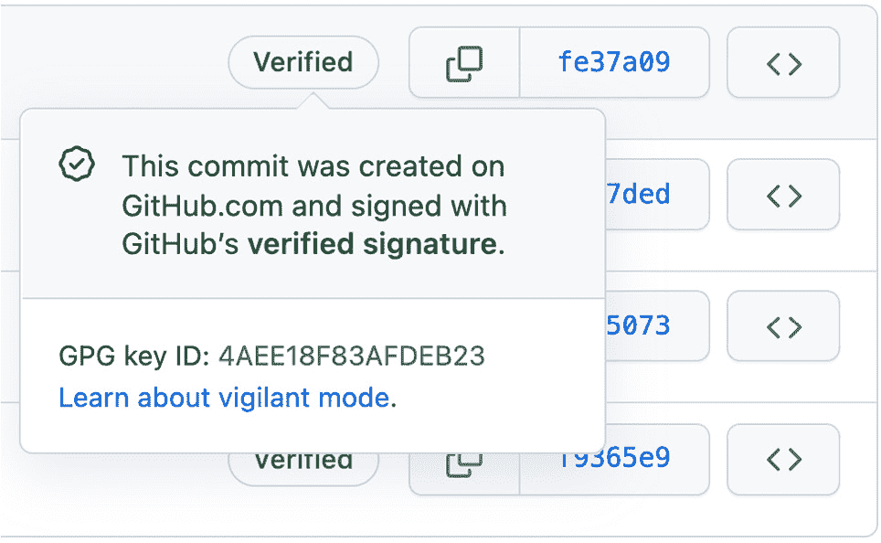

图 15.4 – GitHub 上的签名提交具有已验证徽章

你可以在本地创建一个 GPG 密钥，并用它来签署你的提交（`git commit -S`）。当然，你完全可以在密钥中设置名称和电子邮件地址，它们必须与你在`git config`中配置的电子邮件和用户名匹配。只要你不修改提交，签名就是有效的（见*图 15.5*）：

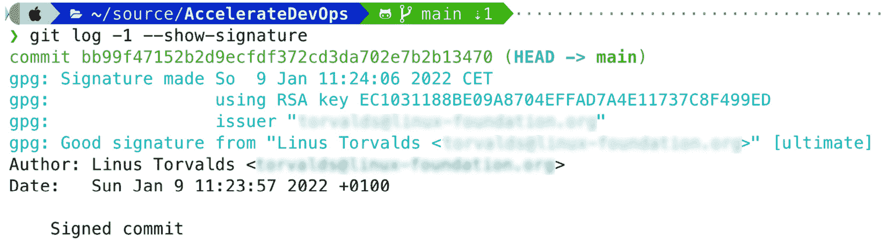

图 15.5 – 如果电子邮件和用户名匹配，本地签名的提交是有效的

但是即使你将**Pretty Good Privacy**（**PGP**）密钥上传到你的 GitHub 个人资料（[`github.com/settings/gpg/new`](https://github.com/settings/gpg/new)），提交仍然不会被验证，因为 GitHub 会在具有已验证电子邮件地址的个人资料中查找密钥（见*图 15.6*）：

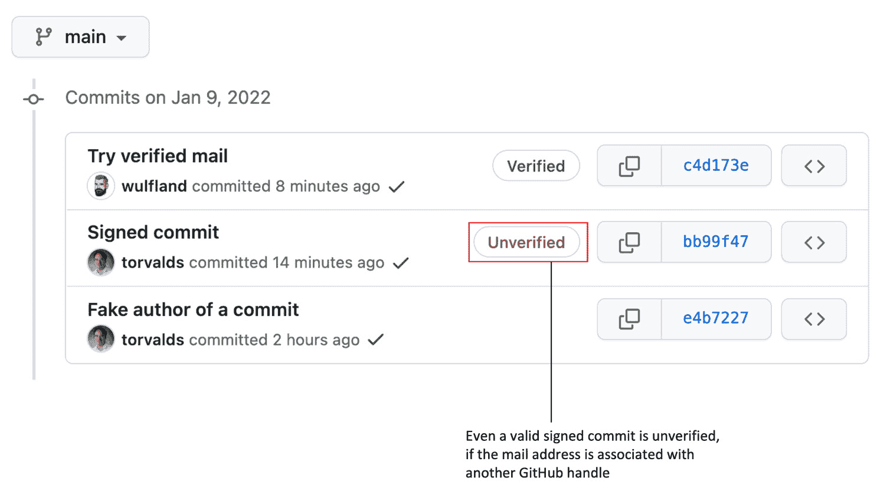

图 15.6 – 另一个用户的签名提交无法验证

这是否意味着你必须在本地签署所有提交？我认为不必如此。问题在于强制开发者签署所有提交会拖慢工作进度。许多 IDE 和工具不支持签名。保持密钥同步、处理多个电子邮件地址——这一切都会变得更加麻烦。如果所有开发者都使用相同的电子邮件地址在公司设备上工作，这可能会非常顺利。但通常情况并非如此。人们远程工作，使用不同的机器和环境，他们在同一台机器上处理开源软件时，使用的电子邮件地址与处理公司代码时的电子邮件地址不同。其好处并不值得。如果攻击者拥有对你仓库的推送权限，你最不担心的就是伪造的电子邮件地址。

我的建议如下：

+   选择一种依赖于`merge`、`squash`或`rebase`来在服务器上合并更改的工作流，这样它们就会默认签名。

+   如果你需要确保发布的完整性，可以签署你的标签（`git tag -S`）。由于 Git 是基于 SHA-1 或 SHA-256 的树，签署标签将确保所有父提交未被修改。

与其要求开发人员在本地签署所有提交并拖慢团队进度，不如在构建过程中签署代码，以确保构建后没有人篡改你的文件。

## 签署你的代码

签署二进制文件称为**代码签署**，即使你签署的是二进制文件而不是代码。你需要来自受信任机构的证书才能做到这一点。你如何在构建过程中签署代码在很大程度上取决于你的语言和编译方式。

要在 GitHub Actions 中签署你的 Apple XCode 应用程序，你可以使用此文档在构建过程中安装 `base64` 编码的证书和发布配置文件：[`docs.github.com/en/actions/deployment/deploying-xcode-applications/installing-an-apple-certificate-on-macos-runners-for-xcode-development`](https://docs.github.com/en/actions/deployment/deploying-xcode-applications/installing-an-apple-certificate-on-macos-runners-for-xcode-development)。不要忘记在与其他团队共享的自托管运行器上清理这些信息。在 GitHub 托管的运行器上，每个构建都会得到一个干净的环境。

根据你的代码签署解决方案，你可以在市场上找到多个适用于 Authenticode 和 `signtool.exe` 的操作。但由于所有签署解决方案都是基于命令行的，你可以像示例中 Apple 的做法一样，使用 `secret` 上下文将你的签名证书传递给工作流。

# 动态应用程序安全测试

为了增强应用程序安全性，你可以将**动态应用程序安全测试**（**DAST**）集成到发布工作流中。DAST 是一种黑盒测试，模拟对正在运行的应用程序进行现实世界攻击。

有许多商业工具和 SaaS 解决方案（如**Burp Suite**来自**PortSwigger**或**WhiteHat Sentinel**），但分析这些内容超出了本书的范围。

也有一些开源解决方案。一个例子是 OWASP 的**Zed 攻击代理**（**ZAP**）（[`www.zaproxy.org/`](https://www.zaproxy.org/)）。它是一个独立的应用程序，可在 Windows、macOS 和 Linux 上运行（见[`www.zaproxy.org/download/`](https://www.zaproxy.org/download/)），可以用来攻击 Web 应用程序。该应用程序允许你分析 Web 应用程序、拦截和修改流量，并使用 ZAP 蜘蛛对网站或其部分进行攻击（见*图 15.7*）：

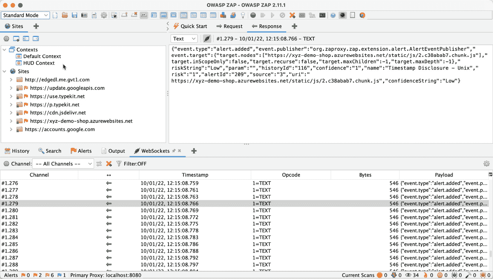

图 15.7 – OWASP ZAP 应用程序

OWASP ZAP 启动浏览器并使用**头显显示**（**HUD**）在网站顶部显示控件。你可以使用这些控件分析站点，使用蜘蛛执行攻击，或在不离开应用程序的情况下拦截请求（见*图 15.8*）：

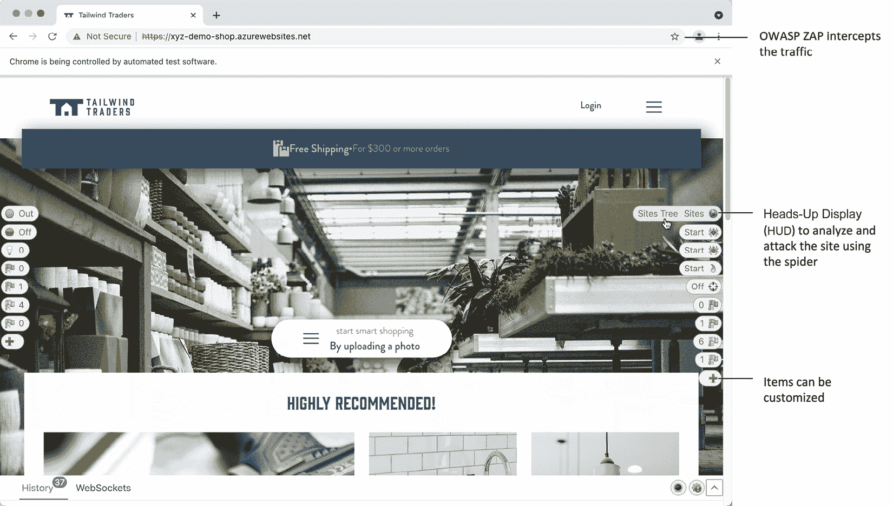

图 15.8 – HUD 显示正在被攻击的网站上的控制

即使你不是渗透测试员，作为一名 Web 开发人员，使用 OWASP ZAP 开始并学习如何攻击你的网站应该是容易的。但为了向左推进安全，你应该将扫描集成到工作流中。OWASP ZAP 在 GitHub 市场上有三个 Actions（见*图 15.9*）：

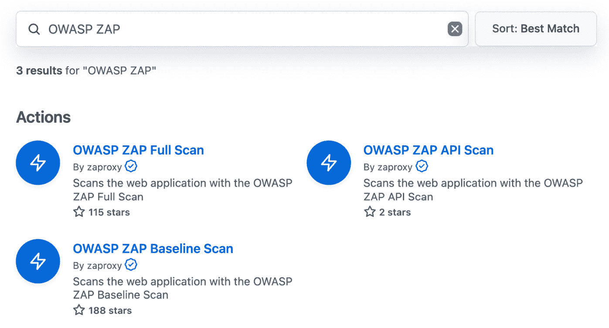

图 15.9 – GitHub 市场上可用的 OWASP ZAP Actions

**基线扫描**比**完整扫描**更快。**API 扫描**可用于扫描**OpenAPI**、**SOAP** 或 **GraphQL** API。使用这些 Actions 非常简单：

```
- name: OWASP ZAP Full Scan
```

```
  uses: zaproxy/action-full-scan@v0.3.0
```

```
  with:
```

```
    target: ${{ env.TARGET_URL }}
```

该 Action 使用 `GITHUB_TOKEN` 将结果写入 GitHub 问题。它还将报告作为构建工件添加。报告可以作为 HTML、JSON 或 Markdown 格式获取（见*图 15.10*）：

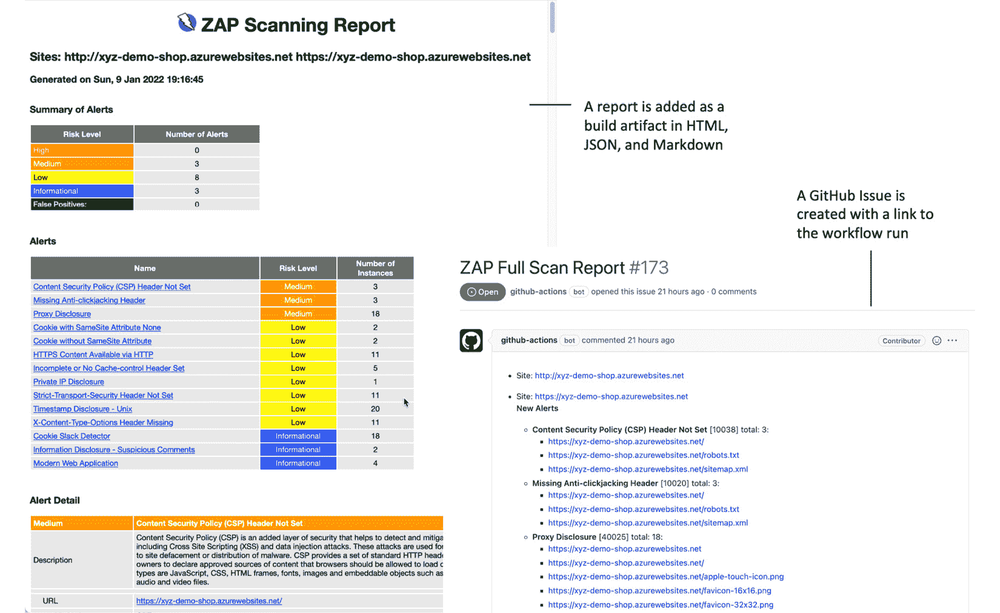

图 15.10 – 来自 OWASP ZAP 扫描的发现

当然，这只适用于 Web 应用程序。还有其他用于其他场景的 DAST 工具。但这个例子展示了它如何轻松地集成到你的流水线中。大多数 DAST 工具是命令行工具或容器，或者它们已经具有集成，比如 OWASP ZAP。

# 安全加固你的发布流水线

CI/CD 流水线很复杂，攻击面很大。基本上，发布流水线是远程代码执行环境，应谨慎对待（参考*Haymore A., Smart I., Gazdag V., Natesan D., & Fernick J., 2022* 中的一些攻击示例）。

小心建模你的流水线并遵循最佳实践，尤其是在你构建高度定制化的流水线时。如果太晚了，最好寻求外部帮助，而不是后悔。

## 保护你的运行器

如果你使用 GitHub 托管的运行器，它们的职责是保持安全。运行器是临时的，每次执行都从干净的状态开始。但你执行的代码可能会访问 GitHub 中的资源，包括秘密。确保对你的 GitHub Actions 进行安全加固（参考*加固你的 Actions*部分）并限制 `GitHub_TOKEN` 的权限（工作流应以最小权限运行）。

自托管的运行器在你的环境中运行，你需要对其安全负责！以下是你应该遵循的一些规则：

+   永远不要为**公开仓库**使用自托管的运行器。

+   使你的运行器**临时**（或者至少在每次运行后进行清理，不要在磁盘或内存中留下工件）。

+   保持你的镜像**精简**和**修补**（只安装你需要的工具，并保持一切更新）。

+   不要为所有团队和技术使用**通用运行器**。保持镜像的分离和专业化。

+   保持运行器在**隔离网络**中（仅允许运行器访问所需资源）。

+   仅运行**安全的 Actions**。

+   将跑步者包括在你的**安全监控**中，并检查是否有异常的进程或网络活动。

最好的解决方案是拥有一个动态扩展的环境（例如，Kubernetes 服务），并运行具有精简和修补的镜像的短期跑步者。

参见*第七章*，*运行你的工作流*，了解有关自行托管和托管跑步者的详细信息。

## 保护你的 Actions

GitHub Actions 非常有用，但它们是你执行并授予访问权限的代码。你应该非常小心使用哪些 Actions，特别是在自行托管跑步者时。来自可信来源的 Actions，例如 GitHub、Microsoft、AWS 或 Google，不是问题。但即便如此，它们也接受拉取请求，因此仍然有可能漏洞会悄然通过。Actions 的最佳实践如下：

+   始终**审查代码**。此外，查看**所有者**、贡献者数量、提交次数和日期、星标数等指标，以确保该 Action 属于一个健康的社区。

+   始终通过明确的**提交 SHA**引用一个 Action。SHA 是不可变的，而标签和分支可能会被修改，导致你不知情地执行新的代码。

+   如果你正在与分支合作，**要求批准**所有外部协作者，而不仅仅是首次贡献者。

+   使用**Dependabot**保持你的 Actions 更新。

如果你是自行托管跑步者，你应该更加严格地限制可以使用的操作。有两个可能的选项：

+   **仅允许本地 Actions**，并创建一个你已分析的 Action 的分支，引用该分支。这是额外的工作，但可以让你完全控制所使用的 Actions。你可以将 Actions 添加到本地市场中，方便发现（见 *Rob Bos, 2022*）。

+   `Azure/*`)。这个选项的安全性低于选项 1，但维护起来也较为简单。

你可以将这些选项配置为企业政策或为每个组织配置。

Actions 是来自其他人的代码，你在自己的环境中执行它们。它们是依赖项，可能会破坏你的发布能力，并引入漏洞。确保你的策略在速度和安全性之间找到最合适的平衡，以满足你的需求。

## 保护你的环境

使用**环境保护规则**和**必需的审阅者**来批准发布，在它们被部署到环境中之前（请参见*第九章*，*部署到任何平台*）。这确保在访问环境的密钥和执行代码之前，发布已被审查。

将其与**分支保护**和**代码所有者**（请参见*第三章*，*团队合作与协作开发*）结合使用，通过仅允许特定分支进入你的环境。这么做可以确保在批准部署时，必要的自动化测试和代码所有者的批准都已到位。

## 尽可能使用令牌

不使用作为机密存储的凭证连接到云服务提供商——如 Azure、AWS、GCP 或 HashiCorp——你可以使用**OpenID Connect**（**OIDC**）。OIDC 会交换短期有效的令牌进行身份验证，而不是使用凭证。你的云服务提供商也需要在其端支持 OIDC。

使用 OIDC，你不需要在 GitHub 中存储云凭证，你可以更细粒度地控制工作流可以访问哪些资源，并且你将拥有在工作流运行后会过期的轮换式、短期有效的令牌。

*图 15.11*展示了 OIDC 的工作原理概览：

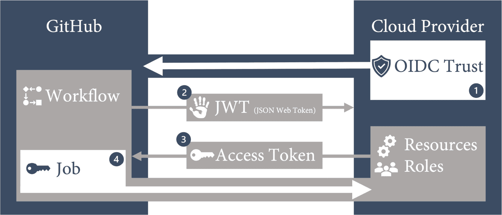

图 15.11 – OIDC 与云服务提供商的集成

步骤如下：

1.  在你的云服务提供商和 GitHub 之间创建**OIDC 信任**。将信任限制为组织和存储库，并进一步限制对环境、分支或拉取请求的访问。

1.  GitHub OIDC 提供者在工作流运行期间**自动生成 JSON Web Token**。该令牌包含多个声明，用以建立特定工作流作业的安全且可验证的身份。

1.  云服务提供商验证这些声明，并提供一个**短期有效的访问令牌**，该令牌仅在作业生命周期内有效。

1.  访问令牌用于访问身份所拥有权限的资源。

你可以使用该身份直接访问资源，或者可以使用它从安全的保管库（例如**Azure Key Vault**或**HashiCorp Vault**）获取凭证。这样，你可以安全地连接到不支持 OIDC 的服务，并通过保管库实现自动化的机密轮换。

在 GitHub 中，你可以找到配置 OIDC 以用于 AWS、Azure 和 GCP 的说明（见 [`docs.github.com/en/actions/deployment/security-hardening-your-deployments`](https://docs.github.com/en/actions/deployment/security-hardening-your-deployments)）。这些步骤是直接的。例如，在 Azure 中，你需要在**Azure Active Directory**（**AAD**）中创建应用注册：

```
$ az ad app create --display-name AccelerateDevOps
```

然后，使用注册输出中的应用 ID 创建服务主体：

```
$ az ad sp create --id <appId>
```

然后，你可以在 AAD 中打开应用注册，并在**证书和机密** | **联合凭证** | **添加凭证**下添加 OIDC 信任。填写表单，如*图 15.12*所示：

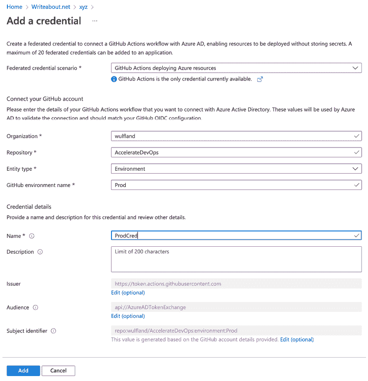

图 15.12 – 为应用注册创建 OIDC 信任

然后，在订阅级别为服务主体分配一个角色。打开门户中的订阅。在**访问控制（IAM）** | **角色分配** | **添加** | **添加角色分配**下，按照向导进行操作。选择一个角色（例如**贡献者**），然后点击**下一步**。选择**用户、组或服务主体**，并选择你之前创建的服务主体。

在 GitHub 中，你的工作流需要对 `id-token` 具有 `write` 权限：

```
permissions:
```

```
      id-token: write
```

```
      contents: read
```

在 Azure 登录操作中，使用客户端 ID（`appId`）、租户 ID 和订阅 ID 从 Azure 获取令牌：

```
- name: 'Az CLI login'
```

```
  uses: azure/login@v1
```

```
  with:
```

```
      client-id: ${{ secrets.AZURE_CLIENT_ID }}
```

```
      tenant-id: ${{ secrets.AZURE_TENANT_ID }}
```

```
      subscription-id: ${{ secrets.AZURE_SUBSCRIPTION_ID }}
```

此后，你可以使用**Azure CLI**访问资源：

```
- run: az account show
```

你也可以使用其他 Azure 操作并移除认证部分，在本例中是发布配置文件。他们将使用登录操作提供的访问令牌表单：

```
- name: Run Azure webapp deploy action using OIDC
```

```
  uses: azure/webapps-deploy@v2
```

```
  with:
```

```
    app-name: ${{ env.APPNAME }}
```

```
    slot-name: Production
```

```
    package: website
```

每个云提供商不同，但文档应能帮助你快速启动并运行：[`docs.github.com/en/actions/deployment/security-hardening-your-deployments`](https://docs.github.com/en/actions/deployment/security-hardening-your-deployments)。

## 收集安全遥测数据

要确保从代码到生产环境的整个流水线的安全性，你需要对各个层级的实时数据进行洞察。不同层级有不同的监控解决方案（见*图 15.13*）：

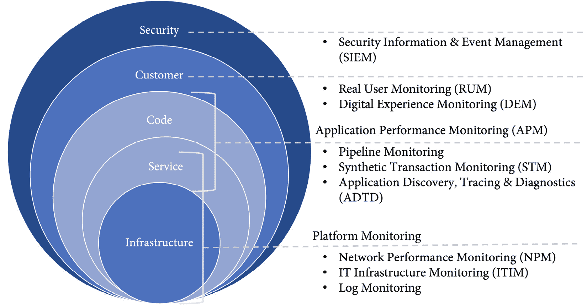

图 15.13 – 不同层级的监控

所有这些层级应将它们的数据报告给你的 SIEM 系统，以执行分析，并使用 AI 检测异常。许多组织在不同层级收集数据，但由于责任不同，常常忘记将其纳入监控。为了加固发布的安全性，你应该考虑以下事项：

+   将**所有监控来源**和事件纳入你的 SIEM 解决方案。

+   监控**整个流水线**，包括你的代理和测试环境。涵盖所有进程和网络活动。

+   **记录部署事件**及其对应的版本。如果在部署后突然有新进程运行或端口被打开，你希望能够将这些变化与此次部署关联，便于事后分析。

+   收集**实时应用安全数据**并在工程师的仪表盘上显示。这可能包括**程序异常终止**、**SQL 注入**尝试、**跨站脚本攻击**（**XSS**）尝试、**登录失败**（**暴力破解攻击**）或**DDoS 攻击**，但具体取决于你的产品。为了检测 SQL 注入或 XSS，你需要在编码用户输入之前加入额外的日志记录，特别是当输入包含可疑字符或元素时。

提高意识的最佳方式是看到威胁是真实存在的。

# 案例研究

直到现在，**Tailwind Gears**已经支付外部公司进行**架构安全评审**，帮助进行**威胁建模**和**风险分析**，并在重大发布之前进行安全测试。他们从未遭受过数据泄露，至今大部分投资集中在网络安全上。但现在，随着他们越来越多地使用云服务，他们已经意识到，必须采取措施以能够**检测**、**响应**和**恢复**。

IT 部门已经开始使用**Splunk**作为他们的**SIEM**和**ITIM**解决方案，并整合了越来越多的数据源，但直到现在，IT 部门仍无法确定是否能实时检测到正在进行的攻击。Tailwind Gears 决定改变他们处理安全问题的方式。他们与安全合作伙伴进行沟通，并计划首次进行**红队/蓝队**模拟。场景设定为**内部攻击者**攻击我们 DevOps 试点团队的 Web 应用程序。

模拟持续了 3 天，红队通过找到两种方式破坏生产环境获得胜利：

+   对另一团队中几位开发者的**鱼叉式钓鱼**攻击成功，并揭露了其中一位开发者的凭证。利用**BloodHound**，他们发现该开发者可以访问以前的 Jenkins 服务器，而该服务器现在运行 GitHub Actions 运行器，且尚未完全迁移到 Kubernetes 解决方案中。该服务器未启用 MFA，且**mimikatz**能够捕获测试帐户的凭证。该测试帐户可以访问测试环境，他们可以在其中捕获管理员帐户的凭证，从而允许提取暂存环境的数据（在此情境中，这算作生产环境）。

+   由于所有开发者都具有对所有代码库的读取权限，对 Web 应用程序的依赖分析显示，存在一个易受 XSS 攻击且尚未修补的依赖项。该组件是一个搜索控件，允许红队在另一团队的前端开发者协助下，在其他用户的上下文中执行脚本。他们在内部 GitHub 仓库中打开一个问题，并利用 GitHub API 在每次执行时向该问题发布评论作为证据。

模拟结果产生了许多待办事项，将在接下来的几周内处理。有些事情与我们的 DevOps 团队无关，例如为所有内部系统启用 MFA，或定期执行钓鱼模拟以提高员工的安全意识。

但许多事项也与团队有关。Tailwind Gears 决定将安全性嵌入开发流程中。这包括**机密扫描**、使用 Dependabot 进行的**依赖管理**和**代码扫描**。

团队还将与 IT 部门合作，通过将构建服务器迁移到 Kubernetes、在整个管道中实现**安全日志记录**、并使用**OpenID Connect**和安全的**密钥库**来处理机密信息，从而安全地加固发布管道。

大家都期待着三个月后的下一次红队/蓝队模拟。

# 摘要

在本章中，你已经学习了如何通过扫描容器和 IaC、确保代码和配置的一致性、以及对整个管道进行安全加固来保护发布管道和部署。

在下一章中，我们将讨论软件架构对软件交付性能的影响。

# 延伸阅读

以下是本章节的参考资料，你也可以通过这些资料进一步了解相关话题：

+   Kim G., Humble J., Debois P. & Willis J. (2016). *DevOps 手册：如何在技术组织中创建世界级的敏捷性、可靠性和安全性*（第一版）。IT Revolution Press

+   Forsgren N., Humble, J., & Kim, G. (2018). *Accelerate: 精益软件与 DevOps 科学：构建和扩展高效能技术组织*（第一版）[电子书]。IT Revolution Press.

+   Oladimeji S., Kerner S. M. (2021). *SolarWinds 黑客攻击解释：你需要了解的一切*. [`whatis.techtarget.com/feature/SolarWinds-hack-explained-Everything-you-need-to-know`](https://whatis.techtarget.com/feature/SolarWinds-hack-explained-Everything-you-need-to-know)

+   Sudhakar Ramakrishna (2021). *我们对 SUNBURST 调查的新发现*. [`orangematter.solarwinds.com/2021/01/11/new-findings-from-our-investigation-of-sunburst/`](https://orangematter.solarwinds.com/2021/01/11/new-findings-from-our-investigation-of-sunburst/)

+   Crowdstrike 博客 (2021). *SUNSPOT：构建过程中的植入程序*. [`www.crowdstrike.com/blog/sunspot-malware-technical-analysis/`](https://www.crowdstrike.com/blog/sunspot-malware-technical-analysis/)

+   Eckels S., Smith J. & Ballenthin W. (2020). *SUNBURST 额外技术细节*. [`www.mandiant.com/resources/sunburst-additional-technical-details`](https://www.mandiant.com/resources/sunburst-additional-technical-details)

+   Souppaya M., Morello J., & Scarfone K. (2017). *应用容器安全指南*: [`doi.org/10.6028/NIST.SP.800-190`](https://doi.org/10.6028/NIST.SP.800-190)

+   美国国家电信和信息管理局 (NTIA), *软件物料清单*: `www.ntia.gov/sbom`

+   Thomas Claburn (2018). *检查你的代码库... 加密货币盗窃代码悄悄进入相当流行的 NPM 库（每周 200 万次下载）*: [`www.theregister.com/2018/11/26/npm_repo_bitcoin_stealer/`](https://www.theregister.com/2018/11/26/npm_repo_bitcoin_stealer/)

+   Haymore A., Smart I., Gazdag V., Natesan D., & Fernick J. (2022). *我们如何攻破 CI/CD 管道的 10 个真实案例*: [`research.nccgroup.com/2022/01/13/10-real-world-stories-of-how-weve-compromised-ci-cd-pipelines/`](https://research.nccgroup.com/2022/01/13/10-real-world-stories-of-how-weve-compromised-ci-cd-pipelines/)

+   Rob Bos (2022). *设置内部 GitHub Actions 市场*: [`devopsjournal.io/blog/2021/10/14/GitHub-Actions-Internal-Marketplace.html`](https://devopsjournal.io/blog/2021/10/14/GitHub-Actions-Internal-Marketplace.html)
