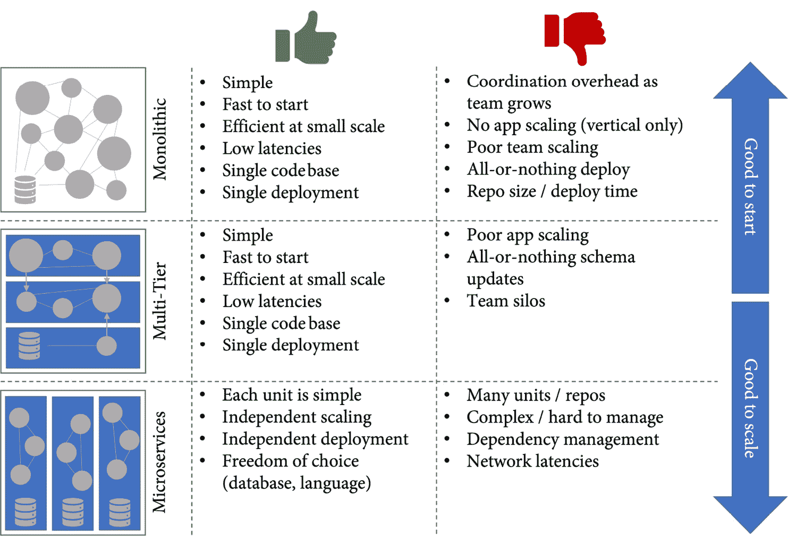

# 第十六章：松散耦合的架构与微服务

有趣的是，软件架构对软件交付性能的影响要大于你所构建的系统类型。无论你的产品是云服务、运行在制造硬件上的嵌入式软件、消费类应用、企业应用，甚至是大型机软件，这几乎对工程性能没有影响。如果你的架构具有某些特性，这对工程性能几乎没有影响 (*Forsgren N., Humble, J., and Kim, G., 2018*)。对于每种系统类型，都有高性能和低性能的差异。但架构的特性显然与工程开发速度相关，并使其成为关键的加速因素。

在本章中，我将给你介绍松散耦合的系统，以及如何通过演进你的软件和系统设计来实现更高的工程开发速度。

本章将涵盖以下主题：

+   松散耦合的系统

+   微服务

+   演化设计

+   基于事件的架构

# 松散耦合的系统

所有曾经在紧密耦合的单体应用程序上工作过的开发者都知道它所带来的问题。通信开销以及为了进行更大规模的变更所需的会议。在修复应用程序其他部分的错误后出现的新错误。改变破坏了其他开发者的功能。所有这些问题都会导致对集成和部署的恐惧，从而减慢开发者的工作速度。

在设计你的系统和软件时，你应该关注以下特性：

+   **可部署性**：每个团队是否能够独立于其他应用程序或团队发布他们的应用程序？

+   **可测试性**：每个团队是否能够在不需要部署其他团队独立解决方案的测试环境的情况下，完成大部分测试？

这里的团队规模是一个小型的**两比萨团队**（见*第十七章*，*赋能你的团队*）。如果你为小团队的可部署性和可测试性设计系统，它将自动导致松散耦合的系统，并具有明确的接口。

# 微服务

松散耦合系统最常见的架构模式是**微服务**模式，*“将单个应用程序开发为一组小型服务的方式，每个服务运行在自己的进程中，通过轻量级机制进行通信，通常是一个 HTTP 资源 API”* (*Lewis J. & Fowler M., 2014*)。

微服务是从**面向服务架构**（**SOA**）演化而来，并且具备一些额外的特性。微服务具有**去中心化的数据管理**——意味着每个服务完全拥有自己的数据。此外，微服务更倾向于使用轻量级消息传递，而非复杂的协议或中央协调来进行服务间通信——**智能端点**和**愚蠢的管道**。

微服务的一个重要特点常常被忽视——它们是围绕业务能力构建的。这也定义了一个服务应该有多小。为了定义服务的范围，你必须理解业务领域。一个微服务对应一个**限界上下文**，这是**领域驱动设计**中的概念（*Eric Evans，2003*）。

另一个特点是，微服务是完全独立且可**部署**和**测试**的。这也是它们与高工程效率相关联的原因。

微服务有许多优势。它们的扩展性非常好，因为你可以独立扩展每个服务。它们还允许每个团队使用最适合其需求的编程语言和数据存储解决方案。最重要的是，它们允许大型和复杂应用中的团队快速行动，而不会干扰其他团队。

但这些优势也伴随着代价。基于微服务的应用程序复杂且难以操作和排除故障。

有许多著名的基于微服务的解决方案——例如，Netflix 和 Amazon。它们运行全球规模的服务，并拥有一种架构，使它们能够每天进行成千上万次的部署。

但也有许多公司尝试实施微服务并失败了。尤其是在绿色领域项目中，失败的比例特别高。其原因通常是对业务领域缺乏了解，并且错误地定义了每个服务的限界上下文，特别是当应用由外部公司开发，而该公司尚未学习业务领域的**通用语言**时。另一个原因是低估了操作服务的复杂性。

所以，在实现微服务之前，你应该关注架构的**可部署性**和**可测试性**特性，并根据需求调整解决方案设计。需求是不断变化的，架构也应随着时间而演变。

# 演化设计

一些架构风格的优劣随着不同原因而发生变化。一个原因是你的应用的规模。另一个原因是你对业务领域和客户的了解，以及在大规模环境中操作的能力。根据这些因素，不同的架构风格可能更适合你（见*图 16.1*）：

图 16.1 – 优势和劣势随着规模的变化而变化

不断根据当前需求调整架构和系统设计被称为**演化设计**。要开始一个新项目，最好从单体架构和一个团队入手。这样可以在不增加太多开销的情况下快速推进。如果你扩展规模并对业务领域有了更多了解，可以开始使用编程语言的功能对应用进行模块化。最终，复杂度和规模会变得非常高，这时微服务能帮助你保持产品的可测试性和可部署性。

问题是——如何从现有的架构到达所需的架构？完全重写既昂贵又具有风险。更好的方法是逐步演化你的设计。马丁·福勒称之为**缚树应用程序**模式（*马丁·福勒，2004*）。缚树是一种植物，它在树的上部枝干上播种，逐渐将根伸向树下，直到它在土壤中扎根。支持的树被缚死并最终死亡——留下一个有机结构，它能够自我支撑。

与其重写应用程序，不如围绕它构建一个新的“缚树”应用程序，逐步让其发展，直到旧系统被“缚死”并可以关闭。

# 事件驱动架构

除了微服务、单体应用和多层应用外，还有其他架构风格——例如，**事件驱动架构**（**EDA**）。EDA 是一个围绕事件的发布、处理和持久化的模式。其核心是消息代理——例如，**Apache Kafka**——各个服务或组件可以发布事件（**发布者**）或订阅事件（**订阅者**）。

EDA 与基于微服务的方法非常契合，但它也可以与其他架构风格一起使用。它可以帮助你保持松耦合组件或服务之间的一致性，并且由于事件的异步特性，它可以完美地水平扩展，因此非常适用于处理大量动态数据的解决方案，例如近实时处理传感器数据的物联网解决方案。

特别是在云原生环境中，EDA 可以帮助你快速行动，并在非常短的时间内构建松耦合和全球可扩展的解决方案。

与 EDA 经常一起使用的一种模式是**事件溯源**。事件溯源并不是持久化实体，而是将应用程序状态的所有变化——包括实体——作为一系列事件进行捕捉（见 *马丁·福勒，2005*）。为了检索实体，应用程序必须重放所有事件，直到获得最新状态。由于事件是不可变的，这提供了完美的审计追踪。你可以将事件流视为一个不可变的事实流，作为唯一的真实来源。除了可审计性之外，事件溯源在可扩展性和可测试性方面也具有许多优点。

如果你需要捕捉数据的意图、目的或原因，或者当避免冲突更新至关重要，并且需要保持历史记录并频繁回滚更改时，事件溯源是一个合适的模式。事件溯源与**命令查询职责分离**（**CQRS**）模式非常契合——该模式将读取和写入操作分离开来。

但请注意，事件溯源是非常复杂的，并且将领域建模为事件并不是大多数开发者的自然方式。如果上述标准不适用于你的产品，那么事件溯源可能不是一个好的模式。

更适合简单领域的架构风格是**Web-Queue-Worker**。这是一种主要与无服务器 PaaS 组件一起使用的模式，包含一个用于处理客户端请求的 Web 前端和一个在后台执行长时间运行任务的工作进程。前端和后端是无状态的，并通过消息队列进行通信。该模式通常与其他云服务结合使用，如身份提供者、数据库、Redis 缓存和 CDN。Web-Queue-Worker 是开始构建云原生应用程序的一个不错的模式。

无论选择哪种架构风格，都应尽量保持简单。最好从简单开始，并随着需求的增加逐步演化设计，而不是过度设计，最终导致一个复杂的解决方案，这样反而会拖慢进度。

# 总结

如果您正在采用 CI/CD 和 DevOps 实践，但未能加速进展，那么您应仔细审视您的解决方案架构，因为它是衡量工程速度的关键指标之一。关注可部署性和可测试性特征，而不是架构风格。

在这一章中，我概述了松耦合系统的进化设计，并介绍了一些相关的架构风格和模式。

在下一章中，我们将讨论组织结构与软件架构之间的关联，以及它们如何在 GitHub 中结合起来。

# 进一步阅读

以下是本章中的参考资料，您可以通过它们获得更多关于这些话题的信息：

+   Forsgren N., Humble, J., 和 Kim, G. (2018). *加速：精益软件与 DevOps 的科学：构建与扩展高效能技术组织* (第 1 版) [电子书]. IT Revolution Press.

+   Lewis J. 和 Fowler M. (2014). *微服务*: [`martinfowler.com/articles/microservices.html`](https://martinfowler.com/articles/microservices.html).

+   Eric Evans (2003). *领域驱动设计：软件核心复杂性应对*. Addison-Wesley Professional.

+   Martin Fowler (2004). *StranglerFigApplication*: [`martinfowler.com/bliki/StranglerFigApplication.html`](https://martinfowler.com/bliki/StranglerFigApplication.html).

+   Michael T. Nygard (2017). *发布它！：设计与部署生产就绪软件*. Pragmatic Programmers.

+   Martin Fowler (2005). *事件溯源*: [`martinfowler.com/eaaDev/EventSourcing.html`](https://martinfowler.com/eaaDev/EventSourcing.html).

+   Lucas Krause (2015). *微服务：模式与应用——通过应用模式设计细粒度服务* [Kindle 版].
