# *第十七章*：赋能你的团队

如果我的客户对他们的架构不满意，我会让他们解释他们产品的组织结构，并画出它的图示。如果你将这个组织结构图与他们的架构图进行比较，你总是能发现许多相似之处。组织结构与软件架构之间的这种关联被称为**康威定律**。

在本章中，你将学习如何利用这种关联来改善你的架构、组织结构和软件交付性能。

以下是本章的核心主题：

+   康威定律

+   两个披萨团队

+   反向康威操作

+   交付节奏

+   单库或多库策略

# 康威定律

康威定律追溯到 1968 年的一篇文章（*康威，梅尔文，1968*，第 31 页）：

"设计系统的组织（……）被迫产生与组织通信结构相匹配的设计。"

– 梅尔文·E·康威

该法则不仅适用于软件或系统架构，也适用于任何系统的设计。请注意，它并不是指一个组织的管理结构，而是指其通信结构。这两者可能是相同的——但在某些情况下，它们并不相同。通常，如果组织结构图与软件设计不匹配，你可以寻找其通信流，它与组织结构图是不同的。

例如，如果你有许多小团队或独立开发者，他们从不同的客户或顾问那里接收需求，他们可能会在没有任何组织边界的情况下相互沟通。他们正在开发的系统将反映这一点，包含许多具有高度内聚性的模块，这些模块相互引用——这就是所谓的*意大利面架构*。而那些共同工作并通过一个通信渠道接收输入的团队——例如一个产品负责人——将构建一个模块内聚性较高的系统，而其他团队所开发的系统部分将引用较少。用*埃里克·S·雷蒙德*的话来说，"*如果三个团队在做一个编译器，你会得到一个三遍编译器*"（见*雷蒙德，埃里克 S. 1996*，第 124 页）。*图 17.1* 直观地展示了这两个示例：

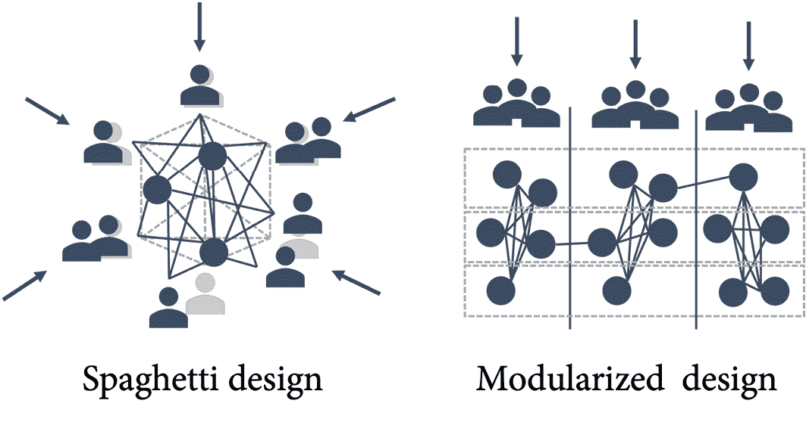

图 17.1 – 基于通信结构的不同软件设计示例

但是什么样的通信结构能够导致有助于加速团队工程速度的系统设计呢？

# 两个披萨团队

其中一个最受讨论的基于微服务的架构，可以在大规模下实现每天成千上万次的部署，就是**亚马逊**的架构。他们为团队设置使用**两个披萨法则**（*亚马逊，2020*）：

"我们试图创建的团队不应超过两个披萨能够喂饱的规模。"

– 杰夫·贝佐斯

但是，究竟能用两块披萨喂多少人呢？在我们的用户小组中，我们通常按照每三到四个人一块披萨来计算。这意味着团队的规模应为 6 到 8 人。在美国的 Giordano's 餐厅，他们采用了 3/8 规则——你订购的披萨数量应为喂食人数的三倍再除以 8：

这将导致每个团队最多由 5 到 6 人组成。所以，所谓的“两披萨团队”规模并没有明确的定义——我认为这与团队成员的饥饿感无关。这个规则仅仅意味着团队应该保持小规模。

大型团队的问题在于，随着每个新增成员，团队中成员之间的链接数量迅速增长。你可以使用以下公式计算链接数量：

这里，*n*表示团队中的人数。这意味着一个 6 人的团队有 15 个成员之间的链接——而一个 12 人的团队则已经有 66 个链接（见*图 17.2*）：

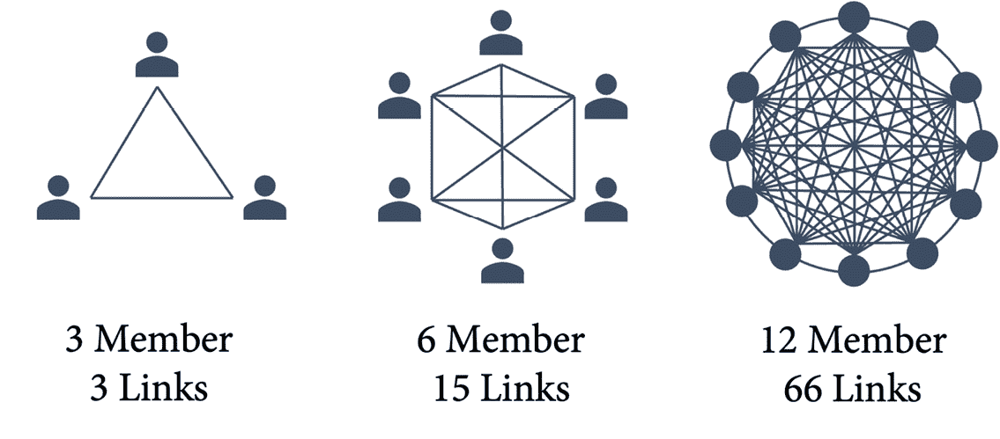

图 17.2 – 团队成员之间的链接数量

如果人们在团队中工作，他们会体验到积极的协同效应。多样性和沟通有助于提高质量和成果。但是，如果你在团队中增加更多人，沟通成本和决策速度减慢会导致负协同效应（见*图 17.3*）：

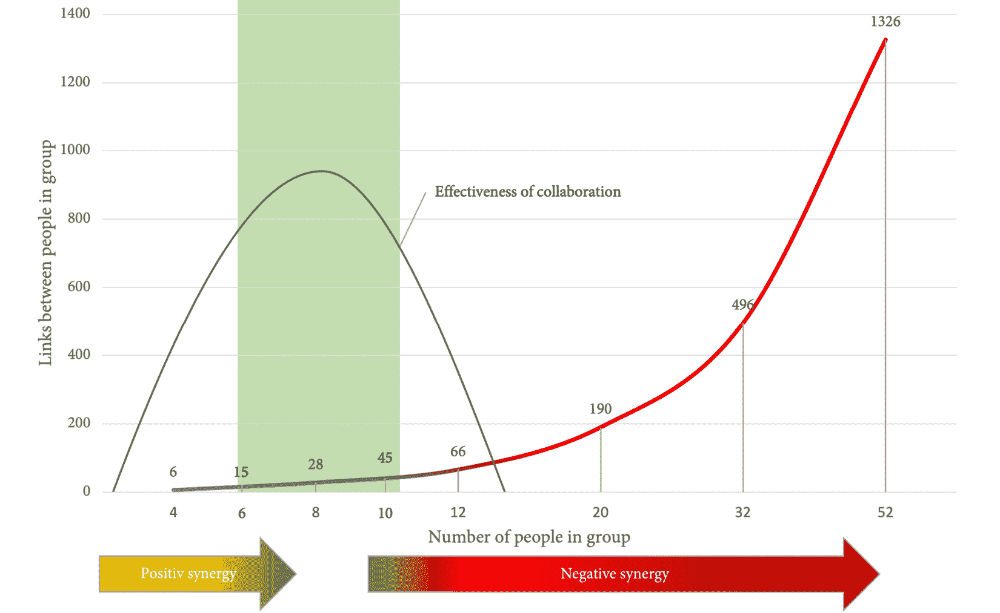

图 17.3 – 协作效果与团队规模

那么，什么是神奇的数字——团队的最佳人数是多少？

美国海军海豹突击队认为，四人是作战团队的最佳规模（*Willink, J. 和 Leif Babin, L., 2017*）。他们还依赖于在复杂环境中的高频率沟通。但是，作战团队的技能可能比跨职能开发团队的技能更为线性。因此，并没有证据表明这个数字对于开发团队也是最优的。

在 Scrum 中，**米勒定律**认为神奇的七这个数字，±2（*Miller, G.A., 1956*），用来定义推荐的团队规模。米勒定律是 1956 年关于我们短期记忆限制的文章，旨在探讨与沟通能力相关的问题。但米勒定律已经被科学证伪，Scrum 之所以仍使用这个数字，是因为五到九人的团队在许多情况下确实是一个不错的规模——但这没有任何科学依据。也有只有 3 名成员的高效 Scrum 团队——还有一些团队有 14 名成员。

有一项来自 QSM 的研究分析了 491 个开发项目。研究得出结论，小型团队具有更高的生产力、更少的开发努力和更好的开发进度表（*QSM, 2011*）。团队规模在 1.5 到 3 人、3 到 5 人和 5 到 7 人之间的聚类结果非常接近。超过七人则会导致开发努力的急剧增加（见*图 17.4*）：

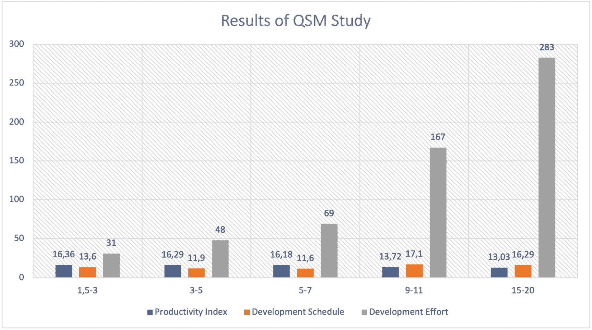

图 17.4 – QSM 研究结果的总结

有几个原因解释了为什么较小的团队表现优于较大的团队（见*Cohn M., 2009*，第 177–180 页）：

+   **社会懒散**：社会懒散是一种现象，指的是当人在一个团队中工作时，由于个人表现无法被衡量，他们往往会减少为达成目标所投入的努力（*Karau, S.J., 和 Williams, K.D., 1993*）。较小的团队通常较不受社会懒散的影响。

+   **凝聚力和主人翁精神**：较小的团队更容易进行建设性的互动，成员们更容易建立信任、共同拥有感和凝聚力（*Robbins S., 2005*）。

+   **协调工作**：在较小的团队中，协调所花费的时间较少。简单的事情——例如协调会议——在更大的团队中往往会变得更加复杂。

+   **更有回报**：在较小的团队中，个人的贡献更容易被看到。这一点，加上更好的社会凝聚力，导致如果团队规模较小，环境会更具回报性（*Steiner, I.D., 1972*）。

当然，较小的团队也有一些缺点。最大的缺点是**失去一个或多个团队成员**的风险，这在小团队中更难以弥补。另一个缺点是**缺乏某些专家技能**。如果你需要在五个领域拥有深厚的专业知识，三人团队几乎不可能提供这种能力。

从这些数据来看，两块披萨团队的最佳规模大约是在三人到七人之间——根据环境的不同，平衡优缺点。

# 反向 Conway 法则

现在我们知道了团队的最佳规模，我们可以进行一种叫做**反向 Conway 法则**的操作（*Forsgren N., Humble, J., 和 Kim, G., 2018*，第 102 页）。如果你将组织结构发展为自主的两块披萨团队，你的架构将演变为一个更加松耦合的结构。

但不仅仅是团队的规模！如果你围绕功能创建团队，这将导致分层或多层架构。如果你将前端开发人员和数据库专家放在同一个团队中，你的架构将在这些沟通点解耦（见*图 17.5*）：

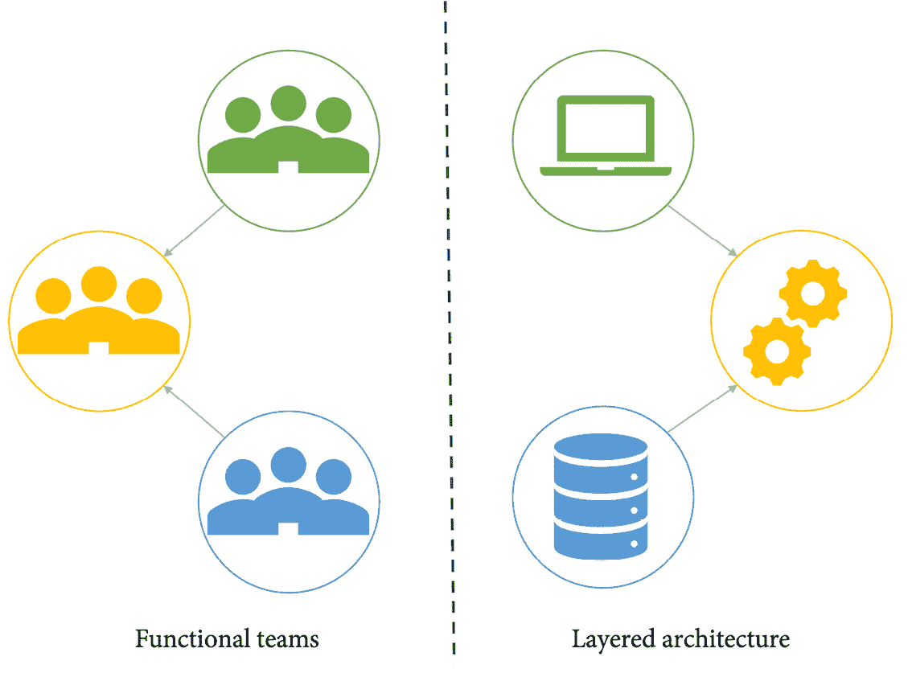

图 17.5 – 功能性团队导致分层架构

为了实现可部署和可测试的架构，赋能团队，你必须创建对业务成果负责的跨职能团队。这将导致理想的架构，帮助你快速行动（见*图 17.6*）：

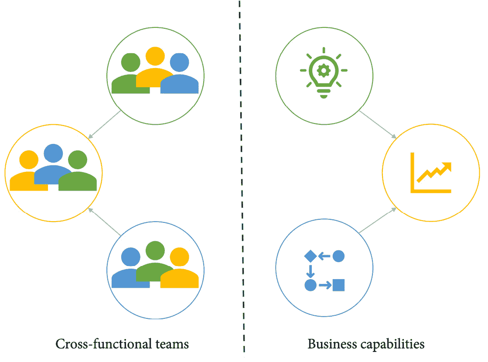

图 17.6 – 围绕业务能力对齐的跨职能团队，实现快速价值交付

有四种团队拓扑结构对系统架构产生积极影响，因此也能提升软件交付绩效（*Skelton M. 和 Pais M., 2019*）：

+   **价值流对齐团队**：这是最重要的团队拓扑——跨职能团队，能够独立交付显著的客户价值，而不依赖其他团队的帮助。这些团队需要具备所有交付价值所需的技能——例如，用户体验（UX）、质量保证（QA）、数据库管理员（DBA）和运营技能。

+   **平台团队**：负责构建平台的团队，通过减少复杂性和简化软件交付流程，使得与价值流对齐的团队能够交付价值。

+   **支持团队**：帮助其他团队承担责任的团队，通常出现在入职、过渡或培训阶段。

+   **子系统团队**：只有在绝对必要的情况下才应创建这种团队！如果某个子系统过于复杂，无法由价值流对齐团队或平台团队处理，可能更适合设置一个专门处理该子系统的职能团队。

每个团队必须有明确的责任，能够独立交付价值，而无需依赖其他团队完成某些任务，这一点非常重要。

为了实现对绩效的预期效果，必须限制团队之间的互动方式，确保互动方式仅限于以下三种**互动模式**之一：

+   **协作**：两个或更多团队在一定时间内密切合作，共同承担责任。

+   **自助服务**：一个团队将其价值作为服务提供给另一个团队。职责明确分离，服务尽可能容易且自动化地提供。

+   **促进**：一个团队帮助另一个团队，协助其在一定时间内学习新知识或培养新习惯。

构建一个有效的团队拓扑，拥有良好且明确的沟通和互动，对系统架构和工程速度都有巨大的影响。

# 交付节奏

即使是跨职能的自主团队，你们之间仍然会有一些相互依赖和沟通流动。在本书的前几章中，当我解释工作流和度量标准时，我重点讲解了效率、流动、批量大小和持续交付的价值。但你仍然需要一些节奏来控制你的工作流。在 Scrum 中，这叫做**经验过程控制**。经过一段时间后，你需要暂停来**检查**和**采纳**——不仅是你交付的内容，还有你的过程和团队动态。这个时间跨度在 Scrum 中被称为**冲刺**。我不喜欢这个词，因为它暗示了快速的节奏，而开发应该有一个持续稳定的节奏。如果你想跑马拉松，你不会进行短跑——产品开发是马拉松，而不是一系列短跑（但显然，马拉松这个比喻并不适用于橄榄球）。但无论你怎么称呼这些间隔，它们对持续学习、采纳和团队建设都很重要。这些间隔同样重要，用来进行沟通——与利益相关者和其他团队沟通。

这就是为什么这些间隔应该在所有团队之间对齐。它们应该确定稳定的节奏，并作为工程组织的心跳。

这些间隔不应太长，也不应太短。大多数公司最大为一个月，最小为 2 周。这并不意味着团队不能做更小的迭代或冲刺。它们仍然可以做 1 周的冲刺，只是需要与全局节奏对齐。你可以有更快的节奏，并与较慢的节奏对齐——但反之则不行（见*图 17.7*）：

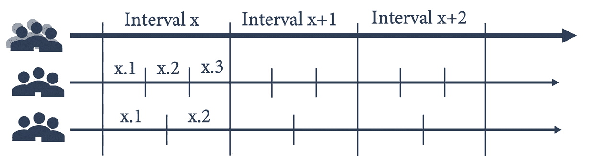

图 17.7 – 将更快的迭代与交付节奏对齐

在这种情况下，*x*不一定需要以周为单位来衡量。当定义节奏时，要考虑到**整个组织的脉搏**。如果你们组织中的一切都按月运行，那么 3 周的节奏就无法与公司其他部分同步。在这种情况下，定义一个月的节奏——或者它的一部分——是更好的选择，且能减少摩擦。如果你的公司是上市公司并采用 4-4-5 日历制度，那么财务季度可能就是你的脉搏。观察组织的脉搏，并使你的冲刺节奏与其同步，这样这些间隔就能与组织脉搏保持和谐（见*图 17.8*）：

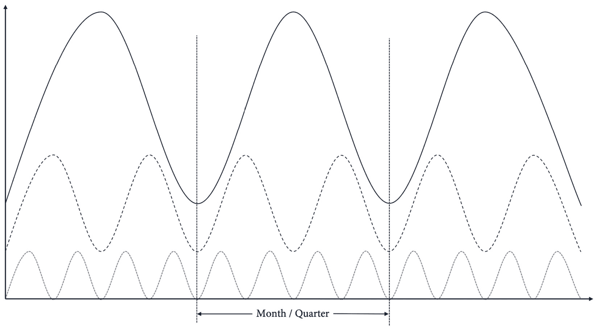

图 17.8 – 将你的节奏与组织的脉搏同步

如果你的节奏没有与组织同步，就会产生摩擦。会议将会冲突，反馈和数字可能在你需要时无法获得。与组织脉搏同步的一致节奏将有助于平滑工作流并改善沟通（*Reinertsen D., 2009*, 第 176–178 页）。

# 单一仓库或多仓库策略

除了团队规模和节奏外，如果你想执行逆康威操作，代码结构的方式也会影响你的架构。有两种策略：

+   **单一仓库策略**：只有一个仓库，包含应用程序所需的所有模块（或微服务）。

+   **多仓库策略**：每个模块或微服务都有自己的仓库，你必须部署多个仓库才能获得一个完整的工作应用程序。

两种策略各有优缺点。单一仓库策略的最大优点是可以轻松地部署和调试整个应用程序。但单一仓库往往会迅速变得非常庞大，这会降低 Git 的性能。此外，随着仓库的增长，独立部署和测试应用程序的不同部分变得困难，这导致了架构的耦合度更紧密。

## 使用大型单一仓库

在 Git 的上下文中，大型仓库意味着什么？Linux 内核的仓库大约是 3 GB。克隆这个仓库需要一些时间，单个 Git 命令也比较慢——但仍在可以接受的范围内。而 Windows 仓库大约是 300 GB——是 Linux 内核的 100 倍。在 Windows 仓库上执行某些 Git 操作需要一些时间：

+   `git clone`：大约 12 小时

+   `git checkout`：大约 3 小时

+   `git status`：大约 8 分钟

+   `git add 和 git commit`：大约 3 分钟

这就是为什么微软维护自己分叉的 Git 客户端 ([`github.com/microsoft/git`](https://github.com/microsoft/git))。这个分叉包含了许多针对大型仓库的优化。它包括 **scalar CLI** ([`github.com/microsoft/git/blob/HEAD/contrib/scalar/docs/index.md`](https://github.com/microsoft/git/blob/HEAD/contrib/scalar/docs/index.md))，可以用来设置高级 Git 配置、在后台维护仓库，并帮助减少网络传输的数据。这些改进大大减少了 Git 操作在 Windows 仓库中的时间：

+   `git clone`：从 12 小时到 90 秒

+   `git checkout`：从 3 小时到 30 秒

+   `git status`：从 8 分钟到 3 秒

许多这些优化现在已经是 Git 客户端的一部分。你可以使用例如 `git sparse-checkout` ([`git-scm.com/docs/git-sparse-checkout`](https://git-scm.com/docs/git-sparse-checkout))，它允许你只下载仓库中需要的部分。

只有当你的仓库真的非常庞大时，你才需要使用微软的分叉版本；否则，你可能可以通过正常的 Git 功能进行优化。

## 通过主题和星标列表组织你的仓库

多仓库策略的最大优点是降低了各个仓库的复杂性。每个仓库可以独立维护和部署。最大缺点是很难构建和测试整个应用程序。但是，要从真实用户那里获取反馈或调试复杂的错误，通常仅部署单一服务或模块是不够的——你需要更新整个应用程序。这意味着需要在多个仓库边界之间协调多个部署。

如果你选择多仓库策略，你将会拥有许多小型仓库。一个好的命名规范有助于结构化它们。你也可以使用**话题**来组织你的仓库。话题可以在仓库的右上角设置（见*图 17.9*）。

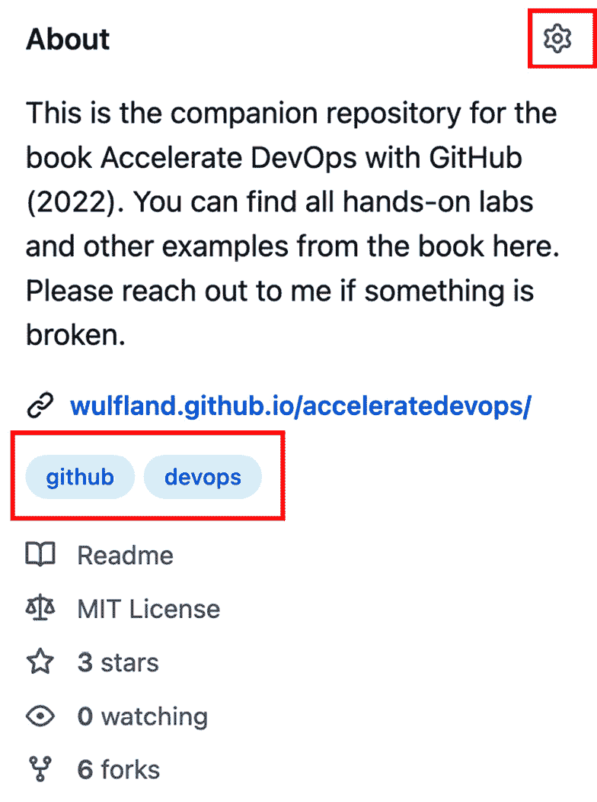

图 17.9 – 你可以为仓库设置话题，以提高可发现性

你可以使用 `topic`：关键词来过滤你的仓库（见*图 17.10*）：

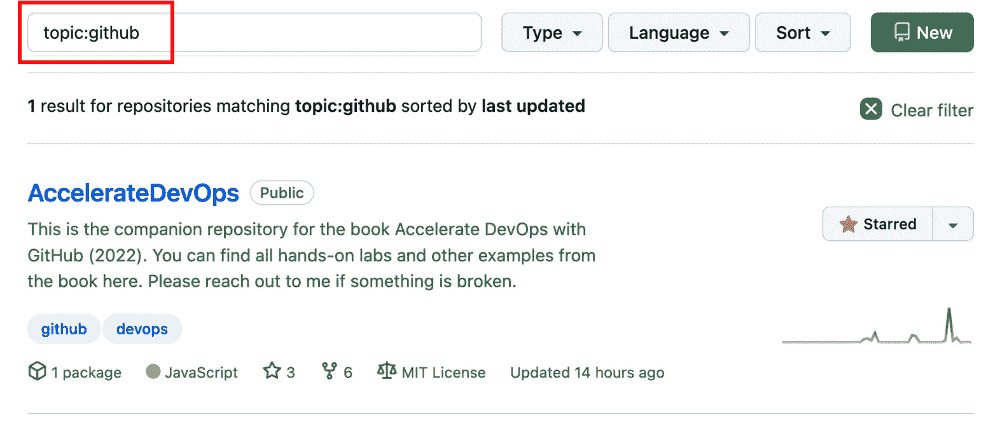

图 17.10 – 根据话题过滤仓库

另一个可以帮助你组织大量仓库的功能是**星标列表**。这是一个个人功能，不能共享。在你的 GitHub 个人主页中，你可以创建列表并组织你收藏的仓库（见*图 17.11*）：

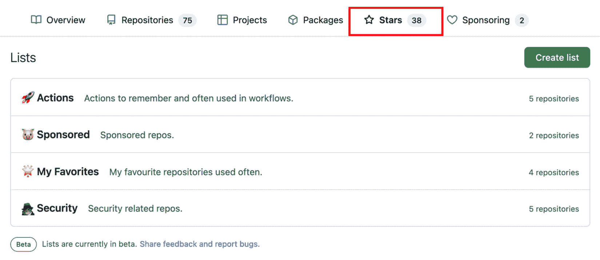

图 17.11 – 将你收藏的仓库按列表进行组织

你可以像浏览器中的收藏夹一样使用这些功能，但它们并不能解决部署、调试或测试整个应用程序的问题。

如果你正在使用 Kubernetes 来管理微服务，你可以在 Visual Studio Code 中使用**Bridge to Kubernetes** 插件（[`marketplace.visualstudio.com/items?itemName=mindaro.mindaro`](https://marketplace.visualstudio.com/items?itemName=mindaro.mindaro)）在生产或测试集群的上下文中调试本地服务（见*Medina A. M., 2021*）。但是，如果你依赖一次性构建和部署所有服务，那么最好的解决方案是拥有一个引用所有服务作为子模块的元仓库。

## 使用 Git 子模块来构建你的代码结构

你可以使用一个包含所有其他仓库作为子模块的元仓库。这样，你可以通过一条命令克隆所有仓库：

```
$ git clone --recurse-submodules
```

或者，如果你已经克隆了元仓库，可以使用以下命令来更新它：

```
$ git submodule update --init --recursive
```

该仓库可以包含部署整个应用程序的脚本或工作流。

你可以使用这个元仓库来进行发布管理，并将稳定版本打包在一起。如果你使用分支进行发布，那么你可以将子模块设置为某个分支，并在发布最新版本之前更新它：

```
$ git config -f .gitmodules submodule.<SUB>.branch main
$ git submodule update --remote
```

如果你使用标签来管理版本，那么你可以将每个子模块设置为特定版本，并将其提交到你的元仓库中：

```
$ cd <SUB>
$ git checkout <TAG>
$ cd ..
$ git add <SUB>
$ git commit -m "Update <SUB> to <TAG>"
$ git push
```

其他人员可以拉取更改并更新子模块到与标签对应的版本：

```
$ git pull
$ git submodule update --init --recursive
```

Git 子模块是处理多仓库并独立部署的一个不错方式，同时仍能管理整个应用程序。但要注意，你的相互依赖关系越多，元仓库的维护和保持其可部署状态的复杂性就越大。

## 什么是正确的策略？

如果单一仓库策略或多仓库策略更适合你的团队，它紧密联系到*第十六章*，*松耦合架构和微服务*，我们在其中讨论了**进化设计**。单一仓库适用于小型产品和全新项目。随着规模和复杂性的增长，最好将微服务或模块拆分并将其移到独立的仓库中。但始终要牢记可测试性和可部署性——既要考虑单个服务/模块，也要考虑整个应用程序。

# 案例研究

在前三个成功的冲刺后，更多的团队在**Tailwind Gears**被迁移到新平台。首批团队已经被选中，负责一个已经可以独立测试和部署的产品。尽管包含了 Scrum Master、产品负责人和 QA 成员，团队的规模稍大，超出了两披萨团队的规则，但这个问题稍后会解决。接下来的团队则大得多，他们正在处理有很多相互依赖关系的大型单体应用。为了执行“逆康威”操作，所有团队汇聚在一起，进行自我组织，决定哪些团队将被迁移到新平台。约束条件如下：

+   不大于一个两披萨团队

+   负责业务能力（`StranglerFigApplication` 模式，并能独立进行测试和部署）。

这有助于推动应用程序设计的演变。新的微服务是云原生的，并拥有自己的云原生数据存储。它们通过 API 和事件驱动架构集成到现有应用中。微服务被移到新平台上的独立仓库中，因为它们大多数时候是独立部署的。与其他团队的同步是通过功能标志来完成的。

对于嵌入式软件，这种方法不可行。团队需要一种方式来构建和部署整个应用程序。但他们也希望能够独立部署和测试单个模块。这就是为什么团队决定将应用程序拆分成不同的仓库，并拥有一个包含其他仓库作为子模块的元仓库。这允许各个团队随时将其模块部署到测试硬件上，以在现实场景中测试新功能——但它仍然保持产品在一个可以随时发布的状态。

当第一个团队迁移到新平台时，他们保持了原有的**冲刺节奏**，每个周期为 3 周。由于团队可以或多或少地自主工作，这并不成问题。随着越来越多的团队加入新平台，节奏逐渐与其他团队同步。Tailwind Gears 是一家上市公司，过去所有的业务报告都是按季度进行的。公司也会每周进行报告，并采用标准化的 4-4-5 日历。每个季度的开始和结束时有很多会议，这些会议经常与冲刺会议发生冲突。团队决定调整他们的节奏以适应这种节奏。一个季度由 13 周组成——但其中一周会有季度会议，因此这一周会从冲刺日历中去除。这一周也用于季度的“大房间规划”。剩下的 12 周被分为 6 个两周的冲刺。

# 总结

在这一章中，你学习了如何利用团队结构和沟通流对软件和系统架构的影响，执行逆向 Conway 操作。这有助于你实现松耦合的架构，使得单元能够自主测试和部署，并对软件交付表现产生积极影响。

在接下来的章节中，我们将更多关注构建什么，而不是如何构建它。你将学习精益产品开发，以及如何将客户反馈融入到你的工作中。

# 进一步阅读

这些是本章的参考资料，你还可以通过它们了解更多相关话题：

+   Conway, Melvin (1968). *《委员会是如何发明的》*：[`www.melconway.com/Home/pdf/committees.pdf`](http://www.melconway.com/Home/pdf/committees.pdf)

+   Raymond, Eric S. (1996). *《新黑客词典》第 3 版*，MIT 出版社

+   Amazon (2020): *《AWS 上的 DevOps 简介》* - *双披萨团队*：[`docs.aws.amazon.com/whitepapers/latest/introduction-devops-aws/two-pizza-teams.html`](https://docs.aws.amazon.com/whitepapers/latest/introduction-devops-aws/two-pizza-teams.html)

+   Willink, J. 和 Leif Babin, L. (2017). *《极端责任：美国海军海豹突击队如何领导并赢得胜利》*，Macmillan

+   Miller, G.A. (1956). *《神奇的七个数字，加减二：我们处理信息能力的限制》*：[`psychclassics.yorku.ca/Miller/`](http://psychclassics.yorku.ca/Miller/)

+   Cohn M. (2009). *《敏捷成功之道：使用 Scrum 进行软件开发》*，Addison-Wesley

+   QSM (2011). *《团队规模可能是成功软件项目的关键》*：[`www.qsm.com/process_improvement_01.html`](https://www.qsm.com/process_improvement_01.html)

+   Karau, S. J. 和 Williams, K. D. (1993). *《社会懒散：一项元分析回顾与理论整合》*，*《人格与社会心理学杂志》*，65(4)，681–706。 [`doi.org/10.1037/0022-3514.65.4.681`](https://doi.org/10.1037/0022-3514.65.4.681)

+   Robbins S. (2005). *《组织行为学精要》*，Prentice Hall

+   Steiner, I.D. (1972). *小组过程与生产力*。Academic Press Inc.

+   Forsgren N., Humble, J. 和 Kim, G. (2018). *加速：精益软件与 DevOps 的科学：构建和扩展高效能技术组织*（第 1 版）[电子书]。IT Revolution Press

+   Skelton M. 和 Pais M. (2019). *团队拓扑：为快速流动组织业务和技术团队*。IT Revolution

+   Reinertsen D. (2009). *产品开发流程的原则：第二代精益产品开发*。Celeritas Publishing

+   Medina A. M. (2021). *使用 VS Code 进行 Kubernetes 的远程调试*：[`developers.redhat.com/articles/2021/12/13/remote-debugging-kubernetes-using-vs-code`](https://developers.redhat.com/articles/2021/12/13/remote-debugging-kubernetes-using-vs-code)
