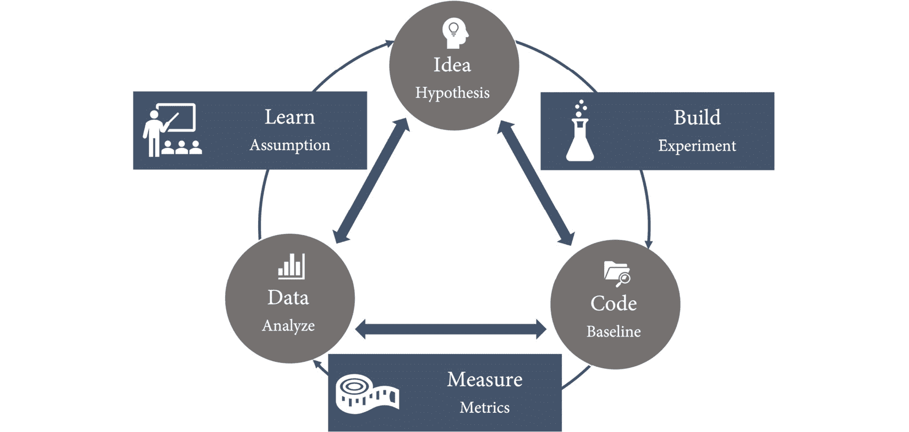

# *第十八章*：精益产品开发与精益创业

到目前为止，我们只关注了*如何*构建和交付软件，而没有关注*构建什么*以及如何确定你是否在构建正确的东西。然而，**精益产品开发**实践对软件交付表现、组织表现和组织文化有着巨大的正面影响（*Forsgren N., Humble J., & Kim G., (2018), 第 129 页*）。因此，许多 DevOps 转型开始时会分析价值流，并试图优化产品管理与工程实践。然而，在我看来，这会导致太多的变化因素，而且这也是一个“先有鸡还是先有蛋”的问题。如果你不能在小批量的情况下频繁交付，就很难应用精益产品管理实践。

在本章中，我们将探讨如何应用精益产品开发和精益创业实践来构建让终端用户喜爱的产品。本章内容包括以下几点：

+   精益产品开发

+   融入客户反馈

+   **最小可行产品**（**MVP**）

+   企业投资组合管理

+   商业模型画布

# 精益产品开发

构建正确的东西是困难的，且常常被低估。你不能仅仅问潜在客户他们想要什么。人们说他们想要的、他们真正想要的以及他们愿意为之付费的，是三件完全不同的事情。

**精益产品开发**是由**丰田**引入的，目的是解决其产品开发方法中的挑战，尤其是缺乏创新、开发周期长和许多重复开发周期的问题（*Ward, Allen 2007 第 3 页*）。

精益产品开发建立在跨职能团队的基础上，这些团队采取增量方法。其主要特点如下：

+   以**小批量**工作。

+   使**工作流**可见。

+   收集并实施**客户反馈**。

+   **团队实验**。

正如你所看到的，这与我们在*第一部分*中学到的内容——*精益管理和协作*——完全一致。新的维度是客户反馈和实验。但没有小批量工作的能力和可见的工作流，就无法基于客户反馈进行实验。

# 融入客户反馈

但是，如何收集客户反馈并将其作为学习融入产品中呢？最重要的是，你需要具备**自主权**才能做到这一点。只要你的团队仍然需要按照要求交付产品，你就无法从客户反馈中学习并将反馈融入到产品中。除此之外，你还需要团队中拥有正确技能的人，或者必须培训你的工程师。**产品管理**和**用户体验设计**是大多数团队中缺乏的技能，但它们对于从客户反馈和互动中学习至关重要。

收集客户反馈的一种方式是通过采访客户或进行**游击式可用性测试**（见*第十二章*，*通过左移测试提升质量*）。但在解读结果时，必须非常小心。人们说什么和他们的行为通常是完全不同的两件事。

要真正完成反馈闭环并从客户行为中学习，你需要以下几个方面：

+   **客户数据**（不仅仅是采访，还包括反馈、使用数据、评估和性能数据等）

+   解读数据的知识（**产品管理技能**）

+   一种科学的方法

**精益创业**方法论将产品管理从直觉（炼金术）转变为科学方法，通过**假设驱动的实验**，采用**构建-衡量-学习**循环（见*Ries, Eric 2011*）：

+   你基于当前客户反馈/数据的分析，制定一个**假设**：

    ```
    We believe {customer segment},wants {product / feature} because {value proposition}
    ```

+   为了验证或证伪假设，团队进行**实验**。实验将影响某些度量指标。

+   团队分析受实验影响的度量指标并从中学习，通常是通过制定新的假设。

*图 18.1*展示了用于假设驱动实验的构建-衡量-学习循环：



图 18.1 – 假设驱动的实验，构建-衡量-学习循环

实践假设驱动的开发并不容易。你需要大量的度量数据，并且要很好地理解最终用户是如何使用你的应用程序的。仅有使用数据是不够的。你必须能够将这些数据与性能指标、错误日志、安全日志以及自定义指标结合起来，以全面了解发生了什么。多少人因为应用太慢而停止使用？有多少人无法登录？多少密码重置是攻击行为，多少是正常用户无法登录？你进行的实验越多，你会发现自己对用户行为的了解中存在的空白越多。但每完成一个循环，你都会学习到更多，并增加更多的度量指标，最终你将构建出对用户更有价值的应用程序。而且，你将学到哪些功能能为用户带来真正的价值，哪些只是浪费，你可以去除它们，使产品更加精简。

假设驱动的实验可以与**目标与关键结果**（**OKRs**）完美结合——见*第一章*，*重要的度量指标*。OKRs 使你能够通过设定特定度量标准上的可衡量关键结果（如增长、参与度或客户满意度），将你的自主团队与更大的愿景对齐。

# 最小可行产品（MVP）

过去几年中，MVP 这个术语被滥用得最为严重。曾经被称为**概念验证**（**PoC**）或**技术探索**（**spike**）的所有东西，现在都被称为 MVP。但 MVP 是产品的一个版本，它通过最小的努力完成一次完整的构建-测量-学习循环（*Ries, Eric 2011* 第 996 页）。

我经常看到的一个图示非常能够引起观众的共鸣：


图 18.2 – 构建 MVP 的错误示例

它展示了你应该在每次迭代中通过解决问题领域来交付价值——在这个例子中是交通问题。问题在于，这不是一个 MVP。这是敏捷交付。但一辆自行车并不能帮助你测试一辆跑车的价值主张！特斯拉不可能通过创造一辆电动自行车来进行电动跑车成功的实验。

如果你用真实客户测试 MVP，始终要记住，它可能会毁掉你的声誉，并让你失去客户。MVP 不能只是最基本的功能。它还必须可靠、易用，并且具有吸引力：


图 18.3 – 一个 MVP 必须测试需求层次中的所有级别

因此，如果你已有现有产品和客户基础，使用 MVP 进行实验会更加容易。对于初创公司和新产品来说，这要困难得多，并且在将 MVP 推出市场之前，必须进行可用性和可靠性测试。如果不这样做，实验可能完全失败。但即使是对于现有产品，在尝试新功能时，确保这些功能可靠、易用并令人愉悦也同样重要！

# 企业投资组合管理

在初创公司中，通常较为容易——至少在开始阶段是这样。但是，如果你有多个团队和多个产品，问题就来了：如何确保跨职能、自主的团队朝着相同的方向努力，并做出服务于组织长期目标的决策呢？

要实践精益产品开发，你的公司需要从指挥控制型流程转向**使命原则**（*Humble J., Molesky J. & O'Reilly B. 2020*）。这会影响到公司中的投资组合管理：

+   **预算编制**：管理层不再像传统做法那样为下一个财年制定预算，而是跨多个维度设定高层次的目标，并定期审查。这种引导可以在多个层次上进行，并在需要时动态分配资源。

+   **项目管理**：管理层在项目层面上明确下一阶段的可衡量目标，而不是制定详细的前期计划。然后，团队自行决定如何实现这些目标。

这可以与 OKRs 完美结合（参见*第一章*，*重要的度量指标*）。

但任务的原则意味着你需要在各个层面上拥有关于产品管理和市场的知识。重要的是要理解，像每个功能一样（参见 *第十章*，*功能标志与功能生命周期*），每个产品都有一个生命周期。新技术会被不同的人群所接受。首先是**创新者**，他们会尝试一切；然后是**早期采用者**或远见者，他们试图走在时代前沿。接下来是大多数人——大约 70%。这些人可以分为**早期大多数**（务实者）和**后期大多数**（保守者）。最后，你还会遇到滞后者或怀疑者，他们只有在没有其他选择时才会跟随趋势：


图 18.4 – 技术采用生命周期

这里有一个有趣的概念——**鸿沟**——这是早期采用者与早期大多数之间的逻辑分界线。鸿沟的形成源于这样的观察：许多创新在不再被创新者视为竞争优势的来源时，遇到了困境，但还没有被早期大多数认为是安全的，因此很多产品正是在这个节点失败。

一旦早期大多数开始采用新技术，通常，其他产品和服务也会进入市场。市场总量仍在增长，但市场会发生变化，因为竞争者增多，质量和价格的预期也会改变：


图 18.5 – 市场成熟度

了解一个产品处于生命周期的哪个阶段非常重要，因为每个阶段都需要不同的策略才能成功。

初创公司从**探索**开始。它们寻找与创始人愿景一致、能够创造客户价值并推动盈利增长的新商业模式。在这个探索阶段，当初创公司找到了*问题/解决方案契合*时，它会尽可能快速地通过使用 MVP 来评估是否也能实现*产品/市场契合*。

一旦商业模式确定，策略就转向**利用**。初创公司通过扩大规模、提高效率以降低成本，来利用这个商业模式。

探索和利用是完全不同的策略，需要不同的能力、流程、风险管理和思维方式。初创公司通常擅长探索，但在利用方面表现较差——企业则擅长利用，但在探索方面较弱。

对于所有公司来说，找到在利用现有产品和探索新商业模式之间的平衡至关重要，因为从长远来看，只有能够同时管理这两者，才能生存。这也是为什么现在如此多的企业拥有**创新**和**孵化中心**，以*模仿*初创公司，评估新的商业模式。

为了管理你的投资组合，你可以将产品绘制在增长矩阵上。矩阵有四个象限，分别代表增长和产品相对于其他投资的重要性：


图 18.6 – 投资组合管理的增长矩阵

产品的大小可以是收入或利润。你应该始终在**新兴**象限中拥有足够的产品，这些产品有潜力发展到**增长**或**成熟**象限，因为有些产品会**衰退**，而没有获得足够的关注。左侧显示的是你应该探索的产品，右侧则是你应该开发的产品。

该矩阵与**波士顿咨询集团**（**BCG**）的**增长-市场份额矩阵**非常相似。该框架由 Alan Zakon（后来的 BCG CEO）于 1970 年创建。增长-市场份额矩阵使用市场份额而不是财务重要性作为*X*轴：


图 18.7 – 增长-市场份额矩阵

该矩阵适用于你清晰了解市场的情况下，但它的运作方式是一样的。**问号**代表增长潜力大的产品，必须进行探索并发展成**明星**或**现金牛**，然后进行开发。**宠物**是失败的实验或衰退中的现金牛。无论如何，你应该尽早关闭它们。

企业面临的挑战是创造出**明星**（或**增长**）象限的产品，而不通过收购。原因在于市场动态（*图 18.5*）以及企业如何管理其投资组合。你可以使用**三视野模型**来管理企业投资组合：


图 18.8 – 三视野模型

三个视野如下：

+   **视野 1**：产生今天的现金流

+   **视野 2**：今天的收入增长和明天的现金流

+   **视野 3**：未来高增长业务的选项

**视野 1** 是你的成熟产品或现金牛。这些产品的投资会在同一年内带来回报。**视野 2** 是新兴产品，它们有潜力成为新的现金牛。它们需要大量投资，但不会像视野 1 中的投资那样带来相同水平的回报。**视野 3** 是未来的潜在明星，但也有很大的失败风险。

三个地平线完全不同，你需要不同的策略才能成功（*Humble J., Molesky J. & O'Reilly B. 2020*）。但不仅仅是需要不同的策略，通常新产品会扰乱市场，夺走现有业务的市场份额和收入。柯达于 1975 年发明了数码相机，但他们的业务建立在开发照片上，而不是捕捉回忆上，这项发明被管理层拒绝。柯达于 2012 年申请破产——那一年几乎每个人随时口袋里都有至少两部数码相机。成功的例子是亚马逊，电子书从他们传统的实物书籍销售业务中夺走了大量份额，或者是微软的云业务，这导致了本地产品许可证销售的下降。

随着新产品从现有市场夺走市场份额和收入，重要的是要引导企业朝着一个让所有人都共享长期成功目标的方向发展。如果没有这样做，人们就会开始联合起来反对新产品，以维护他们在企业中的主导地位。

为了平衡三个地平线，你应该有一个透明的资源分配过程，并应用不同的策略。通常在地平线 3 的投资比例为 10%——通常是按季度进行，根据验证学习来资助。*表 18.1*显示了三个地平线的不同策略和投资：


表 18.1 – 三个地平线的不同策略

但是，是否应该将不同的地平线放在不同的业务单元中？我认为不应该。这样只会导致更多的竞争和孤岛效应。拥有良好的公司文化，具备成长心态和能够平衡短期与长期目标的目标，能够让你在各个层面上都保持创新，并拥抱创新。但良好的产品管理是必要的，它能帮助你清晰地了解每个产品和功能处于生命周期的哪个阶段，以便大家理解所应用的不同策略。

# 提升你的产品管理技能

产品管理是一项对想要实践精益产品开发的成功 DevOps 团队至关重要的技能。许多敏捷项目失败，是因为产品负责人无法推动愿景，并作出常常必要的艰难决策。产品管理基于三大支柱：

+   了解你的客户

+   了解你的业务

+   了解你的产品

## 了解你的客户

要构建令客户满意的产品，必须对使用产品的人有深刻的共鸣。在软件开发中，我们自 90 年代以来使用**人物角色**（虚拟人物）来代表使用我们产品的用户群体（*Goodwin, Kim (2009)*）。在设计功能时，考虑具体的角色帮助我们比单纯把客户看作一个拥有各种特征的大群体时，更能体会客户的需求和局限。

但今天，我们可以做得更多。我们可以收集关于客户如何使用我们产品的数据。我们能从这些数据中提取哪些人物角色（可用性群体）？最常见的使用场景是什么？哪些功能没有被使用？哪些使用场景在完成之前就被终止了？这些都是我们应该通过数据分析定期回答的问题。

## 了解你的业务

为了构建成功的产品，你的团队还必须了解业务。我们处在哪个市场，我们的市场份额有多大？我们的竞争对手是谁，他们的优势和劣势是什么？

理解业务通常是工程师们一个全新的领域。传统上，这是在不同层面上完成的，且只有少量的信息传递给工程师。像**商业模型画布**（*见下一节*）这样的练习可以帮助你在团队中培养这些技能。

## 理解你的产品

理解产品通常是工程团队的强项。但理解产品不仅仅意味着你知道功能，还意味着你了解产品是如何操作的，如何进行负载均衡，性能如何，以及你积累了多少技术债务。

当然，你可以增加有经验的产品经理和用户体验设计师到团队中。但正如我们在上一章中讨论的，你应该保持团队精简。每个你创建和发布的功能、每一个你进行的实验、每一个你做出的决策，都需要这些技能。最好是提升团队技能，让他们拥有例如用户体验设计师等能够在需要时帮助团队的能力。

# 商业模型画布

为了加强工程师的产品管理技能，你可以进行一项练习，创建**商业模型画布**——这是一个用于创建或记录现有商业模型的模板。商业模型画布由亚历山大·奥斯特瓦尔德（Alexander Osterwalder）于 2005 年开发。你可以在这里下载该模板的免费副本：https://www.strategyzer.com/canvas/business-model-canvas。

画布是为了在大幅纸张上打印出来，团队可以一起头脑风暴，绘制草图或在上面添加便签。它包含了商业模型的九个关键组成部分：

+   **价值主张**：我们要解决什么问题？我们满足了哪些需求？

+   **客户群体**：我们为谁创造价值？我们最重要的客户是谁？

+   **客户关系**：我们的每个客户期望我们与他们建立什么样的关系？

+   **渠道**：我们的客户希望通过哪些渠道与我们接触？

+   **关键伙伴**：我们需要与谁建立伙伴关系？我们的关键供应商是谁？

+   **关键活动**：为了实现我们的价值主张，哪些活动是必需的？

+   **关键资源**：我们的价值主张需要哪些资源——如人员、技术和流程？

+   **成本结构**：商业模型中最重要的成本驱动因素是什么？是固定成本还是可变成本？

+   **收入流**：客户愿意为什么价值支付？支付多少，支付频率如何？

画布包含了一些帮助你的团队创建商业模型的提示，正如你在以下截图中看到的：


](img/B17827_18_09.jpg)

图 18.9 – 商业模型画布

通过填写画布的所有区域，你在考虑任何潜在的创意时，都已经从整个商业模型的角度进行了思考，并且你被鼓励以整体的方式思考所有元素如何协调在一起。

# 总结

在本章中，你已经学习了精益产品管理的重要性，以及如何将客户反馈融入到你的工作流程中。你了解了什么是 MVP，以及如何通过假设驱动开发来构建正确的东西。

在下一章中，我们将更深入地了解如何进行 A/B 测试来进行实验。

# 进一步阅读

以下是本章的参考文献，你可以进一步参考以获得更多相关话题的信息：

+   Forsgren N., Humble, J., & Kim, G. (2018). *加速：精益软件与 DevOps 的科学：构建和扩展高绩效技术组织* (第 1 版) [电子书]。IT Revolution Press

+   Ward, Allen (2007). *精益产品与过程开发*。精益企业研究所，美国

+   Ries, Eric (2011). *精益创业：今天的企业家如何利用持续创新创造极其成功的企业* [Kindle 版]。Currency

+   Humble J., Molesky J. & O'Reilly B. (2015). *精益企业：高绩效组织如何在规模化中创新* [Kindle 版]。O'Reilly Media

+   Osterwalder, Alexander (2004). *商业模型本体论：设计科学方法中的一个提案*：http://www.hec.unil.ch/aosterwa/PhD/Osterwalder_PhD_BM_Ontology.pdf。

+   Goodwin, Kim (2009). *为数字时代设计——如何创建以人为本的产品和服务*。Wiley
