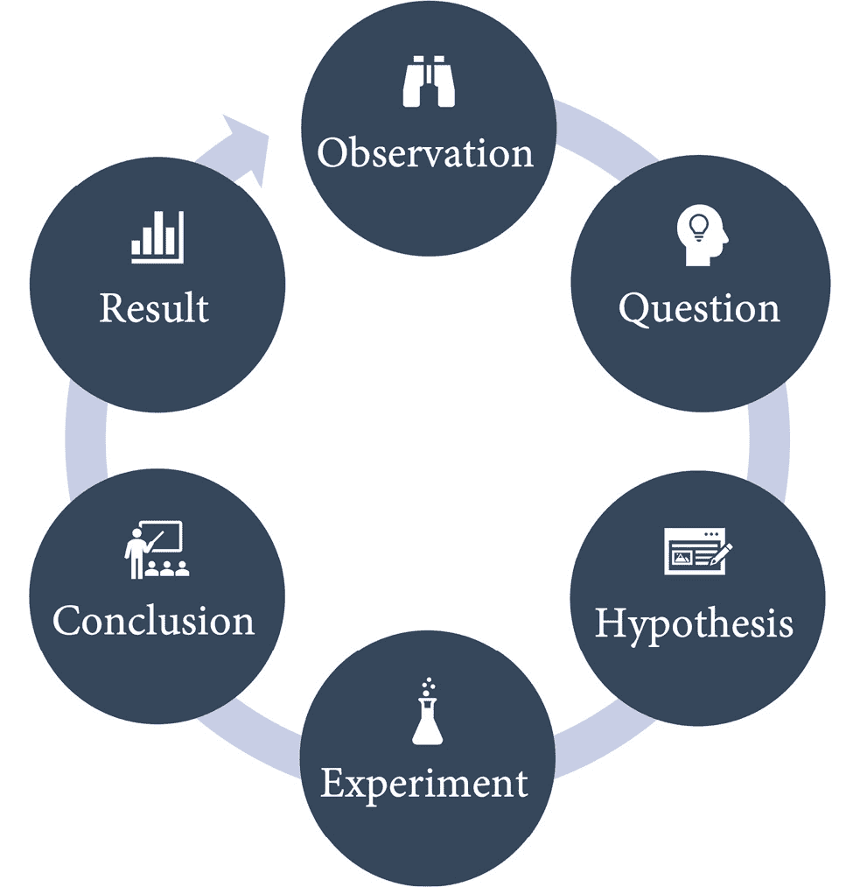
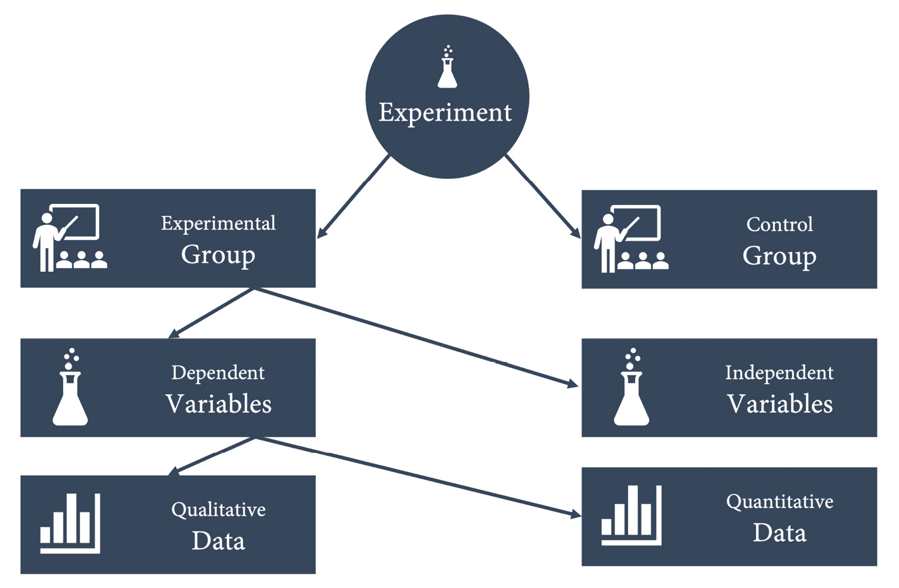
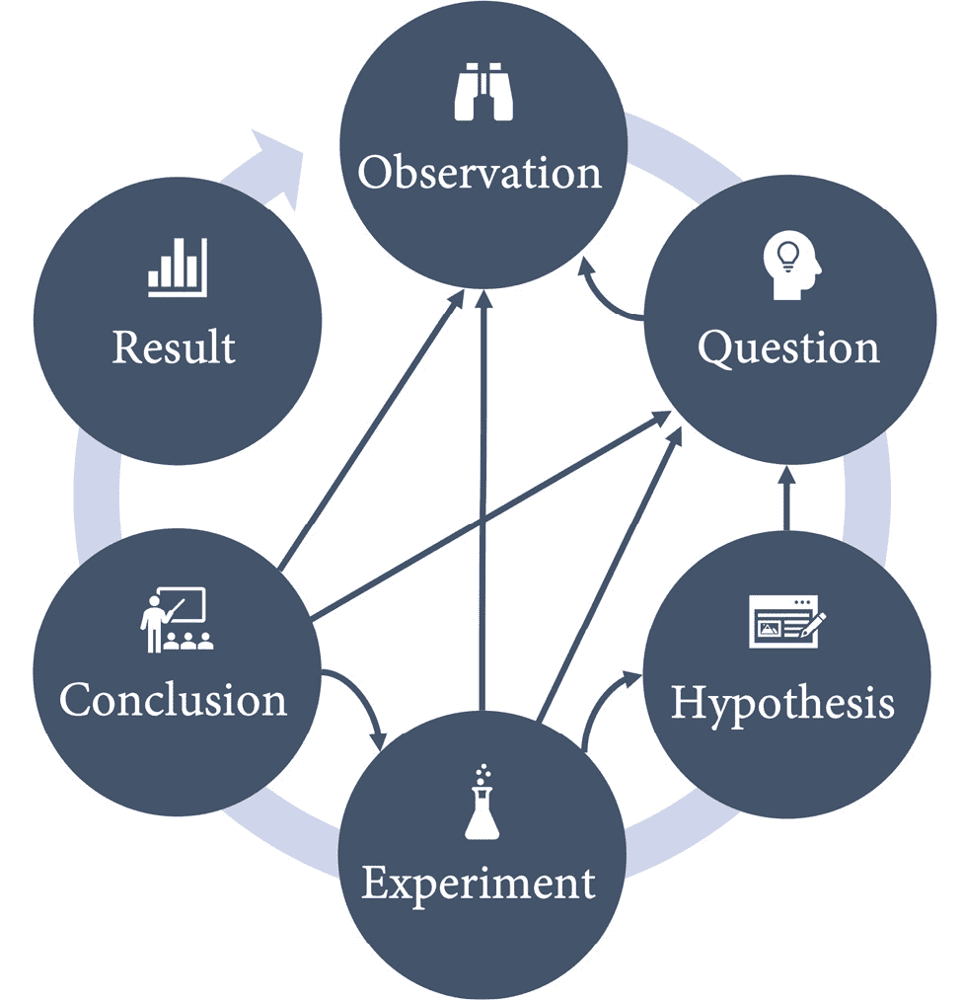
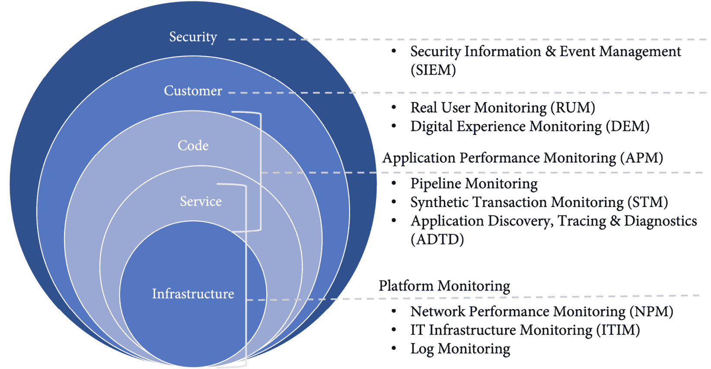
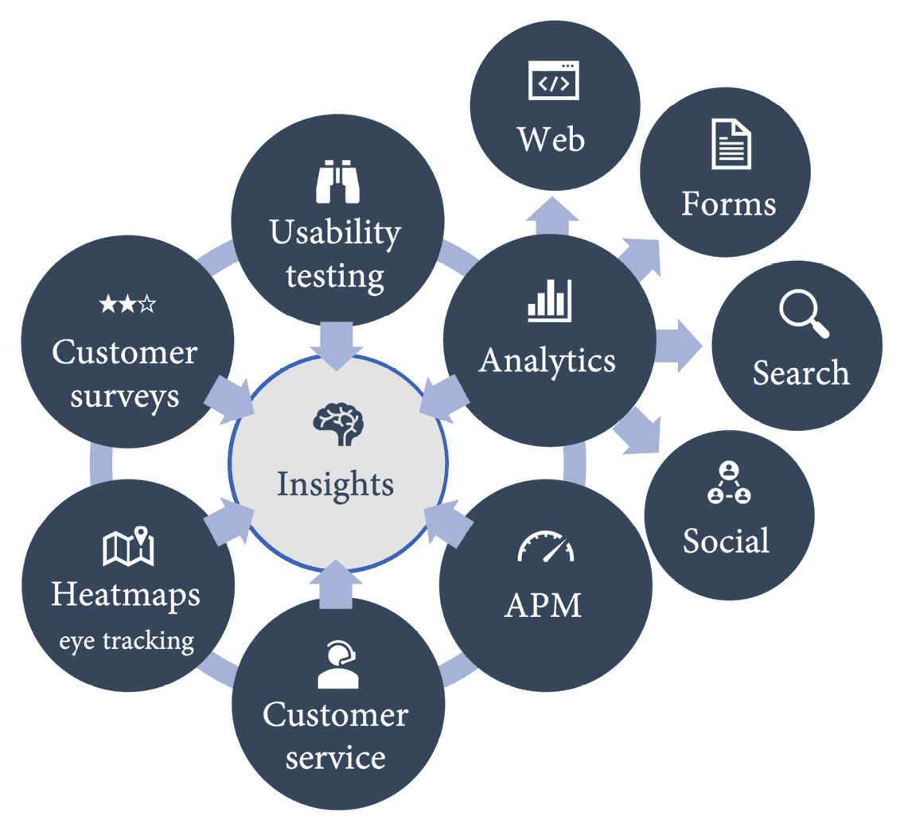
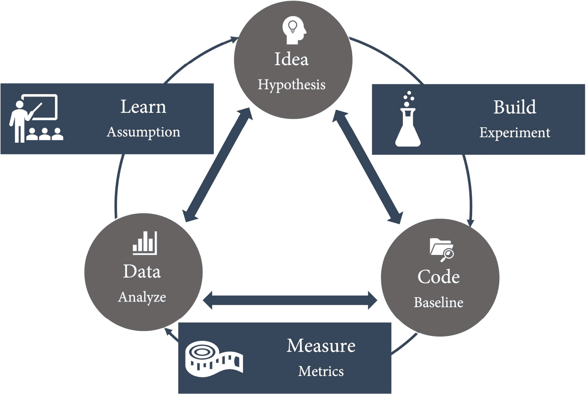
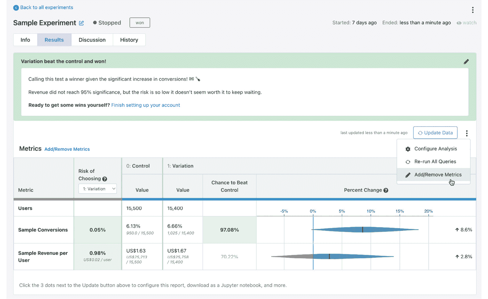

# 第十九章：实验与 A|B 测试

在本章中，我们将讨论如何通过进行实验来验证假设，通过基于证据的 DevOps 实践（如**A|B 测试**）来发展和持续改进产品。这有时被称为**假设驱动开发**或仅仅是**实验**。

本章将涉及以下主题：

+   使用科学方法进行实验

+   使用 GrowthBook 和 Flagger 进行有效的 A|B 测试

+   实验与 OKR

# 使用科学方法进行实验

传统上，需求管理更多的是猜测而非科学。最接近科学方法的是访谈或一般的市场调研。这种方法的问题在于，你不能询问人们他们还不知道的东西。你可以问他们想要什么，但不能问他们需要什么，因为他们可能还不知道，特别是在一个被颠覆的市场领域。

假设驱动的开发理念是将**科学方法**应用于产品管理，这是一种基于实证的获取知识的方式。

科学方法是通过实验来探索观察结果并回答旨在发现因果关系的问题的过程。它遵循特定的步骤（见*图 19.1*）：



图 19.1 – 科学方法

我们将详细介绍各个步骤：

1.  **观察**：通过五种感官观察现实：嗅觉、视觉、听觉、触觉和味觉。

1.  **问题**：基于观察、现有研究或以往实验提出问题。

1.  **假设**：根据在提出问题时获得的知识陈述假设。假设是基于观察和研究预测你认为将会发生的事情。假设通常以*如果……那么……*的形式写出，例如：“*如果*我们修改这个变量，*那么*我们预期能够观察到这个变化。”

1.  **实验**：实验验证或推翻假设。在实验中，有不同的变量。**自变量**是你用来引发结果的变量。**因变量**是你衡量并期望变化的变量。在实验中，你通过观察收集**定性数据**，通过测量和收集指标得到**定量数据**。

实验还使用对照组来证明差异不仅仅是偶然的。为了测试药物的治疗效果，必须设计一个实验，其中一部分人群——**对照组**——不接受治疗，而是给他们安慰剂，而**实验组**则接受潜在药物的治疗（见*图 19.2*）。



图 19.2 – 进行科学实验

为了进行一个好的实验，你应该一次只改变*一个变量*，同时保持其他所有变量不变。你还应该*避免偏见*。无论你多么努力，偏见很容易悄悄进入你的观察和结论中。

1.  **结论**：实验结束后，你需要分析结果并将实际结果与预期结果进行比较。你从实验中学到了什么？你能验证或反驳你的假设吗？是否有新的假设或新的问题需要提出？还是需要更多实验来确认？

1.  **结果**：最后一步是分享你的结果。即使你的假设被反驳，它仍然是宝贵的学习。

科学方法是一种迭代的、经验性的方式，但这些步骤不一定按照这个顺序进行。在任何时候，你都可以修改你的问题并改变假设——观察始终在进行中。这个过程的图示看起来不像一个清晰的循环，更像是*图 19.3*：



图 19.3 – 该过程中的步骤没有严格的顺序

科学方法在我们的行业中非常重要——不仅仅是为了构建正确的东西。你也应该在寻找漏洞或生产问题时使用这种方法：基于观察到的事实提出假设。通过一次只改变一个因素（通常是配置值）来进行实验。进行交叉检查，以确保没有其他系统或变量干扰你的实验。得出结论并记录结果，然后再开始下一个假设。

让我们来看一下如何使用科学方法来不断进化和改进你的软件。

## 观察——收集和分析数据

你可以通过观察人们使用你的应用来进行观察。我们在*第十二章*，“通过左移测试提高质量”中，讨论了**可用性测试**技巧，如**走廊测试**或**游击式可用性测试**。然而，通常用户分布在世界各地，观察他们产生的数据比采访他们更为方便。

数据是**假设驱动开发**中最重要的成分！你进行的实验越多，随着时间的推移，你收集的数据就会越多。

在观察数据时，你不应只关注手头的数据点。问问自己数据没有告诉你什么。如果你的目标是每个月增加活跃用户的数量，你不应只将观察集中在当前用户的数据上。检查失败的登录尝试数据。多少用户想要使用你的应用程序，但被锁定无法恢复密码或第二次认证因素？多少人在需要验证邮件或手机号码后没有回来？有多少人取消了注册过程，他们在取消之前等待了多久？

为了回答这些问题，你不能仅仅查看使用数据。你必须结合所有可用的数据来源（参见*图 19.4*）：



图 19.4 – 用于收集数据的日志来源

这些定量数据可以与定性数据结合，如客户调查、来自客户服务中心的数据或任何种类的分析数据。*图 19.5* 显示了你可以用来获取见解并制定问题的不同数据来源：



图 19.5 – 用于观察的数据来源

牢记这些问题后，你可以开始制定假设。

## 制定假设

假设是你基于观察和研究所预测的结果。假设可以用简单的*如果……那么……*的形式表达：*如果* *<我们修改这个变量>*, *那么* *<我们预期会观察到这个变化>*。

*如果* 我们通过删除如电话号码和邮寄地址等字段来缩短注册表单，*那么* 放弃注册过程的用户数量（*放弃率*）将会减少。

由于你将有许多假设在待办事项中，通常会有一个固定的格式，类似于用户故事，其中包括客户细分和功能名称。这使得你的假设在待办事项中更加可发现：

*我们相信* *{客户细分}*

*想要* *{功能}*

*因为* *{价值主张}*

这种形式也迫使你将三个方面纳入你的假设：

+   **谁**：我们是为了谁改变应用程序？

+   **什么**：我们正在改变什么？

+   **如何**：这一变化将如何影响用户？

这些要素构成了一个好的假设：

*我们相信* 新用户

*想要* 一个更短的注册表单，减少输入字段

*因为* 这让他们能够在公开个人数据之前测试应用程序并获得信心。

请注意，专注于价值主张会导致对**如何**的描述更加抽象，重点放在**为什么**。在市场营销中，你常常在假设中找到这样的细节：

+   影响是什么？

+   变化的幅度是多少？

+   在多长时间后？

这导致假设与实验之间建立一对一的关系。特别是在开始实验时，我认为将实验与潜在假设分开是有帮助的。在你最终能确定假设是正确还是错误之前，可能需要多个实验。

## 构建实验

在定义实验时，你应该尽量保持尽可能多的变量固定。最好的方法是查看你的基线数据。周末和假期将如何影响你的数据？政治和宏观经济趋势将如何影响你的实验？

同样，请确保您的控制组和实验组足够大。如果您只在一个小组进行实验，则您的结果可能不具有代表性。如果您的对照组太小，则可能没有足够的数据可以进行比较，特别是如果存在您没有预见到的其他外部因素。一个好的实验应包含以下信息：

+   有什么改变？

+   预期影响是什么？

+   谁是受众或客户群体？

+   我们期望有多大的变化？

+   实验运行多长时间？

+   我们将数据与基线进行比较（控制组或历史数据）。

这里有一个例子。

新的、*更短的注册表单*（**什么改变**）将使*我们的新用户*（**为谁**）的*注册表单弃用率*（**影响**）在*14 天*（**多久后**）后比我们的对照组（**基线**）降低超过*15%*（**多少**）。

定义实验后，您可以开始实施和运行它。如果您使用功能标志开发（见*第十章*，*功能标志和功能生命周期*），这就像编写新功能一样简单。唯一的区别是，您不是为所有用户打开该功能，而是为您的实验组打开该功能。

## 验证结果

实验结束后，分析结果并将实际结果与预期结果进行比较。您从实验中学到了什么？您能验证或证伪您的假设吗，还是需要更多实验来确保？是否有新的假设或新的问题需要提出？

结果的回顾性研究是一个重要部分。不要跳过它，也不要仅仅假设假设成立或失败，因为您的指标超过了一个阈值。分析数据并检查意外的影响、离群值和统计异常。

从您的假设和实验中学习应该会导致新的想法，并完成构建-测量-学习循环（参见*图 19.6*）：



图 19.6 – 假设驱动的构建-测量-学习循环

有许多可用工具可以帮助您进行有效的 A|B 测试和实验。

# 使用 GrowthBook 和 Flagger 进行有效的 A|B 测试

GitHub 没有提供帮助进行 A|B 测试的工具，但市场上有许多相关工具。问题在于这些工具的范围差异很大。一些更像是网站体验工具，你可以用它们通过**内容管理系统**（**CMS**）来构建你的网站，或者使用可视化编辑器来构建并测试 A|B 测试变体（例如，**Optimizely** – 参见 https://www.optimizely.com/）。有些则更加关注市场营销、登录页和活动管理，例如**HubSpot**（https://www.hubspot.com/）。这些工具很棒，但可能不是工程团队的最佳选择。

更好的解决方案来自于功能标志工具，如**LaunchDarkly**、**VWO**或**Unleash**。我在*第十章*《功能标志与功能生命周期》中已经介绍了这些工具，因此这里不再重复。如果你正在使用这些功能标志解决方案，这就是你寻找 A|B 测试解决方案的第一站。

在本章中，我将重点介绍**GrowthBook**和**Flagger**，这两个开源项目都非常注重实验，但采用了完全不同的方法。

### GrowthBook

**GrowthBook** ([`github.com/growthbook/growthbook`](https://github.com/growthbook/growthbook))是一个具有免费和开放核心的解决方案。它也有 SaaS 和企业计划，并为**React**、**JavaScript**、**PHP**、**Ruby**、**Python**、**Go**和**Kotlin**提供 SDK。

GrowthBook 的解决方案设计是完全容器化的。如果你想尝试它，只需要克隆该仓库并运行以下命令：

```
docker-compose up -d
```

一旦启动，你可以通过[`localhost:3000`](http://localhost:3000)访问 GrowthBook。

在 GitHub Codespaces 中运行 GrowthBook

如果你想尝试使用 GrowthBook，可以在 GitHub Codespaces 中运行它。为了使其正常工作，你需要配置`docker-compose.yml`以使用正确的 DNS 名称，因为 GrowthBook 使用 localhost 连接到其 MongoDB。将`APP_ORIGIN`在`environment`下设置为本地`3000`端口的地址，将`API_HOST`设置为本地`3001`端口的地址，并确保`3001`端口是可访问的。

连接成功后，你可以使用它来服务功能标志或构建实验。要构建实验，你需要将数据源连接到 GrowthBook——例如，**BigQuery**、**Snowflake**、**Redshift**或**Google Analytics**等多种选择。系统提供了预定义的数据架构，也可以让你自定义。然后，你可以根据数据源创建度量指标。度量指标可以是以下任何一种：

+   `账户已创建`

+   `页面访问`

+   `网站停留时间`

+   `每用户收入`

进行实验时，通常会使用功能标志。你也可以直接使用其中一个 SDK 进行内联实验。以下是一个用 JavaScript 进行实验的示例：

```
const { value } = growthbook.run({
```

```
  key: “my-experiment”,
```

```
  variations: [“red”, “blue”, “green”],
```

```
});
```

实验根据你定义的度量标准运行，结果与*图 19.7*中的示意图类似：



图 19.7 – GrowthBook 中实验结果

你可以向实验中添加或删除度量指标，也可以将其导出为 Jupyter 笔记本。

GrowthBook 还配有 Google Chrome 扩展**GrowthBook DevTools**，适用于 JavaScript 和 React SDK，允许你直接在浏览器中与功能标志交互。目前，视觉编辑器处于 Beta 阶段。

GrowthBook 非常直接，也基于功能标志，类似于在*第十章*中介绍的解决方案。

## Flagger

另一种完全不同的方法是使用**Flagger**（[`flagger.app/`](https://flagger.app/)）。它是一个**Kubernetes**的交付操作员，可以与**服务网格****Istio**一起使用。Flagger 更常用于**金丝雀发布**到 Kubernetes 集群，但它也可以根据 HTTP 匹配条件路由流量。

你可以为所有拥有`insider` cookie 的用户创建一个持续 20 分钟的实验，如下所示：

```
analysis:
```

```
  # schedule interval (default 60s)
```

```
  interval: 1m
```

```
  # total number of iterations
```

```
  iterations: 20
```

```
  # max number of failed metric checks before rollback
```

```
  threshold: 2
```

```
  # canary match condition
```

```
  match:
```

```
    - headers:
```

```
        cookie:
```

```
          regex: “^(.*?;)?(type=insider)(;.*)?$”
```

你可以将 Flagger 与**Prometheus**、**Datadog**、**Dynatrace**等多个度量工具结合使用。我在这里不会进一步详细说明，更多信息请参阅 Flagger 文档（[`docs.flagger.app/`](https://docs.flagger.app/)）。Stefan Prodan 还提供了一个很好的教程：*使用 Flux v2、Flagger 和 Istio 进行渐进式交付的 GitOps 实践*（请参阅[`github.com/stefanprodan/gitops-istio`](https://github.com/stefanprodan/gitops-istio)）。

使用 Flagger 和 Istio 的解决方案提供了很大的灵活性，但也非常复杂，并不适合初学者。如果你已经在 Kubernetes 和 Istio 上，并执行金丝雀发布，那么 Flagger 可能是一个强大的框架。

正如你所看到的，市面上有许多解决方案可以帮助你进行实验和 A/B 测试。从专注于 CMS 和活动的工具到 Kubernetes 操作员，有各种完全不同方法的解决方案。适合你的最佳解决方案取决于许多因素——主要是你现有的工具链、定价和支持。我认为，专注于流程和数据分析更为重要。提供两个版本的应用程序不应该是挑战——理解你的数据可能才是。

# 实验与 OKR

在*第一章*，*重要的度量标准*中，我向你介绍了**目标和关键结果**（**OKRs**）作为一种框架，用于透明地定义和跟踪目标及其结果。OKRs 帮助组织在战略目标上实现高度的一致性，同时保持个别团队的最大自主性。

工程团队是一项昂贵的资源，很多利益相关者总是向他们提出要求：测试人员提交缺陷、客户请求新功能、管理层希望赶超竞争对手并向重要客户做出承诺。团队如何才能找到进行实验的自由？又该从哪些实验开始呢？

OKR 可以使你能够与更高层次的目标保持紧密对齐，同时保留自主决定 *做什么* 和 *如何做* 的权力。

假设你的公司希望成为市场领导者，市场份额达到 75%，为了实现这一目标，需要不断增长的注册用户数量。你团队的**关键结果**是每月 20%的增长率。这样就能为你的团队设定优先级。当然，还有其他事情要做，但优先级将是 OKR。团队可能首先会调查有多少人访问注册页面，并且他们的来源是什么。多少人点击了**立即注册**按钮？有多少人完成了对话框？他们在哪个环节没有再回来？到那个点时，他们就开始自动构思假设，并可以进行实验来验证它们。

OKR 也有利于跨团队合作，因为团队之间很可能有高协同效应的 OKR，因为它们与更高层次的目标保持一致。在这个例子中，团队很可能希望与市场营销部门进行沟通，因为他们可能有类似的 OKR。他们可能会有自己关于实验的想法，帮助提高通向注册页面的着陆页的参与率。

OKR（目标与关键结果）是一个很好的工具，通过确保与其他团队和更高层目标的对齐，为团队提供实验的自由。

# 总结

实验、A|B 测试和假设驱动的开发是困难的话题，因为它们在多个领域需要高度成熟：

+   **管理**：你的团队需要有自主决定 *做什么* 和 *如何做* 的权力。

+   **文化**：你需要有一种信任文化，在这里人们不怕失败。

+   **跨团队合作**：你的团队必须能够跨学科工作，因为实验通常需要不同部门之间的合作。

+   **技术能力**：你必须能够在很短的时间内将变更发布到生产环境，并针对不同的客户群体。

+   **洞察力**：你必须具备强大的分析能力，并将来自不同来源的数据和指标结合起来。

如果你还没有做到这一点，别担心。我与许多团队合作时，他们也没有做到这一点。只要继续提高你的能力，并检查你的指标是否显示出结果。DevOps 是一个旅程，而不是目标，你必须一步一步走。

在本章中，你已经了解了实验、A|B 测试和假设驱动的开发的基本知识，我也介绍了一些可以帮助你构建解决方案的工具。

在下一章，您将学习 GitHub 的基础知识——托管选项、定价以及如何将其集成到您的现有工具链和企业中。

# 进一步阅读

这些是本章中的参考资料和链接，您也可以使用它们来获取更多关于这些主题的信息：

+   *科学方法*：https://en.wikipedia.org/wiki/Scientific_method

+   *基于环的部署*：[`docs.microsoft.com/en-us/azure/devops/migrate/phase-rollout-with-rings`](https://docs.microsoft.com/en-us/azure/devops/migrate/phase-rollout-with-rings)

+   *Optimizely*：[`www.optimizely.com/`](https://www.optimizely.com/)

+   *Hubspot*：[`www.hubspot.com/`](https://www.hubspot.com/)

+   *GrowthBook*：[`github.com/growthbook/growthbook`](https://github.com/growthbook/growthbook)

+   *Flagger*：[`flagger.app/`](https://flagger.app/)

+   Stefan Prodan：*GitOps 实现渐进交付与 Flux v2、Flagger 和 Istio*：[`github.com/stefanprodan/gitops-istio`](https://github.com/stefanprodan/gitops-istio)
