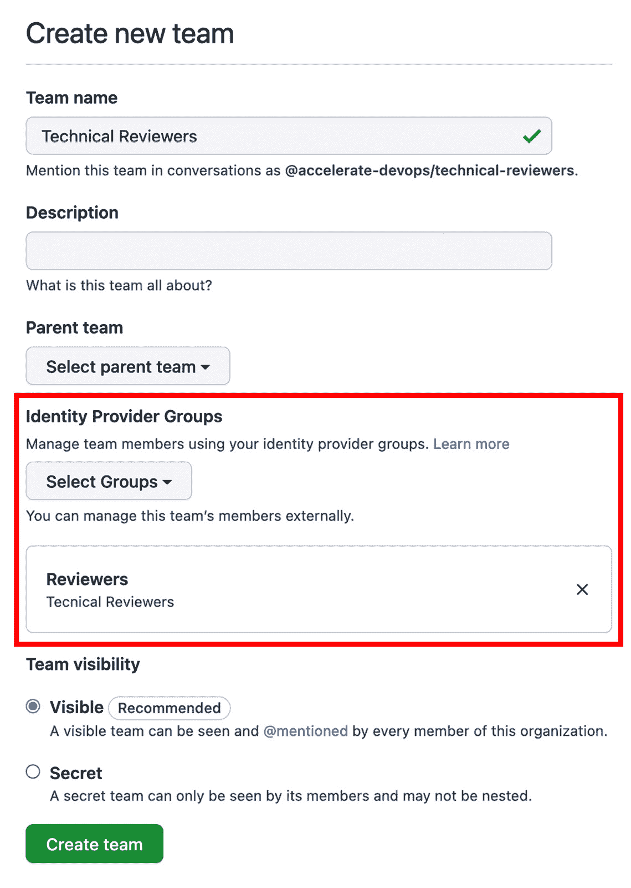

# *第二十章*：GitHub – 所有开发者的家园

在本章中，我将解释 GitHub 平台的一些基础知识。你将了解不同的托管选项、定价以及如何将其集成到现有的工具链中。

关键主题如下：

+   托管选项和定价

+   GitHub Connect

+   实操 – 在 GitHub.com 上创建你的账户

+   企业安全

+   GitHub 学习实验室

# 托管选项和定价

GitHub 提供多种不同的许可证和托管选项。理解这些选项非常重要，这样才能为你的企业做出正确的选择。

## 托管选项

**GitHub**（[`github.com`](https://github.com)）托管在美国的数据中心。你可以免费注册 GitHub 并获得无限的私有和公共仓库。GitHub 中的许多功能对于开源项目是免费的，但对于私有仓库则不免费。

对于企业，你可以选择不同的 GitHub 托管选项（见 *图 20.1*）：


图 20.1 – GitHub 企业版的托管选项

### GitHub 企业版云

**GitHub 企业版云**（**GHEC**）是 GitHub 提供的 SaaS 服务，完全由 GitHub 在其位于美国的云基础设施中托管。你可以为用户应用额外的安全性并支持单点登录。GHEC 允许你托管私有和公共仓库，使你能够在企业背景下托管开源项目。

GHEC 保证你享有 **SLA** 为 *99.9%* 的每月正常运行时间，这意味着每月最多停机 45 分钟。

### GitHub 企业版服务器

**GitHub 企业版服务器**（**GHES**）是一种可以自行托管的系统。你可以在自己的数据中心或云环境中（如 Azure 或 AWS）进行托管。你可以使用 GitHub Connect 连接到[GitHub.com](http://GitHub.com)，这样可以共享许可证并在服务器上使用开源资源。

GHES 基于与 GHEC 相同的代码，因此最终，所有功能将在几个月后同步到服务器。但云端提供的一些功能，诸如 GitHub Actions 中的运行器，你必须在 GHES 上自己处理。在云端，你可以使用 GitHub 托管的运行器；而在 GHES 上，你必须使用自托管的运行器来构建自己的解决方案。

还有一些托管服务可以为你托管 GHES，例如，在你所在地区的 Azure 数据中心。这样，你可以完全控制数据驻留，并且无需自己管理服务器。有些还包括托管 GitHub Actions 运行器的服务。

### GitHub 企业版 AE

GitHub 正在构建一个名为**GitHub 企业版 AE**（**GHAE**）的服务。目前该服务正处于仅限 500 座以上客户的私有 beta 测试阶段，尚未确定公开发布的日期。

GHAE 是 GitHub 提供的完全独立的、托管的服务，位于你选择的 Microsoft Azure 区域。这为你提供完整的数据驻留和合规性。

对于需要数据驻留和合规性的客户，这是未来的一个不错选择，但目前尚不清楚它何时可用、定价是多少，以及最低座位数是多少。

## GitHub Connect

GitHub 的强大之处在于其社区以及社区所提供的价值。为了能够在服务器上利用这一点，你可以通过**GitHub Connect**将你的服务器连接到 GitHub。你可以逐一激活每个功能，如*图 20.2*所示：


图 20.2 – 在 GHES 上配置 GitHub Connect

以下是功能列表：

+   **许可证同步**：在多个服务器或组织之间管理企业内的许可证使用情况。这有助于确保每个用户只使用一个许可证，无论他们在哪个地方登录。

+   **统一搜索**：一个选择是允许在服务器上进行搜索，并从[GitHub.com](http://GitHub.com)获取公共仓库的结果。此外，你还可以允许在服务器上搜索，并找到属于你企业的私有仓库（当然，前提是用户有权限访问这些仓库）。

+   **GitHub.com actions**：要在工作流中加载公共 actions，必须启用此选项。如果不启用，你必须将所有 actions 分叉到你的服务器，并从那里引用它们。你仍然可以在组织级别配置允许哪些 actions。

+   **统一贡献**：没有此选项时，用户在服务器上的贡献将不会显示在其公共个人资料中。此选项不会暴露敏感数据。仅会将贡献数量—如提交、问题、讨论或拉取请求—发送到 GitHub.com。

## 定价

GitHub 的费用按月按用户计费，基于三种不同的定价层级：**免费**、**团队**和**企业**（见*图 20.3*）：


图 20.3 – GitHub 定价层级概述

公共仓库—因此也就是开源—是**免费的**，并且提供很多免费功能，如 Actions、Packages 以及许多安全功能。私有仓库是免费的，但功能有限，并且提供 2000 分钟的 Action 时间和 500 MB 的存储空间。关于 Actions 的定价，已经在*第七章*《运行你的工作流》中详细介绍。

如果你真的想在私有仓库中与 GitHub 合作，你至少需要 **团队** 许可证。它包括 **保护分支**、**代码拥有者** 和其他高级拉取请求功能。你还可以访问 **Codespaces**，但你必须单独为其付费（有关 Codespaces 的定价，请参见 *第十三章*，*向左移动安全与 DevSecOps*）。团队级别包含 3000 个 Action 分钟和 2 GB 的包存储空间。

免费和团队版本仅在 [GitHub.com](http://GitHub.com) 上可用。如果你需要 GHEC、GHES 或 GHAE，你必须购买 GitHub **企业** 许可证。此许可证包含所有企业功能，如单点登录、用户管理、审计和政策，并提供 50,000 个 Action 分钟和 50 GB 的包存储空间。它还允许你购买其他附加功能，如 **高级安全** 或 **高级支持**。

许可证是按 10 个为一组购买的，可以按月或按年支付。如果你想使用 GitHub 高级安全性或高级支持，你必须与 GitHub 销售团队或 GitHub 合作伙伴联系。他们可以为你提供报价。

除了许可证层级之外，还有一些按使用计费的内容，例如：

+   操作

+   包

+   Codespaces

+   市场按需付费应用

你可以在组织或企业级别配置支出限制。

# 实操 – 在 GitHub.com 上创建你的账户

到目前为止，我假设你已经有一个 GitHub 账户。GitHub 拥有超过 7000 万用户，你很有可能已经拥有。如果你有一个账户，只需跳过此部分，继续进行 **企业安全**。

注册 GitHub 是非常简单的。它的设计像一个控制台向导。创建新帐户的步骤如下：

1.  访问 [`github.com`](https://github.com) 并点击 **注册**。

1.  输入你的电子邮件地址并点击 **继续** 或按 *Enter*，如 *图 20.4* 所示：


图 20.4 – 输入你的电子邮件地址

1.  输入一个强密码并点击 **继续**。

1.  输入一个用户名。用户名必须是唯一的。GitHub 会告诉你该名称是否可用，如 *图 20.5* 所示：


图 20.5 – 创建密码并选择一个独特的用户名

如果你找到了一个独特的用户名，点击 **继续**。

1.  现在，你可以选择是否接收电子邮件通信。输入 `y` 代表 *是* 或 `n` 代表 *否*，然后点击 **继续** 或按 *Enter*。

1.  通过点击图像中的指定部分来解决验证码。请注意，验证码可能会以浏览器的首选语言显示（见 *图 20.6*）：


图 20.6 – 邮件通信与验证码

1.  现在，检查你的电子邮件账户。你应该已经收到了一个验证码，可以将其粘贴到以下字段中（见 *图 20.7*）：


图 20.7 – 输入发送到你电子邮件地址的验证码

1.  接下来的对话框是用来个性化你的体验的。如果你不需要，可以跳过它们。

1.  你可以选择免费试用 GitHub Enterprise 30 天。这段时间应该足够让你尝试所有功能。

成功创建账户后，你应该立刻完成一些步骤：

1.  前往 [`github.com/settings/security`](https://github.com/settings/security) 并勾选 **启用双因素认证** 来保护你的账户。

1.  在 [`github.com/settings/profile`](https://github.com/settings/profile) 填写你的个人资料并选择一个好的头像。

1.  在 [`github.com/settings/appearance`](https://github.com/settings/appearance) 选择你喜欢的主题。你可以选择单一的浅色或深色主题，或者选择将主题与系统同步。

1.  前往 [`github.com/settings/emails`](https://github.com/settings/emails) 选择如何处理你的电子邮件地址。你可以选择将你的电子邮件地址设为私密。GitHub 会在进行基于 Web 的 Git 操作时使用一个特殊的电子邮件地址，该地址格式为：`<user-id>+<user-name>@users.noreply.github.com`。如果你想阻止命令行推送时暴露真实邮箱地址，你需要在本地配置此地址：

    ```
    $ git config --global user.email <email address>
    ```

你的 GitHub 账户现在已经准备好，你可以开始创建代码库或贡献开源项目了。

# 企业安全

作为一个企业，你可以使用 **SAML** **单点登录**（**SSO**）和你的 **身份提供者**（**IdP**）一起保护你的 GitHub Enterprise 资源。SSO 可以在 GHEC 的企业级和组织级进行配置，在 GHES 中只能为整个服务器配置。

SAML SSO 可以与所有支持 SAML 的 IdP 配置，但并非所有 IdP 都支持 **跨域身份管理系统**（**SCIM**）。以下 IdP 是兼容的：**Azure AD**（**AAD**）、Okta 和 OneLogin。

## SAML 认证

在 GitHub 中配置 SAML SSO 非常简单。你可以在企业或组织的设置中找到相应的设置，路径为 `/settings/security`) | **SAML 单点登录**。在这里，你可以找到配置 IdP 所需的消费者 URL（见 *图 20.8*）：


图 20.8 – 在 GitHub 中配置 SAML SSO

字段的值必须在您的 IdP 中进行配置。请查看其文档以获取更多信息。例如，在 AAD 中，您可以在此处找到详细的说明：[`docs.microsoft.com/en-us/azure/active-directory/saas-apps/github-tutorial`](https://docs.microsoft.com/en-us/azure/active-directory/saas-apps/github-tutorial)。您必须在 AAD 中创建一个新的企业应用。您可以搜索 GitHub 的模板并选择相应的模板（针对企业、组织或服务器）。有关当前可用模板，请参见*图 20.9*：


图 20.9 – AAD 中 GitHub 的企业应用模板

为您希望访问 GitHub 的应用分配用户或组。重要的配置在**设置单点登录**中进行（参见*图 20.10*）：


图 20.10 – 配置您的企业应用

使用组织或企业 URL 作为标识符。您可以使用在*图 20.8*中看到的 URL 的第一部分，只是不要包括 `/saml/consume`。将此 URL 作为 `/saml/consume` 用于 `/sso` 作为**登录 URL**。结果应类似于*图 20.11*：


图 20.11 – AAD 企业应用中的基本 SAML 配置

属性和声明可以用于调整 AAD 中字段的映射。如果您的 AAD 没有进行自定义，默认设置应该有效（参见*图 20.12*）：


图 20.12 – 配置 SAML 令牌的属性和声明

下载用于签署 SAML 令牌的**Base64**证书（参见*图 20.13*）：


图 20.13 – 下载 SAML 签名证书

复制**登录 URL**和**Azure AD 标识符**URL（参见*图 20.14*）：


图 20.14 – 获取登录 URL 和 Azure AD 标识符

现在，您可以返回 GitHub 并填写数据。然后，将**登录 URL**信息粘贴到**登录 URL**字段，将**Azure AD 标识符**URL 粘贴到**发行者**字段。用文本编辑器打开证书，并将内容粘贴到**公钥证书**字段。结果类似于*图 20.15*：


图 20.15 – 在 GitHub 中配置 SAML SSO

点击**测试 SAML 配置**并使用您的 AAD 凭据登录。如果一切成功，您可以勾选**需要 SAML 身份验证**来强制使用 SAML 进行访问。GitHub 会检查哪些用户没有通过 IdP 获得访问权限，并在您确认后将其移除。

请注意，只有授权的 PAT 令牌和 SSH 密钥才能访问受 SSO 保护的内容。每个用户必须前往其 PAT 令牌/SSH 密钥并按照*图 20.16*中的示例进行授权：


图 20.16 – 为 SSO 保护的组织授权 PAT 令牌

当然，每个 IdP 的配置不同，具体值也会略有差异，取决于您是在配置企业、组织还是服务器。但有了您的 IdP 文档，设置过程应该非常直接。

## SCIM

如果您启用 SAML SSO，用户在您在 IdP 中停用时将不会自动取消配置。您可以在 GHEC 中实施**SCIM**，以根据您的 IdP 信息自动添加、管理和移除访问权限。

SCIM 是一个 API 端点（见`docs.github.com/en/enterprise-cloud@latest/rest/reference/scim`），由您的 IdP 用于管理 GitHub 中的用户。兼容的 IdP 例如 **Azure AD**、**Okta** 和 **OneLogin**。要配置 SCIM，您必须遵循您的 IdP 的文档，如果它们兼容的话。以下是 AAD 的教程：[`docs.microsoft.com/en-us/azure/active-directory/saas-apps/github-provisioning-tutorial`](https://docs.microsoft.com/en-us/azure/active-directory/saas-apps/github-provisioning-tutorial)。

禁用第三方访问限制

请注意，在授权您的 IdP 之前，您必须在组织设置中禁用第三方访问限制。您可以在**设置** | **第三方访问** | **禁用访问限制**下进行此操作。

## 自动团队同步

如果您在 GHEC 上使用 SAML SSO，您可以设置**团队同步**以自动与您的 IdP 同步团队成员。目前，团队同步仅支持**AAD**和**Okta**。

您可以在组织的设置中启用团队同步，路径为`/settings/security`。在此处，您可以看到有多少个团队已同步，并跳转到过滤后的审计日志查看所有相关事件（见*图 20.17*）：


图 20.17 – 为组织启用团队同步

启用后，您可以创建新团队，并从您的 IdP 中选择一个或多个组与您的团队同步，如*图 20.18*所示：



图 20.18 – 创建具有自动同步功能的团队

您可以将这些团队添加到其他团队中（**父团队**），但无法将嵌套的组同步到 GitHub。

## 企业管理用户

在 GHEC 中，即便为企业或组织设置了 SAML SSO，每个用户仍然需要在 GitHub.com 上有一个用户账户。GitHub 用户账户基本上是用户的身份，而 SAML 授权则是授予某些企业资源的访问权限。用户可以利用他们的身份为开源项目和其他组织做贡献，并且必须通过 SSO 认证才能访问企业资源。但许多组织并不希望如此。他们希望完全控制用户的身份。解决方案就是**企业托管用户**（**EMU**）。通过 EMU，用户的身份完全由 IdP 管理。当用户首次使用 IdP 的身份登录时，系统会创建一个新用户。该用户无法为开源项目做贡献，也不能被添加为其他仓库的外部协作者。此外，贡献只会计入该用户的资料中。

EMU 为你的企业提供了对身份的强大控制，但也带来了许多限制，以下是一些例子：

+   用户不能在企业外部**协作**、**加星**、**关注**或**分叉**仓库。他们不能创建问题或拉取请求，**推送代码**、评论或对这些仓库添加反应。

+   用户仅对同一企业的其他成员可见，且不能关注企业外部的其他用户。

+   他们无法在用户账户上安装**GitHub Apps**。

+   用户只能创建**私有**和**内部**仓库。

这些限制使得很多事情变得困难。GitHub 的一个主要优点是它与开源仓库的集成。但如果 EMU 允许你使用云服务而不是服务器实例，或许值得尝试一下。

当前，EMU 支持的 IdP 有**AAD**和**Okta**。

如果你想尝试 EMU，你必须联系 GitHub 的销售团队，他们会为你创建一个新的企业。

想了解更多关于 EMU 的信息，请参阅`docs.github.com/en/enterprise-cloud@latest/admin/identity-and-access-management/managing-iam-with-enterprise-managed-users/about-enterprise-managed-users`。

## 使用 GHES 进行身份验证

在服务器上，事情的运作方式有所不同。你可以为**SAML**、**LDAP**或**CAS**配置 SSO。配置过程简单，与 GHEC 差别不大。用户无需[GitHub.com](http://GitHub.com)账户；他们可以通过 IdP 直接登录到服务器，类似于 EMU。但如果配置了 GitHub Connect，用户可以在**用户设置** | **GitHub Connect**中连接他们的 GitHub 账户，并将贡献数量共享到他们的公共 GitHub 资料中。这样，如果他们愿意，便可以将多个企业身份连接到他们的 GitHub 资料中。

## 审计 API

GHEC 以及 GHES 都支持审计日志。日志包含所有与安全相关的事件的日志条目。每个审计日志条目都显示有关事件的适用信息，如下所示：

+   执行操作的企业或组织

+   执行操作的用户（`actor`）

+   受到该操作影响的用户

+   执行操作的仓库

+   执行的操作

+   操作发生的国家

+   操作发生的日期和时间

*图 20.19*显示了 GHEC 企业级别的示例审计日志。你可以搜索并过滤审计日志。你可以选择预定义的过滤器，并点击日志条目的标题元素来创建过滤语句：


图 20.19 – GHEC 实例的审计日志

在 GHEC 中，你可以启用日志流并配置将所有事件自动流式传输到以下目标之一：

+   Amazon S3

+   Azure Blob 存储

+   Azure 事件中心

+   Google Cloud Storage

+   Splunk

你可以通过 Azure 事件中心将事件转发到其他工具，如 Log Analytics 或 Sentinel。

你还可以通过审计日志 API 访问审计日志。你可以使用 GraphQL 或 REST API 查询审计日志。以下示例展示了如何使用 REST API 检索特定日期的所有事件：

```
$ curl -H "Authorization: token TOKEN" \
```

```
--request GET \
```

```
"https://api.github.com/enterprises/name/audit-log?phrase=created:2022-01-01&page=1&per_page=100"
```

要了解如何使用 API 查询审计日志，请参见`docs.github.com/en/enterprise-cloud@latest/admin/monitoring-activity-in-your-enterprise/reviewing-audit-logs-for-your-enterprise/using-the-audit-log-api-for-your-enterprise`。

# GitHub 学习实验室

GitHub 的一个大优势是大多数开发者已经知道它是如何工作的。这意味着培训和入职所需的时间较少。但是，当然，仍然有一些开发者是 GitHub 的新手。GitHub 提供了免费的 GitHub 学习实验室（https://lab.github.com/）。它包含许多学习路径，利用 GitHub 问题和机器人为你提供动手实践经验，帮助你学习 GitHub。

如果你更喜欢这种学习方式，Microsoft Learn 上也有许多免费的学习路径可用。只需访问 Microsoft Learn 并按产品筛选，选择 GitHub：[`docs.microsoft.com/en-us/learn/browse/?products=github`](https://docs.microsoft.com/en-us/learn/browse/?products=github)。

# 总结

在本章中，你了解了 GitHub 的不同定价和托管选项。你学习了企业安全性以及如何将 GitHub 集成到你的企业中。

在下一章，我将向你展示如何将现有的源代码管理系统或 DevOps 解决方案迁移到 GitHub。

# 进一步阅读

使用以下链接获取更多关于这些主题的信息：

+   *定价*: [`github.com/pricing`](https://github.com/pricing)

+   *GitHub AE*: `docs.github.com/en/github-ae@latest/admin/overview/about-github-ae`

+   *SCIM*: `docs.github.com/en/enterprise-cloud@latest/rest/reference/scim`

+   *企业托管用户*: https://docs.github.com/en/enterprise-cloud@latest/admin/identity-and-access-management/managing-iam-with-enterprise-managed-users/about-enterprise-managed-users

+   *审计日志*: https://docs.github.com/en/enterprise-cloud@latest/admin/monitoring-activity-in-your-enterprise/reviewing-audit-logs-for-your-enterprise/about-the-audit-log-for-your-enterprise

+   *GitHub 学习实验室*: https://lab.github.com

+   *Microsoft Learn*: [`docs.microsoft.com/en-us/learn`](https://docs.microsoft.com/en-us/learn)
