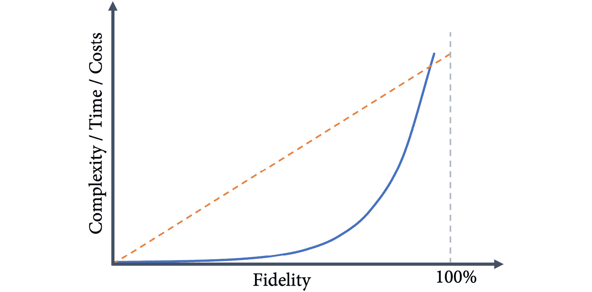
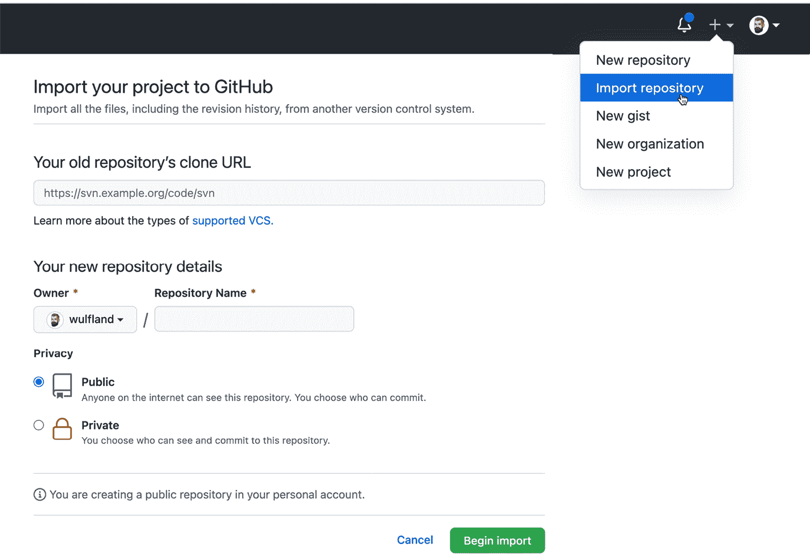

# 第二十一章：迁移到 GitHub

如果你不是初创公司，那么在迁移到新平台时，必须考虑现有的工具和流程。本章将讨论从不同平台迁移到 GitHub 的不同策略。

本章将涵盖以下内容：

+   选择正确的迁移策略

+   实现低保真迁移的合规性

+   同步要求以确保顺利过渡

+   使用 GitHub 企业导入工具从 Azure DevOps 迁移

+   使用 Valet 迁移管道

# 选择正确的迁移策略

当迁移到新平台时，你有不同的选择：

+   **高保真迁移**：你尽可能多地将内容迁移到新平台。

+   **彻底切换迁移**：你只迁移开始使用新平台所需的最少内容。

**高保真迁移**到复杂平台面临不同的问题。主要问题是并非所有实体都有一对一的映射，并且不同平台的工作方式不同。通过迁移所有内容，你会影响人们使用新系统的方式。数据是根据旧系统和旧流程进行优化的。此外，高保真迁移所涉及的时间、成本和复杂性并非线性关系。你越是想实现 100%的保真度，复杂性和成本就越高，而 100%通常是无法实现的（见*图 21.1*）。



图 21.1 – 不同保真度水平的复杂性、时间和成本

**彻底切换迁移**如果你想实现行为上的变化并最优化地使用新平台，则是最理想的选择。在本书的案例研究中，我假设采用的是彻底切换迁移：团队们从新平台开始，仅迁移绝对必要的内容。

现实情况介于这两种极端之间。如果你希望加速软件交付，你应该从彻底切换迁移开始，但为了在企业中扩大规模并推动采纳，你需要为团队提供一些迁移路径和工具，使其能够快速迁移。同时，会有一些暂时搁置的项目/产品，你可能希望将其归档，以便以后重新激活。你可以保持所有旧系统的运行，或者直接将其迁移过去。

# 实现低保真迁移的合规性

许多客户关心的一个问题是**端到端可追溯性**，这是出于**合规性**的原因。在许多高度监管的行业中，你必须为所有要求和最终功能测试提供端到端的可追溯性。低保真迁移的问题在于，这会导致可追溯链条的中断。

但这并不意味着唯一的解决方案是高保真度迁移。你仍然可以进行一次彻底的切换，并将旧系统保持在只读模式下运行，直到必要时为止。在新系统中，你无论如何都必须实现端到端的可追溯性。为了保持合规性，你需要将旧系统的标识符映射到新系统，涵盖两个系统的需求。

在审计的情况下，你可以提供来自两个系统的报告——无论是旧系统还是新系统。对于某些需求，你可能需要查看这两个报告，但只要有能在系统之间映射的标识符，这仍然能提供有效的可追溯性。

保持旧系统运行的麻烦通常远小于执行高保真度迁移的麻烦，但这取决于许多因素，比如旧系统的许可证。

# 为顺利过渡同步需求

在这个背景下，尤其是对于拥有多个不同工具的大型企业，一个有趣的选项是通过像 **Tasktop**（https://www.tasktop.com/）这样的产品，在不同平台之间同步需求。Tasktop 为许多产品提供连接器，如 Jira、Salesforce、ServiceNow、IBM Rational、IBM DOORS、Polarion ALM、Azure DevOps 等。工具间同步需求和工作项可以实现多个用例：

+   在迁移期间，同时在旧工具和新工具中工作。这给了你更多的时间进行迁移，并且能够在保持完全可追溯性的同时，一个接一个地迁移团队。

+   给予不同角色和团队自由，使用他们偏好的工具。你的项目经理喜欢 Jira，架构师偏爱 IBM Rational，运维团队使用 ServiceNow，而你的开发人员想切换到 GitHub？你可以通过在这些工具之间同步数据来实现这些工作流程。

尤其是在复杂的环境中，当你有一个大产品并且多个团队同时工作时，同步需求和工作项有助于优化迁移。

# 迁移你的代码

迁移到 GitHub 时，最简单的事情就是迁移你的代码，尤其是当代码已经存储在另一个 Git 仓库中时。只需使用 `--bare` 克隆仓库，确保仓库处于干净状态：

```
$ git clone --bare <URL to old system>
```

然后将代码推送到仓库：

```
$ git push --mirror <URL to new repository>
```

如果仓库已经包含代码，你必须添加 `--force` 参数来覆盖现有内容。你还可以使用 GitHub CLI 在推送现有代码时即时创建仓库：

```
$ gh repo create <NAME> --private --source <local path>
```

由于在 Git 中，作者信息是通过电子邮件地址进行匹配的，你只需在 GitHub 中为所有用户创建账户，并为他们分配在之前 Git 系统中使用的电子邮件地址。这样作者信息就能正确解析。

你还可以使用 **GitHub 导入工具**导入代码。除了 Git，以下仓库类型也被支持：

+   **Subversion**

+   **Mercurial**

+   **团队基础版本控制** (**TFVC**)

GitHub 导入工具接受源系统的 URL，并创建一个新仓库。大于 100 MB 的文件可以排除或添加到 Git **大文件存储**（**LFS**）中。

要使用 GitHub 导入工具导入一个仓库，请点击个人头像旁边的加号，然后选择 **导入仓库**（见 *图 21.2*）：



图 21.2 – 导入一个仓库

如果你从 **Subversion** 迁移，可以使用 **git-svn**（[`git-scm.com/docs/git-svn`](https://git-scm.com/docs/git-svn)）在 Git 和 Subversion 仓库之间同步更改：

```
$ git svn <command>
```

如果你从 **Azure DevOps**/**Team Foundation Server** 迁移，最佳方法是先从 **TFVC** 迁移到 Git，然后再迁移到 GitHub。还有一个类似于 git-svn 的工具：**git-tfs**（[`github.com/git-tfs/git-tfs`](https://github.com/git-tfs/git-tfs)）。它也允许你在 Git 和 TFVC 之间同步更改，或者直接迁移到 GitHub：

```
$ git tfs <command>
```

注意

Git 对短生命周期的分支进行了优化——而 TFVC 则没有。你不应仅仅将代码和所有分支迁移过去。利用这个机会进行一次干净的切换，并从新的分支模型开始。将代码迁移到 Git 可以是保留部分历史记录的第一步，但迁移后你应该调整你的分支模型。

将代码迁移到 GitHub 并不困难。有许多工具可以帮助你。挑战在于如何从旧的分支模型迁移到一个新模型，这个新模型优化了你的新平台，并提高了软件交付性能（请参见 *第十一章*，*基于主干的开发*）。

挑战在于那些不是直接存储在 Git 中的内容：拉取请求、关联的工作项和管道。这些内容比仅仅是 Git 仓库本身更需要关注。

# 从 Azure DevOps 或 GitHub 迁移

如果你从 GitHub 迁移到 GitHub 或从 Azure DevOps 迁移到 GitHub，可以使用 `extension install`：

```
$ gh extension install github/gh-gei
```

```
$ gh gei --help
```

你可以将 **个人访问令牌**（**PAT**）设置为环境变量，以便对源系统和目标系统进行身份验证：

```
$ export ADO_PAT=<personal access token>
```

```
$ export GH_SOURCE_PAT=<personal access token>
```

```
$ export GH_PAT=<personal access token>
```

你也可以通过 `generate-script` 将它们传递，使用 `--github-source-pat` 和 `--ado-pat` 参数。

要创建迁移脚本，请根据你是否想从 GitHub 或 Azure DevOps 迁移，执行以下命令之一：

```
$ gh gei generate-script --ado-source-org <source> --github-target-org <target>
```

```
$ gh gei generate-script --github-source-org <source> --github-target-org <target>
```

这将生成一个 PowerShell 脚本 `migrate.ps1`，该脚本可用于实际的迁移。脚本将调用 `gh gei migrate-repo` 对在 Azure DevOps 或 GitHub 组织中找到的所有团队项目进行迁移。这将排队实际的迁移操作。然后，它通过执行 `gh gei wait-for-migration --migration-id`，获取前一个命令的输出，以获得迁移状态。

GEI 当前支持以下内容：

+   **Azure DevOps**（**ADO**）

+   **GitHub 企业服务器**（**GHES**）3.4.1+

+   GitHub 企业云

对于 Azure DevOps，将迁移以下项目：

+   Git 源

+   拉取请求

+   用户拉取请求历史

+   拉取请求中的工作项链接

+   拉取请求中的附件

+   仓库的分支保护

对于 GitHub 企业服务器和云，以下内容也会被迁移：

+   问题

+   里程碑

+   Wiki

+   仓库级别的项目板

+   GitHub Actions 工作流（不包括机密和工作流运行历史记录）

+   提交评论

+   活跃的 Webhooks

+   仓库设置

+   分支保护

+   GitHub Pages 设置

+   上述数据的用户历史记录

请参见 [`docs.github.com/en/early-access/github/migrating-with-github-enterprise-importer`](https://docs.github.com/en/early-access/github/migrating-with-github-enterprise-importer) 获取更多信息。请注意，GEI 仍处于 beta 版本，可能会频繁更改。

如果你使用的是 GitHub 企业服务器，你还可以使用 `ghe-migrator` 从另一个服务器实例或 GitHub 企业云导入数据。有关 GitHub 企业服务器的数据导入导出更多信息，请参见 `docs.github.com/en/enterprise-server@3.4/admin/user-management/migrating-data-to-and-from-your-enterprise/about-migrations`。

# 迁移你的管道

要将你的管道迁移到 GitHub Actions，你可以使用一个名为 **Valet** 的工具。它支持以下来源：

+   Azure DevOps（经典管道、YAML 管道和发布）

+   Jenkins

+   Travis CI

+   Circle CI

+   GitLab CI

Valet 是一个基于 Ruby 的命令行工具，通过 Docker 安装。

注意

Valet 在撰写时仍处于私有 beta 阶段，且可能会发生变化。Valet 不是一个 100% 有效的解决方案，无法迁移一切！它是可扩展的，你将需要编写自己的转换器，并且迁移后可能仍需进行一些手动操作。

Valet 的分发是通过拉取容器镜像并使用两个脚本 `valet` 和 `valet-update` 与之互动：

```
$ docker pull ghcr.io/valet-customers/valet-cli
```

一旦你获得私有 beta 访问权限，你需要通过用户名和具有 `read:packages` 访问权限的 PAT token 进行身份验证才能访问 `ghcr.io`：

```
$ docker login ghcr.io -u <USERNAME>
```

最好的方式是将 Valet 安装为 GitHub CLI 扩展，但你仍然需要在你的机器上运行 Docker，并且必须经过身份验证才能访问注册表。要将 Valet 安装为 GitHub CLI 扩展，请执行以下命令：

```
$ gh extension install github/gh-valet
```

现在，你可以使用 `gh valet update` 轻松更新 Valet。

Valet 使用环境变量进行配置。最简单的方法是将这些变量设置在你使用 Valet 的文件夹中的 `.env.local` 文件里。例如，这是将管道从 Azure 迁移到 GitHub 企业云的配置：

```
GITHUB_ACCESS_TOKEN=<GitHub PAT>
```

```
GITHUB_INSTANCE_URL=https://github.com
```

```
AZURE_DEVOPS_PROJECT=<project name>
```

```
AZURE_DEVOPS_ORGANIZATION=<org name>
```

```
AZURE_DEVOPS_INSTANCE_URL=https://dev.azure.com/<org>
```

Valet 有三种模式：

+   `gh valet audit` 将分析所有支持的管道的源下载信息。它将生成一个审计摘要报告（Markdown），包含所有管道、构建步骤和找到的环境。你可以使用审计来规划你的迁移。

+   `gh valet dry-run` 将把流水线转换为 GitHub Actions 工作流文件，并输出 YAML 文件。

+   `gh valet migrate` 将把流水线转换为 GitHub Actions 工作流文件，并在目标 GitHub 仓库中创建一个拉取请求，包含对工作流文件的更改。

+   `gh valet forecast` 根据历史流水线利用率预测 GitHub Actions 的使用情况。

要使用之前的配置进行审核并生成报告，只需运行以下命令：

```
$ gh valet audit azure-devops --output-dir .
```

这将生成一个 `audit_summary.md` 报告，并为每个受支持的流水线生成三个文件：一个 `.config.json` 文件，包含配置；一个 `.source.yml` 文件，包含转换为 YAML 的源流水线；以及一个 `.yml` 文件，包含转换后的 GitHub Actions 工作流，稍后将进行迁移。要执行一个流水线的迁移，运行 `valet migrate`：

```
$ valet migrate azure-devops pipeline \
```

```
  --target-url https://github.com/<org>/<repo-name> \
```

```
  --pipeline-id <definition-id>
```

请记住，这是一项尽最大努力的迁移！并不是所有内容都可以迁移。例如，以下元素无法迁移：

+   秘密

+   服务连接

+   未知任务

+   自托管运行器

+   来自 Key Vault 的变量

你可以为流水线步骤编写自己的转换器，无论是对于未知步骤，还是覆盖 Valet 的现有行为。创建一个新的 Ruby 文件（`.rb`），并以以下格式添加一个函数：

```
transform "taskname" do |item|
```

```
end
```

对于 Azure DevOps 任务，名称中包括版本号。要查看项目对象包含的内容，可以通过 `puts item` 将其输出到控制台。

这是一个示例转换器，它会覆盖 `DotNetCoreCLI` 任务的版本 2，并用 Bash 上的运行步骤替代，使用 `globstar` 语法迭代所有 `.csproj` 文件，并使用源流水线中的参数执行命令：

```
transform "DotNetCoreCLI@2" do |item|
```

```
  if(item["command"].nil?)
```

```
    item["command"] = "build"
```

```
  end
```

```
  {
```

```
    shell: "bash",
```

```
    run: "shopt -s globstar; for f in ./**/*.csproj; do dotnet #{ item['command']} $f #{item['arguments'] } ; done"
```

```
  }
```

```
end
```

要使用自定义转换器，你可以使用 `--custom-transformers` 参数。如果你有多个转换器，可以指定单个转换器或整个目录：

```
$ valet migrate azure-devops pipeline \
```

```
  --target-url https://github.com/<org>/<repo-name> \
```

```
  --pipeline-id <definition-id> \
```

```
  --custom-transformers plugin/*
```

每个工作流系统都有不同！确保花时间分析你希望如何转换你的流水线，以便优化新平台，而不是仅仅尝试迁移所有内容。如果你已经搞清楚了这一点，那么 Valet 将是一个很好的工具，帮助你更快地将团队过渡到 GitHub。

# 概述

GitHub 是一个复杂且快速发展的生态系统，对于任何形式的迁移都充满挑战。在迁移时，确保专注于优化新平台上的生产力，而不是迁移所有内容后再让团队处理混乱。根据你所在组织的规模和源平台的不同，你的迁移过程可能完全不同。

在本章中，你已经了解了 GitHub 和合作伙伴提供的不同工具，这些工具可以帮助你促进迁移过程。

在下一章，我们将讨论如何为最佳协作组织你的团队和仓库。

# 深入阅读

这些是本章中可以帮助你获取更多相关信息的链接：

+   *GitHub 导入工具*： [`docs.github.com/en/get-started/importing-your-projects-to-github/importing-source-code-to-github/importing-a-repository-with-github-importer`](https://docs.github.com/en/get-started/importing-your-projects-to-github/importing-source-code-to-github/importing-a-repository-with-github-importer)

+   *GitHub 企业版导入工具* *CLI*： [`github.com/github/gh-gei`](https://github.com/github/gh-gei) 和 https://docs.github.com/en/early-access/github/migrating-with-github-enterprise-importer

+   *GitHub 企业版服务器导入工具*： `docs.github.com/en/enterprise-server@3.4/admin/user-management/migrating-data-to-and-from-your-enterprise/about-migrations`

+   *ghe-migrator*： https://docs.github.com/en/enterprise-server@3.4/admin/user-management/migrating-data-to-and-from-your-enterprise/about-migrations

+   *Tasktop*： https://www.tasktop.com/

+   *git-svn*： [`git-scm.com/docs/git-svn`](https://git-scm.com/docs/git-svn)

+   *git-tfs*： [`github.com/git-tfs/git-tfs`](https://github.com/git-tfs/git-tfs)
