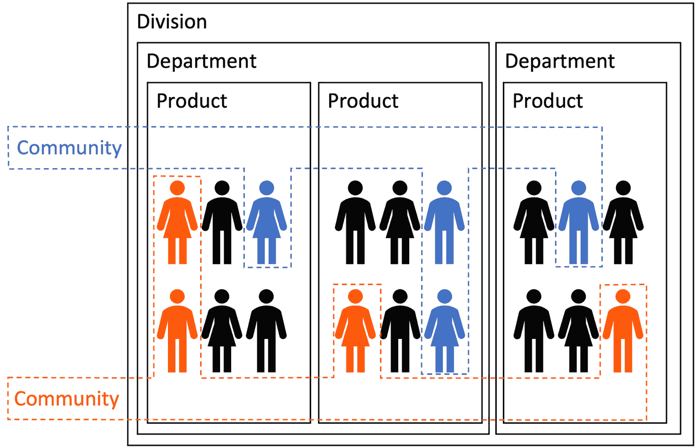
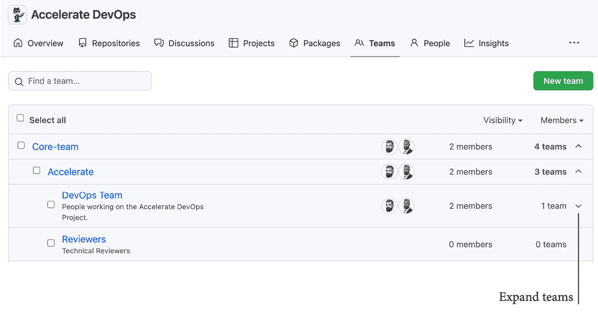
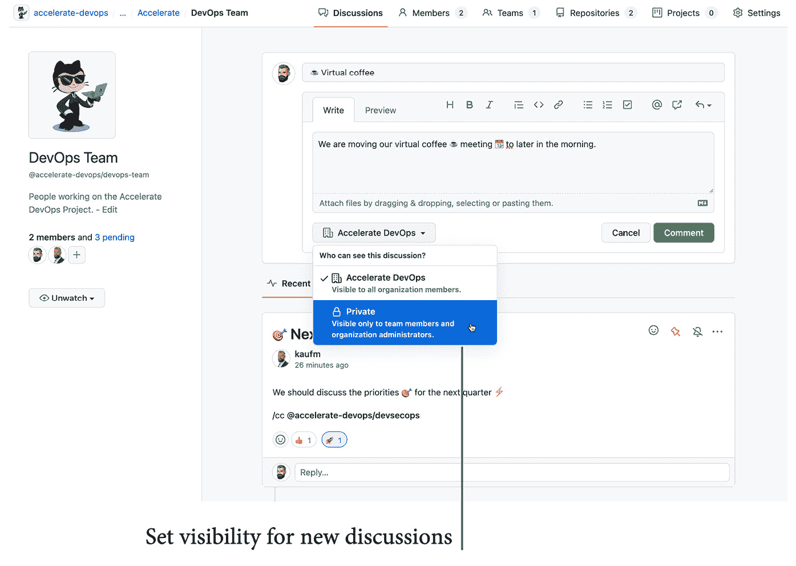
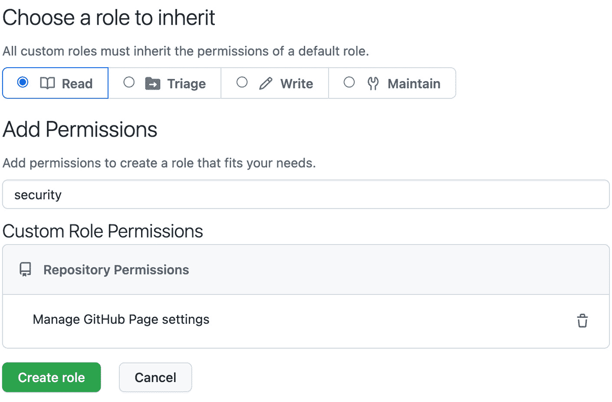
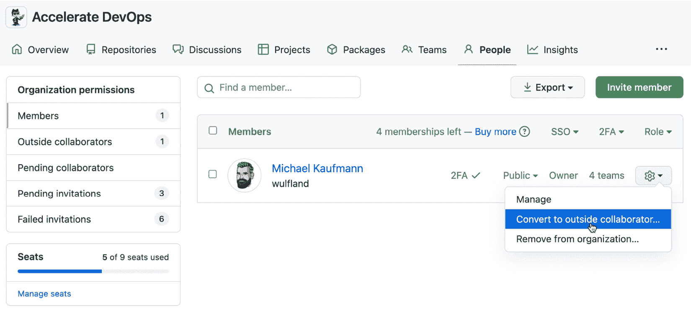

# *第二十二章*：组织你的团队

在本章中，你将学习如何将仓库和团队结构化为组织和企业的最佳实践，以促进协作并简化管理。

在本章中，我们将讨论以下主题：

+   GitHub 范围和命名空间

+   结构化 GitHub 团队

+   基于角色的访问权限

+   自定义角色

+   外部协作者

# GitHub 范围和命名空间

GitHub 中的主要实体是仓库。仓库可以为用户或组织创建。仓库的 URL 将采用以下格式：

```
https://github.com/<username>/<repository>
```

```
https://github.com/<organization>/<repository>
```

对于 GitHub 企业版服务器，你必须将`https://github.com`替换为你的服务器的 URL。平台上的用户和组织名称必须是唯一的，因为它们提供了命名空间。仓库的名称在该命名空间内必须是唯一的。

## GitHub 企业版

在 GitHub 中，企业是多个组织的容器。企业不是命名空间——组织名称仍然必须是唯一的。企业有一个 URL 后缀，用来引用该企业。你的企业 URL 看起来会像这样：

```
https://github.com/enterprises/<enterprise-slug>
```

如果你拥有一个通过发票支付的组织，那么你可以在 **设置** | **账单和计划** 下升级为企业。否则，你必须联系 GitHub 销售部门。

一个 GitHub 企业有三个角色：

+   **所有者**：拥有企业的完全管理权限，但对组织没有管理权限

+   **成员**：拥有至少一个组织访问权限的成员或外部协作者

+   **账单管理员**：仅能查看和管理账单信息

你可以在企业级别为所有组织配置一些设置，例如 **SAML 认证**、**SSH 证书颁发机构** 或 **IP 允许列表**。还有一些企业级的 Webhooks，并且你可以访问整个企业的审计日志。审计日志流向云存储、Splunk 或 Azure Event Hubs 仅在企业级别可用，但大多数设置都与 **账单** 和 **许可** 相关。

你还可以为许多可以在组织级别配置的设置制定策略。如果已设置策略，则组织的所有者无法更改该设置。如果没有定义策略，则该设置可以由组织的所有者配置。

## GitHub 组织

管理你的仓库和团队的主要方式是通过组织。它们也可以在没有企业的情况下存在，并且你可以在不同的企业之间移动它们。组织不应被视为自助服务，让你的团队自行组织。一些公司拥有超过 2000 个组织——这会带来大问题，尤其是在管理集成时。例如，GitHub 应用只能在组织级别配置，而不能在企业级别配置。如果你想与 Jira 实例进行集成，那么你必须为所有组织配置此项。你不能在企业级别配置。

对于大多数客户来说，一个组织应该就足够了。如果您的公司有不同的法人实体，必须将其分开，那么这可能是创建多个组织的原因。另一个原因是如果您希望将开放源代码与内部源代码分开。但是，您不应将所有部门或事业部放在同一个组织中，最好使用团队来实现这一点。

一个组织有以下角色：

+   **拥有者**: 拥有对团队、设置和代码库的完全访问权限

+   **成员**: 可以看到成员和非私密团队，并创建代码库

+   **外部合作者**: 这些人不是组织成员，但可以访问一个或多个代码库

组织拥有项目、包、团队和代码库。您可以为代码库配置许多设置。如果您没有在组织级别配置这些设置，则可以在代码库级别设置这些设置。

结构化您的组织的主要方式是使用团队。我们将在下一节中详细介绍这些内容。

# GitHub 团队结构化

团队不仅是授予代码库权限的更便捷方式，还能加速员工的入职和离职过程。它们还可以用于共享知识，并通知特定小组变动。

团队有讨论，您可以看到它们的代码库和项目。团队可以具有以下两种可见性之一：

+   **可见**: 可见的团队可以被组织中的每个成员看到并提及

+   **私密**: 私密团队只能由其成员查看，并且不能被嵌套

一个团队存在于组织的命名空间中。这意味着团队的名称在组织内必须是唯一的。您可以使用以下语法提及团队或将其添加为代码所有者：

```
@<organization>/<team-name>
```

您可以通过嵌套团队，反映公司或团队的结构，使用级联的访问权限和提及方式。您可以在创建新团队时指定父团队，这样新团队就成为子团队。子团队也可以作为父团队——这样，您就可以创建深层次的层级结构。子团队会继承父团队的权限和通知，但反之则不行。

通过嵌套团队，您可以创建公司结构。您可以为所有员工、每个事业部、每个部门和每个产品团队（**纵向团队**）创建团队。您还可以使用团队来创建**横向团队**——例如，兴趣小组，如实践社区（见*图 22.1*）：



图 22.1 – 使用团队结构化您的组织

这使您能够在您的价值链团队之间共享知识和所有权。如果适合您的社区结构，您还可以嵌套水平团队。

嵌套团队可以在组织的**团队**标签下展开（见*图 22.2*）：



图 22.2 – 组织中“团队”标签下的嵌套团队

团队有讨论页面。组织成员可以创建并参与团队的讨论，但团队也可以有一些私密讨论，其他组织成员无法看到这些讨论（见*图 22.3*）：



](img/B17827_22_003.jpg)

图 22.3 – 带有讨论的团队页面

团队可以被提及并分配为评审者和代码所有者。这是一个非常强大的工具，可以简化组织结构。但是，尽量保持简单，使用人们可以轻松理解的名称。您不想构建一个官僚化的怪物！保持简洁。

# 基于角色的访问

在仓库级别，您可以为团队或个人授予基于角色的访问权限。您可以使用以下默认角色之一：

+   **读取**：读取并克隆仓库。打开并评论问题和拉取请求。

+   **处理**：读取权限，此外还包括管理问题和拉取请求。

+   **写入**：处理权限，此外还包括读取、克隆和推送到仓库。

+   **维护**：写入权限，此外还包括管理问题、拉取请求和配置一些仓库设置。

+   **管理员**：对仓库的完全访问权限，包括敏感和破坏性操作。

请注意，**读取**角色不仅仅是读取！它可以打开并评论问题和拉取请求。**处理**和**维护**是开源项目中的典型角色，在企业场景中使用较少。

您可以为组织设置基础权限（读取、写入或管理员）。这将为所有成员授予对所有仓库的相应权限。外部合作者不会继承基础权限（有关更多信息，请参见[`docs.github.com/en/organizations/managing-access-to-your-organizations-repositories/setting-base-permissions-for-an-organization`](https://docs.github.com/en/organizations/managing-access-to-your-organizations-repositories/setting-base-permissions-for-an-organization)）。

# 自定义角色

您可以在组织设置中的**仓库角色**(/settings/roles)下定义自定义角色。点击**创建角色**并为新角色指定名称和描述。然后，选择一个默认角色以继承其权限，并为其添加权限（见*图 22.4*）：



](img/B17827_22_004.jpg)

图 22.4 – 在 GitHub 中创建自定义角色

权限是分类的。因此，如果您在搜索框中输入`security`，列表将显示与安全相关的所有可用权限。

权限可分为以下几类：

+   讨论

+   问题

+   拉取请求

+   仓库

+   安全

请注意，并非所有内容都可以配置。例如，在本文编写时，GitHub Packages 没有特定的权限。

如果某个人被授予不同级别的访问权限，较高的权限总是会覆盖较低的权限。如果某个人被授予多个角色，GitHub 会在此人旁边显示**混合角色**警告。

再次提醒：尽量不要过度使用自定义角色。保持尽可能简单。

# 外部协作者

**外部协作者**是指不是您组织成员的人，但可以访问您组织的一个或多个仓库。

注意

将外部协作者添加到私有仓库将消耗一个您的付费许可证！

外部协作者不是您组织的**成员**。他们看不到内部仓库，也不会继承基础权限。

您不能在组织级别邀请外部协作者——您只能邀请成员加入您的组织，然后将他们转换为外部协作者（见 *图 22.5*）：



图 22.5 – 将成员转换为外部协作者

作为仓库管理员，如果您在 **设置** | **协作者和团队** 下点击 **添加人员**，如果他们已经是组织成员，他们将自动作为成员添加。如果不是，他们将作为外部协作者添加。

外部协作者是与合作伙伴和客户轻松协作的绝佳方式，而无需他们成为您组织的一部分。但请记住，如果您使用 **企业托管用户**，则此方法不起作用。如果您启用了 **SAML 单点登录**，外部协作者将绕过该功能。这就是为什么组织所有者可以在组织设置中防止仓库管理员邀请外部协作者加入仓库的原因。

# 摘要

在本章中，您了解了企业中组织、仓库和团队结构的最佳实践。我们讨论了团队的嵌套、使用团队作为兴趣小组、基于角色的访问控制以及外部协作者。

在最后一章，我们将把本书的所有内容整合起来，并指导您使用 GitHub 转变您的企业，并利用它加速您组织中的 DevOps。

# 进一步阅读

请参阅以下链接和更多 GitHub 文档，了解本章中涵盖的主题：

+   *关于团队*：[`docs.github.com/en/organizations/organizing-members-into-teams/about-teams`](https://docs.github.com/en/organizations/organizing-members-into-teams/about-teams)

+   *基础权限*：[`docs.github.com/en/organizations/managing-access-to-your-organizations-repositories/setting-base-permissions-for-an-organization`](https://docs.github.com/en/organizations/managing-access-to-your-organizations-repositories/setting-base-permissions-for-an-organization)

+   *自定义角色*: `docs.github.com/en/enterprise-cloud@latest/organizations/managing-peoples-access-to-your-organization-with-roles/managing-custom-repository-roles-for-an-organization`

+   *外部合作者*: [`docs.github.com/en/organizations/managing-access-to-your-organizations-repositories/adding-outside-collaborators-to-repositories-in-your-organization`](https://docs.github.com/en/organizations/managing-access-to-your-organizations-repositories/adding-outside-collaborators-to-repositories-in-your-organization)

+   *管理仓库访问权限*: [`docs.github.com/en/repositories/managing-your-repositorys-settings-and-features/managing-repository-settings/managing-teams-and-people-with-access-to-your-repository#inviting-a-team-or-person`](https://docs.github.com/en/repositories/managing-your-repositorys-settings-and-features/managing-repository-settings/managing-teams-and-people-with-access-to-your-repository#inviting-a-team-or-person)
