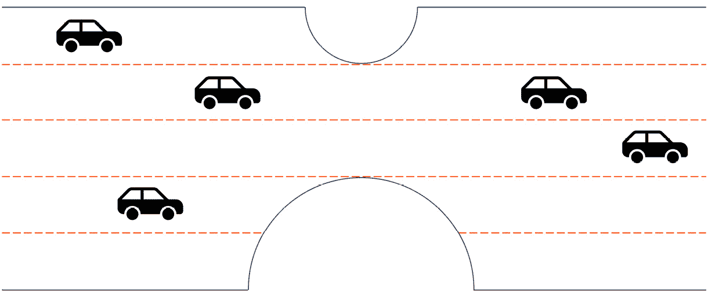
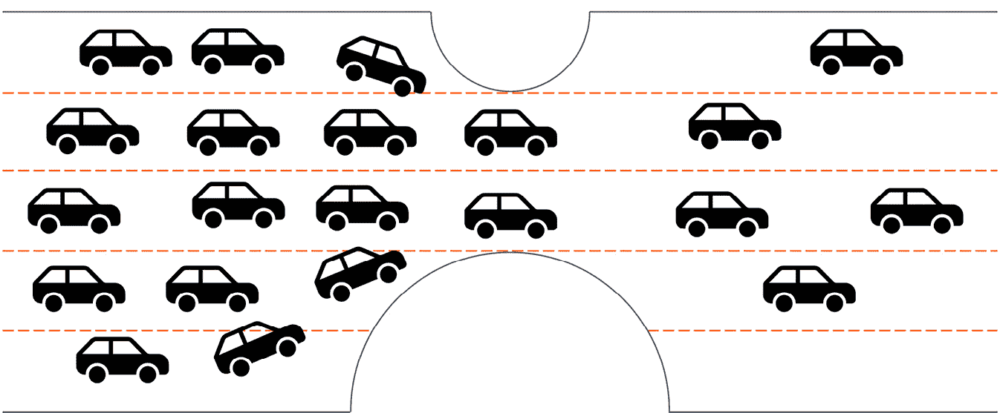
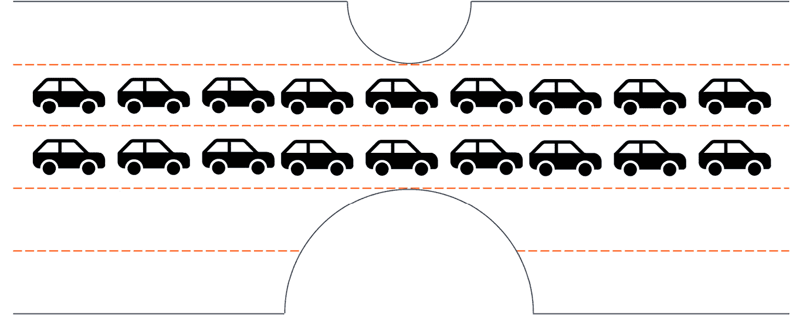
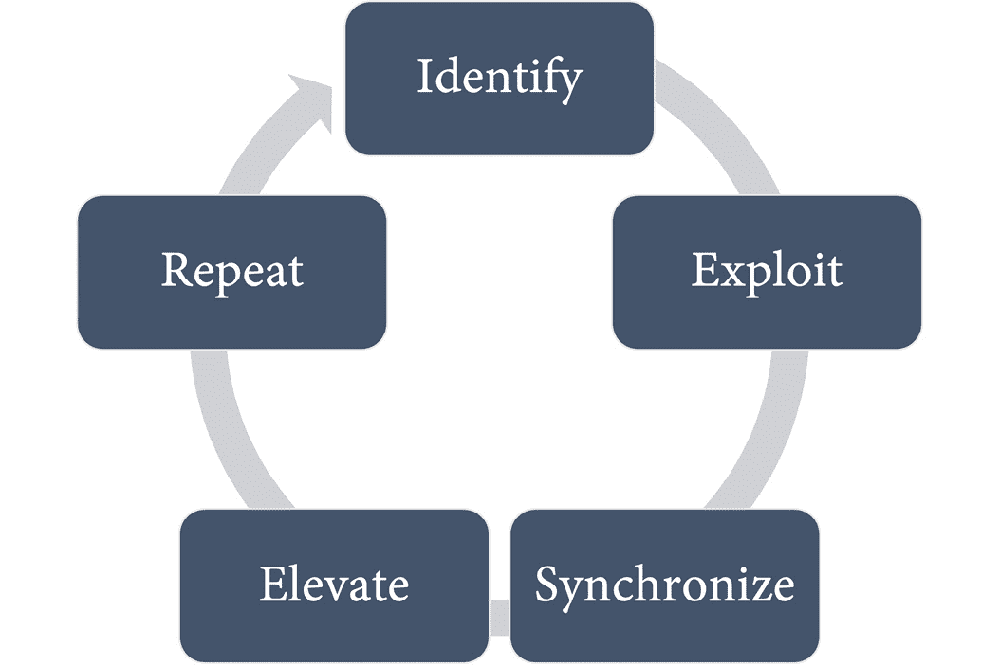
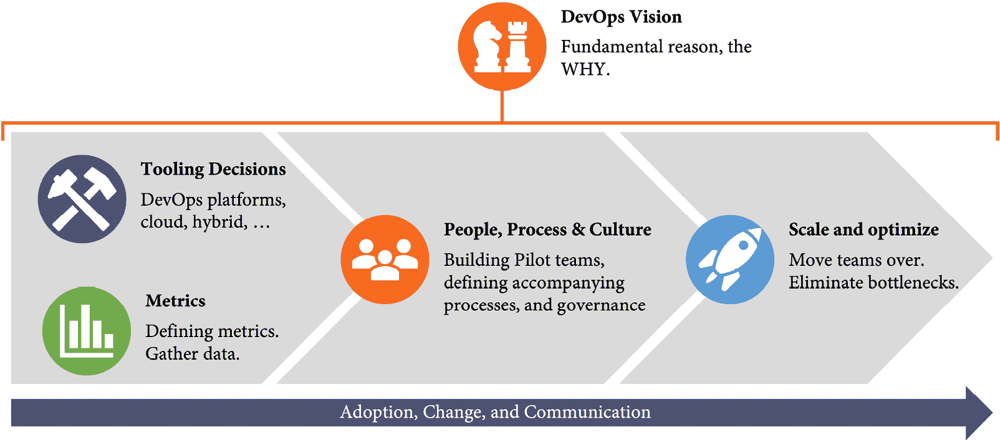

# 第二十三章：转型你的企业

在最后一章，我们将讨论企业转型。我将解释如何将本书中解释的所有内容结合起来，转型你的企业，让它拥有工程文化，并提高开发人员的工作效率。

我们将涵盖以下主题：

+   为什么许多转型会失败

+   从为什么开始？

+   数据驱动的转型

# 为什么许多转型会失败

软件是每个行业中所有产品和服务的核心——从客户体验到供应链管理（参见 *第一章*，*关键指标*）。这意味着很多企业必须转型成为数字化的高效企业，但这些转型中的许多都失败了。角色被重新命名，管理层被重组，托管被称为私有云，但往往文化和业绩并未发生变化。转型失败的原因有很多，我在这里想给你一些例子。

## 假设你的公司或行业很特殊

我遇到的许多客户认为他们是独一无二的，但其实并非如此。抱歉地说，你的公司或行业也很可能不是独一无二的。至少在数字化转型方面是这样的。你的产品如果有缺陷，会导致人员伤亡吗？汽车、飞机、卡车、医疗设备等也可能如此。而且，所有为这些产品生产的零部件也是如此。它们并不特别。你必须遵守某些标准吗？你们生产军用产品吗？你们是上市公司吗？你们为政府工作吗？无论你认为是让公司独特的因素是什么，实际上有很多公司面临着和你一样的挑战，并且在 DevOps 转型方面也适用相同的规则。

如果你查看 *第一章* 中提到的研究，你会发现它们适用于所有公司：从小型初创公司到大型企业，从前沿互联网公司到高度监管的行业，如金融、医疗和政府（*Forsgren N., Humble, J., & Kim, G., 2018*, p. 22）。

但这实际上是件好事。这意味着你在自己转型过程中可能面临的许多问题，别人已经解决了。你可以从他们的失败中学习，而不必亲自经历它们。

## 没有紧迫感

改变的最大障碍是自满。如果你公司中的人们感到自满，他们往往会抵制变化，继续保持*按部就班*的做法。

你必须为员工建立一种真正的紧迫感，让他们现在就开始解决关键问题。在这种情况下，紧迫感并不意味着来自管理层的压力所带来的焦虑。真正的紧迫感应该推动人们以赢的决心去改变——而不是因害怕失败而感到焦虑（*约翰·P·科特，2008*）。

如果没有真正的紧迫感，人们会抵制变革，并且更有可能维持旧有的行为。请注意，紧迫感可能出于完全不同的原因，在组织的不同层级产生。管理层可能会感受到来自市场的压力，以及由于缺乏敏捷性无法通过频繁发布来应对挑战。工程师们可能会感受到技术债务的压力，以及由于陈旧的流程和工具而面临吸引和留住人才的问题。重要的是要通过清晰的愿景将这些不同的故事对齐到一个共同的根本原因上。只有当你成功地将不同的紧迫感对齐成一股朝着相同方向推动的力量时，才能确保不同的力量不会相互中和。

## 没有明确的愿景

替换工具、流程和角色很容易，但改变行为、文化和故事却很难。如果没有明确的愿景，转型就无法取得预期的结果。

如果我听到客户说*我们不是微软或谷歌*或*我们不是一家前沿的互联网公司*，这告诉我他们缺乏明确的愿景。如果你的愿景明确表明你希望成为行业中的数字化领导者，或者从产品公司转型为服务公司，人们就不会轻易说出与之相悖的话。

一个推动变革的好愿景是一个清晰且具有说服力的声明，说明你所有的转型目标将指向何方（*John P. Kotter 2012*）。

我认为值得注意的是，DevOps 转型并不总是由高层管理推动。我知道很多公司，DevOps 转型是由单个部门甚至团队推动的。不过，同样的规则依然适用——你需要为你团队或部门中的团队制定清晰的愿景，并建立紧迫感，以确保转型成功。

## 让障碍阻碍你的进步

当你开始进行转型时，许多障碍会阻碍你的转型。我常常经历的一些典型例子是某些行业中的特定规定。许多规定，比如 ISO26262 或 GxP，提出了**V 模型**用于软件工程。V 模型基于**瀑布模型**，因此它与我们多年来在 DevOps 研究中学到的几乎所有内容都相矛盾。如果你坚持保持瀑布模型，你的 DevOps 转型很可能会失败，但这通常是由于你对这些规定的内部解读。如果你仔细看看这些规定，你会发现它们只是坚持最佳实践。如果你的做法优于推荐的做法，你可以为此辩护，并且仍然能通过审计。

你遇到的大多数障碍都来源于你的组织，例如，组织结构、紧密的岗位分类、流程，或是工会与管理层之间的阵地战。不要让这些障碍阻碍你的转型。

## 没有获得帮助

顾问在许多公司中有着不太好的声誉，主要是因为糟糕的经历。我曾经帮助一个客户数字化他们的产品。客户习惯于按照瀑布式方法做事，我向他们介绍了 Scrum 和 CI/CD。我们进行了培训，并在接下来的几年里成功地使用了敏捷开发。两年后，管理层支付了昂贵的顾问公司来引入 Scrum。他们基本上拿着和我两年前讲的一模一样的幻灯片，讲着同样的故事。这种类型的咨询服务导致了糟糕的声誉。

但是，如果你想学一项新的运动，你不会仅仅买些设备，然后看一些 YouTube 视频。你会加入一个俱乐部或找一个教练来指导你。运动不仅仅是关于知识和工具——它们更关乎技能的培养。没有经验丰富的教练，在某些运动中成功是很难的，甚至是不可能的。

对于在你的企业中建立新技能和能力来说，同样适用。向那些更有经验的人寻求帮助并没有什么可耻的，他们可以引导你度过变革的过程。考虑到你节省的时间和精力，帮助的费用很可能会便宜，更不用说失败的成本了。

# 从**为什么**开始？

为了让变革成功，你需要一个清晰的愿景和紧迫感。愿景应该明确、有说服力、简短，并能激励人们跟随它。为了传达愿景，你可以遵循*黄金圈*（*Simon Sinek 2011, p.38*）并从内到外进行沟通（见*图 23.1*）：

图 23.1 – 传达愿景应该从**为什么**开始？

让我们更详细地看看：

+   **为什么**：你的公司为什么要进行这场变革。这为变革提供了目标，并建立了紧迫感。为什么有人会关心？

+   **如何？**：你将如何成功地完成转型过程？

+   **什么？**：你想要转型的实际内容。你在做什么或制造什么？

## 以目标为驱动的使命

不要低估愿景的力量！如果你是一个内燃机汽车的制造商，转型为电动汽车并不容易。会有抵触情绪。人们会害怕失去工作的力量。

要成功，你需要一个清晰的愿景并传达**为什么**？——就像大众集团在 2019 年发布的*goTOzero*使命声明中那样，集中在四个主要行动领域：气候变化、资源、空气质量和环境合规性。

到 2050 年，整个**大众集团**希望成为资产负债表上的二氧化碳中和公司。到 2025 年，公司计划将其车队的碳足迹相比 2015 年减少 30%（*Volkswagen 2019*）。

这完美地解释了**为什么**，建立了紧迫感，并融入了他们更新后的整体愿景，即*让这个世界成为一个移动的、可持续的地方，所有公民都能触及*。

同样，**梅赛德斯-奔驰**在其 2019 年发布的*雄心 2039*声明中表示，他们计划在未来 20 年内实现汽车车队和生产的碳中和目标（*梅赛德斯-奔驰集团媒体 2019*）。

当你将一个产品公司转型为软件或服务公司时，情况也是一样的。即使你只是将一个瀑布式组织转型为 DevOps 组织，如果你无法描绘出一个理想的未来并解释*为什么*必须进行转型，人们也会害怕这种变化，并且会产生抵触情绪。

## 建立工程文化

拥有一个以目标为驱动的愿景，将帮助你在转型过程中建立**工程文化**：一个包容性和安全的组织文化，能够促进人才发展，并以共享和平等为动力（*de Vries, M., & van Osnabrugge, R. 2022*）。

这是一种文化，在这种文化中，人们在感觉到某些事物不对时会感到安全地发声，一种人们可以在没有恐惧的情况下进行实验和创新的文化，一种每个人都感到受欢迎和安全的文化——无论其出身、性别或宗教如何。

组织文化是一套共享的假设，指导着组织内部的行为（*Ravasi, D., & Schultz, M. 2006*）。这就是为什么改变文化很困难的原因。制作带有价值观和使命声明的 PowerPoint 幻灯片可能会影响文化，但也许并不是管理层预期的那种方式。

作为一名工程师，你可能会问，组织文化对你来说有何重要？难道这不是管理层的任务吗？然而，文化是每个系统成员的假设和行为的结果——这意味着每个人都可以改变它。作为工程师，你应该意识到你的文化，并在看到问题时敢于发声。开始做正确的事情，讲述正确的故事。

文化最好通过一些有深刻含义的小格言和原则来融入公司行为中。它们易于记住，并鼓励人们做正确的事。以下是你在拥有卓越工程文化的公司中常常听到的一些例子：

+   *寻求宽恕，而不是许可*：鼓励人们做正确的事，即使这违背了当前的规则或流程。

+   *你建设，它就由你运营*：建立端到端的责任和所有权，确保对所建设的事物负责。

+   *尽早失败，快速失败，频繁失败（或快速失败，快速推进）*：尽量尽早和快速地失败，而不是让一切都达到 100% 防弹的程度。

+   *拥抱失败*：鼓励人们进行实验和冒险，并确保从失败中得到无责备的学习。*承担责任，不责怪他人*。

+   *协作，而不是竞争* 或 *共同努力，而不是对抗*：促进跨组织界限的协作，并与客户和合作伙伴共同合作。

+   *去修复*：鼓励人们主动承担责任并修复问题，而不是仅仅抱怨，但你必须确保创新不会被压制。确保人们有权利真正去修复他们抱怨的问题。

+   *把服务器当作牲畜，而不是宠物*：鼓励人们*自动化一切*。

+   *如果疼痛，就多做*：激励人们多做那些困难的事情，培养完成任务的技能。这个短语通常用于发布或测试应用程序时。

这些只是一些例子。当你转型文化并建立 DevOps 时，会出现更多的故事和格言。

优秀的工程文化不仅仅是管理层的责任。他们必须让它发生并提供愿景，但最好的文化是在转型过程中由工程师们自己创造的。

# 数据驱动的转型

如果你想让你的转型成功，关键是要衡量正确的指标，并证明转型的结果真的比旧系统更好。这就是为什么在*第一章*《重要的指标》中，我介绍了可以收集的数据点，帮助你了解首先需要优化什么，并实现一些小的成功，激励大家继续进行 DevOps 转型。衡量正确的数据应该始终是开始的第一步。优化一个不是瓶颈的东西是资源的浪费，甚至可能带来负面影响。举个例子，假设你在应用程序中添加了缓存，但没有证明操作本身是否减慢了系统的速度，或者没有证明缓存某些数据后能提高多少速度。缓存会引入复杂性，也容易出错。所以，或许你根本没有优化系统，反而因为基于假设做出决策而让系统变得更糟。DevOps 实践也是如此。

## 约束理论

**约束理论**（**TOC**）基于系统理论，假设如果没有限制性约束，系统的吞吐量是无限的。TOC 试图最大化系统在当前约束条件下的吞吐量，或者通过减少这些约束来优化系统。

解释这个理论的一个典型例子是高速公路（*Small World 2016*）。假设我们有一条有五个车道的高速公路，但由于有两个施工区域限制了两个车道的通行能力（见*图 23.2*）：

图 23.2 – 一条车少的高速公路，受其限制

交通流经瓶颈，但这只在一定吞吐量下有效。如果车太多，它们会开始相互影响，减慢速度，导致交通堵塞（见*图 23.3*）：

图 23.3 – 如果吞吐量过高，它会将流量阻塞

为了优化流量以实现最大流量，你必须将流量限制在最大约束的容量范围内（见*图 23.4*）：

图 23.4 – 最大流量等于约束的容量

优化除最大约束以外的任何事物不会带来任何改进。许多城市曾尝试在隧道前后增加车道，但基本没有改善流量或减少交通拥堵。对于你的价值流也是如此——优化除最大约束外的任何事物都不会带来任何改进。

## 消除瓶颈

TOC 提供了五个重点步骤，用于消除约束（见*图 23.5*）：

图 23.5 – 识别和消除约束的五个重点步骤

以下是这五个步骤的详细说明：

+   **识别**：识别限制当前吞吐量的约束

+   **利用**：改善约束的吞吐量

+   **同步**：回顾并协调系统中的其他活动，确保它们在最优的方式下支持约束

+   **提升**：尝试消除约束，解决问题的根本原因

+   **重复**：通过识别限制当前吞吐量的下一个约束，持续改进系统

系统地消除工作流中的瓶颈是成功进行 DevOps 转型的关键！

## DevOps 是一个持续改进的旅程

DevOps 是一个通过消除瓶颈不断推动软件交付性能边界的旅程。在他们自己的 DevOps 转型启动时，微软展示了一些来自不同领域的 pit stop 视频：从 1950 年的印第安纳波利斯赛道，停站时间 67 秒，到 2013 年墨尔本赛道，停站时间约为 2.96 秒。这是 DevOps 的一个很好的隐喻，通过自动化和优化的流程不断提升性能。

DevOps 是人、流程和产品的结合，旨在为我们的终端用户持续交付价值（*Donovan Brown 2015*）。

这是一种涵盖研究、开发、协作、学习和责任的工程文化，只有在各个方面共同实现时才能发挥作用。你不能仅仅选择 DevOps 的某一个方面并实施它，而忽略其他方面。

你只能改进一个关于流量的系统，前提是你知道最大瓶颈并致力于解决它。尝试优化其他方面不会带来任何结果，反而浪费时间和资源。这就是为什么进行数据驱动的转型非常重要，并且需要衡量正确的指标，以持续监控你的改进是否真正带来了预期的结果。识别一个瓶颈，利用它，改进它，然后重复。

## 优化与价值流对齐的团队

在本书中，我没有讨论任何**DevOps 团队拓扑结构**（*Matthew Skelton 2013*）。我看到它们通常出现在更多 IT 驱动的转型中，开始时通常会根据某个拓扑结构来对齐你的转型之旅，之后在达到更高的 DevOps 成熟度后再切换到另一种模型（*Martyn Coupland 2022*，*p27*）。相反，我专注于**与价值流对齐的团队**（见 *第十七章*，*赋能你的团队*）。

你的 DevOps 之旅应从这些阶段开始，并优化一切以使其能够交付价值。这将自动引导你进入**以开发者为先的思维方式**（开发者即为交付价值的工程师）。如果你实践数据驱动的转型并通过消除瓶颈来优化价值，那么像平台团队或支持团队这样的拓扑结构将会出现。无需事先规划这一点。一个 DevOps 组织应该是一个自我改进的系统，所以一旦你达到那个阶段，接下来的事情会顺利展开。

成功的数据驱动 DevOps 转型有三个主要阶段（如*图 23.6*所示）：

图 23.6 – 数据驱动 DevOps 转型的各个阶段

阶段的更多细节如下：

+   **指标**：首先定义指标并收集数据（见*第一章*，*重要的指标*）。

+   **工具选择**：你需要做出一些基本的工具选择。在本书中，我假设**GitHub**是 DevOps 平台，但关于云使用和与当前治理流程对齐的决策将会有更多需要做的。

+   **人员、流程和文化**：仔细选择你的试点团队，通过将他们的工作方式转变为**精益管理**和**更高的协作性**，将他们带到新平台。教导并使他们能够采纳**工程 DevOps 实践**，如自动化和基于主干的开发，并使他们能够**频繁发布**并且**充满信心**。这些指标应迅速改善。这些就是你需要的快速胜利，能够保持大家的动力。

+   **规模化与优化**：在试点团队取得成功后，你可以开始通过创建更多团队来扩大规模，这些团队将在新的平台上使用新的流程和工具工作。这也是你开始优化更多能力的时机，如**软件架构**和**精益产品管理**技巧。一次解决一个瓶颈，始终观察是否有指标确认期望的结果。

由于 DevOps 是一段旅程而非一个目标，因此这个阶段基本上是永无止境的。你可能会在一段时间后调整指标，优化团队规模和自主性，但优化不会结束。结果只是越来越小，因为你已经处于更高的水平。

+   **DevOps 愿景**：转型的核心是一个强有力的愿景，解释*为什么*？并建立紧迫感。确保您有一个良好的沟通和变革管理策略。任何变革都会遭遇抵抗，您必须应对恐惧，并沟通*为什么*？*如何*？以及*什么*？过程的各个方面，以及在此过程中您收集的成功案例，激励每个人向前迈进。

# 总结

为了保持竞争力，企业不能仅仅解决客户的问题。他们需要交付令客户满意的产品和服务，并且必须能够与市场互动，快速响应变化的需求。这使得今天的每个公司都是一家软件公司。如果您的公司不能实现转型，它可能会在几年内退出市场。

许多转型失败，但也有许多成功的案例，这些公司证明了即使是大型企业或高度受监管的公司，也能够实现转型并采纳 DevOps。

通过 GitHub，您拥有市场上最优秀的产品之一，全球超过 7300 万开发者、所有大型开源社区以及超过 84%的财富 500 强公司都喜爱它。这意味着更少的培训、更快的入职和更高的开发者满意度，从而带来更好的人才吸引力和留存率。而且，开源社区还为您提供应用程序的构建模块、工具、流水线，以及为您的流程模板提供模板。利用社区的力量将帮助您加速，而 GitHub 也为您提供了通过贡献或资助您依赖的项目来回馈社区的机会。

我希望本书能作为一本实用指南，帮助您通过 GitHub 的力量实现成功的 DevOps 转型。对于我来说，最有成就感的事莫过于看到工程师们在 DevOps 文化中享受工作，解决实际工程问题，而不是在生产环境中与 bug 作斗争或估算他们认为愚蠢的需求。

# 进一步阅读

以下是本章的参考资料，您可以通过这些资料获得更多相关主题的信息：

+   Simon Sinek (2011), *《从“为什么”开始——伟大领导者如何激励每个人采取行动》*，Penguin

+   Simon Sinek (2019)，*《无限的游戏》*，Penguin

+   Nadella, S., Shaw, G. & Nichols, J. T. (2017), *《重启：重新发现微软的灵魂，想象一个更美好的未来》*，Harper Business

+   Srivastava S., Trehan K., Wagle D. & Wang J. (2020 年 4 月)，*《开发者速度：软件卓越如何推动商业表现》*。[`www.mckinsey.com/industries/technology-media-and-telecommunications/our-insights/developer-velocity-how-software-excellence-fuels-business-performance`](https://www.mckinsey.com/industries/technology-media-and-telecommunications/our-insights/developer-velocity-how-software-excellence-fuels-business-performance)

)

+   Forsgren N., Humble, J., & Kim, G.（2018 年）。*加速：精益软件与 DevOps 的科学：构建与扩展高绩效技术组织*（第一版）[电子书]。IT Revolution Press。

+   John P. Kotter（2008 年），*紧迫感*，哈佛商业评论出版社

+   John P. Kotter（2012 年），*领导变革*，哈佛商业评论出版社

+   大众汽车（2019 年）：*大众汽车与新企业使命声明——环境“goTOzero”*：https://www.volkswagenag.com/en/news/2019/07/goTOzero.html

+   梅赛德斯-奔驰集团媒体（2019 年）：*“Ambition2039”：我们走向可持续出行的路径*：[`group-media.mercedes-benz.com/marsMediaSite/ko/en/43348842`](https://group-media.mercedes-benz.com/marsMediaSite/ko/en/43348842)

)

+   *约束理论*： [`www.leanproduction.com/theory-of-constraints`](https://www.leanproduction.com/theory-of-constraints)

)

+   Small World（2016 年）：*约束理论——鼓-缓冲-绳*：[`www.smallworldsocial.com/theory-of-constraints-104-balance-flow-not-capacity/`](https://www.smallworldsocial.com/theory-of-constraints-104-balance-flow-not-capacity/)

)

+   de Vries, M., & van Osnabrugge, R.（2022 年）：*我们一起构建工程文化*。XPRT 杂志第 12 期： https://xpirit.com/together-we-build-an-engineering-culture/

+   Ravasi, D., & Schultz, M.（2006 年）。*应对组织身份威胁：探索组织文化的作用*。管理学会学报。

+   Donovan Brown（2015 年）：*什么是 DevOps*？[`www.donovanbrown.com/post/what-is-devops`](https://www.donovanbrown.com/post/what-is-devops)

)

+   Matthew Skelton（2013 年）：*什么样的团队结构最适合 DevOps 蓬勃发展*？[`web.devopstopologies.com/`](https://web.devopstopologies.com/)

+   Martyn Coupland（2022 年）：*DevOps 采纳策略：原则、流程、工具与趋势*，Packt
