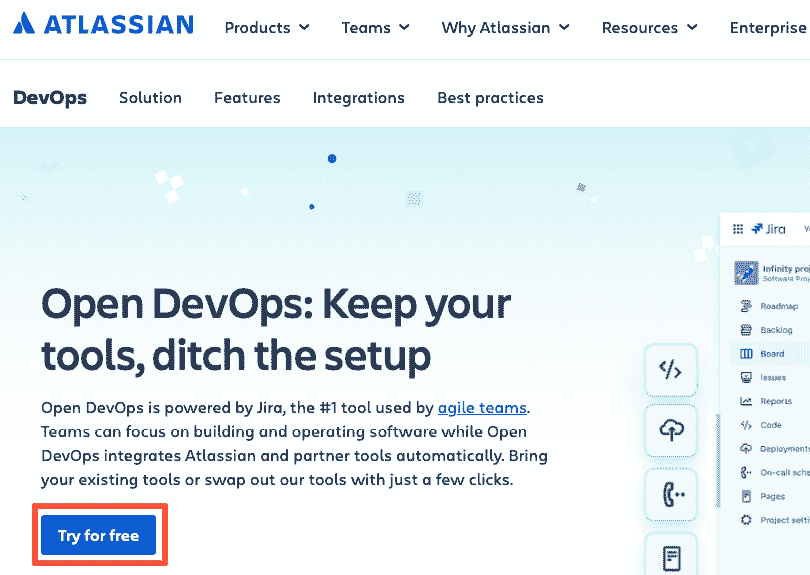
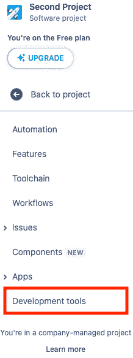

# 第一章：DevOps 和 Atlassian 生态系统介绍

自 2009 年 DevOps 诞生以来，已经成为推动产品开发改进的主要力量。随着技术转向基于互联网的云环境，DevOps 使得开发和运营人员能够合作，从而更快且更稳定地进行设计、打包、部署和维护产品。自动化的采用是这一过程顺利进行的关键因素。

本章将探讨 DevOps 运动及其成功中自动化所扮演的角色。接着，我们将了解 **Open DevOps** 平台，这个平台由 **Atlassian** 提供，能够轻松连接 Jira、其他 Atlassian 工具，如 Confluence 和 Bitbucket，以及第三方工具，如 LaunchDarkly，它通过功能标记帮助你发布产品，以及 Snyk，它进行安全扫描。

为了开始我们的 Open DevOps 之旅，我们将研究如何注册到 Atlassian 的云环境中，以便获取 Jira 的试用版本以及通过 Open DevOps 进行连接。为此，我们将涵盖以下步骤：

+   从零开始创建 Open DevOps 工具链

+   仅创建带有 Jira 的新的 Atlassian Cloud 站点

+   创建 Jira 项目

+   连接 Confluence

+   连接 Bitbucket

# DevOps 介绍

到 2009 年，开发人员开始采用敏捷产品开发方法。他们从小规模交付的增量周期开始，收集客户反馈并利用这些反馈指导未来的开发周期。逐步打造出客户所需的产品。

一个瓶颈很快就会出现在向组织运营部分交付变更时。虽然开发团队的优先任务是快速开发价值，运营团队则负责维护环境的稳定性。任何可能削弱稳定性的因素都会导致潜在的收入损失。通常，这意味着将任何新变更视为有风险，并允许在特定的维护窗口期发布变更。这些窗口期最终只会增加进一步停机的风险。

很快，变化就会出现。在*O'Reilly Velocity 2009 大会*上，Flickr 的 John Allspaw 和 Paul Hammond 进行了题为*“每天 10+次部署——Flickr 的开发与运维合作”*的演讲，讲述了他们如何在一天内进行多次部署，而许多组织在一年内都难以进行一次部署的做法。Patrick Debois 在观看了上述演讲以及其他关于开发与运维合作重要性的演讲后，受到了启发，并在与 Andrew Schafer 去年谈话后对敏捷系统管理产生了兴趣，决定在比利时根特组织一个会议来讨论这个话题。为了强调这一需求，Debois 将*开发*和*运维*的常用缩写合并，并将其用作会议名称——**DevOpsDays**。

第一个 DevOpsDays 大会的势头延续到了社交媒体。讨论在 Twitter（现称为 X）上继续进行，话题通过标签`#DevOps`被标识出来。随后，世界各地组织了更多的 DevOpsDays 大会。这一运动引起了 Gartner 的关注，Gartner 在 2011 年预测 DevOps 将很快被企业采用。这确保了 DevOps 从一个地下运动转变为一种主流理念，在企业中实施。

现在，开发和运维之间的协作已经显现出好处，并证明了其受欢迎程度，关键问题之一是如何开始成功的 DevOps 实施。接下来的部分将介绍这一方法的关键模型。

## CALMS/CALMR 方法

为了准备*2010 年 DevOpsDays 大会*，John Willis 和 Damon Edwards 被问到了一个关于新兴 DevOps 运动的相同问题——我们如何实施 DevOps？换句话说，成功实施 DevOps 的关键因素是什么？

他们想出了一个首字母缩略词，**CAMS**，其中每个字母代表成功 DevOps 方法的一个关键组成部分。**C**代表**文化**，**A**代表**自动化**，**M**代表**度量**，**S**代表**共享**。

在撰写*《DevOps 手册》*时，Jez Humble 详细阐述了 CAMS 模型。他增加了一个**L**，代表**Lean（精益）**。有了这个补充，CAMS 变成了**CALMS**。

当 Scaled Agile Inc.将 DevOps 引入**Scaled Agile 框架**（**SAFe**）时，修改了这一方法。考虑到理想的 DevOps 文化是共享责任，Scaled Agile 将 S（共享）移除，替换为**R**，代表**恢复**。在 SAFe 中实践 DevOps 时，CALMS 变成了**CALMR**。

让我们来看看 CALMS 和 CALMR 方法的每个字母，看看它们如何与 Atlassian 工具的采用以及 Open DevOps 平台的实施相结合。

### 文化

管理专家彼得·德鲁克被认为曾经说过，“文化在早餐时吞噬战略”，强调了作为共同纽带的文化对于团结群体中个体的影响，无论是小到团队，大到国家。因此，如果正确的文化可以推动组织实现期望的结果，那么什么是正确的文化？为了找到答案，我们转向了社会学家罗恩·韦斯特鲁姆。

1988 年，罗恩·韦斯特鲁姆组织了一项研究来衡量医疗团队的安全性。他将团队分为三种不同类型的文化：

+   病态的

+   官僚主义的

+   生成型

病态文化是一种由领导主导的文化。主要通过领导者对完成（领导者的）目标的恐惧和威胁来驱动动机。

官僚文化通过规则和标准具有安全机制，但这些机制可以用来保护团体成员免受外部人员的侵害。

相反，生成型文化侧重于与共同使命的对齐。信息可以自由与任何人分享，无论他们是否是团体的成员，无论他们是否能在使命的成功中发挥作用。

韦斯特鲁姆在其初步研究中发现，拥有生成型文化的医疗团队还与其使命保持一致，意识到阻碍使命的事物，并授权任何个体进行改变以消除这些障碍。这使得组织能够轻松地对系统进行持久改进，进一步改善团队。

这些好处并不局限于医疗团队。在《加速 - 建立和扩展高效技术组织》一书中，尼科尔·福斯格伦、杰兹·汉布尔和吉恩·金调查了向团队推荐 DevOps 实践的效果。他们调查了开发团队，并发现那些拥有生成型文化的团队在软件交付方面表现出更高的性能水平，并体验到更高的工作满意度。

文化的改变虽然可能，但通常是在结构和行为改变之后发生的最后一次改变。Atlassian 确实提供了工具，帮助改变结构和行为以将团队转向生成型文化。这些支持文化变革的工具可作为 Team Playbook 免费提供（[`www.atlassian.com/team-playbook`](https://www.atlassian.com/team-playbook)）。然而，详细介绍这些工具超出了本书的范围。

### 自动化

当人们想到 DevOps 时，首先想到的是自动化。在 O’Reilly Velocity 2009 年会议上 Allspaw 和 Hammond 发表的讲话中，成功的关键因素之一包括使用自动化基础设施和统一的版本控制系统来支持开发和运营。

当今，关键的自动化是通过成功地将工具连接在一起形成工具链来完成的。开发和运营中的每个活动都至少与一个工具相关联。

显示开发活动与关联 Atlassian 工具的图示如下：

图 1.1 – DevOps 阶段与 Atlassian 工具

本书将在各章节中展示如何使用前面图示的 Atlassian 工具建立工具链。

### 精益

由自动化创建的系统只有在其需求不超过其容量时才能正常运行。为了确保这一平衡，我们将应用最初作为丰田生产系统一部分开发的精益思维实践。包括以下做法：

+   使所有工作可见

+   限制**在制品（Work-in-Progress）**（**WIP**）

+   保持小批量工作

+   监控队列

我们将从排队理论中看到工作规模（队列长度）、处理工作所需的时间（周期时间）以及直到我们看到结果所需的等待时间之间的关系。这里的关键公式是小李法则，如下所示：

*L*表示队列长度。希腊字母*lambda*表示团队处理工作的吞吐量。*W*表示已完成工作的等待时间。

另一个公式——金曼公式告诉我们，周期时间、利用率和团队必须完成的工作项的变异性之间有直接关联。这个公式（通常称为*VUT 公式*）如下所示：

在这个公式中，*E(W)*表示等待时间。它被视为*变异性（V）*、*利用率（U）*和*周期时间（T）*的乘积。

Jira 具有功能，可以通过看板展示待办工作，同时允许我们通过列约束限制在制品（WIP）。等待时间和周期时间也可以从收集的度量中计算得出。

### 测量

在评估我们开发、发布和维护产品的努力是否有效时，我们需要提出三个关键问题：

+   我们是否在按计划交付解决方案？

+   我们所有操作环境（测试、阶段、生产）的健康状况如何？

+   我们的客户是否认为我们已经开发出了正确的解决方案？

在上一节我们探讨*精益*实践时，发现我们需要关注以下指标来评估我们是否处于流动状态：

+   周期时间

+   在制品（WIP）

+   吞吐量

+   任何阻碍进展的障碍或瓶颈

在查看操作环境的状态时，我们转向可观察性的学科，其中我们收集从基础设施到应用程序的所有环境方面。可观察性的典型度量包括以下内容：

+   日志

+   调用/执行跟踪

+   指标

测量值，可能表明我们的客户是否从新产品功能中获得了预期的价值，这一点可能很难确定。存在虚荣指标，这些指标自然出现并显示良好的趋势，但经过彻底分析后，它们并不提供可操作的答案。经过验证的、能可靠测量客户情绪的指标包括以下内容：

+   **海盗**指标（获取、激活、留存、推荐和收入），由 Dave McClure 提出，用于观察理想客户对某个产品或功能的行为，并对该行为进行度量

+   Google HEART 指标，由 Google UI/UX 团队使用，用于衡量用户在幸福感、参与度、采用率、留存率和任务成功等方面的偏好

+   **适合目的** (**F4P**)由 David J. Anderson 和 Alexei Zheglov 提出，用来衡量是否满足客户需求，具体内容见于书籍*Fit for Purpose – How Modern Businesses Find, Satisfy, and* *Keep Customers*。

Atlassian 应用程序可以收集所需的指标，或轻松与专门的指标收集工具集成。Jira 是一个经过验证的平台，可以收集精益所需的指标。开箱即用的报告以及第三方市场应用的轻松应用，允许我们收集和分析所需的指标。Open DevOps 允许与 Datadog 和 New Relic 等可观察性工具进行轻松集成。

### 共享

一旦我们收集了这些测量值，我们需要一种简便的方法来展示信息，以便所有需要的人都能看到，促进创造性的文化。

本书中描述的 Atlassian 工具为促进信息共享和透明度提供了良好的基础。Jira 可以生成可以共享在仪表板上的图表和报告。与应用程序健康相关的其他显示内容可以使用 Compass 收集并展示。

### 恢复

在任何 DevOps 实施中，我们都希望花时间和精力规划应急步骤，以防发布导致生产环境出现故障。DevOps 改变了操作模型，开发和运维，无论是共同工作还是与专门的站点可靠性工程师合作，都必须共同回答以下问题：

+   我们如何在发布时降低风险？

+   如果发生故障，应该设计哪些缓解措施以限制停机时间？

+   如果发生故障，我们应该遵循哪些程序？

Atlassian 工具可能是这些问题的解决方案。像 LaunchDarkly 提供的功能标志工具，可以通过 Open DevOps 与 Jira 轻松集成。Compass 提供*早期预警*功能，以便在故障即将发生时发出警告。Opsgenie 允许开发和运维在故障期间协作，以迅速解决问题。

我们已经了解了 DevOps 方法的关键支柱，以及 Atlassian 工具如何帮助推动这些支柱。在接下来的部分，让我们探讨可能影响 DevOps 实施的技术，以及 Atlassian 工具如何提供帮助。

## DevOps 的技术考虑

随着新兴技术的发展，DevOps 方法的采纳变得更加容易，这些技术使得产品的部署、发布和维护更加快捷。技术的变化包括以下几点：

+   **持续集成/持续交付**（**CI/CD**）管道

+   **基础设施即代码**（**IaC**）

+   云环境

+   容器/Kubernetes

让我们仔细看看这些因素。

### CI/CD 管道

在 Allspaw 和 Hammond 于 2009 年 O'Reilly Velocity 大会上的演讲时，CI 工具通常用于生成 *每日* 构建，或者是汇集当天提交的代码的构建。在创建构建后，CI 工具会运行自动化测试，并报告该操作的成功或失败。

Allspaw 和 Hammond 将他们的 CI 工具进一步扩展。如果构建通过了所有测试，CI 工具将允许将构建产物移到测试或预生产环境进行进一步测试，或者移到生产环境以准备发布或 *上线*。

持续集成（CI）的扩展被称为持续交付（CD）。通过使用 CI/CD 工具自动化部署，可以确保部署的一致性，因为步骤不会被遗忘或跳过。部署测试进一步确保了功能的正确性，以及观察到的行为是期望的行为。

随着工具的发展，从仅仅是自动化构建到将 CI 和 CD 的所有步骤整合为一个触发器，版本控制工具开始提供自己的管道功能，这些功能由一个 **YAML** （**YAML 不是标记语言**）格式的文本文件控制。这促进了一种叫做 GitOps 的小型运动，在这种运动中，构建、测试、集成、打包和部署都从一个 Git 提交作为触发器开始。

### 基础设施即代码（IaC）

随着 CI 扩展到包括 CD，部署到环境变得更加简便。像 Ansible、Chef、Terraform 和 Puppet 这样的新工具使得可以通过文本文件来定义理想的基础设施。

通过使用文本文件作为输入来运行基础设施工具，将有一种一致的方式来创建环境，无论它们是用于测试、预生产还是生产。这种一致性有助于保持环境的相似性，确保无论使用哪个环境，都能得到相同的测试结果，并防止配置漂移——当环境不相似时，问题就会出现。

### 云环境

虽然 CI/CD 管道和 IaC 工具可以应用于许多物理平台，从后来被称为 **物联网**（**IoT**）的网络物理系统到物理服务器，DevOps 的成功最紧密地与云环境的兴起联系在一起。

云环境是通过供应商提供的虚拟机创建的，并可通过互联网访问。虚拟机的创建和销毁可以在几分钟内完成，允许动态和灵活的设置，并可以按需提供。

### 容器和 Kubernetes

云环境和基础设施即代码（IaC）的普及促使人们进一步思考如何打包软件应用程序，并将其传播到多个测试、预生产和生产环境中。

**容器**作为一种隔离进程及其资源的方法，已经有着悠久的历史，最早出现在 Unix 系统中，后来扩展到 Linux 系统。2013 年，Docker 成为第一家公司，不仅引入了自己的容器标准，还提供了一种管理容器的方式。Docker 提供的标准是如今描述、创建和管理容器时使用的最为普遍的标准。

什么是容器？如果我们从我们创建的应用程序开始，看看它在物理计算机服务器上如何分配资源，我们可以看到它的代码、库和数据占用了服务器的一部分内存，如下图所示：

图 1.2 – 物理服务器中的打包应用程序

虚拟机允许物理服务器托管多个虚拟机实例（**虚拟机**，**VM**）。每个虚拟机可以有自己独立的操作系统、应用程序和相关库。这些虚拟机由一个虚拟机监控程序（hypervisor）管理，虚拟机监控程序是运行在物理服务器上的一个应用程序进程。该安排如下所示：

图 1.3 – 物理服务器中的虚拟机和应用程序打包

Docker 或其他容器管理系统可以实现更高效的资源管理。容器只需要应用程序和任何依赖的第三方库的资源。任何所需的操作系统级资源都通过管理应用程序进行管理。在 Docker 的情况下，管理软件是 Docker 引擎。该安排如下所示：

图 1.4 – 容器与服务器打包

请注意，托管 Docker 引擎及其容器的服务器可以是物理服务器或虚拟机（VM）。这使得容器具备可移植性，唯一能在不同环境之间迁移的工件是容器的定义，即容器镜像。

借助容器的可移植性，开发人员可以创建应用程序并将其部署为可版本控制的工件，轻松转移到测试或生产环境中。开发中的应用程序可以被划分为服务。

Kubernetes 于 2015 年由 Google 提出，作为创建和管理由容器组成的集群的一种方式。这些集群允许从容器动态创建 Pods，从而构建灵活且具备弹性的服务或微服务。

现在我们已经了解了 DevOps 的基本原则以及推动其接受和普及的主要技术因素，是时候看看 Atlassian 的工具如何形成一个 DevOps 方法的工具链了。

# 从头开始创建一个 Open DevOps 工具链

使用 Atlassian 工具和 Open DevOps 的工具链的第一个链接是设置一个 Atlassian Cloud 组织。该组织中的第一个 Atlassian 产品将是 Jira。

在这个教程中，我们将探索如何创建一个组织并在安装 Jira 的 Atlassian Cloud 网站上进行操作。

## 如何操作...

让我们访问 Atlassian 网站，创建一个包含多个连接工具的 Open DevOps 环境：

1.  Atlassian 的 Open DevOps 解决方案可以在 [`www.atlassian.com/solutions/devops`](https://www.atlassian.com/solutions/devops) 上查看。这个网站可以帮助您了解 Open DevOps 是什么，哪些第三方集成构成了解决方案的一部分，以及 Open DevOps 在 DevOps 最佳实践中的作用。

1.  在此页面，您可以通过选择页面上的 **免费试用** 按钮来请求创建一个带有 Jira 产品的新的 Atlassian Cloud 网站，如下图所示：

图 1.5 – Atlassian 的 Open DevOps 页面，带有“免费试用”按钮

1.  页面将打开，允许您连接一个现有的 Bitbucket 工作区，或者通过输入名称创建一个新的工作区。此面板如以下截图所示：

图 1.6 – 选择一个 Bitbucket 工作区

1.  创建一个新的 Bitbucket 工作区以连接到您的工具链。这是创建新工具链时的默认选项。如果您已有现成的 Bitbucket 工作区，也可以选择它。在做出选择后，点击 **下一步**。

1.  接下来的面板会提示您为新的 Atlassian Cloud 套件命名。**.atlassian.net** 前的文本必须是唯一的。此面板如下所示：

图 1.7 – 命名您的 Atlassian Cloud 套件面板

1.  为您的 Atlassian Cloud 网站命名并点击 **下一步**。

1.  新的面板应该会显示成功信息，提示您前往您的云站点上的 Jira 创建一个项目，如下图所示：

图 1.8 – Open DevOps 网站成功面板

1.  在整个过程中，面板已经明确表示无需信用卡，我们也不需要提供支付信息。我们在 Atlassian Cloud 网站上创建的内容是 Jira、Confluence 和 Bitbucket 的免费计划，以及 Opsgenie 的 DevOps 计划，后者对五个用户是免费的。

遵循这个教程可以创建一个完整的工具链，首先是 Jira、Bitbucket、Confluence 和 Opsgenie。

# 创建仅包含 Jira 的 Atlassian Cloud 网站

与创建一个包含多个产品的 Atlassian Cloud 站点相比，更模块化的方法是创建一个新的 Atlassian Cloud 站点并仅安装 Jira。其他 Atlassian 产品的安装可以根据需要进行。

为了做到这一点，我们将进入另一个着陆页面并按照提示操作，如以下步骤所示。

## 如何操作...

要在新的 Atlassian Cloud 站点上仅安装 Jira，请按照以下替代指示操作：

1.  Atlassian 的 Jira 产品页面位于[`www.atlassian.com/software/jira`](https://www.atlassian.com/software/jira)。选择**免费获取**按钮，如下图所示：

图 1.9 – 从 Jira 产品页面选择免费计划

1.  在下一个面板上，如果你已登录 Atlassian 账户，它将显示该账户并提示你输入新的 Atlassian Cloud 站点名称。

图 1.10 – 创建新的 Atlassian Cloud 站点

1.  如前图所示，填写 Atlassian 账户和你希望的 Cloud 站点名称，然后点击**同意**。

按照这些指示，你将创建一个具有你指定名称的 Atlassian Cloud 站点，并授予管理员权限。接下来的部分将介绍如果你没有 Atlassian 账户，需要创建一个账户的场景。

## 还有更多...

如果你没有 Atlassian 账户或未登录 Atlassian 账户，你将被带到另一个页面以创建一个免费的 Atlassian 账户：

1.  你可以输入工作邮箱或使用常见的 OpenID 服务提供商账户，例如 Google、Microsoft、Apple 或 Slack。

1.  一旦账户创建完成，Atlassian 会提示你创建一个带有 Jira 免费计划的 Atlassian Cloud 站点，如前所示。

# 创建 Jira 项目

到目前为止，你已经创建了一个只包含 Jira 或 Jira 与 Confluence 的 Atlassian Cloud 站点，并连接了 Opsgenie 和 Bitbucket。

我们将通过设置使用工具链的 Jira 项目来开始我们的工具链创建过程。现在让我们看看如何进行。

## 如何操作...

在接下来的步骤中，你将创建一个 Jira 项目，该项目不仅记录开发团队的工作，还可以与其他工具的工件进行集成：

1.  前往你在本章前面步骤中创建的 Atlassian Cloud 站点。你可能会被提示通过选择项目模板来创建站点的第一个 Jira 项目，如下图所示：

图 1.11 – 选择项目模板

1.  选择一个与团队希望实践的敏捷方法论相匹配的项目模板（**KANBAN**或**SCRUM**），然后按**下一步**。

提示

通常，期望与利益相关者进行频繁反馈的团队会选择 Scrum，而希望监控并跟踪稳定工作流的团队则会选择 Kanban 项目。

1.  以下页面允许你选择其他选项，如名称以及项目是由公司管理还是由团队管理。公司管理的 Jira 项目将由 Jira 管理员设置项目元素，如自定义字段、工作流、通知和权限。团队管理的项目允许团队管理员进行所有自定义，但这些更改仅适用于该项目：

图 1.12 – 创建 Jira 项目详情

1.  如果你在 Atlassian Cloud 站点上创建了一个 Open DevOps 平台，它会自动创建其他文档，例如 Confluence 空间、Bitbucket 仓库和 Opsgenie 团队。下一个面板，如下图所示，展示了这一点：

图 1.13 – 创建的开放式 DevOps 文档

1.  如果你只在 Atlassian Cloud 站点上创建了 Jira，你将不会看到前面的界面（别担心；我们将在本章中的其他配方中展示如何连接其他工具）。相反，你将看到可以连接到 Jira 项目的其他工具，如下图所示：

图 1.14 – 连接其他工具

1.  你可以选择要连接的工具并按 **下一步** 以与其他工具集成，或者选择 **跳过** 以稍后进行集成。

通过遵循前面的步骤，你应该已经准备好了一个 Jira 项目，可以通过 Jira 中存储的问题或工作文档连接到必要的工具。

以下配方允许你在未选择 Open DevOps 平台来创建 Atlassian Cloud 站点，或者当 Jira 产品和项目已经创建时，进行连接。

# 连接 Confluence

Confluence 是 Atlassian 的第二古老工具。此前，它作为 Jira 的文档存储库，补充了在 Jira 中记录的开发活动的文档内容。

Confluence 通过将单独的页面组织成 **空间** 来工作。空间可以用于多种用途，如知识库或产品文档。

第一步是将 Confluence 添加到 Atlassian Cloud 站点。一旦添加完成，就可以为新的 Jira 项目创建一个新的空间。

## 准备就绪

不同的管理员为 Confluence 设置不同的内容。让我们简要了解一下 Atlassian Cloud 的不同管理层级。

组织管理员负责整个组织和其中包含的 Atlassian Cloud 站点的管理。他们为用户设置访问特定 Atlassian 产品的权限，并向 Atlassian Cloud 站点添加产品。

Confluence 管理员负责在 Confluence 实例中创建空间，并根据角色管理这些空间的用户权限。

我们将识别完成此操作步骤所需的管理级别。

## 如何操作...

我们将分两部分来处理这个操作步骤——第一部分是将 Confluence 添加到同时拥有 Jira 的 Atlassian Cloud 站点。第二部分是创建 Confluence 空间并将其与 Jira 项目连接。

### 将 Confluence 添加到 Atlassian Cloud 站点

让我们来看一下如何将 Confluence 添加到与 Jira 仅在*创建新 Atlassian Cloud 站点并只使用 Jira*配方中添加过的同一个 Atlassian Cloud 站点：

1.  作为组织管理员，请访问 [`start.atlassian.com`](https://start.atlassian.com) 查找位于左上角的切换器图标。

图 1.15 – 在起始页面切换 Atlassian 应用程序

1.  点击前面图示中的图标，展示了应用程序选项。选择**更多 Atlassian 产品**，如后续图示所示：

图 1.16 – 选择 Atlassian 产品

1.  在打开的页面中，查找 Confluence 选项并点击**立即试用**。

图 1.17 – 尝试 Confluence

1.  输入要添加 Confluence 的站点名称并选择**继续**，如后续图示所示：

图 1.18 – 将 Confluence 添加到站点

执行这些操作后，应该会将 Confluence 产品添加到你的 Atlassian Cloud 站点中。

现在，让我们来看一下如何在 Confluence 中填充数据，具体表现为空间和页面。

### 创建 Confluence 空间并将其连接到 Jira 项目

让我们通过创建第一个空间来开始向 Confluence 添加数据：

1.  作为组织管理员或 Confluence 管理员，从菜单栏的**首页**选择中，点击**SPACES**部分中的**+**符号，如后续图示所示：

图 1.19 – 选择 + 创建空间

1.  在下一个页面上，选择一个空间模板或保持为**空白**模板。点击**下一步**。

图 1.20 – 选择 Confluence 模板

1.  给模板命名。你还可以指定空间的键。点击**创建空间**完成操作。

图 1.21 – 完成空间创建

1.  作为 Jira 项目管理员、Jira 管理员或组织管理员，导航至目标 Jira 项目。选择**项目页面**。然后，选择**连接到 Confluence**，或使用箭头图标查看你想连接的 Confluence 空间或页面。

图 1.22 – 连接 Confluence 空间

1.  选择已创建的空间并点击**连接**，如下图所示：

图 1.23 – 完成与空间的连接

你已经通过定义空间并将其链接到项目成功地将 Confluence 与 Jira 连接起来。更多关于这种集成所带来好处的应用，将在*第三章*的食谱中展示。

# 连接 Bitbucket

当前，Bitbucket 在 Atlassian Cloud 网站上与其他工具保持独立的位置，网址为[`bitbucket.org`](https://bitbucket.org)。在 Bitbucket 中，默认情况下，管理员和用户属于开发者组。

在 Bitbucket 方面，管理员组的成员必须创建仓库或 repo。这个仓库可能会在 Bitbucket 项目中与其他仓库分组。Bitbucket 的最上层是工作区，这可能类似于组织的顶层。

在 Jira 方面，我们需要一个 Jira 项目管理员来将仓库连接到 Jira 项目。

让我们来看一下涉及的步骤。

## 如何操作...

让我们来看一下连接 Bitbucket 所涉及的步骤。

### 在 Bitbucket 中创建仓库

执行以下步骤以在 Bitbucket 中创建仓库：

1.  作为 Bitbucket 管理员，选择**仓库**菜单栏并点击**创建** **仓库**按钮。

图 1.24 – 创建 Bitbucket 仓库

1.  在接下来的页面中，填写仓库名称并选择该仓库所属的项目（这些是唯一的必填项），以及其他所需的详细信息。完成后点击**创建仓库**按钮。

图 1.25 – 完成仓库创建

现在我们已经拥有一个 Bitbucket 仓库，让我们将其连接到一个 Jira 项目。

### 将仓库连接到 Jira 项目

按照以下步骤，将 Bitbucket 仓库中的数据集成到 Jira 项目中：

1.  作为 Jira 管理员，在 Jira 项目中，从左侧选项中选择**项目设置**。

图 1.26 – 选择项目设置

1.  选择**开发工具**，如下图所示：

图 1.27 – 选择开发工具

1.  默认情况下，Bitbucket 在**开发工具**页面上显示为已连接至 Jira。我们可以通过选择**连接**下拉菜单并从选项中选择**Bitbucket Cloud**来调整连接设置。

图 1.28 – 连接 Bitbucket Cloud

1.  在**Jira 请求访问**页面，授权 Jira 访问你创建仓库的 Bitbucket 工作区，通过选择工作区并点击**授予访问权限**。

图 1.29 – 授予 Bitbucket 工作区访问 Jira 的权限

1.  在**DVCS 账户**页面，选择允许**智能提交**的仓库，然后点击**链接 Bitbucket Cloud** **工作区**按钮。

图 1.30 – 添加仓库并链接 Bitbucket Cloud 工作区

通过将 Bitbucket 仓库连接到 Jira 项目，就像按照之前的说明所做的那样，你将工作的原因（为什么做）与工作的实施（怎么做）相连接。
