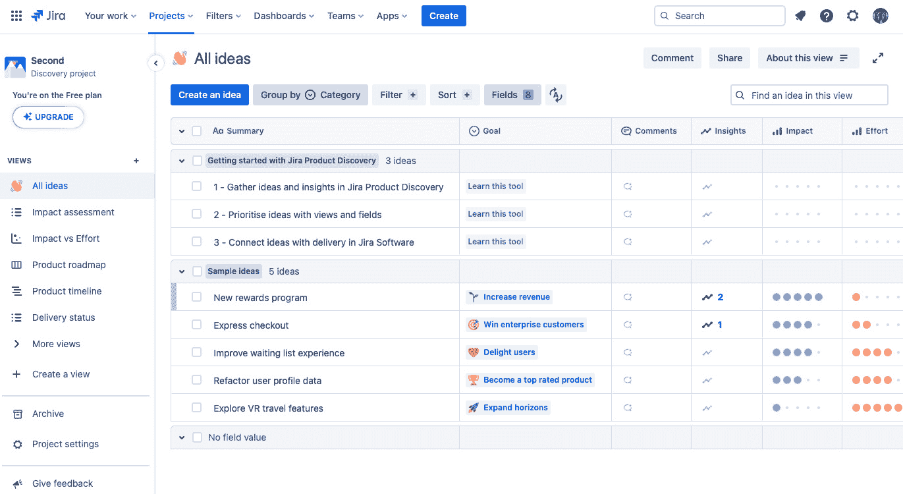
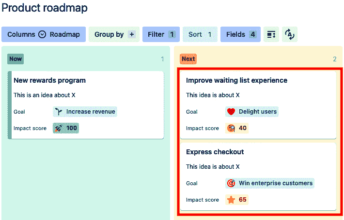
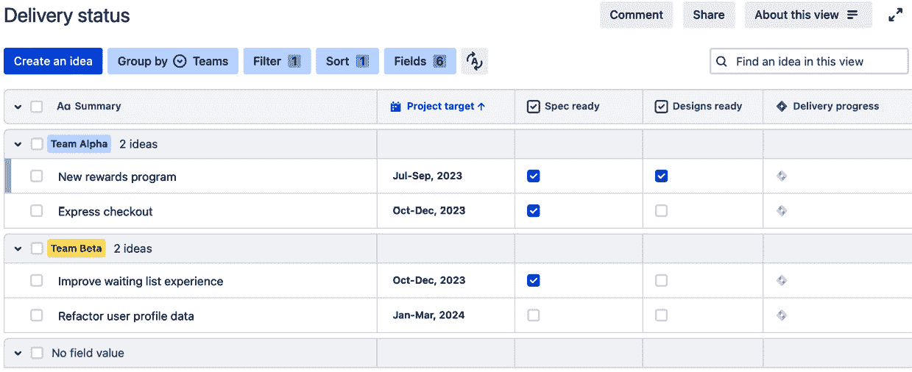
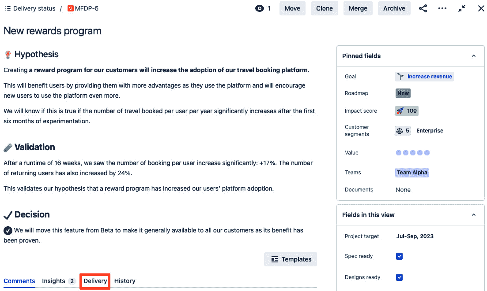
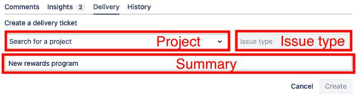

# 第二章：通过 Jira 产品发现了解客户需求

我们从探索 **DevOps** 生命周期开始，看一看价值流的典型触发器，这是 DevOps 思维的重要构成。这个触发器通常是一个想法或新思想，可以表达为一个新产品或功能。**Jira 产品发现**（**JPD**），是 Atlassian Jira 家族中的一款产品，允许用户创建和跟踪称为**想法**的工作项，以记录构思过程。在决定继续实施之后，可以将其作为 Jira 中的**史诗**进行开发。

在本章中，我们将探讨使用 JPD 存储、详细说明和优先考虑想法。想法的使用和维护可以更好地组织，轻松确定哪些想法应该进入实施阶段。因为 JPD 像本书中提到的其他 Atlassian 工具一样，都基于 Atlassian 云，所以我们将讨论限于 Atlassian 云的安装和配置。因此，本章的食谱包括以下内容：

+   采用 JPD

+   创建 JPD 项目

+   查看想法

+   创建想法

+   在字段、评论、附件和见解中添加补充信息

+   在 Jira 中为开发提供想法

现在让我们开始在我们的 Atlassian 云站点上安装 JPD。

# 采用 JPD

JPD 可以使用以下两种许可计划之一进行安装：

+   为最多三名授权用户（称为创建者）提供免费计划

+   针对更大团队的付费标准计划，即有超过三名创建者的团队

本篇将重点介绍如何安装免费计划。组织管理员可以根据需要从免费计划切换到标准计划，反之亦然。

## 准备工作

如我们在*第一章*中看到的，Atlassian 云上有不同级别的管理。一些功能只能由组织管理员执行，而其他功能可能由组织管理员和产品管理员（在本例中是 Jira 管理员）共享。

本篇食谱仅由组织管理员执行。

## 如何执行...

按照介绍中讨论的内容，按照以下说明在您的 Atlassian 云站点上安装 JPD：

1.  作为组织管理员，请转到任何 Atlassian 云产品页面左上角的网格图标，以切换您希望在其上安装 JPD 的站点。如果您负责多个 Atlassian 云站点，请找到您想管理的站点。

1.  **推荐给您的团队**部分的具有 JPD 条目的站点未安装 JPD。这可以在以下插图中看到：

图 2.1 – 选择 Jira 产品发现

1.  选择 JPD 的任一入口都将带您进入**Jira 产品发现**产品页面，介绍 JPD 的功能和好处。选择**立即试用**按钮。

图 2.2 – 选择参与 JPD

1.  然后，Atlassian 会将免费计划添加到您的组织的 Atlassian 云站点。当完成时，您将看到以下消息：

图 2.3 – JPD 成功消息

在添加产品后，组织管理员将被提示创建 JPD 项目。此外，Jira 管理员可能需要创建一个新的 JPD 项目，以存储新的产品创意。让我们在下一个步骤中查看这两种用例。

# 创建 JPD 项目

与其他 Jira 产品（如 Jira 和 Jira 服务管理）一样，JPD 使用项目的概念来存储工作并管理执行工作的人员。

JPD 项目将以创意的形式存储工作，这些创意是新产品或产品功能的潜在起点。参与创意工作的人可以是创作者、拥有许可的用户（负责创建创意），或是非授权贡献者（作为利益相关者添加补充数据和情感），他们可以决定该创意是否适合开发。

## 如何操作...

创建 JPD 项目的其中一种情况是由组织管理员添加 JPD 产品时发生的。让我们接着之前步骤中的内容继续。

### 添加 JPD 项目到产品后

在成功安装 Jira 产品发现 (JPD) 后，它会提示您创建初始项目。让我们查看创建项目的步骤：

1.  一旦 JPD 成功安装到 Atlassian 云站点上，组织管理员可以点击初始**Jira 产品发现**页面上的**开始使用**按钮，接着会看到一个窗口，提示他们通过添加项目名称和关键字来创建第一个项目。

图 2.4 – 创建您的第一个项目窗口

1.  在输入所需的名称和关键字并点击**创建项目**后，JPD 项目将成功创建。项目名称和关键字必须唯一。如果名称或关键字与现有项目相同，Jira 会显示错误并不允许创建项目。

### 创建新 JPD 项目

Jira 管理员可以通过与 Jira 和 Jira 服务管理相同的用户界面创建 JPD 项目。要通过 Jira 界面创建新的 JPD 项目，请执行以下步骤：

1.  从菜单栏的**项目**下拉菜单中，选择**创建项目**，如下图所示：

图 2.5 – 选择创建项目

1.  在**项目模板**页面上选择项目模板。JPD 项目模板位于**产品** **管理**类别中。

图 2.6 – 选择项目模板

1.  在下一个页面上，选择**使用模板**。这将设置项目，确保项目具有 JPD 所使用的正确问题类型和视图。

图 2.7 – 选择使用模板

1.  在**添加项目详情**页面中，添加项目详细信息。为您的项目命名并指定项目密钥。选择访问级别后，点击**创建项目**，如图所示。

图 2.8 – 创建项目

1.  选择的访问级别对谁被视为创建者并因此计费有影响。访问级别分为三种，具体定义如下：

    +   **私密**：只有项目管理员指定的用户才能访问该项目。项目管理员还可以决定谁是创建者，谁是贡献者。

    +   **有限**：所有人都可以访问该项目。项目管理员可以决定谁可以作为创建者。

    +   **公开**：所有人都可以访问该项目。任何具有产品访问权限的人都会被赋予创建者角色。

1.  一旦项目成功创建，任何成员都可以看到项目的默认想法视图。此视图可能类似于以下截图：

图 2.9 – JPD 项目视图

从这里，我们可以开始查看下一个方案：深入了解如何查看想法。

# 查看想法

想法是存储在 JPD 项目中的关键项。想法通过**视图**进行显示和组织。

视图提供了几个重要功能。它们可以根据完成时间、执行团队等标准来组织和排序项目中的想法，也可以根据影响力对竞争性想法进行比较。

视图基于以下四种视图类型，可以以不同的方式组织想法：

+   **列表**：以表格格式显示想法，并包含相关字段。默认示例包括影响评估和交付状态。

+   **看板**：这显示了一个看板，列代表不同的状态或处理方式。一个默认示例是产品路线图。

+   **矩阵**：用于基于两个标准比较想法。一个例子是影响力与努力的对比。

+   **时间轴**：按开发和发布的时间顺序显示想法。默认示例是产品时间轴。

让我们更详细地看看如何与视图进行交互。

## 如何操作...

视图具有以下功能：

+   评论

+   分组想法

+   筛选想法

+   排序想法

+   编辑想法字段

+   创建想法

在视图内创建和编辑想法的直接操作将在下一节中讨论。现在，让我们来看看如何在视图中组织我们的想法。

### 添加评论

任何拥有 JPD 项目访问权限的人员，无论是创建者还是贡献者，都可以在任何视图上发表评论。

让我们来看一下从视图中添加对我们想法的评论：

1.  要在视图中创建评论，请选择**评论**按钮，如下图所示：

图 2.10 – 视图的评论按钮

1.  一个窗口会在**评论**按钮下方打开，如下图所示。点击文本框开始创建评论。

图 2.11 – 开始创建评论

1.  文本框将展开，显示评论样式和内容的控制选项。添加评论后，点击**创建**完成评论创建。

图 2.12 – 评论创建框

1.  一旦创建了评论，**评论**按钮将显示该视图下的评论数量。现有的评论将出现在**创建评论**文本框下方。

图 2.13 – 现有评论和评论数量

### 分组思想

你可以根据共同标准对思想进行分组，比如客户细分、创作者、目标或其他有助于确定哪些思想应优先的特质。在列表、看板和时间线视图中都可以进行思想分组。按照以下步骤在视图中对思想进行分组：

1.  要在视图中分组思想，点击视图中的**按分组**按钮，如此处所示。

图 2.14 – 创建分组

1.  选择分组选项的标准会从右侧打开，如下所示。请选择要用于分组思想的领域，从下拉菜单中选择。

图 2.15 – 分组选择菜单

1.  选定后，视图将发生变化，思想将按组分类，可以展开查看其中的思想。分类将把问题划分到视图中的泳道内，如下图所示：

图 2.16 – 按组查看

### 过滤思想

所有视图类型都可以过滤，以便使符合过滤标准的思想出现在视图中。这可以用来集中关注特定思想，帮助优先排序。按照以下步骤设置过滤器：

1.  要设置过滤器，点击**过滤器**按钮。

图 2.17 – 创建视图过滤器

1.  会从右侧打开一个**过滤器**区域。选择**添加过滤器**以创建过滤器。

1.  如图所示，会出现一个下拉菜单，列出思想领域。选择字段并选择所需的字段选项作为过滤标准。

图 2.18 – 选择视图的过滤标准

1.  完成过滤器选择后，点击右上角的**X**按钮。

通过遵循上述步骤，你可以选择通过过滤器查看视图中显示的思想。只有符合过滤标准的思想会出现在视图中，如下图所示：

图 2.19 – 应用过滤器的视图

让我们来看一下在视图中组织想法的另一种方式。有时，想法需要按照特定顺序排列。排序有助于确定这个顺序。

### 排序想法

你可以通过设置排序顺序来确定想法在视图中出现的顺序。建立排序顺序有助于组织和优先排序想法，并且可能有助于确定哪个想法应该进入实施阶段。此功能仅适用于列表、看板和时间线视图类型。执行以下步骤来排序你的想法：

1.  要进行排序，请按**排序**按钮。

图 2.20 – 按下排序

1.  **排序**窗口将从右侧打开。选择用于主要和次要排序的想法字段，必要时可以选择第三排序。

图 2.21 – 设置排序顺序

1.  完成排序选择后，点击右上角的**X**按钮。

    如果查看你的视图，你应该会看到你的想法已经根据你设置的标准进行了排序。下图显示了按升序**影响得分**排序的效果，这会逆转默认的排序顺序：

图 2.22 – 设置了排序顺序的视图

现在，我们已经准备好查看 JPD 中的想法。让我们来看看*创建* *想法*部分。

# 创建想法

想法是 JPD 中的主要成果。想法允许为新产品和功能提供描述和理由。通过在想法中使用以下功能，想法成为所有补充信息的存储库：

+   字段

+   评论

+   附件

+   见解

让我们来看看通过填写前述功能来创建想法，既可以单独操作，也可以在视图的上下文中进行。

## 准备就绪

默认情况下，只有拥有创建者角色的用户才能在 JPD 项目中实际创建想法。

Jira 管理员可以通过在侧边栏选择**项目设置**选项，允许拥有贡献者权限的用户在项目中创建想法。

图 2.23 – 选择项目设置

从**项目设置**侧边栏选项中，展开**功能**并选择**创建想法**。页面应与以下截图相似：

图 2.24 – 创建想法设置

开启**允许贡献者创建想法**的切换按钮，以便启用该功能。

请注意，启用后，贡献者可以创建想法，但无法编辑或删除它们。对于任何想法，贡献者可以添加评论、附件和见解。

## 如何操作...

在 JPD 项目中，有多种创建新想法的方式。典型的创建位置包括以下几种：

+   导航栏上的蓝色**创建**按钮

+   在任何视图中，都可以通过**创建想法**按钮或**添加** **想法**控件来创建想法。

让我们看看如何使用这些模式创建想法。

### 从“创建”按钮创建一个想法

执行以下操作以使用**创建**按钮创建一个想法：

1.  一旦你确定了谁可以创建想法，他们可以点击导航栏上的蓝色**创建**按钮。

图 2.25 – 使用创建按钮

1.  会出现一个窗口，包含创建想法所需的标准字段。填写这些字段并点击**创建**按钮。

图 2.26 – 创建想法窗口

1.  Jira 管理员可以通过创建表单来更改窗口中显示的字段。这也可能包括通过使用模板预填充**描述**字段。

按照之前的指示创建的想法可以在任何 JPD 项目的视图中看到。以下截图展示了一个创建的想法示例。

图 2.27 – 显示新创建的想法

### 从列表视图中创建想法

JPD 的列表视图以表格格式显示想法。常见字段如**摘要**、**目标**、**影响评分**和**工作量**显示为表格中的列。

默认视图，如**所有视图**、**影响评估**和**交付状态**，都设置为列表视图。这些列表视图可以从侧边栏的**视图**部分中访问。此外，你还可以创建自定义的列表视图。

让我们来看看在列表视图中如何创建一个新想法：

1.  在视图可见的情况下，选择**创建想法**按钮，如下图所示：

图 2.28 – 创建想法按钮

1.  顶部会打开一行，允许你输入新想法的摘要。键入摘要后按*Enter*键。

图 2.29 – 输入新想法的摘要

新创建的想法现在应该可以在你的列表视图中看到。

图 2.30 – 列表视图中的新想法

现在让我们进一步了解路线图视图以及如何在该视图中创建新想法。

### 在路线图视图中创建想法

路线图视图按照想法的实施时间来显示想法。在路线图视图中，代表**现在**、**下一个**和**稍后**时间点的列中包含代表想法的卡片。这使得能够可视化哪些想法应该尽早完成，而不是拖延。

可以通过在侧边栏的**视图**部分中选择来访问路线图视图。

让我们来看看当我们处于**产品** **路线图**视图时如何创建一个新想法：

1.  在路线图中，选择你希望想法出现的列，并点击列底部的**+ 添加想法**按钮。

图 2.31 – 向路线图视图中添加想法

1.  在出现的搜索区域中，输入新想法的摘要。

图 2.32– 输入新想法的摘要

现在我们有了一个在路线图中的新想法。

图 2.33 – 路线图视图中的新想法

### 在矩阵或时间线视图中创建想法

**矩阵**视图和**时间线**视图在二维空间中展示想法，想法的位置代表其在矩阵视图中的重要性，比如影响与努力的对比，或者它在时间线视图中预定的实施时间。

与其他视图一样，矩阵和时间线视图可以从侧边栏的**视图**部分访问。

在矩阵视图或产品时间线视图中创建新想法时，请执行以下步骤：

1.  在矩阵视图或产品时间线视图中，右下角会出现一个带加号的蓝色圆圈。选择该蓝色圆圈以创建新想法。

图 2.34 – 在产品时间线视图中创建一个想法

1.  圆圈会扩展，显示可以添加到视图中的想法。在这些想法下面，有一个**创建新** **想法**按钮。

图 2.35 – 创建新想法

1.  按钮变为文本框，如下图所示，允许你输入新想法的摘要。按下*Enter*键完成创建。

图 2.36 – 添加新想法

然后，可以通过从**添加想法**区域将新想法拖放到产品时间线或矩阵视图中，放置在需要的位置。

图 2.37 – 将新想法拖放到时间线视图

一旦创建了一个想法，我们可能希望添加补充信息以记录学习过程，并帮助决策。接下来的操作将演示如何向想法中添加额外信息。

# 向想法中添加信息

一旦创建了想法，创作者和协作者可以为其添加上下文，以展示想法的发展，并帮助促进决策。添加这些信息的常见方法包括使用以下方式：

+   字段

+   评论

+   附件

+   洞察

让我们来看看添加这些信息的常见方法。

## 准备就绪

权限可以决定谁有权限添加信息。字段只能由创作者修改。创作者和协作者都可以添加评论、附件和洞察。

## 如何操作...

可以从以下位置添加字段、评论、附件和洞察：

+   在选择某个想法时出现的页面上

+   从点击视图中某个想法时出现的扩展右侧面板

+   直接在视图中（对于列表视图类型）

让我们看看如何添加这些信息。

### 在思路页面添加

让我们看看如何在思路的页面上添加数据：

1.  思路通常可以通过点击项目中任何位置的思路 ID 来显示在自己的页面上，但最常见的方式是从视图中显示。思路页面显示了字段、评论、附件和见解的位置标签。

图 2.38 – 思路页面

1.  **评论**和**见解**设置为标签页字段。选择**评论**查看所有评论并输入新评论。在文本区域中输入新评论并点击**创建**按钮完成。

图 2.39 – 输入评论

评论与该思路的其他评论一起显示。

图 2.40 – 带有现有评论的新评论

1.  选择**见解**查看链接到其他来源，或者通过点击**创建见解**按钮自己创建这样的链接。输入见解来源的链接，并在文本区域中输入描述性文本。完成后点击**创建**按钮。

图 2.41 – 输入见解

新的见解将出现在见解列表的顶部。

图 2.42 – 带有其他见解的新见解

我们已经看到可以在思路的页面上添加相关信息。让我们来看看如何在选择视图中的单个思路时打开的思路面板中做同样的事情。

### 从思路面板添加

你可以在视图中点击任何思路，允许思路面板显示在视图的右侧。这里展示了思路面板。

图 2.43 – 思路面板

**评论**和**见解**可以通过各自的按钮查看和添加。附件可以通过**添加附件**按钮添加。可以通过滚动到字段、点击该字段并选择所需的值来修改字段。

之前的步骤已允许我们通过思路面板向思路添加相关信息。

### 从列表视图修改

列表视图以表格的形式布局，如截图所示。行表示思路，列表示字段。

图 2.44 – 列表视图和字段

创作者可以通过进入代表思路的行和代表字段的列的交点来修改思路的字段。点击单元格可以修改字段。一些功能，如评论和见解，可以设置为额外的列。

一旦思路被批准实施，我们需要将其与实施进行关联。下一个流程将通过在 Jira 中创建一个关联的史诗来实现这一点。

# 在 Jira 中提交开发思路

当想法准备好进行开发时，可以将其与 Jira 中的史诗关联。随着史诗的创建，原始想法和生成的史诗之间将建立链接。还可以通过查看关联的 Jira 问题的状态来确定交付进度。

让我们来看看如何将 JPD 与 Jira 链接。

## 准备就绪

在创建史诗之前，请验证以下内容：

+   至少有一个 Jira 项目可用于容纳史诗。

+   创建史诗的人具有在目标项目中创建史诗的适当权限。这个人应当是 JPD 项目的成员或 Jira 管理员。

当满足这两个条件时，就可以轻松地在 JPD 中创建作为交付票据的史诗。

## 如何操作...

从以下两个位置可以创建作为交付票据的史诗：

+   在想法页面上

+   在视图中的想法面板

让我们来看一下如何从这些位置创建史诗。

### 从想法页面创建史诗

要在 Jira 中创建与 JPD 中的想法关联的史诗，请执行以下步骤：

1.  在想法页面上，点击**交付**标签。

图 2.45 – 在想法页面上选择交付标签

1.  **交付**标签将展开，提供以下两个选项：

    +   创建一个新的交付票据（史诗）

    +   创建与现有交付票据的链接

1.  选择**创建交付票据**将显示项目、问题类型和摘要的文本框，如下所示。

图 2.46 – 创建交付票据

1.  选择项目和问题类型，并在点击**创建**之前填写所需的摘要。

现在，史诗已出现在 Jira 项目中，并且与您的想法关联。

### 从想法面板创建史诗

让我们来看看如何从想法面板创建一个史诗并将其与我们的想法关联起来：

1.  从视图中选择一个想法，以在右侧显示想法面板。你应该会看到面板顶部附近的**交付**标签，如下图所示：

图 2.47 – 想法面板中的交付标签

1.  **交付**标签将展开，提供以下两个选项：

    +   创建一个新的交付票据（史诗）

    +   创建与现有交付票据的链接

1.  这些内容在下图中进行了说明。

图 2.48 – 创建交付票据

1.  选择**创建交付票据**将显示项目、问题类型和摘要的文本框，如下所示。

图 2.49 – 填充交付票据信息

史诗将出现在交付票据的列表中。

图 2.50 – 交付票据的显示

在本章中，我们探讨了 JPD 的功能，它能够帮助我们跟踪和优先排序产品想法，并决定何时将其发送给开发团队进行实现。这项新工作启动了开发和运维团队用于开发、发布和维护产品的 DevOps 循环。
