# 使用 Confluence 进行规划和文档编写

在我们开始开发过程时，我们必须寻找一个方便的地方来记录我们的进展，明确工作范围，并说明我们将如何进行开发过程。对于许多组织来说，这个地方是**Confluence**。

将 Confluence 与 DevOps 工具链中的其他产品集成，可以让你将来自这些工具的工件链接到 Confluence 文档页面。这些页面的内容可能包括计划和其他项目数据，以及来自 Bitbucket 的代码内容。通过允许 Confluence 页面与 Jira 和 Bitbucket 中的工件之间的紧密集成，作为 Confluence 页面创建的文档工件拥有了更丰富的上下文，从而增强了其意义并提高了理解。

本章中，我们将利用 Confluence 与其他可用的 Atlassian DevOps 工具链工具之间的集成。为此，我们将介绍以下配方：

+   创建与 Jira 项目链接的 Confluence 页面

+   在 Confluence 页面中显示 Jira 问题

+   在 Confluence 页面中查看 Jira 生成的报告

+   在 Confluence 页面中查看 Jira 路线图

+   使用智能链接查看其他应用程序中的链接页面

# 技术要求

为了完成本章中的配方，你需要创建一个安装了 Jira 和 Confluence 的 Atlassian Cloud 网站。连接 Confluence 和 Jira 的方法在*第一章*的《连接 Confluence》配方中已有讲解。

此外，Jira 管理员以及可能的 Jira 项目管理员必须确认你已启用浏览项目权限，且该权限适用于你要工作的项目。Confluence 空间管理员必须确认你在正确的组中，并且已启用**页面、白板和智能链接**，如以下截图所示：

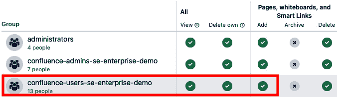

图 3.1 – 添加页面、白板和智能链接的空间权限

现在我们已经涵盖了前提条件，接下来让我们从将 Confluence 链接到 Jira 项目开始。

# 创建与 Jira 项目链接的 Confluence 页面

我们在*第一章*中学习了如何集成 Jira 和 Confluence。在每个 Jira 项目中，成员可以直接从 Jira 创建和修改 Confluence 内容。

Confluence 页面与 Jira 项目之间的集成使你能够将文档与项目产生的事件和工件紧密联系。以下是一些文档示例：

+   用户文档

+   需求规范

+   会议记录

+   发布说明

让我们学习如何创建这样的内容并将其连接到 Jira 项目。

## 如何操作……

你可以在不离开 Jira 的情况下创建 Confluence 页面。这提高了工作效率，因为它消除了不必要的上下文切换。

让我们看看怎么做：

1.  从你的 Jira 项目中，选择左侧边栏中的**项目页面**，如下面的截图所示：

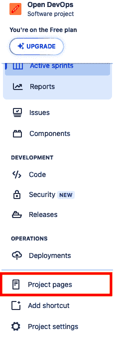

图 3.2 – 选择项目页面

1.  页面将显示来自 Confluence 的任何内容，例如已经连接的页面或空间（页面的集合）。从这里，你有以下选项：

    +   编辑当前已连接的页面

    +   在顶层创建新页面

    +   为现有页面创建一个新的子页面

让我们更深入地了解这些选项。

### 编辑现有页面

请按照以下步骤操作：

1.  在**项目页面**页面，找到你想编辑的页面。将鼠标悬停在与该页面对应的行上，你应该会看到一个铅笔图标，如下所示：

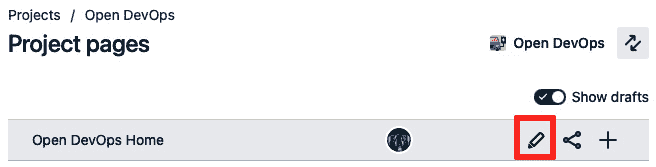

图 3.3 – 选择要编辑的页面

1.  选择铅笔图标会打开一个模态窗口，页面准备进行编辑。进行更改后，点击**更新**以发布更改的页面。

    在这里，你从 Jira 进入了 Confluence，并通过 Confluence 编辑页面。该行会更新，指示它已被最近编辑。

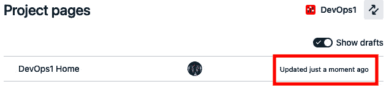

图 3.4 – 在 Jira 中更新的页面

### 创建新页面

请按照以下步骤操作：

1.  在**项目页面**页面的右侧，有一个显示相关页面模板的部分。

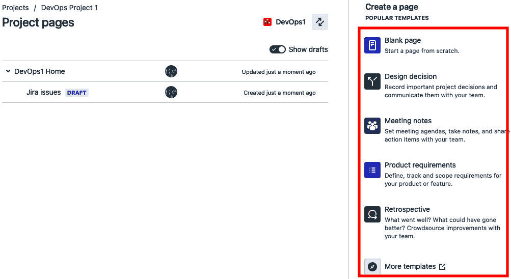

图 3.5 – 为新页面选择模板

1.  选择模板将打开一个新页面，模板将以模态的形式使用，如下所示：

图 3.6 – 编辑新页面

1.  进行所需的更改，点击**发布**将页面发布到 Confluence 或 Jira 中，使其他人可以查看。该页面将出现在空间的顶层。

    现在，你应该已经在 Confluence 中创建了一个全新的页面，并且该页面与 Jira 项目连接。

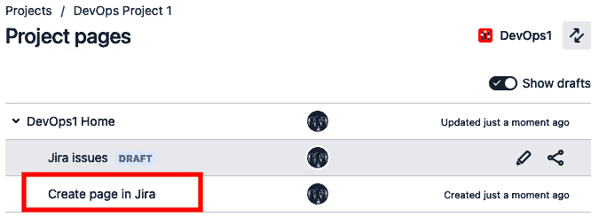

图 3.7 – 在 Jira 中看到的新页面

### 创建子页面

请按照以下步骤操作：

1.  在**项目页面**页面，找到你想用作父页面的页面。将鼠标悬停在代表该页面的行上，查看各种工具，例如铅笔图标。选择加号（**+**）。

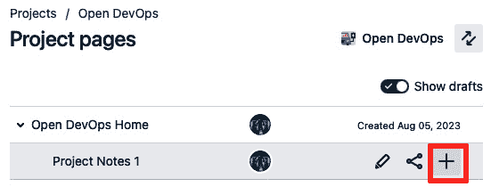

图 3.8 – 选择父页面

1.  一个你想编辑的页面将作为模态窗口打开。进行所需的更改后，点击**公开**，使页面在 Confluence 或 Jira 中可供其他人查看。

到目前为止，我们添加到 Confluence 页面上的内容都是我们使用默认文本编辑器编辑的文本。在接下来的操作中，我们将看看如何向这些页面添加特殊内容。

# 在 Confluence 页面上显示 Jira 问题

将 Confluence 与 Jira 集成可以向 Confluence 页面添加增强的内容，以便用于文档目的。通过集成添加的内容会实时更新，使 Confluence 页面变得动态。

你可以通过使用 **宏** 将 Jira 问题集成到 Confluence 页面中。这些是 Confluence 本地支持的附加功能，或可以通过 Atlassian Marketplace 应用添加。它们提供了增强的格式化功能，并允许你添加内容。

让我们仔细看看如何使用 Confluence 宏。

## 如何操作……

我们将使用宏执行以下操作：

+   显示来自 Jira 项目的现有 Jira 问题

+   创建新的 Jira 问题

每个操作都使用不同的宏。

### 显示现有的 Jira 问题

让我们看看显示现有 Jira 问题的宏：

1.  要查看可用的宏，请选择你正在编辑的页面上的加号 (**+**) 或编辑 Jira 中的模态框，如下所示：

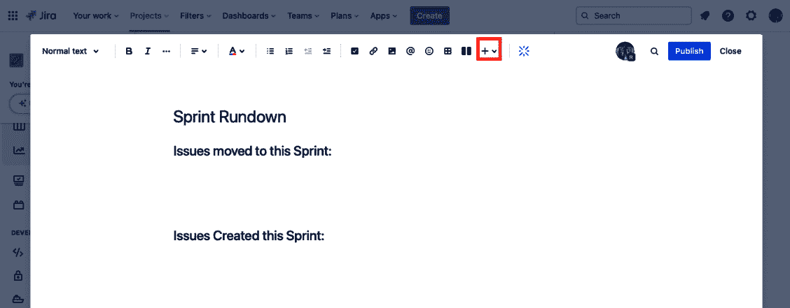

图 3.9 – 添加宏

1.  搜索适当的 Jira 专用宏。在这种情况下，我们要从下拉菜单中找到 **Jira 问题** 宏，如下图所示。你可以按关键词搜索或选择一个类别。选择 **查看更多** 以查看所有类别。

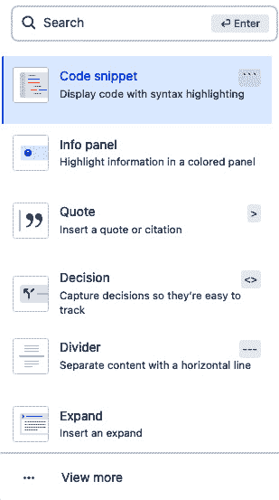

图 3.10 – 搜索宏

1.  当选择 **查看更多** 时，可以通过类别或搜索它们来访问所有可用的宏。在页面上选择你希望使用的宏并点击 **插入**。

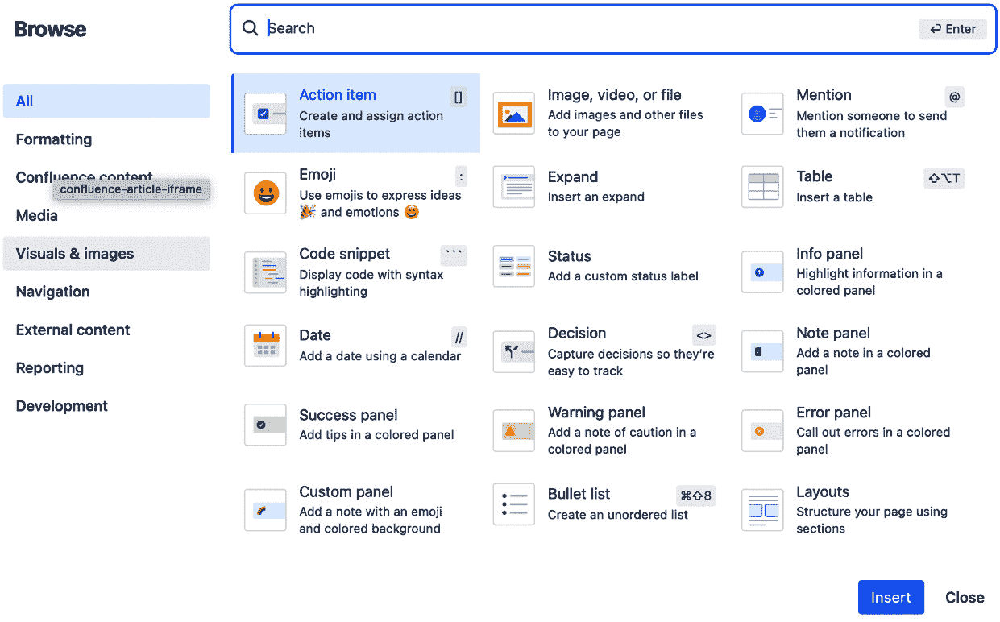

图 3.11 – 从浏览屏幕选择宏

1.  在我们的例子中，我们要查找 `jira` 并从出现的选项中选择它。

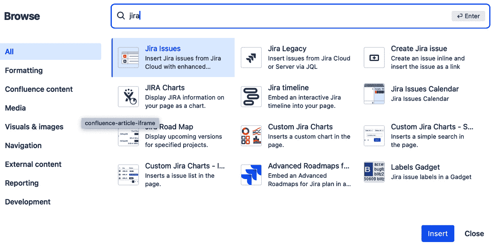

图 3.12 – 选择 Jira 问题宏

1.  **Jira 问题** 宏通过 **BASIC** 搜索机制或更高级的 **Jira 查询语言** (**JQL**) 查询来查找要显示的问题。搜索所需的问题并选择 **插入问题**。

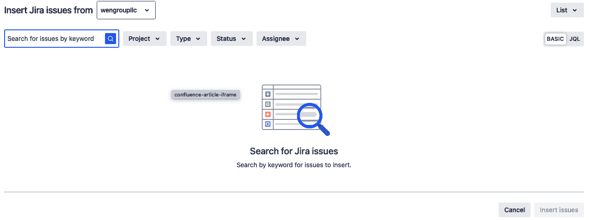

图 3.13 – 选择 Jira 问题

现在我们知道如何使用宏来添加内容，让我们看看如何使用宏来创建新的 Jira 问题。

### 创建新的 Jira 问题

要创建一个新的 Jira 问题并将其链接到我们的 Confluence 页面，我们将使用一个不同的宏。按照以下步骤通过宏创建新的 Jira 问题：

1.  我们可以在 **开发** 类别中查找 Jira 宏，如下图所示。选择 **创建 Jira 问题** 宏并点击 **插入**。

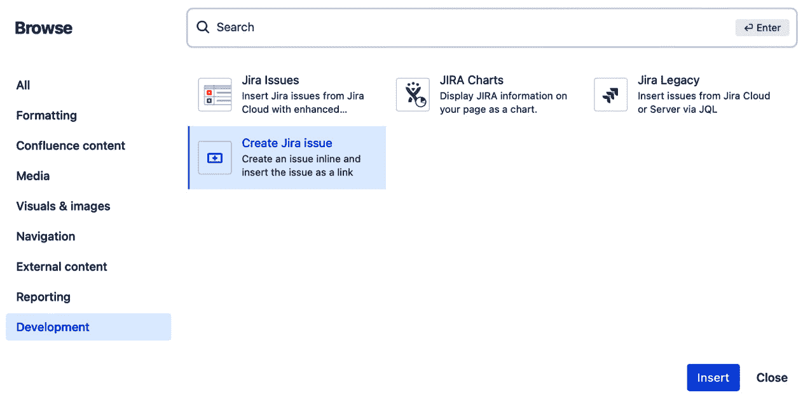

图 3.14 – 选择创建 Jira 问题宏

1.  你可以用来编辑新 Jira 问题的字段将以模态框的形式显示。填写所需的字段，然后点击 **创建** 以记录新的 Jira 问题。

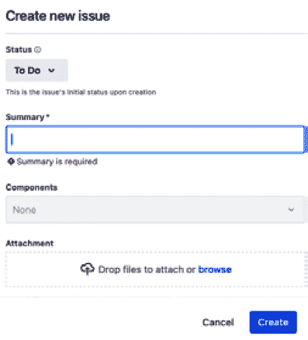

图 3.15 – 创建 Jira 问题

一旦创建，Jira 问题可以被格式化，以便在 Confluence 页面上显示。你可以选择以下配置之一：

+   URL

+   一行文本

+   作为一个卡片，显示几个字段

+   嵌入到页面中

如果 Confluence 页面处于编辑模式，可以更改所需的格式。

这样，你应该在 Confluence 页面上看到一个新的 Jira 问题。

## 另见

关于使用 JQL 创建查询的更多信息，请查看以下资源：

+   [`www.youtube.com/watch?v=KC7vPPP2sQo`](https://www.youtube.com/watch?v=KC7vPPP2sQo)

+   [`www.youtube.com/watch?v=Bbvl9PqCePA`](https://www.youtube.com/watch?v=Bbvl9PqCePA)

+   [`www.atlassian.com/software/jira/guides/jql/overview#what-is-jql`](https://www.atlassian.com/software/jira/guides/jql/overview#what-is-jql)

# 在 Confluence 页面上查看 Jira 报告

在 Jira 上创建的相同报告可以在 Confluence 页面上复制并显示。宏允许你复制和显示这些报告。这些宏是 Confluence 内置的，或者可以由第三方 Atlassian Marketplace 应用程序提供，如 Jira 的自定义图表。

你可能会想，“如果报告已经在 Jira 中，为什么还要使用 Confluence？”答案是，Confluence 提供了在项目更大背景下查看报告的视角。报告可以嵌入到 Confluence 页面中，或作为 Confluence 空间的一部分，这样所有项目信息就集中在一个地方，便于查阅。

让我们来看看如何在项目的 Confluence 页面上启用这些报告宏。

## 如何操作…

以下宏可以用于 Confluence 中的报告：

+   **JIRA 报告模板**：这是一个 Confluence 页面模板，用于基于文本的报告，例如**变更日志**或**状态报告**。

+   **JIRA 图表宏**：此宏允许你插入自定义的二维图表、创建与解决的图表或饼图。

让我们学习如何使用这些宏在 Confluence 中创建关于 Jira 数据的报告。

### 使用 JIRA 图表宏

我们首先来看看 JIRA 图表宏：

1.  当你浏览宏时，**开发**类别下可以找到报告宏，如下所示：

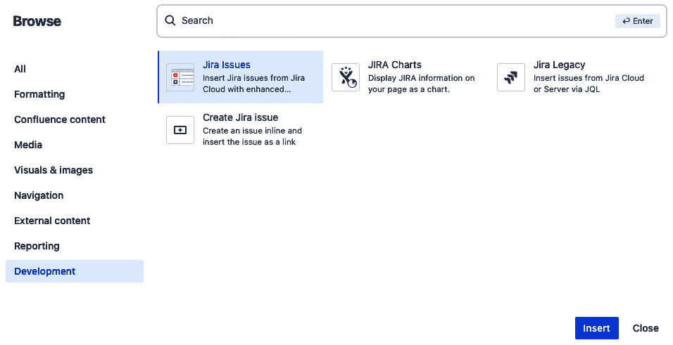

图 3.16 – 浏览开发类别以查找报告宏

1.  选择**JIRA 图表**并点击**插入**。

1.  另一种查找和选择任何 Confluence 宏的方法是，在编辑 Confluence 页面时进行。只需在空行中添加反斜杠字符（`/`），如图所示：

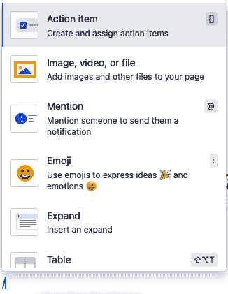

图 3.17 – 在编辑 Confluence 页面时选择宏

1.  继续输入宏的名称（在此为`JIRA 图表`）。内置的搜索功能将在你输入时限制可能的选项。当你找到所需的宏时，选择它。

1.  从浏览模态窗口或通过内联编辑选择后，报告宏的各种配置选项将出现在模态窗口中。配置所需的选项，包括数据源、刷新间隔和格式。以下是一个示例：

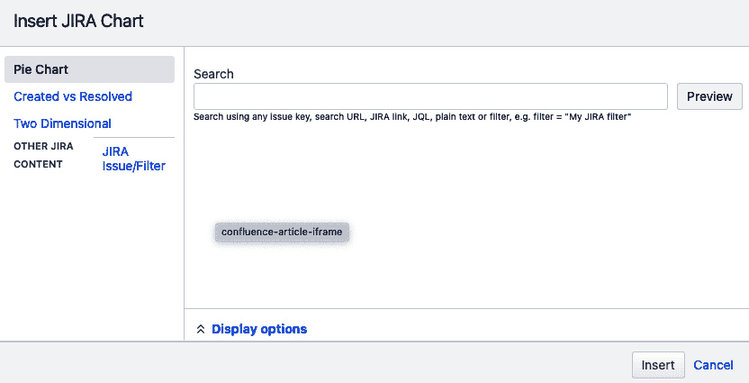

图 3.18 – 配置 JIRA 图表宏

1.  如我们所见，配置内容包括选择图表类型（**二维图**、**已创建与已解决**或**饼图**）、通过 JQL 查询或筛选器指定数据源，以及各种**显示选项**，包括对数据进行分组。配置完成后，点击**插入**。以下截图展示了使用**已创建与已解决**图表进行此类配置的示例：

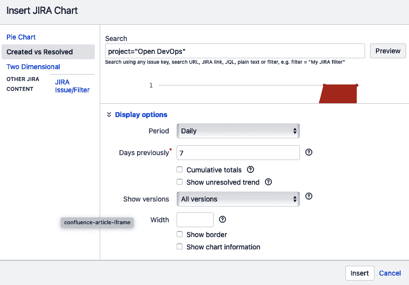

图 3.19 – 设置 JIRA 图表宏的配置

1.  图表将生成并添加到 Confluence 页面。生成的页面应类似于以下内容：

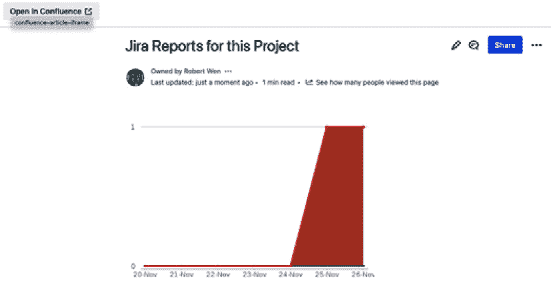

图 3.20 – Confluence 页面上的 Jira 图表

按照之前的步骤，你已经创建并配置了 Jira 图表，并将其显示设置为 Confluence 页面。

其他报告使用**JIRA** **报告**模板。

### 使用 JIRA 报告模板

让我们来看一个创建 Confluence 页面并配置报告的示例。像变更日志或状态报告这样的报告可以成为设计文档的基础，并在整个项目中进行更新。请按照以下步骤操作：

1.  使用**JIRA 报告**模板创建一个新的 Confluence 页面。你可以通过在**创建页面**部分使用**更多模板**选项来搜索此模板。

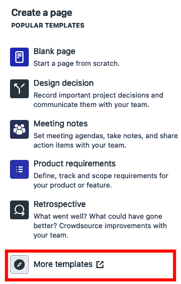

图 3.21 – 使用“更多模板”选项

1.  在打开的页面中，搜索框输入 `Jira report`。你应该看到以下结果：

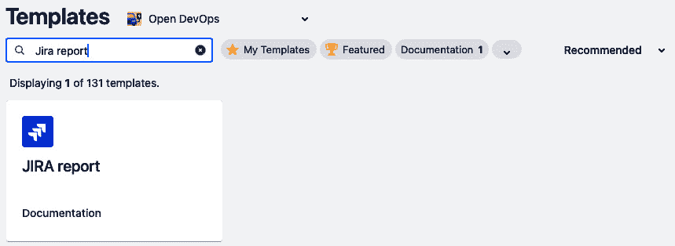

图 3.22 – 查找 JIRA 报告模板

1.  选择**JIRA 报告**模板并点击**使用**，将打开一个模态窗口，在其中你可以选择报告类型，如下所示：

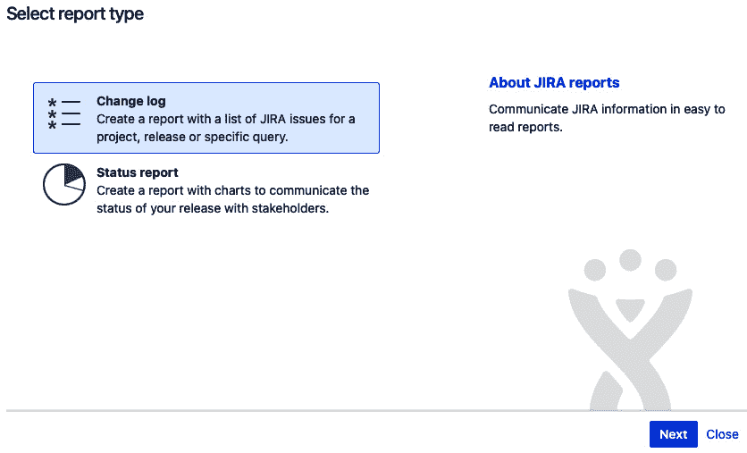

图 3.23 – 选择报告类型

1.  选择你希望使用的报告类型并点击**下一步**，将打开另一个页面，你可以在其中选择你要创建状态报告的项目并编辑其标题。

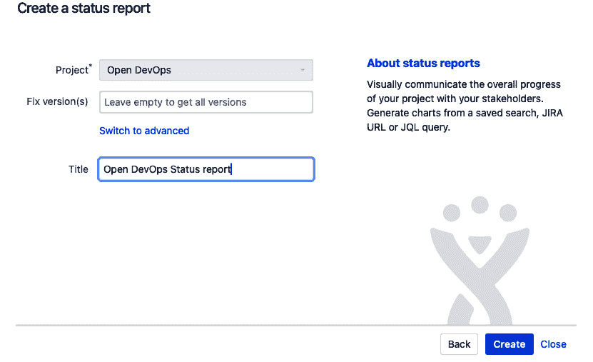

图 3.24 – 创建状态报告

1.  在前面的图中，我们选择了状态报告并确定了它的项目。点击**创建**按钮后，相关页面将被创建。

通过这个方法，我们已经基于**JIRA** **报告**模板创建了一个可在 Confluence 页面上显示的 Jira 变更日志或状态报告。

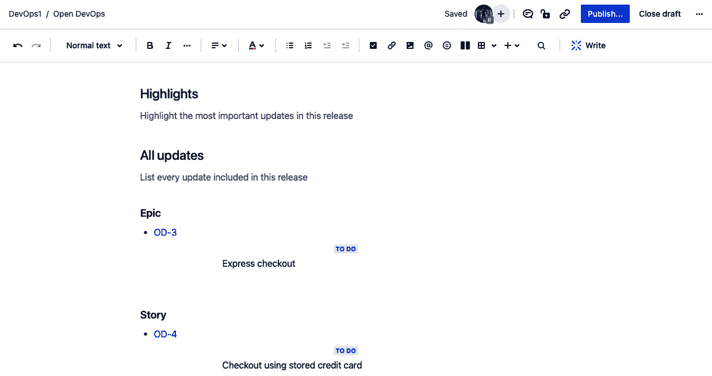

图 3.25 – 我们新创建的变更日志

# 在 Confluence 页面上查看 Jira 路线图

如果您在项目中创建了时间线，您可以将该时间线作为路线图显示在 Confluence 页面上。我们将使用**Jira 时间线**宏来实现这一点。

## 如何操作…

让我们学习如何在 Confluence 页面上创建 Jira 路线图：

1.  在 Confluence 页面上，找到 Jira 时间线宏。找到后，添加它。

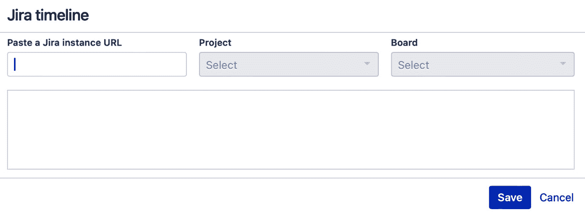

图 3.26 – 配置 Jira 时间线宏

1.  前往项目的**Jira 时间线**页面，将 URL 复制并粘贴到**粘贴 Jira 实例 URL**文本区域，然后点击**保存**。

通过粘贴**Jira 时间线**页面的 URL，您已将 Jira 路线图链接到 Confluence 页面。

到目前为止，我们已经讨论了如何将 Jira 连接到 Confluence，使 Confluence 能够显示 Jira 相关内容。在下一个操作中，我们将关注连接其他应用程序，使它们也能做到这一点。

# 使用智能链接查看来自其他应用程序的链接页面

存在于其他应用程序中的内容，如 Bitbucket、GitLab 和 Figma，可以通过**智能链接**在 Confluence 页面上动态显示。智能链接允许 Confluence 显示来自各种应用程序的 URL 链接，包括 Atlassian 产品如 Bitbucket 和 Jira，可以内嵌或以行内方式展示。

让我们仔细看看如何使用智能链接将链接页面内容嵌入到 Confluence 页面中。

## 准备工作

智能链接可以从 Atlassian 和非 Atlassian 产品中创建。以下 Atlassian 产品可以将其链接指定为智能链接：

+   Atlas

+   Atlassian 分析

+   Bitbucket

+   Compass

+   Jira

+   Jira 路线图

+   Jira Align

+   Trello

常用于应用程序开发过程中的非 Atlassian 产品，以及在 Confluence 中作为智能链接显示的链接包括 Azure DevOps、GitHub 和 GitLab。支持的应用程序完整列表可以在 [`support.atlassian.com/confluence-cloud/docs/insert-links-and-anchors/#Smart-Links-from-Jira-and-other-products`](https://support.atlassian.com/confluence-cloud/docs/insert-links-and-anchors/#Smart-Links-from-Jira-and-other-products) 查找。

让我们仔细看看设置智能链接涉及的内容。

### 使用其他应用进行身份验证

对于任何需要身份验证的非 Atlassian 产品，您必须先登录该应用程序，才能在 Confluence 页面上显示智能链接。您只需登录一次。这将在该 Atlassian Cloud 组织的所有站点上生效。

## 如何操作…

通过身份验证后，让我们创建并配置我们的智能链接：

1.  在编辑模式下的 Confluence 页面中，复制第二个应用程序中所需的 URL 并粘贴到 Confluence 页面上的所需位置。

1.  要调整链接内容的格式，请点击智能链接。各种控制项将出现，如下截图所示：

图 3.27 – 智能链接控制

1.  前四个图标决定了链接的显示方式。从左到右的顺序如下：

    1.  原始 URL

    1.  链接页面的标题

    1.  卡片模式显示链接页面的标题和描述（如前面的截图所示）

    1.  嵌入模式，其中链接页面的内容将可见

    其他控制项允许您执行以下操作：

    1.  编辑基础 URL 链接

    1.  在另一个浏览器标签页中打开链接的页面

    1.  复制 URL 链接

    1.  打开**链接** **偏好设置**页面

    1.  从 Confluence 页面中移除智能链接

让我们仔细看看链接偏好设置。

### 使用链接偏好设置

链接偏好设置是按账户设置的——即，它们是单个用户创建的所有智能链接的首选设置。因此，它们会显示在用户的 Atlassian 账户设置中，可以在 [`id.atlassian.com`](https://id.atlassian.com) 下找到。让我们仔细看一下：

1.  在上述页面中，您将找到以下设置：

    +   **默认显示**：设置创建智能链接时的默认显示方式

    +   **特定域名的例外**：根据链接的域名指定例外

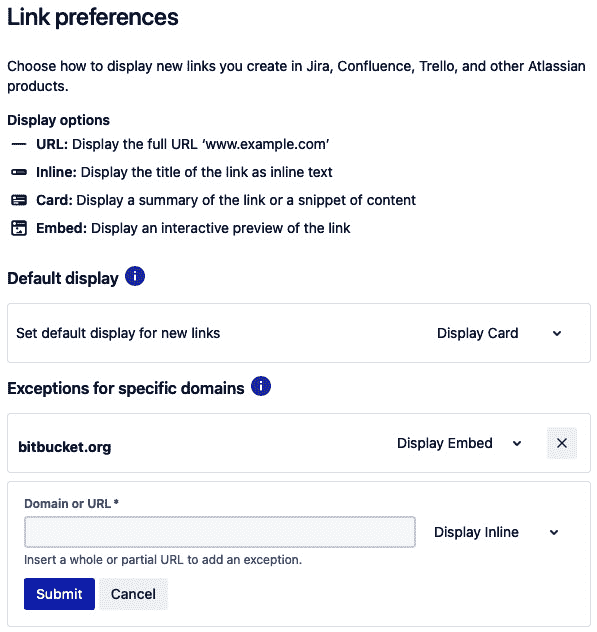

图 3.28 – 链接偏好设置页面

1.  要设置默认显示方式，请选择所需的模式（**显示 URL**、**显示内联**或**显示卡片**）。

1.  要为默认显示设置例外，请输入域名的 URL，选择所需的模式（**显示 URL**、**显示内联**、**显示卡片**或**显示嵌入**），然后点击**提交**。

这样，我们就设置了 Atlassian 在创建个人智能链接时所使用的配置，以及如何创建智能链接。

# 第二部分：从开发到部署

在开发过程的这一部分，我们正在开发我们的实现。这要求开发的软件处于版本控制之下，我们会追踪所有相对于之前版本的更改。

在 Git 提交执行后，管道立即启动。进行扫描和测试以查找错误和安全漏洞。如果一切通过，管道将完成构建工件的打包以进行部署。

本部分讨论了管道在执行由 Git 提交触发的所有必要活动中所起的作用。我们首先描述如何将 Jira 连接到外部 Git 服务器工具和外部管道工具，以实现持续集成。

然后，我们介绍了 Bitbucket Cloud。这个工具可以同时作为 Git 服务器和与 Bitbucket Pipelines 一起使用的管道工具。借助 Bitbucket Pipelines，我们探索了各种可用的功能，包括与测试和安全工具的连接，以及最终部署到不同的环境中。

本部分包括以下章节：

+   *第四章*，*为设计、源代码管理和持续集成启用连接*

+   *第五章*，*理解 Bitbucket 和 Bitbucket Pipelines*

+   *第六章**,* *扩展和执行 Bitbucket Pipelines*

+   *第七章**,* *利用测试用例管理和安全工具进行 DevSecOps*

+   *第八章**,* *使用 Bitbucket Pipelines 部署*

+   *第九章**,* *利用 Docker 和 Kubernetes 进行高级配置*
