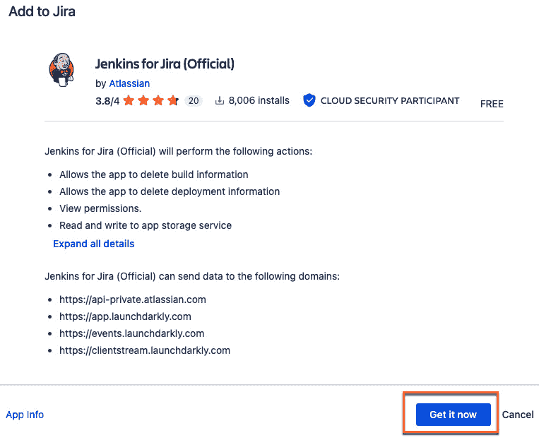
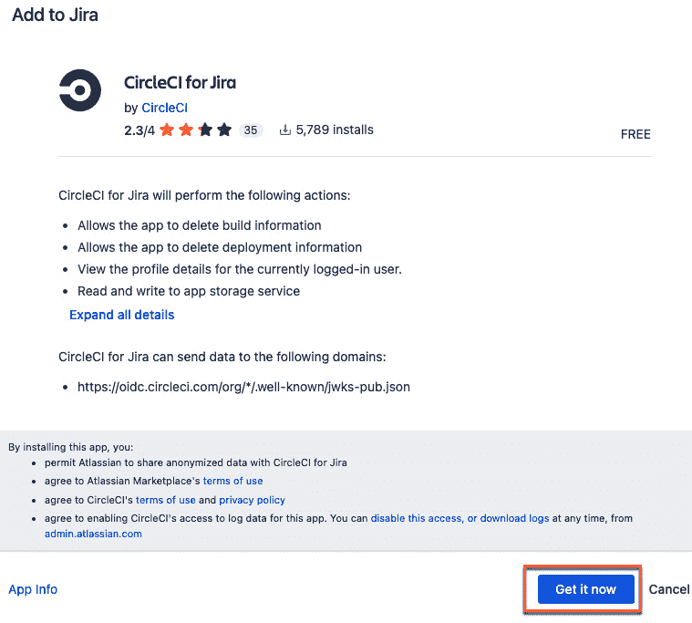
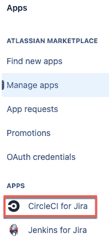
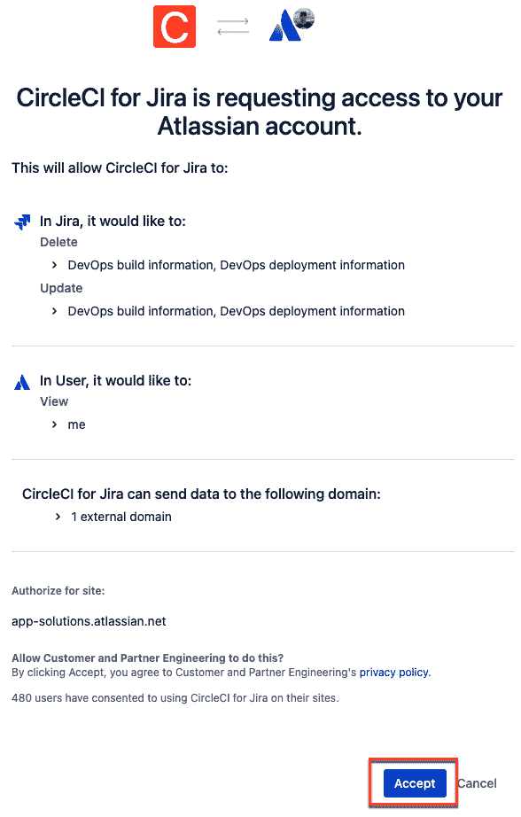

# 启用设计、源代码管理和持续集成的连接

Atlassian 的 Open DevOps 工具链的强大之处在于能够与许多外部第三方应用程序集成。尽管一个组织可能将 Atlassian 用作 DevOps 的骨干，但可能会有其他偏好的应用程序用于设计、源代码管理或**持续集成**（**CI**）。例如，虽然 Atlassian 可以轻松连接 Bitbucket 进行**源代码管理**和 CI，但我们可能希望连接到现有工具，如 GitHub 和 GitLab 进行源代码管理，以及 Jenkins 和 CircleCI 进行 CI。本章将演示如何将 Jira 与这些外部工具集成，以便在 Jira 中查看源代码管理和 CI 信息。

为实现这一目标，我们将参考以下方案：

+   将 Jira 与设计工具连接

+   使用原生集成将 Jira 与源代码管理连接

+   使用通用集成将 Jira 与源代码管理连接

+   将 Jira 与 CI 工具连接

# 技术要求

完成本章内容，你将需要以下内容：

+   Jira

+   Moqups 账户，访问 [`moqups.com/`](https://moqups.com/)

+   Figma 账户，访问 [`www.figma.com/`](https://www.figma.com/)

+   GitLab 账户，访问 [`gitlab.com/`](https://gitlab.com/)

+   CircleCI 账户，访问 [`circleci.com/`](https://circleci.com/)

+   可用的本地 Jenkins 服务器，访问 [`www.jenkins.io/`](https://www.jenkins.io/)

# 将 Jira 与设计工具连接

可视化设计工具让设计师高效地创建线框图、模型和原型。通过创建这些详细的原型，你可以在编写任何代码之前识别可用性问题并进行必要的修改。例如，如果一个组织想开发移动应用程序，可以使用这些设计工具创建 UI 模型。然后可以将该模型附加到为跟踪此设计工作项而创建的**Jira 问题**中。

## 准备工作

要执行此方案，你将需要以下内容：

+   Jira 管理员权限，以便安装必要的应用插件

+   你的 Moqups 账户

+   你的 Figma 账户

## 如何进行操作…

本方案的目标如下：

+   配置两个流行设计工具（Moqups 和 Figma）与 Jira 的集成

+   演示在 Jira 问题中使用设计工具

让我们开始实现这些目标。

### 如何将 Jira 连接到 Moqups

**Moqups** 是一个基于 Web 的应用程序，旨在促进线框图、模型、图表和原型的创建。这些是网站、软件和应用程序开发过程初期阶段的关键组成部分。

让我们开始将 Moqups 应用程序添加到 Jira 中。

1.  前往应用商店并搜索 Moqups 应用程序，选择 **Moqups for Jira** **Cloud** 应用程序。

图 4.1 – 寻找 Moqups 应用程序

1.  会显示一个应用信息页面。选择 **获取应用** 开始安装过程。

图 4.2 – 获取 Moqups 应用

1.  会出现一个 **添加到 Jira** 的弹出窗口。选择 **立即获取** 按钮以继续安装过程。

图 4.3 – 添加应用弹出窗口

1.  一旦应用安装完成并准备就绪，窗口将显示，允许您配置应用。选择 **配置** 选项。

图 4.4 – 配置 Moqups 应用

1.  要配置应用，您必须连接到现有的 Moqups 帐户。这将建立一个集成，允许您提取任何现有的 Moqups 项目。选择 **连接到现有 Moqups** **帐户** 按钮。

图 4.5 – 连接到现有的 Moqups 帐户

1.  会显示一个 Moqups 凭证弹出窗口。输入您的 Moqups 帐户凭证并选择 **连接** 按钮。

图 4.6 – 输入 Moqups 凭证

1.  一旦您的 Moqups 凭证成功验证，您将看到 **Moqups 应用信息** 页面。在这里，您可以调整权限、订阅配额，或与 Moqups 断开连接。

图 4.7 – Moqups 配置设置

1.  现在 Moqups 已安装并配置完毕，我们可以将项目添加到任何 Jira 问题单中。为此，进入适当的 Jira 问题单并选择三个点以查看更多选项。选择 **Moqups** 选项。

图 4.8 – 选择 Moqups 以将组件添加到 Jira

1.  在 Jira 问题单中将提供一个 **Moqups** 部分。选择 **添加 Moqups 项目** 将一个项目拉入该问题单。

图 4.9 – 将 Moqups 项目添加到 Jira 问题单

1.  所有可用的 Moqups 项目将根据用户的权限显示。选择适当的项目，然后点击 **添加** 按钮。

图 4.10 – 选择并添加 Moqups 项目

1.  Moqups 项目现在已作为对象嵌入在 Jira 问题单的 **Moqups** 部分中。

图 4.11 – Moqups 项目在 Jira 问题单上

1.  您现在可以直接在 Jira 问题单中编辑 Moqups 项目。选择 **Moqups** 对象中的铅笔图标，您将进入该项目的编辑模式。

图 4.12 – 编辑 Moqups 项目

做得好！你现在已经通过将 Moqups 设计应用与 Jira 集成，实现了本教程的目标。现在，你可以让设计团队和项目管理团队保持完全同步。

接下来，我们将进行一个类似的活动，但使用 Figma 设计应用。

### 如何将 Jira 连接到 Figma

**Figma** 是一款基于云的设计工具，以其协作功能和用户友好的界面广受欢迎。它主要面向应用程序的 UI 和 UX 设计，但它也具备强大的图形设计和原型制作功能。

接下来，我们将把 Figma 应用添加到 Jira，以展示另一个设计类应用程序。

1.  进入应用商店并搜索 Figma 应用。选择带有 Figma 标志的 **Figma for Jira** 应用。

图 4.13 – 安装 Figma 应用

1.  显示应用信息页面。选择 **获取应用** 开始安装过程。

图 4.14 – 安装 Figma 应用

1.  一个 **添加到 Jira** 的弹窗会出现。选择 **立即获取** 按钮继续安装过程。

图 4.15 – 安装 Figma 应用

1.  现在，切换到你现有的 Figma 账户，并选择你想要共享的项目。

1.  更新项目权限，允许用户查看和互动该文件。选择 **复制链接** 获取文件的 URL。

图 4.16 – 共享 Figma 项目

1.  切换回 Jira，并选择你想要将文件嵌入的 Jira 问题。选择更多选项中的三个点，并选择 **设计**。

图 4.17 – 从菜单中选择设计

1.  在 Jira 问题中会出现一个 **设计** 部分。粘贴复制的 Figma 文件 URL，并选择 **添加设计**。

图 4.18 – 添加 Figma 公共 URL

1.  Figma 项目现在已添加到 Jira 问题的 **设计** 部分：

图 4.19 – Figma 项目现在嵌入到 Jira 问题中

你已经成功将 Figma 集成到 Jira！本教程展示了我们如何将设计活动融入到 Jira 问题管理中。

接下来，我们将介绍通过原生集成添加源代码控制应用程序。

# 使用原生集成将 Jira 连接到源代码控制

大多数源代码控制平台提供两种连接 Jira 的方式：原生连接（从源代码控制应用程序的角度）或使用 Atlassian 的 **通用插件** **管理器** (**UPM**) 安装插件。

在本节中，我们将了解如何使用**本地集成**连接 Jira 和**GitLab**。本地集成意味着我们直接从 GitLab 应用程序添加集成，而不是通过 Jira 端的应用程序。

GitLab 是一款流行的基于 Web 的 DevOps 生命周期工具，提供 Git 仓库进行源代码管理。GitLab 还具有 Wiki、CI/**持续部署/交付**（**CD**）和代码审查功能。它是一个完整的应用程序，允许开发人员和团队涵盖完整的**软件开发生命周期**（**SDLC**），从规划到创建、构建、验证、安全测试、部署和监控。

## 准备工作

要执行此操作，您需要一个 GitLab 账户，访问 [`gitlab.com/`](https://gitlab.com/)。

## 如何操作…

本教程的目标如下：

+   配置与 Jira 的本地 GitLab 集成

+   通过在 GitLab 中查看关联的 Jira 问题来验证连接

为了实现这些目标，我们将使用以下步骤：

1.  通过本地集成将 Jira 与 GitLab 连接，进入您的 GitLab 账户，并选择所需的项目：

图 4.20 – GitLab 项目

1.  在右侧菜单选项中，选择**设置**。

图 4.21 – GitLab 项目设置

1.  这将显示一个子菜单。从这里选择**集成**选项。

图 4.22 – GitLab 项目集成

1.  会显示可用集成的完整页面。向下滚动至 Jira 集成并选择**配置**。

图 4.23 – Jira 集成配置

1.  Jira 连接详情将显示。要配置 Jira 端点，请完成以下操作。

    1.  勾选**启用** **集成**选项。

    1.  在**身份验证方法**下，勾选**基本**，然后执行以下操作：

        1.  添加您的**电子邮件或** **用户名**信息。

        1.  添加您的**API Token 或** **密码**信息。

图 4.24 – Jira 连接参数

1.  向下滚动至 Jira **连接详情**页面底部并执行以下操作：

    1.  勾选**启用** **Jira 问题**。

    1.  添加您希望与此代码仓库项目关联的**Jira 项目密钥**值。

    1.  选择**保存更改**。

图 4.25 – 启用 Jira 问题

1.  在左侧菜单选项中，您现在可以选择**计划**，它将显示一个带有**Jira 问题**选项的子菜单。选择**Jira 问题**。

图 4.26 – 选择关联的 Jira 问题

1.  现在，您将看到与此 GitLab 仓库相关联的 Jira 问题。

图 4.27 – 查看与 GitLab 项目相关的 Jira 问题

您现在已成功通过 GitLab 原生集成功能将 Jira 集成到 GitLab 中。接下来，我们将探讨如何从 Jira UPM 添加源代码控制。

# 使用通用集成将 Jira 连接到源代码控制

将源代码控制连接到 Jira 的最简单方法之一是通过 Atlassian 的 UPM。

在本节中，您将学习如何通过**GitHub**等外部源代码控制工具建立连接，并使用 GitHub for Jira 应用查看来自 Jira 的已连接 Git 仓库数据。

GitHub 是一个基于云的平台，使用 Git 提供软件开发的源代码控制。GitHub 还为开发者提供错误追踪、任务管理和 CI/CD 功能。

## 准备工作

要执行此操作，您将需要以下内容：

+   Jira 管理员权限，用于安装 GitHub for Jira 应用

+   GitHub 账户：[`github.com/`](https://github.com/)

## 操作方法…

本配方的目标是安装并配置 GitHub for Jira 应用程序。为此，请按照以下步骤操作：

1.  首先，我们需要将免费的 GitHub 应用安装到 Jira 中。

    前往应用市场，搜索 GitHub 应用。从 Atlassian 选择**GitHub for Jira**应用。

图 4.28 – 查找 GitHub for Jira 应用

1.  显示一个应用信息页面。选择**获取应用**以开始安装过程。

图 4.29 – 安装 GitHub 应用程序

1.  会弹出一个**添加到 Jira**的窗口。选择**立即获取**按钮以继续安装过程。

图 4.30 – 将 GitHub 应用添加到 Jira

1.  当 GitHub 应用程序安装完成并集成到 Jira 后，会弹出一个窗口，允许您通过选择**开始使用**来配置该应用程序。

图 4.31 – 配置 GitHub 应用程序

1.  显示一个**连接 GitHub 到 Jira**的界面。选择**继续**。

图 4.32 – GitHub 连接

1.  通过突出显示**GitHub Cloud**选项并选择**下一步**来授权 GitHub 链接。

图 4.33 – 选择 GitHub Cloud 或 GitHub 企业版服务器

1.  Jira 需要 GitHub 的访问授权。选择**授权 Jira**。

图 4.34 – GitHub 配置说明

1.  GitHub 访问的最后一步是选择**连接**。

图 4.35 – 连接 GitHub

1.  会出现一个响应页面，指示成功将 Jira 与 GitHub 集成。选择**退出** **设置**。

图 4.36 – GitHub 连接

1.  会显示一个**GitHub 配置**页面，列出可用的已连接组织。

图 4.37 – 向 Jira 描述中添加 URL

恭喜你 – 你已经通过 UPM 过程将 GitHub 源代码控制集成进来了！

接下来，我们将探讨如何将 CI 工具添加到 Jira！

# 将 Jira 连接到 CI 工具

在本节中，我们将探讨如何将 Jira 与 CI 工具集成。结合 Jira 和 CI 可以为用户提供关于开发活动的详细视图，包括代码提交、拉取请求和发布。

## 准备开始

我们需要以下前置条件来完成本部分内容：

+   Jenkins 服务器

+   已在 Jenkins 服务器上安装 Atlassian Jira 插件

+   CircleCI 账户

+   来自 CircleCI 账户的组织 ID

## 如何操作……

我们将在本节中介绍两个操作步骤，首先是将 Jira 连接到 Jenkins，然后是将 Jira 连接到 CircleCI。

首先是 Jenkins。Jenkins 是一个流行的开源自动化服务器，允许开发人员持续构建、测试和部署他们的软件项目。Jenkins 服务器可以轻松地与 Jira 集成。

### 如何将 Jira 连接到 Jenkins

让我们从添加 Jenkins 应用开始。

1.  进入应用商店并搜索 Jenkins 应用。选择**Jenkins for Jira (****官方)**应用。

图 4.38 – 查找 Jenkins for Jira 应用

1.  显示应用程序信息页面。选择**获取应用**以开始安装过程。

图 4.39 – 获取 Jenkins for Jira 应用

1.  会弹出一个**添加到 Jira**的窗口。选择**立即获取**按钮以继续安装过程。

图 4.40 – 安装 Jenkins for Jira 应用

1.  一旦 Jenkins 应用程序安装完成，我们就可以开始配置。导航至 Jira 的**管理应用**页面，并从左侧菜单中选择**Jenkins for Jira**项。

图 4.41 – 配置 Jenkins for Jira 应用

1.  会显示一个**将 Jenkins 连接到 Jira 软件**页面。选择**连接 Jenkins 服务器**按钮继续配置。

图 4.42 – 连接到 Jenkins 服务器

1.  配置过程中会提示**Atlassian Jira Software Cloud**插件应该已经安装在 Jenkins 服务器上。继续点击**下一步**按钮。

图 4.43 – 确认 Jira 插件已安装在 Jenkins 上

1.  我们可以通过首先为 Jenkins 服务器连接提供一个名称，然后选择**创建**来开始创建连接。

图 4.44 – 创建 Jenkins 服务器连接

1.  Jenkins for Jira 应用将为您提供 Webhook URL 和密钥。这些参数是您需要复制并粘贴到**将 Jenkins 连接到您的 Jira** **站点**配置中的内容。

    选择**完成**。

图 4.45 – Jenkins 连接参数

Jenkins for Jira 应用现在会显示连接的 Jenkins 服务器。

图 4.46 – Jenkins 已连接

Jenkins 是最流行的 CI 工具之一，您现在已经成功将该应用连接到您的 Jira 实例。

接下来，我们来看一下如何集成另一个流行的 CI 工具：CircleCI。

### 如何将 Jira 连接到 CircleCI

**CircleCI**是一个现代化的 CI/CD 平台，能够自动化软件开发过程，让团队能够快速且可靠地构建、测试和部署应用。它旨在与云端或本地的**版本控制系统**（**VCSs**），如 GitHub 和 Bitbucket 一起使用。

让我们开始将 CircleCI 应用添加到 Jira。

1.  首先，前往应用市场并搜索 CircleCI 应用。选择**CircleCI for** **Jira**应用。

图 4.47 – 查找 CircleCI for Jira 应用

1.  显示应用信息页面。选择**获取应用**以开始安装过程。

图 4.48 – 获取 CircleCI for Jira 应用

1.  一个**添加到 Jira**的弹窗会显示出来。选择**立即获取**按钮以继续安装过程。

图 4.49 – 安装 CircleCI for Jira 应用

1.  一旦安装了 CircleCI 应用，我们可以开始配置。前往 Jira 的**管理应用**页面，并从左侧菜单中选择**CircleCI for Jira**项目。

图 4.50 – 管理 CircleCI for Jira 应用

1.  一个**CircleCI for Jira**配置页面将显示出来；选择**配置**。

图 4.51 – 配置 CircleCI for Jira 应用

1.  CircleCI 将请求访问 Atlassian 产品的权限；选择**允许访问**。

图 4.52 – 允许 CircleCI 访问

1.  一旦获得 Atlassian 产品的访问权限，CircleCI 应用将请求访问您的 Atlassian 账户。选择**接受**。

图 4.53 – 接受访问请求

一个**CircleCI for Jira – 配置**页面将显示出来。

图 4.54 – CircleCI for Jira 配置页面

1.  为完成配置，我们需要获取 CircleCI 组织 ID。为此，切换到你的 CircleCI 账户并选择 **组织设置** 菜单选项。

图 4.55 – CircleCI 组织设置菜单选项

1.  将显示一个组织 **概述** 页面，其中包含 **组织 ID** 值。点击 **组织 ID** 值旁边的复制图标。

图 4.56 – CircleCI 组织 ID 值

1.  将组织 ID 复制到剪贴板后，切换回你的 Jira 应用。将组织 ID 粘贴到 **CircleCI 组织 ID** 字段中，然后选择 **提交**。

图 4.57 – 提交 CircleCI 配置

现在可以通过 **Web 触发器 URL** 值配置 CircleCI Jira orb，以传递有关构建或部署的信息。请查看以下截图，了解如何复制 Web 触发器 ID。

图 4.58 – 提交 CircleCI 配置

本食谱的范围并不包括完整构建 CircleCI 管道，但它展示了如何将 CircleCI 应用与 Jira 集成。有关如何使用 Web 触发器 URL 完成 CircleCI 管道的更多信息，请参阅以下网站：[`circleci.com/developer/orbs/orb/circleci/jira`](https://circleci.com/developer/orbs/orb/circleci/jira)。
