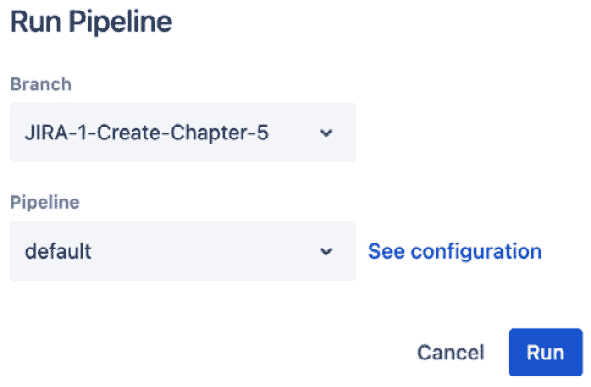

# 第五章：理解 Bitbucket 和 Bitbucket Pipelines

Bitbucket 是 Atlassian 的**源代码管理**（**SCM**）解决方案，帮助开发人员对源代码进行版本控制。Bitbucket 与 Jira 紧密集成，允许开发人员协作编写代码并与利益相关者共享状态。Bitbucket 不仅仅存储和跟踪变更，它还提供了一个强大的部署系统，称为**Bitbucket Pipelines**。通过 Pipelines，开发人员可以轻松地构建并将代码部署到不同的环境。此外，**runners** 是执行构建和部署的机器。Bitbucket Pipelines 可以使用其 runners 来执行管道任务，根据执行所需的时间与月度预算进行计费，或者开发人员可以定义自托管的 runners，使用他们自己的基础设施来执行任务。

本章节包含以下教程 – 第一个教程将带您了解基础知识，后续教程将在此基础上扩展：

+   在 Bitbucket 中创建工作区、项目和代码库

+   在 Bitbucket 中创建分支

+   理解拉取请求和合并最佳实践

+   启用 Bitbucket Pipelines

+   配置 Bitbucket 中的 runners

# 技术要求

您需要以下软件：

+   带有代码库的 Bitbucket Cloud

+   Bitbucket runners

# 在 Bitbucket 中创建工作区、项目和代码库

与 Jira 或 Confluence 相比，Bitbucket 是一个非常不同的工具。与几乎不需要配置即可开始使用的 Jira 和 Confluence 不同，Bitbucket 在团队使用之前需要一些前期的技术配置。本教程重点帮助您了解 Bitbucket 的结构，并解释启用 Bitbucket 所需的各种初始配置步骤。

## 如何操作…

当首次配置 Bitbucket 时，您需要首先创建一个**工作区**。工作区包含代码库，后续将在本教程中讨论。当您登录 Bitbucket 后，您会看到您可用的工作区，如下图所示：

图 5.1 – Bitbucket 中可用工作区概览

重要提示

在您首次注册 Bitbucket 时，可能已经创建了一个初始工作区。在这种情况下，您可以跳到下一部分，或者如果您想创建一个全新的工作区，请继续操作。此外，确保您已登录 Bitbucket，并且是 Bitbucket 的管理员。

要创建一个工作区，请执行以下步骤：

1.  点击 Bitbucket 右上角的个人资料图标。

图 5.2 – 选择个人资料图标

1.  点击**所有工作区**，位于**最近的工作区**下。

图 5.3 – 选择所有工作区

1.  点击 **创建工作区**，该按钮位于 Bitbucket 用户界面的右上角。

图 5.4 – 创建工作区按钮

1.  输入工作区名称。

图 5.5 – 提供新工作区的名称

重要提示

这将自动填充 **工作区 ID**。您可以选择更改它或保留 Atlassian 提供的默认值。工作区 ID 将作为您创建的新工作区的 URL。

1.  更新 **工作区 ID**。

图 5.6 – 工作区 ID

1.  确定您是否希望工作区保持私有，或者希望将其设置为公开，可以通过选中复选框来选择。

图 5.7 – 确定工作区是否应该是私有的还是公开的

1.  在验证 reCAPTCHA 后，点击 **创建** 按钮：

图 5.8 – 创建您的第一个工作区

现在您的工作区已创建，您将能够创建您的第一个仓库。

## 还有更多内容…

一旦进入新的工作区，就可以开始创建您的第一个仓库了。仓库是存放源代码的地方。在一个工作区内，您可以拥有多个仓库。接下来，按照以下步骤来创建仓库：

1.  点击 **创建仓库**，该按钮位于欢迎消息中或 **最近的仓库** 下方。

图 5.9 – 创建您的第一个仓库

1.  Bitbucket 会将您重定向到一个新页面，您将在此页面首先提供项目名称。仓库被分组到项目中，因此首先提供项目名称是很重要的：

图 5.10 – 创建您的第一个仓库并提供项目名称

1.  接下来，提供您的仓库名称。这应该是对使用该仓库的团队有意义的名称：

图 5.11 – 提供仓库名称

1.  确定仓库是否应该是私有的还是公开的。

图 5.12 – 确定仓库的访问级别

1.  确定仓库中是否应包含`README`文件，是否包含模板，或者是否包含适合初学者的教程，建议选择教程。

图 5.13 – 确定仓库中是否包含 README 文件

1.  提供默认分支的名称。通常是`main`或`master`。

图 5.14 – 默认分支名称

1.  最后，确定是否应该包含 `.gitignore` 文件。如果您的项目中有一些文件或目录不需要被 Git 跟踪，建议包含一个 `.gitignore` 文件。这些文件或目录将被忽略，不会被提交到仓库中。

图 5.15 – 确定是否包含 .gitignore 文件

1.  点击位于屏幕右下角的 **创建仓库** 按钮。无需担心配置任何高级设置。

图 5.16 – 创建仓库按钮

您的第一个工作区、项目和仓库已经创建完成。在接下来的教程中，您将学习如何在 Bitbucket 中开始创建分支。

# 在 Bitbucket 中创建分支

在 Bitbucket 中直接使用默认分支并不是最佳实践，因为它会影响主代码库，而主代码库应该尽可能保持稳定。相反，您应该考虑在 Bitbucket 中使用分支，本教程将涵盖分支的基础知识。在分支策略方面有不同的技术，本教程将简单介绍创建分支的基本操作。

## 准备工作

在深入探讨如何在 Bitbucket 中创建分支之前，让我们先讨论一下不同类型的分支。在 Git 的世界里有不同的分支策略。在这个示例中，将使用 **Gitflow** 来说明分支是如何工作的。Gitflow 是由 Atlassian 详细记录的，因此在本教程中将使用 Gitflow 来解释分支策略：

+   **主分支**：主分支应该是您仓库中最稳定的分支。这意味着主分支中的代码应该是最完整、最稳定的版本。通常，主分支用于创建发布版本并部署到生产系统，因此这是最稳定的分支。

+   **开发**：这是遵循 Gitflow 方法论时非常常见的一个分支。开发分支是您的团队将其更改集成到的分支，或者是他们从中创建特性分支的地方。开发分支最初是从主分支分出的。

+   **特性**：每当一个任务被分配给 Jira 中的开发人员时，该开发人员应该创建一个特性分支，该分支应基于 develop 分支。特性分支是短暂的，一旦开发人员完成代码，应该启动一个拉取请求，将更改合并回 develop 分支。

+   **发布**：每当开发分支准备好发布到生产环境时，会从最新的开发分支创建一个发布分支。该发布分支在合并回主分支和开发分支之前，应该经过测试和验证。

+   **热修复**：当生产系统出现问题时，应创建热修复分支来解决主分支中发现的代码问题。

现在你已经了解了 Gitflow 模型中的各种分支，我们将介绍如何在 Bitbucket 中创建分支。

## 如何操作…

在 Bitbucket 中，分支操作非常直接，但它通常不是最受欢迎的选项。如果你是源代码管理系统的新用户，那么使用像 Bitbucket 这样的用户界面可能是一个不错的选择：

1.  在 Bitbucket 中，进入你想要创建分支的仓库。点击导航栏中的**仓库**。

图 5.17 – 从菜单栏中选择仓库

1.  选择你想要创建分支的仓库。

图 5.18 – 从可用仓库中选择你想要的仓库

这将带你进入主仓库窗口。

图 5.19 – 已选择的仓库

1.  点击左侧菜单中的**分支**。

图 5.20 – 从选定的仓库中选择分支

1.  在屏幕的右上角，点击**创建分支**。

图 5.21 – 选择创建分支

1.  选择分支类型，并确定此新分支将从哪个分支派生。为新分支命名。完成后，点击**创建**。

图 5.22 – 创建新分支示例

你已经成功创建了第一个分支。接下来的内容将介绍当你完成代码更改后会发生什么，以及这些更改如何与团队中的其他成员共享。

# 理解拉取请求和合并最佳实践

跟踪分支和代码更改是 Bitbucket 内置的功能之一。当你完成代码更改后，这些更改需要合并回上游分支。如果你遵循 Gitflow 模型，那么意味着所有代码更改都是在专用的功能分支中完成的，现在是时候将这些更改合并回开发分支了。这个合并的过程称为拉取请求。拉取请求不仅仅是合并代码更改。接下来的内容将解释如何使用拉取请求来维护高质量的代码，并最大程度地减少新代码更改破坏系统的可能性。

## 如何操作…

完成更改后，是时候发起拉取请求了。这个拉取请求将触发一系列事件，后续步骤中将详细说明：

1.  在 Bitbucket 中，输入你想要创建分支的仓库。在导航栏中点击**仓库**。

图 5.23 – 从菜单栏选择仓库

1.  选择你想要创建分支的仓库。

图 5.24 – 从可用仓库中选择你选择的仓库

这将带你到主仓库窗口。

图 5.25 – 选择的仓库

1.  点击左侧菜单中的**拉取请求**。

图 5.26 – 从选定的仓库中选择拉取请求

重要提示

开始拉取请求有很多种方法。你可以在提交更改时启动它。你也可以通过点击 Bitbucket 导航栏中的**创建**按钮来启动它。你还可以通过**分支**菜单启动拉取请求。更不用说，你还可以通过命令行和 Jira 启动拉取请求。本文描述的方法是从 Bitbucket 内部创建拉取请求的最全面的方法。

1.  在最右侧，点击**创建** **拉取请求**。

图 5.27 – 点击创建拉取请求

你将被重定向到一个屏幕，在该屏幕中你可以填写创建拉取请求所需的所有详细信息。

1.  首先选择**源分支**。这应该是你正在工作的功能分支。

图 5.28 – 选择源分支

1.  选择代码更改应该合并到的目标分支。这应该是**Develop**分支：

图 5.29 – 选择目标分支

1.  给拉取请求起个标题。你可以根据需要随意命名，但作为最佳实践，标题中应包括你正在处理的用户故事/缺陷的 Jira 键。

图 5.30 – 拉取请求名称

1.  添加描述，最好能描述你的更改以及任何可能对审查者有帮助的内容。

图 5.31 – 为拉取请求提供描述

1.  下一步是最关键的。每个拉取请求都应该由团队中的其他人进行审查。这可以是其他同行，但最好至少有一名高级开发人员来审查拉取请求。

图 5.32 – 选择应该审查拉取请求的团队成员

1.  可选地，确定是否在合并后让 Bitbucket 删除该分支。通常这是一个好主意，因为 Bitbucket 会通过删除那些已经合并的、不再需要的分支，帮助保持你的分支整洁。

图 5.33 – 确定合并后是否删除源分支

重要提示

在创建拉取请求之前，回顾一下由于你所做的更改而受到影响的提交和文件。这应该作为你个人的检查，确保拉取请求中没有遗漏提交或文件/更改。

1.  最后，点击 **创建拉取请求** 以发起拉取请求。

图 5.34 – 为拉取请求提供描述

现在拉取请求已经正式创建，是时候让某人进行审查了。一旦审查完成，代码就可以被批准合并到目标分支中。在下一章节中，我们将介绍如何在 Bitbucket 中配置你的第一个管道。

# 启用 Bitbucket Pipelines

在所有更改都经过批准并合并到开发分支后，它们需要被构建和部署。部署你的更改很重要，因为你的源代码最终需要运行在一个环境中，在这个环境里，最终用户能够使用你构建的功能。你可以手动将文件从你的计算机复制到另一台计算机，但这种做法不可扩展，且在我们生活的分布式世界中很可能不可行。相反，你可以利用 Bitbucket Pipelines 的强大功能来自动部署代码。

## 如何操作…

在你能够使用 Bitbucket Pipelines 之前，你需要调整一些设置：

1.  在 Bitbucket 中，进入你想要创建分支的仓库。点击导航栏中的 **Repositories**。

图 5.35 – 从菜单栏中选择仓库

1.  选择你想要在其中创建分支的仓库。

图 5.36 – 从可用仓库中选择你喜欢的仓库

这将带你进入主仓库窗口。

图 5.37 – 选择的仓库

1.  点击左侧菜单中的 **Pipelines**。

图 5.38 – 从选定的仓库内选择 Pipelines

1.  点击 **创建你的第一个管道**，这将引导你查看可供选择的模板。

图 5.39 – 创建你的第一个管道

1.  选择 **Starter pipeline**。

图 5.40 – 推荐使用起始管道

配置你的第一个管道是一个复杂的过程。在接下来的部分中，我们将逐步解析起始模板，并解释你可以在 Bitbucket 的管道编辑器中对模板进行的各种调整。

## 还有更多…

有许多配置需要设置。本节将概述这些更改。在下一章中，你将学习如何扩展这个相当简单的管道配置文件：

1.  第一个可以更改的配置是 `bitbucket-pipelines.yml` 文件的模板。在上一部分的 *步骤 5* 中，我们选择了 `bitbucket-pipelines.yml` 文件，确保你处于编辑模式，你会看到可以更改模板的位置。

图 5.41 – 可用的管道模板

重要提示

根据你选择的模板，模板中的信息将会有所变化。

1.  默认情况下，你选择的模板会根据所选模板类型包含推荐的步骤。如果你需要添加新的步骤，可以通过选择可用的步骤类型来实现。

图 5.42 – 可用的步骤类型

1.  选择你想要添加的步骤，弹出窗口会显示，允许你复制信息，以便将其添加到你的模板中。

图 5.43 – 额外的步骤信息以供复制

重要提示

*步骤 3* 仅展示了如何向管道中添加一个步骤。理想情况下，你还想为构建和打包创建步骤。你也可以考虑加入测试、扫描、交付等步骤。

1.  一旦复制到剪贴板，你可以将额外的步骤添加回你的模板中：

图 5.44 – 添加了部署步骤

1.  你还可以将集成添加到管道配置中。

图 5.45 – 可用的管道集成

重要提示

你可以点击 **探索更多管道** 来查看所有可用的集成。根据你的特定需求，有数十个集成可以选择。

1.  最后，你可以向 `bitbucket-pipelines.yml` 添加变量，使你的管道更加通用、可配置和可重用。

图 5.46 – 向管道模板添加变量

1.  一旦你完成修改管道模板后，可以通过点击屏幕底部的 **提交** 按钮将文件提交回你的代码库。

图 5.47 – 提交 bitbucket-pipelines.yml 文件

1.  然后，你的管道将执行。在提交后，你将被重定向回 **Pipelines** 菜单，在那里你可以看到管道的状态。如果需要，我建议将管道合并回主分支或开发分支。

图 5.48 – 管道状态

1.  点击你的管道执行记录以获取有关最新构建运行的详细信息：

图 5.49 – 管道运行执行详情

1.  返回 **Pipelines** 菜单，你可以通过点击 **Run** **pipeline** 按钮触发管道运行。

图 5.50 – 强制运行管道

1.  选择你要运行的分支和管道。

图 5.51 – 运行管道详情

1.  你还可以安排管道在特定时间运行。

图 5.52 – 安排管道

1.  最后，你可以查看你的使用情况，因为 Bitbucket 管道是按运行管道所需的分钟数来跟踪的。每月可用的时间量由你的 Bitbucket 订阅计划决定。

图 5.53 – 查看管道使用情况

这只是 Bitbucket 中管道的简介。在下一章中，你将学习如何创建更高级的 Bitbucket 管道。

# 在 Bitbucket 中配置运行器

在 Bitbucket Cloud 中，你必须为每一分钟的构建付费。这会迅速增加费用，因此，作为替代方案，你可以使用自托管运行器。运行器允许你节省构建分钟数，但你需要在你的基础设施中维护它们。

## 如何操作…

运行器将帮助你降低 Bitbucket 成本，但它们确实需要一些初始配置，以下步骤会对此进行介绍：

1.  在 Bitbucket 中，进入你想要创建分支的仓库。点击导航栏中的 **Repositories**。

图 5.54 – 从菜单栏选择仓库

1.  选择你想要创建分支的仓库。

图 5.55 – 从可用仓库中选择你需要的仓库

这将带你进入主仓库窗口。

图 5.56 – 已选择的仓库

1.  进入你想要添加运行器的仓库后，点击左侧菜单中的 **Repository settings**。

图 5.57 – 选择仓库设置

重要说明

每个仓库最多只能有 100 个运行器。

1.  进入 **Repository settings** 后，向下滚动，直到找到 **PIPELINES** 部分。然后点击 **Runners**。

图 5.58 – 在 PIPELINES 下选择 Runners

1.  点击**添加运行器**以添加自托管运行器。

图 5.59 – 添加运行器

1.  选择新运行器的**系统和架构**类型。有几种不同的选项，您应选择最适合您计划使用的运行器类型的选项。

图 5.60 – 选择系统和架构类型

1.  给您的运行器命名。

图 5.61 – 为运行器提供名称

1.  提供运行器标签。

图 5.62 – 提供运行器标签

重要提示

您最多可以提供 10 个运行器标签。使用这些标签帮助安排运行器的执行时间。标签只能包含小写字母、数字和点。

1.  点击**下一步**按钮。

图 5.63 – 点击“下一步”按钮继续

1.  在下一个屏幕上，复制显示的命令。

图 5.64 – 启动和配置运行器所需的命令

重要提示

您将无法在之后获取该命令信息，因此请确保将其保存在安全的位置。您将需要这个命令来安装和配置您的运行器。

1.  点击**下一步**按钮。

图 5.65 – 点击“下一步”继续到下一个步骤

1.  复制标签并将其添加到您的`bitbucket-``pipelines``.yml`文件中。

图 5.66 – 复制标签以包含在 YAML 文件中

1.  点击**完成**按钮完成运行器的创建。

图 5.67 – 点击“完成”创建运行器

重要提示

您的运行器现在将在您的仓库中可用，但在您运行来自*第 9 步*的命令启动运行器之前，它将不会注册。在下一个食谱中，您将演示如何创建一个有效且可用的运行器。

1.  您新创建的运行器，将处于**未注册**状态，并会在 Bitbucket 中的**运行器**菜单中可见。

图 5.68 – 仓库中可用运行器的列表

现在您已经有了一个自托管的运行器，您可以节省构建时长费用。如果您消耗了大量的构建时长，虽然需要托管您自己的运行器，但这可能是节省一些费用的有效方式。
