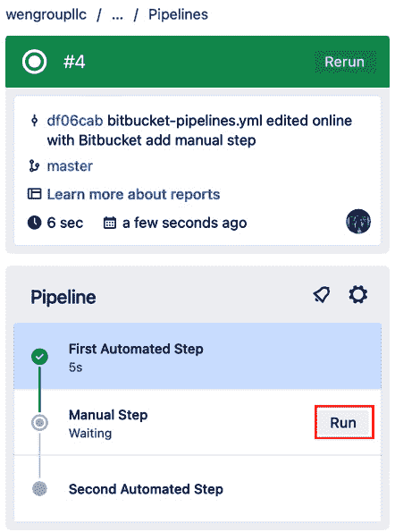

# 6

# 扩展和执行 Bitbucket Pipelines

在 *第五章*中，我们首先介绍了 **Bitbucket Cloud**，这是一个基于云的 **源代码管理**（**SCM**）工具，来自 Atlassian，其中包括 **Bitbucket Pipelines**。Bitbucket Pipelines 支持 **持续集成** 和 **部署**，源代码在提交后会自动进行构建、测试和部署。

本章将首先介绍使用 Bitbucket Pipelines 进行持续集成。通过将第三方工具集成到 Bitbucket Pipelines 中，您将扩展对其的了解，这些工具用于进行语法检查和安全测试。您还将定义并配置执行 Bitbucket Pipelines 的运行器和代理。 本章中的配方包括以下内容：

+   配置管道选项

+   管道的条件执行

+   手动执行

+   定时执行

+   定义变量

+   为管道定义运行器

+   连接到 Bitbucket Pipes

+   在 Bitbucket Pipelines 中测试步骤

+   Bitbucket Pipelines 中的安全步骤

+   报告测试结果

让我们从查看 Bitbucket Pipelines 的结构开始，来进行初步分析。

# 技术要求

本章中的配方需要在工作区、项目和仓库中设置 Bitbucket Cloud。此外，**自托管运行器**需要运行 Linux、macOS 或 Windows 的机器。

本章的示例代码可以在本书 GitHub 仓库的 `Chapter6` 文件夹中找到（[`github.com/PacktPublishing/Atlassian-DevOps-Toolchain-Cookbook/tree/main/Chapter6`](https://github.com/PacktPublishing/Atlassian-DevOps-Toolchain-Cookbook/tree/main/Chapter6)）。

# 配置管道选项

本配方将向您展示 `bitbucket-pipelines.yml` 文件的一般结构和配置选项。我们在 *第五章*中创建了描述管道执行的文件（`bitbucket-pipelines.yml`）。现在让我们来看一下 `bitbucket-pipelines.yml` 中的配置。

以下代码片段详细列出了可能的配置示例以及 `bitbucket-pipelines.yml` 文件的一般结构：

```
options:
  Global options are here (not required – this section may be absent)
clone:
  Configurations for Git clone behavior go here
definitions:
  Cache and service container definitions here
image:
  Docker image options are here (Chapter 9)
pipeline:
  Pipeline start options are here
    parallel:
      Parallel step options go here
    stage:
      Stage options are here
    step:
      Step options are here
```

本配方将向您展示管道的一般配置选项。随后的配方将演示如何应用前述代码片段中概述的选项。

## 如何操作…

我们将在本配方中评估以下配置部分：

+   全局选项

+   `git` `clone` 行为

+   `definitions`

随后的配方将讨论管道执行选项的配置。

### 配置全局选项

全局选项指定所有执行管道的行为。全局选项包括以下内容：

+   `docker`

+   `max-time`

+   `size`

让我们逐一检查这些选项：

+   如果您希望您的管道运行 Docker 命令，请指定 `docker` 关键字，并将其值设置为 `true`，如以下代码片段所示（我们将在 *第九章* 中详细讨论）：

    ```
    options:
       docker: true
    ```

+   如果您需要为步骤执行分配更多时间，以避免超时，请指定 `max-time` 关键字，并设置一个介于 `1` 和 `120` 之间的整数。该数字表示等待时间，单位为分钟。`max-time` 选项也可以在步骤级别使用，以设置该步骤的超时时间。以下代码片段将管道中所有步骤的最大时间设置为 `5` 分钟：

    ```
    options:
       max-time: 5
    ```

+   `size` 选项可以为整个管道或单个步骤分配额外内存。如果您使用的是 Bitbucket Cloud 上的运行器，选项为 `1x` 和 `2x`，而自托管的 Docker 运行器则有 `1x`、`2x`、`4x` 和 `8x` 的选项。以下代码片段将整个管道的大小设置为正常配额的两倍：

    ```
    options:
       size: 2x
    ```

我们已经了解了如何配置与运行 Docker 命令、等待时间和可用运行器内存相关的全局选项。现在让我们看看在管道中执行 `git clone` 操作时配置行为的选项。

### `git clone` 行为

`bitbucket-pipelines.yml` 中的 `clone:` 部分控制通过 `git clone` 操作复制仓库。它可以放置在 `options:` 部分之后，以配置整个管道的 `git clone` 行为，或放置在 `step:` 部分中，以配置该步骤的 `git clone` 行为。可用的选项列出如下：

+   `depth`：此选项控制克隆操作的深度。

+   `lfs`：这允许支持 Git **大文件系统**（**LFS**）文件。

+   `enabled`：此选项启用或禁用 `git` `clone` 操作。

+   `skip-ssl-verify`：这允许跳过单个步骤的 **安全套接字层**（**SSL**）验证。

让我们逐一深入了解这些选项：

+   您可以通过添加 `enabled` 关键字并将其值设置为 `true` 来启用 `git clone` 操作，或者将其值设置为 `false` 来禁用该操作，具体范围指定如下。以下示例演示了如何禁用所有管道步骤的克隆操作：

    ```
    clone:
       enabled: false
    pipelines:
       default:
          - step:
              script:
                 - echo "Cloning not done"
    ```

+   要控制 `git clone` 操作中包含的提交数量，请使用 `depth` 关键字，值为 `full` 表示完整克隆操作，或者使用一个正整数表示要在 `git clone` 操作中包含的提交数量。此功能设置了快速检出，不需要完整历史记录，特别适用于大型仓库。以下代码片段演示了一个克隆操作，该操作克隆了所有管道步骤中的最后五个提交：

    ```
    clone:
       depth: 5
    pipelines:
       default:
          - step:
              script:
                - ls $BITBUCKET_CLONE_DIR
    ```

+   使用 `lfs` 选项并将其值设置为 `true`，可以在每个步骤开始时下载所有 LFS 文件（如果全局设置）。如果将其放在某个步骤内，所有 LFS 文件的下载将在该步骤开始时开始。以下代码片段演示了在每个步骤中下载所有 LFS 文件：

    ```
    clone:
       lfs: true
    pipelines:
       default:
          - step:
              name: Download LFS
              script: "Cloning and downloading..."
    ```

+   `skip-ssl-verify`选项仅在单个步骤的作用域内有效，并且只适用于自托管的管道运行器。将此选项设置为`true`将禁用该步骤的 SSL 验证，允许使用自签名证书。以下代码片段展示了这一点：

    ```
    pipelines:
       default:
          - step:
              runs-on:
                 - 'self.hosted'
              clone:
                 skip-ssl-verify: true
              script:
                 - echo "Using self-signed certificate"
    ```

我们现在已经了解了`git clone`操作的所有管道步骤或单个管道步骤可用的选项。接下来，我们将看看如何通过配置`definitions`部分将资源包含到管道中。

### 配置定义

`definitions`部分描述了所有管道步骤可用的额外资源。以下列表概述了可用资源的类型：

+   缓存

+   服务

+   YAML 锚点

我们将在*第九章*中讨论如何使用 Docker 容器配置服务。缓存允许暂时存储构建依赖项及其目录。让我们看看缓存的用途：

1.  在`definitions`部分，你可以通过文件名或目录路径来定义缓存。路径可以包括作为通配符表达的模式。以下代码片段展示了我们如何为 Ruby 构建定义并使用缓存：

    ```
    definitions:
      caches:
        my-bundler-cache: vendor/bundle
    pipelines:
      default:
        - step:
            caches:
              - my-bundler-cache # Cache is defined above in the definitions section
            script:
              - bundle install --path vendor/bundle
              - ruby -e 'print "Building on Ruby"'
    ```

1.  可以在`caches`定义块中的`key`部分指定需要监视更改的文件列表，并在`files`关键字下列出。多个文件可以使用通配符字符在 glob 模式中指定。`files`的位置将由`path`选项指定。以下代码片段展示了如何使用`key`、`files`和`path`关键字为 Ruby 构建实现缓存定义：

    ```
    definitions:
      caches:
        my-bundler-cache:
          key:
            files:
              - Gemfile.lock
              - "**/*.gemspec" # glob patterns are supported for cache key files
          path: vendor/bundle
    pipelines:
      default:
        - step:
            caches:
              - my-bundler-cache # Cache is defined above in the definitions section
            script:
              - bundle install --path vendor/bundle
              - ruby -e 'print "Hello, World\n"'
    ```

1.  YAML 锚点允许重用 YAML 行块。锚点字符（`&`）定义可重用的块。别名字符（`*`）作为指令使用引用。以下代码片段展示了如何使用 YAML 锚点重用步骤定义：

    ```
    definitions:
      steps:
        - step: &package
            name: Build and test
            script:
              - mvn package
            artifacts:
              - target/**
    pipelines:
      default:
        - step: *package
    ```

重要说明

YAML 锚点和别名的名称不能包含以下字符：`'['`、`']'`、`'{'`、`'}'`和`','`。

## 另见

以下链接提供了有关缓存的更多详细信息，特别是在使用标准语言和工具构建时可用的预定义缓存：

+   [`support.atlassian.com/bitbucket-cloud/docs/cache-dependencies/#Pre-defined-caches`](https://support.atlassian.com/bitbucket-cloud/docs/cache-dependencies/#Pre-defined-caches)

+   [`support.atlassian.com/bitbucket-cloud/docs/use-glob-patterns-on-the-pipelines-yaml-file/`](https://support.atlassian.com/bitbucket-cloud/docs/use-glob-patterns-on-the-pipelines-yaml-file/)

我们已经看到如何在管道上全局配置选项。现在我们准备好检查管道结构中更模块化的部分。

# 条件执行管道

我们从指定管道的定义选项转向指定管道的执行。这要求我们查看管道结构的以下部分：

+   管道

+   并行

+   阶段

+   步骤

我们将在以下用例中看到这些部分如何受到影响：

+   提交到一个分支

+   创建拉取请求

+   创建标签

在我们检查用例之前，让我们先看看结构。

## 准备工作

`bitbucket-pipelines.yml`文件中的`pipelines`部分定义了所有可用的流水线定义，用于构建和部署。它在文件中只定义一次，并且是必需的。

在`pipelines`部分中，有一些定义了基于前面部分提到的条件使用案例的流水线。一个流水线可以看作是由`step`关键字定义的一系列步骤。流水线的步骤数量最多为 100 个。

步骤至少需要包含在定义为构建环境的 Docker 容器中运行步骤的命令。这些命令包含在必需的`script`部分中。此外，还可以在`step`部分中定义其他选项，以进一步定义步骤的行为。以下代码片段展示了一个简单的单命令步骤示例：

```
pipelines:
   default:
      - step:
          script:
             - echo "Running a command"
```

步骤通常是按顺序执行的。如果要并行执行多个步骤，可以使用`parallel`关键字将步骤组合在一起。一种常见的用例是允许测试步骤并行执行。以下代码片段展示了一个示例：

```
pipelines:
  default:
    - step:          # non-parallel build step
        script:
          - ./build.sh
    - parallel:      # these 2 steps will run in parallel
        steps:
          - step:
              script:
                - ./integ-tests.sh --batch 1
          - step:
              script:
                - ./integ-tests.sh --batch 2
    - step:          # non-parallel deploy step
        script:
          - ./deploy.sh
```

阶段（stage）是步骤的分组，以便执行某个特定功能。阶段部分由`stage`关键字定义，并在`steps`关键字下包括其步骤。阶段有助于定义构建、测试、打包和发布等不同阶段的步骤。阶段的一个用途可能是在部署过程中，它可以显示部署的哪个部分失败，并允许使用公共环境和环境变量。以下代码片段展示了一个阶段示例：

```
pipelines:
   default:
      - stage:
          name: build/test
          steps:
            - step:
                name: Build step
                script:
                   - sh ./build-app.sh
            - step:
                name: Unit-test
                script:
                   - sh ./run-unit-tests.sh
```

`default`部分定义了在每次推送到仓库时要运行的流水线步骤，除非推送发生在定义的特定分支流水线中，或者推送基于`git tag`操作。让我们重新审视我们的单步流水线示例，看看由于`default`关键字的存在，它将始终运行：

```
pipelines:
   default:
      - step:
          script:
             - echo "Running a command"
```

现在我们通过`pipelines`、`parallel`、`stage`和`step`部分理解了流水线的基本结构，让我们看看在什么情况下我们希望条件性地执行流水线步骤。

## 如何实现…

本食谱的*准备工作*部分展示了`bitbucket-pipelines.yml`文件中的流水线结构。`pipelines`、`parallel`、`stage`和`step`部分允许无条件执行流水线步骤。

现在我们想要根据以下用例运行不同的流水线步骤：

+   提交到特定分支

+   创建拉取请求

+   创建特定标签

Bitbucket Pipelines 通过额外的部分，使用特定的关键字，允许这些条件性用例的出现。让我们逐一检查这些关键字：

+   `branches`关键字允许指定执行管道步骤的具体分支。分支可以通过其名称标识，或者使用 glob 模式将其分组。在这种情况下，`default` 关键字表示那些针对未在 `branches` 部分定义的分支执行的步骤。以下代码片段展示了一个管道，其中包含针对主分支和任何特性分支的不同步骤：

    ```
    pipelines:
      default:
        - step:
            script:
              - echo "This script runs on all branches that don't have any specific pipeline assigned in 'branches'."
      branches:
        main:
          - step:
              script:
                - echo "This script runs only on commit to the main branch."
        feature/*:
          - step:
              script:
                - echo "This script runs only on commit to branches with names that match the feature/* pattern."
    ```

+   针对拉取请求的管道是基于工作分支和 `pull-requests` 关键字来定义的。这些管道定义了在向目标分支创建拉取请求时要执行的特定步骤。工作分支可以使用 glob 模式组合成类似的分支类别。执行拉取请求管道会在运行前将目标分支合并到工作分支中。如果合并失败，管道执行将会停止。以下代码片段展示了针对特性分支和热修复分支的拉取请求管道：

    ```
    pipelines:
      pull-requests:
        feature/*:
          - step:
              name: Build for pull request to feature branch
              script:
                - echo "feature branch PR!"
        hotfix/*:
          - step:
              name: Build for pull request to hotfix branch
              script:
                - echo "hotfix PR!"
        '**':
          - step:
              name: Build for all pull requests to other branches
              script:
                - echo "all other non-feature, non-hotfix pull request!"
    ```

+   要设置基于标签的管道，可以使用 `tags` 关键字来表示在 `git tag` 匹配 `tags` 部分中定义的模式时要执行的步骤。注意，glob 模式可以应用于搜索参数，以扩大标签的搜索范围。以下代码片段根据搜索中匹配的标签来运行管道操作：

    ```
    pipelines:
      tags:
        '*-FirstTag':
          - step:
              name: Build for *-FirstTag tags
              script:
                - echo "First tag!"
        '*-SecondTag':
          - step:
              name: Build for *-SecondTag tags
              script:
                - echo "Second tag!"
        '*-ThirdTag':
          - step:
              name: Build for *-ThirdTag tags
              script:
                - echo "Third tag!"
    ```

我们已经了解了如何根据分支、是否创建拉取请求以及是否创建标签来设置有条件运行的管道。

## 另见

以下链接提供了更多关于我们在本篇食谱中讨论的部分的详细信息：

+   [`support.atlassian.com/bitbucket-cloud/docs/step-options/`](https://support.atlassian.com/bitbucket-cloud/docs/step-options/)

+   [`support.atlassian.com/bitbucket-cloud/docs/stage-options/`](https://support.atlassian.com/bitbucket-cloud/docs/stage-options/)

+   [`support.atlassian.com/bitbucket-cloud/docs/parallel-step-options/`](https://support.atlassian.com/bitbucket-cloud/docs/parallel-step-options/)

到目前为止，我们讨论了在提交或拉取请求操作发生时自动运行的管道执行。我们能手动运行管道吗？当然可以！接下来，我们将探讨如何做到这一点。

# 手动执行

尽管通常情况下，管道会在提交或拉取请求时自动执行，但也可以手动运行管道。它们不仅可以用于重新运行自动化管道，还可以运行只能手动执行的管道。

此外，我们还可以指定管道中的某个步骤需要手动执行。管道的执行将会暂停，直到用户完成该步骤。

让我们来看一下定义仅限手动的管道。

## 准备就绪

你可以设置仅用于手动运行的管道。这些管道位于它们自己的部分，以`custom`关键字表示。每个管道都有一个描述其名称和步骤的字符串，显示在 Bitbucket UI 中。以下代码片段描述了两个手动管道和一个自动分支管道：

```
pipelines:
  custom: # Pipelines that are triggered manually
    manual-sonar: # The name that is displayed in the list in the Bitbucket Cloud GUI
      - step:
          script:
            - echo "triggering for Sonar!"
    deployment-to-prod: # Another display name
      - step:
          script:
            - echo "triggering for manual deployments to prod!"
  branches:  # Pipelines that run automatically on a commit to a branch
    staging:
      - step:
          script:
            - echo "Auto execute for push to staging branch."
```

手动管道也可以包含在运行时设置或更新的变量。可以使用`variables`关键字描述变量，并可以使用以下属性进行描述。

+   `name`：变量的名称（这是必需的）

+   `default`：变量的默认值

+   `allowed-values`：允许的值列表

+   `description`：变量的用途和设置的总结

以下代码片段展示了一个带有变量的手动管道：

```
pipelines:
  custom: # Pipelines that are triggered manually
    us-build: # The name that is displayed in the list in the Bitbucket Cloud GUI
      - variables:
          - name: IAMRole
            default: "admin"          # optionally provide a default variable value
            description: "AWS user role"
          - name: AWSRegion
            default: "us-east-1"
            allowed-values:           # optionally restrict variable values
              - "us-east-1"
              - "us-west-2"
      - step:
          script:
            - echo "$IAMRole manually triggered for a build for $AWSRegion"
```

我们现在已经定义了可以手动运行的管道。接下来，我们将检查如何运行这些管道以及通常自动运行的管道。

## 如何操作…

手动执行管道是在 Bitbucket 图形界面（GUI）中完成的。在仓库视图中，你可以在三个位置触发管道运行。我们来看一下这些选项。

### 从管道视图运行

运行以下步骤以手动执行**管道**视图中的管道：

1.  在仓库侧边栏中，选择**管道**选项。


图 6.1 – 选择管道视图

1.  在**管道**界面中，点击**运行** **管道**按钮。


图 6.2 – 点击运行管道按钮

1.  在弹出的窗口中，选择要运行的分支和管道。点击**运行**。


图 6.3 – 运行管道

你现在已经从**管道**视图手动运行了一个管道。

### 从提交视图运行

你也可以从**提交**视图手动运行一个管道。在 Bitbucket 仓库中，按照以下步骤操作：

1.  在仓库侧边栏中选择**提交**。


图 6.4 – 选择提交视图

1.  在**提交**界面中，通过点击提交哈希值来选择一个提交。


图 6.5 – 选择一个提交

1.  在右侧的**详情**侧边栏中，选择**运行管道**。


图 6.6 – 选择运行管道

1.  在窗口中，选择要运行的管道并点击**运行**。


图 6.7 – 为提交运行管道

你现在已经手动运行了一个针对提交的管道。

### 从分支视图运行管道

手动运行管道的最后一个位置是**分支**视图。让我们来看一下如何操作：

1.  在仓库中，从仓库侧边栏选择**分支**。


图 6.8 – 选择分支视图

1.  在**分支**页面中，找到感兴趣的分支，选择更多操作图标（**...**），然后选择**为分支运行管道**。


图 6.9 – 选择为分支运行管道

1.  在窗口中，选择要运行的管道，并点击**运行**按钮。


图 6.10 – 为分支运行管道

你现在已经手动运行了一个针对某个分支的管道。

你还可以手动运行管道的个别步骤。让我们在接下来的小节中探讨如何操作。

## 还有更多内容...

任何不是管道中第一个步骤的步骤都可以指定为手动步骤，需要个体触发该步骤的执行。让我们来看一下如何创建这个配置：

1.  在需要手动运行的步骤上，添加`trigger: manual`关键字。这告诉 Bitbucket 管道这是一个手动步骤。以下代码片段显示了一个位于两个自动执行步骤之间的手动步骤：

    ```
          - step:
              name: 'First Automated Step'
              script:
                - echo "This step is automated"
          - step:
              name: 'Manual Step'
              trigger: manual
              script:
                - echo "This step is manual"
          - step:
              name: 'Second Automated Step'
              script:
                - echo "This step is also automated"
    ```

1.  在运行管道时，从**管道**视图中点击进入管道执行。


图 6.11 – 选择管道执行

1.  在执行详情中，点击**运行**按钮以执行手动步骤。



图 6.12 – 运行手动步骤

我们现在已经在管道中配置并执行了一个手动步骤。

管道执行的另一个理想功能是按周期安排执行。我们将在下一节中探讨如何实现这一点。

# 定时执行

任何在`bitbucket-pipelines.yml`文件中定义的管道都可以设置为定期运行。让我们来看看如何进行配置。

## 如何操作…

在 Bitbucket UI 上进行管道调度，具体操作见以下说明：

1.  在 Bitbucket 仓库中，选择仓库侧边栏中的**管道**选项。


图 6.13 – 选择管道视图

1.  在**管道**视图中，点击**计划**按钮。


图 6.14 – 点击“计划”按钮

1.  要创建新的计划，请点击出现的窗口中的**新建计划**按钮。


图 6.15 – 新建计划按钮

1.  在**创建计划**窗口中，选择一个分支，选择一个管道，并选择运行管道的频率。频率可以是每小时、每天、每周或每月。所有时间均以本地时间为准，但将以 UTC 偏移量执行，以避免夏令时配置错误。配置完成后，点击**创建**按钮。


图 6.16 – 创建新计划

1.  在现有的计划中，你可以点击滑块来禁用该计划。要删除计划，只需将鼠标悬停在该计划上，并点击垃圾桶图标。


图 6.17 – 禁用和删除计划

我们现在已经了解了如何通过计划定期运行流水线。

到目前为止，我们已经看到了从条件执行、手动执行到计划执行的过程。现在我们转向查看我们正在执行的内容，以及如何通过一些增强功能使我们的流水线更强大。第一步是展示如何将 Bitbucket Pipelines 与第三方工具集成。实现这一点的一种方式是使用**Pipes**。让我们看看如何配置和使用 Pipes 进行集成。

# 连接到 Bitbucket Pipes

当我们在构建过程中进行持续集成时，我们可能希望进行测试或安全扫描，以确保我们的最终构建质量高且安全。Bitbucket Pipelines 通过使用集成工具来支持测试和安全扫描。Bitbucket Pipelines 与外部工具或环境之间的集成被称为 Bitbucket Pipes。

我们将看到 Bitbucket Pipelines 可用的 Pipes，供与第三方工具和环境进行集成。我们还将看到如何将 Pipes 添加到`bitbucket-pipelines.yml`文件中，以集成我们的流水线。

## 如何操作...

Bitbucket 编辑器可以显示可用的 Pipes。然后，这些 Pipes 会被放置在`bitbucket-pipelines.yml`文件的`script`部分，如以下指令所示：

1.  正如我们在*第五章*的 Bitbucket Pipelines 介绍中看到的，当你在 Bitbucket GUI 中编辑`bitbucket-pipelines.yml`文件时，它会打开一个特殊的编辑器，提供 Pipes、模板、步骤指导和变量等功能。以下截图展示了帮助面板的界面。


图 6.18 – bitbucket-pipelines.yml 编辑器帮助面板

1.  展开**添加 Pipes（集成）**部分以查看可用的 Pipes。


图 6.19 – 查看 Pipes 的选择

1.  选择**探索更多 Pipes**时，可以通过关键字搜索或按类别查看，如以下插图所示，该选项位于 Pipes 部分的底部。


图 6.20 – 探索更多 Pipes 按钮

1.  选择**探索更多 Pipes**将打开**探索 Pipes**窗口，如以下插图所示。


图 6.21 – 探索 Pipes 窗口

1.  选择一个管道会打开一个管道窗口。该窗口将包含代码片段，供你粘贴到你希望管道运行的步骤的脚本部分，还会显示有关管道的详细信息和其他信息。我们将在接下来的插图中展示这一示例。


图 6.22 – 管道窗口

我们将在本章以及*第八章*和*第九章*中看到管道的应用。

管道的另一个功能是变量。我们从*第五章*的*启用 Bitbucket Pipelines*中定义变量开始。接下来让我们看看如何在管道中设置变量并使用它们。

# 定义变量

变量通过允许你存储诸如名称、所需参数以及有时的机密等值，增强了管道的功能。你可以通过两种方式来定义变量，第一种方式我们在*第五章*中提到过。让我们来详细看看这些方法。

## 如何操作…

正如我们在*第五章*中看到的，我们可以通过编辑器为`bitbucket-pipelines.yml`定义变量。让我们来看一下如何做到这一点：

1.  编辑`bitbucket-pipelines.yml`时，选择**添加** **变量**选项。


图 6.23 – 展开添加变量

1.  你可以为仓库以及任何已定义的部署环境添加变量。


图 6.24 – 添加变量

1.  要添加变量，给它起个名字，输入其值，然后点击**添加**。如果需要一个安全的变量来存储密码或机密，请确保勾选**已加密**。


图 6.25 – 变量已保存

1.  要在`bitbucket-pipelines.yml`中使用变量，请将变量名添加到`script:`部分，并在前面加上美元符号（`$`）。如下代码片段所示：

    ```
    - step:
              name: 'Build and Test'
              script:
                - echo "My variable is "$MY_NUMBER
    ```

我们已经看到如何通过`bitbucket-pipelines.yml`编辑器添加变量。接下来，让我们看看如何通过**仓库设置**来添加变量，详细信息请见下一小节。

## 还有更多……

任何有写入权限的仓库成员都可以创建仓库变量。让我们看看如何通过**仓库设置**来实现：

1.  在仓库中，从仓库侧边栏选择**仓库设置**。


图 6.26 – 选择仓库设置

1.  在**仓库设置**侧边栏的**PIPELINES**部分，选择**仓库变量**。


图 6.27 – 选择仓库变量

1.  要添加变量，给它起个名字，输入其值，然后点击**添加**。如果需要一个安全的变量来存储密码或机密，请确保勾选**已加密**。


图 6.28 – 添加仓库变量

1.  与上一部分一样，要在 `bitbucket-pipelines.yml` 中使用变量，将变量名添加到 `script:` 部分，并在其后附加美元符号 (`$`) 字符。以下代码片段展示了这一点：

    ```
    - step:
              name: 'Build and Test'
              script:
                - echo "My variable is "$MY_NUMBER
    ```

我们已经看到如何在 **仓库设置** 中添加变量。

## 另请参阅

以下链接提供了更多关于变量的信息，包括预定义的 Bitbucket 变量：

+   [`support.atlassian.com/bitbucket-cloud/docs/variables-and-secrets/`](https://support.atlassian.com/bitbucket-cloud/docs/variables-and-secrets/)

我们可以指定在执行管道时使用哪些运行器。让我们现在来探索这个。

# 为管道定义运行器

在 *第五章*中，我们了解了如何定义自托管的运行器。Bitbucket Pipelines 允许使用自托管的运行器，不仅能确保我们使用正确的平台进行构建，而且通过指定我们自己的资源，能够避免 Bitbucket Cloud 的构建时间限制。

现在我们已经定义了运行器，让我们看看如何在 `bitbucket-pipelines.yml` 中调用它们。

## 如何操作...

你的自托管运行器可以在 `bitbucket-pipelines.yml` 文件中按步骤定义。让我们看看如何做到这一点：

1.  对于给定的步骤，通过添加 `runs-on` 关键字并跟随所有适用的标签来定义该步骤使用的运行器。以下代码片段展示了这样的应用：

    ```
    pipelines:
      custom:
        customPipelineWithRunnerStep:
          - step:
              name: First Step
              runs-on:
                - 'self.hosted'
                - 'my.label'
              script:
                - echo "This step will run on a self hosted runner that also has the my.label label.";
    ```

1.  当在 `runs-on` 部分添加 `windows` 标签时，将使用 Windows 特定的运行器：

    ```
          - step:
              name: First Step
              runs-on:
                - 'self.hosted'
                - 'windows'
    ```

1.  当在 `runs-on` 部分添加 `macos` 标签时，将使用 Mac 特定的运行器：

    ```
          - step:
              name: First Step
              runs-on:
                - 'self.hosted'
                - 'macos'
    ```

1.  当在 `runs-on` 部分添加 `linux.shell` 标签时，将使用 Linux shell 运行器：

    ```
          - step:
              name: First Step
              runs-on:
                - 'self.hosted'
                - 'linux.shell'
    ```

1.  当在 `runs-on` 部分添加 `linux.arm64` 标签时，将使用 Linux Docker ARM 运行器：

    ```
          - step:
              name: First Step
              runs-on:
                - 'self.hosted'
                - 'linux.arm64'
    ```

1.  如果你没有指定平台标签，Bitbucket Pipelines 将假定该步骤应由 Linux Docker 运行器执行。

1.  如果所有匹配的运行器都在忙碌，你的步骤可能会等待直到有一个可用。如果你的仓库中的运行器与步骤中的任何标签不匹配，步骤将失败。

我们现在准备探索在管道中作为持续集成的一部分进行测试的实际应用。现在让我们看一个测试示例。

# 在 Bitbucket Pipelines 中进行测试步骤

在持续集成的管道中，一个关键步骤通常是在构建后进行的。构建后立即进行测试，可以发现并解决缺陷，从而保证代码库的更高质量。

本教程中的测试步骤使用了一类被称为 **静态分析** 的测试。在静态分析中，构建中的文件将被扫描，以查看是否包含逻辑错误、安全漏洞或其他问题。

**Linting** 是另一种扫描技术，通过评估代码库的语法和结构来执行测试。它还可以确定被评估的代码库是否符合特定的编码标准。

我们将探讨从 Bitbucket Pipelines 调用 linting 和扫描的不同方法。

## 如何操作…

根据语言的不同，linting 工具可能是开发该语言的工具套件的一部分。让我们看看 Bitbucket Pipelines 中是如何运作的：

1.  作为语言开发平台一部分的测试可以在测试步骤的 `script` 部分中调用。通过在 `script` 部分设置步骤来执行捆绑的测试。以下代码片段展示了用于 Node.js 应用程序的构建和测试步骤，其中 `image` 部分表示作为构建环境使用的 Docker 镜像——我们在 *第九章* 中对此进行了说明：

    ```
    image: node:10.15.0
    pipelines:
      default:
        - step:
            script:
              - npm install
              - npm test
    ```

1.  我们可以通过添加 linting 应用程序来扩展测试。以下代码片段包含了 ESLint 的安装和执行，ESLint 是我们 Node.js 环境中常用的 JavaScript linting 应用程序：

    ```
    image: node:10.15.0
    pipelines:
      default:
        - step:
            name: ESLint
            script:
              - npm install eslint --save-dev
              - eslint --init
        - step:
            name: execute
            script:
              - npm install
              - npm run lint
              - npm test
    ```

我们现在已经看到了当编程语言的开发环境包含测试应用程序时如何运行测试。让我们在下一个小节中看看如何将第三方应用程序集成到我们的 Bitbucket Pipeline 中。

## 还有更多…

一个常用的测试应用程序是来自 SonarSource 的 **SonarCloud**。SonarCloud 提供了一系列测试，用于衡量代码库的安全性、可靠性和可维护性。配置 SonarCloud 与 Bitbucket Cloud 后，可以按照以下方式在 Bitbucket Pipelines 中设置测试执行：

1.  SonarCloud 扫描利用管道从 Bitbucket Pipelines 运行 SonarCloud 代码分析器。以下代码片段展示了在测试步骤的 `script` 部分中调用管道。这段示例包括了管道的所有可选变量。请注意，`SONAR_TOKEN` 使用的是 Bitbucket 安全变量：

    ```
    - step:
        name: SonarCloud
        script:
           - pipe: sonarsource/sonarcloud-scan:2.0.0
                variables:
                   SONAR_TOKEN: $SONAR_TOKEN
                   EXTRA_ARGS: -Dsonar.projectDescription=\"Project with sonarcloud-scan pipe\" -Dsonar.eslint.reportPaths=\"report.json\"
                   SONAR_SCANNER_OPTS: -Xmx512m
                   DEBUG: "true"
    ```

1.  除了 SonarCloud 扫描之外，Bitbucket Pipelines 还可以包括对 SonarCloud Quality Gate 的调用，以在部署或发布之前对定义的质量门进行检查。此调用也被建立为一个管道，可以添加到 `script` 部分。以下代码片段展示了带有可选变量的管道：

    ```
    - pipe: sonarsource/sonarcloud-quality-gate:0.1.6
      variables:
         SONAR_TOKEN: $SONAR_TOKEN
        SONAR_QUALITY_GATE_TIMEOUT: 180  # 3 minutes
    ```

你现在已经看到了 Bitbucket Pipelines 如何通过管道与 SonarCloud 分析器连接。

## 另请参见

该链接包含将 Bitbucket 工作区连接到 SonarCloud 项目的所需步骤：[`docs.sonarsource.com/sonarcloud/getting-started/bitbucket-cloud/`](https://docs.sonarsource.com/sonarcloud/getting-started/bitbucket-cloud/)。

DevSecOps 的一个核心原则是频繁运行安全扫描和测试。最理想的是，这应该是持续集成的一部分。让我们看一个在 Bitbucket Pipelines 中包含安全扫描的示例。

# Bitbucket Pipelines 中的安全步骤

截至本文写作时，**Snyk** 是唯一一个能够深入集成 Bitbucket Cloud 的安全提供商。将 Snyk 作为安全提供商，可以将额外的安全扫描添加到开发流程中的仓库步骤中。该流程的一部分包括在 Bitbucket Pipelines 中运行安全扫描。让我们看看如何实现这一点。

## 如何操作…

Snyk 使用管道与 `bitbucket-pipelines.yml` 中定义的流水线集成。我们来看看如何设置：

1.  将 Snyk 管道添加到流水线测试步骤的 `script` 部分。所需的变量包括 Snyk token、使用的语言（`node`、`ruby`、`composer`、`dotnet` 或 `docker`），如果语言设置为 `docker`，还需要指定镜像名称。以下代码片段展示了扫描 Node.js 应用程序的用法：

    ```
    script:
      - npm install
      - npm test
      - pipe: snyk/snyk-scan:1.0.1
        variables:
          SNYK_TOKEN: $SNYK_TOKEN
          LANGUAGE: «node»
    ```

1.  你还可以使用 Snyk CLI 通过 `snyk test` 运行扫描。可以通过 `npm` 安装 Snyk CLI。以下代码片段演示了安装过程：

    ```
    script:
      - mvn install
      - npm install -g snyk # binary download also available
      - snyk test --all-projects
    ```

你现在已经成功设置了 Snyk，使其作为流水线的一部分运行安全扫描。

## 另请参见

以下链接详细说明了如何将 Snyk 设置为 Bitbucket Cloud 的安全提供商：

+   [`support.atlassian.com/bitbucket-cloud/docs/add-and-configure-security-with-snyk/`](https://support.atlassian.com/bitbucket-cloud/docs/add-and-configure-security-with-snyk/)

在某些测试中，Bitbucket 可以自动检测结果输出并显示。我们在最后一个教程中探讨了这一点。

# 报告测试结果

输出为 JUnit 和 Maven Surefire XML 格式的测试结果将会被流水线自动检测到。Bitbucket Pipelines 随后会在 **Tests** 标签中显示任何失败的测试结果。成功的执行结果可以在 **Build** 标签的日志视图中查看。我们来看看如何进行设置。

## 准备工作

在设置测试报告时，请确保测试结果生成在以下位置之一：

+   `./**/``surefire-reports/**/*.xml`

+   `./**/``failsafe-reports/**/*.xml`

+   `./**/``test-results/**/*.xml`

+   `./**/``test-reports/**/*.xml`

+   `./**/``TestResults/**/*.xml`

现在，让我们看看如何在流水线中配置测试结果。

## 如何操作…

根据语言的不同，生成测试结果的方法各有不同。我们来看看每种方法：

1.  如果你在 Maven 构建任务中使用 Maven Surefire 插件，则无需进行特殊配置。

1.  如果你使用 PHP 并通过 PHPUnit 进行测试，应该包括 `--log-junit` 参数以生成日志输出。以下代码片段演示了正确的命令设置：

    ```
    image: php:7.1.1
    pipelines:
      default:
        - step:
            script:
              - apt-get update && apt-get install -y unzip
              - curl -sS https://getcomposer.org/installer | php -- --install-dir=/usr/local/bin --filename=composer
              - composer require phpunit/phpunit
              - vendor/bin/phpunit --log-junit ./test-reports/junit.xml
    ```

1.  如果你使用 .NET 开发，可以使用 `JUnitTestLogger` 以 JUnit 格式创建输出。以下代码片段演示了设置方法：

    ```
    image: mcr.microsoft.com/dotnet/sdk
    pipelines:
      default:
        - step:
            script:
              - dotnet add package JUnitTestLogger --version 1.1.0
              - dotnet test --logger "junit"
    ```

1.  .NET 开发也可以使用 `trx2junit` 工具将 Visual Studio 测试结果文件（`.trx`）转换为 JUnit 格式（`.xml`）。以下代码片段演示了这一过程：

    ```
    image: mcr.microsoft.com/dotnet/sdk
    pipelines:
      default:
        - step:
            script:
              - dotnet tool install -g trx2junit
              - dotnet test --logger 'trx;LogFileName=log.trx'
            after-script:
              - export PATH="$PATH:/root/.dotnet/tools"
              - trx2junit ./TestResults/*.trx
    ```

你现在已经了解了如何准备测试结果，以便它们能自动显示在日志中。
