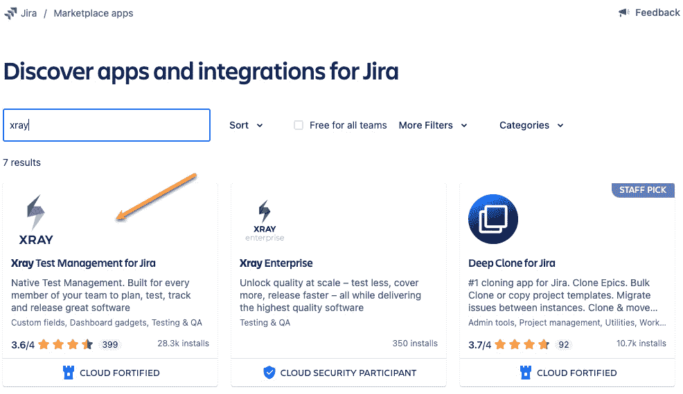
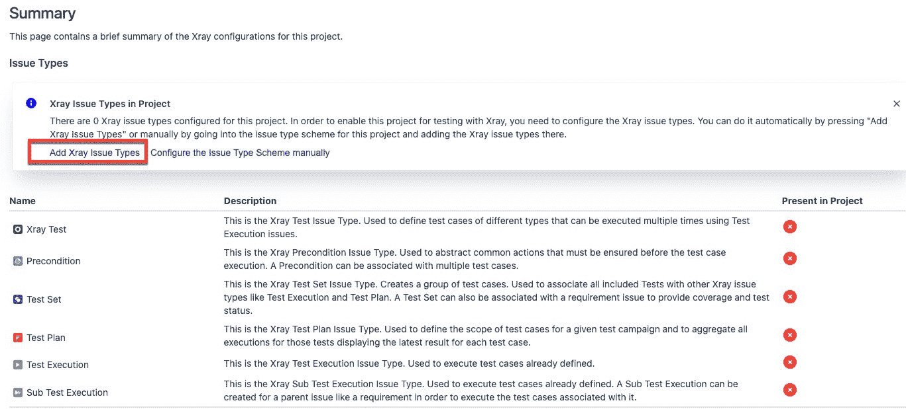
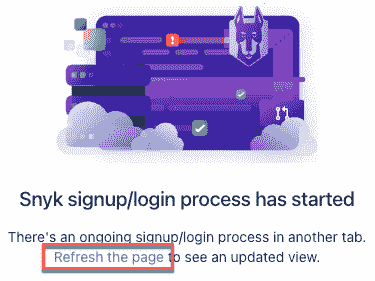
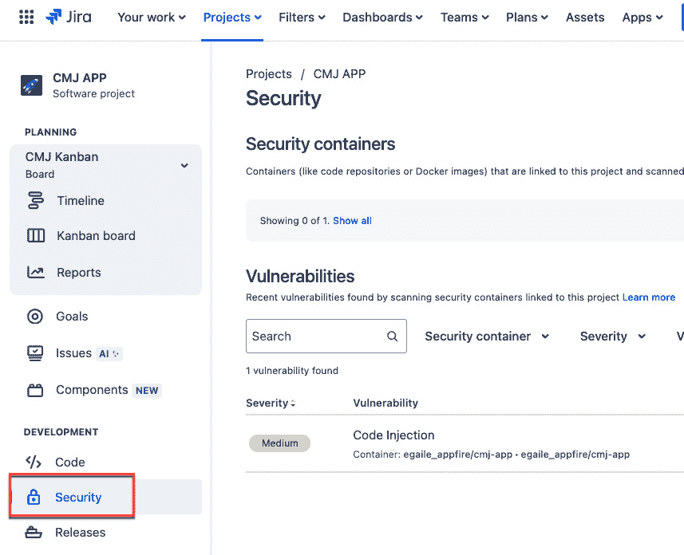

# 利用测试用例管理和安全工具进行 DevSecOps

在本章中，我们将继续探索安全性，这是从 DevOps 转向**DevSecOps**视角所必需的一个组件。这要求将额外的工具集成到 DevOps 工具链中，而**Open DevOps**使这一过程更加简便。

在本章中，我们将查看来自 Atlassian Marketplace 的应用，这些应用可以记录和执行测试，并供 Jira 参考。

我们还将学习如何将 Jira 与流行的安全工具（如 Snyk 和 SonarQube）连接。我们将学习如何在 Jira 中跟踪安全工具发现的漏洞的修复情况。最后，我们将了解 Jira 中用于安全测试的容器，并从漏洞创建问题。

完成本章后，您应该能够很好地理解如何将测试组件（无论是与 Jira 相关还是与软件相关）纳入 Open DevOps 工具链中。

本章包含以下教程：

+   将测试用例管理添加到 Jira

+   将 Jira 连接到安全工具

+   管理漏洞

# 技术要求

要完成本章，您需要以下内容：

+   Jira

+   一个 Snyk 账户（[`snyk.io/`](https://snyk.io/)）

# 将测试用例管理添加到 Jira

Jira 的功能可以通过利用流行的市场应用（如 Xray 或 Zephyr）扩展到测试用例管理中。

测试用例管理应用允许 Jira 用户自动执行多种类型的软件测试，包括以下内容：

+   使用测试

+   集成测试

+   功能测试

+   验收测试

+   性能测试

在本示例中，我们将把 Xray 测试用例管理应用添加到 Jira 中。

## 准备工作

如前几章所示，市场应用可以由产品管理员安装。您需要是 Jira 产品管理员才能执行此教程。

### 什么是 Xray？

Xray for Jira 是一款全面的测试用例管理工具，能够与 Jira 无缝集成。Xray 扩展了 Jira 的功能，使团队可以直接在 Jira 环境中管理整个测试生命周期。

## 如何操作……

Xray 是一款付费应用，为用户提供 30 天的免费试用期。请按照以下说明将 Xray 测试用例管理功能集成到 Jira 中：

1.  作为站点或产品管理员，点击齿轮图标中的**应用**菜单项。

图 7.1 – 查找新应用

1.  这将带你到 `xray` 并按 *Enter*。所有相关的应用都会展示出来。选择**Jira 的 Xray 测试管理**应用。

图 7.2 – 搜索 Xray 应用

1.  选择**免费试用**以开始安装过程，并启动 30 天的试用期。

图 7.3 – 获取 Xray 应用

1.  **添加到 Jira**的弹出窗口将显示出来。选择**开始免费试用**按钮以继续安装过程。

图 7.4 – 添加 Xray 应用程序

1.  一旦应用程序安装并准备就绪，会弹出一个窗口，允许你配置应用程序。选择**配置**选项。

图 7.5 – 配置 Xray 应用程序

1.  显示**XRAY**配置页面。查看选项并根据需要进行任何调整。在这个示例中，我们将保留所有默认值。

图 7.6 – Xray 配置页面

1.  接下来，我们需要为 Jira 项目配置 Xray 测试用例问题类型。为此，从**应用**下拉菜单中选择**Xray**。

图 7.7 – 从应用下拉菜单中选择 Xray

1.  显示**开始使用 Xray**页面。要使用测试用例问题类型配置 Jira 项目，请从左侧菜单选项或**项目配置和组织**面板中选择**配置项目**。

图 7.8 – 开始使用 Xray

1.  在配置现有项目时，Xray 问题类型将被添加到指定的项目中。从下拉菜单中选择要配置的项目，然后点击**配置**按钮。

图 7.9 – 选择要配置的项目与 Xray

1.  显示 Xray 项目**摘要**页面。测试用例问题类型以红色**X**显示，表示它们当前不在项目中。在**项目中的 Xray 问题类型**文本框中，选择**添加 Xray 问题** **类型**选项。

图 7.10 – 将 Xray 问题类型添加到项目

1.  会弹出一个对话框，要求你确认是否将问题类型添加到项目的**问题类型方案**中。如果问题类型方案是共享的，新的问题类型将被添加到与该方案关联的所有其他项目中。选择**是**以继续；否则，你需要在添加测试用例问题类型之前，将项目与一个新的独立问题类型方案关联。

图 7.11 – 确认添加 Xray 问题类型

现在，Xray 问题类型已显示绿色勾选标记，表示它们已被添加到项目中，并且现在可以使用。

图 7.12 – 添加到项目的 Xray 问题类型

1.  为了验证前面的步骤是否正确完成，在**Jira**菜单的顶部选择**创建**按钮。

图 7.13 – 在 Jira 中创建问题

1.  会出现一个新的创建问题窗口。在**问题类型**下拉菜单中，你将看到现在可用的测试问题类型。继续填写任何必填字段，以创建一个**测试**问题类型的新问题。

图 7.14 – 创建一个测试问题类型

1.  创建后，打开新问题。你现在会看到在**描述**字段下方有一个**测试详情**部分面板。**测试详情**部分允许你添加测试步骤、前提条件、测试集和测试计划，并管理测试运行。

图 7.15 – 可添加至问题中的 Xray 测试详情

如需进一步了解如何使用 Xray 测试用例功能，请参阅以下文档：[`docs.getxray.app/display/XRAYCLOUD/About+Xray`](https://docs.getxray.app/display/XRAYCLOUD/About+Xray)

在本教程中，我们已成功安装并配置了 Jira 的 Xray 测试用例管理应用。用户现在可以创建测试用例问题类型，并定义这些测试用例的测试步骤和预期结果。

# 连接 Jira 与安全工具

现在我们将介绍 Open DevOps 工具链中的 DevSecOps 概念。DevSecOps 将安全实践（如漏洞扫描）引入 CI/CD 流水线。通过将 Jira 与流行的外部安全工具（如 Snyk 和 SonarQube）连接，我们可以实现 DevSecOps。

本教程内容是将 Snyk 安全工具连接到 Jira。

## 准备工作

本教程内容是通过 Snyk 安全应用将 Jira 实例与 Snyk 账户连接。在此操作正常进行的前提是，你已拥有现有的 Snyk 账户（[`snyk.io/`](https://snyk.io/)），将 Snyk 账户连接到源代码控制库（即 Bitbucket 或 GitHub），并且正在积极扫描源代码。

你还必须是 Jira 产品管理员才能执行此操作。

### 什么是 Snyk？

Snyk 是一款应用安全扫描工具，专门用于识别和修复源代码中的漏洞。将你的 Jira 和 Snyk 账户连接，可以让你直接在 Jira 中管理代码漏洞。

## 操作步骤…

我们将通过以下步骤连接 Jira 与 Snyk：

1.  作为站点或产品管理员，我们需要为相应的 Jira 项目启用安全功能。为此，请前往**项目设置**，然后选择**功能**菜单选项。这将带你到**功能**页面。

图 7.16 – 项目设置 | 功能

1.  向下滚动页面，直到看到**开发**面板，然后通过将开关切换为绿色来启用**安全性**部分。

图 7.17 – 启用安全性

1.  现在我们已经为项目启用了**安全**，前往应用市场并搜索 Snyk 应用。选择 **Snyk Security in Jira** **Cloud** 应用。

图 7.18 – 在 Jira Cloud 应用中搜索 Snyk 安全

1.  选择 **获取应用** 以开始安装过程。

图 7.19 – 获取 Snyk 安全应用

1.  **添加到 Jira** 弹出窗口将出现。选择 **立即获取** 按钮以继续安装过程。

图 7.20 – 选择立即获取 Snyk 安全

1.  一旦应用安装并准备就绪，将显示一个窗口，允许您配置应用。选择 **开始** **使用** 选项。

图 7.21 – 在 Jira 中开始使用 Snyk 安全

1.  **Snyk 配置**页面已显示。在这里，我们需要连接一个新的或现有的 Snyk 账户。对于此操作，我们假设您已经有一个 Snyk 账户，所以请选择 **登录到您的** **账户** 按钮。

图 7.22 – Snyk 配置

1.  一个新的浏览器标签页将打开，并显示一条消息，要求您授予 Jira 访问您的 Snyk 账户的权限。选择 **授予** **应用访问权限**。

图 7.23 – 授予 Jira 访问 Snyk 权限

1.  新的浏览器窗口将显示一条消息，表明您的 Snyk 账户已成功连接到 Jira。关闭此浏览器窗口并返回到开始连接过程的前一个浏览器标签页。

图 7.24 – Snyk 访问成功

1.  之前的浏览器现在会显示一条消息，要求您刷新更新后的 Snyk 配置。点击 **刷新页面** 链接。

图 7.25 – Snyk 配置刷新

1.  **Snyk 配置**页面现在显示您的连接的 Snyk 组织。要验证连接，请选择 Snyk 组织旁边的三个点。

图 7.26 – Snyk 配置

1.  在查看 Snyk 组织和项目的菜单选项中，选择 **在 Snyk 中打开** 选项。

图 7.27 – 在 Snyk 中打开查看

1.  一个新的浏览器窗口将打开，并显示您的 Snyk 仪表盘。点击左侧的 **项目** 菜单选项，以显示您的 Snyk 组织中包含的代码库。这确认了您的 Jira 到 Snyk 集成。

图 7.28 – Snyk 项目

现在我们已将 Snyk 和 Jira 连接起来，可以查看如何在 Jira 中管理漏洞。

# 管理漏洞

一旦将适当的 Jira 项目与对应的 Snyk 项目连接，你将能够查看和管理由于定期或手动代码扫描所产生的漏洞。可以从已识别的漏洞中创建 Jira 问题，以便跟踪和解决这些漏洞。

## 准备工作

为了执行此操作，你需要以下内容：

+   Jira

+   Jira 管理权限

+   一个现有的 Snyk 账户 ([`snyk.io/`](https://snyk.io/))

## 如何操作...

在上一个操作中，我们安装并配置了 Snyk for Jira 应用，将我们的 Snyk 账户与 Jira 连接。现在，我们需要将适当的 Snyk 项目添加到我们的 Jira 项目中，以管理任何漏洞。让我们按以下步骤进行：

1.  要将 Snyk 安全容器添加到 Jira 项目中，我们需要进入 **项目设置** | **工具链**。

图 7.29 – Jira 工具链项目设置

1.  然后显示 **工具链** 配置页面。由于我们安装了 Snyk for Jira 应用，因此可以看到 **Snyk 安全在 Jira** 面板。选择 **添加** **安全容器**。

图 7.30 – Jira 工具链配置页面

1.  显示一个 **添加安全容器** 弹出窗口。点击下拉菜单查看 Snyk 中的可用项目。选择适当的 Snyk 项目，然后点击 **添加** 按钮。

图 7.31 – 添加安全容器

1.  **工具链** 窗口中的 **Snyk 安全在 Jira** 框现在显示已添加的安全容器。

图 7.32 – 已添加到项目的 Snyk 安全容器

1.  现在我们已将 Snyk 安全容器添加到项目中，可以查看扫描到的任何漏洞的容器。返回到 **项目** 以返回项目摘要页面。在那里，选择 **开发** 部分的 **安全** 菜单选项。

图 7.33 – 安全菜单选项

1.  **安全** 页面将显示已附加的安全容器及该容器中发生的任何漏洞。在此示例中，我们可以看到当前扫描代码中存在一个 **中等** 代码注入漏洞。

图 7.34 – 安全容器页面

1.  如果我们切换到 Snyk 视图查看该漏洞，我们可以看到相同的 **代码注入** 漏洞的详细信息。

图 7.35 – Snyk 漏洞视图

1.  从 Jira **漏洞**页面视图中，我们可以通过点击**创建** **问题**选项来创建一个问题以跟踪和解决漏洞。

图 7.36 – 从漏洞创建 Jira 问题

1.  **创建问题**窗口显示，**描述**和**摘要**字段已预填充有关漏洞的信息。选择问题类型（即**Bug**），并添加任何其他必要的信息，然后点击**创建**按钮。

图 7.37 – 从漏洞创建问题

1.  一旦 Jira 问题被创建，你将在漏洞的**问题**栏中看到 Jira 问题关键字。

图 7.38 – 与漏洞关联的问题

1.  点击 Jira 问题关键字以调出完整的问题视图。

图 7.39 – 关联问题的完整视图

在这个示例中，我们能够看到将代码漏洞应用程序与 Jira 集成的真正好处。我们能够看到具体的漏洞，并简单地创建一个 Jira 问题来跟踪和修复漏洞。
