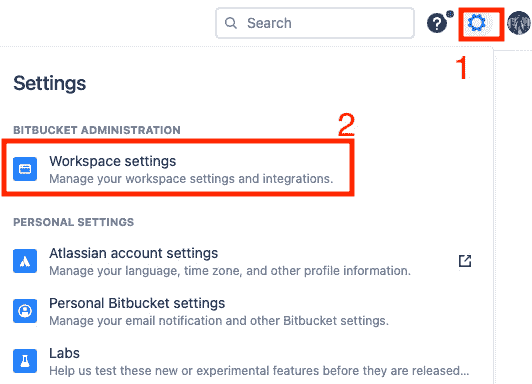
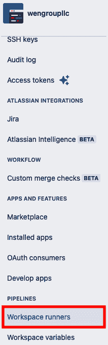
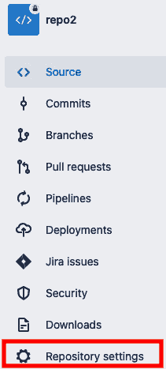
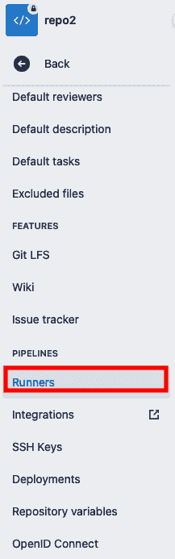
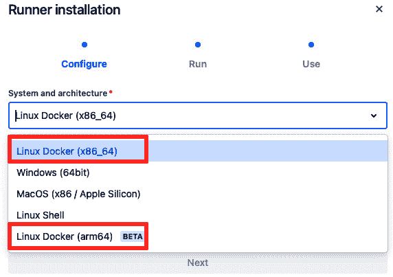
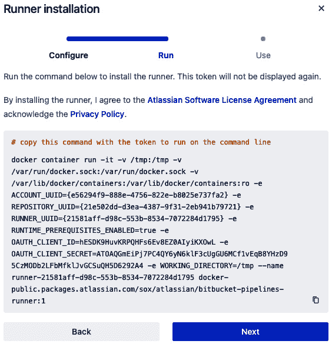

# 利用 Docker 和 Kubernetes 进行高级配置

在上一章中，我们探讨了通过 Bitbucket Pipelines 实现持续部署，并使用各种技术平台进行操作。然而，我们将 Docker 和 Kubernetes 部署的讨论留到现在。Bitbucket Pipelines 可以利用容器作为其构建环境、构建包，甚至作为运行器来执行流水线操作。在上述每种情况下，您可以使用公共镜像或创建并使用私有镜像。

在本章中，我们将探讨使用 Docker 容器技术和 Kubernetes。我们将在本章中实现 Bitbucket Pipelines 时，涵盖以下内容：

+   使用 Docker 镜像作为构建环境

+   在 Bitbucket Pipelines 中使用容器化服务

+   在 Bitbucket Pipelines 中使用 Docker 命令

+   使用 Bitbucket Pipelines 将 Docker 镜像部署到 Kubernetes

+   在 Linux 上设置基于 Docker 的运行器

让我们开始在 Bitbucket Pipelines 中探索 Docker 和 Kubernetes。

# 技术要求

在我们开始探索之前，我们应该先明确在本地开发环境中工作所需的 Docker 和 Kubernetes 工具。

要使用 **Docker 镜像**，需要确保在您的运行器机器上安装了 Docker 应用，以执行任何 Docker 命令。

对于用于创建构建环境的开发机器，Docker Desktop 是一个不错的选择，它提供了所有必需的 Docker 工具，用于构建、打包、运行和部署容器化应用。它适用于 Mac、Windows 和 Linux 操作系统。更多信息请参考 [`docs.docker.com/get-docker/`](https://docs.docker.com/get-docker/)。

运行器只需要能够构建和运行容器化应用的 Docker 应用。因此，Docker Engine 是一个很好的应用，适合安装并配置在您的运行器上。它支持许多常见的 Linux 发行版，包括 Ubuntu、Debian 和 Red Hat。更多信息请参考 [`docs.docker.com/engine/`](https://docs.docker.com/engine/)。

在处理 Kubernetes 集群时，`kubectl` 是首选工具。可以为 Linux、Mac 或 Windows 下载 `kubectl` 的二进制文件。像 Red Hat Linux 的 yum、Debian Linux 的 apt、Mac 的 homebrew 和 Windows 的 chocolatey 等包管理器也可以下载并安装 `kubectl`。更多信息请参考 [`kubernetes.io/docs/home/`](https://kubernetes.io/docs/home/)。

本章的示例代码可以在本书 GitHub 仓库的 `Chapter9` 文件夹中找到 [`github.com/PacktPublishing/Atlassian-DevOps-Toolchain-Cookbook/tree/main/Chapter9`](https://github.com/PacktPublishing/Atlassian-DevOps-Toolchain-Cookbook/tree/main/Chapter9)

# 引入容器和 Bitbucket Pipelines

促进 DevOps 运动的最新技术进展之一就是 **容器** 技术的引入。如在 *第一章* 中提到的，应用程序及其所需的库将驻留在一个自包含的实体中，称为容器，而不是像物理或 **虚拟机**（**VMs**）那样设置完整的环境。这个容器通过一个管理应用程序与外部资源进行交互。在撰写本文时，最流行的容器管理应用程序是来自 Docker Inc. 的 Docker 引擎。

容器使应用程序的可移植性达到了前所未有的水平。开发人员可以创建一个应用程序，将其打包为容器，并在管理该容器的测试环境中对应用程序进行测试。部署到生产环境时将使用相同的容器镜像，但在一个可能拥有更多资源的环境中，具体取决于目标，可以支持多个应用程序容器实例进行负载共享或高可用性。

**Bitbucket Pipelines** 可以与容器配合使用。那么，让我们来考虑一些容器在 Bitbucket Pipelines 中的用途。

默认情况下，Bitbucket Pipelines 使用 Docker 镜像作为构建环境。你可以定义用于构建的 Docker 镜像。

你还可以使用 Bitbucket Pipelines 创建 Docker 容器镜像，并更新相应的 Docker 容器仓库。

Bitbucket Pipelines 可以使用从 Docker 镜像创建的运行器来执行构建。这可能允许通过动态分配运行器来执行构建，创建所需数量的 Docker 容器，并在完成后销毁这些容器。唯一的限制是环境中可用的资源。

容器技术的另一个应用形式就是 Kubernetes。Kubernetes 最初由 Google 开发，用于将存储在容器中的应用程序抽象为服务，并提供一个环境来建立和维护容器化服务的集群。

最后，Bitbucket Pipelines 可以将应用程序构建为 Docker 容器镜像。这个镜像可以作为管道脚本的一部分部署到 Kubernetes 集群中。

现在我们了解了 Docker 容器如何与 Bitbucket Pipelines 配合工作，让我们来看看如何实现这一点。

# 使用 Docker 镜像作为构建环境

Bitbucket Pipelines 使用 Docker 镜像作为平台来执行 `bitbucket-pipelines.yml` 中的命令。该镜像通常是由 Atlassian 提供的默认镜像，但也可以替换为自定义镜像。

让我们来看看 Bitbucket Pipelines 如何使用这些 Docker 镜像。

## 准备工作

在 Bitbucket Pipelines 中，运行器在构建环境中执行 `bitbucket-pipelines.yml` 中指定的命令。这个构建环境始终使用 Docker 容器。

如果没有指定 Docker 镜像，Bitbucket Pipelines 将选择一个默认的 Docker 镜像用于容器。

Bitbucket Pipelines 使用的默认镜像由 Atlassian 存储在 **Docker Hub** 上，网址是 [`hub.docker.com/r/atlassian/default-image/`](https://hub.docker.com/r/atlassian/default-image/)。

默认镜像的版本号可以被指定。如果未指定版本号，则会使用带有 **latest** 标签的版本。

以下表格提供了默认镜像版本的概览：

| **版本** | **标签** | **内容** |
| --- | --- | --- |
| 1.x（不推荐使用） | `latest` | 平台：`ubuntu 14.04` 开箱即用的软件包：`wget xvfb curl git: 1.9.1 java: 1.8u66 maven: 3.0.5 node: 4.2.1 npm: 2.14.7 nvm: 0.29.0 python: 2.7.6` `gcc: 4.8.4` |
| 2.x（不推荐使用） |  | 平台：`ubuntu 16.04` 开箱即用的软件包：`wget xvfb curl ssh git: 2.7.4 mercurial: 3.7.3 java: Open-JDK 1.8u151 maven: 3.3.9 node: 8.9.4 npm: 5.6.0 nvm: 0.33.8 python: 2.7.12 gcc: 5.4.0` `ant: 1.9.6` |
| 3.x（不推荐使用） |  | 平台：`ubuntu` `20.04 (LTS)` 开箱即用的软件包：`wget xvfb curl ssh zip jq tar parallel git: 2.39.1 node: 14.17.5 npm: 6.14.14 nvm: 0.38.0 python: 3.8.10 gcc: 9.4.0` `ant: 1.10.7` |
| 4.x（推荐使用） |  | 平台：`ubuntu` `22.04 (LTS)` 开箱即用的软件包：`wget xvfb curl ssh zip jq tar parallel git: 2.39.1 node: 18.16.1 npm: 9.5.1 nvm: 0.39.2 python: 3.10.6 gcc: 11.3.0` `ant: 1.10.12` |

表 9.1 – 默认的 Atlassian 构建环境 Docker 镜像

重要提示

标记为 `latest` 的镜像使用的是较旧的镜像，其他镜像则是更近期创建的。这确保了与旧版 Bitbucket Pipelines 构建的向后兼容性。

要指定所需版本，请将以下行添加到 `bitbucket-pipelines.yml` 文件中：

```
image: atlassian/default-image:<version number>
```

这里，`<version number>`表示所需的版本或标签（例如 `latest`）。

我们可以指定任何来自公共或私有仓库的 Docker 镜像来创建我们的构建环境。让我们在下一部分中探讨如何做到这一点。

## 如何操作…

Bitbucket Pipelines 可以使用来自公共或私有仓库的任何 Docker 镜像。所需的信息依据仓库是公共还是私有而有所不同。

让我们学习如何使用来自公共注册表的 Docker 镜像。

### 使用公共镜像

公共仓库托管着任何人都可以使用的 Docker 镜像。该仓库可以托管在 Docker Hub 上，也可以是其他仓库，甚至是自发布的仓库，只要它可以通过互联网访问。

让我们来看一下如何使用公共 Docker 镜像作为构建环境：

1.  在 `bitbucket-pipelines.yml` 文件中通过名称指定镜像。如果没有包含标签，则默认使用 `latest` 标签：

    ```
    image: postgres
    ```

1.  如果指定了账户，它应作为名称的一部分：

    ```
    image: bitnami/postgresql
    ```

1.  可以在镜像名称后添加冒号和特定版本：

    ```
    image: bitnami/postgresql:16.2.0
    ```

1.  如果使用的公共镜像不托管在 Docker Hub 上，请在镜像规范中包含仓库的 URL：

    ```
    image: docker.publicimage.com/bitnami/postgresql:16.2.0
    ```

这样，你就学会了如何为构建环境指定公共 Docker 镜像。接下来，我们来看看如何使用私有镜像。

### 使用私有镜像

私有 Docker 仓库通常由公司和其他组织用来存储包含该组织知识产权的自定义 Docker 镜像。这些仓库通常通过认证策略来进行保护。

我们来看看如何通过使用私有 Docker 镜像来配置构建环境：

1.  你可以添加安全变量来存储你的凭证，并在`bitbucket-pipelines.yml`文件中引用这些变量。关于变量和秘密的内容可以参考*第六章*。以下代码片段展示了一个私有 Docker Hub 仓库的示例：

    ```
    image:
       name: my-company-account/bitnami/postgresql:16.2.0
       username: $DOCKER_HUB_USERNAME
       password: $DOCKER_HUB_PASSWORD
       email: $DOCKER_HUB_EMAIL
    ```

1.  如果你的私有 Docker 仓库使用 AWS `aws` 部分：

    ```
    image:
       name:
    <aws_account_id>.dkr.ecr.<region>.amazonaws.com/bitnami/postgresql:16.2.0
       aws:
          access-key: $AWS_ACCESS_KEY
          secret-key: $AWS_SECRET_KEY
    ```

1.  传递 AWS 凭证的另一种方法是通过在 AWS 中设置 IAM 角色，并将 Bitbucket Pipelines 配置为 Web 身份提供者。这使得 Bitbucket Pipelines 能够使用 Open ID Connect 连接到 AWS ECR。详细说明可以参考[`support.atlassian.com/bitbucket-cloud/docs/use-aws-ecr-images-in-pipelines-with-openid-connect/`](https://support.atlassian.com/bitbucket-cloud/docs/use-aws-ecr-images-in-pipelines-with-openid-connect/)。接下来，必须将以下代码片段放入`bitbucket-pipelines.yml`文件中：

    ```
    image:
       name: <aws_account_id>.dkr.ecr.<region>.amazonaws.com/bitnami/postgresql:16.2.0
       aws:
              oidc-role: arn:aws:iam::<aws_account_id>:role/<your_role_name>
    ```

1.  如果你的私有 Docker 仓库位于 **Google Container Registry** (**GCR**) 中，你必须在 GCP 管理控制台中创建一个服务账户，并授予 Bitbucket Pipelines 对 GCR 的 *Viewer* 访问权限。这样将创建一个 JSON 格式的私钥。下载该密钥并将其作为安全变量保存在 Bitbucket Pipelines 中。然后，你可以使用以下代码片段访问该镜像：

    ```
    image:
       name: <region>.gcr.io/<project>/image
       username: _json_key
       password: '$GCR_JSON_KEY'
    ```

    对于其他任何私有 Docker 仓库，请提供注册表 URL，并将凭证作为安全变量进行配置。以下代码片段展示了这一点：

    ```
    image:
       name: docker.<company name>.com/<account-name>/bitnami/postgresql:16.2.0
       username: $USERNAME
       password: $PASSWORD
       email: $EMAIL
    ```

通过这些，你已经看到 Bitbucket Pipelines 可以从多个地方获取 Docker 镜像来作为构建环境。

接下来，我们将学习如何在运行 Bitbucket pipeline 时定义和使用容器化服务。

# 在 Bitbucket Pipelines 中使用容器化服务

你可以通过定义要使用的容器在 Bitbucket pipeline 中运行多个服务。当 pipeline 运行时，这些服务将在被调用的步骤中按计划执行。可以通过这种方式调用的服务包括数据库、代码分析和 Web 服务。

在这个教程中，我们将学习如何定义和使用容器化服务。

## 准备开始

在 pipeline 执行过程中，使用容器化服务有一些限制需要理解。我们现在来详细看看这些限制。

这些容器化服务可用的资源是有限的。每个 pipeline 步骤最多可以使用五个服务。如果你需要使用更多服务，可以定义 `docker run` 或 `docker-compose`。

每个服务将会在没有等待服务启动的情况下运行。尽管这些服务正在运行，但你无法通过 REST API 调用访问服务或其日志，尽管日志应通过 Bitbucket Pipelines 提供。`29418`将被保留，无法用于外部操作。

服务的最复杂限制涉及内存。每个步骤可以定义为常规步骤（具有 4,096 MB 的内存限制）或大构建步骤（通过在步骤定义中添加`size: 2x`语句来定义），这将把内存限制提高到 8,192 MB。

步骤中的内存被分配为一个构建容器和步骤中定义的服务容器数量。构建容器需要至少 1,024 MB。这部分内存用于处理构建过程和 Bitbucket Pipelines 所需的任何开销。

剩余的内存将提供给服务容器。在构建容器分配内存后，服务容器将剩余 3,027 MB 或 7,128 MB。默认情况下，每个服务容器可以获得 1,024 MB 或一个自定义值，范围为 128 MB 到最大值。可以通过在服务定义中使用`memory`关键字来设置此值。

如果你的构建步骤包含 Bitbucket Pipes，它使用的是内置的 Docker 服务。默认情况下，这个 Docker 服务占用构建步骤的 1,024 MB 内存，但可以通过将内存设置为 128 MB 到最大值之间的自定义值来进行配置。

现在我们已经了解了这些限制，让我们学习如何定义可以在给定步骤上运行的服务。

## 如何做到……

以下是可以在构建步骤中定义的服务类型的一组示例。在本食谱中，我们将查看使用这些服务的示例：

+   数据库服务

+   数据存储服务（例如，NoSQL）

+   Docker-in-Docker 服务

让我们看看如何定义这些服务。

### 定义一个容器化的数据库服务

让我们从一个具有所有默认值的数据库服务的定义开始：

1.  在`definitions:`部分，在`services:`中指定服务名称，使用`image:`关键字添加 Docker 镜像，并在`variables:`部分中添加必要的凭证（作为安全变量）。这应如下所示：

    ```
    definitions:
       services:
          mysql:
             image: mysql:5.7
             variables:
                MYSQL_DATABASE: test-db
                #set up password as secure variable and use here
                     MYSQL_ROOT_PASSWORD: $password
    ```

1.  要在步骤中使用服务，请将服务添加到步骤的`services:`部分。如下所示的代码片段：

    ```
    default:
       - step:
             services:
                - mysql
    ```

1.  要自定义内存分配，请在`definitions:`部分的`memory:`关键字后面添加所需的内存量（以 MB 为单位）。代码应如下所示：

    ```
    definitions:
       services:
          mysql:
             image: mysql:5.7
             memory: 2048 # double the mimimum
             variables:
                MYSQL_DATABASE: test-db
                #set up password as secure variable and use here
                MYSQL_ROOT_PASSWORD: $password
    ```

现在我们已经在构建步骤中运行了一个数据库服务，并且它的服务容器内存为 2,048 MB。

### 定义一个容器化的数据存储服务

让我们按照前一个示例中的方式创建我们的数据存储服务：

1.  在`definitions:`部分，设置`services:`中的服务名称，并使用`image:`关键字添加 Docker 镜像。这些添加应如下所示：

    ```
    definitions:
       services:
          redis:
             image: redis:3.2
    ```

1.  要在某个步骤中使用该服务，只需将其添加到该步骤的 `services:` 部分。我们还添加了一个基于该服务运行的命令。如下代码片段所示：

    ```
    default:
       - step:
             script:
                - redis-cli -h localhost ping
             services:
                - mysql
    ```

到此为止，我们已经学会了如何定义一个容器化服务并在构建步骤中使用它。

现在，让我们学习如何调用 Docker-in-Docker 服务。

### 定义 Docker-in-Docker 服务

让我们看看如何在构建步骤中运行 Docker 服务：

1.  在 `definitions:` 部分，在 `services:` 中设置服务名称。应该如下所示：

    ```
    definitions:
       services:
          docker:
    ```

1.  要在某个步骤中使用该服务，请将其添加到该步骤的 `services:` 部分。我们还添加了一个基于该服务运行的命令。如下代码片段所示：

    ```
    default:
       - step:
             script:
                - docker info
             services:
                - docker
    ```

1.  你可以为你的 Docker 服务指定自定义名称。定义服务时使用自定义名称，并将 `type:` 设置为 `docker`。以下代码片段展示了一个自定义 Docker 服务的详细示例，并包含内存大小的定制：

    ```
    definitions:
       services:
          my-docker:
             memory: 5120
             type: docker
    default:
       - step:
          services: my-docker
          size: 2x
          script:
             - docker info
    ```

到此为止，我们已经学习了如何在 Bitbucket Pipelines 中将 Docker 定义为一个服务。

接下来，我们将学习如何将 Bitbucket Pipelines 的输出作为 Docker 镜像部署并将其推送到 Docker 仓库。为此，我们需要了解如何执行 Docker 命令。让我们看看这如何操作。

# 在 Bitbucket Pipelines 中使用 Docker 命令

如果你的 Bitbucket 仓库中有一个 Dockerfile，你可以使用 Bitbucket Pipelines 构建镜像并将其推送到 Docker 仓库。你可以通过在 `bitbucket-pipelines.yml` 文件中执行 Docker 命令来实现这一点。让我们更详细地看看如何操作。

## 准备工作

在将 Docker 命令添加到 `bitbucket-pipelines.yml` 文件之前，我们需要启用以下配置：

+   允许访问 Docker 守护进程

+   启用 Docker BuildKit

这些配置是 `bitbucket-pipelines.yml` 文件的一部分。让我们看看它们的位置。

### 启用对 Docker 守护进程的访问

通过将 Docker 作为服务添加到某个步骤中，可以实现对 Docker 守护进程的访问，这种方法推荐使用，因为你可以跟踪整体管道正在运行多少个服务，或者也可以将 Docker 作为服务添加到所有步骤中。让我们看看每种方法是如何实现的：

1.  要将 Docker 作为构建步骤的服务使用，请确保它出现在该步骤的 `services:` 部分。如以下代码片段所示：

    ```
    pipelines:
      default:
        - step:
            script:
              - ...
            services:
              - docker
    ```

1.  要将 Docker 作为全局服务使用，需在 `options:` 部分添加 `docker` 并将其设置为 `true`，如下代码片段所示：

    ```
    options:
      docker: true
    ```

启用 Docker 守护进程访问时有一些需要注意的事项。默认情况下，Docker 被定义为一个服务，因此我们无需在 `bitbucket-pipelines.yml` 的 `definitions:` 部分重新定义它。

现在，创建 Docker 构建通常需要使用 Docker BuildKit。那么，让我们学习如何在 Bitbucket Pipelines 中使用 Docker BuildKit。

### 启用 Docker BuildKit

Docker BuildKit 是在使用 Docker Desktop 或 Docker Engine v23.0 及以上版本时构建的默认部分。我们希望确保启用它，以确保与这些版本的兼容性。所以，让我们探索如何使用 Docker BuildKit。

要启用 Docker BuildKit，确保将 `DOCKER_BUILDKIT` 环境变量设置为 `1`，如以下代码片段所示：

```
pipelines:
   default:
       - step:
         script:
            - export DOCKER_BUILDKIT=1
            - docker build .
         services:
            - docker
```

现在，让我们学习如何在 Bitbucket Pipelines 中使用 Docker 命令。

## 如何操作…

启用 Docker 和 Docker BuildKit 后，我们可以运行大多数 Docker 命令。出于安全原因，Bitbucket Pipelines 对可以运行的 Docker 命令以及其他 Docker 命令的模式进行了限制。有关限制的详细列表，请访问[`support.atlassian.com/bitbucket-cloud/docs/run-docker-commands-in-bitbucket-pipelines/`](https://support.atlassian.com/bitbucket-cloud/docs/run-docker-commands-in-bitbucket-pipelines/)。

与此同时，我们将考虑将 Docker 集成到 Bitbucket Pipelines 中的常见用例。这些包括以下内容：

+   从 Dockerfile 构建 Docker 镜像

+   从 Bitbucket 安全变量将秘密传递给 Docker BuildKit

+   从外部秘密管理器将秘密传递给 Docker BuildKit

+   将 Docker 镜像推送到 Docker 仓库

让我们来看看这些常见的用例。

### 从 Dockerfile 构建 Docker 镜像

启用 Docker BuildKit 后，Bitbucket Pipelines 可以构建 Docker 镜像。让我们详细了解一下：

1.  确保在你的 Bitbucket 仓库的根目录下存在一个 Dockerfile。

    你可能想将镜像名称指定为一个变量。

1.  在构建步骤的脚本部分添加以下行：

    ```
    - docker build -t $IMAGE_NAME .
    ```

完成这一步后，让我们进入下一个用例。

### 使用安全变量将秘密传递给 Docker BuildKit

如果我们需要将诸如凭据或 API 密钥等秘密传递给 BuildKit 构建，可以使用 Bitbucket 中的安全变量进行传递。下面是我们可以执行的操作：

1.  在 Bitbucket 中创建安全变量。

    ```
    SECRET as the secure variable:
    ```

    ```
    pipelines:
       default:
          - step:
                name: 'BuildKit and secure variables'
                script:
                # Enable BuildKit
               - export DOCKER_BUILDKIT=1
               # Pass the secure variable into Docker build and prevent caching
               - docker image build -t latest --secret id=SECRET --progress=plain --no-cache dockerfile
               services:
               - Docker
    ```

1.  在 Dockerfile 中，添加一个 `RUN` 指令，将安全变量挂载（使用 `--mount=type=secret` 标志）到默认的 Docker 秘密存储中 `(/run/secrets/*)`。以下代码片段展示了这一操作：

    ```
    FROM ubuntu:latest
    # Mount and print SECRET
    RUN --mount=type=secret, id=SECRET \
          cat /run/secrets/SECRET
    ```

还有另一种将秘密传递给 Docker BuildKit 的方法：使用外部秘密管理器。所以，让我们探索如何与外部秘密管理器一起工作。

### 使用外部秘密管理器将秘密传递给 Docker BuildKit

我们还可以连接到外部秘密管理器，例如 Hashicorp Vault 或 Google Cloud Secret Manager，将凭据或 API 密钥等秘密传递给 BuildKit 构建。让我们学习如何操作：

1.  在 `bitbucket-pipelines.yml` 文件中，从管理器获取秘密，将秘密放入管道文件中，添加 `--secret` 标志，并将源标识为管道文件。请记住，管道文件将在管道步骤完成并且容器被移除时被删除。以下代码片段展示了 `SECRET` 作为安全变量：

    ```
    pipelines:
       default:
          - step:
                name: 'BuildKit and external secret managers'
                script:
                # Enable BuildKit
               - export DOCKER_BUILDKIT=1
               # This is where the call to the external secret manager resides.  We assume here that it has added the secret to "/secret_file"
               # Pass the secure variable into Docker build and prevent caching
               - docker image build -t latest --secret id=SECRET,src=/secret_file --progress=plain --no-cache dockerfile
               services:
               - docker
    ```

1.  在 Dockerfile 中，添加一个 `RUN` 指令，挂载安全变量（使用 `--mount=type=secret` 标志），并将包含秘密的管道文件挂载到默认的 Docker 秘密存储区 (`/run/secrets/*`) 中。以下代码片段演示了这个过程：

    ```
    FROM ubuntu:latest
    # Mount and print SECRET
    RUN --mount=type=secret, id=SECRET,dst=/secret_file \
          cat /run/secrets/SECRET
    ```

通过这些步骤，我们已经构建了一个包含从外部来源获取的秘密的镜像。现在，让我们来看看你可以执行的各种操作，包括推送到 Docker 注册表。

### 将 Docker 镜像推送到 Docker 注册表

你可以将创建的镜像推送到 Docker Hub 或其他注册表，作为 Bitbucket Pipelines 脚本执行的一部分。请按照以下步骤操作：

1.  创建镜像名称、Docker 仓库用户名和 Docker 仓库密码的变量。用户名和密码应该是安全变量。

1.  向步骤的脚本部分添加命令，以部署 Docker 镜像。为此，你需要执行以下操作：

    1.  登录到 Docker 仓库。

    1.  通过 `docker push` 推送镜像。

    以下代码片段展示了如何构建并推送 Docker 镜像的基本示例：

    ```
    - step:
       name: Build
       script:
          # Build the Docker image (assumes the Dockerfile is at the root level of the repository)
          - docker build -t $IMAGE_NAME .
          # Authenticate with the Docker registry (this example is Docker Hub)
          - docker login --username $DOCKER_HUB_USERNAME --password $DOCKER_HUB_PASSWORD
          # Push the image to the Docker registry
          - docker push $IMAGE_NAME
       services:
          - docker
    ```

到此为止，我们已经学会了如何通过构建 Docker 镜像并将生成的镜像推送到 Docker 注册表来部署应用程序。接下来，我们可以进一步完善我们的示例，将 Docker 镜像部署到 Kubernetes 集群。我们将在下一节中介绍这个过程。

# 使用 Bitbucket Pipelines 将 Docker 镜像部署到 Kubernetes

在构建 Docker 镜像之后，可能的下一步是将其部署到 Kubernetes 集群。通过利用集群的冗余能力，我们可以在不发生服务中断的情况下进行应用程序的升级。

## 准备工作

本教程假设你已有一个手动创建的 Kubernetes 集群或 minikube 环境。

此外，你还必须手动定义一个部署，用于在 Kubernetes 中运行应用程序。所以，让我们学习如何创建一个部署。

确保应用程序名称和 Docker 注册表用户名可供轻松引用。执行 `kubectl` 命令，并包括必要的标志，如以下代码片段所示。这些标志将包括应用程序名称和 Docker 注册表名称作为镜像名称的一部分：

```
kubectl run <my.app> --labels="app=<my.app>" --image=<my.dockerhub.username>/<my.app>:latest --replicas=2 --port=8080
```

既然我们已经在 Kubernetes 中建立了部署，接下来让我们学习在使用 Bitbucket Pipelines 时，如何实现应用程序的持续部署。

## 如何操作…

我们可以通过两种方式将 `kubectl` 应用程序集成到 Bitbucket Pipelines 中：

+   使用管道进行集成

+   设置服务

让我们更详细地看看每种方法。

### 使用管道执行 kubectl

正如我们在*第六章*中看到的那样，Bitbucket Pipes 是与常见第三方工具和实用程序的预打包集成。它们可以轻松地添加到 Bitbucket Pipelines 步骤中，并通过单独的容器作为服务执行。

让我们学习如何将 `kubectl` 管道集成进去：

1.  设置`kubeconfig`文件以供读取。此文件需要进行`Base64`编码，然后存储为一个安全变量。你可以使用以下代码来实现：

    ```
    KUBE_CONFIG_BASE64=$(cat ~/.kube/config | base64)
    ```

1.  将管道添加到步骤的脚本部分。管道定义应该如下所示：

    ```
    - step:
       name: Deploy
       deployment: production
       script:
          -pipe: atlassian/kubectl-run:1.1.2
           variables:
              KUBE_CONFIG: $KUBE_CONFIG
              KUBECTL_COMMAND: 'apply'
              RESOURCE_PATH: 'deployment.yml
    ```

有了这一切，我们已经通过 Bitbucket Pipelines 使用管道部署到了 Kubernetes。

有时，我们需要执行与管道中提供的版本不同的`kubectl`版本。在这种情况下，从 Atlassian 提供的`kubectl` Docker 镜像中执行是更好的选择。引入不同版本的一个原因可能是为了确保与现有 Kubernetes 集群的兼容性，尤其是当集群使用的是旧版本时。现在，让我们探索这个选项。

### 使用 kubectl Docker 镜像执行 kubectl

Bitbucket Pipelines 也有一个版本的`kubectl`，它封装在自己的 Docker 镜像中。此镜像位于 Docker Hub 上，地址为[`hub.docker.com/r/atlassian/pipelines-kubectl`](https://hub.docker.com/r/atlassian/pipelines-kubectl)，可以在 Bitbucket Pipelines 脚本中使用它来执行`kubectl`命令。

使用`kubectl`服务在 Kubernetes 上进行部署时，请执行以下步骤：

1.  在部署步骤中，使用`image:`关键字定义 Docker 镜像。

1.  设置我们的`kubeconfig`文件。这一次，我们将解码 Base64 来创建一个临时文件，并在执行后销毁该文件：

    ```
    echo $KUBECONFIG | base64 -d > kubeconfig.yml
    ```

1.  执行`kubectl`命令来应用应用程序的新版本：

    ```
    - kubectl --kubeconfig=kubeconfig.yml apply -f deployment.yml
    ```

1.  综合以上内容，我们得到以下代码片段：

    ```
    -step:
       name: Deploy to Kubernetes
       image: atlassian/pipelines-kubectl
       script:
          - echo $KUBECONFIG | base64 -d > kubeconfig.yml
          # Run deployment command using kubectl
          - kubectl --kubeconfig=kubeconfig.yml apply -f deployment.yml
    ```

    如在*第八章*的*配置部署*食谱中所示，你可以通过部署仪表板监控你的部署。

有了这一切，你已经学会了如何将我们的应用构建为 Docker 镜像并部署到 Kubernetes 环境中。

我们在探索如何利用 Docker 时的最后一步是从管道到运行器。因此，让我们学习如何在 Linux 上配置基于 Docker 的运行器。

# 在 Linux 上设置基于 Docker 的运行器

使用自托管运行器的这一应用提供了动态配置的极致体验。通过允许在 Docker 容器内运行器，我们可以根据需要添加或删除运行器。

我们将从 Linux 环境开始，安装 Docker，然后加载并运行 Bitbucket 运行器软件的 Docker 镜像。让我们来看一下设置基于 Docker 的运行器的完整过程。

## 准备工作

我们的 Linux 环境有一些先决条件，在继续之前必须先覆盖它们。首先，我们需要了解我们的 Linux 环境。此环境应具备以下特性：

+   你应该使用 64 位版本的 Linux。

+   至少需要为运行器主机分配 8 GB 的 RAM。如果你知道你需要更多空间（例如，由于更多的构建步骤），你应分配更多内存。

+   至少需要为运行器容器分配 512 MB 的内存。

+   必须安装 Docker v19.03 或更高版本。

按照这种方式设置好 Linux 环境后，我们需要查看 Atlassian 推荐的 Linux 环境最佳实践。Atlassian 推荐以下环境配置：

+   禁用**交换**空间在你的 Linux 环境中

+   配置 `vm.swappiness`

让我们更详细地看看这些建议。

### 禁用交换空间

根据你使用的 Linux 发行版，你可能没有安装必要的命令。如果以下命令在你的 Linux 环境中不可用，你可以使用该发行版推荐的包管理器进行安装：

1.  检查交换空间是否已启用：

    ```
    sudo swapon -sv
    ```

    如果交换空间已启用，现有的交换分区会显示在以下输出中：

    ```
    NAME      TYPE      SIZE   USED PRIO
    /dev/sda3 partition   2G 655.2M   -1
    ```

1.  通过执行以下命令禁用交换空间：

    ```
    /etc/fstab.
    ```

1.  重启你的 Linux 机器。

1.  重复这些步骤，直到不再出现交换分区。

到此为止，我们已经消除了一个交换存储源。然而，我们应该消除其他来源。为此，我们将查看配置 `vm.swappiness`。

### 配置 vm.swappiness

同样，一些 Linux 发行版可能没有指定以下步骤中的命令。如果是这种情况，使用 Linux 发行版推荐的包管理器安装所需的命令。

让我们仔细看看如何正确配置 `vm.swappiness` 来禁用交换空间：

1.  使用以下命令检查 `vm.swappiness` 的值：

    ```
    1, configure vm.swappiness by performing the following steps:1.  Open `/etc/sysctl.conf` and add `vm.swappiness=1` to its own line in the file.2.  Save your changes.3.  Reboot the Linux machine.
    ```

1.  如果后续检查 `vm.swappiness` 的值不是 `1`，请重复这些步骤，并确保在 `/etc/sysctl.conf` 中正确配置该设置。

下一步是为了保持 Linux 环境的正常运行，强烈建议定期清理过时的 Docker 容器镜像。让我们来看一下如何安排这个操作。

### 自动化清理过时 Docker 镜像的过程

我们的 Linux 环境应定期清除未使用的 Docker 镜像，以节省磁盘空间。我们希望确保在 Linux 环境中有足够的磁盘空间，以便我们可以继续操作我们的 runner 并确保它在 Bitbucket Pipelines 作业中可用。删除未使用 Docker 镜像的命令是 `docker system prune -af`。安排自动运行命令的常见方法是使用**cron**。让我们看看如何操作：

1.  对于正确的用户，使用以下命令打开他们的 `crontab` 文件：

    ```
    crontab file while setting up the correct frequency, dates, and times. The following example runs the command on Sundays at midnight:

    ```

    0 0 * * 0 docker system prune -af

    ```

    ```

1.  保存文件并退出编辑器。

到这里，我们已经通过 cron 自动化了未使用的 Docker 镜像删除。现在，轮到设置我们的 runner 了。

## 如何操作…

在完成初步步骤后，接下来是将我们的 Linux 环境连接到 Bitbucket，以便它可以作为一个 runner 使用。让我们看看如何操作：

1.  在 Bitbucket 中，定义一个新的 runner。通过点击屏幕右上角的管理齿轮，选择**工作区设置**来定义一个工作区 runner：



图 9.1 – 在 Bitbucket 中选择工作区设置

1.  在左侧菜单栏中，选择**工作区运行器**：



图 9.2 – 选择工作区运行器

或者，如果你是在为存储库设置运行器，请选择存储库，并在存储库的侧边栏中选择**存储库设置**。



图 9.3 – 选择存储库设置

1.  在**存储库设置**侧边栏中，选择**Pipelines**下的**运行器**。



图 9.4 – 选择运行器

1.  无论是选择工作区的运行器还是存储库的运行器，都可以通过选择**添加** **运行器**按钮来创建运行器。

    在出现的模态框中，根据你的硬件平台选择**Linux Docker (x86_64)** 或 **Linux Docker (arm64)**，然后点击**下一步**。



图 9.5 – 在系统和架构下选择 Linux Docker

在下一个模态框中，复制显示的 Docker 命令并将其粘贴到 Linux 环境中的终端窗口中。该命令将访问 Docker 注册表以检索 Bitbucket Pipelines 运行器软件作为 Docker 镜像，并创建容器。



图 9.6 – 复制 Docker 命令以拉取运行器

1.  你可能希望在重新启动运行器时获取最新版本，或者仅仅是为了确保你拥有最新版本。要执行此更新，请在你的 Linux 环境中执行以下 `docker pull` 命令：

    ```
    docker image pull docker-public.packages.atlassian.com/sox/atlassian/bitbucket-pipelines-runner:1
    ```

    启动运行器时，你可能会遇到以下错误：

    ```
    docker: Error response from daemon: docker: Error response from daemon: Conflict. The container name "/runner-76b247e7-b925-5e7b-9da2-1cda14c4ff2c" is already in use by container "c3403236e3af5962ed3a9b8771561bd2021974941cc8a89a40c6c66cecb18f53". You have to remove (or rename) that container to be able to reuse that name.
    docker run command:*   The `-v` flag and the directory, as seen on the host machine.*   The `-e` flag and the desired mount point inside the runner. You can use any desired mount point, but it must match the value of the `WORKING_DIRECTORY` environment variable.An example of using the `docker run` command is shown in the following code snippet:

    ```

    docker run [所有现有参数] -v /mydir:/mydir -e WORKING_DIRECTORY=/mydir

    ```

    ```

到此为止，我们已经为将来执行 Bitbucket Pipelines 设置了基于 Docker 的运行器。

# 第三部分：维护操作

发布后，焦点转向确保新特性和产品的环境保持与之前相同的性能、可扩展性和安全性。通过对性能进行度量，评估系统的运行状态以及它是否交付了承诺的价值，并将结果展示出来。

显示界面着重于可观察性，确保不仅仅是存在度量标准，还要确保这些度量标准对每个人可用且可见：开发人员、运维人员、站点可靠性工程师以及公司中的其他人员。

当问题发生时，这些领域的人员会聚集在一起合作解决问题并找到解决方案。

在这一部分，我们将探讨 Atlassian 工具（如 Jira、Opsgenie 和 Compass）如何协同工作，以及与其他工具一起如何为各个领域提供可观察性，并快速升级和解决问题。

本部分包含以下章节：

+   *第十章**，通过持续部署和可观察性与运营团队协作*

+   *第十一章**，通过 CheckOps 在 Compass 中监控组件活动和指标*

+   *第十二章**，通过 Opsgenie 警报进行升级*
