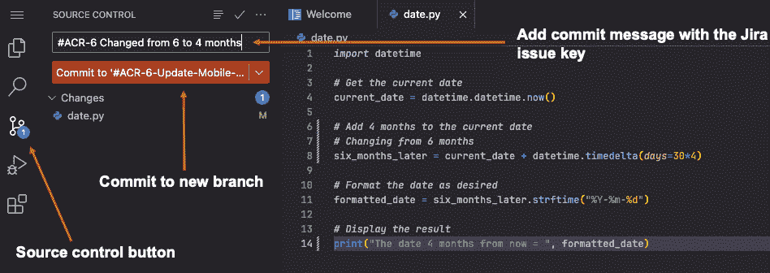

# 通过持续部署和可观测性与运维协作

在本章中，我们将通过查看主要由运维人员使用的工具集成来完成 DevOps 的循环。使用 Jira 的开发人员可以通过将 Jira 与**持续部署**（**CD**）工具（如 Bitbucket、GitLab、GitHub 或 Jenkins）集成，查看部署结果。监控性能的可观测性工具，如 Dynatrace 和 Datadog，可以通过集成将 Jira 问题与它们关联。

本章包含以下教程：

+   将 Jira 与持续部署工具连接

+   将 Jira 与可观测性工具连接

# 技术要求

完成本章所需的内容：

+   Jira

+   一个 GitLab 账户 ([`about.gitlab.com/`](https://about.gitlab.com/))

+   一个 Datadog 账户 ([`www.datadoghq.com/`](https://www.datadoghq.com/))

# 将 Jira 与持续部署工具连接

在本教程中，我们将学习如何将 Jira 与 CD 工具集成，以查看部署状态。在*第四章*中，我们了解到**持续集成**（**CI**）是指对代码库进行增量改进或更改，并自动化测试和验证这些代码更改的实践。

CD 可以被看作是 CI 的扩展，处理自动化的基础设施配置和应用发布过程。

本教程的目标如下：

+   将 GitLab 仓库与 Jira 项目关联

+   将 Jira 集成到 GitLab SaaS 应用中

+   对代码库进行更新，执行合并请求，并部署代码

+   在 Jira 项目和问题中看到 GitLab 部署的反映

## 准备工作

要执行此教程，您需要以下内容：

+   Jira 管理权限，以便添加 GitLab 应用

+   一个 GitLab 账户和包含实际或示例代码的仓库

## 如何操作…

我们将使用以下步骤来实现这个教程的目标：

1.  首先，我们需要确保所使用的 Jira 项目已启用**部署**功能。

图 10.1 – 为 Jira 项目启用部署

1.  接下来，我们需要验证 GitLab 和 Jira 的集成。在*第四章*中，我们介绍了 GitLab 和 Jira 的集成。如有需要，请参考该章节。

    一旦 GitLab 集成得到验证，我们将需要将 GitLab 仓库连接到 Jira 项目。

1.  在所需的 Jira 项目中，导航到**项目设置** | **工具链**。

    然后选择**添加工具**。

图 10.2 – 添加到项目工具链

您将看到从推荐工具列表中可用的**GitLab for Jira Cloud**选项。

1.  选择**添加** **到项目**。

图 10.3 – 将 GitLab 添加到 Jira 项目

重要提示

GitLab 框已被添加到项目的现有工具列表中。现在，我们需要将 GitLab 中的仓库与项目关联，并将项目中与代码库相关的所有问题也关联起来。

1.  选择**+ 添加代码** **仓库**选项。

图 10.4 – 添加 GitLab 代码仓库

由于 GitLab 已经与 Jira 集成，弹出窗口会显示一个下拉选项。选择下拉菜单并查看可用的 GitLab 仓库。你可以选择一个或多个仓库与 Jira 项目关联。

1.  在此示例中，我们选择了与移动应用程序代码库相关的仓库。

    选择一个仓库后，点击**添加** **仓库**按钮。

图 10.5 – 选择 GitLab 仓库

现在工具链中的 GitLab 框反映了所选的仓库。

图 10.6 – 添加 GitLab 仓库

提示

现在，我们将 Jira 项目与 GitLab 仓库关联起来，我们需要查看项目中的问题。我们需要识别或创建一个新项目，以便将其与代码更改和部署关联起来。

当我们在 GitLab 中对代码库进行更改时，我们需要问题的关键字来添加到分支和提交评论中。这将告诉 GitLab 哪些问题与部署相关。这被称为智能提交（Smart Commits）。

在以下 Jira 示例中，我们有一个问题，关键值等于**ACR-6**。该问题当前位于**进行中（IN PROGRESS）**状态列。

图 10.7 – Jira 问题关键字

1.  现在，让我们回到 GitLab 并针对 ACR-6 问题对代码库进行一些更新。首先，我们将为特定的更改创建一个新的分支。在 GitLab 中，在**代码**菜单下，选择**分支**。

图 10.8 – GitLab 代码仓库分支

这将为你提供创建新分支的选项。

1.  在**分支名称**字段中，确保使用 ACR-6 问题关键字，这样我们可以将此更改与 Jira 中的问题关联。然后选择**创建分支**。

图 10.9 – 创建 GitLab 分支

1.  从新的分支中，我们将选择一些代码进行修改。在此示例中，我们将对 Python 脚本进行一些简单的更新。有几种方法可以执行这些代码修改。为了简单起见，我们将通过 Web IDE 打开代码。

图 10.10 – 在 Web IDE 中打开以修改代码

我们已更新代码，以显示四个月后的日期。

1.  当我们的更改完成后，可以点击源代码控制按钮，并将更改提交到我们的新分支。在提交消息中，重要的是再次使用问题键（ARC-6），以将此提交与关联的 Jira 问题联系起来。

图 10.11 – 修改然后提交代码

1.  在提交更改后，我们可以返回到 GitLab，然后执行合并请求，将代码拉回主分支并部署代码。

    选择**创建合并请求**。

图 10.12 – 创建合并请求

创建合并请求后，您将看到流水线进程正在运行。此示例定义的流水线包括构建、运行两个测试作业，最后将代码部署到生产环境。

然后可以将代码合并到主分支，并关闭合并请求。

图 10.13 – 代码合并

1.  合并请求和部署完成后，我们可以切换回 Jira 项目，看到问题已自动转换为已完成状态。

    我们还可以在项目左侧面板中选择**部署**菜单选项，查看所有部署情况。

图 10.14 – Jira 部署操作

我们可以在**部署**视图中看到刚刚执行的 ACR-6 部署。

图 10.15 – Jira 部署视图

如果选择并查看实际的 ACR-6 问题，我们可以看到所有关联的 GitLab 活动。提交和合并请求显示在**Web 链接**部分下。单击其中任何链接将带您转到 GitLab 中的相应工件。

提示

您还可以查看**开发**面板，并查看所有关联的提交、构建和发布。

图 10.16 – Jira 问题开发人员视图

您现在已成功将 CD 应用程序（GitLab）集成到 Jira 中。这将增加跟踪代码发布过程中整体可见性。

# 将 Jira 与可观察性工具连接起来

DevOps 可观察性是 DevOps 中的一种实践，专注于深入了解应用程序和基础设施的行为、性能和健康状况。通过从系统内各种来源（包括日志、指标和跟踪）收集、聚合和分析数据来实现可观察性。在本节中，我们将学习如何将 Jira 与日志记录和监控工具连接起来，以便将 Jira 问题与问题关联起来。

此操作步骤具有以下目标：

+   配置具有 Jira 实例的 Datadog 帐户

+   展示从 Datadog 创建的 Jira 问题

## 准备工作

要执行此操作步骤，您需要以下内容：

+   为了添加 GitLab 应用程序，需要 Jira 管理权限。

+   一个 Datadog 帐户

## 如何操作...

为了实现 Datadog 集成，我们需要执行以下步骤：

1.  在 Datadog 中安装 Jira 集成。

1.  从 Jira 创建 Datadog 的应用链接。

1.  连接 Jira 实例。

1.  在 Jira 中创建一个 Webhook（如果使用 Datadog 案例管理）。

1.  在 Datadog 案例管理中添加一个项目。

1.  创建一个案例并查看相应的 Jira 问题。

### 那么，Jira 是否有 Datadog 应用？

尽管 Jira 市场中会显示可用的列表，但 Datadog 并没有一个可以安装到 Jira 的应用。让我们使用以下步骤来查找并安装它：

1.  导航到 `datadog`。

1.  点击 **Datadog Jira** **集成** 选项。

图 10.17 – Datadog Jira 集成

1.  Datadog **概览** 页面将显示。点击 **获取应用**。

图 10.18 – Datadog 概览页面

这将弹出一个窗口，表示集成配置需要在 Datadog 端完成。

图 10.19 – 集成配置开始于 Datadog

现在，为了配置 Datadog 集成到 Jira，您需要从您的 Datadog 帐户开始操作。

### 在 Datadog 中安装 Jira 集成

我们将通过以下步骤在 Datadog 中安装 Jira 集成：

1.  切换到您的 Datadog 帐户，选择左侧菜单中的 **集成** 选项。这将带您进入 **集成** 页面。

1.  在搜索框中输入 `jira` 并按 *回车*。Jira 集成图块将显示。

1.  选择 Jira 集成图块。

图 10.20 – Datadog Jira 集成图块

1.  会弹出一个 **Jira 集成** 窗口，选择 **配置** 标签。

图 10.21 – Jira 集成配置

**配置**页面将显示，您可以在此配置新的 Jira 帐户。根据说明，您需要在 Jira 中创建一个 Datadog 的应用链接。集成链接所需的一项内容是提供的公钥。请复制此密钥并保存到剪贴板。

图 10.22 – Jira 集成帐户信息

1.  切换到您的 Jira 实例，我们现在需要导航到 **产品** 菜单并添加一个应用链接。点击右上角的齿轮图标，然后点击 **产品**。

图 10.23 – Jira 产品选择

1.  在 **产品** 页面，向下滚动左侧菜单面板并选择 **应用链接**。

图 10.24 – Jira 应用链接

1.  现在我们可以通过选择**创建链接**来添加新的应用链接。

图 10.25 – 创建应用链接

1.  现在我们可以开始配置 Datadog 应用链接：

    1.  选择 `app.datadoghq.com`。

    1.  选择**继续**。

图 10.26 – 应用链接配置

1.  忽略**配置应用 URL**的警告，然后点击**继续**按钮。

图 10.27 – 应用 URL 配置

1.  对于应用链接，继续填写以下内容：

    1.  `DataDog`。

    1.  对于**应用类型**，选择**通用应用**。

    1.  勾选**创建传入链接**框。

    1.  点击**继续**。

图 10.28 – 应用链接配置所需的详细信息

1.  在配置过程的最后部分，填写以下内容：

    1.  `datadog-jira`)。你需要使用此值完成 Datadog Jira 集成。

    1.  `Datadog`。

    1.  对于**公钥**，将从 Datadog Jira 配置步骤中复制到剪贴板的公钥粘贴进来。

    1.  点击**继续**。

图 10.29 – 完成应用链接配置

新的 Datadog 应用链接将显示并准备好使用。

图 10.30 – 应用链接已创建

1.  切换回 Datadog 应用以继续 Jira 集成配置。我们现在需要添加 Jira 中为 Datadog 应用链接创建的 Jira Cloud URL 和消费者密钥。然后选择**连接**。

图 10.31 – Datadog Jira 连接

重要提示

现在 Jira 实例已经连接，我们将有机会为 Datadog 案例管理设置一个**双向集成**的 webhook，以及一个从警报创建 Jira 问题的任务模板。在这个示例中，我们将配置**Datadog 案例管理**选项。

1.  你需要将提供的 webhook URL 复制到剪贴板。

图 10.32 – Datadog 案例管理 webhook 配置

1.  切换回 Jira 并导航到**系统** | **WebHooks**。

图 10.33 – Jira WebHooks

1.  选择`Datadog Webhook`。

1.  将**状态**设置为**启用**。

1.  对于**URL**，输入从 Datadog Jira 配置步骤中复制到剪贴板的 webhook URL。

图 10.34 – Jira WebHook 配置

1.  在**与问题相关的事件**下，指定你想要与 Datadog webhook 关联的项目。

1.  对于**问题**，勾选**创建**、**更新**和**删除**框。

1.  在**项目相关事件**下，勾选**删除**框。

1.  点击**保存**按钮。

图 10.35 – Jira WebHook 配置（更多详细信息）

1.  在 Jira 中创建了 webhook 后，切换回 Datadog 应用程序。进入**案件管理**模块，并为 Jira 添加一个新项目集成。

1.  对于项目的 Jira 集成，请确保设置以下参数：

    1.  已为此项目启用 Jira。

    1.  在**Jira (Atlassian) 账户**下，输入您的 Jira Cloud URL。

    1.  将**Jira 项目名称**设置为与此 Datadog 案件管理项目关联的 Jira 项目。

    1.  输入要在 Jira 中创建的案件管理项目的问题类型。

    1.  启用**自动创建并同步****Jira 问题**。

    1.  配置您所需的同步选项以同步缺陷字段。

图 10.36 – Datadog 案件管理项目 Jira 集成

重要提示

现在我们可以测试 Datadog 集成。我们应该能够将新的案件事件添加到我们的 Datadog 项目中，这将自动创建一个关联的 Jira 问题。

1.  进入您的 Datadog 案件管理项目，选择**新建** **案件**按钮。

图 10.37 – 创建新案件

1.  将显示一个新案件弹出窗口。填写**标题**字段，在**描述**下添加描述，最后点击**创建** **案件**按钮。

图 10.38 – 创建案件参数

在 Datadog 中将创建一个状态为**OPEN**的新案件。我们还可以看到一个**Jira Issue**按钮。这表明一个 Jira 问题已被创建并链接回此 Datadog 案件。点击**Jira Issue**按钮查看关联的 Jira 问题。

图 10.39 – 显示带有 Jira Issue 按钮的新案件

我们可以在**Web** **链接**部分看到与 Datadog 案件关联的 Jira 问题。

图 10.40 – Datadog 创建的 Jira 问题

我们现在已经成功将 Datadog 警报监控与 Jira 应用程序集成。警报现在可以自动创建 Jira 问题，并为整个 DevOps 过程添加有价值的见解。
