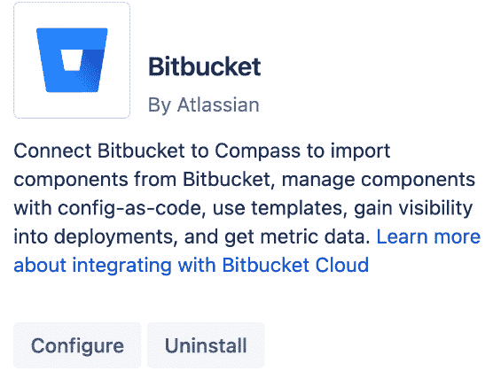
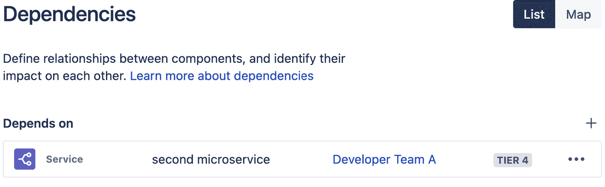
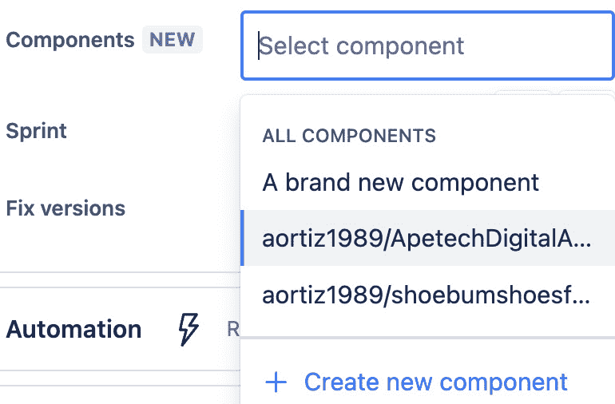
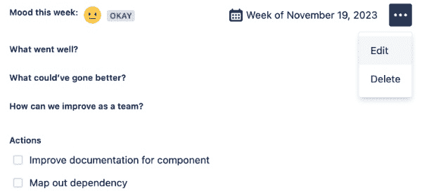

# 11

# 通过 Compass 中的 CheckOps 监控组件活动和指标

**Compass** 使你和你的团队能够理解你的软件如何协同工作。在分布式软件架构（微服务）中，有许多组件共同作用，构建出对客户有价值的东西。追踪这些组件，并理解它们的所有权和如何集成，可能是一项具有挑战性的任务。Compass 让软件团队轻松地对其组件进行目录管理，并能够直观地监控这些组件并提取有用的指标。

首先，我们将设置 Compass，这是一款独立的 Atlassian 产品，能够与其他 Atlassian DevOps 工具集成。一旦 Compass 可用，你将创建组件、管理团队、创建软件组件视图，并创建指标，帮助你的团队理解他们的软件组件如何结合在一起。

本章包含以下食谱：

+   配置 Compass

+   使用 CSV 文件导入分布式架构组件

+   将 Compass 与 Bitbucket Cloud 集成

+   在 Compass 中理解作为代码的配置

+   使用 Compass 创建开发平台

+   使用 Compass 测量 DevOps 健康状况

+   在 Compass 中使用模板

+   在 Compass 中实施开发者 CheckOps

# 技术要求

你将需要以下内容：

+   Jira

+   一个包含你团队组件的 Git 仓库

+   Bitbucket Cloud

# 配置 Compass

Compass 是一个独立的 Atlassian 产品，你需要单独购买。在配置 Compass 之前，你需要确保你的公司已订阅有效的 Compass 产品。

## 准备工作

首先，我们需要通过以下步骤准备好设置：

1.  访问 ([`www.atlassian.com/try/cloud/signup?bundle=compass`](https://www.atlassian.com/try/cloud/signup?bundle=compass))。

    到达后，你需要使用 Google 邮箱、工作邮箱或任何其他邮箱登录，点击**使用邮箱注册**。

提示

如果你曾经使用过任何其他 Atlassian 产品，如 Jira、Confluence 或 Bitbucket，建议你使用与这些产品相同的账户/ID 登录。理想情况下，你应该使用在前几章中一直使用的相同 Atlassian ID。

图 11.1 – Atlassian 登录界面

1.  登录你的 Atlassian ID 后，你将选择想要添加 Compass 的站点。你需要同意 Atlassian Cloud 服务条款和隐私政策。

重要提示

使用本书中的所有示例，你只需要**免费计划**。无需信用卡，如果你有三个或更少的用户，你将不需要为 Compass 付费。你将错过一些仅限付费套餐的功能，但你仍然可以仅使用免费版来跟随本书的内容。

1.  点击**开始使用**以开始配置 Compass。

图 11.2 – Compass 免费计划

几分钟后，Atlassian 的机器人将部署你自己的 Compass 实例，你将能够开始创建你的组件和团队。

## 如何操作……

在 Compass 成为你团队的有用工具之前，你需要为它添加组件。这些组件将跟踪构成你软件堆栈的各种元素。组件可以是库、服务、应用程序、依赖关系，或任何从软件角度来看，产品所需的东西。在本章的结尾部分，我们提供了一份食谱（*使用 Compass 创建开发平台*），讲解了 Jira 和 Compass 如何连接，并在 Jira 中显示 Compass 组件。这一切都由 Atlassian 自动化完成，如果你的组件存在于 Compass 中，它们将自动在 Jira 中显示。

将组件输入到 Compass 中有两种不同的方法。你可以手动创建它们，正如我们在本节中所做的那样，或者你可以导入它们。我们将在下一节讨论导入组件。现在，让我们以手动方式创建一些组件。

按照以下说明配置 Compass 中的组件目录：

1.  在 Compass 顶部的导航栏上，点击 **创建** 按钮。这将为你提供在 Compass 中创建各种不同元素的选项。在这第一步中，我们要选择 **组件**。

图 11.3 – 手动创建新组件

重要提示

创建组件有时是一门艺术。你可以选择 Compass 内置的多种类型。你需要选择最能描述你正在创建的组件的类型。如本节开头所述，组件是你软件构成的一部分。由于软件本身很复杂，它由许多不同的组件组成。在这里，你需要做好充分的准备，捕捉那些恰如其分地描述你软件的组件。

1.  一旦点击 **组件**，你将被提示选择你想要创建的组件类型。根据你的选择，从以下可用选项中选择：

    +   **服务** – 独立可部署的软件单元，通常由个人或团队运营

    +   **库** – 一组可重用的对象、函数和方法

    +   **应用程序** – 完整的应用程序，如移动应用、桌面应用或命令行工具

    +   **能力** – 一个更高级的产品功能，最终用户能够理解并看到其价值

    +   **云资源** – 云服务商提供的实体或服务，具备消费者管理配置和监控功能

    +   **数据管道** – 一系列工具和流程，将数据从源系统传输到目标系统

    +   **机器学习模型** – 一种识别数据集中的模式并对其进行预测的算法

    +   **UI 元素** – 设计系统中的可重用构建块，组合起来创建模式和用户体验

    +   **网站** – 一个或多个网页，位于一个域名下，主要由只读内容组成

    +   **其他** – 描述为*其他*的通用软件组件

    以下截图显示了部分列出的选项：

图 11.4 – 可用的组件类型

重要提示

如你所见，针对软件的各个部分都有选项。选择最能代表你正在捕获的组件的类型。在刚开始时，这可能会有些挑战，因为你可能没有捕获到所有信息。这是一个好问题，因为拥有一个健康的软件产品需要团队对所有软件组件如何结合有 100% 的映射。捕获组件的空白可能会在软件产品的生命周期后期造成盲点，产生不利影响。

1.  一旦选择了组件类型，就该为其命名了。

图 11.5 – 为新组件命名

重要提示

在你有了合适的名称后，就该为组件指定一个所有者了。进行此活动时，最重要的一点是，每个组件都应该有一个人或团队来负责。这个字段不是必填的，但强烈建议填写。让一个团队负责一个组件将使其拥有该组件的所有权。他们将负责全面了解自己的组件。当发现错误时，你会希望知道谁负责该组件。如果一个组件没有指定任何所有者，也没关系，你可以跳过这部分，但强烈建议你开始为组件指定所有者。

1.  选择该组件的**所有者团队**。

图 11.6 – 新组件的所有者

由于这是我们的第一个组件，我们可能还没有团队，因此目前可以跳过这部分。等我们在后续部分创建团队后，可以编辑现有组件并将其分配给适当的团队。或者，你可以跳到*还有更多……*部分并在继续之前创建一个团队。

重要提示

如果你或其他人已经在 Jira 或 Confluence 中创建了团队，这些团队将在 Compass 中显示，并可以在此处选择。

1.  你可以提供的最后一条信息是一个指向代码库的链接。

图 11.7 – 添加组件源代码的信息

提示

这一步是可选的，但建议提供链接，以便充分利用 Compass 的功能。

1.  输入新组件信息后，是时候点击**创建**按钮了：

图 11.8 – 确认创建新组件的按钮

1.  如果您此时希望创建另一个组件，也可以点击**创建另一个组件**复选框。这将保留组件类型和**拥有团队**，但**名称**和**仓库**字段将清空，供您创建下一个组件使用。

    创建了第一个组件后，可以继续添加其余的组件。如果您想查看到目前为止创建的所有组件，只需点击导航栏中的**组件**按钮，您将被重定向到**组件**页面。

图 11.9 – 确认新创建的组件

您已经正式在 Compass 中创建了第一个组件！在下一部分中，我们将创建一个团队。

## 还有更多……

一旦您创建了第一个组件，就需要一个团队来继续首次配置 Compass。在上一部分中，如果您没有现成的团队，可能会跳过为组件添加团队。让我们看看如何在 Compass 中创建您的第一个团队：

1.  在 Compass 顶部的导航栏中，点击**团队**按钮。如果您点击下拉箭头，这将提示您邀请人员加入 Compass 或给您创建团队的选项；您还可以搜索现有的团队。

图 11.10 – Compass 中的团队门户

重要提示

邀请人员加入 Compass 需要许可证。如果您点击该按钮，电子邮件将发送给收件人，但在您的 Atlassian 管理员为该用户授予许可证之前，他们将无法访问 Compass。如果您是 Atlassian 管理员，您将能够授予许可证，但很可能您并不是 Atlassian 管理员，因此此操作直到您的 Atlassian 管理员自行添加用户后才会生效。

1.  假设您的团队成员已经拥有 Compass 许可证，请点击**创建团队**。这将显示一个窗口，您可以在其中创建团队并添加成员。

图 11.11 – 创建新团队

1.  您首先要做的事情是为您的团队命名。这可以是任何您想要的名称，但应该是具有描述性的，能让其他人一眼看出团队名称的含义。

    一旦您有了团队名称，就需要添加人员。您一次最多可以添加 50 人。

1.  接下来，您可以授予其他人加入您的团队的权限，无需您批准。这不是一个好的做法，是否启用此选项完全取决于您。

1.  最后，点击 **创建团队** 按钮，或者如果你不再想创建团队，点击 **取消**。

1.  创建团队后，它将出现在 Compass 的 **团队** 部分。你可以通过点击导航栏上的 **团队** 按钮进入 **团队** 部分。

图 11.12 – 审查新创建的团队

在 **团队** 页面，你还可以邀请成员并创建其他团队。

重要提示

你刚创建的团队不仅仅用于 Compass。这个团队在其他 Atlassian 产品中也可用，例如 Jira 和 Confluence。类似地，如果你或其他人在 Jira 或 Confluence 中创建了团队，那么你也应该能在 Compass 中看到这些团队。

# 使用 CSV 文件导入分布式架构组件

本教程介绍了如何通过 CSV 文件快速导入多个组件。这比手动创建组件要好得多，因为大多数团队需要跟踪的组件数量通常有几十个甚至上百个。

## 准备工作

手动导入每个组件将花费很长时间。幸运的是，你可以通过 CSV 文件导入组件。最少，你的 CSV 文件将需要两列重要信息。

所需数据如下：

| **列名称** | **必需输入** |
| --- | --- |
| **名称** | 你想要的任何名称 |
| **类型** | `SERVICE`、`LIBRARY`、`APPLICATION`、`CAPABILITY`、`CLOUD_RESOURCE`、`DATA_PIPELINE`、`MACHINE_LEARNING_MODEL`、`UI_ELEMENT`、`WEBSITE`、`OTHER` |

表格 11.1 – 必需数据

你还可以在导入时包含许多其他字段/列，但它们不是必需的。

以下是包含可选字段/列名称的列表：

| **生命周期阶段** | `预发布`、`活动中`、`已弃用` |
| --- | --- |
| **层级** | `1`, `2`, `3`, `4` |
| **描述** | 组件的描述 |
| **标签** | 任何有助于对组件进行分类的附加信息 |
| **负责人团队** | 任何你想要的团队，按照下一节的特别指导进行设置 |
| **仓库** | 组件所在的仓库 |
| **聊天频道** | 任何可能涉及该组件的聊天频道信息 |
| **项目** | 引用/使用该组件的 Jira 项目 |
| **文档** | 组件的 Confluence 文档 |
| **仪表盘** | 链接到任何引用该组件的仪表盘 |
| **值班时间表** | 链接到任何负责该组件的团队的值班时间表 |
| **其他链接** | 任何你想要的内容 |
| **自定义字段** | 任何你想要的内容，但必须以 `custom:` 开头 |

表格 11.2 – 可选 CSV 字段/列

CSV 文件最重要的是确保表头行正确。表头行中的每个值应对应前述字段之一。请记住，表头行中的所有值应为小写字母，如下图所示：

图 11.13 – 表头列示例

知道了前置条件后，我们进入实际操作部分。

## 如何操作…

由于我们将把组件分配给一个所有者团队，所以在继续之前我们需要先获取该团队的 ID。我们将按照以下步骤进行操作：

1.  在 Compass 中，点击 **团队** 按钮并选择您想要的团队。

1.  选择团队后，您将被重定向到该团队的页面，您可以点击 **…** 获取所有者 ID。点击 **复制** **所有者 ID**。

图 11.14 – 选择团队以获取所有者 ID

1.  拿到所有者 ID 后，是时候开始填写我们的 `CSV` 文件了。

图 11.15 – 填写包含所有者 ID 的 CSV 文件

1.  在捕获完所有组件后，将文件保存为 CSV 格式。请记住，每个文件最多只能导入 500 个组件。如果组件数量超过 500 个，您将需要将 CSV 文件拆分成多个文件。

图 11.16 – 保存 CSV 文件

1.  在 Compass 中，点击 **创建** 按钮并选择 **导入组件**。

图 11.17 – 导入组件

1.  当下一个窗口出现时，滚动到底部并点击 **导入** 按钮，位于 **CSV** **文件** 选项的右侧。

图 11.18 – 导入 CSV 文件

1.  将您的文件拖动到 **上传** 区域以进行上传。

图 11.19 – 上传 CSV 文件

1.  如果您的 CSV 文件格式不正确，审核将无法通过。在这种情况下，建议您从前一屏幕下载示例 CSV 文件。如果所有检查标记为绿色，那么您可以点击蓝色的**审核**按钮，继续进行下一步。

图 11.20 – CSV 文件验证

1.  **审核** 步骤将分析您的文件并确定将导入多少个组件。点击蓝色的 **创建** 按钮继续。

图 11.21 – 审核组件

1.  Compass 将花费几秒钟时间导入您的组件，导入完成后，您将能够查看新创建的组件。

    点击 **查看组件**，您将能看到所有组件并验证信息是否正确导入。

图 11.22 – 验证 Compass 中的组件

现在你的组件已经全部导入到 Compass，是时候学习如何创建更具动态性的组件了。

# 将 Compass 与 Bitbucket Cloud 集成

使用 Compass 的其中一个优点是它可以与 Bitbucket Cloud 连接。这个连接将允许 Compass 与 Bitbucket 进行通信，并将 Bitbucket 作为组件数据的单一可信来源。你需要有一个现有的 Bitbucket 仓库，用于与 Compass 集成。

## 如何操作…

在 Compass 中，你将通过以下步骤建立 Git 仓库与 Compass 之间的连接：

1.  在 Compass 中，点击导航栏上的**应用程序**。这将打开一个屏幕，显示所有可以与 Compass 集成的应用程序。通过点击**Bitbucket** 磁贴中的**安装**来选择 Bitbucket。

图 11.23 – 选择 Bitbucket 磁贴

1.  安装应该只需要几秒钟。安装完成后，Bitbucket 磁贴现在会允许你配置（或卸载）。点击**配置**按钮。

图 11.24 – 点击“配置”按钮

1.  在配置屏幕上，点击**连接** **到 Bitbucket**。

图 11.25 – 连接到 Bitbucket

1.  当弹出窗口出现时，点击黄色的**继续**按钮。

图 11.26 – Bitbucket 授权

1.  在接下来的屏幕上，选择你要连接的 Bitbucket 工作空间，然后点击**授予访问权限**。

图 11.27 – 授予 Bitbucket 访问 Compass 的权限

1.  一旦你的工作空间已连接，接下来需要选择一个仓库，用于存放你的组件数据。点击蓝色的**选择** **仓库**按钮。

图 11.28 – 选择 Bitbucket 仓库

Compass 将显示你工作空间中可用的仓库，你只需要选择它们。选择仓库中的组件类型，然后点击蓝色的**选择**按钮。

图 11.29 – 选择 Bitbucket 仓库

1.  选择**在导入过程中为所有仓库设置配置文件**的复选框。

图 11.30 – 导入过程中设置配置文件

这将把 `compass.yml` 文件添加到每个仓库中，这对于 Compass 使用 Bitbucket 作为组件元数据的唯一可信来源至关重要。一旦做出选择，您将看到以下屏幕，随后会提示您开始导入过程：

图 11.31 – 开始 Bitbucket 导入过程

1.  点击蓝色的 **开始导入** 按钮，您将收到 **导入完成** 的通知。

1.  当您完成将 Bitbucket 与 Compass 连接时，点击 **完成**。

您已成功将 Bitbucket Cloud 与 Compass 集成。

# 理解 Compass 中的配置即代码

在之前的两个步骤（*配置 Compass* 和 *使用 CSV 文件导入分布式架构组件*）中，您已经了解了如何手动创建和导入组件。这两种方法都需要大量的用户输入，并且容易出错。而且，如果您的仓库中的组件数据发生变化，就需要有人进入 Compass 手动更新组件数据。更好的方法是让代码库中的代码自动更新组件信息。这可以通过利用 **配置即代码**（**CaC**）来实现。

一旦将您的 Bitbucket 仓库与 Compass 连接，您就能够为每个组件使用一个特殊的 YAML 文件。此 YAML 文件存在于您的代码仓库中的每个组件内，最棒的是，它是版本控制的。您无需手动更新 Compass 或通过 CSV 文件更新，只需在代码仓库中管理所有组件数据，Compass 将处理其余部分。

## 如何操作…

在您的代码仓库中，找到 `compass.yml` 文件。您将在此提供组件元数据，这将使该组件成为 Compass 中的一个受管理组件，基本上意味着数据将来自 `.yml` 文件，而非手动来自 Compass。

以下示例将针对在 Bitbucket 仓库中使用 `compass.yml` 文件跟踪的单个组件。每个组件需要自己的 `compass.yml` 文件。确保每个独特组件的 `compass.yml` 文件位于代码仓库中的各自子文件夹内。我们可以按照以下步骤进行操作：

1.  在您的代码仓库中，找到或创建 `compass.yml` 文件。以下是当 Bitbucket 与 Compass 连接时创建的示例 `compass.yml` 文件。如果您还没有完成此连接，请跳至 *将 Compass 与 Bitbucket 集成* *Cloud* 部分。

图 11.32 – compass.yml 示例

重要提示

你仍然需要在 Compass 中创建组件。一旦组件创建完成，你将能够获取该组件的唯一 ID，然后该 ID 将在 `compass.yml` 文件中用于管理组件的元数据。当你将仓库连接到 Compass 时，Bitbucket 会为你创建一个组件，但如果你想追踪/添加多个组件，你需要多个仓库，或者你可以手动在 Compass 中创建组件，然后在多个 `compass.yml` 文件中引用它们，按照需要将它们分布在你的仓库中。

在接下来的部分中，我们将首先分解并解释该文件的内容，然后将其提交到 Bitbucket，之后将数据作为托管组件推送到 Compass。

1.  `id`（必填项）：这是 Compass 用来跟踪你的组件的唯一标识符。通过点击 Compass 中组件目录中的组件并点击 **复制** **组件 ID** 来获取该 ID。

图 11.33 – 获取组件 ID

1.  `name`（必填项）：这将是你的组件名称。应该与你在 Compass 中的名称一致。

1.  `description`（可选项）：这是你组件的描述。如果你想用多行来描述你的组件，你需要以文本 `|-` 开头。

1.  `ownerId`（可选项）：如果你想将组件分配给某个团队，你需要从 Compass 中获取该值，找到应拥有该组件的团队，然后点击 **复制** **所有者 ID**

图 11.34 – 将组件分配给团队

1.  `configVersion`（可选项）：将其保留为 `1`，因为这是你唯一可以提供的值。

1.  `typeID`（必填项）：这需要与可用的组件类型匹配：

    +   `APPLICATION`

    +   `SERVICE`

    +   `CAPABILITY`

    +   `CLOUD_RESOURCE`

    +   `DATA_PIPELINE`

    +   `LIBRARY`

    +   `MACHINE_LEARNING_MODEL`

    +   `OTHER`

    +   `UI_ELEMENT`

    +   `WEBSITE`

其余字段完全可选，如果你想填写它们，你可以阅读 Atlassian 的文档 (*E*)。

1.  一旦你更新了文件，所需要做的就是通过点击 **提交** 按钮在 Bitbucket 中提交你的更改。

图 11.35 – compass.yml 提交示例

你将看到你更改的详细信息。

图 11.36 – 提交示例

1.  接下来，创建一个拉取请求，将你的更改合并回 **master** 或 **develop** 分支。

图 11.37 – compass.yml 拉取请求示例

1.  使用你常规的拉取请求流程批准并合并拉取请求。

    返回到 Compass，对于你管理的组件，你将看到更新后的信息。

图 11.38 – Compass 中的组件确认

1.  最后，如果你在 Compass UI 中创建了组件，并且希望尽量减少创建`compass.yml`文件的工作量，请进入 Compass UI 中的该组件，选择左侧的**Config-as-code**。

图 11.39 – compass.yml 拉取请求示例

你将能够下载`compass.yml`文件，然后可以在你的 Bitbucket 仓库中使用该文件。

图 11.40 – 配置即代码示例

这最终是管理和追踪 Compass 中组件的最佳方式。由于 Compass 组件应该代表你代码中的子系统，因此将这个`.yaml`文件嵌入到你的代码库中是合理的。

现在你的所有组件都已添加到 Compass 中，是时候开始利用 Compass 来确保你的组件是最新的并且处于良好的工作状态了。

# 使用 Compass 创建开发者平台

Compass 旨在帮助你全面了解你的代码是如何相互连接的。利用 Compass 中的所有组件，现在是时候构建一个开发者平台了。这个平台将为你提供一个统一的视图，展示所有的组件、库、服务、应用程序和文档，以及你在 Compass 中追踪的任何内容的健康状况和状态。

## 如何操作…

我们首先要做的是连接相关的组件，并突出显示它们的依赖关系。这些依赖关系将显示一个特定组件所依赖的其他组件。在 Compass 中映射出这些关系对于理解你的软件架构至关重要。了解这些关系使得你的团队能够更好地理解组件如何彼此依赖，从而使你的软件能够正常工作。

让我们通过以下步骤来创建这些依赖关系：

1.  点击 Compass 头部的**组件**，然后选择你要添加依赖关系的组件。

图 11.41 – 从现有组件中选择

1.  在左侧，点击**依赖项**。

图 11.42 – 选定组件详情

1.  在**Depends on**的下拉框/字段中，选择你的选定组件所依赖的组件。

图 11.43 – 选择组件依赖

点击**添加依赖**，你将看到以下屏幕：

图 11.44 – 添加组件依赖

从这里开始，添加尽可能多的依赖关系，以便适当地映射出你的组件如何彼此连接。

重要提示

Compass 允许你以列表或地图视图查看你的依赖关系。这将帮助你可视化组件之间可能存在的循环依赖关系。另外，请记住，Compass 允许一个组件最多有 25 个依赖项。最多 100 个其他组件可以依赖于一个组件。

## 还有更多…

Compass 内建的功能允许你为 Compass 目录中的任何组件发布公告。这非常有用，因为团队可以及时了解与他们关心的组件相关的最新情况。

Compass 包含一个功能，让你为 Compass 目录中的任何组件创建公告。这对于保持团队了解重要组件更新非常有用。

要与团队分享有关特定组件的相关信息，请按照以下步骤在 Compass 中创建公告：

1.  选择一个组件，然后点击**公告**。

图 11.45 – 创建公告选择

1.  点击**创建公告**。

图 11.46 – 创建公告

1.  为你的公告提供一个名称和目标日期。可选地，你还可以提供一个描述。然后，点击**创建**。

图 11.47 – 公告创建示例

你的公告现在可以在该组件中查看。任何依赖于该组件的组件也将能够看到公告。此外，团队成员会收到电子邮件通知，并在 Compass 用户界面中看到通知徽章，提示有新的公告可用。

图 11.48 – 公告审核示例

## 另请参阅

这个方案有一些额外的元素，你应该考虑。

### 监控组件活动

**活动**页面将展示组件的当前状态。在活动页面中，你可以看到与选定组件相关的部署、事件、标记以及任何警报。这个视图会让你实时了解组件的状态。如果组件之间通过依赖关系相连接，你也可以看到这些信息。

图 11.49 – 组件活动监控

### 与 Jira 连接

Jira 也可以与 Compass 连接，你可以在 Jira 中可视化 Compass 的数据，反之亦然。曾经有两种不同的方式将 Compass 组件与 Jira 连接。其中一种是在 2022 年推出的。希望将 Compass 与 Jira 集成的用户需要在 Jira 中启用一个自定义字段，该字段会从 Compass 中提取组件。该字段和方法在 2024 年 5 月 31 日被弃用。因此，以下步骤是确保你的 Compass 组件可以在 Jira 中使用的最佳方法：

1.  转到你的 Jira 项目并点击**组件**（请注意，这只适用于公司管理的项目）。

图 11.50 – 从公司管理的 Jira 项目中选择组件

1.  进入**组件**部分后，你将看到 Jira 已自动与 Compass 连接。点击**转到问题**。

图 11.51 – Jira 和 Compass 连接时的组件菜单

1.  选择任意一个问题并点击**组件**字段。

图 11.52 – Jira 中的组件字段

1.  在下拉框/字段中，你现在将看到存在于 Compass 中的组件。

图 11.53 – Jira 中的 Compass 组件

将 Jira 与 Compass 连接可以让你的团队更加高效，最棒的是你无需重复输入数据。你无需在 Jira 中重新创建所有组件，而是可以在 Jira 中利用相同的 Compass 组件。如果使用仅限 Jira 的组件，你需要在 Compass 中重新创建这些组件。这将确保 Jira 拥有从 Compass 中提取的最新和最准确的组件。

# 使用 Compass 衡量 DevOps 健康状况

将组件与 Compass 连接并绘制其依赖关系是很棒的，但即使这样做了，也无法完全了解你组件的健康状况和状态。使用 Compass，你可以创建评分卡来帮助可视化组件的健康状况。

## 如何操作…

Compass 自带了一些评分卡。这些评分卡可能正是你所需要的，但如果你需要额外的评分卡，创建它们非常简单。按照以下步骤即可：

1.  在 Compass 中的导航栏中，点击**健康**。

图 11.54 – 健康按钮以进入评分卡

到达后，你将能够看到现有的评分卡。

图 11.55 – Compass 评分卡

1.  点击右上角的**创建评分卡**。

图 11.56 – Compass 菜单选项以创建评分卡

这将显示一个弹窗，允许你创建评分卡。

图 11.57 – 创建评分卡的弹窗

提供名称、描述和所有者，然后选择组件类型及评分卡的应用方式。点击**下一步**继续。

1.  在下一屏幕中，你将从组件中选择元数据，以帮助你构建标准，让团队评估组件的健康状况。

图 11.58 – 选择要在评分卡中显示的度量标准

1.  在构建评分卡时，你可以选择**标准类型**。你可以选择**字段**或**度量标准**。

图 11.59 – 选择你的标准类型

之后，你可以选择将用作标准的**字段**或**度量标准**。

1.  最后，你为标准选择权重。

提示

对于你要为评分卡创建的所有标准，重复步骤 4 和 5。所有标准的权重总和必须为 100%。完成后，评分卡将如下所示：

图 11.60 – 在创建评分卡前完成标准设置

1.  完成后点击**创建**。

    在你的组件中，你将能够看到评分卡已根据你配置的方式应用到该组件上。

图 11.61 – Compass 中的评分卡值

尝试所有可用的不同标准。构建这些评分卡是 Compass 与其他 Atlassian 产品的区别所在。当你的团队在代码中使用这些组件时，评分卡会跟踪关键度量，帮助你们了解代码的健康状况和状态。

# 在 Compass 中使用模板

**模板**在 Compass 中允许你创建代码模板，帮助简化软件开发流程。这些模板成为 Compass 中的组件，可以在整个软件堆栈中根据需要重复使用。如果你的团队经常需要创建相似的代码或配置，模板能帮助团队提高效率。通过使用模板，你团队的代码质量也能得到提升，因为你总是有一个坚实的基础来开始工作。这些你将学习如何创建的模板不必是组件；它们可以是团队经常依赖的任何有用代码片段。

## 如何操作…

使用模板的第一步是将 Compass 与 Bitbucket 连接。如果你尚未将 Bitbucket 与 Compass 连接，请参考*将 Compass 与 Bitbucket Cloud 集成*的步骤。

一旦你的仓库与 Compass 连接，接下来就是创建你的第一个模板。让我们按照以下步骤进行：

1.  在 Compass 的导航栏中，点击**模板**。

图 11.62 – Compass 中的模板

假设这是你第一次创建模板，你应该会看到一个蓝色按钮，提示你创建第一个模板。点击它。

图 11.63 – 在 Compass 中创建模板

1.  填写信息，这与手动创建新组件时的步骤完全相同。

图 11.64 – 模板创建信息

唯一的主要区别是，在创建模板时，你需要提供一个仓库的链接。这个仓库可以是你源代码仓库中的任何仓库，但它需要与 Compass 连接，这在最终的配方中进行配置。当你创建模板时，你的基础仓库将被分叉：

图 11.65 – 选择所有者和仓库链接

填写所有信息后，点击蓝色的**下一步**按钮。

图 11.66 – 完成模板创建信息

1.  可选地，你可以提供一个 Webhook。

图 11.67 – 添加可选的 Webhook 和参数

1.  审核你的新模板并点击**创建**。

图 11.68 – 审核模板信息

你新创建的模板现在将在你的组件目录中可用。

# 在 Compass 中实施开发者 CheckOps

**CheckOps** 是团队为评估其软件系统组件的健康状况和状态所执行的活动。建议至少每周进行一次 CheckOps，但具体频率由各个团队自行决定。至少，在每次软件开发冲刺结束时，应进行一次 CheckOps。通过 CheckOps，团队可以审查评分卡及其负责组件的整体健康状况。如果某个组件出现故障，团队可以通过每周的 CheckOps，找出解决方案，修复故障并使组件恢复到健康的评分卡状态。

定期进行 CheckOps 是个好主意，因为它使团队能够持续监控他们负责的组件的性能。很多时候，团队会将组件添加到 Compass 中，但却没有跟进组件的健康状况和状态。如果让组件滞后或服务/可靠性下降，可能会导致软件出现严重问题。每周进行 CheckOps 使团队能够持续审查关键指标，并根据需要进行调整，而不是等到软件发生灾难性故障时才进行处理。早期并经常处理组件问题，使得软件质量更高，下游问题更少。

执行每周的 CheckOps 非常简单直接。所有操作都在 Compass 应用程序中处理，每个团队可以根据分配给他们的组件进行自己的 CheckOps。如果组件没有分配给团队，建议检查组件目录，并为每个组件分配合适的团队。

接下来，我们将带你了解为进行第一次 CheckOps 准备的步骤。

## 如何操作…

请按照以下说明正确配置 Compass，以便你的团队能够进行每周的 CheckOps：

1.  在 Compass 导航栏中，进入**团队**部分：

图 11.69 – 从 Compass 导航中选择团队

1.  通过点击可用团队中的一个团队来选择你的团队。

图 11.70 – 从可用团队列表中选择一个团队

1.  选择你的团队后，在左侧导航中选择**CheckOps**。

图 11.71 – 选择团队后进行 CheckOps 的步骤

1.  由于这是你的第一次 CheckOps，你将能够点击蓝色的**开始 CheckOps**按钮。

图 11.72 – 在 Compass 中启动 CheckOps 的仪表板

1.  这将把你重定向到**健康详情**，你将在这里进行每周的 CheckOps，接下来的小节会介绍如何操作。

在你进行第一次 CheckOps 之前，有一些事情需要你考虑：

+   全面了解你的组件如何影响并受软件架构中其他元素的影响。

+   记录你在第一次进行 CheckOps 之前可能遇到的任何事件或异常。在准备每周进行 CheckOps 时，你需要每周记录这些内容。

+   理解你们组件的服务级目标。你的利益相关者对你们特定组件的期望是什么？你需要每周检查这些，以确保你的组件符合期望。

+   为你的团队确定一个每周的节奏。每周同一时间，你们团队应该聚在一起进行每周的 CheckOps。这应该类似于任何的迭代规划、每日站会、迭代回顾等。

现在，你已经选择了团队并启动了 CheckOps，是时候学习如何进行每周的 CheckOps 会议了。

## 还有更多内容……

还有很多内容需要涵盖，这一部分将详细说明你应该如何处理每周的 CheckOps 会议。

重要提示

当你们团队准备每周的 CheckOps 会议时，特别需要关注那些评分卡显示需要关注的组件。一旦获得了这些信息，并且你们已经进行了一些分析/调查，找出了根本原因，就可以进行每周的 CheckOps 了。

请按照以下步骤操作：

1.  在**健康详情**页面中，你需要专注于 Compass UI 中最右侧窗格的**CheckOps**部分。

图 11.73 – Compass 中的 CheckOps UI

1.  从**情绪**开始，讨论一下你们团队这一周的感觉如何？这应该是针对其组件的运营方面。组件是否按预期运行，还是自上次 CheckOps 以来遇到了多个问题？

    团队可以从可选的情绪中进行选择，包括以下几种：

    +   **惊人**

    +   **好**

    +   **好的**

    +   **糟糕**

    +   **糟糕透了**

图 11.74 – 团队情绪选择

1.  接下来，你们团队将一起填写三个不同的反思部分。这些反思问题与传统的迭代回顾非常相似。我们来讨论一下你们团队应该为每个部分提供什么样的信息。你将看到以下标签：

    1.  **做得好的方面是什么？**

        讨论一下上周你们的组件表现得特别好的方面。有时，这可能会让你觉得有些自夸，但记录下你们团队的胜利是非常重要的。这有助于建立声誉，并为团队提供所需的积极反馈，以保持正确的方向。突出表现特别好的组件。讨论所有顺利进行的积极事情，以及由于这些事情的顺利进行，团队或客户获得了什么。

图 11.75 – 做得好的问题

1.  **有什么可以改进的地方？**

    总是有改进的空间。在这个反思问题中，你的团队应着重识别那些可能做得不错但仍有改进空间的事项。更常见的情况是，你应捕捉团队遇到的小问题和挫折，尽管它们能迅速被修复或解决。这是一个发现组件中的困扰并想办法消除它们的好机会。没有任何想法是坏的，团队应该被鼓励提出改进意见。这通常需要团队之间有高度的信任和健康的团队环境，大家可以自由讨论意见。

图 11.76 – 什么可以做得更好？问题

1.  **我们如何改进？**

    最后的反思问题使你的团队能够真正思考如何改进。这类似于之前的反思问题，但这次要思考需要改进的任何方面。这些改进不必是技术性的，团队可能需要改进文档或依赖关系。你的团队应具有前瞻性，识别能更好支持组件的机会，同时寻找提高其负责组件质量的方法。

图 11.77 – 我们如何改进？问题

1.  每周 CheckOps 过程的最后一步是捕捉团队在接下来一到两周内需要采取的行动项目。这些行动项目应每周进行回顾，以确保团队正在积极推动这些项目的完成。在 CheckOps 过程中，团队应捕捉尽可能多的行动项目。与 Confluence 不同，在 Confluence 中你可以将行动项目分配给个人，而在这里，团队必须更加勤奋和负责，确保这些项目能够顺利完成。你也不能像在 Confluence 中那样为这些行动项目设置到期日期，这些行动项目也没有与 Jira 连接。

图 11.78 – 执行 CheckOps 后的行动项目

1.  完成所有信息捕捉后，你可以点击**完成**按钮。

1.  完成 CheckOps 后，你始终可以在团队的 CheckOps 仪表板中查看当前及之前的 CheckOps。你可以通过点击 Compass 中团队资料左侧导航栏的**CheckOps**来访问此页面。

图 11.79 – 审查之前的团队 CheckOps

1.  在此，你可以点击 CheckOps 日期旁的省略号来编辑你的 CheckOps。

图 11.80 – 编辑以前的 CheckOps

1.  你也可以在此视图中关闭你的行动项目。

图 11.81 – 完成先前的行动项

1.  最后，在你团队的概览页面上，任何在 CheckOps 会议中记录的未完成的行动项都会被展示，提醒你的团队，并希望能够激励他们去处理这些待办事项。

图 11.82 – CheckOps 一目了然的行动回顾

现在你已经知道如何进行每周的 CheckOps，在接下来的部分，我们将讨论一些最佳实践，确保你和你的团队能够充分利用每次 CheckOps 会议。

## 另见

执行每周 CheckOps 会议其实是一件简单的事，但有一些建议能够帮助提升每周 CheckOps 的有效性。这些就是*CheckOps 最佳实践*。遵循这些建议，你可以帮助团队最大化每周 CheckOps 给团队和公司带来的价值。

### 一致性

不要跳过每周的 CheckOps。有时候你的团队可能没有很多时间，或者有时评分卡上全是绿色。即使一切顺利，也要养成每周在相同时间进行 CheckOps 的习惯。如果有假期，确保安排在假期之前或之后进行。养成定期举行 CheckOps 会议的习惯，将确保你的团队把它视为高优先级任务。这样，遇到问题时，团队就能迅速调动肌肉记忆，知道如何进行 CheckOps 会议，而不是浪费时间琢磨会议流程，能够专注于解决关键问题。

### 评分卡

持续审查你的评分卡以及评分卡中的指标。评分卡是影响每周 CheckOps 讨论项目的关键指标之一。如果评分卡总是显示正面结果，但实际上软件层面有问题，那么就需要审查那些影响评分卡的项目。确保它们准确无误，并能够适当反映软件层面的情况。根据实际情况调整评分卡中的指标，确保你的组件健康状况能够反映最准确的数据。这将帮助你拥有最佳的每周 CheckOps，因为你将有最准确、最相关的数据来推动讨论、决策和任何需要采取的行动。

### 跟进

最终的建议是确保你的团队始终能够落实你的行动。如果忽视问题，技术债务会迅速积累。你不必立刻采取行动，但在每周的 CheckOps 会议中记录下来的每一个行动都应该在下次 CheckOps 会议前解决。未能采取行动只会导致糟糕的指标随着时间的推移变得更糟。执行并采取行动的一个额外好处是，团队会观察到这些行动正在得到解决。这将鼓励他们识别更多的低效和问题，并希望这些问题也能得到解决。
