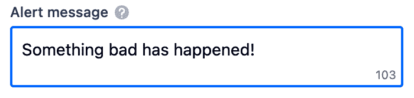
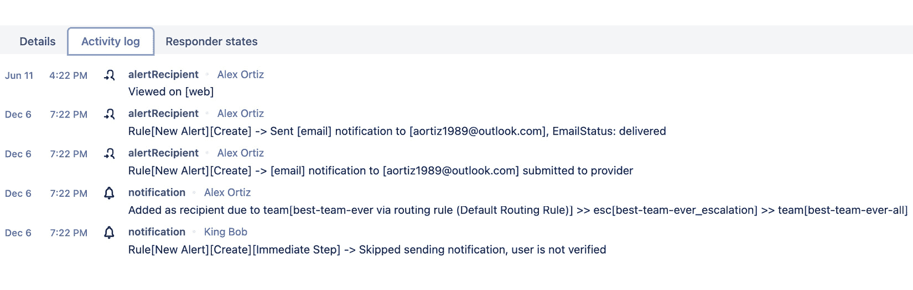

# 12

# 使用 Opsgenie 警报进行升级

作为 Atlassian Open DevOps 套件的一部分，您还可以访问 Opsgenie。Opsgenie 是一款独立的产品，允许团队管理警报、事件和事件升级。它通常由使用 **Jira Service Management** 的代理使用，但它也适用于需要参与解决生产问题的软件团队。软件团队可以利用 Opsgenie 的强大功能，管理对已部署到生产环境中的系统发生的警报和事件。

当我们查看整个 DevOps 生命周期时，Opsgenie 促进了监控活动。一旦您的产品和服务在生产环境中部署，监控和响应事件是反馈环路中的关键部分。本章将探讨如何配置 Opsgenie 并将其与 Jira 集成。

本章包含以下内容：

+   设置 Opsgenie 团队

+   将 Opsgenie 与 Jira 配置

+   设置值班计划

+   配置升级政策和规则

+   升级和通知配置

+   通过 ChatOps 改善团队沟通和响应

# 技术要求

您将需要以下软件：

+   Jira

+   Opsgenie

+   Compass

# 设置 Opsgenie 团队

在这个步骤中，我们将配置您的团队，使得 Opsgenie 在事件发生时可以发送适当的通知。如果您已经在 Jira、Confluence 或 Compass 中创建了团队，您需要在 Opsgenie 中重新创建您的团队，因为截至目前，Opsgenie 中的团队与其他工具中的团队设置无法互通。如果您希望团队名称和成员相同，您需要在 Opsgenie 中精确地重新创建该团队。否则，您可以选择在 Opsgenie 中创建一个全新的团队。

## 如何操作

以下步骤将指导您如何在 Opsgenie 中创建团队：

1.  在 Opsgenie 中，点击导航栏中的 **团队**。

图 12.1 – 在 Opsgenie 中选择团队

1.  点击 **添加团队**。

图 12.2 – 添加新团队

1.  提供您的团队名称和描述，如果您有成员信息，请将成员的姓名也添加进去。添加完成员后，点击 **添加团队** 完成新团队的创建。

图 12.3 – 新团队详情

重要提示

如果您的团队成员未显示，则需要前往 Opsgenie 的设置页面，在导航栏中添加用户。如前所述，Opsgenie 独立于其他 Atlassian 工具，用户也是独立管理的。

1.  如果您尚未将团队成员添加到 Opsgenie，可以通过点击左侧面板中的 **成员**，然后在 **成员** 页面顶部点击 **添加成员** 来添加成员。

图 12.4 – Opsgenie 设置以添加新成员

将任何缺失的团队成员添加到你的 Opsgenie 团队，并分配适当的角色（**用户**或**管理员**）。添加完成员后，点击**添加**。

图 12.5 – 将成员添加到团队并分配适当角色

现在你的团队已经在 Opsgenie 中完成了入驻。接下来是创建团队的值班时间表，这将在下一个部分中介绍。

# 使用 Jira 设置 Opsgenie

Opsgenie 是一个独立的 Atlassian 产品，通常与 Jira 服务管理一起捆绑，或在使用 Atlassian 的 Open DevOps 包时提供。当你注册这两项服务中的任意一项时，Opsgenie 会被启用，但直接进入 Opsgenie 产品并不容易。对于本章节，我们将重点讲解如何通过 Jira 使用 Opsgenie。由于 Open DevOps 不包括 Jira 服务管理，因此本章节不会讨论 Jira 服务管理，但欢迎你探索 Jira 服务管理的功能，它是一个非常适合 IT 服务管理团队使用的优秀产品。

## 如何操作

在 Jira 中，选择你的团队用于跟踪开发任务的 Jira 项目。进入该项目后，你首先需要启用并连接 Opsgenie。你需要按照以下步骤操作：

1.  选择你希望与 Opsgenie 集成的 Jira 项目，然后进入**项目设置**并选择**工具链**。

图 12.6 – 从 Jira 项目中选择工具链

1.  在**工具链**窗口中，点击**添加**。从下拉菜单中选择**添加** **值班团队**。

图 12.7 – 从工具链中添加新的值班团队

1.  选择**Opsgenie**并点击**添加** **到项目**。

图 12.8 – 选择 Opsgenie 作为值班团队提供者

1.  创建或搜索一个团队。

图 12.9 – 添加一个值班团队

1.  输入你的团队名称并点击绿色圆圈以创建团队。

图 12.10 – 选择要添加的团队

1.  点击**添加** **团队**按钮。

图 12.11 – 添加一个值班团队

1.  返回到你的 Jira **项目设置**，点击**功能**。

图 12.12 – 从 Jira 项目中选择功能

1.  在**操作**下，找到**值班**部分，并确保滑块是绿色的。

图 12.13 – 从 Jira 项目功能中启用值班

现在，您应该能够访问您的值班安排，并且可以从您的主要 Jira 项目中跳转到 Opsgenie。在您的 Jira 项目中，您将看到一个**值班**部分和一个写着**在 Opsgenie 中查看**的链接。

图 12.14 – 从 Jira 项目中查看值班视图

现在，Opsgenie 已与 Jira 连接，您的团队已准备好开始在 Jira 中管理警报并查看值班安排。

# 设置值班安排

一旦您的团队创建完成，并且团队成员已被添加，就可以添加**值班安排**了。值班安排可以让您的团队分担责任，确保您的组件和软件始终有覆盖。如果生产环境出现问题，值班安排将根据事件发生的时间和分配到该时间段的团队成员，知道通知谁。

## 如何操作

Opsgenie 中的值班安排让您的团队保持组织性，并分配管理和确保关键组件正常运行的责任。以下步骤将向您展示如何配置团队的值班安排：

1.  在 Opsgenie 中，点击导航栏中的**团队**，然后点击您想为其创建值班安排的团队。

图 12.15 – 选择 Opsgenie 团队

1.  一旦进入团队仪表板，点击**值班**按钮。此时，您将看到几个不同的选项。现在，向下滚动，找到**值班**部分。

图 12.16 – 团队值班安排

重要提示

**轮班**决定了在特定时间段内，您的团队中谁将值班。应该已经可以看到一个现有的轮班。我们将编辑这个现有的轮班。您还可以选择创建额外的轮班。添加新轮班可能会使事情变得复杂，因此建议在您的团队熟悉值班时，保持单一轮班。大多数软件团队不习惯值班，所以这可能会有一些学习曲线。尽量在团队开始时保持轮班简单。随着您的团队变得更加熟练和适应轮班，Opsgenie 将能够随您的团队一起扩展和成长。作为最佳实践，建议将至少一周的完整时间分配给每个团队成员作为其轮班的一部分。

1.  点击**轮班**标题下的铅笔图标按钮，编辑现有的轮班。

图 12.17 – 编辑现有值班轮班

1.  首先，将轮班名称更改为更符合您和您的团队需求的名称。

图 12.18 – 编辑轮班名称

1.  在此，点击**参与者**，会出现一个搜索框。在这里，输入团队成员的名字，将他们添加为该轮班的参与者。

图 12.19 – 将团队成员添加为参与者

1.  接下来，设置您的**轮班类型**选项。如前所述，建议您设置每周轮班。您可以选择**每日**、**每周**或**自定义**轮班。

图 12.20 – 选择轮班类型

1.  之后，您将设置轮班的开始日期。您还可以选择设置轮班结束时间。大多数团队的轮班会是长期的，几乎没有结束日期。

图 12.21 – 选择轮班开始日期

1.  填写完所有信息后，Opsgenie 将创建您的值班计划：

图 12.22 – 更新后的轮班值班计划

点击**添加**按钮，您的值班计划将被设置。

重要提示

在这一点上，您可以为周末、节假日以及预定的休假日设置额外的值班计划。无论您的团队需要什么，Opsgenie 都足够灵活，您可以将团队的计划输入到 Opsgenie 中，以确保下一步的升级策略和路由规则能够有效工作。

您的值班计划现已创建。每当轮到某人值班时，他们会收到 Opsgenie 的通知，开始轮班。

# 配置升级策略和规则

一旦您的值班计划配置完成，就该配置升级策略和路由规则了。Opsgenie 使用来自上一步的**升级策略**、**路由规则**和**值班计划**来确定在发生事件时，谁会收到通知。

重要提示

正确配置升级策略和路由规则非常重要，否则您可能会把警报发送给错误的团队。您配置的升级策略将决定发生警报时哪些用户会收到通知。最重要的是，升级策略决定了用户接收到通知的顺序和时间，依据警报创建后的时间间隔。如果您的团队没有回复，链条中的下一个人会收到通知，直到有人采取行动解决警报/事件。路由策略将决定警报发生时通知如何传递。您有一些不同的选项，接下来的步骤将详细探讨这些选项。

## 如何操作

默认情况下，您应该已经在 Opsgenie 中创建了一个升级策略。与创建值班计划类似，您可以选择修改现有的升级策略，或者添加额外的升级策略。

升级策略决定了当出现问题时，Opsgenie 中谁会收到警报通知。让我们配置你的第一个升级策略：

1.  从 Opsgenie 中选择你的团队。

图 12.23 – 选择的团队来配置升级策略

1.  首先，将鼠标悬停在现有的升级策略上，你将看到**编辑**按钮显示出来。

图 12.24 – 编辑现有升级策略

点击**编辑**按钮将弹出一个菜单，允许你配置升级策略。

图 12.25 – 可以配置的升级策略

1.  第一个需要更改的项是`升级`。可以随意更改为你想要的内容。

图 12.26 – 更新后的升级名称

1.  接下来，你可以选择性地提供一个**描述**文本，帮助你的团队更好地理解这个特定升级策略的目的。

图 12.27 – 更新后的升级描述

1.  最后，你可以修改现有规则或添加额外规则。

图 12.28 – 更新后的升级规则

重要提示

默认情况下，一旦创建警报并且未立即确认，升级策略将立即通知你的值班人员。然后，如果在 10 分钟内，值班人员未确认该警报，将向团队中的所有成员发送通知。包括所有当前不在值班轮换中的成员。

1.  如果你需要进一步升级，可以添加额外的规则。

图 12.29 – 额外的升级规则

1.  在添加额外规则时，首先需要确定当警报未被确认或未关闭时，升级策略是否会进行升级。

图 12.30 – 确定规则何时触发

1.  一旦做出决定，接下来选择警报创建后能经过多少时间。

图 12.31 – 确定触发警报后应等待多长时间

1.  接下来，选择谁将接收到升级通知。你有很多选择，只要记住，随着时间的推移，你需要将警报的可见性提高到适当的人员，以便他们能够采取行动解决警报。

图 12.32 – 选择谁应收到警报通知

1.  最后，选择一个特定的团队或用户来接收通知。可用的团队将由前一个步骤决定。

图 12.33 – 选择接收警报的团队

1.  完成升级规则设置后，点击**保存**。

图 12.34 – 保存升级规则

## 还有更多内容

既然升级策略已经存在，现在是时候处理路由规则了。

### 路由规则

与升级策略类似，每个团队应该都有一个默认的路由规则。路由规则非常简单，你可以修改现有的路由规则，或者完全添加一个新的路由规则。以下是步骤：

1.  返回到 Opsgenie，在**值班**部分，我们将修改默认的路由规则。

图 12.35 – 路由规则配置

重要说明

设置路由规则时，你有三个主要选择。你可以选择不路由警报、将其路由到升级策略，或者直接将其路由到你的值班团队。

1.  点击现有的路由规则，然后你将能够选择要将警报路由到哪种类型的路径。以下截图展示了可用的选项。

图 12.36 – 选择升级路由规则

1.  或者，如果你不想使用 Opsgenie 提供的默认规则，你可以创建一个新的路由规则。与创建升级规则相比，创建路由规则时会有更多选择。以下步骤将说明如何配置路由规则：

    1.  要开始，点击右上角的**添加路由规则**。

图 12.37 – 添加新路由规则

1.  点击**添加路由规则**按钮后，系统会提示你为路由规则提供一个名称。

图 12.38 – 为路由规则提供名称

1.  接下来，你需要选择路由规则何时生效。你可以选择**匹配所有警报**，这意味着对于任何警报，路由规则都会生效（默认设置）。另外，你还可以根据警报的条件来触发路由规则。

图 12.39 – 选择触发路由规则的条件

1.  你可以根据警报的优先级或与警报相关的标签创建条件。最重要的一点是，你可以让路由规则在接收到特定优先级的警报时生效。

图 12.40 – 确定路由规则的条件

1.  一旦设置好条件，最后一步就是确定由自动化规则触发的操作。

图 12.41 – 确定路由规则将采取的操作

1.  一旦选择路由，只需点击**Add**按钮完成创建新的路由规则。

图 12.42 – 添加新的路由规则

现在你的升级和路由规则已经配置好，是时候管理从 Opsgenie 发送的通知了。

# 升级和通知配置

当生产环境中发生事故时，可以在 Opsgenie 中发出警报。你可以通过在 Opsgenie 中直接创建警报来完成这一操作。当 Opsgenie 与 Jira 服务管理捆绑在一起时，可以从支持请求中创建警报。然而，由于 Jira 服务管理不是开放 DevOps 套件的一部分，必须在 Opsgenie 中手动创建警报。

## 如何操作

让我们按照以下步骤创建警报：

1.  要创建警报，请在 Opsgenie 导航栏中点击**Alerts**。

图 12.43 – 从 Opsgenie 菜单中选择 Alerts

1.  一旦进入**Alerts**部分，请点击**Create** **alert**按钮。

图 12.44 – 在 Opsgenie 中创建警报

1.  填写警报的信息。

图 12.45 – 警报创建信息

1.  选择要用于此警报的 API 集成。对于初学者，建议使用**Default API**，如果你使用的是 Opsgenie 的免费版本，则只有这个选项可用。

图 12.46 – 警报 API 选择

1.  输入应发送的**Alert message**。此框有 130 字符限制。

图 12.47 – 警报消息

1.  选择警报的优先级。根据你创建的升级规则，此警报将影响/触发该升级规则。

图 12.48 – 警报优先级

1.  如果你知道警报响应者是谁，请填写。否则，路由规则将根据你在路由规则配置中配置的值确定应通知谁。

图 12.49 – 警报响应者

1.  如果你的路由规则配置为利用标签而不是优先级，你可以利用**Tags**。

图 12.50 – 警报响应者

1.  最后，点击**Create**创建警报。

图 12.51 – 完整的警报示例

警报现在将显示在**警报**部分。

图 12.52 – 可用警报的视图

重要提示

根据你的路由规则和升级策略，每个警报都会触发适当的通知，确保你的团队能够对触发警报的问题进行处理和修复。

一旦警报被确认，通知将停止发送。这意味着你的团队已经解决了问题，或者已经确定发生了事故，并且该警报需要升级为一个事件。

如果你点击警报，你将能够查看所有与该警报相关的自动发送的通知。

图 12.53 – 警报历史

警报对于确保你的团队能够及时了解关键事件并知道何时需要介入修复问题至关重要。随着你的生态系统变化，确保不断优化警报设置，确保在问题刚发生时你的团队能够得到适当的通知。

# 通过 ChatOps 改善团队沟通和响应

当问题出现时，你的团队需要迅速沟通。在数字时代，依赖电子邮件已经无法满足需求，尤其是在每一秒都至关重要的时候。团队之间的即时沟通是最有效的方式。如今，大多数团队已经在使用像 Slack 和 Microsoft Teams 这样的流行通信工具。Opsgenie 与这两个工具都可以集成，从而让你的团队在警报或事件发生时迅速进行沟通。

虽然 Opsgenie 可以与多种即时消息工具进行集成，但此篇将重点介绍如何将 Opsgenie 与 Slack 集成。与 Slack 集成不仅可以让你的团队更快地沟通，还能让你的团队通过 Slack 界面获取警报信息、值班安排等更多内容。

## 如何操作

将 Opsgenie 与 Slack 集成非常简单。以下步骤将指导你完成配置此集成所需了解的一切：

1.  要启动与 Slack 的集成，请首先进入 Opsgenie 中的**团队**部分，然后选择你的团队。

图 12.54 – Opsgenie 中可用的团队

1.  进入团队仪表板后，点击左侧的**集成**。

图 12.55 – 为你的选择的团队选择集成

重要提示

请注意，如果你使用的是 Opsgenie 的免费版本，集成 Slack 的唯一方式就是此方法。虽然通过 Opsgenie 的设置页面还有另一种集成方法，但该方法仅适用于付费使用 Opsgenie 的团队。

1.  点击**添加集成**以开始。

图 12.56 – 选择“添加集成”以开始

1.  选择**Slack**。

图 12.57 – 可用的 Opsgenie 集成

1.  按照显示的说明操作。在继续之前，你需要准备一个 Slack 频道。

图 12.58 – Slack 与 Opsgenie 集成说明

1.  在 Slack 中选择频道后，确认你希望在 Opsgenie 中启用的设置。选定满意的选项后，点击**保存集成**。

图 12.59 – 选择 Slack 集成的配置

1.  配置完集成后，你可以通过进入 Slack 并输入`/genie`命令来测试配置。

图 12.60 – Slack 和 Opsgenie 在 Slack UI 中的集成

1.  最后，创建一个示例警报，你会看到警报出现在 Slack 中。在 Slack 中，你现在可以处理警报，而无需打断你的工作流程或团队沟通。

图 12.61 – Slack 中的 Opsgenie 警报

现在，Slack 已与 Opsgenie 集成，团队可以在 Slack 中接收 Opsgenie 的通知，这非常有帮助，因为团队不需要切换工具。

# 第四部分：实践应用

我们将把书中学到的所有知识应用到实践中。我们通过一个示例项目来操作，首先在 Jira Product Discovery 中从一个想法开始，创建 Jira 问题，并在 Bitbucket 中创建开发分支。

然后，我们进行一次提交，查看从测试到部署的管道执行。在此执行过程中，我们可以在 Bitbucket 和 Compass 中查看结果。

我们以展望未来作为结束，人工智能已经在改变许多事情。我们分享一些最后的想法，祝你好运。

本部分包含以下章节：

+   *第十三章**，* *通过一个真实世界的示例将一切整合起来*

+   *第十四章**，附录 关键要点与 Atlassian DevOps 工具的未来*
