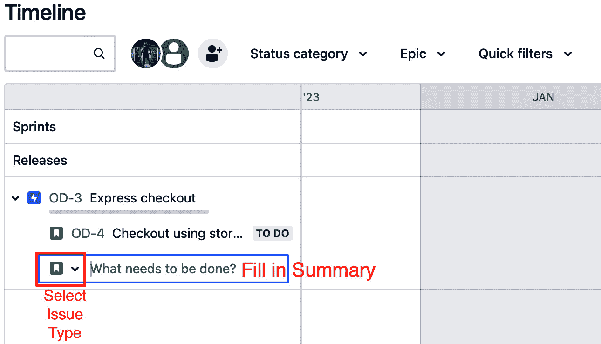
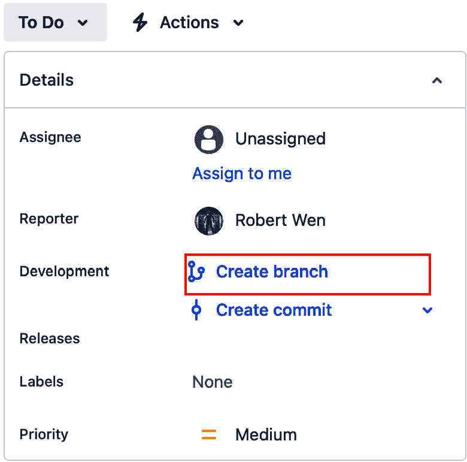

# 13

# 用一个真实的例子将一切整合在一起

让我们将之前章节中学到的知识运用到实践中，从头到尾完成这个过程。

假设你是**DevOps 产品公司**（**DPI**）的员工。你负责使用工具链，通过 Atlassian 产品和第三方产品优化旗舰产品 DPI-Sync 的开发，该产品连接到 Discord 服务器并发送消息。你将如何开始？

为了实现这一点，我们将通过完成以下教程来模拟这一过程：

+   在**Jira 产品发现**（**JPD**）中创建一个想法

+   将一个想法连接到 Jira 中的史诗

+   在 Jira 中创建一个故事

+   在 Bitbucket 中创建代码更改

+   在 Bitbucket 中提交更改/启动 Bitbucket Pipeline 构建

+   通过 Bitbucket Pipelines 执行 Snyk 扫描

+   在 Compass 中显示 Bitbucket Pipelines 构建状态

+   部署 Bitbucket Pipelines

+   为 Jira 项目创建 Opsgenie 警报

+   创建一个 bug 修复分支

+   提交一个 bug 修复并观察管道的执行

请记住，这些教程的更详细说明可以在本书的前几章中找到。现在，让我们学习如何启动这个示例项目。

# 技术要求

对于本章，你需要安装并配置以下 Atlassian 产品：

+   JPD

+   Jira

+   Bitbucket

+   Compass

+   Opsgenie

本章的示例代码可以在本书 GitHub 仓库的`Chapter13`文件夹中找到（[`github.com/PacktPublishing/Atlassian-DevOps-Toolchain-Cookbook/tree/main/Chapter13`](https://github.com/PacktPublishing/Atlassian-DevOps-Toolchain-Cookbook/tree/main/Chapter13)）。

# 在 JPD 中创建一个想法

我们将通过决定构建什么来开始开发过程。我们可以从竞争对手、客户和其他来源收集各种意见，以生成新功能和产品的开发想法。

我们将在 JPD 中存储我们的**新功能想法**。

## 准备就绪

在我们的**JPD**项目中，我们必须与 Jira 管理员和 Jira 项目管理员合作，确保我们拥有适当的角色来创建 JPD 想法。

你的项目管理员可以通过执行以下步骤来确保能够创建想法：

1.  从侧边栏选择**项目设置**选项。


图 13.1 – 选择项目设置

1.  从**项目设置**侧边栏选项中，展开**功能**并选择**创建想法**。出现的页面应如下所示：


图 13.2 – 创建想法

1.  通过切换开关启用**允许贡献者创建想法**。

    请注意，启用后，贡献者可以创建想法，但不能编辑或删除它们。对于任何想法，贡献者可以添加评论、附件和见解。

## 如何操作……

我们已经介绍了如何使用**创建**按钮或在视图中创建想法。现在让我们复习一下如何通过**创建**按钮创建一个新想法：

1.  点击导航栏上的蓝色**创建**按钮。

1.  会出现一个模式窗口，显示所需的标准字段。填写这些字段并点击**创建**按钮。


图 13.3 – 创建一个想法

1.  Jira 管理员可以通过创建表单来更改模式窗口中显示的字段。这也可能包括使用模板预填**描述**字段。

现在我们有一个想法，可以通过添加洞察和其他信息来跟踪其可行性和客户情感。下一步是创建一个 Jira 问题以跟踪开发工作，并将其与原始想法关联。

# 在 Jira 中将想法与史诗连接

此时，我们开始从构思阶段过渡到实施阶段。这需要我们从 JPD 转移到 Jira。让我们看看如何进行交接。

## 准备工作

正如我们在*第二章*的*在 Jira 中交付开发想法*食谱中看到的，创建**史诗**之前，请先验证以下内容：

+   至少有一个 Jira 项目可用于容纳该史诗。

+   创建史诗的人需要具有适当的权限，以便在目标项目中创建史诗。这个人应该是 JPD 项目的成员或 Jira 管理员。

当满足这两个条件时，在 JPD 中创建一个作为交付票据的史诗非常容易。

## 如何操作…

在*第二章*的*在 Jira 中交付开发想法*食谱中，你已经看到可以从以下两个位置创建一个史诗：

+   在想法页面上

+   在视图中的**想法**面板

让我们学习如何从**想法**页面创建一个史诗，以便熟悉这个过程：

1.  在**想法**页面，点击**交付**标签。


图 13.4 – 在想法页面选择“交付”标签

1.  **交付**标签将展开，给你两个选项：

    +   创建一个新的交付票据（史诗）

    +   创建与现有交付票据的链接

    选择**创建交付票据**会显示项目的文本框，包括指定**问题类型**和**摘要**的区域。这些字段通常是预填的，如下所示：


图 13.5 – 创建交付票据

1.  选择**项目**和**问题类型**的值，并在点击**创建**之前填写所需的**摘要**。

现在我们在 Jira 中有一个史诗，捕捉了 JPD 中想法所描述的功能。

我们的开发团队不能一次性完成整个史诗的所有工作。通过创建*任务*，将史诗精细化，描述可以逐步完成的小功能，并逐渐积累功能性，这是推进工作的最佳方式。所以，让我们学习如何做到这一点。

# 在 Jira 中创建任务

在 Jira 中，我们可以将史诗用作小的、独立功能片段的容器，这些片段作为任务被记录。我们的史诗将这些较小的任务视为其子任务。

让我们直接从史诗页面创建子任务。

## 准备工作

与之前的步骤类似，我们需要安装和配置 Jira，以便满足以下条件：

+   至少有一个 Jira 项目可容纳任务，并且与史诗相关联。

+   创建任务的人拥有适当的权限，可以在目标项目中创建史诗和任务。此人应为 Jira 项目成员或 Jira 管理员。

当满足两个条件时，创建史诗和子任务变得容易。

## 如何操作…

你可以在两个位置创建一个子任务，并将其与史诗相关联：

+   在史诗页面

+   在**时间轴**视图中

让我们看看从每个位置创建子任务的过程。

### 从史诗页面创建子任务

史诗通常太大，单个开发团队无法在一次 Sprint 中处理。正如那句老话所说，一次吃一口大象。

在 Jira 中，这是通过创建子任务来完成的。让我们看看如何在史诗页面上执行此操作。

1.  获取史诗页面的其中一种方式是从**项目**侧边栏选择**问题**页面。


图 13.6 – 从项目侧边栏选择问题

1.  设置相关的筛选条件以限制搜索范围。当你看到史诗时，点击它的**关键字**或**摘要**。

1.  进入史诗页面后，点击**添加子任务**按钮。


图 13.7 – 添加子任务

1.  在**子任务**部分，选择问题类型（**故事**用于用户故事），在**需要完成的工作**区域填写摘要，并点击**创建**。


图 13.8 – 创建子任务

现在，父史诗已经有一个任务作为子任务进行了关联。

### 在时间轴视图中创建子任务

**时间轴**视图将项目的问题按时间顺序展示，以确定项目中所有工作的总体进展。史诗可以放置在时间轴上，并设置预期的开始日期和截止日期。子任务可以在史诗的预期开始日期和截止日期之间创建并进行规划。

在 Jira 项目的**时间轴**视图中执行以下步骤来创建史诗的子任务：

1.  要进入**时间轴**视图，请在**项目**侧边栏中选择**时间轴**。


图 13.9 – 选择时间线

1.  将鼠标悬停在史诗上，直到出现加号（**+**）。

1.  从第二个下拉菜单中选择任务类型，并填写**需要做什么？**区域来填充概要。完成后按*Enter*键。



图 13.10 – 在时间线视图中输入子故事

现在，子故事将出现在父级史诗下方。

# 在 Bitbucket 中创建代码更改

此时，我们已准备好开始在 Jira 中开发我们的故事。假设你在一个 Scrum 团队中，且该故事已被选为下一个 sprint，或者你的 Kanban 团队有空余容量可以将该故事从待办事项中移出。不管怎样，现在是时候开始开发了。

这个步骤将指导我们从 Jira（在这里进行故事的规划和设计）转到基于 Git 的工具（在这里我们将创建并存储实现）。这是我们的**持续集成与持续部署**（**CI/CD**）管道的起点。

虽然这里的说明适用于连接到 Bitbucket 仓库的 Jira，但对于任何基于 Git 的服务器工具，如 GitHub 或 GitLab，这同样适用，正如我们在*第四章*中所看到的。

## 准备开始

在这个步骤中，我们需要确保有一个已创建的 Bitbucket 工作区，并且有一个 Bitbucket 仓库。这个过程在*第五章*中有说明。在那里，我们通过以下步骤设置了 Bitbucket：

1.  首先，我们创建了一个 Bitbucket 工作区。如果需要的话，我们还创建了一个项目。

1.  然后，我们创建了一个 Bitbucket 仓库。

现在我们已经创建了工作区和仓库，我们需要将其连接到我们的 Jira 项目。我们在*第一章*中学习了如何将 Jira 项目连接到 Bitbucket 仓库。在那里，我们执行了以下步骤：

1.  首先，作为 Jira 项目管理员，我们选择了**项目设置**下的**工具链**。

1.  然后，我们在**工具链**页面上选择了**构建**部分。

1.  在**工具链**页面，我们点击了**添加**。

1.  在这里，我们选择了**Bitbucket**作为仓库提供者。

1.  最后，我们选择了要添加的仓库并点击了**添加仓库**。

现在我们已经准备好开始开发，前提是 Jira 项目已连接到 Bitbucket 仓库。

## 如何操作…

要开始开发，我们必须在 Git 中创建一个分支来存放新的或更改过的文件。如果我们的 Git 仓库已连接到 Jira 项目，我们可以直接从 Jira 创建分支，且该分支将与描述上下文的任务关联。

从 Jira 任务中创建该分支，请执行以下步骤：

1.  寻找 Jira 任务中的**开发**部分。该字段组记录了与 Jira 任务相关的分支、提交和拉取请求。以下截图显示了我们可以在哪里找到这些**开发**字段：


图 13.11 – 开发信息

1.  要创建分支，点击**创建分支**链接。您将被带到一个页面，可以在该页面上配置仓库的分支、分支类型和分支名称。以下截图显示了这一过程：


图 13.12 – 创建分支

在您的本地仓库副本上点击`git checkout`，如下所示：


图 13.13 – Bitbucket 上的分支页面

通过这样操作，您已使用 Jira-Bitbucket 集成将 Jira 问题与 Bitbucket 分支连接，从而可以开始开发。

# 在 Bitbucket 中提交更改/启动 Bitbucket 管道构建

此时，我们正在进行开发过程中的实现。我们对代码进行更改，并将这些更改提交到 Bitbucket。一旦我们对 Bitbucket 仓库进行提交，我们希望 Bitbucket Pipelines 启动 CI 构建，包括任何测试和安全扫描。

## 准备工作

将我们在本书 GitHub 仓库中`Chapter13`文件夹中的代码放入您为前一节创建的 Bitbucket 仓库中。这还包括复制`bitbucket-pipelines.yml`文件，并确保它位于仓库的根目录。

## 如何操作……

我们将在 Bitbucket 用户界面直接进行更改，而不是远程操作。一旦提交，Bitbucket 管道应当执行。为了启动这个过程，请执行以下步骤：

1.  在 Bitbucket 仓库页面，选择仓库侧边栏中的**源代码**。


图 13.14 – 选择源代码

1.  在**源代码**窗口中，打开分支下拉菜单，选择您在前一节中创建的分支。


图 13.15 – 选择分支

1.  选择您希望编辑的文件。如果文件是嵌套的，请先选择文件夹。在本例中，我们将编辑`index.js`。


图 13.16 – 选择要编辑的文件

1.  在`index.js`文件的编辑页面，选择**编辑**。


图 13.17 – 选择编辑

1.  完成更改后，选择**提交**，将更改添加并跟踪到 Git 中。


图 13.18 – 提交

1.  在弹出框中，提供提交信息并选择**提交**。为了使提交与 Jira 关联，提交信息必须以相关 Jira 问题的 ID 开头。

1.  一旦提交完成，Bitbucket Pipelines 应该会执行，执行包括测试、扫描和部署步骤在内的`bitbucket-pipelines.yml`文件中的内容。您可以通过在仓库侧边栏中选择**管道**来查看部署过程及其进度。

现在我们的流水线正在运行，让我们通过集成 Snyk 来增强它，这将执行安全扫描并将我们的流程更多地移向**DevSecOps**。

# 通过 Bitbucket Pipelines 执行 Snyk 扫描

Snyk 是几个可以与 Bitbucket 和 Bitbucket Pipelines 紧密集成的安全工具之一。这种紧密集成允许在测试的一部分中执行 Snyk 扫描以查找安全漏洞，当它是 Bitbucket 流水线中的一个步骤时。

让我们学习如何设置这个集成。

## 准备工作

Snyk 与 Bitbucket 的集成采用以下形式：

+   Snyk 被设置为 Bitbucket 的安全提供者，以便在存储库上执行自动化扫描，并在存储库侧边栏的**安全**部分中显示其结果。

+   Snyk 管道可以作为 Bitbucket Pipelines 执行的一部分执行 Snyk 扫描。

让我们来看看如何设置这个。

### 将 Snyk 设置为安全提供者

我们将从为 Bitbucket 设置 Snyk 作为安全提供者开始。为此，请执行以下步骤：

1.  在您的 Bitbucket 存储库中，从存储库侧边栏中选择**安全**。


图 13.19 – 安全

1.  如果您没有 Snyk 帐户，请选择**安装 Snyk**并设置 Snyk 帐户。

1.  将出现一个模态窗口，询问您是否请求访问整个工作区。选择**允许**以继续将 Snyk 集成到 Bitbucket 中。


图 13.20 – 将 Snyk 与 Bitbucket 集成

1.  接下来，Snyk 将要求您登录或创建新的 Snyk 帐户。注册将使您享受免费试用期，试用期结束后，您将转入免费计划。按下**注册或登录**创建或输入您的 Snyk 帐户。

1.  设置好你的帐户并与 Bitbucket Cloud 集成后，你的存储库将在存储库侧边栏中包含以下部分（已注释）：


图 13.21 – Snyk 安全

将存储库导入到 Snyk 并设置 Snyk 项目，您可以定期执行扫描并接收有关发现的任何漏洞的通知。我们还讨论了如何通过使用 Snyk Pipe 将 Snyk 作为流水线的一部分来运行。让我们学习如何实现这一点。

### 设置 Snyk Pipe

我们可以在`bitbucket-pipelines.yml`文件中添加一个步骤，以使用 Snyk 执行安全扫描。我们最初在*第六章*中介绍了这一点；在这里我们再次强调必要的步骤：

1.  打开`bitbucket-pipelines.yml`文件，以便您可以在 Bitbucket UI 中进行编辑。编辑文件应该显示 Bitbucket Pipelines 编辑器，如下截图所示：


图 13.22 – 流水线编辑器

1.  将以下代码片段添加为 `bitbucket-pipelines.yml` 文件中的独立步骤。要获取 Snyk 令牌，请进入 Snyk 账户的**API 令牌**部分，并将其保存为安全的仓库变量：

    ```
    -pipe: snyk/snyk-scan:1.0.1
        variables:
          SNYK_TOKEN: $SNYK_TOKEN
          LANGUAGE: "node"
    ```

1.  将更改提交到`bitbucket-pipelines.yml`文件。

这样一来，Snyk 扫描已被设置为 Bitbucket Pipelines 中的一步。

现在 Snyk 已配置完成，我们可以轻松地在管道中执行 Snyk 扫描。让我们来看看执行 Snyk 扫描的不同方法。

## 如何操作…

现在我们已经将 Snyk 配置与 Bitbucket 连接，接下来让我们学习如何执行 Snyk 扫描：

1.  因为任何提交都会自动执行管道，所以将你的步骤放在常用的分支或默认设置中，这样就会执行 Snyk 扫描。

1.  如果你知道将 Snyk Pipe 放入了哪个管道，你可以通过选择分支、提交或标签，选择该管道并点击**运行**来手动执行该管道。此过程在*第六章*的*手动执行*一文中有详细说明。

接下来，我们将考虑各种场景：如果测试通过，我们将从 CI 过渡到 CD。

# 在 Compass 中显示 Bitbucket Pipeline 构建状态

Compass 将开发工作组织成组件，并显示这些组件的状态。影响这些组件的事件包括构建和部署。Compass 可以从 Jira 和 Bitbucket 收集信息，并在一个界面中展示。

在本篇中，我们将在 Bitbucket 中进行更改，并查看其在 Compass 中的影响。

## 准备工作

如果你还没有完成此操作，你需要将 Bitbucket 连接到 Compass。如何操作的说明可以在*第十一章*的*将 Compass 与 Bitbucket Cloud 集成*一文中找到。管理员在最初安装 Compass 时，也可以通过另一种方式将 Bitbucket 连接到 Compass。让我们看看此时可以进行哪些操作：

1.  Compass 会识别 Bitbucket 是否是云组织的一部分。如果它发现了 Bitbucket 仓库，它将提供将其映射为 Compass 组件的选项。确认 Compass 已找到所需的 Bitbucket 项目。


图 13.23 – 将仓库导入为 Compass 组件

1.  此时，你需要允许 Compass 连接到 Bitbucket。为此，点击**授予** **访问权限**按钮。


图 13.24 – 授权 Compass

授权完成后，你可以查看关于 Bitbucket 仓库的信息，因为它们已经被映射为 Compass 组件。


图 13.25 – Compass 组件

## 如何操作…

现在我们的 Bitbucket 仓库已被映射为 Compass 组件，让我们看看在 Bitbucket 中进行更改时 Compass 会发生什么。为了方便查看，可能需要将 Compass 和 Bitbucket 打开在不同的浏览器标签页或窗口中：

1.  在**Compass**选项卡或窗口中，设置与您的 Bitbucket 仓库对应的组件。点击**活动**以查看该组件的最近活动。


图 13.26 – 选择组件的活动

1.  在**Bitbucket**选项卡中，对仓库进行更改。点击编辑器中的**提交**按钮来完成此操作。

1.  在弹出框中，输入提交信息和其他所需信息。点击**提交**以提交更改。

    在 Bitbucket 中，进入**Pipelines**视图，确认管道已经执行。


图 13.27 – 查看管道执行情况

1.  转到 Compass 正在运行的浏览器标签页。在映射到 Bitbucket 仓库的组件的**活动**视图中，确认部署已经发生。


图 13.28 – 在 Compass 中看到的部署

至此，我们已确认 Bitbucket 中的操作会显示在 Compass 中。这些信息包括部署记录。

在我们的示例场景中，我们的开发团队将与运维团队接收相同的警报通知。我们来看看如何做到这一点。

# 为 Jira 项目创建 Opsgenie 警报

在*第十二章*的*设置 Opsgenie 团队*食谱中，我们学习了如何设置 Opsgenie。这使我们能够创建团队和通知计划，当警报发生时，系统会做出反应。

## 准备就绪

如果您在*第十二章*中没有将您的 Jira 项目连接到 Opsgenie，或者创建了新的 Jira 项目，请按照以下步骤操作：

1.  在您的项目中，选择**项目设置**，然后选择**Toolchain**。

1.  在**Toolchain**页面中，展开**操作**部分并选择**+ 添加**值班团队**。


图 13.29 – 添加值班团队

1.  在弹出框中，输入团队名称。在输入过程中，操作将以下拉菜单形式出现，显示您输入的团队名称。选择下拉菜单中显示的**创建…**选项。新团队名称显示为下拉菜单后，如下图所示，点击**创建**。


图 13.30 – 添加值班团队

1.  将鼠标悬停在您创建的团队上。点击更多操作（**…**）图标，然后选择**在 Opsgenie 中打开**。


图 13.31 – 在 Opsgenie 中打开

1.  Opsgenie 会在团队页面打开。查看**值班**部分，验证以下内容：

    1.  路由规则指向一个升级策略。如果没有，请参考*第十二章*中的*升级策略和规则*食谱，创建一个升级策略并设置路由规则。下面的截图展示了一个示例：


图 13.32 – 路由规则和升级策略

1.  在**值班安排**中已识别出一位团队成员。这在以下截图中展示：


图 13.33 – 值班安排

如果你的团队成员有值班安排，并且已经识别了团队成员，并且路由规则指向了升级策略，那么你应该能够接收到指向你团队的警报。让我们通过在 Opsgenie 中创建警报来学习如何进行测试。

## 如何操作…

我们将直接在 Opsgenie 中创建一个警报，并验证通知是否发送给值班团队成员。通常，Opsgenie 通过与**Jira 服务管理**或 DevOps 监控工具的集成来接收警报。我们进行此测试是为了验证我们的模拟过程。

在 Opsgenie 中执行以下步骤来创建警报：

1.  在 Opsgenie 中，点击菜单栏中的**警报**项。


图 13.34 – 警报

1.  在**警报**页面上选择**创建警报**。


图 13.35 – 创建警报

1.  在弹出的窗口中，选择**默认 API**作为**API 集成**，并在**响应者**区域搜索你的团队。选择这些选项后，填写**警报消息**并点击**创建**。


图 13.36 – 设置并创建新警报

1.  验证警报是否已在 Opsgenie 中创建。


图 13.37 – Opsgenie 中的警报

1.  你也可以查看与值班团队成员相关联的电子邮件，确认是否已发送电子邮件通知。


图 13.38 – 警报电子邮件通知

如我们所见，开发人员可以接收来自事故和运维人员的通知，这使得开发人员和运维人员能够一起解决生产问题。如果根本原因被发现是 bug，开发人员可以通过创建 bugfix 分支来添加修复。我们将在下一个示例中看到这个过程如何进行。

# 创建 bugfix 分支

出现了问题！QA 在新版本中发现了一个 bug。他们在 Jira 中写下了一个 bug，并将其分配给你。你需要做的是在 Bitbucket 中创建一个分支，包含解决方案，并将其与 Jira 问题连接起来。

我们将在本示例中模拟前述场景。你首先需要做的是在 Jira 中创建 bug。

## 准备工作

我们的第一步是使用 Jira 创建 bug。为此，请执行以下步骤：

1.  在 Jira 屏幕顶部选择**创建**按钮。

1.  在出现的弹窗中，填写**摘要**等必填项，并确保**项目**和**问题类型**（**Bug**）字段正确。点击**创建**。

    你的新 bug 应该出现在项目中。


图 13.39 – 新的 Bug

在 Jira 中创建了 bug 之后，现在是在 Bitbucket 中创建 bug 修复分支的时候了。让我们进一步检查一下。

## 如何执行…

继续使用与 Bitbucket 仓库中*在 Bitbucket 中创建代码更改*配方提供的相同 Jira 项目，我们可以通过执行以下步骤轻松地创建我们的 bug 修复 Bitbucket 分支：

1.  在我们的 Jira bug 中，转到**开发**部分，选择**创建分支**。



图 13.40 – 创建分支

1.  Bitbucket 中的页面将作为新的浏览器选项卡或窗口显示。它将填写以下信息：

    +   分支名称预填写了 Jira 问题的 ID

    +   父分支

    +   分支类型

    +   仓库名称

    确保这些信息正确，然后点击**创建**。


图 13.41 – 创建分支

1.  你的代码库中应该显示分支，具有在本地环境中检出并**查看源码**的可用操作区域。


图 13.42 – 查看分支

有了分支创建后，我们可以开始开发。让我们更详细地看看这个过程。

# 提交 bug 修复并观察流水线的执行

我们一直在认真排查我们的 bug 的根本原因，并且我们已经开发了一个修复方案。当我们将该修复提交到代码库时会发生什么？我们希望进行测试和扫描，以确保代码质量高。

这要求 Bitbucket 流水线在提交发生时准备好执行。让我们学习如何实现这一点。

## 准备工作

此配方的先决条件与*Bitbucket 提交更改/启动 Bitbucket 流水线生成*的配方相同——即，我们需要确保在我们的代码库中有一个`bitbucket-pipelines.yml`文件，并且它位于代码库目录结构的根目录中。

## 如何执行…

就像在*Bitbucket 提交更改/启动 Bitbucket 流水线生成*的配方中一样，我们将通过执行以下步骤来观察流水线的执行：

1.  在我们的 bug 修复分支中，我们必须在文件中进行更改。我们可以通过编辑器中的**提交**按钮提交我们的更改。

1.  在模态框中，输入**提交消息**字段中的值。要将提交记录到我们的 Jira 问题中，消息需要以我们 Jira 问题的 ID 开头。进行必要的更改，然后点击**提交**。

1.  转到**流水线**视图。流水线应该根据最近的提交正在执行。


图 13.43 – 流水线视图

1.  单击与流水线执行对应的行以查看流水线执行详细信息。


图 13.44 – 流水线执行详细信息

有了这个，我们学会了如何根据 bug 修复分支的提交执行流水线。
