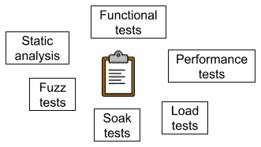
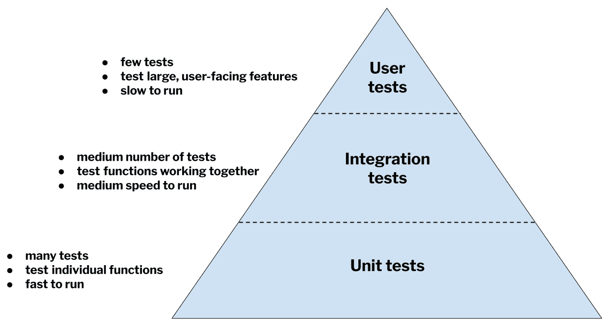
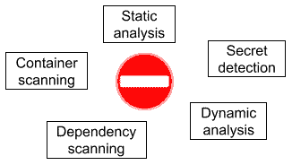
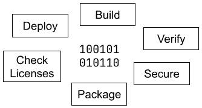

# 1

# 理解 DevOps 之前的生活

为了理解 **GitLab CI/CD 管道** 和 **DevOps** 方法的强大功能，我们必须了解在 GitLab 等工具出现之前，软件是如何构建的。尽管在本章你不会学到任何实际操作，但你将了解 GitLab CI/CD 管道所起源的世界，并清楚地看到它们解决了哪些问题。理解这些内容将帮助你理解 GitLab CI/CD 管道为何如此运作，并使你对它们在软件开发生命周期中带来的强大力量大开眼界。简而言之，理解现在的工作方式，最好的方法就是理解过去的艰难！

本章将介绍一个虚构但真实的网络应用程序，名为**Hats for Cats+**，它销售——你猜对了——猫咪的头饰。你将快速了解如何将“猫咪帽子”从一个创意转变为一个写得好、经过测试并且部署的网络应用程序。你将看到，在没有 GitLab CI/CD 管道的世界里，这些任务是如何完成的，这样当你在后续章节中学习 GitLab 时，其优势将更加明显。

本章将涵盖以下主要主题：

+   介绍“猫咪帽子”网络应用

+   手动构建和验证代码

+   手动进行安全测试代码

+   手动打包和部署代码

+   手动软件开发生命周期实践的问题

+   通过 DevOps 解决问题

# 介绍“猫咪帽子”网络应用

“猫咪帽子”是一个虚拟的网络应用，用于销售棒球帽、牛仔帽和礼帽，专为你喜爱的毛茸茸的小伙伴们设计。假设它是一个标准的在线商店，就像你使用过的成百上千个商店一样。它允许人们浏览帽子目录，加入购物车并输入账单和配送信息。

本书不涉及“猫咪帽子”的用户体验或图形设计。它所基于的网络应用框架也不重要，甚至它所使用的编程语言也不重要。我再说一遍，因为这是一个重要但可能让你惊讶的点：*本书不依赖特定语言*。它将包括多种编程语言的示例，以增加你至少能理解某些示例的可能性。但无论你的应用程序——或者是“猫咪帽子”应用——是用 Java、JavaScript、Python、Ruby 或任何其他语言编写的，都不重要。本书所描述的 GitLab CI/CD 原则适用于所有情况。

重要的是你需要采取的一般步骤，以确保代码具有高质量、按预期行为运行、安全、性能足够、打包合理，并在正确的时间部署到合适的环境中。本书的重点是 GitLab CI/CD 管道如何使软件开发生命周期（**SDLC**）中的各个步骤变得更轻松、更快速且更可靠。它不会教你如何编写“Hats for Cats” web 应用程序。假设所有编码工作都在后台完成，之后你将学习如何构建、验证、安全性、打包和发布这些代码。

牢记这一点，让我们一步步走过你需要遵循的高层次步骤，以便在 GitLab 出现之前将你的代码准备好供用户使用。这些都是 GitLab CI/CD 管道能够自动为你完成的手动等价过程。但理解手动过程的局限性，以及执行这些过程所涉及的痛苦和繁琐，将帮助你理解 GitLab 的真正强大之处。

# 手动构建和验证代码

在 GitLab CI/CD 管道出现之前，你需要手动构建和验证代码。这通常是一次糟糕的、让人心力交瘁的体验，原因我们将在这里讨论。

## 手动构建代码

构建代码取决于你使用的语言。如果你使用的是像 Python 或 Ruby 这样的解释型语言，那么可能根本不需要构建。但是，如果你编写的是编译型语言，那么你需要通过编译源代码来构建你的应用程序。

想象一下你正在使用 Java。以下是将 Java 源代码编译成可执行 Java 类的几种不同方式：

+   你可以使用随 Java 开发工具包一起提供的 `javac` Java 编译器

+   你可以使用 Maven 构建工具

+   你可以使用 Gradle 构建工具

有很多原因说明这个手动构建过程是繁琐且令人烦恼的，大多数开发人员都希望抛弃它：

+   它容易出错：你有多少次忘记了是否需要将 `javac` 指向你类所在的顶级包，或者指向单独的类文件？

+   它很慢，可能需要几秒钟到几分钟，具体取决于你的应用程序有多大。这可能会导致大量的停机时间。

+   它很容易被忘记，导致混乱，当你不小心执行了行为与预期不同的旧代码时。

+   编写不当的代码可能无法编译，导致每个人浪费时间，构建工程师将代码返回给开发人员进行修复，并等待修复的到来。

## 手动验证代码

一旦你构建好了代码，你需要验证它是否正确运行。测试有无数种形式，且测试的种类比我们在本书中能描述的还要多。但这里是一些你可能希望对代码进行的最常见的测试形式：



图 1.1 – 验证代码的测试

### 功能测试

你的程序做的事情是否符合预期？这是**功能测试**所要回答的问题。大多数编程项目都从一份描述软件应如何行为的规格说明开始：给定某个输入，应该提供什么输出？开发人员只有在他们编写的代码符合这些规格时，才算完成工作。如何知道代码是否符合规格？这就是功能测试的作用所在。

就像一般有很多种测试形式一样，也有许多子类别的测试，它们共同构成了功能测试。

如果将`2 + 2`输入到计算器，它应该返回`4`！顺畅路径测试看起来像是最重要的测试类型，因为它们检查用户在使用软件时最有可能遇到的行为。但实际上，你通常可以通过少数几个顺畅路径测试来覆盖最常见的用例。那些涵盖不寻常或意外情况的测试通常要多得多。

说到不寻常的情况，`56 ÷ 209`（这些值处于计算器可以接受的值范围的中间位置）比输入`0 + 0`或`999,999 – 999,999`（因为这些值位于范围的边界）更具挑战性。边界测试确保在接受范围的最远端的输入值不会导致软件崩溃。你能创建一个由单个字母组成的用户名吗？你能订购 9,999 本书吗？你能向银行账户存入 1 美分吗？如果规格说明说你的软件应该能处理这些边界情况，那你最好确保它真的能！

如果边界测试确保你的软件能够处理接近接受范围边缘的输入值，那么**极限测试**则验证软件是否能够处理两个或更多的同时出现的边界情况。可以把它当作加速版的边界测试，挑战你的软件，把它置于更加不舒服（但仍然有效）的情境中。例如，你的银行应用程序是否允许你在最远的有效日期安排提款，且金额为最小有效货币金额？极限测试不仅限于两个输入值：如果你的软件一次接受三个、十个或一百个输入值，你就需要确保它在*每个*输入值都被推到有效范围的极端值时仍然能正常工作。

这处理了软件接收有效值的情况。但你是否也需要确保它在接收*无效*值时能正确行为？当然需要！这种测试形式有时被称为`负 6`美元。当你查询 2020 年 2 月 31 日的汇率时，你的货币转换软件应该给出一个合理的错误消息。

由于通常有更多方式将错误数据输入应用程序而非正确数据，开发人员通常专注于正确处理*预期*数据，但未能考虑用户可能输入的意外、格式错误或超出范围的数据类型。程序需要预测并优雅地处理*所有*类型的数据——无论是好数据还是坏数据。编写完整的“顺利路径”和“不顺利路径”测试集是确保开发人员编写的代码无论用户输入什么数据都能表现良好的最佳方法。

这些是一些涉及有效数据和无效数据的*行为类型*，测试可以检查这些内容。但是，还有另一个维度可以用来分类测试：测试所针对的*代码块的大小*。

在大多数情况下，测试可以检查的最小代码片段是一个单独的方法或函数。例如，您可能想要测试一个名为**alphabetize**的函数，该函数接受任意数量的字符串作为输入，并返回这些相同的字符串，按字母顺序排列。为了测试这个函数，您可能会使用一种叫做**单元测试**的测试方法。它测试代码的单个*单元*，在这个情况下，一个单元就是一个函数。您可以有多个单元测试集合，每个测试以不同的方式覆盖这个函数：

+   一些测试可能覆盖顺利路径。例如，它们可以传递`dog`、`cat`和`mouse`字符串作为输入。

+   一些测试可能覆盖边缘或极端情况。例如，它们可以将一个空字符串传递给函数，或者传递仅由数字组成的字符串，或已按字母顺序排列的字符串。

+   一些测试可能覆盖不顺利路径。例如，它们可以传递一个意外的数据类型，如布尔值，而不是预期的数据类型字符串。

要验证较大代码片段的行为，您可以使用**集成测试**。这些测试不会关注单个函数，而是关注函数组之间如何相互作用。例如，假设您的货币转换应用有四个函数：

+   `get_input`，该函数从用户那里获取输入，包括源货币、源金额和目标货币。

+   `convert`，该函数将源货币的金额转换为正确的目标货币金额。

+   `print_output`，该函数告诉用户转换后产生的目标货币数量。

+   `main`，这是您的应用的主要入口点。当使用您的应用时，调用的就是这个函数。它会调用另外三个函数，并将每个函数的输出作为输入传递给下一个函数。

为了确保这些功能能够和谐地协同工作——也就是说，检查它们是否*良好集成*——你需要编写集成测试来调用`main`，而不是编写调用`get_input`、`convert`和`print_output`的单元测试。这让你能够在更高的抽象层次上进行测试，也就是更接近真实用户使用应用程序的方式。毕竟，用户不会单独调用`get_input`，他们会调用`main`，而`main`则会调用其他三个函数并协调它们之间的值传递。编写一个独立工作正常的函数很容易，但让多个函数协作构建更大的逻辑则更为困难。集成测试能够发现这种问题，而纯粹的单元测试则无法做到。

测试人员常常将各种测试形式看作一个金字塔。根据这一模型，单元测试占据了金字塔的宽大低端：它们是低级的，因为它们测试的是代码的基本单元，而且数量众多。集成测试则位于金字塔的中间：它们的抽象层次高于单元测试，且数量较少。金字塔的顶部是第三类测试，我们接下来将讨论的——**用户测试**：



图 1.2 – 测试金字塔

最后一种测试类型是用户测试，它模拟用户的行为，并以用户的方式使用软件。例如，如果用户通过输入源货币、该源货币的金额和目标货币，然后期望看到目标货币的输出金额，那么这正是用户测试所做的事情。这可能意味着它使用应用程序的图形用户界面（GUI），通过点击按钮和在字段中输入值来操作。或者，它可能通过调用应用程序的 REST API 接口，传入输入值并检查输出结果。然而，它与应用程序进行交互，并且尽可能以最接近真实用户的方式进行。与单元测试和集成测试一样，用户测试可以包括常规路径测试、边缘和极限情况测试，以及异常路径测试，以覆盖软件规格所描述的所有场景，以及测试设计人员可能构思的任何其他场景。

到目前为止，我们已经解释了单元测试、集成测试和用户测试的不同目的，但我们还没有描述另一个基本差异。单元测试和集成测试几乎总是自动化的。也就是说，它们是测试其他计算机程序的计算机程序。虽然用户测试在可能的情况下也是自动化的，但是由于编写可靠且可重现的测试与应用程序 GUI 交互的困难足够多，因此许多用户测试必须手动运行。Web 应用程序因为在加载时间周围的行为不可预测、页面渲染不完整、缺失或未完全加载的 CSS 文件以及网络拥塞而出名难以测试。这意味着，虽然软件开发团队通常尝试自动化 Web 应用程序的用户测试，但更常见的情况是他们最终采用自动化与手动用户测试的混合方法。正如您可能已经猜到的那样，手动用户测试在时间和测试人员士气方面成本极高。

### 性能测试

在对功能测试进行高级导览之后，您可能会认为我们已经涵盖了所有测试基础。但实际上我们才刚刚开始。您可能还需要测试应用程序的另一个方面：其性能。它是否能够快速执行用户期望的功能，以避免用户感到沮丧？它是否符合开发人员在编码之前所得到的性能规格？它的性能是否明显优于或劣于竞争对手的性能？这些是性能测试旨在回答的一些问题。

**性能测试**因其设计和执行的复杂性而声名狼藉。在评估应用程序运行速度时需要考虑很多变量：

+   在测试期间应该运行在什么样的环境中？创建与生产环境完全相同的环境通常代价高昂，但在测试环境中可以削减哪些方面而不会严重影响性能测试结果？

+   您的性能测试应使用哪些输入值？根据应用程序的不同，某些输入值的处理时间可能显著长于其他输入值。

+   如果您的应用程序是可配置的，应该使用什么配置设置？如果没有大多数用户都使用的标准配置，则尤其重要。

即使您可以弄清如何设计有用的性能测试，这些测试通常需要很长时间才能运行，并且在某些情况下可能会产生不一致的结果。这导致团队经常重新运行性能测试，这会导致测试所需时间更长。因此，性能测试是所有测试类型中最关键且成本较高的测试之一。

### 负载测试

性能测试有一个密切相关的“亲戚”叫做**负载测试**。性能测试评估的是软件在执行单一操作时的速度（例如单次货币兑换、单次银行存款或单次数学问题），而负载测试评估的是软件在多用户同时交互时的表现。负载测试面临着与性能测试相似的设计难题，可能会产生类似不一致的结果。它们的设置也更加昂贵，因为需要模拟成百上千的用户。

### 持续测试

当应用程序运行数小时或数天后，它是否分配了永远不会回收的内存？它是否因为过度记录日志而占用了大量磁盘空间？它是否启动了永远不会关闭的后台进程？如果出现这些资源“泄漏”问题，应用程序可能会因为内存、磁盘空间或 CPU 周期不足而失去性能，甚至崩溃。这些问题可以通过**持续测试**发现，持续测试是在一段时间内对软件进行持续的测试，同时监控其稳定性和性能。显然，持续测试在时间和硬件资源上非常昂贵，需要大量的投入。

### 模糊测试

一种被低估但非常强大的测试方法叫做**模糊测试**。这种方法会向软件发送有效但异常的数据输入，目的是揭露传统功能测试可能遗漏的错误。可以把它想象成醉酒状态下的正常路径测试。所以，不是尝试用“Sam”作为用户名创建账户，而是尝试用包含 1000 个字母的用户名，或者尝试创建一个全为空格的用户名，或者在收货地址中包含克林贡字母表的 Unicode 字符。

模糊测试引入了强大的随机性：它发送到软件的输入值要么是完全随机生成的，要么是已知不会对代码产生问题的输入值的随机排列。例如，如果你的代码将 PDF 文件转换成 HTML 文件，模糊测试可能会从发送稍微调整过的有效 PDF 文件开始，然后逐步要求软件转换完全随机的字符串，这些字符串与 PDF 文件完全没有关系。由于模糊测试需要发送成千上万的随机输入值，直到找到一个导致崩溃或其他错误的输入值，因此模糊测试必须自动化进行。手动执行模糊测试实在是太繁琐了。

### 静态代码分析

另一种严格自动化的测试形式是**静态代码分析**。与我们讨论过的其他测试试图在代码运行时找到问题不同，静态代码分析是在不执行代码的情况下检查你的源代码。它可以查找各种不同的问题，但通常它会检查你是否遵循了公认的编码最佳实践和语言习惯。这些规范可能是由你的团队、语言本身的开发者或其他编程权威制定的。

例如，静态代码分析可以注意到你声明了一个变量，但从未给它赋值。或者它可能指出你已经给一个变量赋值，但之后从未引用过该变量。它可以识别无法访问的代码、使用已知比其他功能等效模式更慢的编码模式，或者使用不规范的空白字符方式的代码。这些都是可能不会导致代码完全崩溃，但会使你的代码在可读性、可维护性或速度方面远不如预期的做法。

## 验证代码的更多挑战

到目前为止，我们只描述了一些你可能希望验证代码行为、性能和质量的方式。但一旦你完成了所有这些不同类型的测试，你将面临一个可能比较棘手的问题，即如何解析、处理和报告结果。如果你幸运的话，你的测试工具会生成标准格式的报告，你可以将其集成到自动更新的仪表板中。但你很可能会发现自己至少需要使用一个无法嵌入你正常报告结构的测试工具或框架，并且需要手动扫描、清理并调整格式，使其易于阅读和传播。

我们已经提到过，特别是性能测试通常需要反复进行。但事实上，*所有*这些类型的测试都需要反复执行，以捕捉回归或平滑所谓的“闪烁”测试，闪烁测试是指根据网络状况、服务器负载或其他无数不可预测因素，有时通过有时失败的测试。这意味着无论是手动执行测试，还是管理和触发自动化测试，所需的工作量远远大于最初看起来的情况。如果你需要反复执行测试，你需要搞清楚何时以及多频繁地进行测试，你需要确保在合适的时间有适当的硬件或测试环境可用，而且你还需要有足够的灵活性来根据条件的变化或管理层要求更为实时的结果时调整你的测试频率。关键是，测试很难、耗时且容易出错，每次需要人工干预以确保测试在正确的时间和正确的方式进行时，这些困难都会被放大。

尽管我们刚才说过测试*应该*通常执行并反复执行，但还有另一个相反的力量在起作用。由于执行测试既昂贵又困难，人们往往倾向于尽可能少地运行测试。这种倾向受到一种常见开发模式的鼓励：即开发者完成一个功能（有时是整个产品）后，再将代码*扔到墙的另一边*交给**质量保证**（**QA**）团队进行验证。代码构建与测试之间的这种严格分工意味着许多团队只会在开发周期的最后阶段才运行测试——无论是在两周的冲刺结束时、一年项目的结束时，还是介于两者之间的某个时刻。

不频繁或延迟测试的做法会导致一个巨大的问题：当开发者交付一大批代码进行测试——这些代码是由不同的人在几周或几个月的时间里使用不同的编码风格和习惯开发的，可能有成千上万行——那么诊断测试发现的 bug 的根本原因会变得极其困难。反过来，这意味着修复这些 bug 也变得困难。就像大草堆比小草堆更能有效地隐藏针一样，大批量的代码让我们很难发现、理解和修正其中的 bug。开发团队在将代码交给 QA 团队之前等待的时间越长，这个问题就越严重。

这就是我们快速浏览功能测试、负载测试、浸泡测试、模糊测试和静态代码分析的全部内容。此外，我们还解释了进行这些不同种类测试时所涉及的一些隐藏难题。你可能会想知道我们为什么要讨论测试。原因在于，理解测试的挑战——了解验证代码的方式有多少种，测试的不同形式有多么重要，设置测试环境的时间成本有多高，手动进行无法自动化的用户测试有多麻烦，处理和报告测试结果有多复杂，以及在庞大的代码包中发现并修复潜藏的 bug 有多么困难——是理解在 DevOps 出现之前软件开发有多艰难的一个重要部分。在本书的后面，你会看到 GitLab CI/CD 管道如何简化运行各种测试并查看其结果的过程，以及当你理解早期和频繁运行的测试如何使问题更容易被发现和更便宜地修复时，你可以回顾这些繁琐的测试程序，并对那些在 GitLab 出现之前不得不经历这部分 SDLC 的开发者产生同情。GitLab 时代的生活真是好多了！

# 手动进行安全测试代码

我们提到过功能测试只是测试的一种形式。另一个重要的形式是**安全测试**。它非常重要且非常难以做到完美，因此通常由与传统 QA 部门分开的专门团队执行。安全测试有许多不同的方法，但大多数都可以归结为以下三类之一：

+   检查源代码

+   与运行中的代码互动

+   检查项目使用的第三方依赖

此外，安全测试可以查找不同种类的问题。乍一看，这些问题中的一些可能看起来不属于安全问题的范畴，但它们都会导致潜在的数据丢失或软件被恶意操控：

+   非标准编码实践

+   不安全的编码实践

+   含有已知漏洞的源代码依赖

让我们看一下安全测试的几种具体类型，看看它们如何使用不同的技术来寻找不同类型的问题。

## 静态代码分析

你通常可以通过请安全专家审查你的源代码来发现不安全的编码实践。例如，如果你请求用户输入，然后使用该输入查询数据库，聪明的用户可能会通过在输入中加入数据库命令来发起所谓的*SQL 注入攻击*。称职的代码审查员会立即发现这种问题，并且通常能提出易于实施的解决方案。

例如，以下伪代码接受用户输入，但在将其用于 SQL 语句之前没有验证输入。一个聪明的用户可以输入恶意值，如`Smith OR (0 = 0)`，从而导致暴露出比开发者预期更多的信息：

```
employee_name = get_user_input()
sql = "SELECT salary FROM employee_records WHERE employee_name = $employee_name" ENTERcall_database(sql)
```

代码审查还可以识别那些可能看起来不明显不安全的代码，但这些代码使用了非标准的习惯用法、异常的格式或尴尬的程序结构，导致代码更难被其他团队成员（甚至原作者）阅读和维护。这可能间接使代码未来更容易遭受安全问题，或者至少使得未来的安全问题更难被代码审查人员发现。

例如，以下 Python 函数接受一个异常多的参数，然后忽略其中大部分。这两种特征都被认为是糟糕的编程实践，即使它们都不会威胁到代码的行为或安全性：

```
def sum(i, j, k, l, m, n, o, p, q, r):
    return i + j
```

静态代码分析有时会自动进行。许多集成开发环境（IDE）将静态代码分析作为内置功能：它们会在检测到任何非标准或不安全的代码时，在其下方绘制红色警告线。这可能是一个很大的帮助，但最好将其视为对手动代码审查的补充，而不是完全的替代品。

## 秘密检测

你可以将**秘密检测**视为静态代码分析的一种特殊形式。你希望从软件源代码中排除的敏感数据有很多类型。很容易想到一些例子：

+   密码

+   部署密钥

+   公共 SSH 或 GPG 密钥

+   美国社会安全号码

+   其他国家使用的独特个人识别号码

就像静态代码分析扫描源代码以查找编程或安全问题一样，秘密检测扫描源代码以寻找应当删除并存储在更安全位置的秘密。例如，以下 Java 代码包含一个社会安全号码，任何具有读取权限的人都可以看到：

```
String bethSSN = "555-12-1212";
if (customerSSN.equals(bethSSN))) {
     System.out.println("Welcome, Beth!");
}
```

## 动态分析

查看源代码很有用，但有许多类别的软件缺陷通过与执行中的代码进行交互更容易被发现。这种交互可能表现为像人类一样使用应用程序的 GUI、向 REST API 端点发送请求，或在 Web 应用程序的不同 URL 上使用不同的请求查询字符串值。

例如，您的 Web 服务器可能配置为在每个响应的头部中包含其版本号。这看起来可能是无害的信息，但它可能为恶意攻击者提供有关哪些针对 Web 服务器的漏洞可能对您的站点有效的线索，以及您的 Web 服务器可能免疫于哪些漏洞。

举个例子，您代码中的复杂逻辑可能掩盖了您通过输入一组特定的输入值来触发未处理的除零错误的事实。如前所述，这类问题一开始可能不会被认为是安全风险，但聪明的黑客通常能找到利用简单漏洞的方式，从而暴露数据、导致数据丢失或引发拒绝服务攻击。

例如，以下 Ruby 代码在运行时可能会产生一个 `ZeroDivisionError` 实例，这可能导致程序崩溃：

```
puts 'how many hats do you have?'
num_hats = gets.to_i
puts 'how many cats do you have?'
num_cats = gets.to_i
puts "you have #{num_hats / num_cats} hats per cat"
```

## 依赖扫描

**依赖扫描**是将您产品的每个依赖项的名称和版本号与已知漏洞数据库进行比较，并识别出哪些依赖项应该升级到更高版本或完全删除，以提高软件安全性的实践。如今几乎每一款非平凡的软件都依赖于数十、数百或数千个第三方开源库。这些最受欢迎的库的源代码被黑帽黑客仔细研究，寻找可能的漏洞。这些漏洞通常会被库的维护者迅速修复，但如果您的项目使用的是旧版、未打补丁的库，依赖扫描将告知您，您的代码可能会受到这些已知漏洞的攻击。

一个完美的例子，说明了这种类型的安全扫描的必要性，正是当时新闻中的话题。许多 Java 项目依赖于一个名为 Log4j 的开源 Java 库，该库提供了一种便捷的方式来记录信息、警告或错误消息。最近发现了一个漏洞，允许黑客远程执行命令或在任何运行 Log4j 的计算机上安装恶意软件。这是一个巨大的问题！幸运的是，这正是依赖扫描能够发现的问题。任何更新的依赖扫描工具都会让你知道你的软件是否依赖于未修补版本的 Log4j，无论是直接依赖还是通过其他依赖关系，并会建议你升级到哪个版本的 Log4j。

## 容器扫描

如今，许多软件产品以**Docker**镜像的形式交付。最简单的描述就是，Docker 镜像是一个已经安装了你的应用程序的 Linux 发行版，并将其打包成一种可以由 Docker 或类似工具执行的*镜像*格式。如果你构建的 Docker 镜像包含了一个过时的 Linux 发行版，并且该发行版存在安全漏洞，那么你的应用程序将不如它应该有的那样安全。

容器扫描检查你的*Docker 化*应用程序所安装的基础 Linux 镜像，并检查已知安全漏洞的数据库，查看你的打包应用程序是否可能容易受到漏洞攻击。例如，由于 CentOS 6 在 2020 年停止维护，它包含的许多库存在严重的安全漏洞。容器扫描会提醒你这个问题，并建议你考虑将应用程序的 Docker 镜像升级为使用 CentOS 7 或更高版本作为基础镜像。

## 手动安全测试总结

到此为止，我们已经讨论了多种旨在检测安全漏洞或安全相关问题的测试方法，例如未遵循编码最佳实践。虽然在将一个简单的 Web 应用投入生产之前可能需要经过很多不同的步骤，但如今窃取信息或关闭服务的方式越来越多，且没有迹象表明这种趋势会很快改变。所以，无论你愿意与否，负责任的开发者都需要考虑并可能实施所有这些不同的安全测试：



图 1.3 – 各种安全测试类型的一部分

有些测试必须手动执行，其他一些则有自动化工具来帮助。但自动化测试依然繁琐：你仍然需要安装安全测试工具或框架，配置测试工具，更新测试框架和依赖项，设置并维护测试环境，处理报告，并以某种集成的方式展示报告。如果你试图通过将其中一些任务外包给外部公司或**软件即服务**（**SaaS**）工具来简化问题，你将需要为每个工具学习不同的图形用户界面（GUI），为每个服务维护不同的用户帐户，管理多个许可证，并进行一系列其他任务，以保持测试的顺利进行。

本节展示了在 GitLab 出现之前，开发团队在工作中面临的更多困难。正如你将在接下来的章节中学到的，GitLab 的 CI/CD 流水线用快速、自动化的安全扫描工具取代了之前描述的繁琐、多步骤的安全测试过程，配置一次后，你可以在继续开发软件项目的过程中持续受益。我们稍后将更详细地讨论这个话题。

# 手动打包和部署代码

现在你的软件已经构建完成、验证无误并且安全，接下来是时候考虑如何打包和部署它了。就像我们之前讨论的其他步骤一样，手动进行这一过程时可能会变得很麻烦。如何将应用程序打包成可部署的状态，不仅取决于它所使用的计算机语言，还取决于你使用的构建管理工具。例如，如果你使用 Maven 工具管理 Java 产品，你需要运行一组与使用 Gradle 工具时不同的命令。将 Ruby 代码打包成 Ruby gem 则需要完全不同的过程。打包通常涉及收集数十个、数百个或成千上万个文件，使用适合该语言的工具将它们打包，再三检查文档和许可证文件是否完整并放置在正确的位置，可能还需要通过加密签名打包的代码，以证明它来自一个可信的源。

我们已经提到过指定代码发布许可证的任务。这引出了在将代码部署到生产环境之前需要进行的另一种测试：**许可证** **合规性扫描**。

## 许可证合规性扫描

大多数开源的第三方库都是根据特定的软件许可证发布的。开发者可以选择的许可证种类繁多，但大多数开源库使用的仅仅是其中几种，包括 MIT 许可证、GNU **通用公共许可证**（**GPL**）和 Apache 许可证。了解你的依赖项使用哪些许可证至关重要，因为如果你的项目使用的许可证与某个依赖项的许可证不兼容，那么你就无法合法地使用该依赖项。

什么会导致两个许可证不兼容呢？一些许可证，例如《和平开源许可证》，明确禁止军方使用该软件。另一个常见的许可证冲突原因是所谓的*Copyleft*许可证与专有许可证之间的冲突。像 GPL 这样的 Copyleft 许可证规定，任何使用了 GPL 所涵盖库的软件，必须也使用 GPL 许可证。Copyleft 许可证有时被称为*病毒许可证*，因为它们将许可证的限制传递给任何使用了这些许可证所涵盖依赖项的软件。

由于法律要求你确保主许可证与你使用的任何第三方库的许可证兼容，你需要在打包和部署工作流中添加一个许可证扫描步骤。无论是手动进行还是使用自动化工具，你都必须识别并替换任何你不能使用的依赖项。

## 部署软件

一旦你的软件已打包完毕，并且你已经仔细检查了依赖项的许可证，你就面临着将代码在正确的时间部署到正确位置的难题。

大多数开发团队都有多个环境来部署代码。每个组织的设置方式不同，但一个典型（尽管是最小化的）环境结构可能如下所示：

+   一个或多个**测试环境**。

+   一个**预发布环境**或**生产前环境**，其配置尽可能与生产环境相似，但通常规模要小得多。

+   **生产环境**。

我们稍后会更详细地讨论这些不同环境的使用，但现在你只需要了解每个环境在基本部署工作流程中的作用。当代码开发时，通常会将其部署到测试环境，以便质量保证（QA）团队或*发布工程师*确保它按预期工作，并与现有代码无缝集成，不会引起任何问题。当新代码被宣布准备好添加到生产代码库时，传统上会将其部署到预发布环境，以便进行最终测试，确保新代码与最终运行环境之间没有不兼容的情况。如果这些测试顺利通过，代码最终将部署到生产环境，真实用户可以从新代码带来的功能、修复或其他改进中受益。

正如你所想，确保正确的代码在正确的时间被部署到正确的环境中是一项复杂但至关重要的工作。而部署仅仅是战斗的一半！另一半是确保各个环境都可用且健康。它们必须运行在正确类型和规模的硬件上，必须配置正确的用户账户，必须正确设置网络和安全策略，还必须安装正确版本的操作系统、工具和其他基础设施软件。当然，还有维护任务、升级和其他系统重新配置工作，这些都必须计划、执行，并在出错时修复。这些任务的范围和复杂性令人难以置信，这也是大公司拥有完整发布工程师团队的原因，确保一切顺利运行，并在出现问题时紧急排查。

这完成了我们对在你提交新代码后，最常见的 SDLC 任务的介绍：

1.  构建代码。

1.  通过各种测试验证代码的功能、性能、资源使用等。

1.  通过使用更多的测试，确保代码没有安全漏洞。

1.  将代码打包成可部署的格式。

1.  寻找并修复任何与许可证不兼容的问题。

1.  将代码部署到适当的环境中。

到现在，你应该已经感觉到一个主题：在 GitLab 之前的生活是复杂的、容易出错且缓慢的。这些形容词确实适用于在 SDLC 接近尾声时发生的软件包、许可证扫描和发布任务。但正如你将在后续章节中详细了解的那样，GitLab CI/CD 流水线为你处理了这些工作的最繁琐部分。通过让流水线处理那些枯燥和重复的工作，你可以专注于编写软件中更具创意和满足感的部分。

# 手动软件开发生命周期实践中的问题

现在，你已经对软件在开发者完成编写到用户能够使用之间发生的事情有了大致的了解，你可以开始理解这个过程有多么困难。沿着这条将安全、可工作的代码交付给用户的路径，许多任务需要发生：



图 1.4 – SDLC 中的主要任务

这些任务中的一些通常是手动完成的，而其他任务则可以部分或完全自动化。但这两种方法都存在相关问题，使得每个任务都成为潜在的痛点。

手动执行这些任务有哪些困难？让我们来看看：

+   **它们需要时间**。即使你过去有过手动执行它们的经验，它们通常也比你预期的花费更多的时间。执行这些任务时可能出错的方式有无数种，而每种错误都需要耗时的故障排除和修复。即使一切顺利，每个任务本身也涉及大量的工作。记住物理学家道格拉斯·霍夫施塔特在 1979 年提出的定律：*即使你考虑到* *霍夫施塔特定律*，它总是比你预期的要花费更长的时间。

+   **它们容易出错**。因为你依赖的是人类来执行这些任务——而这些人类可能疲惫、无聊或分心——因此它们容易出现配置错误、数据输入错误，或者某些步骤被遗忘或顺序错误，仅举几例，人的错误可能导致任务失败。

+   **它们对员工士气有害**。没有人喜欢做例行的重复性工作，尤其是当任务至关重要并且必须做对的时候。每两周第 20 次执行标准的两小时手动测试，许多 QA 工程师都曾怀疑，自己是不是当初选择了错误的职业道路。

+   **它们有很高的沟通或报告错误的潜力**。当手动测试人员完成了他们枯燥的两小时测试套件后，他们是否还能剩下足够的脑细胞准确记录哪些工作了，哪些没工作？如果我们无法依赖结果准确记录，那么所有的测试都是没有意义的，但任何执行过复杂手动测试计划的人都知道，结果中可能存在多少不确定性，可能会有多少意外情况扭曲测试结果，而要知道如何向依赖这些报告的人解释这些因素是多么困难。更不用说即使结果毫不含糊，仅仅是记录错误的结果的可能性有多大了。

出于所有这些原因，你可以看出，手动任务在时间、金钱和员工善意方面的开销是多么巨大

但是，如果我们所描述的一些任务能够自动化，是否能消除我们在手动任务中面临的问题？嗯，这将解决一些问题。但将一系列自动化工具添加到 SDLC 中，也会引入一整套新的问题。考虑到这样做所涉及的额外努力和费用，以及构建自定义工具链所需要承担的所有任务：

+   研究和选择适用于每个可自动化任务的工具

+   购买和续订每个工具的许可证

+   为每个工具选择托管解决方案

+   为每个工具配置用户

+   学习每个工具的不同图形用户界面（GUI）

+   管理每个工具的数据库和其他基础设施

+   将每个工具与 SDLC 中的其他工具进行集成

+   如果可能的话，弄清楚如何在一个集中位置显示每个工具的状态和结果

+   处理那些有缺陷、被弃用或随着市场上更好替代品的出现而变得不那么吸引人的工具

即使手动或自动化任务的问题得到处理，使用这种模式的团队仍然面临一个无法避免的重大问题：*它是一个顺序工作流*。步骤是一个接一个地进行的。一支团队编写软件，然后*把代码扔到墙那边*，交给另一支负责构建软件的团队。那支团队又将代码交给负责验证软件的第三支团队。当他们完成后，他们通常会将代码交给另一个安全测试小组。最后，发布团队会接手代码，确保它被部署到正确的位置。这个过程可能会有很多偏离基本描述的方式，但一个接一个地执行步骤，在前面的步骤完成后才将代码传递给下一个步骤，这个特征是许多软件开发团队的工作流共有的特点。

到目前为止，可能还不太明显为什么顺序工作流会带来问题，所以让我们详细说明一下。由于手动执行这些步骤的困难，或者保持自动化步骤在多个工具中顺利且可靠运行的麻烦，这种工作流通常只是偶尔发生。代码通过这些步骤的执行频率因团队而异，但涉及的时间和费用意味着代码更改通常会在几天、几周，甚至有时几个月后才被正确地构建、验证、加固和部署。而这反过来意味着，*在这个过程中检测到的问题修复成本高昂*。如果功能测试失败，安全测试检测到漏洞，或者集成测试显示代码在所有部署到同一环境后无法协同工作，确定是哪个代码导致了问题，就像在一个巨大的干草堆中找针一样。如果 5,000 行代码跨越 25 个类发生了变化，16 个依赖被升级到了更新的版本，Java 版本从 16 升级到 17，而且测试环境运行的是不同版本的 Ubuntu，那么在追踪问题源并找出解决方法时，有这么多的变量需要调查。

到此为止，你已经了解了传统的、开发前的软件开发方式，我们可以用一句话总结它面临的最大问题：*涉及手动任务或由不同工具执行的自动化任务的顺序工作流会导致开发变慢，发布不频繁，并且结果软件的质量低于它* *本应达到的标准*。

不过有个好消息：DevOps 的诞生就是为了应对这些问题。而 GitLab CI/CD 流水线的发明则是为了让 DevOps 更易于使用。接下来我们将一起探讨这两者。

# 使用 DevOps 解决问题

我们所说的**DevOps**是什么意思？尽管这个术语在软件界已经使用了至少 10 年（第一个**devopsdays**会议——现在是最大的以 DevOps 为主题的会议——于 2009 年举办），但至今仍没有一个所有人都认同的统一标准定义。

当 GitLab 谈论 DevOps 时，它指的是一种重新思考软件开发生命周期（SDLC）的方法，专注于四个方面：

+   自动化

+   协作

+   快速反馈

+   迭代改进

让我们更详细地看一下每个方面。

DevOps 的主要关注点是**自动化**尽可能多的软件开发任务。这可以消除与手动构建、测试、保护和发布相关的挑战。但如果它只是将这些挑战交换为组装一系列手动工具的麻烦和费用，那它的用途就非常有限。我们稍后会看到 GitLab 如何解决这个问题，但现在只需要理解，一个合适的 DevOps 工作流是完全自动化的。

通过促进所有参与编写软件的团队之间的**协作**，以及每个团队成员之间的协作，DevOps 有助于消除每次代码从一个团队转移到另一个团队时出现的摩擦点和潜在问题。如果没有“墙”可以把代码抛过去——如果过程中的每个步骤对所有参与编写和交付软件的人都是透明的——那么每个人都会对代码的整体质量感到责任重大，并且觉得自己是同一个团队的一员。不同的人仍然对特定任务负主要责任，但整体文化趋向于代码的共同所有权和共同的目标。

**快速反馈**可能是 DevOps 最关键和革命性的元素。可以将其视为我们之前讨论的两个概念的结果：并行工作流和左移。当你停下来思考时，这两个术语归结为同一件事：对于每一批开发人员提交的代码，尽早并同时完成所有构建、验证和保护任务。以并行方式而非顺序方式执行它们，以确保它们出现在软件开发时间线的最左端。而且对于每一块新代码，无论多么微小，都要立即运行所有这些任务。通过早期且频繁地运行这些任务，你可以最小化测试的代码变化的大小，这使得排除任何由测试发现的软件漏洞、配置问题或安全漏洞变得更便宜和容易。

如果你能快速发现并修复问题，就能够更频繁地将软件发布给客户。通过更早地向他们提供新特性和修复的 bug，你在帮助他们从你产品的**迭代改进**中获益。通过以更短的间隔发布较小的代码更改，这样的发布风险较低，不容易出错，也无需回滚，你就实现了“*让发布变得无聊*”这一口号。在这种情况下，无聊是件好事：大多数客户更愿意接受频繁、小规模的升级，因为它们的风险小，而不愿意接受那些不频繁、巨大改变的升级，后者更有可能造成严重问题并需要回退。

通过利用自动化、协作、快速反馈和迭代改进，DevOps 实践能够生成更高质量、开发成本更低、且更频繁交付给用户的代码。

## 如何通过 GitLab 实现 DevOps

GitLab 是一个可以支持我们讨论的所有软件开发任务的工具，它使用了我们刚刚概述的 DevOps 原则。GitLab 最重要的特点是它是一个*单一*工具，能够将 SDLC 中的所有步骤统一在一个平台下。

还记得从手动过程转向自动化过程时，解决了一些问题，但也带来了与自动化相关的新问题吗？GitLab 的单一工具方法同样解决了这些问题。考虑一下拥有以下统一工具链方法的好处：

+   一个许可证需要购买（除非你的团队使用 GitLab 的免费版本，该版本功能受限，在这种情况下不需要购买许可证）

+   一个应用程序进行维护和升级

+   一套用户账户进行配置

+   一个数据库进行管理

+   一个 GUI 需要学习

+   一个查看的地方——可以说是一个雷达屏幕——用来查看*所有*构建、验证、安全、打包和部署步骤的报告和状态

因此，GitLab 作为一个单一工具，解决了使用不同自动化工具所带来的问题。更重要的是，它使用单一的组件和实体，这些组件和实体相互之间能够良好沟通并且互相了解，这种设计促进并鼓励了 DevOps 中至关重要的协作、并发、透明度和共享所有权。一旦你拥有并发任务，你就能获得快速反馈。而这又进一步推动了通过*无聊*发布进行迭代改进。

本书的大部分内容将讨论 GitLab 如何运用这些 DevOps 原则进行实践：**CI/CD 流水线**。我们暂时不会定义这个术语的含义，但你将在未来的章节中详细了解它。现在，你只需要知道 CI/CD 流水线是 GitLab 如何将单一工具模型用于执行所有构建、验证、安全、打包和部署的地方，它们是你代码需要经过的过程。

我们不得不提的是，GitLab 的一个重要部分是帮助你规划、分配和管理工作。但这与 CI/CD 管道是分开的，因此超出了本书的范围。我们会时不时提及一些相关话题，因为 GitLab 中的所有内容都是相互关联的，不可能完全局限于 CI/CD 管道的范畴。但本书的大部分内容将解释 GitLab 管道的功能以及如何使用它们。

# 摘要

不从事软件公司工作的人可能不了解，编写软件不仅仅是……*编写软件*。在代码提交后，必须遵循一系列冗长复杂的步骤，包括构建、验证、安全性检查、打包和部署，才能让用户使用这些代码。所有这些步骤都可以手动完成，或者在特定条件下，部分步骤可以自动化。然而，无论是手动方式还是自动化方式，都存在问题。

DevOps 是一种相对较新的方法，用于完成这些步骤。它将自动化、协作、快速反馈和迭代改进结合起来，使团队能够更好、更快、更便宜地开发软件。

GitLab 是一个 DevOps 工具，它将所有这些任务整合在一个平台下，使得软件开发团队可以通过单一工具、使用单一界面来完成所有任务，所有测试结果和部署状态都显示在一个地方。它专注于自动化，解决了手动流程中出现的问题。它的单一工具模型则解决了自动化流程中出现的问题。GitLab 通过使用 CI/CD 管道将所有 DevOps 原则付诸实践，这将是本书余下部分的主要内容。

但在我们讨论 CI/CD 管道之前，我们需要快速绕道介绍 Git，这是 GitLab 构建的基础工具。如果没有扎实的 Git 基础，你很可能会觉得 GitLab 的许多概念和术语令人困惑。因此，准备好，拿起你最喜欢的含咖啡因饮料，让我们一起跳入 Git 的世界吧。
