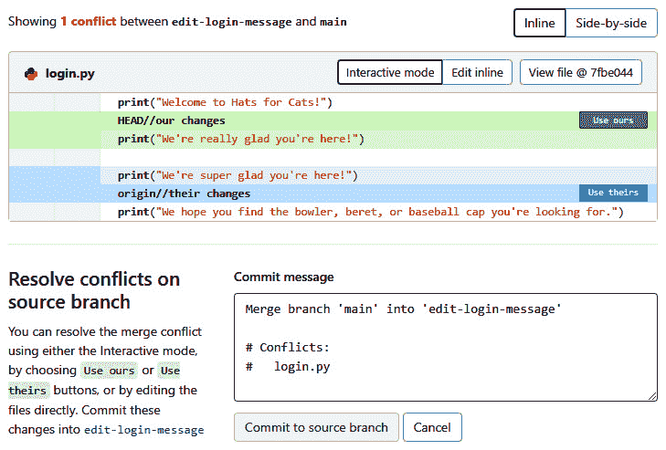

# 2

# 练习基本的 Git 命令

**GitLab** 产品是围绕一个名为 **Git** 的独立工具构建的。GitLab 使 Git 更易于使用，并为你提供了一个中央位置来存储 Git 所管理的所有文件，此外还提供了许多与 Git 无关的功能。我们喜欢将 GitLab 看作是 Git 的一个*包装器*，使其使用起来更愉快，也更强大。

虽然 GitLab 和 Git 是不同的工具，但 GitLab 借鉴了 Git 的许多概念。这意味着，要理解 GitLab，你需要理解 Git。幸运的是，你只需要掌握 Git 的基础知识即可。我们之所以说“幸运”，是因为 Git 是一个庞大且复杂的工具，学习它的所有细节需要付出巨大的努力。但相信我们：如果你理解 Git 的前 10%，你就能有效地使用 GitLab。那 10% 正是我们将在本章中介绍给你的内容。

首先，我们将向你展示为什么像 Git 这样的版本控制系统是软件开发中如此有用的一部分。然后，我们将解释如何将你的代码存储在 Git 中，包括你或你的团队成员对该代码所做的任何编辑。我们还将向你展示如何在一个叫做分支的安全空间中开发代码，该分支与其他团队成员隔离开来。这确保了你不会干扰到他人的工作，也不会覆盖他们的代码。你将学习如何标记代码的特定版本，以便以后可以轻松引用它或将其发布给客户。最后，你将了解如何在远程位置存储代码。你将学习如何同步本地和远程文件的副本，并且你将理解这种架构如何使整个团队能够同时在同一个代码库上工作。

在本章中，我们将涵盖以下主要主题：

+   为什么使用 Git？

+   提交代码以保持其安全

+   为了标记提交以识别代码版本

+   为了在一个隔离空间中开发代码进行分支

+   同步本地和远程仓库的副本

+   学习 Git 的额外资源

# 技术要求

对于本章，你需要在本地计算机上安装 Git。Git 可以在 Linux、macOS、Windows 以及许多 Unix 变种系统上运行。在 [`git-scm.com/downloads`](https://git-scm.com/downloads) 上有易于遵循的安装指南，适用于这些操作系统中的任何一个。如果在安装过程中要求设置配置选项，接受所有默认值是安全的。

要输入你将在本章中看到的 Git 命令，请在 Linux 或 macOS 上使用你喜欢的终端应用程序。如果你是 Windows 用户，你可以在命令提示符、PowerShell 或 Git Bash 中输入这些命令。在 Windows 上安装 Git 时，默认的配置选项应该会使 Git 在这些 Windows 终端中可用，而且它们在运行 Git 命令时应产生相同的结果。

本书中你将看到的 Git 示例是操作系统无关的：*Git 无论在什么地方运行，表现都一样*。

要查看 Git 是否已安装，或者验证是否正确安装了 Git，打开适合你操作系统的终端并运行以下命令。如果输出显示版本号而不是错误信息，说明 Git 已正确安装在你的计算机上：

```
$ git --version
git version 2.25.1
```

不必担心看到特定的版本号；几乎任何版本的 Git 都能在我们在本书中使用的简单命令上表现一致。

在使用 Git 之前，你必须告诉 Git 你的名字和电子邮件地址。这些信息会被添加到你存储在 Git 中的每一条编辑记录里，以便其他团队成员知道哪些编辑是你负责的。

首先，检查 Git 是否已经配置了这些信息：

```
$ git config --list
```

如果输出中包含 `user.email` 和 `user.name` 的条目，那么你已经配置好了，可以跳过接下来的两个命令。否则，通过运行这两个一次性的命令告诉 Git 你的身份，替换掉电子邮件地址和名字为你的信息：

```
$ git config --global user.email "george.spelvin@example.com"
$ git config --global user.name "George Spelvin"
```

一个可选但推荐的步骤是将 Git 配置为在新项目中使用 `main` 作为默认分支的名称，而不是 `master`。我们还没有讨论什么是分支，所以这可能现在看起来没有太大意义。现在，你只需要知道，许多软件公司正在将 `main` 作为项目稳定代码库所在位置的名称。你会在现实中（甚至在本书中）看到这两个术语的使用，但如果你想将你的计算机配置为新项目使用 `main`，可以运行以下命令一次：

```
$ git config --global init.defaultBranch main
```

所有技术要求都完成后，让我们开始吧！

# 为什么要使用 Git？

就像在自动化工具如 GitLab CI/CD 管道出现之前，了解我们是如何构建软件的（如在*第一章*中讨论的那样），了解在 Git 或类似工具出现之前，团队如何协调编辑同一文件的复杂过程也是很有帮助的。

这些工具旨在解决开发人员面临的许多问题，但我们这里只看其中一个。假设你和你的队友伊丽莎白在同一个代码库上工作，并且你们都想编辑一些相同的文件。进一步假设这是在 Git 或任何其他**版本控制系统**（**VCS**）出现之前的时代。那时编写软件的唯一方法是你编辑文件，然后通过电子邮件发送，或者把文件放在共享的网络驱动器上，或者复制到便携磁盘中。然后，你必须让伊丽莎白知道她可以开始编辑这个文件。她以某种方式（也许是通过在电子表格中添加一项条目，表明她控制了文件，或者通过其他机制）“签出”文件，并且只要她需要，就一直保留文件的控制权。如果你有了新的想法，想再次编辑文件，你需要让她停止编辑并将文件转交给你。当她做到了，你需要浏览整个文件，查看她所做的更改，以确保这些更改不会与您想做的更改冲突。然后，你需要为你们两个人正在编辑的每一个文件重复这个过程，每当你们中的任何一个想要编辑这些文件时。你可以想象这个过程有多么缓慢和繁琐，以及在所有文件所有权转移过程中出错的机会有多少！

通过了解过去的工作方式，我们可以看看 VCS 是什么，它是如何解决这个问题的，以及它还以其他方式简化了开发人员的工作。

## 什么是版本控制系统？

VCS（版本控制系统）是一种工具，旨在让一个或多个开发人员更方便地处理一组文件。它通过在特定时间对项目中的所有文件进行快照，允许你查看、比较和恢复不同快照中的文件来实现这一目标。

每个 VCS 的功能略有不同，但以下是大多数 VCS 提供的一些功能：

+   提供文件备份，以防当前版本丢失或被意外覆盖。

+   显示文件内容随时间的变化。

+   显示了谁在什么时候对哪些文件进行了哪些更改。

+   为未来参考标记某些文件快照。

+   提供每一组更改的人类可读描述，以便团队成员理解更改的原因。

+   允许开发人员以与其他开发人员同时编辑相同文件的方式进行文件编辑。

多年来，有许多不同的 VCS 出现了，包括开源和专有的版本。其中一些最著名的例子包括微软的 Visual SourceSafe、CVS、Apache Subversion，现在还有 Git。由于一些原因，我们将在稍后解释，Git 已经在很大程度上接管了 VCS 领域，并成为任何没有公司规定使用 Git 竞争对手的团队的默认 VCS。换句话说，Git 在 VCS 的竞争中已经*获胜*，在这样的胜利是可能的情况下。

VCS 可以与任何计算机语言一起使用。例如，你可以使用同一个 VCS 来管理独立的 Java、Python 和 Ruby 项目中的文件。虽然我们通常认为 VCS 主要用于帮助处理计算机语言中的源代码文件，但它们可以与软件项目中的 *任何* 文件一起使用，包括（但不限于）以下内容：

+   文档，例如 Markdown 或 PDF 文件

+   配置文件，例如 JSON 或 YAML 文件

+   测试代码和数据

+   你**集成开发环境**（**IDE**）的元数据或配置信息

+   其他项目资产，如图片、视频或音频文件

不必将 VCS 限于软件项目！你可以使用 Git 或任何 VCS 来管理诗集中的诗歌、食谱书中的食谱，或者小说中的章节。VCS 对于任何涉及计算机文件的项目都很有用。

## 版本控制系统（VCS）解决了哪些问题？

现在你了解了像 Git 这样的 VCS 提供的功能，你的脑海里可能充满了各种可能性，想象着 VCS 如何解决软件开发者日常遇到的问题。以下是一些场景，但你无疑能想到更多。

### 为什么要修改这段代码？

你某天早晨在文本编辑器中打开源代码，发现一个你熟悉的方法现在使用了完全不同的算法。为什么要修改它？旧算法是坏掉了吗？新算法更快吗？实现新算法的代码是否更短或更易读？通过查看 VCS 的 *提交信息*，你可以阅读到为什么进行这次更改的描述。这些信息的完整程度因开发者的细心程度而异，但你通常能大致了解这次更改的动机。

### 这段代码是什么时候修改的？

想象一下，你重新访问一个几个月没看过的 Java 类，发现它添加了一些新功能，也删除了一些旧的功能。这些变化是什么时候发生的？更重要的是，它们是在上次部署到生产环境之前还是之后发生的？你的 VCS 的提交日志会告诉你每次该类被修改的时间，甚至每次编辑时修改了哪些行。这样，你就能准确地定位哪些变化是何时做出的，从而知道当前客户使用的是该类的哪个版本。

### 是谁添加了这段有 bug 的代码？

Git 有一个名为 *blame* 的功能，它会告诉你是哪位开发者编辑了文件中的哪些行。当你发现一些新加入的代码有 bug 或者运行缓慢时，这个功能很有用，因为你知道应该找谁修复它！但是它也有一个积极的用途：如果你发现了一段特别聪明的代码，VCS 会告诉你该向谁表示赞赏，并且希望你能从中学习。所以，*blame* 功能为改善开发者之间的职业关系和增强团队士气提供了一个很好的方式。

### 我需要恢复我的 Foo.java 文件的副本

我敢肯定*你*从来没有在工作一整天后不小心删除过文件，但我们确实有过这种经历。我也敢肯定*你*非常小心地为这种情况做备份，但我们可没有。但是，由于我们总是使用 VCS，恢复丢失的文件变得非常简单：每个 VCS 都提供了一种简单的方式来查看和恢复它所管理的任何文件的最后一个版本。

### 我想恢复今天早上测试目录中所有文件的版本

你不仅可以恢复文件的最新版本；你可以恢复*任何*版本的文件，无论它有多旧，只要你添加了包含该版本的快照。例如，假设你花了几个小时重写自动化测试，以使它们运行得更快，却发现你的新测试要么更慢，要么根本无法工作。你的 VCS 会让你替换单个文件、目录中的所有文件，或者项目中的所有文件，恢复为任何旧版本。尽管可以随意编辑任何文件，但只要你小心定期将更改提交到 VCS，就不必担心丢失工作或在新代码不可用时恢复到旧代码。

### 我和同事想同时编辑 Foo.java

VCS 最常用的功能可能是它们能够安全地划分你在文件中所做的修改，以防止它们覆盖其他人在同一文件中所做的工作。每个开发人员都有一个*分支*，可以在其中编辑任何想编辑的文件，即使其他人也在他们的分支上编辑相同的文件。当每个开发人员完成工作后，他们会将自己的分支*合并*到项目的稳定代码库中。通过这种方式，多个开发人员可以同时编辑同一个文件，而不会丢失任何工作，也不需要协调文件的所有权。

### 我需要将上周五的代码版本部署到生产环境

VCS（版本控制系统）允许你*标记*特定版本的文件，这样就可以轻松查看或恢复这些版本。例如，你可以在进行大规模重构项目之前标记整个代码库，这样如果重构没有成功，你就可以轻松恢复到已知的良好状态。更常见的是，开发团队通常会标记代码的特定版本，以便准确知道某个发布版本中部署的是哪一版代码。例如，你可以给你部署的产品版本 6.1.0 的代码打上`version-6-1-0`标签。当有人报告该版本的产品存在 bug 时，你就知道该检查产品文件的哪个版本。

### 我希望我的所有同事都能访问我编辑过的代码

当你编辑一个文件时，你的团队成员必须知道你已经编辑了它，并且能够看到你的编辑。VCS 让你可以轻松地将编辑内容*推送*到集中式位置。然后，其他团队成员可以将这些更改*拉取*到他们的本地计算机，确保整个团队保持同步。

## 为什么 Git 这么受欢迎

我们已经提到过 Git 成为了主流的版本控制系统。那是为什么呢？不同的 Git 用户会给出不同的解释，但以下是一些可能帮助它登顶的特点。

### 血统

Git 是由 Linus Torvalds 发明的，用于存储和管理 Linux 内核的源代码。Git 最初用于存储像 Linux 内核这样高知名度、成功且广泛采用的代码，这无疑赋予了它即时的信誉和声望：如果它足够强大和可靠，能满足 Linus 和 Linux 的需求，那么它也足够适合你。

顺便提一下，一个程序员负责启动两个重要的软件项目：Linux 和 Git，真是令人惊讶。就好像莎士比亚发明了铅笔，只是为了让他的剧本更容易写一样。

### 简单的分支管理

正如你很快就会了解到的，分支是任何版本控制系统中最重要的组成部分之一。Git 从一开始就设计得非常简单，方便创建、使用和合并分支。开发者可以轻松地使用分支，这促使他们使用大量的分支，从而促进安全和快速的开发工作流程。

### 速度

Git 非常快速。添加新文件、提交更改、恢复旧代码以及同步文件以纳入同事的编辑——这些操作都在几秒钟内完成，即使是大型项目。特别是创建、使用和合并分支的操作速度非常快，这也是开发者如此喜爱使用 Git 的关键原因之一。

### 可靠性

你可能认为，可靠性应该是任何版本控制系统的基本要求：如果 VCS 丢失了你的文件或编辑，它就无法履行其职责。但令人吃惊的是，许多版本控制系统多年来并不是 100% 可靠的。我们在 2000 年代初期曾参与的一个一百人的开发团队使用了当时主流的专有版本控制系统，尽管它被认为是这一类工具中的最佳，但它经常丢失或弄乱我们的编辑。

Git 以其可靠性而闻名。它是一个复杂的工具，如果你不完全理解如何使用它的命令，可能会因为人为错误而丢失数据。但 Git 出现技术故障导致数据丢失的情况几乎闻所未闻。全球无数怀疑的程序员团队信任它，而这种信任是经过长期实践验证的。

### 分布式架构

在 Git 之前，许多版本控制系统（VCS）采用了*集中式*架构。这意味着要在文件上工作，你需要从中央服务器获取文件的最新版本，进行编辑，然后再将文件重新提交到中央服务器，以便其他团队成员能够访问。

集中式架构存在一些问题。首先，一些（但不是所有）集中式 VCS 会*锁定*你已签出的文件，因此在你编辑这些文件时，其他人无法对它们进行修改。这会导致很多“*嘿，你做完`Foo.java`了吗？*”这样的对话，这会创造出一种尴尬、不便且令人烦恼的工作流程。

使用集中式架构的 VCS 的第二个问题是，它要求你每次需要签出文件或提交编辑时都必须连接到那个中央服务器。没有网络连接，你无法高效工作。尽管这种问题不如以前那么严重，但仍然会有一些时刻，你处于热点之间，仍然想继续工作。

集中式架构也会创建一个单点故障。如果服务器出现故障，所有开发人员的工作都会陷入停滞。如果数据丢失或服务器被物理摧毁，恢复数据或重建硬件可能需要几天时间。

最后，随着开发团队的增长，集中式架构的扩展性往往较差。依赖性能不足的 VCS 服务器的快速增长的团队，可能会在排队访问该服务器时被阻塞。

幸运的是，Git 所依赖的分布式架构解决了所有这些问题。当你在不同的计算机上拥有项目文件的多个副本时，这些问题便消失了。在使用分布式 VCS 时，每个开发人员的本地计算机上都有整个项目的副本。包括所有文件、编辑历史、标签、提交消息以及其他元数据，这些都使得开发人员可以在没有连接到中央服务器的情况下继续工作。

这种策略如何帮助解决集中式版本控制系统所面临的问题呢？首先，如果每个开发者都有项目中所有文件的本地副本，就不存在*锁定*你正在编辑的文件的概念：任何人都可以随时编辑他们本地的任何文件。其次，不需要联系中央服务器来检出文件，也不需要联系服务器来提交修改。你可以在本地工作，直到你愿意。确实，最终你需要将你的修改同步到服务器上，以便同事能看到你的修改（而你也能看到他们的修改），但你可以根据团队的需要，决定同步的频率。第三，由于每个开发者的机器上都有整个项目文件的副本，所以不再有单一的故障点。如果你用来同步更改的中央服务器出现故障，你可以将任何开发者的机器指定为临时中央服务器，同时重建原始服务器。最后，因为使用分布式版本控制系统的开发者与中央服务器同步代码的频率远低于使用集中式版本控制系统的开发者，所以分布式版本控制系统在扩展性方面比集中式版本控制系统更具优势。大多数使用 Git 的团队在增加新成员时不会遇到版本控制相关的扩展问题。

## Git 的缺点

记得我们提到过 Git 之所以有信誉，是因为它是由 Linus Torvalds 发明的吗？不幸的是，这里有一个问题：它是为 Linus 的思维方式设计的，而不是为你的。这意味着它的命令可能不一致、令人困惑，并且违反直觉。举个例子，让我们看看一个命令如何通过三种不同的方式来修改它的行为：

+   `git branch` 列出所有可用的分支。

+   `git branch foo` 创建一个名为*foo*的新分支。

+   `git branch --delete foo` 删除一个名为*foo*的分支。

你可能会期待这些命令应该是这样的：

+   `git branch --list`（这有效，但不必要，也没有人使用它）

+   `git branch --``create foo`

+   `git branch --``delete foo`

但情况并非如此；你必须记住不同的选项语法。仅仅是一个命令就需要这样做。

Git 的另一个大问题是它太庞大了。它有很多功能、选项和可配置的设置，可能让人觉得不知从何入手。官方参考文档，《*Pro Git*》一书，长达 511 页！当你刚开始使用这个工具时，很容易产生一种感觉，觉得自己永远也学不够 Git 的概念和命令，无法有效使用它，你可能会想，怎么会有人能够掌握这么复杂的东西。

幸运的是，你不需要了解 Git 的所有不一致性和语法复杂性，也不需要知道 Git 提供的所有功能。你只需要掌握一些常用的命令及其变种，就能完成 95% 需要的 Git 相关任务。大多数 Git 用户学习大约 20 个常见操作，随着时间的推移将其记住，其他 Git 操作的细节只在需要时查阅。*所以，不要慌张，也不要试图学习并记住所有的 Git 知识。* 如果你对本章描述的简单命令和概念感到舒服，你已经具备了使用 Git 做实际工作的能力。这可能就是你从这个工具中所需的全部。

这就是对 Git 的介绍，现在是时候查看一些实际的命令了。

# 提交代码以保持它的安全。

为了享受前面所描述的所有优势，你需要知道如何将文件添加到 Git 中。你该如何做到呢？

首先，让我们讨论一下**仓库**的概念，它通常简写为**repo**。仓库是 Git 存储项目文件和所有文件更改历史的地方。它是一个保险库，用来保存文件以确保其安全。

创建仓库有两种主要方式。第一种方式是将 Linux、macOS 或 Windows 文件系统中的普通目录转换为 Git 仓库。这非常简单：在该目录中使用 `git init` 命令，完成后它就变成了一个 Git 仓库。然后，你可以使用 `git status` 命令来证明它是一个仓库。

让我们使用这些命令为我们的“猫帽子”项目创建一个新的仓库。首先，创建一个新的目录，将其变成一个仓库，并进入该目录（本章中的示例使用的是 Linux 终端，如果你使用的是其他终端或操作系统，提示符和输出可能会稍有不同，但概念是相同的）：

```
$ mkdir hats-for-cats
$ cd hats-for-cats
```

证明它还不是一个 Git 仓库：

```
$ git status
fatal: not a git repository (or any of the parent directories): .git
```

使用 `git` `init` 命令将该目录转变为 Git 仓库：

```
$ git init
```

现在，观察 `git status` 如何没有明确告诉我们我们是否在一个仓库中，但它确实提供了只有在目录被转变为仓库时才有意义的信息。它告诉我们我们在 `main` 分支上，Git 没有跟踪仓库中的任何文件，并且我们没有编辑任何可能希望 Git 管理的文件：

```
$ git status
On branch main
Your branch is up to date with 'origin/main'.
nothing to commit, working tree clean
```

创建仓库的第二种方式，可能也是更常见的一种方式，是使用`git clone`命令从另一台计算机复制现有的仓库。在本章之前，我们提到过 Git 的分布式架构意味着每个团队成员都在自己的计算机上拥有项目 Git 仓库的完整副本。克隆是从其他计算机下载该仓库副本到你计算机的方式。稍后我们会在讨论远程仓库时详细介绍这一过程。目前，理解作为软件开发团队的一员，你大多数时候会从其他计算机克隆仓库，而不是仅在自己的计算机上创建新仓库。

现在我们已经有了一个仓库，接下来我们来添加一个文件。以这个例子为例，添加一个待办事项列表。首先，使用`touch`命令或文本编辑器在`hats-for-cats/`目录中创建一个名为`todo.txt`的文件。可以在文件中填写任何内容，或者让它保持为空。Git 可以很好地管理空文件：

```
$ touch todo.txt
```

你的目录中包含一个文件，但 Git 还没有跟踪该文件，因为你还没有正式将其添加到仓库中。这个过程分为两步：

1.  将一个或多个文件移动到称为*暂存区*的地方。

1.  *提交*暂存区中的所有文件。

理解这一点很重要：文件在 Git 中并不存储，意味着 Git 不会管理该文件的版本，直到*你将它暂存并提交*。

还记得我们谈到过版本控制系统（VCS）如何在特定时间对文件状态进行“快照”吗？这个暂存和提交过程就是你用 Git 创建新快照的方式。这意味着你完全控制何时创建快照，以及每个快照包含哪些文件。如果你正在编辑`foo.py`和`bar.py`，但此时只想对`foo.py`进行快照，那么只需将该文件添加到暂存区并提交。当你准备好对`bar.py`进行编辑并创建快照时，将该文件添加到暂存区，当然如果你希望记录自上次创建快照以来对`foo.py`所做的任何更改，也可以将`foo.py`一并添加，然后提交暂存区中的文件。

你可能已经注意到，我们讨论过暂存和提交新文件以及编辑现有文件。之所以这样，是因为无论是新文件还是修改文件，你都使用相同的暂存和提交过程。你可以将暂存和提交看作是用来捕捉*文件的任何更改*，而更改可以有四种不同的形式：

+   创建一个新文件

+   编辑现有文件的内容

+   重命名或移动文件（就文件系统而言，这两者是相同的操作）

+   删除文件

无论你执行哪种操作，当你将一个或多个文件添加到暂存区并提交时，你实际上是在为暂存区中的文件创建一个新的 Git 快照。

你可能会想，为什么暂存和提交的步骤需要分开？Git 难道不能提供一个命令来直接创建文件的快照吗？这样做的原因是为了让你能够在一个提交中包含*多个文件*。例如，你可能编辑了一个源代码文件、修改了一些位于不同文件中的关联测试代码，并最终编辑了一个文档文件，这些都是修复一个 bug 的一部分。你会希望把这三个文件都包含在一个提交中，因为对所有文件的修改在逻辑上是关联的。

首先，让我们使用 `git add` 命令来暂存你的新 `todo.txt` 文件。这并不会移动或复制文件，而是给文件添加了一个看不见的标签，表示它已经进入暂存区：

```
$ git add todo.txt
```

如果你再次运行 `git status`，你会看到 `todo.txt` 已经包含在*待提交更改*的列表中，这意味着它已经被添加到暂存区，但还没有提交：

```
$ git status
On branch main
Your branch is up to date with 'origin/main'.
Changes to be committed:
  (use "git restore --staged <file>..." to unstage)
        new file:   todo.txt
```

现在，你可以使用 `git commit` 命令提交它了。但在此之前，关于提交信息，有几点需要说明。每个提交的重要组成部分就是提交者提供的可读提交信息。最简单的添加方法是作为 `git commit` 命令的一个参数，使用 `--message` 选项：

```
$ git commit --message "add list of tasks to do"
```

如果你再次运行 `git status`，你会看到没有文件等待提交，这意味着你的待办事项列表已经安全地存储在仓库中，且所有未来的修改都将被 Git 跟踪。恭喜你，你刚刚完成了第一次使用 Git 的操作！

让我们暂停一下，谈谈 Git 每次提交时包含的信息。你已经了解到，提交包含了提交文件的内容和描述提交目的的信息，但它还包含其他一些信息。以下是完整的列表：

+   对文件内容（或文件名或文件系统中的位置）所做的任何更改。

+   一个由 40 个十六进制字符组成的字符串，称为**安全哈希算法**（**SHA**），该代码根据提交文件的内容生成这个字符串。一个提交的 SHA 唯一标识该提交；你可以把它看作是该提交的唯一*名称*。SHA 不是按顺序排列的：每个 SHA 都与前一个提交的 SHA 完全不同。

+   提交者的姓名和电子邮件。

+   提交时间戳。

+   描述为什么进行这次提交的易读信息。

+   指向当前分支上前一个提交（或父提交）的指针。我们将在下一节介绍分支的概念，并进一步讨论这个指针。

`git log` 命令会显示当前分支上所有提交的信息（我们稍后会更详细地解释分支）。假设你已经进行了两次提交：一次是创建一个空的待办事项列表，另一次是往列表中添加了一项内容。运行 `git log` 会输出类似以下内容：

```
$ git log
commit 7d4c98438ade780531e1baa283b3239c21943171 (HEAD -> master)
Author: George Spelvin <george.spelvin@example.com>
Date:   Tue Jan 4 09:57:37 2022 -0800
    add first item to list
commit 63ea581d1bc693dac159c146fa10d1cbfa4e6366
Author: George Spelvin <george.spelvin@example.com>
Date:   Sun Jan 2 12:31:27 2022 -0800
    add list of tasks to do
```

此输出包括您的两个提交的信息，最近的提交位于顶部。您能找到每个提交的 SHA、作者信息、时间戳和提交信息吗？如果您在自己的电脑上运行这些命令，您将看到每个提交的不同细节，但输出的格式将保持一致。

在这个例子中，所有提交信息都来自您自己的提交。这仅仅是因为只有您一个人向这个分支添加了提交。如果其他人也向同一个分支提交了内容，您将看到他们的提交信息也会出现在此输出中。

## 从仓库中排除文件

到此为止，您可能会认为将项目中的*所有*文件都暂存并提交是明智的做法。但实际上，有几类文件您通常不希望存储在 Git 或任何其他版本控制系统中。这些文件包括但不限于以下几类：

+   从其他文件生成的文件

+   极大的文件

+   包含敏感信息的文件

第一类文件包括从源代码编译而来的可执行文件，或从存储在 Markdown 中的源文本生成的 PDF 文件。由于您可以随时从源文件重新生成这些文件，因此无需将它们存储在 Git 中。此外，将它们放入 Git 可能会引入*漂移*问题，即源文件和生成的文件不同步。例如，源文件可能包含上周的代码，而编译后的可执行文件可能包含上个月的代码。这会导致各种意想不到的问题。

大文件提出了另一种问题。如果您添加了一个 5 GB 的 ISO 文件或一个 10 GB 的数据集，那么任何将您的项目仓库复制到本地的用户都将不得不下载该文件。我们之前提到过，Git 很快，但它无法解决拥挤或缓慢的网络问题。由于复制仓库在 Git 用户中是一个相当常见的操作，因此通常希望避免在仓库中包含巨大的文件。将这些文件放在 Git 外部，例如共享驱动器或其他可访问的数据存储系统上，通常是更合适的做法。即使您删除了一个已经添加的大文件，也无法解决问题。因为 Git 会记录每个添加到仓库中的文件的完整编辑历史，所以该大文件会永远留在您的仓库中，每当有人将仓库复制到本地时，都会给您和您的同事带来困扰。

最后，像部署密钥、SSH 私钥或密码这样的机密通常不应该存储在 Git 中。正如前面所述，任何你提交到仓库的机密信息将永远存在。如果你的 IT 和 Git 管理员不小心限制了仓库的权限，这意味着任何有权限访问你仓库的人都可以查看它们。因此，这些内容通常不是存储在 Git 中，而是存储在专门设计的系统中，这些系统专门用于保护敏感数据的安全。

这是一个重要的话题，因此让我们通过一个具体的例子进一步探讨。假设你的 `hats-for-cats/` 目录中包含一个名为 `personal-notes.txt` 的文件和一个名为 `.ide-config/` 的目录。前者是你记录项目功能创意的地方，而后者包含一些你的 IDE 用来在本地计算机上配置项目的文件。你可能不想与开发团队的其他成员共享这些内容，因为这些创意只是供你个人参考，而配置文件仅适用于你的计算机设置。

你可以通过从不使用 `git add` 命令将它们添加到项目的 Git 仓库来保持这个文件和目录的私密性。这是可行的，但这种方法有个问题。每当你运行 `git status` 查找是否有需要添加和提交的编辑过的文件时，Git 总是会指出 `personal-notes.txt` 和 `.ide-config/` 不在仓库中：

```
$ git status
On branch main
Untracked files:
  (use "git add <file>..." to include in what will be committed)
        .ide-config/
        personal-notes.txt
```

这个问题有一个简单的解决方案：在项目根目录下创建一个名为 `.gitignore` 的新文件。在这个文件中，添加你希望 Git 忽略的任何文件或目录的名称。你可以通过在行首添加井号字符来添加解释性注释。下面的 `.gitignore` 文件中的代码指示 Git 排除我们之前提到的文件：

```
# notes to myself that are not for public consumption personal-notes.txt # configuration files for my IDE .ide-config/
```

你需要将这个 `.gitignore` 文件添加到仓库中，就像你想让 Git 跟踪的任何其他文件一样：

```
$ git add .gitignore
$ git commit --message "exclude notes file and IDE config directory"
```

多亏了 `.gitignore`，当你运行 `git status` 时，Git 不再警告你关于未提交的文件和目录：

```
$ git status
On branch main
nothing to commit, working tree clean
```

对于大型项目来说，`.gitignore` 文件中最终可能会有几十个甚至几百个条目，我们鼓励你使用这个功能来保持 Git 仓库的整洁，避免 `git status` 输出杂乱无章。

让我们回顾一下你在本节中学到的命令和概念，关于通过提交代码到 Git 仓库来确保代码安全：

+   使用 `git init` 或 `git clone` 在你的计算机上创建一个 Git 仓库。

+   使用 `git add` 将一个或多个文件添加到 Git 的暂存区。

+   使用 `git commit --message "<MESSAGE>"` 来创建一个新的 Git 提交（或快照），包括所有在暂存区中的文件。

+   使用 `git status` 查看你是否有编辑过的文件，等待被移到暂存区，或者是否有已暂存的文件，等待被提交。

+   使用 `git log` 查看当前分支中所有提交的相关信息。

+   使用 `.gitignore` 文件排除仓库中的某些文件或目录。

现在，让我们学习如何*标记*你在 Git 中精心提交的文件的特定版本，以便你将来可以轻松查看或恢复到该版本。

# 为了标记提交，识别代码版本

现在你已经理解了开发者如何以及为什么将代码提交到 Git，我们可以解释标记。标记很简单：它是一种给提交添加永久标签的方式。有很多原因会用到标记，但最常见的两种原因是标记发布给客户的代码的确切版本，以及在需要回滚大量更改时，能够方便地返回到特定版本的代码。我们来看看这两种情况的例子。

假设《Cats for Hats》已经准备好发布版本，你可以使用 `git tag` 命令为分支上的最新提交添加一个表示版本号的标签：

```
$ git tag version-1-0-beta
```

如果你运行 `git log`，你会看到 Git 已经将标签应用到你的最新提交上。

作为一个单独的例子，假设你决定进行一次大规模重构，将你的类改为使用更复杂的类继承结构。你知道这种大规模更改很容易搞砸，所以你希望有一种简单的方式在一切出问题时返回到今天的重构前版本。标记正是解决方案：

```
$ git tag before-class-reorganization
```

标记有很多选项，但其中两个最有用的是 `--delete` 和 `--list`，它们的功能和你预期的一样。试试它们，看看效果：

```
$ git tag --list
$ git tag --delete version-1-0-beta
```

这就是标记的概述。和大多数 Git 命令一样，标记功能有很多其他操作可以做，但这部分内容涵盖了基础。幸运的是，现在你对标记的理解已经和大多数 Git 用户一样，所以除非你需要更多的灵活性或功能来标记文件的版本，否则不必担心进一步探索 `git tag`。

你现在已经掌握了将文件保存在 Git 中以供保存、排除不想保存在 Git 中的文件，并为某些提交加上标签以便将来参考的基本知识。现在，是时候学习如何编辑、存储和标记文件，同时避免与其他可能在相同文件上工作的开发者发生冲突。是时候了解 Git 分支了！

# 为了在隔离的空间中开发，进行代码分支

提交后，**分支**可能是 Git 中最重要的概念。严格来说，你并不需要了解分支和分支操作就能使用 Git，尤其如果你是一个独立开发者。但任何涉及多人合作的软件开发工作通常都会大量使用分支。让我们来弄清楚它们是什么，以及为什么我们需要它们。

分支只是有序的提交序列。记得我们曾说过每个提交都会包括一个指向前一个提交的向后指针吗？如果你从最新的提交开始，沿着这些向后指针一直追溯到首次提交，这样你就描述了你的提交所在的分支。*再强调一次，分支只是由一系列按特定顺序排列的提交构成，且通过* *向后指向的箭头*链接在一起*。

每当你在 Git 代码库中处理文件时，你正处于某个分支上。这意味着你只能看到该分支上文件的版本，任何提交都会被添加到该分支上。更准确地说，你在该分支上进行的每个提交都会包含一个指向上一个提交的向后箭头，这个箭头将提交与同一分支上的前一个提交联系起来。

你可以将处于某个分支类比为在一条街道上行驶。想象一个只有两条街道的小镇。主街（Main Street）从南到北延伸，第一街（First Street）从主街分出来，平行于主街延伸几条街区，最后再与主街合并。你的车在任何时刻必须正好处于这两条街道中的一条。为了进一步延伸这个类比，假设有一架直升机，配备了一个巨大磁铁，可以随时将你的车从主街和第一街之间移动。再将这个类比变得更加离奇一点，假设在你车的后座有一个小孩，他每隔一段距离就会从车窗扔出弹珠到街上。在这个类比中，街道代表*分支*，车代表*开发者*，弹珠代表*提交*，是开发者在他们所处的分支上进行的添加，而直升机则代表*Git 命令*（我们很快会学习的），它允许开发者随时在任意分支之间切换：


图 2.1 – 街道和弹珠，代表分支与提交

每个代码库至少有一个分支，通常被称为**默认分支**。分支有正式名称，默认分支几乎总是被正式命名为**main**或**master**，其中前者现在通常更为推荐。

如前所述，分支图通常会包括从每个提交到该分支上前一个提交的箭头。换句话说，箭头指向时间的过去，从后来的分支指向早期的分支。因此，如果你的代码库有一个名为**main**的分支，并且该分支上有三个提交（分别叫做**A**、**B**和**C**），而另一个名为**branch-a**的分支上有两个提交（分别叫做**D**和**E**），并且**branch-a**是从**main**分出来的，你可以像这样画出代码库的状态：


图 2.2 – 分支与提交

为什么需要分支？*它们让你在代码准备好被加入到稳定的代码库之前，将开发中的代码与稳定的代码库隔离开来*。以下是一个典型的工作流程，展示了这一过程是如何发生的：

1.  你的产品代码存储在一个 Git 仓库中。该代码的稳定版本存储在该仓库中的一个名为**main**的分支里。

1.  你被指派为你的产品编写一个让用户能够登录的功能。

1.  你创建了一个名为**login-feature**的分支。

1.  你切换到**login-feature**分支。

1.  你编辑文件并向该分支添加一个或多个提交。

1.  其他团队成员审核这些提交中的编辑内容并给你反馈。

1.  你添加了另一个提交来合并反馈。

1.  你的团队负责人批准了你的工作，声明登录功能已正确实现。你的 QA 团队也可能会签署你的工作。

1.  你将**login-feature**分支*合并*到**main**分支中。这意味着你对**login-feature**分支所做的所有提交，现在也成为了**main**分支的一部分。你的登录功能现在已经成为产品主代码库的一部分。

1.  由于**login-feature**分支已经合并且不再有任何用途，你可以安全地删除它。

在这个工作流程中，重要的是要注意，在你开发登录功能的过程中，你的部分完成的代码*并未*出现在主代码库中（即**main**分支）。你的不完整代码与产品的稳定代码安全地隔离开来，避免了它破坏稳定性。登录功能直到经过正式审查、批准并通过所有测试后，才会被加入到主代码库中。这就是我们所说的分支让你在隔离的环境中开发代码，远离其他开发者的工作和稳定的代码库。

这个例子只涉及一个开发者，但通常，多个开发者会同时在不同的分支上工作。例如，两个开发者可能会在各自的分支上工作以添加新功能，另外两个开发者可能会在各自的分支上工作以修复 bug。某个开发者可能在一天内在多个分支之间切换，因为他们的工作重点从一个任务转移到另一个任务。重点是，分支之间是彼此独立的——当你在一个分支上时，无法查看或修改其他分支上的代码，直到所有分支最终合并到**main**分支。

## 用于管理分支的 Git 命令

让我们学习一下你需要用到的 Git 命令，以便按照之前描述的工作流程操作。

下面是如何创建一个名为`login-feature`的新分支：

```
$ git branch login-feature
```

这个命令会显示该仓库中所有分支的列表，当前所在的分支会用星号标记：

```
$ git branch
```

你可以使用两条不同的命令来切换到另一个分支。它们执行相同的操作，你会看到两者都有使用。在这种情况下，它们会将你切换到`login-feature`分支：

```
$ git checkout login-feature
$ git switch login-feature
```

合并一个分支（称为*源分支*）到另一个分支（称为*目标分支*）需要两个命令，这样源分支上的所有提交就会成为目标分支的一部分。要将`login-feature`中的所有提交合并到`main`，首先，确保你在*目标*分支上：

```
$ git checkout main
```

然后，在指定*源*分支的情况下执行合并：

```
$ git merge login-feature
```

一些组织喜欢将所有分支保留下来作为历史记录的一部分，但大多数组织会要求你在将分支合并到`main`后删除该分支。以下是删除`login-feature`分支的方法：

```
$ git branch -–delete login-feature
```

如果你在尝试删除分支之前没有合并该分支，Git 会警告你并*不会*删除该分支。你可以强制删除该分支（例如，如果你创建了一个实验性分支并希望在不合并的情况下删除它），方法如下：

```
$ git branch -–delete -–force experimental-branch
```

## 处理合并冲突

当你尝试将一个分支合并到另一个分支时，有时会遇到所谓的*合并冲突*。这意味着其他人已经编辑了与你相同的文件中的相同行，并且他们已经在你合并自己的分支到`main`之前将他们的分支合并到了`main`。当你尝试合并你的分支时，Git 不确定是保留其他开发者所做的修改，还是保留你正在尝试合并的修改。

要继续合并，你首先需要解决合并冲突。解决冲突有几种方法。许多人发现使用专门的 Git GUI 工具，如 Sourcetree（适用于 macOS 和 Windows）或 Sublime Merge（适用于 Linux、macOS 和 Windows），是处理合并冲突最简单和最直观的方式。其他人则喜欢手动解决合并冲突，使用 Git 终端命令和文本编辑器。GitLab 用户还有一个选择：可以使用 GitLab 内置的图形化合并冲突解决工具。无论你采取哪种方法，你都需要以某种方式告诉 Git 接受哪些更改、丢弃哪些更改，并继续合并。

让我们看看 GitLab 的合并冲突解决工具是如何工作的。假设你正在`new-login-message`分支上编辑`login.py`文件。在为该分支创建了合并请求并提交了一些编辑后，你返回到合并请求页面，准备进行合并，却发现合并请求被合并冲突阻止：


图 2.3 – 被合并冲突阻止的合并请求

由于你只编辑了一个文件，你知道一定是其他人也编辑了同一个文件的相同行，并在你有机会编辑之前已经将他们的修改合并到了 `main` 分支。现在，Git 理解上有些困惑，不知道是应该接受你的修改、他们的修改，还是某种混合修改。在这一问题解决之前，它无法将你的 `new-login-message` 分支合并到 `main`。

GitLab 给你提供了两个选择：你可以点击 **解决冲突**，使用内置的 GUI 工具解决合并冲突，或者你可以点击 **本地解决**，手动指示 Git 如何处理合并，通过在你计算机上的仓库副本中编辑文件，然后将这些修改推送回 GitLab。第二种策略超出了本书的范围，因此我们将专注于第一种策略：使用 GitLab 解决合并冲突。请注意，这个选项只会出现在图形界面中，适用于像本例中的简单合并冲突。如果你需要通过复杂的编辑来合并两个独立提交的部分，你可能需要在本地解决合并冲突，然后将解决结果推送回 GitLab。

在这个例子中，你会想使用 GitLab 内置的合并冲突工具，因此你必须点击 **解决冲突**。你将被带到一个页面，显示出哪些行存在冲突修改。你会看到，只有一行存在冲突修改，你的修改用绿色突出显示，其他人已经做的修改用蓝色突出显示。假设你把“我们很高兴你在这里”这一行改成了“我们真的很高兴你在这里”，而现有的修改将这一行改成了“我们超级高兴你在这里！”。



图 2.4 – 在 GitLab 中解决合并冲突

你决定更喜欢自己的修改，因此你点击解决合并冲突的 `new-login-message` 分支。这个新的提交触发了你分支上的管道运行。管道完成后，你就可以像平常一样合并合并请求了。恭喜——合并冲突已成功解决，合并完成！


图 2.5 – 合并冲突已解决，合并请求被解除阻塞

假装所有的合并冲突都像这个例子一样容易解决是不负责任的，但无论问题有多复杂，解决合并冲突的一般方法是相同的：你告诉 GitLab 哪些修改需要保留，哪些修改需要丢弃，以及当你想混合不同的修改时，如何合并同一行代码或文本上的修改。许多第三方图形界面（GUI）Git 工具比 GitLab 提供的合并冲突解决工具更强大，因此如果你发现需要更多功能或只是需要不同的视角来查看发生了什么，别怕尝试其他工具。

这部分讲解了如何创建、提交和合并分支。希望现在你已经了解了为什么分支是 Git 最重要和最受欢迎的功能之一！但是，当你与团队中的其他开发者共享分支，并能访问他们正在开发的分支时，分支的功能会变得更强大。在接下来的章节中，你将学习如何与团队协作使用分支。

# 同步本地和远程仓库副本

Git 对单独开发者来说是一个有用的工具，但它最常用于开发者团队中。正如我们之前所讨论的，Git 的分布式架构意味着团队中的每个开发者都有项目仓库的完整副本，包括所有的提交、提交信息、分支，以及仓库中包含的所有其他数据和元数据。保持这些仓库的同步，让它们都包含相同的信息，是至关重要的。如果我的仓库副本和你的仓库副本包含不同的文件，或者对同一文件进行了不同的编辑，那么我就无法看到你所做的工作，反之亦然。而且，如果我的仓库副本没有你正在添加提交的分支，我就无法审查和批准你的工作。同步仓库不是一个自动的过程：它需要开发者的积极参与。本节将解释如何实现这一点。

## “黄金”仓库

在向你展示同步仓库的命令之前，我们需要部分撤回我们之前的说法。还记得我们解释过 Git 的分布式架构的一个优势是没有一个所有开发者都需要连接的中央服务器吗？其实那并不完全正确。Git 的分布式架构确实要求每个开发者都拥有项目仓库的完整副本，但团队需要指定其中一个仓库副本作为我们所说的 **黄金** 仓库。这个仓库被认为包含 *最新的稳定代码库版本*，也是你的团队发布软件的仓库。我可能在我的电脑上一个分支上开发一个功能，你可能在你的电脑上一个分支上修复一个 bug，我们可能已经完成了完成这些任务所需的所有编辑，但直到我们将我们的编辑提交到黄金仓库，它们才正式成为项目稳定代码库的一部分。由于这个黄金仓库的特殊角色，我通常把它看作是“群英之中的首位”或者“记录仓库”。

*黄金库是托管在 GitLab 实例上的仓库副本*。如果你的 20 个开发者团队使用 GitLab，那么你的项目仓库至少会有 21 个副本：每个开发者的电脑上一个副本，GitLab 实例上的黄金副本。如果托管 GitLab 实例的计算机由于某些原因不可用，你可以暂时将任何开发者计算机上的仓库指定为团队的黄金仓库。但一旦 GitLab 实例的副本恢复可用，你应该尽快恢复使用 GitLab 实例的副本作为黄金仓库。

当我们谈论在不同副本之间同步修改时，这种同步总是通过 GitLab 实例进行的。换句话说，如果我在本地计算机上的仓库做了提交，并且想让同事们也能看到这些提交，我*不会*直接将这些提交发送到他们每一台计算机上。相反，我会将我的提交推送到黄金仓库，然后每个开发者从黄金仓库拉取我的提交。

下图展示了一个工作流，允许一位开发者通过推送和拉取包含提交内容的分支与另一位开发者共享他们的提交，推送和拉取的目标是黄金库：


图 2.6 – 通过黄金库与同事共享提交

## 配置远程仓库

在你能将你的仓库与黄金仓库同步之前，Git 需要知道黄金仓库的存在。任何不在你本地计算机上的仓库副本都叫做“远程仓库”，因此同步提交的一个重要前提是配置远程仓库。

你可以使用以下命令查看 Git 知道的所有远程仓库的名称和 URL 列表：

```
git remote --verbose
```

前面我们描述了将仓库获取到你电脑上的两种方式：`git init` 和 `git clone`。如果你在一个使用 `git init` 创建的仓库中，并要求 Git 给你列出远程仓库，它将不会返回任何输出。它还不知道任何远程仓库，因为你还没有告诉它任何信息。但如果你使用 `git clone` 将仓库复制到你的机器上，那么 Git 已经知道一个远程仓库：你克隆仓库时的那个副本。

在我们深入讨论之前，先来讲一下如何克隆一个仓库。正如前面提到的，克隆是获取仓库到你计算机上的最常见方式，因此熟悉这个操作是非常重要的。

你可以从你的本地计算机可以联网的计算机克隆一个代码库，但我们这里重点讲解从 GitLab 实例克隆代码库的过程。本例假设该代码库托管在位于 [www.gitlab.com](https://www.gitlab.com) 的 GitLab 实例上。如果你使用的是自托管版本的 GitLab，而不是我们在本例中使用的**软件即服务**（**SaaS**）版本，克隆过程是相同的，只是你所克隆的代码库地址会稍有不同。

要克隆一个托管在 GitLab 上的代码库，你需要知道该代码库的地址。这个地址可以有几种形式，但最常见的两种形式使用的是 **HTTPS** 协议或 **SSH** 协议。虽然这两种协议都能工作，但通常推荐使用 SSH 协议。它要求你先配置 SSH 密钥，但之后在与该远程仓库交互时，你无需再输入凭据：密钥基础设施会自动处理所有认证。另一方面，使用 HTTPS 协议时，每次使用 Git 命令与远程交互时，都需要输入用户名和密码。

你已经看到如何使用 `git init` 创建我们 Hats for Cats 项目的代码库，但现在，让我们换个角度，假设 GitLab 实例上已经有一个 Hats for Cats 的代码库，你希望将该代码库克隆到你的计算机上。

首先，你需要使用 `ssh-keygen` 命令在计算机终端中创建公钥和私钥，然后将公钥上传到你的 GitLab 实例。GitLab 提供了非常详细的文档，指导如何完成此过程，文档地址为 [`docs.gitlab.com/ee/ssh`](https://docs.gitlab.com/ee/ssh)，因此我们推荐你查看该文档，而不是在这里重复说明。请注意，这个过程只需要做一次，之后你在同一台本地计算机上与该 GitLab 实例的任何项目交互时，都会自动认证。如果你换到其他 GitLab 实例或其他本地计算机，则需要重新进行此过程。

现在，你需要找到该项目的 SSH 地址。登录 GitLab 并导航到该项目。我们还没有正式介绍 GitLab 的图形界面（GUI），因此接下来的指令和截图可能看起来有些神秘，但等你更熟悉 GitLab 的各个组成部分和导航时，这些内容会更加清晰。

在你项目的主页上，如 *图 2.7* 所示，点击 **克隆** 按钮。在弹出的下拉菜单中，复制 **Clone with SSH** 标签旁边的地址：


图 2.7 – 从 GitLab 克隆代码库

现在，你已经设置了一个密钥对，并且将项目的 SSH 地址复制到了剪贴板上，导航到本地文件系统中你想包含仓库的目录，并使用`git clone`和仓库的 SSH 地址将远程仓库克隆到你的计算机上。你的 SSH 地址将与此处显示的不同：

```
$ cd ~/code
$ git clone git@gitlab.com:cwcowell/hats-for-cats.git
```

克隆的过程为你定义了一个远程仓库：它让你的仓库的本地副本知道，一个远程副本存在于你从中克隆的任何 URL。你可以在`git remote --verbose`的输出中看到此远程副本列表：

```
$ git remote --verbose
origin  git@gitlab.com:cwcowell/hats-for-cats.git (fetch)
origin  git@gitlab.com:cwcowell/hats-for-cats.git (push)
```

这里定义了两个远程：第一个用于获取其他人的提交，而另一个用于发送你的提交。不必担心这两者之间的区别；你可以将它们视为单个远程。你还会在输出中看到“origin”这个词。任何仓库的黄金副本通常被称为“origin”，其原因只有 Git 设计者才知道。

如果你是使用`git init`而不是`git clone`创建仓库，你需要在你的 GitLab 实例上创建一个 Git 项目和仓库作为远程仓库；然后，你可以使用`git remote add`命令让你的本地仓库知道这个远程仓库的存在。因为这比使用`git clone`要少见得多，所以如果你有需要，我们会让你自己查找此命令的语法。

## 推送

到目前为止，我们使用“发送”一词来描述将本地提交复制到黄金仓库的过程。但官方 Git 术语是“push”。推送提交的命令是`git push`。

让我们回到你在本地仓库上创建了一个名为**login-feature**的分支的场景。想象一下，你已经向该分支添加了几个提交，现在你想将该分支推送到 GitLab 实例上的黄金仓库，以便你的队友可以查看该分支及你对其所做的提交。要做到这一点，请确保你在要推送的分支上，然后推送它。

在我们展示命令之前，我们应该解释一下，当你第一次将一个分支推送到远程仓库时，有一个小问题：你必须告诉远程仓库如何命名它的分支副本。几乎总是希望远程分支的名称与本地分支的名称相同。在黄金仓库上，你的分支的远程副本有时被非正式地称为“上游”分支。要告诉远程仓库将上游分支命名为`login-feature`，切换到要推送的分支，然后向`git push`传递几个额外的选项：

```
$ git switch login-feature
$ git push --set-upstream origin login-feature
```

请注意，这些选项中包含了`origin`这个词。这告诉 Git 要将更改推送到哪个远程仓库，即使此时你只定义了一个远程仓库。此外，理解你只需要设置一次上游分支的名称也很重要。从那时起，你只需运行`git push`，而无需任何额外选项，就能将当前分支的提交推送到远程的黄金仓库副本。

## 获取

到目前为止，你已经了解了如何将自己的编辑推送到黄金仓库，以便同事们可以查看。那么，如何将他们的编辑获取到本地仓库呢？你需要知道的第一个命令是`git fetch`。这个命令会与黄金仓库通信，查看是否有人将新的分支或提交推送到黄金仓库的现有分支上。然后，它会将这些信息传递给你的本地仓库。*它不会更新你本地计算机上的任何分支或文件*。它只是收集关于黄金仓库中已做更改的元数据，并将这些信息告知你的本地仓库，而不会对你的本地仓库做任何修改。这意味着，`git fetch`是一个非破坏性的完全安全的命令，你可以随时运行，频繁运行也没有问题。

这个命令非常有用，因为它可以让你知道你的分支是否“落后”于黄金仓库的该分支副本：你的分支是否缺少黄金仓库副本中存在的提交？这可以帮助你了解如果你尝试将更改推送到黄金仓库时，是否会遇到合并冲突。如果其他人已经在黄金仓库的相同分支上修改了相同的文件，除非你使用`git fetch`来获取有关该处更改的信息，否则你无法知道这些更改。因此，如果你想知道自己是否拥有分支上的最新编辑，或者你想知道是否有人向黄金仓库添加了任何新的分支，`git fetch`就是获取这些信息的方式。

值得再次强调的是，`git fetch`提供了关于黄金仓库中分支状态的最新信息，但不会更新你本地计算机上的任何文件。要更新本地文件，你需要了解最后一个 Git 命令。

## 拉取

要用黄金仓库中该分支副本的更新版本替换本地分支上的所有文件，切换到适当的分支，然后*拉取*更改：

```
$ git switch login-feature
$ git pull
```

如果自上次运行`git pull`以来该分支有任何编辑，Git 将会用黄金仓库该分支副本的更新文件替换本地分支上的任何文件。

记住，`git pull`一次只操作一个分支。也就是说，它只会从黄金仓库中获取*你当前所在分支*的更新文件。没有办法通过一次使用`git pull`来获取所有分支的所有编辑，但也没有明显的理由说明你会需要这么做。

让我们将所有与同步相关的 Git 命令结合成一个工作流程，向你展示如何将项目仓库的本地副本与仓库的黄金副本保持同步：

1.  在本地计算机上，使用 `git switch` 切换到你想要进行工作的分支。

1.  使用 `git fetch` 获取有关黄金仓库中分支副本是否有新编辑的信息。

1.  运行 `git status` 查看你的本地分支是否比黄金仓库中的同一分支“落后”。

1.  如果是，请使用 `git pull` 更新你的本地文件。

1.  对本地分支副本进行编辑并提交更改。

1.  使用 `git push` 将你本地分支的所有提交推送到分支的黄金副本。

完成了这个关于同步仓库分支的解释后，你现在已经掌握了使用 Git 做实际工作的所有基本知识！但如果你发现你需要学习我们这里没有涵盖的概念和命令，或者你想看到不同的解释和示例来说明这些相同的主题，你可以参考许多其他地方来获取更多信息。现在，让我们来看一些最好的替代资源。

# 学习 Git 的其他资源

在这一点上需要提醒一下。你只看到了本章中介绍的 Git 命令的最基本用法。实际上，这些命令有*很多*选项可以用来改变它们的行为，而且在不同情况下正确使用这些命令也有很多不同的细节和技巧。我们之前提到过，解决合并冲突这个重要概念超出了本次快速介绍 Git 的范围，但在日常使用 Git 时，其他一些重要的概念和实践可能会出现，而我们这里没有足够的空间讲解，包括**变基**和选择**快进合并**与**提交合并**之间的区别。此外，我们也无法描述在使用 Git 时遇到文件处于不希望的或不熟悉的状态时，常见的故障排除过程。然而，我们可以做的是为你推荐一些其他资源，帮助你继续扩展 Git 知识，并丰富你的 Git 命令和实践经验。

鉴于此，以下是我们最喜欢的 Git 参考资料和学习材料：

+   GitLab 提供了一份非常好的四页 PDF 备忘单，涵盖了最常见的 Git 概念和命令。每当我们需要回忆某个基本命令的用法时，这是我们首先查阅的地方：[`about.gitlab.com/images/press/git-cheat-sheet.pdf`](https://about.gitlab.com/images/press/git-cheat-sheet.pdf)。

+   *Ry’s Git 教程*，由 Ryan Hodson 编写，是一个非常棒的 Git 学习教程，适合学习 Git 或刷新你对其命令和概念的记忆。它仅作为免费的 Kindle 电子书在 Amazon 上提供。

+   *Pro Git*，由 Scott Chacon 和 Ben Straub 编写，内容过于密集和枯燥，不适合作为教程，但它是一本很好的参考书。当我们需要查找一个不常用的命令或想知道一个常用命令（如 `git commit`）的所有选项时，我们就会去查阅它。它是一本可以在 Git 官网免费下载的电子书：[`git-scm.com/book/en/v2`](https://git-scm.com/book/en/v2)。

+   *Dangit Git!?!* 是一个网站，展示了如何摆脱一些常见的 Git 难题。当我们在使用 Git 命令时犯错，需要修复我们破坏的内容时，我们会在这里寻求帮助：[`dangitgit.com/`](https://dangitgit.com/)。

记住，你不可能学会或记住所有 Git 的命令和选项。我们认为，最好的方法是学习一些你每天使用的命令，然后在需要进行更复杂操作时查找额外的命令和语法。像 *Pro Git* 这样的参考书籍或 Git 的手册页会让你眼花缭乱，展示出你可以配置这些命令的不同方式，以及 Git 提供的所有额外命令，用来解锁工具的高级功能。但只有在你愿意的情况下，才深入了解这些内容；没有必要理解所有可用的命令或选项来有效地使用 Git。即使你能够学会所有 Git 的内容，所需的努力也远超于收益递减的临界点。熟悉这里呈现的概念和命令，使用临时仓库进行练习，根据需要查阅参考资料，你就能够成为一个快乐且高效的 Git 用户。

# 总结

停下来，深呼吸，并为自己鼓掌。你在非常短的时间内学到了很多关于一个复杂工具的知识。

你现在明白了程序员如何以及为什么使用版本控制系统（VCS）来处理各种日常任务和问题，以及为什么 Git 的特性和架构使其成为首选的 VCS。你还了解了最常用的 Git 概念和命令。

现在你已经完成了本章，你可以使用 `git init` 和 `git clone` 创建新的 Git 仓库；使用 `git add` 和 `git commit` 添加文件编辑；使用 `git tag` 为提交打标签以便日后参考；使用 `git branch` 列出、创建或删除分支；使用 `git merge` 合并分支并解决合并冲突；使用 `git push`、`git fetch` 和 `git pull` 同步本地分支和黄金仓库中的分支。

你也知道在哪里可以进一步学习 Git，无论你需要教程步骤、参考资料，还是故障排除帮助。

在掌握了 Git 的基础知识后，接下来是从 Git 过渡到 GitLab。在下一章中，你将学习 GitLab 如何使 Git 更加简单且更强大。我们将为你提供 GitLab 组件和图形用户界面（GUI）的基本理解，以便向你介绍 GitLab CI/CD 管道这一强大的概念。
