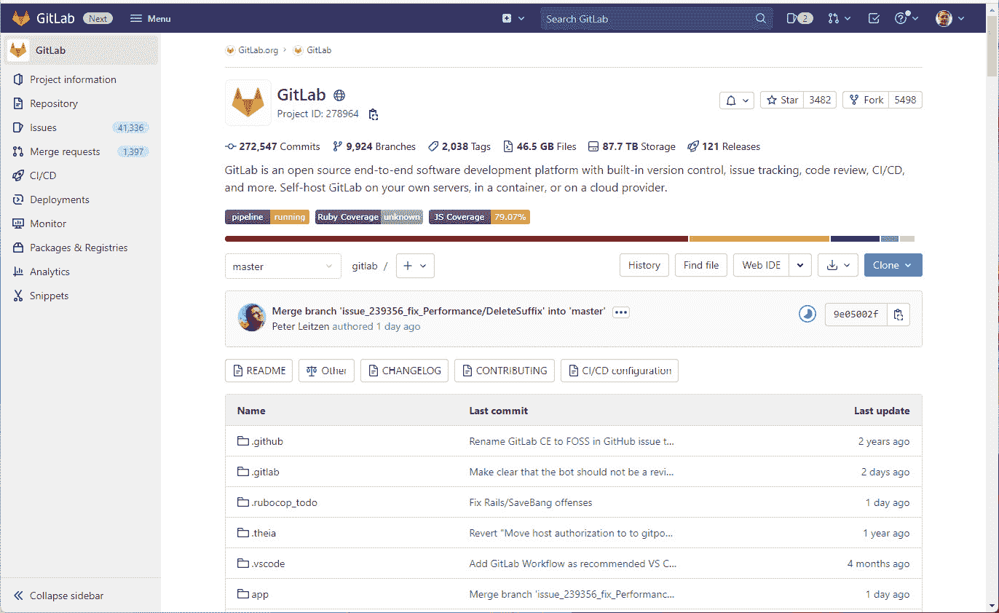
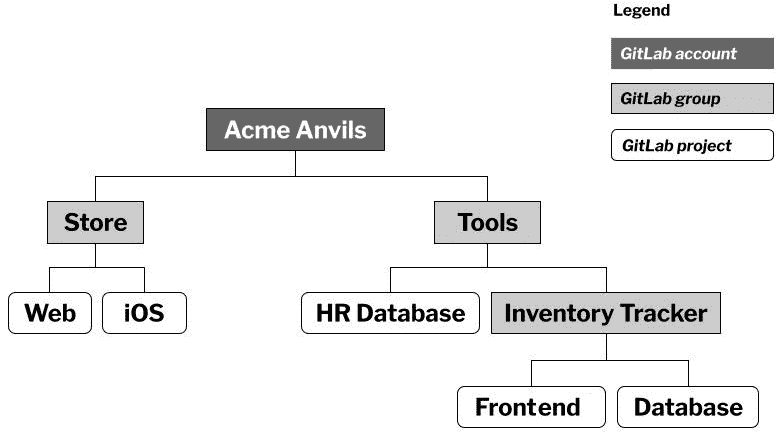
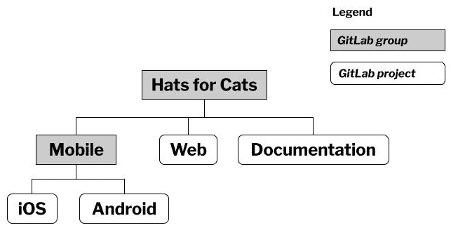
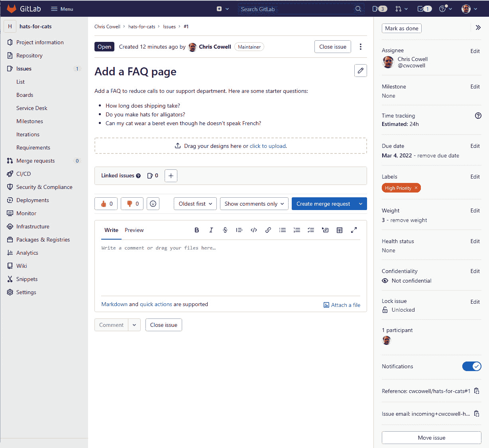
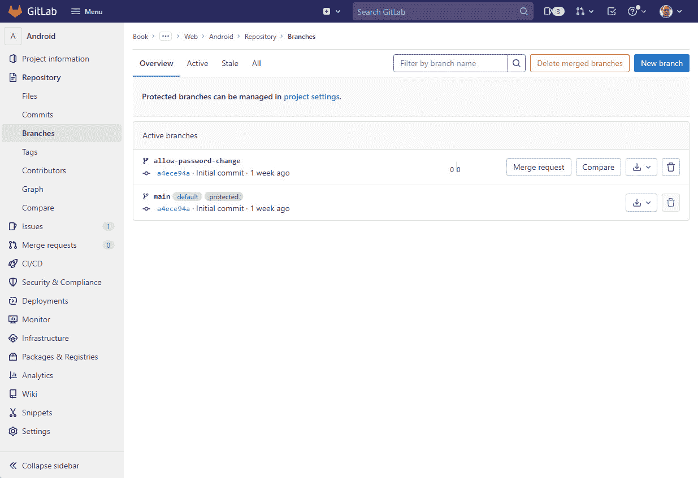
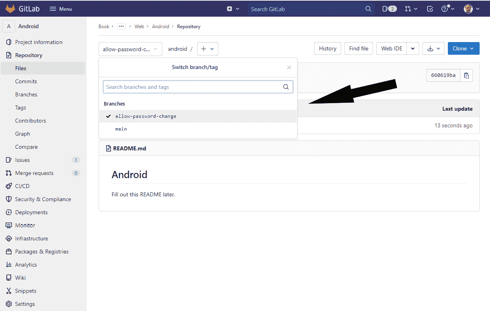
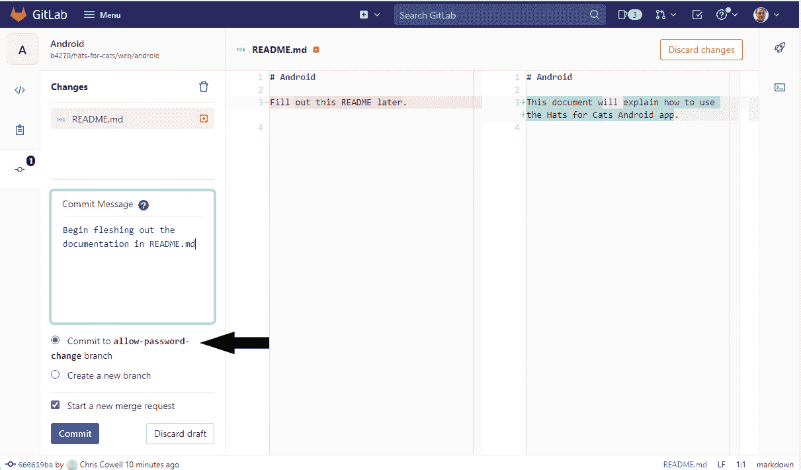
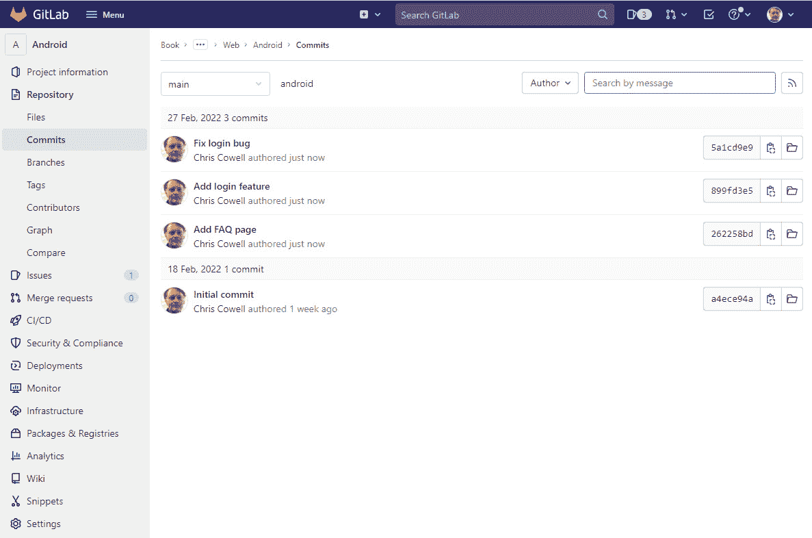
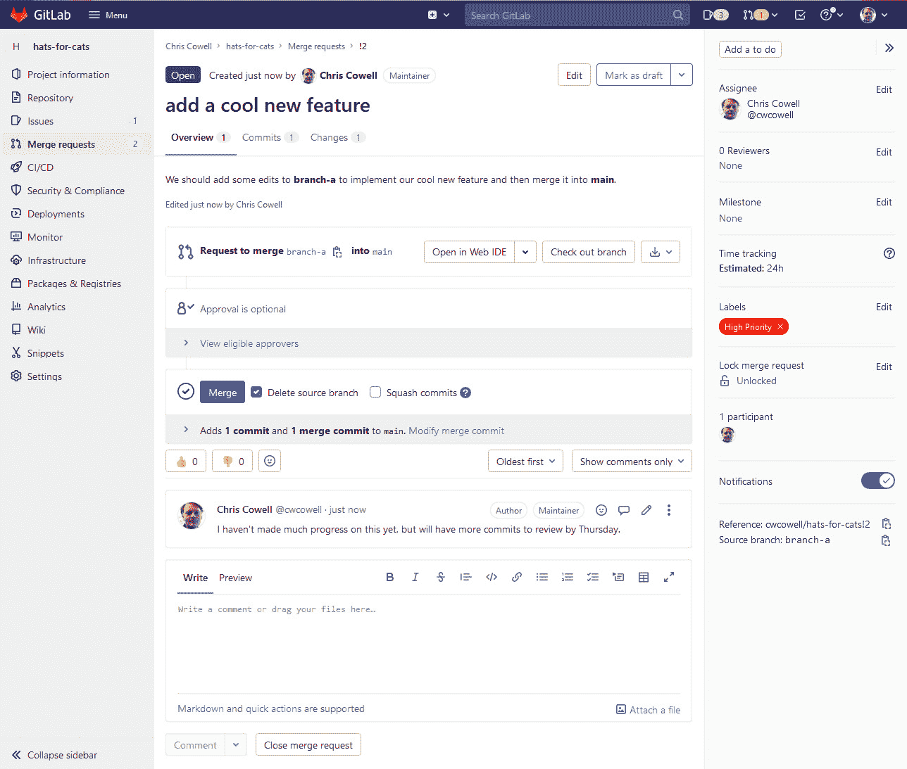
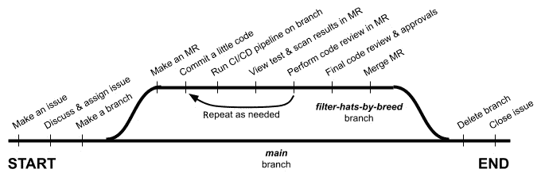

# 理解 GitLab 组件

GitLab 是一个庞大而复杂的 Web 应用程序，旨在成为软件开发生命周期中每个步骤的“一站式商店”：它帮助你规划、创建、测试、保障和部署软件。这些仅仅是它涵盖的大任务！它还帮助你通过多种工作流跟踪进展、记录项目、创建发布说明、存储 Docker 镜像或其他类型的软件包、托管静态网页、监控已部署应用的性能，以及监控 Kubernetes 集群中的可疑网络流量。这个列表可以更长，但你明白了：*GitLab 有助于完成标准软件开发生命周期中的大部分任务* *。*

在*第一章*中，我们阐明了 GitLab 旨在解决的关键软件开发生命周期问题。现在，我们将向你介绍一些关键的 GitLab 概念和组件，这些是你有效使用 GitLab 时需要熟悉的内容。一旦你理解了这些基础，你将准备好开始设置 CI/CD 流水线，我们将在*第四章*中开始讨论这个话题。

在本章中，我们将讨论项目、小组、问题、分支和合并请求。接着，我们将通过向你展示如何在应用程序的 GUI 中创建、管理和使用这些概念，使这些 GitLab 组件栩栩如生。当你熟悉了这些基础后，你将学习如何使用 **GitLab flow**，这是 GitLab 开发人员推荐的一种最佳实践工作流，用于在编写、测试、保障和部署软件时有效地结合工具的各个组成部分。

本章的主要主题如下：

+   强调“为什么”而非“如何”

+   介绍 GitLab 平台

+   将工作组织成项目和小组

+   使用问题跟踪工作

+   使用提交、分支和合并请求安全地编辑文件

+   使用 GitLab flow 启用 DevOps 实践

# 技术要求

如果你能通过登录到 GitLab 实例上的账户来跟随本章内容，你将从中受益最大。这个账户可以是托管在 gitlab.com 上的实例账户（也称为 **软件即服务** (**SaaS**) 实例），或者是托管在你公司上的实例账户（称为自管理实例、自托管实例或本地实例）。你甚至可以将 GitLab 托管在你自己的硬件上，或者通过 AWS EC2、Google Cloud Platform 或 Microsoft Azure 等服务在云中的虚拟机上托管。

由于 GitLab 的硬件要求非常低——你甚至可以在树莓派上托管 GitLab——并且有多种包含所有 GitLab 实例所需内容的“Omnibus”Linux 安装包，因此托管自己的实例并不像听起来那么不可思议。如果你想走这条路，我们将引导你查看[`about.gitlab.com/install`](https://about.gitlab.com/install)上的 GitLab 安装文档，获取更多信息。

如果你更愿意让别人来为你处理安装、管理和升级任务，可以访问[`gitlab.com`](https://gitlab.com)并在他们的 SaaS 平台上注册一个免费账户。虽然 SaaS 版和自托管版 GitLab 之间有一些小的功能差异，但这些差异非常微小，因此我们在本书中不会讨论它们。从实际用途来看，SaaS 版 GitLab 和自托管版 GitLab 的功能集是相同的。

截至 2023 年初，GitLab 有三个**产品套餐**：免费版、Premium 版和 Ultimate 版。第一个套餐是开源的，任何人都可以免费使用，但它的功能最为有限。Premium 版需要付费许可证，但增加了一些额外功能。Ultimate 版的价格高于 Premium 版，但解锁了完整的 GitLab 功能集。这些套餐适用于 SaaS 版和自托管版的 GitLab。

本书将讨论一些在免费套餐中提供的功能，也会介绍一些仅在 Premium 和 Ultimate 套餐中可用的功能，还有一些功能只有在 Ultimate 许可证下才能解锁。如果你的预算有限，不用担心。即使在较低的套餐中，GitLab 也有足够的功能来提升你作为软件开发者的工作效率。许多人发现免费套餐已足够满足他们的需求，尤其是如果他们主要使用 GitLab 来做个人爱好项目的话。

# 强调“为什么”而非“如何”

在我们开始之前，有一句警告。大多数情况下，本书不会逐步引导你点击 GitLab GUI 中的每个操作步骤。

首先，大多数操作的指令已经在 GitLab 官方文档中得到了很好的覆盖，文档内容清晰且详尽。

其次，由于 GitLab 正处于快速开发中，其图形用户界面（GUI）经常发生变化。这些变化通常不是激烈的、破坏工作流的变化，但它们足够显著，以至于截图或如何执行操作的逐条指令很容易变得过时。这意味着本书中的具体指令可能会变得让人困惑或无法执行，甚至可能导致数据丢失，因为随着时间推移 GitLab 的 GUI 会发生变化。为了避免这个问题，我们将主要关注*为什么*你可能想要使用不同的 GitLab 功能。虽然我们会给你一个*如何*使用这些功能的整体框架，但通常不会提供每个配置选项或工作流的详细操作指引。

# 介绍 GitLab 平台

## 什么是 GitLab？

叫做 GitLab 的公司生产一个单一的产品：一个也叫 GitLab 的 Web 应用程序。幕后，GitLab Web 应用程序是一个复杂的工具、数据库、队列和粘合代码的集合，将一切串联在一起，但就用户而言，它只是一个用于构建软件的单一 Web 工具。

“GitLab”的不同含义

本书中的“GitLab”一词指的是工具本身，而非公司，除非我们明确说明。

正如我们在第一章中所讨论的，GitLab 的单一工具模型比任何由多个、更专注的工具组成的集合更容易安装、管理和升级。它只需要每个用户一套凭据。它为所有功能提供一致的 GUI。它集成了所有软件开发生命周期工具，允许数据在一个功能到另一个功能之间流动顺畅且无丢失或失真。它提供了一个单一的位置，让你在规划、构建、测试、安全和部署软件时，了解软件的状态。更棒的是，它比购买多个单独工具的许可证便宜得多。如果你发现 GitLab 的任何单独功能不能提供你所需要的灵活性或功能，你几乎总是可以将其他工具与 GitLab 集成，以使其符合你的技术需求和偏好工作流。

## GitLab 解决了什么问题？

GitLab 的目标——它旨在解决的问题——随着时间的推移发生了变化并且更加广泛。GitLab 于 2011 年创建时，关注点比较狭窄：它希望使 Git 更加易用且更强大。那时候，它不过是一个基于 Web 的 GUI 封装工具，作为一个集中的地方来存储项目的主 Git 仓库。

从那时起，GitLab 的范围得到了扩展。它现在不仅仅针对 Git，而是针对整个软件开发生命周期。

要了解其使命如何发展，首先需要理解 GitLab 在软件开发生命周期中的“阶段”概念。GitLab 识别出 10 个阶段：

+   **管理**：创建审计和合规报告，并限制对资源的访问。

+   **计划**：将工作分解为可操作的任务，便于优先级排序、加权和分配给团队成员。

+   **创建**：提交、审核和批准文件编辑，无论它们包含的是代码、配置信息还是其他资产。

+   **验证**：运行自动化测试，确保软件按预期执行。

+   **打包**：将软件打包成可部署格式。

+   **安全**：查找软件或其依赖项中的任何安全漏洞。

+   **发布**：部署软件，选择性地使用功能标志和金丝雀发布等复杂技术。

+   **配置**：设置代码将要部署的环境。

+   **监控**：报告性能指标、事件或错误。

+   **保护**：检测部署环境中潜在的安全问题，如 Kubernetes 集群。

请注意，软件开发生命周期分为各个阶段并没有什么神奇之处。另一家公司可能将其分为 9 或 13 个阶段，并可能在阶段之间的边界上有所不同。但 GitLab 的分阶段方法对于任何参与过软件开发的人来说， probably seems reasonable。

让我们回到 GitLab 旨在解决的具体问题上。自从作为解决使用 Git 的难题的方案起步（也就是说，早期的 GitLab 只专注于之前提到的“创建”阶段），现在它已经能够解决软件开发生命周期所有 10 个阶段中的问题。由于不同的阶段呈现出不同的问题，难以用简洁的语言描述 GitLab 旨在解决的单一问题。事实上，考虑到 GitLab 现在解决的是来自 10 个阶段的各种问题，这个问题可能根本无法简明扼要地回答。我们能给出的最简洁、最好的回答就是：*它帮助人们更高效、更少风险地编写更好的软件*。

我们首先要承认，GitLab 目前在解决所有 10 个阶段的问题上还没有达到同等的效果。换句话说，GitLab 提供的解决方案中，有些功能比其他功能更成熟、更强大。正如你可能预期的那样，GitLab 存在时间最长的功能（如与 Git 相关的功能）通常是最成熟的，而较新开发的功能（如在 Kubernetes 集群中保护你的应用免受可疑流量攻击）则显得相对简陋。但 GitLab 对自己对各个阶段问题的解决方案的相对成熟度评估非常透明，并且明确表示其将在近期专注于哪些功能的开发和改进。因此，如果你特别关心 GitLab 对某一特定软件开发生命周期问题的解决方案是否足够完善，快速搜索“GitLab maturity”可能会为你提供所有必要的信息，让你可以做出是否 GitLab 提供足够的功能和灵活性来解决你最关心的问题的明智决定。

在这一点上，你可能会想，GitLab 如何与专注于软件开发生命周期某一阶段的专业工具竞争。毕竟，单一工具真的能替代 10 个独立工具的组合吗？每个工具都被认为是在各自领域中“最佳”的解决方案。

首先，你可能会发现，你并不像最初认为的那样需要那么多功能或那么强大的性能。本书的其中一位作者曾参加过一整天的 Java 性能分析工具培训课程。培训结束时，他脑袋一片混乱，因为这款产品提供了许多惊人的功能，并且他很快就能向经理展示详细的性能瓶颈报告。但最终事实证明，他的公司只需要该工具 2% 的功能，完全可以使用一个更简单且更便宜的替代工具。这个故事的寓意是什么？*无论你关心的是哪个软件开发生命周期阶段，GitLab 可能会提供你所需的所有功能*。

其次，GitLab 的一些功能是通过集成独立开发的开源工具实现的，这些工具在解决其所面临的问题时，确实是最优秀的工具。例如，许多 GitLab 的安全漏洞扫描工具都是备受推崇的开源工具。确实，你可以在 GitLab 之外下载并使用这些工具，但 GitLab 使得在工作流中启用这些工具变得非常简单，并且将它们的输出集成到现有的 GitLab 仪表板中，呈现出一种熟悉的、易于阅读的格式，且与 GitLab 其他报告一致。

最后，如果你确实发现 GitLab 提供的功能不足以解决某个特定的软件开发生命周期问题，你几乎总能找到将外部工具集成到 GitLab 工作流中的方法。其中一些集成是 GitLab 明确支持的，因此能够实现几乎无缝的效果。其他集成可能需要你更多的操作。但几乎任何可以从操作系统命令行运行的工具，都可以与 GitLab 集成。结果可能有所不同，但无法与 GitLab 对接的工具几乎可以忽略不计。

## 验证、安全和发布阶段

既然我们已经确认 GitLab 在帮助解决软件开发生命周期的所有 10 个阶段方面有雄心勃勃的目标，我们就稍微缩小一下视野。本章重点介绍 SDLC 的中间阶段：**验证**、**安全**和**发布**阶段。这些是编写软件时最常用的阶段，也是最具挑战性的阶段，正如 *第一章*中所描述的那样，存在许多问题。幸运的是，这也是 GitLab 最为有效的阶段，而 GitLab 用来解决这些阶段问题的功能，正如你可能猜到的，是 CI/CD 流水线。现在你应该明白为什么本书有这么多内容专注于这一主题了！

为了理解 GitLab 如何帮助解决这三个阶段中发现的问题，你需要了解一些概念、术语和 GitLab 组件。幸运的是，本章接下来要学习的内容将对许多其他 GitLab 阶段也具有相关性和实用性。因此，一旦你理解了如何使用这些概念，你不仅能够继续理解 GitLab CI/CD 管道，还能更好地理解 GitLab 如何解决本书未讨论的其他 SDLC 阶段。

本章的其余部分将重点介绍这些概念、术语和组件。让我们开始吧，首先介绍一个 GitLab 组件——**项目**。

# 将工作组织为项目和组

**项目**是 GitLab 的基本构建块。一个 GitLab 项目代表你正在处理的单个软件产品或单个非软件项目。项目是你存储文件的地方，也是你导航 GitLab 不同功能的起点。简而言之，项目是你作为 GitLab 用户大部分时间所在的地方。

以下是一些典型项目的示例，以及可能使用它们的人员：

+   用于寻找附近洗车店的手机应用，开发团队 #1 使用

+   同一个洗车应用的桌面版，开发团队 #2 使用

+   技术写作团队使用的文档

+   即将举行的会议，用于事件规划团队

+   新员工的入职任务，整个公司使用

正如你所看到的，这些示例中有一些与软件相关，但其他的则与软件无关。你可以使用项目来规划、管理和跟踪任何类型工作的进展。虽然大多数 GitLab 项目确实专注于软件开发，但你的公司可能会发现许多与技术无关的项目用途。

没有硬性规定如何将工作划分为项目。例如，一家公司可能决定将所有文档放入一个独立的、专门用于文档的项目中，正如前面的示例所描述的那样。另一家公司可能会将每个软件产品的文档文件包含在为这些产品创建的项目中。使用最适合你的结构。通常，这需要一些反复试验，因此不要害怕重新调整你的项目使用方式。

了解项目是什么，最简单的方式是看一张项目的图片。你不会感到惊讶，GitLab 本身就是使用 GitLab 工具开发的。这里是 GitLab 开源部分的项目：

图 3.1 – GitLab 开源代码的项目

如你所见，文件列表占据了项目屏幕的最大部分。从截图中可能不明显的是，这些文件实际上是一个 Git 仓库。

您可以将一个 GitLab 项目视为一个“包装器”，它围绕着一个 Git 仓库。此外，您还可以将存储在 GitLab 中的仓库视为“黄金”副本，就像在*第二章*中讨论的那样。由于项目包含 Git 仓库，项目还让您访问 Git 仓库通常包含的所有其他内容，包括 Git 提交、Git 标签和 Git 分支。我们将在本章后面讲解如何查看这些组件。

有时，您会发现自己拥有一系列以某种方式关联的项目。以下是一些典型示例：

+   都属于同一团队的项目

+   macOS 和 Windows 版本的同一软件的项目

+   所有与数据库管理相关的项目

当这种情况发生时，您可以使用**GitLab 组**来聚集这些相关的项目，以便它们都集中存在于 GitLab 的一个地方。您可以将 GitLab 组视为类似于目录或文件夹，用于存储一组项目。

GitLab 组不仅限于保存 GitLab 项目：它们还可以包含其他 GitLab 组。您可以在 GitLab 组内最多拥有 20 级子组。我们鼓励您根据需要使用这些子组，将项目组织成相关的集合。

这是一个组、子组和项目的示例结构，可能有助于您理解这三者之间的关系。假设有一个名为 Acme Anvils 的公司，其 IT 团队负责开发销售铁砧的软件。它还开发用于内部目的的软件，例如库存管理。它们的组层级结构可能如下所示：

图 3.2 – 一个示例的组和项目层级结构

组不仅仅是收集相关项目的方式。您还可以用它们来建立角色和权限。使用组，您可以执行以下操作：

+   邀请其他 GitLab 用户成为组的成员。

+   为他们分配组内的角色。

+   授予用户、用户组或角色查看或编辑该组内任何项目的权限。

因此，组提供了一种简单的方式，可以一次性管理多个用户的访问控制。

一个组还会汇总该组内所有项目的组件。例如，您可以进入单一界面查看该组内所有项目的所有问题。

但是，组不一定要复杂，您也不必使用它们的所有功能。它们是一个很好的方式，可以简单地将相关项目收集到一个地方。

关于项目、组和子组的理论讲解到此为止，现在是时候看看这些概念如何在实践中应用了。

## 示例 – 组织您的“猫咪帽子”工作

回想一下*第一章*，我们介绍了您构思的“猫咪帽子”网店。现在是时候认真设置 GitLab，帮助您开发软件了。

假设你决定“猫帽子”需要以三种不同的形式存在：Web 应用、iOS 应用和 Android 应用。你决定，尽管这三种产品之间的某些逻辑会相似，但它们之间有足够的实现差异，因此每个产品都应该有自己的项目。

（提醒：本章不会告诉你如何创建、编辑或查看项目或组。正如本章开头所提到的，官方 GitLab 文档是你获取逐步操作指导的最佳资源，适用于 GitLab 的任何组件或使用 GUI。本章——实际上整个书籍——专注于*为什么*，而非*如何*。）

由于 iOS 和 Android 都是移动平台，你决定将它们收集到一个专门用于移动开发的单一组中。然后，你决定将这个组与 Web 应用项目一起，收集到一个包含整个“猫帽子”概念的总组下。最后，你决定提供一个完全与平台无关的在线文档：它应该适用于 iOS、Android 和 Web 版本的应用。因为它不与任何现有项目相关联，所以你希望创建一个新的项目来专门保存文档。

在 GitLab 中实现这种结构时，通常从上往下工作最为简便，先从组开始，最后创建项目。你从登录 GitLab 并创建顶级**Hats for Cats**组开始，使用所有默认设置。（如果你想跟着做，请查看官方 GitLab 文档，了解如何操作的详细步骤。）完成后，GitLab 会将你带到该组的主页。现在，你决定在**Hats for Cats**组内创建一个名为**Mobile**的子组。

现在是时候创建项目了。（再次说明，GitLab 文档可以详细解释此过程，但幸运的是，这非常简单。）假设你进行以下操作以开始进行“猫帽子”项目的工作：

1.  在**Hats for Cats**组内创建一个名为**Documentation**的项目。

1.  在**Hats for Cats**组内创建一个名为**Web**的项目。

1.  在**Mobile**子组内创建一个名为**iOS**的项目。

1.  在**Mobile**子组内创建一个名为**Android**的项目。

完成后，你将得到一个看起来像这样的组和项目结构：

图 3.3 – “猫帽子”组和项目层级

在继续之前，先快速复习一下：

+   一个项目会为你提供一个 Git 仓库，你可以在其中存储代码。

+   一个项目也是你在 GitLab 中进行大多数工作的核心位置。

+   可以将多个相关项目收集到一个组中。

+   组可以包含项目、其他组或两者。

+   通过在组内组织项目，甚至可能是子组，你可以保持项目的良好组织，方便查找，并且你还能在组级别分配权限给其他团队成员，并使这些权限应用到该组内的所有项目。

现在该进入 GitLab 的下一个基本构建块：**问题**。

# 使用问题跟踪工作

如果一个 GitLab 项目是单一产品或计划所在的地方，那么 GitLab 的**问题**就是单一工作项所在的地方。如果你曾使用过其他工具进行工作规划和跟踪，可能会遇到像“故事”或“工单”这样的术语，它们用于描述与 GitLab 问题类似的组件。

问题存在于 GitLab 项目中，每个问题仅属于一个项目（尽管它们可以在项目之间移动）。除了与项目相关联外，问题还与大量其他 GitLab 组件相关联，正如我们在介绍这些组件时所看到的那样。事实上，这些关联是 GitLab 在 SDLC 的所有 10 个阶段中发挥作用的关键因素之一。

## GitLab 问题的结构

GitLab 问题由多个部分组成，其中这四个部分是最重要的：

+   **标题**

+   一个**描述**

+   几个可选的**元数据**字段

+   一个有线程的**讨论**，团队成员可以在其中对问题进行评论。

让我们更详细地看一下这些问题组件。

标题是对问题内容的简短描述。例如，`添加 FAQ 页面`、`修复 bug #12`或`提高页面加载性能 20%`都是合理的问题标题。你不需要在标题中提供所有关于某个功能的细节；那是**描述**字段的作用。

**描述**字段可以包含你想要的任意多或少的文本。它可以包含截图或链接，并充分利用 Markdown 的格式化功能。随着更多信息的揭示或问题方向的变化，它也可以在后续编辑。

问题有几个元数据字段。我们不会逐一介绍所有字段，但这里是一些最重要的：

+   **指派人**：此字段标识一个或多个负责此问题的人，意味着他们负责推动问题的进展，并作为联系人，解答那些不想添加到问题讨论区的提问或评论。

+   **截止日期**：GitLab 中有几种方式可以使用截止日期，但最直接的方式是将截止日期直接分配给问题。

+   **标签**：我们稍后会更详细地讨论这些标签，但它们的作用是优先级排序、路线指定或报告问题进度等。

+   **工作量**：该字段描述你预期问题所需的工作量。如果你熟悉 Scrum 项目管理方法，那么你也使用过类似的“故事点”概念。为一个问题分配工作量时，你可以使用具体的度量单位（例如人时），也可以使用更抽象的度量单位（例如，小任务为一分，中等任务为两分，大任务为三分）。每个团队都有自己关于这方面的哲学，通常是通过时间和经验积累出来的。

除了这些明确的元数据字段，还有一个关于问题的重要元数据：它是开放还是关闭的。每个问题开始时的状态是**开放**。当某人完成了问题所需的工作后，通常会将其状态更改为**已关闭**。

最后，每个问题都有一个讨论区，允许人们参与线程式讨论，就像你在 Facebook 或 Instagram 上看到的那样。由于是线程式的，参与者可以回复个别消息，也可以添加全新的消息。讨论可以包括表情符号、链接或图片。

既然一张图片胜过千言万语，这里有一个来自你们“猫咪帽子”项目的示例问题：

图 3.4 – 示例问题

大多数项目包含许多问题，这些问题的状态有**开放**和**已关闭**。GitLab 使得查看项目中所有问题的列表变得容易，并且可以聚焦到列表中的任何问题，查看该问题的完整详情。你也可以从组级别而不是项目级别查看问题列表。这种视图会显示属于该组内任何项目的所有问题列表。所以，如果你想了解“猫咪帽子”应用的 iOS 和 Android 版本还有多少问题需要处理，你可以从各个独立项目中升到上一级，查看**移动端**组中所有**开放**状态的问题列表。

## 问题能代表的任务类型

你可能认为问题仅用于捕捉与软件开发相关的工作，但那只是问题冰山的一角。让我们来看看可以用 GitLab 问题描述和追踪的广泛任务范围：

+   增加一个功能。

+   修复一个 bug。

+   编写自动化测试。

+   设置一个数据库。

+   配置一个全团队使用的工具。

+   研究技术选项。

+   头脑风暴，解决一个问题。

+   计划一个活动。

+   对团队进行调查，了解编码标准的偏好。

+   报告并管理安全事件。

+   提出一个新产品或新功能的想法。

+   提出任何人都可以发表意见的问题。

+   请求为即将到来的公司聚会设计 T 恤。

当然，问题的用途远不止于此，远比这个简短的列表要多。如你所见，问题可以用于技术性或非技术性的工作，既可以由个人使用，也可以由整个公司使用。

再举一个可能意外的例子，GitLab 的每位新员工都会被分配一个问题，其中包含*欢迎加入公司*文本以及一长串要完成和检查的入职任务。在员工的前几周，员工的经理和公司的人力资源部门将监控此问题，以查看他们在入职流程中的进展情况。稍后，当入职流程完成并关闭该问题后，员工可以将该问题用作公司政策和流程的参考来源。

## 标签

在解释如何实际使用问题之前，我们需要向您介绍**标签**。这些是带有短文本的彩色标签。您可以将标签应用于问题或其他 GitLab 组件，例如合并请求（稍后我们会讨论），并在它们不再有用时删除它们。您可以为您的项目或组定义任何需要的标签，并始终可以添加更多标签或删除现有标签。然后，您可以将一个或多个标签应用于问题，以“标记”该问题的标签内容。

这里是一些通常创建的标签示例：

+   **High Priority**：指示需要立即处理的问题

+   **QA**：指示由质量保证团队负责的问题

+   **Status::Healthy**：指示按计划进行的问题

+   **Status::At Risk**：指示已落后并需要额外资源分配的问题

请注意，最后两个标签在其描述文本中有双冒号。双冒号具有特殊含义：它们将这些标签转换为**作用域标签**，这意味着它们是互斥的。也就是说，一个问题可以被应用为**Status::Healthy**标签或**Status::At Risk**标签，但不能同时存在。不带双冒号的非作用域标签可以以任何组合应用于任何问题。例如，您可以将**Front-end**和**DB**标签同时应用于需要前端开发人员和数据库管理员工作的问题。

GitLab 使用数百个问题来优先考虑、路由、分配责任并跟踪工作，以开发 GitLab 产品本身，因此请勇于制作和应用您所需的任何问题；它们可以免费创建并易于管理。

## 问题工作流程

与许多 GitLab 组件一样，对于每个团队在每种情况下都有效的问题使用工作流并不存在单一的解决方案。鼓励您进行实验，并发现根据您的需求和团队文化最佳使用问题的方法。但是，我们可以提供一个问题的*典型*工作流示例，您可以将其用作探索与 GitLab 问题合作的可能性的起点。

这是您的一项名为"Hats for Cats"项目的样本工作流程：

1.  *构思需要完成的工作，并弄清楚这项工作属于哪个项目*。例如，作为《Hats for Cats》iOS 项目的一部分，你需要研究 Objective-C 和 Swift 编程语言，以决定使用哪种语言来编写 iOS 应用。

1.  *在该项目中创建问题并描述问题中的工作内容*。你创建了一个标题为`Research languages for iOS`的问题，并添加了关于可能的编程语言及你初步选择哪个语言的看法的描述。

1.  *为问题添加权重*。你决定使用预期的总人天数作为度量标准，并为该问题分配一个权重值为二。

1.  *为问题设置截止日期*。你将问题的截止日期设置为 3 天后。

1.  *分配标签以优先处理并指引问题*。你将**iOS**和**高优先级**标签分配给该问题。前者确保合适的人员进行监控，后者则表明该问题需要立即开始处理。

1.  *讨论问题*。参与开发《Hats for Cats》iOS 应用的人员分享他们在不同 iOS 语言方面的经验。其他人提出澄清性问题。有些人提供了讨论 Swift 和 Objective-C 的外部博客链接。你还从一个面向开发者的网站上添加了一个语言对比表的截图。

1.  *分配问题*。在讨论中，你询问最有经验的开发者是否愿意处理这个任务。当他们同意后，你将问题分配给他们，这样每个人都知道他们负责处理这个问题并更新进展。

1.  *更新标签*。随着工作的进展，你分配问题的人员更新问题的标签。例如，当工作开始时，他们可能会移除**高优先级**标签，并在意识到自己可能无法在问题的截止日期前完成研究时，添加**状态::风险中**的标签。

1.  *完成后关闭问题*。被分配该问题的开发者完成了他们的研究，并将结果发布到问题的讨论区。然后他们关闭了该问题，表示该问题已无进一步工作需要完成。

这就是你对 GitLab 问题的介绍。你已经了解了在问题中可以描述的工作内容、问题中包含的数据以及在处理问题时可能采用的工作流程。没有创建和使用大量问题，很难成为一个高效的 GitLab 用户，因此在熟悉 GitLab 的过程中，练习创建、查看和编辑问题是一个很好的方法。

# 安全地编辑文件，包括提交、分支和合并请求

在上一章节中，你了解了如何使用 Git 中的分支和提交，其中分支是一系列提交，而提交是由一个或多个文件的编辑所组成的快照。因为从某些角度看，GitLab 是 Git 仓库的一个封装（尽管它远不止如此），所以分支和提交也是使用 GitLab 的重要组成部分。在 GitLab 中，还有一个你会频繁使用的相关概念：**合并请求**（通常简称为**MR**）。在本节中，我们将解释什么是 MR，并向你展示如何在 GitLab 中操作这三者。

GitLab 通常提供多种方法来完成同一件事，在操作提交和分支时也不例外。你可以通过在终端中输入命令，或者使用 GitLab 图形界面（GUI）来执行你需要的大多数操作。由于 MR（合并请求）是 GitLab 特有的概念，而不是 Git 的一部分，你会发现 MR 需要使用 GitLab GUI。

在你能将编辑提交到分支之前，你需要先创建该分支。回顾上一章节，你会记得你可以使用 `git branch <BRANCH-NAME>` 命令创建分支，随后使用某种形式的 `git push` 命令将分支复制到项目仓库的“金本副本”中。或者，你也可以通过 GitLab 的 GUI 在 GitLab 中创建一个新分支，然后使用 `git fetch` 和某种形式的 `git pull` 将该分支复制到你本地的仓库副本中（前提是你有本地副本）。由于确切的命令依赖于你的情况，你应该参考你最喜爱的 Git 专门书籍来获得完整的信息。

尽管通常我们不会详细指导你如何使用 GitLab GUI，但创建分支、提交和 MR 是有效使用 GitLab 的基础，因此我们将概述如何通过 GUI 操作这些内容。

让我们从创建一个分支开始。因为分支是 Git 仓库的一部分，而 GitLab 项目不过是一个附加了大量额外功能的 Git 仓库，所以在 GitLab 项目中创建分支是合乎逻辑的。例如，假设你想为《Hats for Cats》安卓应用添加一个`allow-password-change`分支，以便你的开发人员能够添加一个让用户管理密码的功能。

下面是如何添加分支的方法：

1.  在你的组结构中导航并打开**Android**项目。

1.  在页面左侧的导航面板中，点击**仓库** > **分支**。这将带你进入项目仓库中存在的分支列表。

1.  点击**新建分支**按钮，填写分支名称，点击**创建分支**按钮，完成：

图 3.5 – 项目中的分支列表

创建分支后，你可以提交编辑。再次提醒，这有两种方式可以做到。你已经了解了在终端中使用的三条命令：`git add <FILE-NAME>`，然后是`git commit --message "<MESSAGE>"`，再接着是`git push`。不过，如果你更愿意在 GitLab 内操作，下面是你需要做的：

1.  通过点击左侧导航栏中的**Repository** > **Files**，导航到项目的代码库。

1.  确保你正在正确的分支上工作，方法是点击页面左上方的分支名称下拉菜单：

图 3.6 – 在项目中选择分支

1.  在代码库的文件列表中，点击你想编辑的文件名，这样就会显示该文件的内容。

1.  点击**Edit in Web IDE**以打开浏览器中的编辑器，并对文件进行必要的更改。

1.  如果你想编辑此提交中的更多文件，点击页面左侧文件浏览器中的下一个文件名，并对其内容进行任何你想要的编辑。

1.  当你完成更改后，点击**Commit…**并输入提交信息。如果你还没有为该分支创建合并请求，通常建议勾选**Start a new merge request**复选框。点击**Commit**，你就完成了。

1.  如果你已经将代码库克隆到本地机器上，你可能想使用`git checkout <BRANCH-NAME>`，然后执行`git pull`，将你刚才做的提交复制到本地代码库，但你通常可以选择偶尔这样做，而不是每次提交后都这么做。

图 3.7 – 提交你的编辑

直接在 GitLab 中编辑文件并将更改提交到你项目的代码库，而不需要触碰终端，这是使用 GitLab 的一大乐趣，因此值得多加练习，直到它成为你正常工作流程的一部分。

创建分支对你没什么帮助，除非你能在它们之间切换，这样你可以查看或编辑任何你想要的分支内容。你已经学会了如何使用命令行通过`git checkout <BRANCH-NAME>`或`git switch <BRANCH-NAME>`来完成这件事。在图形用户界面中切换分支同样简单：只需找到许多页面左上角存在的分支下拉菜单，切换到你喜欢的分支即可。有时容易忘记你当前所在的分支，因此养成时常检查此下拉菜单的习惯是个好主意，帮助自己保持方向感。

提示

这可能不言而喻，但我们还是要说一下：使用终端命令切换分支只会改变你本地仓库中所在的分支，而不会改变你在 GitLab 上托管的仓库中的分支。同样，在 GitLab 图形界面中切换分支只会改变你在 GitLab 托管的仓库中所在的分支，而不会改变你在本地仓库中的分支。因此，不要在一个位置切换分支后就认为你在另一个位置也切换了；本地和远程仓库中的分支是完全独立的。

## 提交历史记录

在 Git 仓库中最常见的操作之一是查看特定分支上提交的历史记录，如*图 3.8*所示。正如你在 *第二章*中学到的那样，在终端中运行`git log`会显示你所在分支的所有提交的反向时间顺序历史记录，包括每次提交的作者、时间戳、**安全哈希算法**（**SHA**）和提交信息。你也可以在 GitLab 图形界面中做同样的事情，只需导航到项目的主页，选择你感兴趣的分支（从分支下拉菜单中），然后点击**历史记录**按钮：

图 3.8 – 分支上的提交列表

历史记录是该分支上提交的列表，最新的提交在列表的顶部。这个列表包含与`git log`命令相同的每个提交信息。使用这样的图形界面一个很好的附加功能是，你可以点击列表中的任何提交，查看每个文件中所做的所有编辑，以易于阅读的并排格式显示（如果你觉得这种格式更容易查看，也可以切换为内联格式）。当然，你也可以在终端中使用`git diff`命令获得相同的信息，但终端输出远没有 GitLab 图形界面中的输出那么容易阅读。

## 合并一个 Git 分支到另一个分支

在 GitLab 图形界面中，将一个分支合并到另一个分支是与终端中的操作显著不同的第一个操作。如你所记得，你可以通过命令行使用`git checkout main`，然后执行`git merge branch-a`，将`branch-a`合并到`main`（以两个示例分支名称为例）。但是，在 GitLab 图形界面中执行相同的操作需要一个合并请求（MR）。这是 GitLab 中最重要且最常用的部分之一，因此理解并练习这一操作非常关键。需要理解的是，合并请求是从 GitLab 图形界面中将一个分支合并到另一个分支的*唯一*方法。以下是你某个 Hats for Cats 项目中的示例合并请求：

图 3.9 – 示例合并请求

### 合并请求

合并请求就是字面意思：GitLab 中的一个组件，表示某人（可能是你，也可能是别人）请求将一个分支合并到 GitLab 实例的仓库金本副本中的另一个分支。合并请求看起来很像一个问题，它包含了许多相同的字段，包括标题、描述、受指派人以及线程式讨论。

但是，合并请求会添加一些在问题中不存在的额外字段。这些字段包括 `branch-a` 到 `main`，其中源分支为 `branch-a`，目标分支为 `main`。

合并请求还会显示源分支上的 Git 提交，并将每个提交的所有修改收集到合并请求中的单个页面内。这让你能够精确看到将源分支合并到目标分支时会如何影响目标分支中的文件。

合并请求的另一个特点是，它们包含一个特殊面板，显示 CI/CD 管道对分支中的代码进行的自动化测试和扫描结果。我们稍后会更详细地讨论这个面板，但你可以将其视为显示你正在开发的代码总体状态的“一站式商店”。它是否按预期工作？是否存在安全漏洞？是否引入了使用不被接受的软件许可证的依赖？简而言之，通过查看这个面板，你可以快速判断你在该分支上进行的工作是让整体软件产品变得更好还是更差。这无疑是一个非常实用的功能！

最后，合并请求中包含一个大而显眼的 **Merge** 按钮。合并请求的任务是将一个分支的提交合并到另一个分支，所以如果没有提供执行合并的方式，这个按钮就没有意义。这个按钮可能因为许多原因变成灰色并无法点击，从而阻止合并的进行。

以下是一些合并请求被阻止的原因示例。请注意，许多这些阻止行为是可以配置的，因此你可以决定最适合你团队的配置：

+   合并请求标题以 `Draft` 开头。这表明与合并请求关联的分支仍在进行中，开发者不打算立即合并。

+   GitLab 的许可证扫描器（稍后章节会详细介绍）会检测到合并请求引入了一个与整体项目许可证不兼容的依赖。

+   自动化测试未通过与合并请求关联的分支最近一次提交的测试。

+   合并请求中的一个或多个讨论线程未解决。

+   合并请求没有获得足够的批准，或者没有得到合适人员的批准，无法满足审批规则。我们将在接下来的内容中更详细地描述这一点。

### 审查和批准合并请求中的代码

由于合并请求有修改目标分支中文件的权限，而目标分支几乎总是 `main`、`master` 或包含稳定、可生产的代码的分支，因此每个合并请求都必须经过开发团队成员的严格审查。幸运的是，合并请求有多个功能来支持代码审查：

+   你可以**将评论直接链接到文件中的一行或多行**，这样当你提出改进建议（或表扬时），就能清楚地表明你指的是哪些代码行。

+   你可以在讨论区直接**提议替代代码**。这些提议甚至包括一个按钮，允许原作者通过图形用户界面一键接受你的建议。

+   你可以**指定评审人员**来自你的团队。他们会通过电子邮件收到通知，告诉他们你希望他们审查合并请求中的修改。这些评审人员会被列在合并请求的元数据字段中，团队中的每个人都知道是谁被要求审查文件。

+   团队成员可以**批准你的代码**。这是一个与审查代码不同的概念。审查通常是一个重复的过程，包括审查、原作者根据审查进行修复、再次审查、再次修复，以此类推。批准是一个单一的、一次性的“点赞”，意味着批准者认为你的修改已经准备好合并。

+   你可以创建**谁必须批准你的合并请求**的规则，才能使其被合并。这些规则可能变得相当复杂，涉及多个团队或人员。以下是三个示例规则，规定了谁必须批准合并请求才能解除阻止：

    +   **规则 1**：你的团队的技术负责人或架构师

    +   **规则 2**：你的开发团队经理

    +   **规则 3**：质量保证团队的任何一位成员，加上安全团队的两位成员中的一位，再加上三位架构师中的两位

如你所见，合并请求对于让你的修改得到审查、批准并合并到正确的分支至关重要。

### 在提交代码之前创建合并请求

创建合并请求有多种方式，包括 GitLab 在一些可能出乎意料（但很有帮助）的位置提供的快捷方式。正如我们在描述其他 GitLab 组件时所做的，我们会要求你查看官方的 GitLab 文档，以获取如何使用图形用户界面创建、查看和管理合并请求的最新指南。

然而，我们确实需要为你提供一些关于*何时*创建合并请求的指导。这个听起来可能有些奇怪或违反直觉，但我们*建议你在创建分支后立即创建合并请求，而在你提交任何代码之前*。

如果你曾使用过像 GitHub 这样的工具，这些建议可能听起来特别奇怪。GitHub 的合并请求（称为**拉取请求**）通常是在你提交了所有计划放到分支上的代码之后才创建的。毕竟，如果合并请求的目的是将源分支的修改合并到目标分支，那么当源分支上没有任何代码可以合并时，打开合并请求又有什么意义呢？

### 将合并请求作为代码的仪表盘

在工作流程中尽早创建合并请求的做法在 GitLab 用户中之所以被广泛接受，原因有两个。首先，合并请求充当“仪表盘”，让你了解你正在向分支添加的代码的整体质量。这个仪表盘回答了以下类似的问题：

+   自动化测试是否通过？

+   你的代码是否满足性能要求？

+   你的代码是否引入了任何安全漏洞？

+   如果它添加了任何新的第三方依赖项，它们的许可证是否与整体项目许可证兼容？

+   你的代码是否满足风格和质量要求？

+   如果你将应用程序作为 Docker 镜像发布，那么你的代码所打包的基础 Docker 镜像中是否存在已知的安全漏洞？

这些结果在 GitLab 界面的其他部分也可以查看，但在合并请求中整齐地呈现所有结果非常方便。

更重要的是，当你在合并请求中查看结果时，你会看到这些结果的“差异”视图。换句话说，合并请求中的结果将告诉你该合并请求关联分支的测试和扫描结果与对默认分支进行相同测试和扫描的结果*有何不同*。这一点非常宝贵，因为它能让你知道你贡献到分支上的代码是否朝着正确的方向发展。简单来说，*你提交到分支的代码是让软件变得更好还是更糟？*

当然，如果你等到所有编码完成后再创建合并请求，你就无法从这种关于你提交是否走在正确轨道上的持续指导中受益。单凭这一点，就足以成为在提交任何代码到分支之前创建合并请求的一个重要理由。

### 合并请求改善协作

但是，在开发流程中尽早创建合并请求（MR）还有另一个重要的原因：*合并请求鼓励团队成员之间的协作*。通过提供一个讨论区域，它们让你的同事可以审查并评论你所做的每一个提交。你是否引入了微妙的 bug？你的同事可以在它们还容易修复的时候发现并提醒你。你是否开始编写一个不如其他方案高效的算法？有人可以在你投入大量时间和代码之前告诉你。你是否在编程语言中误用了某些习惯用法？如果一位资深开发人员能在过程早期指出这一点，你就可以在将更多代码提交到分支之前调整你的风格。

这些场景有一个共同的主题：通过早期并频繁的协作，通过查看在单个提交中到达的小段代码，问题变得更容易发现，也更便宜修复。MR 正是这种协作发生的地方。

任何被要求审核一个包含 3,000 行代码的已完成特性的人，都会有一种不知从何开始的沉重感觉。或者，当你意识到开发人员误解了规格，未能构建产品负责人期望的功能时，所感到的绝望。又或者，当你指出开发人员在整个功能代码中犯了数百次编程或风格错误时，那种尴尬的感觉。这些情况都可以通过频繁的查看小段代码来避免。而且，这只有在你准备好合并请求并在第一次提交前就已准备好时才有可能。

合并请求所促成的频繁协作，不仅帮助审查代码的人，也帮助了代码的作者。就像自动化测试失败时，只有导致失败的小段代码才容易排查和修复一样，当代码审查员在 12 行代码中发现样式问题、次优算法或 bug 时，比在由 3,000 行代码构成的已完成特性或 bug 修复中发现这些问题要容易得多。早期调整编码实践远比在你认为代码已经完成后，再回去进行潜在复杂或甚至破坏性修复要好得多，也容易得多。

这些原则同样适用于安全漏洞。软件开发中的一条常识是，必须在整个开发流程中考虑安全；你不能仅仅在最后加上安全措施。在合并请求中频繁出现的安全扫描结果帮助我们遵循这一原则，通过从开发流程一开始就“融入”安全，确保了安全性得到重视。经验丰富的开发人员或安全团队成员进行的代码审查也有助于实现这一目标，而 MR 讨论窗格正是进行这种代码审查的地方。我们在本书中早些时候提到的“向左移动”原则——尤其在安全方面显得尤为重要。因为安全问题有时需要对软件的基本架构决策进行广泛的重新思考和修改。此类修复在代码库较小且简单时会更加容易、便宜且不那么具有破坏性，而这正是新特性开发刚开始时的情况。

## 三个好伙伴——问题、分支和合并请求

你现在已经了解了很多关于问题、分支和合并请求的知识。重要的是要理解，当这三个 GitLab 组件用来规划和完成编程任务时，它们是密切相关的。

GitLab 推荐这三部分的特定工作流。他们建议，在确定需要完成的工作后，首先创建一个问题。问题一旦分配给开发人员，开发人员应该立即创建一个分支来进行工作，然后为该分支创建一个合并请求。问题、分支和合并请求应该有相似的（或有时甚至是相同的）标题，以表明它们相互关联。例如，如果你看到这些组件，你就可以从它们的标题中知道它们都在处理同一任务：

+   `simplify the` `login process`

+   `simplify-login-process`

+   `simplify the` `login process`

因为问题、分支和合并请求是密切相关的，并且在使用 GitLab 完成任何编码工作时通常需要这三者，因此有时会将它们称为**三剑客**。如果你不确定如何开始一个编程任务，一个好的经验法则是，在写任何代码之前，确保你已经准备好三剑客。

## 当两个剑客就足够时

然而，也值得提到的是，并不是每个任务都*必须*有三个组成部分。如果一个任务不需要你编辑任何存储库中的文件，那么就不需要创建分支，这也就意味着不需要合并请求。你可能还记得，我们之前提到过，一个问题的可能用例是为即将到来的公司活动征集 T 恤设计。这些 T 恤设计可以直接添加到问题的讨论区。你不需要编辑任何文件来满足该任务的要求，因此你可以不创建分支，也不创建相关的合并请求。事实上，创建分支和合并请求问题可能会让你的同事感到困惑，因为它暗示着你*确实*期望在完成这个工作时编辑文件。

类似地，有些情况下你只需要一个分支和合并请求，但不需要问题。例如，假设你需要修复代码中的一个小错误。你*可以*创建一个问题来描述这个问题，但对于如此小的编辑来说，这可能显得有些多余。在这种情况下，直接创建一个分支和合并请求，然后提交一个修复错误的提交，再请求审查和批准合并请求，似乎更加合适。大多数 GitLab 用户可能会同意，在这种情况下不需要问题（尽管创建一个问题也不会有什么坏处）。话虽如此，一些组织可能会决定每个合并请求都需要一个相关的问题，这也是完全可以接受的政策，尽管偶尔会带来一些额外的工作。

## 问题和合并请求有什么不同？

你可能会想知道问题和合并请求有何不同。我们已经讨论了合并请求包含的额外信息，但这两个组件之间还有一个哲学上的区别，记住这一点会很有帮助。可以把问题看作是用来呈现和讨论**想法**的地方。另一方面，合并请求是你呈现和讨论**代码**的地方。如果你用这个概念来区分二者，它将帮助你理解什么时候只需要其中一个，什么时候又需要两个都存在。这也有助于你理解是否你的任何评论更适合在问题中的讨论部分（如果你在谈论工作的总体想法）或合并请求中的讨论部分（如果你在谈论开发者提交的具体代码）。

问题和合并请求之间的另一个区别在于它们可以具有不同的状态值。问题可以是**打开**或**关闭**的，而合并请求可以是**打开**、**关闭**或**已合并**的。事实上，关闭的合并请求相对较少，因为该状态仅在你放弃合并请求而不是完成合并时使用。尽管确实会发生这种情况，但合并请求更常见的结果是，一旦其关联的分支被合并，它就会转变为**已合并**状态。

现在，你已经学会了如何使用 GitLab GUI 来处理诸如提交、分支和合并请求等基本概念。你还了解到，问题和合并请求乍一看可能很相似，但在 GitLab 中扮演着重要而不同的角色。你明白了在合并任何修改之前创建合并请求的重要性，以及合并请求如何支持团队成员之间的紧密、频繁的合作。最后，你了解了问题、分支和合并请求这三个“好朋友”，并且明白它们是如何协作帮助你规划工作、完成工作以及合并由此产生的代码变更的。换句话说，即使你仍然不清楚 GitLab 在你编写完软件后如何验证、保障、打包和部署软件，你已经接触到了使用 GitLab 编写软件的所有基本构建模块。但我们很快就会涉及到这些内容，保证！

# 使用 GitLab flow 启用 DevOps 实践

让我们通过一个实际的例子来结束本章，看看问题、分支和合并请求是如何结合在一起的。这展示了 GitLab 推荐的最佳实践，说明如何在大多数情况下使用你已经接触过的所有组件，形成一个顺畅的工作流程。事实上，这个工作流程被如此强烈推荐，并且经过时间的验证，GitLab 甚至为这个工作流程命名了：**GitLab flow**。像往常一样，鼓励你将这个工作流程作为你开发自己流程和程序的起点；根据你的团队、产品和组织文化，随时可以根据需要进行调整。

在开发《Hats for Cats》网页应用时，你决定添加一个功能，让用户可以根据猫的品种来筛选帽子。毕竟，给大头的缅因猫戴上牛仔帽，可能会淹没掉德文雷克斯猫那娇小的脑袋。以下是 GitLab flow 中规定的所有步骤，用以实现这个功能：

1.  在 `Filter hats by breed` 中，保留所有元数据字段为空。

1.  在问题的讨论区，你提到两个人，认为他们可能对这个功能是否是一个好主意有看法。

1.  那两个人在讨论区添加了回复。一个只是留下了一个点赞表情符号。另一个表达了对这个想法的支持，但询问是否应该根据其他标准进行过滤。

1.  你认为根据其他标准进行过滤是一个好主意，但你不确定应该选择哪些标准。于是，你创建了另一个问题，标题为 `Question: what criteria should we use when filtering hats?` 你将这个问题暂时搁置，继续集中精力处理 `Filter hats by breed` 问题，因为你确信品种应该是筛选标准之一。

1.  在一次全体团队的规划会议中，团队决定为这个问题分配一个权重值 8，对你们团队来说，这意味着预计这是一个为期 1 周的任务。你将问题指派给名为 Elizabeth 的后端开发人员，并将其截止日期设置为从今天起 2 周后。

1.  Elizabeth 给问题添加了一个*有范围的* **Status::In Progress** 标签和一个*无范围的* **Back-end** 标签。这将帮助团队跟踪问题是否按计划进行，并了解谁对其负责。

1.  Elizabeth 创建了一个名为 `filter-hats-by-breed` 的临时分支来保存她的提交。

1.  Elizabeth 创建了一个标题为 `Draft: Filter hats by breed` 的合并请求。她将队友 Alice 和 Bob 指派为合并请求的审阅者。因为 Elizabeth 还没有在 MR 的分支中添加任何代码，所以他们暂时没有什么事情可做。

1.  现在，Elizabeth 已经设置好了问题、分支和合并请求这三个要素，她开始编码。

1.  在完成一个小的、可测试的代码块后，她将其提交到自己的分支。

1.  Elizabeth 查看了 MR，查看自动化测试、代码质量扫描、许可证扫描和安全扫描的结果，这些测试和扫描针对她的第一次提交进行了检查。结果没有报告任何问题，因此她用一杯加糖的阿萨姆茶庆祝。

1.  Alice 和 Bob 收到了电子邮件通知，得知 Elizabeth 已经向 MR 的分支提交了代码。他们查看了 MR 并审阅了她的更改。两人都添加了一些评论，说明他们喜欢她代码的哪些部分，以及哪些部分可以改进。

1.  Elizabeth 认为其中一些建议不正确，因此她在 MR 的讨论区添加了评论，解释她的观点。她继续讨论，直到大家达成一致，决定如何继续。Elizabeth 添加了一个包含达成共识后修复内容的新提交。

1.  伊丽莎白再次查看 MR，看她最后一次提交的自动化测试和扫描结果。安全扫描指出了一个她无意间引入的漏洞。她迅速添加了一个修复漏洞的新提交。这次修复的代码再次运行扫描，这次一切顺利。

1.  伊丽莎白得到了爱丽丝和鲍勃对她迄今为止提交的所有代码的点赞审核，所以她的工作完成了。她移除了**后端**标签，添加了**前端**标签，并重新将问题分配给了名为乔治的前端工程师。

1.  乔治编写了一些前端代码，并向伊丽莎白使用的相同`filter-by-breed`分支添加了一些提交。每个提交触发一次自动化测试和扫描的新运行，并由爱丽丝和鲍勃审核。

1.  乔治意识到工作进度落后，所以他给原始问题添加了**有风险**标签。开发经理通过指派另一名名为海伦的前端开发者来回应。

1.  提交-审核-检查-自动化测试和扫描结果的周期继续进行几轮，直到乔治和海伦完成该功能。他们移除了**有风险**标签。爱丽丝和鲍勃对代码感到满意，并都在讨论中添加了点赞表情。

1.  乔治从问题标题中移除了`Draft:`，表明他认为代码已准备好合并。

1.  乔治在 MR 的讨论中提到安全和质量保证团队，以便他们可以批准。在他们批准之前，**Web** 项目的批准规则将阻止 MR 合并。

1.  安全团队的一名成员和质量保证团队的两名成员将 MR 标记为“已批准”。这重新激活了 MR 的合并按钮。乔治感到非常高兴和成就感，移除了**前端**和**状态::进行中**标签，并点击了 MR 的合并按钮。

1.  整个团队一起去酒吧庆祝，吃了大量的披萨，感觉不舒服。

这里有一个流程图展示这个流程，但为了清晰起见，省略了一些步骤：

图 3.10 – GitLab 流程的主要步骤

# 总结

你在本章节中接触到了大量的概念和术语，所以让我们进行一个快速回顾。

GitLab 是一个网络应用程序，其使命是解决与 SDLC 的 10 个阶段中的任何一个相关的许多问题。因此，GitLab 不仅解决一个问题，而是解决了软件开发许多不同方面存在的许多问题。

使用 GitLab 主要发生在一个 GitLab 项目中，该项目代表一个软件产品、组织结构的一部分或一个倡议。具有类似主题的项目可以在 GitLab 组内进行收集，而组还可以包含子组。

每个单独的任务或工作块都记录在 GitLab 问题中。问题描述了需要完成的工作，允许团队成员参与关于该问题的讨论，并包括多个字段以存储关于该问题的元数据。问题通常代表与软件相关的任务，但也可以（而且应该）用于描述、规划和跟踪非技术性的工作。

你可以创建*作用域*或*无作用域*标签，以突出显示问题的状态或健康状况，或指示哪个人或团队负责处理该问题。你可以将标签分配给合并请求以及问题。

GitLab 合并请求是你用来在 GitLab 图形界面中将一个分支合并到另一个分支的组件。每个合并请求列出了源分支和目标分支，合并该请求将使所有仅存在于源分支上的提交被添加到目标分支中。合并请求看起来与问题类似，但它们的用途不同：前者用于描述、讨论和合并代码，后者用于描述和讨论想法及任务。

你还可以使用 GitLab 图形界面（GUI）执行许多常见的与 Git 相关的任务，除了管理合并请求。例如，你可以使用 GUI 创建分支、添加提交、显示分支上的提交列表或为提交分配标签。

GitLab 流程是使用所有 GitLab 组件以一种经过验证且可靠的方式构建软件的最佳实践工作流。你不需要强制使用 GitLab 流程，但它是一个很好的起点，帮助你确定哪种工作流和政策最适合你的组织或团队。

到目前为止，我们一直在绕着 GitLab 流程的一个核心部分转圈：**CI/CD 流水线**，它在你将代码提交到仓库后，运行无数不同的检查。在下一章中，我们将直接解决这一部分，深入探讨可能是 GitLab 最强大且最有帮助的功能。
