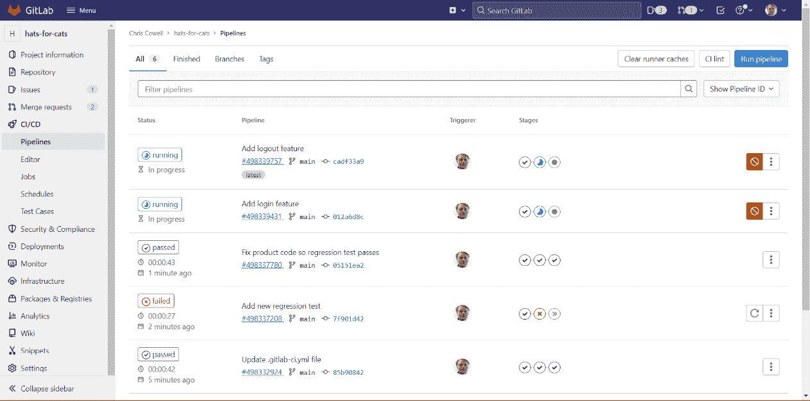
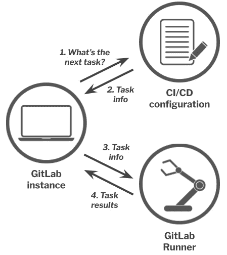
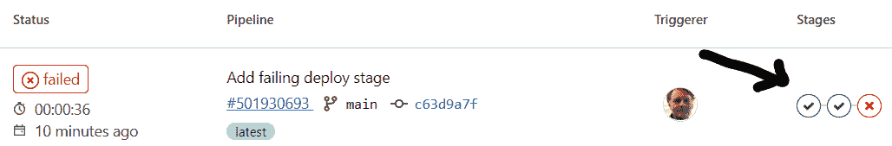
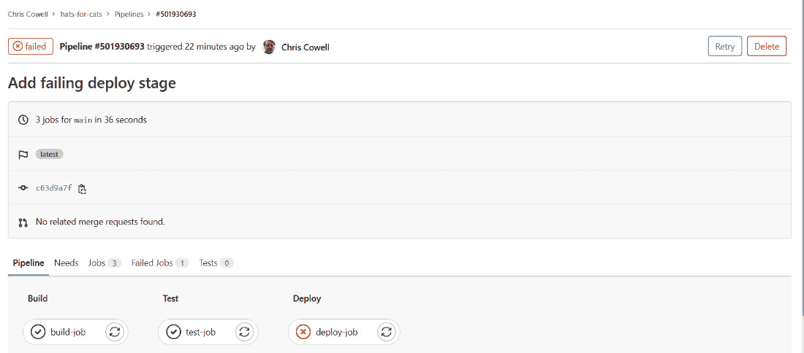
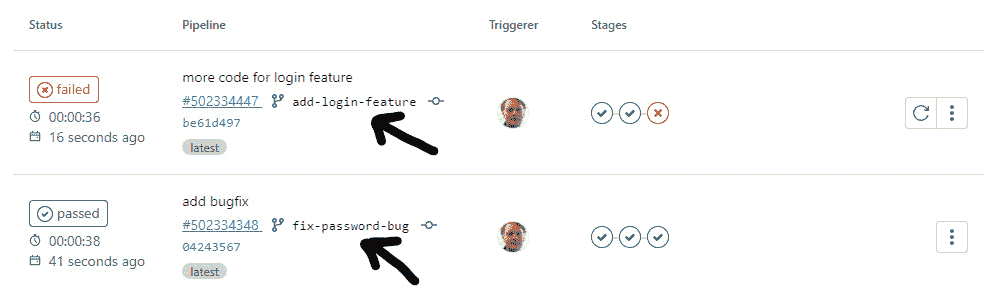
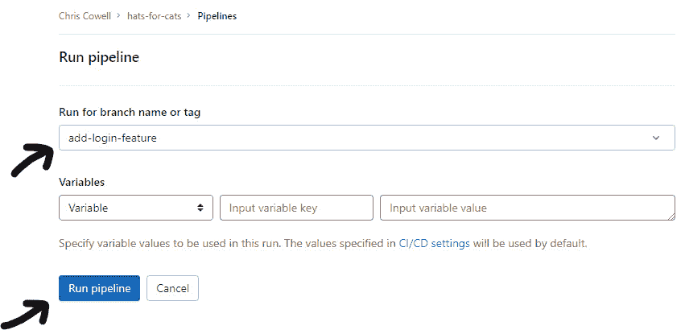
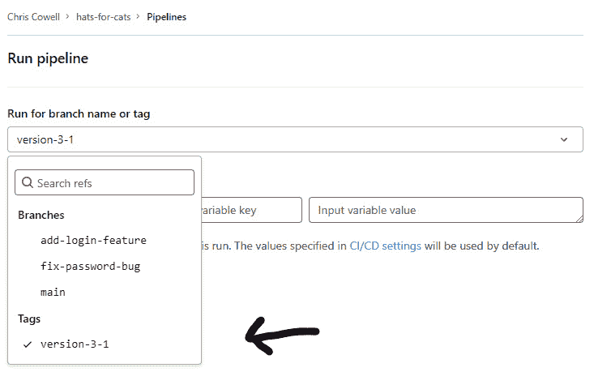
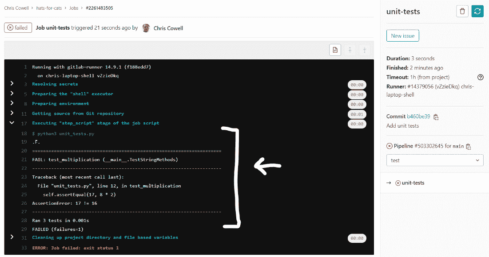
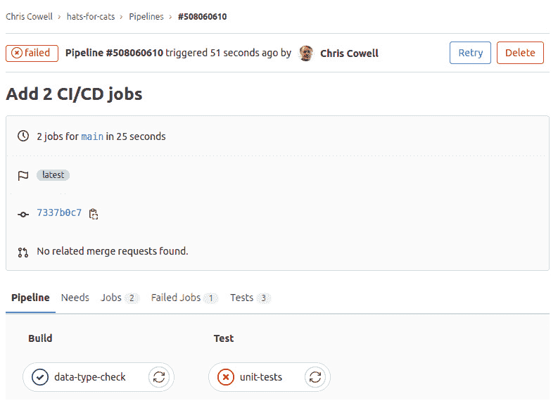

# 4

# 理解 GitLab 的 CI/CD 管道结构

到现在为止，你已经掌握了足够的 Git 和 GitLab 概念，能够理解开发者如何在 **软件开发生命周期**（**SDLC**）的 **Create** 阶段，使用这些工具创建、审查和存储代码。你也已经了解了在 **Create** 阶段之后紧接着的 **Verify**、**Package** 和 **Release** 阶段所带来的一些问题。现在，是时候深入了解本书的核心内容了：GitLab 的 CI/CD 管道如何帮助解决那些 Verify、Package 和 Release 阶段的问题。

在本章中，你将学习什么是 **持续集成**（**CI**）和 **持续交付**（**CD**），以及它们如何融入 GitLab Flow。你将学习如何描述管道的不同部分，包括阶段和任务。你将看到这些部分是如何结合在一起的，以及代码是如何流动的。你将学会如何查看管道的整体状态，以及组成它的各个阶段和任务的状态。你将了解 GitLab 可以通过不同方式触发管道，以及为什么你可能希望限制管道的运行频率。最后，你将学习如何为你的 "Hats for Cats" 软件配置一个简单的 Hello World 风格管道。

一旦你对这些概念和实践有了足够的了解，你将打开通往强大 GitLab 功能的大门，这些功能通过管道进行启用和配置。当你到达这一点时，很可能你会成为一个忠实的 GitLab 用户，无法想象再回到其他 DevOps 工具。

在本章中，我们将涵盖以下主要内容：

+   定义“管道”、“CI”和“CD”这几个术语

+   管道的组成部分——阶段、任务和命令

+   运行 GitLab CI/CD 管道

+   阅读 GitLab CI/CD 管道状态

+   配置 GitLab CI/CD 管道

# 技术要求

与上一章一样，如果你有一个 GitLab 实例的账户（无论是自托管还是 **软件即服务**（**SaaS**）），并且能够登录并用来实践和实验本章讨论的概念，那么你将从本章中获得最大收益。

# 定义管道、CI 和 CD 这几个术语

由于 GitLab 的强大功能很大一部分来自于配置 CI/CD 管道来对你的代码进行各种操作，因此理解管道到底是什么至关重要。所以，讨论这个话题的一个显而易见的起点就是弄清楚我们所说的管道、CI 和 CD 到底指的是什么。我们还不会开始创建管道——那将在后面的章节中讲解。

## 理解什么是管道

*GitLab CI/CD 管道是一系列在每次提交编辑到 GitLab 托管的仓库副本时执行的步骤*。这句话包含了很多内容，所以让我们仔细看看它的每一部分。

“一系列步骤”是什么意思？你可以将这些步骤理解为*对文件执行的任务*。例如，你可能想对文件运行各种测试或扫描工具，以确保代码书写良好、没有安全漏洞、依赖项使用了合适的许可证，并且满足所有功能或性能要求。你可能还想将代码打包成某种可部署的格式，无论是 Ruby Gem、可安装的 Red Hat 包、Docker 镜像，还是其他任何类型的包。当然，你可能还需要一个步骤将代码部署到适当的环境中，无论是测试环境、预生产环境，还是项目的实际生产环境。

“你的文件”是什么意思？从技术角度讲，GitLab CI/CD 管道可以对 GitLab 项目代码库中包含的任何文件执行我们刚才描述的步骤：源代码文件、配置文件、README 文件以及测试数据文件。简而言之，*你可以配置管道来检查、测试、打包、部署或以其他方式操作项目中的任何文件*。管道步骤最常见的目标文件类型是源代码文件，但重要的是要记住，你可以配置管道对 GitLab 项目代码库中的几乎任何文件执行几乎任何任务。

为什么我们规定管道在“每次提交编辑时运行”？因为在绝大多数情况下，*添加 Git 提交正是触发管道对文件运行的原因*。GitLab 带来的 SDLC（软件开发生命周期）优势，只有在管道频繁运行且每次只针对少量文件变更时，才能得到实现。为了实现这一点，GitLab 的默认行为是在每次提交编辑后的文件到 GitLab 托管的项目代码库副本时运行完整的管道。提交并不是触发管道的唯一方式，尽管它是最常见的方式。在本章后面，你将学习如何手动启动管道运行，并了解如何防止管道在提交后运行。

最后，为什么指定管道仅适用于 GitLab 托管的代码库副本很重要？这是因为管道是 GitLab 的概念，而不是 Git 的概念。这意味着管道只能访问 GitLab 所知道的文件，也就是说，它只能访问存储在 GitLab 实例上的项目代码库副本中的文件。换句话说，如果你在本地代码库副本中编辑文件，GitLab 是看不到这些文件版本的（至少，在你通过`git push`同步它们到 GitLab 之前是如此），因此它不能对这些文件版本执行管道。再说一遍：*管道只能作用于存储在你的* *GitLab 实例上的文件版本*。

## 每个项目定义一个管道

每个项目只定义一个 GitLab CI/CD 流水线。然而，流水线中究竟发生了什么——它包含的任务——可能取决于各种因素，这导致流水线的不同运行之间“看起来不同”。例如，针对编辑后的源代码运行的流水线可能包括许多自动化测试和将代码打包成 Docker 镜像，而针对编辑后的文档运行的流水线可能涉及拼写检查和部署到 Web 服务器。但在这两种情况下，它依然是同一个流水线。只是这个单一流水线的某些“特性”可以根据不同的代码修改类型被开启或关闭。很容易看到来自同一个项目的两个流水线运行输出差异巨大，并认为它们是两个完全不同的流水线，但事实并非如此。*每个 GitLab 项目只有一个 CI/CD 流水线*。只是该流水线执行的内容在每次运行时可能会有所不同。

## 理解“流水线”一词的不同用法

“流水线”一词有时被使用得比较宽泛。最准确的理解方式是把项目的流水线看作是应用于项目文件的步骤系列的蓝图或配方。执行这些步骤从技术上来说并不是流水线，而是称为“流水线运行”或“流水线实例”。但人们经常将单个运行称为流水线。我们在本章中也会这样做：我们将经常使用更简短的“流水线”一词，尽管“流水线运行”或“流水线实例”从技术上讲会更准确。无论我们是在讨论流水线的蓝图还是流水线的单个实例，都应该从上下文中清楚地看出来。

一个项目可以同时运行多个流水线实例。如果你在几秒钟内进行两次提交，并且流水线步骤需要几分钟才能完成，那么你可能会有两个流水线实例在同时运行，分别针对这两个不同的提交。每个流水线运行将执行相同的步骤，但针对不同版本的文件。

## 查看流水线列表

使用 GitLab 构建软件时，你最常做的事情之一就是查看正在运行和已完成的流水线实例列表。按照前几章中建立的模式，我们将不太关注如何做到这一点（因为 GUI 可能会发生变化，而且官方的 GitLab 文档会始终提供最新的说明），而更多关注你为什么可能想要这样做。

GitLab 的流水线列表不仅告诉你所有流水线运行的通过/失败状态，还让你知道是否有任何流水线因某种原因“卡住”或无法运行。它显示每个流水线正在运行的代码版本、触发该流水线的提交或 Git 标签的提交信息、是谁进行了提交或标签、流水线何时开始以及运行了多久（如果它已完成）。

管道列表还提供了一个 GUI 控制项，允许你在管道运行过程中取消管道。某些复杂的管道可能需要几分钟（甚至可能需要几个小时）才能运行完成，如果你的项目可用的管道时间有限，你可能希望取消因一些微不足道的文件更改触发的管道，以节省时间。

最后，管道列表还提供了 GUI 控制项，允许重新运行任何管道。如果某个管道因你怀疑是间歇性网络问题而失败，你可能想要重新运行该管道。

这是一个包含 Hats for Cats 项目的管道列表——包括正在运行和已完成的管道。表格按时间倒序列出管道，最近的管道排在最上面。你可以看到，有两个管道运行已完成并显示“通过”状态，一个管道已完成并显示“失败”状态，另外两个最新的管道仍在运行。别担心每一行中显示的图标，它们表示管道各部分的状态，我们会在本章稍后详细讲解：



图 4.1 – Hats for Cats 项目管道运行列表

你已经了解了管道是什么，术语如何被宽泛使用，每个项目如何只定义一个管道，以及你可以从管道列表中获得哪些信息。现在，让我们解析一下 CI 和 CD 这两个术语，看看它们在应用于管道时意味着什么。

## CI – 查明你的代码是否良好

尽管每个 GitLab 项目最多只能定义一个管道，但几乎每个管道都由两个部分组成：CI 部分和 CD 部分。管道的 CI 部分包含专门用于回答这个问题的步骤：*你的* *代码好吗？*

**CI** 代表 **持续集成**。这不仅是一个 GitLab 术语，它是一个标准术语，定义为大多数软件公司所理解和认可。你可以将其视为管道的一部分，它确保你正在编辑的任何文件与你项目的稳定代码库能良好集成。换句话说，当你将功能或修复分支合并到默认分支时，是否会出现新的问题？在你工作时尽早发现这些问题，而不是等到合并后再发现，可以增加轻松解决这些问题的几率。

管道的 CI 部分通过在每次你将代码提交到 GitLab 托管的项目 Git 仓库时，运行测试、扫描和其他检查来完成这个任务。至少，这是 GitLab 管道的默认行为。你可以覆盖这种行为，以便管道不会在*每个*提交时运行，而且有一些合理的原因你可能希望这样做，我们稍后会讨论这些原因。

你已经看到一些与管道的 CI 相关步骤执行的测试和扫描有关的参考内容，作为复习，这里列出一个*部分*的可能的 CI 专注的管道步骤：

+   **功能测试**：您的软件是否按预期工作？这一类别包括**质量保证**（**QA**）团队花费大量时间编写的回归测试。

+   **安全扫描**：您的代码是否引入了任何安全漏洞？

+   **代码质量扫描**：您的代码是否遵循最佳实践，如类的长度、空格的使用和其他样式相关的考虑因素？

+   **性能测试**：您的代码是否符合性能预期？

+   **许可证扫描**：您所有代码的依赖项是否使用与主项目许可证兼容的软件许可证？

+   **模糊测试**：通过传递异常长的字符串、超出预期范围的数字或其他奇怪或极端的数据作为输入，能否触发代码崩溃或异常错误？

因为 GitLab 为这些类型的检查提供了一流的支持，所以它们可以轻松启用在 CI 管道中。但是，*您几乎可以将任何工具、扫描或检查集成到 GitLab 管道中*。我们稍后会学习如何操作，但现在，您只需要知道的是，任何可以从命令行运行的工具——无论是商业的、开源的还是自制的——都可以添加到 GitLab 管道中。

### CI 的好处

正如您所看到的，CI 的一个大优势是它实现了我们之前讨论的“向左转移”理念。您运行测试的越早，发现问题的时间就越早。问题发现得越早，修复它们的负担就越轻。将尽可能多的软件开发任务移到时间线的最前端，能带来巨大的回报。

CI 的另一个优势，特别是与 GitLab 透明的“单一视图”开发生命周期监控方法结合使用时，就是它促进了协作。例如，当安全测试频繁运行时，整个团队可以掌握项目安全状态。我们是否增加了不期望的漏洞，需要分配时间和人力来修复？开发人员是否需要调整他们的编码方法或架构，以减少下个月添加新功能时引入更多漏洞的可能性？如果整个团队——包括管理人员、开发人员、QA、UX、技术写作人员以及所有与产品相关的人员——都能看到项目的安全状态，他们就可以直接帮助解决问题，或根据自己的工作角色调整工作，来修复现有的安全问题或防止未来的安全问题。

这一协作原则不仅适用于安全问题，还适用于功能问题、性能问题、可用性问题或任何其他衡量软件质量的标准。CI 为团队中的每个人提供了对软件状态的了解，使得每个人都能根据自己的角色以适当的方式参与软件的构建或修复。

理解短语 CI 管道和 CD 管道

在本书中，我们有时会提到*CI 流水线*或*CD 流水线*，但请记住，一个 GitLab 项目并没有单独的 CI 和 CD 流水线——它只有一个包含一些 CI 相关步骤和一些 CD 相关步骤的单一流水线。“CI 流水线”和“CD 流水线”这些表达方式仅仅是“项目单一流水线中的 CI 部分”和“项目单一流水线中的 CD 部分”这两个更加繁琐（但更准确）的短语的简化版。

## CD – 找出你的代码应该去哪里（并将其放到那里）

而**CI**这一术语有一个所有公司都使用的标准定义，**CD**的定义则更为模糊。GitLab 使用该术语来指代**持续交付**或**持续部署**。稍后我们会讨论这两个术语之间的区别，但这两者都与决定代码应该部署到哪个环境，并实际进行该部署有关。

如果我们稍微谈一谈环境的概念，这将更加清楚。大多数软件开发团队都会设置多个环境来部署代码。这些环境有不同的目的：有些用于进行软件功能测试，有些用于性能测试，还有些模拟生产环境，以便在生产环境中出现问题之前识别并修复任何集成错误。当然，每个项目都会有一个生产环境，用于托管真实用户互动的代码。

使用 GitLab 开发的软件同样使用环境，GitLab CI/CD 流水线中的 CD 部分负责决定代码应该部署到哪个环境，然后将其部署到该环境中。根据你配置的项目流水线，执行此任务的操作会在决定部署位置时考虑多种因素。流水线最常用的因素是它们是在 Git 分支还是 Git 标签下运行，如果是分支，则考虑该分支的名称。

不同的公司使用不同的 Git 分支命名方案，但以下是 GitLab 流水线的 CD 部分决定项目代码部署位置的典型示例。请记住，尽管这是一个现实的示例，但它绝不是配置 CD 流水线的唯一方式：

+   如果一个流水线在类似`add-login-feature`、`fix-password-bug`或`remediate-cross-site-scripting-vuln`的分支上运行，则将代码部署到**审查环境**进行测试（更多信息请参见下一节）。

+   如果一个流水线在`main`分支上运行，则将该代码部署到**暂存环境**（有时称为**预生产环境**）。

+   如果一个流水线在`production`分支上的 Git 标签下运行，则将代码部署到`version-1-0`或`version-12-2`，并将其部署到所有计划向用户部署的提交。

### 理解审查环境

任何非平凡的软件项目至少需要一个测试环境。这是一个软件可以在开发过程中部署到的机器，QA 团队可以在一个安全的、沙盒式的环境中使用软件，以确保它满足功能需求。有些团队还有额外的、专门的测试环境，专门用于性能测试、负载测试、可扩展性测试或其他类型的测试。GitLab 为这些测试环境起了一个特别的名字：**审查环境**。每个非默认的 Git 分支都有一个专门为该分支提供的审查环境。一旦该分支合并到包含稳定代码库的默认分支中，GitLab 就会销毁不再需要的审查环境。

审查环境是 GitLab 最神奇的功能之一。你无需自己设置这些环境。每次你在 GitLab 托管的项目仓库中创建一个分支时，审查环境会神奇地出现，准备好供你的 CI/CD 流水线进行部署。当你完成分支的工作并删除它或将其合并到稳定的代码库中时，审查环境会神奇地消失。这真的是 GitLab 最棒、最有帮助的功能之一。

### 持续交付

我们已经说过，GitLab 对 **CD** 一词的含义之一是 **持续交付**。这意味着 GitLab 的 CI/CD 流水线会根据你配置的因素，自动将你的代码部署到正确的环境中。但是，有一个重要的例外：在持续交付的情况下，GitLab *不会*自动将你的代码部署到生产环境中。相反，*它提供了一个图形界面控制，要求一个人（通常是发布工程师）手动批准并触发部署到生产环境*。这是一个最终的保护机制，防止你的团队将有缺陷的代码或错误版本的代码部署到实际用户那里。这是 GitLab 用户最常见的 CD 形式。

### 持续部署

**CD** 另一个含义是 **持续部署**。这与持续交付相同，唯一的区别是：它去除了最终的手动保护机制。持续部署会完全自动地将你的代码发送到生产环境，就像它将代码部署到任何其他环境一样。去除人为因素可能会被一些组织视为风险，但如果你拥有一个成熟、经过验证、值得信赖的 CI 流水线部分，你可能会觉得，任何通过测试、扫描和其他检查的代码都足够好，可以直接部署给客户。这对于那些对其 CI 流水线有高度信任的公司来说，可能是一个很好的节省时间的做法。

### 使用 CD 打包和部署代码

CD 管道——无论是实现持续交付还是持续部署——有时需要将项目的代码打包成可部署的形式才能进行部署。稍后我们会更具体地讨论这一点。现在，只需知道管道中的 CD 阶段可能涉及将 Java 代码打包成 WAR 或 EAR 文件，将 Ruby 代码打包成 Gem，将 C 代码打包成 Docker 镜像，收集所有项目文件成一个*tarball*，或者根据项目的语言和部署策略，将项目代码打包成任何最适合的形式。

当然，也有一些情况不需要打包。一些具有简单部署策略的项目可以部署一组松散的、未打包的文件。

无论你的 CD 管道是否打包项目的代码，它总是需要将软件发送到某个地方。这可能表现为将 Docker 镜像推送到一个仓库（无论是公共仓库还是由 GitLab 托管的仓库，我们稍后会了解更多），使用命令行工具将代码部署到 AWS 环境，或使用任何其他特定环境的部署技术。通常，这是项目管道中 CD 部分的最后一项任务（有时是唯一的任务）。

### CD 的好处

回顾一下，CD 的目的是“让发布变得无聊”。如果你的 CD 管道每次提交代码时都会部署——无论是部署到审查环境、暂存环境还是生产环境——这有助于你更频繁地将代码发布给客户，减少变动，并降低风险。

当然，客户看不到你的 CD 管道部署到审查环境或暂存环境中的代码，但通过将代码部署到这些环境并在其中测试软件，你的团队可以在商业合理时更加自信地将代码发布到生产环境。这些非生产环境的部署可以看作是实际发布的试运行，帮助你频繁且小范围地向客户发布版本。这种方法让你能更快地向客户交付功能，让客户更早地对这些功能提供反馈，并减少因意外问题导致的回滚风险。

## GitLab Runner

现在你已经理解了管道、持续集成和持续交付的高层概念，是时候简要介绍一个新且至关重要的概念，它使得管道成为可能：GitLab Runner。

正如你将在下一节中学到的那样，管道最终归结为一系列自动执行的 shell 命令，几乎不需要人工干预。了解这一点对于学习 CI/CD 管道至关重要，因此我们将用不同的表述重复这一点：CI/CD 管道只是由机器人执行的一系列命令，这些命令执行与构建、验证和部署软件相关的任务。

GitLab Runners 是执行这些命令的机器人。从技术上讲，GitLab Runner 是一个小程序，它接受来自 GitLab 实例的命令并执行。我们将在下一章讨论 GitLab Runners 在 CI/CD 管道中的角色，并解释如何安装和配置它们——以及如何判断你是否需要它们。我们不会在这里深入探讨，但理解 GitLab Runners 是管道的核心部分至关重要：它们是将你的 CI/CD 配置代码转化为实际执行任务的地方，这些任务包括构建、验证、安全性检查和部署代码。

为了激发你的兴趣，下面是 GitLab Runners 如何融入 GitLab CI/CD 架构的简要介绍。可以把管道看作依赖于三个组件：定义管道任务的 CI/CD 配置文件、在某个环境中执行这些任务的 GitLab Runner，以及管理和协调管道所有方面，并最终展示管道任务结果的 GitLab 实例。你可以将它们组合在一起如下所示：



图 4.2 – GitLab CI/CD 管道架构图

你将在下一章学到更多关于 GitLab Runners 的各个方面，但这个简短的介绍应该足以帮助你理解本章其余的内容。

通过这些，我们可以总结出管道、CI、CD 和 GitLab Runner 的定义和讨论。正如你所看到的，CI/CD 管道是一系列自动执行的步骤，作用于你项目的 Git 仓库中的文件，每当你编辑这些文件时。这些管道通过频繁运行、针对小的文件变更，GitLab 使得早期发现问题、低成本修复问题，并频繁且低风险地将新代码部署到客户端变得更加容易。除了需要一些时间来处理外，管道几乎全是好处，没有什么理由不去运行它们。它们是你 GitLab 工作流中的关键部分，也是使用 GitLab 开发软件比不使用它时更容易、更高效的一个重要原因。

现在，让我们继续探讨管道的构成。管道由哪些组件组成，它们如何组合在一起，GitLab 又是如何展示管道中发生的事情的？

# 管道的组成部分——阶段、任务和命令

这就是 GitLab CI/CD 管道的总体框架——CI 部分和 CD 部分如何在同一个管道中有所不同，以及为什么管道在 SDLC 中占有如此重要的地位。让我们稍微放大一下，详细了解管道的结构。特别是，*管道是如何通过阶段* *和任务组合在一起的？*

## 阶段

每个流水线由一个或多个**阶段**组成。阶段是与某一主题相关的流水线任务的集合。例如，这三个可能是最常用的阶段：

+   **构建**：此阶段包含将源代码编译和/或打包成可部署格式的任务。

+   **测试**：此阶段包含运行自动化测试、代码质量扫描和代码检查工具的任务，并可能包括安全扫描。

+   **部署**：此阶段将你的代码发送到适当的环境，具体取决于流水线运行时所使用的 Git 分支或 Git 标签（以及其他可能的因素）。

这三个阶段使用得非常普遍，以至于 GitLab 默认会将它们添加到你的流水线中。当然，你可以通过添加、移除或替换阶段来覆盖此默认设置。不论最终使用哪些阶段，我们建议你始终明确地定义你的阶段，即使你使用的是三个默认阶段。这样做可能显得有些冗长，但我们发现它有助于提高可读性，帮助故障排除，并且避免未来的混淆。

你可以定义任意数量的阶段。对于非常简单的项目，你甚至可以只创建一个单一的阶段，构建一个简化的流水线。你可以根据自己的意愿命名阶段，并且可以在阶段名称中包含空格和其他几种标点符号。由于 GitLab 的 GUI 有时会截断过长的阶段名称，因此我们建议尽量将名称保持简短，同时不牺牲清晰度。

GitLab 没有办法检查阶段中包含的任务是否在主题上相关联。这是你的责任。这意味着你可以根据需要创建非常糟糕、凌乱的阶段。例如，你可以在一个名为*部署文档*的阶段中运行自动化回归测试，并且可以在一个名为*准备测试环境*的阶段中部署文档。你如何将流水线划分为不同阶段，以及在每个阶段中放置哪些任务，完全由你决定。然而，这种自由并非没有代价：偶尔审查你的阶段结构，并在需要时进行重构，以保持清晰和一致性，被视为一种最佳实践。

### 在 GitLab GUI 中查看阶段

记得我们在*图 4.1*中看到的流水线运行列表吗？如果你翻回去查看那张截图，你会注意到流水线运行列表中的每一行都有图标，显示每个阶段的通过/失败状态。以下是“猫咪帽子”流水线中构建、测试和部署阶段状态的放大视图：



图 4.3 – 流水线实例阶段的状态图标

在这个流水线实例中，前两个阶段通过了，第三个阶段失败了。从这个视图中，你无法看到阶段的名称，但如果你将鼠标悬停在某个阶段的状态图标上，阶段名称会显示出来。

如果管道中的 *所有* 阶段都通过，则管道的总体状态为 **通过**。在本例中，由于最后一个阶段失败，管道的总体状态为 **失败**。

如果你需要了解每个阶段发生的更多细节，可以点击管道实例行左侧的状态图标（在本例中是红色的**失败**图标）。这会将你带到管道的放大视图，提供有关每个阶段的更多细节。以下是该视图的样子：



图 4.4 – 三个管道阶段的详细信息

你可以看到 **Build**、**Test** 和 **Deploy** 阶段被表示为列，每个阶段内发生的任务列在该阶段的列中。那么这些任务到底是什么呢？这正好为下一个话题做了一个完美的过渡：作业。

## 作业

在本章中，我们一直在讨论管道中发生的“任务”。现在，是时候介绍这些任务的正式名称了：GitLab 称它们为 **作业**。每个作业必须有一个描述其执行任务的名称。

你可以把作业看作是 GitLab CI/CD 管道中构建模块的下一级（即低于阶段）。每个阶段包含一个或多个作业，每个作业都包含在某个阶段中。

如果你再次查看前面的截图，你会看到 **Build** 阶段包含一个名为 **build-job** 的作业，**Test** 阶段包含一个名为 **test-job** 的作业，**Deploy** 阶段包含一个名为 **deploy-job** 的作业。

正如你从这些作业名称中可能猜到的那样，每个作业通常执行一个任务。例如，一个作业可能将你所有的 Java 源代码编译成类。另一个作业可能重置测试数据库中的数据。还有一个作业可能将 Docker 镜像推送到注册表。但和 GitLab 不验证你的阶段是否包含主题相关的作业一样，它也不会验证作业是否执行作业名称所暗示的任务。换句话说，你可以创建一个名为 *compile-java* 的作业，它删除自动化测试生成的多余文件，或者一个名为 *deploy-to-production* 的作业，它运行安全扫描器。因此，要小心命名作业，并定期检查作业名称，确保它们仍然准确且可读。

GitLab 无法验证的另一件事是每个作业是否执行单一任务。这意味着没有任何限制阻止你创建一个名为 `test` 的作业，该作业运行九个不同的自动化测试套件、三个性能测试和五个安全扫描器。当然，这违反了每个作业只执行一个任务的最佳实践，因此 GitLab 允许你创建范围广泛或狭窄的作业。

## 命令

让我们来讨论一下我们之前只是略微提及的一个话题：作业是如何执行任务的？答案就是 GitLab CI/CD 管道中的最终构建块：**命令**。每个作业包含一个或多个命令，允许作业 *执行*某些操作。

一个作业包含的命令，实际上就像人类可能在终端中输入的命令。只不过你可以把作业想象成一个机器人，它将命令输入到 Linux bash shell、macOS Zsh shell 或 Windows PowerShell 中，就像真人一样。以下是一些可能包含在 GitLab CI/CD 管道作业中的命令示例：

+   `javac *.java` 命令用于编译 Java 类

+   `docker build --tag my_app:1.2` 命令用于创建 Docker 镜像

+   `mvn test` 命令用于使用 Maven 构建工具触发自动化 Java 单元测试

再次强调，这些命令可以由人输入，也可以由 GitLab CI/CD 管道作业执行；结果是相同的。如果一个人使用管道作业中包含的所有相同命令，你将得到一个完全相同的管道。唯一的区别是人工运行的管道会慢得多（并且可能更容易出错）。

一个作业可以包含多个命令，以完成其任务。例如，如果一个作业负责清理环境，删除测试过程中生成的临时文件，它可能包含三个独立的命令：

+   `rm -``f tmp/`

+   `rm *.tmp`

+   `rm -``f /tmp/test_files/`

你也可以创建三个独立的作业，可能叫做 `remove-files-1`、`remove-files-2` 和 `remove-files-3`，但由于这些命令是紧密相关的，通常一起运行，大多数 GitLab 用户更倾向于将这三个命令包含在一个作业中。

## 将管道组件拼接在一起

现在你已经了解了阶段、作业和命令的基本概念，接下来我们来复习一下它们是如何结合在一起的：

+   每个 GitLab CI/CD **管道**由至少一个 **阶段**组成。阶段代表管道必须执行的任务类别。

+   每个 **阶段**包含至少一个 **作业**。作业代表管道必须执行的单个任务。

+   每个 **作业** 包含至少一个 **命令**，命令就是人类在 shell 中输入的，执行管道任务所需的具体内容。

很明显，不同的项目可能会定义非常不同的流水线阶段、任务和命令。但如果你查看足够多的项目流水线，你会注意到一些反复出现的模式。正如我们之前提到的，大多数流水线至少包含**构建**、**测试**和**部署**阶段，而且每个阶段中的任务通常是相似的（至少对于使用相同语言和构建工具的项目来说）。虽然这些核心阶段和任务相当常见，但大多数非平凡的软件项目会定义大量独特的任务，有时甚至是独特的阶段。其他项目可能会有类似或相同的需求，但通过不同的命令或将相同命令组织到不同的任务和/或阶段中来实现。看到团队设置 CI/CD 流水线的各种方式，正是使用 GitLab 的乐趣之一。

# 运行 GitLab CI/CD 流水线

每当一个项目的流水线运行时，*它是在某个版本的项目文件上运行的*。这意味着在流水线的 CI 部分，它仅对文件的一个版本进行自动化测试和扫描。然后，在 CD 部分，它会将该文件的相同版本部署到适当的环境中。你还会看到，这通常被描述为流水线“运行在”项目文件的某个版本上。

流水线的目的是检查你的代码状态——然后部署该代码——每次你对代码进行更改时。所以，在昨天版本的代码上运行项目的流水线可能会产生一组结果，而在今天的代码版本上运行流水线可能会产生非常不同的结果，尽管流水线包含相同的阶段、任务和命令。在昨天和今天之间，你可能已经添加了新的自动化测试，或者通过添加有缺陷的产品代码引入了新的测试失败，或者添加了一个存在安全漏洞的依赖。如果出现任何这种情况，两次流水线的运行将会产生关于代码质量的不同报告。

## 分支流水线

运行流水线最常见的方式是*提交更改到一个分支*。每当你这么做时，GitLab 会自动在该提交所包含的项目文件版本上运行流水线。在流水线实例列表中，你会看到该流水线实例的条目，其中显示了（除了其他信息外）分支名称和该分支中最新提交的 SHA。以下是一个示例：



图 4.5 – 运行在不同分支上的流水线，结果不同（分支名称已高亮显示）

在这个例子中，最近的流水线运行在**add-login-feature**分支上，倒数第二个运行在**fix-password-bug**分支上。这些分支可能在相同文件中包含非常不同的内容，或者一个分支可能包含另一个分支尚未拥有的新文件。这就解释了为什么在针对**add-login-feature**运行的流水线中测试阶段失败，而在针对**fix-password-bug**运行的流水线中测试阶段没有失败。

GitLab 还允许你手动对任何 Git 分支运行流水线，即使它不是你最后提交的分支。触发针对任意分支的流水线很简单：访问流水线列表，点击**运行流水线**按钮，选择你想要运行流水线的分支，然后点击下一个**运行流水线**按钮，如下图所示。在这个例子中，我们即将对**add-login-feature**分支运行流水线，但如果我们展开该分支名称的下拉框，你会看到它列出了 GitLab 托管的项目仓库中所有的分支：



图 4.6 – 手动对特定分支运行流水线（分支名称和触发按钮已被高亮显示）

## Git 标签流水线

记得在*第二章*中，你可以为发布给客户的产品版本 3.1 的提交添加一个名为`version-3-1`的 Git 标签吗？GitLab 也允许你针对任意的 Git 标签（比如这个标签）运行流水线，即使该标签并不指向分支上的最后一次提交。只需告知 GitLab 使用与指向特定分支的手动触发流程相同的方式，运行一个针对任意标签的流水线。列出可用分支的下拉菜单中也会包含所有 Git 标签的条目，如下所示：



图 4.7 – 手动对特定标签运行流水线（标签的名称已被高亮显示）

## 其他类型的流水线

你刚刚看到如何对分支或 Git 标签运行流水线。还有三种其他类型的流水线你应该了解，虽然它们的使用频率低于分支或标签流水线：

+   **合并请求流水线**会针对合并请求的源分支运行，每当对该分支进行提交时。

+   **合并结果管道** 是特殊类型的合并请求管道。每当对源分支进行提交时，合并结果管道会针对合并请求的源分支临时合并到其目标分支上运行。请注意，这种类型的管道实际上并不合并这两个分支；它只是针对可能产生的文件集合运行管道。这是确保您的分支能够很好集成到稳定代码库中的一个很好的方法。

+   **合并列车** 是一种特殊的合并结果管道。合并列车将多个合并请求排队，然后对队列中每个合并请求执行单独的并行合并结果管道。但是，与仅对一个合并请求的源分支和目标分支执行临时合并不同，合并列车对队列中当前合并请求之前的每个合并请求的源分支执行临时合并。这是确保多个分支在合并到快速变化的目标分支时能够很好集成的好方法。

这些备用管道类型不像标准的分支和标签管道那样经常使用。因为它们在概念上更难理解，并且因为它们需要您的一些额外配置，我们建议您查阅官方 GitLab 文档，以了解它们是否对您的项目有用，以及如何使它们运行起来。

## 跳过管道

尽管 GitLab 的 CI/CD 管道非常棒、强大，对于构建软件的任何人来说都是巨大的帮助，但有时不运行管道可能更合理。以下是一些例子：

+   使用 GitLab 的 SaaS 版本（即托管在 `gitlab.com` 上的实例）的团队每月有限的计算时间分钟数来运行管道。如果分钟数不足，他们可能只想在最重要的提交上运行管道。

+   如果您进行了一个您知道不会影响任何管道测试或扫描的微不足道的更改，并且您不需要立即部署它，可能不需要为该提交运行管道。此类情况包括向您的代码添加注释，轻微编辑 README 文件或修复 GUI 文本中的微小拼写错误。

+   当您即将对同一分支进行几个小提交，并且认为所有提交都是低风险时，您可能希望等到所有提交都提交后再针对所有提交运行管道。但这应该谨慎使用：通过增加变更范围，您放弃了 GitLab 提供的“向左移动”的一些好处。

幸运的是，阻止提交触发管道运行很容易。只需在提交消息中的任何位置包含以下两个短语之一，GitLab 将在不对其运行管道的情况下执行提交：

+   `[skip ci]`

+   `[ci skip]`

这个管道暂停只适用于单个提交。下次你在该分支上提交时，如果没有包括两个跳过消息中的任何一个，管道将在新提交上恢复（当然，这将包括你在没有管道提交上所做的任何编辑）。

你现在已经了解了管道如何针对 Git 分支或 Git 标签进行运行，并且你还学习了其他一些更为专门且不常用的管道，它们是针对临时合并的分支运行的。你也明白了如何在提交编辑过的文件时自动触发管道，或者在任何时候手动触发，以便重新运行你的代码版本的扫描和检查。你甚至知道如何告诉 GitLab 跳过特定提交的管道，从而节省时间和计算资源。你可能不会在工作中使用所有这些触发技术和管道变体，但了解在特殊需求出现时可以使用的选项是很有益的。

当然，如果你无法找到管道的结果或不了解它报告的内容，管道就无法为你提供帮助。因此，在下一节中，我们将探讨如何查看和解释完成的管道提供的信息。

# 阅读 GitLab CI/CD 管道状态

每个管道实例不仅有一个通过/失败的状态，而且管道实例中的每个阶段也有一个通过/失败的状态，任何阶段中的每个作业也有一个通过/失败的状态。除了**通过**或**失败**，还有更多可用的状态。以下是一些最常见的值：

+   **正在运行**：管道、阶段或作业正在进行中。

+   **待处理**：等待资源可用以启动作业。

+   **已跳过**：当早期阶段失败时，所有后续阶段默认都会被跳过。

+   **已取消**：用户可以在作业或管道运行时取消它。

在*图 4.3*中，你看到了管道实例列表不仅显示每个管道实例的状态，还显示每个管道中的各个阶段的状态。在*图 4.4*中，你看到了如何放大查看单个管道实例，以查看管道各阶段内所有作业的状态。GitLab 允许你进一步放大，查看作业内包含的单个命令的输出，通过点击*图 4.4*中显示的其中一个作业图标。这种视图展示了 GitLab 在执行该作业时输入的命令以及这些命令产生的输出。

例如，以下截图显示了运行一系列 Python 单元测试的作业的命令和输出。你可以从输出中看到，两个测试通过了，一个失败了。通常，我们会向作业中添加更多逻辑，使其上传单元测试结果，这样 GitLab 就可以在其 GUI 中显示这些结果。但为了简化起见，本示例省略了这一步：



图 4.8 – 运行 Python 单元测试的任务（任务的命令和输出已突出显示）

在 GitLab 的图形界面（GUI）中有多个地方可以查看管道、阶段和任务的状态。此外，还有几种不同的图形表示方式，展示了项目的管道结构及其中各个元素的状态。在你浏览 GitLab 时，这些图标和图示非常容易辨认，而且大多数图标可以通过悬停或点击查看更多关于该元素的信息。

到目前为止，在本章中我们已经介绍了什么是管道、它们如何帮助软件开发团队、它们的结构、如何运行管道以及如何解读结果。但是你可能已经注意到，我们还没有解释如何创建和配置管道。这是一个大话题，本书的后续章节将详细讲解。然而，我们也意识到，你现在可能有些迫不及待：既然你已经了解了这么多关于管道的知识，你可能迫切想在自己的 GitLab 实例中试一试！

不必担心。我们发现，学习 GitLab 最有效的方式是多次在不同的上下文中介绍它的功能和组件，并且每次都有不同的背景知识。考虑到这一点，这是一个非常好的机会，能让你快速了解如何为 "Hats for Cats" 设置一个简单的 CI/CD 管道。我们会快速浏览这些内容，但别担心——你将在后续章节中多次遇到这些概念。

# 配置 GitLab CI/CD 管道

我们提到过，你可以配置项目的 CI/CD 管道来定义它的阶段、任务和命令。那么，如何做呢？所有的 CI/CD 管道配置都在一个名为 `.gitlab-ci.yml` 的文件中进行，这个文件位于项目仓库的根目录下。浏览任何一个公开的 GitLab 项目，你一定会看到一个这个名字的文件，它决定了该项目管道中的操作。

每个 `.gitlab-ci.yml` 文件使用的是一种领域特定语言，包含关键字、值和一些语法结构。一些关键字用于定义阶段和阶段中的任务。其他关键字则配置任务在管道中执行不同的操作。还有一些关键字用于设置变量、指定 Docker 镜像或以其他方式影响整个管道。这个领域特定语言足够丰富，能让你在 CI/CD 管道中做几乎任何事情，但又不会过于复杂（至少当你有了一些编写和阅读 CI/CD 配置文件的经验后，应该不会感到困惑）。

`.gitlab-ci.yml` 文件中有大约 30 个可用的关键字。与其尝试记住每个关键字的详细信息和配置选项，我们建议你集中精力了解 CI/CD 管道的总体功能，然后根据需要学习相关关键字的细节。官方的 GitLab 文档是获取这些关键字信息的最佳来源，尤其是因为这些关键字会随着时间的推移而有所变化。

本书的其余部分将花费大量篇幅演示你可以通过这些关键字完成的一些关键 CI/CD 管道任务，因此现在是时候通过查看一个简洁的 `.gitlab-ci.yml` 文件，来浅尝 CI/CD 管道配置的水了。这个文件的内容将驱动一个实际的管道，尽管是一个简单的管道。让我们逐行分析它，并解释每一行的作用。

由于 `.gitlab-ci.yml` 文件使用 YAML 格式来存储结构化数据，因此现在是学习或复习非常简单的 YAML 语法的好时机。关于 YAML 的维基百科文章是获取相关信息的一个好地方。我们会在这里等你，直到你对使用 YAML 感到自信。

现在这一部分完成了，我们可以开始了。大多数 CI/CD 配置文件首先通过定义管道的阶段来开始。如果你没有定义任何阶段，管道将默认拥有 `build`、`test` 和 `deploy` 阶段。如果你定义了阶段，这些阶段将替代 —— 而不是增加 —— 这三个默认阶段。对于这个简单的管道，我们只需要 `build` 和 `test` 阶段，因此我们将在 `hats-for-cats` 项目仓库的根目录下，创建一个名为 `.gitlab-ci.yml` 的新文件来明确地定义它们：

```
stages:  - build   - test
```

在这个管道中，我们将有两个作业，每个作业位于我们刚才定义的两个阶段中的一个。假设这个项目是基于 Python 的，所以两个作业都将使用与 Python 相关的工具。在下一章中，我们将进一步解释 GitLab Runners 如何在 Docker 容器内运行作业。现在，你需要知道的是，我们可以在 CI/CD 配置文件中指定一个 Docker 镜像，以便作业在其中运行。在这种情况下，我们的两个作业都需要访问 Python 工具，因此我们将告诉管道为所有作业使用 Python Docker 镜像：

```
image: python:3.10
```

我们的第一个作业将运行 `mypy`，它是一个工具，用来确保 Python 源代码在函数和变量中使用正确的数据类型。这个任务可以合理地放在 `build` 或 `test` 阶段，但为了让我们在这个阶段至少有一个作业，我们将它放在 `build` 阶段。下面是我们定义这个作业的方式：

```
data-type-check:  stage: build   script:    - pip install mypy     - mypy src/hats-for-cats.py
```

由于第一行的第一个单词不是 GitLab 识别的关键字，GitLab 假设它是一个新的作业名称要定义。这个名称可以使用空格而不是连字符，如果你更喜欢的话，但有时候这样做可能会让解析变得更加困难。

下一行将这个作业分配到 `build` 阶段。

第三行以`script`关键字开头，告诉 GitLab 我们即将列出该任务的命令。接下来的两行正是做了这件事：第一行运行命令，使用`pip`包管理器将`mypy`包安装到任务运行所在的 Python Docker 容器中。第二行运行刚刚安装的`mypy`命令，检查`src/`目录中的所有文件。如果`mypy`发现我们的代码在使用数据类型时存在问题，它将使该任务失败，从而导致所在的`build`阶段失败，进而导致整个流水线实例失败。

现在，让我们定义一个任务来运行自动化单元测试：

```
unit-tests:  stage: test   script:    - pip install pytest     - pytest test/ --junitxml=unit_test_results.xml   artifacts:    reports:      junit: unit_test_results.xml     when: always
```

由于第一行不是一个已知的关键字，GitLab 知道这是我们正在定义的新任务的名称。

第二行将该任务分配到`test`阶段。

在`script`关键字后，我们为任务定义了两个命令。第一个命令安装了`pytest`包，第二个命令在`test/`目录中的任何单元测试上运行刚刚安装的`pytest`工具。此外，它还指定`pytest`应将单元测试结果输出到一个名为`unit_test_results.xml`的文件，该文件将采用 JUnit XML 格式。

以`artifacts`关键字开头的部分允许 GitLab 在任务完成时保存单元测试结果文件，而不是将其丢弃。在 GitLab 术语中，任何由任务生成并随后保存的文件都称为**制品**。*理解这一点很重要：任何由任务生成但未声明为制品的文件会在任务完成后立即被删除。*

这个示例中的`artifacts`部分使用的确切语法并不是特别重要，因为在需要时可以很容易地查阅 GitLab 文档。但在这里，我们告诉 GitLab，这个制品包含了 JUnit XML 格式的单元测试结果，这是一个行业标准格式，GitLab 需要这种格式才能在流水线详情页面的**测试**选项卡中导入并显示测试结果。

`artifacts`部分的最后一行告诉 GitLab，即使`unit-tests`任务失败，也要将结果文件保存为制品。如果有任何测试失败，任务的状态将为**失败**，但我们希望每次该任务运行时都显示测试结果，即使（或者特别是如果！）存在任何测试失败。

将之前列出的所有配置代码结合起来，完整的`.gitlab-ci.yml`文件如下所示：

```
stages:  - build   - test image: python:3.10 data-type-check:  stage: build   script:    - pip install mypy     - mypy src/hats-for-cats.py unit-tests:  stage: test   script:    - pip install pytest     - pytest test/ --junitxml=unit_test_results.xml   artifacts:    reports:      junit: unit_test_results.xml     when: always
```

以下截图展示了这个流水线完成后的详情页面。不要担心**unit-tests**任务的**失败**状态。只要它运行的任何测试失败，这种情况是预期的：



图 4.9 – 完成的流水线详情页面，验证 Python 数据类型并运行单元测试

# 总结

现在你已经对 GitLab CI/CD 管道的目的和结构有了很好的理解，接下来让我们回顾一下本章中涵盖的概念。

管道是一系列在项目的 Git 仓库中的代码上执行的步骤。每个项目只有一个管道，尽管构成项目管道的各个步骤可以根据正在运行的 Git 分支或 Git 标签来执行或抑制。“管道”一词有时用来指代将在项目代码上执行的整体任务集合，而有时则指在特定版本的仓库文件上运行该管道的单个实例或运行。

管道中的 CI（持续集成）部分回答了这个问题，*代码好吗？* 它通常由一些自动化测试、安全扫描、许可证合规检查和代码质量检查的组合组成。管道中的 CI 步骤支持 *向左移动* 的理念，即确保在问题还容易且便宜修复时就能被发现。它还促进了软件开发团队所有成员之间的协作。

管道中的 CD（持续交付/部署）部分回答了这个问题，*代码应该部署到哪个环境？* 它还负责将代码实际部署到该环境中。将代码打包成可部署格式的过程也可以看作是 CD 部分管道的一部分。管道中的 CD 步骤促进了频繁、可预测、低风险的功能和 bug 修复版本发布到客户。

每个项目的管道由一个或多个阶段组成，其中一个阶段是执行一组共享相似主题的任务的集合，例如构建、测试或部署代码。每个阶段由一个或多个作业组成，每个作业由单个工作单元组成，例如编译 Java 类、运行自动化单元测试或将应用程序打包成 Docker 镜像。每个作业由一个或多个命令组成，这些命令是开发人员在终端中手动执行与管道作业相同工作时输入的 Shell 命令。最终，管道由 GitLab 自动输入一系列终端命令，记录这些作业的输出，并将结果展示给用户。

每次提交代码到你的仓库时，管道通常都会运行，因此无论是在特性分支、修复分支还是默认分支上，你总能获取到代码的最新状态。管道可以运行在 Git 分支或 Git 标签上，并可以自动或手动触发。还有一些更为特殊的管道形式，例如运行一个管道来检查如果你将一个分支合并到另一个分支时所产生的代码。

每个管道实例都有一个通过/失败状态（或其他几种不常见的状态之一）。管道中的每个阶段也有一个通过/失败状态，每个阶段中的每个作业也如此。任何管道、阶段或作业的状态都可以在 GitLab 图形界面中查看。

管道几乎可以执行任何人通过终端输入的任务。每个项目都使用一种特殊的领域特定语言，在一个名为`.gitlab-ci.yml`的文件中配置组成其管道的任务。

本书的其余部分大部分都用于解释你可以配置管道执行哪些任务，以及你可以使用哪些语法和关键字来做到这一点。但首先，我们需要介绍一个执行管道工作、或作为“机器人”输入你在 CI/CD 管道配置文件中定义的终端命令的工具。换句话说，现在是时候深入了解 GitLab Runners 了。

# 第二部分 使用 GitLab CI/CD 管道自动化 DevOps 阶段

本部分是本书的核心内容：你将学习如何使用 GitLab CI/CD 管道将软件开发生命周期中最常见的手动步骤替换为自动化的等效步骤。通过本部分的学习，你将了解如何设置基础设施以支持管道。你还将能够自信地配置管道，执行多个关键任务：通过运行质量扫描和功能测试验证代码，运行安全扫描以保护你的代码及其依赖项，通过自动运行标准构建和打包工具打包代码，并将代码自动部署到适当的环境中。

本节包含以下章节：

+   *第五章*，*安装和配置 GitLab Runners*

+   *第六章*，*验证你的代码*

+   *第七章*，*保护你的代码*

+   *第八章*，*打包和部署你的代码*
