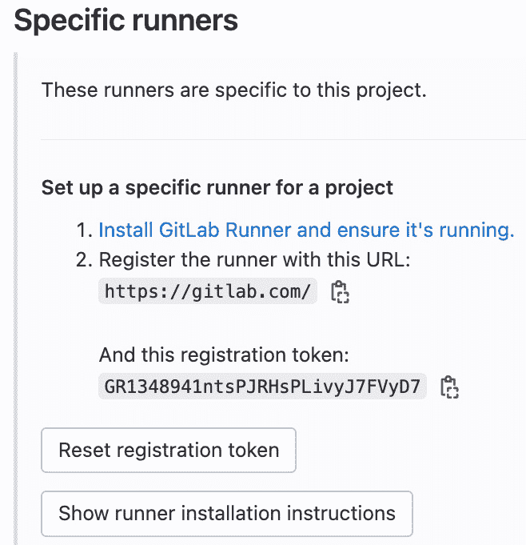

# 第五章：安装与配置 GitLab Runner

在 *第四章* 中，你了解了 GitLab CI/CD 的基本概念。我们定义并介绍了与 CI/CD 流水线相关的词汇和概念，其中包括 CI/CD 流水线的组成部分、不同的流水线类型、如何在 GitLab UI 中观察和与流水线交互，以及如何使用 `.gitlab-ci.yml` 文件编写流水线配置。几段文字还介绍了 GitLab Runner 作为 GitLab CI/CD 的关键组件，它实际上运行流水线任务并将结果报告回 GitLab。

本章的唯一重点将是 GitLab Runner。你将在本章中了解到，GitLab Runner 在 CI/CD 过程中充当了“肌肉”的角色。Runner 是一些与 GitLab 主应用程序分开安装的小程序，它们的目的是接收 GitLab 发布的新的 CI/CD 任务，并按照 `.gitlab-ci.yml` 文件中指定的指令执行任务。Runner 可以安装并配置为与多种类型的基础设施一起使用，包括独立服务器、虚拟机、容器等。

我们将首先介绍 Runner 架构，并将 GitLab Runner 与你可能熟悉的其他工具进行比较。接下来，我们将描述如何安装和配置 Runner，使其能够与 GitLab 配对以运行 CI/CD 任务。最后，我们将讨论在不同情况下使用不同 Runner 类型的最佳实践。

一旦你学会了如何安装、配置、使用和维护 GitLab Runner，你就能顺利管理应用程序的构建、测试和部署的端到端生命周期。本章将介绍以下主题：

+   定义 GitLab Runner 及其与 CI/CD 的关系

+   Runner 架构与支持的平台

+   安装 Runner 代理

+   配置并注册 Runner 到 GitLab

+   理解何时以及为何使用不同类型的 Runner 和执行器

# 技术要求

与之前的章节一样，如果你在 GitLab 实例的**软件即服务**（**SaaS**）或自托管环境中有一个账户，你将从本章中获得更多收益。此外，安装 GitLab Runner 代理需要一台计算机（Windows、Mac 或 Linux），在该计算机上安装 Runner 二进制文件。个人笔记本电脑也可以使用——Runner 轻量且系统要求较低。如果你使用的是 GitLab.com，CI/CD 流水线也可以通过 GitLab 的 SaaS Runner 来运行，不过请注意可能会产生使用费用。

# 定义 GitLab Runner 及其与 CI/CD 的关系

回想一下，GitLab CI/CD 是一系列针对你项目中的代码执行的任务，这些任务通常包括构建、测试和部署工作的组合。重要的是，CI/CD 流水线并不是在 GitLab 应用程序内部运行的，因为每个任务通常需要某些特定的平台和工具集才能成功运行。

注意

GitLab runners 是从 GitLab 接受 CI/CD 任务、在适当的执行环境中运行任务，并将结果报告回 GitLab 的程序。

## GitLab Runner 是一个用 Go 语言编写的开源应用程序。

GitLab Runner 应用程序的官方仓库托管在 [GitLab.com](http://GitLab.com) 上，项目名为 `gitlab-runner`。写作时，您可以访问 [`gitlab.com/gitlab-org/gitlab-runner`](https://gitlab.com/gitlab-org/gitlab-runner) 来查看该项目的开发和源代码。与主要的 GitLab 应用程序一样，GitLab Runner 遵循每月发布一次的版本发布周期。GitLab Runner 的最新版本*通常*与 GitLab 的主版本号和次版本号相同，但这并不总是保证的。与大多数 GitLab 一样，GitLab Runner 是开源的，并且根据 MIT 许可证进行分发。

查阅前述 URL 中的代码库，我们可以看到 GitLab Runner 是用 Go 编程语言编写的。该程序与大多数主要的计算机架构（x86、AMD64、ARM 等）和操作系统（Windows、macOS 和 Linux）兼容——实际上，只要支持安装 Go 二进制文件的地方，几乎都可以运行。我们很快会看到，安装 runner 可执行文件非常简单，且所需依赖很少。

## GitLab Runner 执行在 `.gitlab-ci.yml` 文件中指定的 CI/CD 任务。

回顾上一章，GitLab CI/CD 流水线由在 `.gitlab-ci.yml` 文件中定义的阶段和任务组成。每个任务包含一组指令，通常是按顺序执行的 shell 风格命令。默认情况下，每当对一个定义了 `.gitlab-ci.yml` 文件的分支进行新的提交时，就会启动一个新的流水线运行。这意味着 `.gitlab-ci.yml` 中的任务将按照配置中指定的顺序和逻辑进行调度。

在 CI/CD 流水线运行过程中，当某个任务到达其“轮次”时，该任务将被分配给一个可用的 GitLab runner，该 runner 能够执行任务的指令。每个任务会分配给一个 runner。在 runner 从 GitLab 接收到任务后，它将首先执行的操作之一是获取启动流水线的提交记录，以便拥有相关的代码库快照。然后，runner 可能会执行编译构建、运行单元测试、安全扫描，或者将应用程序部署到某个环境中等步骤。请记住，runner 只是按照 `.gitlab-ci.yml` 文件中的任务指令进行操作。一旦 runner 完成任务中指定的工作，它将结果报告回 GitLab。报告几乎总是包括返回通过或失败状态，以及在任务执行过程中生成或修改的任何工件。

如在*第四章*（参见*查看管道列表*部分）开头讨论的那样，可以通过 GitLab 用户界面实时监控管道状态和作业执行。Runner 持续与 GitLab 通信，从用户界面可以查看可用的 Runner、修改 Runner 设置、干预管道和作业执行、查看上传的工件等。一种理解 GitLab CI/CD 组件之间关系的方式是将 Runner 看作是执行 `.gitlab-ci.yml` 指令的肌肉（大脑），而 GitLab 则像是神经系统，协调大脑（管道配置）和肌肉（执行 CI/CD 作业的 Runner）之间的通信。

# Runner 架构和支持的平台

在进一步详细讨论 Runner 组件、安装和配置之前，值得澄清一些术语。到目前为止，本章中可能使用了*GitLab Runner*和*runner*这两个词交替出现。然而，这两个词之间有些微妙的差别。*GitLab Runner*是指安装在计算机上的应用程序。安装 GitLab Runner 应用程序后，它尚未与 GitLab 通信或执行 CI/CD 作业。为了连接到 GitLab 并运行 CI/CD 作业，管理员需要执行一个 GitLab Runner 命令，该命令将单个*runner*注册到 GitLab，并指定这些 runner 将使用的执行环境。每个注册的 runner 将成为一个独立的进程，定期与 GitLab 联系并运行 CI/CD 作业。

这种设置一开始可能会显得有些混乱，因为单个 GitLab Runner 应用程序通常会支持在安装它的计算机上注册多个 Runner 进程。此外，这些 Runner 进程可能会使用不同的执行环境来运行它们的作业。例如，考虑一个单独的裸机 Linux 服务器。管理员可能会安装 GitLab Runner 应用程序，然后使用它注册以下内容：

+   一个 Runner 进程，在服务器操作系统的 shell 会话中执行作业

+   一个第二个 Runner 进程，在 Docker 容器中执行作业

+   一个第三方 Runner 进程，将作业的命令通过 SSH 管道传送到另一台服务器

也就是说，安装在单台计算机上的一个 GitLab Runner 应用程序可以注册多个 Runner。GitLab Runner 应用程序负责启动、停止和管理各个 Runner 进程，并从 GitLab 获取 CI/CD 作业。*图 5.1* 总结了 GitLab、Runner 和执行作业负载的环境之间的信息流：


图 5.1 – GitLab Runner 通信与作业执行

为了本章的目的，不必太担心此流程的细节。只需理解 runner 与 GitLab 通信，以便在关联的执行环境中接收和运行 CI/CD 作业。

## GitLab Runner 支持大多数平台和架构

在撰写本书时，GitLab Runner 可以安装在每个主要的 Linux 发行版和架构上，以及 FreeBSD、Windows、macOS、Docker 和 Kubernetes 上。GitLab 还为那些因法律或内部合规要求需要它的组织提供了 FIPS 140-12 版 runner 二进制文件。

*表 5.1* 总结了截至 GitLab Runner 15.3 支持的架构和操作系统平台：

| **官方支持的计算机架构** | **官方支持的操作系统** |
| --- | --- |
| x86 | Debian |
| AMD64 | Ubuntu |
| ARM | CentOS |
| ARM64 | Red Hat Enterprise Linux |
| s390x | Fedora |
| ppx64le | Linux Mint |
|  | Microsoft Windows |
|  | macOS |
|  | FreeBSD |

表 5.1 – GitLab Runner 支持的平台

这张表列出了 GitLab 根据其文档明确支持的架构和操作系统平台。对于列出的 Linux 发行版，GitLab 提供官方的 GitLab Runner 包，可以通过该发行版的本地包管理器进行管理。然而，即使你的 Linux 发行版没有出现在表中，只要该系统具有兼容的计算机架构，通常也可以手动安装 GitLab Runner 二进制文件。

如前所述，GitLab Runner 还可以托管在容器或容器编排系统中，即分别是 Docker 和 Kubernetes。请注意，这指的是托管 GitLab Runner 代理本身，而不是其用于运行作业的执行器或执行环境。当我们稍后在本章详细讨论执行器时，我们将了解到，runner 可以被指示使用 Docker 或 Kubernetes 作为其执行器，无论 GitLab Runner 代理安装在哪里，只要它能够访问相关的容器工具。

## Runners 可以是特定的、组级的或共享的

在 *第三章* 中，我们了解到 GitLab 中的工作是按项目和组来组织的。项目和组代表组织边界，如团队或产品线。项目通常（但不总是）托管一个包含源代码的 Git 仓库。组是容器，用来存放项目和其他组，类似于文件系统中文件夹的组织方式。

*第四章*随后介绍了 CI/CD 流水线。我们了解到 CI/CD 流水线是在项目内运行，并针对该项目的代码。那么，如何在 GitLab 中组织和分配跑者，使它们可供 CI/CD 流水线运行作业呢？事实证明，我们可以像组织其他 GitLab 资源一样组织跑者的可用性：通过将其设置为项目级、群组级或实例级。

### 特定跑者启用供个别项目使用

项目所有者和维护者可以选择仅为他们的项目注册跑者。**特定跑者**被分配给特定项目，仅会接收并运行该项目中 CI/CD 流水线的作业。

使用特定跑者有几个优势。首先是特定跑者使项目所有者和开发者能够设置他们所需的跑者基础设施，而无需更改他们所在项目之外的任何内容。例如，开发者可能会在他们的本地笔记本电脑上安装 GitLab Runner，并将特定跑者注册到他们作为主要贡献者的项目中。这样，开发者就不需要请求 IT 或平台所有者进行全局变更管理。项目特定的跑者可以在项目设置下进行管理，如*图 5.2*所示：


图 5.2 – 项目级跑者设置

特定跑者的另一个优势是为个别项目提供专用或定制化的工具。特定跑者使得项目级资源使用的会计工作变得更简单。此外，安全和合规政策可能要求某些项目使用与组织其他部分隔离的专用基础设施。注册到特定项目的跑者只会运行该项目内部的流水线代码，GitLab 其他部分的流水线无法访问它。

### 群组跑者可供群组内所有项目使用

我们了解到，GitLab 中有些资源仅在项目中可用，有些资源仅在群组中可用，还有一些资源可以同时在项目和群组中使用。跑者就是这第三类资源的一个例子。在群组级注册跑者使得该跑者可以供群组内所有项目及其子群组的流水线使用。*图 5.3* 显示群组跑者可以在群组的 CI/CD 设置中注册：


图 5.3 – 群组跑者设置

群组所有者可以创建并管理群组跑者，群组跑者会按**先进先出**（**FIFO**）顺序接收并运行 CI/CD 作业。群组跑者对于那些希望共享资源或运行跨多个项目的 CI/CD 流水线的团队非常有用，但这些团队仍然需要管理自己的跑者以满足会计或合规要求。

### 共享跑者可供 GitLab 中所有项目使用

GitLab 实例的管理员可以选择注册运行器，这些运行器可以从 GitLab 实例中任何项目的任何组获取 CI/CD 作业。这使平台所有者可以将运行器管理从开发人员或项目经理中抽象出来。实例管理员还可以在全局级别配置 CI/CD 配额，限制各个项目在可用的共享运行器上使用的 CI/CD 流水线分钟数。

共享运行器仅适用于自管理的 GitLab

管理员只能在自管理的 GitLab 实例上配置共享运行器。[GitLab.com](http://GitLab.com)的客户可以选择使用 GitLab 提供的 SaaS 运行器，也可以注册自己的组或特定运行器。每个 GitLab 许可级别包含一定数量的 SaaS 运行器流水线分钟，额外的分钟可以购买。使用您自己的组或特定运行器永远不收费。

基于容器的平台，如 Kubernetes，是共享运行器常见的执行器选择，旨在提供可以快速扩展的临时资源。与基于 FIFO 原则挑选作业的组运行器不同，共享运行器通过*公平使用队列*进行操作。使用共享运行器的 CI/CD 作业较少的项目优先于作业更活跃的项目。这有助于确保来自单个项目的大规模流水线不会占用整个共享运行器基础设施。

## 每个运行器都有一个定义的执行器

让我们回顾一下到目前为止提到的一些组件：

+   GitLab 应用程序，调度和协调 CI/CD 流水线

+   GitLab Runner，安装在计算机上的二进制文件

+   独立运行器，它们是运行 CI/CD 作业的进程，由 GitLab Runner 代理管理

如果你回顾*图 5.1*，你会注意到一个**执行器组件**，它接收作业负载并返回作业输出和状态。执行器指的是运行接收到的 CI/CD 作业的运行器进程所使用的环境。运行器的执行器在运行器首次注册到 GitLab 时指定。回想一下，可以从安装了 GitLab Runner 代理的单台计算机注册多个运行器进程，每个进程都有自己的执行器。*表 5.2*总结了支持的运行器执行器：

| **官方支持的 GitLab Runner 执行器** |
| --- |
| Docker |
| Shell |
| VirtualBox |
| Parallels |
| Kubernetes |
| Docker Machine |
| SSH |
| Custom |

表 5.2 – GitLab Runner 支持的执行器

我们将依次描述每个执行器。

### Docker 执行器

使用 Docker 执行器的运行器在从指定 Docker 镜像启动的 Docker 容器中运行 CI/CD 作业。这提供了一个可复现的环境，包含运行 CI/CD 作业所需的工具。使用 Docker 执行器要求在与 GitLab Runner 相同的计算机上安装 Docker 引擎。

注意

Docker 是 GitLab 用户中最常用的执行器。Docker 容器也是 GitLab.com 上共享 SaaS 运行器使用的默认环境。

Docker 执行器使得确保 CI/CD 任务拥有成功运行所需的工具变得容易。这些工具通过容器镜像提供，运行器被指示在任务中使用该镜像。任务使用的镜像可以在几个不同的位置进行指定：

+   在 `.gitlab-ci.yml` 文件中的任务定义内部

+   在 `.gitlab-ci.yml` 文件中全局设置，这样它会被用于流水线中的所有任务

+   如果 `.gitlab-ci.yml` 文件中没有指定要使用的镜像，则作为运行器使用 Docker 执行器时的默认镜像

运行器使用的镜像可以位于本地的 GitLab 容器注册表、其他外部注册表，或像 Docker Hub 这样的公共容器注册表。例如，如果你的 CI/CD 任务需要一个包含 Python 工具的环境，你可以指示运行器从 Docker Hub 拉取 `python:3.10` 镜像，然后从该镜像启动一个容器来运行任务。任务完成后，运行器会删除该容器，直到收到新的任务，这时运行器会在一个新的容器中运行该任务。

### Shell 执行器

Shell 执行器直接在安装了 GitLab Runner 的机器上通过 shell 会话运行任务。每个任务定义中的 `.gitlab-ci.yml` 文件中的 `script` 关键字的内容会像用户在终端中输入命令一样执行。Shell 执行器的主要优点是，因其使用了 GitLab Runner 安装所在的本地 shell 和文件系统，因此上手简单。

然而，Shell 执行器有一些挑战，使其难以扩展：

+   首先，你需要在服务器上预先安装 CI/CD 任务所需的构建、测试或部署工具，以便 Shell 执行器能够访问这些工具。或者你需要在 `script` 关键字中指定步骤来安装所需的依赖项。

+   第二个挑战是缺乏干净的环境来执行 CI/CD 任务。由于任务将在服务器的文件系统中直接执行，而不是在如容器这样的可重现环境中，因此容易留下构建和测试的残留物。

因此，尽管 Shell 执行器可能是你初次搭建流水线时最好的选择，但对于更复杂的构建环境，建议使用其他执行器。

### VirtualBox 执行器

VirtualBox 执行器是一种为 CI/CD 作业提供可重现环境的方法，这些作业可能仍然需要完整的操作系统资源。该执行器只能在安装了 VirtualBox 虚拟化程序的计算机上使用。当您将 Runner 注册到 VirtualBox 执行器时，指定一个 **虚拟机**（**VM**）模板，Runner 将使用该模板运行 CI/CD 作业。当 Runner 获取到一个作业时，它会从基本模板启动一个新的虚拟机，在该虚拟机上通过 shell 会话执行作业，将结果返回到 GitLab，然后销毁虚拟机。

虚拟机执行器虽然在确保清洁环境方面很有用，但除非作业需要访问运行在 Type-2 虚拟化程序上的操作系统，否则可能不需要使用。若您希望在没有虚拟机开销的情况下实现标准化，考虑使用 Docker 或 Kubernetes 执行器。

### Parallels 执行器

Parallels 执行器的配置和运行方式与 VirtualBox 执行器相同，不同之处在于它使用 Parallels 虚拟化平台而非 VirtualBox。这样，您就可以在运行 macOS 的主机机器上运行 Windows 虚拟机中的 CI/CD 作业。

### Kubernetes 执行器

当一个 Runner 注册到 Kubernetes 执行器时，它会在 Kubernetes 集群中的 Pod（即一个或多个容器的组合）中运行 CI/CD 作业。这自然需要您已设置好 Kubernetes 集群，并通过 Kubernetes API 让 Runner 与之连接。

在写作本文时，GitLab Runner 连接到 Kubernetes 集群的方式有几种不同的选择：

+   GitLab 提供了一个官方的 **Helm chart**，用于将 Runner 代理部署到集群中。

+   GitLab 还包括一种更广泛的方法，将 Kubernetes 集群连接到 GitLab 实例，称为 **GitLab Agent for Kubernetes**。一旦 GitLab 实例连接到集群，您就可以使用代理将带有 Kubernetes 执行器的 Runner 部署到集群中。

+   GitLab 正在积极开发一个名为 **GitLab Operator** 的工具，进一步自动化在 Kubernetes 中配置 GitLab 资源，使用如 Red Hat OpenShift 等容器管理平台。Operator 将提供另一种方法，将 Kubernetes 执行器与集群部署在一起。虽然目前尚不推荐在生产环境中使用，Operator 可用于有效地管理开发和测试环境中的资源。有关更多详细信息，请参考 GitLab 文档。

最终，成功地使用容器编排需要对网络、存储和安全有很高的知识和经验。如果您或您的团队拥有 Kubernetes 专业知识，Kubernetes 执行器可以成为实现和扩展云原生 CI/CD 工作流的强大方式。如果没有，最好还是坚持使用之前提到的执行器，如 Docker。

### Docker Machine 执行器

Docker 执行器为每个 CI/CD 作业提供单独的 Docker 容器，而 Docker Machine 执行器则为整个拥有 Docker 引擎的主机（VMs）提供服务。这些主机本身支持启动 Docker 容器。Docker Machine 通常与具有自动扩展功能的云提供商一起使用，因此您可以根据需求快速灵活地启动与容器兼容的主机。

注意

Docker（公司）已不再积极开发 Docker Machine，而是支持 Docker Desktop。GitLab 维护 Docker Machine 的分支以继续支持 Docker Machine 执行器。

您可以将 Docker Machine 执行器视为 VirtualBox/Parallels 执行器和 Docker 执行器的组合，还包括额外的自动扩展支持。Docker Machine 还可以用于确保每个作业的隔离资源，通过确保容器在其专用的 VM 上运行。事实上，GitLab 在其自身的 Linux SaaS Runner 上使用 Docker Machine，为用户提供可扩展且在多租户平台上适当隔离的 Runner。

### SSH 执行器

有时，您可能希望在一个基础设施上运行 CI/CD 作业，在该基础设施上，由于技术或合规性原因，无法安装 GitLab Runner。如果该基础设施支持从能够安装 GitLab Runner 的计算机进行 SSH 访问，您可以使用 SSH 执行器在远程主机上运行 CI/CD 作业。

当您使用 SSH 执行器注册 GitLab Runner 时，还将指定运行 CI/CD 作业的远程主机以及用于连接到该主机的 SSH 身份文件。当 Runner 接收到 CI/CD 作业时，它将通过 SSH “管道” 命令，以便在远程主机上执行它们。尽管 SSH 执行器目前仅支持 Bash 命令和脚本，但如果您不希望在每台希望运行 CI/CD 作业的机器上安装 GitLab Runner 程序，则可能会发现它很有用。

到目前为止，我们已经描述了 GitLab Runner 的主要组件：GitLab Runner 代理，其各自注册的 Runner 进程，以及每个 Runner 进程可能使用的执行器来运行其作业。还有一个值得讨论的 Runner 配置元素，那就是 Runner 标签。

## Runner 标签限制了可以接收哪些作业的 Runner

`apache`，`rhel` 或 `ios`。标签还可以表示 Runner 在 CI/CD 过程中某个阶段的预期用途，例如 `build`，`staging` 或 `prod`。当您在 CI/CD 作业定义中指定一个或多个标签时，可以确保 Runner 具有运行该作业所需的适当工具和环境。

例如，在 `.gitlab-ci.yml` 文件中的以下作业示例：

```
deploy-to-staging:
    stage: staging
    script: ./deploy-staging.sh
    tags:
        - windows
        - staging
```

在 CI/CD 作业定义中包含的 `windows` 和 `staging` 标签，确保 `deploy-to-staging` 作业只会分配给同时具有 `windows` 和 `staging` 标签的 runner。默认情况下，具有标签的 runner 不会运行没有标签的作业——即没有标签与某个特定标签 runner 匹配的作业。这个默认设置可以在 runner 的设置中覆盖，你可以允许带标签的 runner 运行没有标签的作业，因此也不关心它们运行在哪里。

Runner 标签 ≠ Git 标签

在 GitLab 中，“标签”这个词可能会让人感到困惑，因为这个术语在不同的上下文中都有使用。在本讨论中，“标签”仅仅是一个附加在 runner 上的标签，用于将其与具有相同标签的 CI/CD 作业匹配。这些标签与 Git 提交中使用的 Git 标签不同，后者是描述性标签，放置在 Git 提交中，也可以在 GitLab 中找到。Runner 标签与 Git 版本控制中使用的标签无关。

到目前为止，我们已经涵盖了有关 GitLab runner 的所有基本信息，包括它们的工作原理以及支持的不同平台和执行器。现在是时候开始讲解 runner 安装过程了。

# 安装 Runner 代理

如果你一边跟着操作，一边在自己的计算机上安装和注册 runner，那么本节内容将最为有用。你会发现，安装步骤会根据你的系统类型略有不同：Windows、macOS、具有支持的包管理器的 Linux 或通用 Linux 系统。无论平台如何，都是相同的两步流程：

1.  安装 GitLab Runner 代理。

1.  在 GitLab 中注册一个 runner。

## 安装 GitLab Runner

如前所述，安装方法会根据你的操作系统略有不同。对于主要的 Linux 发行版，文档（[`docs.gitlab.com/runner/install/linux-repository.html`](https://docs.gitlab.com/runner/install/linux-repository.html)）会指导你将 runner 仓库添加到系统中，然后使用本地包管理器安装 `gitlab-runner` 包。对于 Windows、macOS 和其他 Linux 发行版，你将使用 `curl` 直接从 GitLab 获取程序，设置可执行权限，然后安装并启动 runner 代理。

以一台具有 *x86_64* 架构和基于 RPM 包管理系统的 Red Hat Linux Enterprise 服务器为例。GitLab 文档指导我们首先下载并执行一个 shell 脚本，该脚本会将 `gitlab-runner` 仓库添加到系统的包管理器中：

```
sudo curl -L "https://packages.gitlab.com/install/repositories/runner/gitlab-runner/script.rpm.sh" | sudo bash
```

如果你查看该 shell 脚本的内容，会发现它的作用只是检测操作系统平台，然后运行相关的包管理命令来添加 `gitlab-runner` 仓库。你可以通过检查可用仓库列表（在 RHEL 中使用 `sudo dnf repolist`）来验证此步骤是否完成。你应该能在列表中看到 `gitlab-runner`，与主要操作系统仓库一起列出。

我们已经添加了运行器库，但尚未安装 GitLab Runner。我们可以通过安装`gitlab-runner`包轻松完成此操作：

```
sudo dnf install –y gitlab-runner
```

安装完成后，GitLab Runner 应该会自动在后台启动（如果你在 Windows 或 macOS 上安装了 GitLab Runner，或者在 Linux 上手动安装了它，你需要手动启动 GitLab Runner）。你可以通过以下命令验证 GitLab Runner 代理是否已启动并正在运行：

```
sudo gitlab-runner status
```

你应该看到代理正在运行的确认信息，同时也会看到目前还没有任何运行器注册到 GitLab。注册运行器将是我们接下来的步骤。

## 在 GitLab 中注册运行器

到目前为止，我们已经在计算机上安装了 GitLab Runner 代理，并且它作为后台服务运行。但是，目前还没有任何运行器与 GitLab 进行通信。我们将通过*注册*一个或多个运行器来设置它们与 GitLab 进行通信并运行 CI/CD 任务。

回顾之前讨论的共享、特定和组运行器。当你在 GitLab 中注册运行器时，你将运行器绑定到整个 GitLab 实例（共享运行器）、一个组（组运行器）或一个项目（特定运行器）。注册说明和注册后的运行器设置将在你注册运行器的 GitLab 相应部分（实例、组或项目）中出现。例如，回顾*图 5.2*，我们可以在*Hats for Cats*项目中的**设置** | **CI/CD** | **运行器**下找到这些详细信息：



图 5.4 – 项目级运行器设置

此外，请注意*图 5.4*中显示的注册令牌。该运行器注册令牌由 GitLab 生成，并用于运行器身份验证，确保它注册到 GitLab 中的正确区域：

1.  如果你在演示系统中操作，请将注册令牌复制到剪贴板，因为在我们从安装了 GitLab Runner 的计算机注册运行器时需要使用它。

1.  接下来，返回到安装了 GitLab Runner 的计算机。从终端会话中运行一个基于提示的运行器注册脚本：

    ```
    sudo gitlab-runner register
    ```

1.  GitLab 首先会提示你输入 GitLab 应用实例的 URL。对于 SaaS 版本，这将是[`gitlab.com`](https://gitlab.com)。否则，它将是你用来访问自托管实例的 URL。在本示例中，我们将使用`gitlab.com`：

    ```
    Enter the GitLab instance URL (for example, https://gitlab.com):
    ```

    ```
    https://gitlab.com
    ```

1.  接下来，脚本将要求输入运行器注册令牌。此令牌显示在*图 5.2*中，并根据你注册运行器的项目或组而有所不同。换句话说，注册令牌用于验证运行器与 GitLab 的连接，确保它注册到正确的项目或组：

    ```
    Enter the registration token:
    ```

    ```
    GR1348941Xi_koNdj8AjJMjSzQyYY
    ```

1.  然后，你可以提供一个可选的描述，该描述将在 GitLab UI 中显示在运行器的元数据中。此示例假设运行器是一个 Linux 服务器，开发人员可以在上面构建和测试他们的代码：

    ```
    Enter a description for the runner:
    ```

    ```
    [localhost] Linux dev server
    ```

1.  下一个消息提示你输入任何可选的 runner 标签。回想一下，标签是你分配给 runner 的标签元数据。标签将 runner 宣传为能够接收具有相同标签的 CI/CD 作业。例如，构建作业可能会包含 `rhel` 标签，表示该作业需要由 Red Hat Linux 提供的工具。只有具有该标签的 runner 才能接收此作业。标签可以在 runner 注册时分配，如此处所示，也可以通过 GitLab UI 中的 runner 设置进行修改：

    ```
    Enter tags for the runner (comma-separated):
    ```

    ```
    dev,rhel
    ```

可选的维护备注是另一种描述性元数据，不会配置 runner 的行为：

```
Enter optional maintenance note for the runner
<leave blank in this example>
```

在脚本的这一点，新创建的 runner 进程将与 GitLab 通信，以确认它能够进行通信和身份验证：

```
Registering runner... succeeded                     runner=GR1348941Xi_koNdj
```

1.  最后，runner 会询问它应使用哪个执行环境来运行 CI/CD 作业。另外，请记住，执行器取决于是否具备必要的工具；例如，选择 Docker 需要在服务器上安装并可用 Docker 引擎。在此示例中，我们将选择 `Shell`，因为它是最容易入门的执行器，且不需要依赖项：

    ```
    Enter an executor: parallels, docker-ssh+machine, kubernetes, custom, docker, docker-ssh, docker+machine, shell, ssh, virtualbox:
    ```

    ```
    Shell
    ```

1.  脚本最终会确认 runner 注册成功。现在，runner 进程正在计算机上运行，由本地 GitLab Runner 代理管理，并准备从 GitLab 实例接收 CI/CD 作业：

    ```
    Runner registered successfully. Feel free to start it, but if it's running already the config should be automatically reloaded!
    ```

    ```
    Configuration (with the authentication token) was saved in "/etc/gitlab-runner/config.toml"
    ```

我们可以通过几种方式验证注册和通信是否成功。在安装 GitLab Runner 的地方，可以使用以下命令查看已配置的 runner：

```
sudo gitlab-runner list
Runtime platform                                    arch=amd64 os=linux pid=30148 revision=32fc1585 version=15.2.1
Listing configured runners                          ConfigFile=/etc/gitlab-runner/config.toml
Linux dev server                                    Executor=shell Token=ZLXwxp4KWrQp2jjZRxjj URL=https://gitlab.com
```

列出了描述为 `Linux dev server` 的 runner，以及其执行器、注册令牌和 runner 注册的 GitLab 实例。

我们还可以从 GitLab 端验证 runner 是否正确注册。我们刚刚注册的 runner 已经注册到我们的*Hats for Cats*项目中。*图 5.5* 显示，如果我们返回项目，通过 `Linux dev runner` 注册并可用于该项目：


图 5.5 – 特定 runner 成功注册到 GitLab

GitLab UI 显示了我们特定 runner 的一些其他有趣特性。`dev` 和 `rhel` 标签显示在 runner ID 和描述旁边。runner ID 旁边的锁图标表示该 runner 已锁定到特定项目，不能分配给其他项目。铅笔图标将带我们进入 GitLab UI 中可调整的 runner 设置，暂停按钮则会“暂停”该 runner。暂停 runner 会使其保持在 GitLab 中注册，但会阻止它在暂停时接受新作业。

我们可以通过点击超链接的运行器 ID 来查看现有的运行器设置和统计信息。*图 5.6* 显示了我们之前注册的运行器信息，可以在 GitLab UI 中查看。这些信息包括运行器的架构和网络详情、活动状态，以及可分配的属性，如运行器标签、是否受保护、描述和是否可以分配给其他项目：


图 5.6 – GitLab UI 中的运行器信息

如果我们返回到运行器设置页面（如*图 5.5*所示），并选择编辑（铅笔）图标，我们将进入一个页面，显示额外的运行器详情以及我们可以从 UI 设置的属性。这些设置包括保护运行器、修改描述和运行器标签，如*图 5.7*所示。

最大作业超时字段默认情况下告诉运行器在一定时间后报告作业失败。使用此选项时要小心；如果设置了该选项，请确保其值大于你期望一个构建所需的最大时间。


图 5.7 – GitLab UI 中的运行器设置

此时，您的运行器已注册、处于活动状态，并准备开始接收 CI/CD 作业。接下来我们将讨论基于你或你组织需求的运行器配置和执行器的相关考虑。

# 关于各种运行器类型和执行器的考虑因素

我们了解到，存在许多类型的运行器、配置选项和执行环境。在本节中，我们将讨论一些性能、安全性和监控方面的考虑，以帮助你在决定使用哪些运行器以及何时使用它们时作出决策。

## 性能考虑

作为开发人员或运维人员，你希望确保管道尽可能高效地运行。关于 CI/CD 作业执行的关键性能考虑因素包括运行器的可用性和资源、代码库的大小，以及如何处理作业和应用程序的依赖关系。

### 运行器可用性

请考虑本章前面讨论的三种运行器作用域：

+   在此实例级别配置的共享运行器（如果使用自托管的 GitLab），可供该实例中的所有项目使用

+   群组运行器可供群组及其子群组中的所有项目使用

+   仅注册到指定项目的特定运行器

每种类型的 runner 处理 CI/CD 作业的方式会影响管道效率和执行时间。特定 runner 是一个相对直接的例子。当你知道需要为某个项目分配专用资源时，应使用特定 runner。也就是说，你可能会在提高管道效率的同时牺牲资源的高效利用。广泛使用特定 runner 可能导致服务器空闲时间增加。此外，将资源整合到组和共享 runner 中，也能让你利用云服务提供的自动扩展功能，这在使用特定 runner 时可能在经济上不可行。因此，如果你的应用资源使用和需求是可预测的，应该使用特定 runner。如果你预计资源需求会波动，则可以考虑使用组 runner 或共享 runner。

关于组和共享 runner，它们在实际操作中可能看起来差不多，尤其是当你的 GitLab 实例有一个顶级组来存储所有项目时。然而，组 runner 和共享 runner 在获取各自作业的方式上有很大不同。组 runner 按照 FIFO（先进先出）原则处理作业。这意味着一个资源密集型的管道可能会“占用”一组组 runner，因为它的作业在队列中排队，尤其是当一个阶段有很多作业时。

另一方面，特定 runner 通过公平使用队列操作。也就是说，GitLab 实例中作业最少的项目将优先使用共享 runner。这在某些情况下可能是期望的，因为它意味着你在 GitLab 中的所有项目将得到更公平的管道执行。然而，实际上，某些项目可能比其他项目更为重要，你会希望这些项目得到优先执行，避免因为其他项目的作业已经运行而导致待处理作业被排到队尾。在这种情况下，组 runner 按 FIFO 分配可能是最好的选择。

### 代码库大小

GitLab 文档将“大型”代码库定义为工作树中包含超过 50,000 个文件的代码库（即，已检出的文件集合）。当代码库较大时，管道中的限速步骤可能是 runner 克隆或拉取项目代码库。

GitLab Runner 已经对拉取项目文件的时间和资源进行了优化。如果项目已经被克隆到 runner 的执行环境中，runner 会执行增量拉取，这样就不需要为每个作业都拉取整个代码库。此外，默认情况下，runner 会执行浅克隆，只复制项目的最新 20 次提交（这个设置可以通过 `.gitlab-ci.yml` 文件中的 `GIT_DEPTH` 变量进行调整）。

对于一些更高级的配置，你可以在 `.gitlab-ci.yml` 文件中使用 `pre_clone_script` 关键字，设置在 runner 克隆代码库之前执行的 Git 配置命令。

### 缓存依赖

依赖关系和工件缓存的考虑概念上类似于大仓库的讨论。其核心思想是，我们希望尽量减少 runner 重复下载相同文件的需求，只下载当前分配给 runner 的 CI/CD 作业所需的文件。

`.gitlab-ci.yml` 中的 `cache` 关键字是指定应在作业之间保留在 runner 上的文件路径。我们建议将 `cache` 关键字与 runner 标签结合使用，这样像工具链之类的作业可以分配给那些已经预缓存这些依赖的 runner。

默认情况下，每个 runner 还会下载该管道中之前运行的每个作业的所有工件。你可以使用 `dependencies` 关键字来选择需要下载哪些作业的工件。例如，如果你有分别针对 Windows 和 Linux 的构建作业，并且有独立的 Windows 和 Linux 构建的测试作业，那么测试作业应该只下载各自构建作业的工件。

最后，如果你的管道是基于容器的，你可能会消耗大量的网络资源，从公共注册表拉取容器镜像来运行任务。GitLab 有一个名为 Dependency Proxy 的功能，允许你配置本地注册表来缓存 Docker 镜像，这样 runner 执行器就不需要在每次运行时从公共源拉取。相反，runner 会从本地注册表拉取，只有在更新缓存中的容器版本时才需要从公共源拉取。

## 安全性考虑

有关安全性和 GitLab 的内容远远超出了本书所能涵盖的范围。然而，你在安装和配置 runners 时会涉及到两个直接相关的考虑因素。它们是选择 runner 执行器，以及你如何在 CI/CD 管道中处理机密信息。

### 你选择的 runner 执行器

请记住，CI/CD 管道本质上是在远程主机上执行命令——也就是说，在安装了 GitLab Runner 的主机上。因此，你面临的固有风险不仅是对源代码进行操作，还包括对承载 runner 的底层基础设施进行操作。

通常来说，一些 runner 执行器可以被认为比其他执行器“更安全”。尽管 shell 执行器使用起来方便，但它暴露了服务器的文件系统给 runner，而对文件系统进行的操作可能会跨作业持续存在。例如，项目 A 的 CI/CD 管道作业可能会访问项目 B 的文件，如果项目 B 最近使用了相同的 runner。`gitlab-runner` 用户将在注册 runner 的用户权限下运行。如果注册时使用了 `sudo`，这意味着 runner 将具有完整的 root 权限。因此，我们建议仅在你信任的项目中的特定 runner 上使用 shell 执行器。

Docker 执行器可以被认为是相对更安全的，因为容器为主机系统提供了一个额外的抽象层。运行器会克隆项目代码并在隔离的容器中运行作业命令，随后在将结果报告回 GitLab 后销毁该容器。至关重要的是，确保容器以非特权模式运行。也就是说，作业必须由非 root 用户运行，以确保作业执行过程中不会涉及主机系统的访问。

VirtualBox/Parallels 执行器可以被认为是最安全的运行器之一，因为作业在具有隔离操作系统和文件系统的临时虚拟机中运行。CI/CD 作业无法访问底层的虚拟化管理程序，并且作业之间不太可能意外共享信息。如果你对保护 shell 或 Docker 环境的能力没有信心，可以考虑使用这些执行器。

### 秘密管理

管理密钥并避免它们被意外泄露是一个范围较广的主题，超出了本章的重点。然而，由于运行器从 GitLab 获取仓库信息和环境变量，因此理解糟糕的秘密管理可能导致运行器成为泄露敏感信息的途径至关重要。

无论在任何情况下，都不要将密钥（密码、云凭证、部署密钥等）硬编码到项目仓库中。Git 版本控制的特性是，一旦信息被提交到项目中，它就成为仓库不可变快照历史的一部分。仅仅通过未来的提交删除该密钥并不会将其从之前的提交中移除。由于运行器会以一定深度的历史快照克隆项目仓库，意外遗留在项目中的密钥会被传播到运行器基础设施中。

*第七章*将介绍如何使用 GitLab 的秘密检测工具对你的仓库进行历史扫描，以查找可能硬编码的密钥。最终，解决“我不小心提交了敏感信息”问题的办法是考虑该信息已不可挽回地暴露，因此需要重置或轮换受影响的凭证或密钥。

CI/CD 变量也会出现类似情况。GitLab CI/CD 中使用的变量作为环境变量导出到运行器的 shell 会话中。未掩码和未保护的存储密钥的变量存在被执行不可信构建的运行器泄露的风险。为了防止这种情况，应该将变量存储为掩码和受保护的变量，且仅能在受保护分支上使用，并确保它们的值不会在运行器上暴露。

## 监控考虑

记住，GitLab Runner 作为一个独立的应用程序运行在 GitLab 实例之外的基础设施上。监控你的运行器和管道的数据对于确保正确的安全性和资源利用率至关重要。

监控 runner 时需要考虑的三个关键领域如下：

+   GitLab UI 中的分析

+   Runner 日志系统

+   由 runner 本身产生的可导出指标

自托管的 GitLab 提供了深入的日志记录和监控功能。大部分监控可以由内置的 Prometheus 服务器管理，日志也可以导出到诸如**Splunk**之类的聚合系统。同样，GitLab Runner 生成的日志条目可以在本地操作系统中进行管理，也可以由外部或基于 Web 的工具进行管理。

### GitLab UI 分析

一般的 CI/CD 分析可以在项目级别的**Analytics** | **CI/CD**下找到。*图 5.8*展示了托管在[GitLab.com](http://GitLab.com)上的公共 GitLab 项目的统计数据：


图 5.8 – GitLab 项目的 CI/CD 分析

这里在 UI 中显示的指标仅反映了一般的流水线趋势，即整体流水线的成功和失败率。然而，这些数据可以作为一个有用的起点，帮助你判断流水线失败是由于源代码中的逻辑错误，还是由于底层基础设施（即你的 runner）的问题。如果 runner 是罪魁祸首，你可以进一步深入到 runner 特定的日志和指标，正如接下来几段所讨论的。

### Runner 日志

GitLab Runner 没有专用的日志文件。相反，消息会发布到常规系统日志文件中。在 Debian 系列操作系统（如 Ubuntu）中，这通常是`/var/log/syslog`，在 Fedora 系列操作系统（如 Red Hat Linux）中，是`/var/log/messages`。关于 runner 服务、其配置或与 GitLab 通信能力的错误会被记录在这些文件中。

确认 runner 配置有效且能够与 GitLab 正常通信的一个有用方法是运行`gitlab-runner verify`命令，如下所示：

```
$ sudo gitlab-runner verify
Runtime platform             arch=amd64 os=linux pid=84209 revision=32fc1585 version=15.2.1
Running in system-mode.
Verifying runner... is alive                        runner=ZLXwxp4K
```

在上面的输出中，你可以验证 runner 的架构、版本、进程 ID、注册 ID 以及与 GitLab 通信的能力。

### Runner Prometheus 指标

自托管的 GitLab 提供了深入的日志记录和监控功能。大部分监控可以由内置的 Prometheus 服务器管理。同样，GitLab Runner 包括一个嵌入式 HTTP 服务器，可以将其指标公布到一个可用的 Prometheus 服务器。

为了暴露 runner 的指标，你首先需要编辑 runner 的主配置文件`config.toml`，该文件通常可以在`/etc/gitlab-runner`找到。添加`listen_address`参数来告知指标服务器监听哪个端口。一个添加了`listen_address`参数的`config.toml`文件示例如下：

```
concurrent = 1
check_interval = 0
listen_address = "localhost:9252"
[session_server]
  session_timeout = 1800
. . .
```

编辑配置文件后，使用`sudo gitlab-runner restart`重启 GitLab Runner 服务。然后，合适的 Prometheus 服务器将能够读取并记录 runner 的指标。

# 总结

在本章中，我们描述了在 GitLab CI/CD 流水线中运行者的角色。我们了解到，运行者可以被视为执行 `.gitlab-ci.yml` 中指定的作业的“肌肉”。运行者可以作为独立程序安装在大多数计算机平台上，并且可以与 GitLab 中的所有项目或仅特定项目或组共享。此外，无论在何处安装了运行者，您都可以选择它用于运行 CI/CD 任务的执行环境。

无论您的角色如何，了解运行者设置如何影响流水线性能、应用程序安全性以及开发生命周期中的可观察性都是有帮助的。我们鼓励您练习安装和注册运行者的过程，即使维护运行者基础设施并不是您日常职责的一部分。对运行者架构和工作流程的自信了解将使您成为更好的软件实践者，因为您继续您的 GitLab 之旅。

下一章将在我们所学的基础上进行扩展，并向您介绍如何使用 GitLab CI/CD 构建强大的测试基础设施。应用程序验证以及稍后的安全性将作为核心主题，覆盖这些内容将使您能够不断提高 DevOps 工作流的效率、可持续性和安全性。
