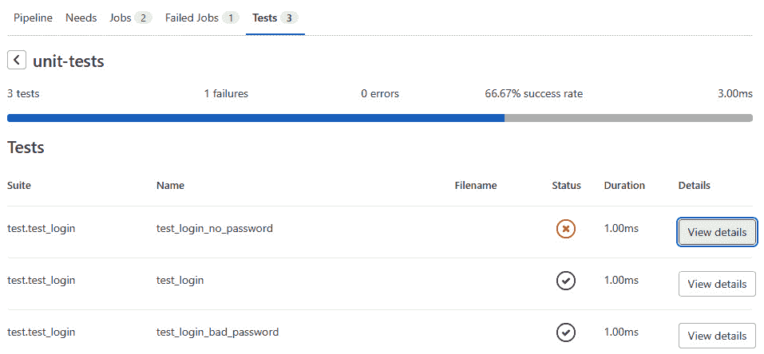

# 第六章：验证你的代码

对于大多数项目，**GitLab CI/CD**管道应该首先做的事情是*验证代码*。不同的项目会依赖不同的任务来执行这一关键步骤，但通常涉及检查代码质量和运行自动化功能测试的某种组合。作为某些类型验证的先决条件，有些项目需要先构建代码。 本章将重点介绍构建然后验证代码。

我们将首先讨论构建代码是否必要，如果必要的话，如何配置 GitLab CI/CD 管道来执行此任务。接着，我们将讨论如何使用管道运行 GitLab 内置的代码质量扫描工具。然后，我们将解释如何在管道中运行自动化功能测试。接下来，我们将介绍一种非常有趣的自动化测试，称为**模糊测试**，它可以发现传统自动化功能测试可能遗漏的问题。我们还将涉及 GitLab 的可访问性测试，确保你的代码能够被广泛的人群使用。最后，我们将简要提及几种其他验证代码的方法，尽管我们没有足够的篇幅来详细描述它们。到本章结束时，你将拥有一系列工具，确保你的代码编写良好且能够按预期执行。

本章的主要内容包括：

+   在 CI/CD 管道中构建代码

+   在 CI/CD 管道中检查代码质量

+   在 CI/CD 管道中运行自动化功能测试

+   在 CI/CD 管道中进行模糊测试

+   在 CI/CD 管道中检查可访问性

+   验证代码的其他方法

# 技术要求

和之前的章节一样，如果你在一个 GitLab 实例（*自托管*或*软件即服务*）上有一个帐户，并可以登录并用来练习和实验本章讨论的概念，你将从本章获得最大的收益。

# 在 CI/CD 管道中构建代码

在简化运行软件时发生的后台机制的风险下，我们可以大致将*解释型*编程语言，如 Python 或 Ruby，视为直接执行原始源代码，而*编译型*语言，如 Java、C 或 C#，则必须通过编译将源代码转换为可运行的形式，然后执行编译后的程序版本。

这是配置管道以验证代码时需要牢记的一个重要区别，因为这意味着如果你的项目中包含任何用编译语言编写的代码（即使它只是你整体项目中的一小部分），你可能需要在任何验证任务之前，在管道中包括一个构建任务。我们说*可能*是因为一些通常在管道验证阶段运行的任务（例如，代码质量检查）直接查看源代码，而另一些则与运行中的代码进行交互。所以，如果你的管道只使用关注源代码的验证扫描，无论你使用什么语言，都可以省略构建步骤。如果你希望在管道中包含自动化功能测试或模糊测试，你*需要*先构建你的代码，所以请继续阅读！

每种编程语言都有不同的构建方式，使用不同的工具。即使是在同一种语言中，有时也会有多种工具或技术来构建代码。让我们来看两种编译 Java 代码的方法以及一种编译 C 代码的方法。

这些示例旨在让你了解如何在 GitLab CI/CD 管道中构建代码的全貌。它们并非所有实现这一任务方式的全面示例。因为有太多不同的语言和工具，我们只能给出一些基本的示例，然后让你根据自己的语言、工具、约束和偏好进行调整和扩展。

## 使用 javac 编译 Java 代码

除了简单的训练应用程序，现实世界中的 Java 项目很少使用`javac`编译器将 Java 源代码（即`.java`扩展名的文件）转换为编译后的 Java 类（即`.class`扩展名的文件）。当你只处理几个文件时，使用`javac`工具是有效的，但随着项目复杂度的增加，这种方法可能变得繁琐。然而，就像花生酱果酱三明治是烹饪入门的好方式，尽管它们永远不会出现在白金汉宫的正式晚宴上，`javac`也是将新 GitLab 用户引入使用 CI/CD 管道编译 Java 代码的好方法。

### 添加你的 Java 应用程序

让我们保持简单，创建一个单文件应用程序和一个名为`com.hatsforcats`的 Java 包。你可以使用 GitLab 的 Web IDE 编辑器创建一个名为`src/com/hatsforcats`的目录来存储你的源代码。在该目录下，使用 Web IDE 创建一个名为`Login.java`的文件。将以下简单的 Hello World 风格的 Java 代码添加到该文件：

```
package com.hatsforcats;
class Login {
    public static void main(String [] args) {
        System.out.println("Welcome to Hats for Cats!");
    }
}
```

### 配置你的管道

现在你的应用已被添加到项目中，是时候配置你的管道了。从项目仓库根目录下的空`.gitlab-ci.yml`文件开始，并使用`stages`关键字为你的管道定义一个`build`阶段：

```
stages:
    - build
```

接下来，你将定义一个位于*构建*阶段并运行`javac`的管道任务。为了这个例子，让我们设定一些额外的要求：

+   所有的 Java 源代码文件都属于`com.hatsforcats` Java 包。

+   您团队的编码标准要求将所有源代码放在项目根目录中的`src/`目录下。

+   编译后的文件应保存在项目根目录中的`target/`目录下。

为了在满足这些标准的同时编译代码，您需要在`.gitlab-ci.yml`中定义一个任务来完成这项工作。给它起个明显的名字，并将其放入*build*阶段：

```
compile-java-with-javac:
    stage: build
```

在该任务定义中，您需要指定任务运行的 Docker 镜像。任务需要访问`javac`编译器，因此一个好的选择是使用最新版本的`openjdk`。将其添加到任务定义中（记得调整缩进）：

```
    image: openjdk:latest
```

最后，任务需要调用 Java 编译器。在`script`关键字下列出的任何命令将在管道执行该任务时运行：

```
    script:
        - javac src/com/hatsforcats/*.java -d target/
```

毋庸置疑，您能根据之前给出的要求理解`javac`命令的语法，但如果不能，随时可以参考 Java 编译器的文档。

信不信由你，这就是在 GitLab CI/CD 管道中编译 Java 代码所需要的一切！

为了展示任务按预期工作，接下来让我们在`compile-java-with-javac`任务的`script`部分添加更多行。第一行将在`javac`执行完毕后显示`target/`目录的内容。如果编译器工作正常，该命令将在任务运行时显示编译后的 Java 源文件版本：

```
        - ls target/com/hatsforcats
```

接下来的几行将执行您编译后的`Login.class`代码，以证明它已正确编译。通常，您不会在专门构建代码的任务中运行代码，但在这种情况下，您只是为了演示编译确实发生了：

```
        - cd target
        - java com.hatsforcats.Login
```

这是您已经组装好的`.gitlab-ci.yml`完整文本。如果您跟着操作，请确保该文件的版本正好包含以下内容：

```
stages:
    - build
compile-java-with-javac:
    stage: build
    image:openjdk:latest
    script:
        - javac src/com/hatsforcats/*.java -d target/
        - ls target/com/hatsforcats
        - cd target
        - java com.hatsforcats.Login
```

提交此文件，并转到项目中的管道列表。缩放到由您的提交自动触发的管道运行，缩放到`compile-java`任务，并查看是否能在任务输出的末尾找到类似于此代码段的文本：

```
$ javac src/com/hatsforcats/*.java -d target/
$ ls target/com/hatsforcats
Login.class
$ cd target
$ java com.hatsforcats.Login
Welcome to Hats for Cats!
Cleaning up project directory and file based variables
Job succeeded
```

您可以看到`javac`命令在没有出现错误的情况下运行，`ls`命令显示了编译后的`Login.java`版本，并且该类在执行时产生了预期的输出。成功！

## 使用 Maven 编译 Java

让我们尝试一种稍微复杂一点的方法，尽管它可能更符合实际情况，用来编译您在上一节中设置的相同 Java 项目。我们不直接使用 Java 编译器，而是将`*.java`文件编译成`*.class`文件。

### 配置 Maven

Maven 通过一个名为`pom.xml`的特殊文件进行配置。这里无需深入讨论该文件的结构或内容，但如果你对每个部分的作用感到好奇，Maven 文档可以为你提供所有细节。将以下简洁的内容复制到你项目根目录中的新`pom.xml`文件中：

```
<project>
  <modelVersion>4.0.0</modelVersion>
  <groupId>org.hatsforcats</groupId>
  <artifactId>login</artifactId>
  <version>1.0-SNAPSHOT</version>
  <properties>
    <maven.compiler.source>17</maven.compiler.source>
    <maven.compiler.target>17</maven.compiler.target>
  </properties>
</project>
```

### 添加你的 Java 应用程序

如果你重新使用前面 `javac` 示例中的相同项目，你已经将一个 Java 程序添加到项目的仓库中。如果你使用的是新项目，请将以下 Java 代码添加到一个名为`Login.java`的新文件中，并将该文件放置在新的 `src/com/hatsforcats/` 目录中：

```
package com.hatsforcats;
class Login {
    public static void main(String [] args) {
        System.out.println("Welcome to Hats for Cats!");
    }
}
```

### 配置你的管道

你可以在根目录下创建一个新的 `.gitlab-ci.yml` 文件，或者用这段配置代码替换你现有的 `.gitlab-ci.yml` 文件中的所有内容：

```
stages:
  - build
compile-java-with-maven:
  stage: build
  image: maven:latest
  script:
    - mvn compile
    - ls target/classes/com/hatsforcats
    - cd target/classes
    - java com.hatsforcats.Login
```

你会注意到，Maven 驱动的构建的管道配置代码与 Java 编译器驱动的构建配置代码类似，但有几个关键的不同之处：

+   `image` 关键字后面的不同值意味着 GitLab Runner 将在基于 Maven 的 Docker 镜像中执行任务，而不是在基于 Java 的 Docker 镜像中。

+   编译代码的命令使用的是 `mvn`，而不是 `javac`。

+   默认情况下，Maven 将编译后的类放在与源代码不同的目录中，因此你不需要像使用 `javac` 时那样明确告诉它这么做（尽管请注意，它的默认目录与使用 `javac` 时指定的目录并不完全相同）。

提交该配置代码后，你可以查看自动触发的管道的详细信息，并放大查看`compile-java-with-maven`任务。你应该会在输出的末尾看到类似于这个片段的内容：

```
[INFO] Compiling 1 source file to /builds/cwcowell/hats-for-cats/target/classes
[INFO] ---------------------------------------------------
[INFO] BUILD SUCCESS
[INFO] ---------------------------------------------------
[INFO] Total time:  4.069 s
[INFO] Finished at: 2022-04-11T21:22:28Z
[INFO] ---------------------------------------------------
$ ls target/classes/com/hatsforcats
Login.class
$ cd target/classes
$ java com.hatsforcats.Login
Welcome to Hats for Cats!
Cleaning up project directory and file based variables
Job succeeded
```

Maven 驱动的编译正常工作，编译后的类出现在你预期的位置，运行时该类会输出预期的结果。你将再也不需要手动运行`mvn compile`命令！

## 使用 Gnu Compiler Collection (GCC) 编译 C 代码

让我们来看看基于 **C** 编程语言的项目构建。通常，你会使用像 Make 这样的工具来构建 C 项目，就像使用 Maven 构建 Java 项目一样。但为了尽可能简化这个例子，你将依赖于经典的 GCC 来直接编译一些 C 代码。

如果你在家中跟着做，你可以为你的 C 程序创建一个新项目，或者你也可以重新使用之前为两个 Java 示例使用的项目。

### 添加你的 C 应用程序

在 GitLab GUI 中导航到你的项目仓库，在根目录添加一个名为`login.c`的新文件，并将这段简单的 C 代码粘贴进去：

```
#include <stdio.h>
int main(void) {
    puts("Welcome to Hats for Cats!");
    return 0;
}
```

### 配置你的管道

设置一个管道以使用 GCC 编译 C 代码与 Java 示例中的设置差别不大。以下是主要区别：

+   该任务将在包含 GCC 工具的 Docker 镜像中运行。

+   作业定义中的 `script` 关键字指定使用 `gcc` 而不是 `mvn` 或 `javac` 来构建你的代码。

+   该作业直接运行已编译的代码，而不是通过 `java` 命令调用 JVM。

构建和运行一个使用 GCC 编译的 C 程序的基本 CI/CD 配置代码可能如下所示：

```
stages:
  - build
compile-c:
  stage: build
  image: gcc:latest
  script:
    - gcc login.c -o login
    - ./login
```

重复我们之前提到的内容，通常你不会在构建代码的同一作业中运行它——实际上，在流水线中你可能根本不运行它。但你在这里运行它仅仅是为了展示编译是否按预期工作。

这是该作业输出的一个片段，显示你的 C 程序已经正确编译和运行：

```
$ gcc login.c -o login
$ ./login
Welcome to Hats for Cats!
Cleaning up project directory and file based variables
Job succeeded
```

## 将构建的代码作为工件存储

在你可以继续进行测试你刚刚构建的代码的流水线阶段之前，还有一个你需要了解的关键字：`artifacts` 关键字。

流水线作业创建的任何文件——包括在构建作业过程中生成的编译文件——都会在作业完成后立即被删除。这与命令行中的构建工具工作方式非常不同。如果你在终端中输入 `javac MyApp.java`，生成的 `MyApp.class` 文件会一直保留在你的文件系统中，直到你删除它。但是在 GitLab CI/CD 流水线中，每个作业都在自己的独立环境中运行。这意味着如果你在 `build-java` 作业中编译了一些文件，然后在后续阶段的 `test-java` 作业中测试它们，`test-java` 作业将*无法*看到你之前精心构建的文件。

幸运的是，`artifacts` 关键字提供了一个解决方法。这个关键字允许你指定 GitLab 应该从一个作业中保留并在所有后续作业中提供的某些文件或目录。例如，要保留在 `compile-c` 作业中生成的可执行 `login` 文件，你可以将以下两行添加到 `compile-c` 作业定义的底部：

```
  artifacts:
    paths:
      - login
```

你可以指定多个文件进行保存，并且除了任何单独的文件外，你还可以指定一个或多个目录进行保存。你还可以指定要从工件列表中排除的子目录或文件。例如，要保存 Maven 放置编译文件的目录中的所有内容，但排除任何子目录中以 `Test` 开头的文件，你可以将以下代码添加到之前 `compile-java-with-maven` 作业的底部：

```
  artifacts:
    paths:
      - target/classes/
    exclude:
      - target/classes/**/Test*
```

`artifacts` 关键字是配置 CI/CD 流水线时最重要的关键字之一，忘记在需要时使用它是一个常见的错误。如果你的流水线没有按照预期工作，应该尝试的第一个故障排除步骤是检查是否在所有生成你想在后续作业中访问的文件的作业中指定了工件。

现在你已经学会了在 CI/CD 流水线中何时以及如何构建代码，接下来让我们继续讨论通常是下一个流水线步骤的内容：*检查你的代码质量*。

# 在 CI/CD 流水线中检查代码质量

GitLab 提供的众多扫描工具之一是一个特殊功能，它确保你的项目代码符合特定的质量标准。GitLab 将这个功能称为，毫不意外的，**代码质量**。如果你之前使用过任何类型的 linting 工具，可以将这个功能看作是一个加速版的 linter。

代码质量功能依赖于一个名为 **Code Climate** 的外部服务。虽然该服务可以扫描所有主要计算机语言编写的代码，但它并不能处理所有的语言。你可以参考 Code Climate 的官方文档，查看支持的语言列表，但可以放心，它与 Java、Python、Ruby、JavaScript 以及大多数其他常用语言完全兼容。

代码质量功能查找哪些类型的问题？它关注的主要类别包括性能、风格、复杂性、安全性以及臭味（即，指示高风险错误的模式）。它检测的具体违规行为因语言而异，但以下是一些它能够识别的质量违规实例：

+   参数过多的函数

+   具有过多退出点的函数

+   过长的函数或类

+   过于复杂的逻辑表达式

+   过多或过少的垂直空白

+   重复的代码

此外，如果你的编程语言有一套既定的风格规范——比如 Python 的 PEP-8 标准，或者 Ruby 的 Rubocop 规则集——可以将代码质量功能配置为包含这些规则。

## 启用代码质量

将 Code Quality 添加到 CI/CD 流水线中再简单不过了：

1.  确保你的流水线已经定义了 `test` 阶段（提示：它几乎肯定已经有这个阶段了，所以你可能不需要做任何更改）。

1.  包含一个 GitLab 提供的模板（即，包含额外 CI/CD 配置代码的文件），名为 `Code-Quality.gitlab-ci.yml`，它将 Code Quality 作业添加到你的流水线中。

*步骤 1* 在你项目的 `.gitlab-ci.yml` 文件中看起来是这样的：

```
stages:
  - test
```

而 *步骤 2* 将是这样的：

```
include:
  template: Code-Quality.gitlab-ci.yml
```

请注意，如果你已经定义了其他阶段，在 *步骤 1* 中，你只需将 `test` 阶段添加到现有阶段中——你不会删除任何现有阶段。类似地，如果你的流水线配置代码中已经包含了其他模板，在 *步骤 2* 中，你应当将这个新模板添加到现有模板中，而不是替换它们。

代码质量功能足够智能，能够检测到你 GitLab 项目中使用的所有编程语言，并为每种语言运行相应的扫描器。然而，理解这一点非常重要：因为这些扫描器都是由 GitLab 以外的不同人或团队开发的，所以不能保证这些扫描器在所有支持的语言中都能发现完全相同的问题。例如，某一种语言的扫描器可能特别擅长检测重复的代码片段，而另一种语言的扫描器可能特别擅长发现应该简化的复杂代码。

## 查看代码质量结果

让我们看一个具体的代码质量示例。假设你在项目的根目录下有一个名为 `hats-for-cats.py` 的文件，包含以下代码：

```
def register(username, password, phone, city, state, zip):
    # TODO finish this code
```

这段代码存在两个你期望代码质量能够捕捉到的问题：该函数的参数太多，并且 `TODO` 注释应该被处理并移除。

如果你在项目的流水线中启用了代码质量功能，然后运行流水线，流水线详情页面将包含一个名为**代码质量**的新标签，显示代码质量扫描的结果：


图 6.1 – 流水线详情页面中的代码质量结果

你可以在另一个地方看到相同的信息：**合并请求**中。然而，合并请求中的报告与流水线详情页面中的报告在一个重要方面有所不同。流水线详情报告显示的是在流水线运行所在分支上发现的所有代码质量问题，而合并请求报告则显示的是合并请求源分支与目标分支之间的代码质量问题差异。由于目标分支几乎总是你项目的默认分支（即，main 或 master），合并请求报告会告诉你，相比于稳定的代码库，你的源分支上的工作是新增了代码质量问题，还是修复了旧的代码质量问题。换句话说，它展示了你分支上的提交是让项目的代码变得更好，还是更糟。

为了说明这一点，假设你创建了一个分支，为该分支创建了一个合并请求，并且提交了一个修改，删除了 `TODO` 注释并添加了一个新的 `FIXME` 注释。你会期望合并请求中的代码质量报告显示，一个旧的问题（`TODO`）已被修复，一个新问题（`FIXME`）被添加了。而这正是合并请求报告中显示的内容：


图 6.2 – 合并请求中的代码质量结果

两个报告位置——管道详细信息页面和合并请求——都为每个检测到的问题提供了条目。这些条目会告诉你每个问题的名称、文件名和问题发生的行号。这些信息应该足够让你决定是修复还是忽略每个代码质量问题。你可以决定忽略一些问题，可能是因为它们是假阳性，或者是因为它们是一些过于微小、不值得修复的实际问题。

代码质量是 GitLab 最优秀、最有价值的 CI/CD 功能之一。它是保持代码可读性和可维护性的一个重要工具，GitLab 甚至将其作为产品所有许可层级的标准功能，包括免费版。它运行快速、可靠且高效。实际上没有理由不在所有项目中使用它。

# 在 CI/CD 管道中运行自动化功能测试

在 CI/CD 管道中，最常见的任务之一是运行自动化功能测试，以确保你的代码按预期工作。例如，你可能希望使用`pytest`框架来运行一系列用 Python 编写的单元测试，测试基于 Python 的“Hats for Cats”应用。让我们看看如何在 GitLab 中做到这一点。

注意

如果你不熟悉`pytest`，不用担心。`pytest`单元测试的语法非常简单，即使是对编写自动化测试有一点经验的人也能理解。

## 启用自动化功能测试

假设你已经编写了三个基于`pytest`的单元测试，以确保“Hats for Cats”应用的登录功能按预期工作。你可能会有一个名为`test/test_login.py`的文件，内容如下：

```
def test_login():
    # add code that tries to log in with good credentials
    assert True
def test_login_bad_password():
    # add code that tries to log in with a bad password
    assert True
def test_login_no_password():
    # add code that tries to log in with no password
    assert False
```

显然，这些示例测试包含了占位符代码，强制前两个测试通过，第三个测试失败。实际的测试会有实际的逻辑，以多种方式验证登录功能，但这些简化的示例使得 GitLab 的自动化测试功能更容易演示。

为了在你的管道中运行这些自动化测试，添加一个作业来触发它们，就像你在命令行中执行一样：

```
unit-tests:
  stage: test
  image: python:3.10
  script:
    - pip install pytest
    - pytest test/
```

这个作业定义指定该作业属于`test`阶段，并且必须在安装了 Python 3.10 版本的 Docker 容器中运行。它首先运行的命令通过`pip`包管理器安装`pytest`包，然后调用新安装的`pytest`命令，运行`test/`目录中的所有单元测试。

在添加此任务并运行管道后，你可以检查任务的输出，看到测试确实已经运行。你甚至可以看到每个测试的通过/失败结果。但是，任务的输出很难解析，且有些晦涩。如果自动化测试的结果能以易于阅读的表格形式出现在 GitLab 的 GUI 中，那该多好？幸运的是，GitLab 确实可以做到这一点。你只需要稍微调整任务定义，以便将单元测试的输出以特定格式存储，然后将该结果文件保存为 GitLab 的构件。将以下代码添加到现有的`unit-tests`任务定义末尾即可实现：

```
  artifacts:
    reports:
      junit: unit_test_results.xml
    when: always
```

这段代码指示 GitLab 保存`pytest`框架生成的`unit_test_results.xml`文件。它还将此文件指定为报告，该报告包含以 JUnit 格式存储的测试结果，JUnit 是 GitLab 可以读取和显示的行业标准格式。最后，它指示 GitLab 在测试失败时仍然保留该文件。最后一步很重要，因为一个失败的测试会使整个`unit-tests`任务处于**失败**状态，通常这会导致构件被丢弃。但我们希望看到结果，即使——也许*尤其是*——当其中某些测试失败时。

## 查看自动化功能测试结果

在添加我们刚刚描述的附加代码并运行新的管道实例后，管道详情页面上将出现一个标记为**Tests**的新标签。看看，点击该标签会显示自动化测试的通过和失败概览：


图 6.3 – 自动化测试结果概览

该表格显示了每个触发自动化测试的任务一行。点击任何一行可以进一步细分结果，因此你可以准确看到哪些测试通过或失败：



图 6.4 – 单个自动化测试结果

正如你可能预料到的，位于每个测试旁边的**查看详情**按钮会显示该测试的更多信息，包括生成失败断言的代码行，以及该测试过去失败的历史记录。这些信息有助于你调试产品代码——或者如果问题出在测试本身，则调试你的测试代码。


图 6.5 – 单个自动化测试详情

在管道详细页面查看功能测试结果，可以看到该管道运行的分支代码的所有测试结果。有时这正是你想要的。其他时候，你可能想知道与项目默认分支上的代码相比，某个分支上的代码是否出现了新的测试失败（或修复了某些失败的测试）。换句话说，功能分支是在修复坏代码，是在破坏曾经有效的代码，还是两者都有？

幸运的是，出现在合并请求中的自动化功能测试报告正好为你提供了这些信息。假设你正在一个分支上工作，并且你成功修复了默认分支上失败的一个测试，破坏了默认分支上通过的一个测试，添加了一个通过的新测试，并且添加了一个失败的新测试。该分支的合并请求将呈现如下报告：


图 6.6 – 合并请求的自动化功能测试结果的增量视图

这显示有两个测试失败，包括你在这个分支上破坏的旧测试和你添加到这个分支上的新测试中的一个。它还显示默认分支上的一个测试失败，但在此分支上已修复。合并请求报告没有提到你添加的通过的新测试，除了在五个总测试的计数中包括它。这是因为你通常更关心的是哪些测试失败，而不是哪些测试通过。如果你确实想查看所有测试的状态——包括通过和失败的测试——**查看完整报告**按钮将为你提供这些信息。

运行自动化测试通常是开发团队配置新管道时要执行的第一个任务。如果你仅仅做到这一点，你仍然可以从 GitLab CI/CD 管道中获得巨大的价值。但你可以通过管道验证代码的方式还有很多！接下来让我们看看模糊测试。

# CI/CD 管道中的模糊测试

**模糊测试**是一种替代性的、非传统的寻找代码缺陷的方法。简而言之，这种高级测试技术向代码的函数发送半随机数据，试图触发错误。虽然它的设置比其他扫描器需要更多的工作，但通过发现你可能使用其他方法永远找不到的错误，它是值得的。

关于 GitLab 版本和功能的提示

模糊测试，就像本书中讨论的许多其他功能一样，只有在你使用 GitLab Ultimate 许可证时才可用。你可以通过查看 GitLab 官方文档中的相关功能，了解你的许可证层级是否包括特定的功能。功能通常会在被高层级限制几年后，才会在较低层级中提供。

在 GitLab 中进行模糊测试有两种方式：**覆盖引导的模糊测试**和 **Web API 模糊测试**。在本书中，我们将只讨论前者，但这两种技术足够相似，如果你理解了其中一种，你可以很容易通过 GitLab 的文档学习另一种。从现在开始，每当我们提到模糊测试时，我们指的就是覆盖引导的变体。

## 模糊测试的架构和工作流程

要使用覆盖引导的模糊测试，你需要理解四个架构组件：**被测试的代码**、**CI/CD 作业**、**模糊引擎**和 **模糊目标**。让我们看看每个组件，然后再看看它们如何在模糊测试工作流程中协同工作。

### 被测试的代码

模糊测试针对代码中的单个函数。该函数可以用 GitLab 的模糊测试工具支持的任何语言编写，并且长度不限。它必须至少接受一个参数，但没有参数个数的上限。该函数可以调用其他函数，如果在调用栈中的任何地方触发了 bug，模糊测试工具会报告它。

请考虑这个 Python 函数作为你测试中的代码。假设它位于名为 `name_checker.py` 的文件中：

```
def is_bob(name: str) -> bool:
  if len(name) == 0:
    return False
return name[0] == 'b' and name[1] == 'o' and name[2] == 'b'
```

这个简单的函数将一个字符串作为参数。如果字符串为空，它立即返回 `False`。否则，如果字符串是 `bob`，则返回 `True`，否则返回 `False`。

当然，这对于这个简单任务来说是一个糟糕的算法，但我们会请你抑制住对这段代码作者发泄不满的冲动，为了演示效果配合一下。假装这是一个刚上班的实习生写的，他完全是吓坏了。

这位实习生不仅在设计算法方面很糟糕，而且也不是一个很好的程序员。你可能已经发现了函数的明显 bug：它没有验证传入的字符串是否至少有三个字符。因此，如果字符串只有一个字符且该字符是 `b`，当函数尝试读取字符串中不存在的第二个字符时，它将抛出一个意外的 `IndexError`。同样，如果字符串中只有两个字符 `bo`，当函数尝试读取第三个字符时，它会抛出 `IndexError`。

开发人员或 QA 团队负责编写测试用例时，可能会忘记测试这些情况。让我们看看模糊测试是否能通过找到这个 bug 来拯救局面。

### 一个 CI/CD 作业

接下来，你需要在 CI/CD 流水线中定义一个专门用于模糊测试被测代码的作业。你可以在一个流水线中模糊测试多个不同的函数，但每个函数需要一个单独的流水线作业来进行测试。在这个例子中，你的被测试代码只有一个函数，因此你只需要定义一个 CI/CD 作业。

在我们定义作业之前，我们应该解释一下模糊测试作业*必须*扩展一个名为`.fuzz_base`的作业，该作业在 GitLab 提供的模板中定义。在定义作业之前，您需要通过向`.gitlab-ci.yml`的`includes:`部分添加一行来包含该模板：

```
  - template: Coverage-Fuzzing.gitlab-ci.yml
```

我们将扩展的`.fuzz_base`作业预期在一个名为`fuzz`的新阶段中运行，这个阶段必须在`build`阶段之后运行，以便它可以对已编译的可运行代码执行模糊测试。让我们把它添加到我们的阶段列表中。假设我们已经定义了`build`和`test`阶段，`.gitlab-ci.yml`的`stages:`部分将如下所示：

```
stages:
  - build
  - test
  - fuzz
```

现在我们准备在`.gitlab-ci.yml`中添加一个作业定义，用于为我们的测试代码启动模糊测试：

```
fuzz-test-is-bob:
  image: python:latest
  extends: .fuzz_base
  script:
    - pip install --extra-index-url https://gitlab.com/api/v4/projects/19904939/packages/pypi/simple pythonfuzz
    - ./gitlab-cov-fuzz run --engine pythonfuzz -- is_bob_fuzz_target.py
```

这个名为`fuzz-test-is-bob`的作业首先指定它应该在包含最新版本 Python 的 Docker 镜像中运行。这是必要的，因为模糊引擎、模糊目标和测试代码都是用 Python 编写的。

接下来，它从名为`.fuzz_base`的父作业继承工作配置细节。这个父作业由 GitLab 提供，你不需要知道或关心它为你的作业提供了哪些配置细节。

然后，您的作业指定了两个要运行的命令。第一个命令从 GitLab 托管的软件包注册表安装基于 Python 的模糊引擎。第二个命令运行一个名为`gitlab-cov-fuzz`的二进制文件，将其指向正确的模糊引擎和模糊目标。这个二进制文件实际上启动了模糊测试。当我们在下一节中查看整个模糊测试工作流程时，您将更好地了解模糊测试如何进行。

### 模糊引擎

模糊引擎是 GitLab 提供的一个二进制文件，它向模糊目标发送随机字节流。这些字节作为输入数据的基础，模糊目标将把这些数据提供给正在测试的代码——但更多关于这个主题的信息将在下一节中介绍。

实话实说，将这些字节称为*半随机*比称其为*随机*更准确。这是因为模糊引擎查看了上一轮数据使用的哪些代码行，并试图以这样一种方式变异数据，使得当变异后的数据作为*下一组*随机字节使用时，它将执行测试代码中的不同代码行。因此，它是随机的，但也受先前使用的随机数据集的影响。这就是所谓的*覆盖率引导*的含义：模糊测试器使用代码覆盖数据来影响其如何生成发送给测试代码的随机数据。

### 模糊目标

模糊目标是一小段您必须使用与测试代码相同的语言编写的代码。它充当模糊引擎和测试代码之间的翻译器或中介。模糊目标有两个任务：

+   将模糊引擎发送给它的随机字节转换为待测试代码期望接收的输入参数的数据类型。例如，它可能需要将字节转换为一个整数数组、一个字符串或一个类的实例。

+   调用待测试代码中的函数，将转换后的随机字节传递给它。

在这个示例中，模糊目标需要将模糊引擎发送的随机字节转换为一个字符串，然后将该字符串传递给`name_validator.py`中的`is_bob`函数。你可以将模糊目标所在的文件命名为任何你喜欢的名字，但为了让模糊引擎能够调用它，你必须包含一定量的样板代码。假设你将你的模糊目标文件命名为`is_bob_fuzz_target.py`，并在文件中包含以下内容：

```
from name_checker import is_bob
from pythonfuzz.main import PythonFuzz
@PythonFuzz
def fuzz(random_bytes):
    try:
        random_bytes_as_string = str(random_bytes, 'UTF-8')
        is_bob(random_bytes_as_string)
    except UnicodeDecodeError:
        pass
if __name__ == '__main__':
    fuzz()
```

让我们看看这里发生了什么。第一行使得待测试的代码可用，以便模糊目标可以将随机数据传递给它。

接下来的两行声明了一个名为`fuzz`的函数，它接受随机字节作为输入。这是必需的样板代码：你必须包含这些行。

接下来，模糊目标将模糊引擎发送给它的随机字节尝试转换为字符串，这是待测试代码期望作为输入的数据类型。对于许多（实际上是大多数！）传递给模糊目标的随机字节集，由于至少有一个字节超出了映射到字母、数字、标点符号和其他符号的值范围，这种转换将失败。`try`和`except`语句处理了这个问题：如果任何字节无法转换，模糊目标将直接返回，而不会调用待测试的代码。

如果字节*成功*地转换为字符串，模糊目标通过将新生成的字符串传递给`is_bob`函数来测试待测试的代码。

最后的两行是更多的样板代码，任何基于 Python 的模糊目标都必须包含这些代码。

记住，模糊目标必须使用与待测试代码相同的编程语言编写。尽管非 Python 模糊目标中使用的概念与这里展示的非常相似，但样板代码和数据转换代码在其他语言中可能会有所不同。

## 一个模糊测试工作流

以下是这四个组件如何协同工作，每当你运行项目的流水线时执行模糊测试：

1.  名为`fuzz-test-is-bob`的 CI/CD 作业在`fuzz`阶段触发。它下载`gitlab-cov-fuzz`二进制文件和基于 Python 的模糊引擎。然后，它运行`gitlab-cov-fuzz`二进制文件，将其指向 Python 模糊引擎和位于`is_bob_fuzz_target.py`中的模糊目标。

1.  模糊引擎生成一系列随机字节，并将它们传递给`is_bob_fuzz_target.py`中的`fuzz`函数。

1.  模糊目标将随机字节转换为字符串，因为`is_bob`函数（即待测试代码）期望接收字符串作为输入。

1.  模糊测试目标将字符串传递给`is_bob`。

1.  如果`is_bob`能够优雅地处理随机字符串——即没有崩溃或抛出任何意外异常——模糊引擎会查看上一系列随机字节所触发的代码行，并生成一系列新的随机字节，旨在触发`is_bob`中不同的代码行。这个过程会持续进行，每次循环时模糊引擎都会生成新的字节。

1.  另一方面，如果随机字符串导致`is_bob`崩溃或抛出意外异常，模糊引擎会将此报告给`fuzz-test-is-bob` CI/CD 任务，该任务报告模糊测试在被测试代码中发现了一个错误。成功！当然，至少成功地触发了一个失败。

## 查看模糊测试结果

当模糊测试发现一个错误时，它会在三个地方显示这些信息：

+   漏洞报告，你可以通过点击左侧导航窗格中的**Security & Compliance** | **Vulnerability Report**访问。此报告仅展示模糊测试在项目的默认分支上发现的问题。

+   管道详细信息页面上的**Security**标签。这展示了模糊测试在该管道实例运行的任何分支上发现的问题。

+   在合并请求中。这展示了模糊测试在默认分支上发现的问题与在合并请求的源分支上发现的问题之间的*差异*。如果默认分支和源分支之间没有任何变化，合并请求将报告模糊测试未发现任何问题，无论两个分支上实际存在多少问题。

尽管报告的具体错误会根据你查看的报告类型有所不同，但每个报告提供的详细信息类型几乎是相同的。例如，以下是漏洞报告中的一页，展示了模糊测试在被测试的`is_bob`代码中发现的错误的详细信息：


图 6.7 – 模糊测试错误报告

请注意，这个报告包含了一个堆栈跟踪，显示了抛出的错误（`IndexError`），以及是哪一行抛出的（带有`return`语句的那一行）。报告还告诉你是哪个随机字节——也叫做“样本”——触发了这个问题。在这种情况下，模糊引擎生成了一个单一的字节：62。事实证明，62 在 UTF-8 中对应字母`b`的小写字母。如果你查看被测试代码中的`is_bob`函数，你应该能够清楚地看到为什么由单个字母`b`组成的输入字符串会暴露这个错误。当像模糊测试器这样复杂的系统按预期准确运行时，是不是感觉特别满足？

## 模糊测试时的额外注意事项

与 GitLab 提供的其他验证代码的方式的可预测、逻辑性相比，模糊测试就像你那个怪异的叔叔，他会穿着不匹配的袜子出现在家庭聚会中，说一些神秘的评论，这些评论可能是深刻的，也可能是完全无稽之谈，这取决于那天的情况。模糊测试的随机性质意味着它的结果是不可预测的。你可能在不同的两天运行相同的模糊测试，第一天在 10 秒内就发现了一个 bug，而第二天运行 10 分钟后什么也没发现。你永远不知道模糊测试会带来什么，甚至可能什么也没有发现。这不必担心，因为每次运行项目的管道时都会进行新的模糊测试；即使今天没有发现问题，明天也许会找到一个重要的问题。

记住，模糊测试运行时间越长，它发现问题的机会就越大，有些团队选择异步运行模糊测试，而不是作为正常的管道作业，这样不会阻塞管道中的后续阶段。这个技术超出了本书的范围，但如果你想尝试，GitLab 的文档会解释如何设置。

与其他测试或扫描工具不同，模糊测试的另一种方式是，它会在发现一个问题后立即停止，而其他工具通常会继续运行，直到找到并报告它们能够挖掘出的所有问题。通常这不是问题，因为大多数项目会在开发过程中运行模糊测试数十次、数百次或数千次。但了解这一点很重要，模糊测试今天发现了一个 bug，并不意味着在后续的运行中，代码中还有其他隐藏的 bug 等待被发现。

记住，虽然你可以对代码中的任何函数进行模糊测试，但每个函数必须创建一个单独的 CI/CD 作业和一个单独的模糊测试目标。当你开始进行模糊测试时，这可能会增加不少开销。幸运的是，一旦所有设置完毕，模糊测试按预期工作后，通常不需要更改作业或模糊测试目标。

## 带语料库的模糊测试

模糊测试有一个特殊的可选功能，叫做**语料库**。这是一系列随机字节，模糊测试工具可以用来实现两个目的。首先，如果某一系列随机字节在测试代码时导致了 bug 或崩溃，而你的团队已修复了该 bug，那么将这些随机字节用于未来的模糊测试可以确保代码没有回归。换句话说，一旦你的团队修复了 bug，将这些有问题的字节加入语料库是一个很好的安全措施，可以确保 bug 不会复发。如果你将这些有问题的字节加入语料库，那么所有未来的模糊测试运行都将使用这系列字节作为发送到测试代码中的值之一。

语料库的第二个用途是帮助模糊测试工具更快地发现 bug。当它生成真正随机的字节作为输入并测试代码时，可能需要很长时间才能找到 bug——如果能找到的话。但如果你向语料库中加载一个或多个构成有效输入的字节序列（即代码可以优雅处理的输入），那么模糊测试可以改变这些有效数据并将其作为下一组输入传递给代码进行测试。变异有效数据往往能比完全依赖随机字节作为输入更快地找到触发 bug 的数据。

设置语料库可能有些复杂，特别是如果你想利用 GitLab 的一个巧妙功能，该功能会在每次模糊测试发现 bug 时自动更新语料库。如果你认为语料库可能有用，GitLab 文档会引导你完成此过程。我们确实建议你尝试这一可选功能，因为它可以大大增强模糊测试的效果。

接下来，我们将从强大且有些特殊的 bug 发现工具——模糊测试，转向一种重要但常被忽视的代码质量检查方式：**可访问性测试**。

# 在 CI/CD 管道中检查可访问性

并非所有应用程序都包含网页界面，但每当你编写网页应用时，我们强烈建议你使用 GitLab CI/CD 管道来确保你的界面对各种残障人士可访问。幸运的是，GitLab 使得测试你的网站是否符合**网页内容可访问性指南**（**WCAG**）变得非常简单，WCAG 是由万维网联盟制定的标准。

这些指南涵盖了可能导致可访问性问题的网站特征。以下是 WCAG 涵盖的一些内容：

+   需要同时进行纵向和横向滚动的页面

+   例如 `<H1>` 这样的 HTML 标题标签没有文本内容

+   文本与背景对比度不足

+   缺少替代文本描述的图片

+   没有可供屏幕阅读器使用的按钮控件名称

你可能会对这个扫描工具在你的网页界面中找到的可访问性问题数量感到惊讶，也可能会对修复这些问题的难易程度感到惊讶。如果它在你的网站上发现了几个可访问性 bug，不要感到沮丧；试试把扫描工具指向任何一个流行网站，你很可能会惊讶于它展示出来的基本可访问性违规问题的数量！

## 启用可访问性测试

要在你的管道中添加可访问性测试，首先需要在 `.gitlab-ci.yml` 文件中创建一个名为 `accessibility` 的新阶段：

```
stages:
  - accessibility
```

很可能你的项目已经定义了 `stages` 部分，在这种情况下，你只需将新的 `accessibility` 阶段添加到现有的部分，而不是重新定义整个 `stages` 部分（这会导致 `.gitlab-ci.yml` 文件格式错误）。

接下来，包括由 GitLab 提供的包含与辅助性工作相关的作业定义的模板：

```
include:
  - template: "Verify/Accessibility.gitlab-ci.yml"
```

正如我们之前所说，如果您已经定义了一个`include`部分，只需将此模板添加到其中，而不是定义一个新的`include`部分。

最后，设置一个全局变量，告诉辅助性扫描器要检查哪个网站。这可以是您的 Web 应用程序在其生产环境中或任何预生产、暂存或审查环境。指向辅助性扫描器的任何网站，即使它不是您拥有的网站，也可能是有趣的（并且有教育意义）。在这里，我们将指向一个假的 URL，Hats for Cats 网站在其生产环境中运行：

```
variables:
    a11y_urls: «https://www.hats-for-cats.com»
```

再次强调，如果你已经有一个全局`variables`部分，只需将这个新变量添加到其中，而不是创建第二个`variables`部分。

信不信由你，这就是你需要做的全部。要在管道中启用辅助性测试，获取辅助性扫描器并运行它。辅助性扫描器没有提供任何其他配置选项，这使得设置非常简单。

## 查看辅助性测试结果

辅助性扫描器不会像您在自动功能测试结果中看到的那样将其结果集成到 GitLab 仪表板中。但它确实会生成一个易于阅读的 HTML 页面，描述其发现的所有较轻微问题（称为**警告**）和更严重问题（称为**错误**）。

要查看此页面，请运行启用辅助性测试的管道并访问管道详细信息页面。您将看到一个名为`a11y`的作业，这是运行辅助性扫描器的作业。单击该作业以查看作业的终端输出。您可以忽略该输出，但在右侧的**作业工件**窗格中，您将看到一个浏览作业产生的任何工件的按钮：


图 6.8 – 查找辅助性扫描工具的工件

单击此按钮将显示辅助性扫描器生成的 JSON 和 HTML 报告。这些报告都包含有关目标网站上发现的任何辅助性违规的相同信息。可以下载 JSON 输出，解析并集成到您设置的任何其他仪表板中。HTML 报告可在浏览器中以人类可读的方式查看，让您的团队成员了解可能需要拆分成问题以进行跟踪和管理的辅助性相关工作。

有另一种方法可以查看辅助性扫描工具的发现，而不是查看其两个工件之一。记得代码质量报告和自动功能测试报告的合并请求版本展示了默认分支上的代码质量或测试结果与合并请求源分支上的代码质量或测试结果之间的差异吗？辅助性违规的合并请求报告工作方式完全相同。

如果你有一个与合并请求相对应的分支，合并请求将显示在针对该分支运行的最新管道中发现的任何可访问性违规，前提是这些违规*没有*出现在该分支创建时针对默认分支运行的管道中。换句话说，合并请求会告诉你管道的分支是让你的项目代码变得更好（通过修复默认分支上的可访问性问题），还是更差（通过引入默认分支上没有的新的可访问性问题）。如果你在一个功能分支上工作，并且希望确保你的老板不会因为你增加了比修复更多的问题而责备你，这个报告非常有用！

# 验证代码的其他方法

我们已经介绍了一些验证代码的常见方法。GitLab 还提供了更多功能，帮助你进一步测试代码。由于篇幅限制，我们无法详细介绍所有方法，但这里简要描述了你可以用来测试代码的三种额外方法。启用和配置这些工具的详细信息，可以在官方的 GitLab 文档中找到。

## 代码覆盖率

自动化功能测试确保你的代码按预期工作。测试的存在是每个软件开发项目的关键部分，但如果你不知道你的测试覆盖了多少代码库，看到所有测试都通过，可能会让你产生一种虚假的信心。毕竟，如果所有测试都执行了应用程序代码的同一个 5%，那么即使有 100 个测试通过，也对你帮助不大。

代码覆盖率报告让你对测试结果的价值有信心。你可以配置 GitLab，使用适当的、语言特定的代码覆盖工具来精确确定哪些产品代码行被你的测试执行。这个报告集成在 GitLab 的图形界面中，所以在编写新测试时，你很容易知道应该关注哪些代码行。

## 浏览器性能测试

由于如今许多应用程序都运行在浏览器中，而且基于浏览器的应用程序通常比传统的桌面应用程序慢得多，因此，跟踪网站各个页面的加载速度非常重要，并且要知道你对代码所做的更改是否使加载时间变得更快或更慢。

GitLab 可以测量页面加载时间，并在合并请求中显示结果，开发人员可以了解他们所提出的代码更改如何影响他们的 Web 应用性能。它甚至可以在性能下降到特定的用户可配置阈值时，发出特别警报。这个报告让开发人员在代码合并到稳定的代码库之前，修复任何由其代码引入的性能问题。

## 加载性能测试

虽然浏览器性能测试可以告诉你网页应用前端 GUI 加载的速度，GitLab 的**负载性能测试**帮助你跟踪应用程序后端代码的性能。尽管这个功能可以以多种方式对你的应用进行测试，但最常见的做法是针对应用程序的 API。例如，它可以通过数十、数百或数千个并发请求，向一个或多个应用的 REST API 端点发起测试，然后监控应用对这些请求的响应速度。你还可以使用这个工具执行长期的浸泡测试，以检查你的应用是否在长时间运行后出现内存泄漏或其他问题。

负载性能测试功能在合并请求中展示其结果，以便开发人员理解与该合并请求相关的分支上的任何代码变更如何影响其应用程序的后端性能。

# 总结

再次强调，在这一章中你覆盖了大量内容。你学会了如何在 GitLab CI/CD 管道中构建代码，使用了多种不同的方法和语言。虽然这并没有涵盖你可以用来编译或构建代码的所有可能方法——我们仅仅触及了这个话题的皮毛——但无论你使用什么语言或工具，你应该对涉及的基本步骤有一个清晰的了解。你还学到了一些代码验证工具需要先构建代码，因为它们会在代码运行时与之交互。其他测试则不需要这一步，因为它们只扫描你的源代码，而不运行它。

接下来，你了解了如何在 GitLab 的管道中使用代码质量功能，以确保你的代码遵循最佳的编码风格实践，遵循常见的编码约定，避免不必要的复杂性，并且没有出现任何*代码异味*，这些异味可能表明存在潜在的错误或异常行为。

然后，你学习了如何将自动化功能测试集成到 GitLab CI/CD 管道中。你不仅了解了如何从管道作业中触发这些测试，还学习了如何确保结果可以在 GitLab 界面的两个不同报告中查看。你还发现了如何使用合并请求中的*增量*视图查看测试结果，以了解该合并请求的分支上的代码是否有助于提高产品自动化测试的通过率，或是降低了通过率。

接下来是模糊测试，GitLab 最复杂但也许是最有趣的找错功能。你了解了构成模糊测试架构的四个不同组件，并看到如何通过这些组件将随机数据传递到下一个组件，试图触发代码错误或导致崩溃或异常。你熟悉了模糊测试的各种独特性，并学会了如何适应它们。最后，你了解了如何使用语料库，不仅可以捕获代码中的功能回归，还能加速模糊测试，并增加找到问题的可能性。

你最后看到的工具是 GitLab 的无障碍测试功能。这个功能帮助你确保你的网页应用可以被不同残障人士使用，从而最大化你的潜在用户群体。

这些工具在验证你的软件项目时是一个很好的起点，但 GitLab 提供了几种额外的方法来更深入地检查你的代码。你已经快速了解了代码覆盖工具、浏览器性能测试和负载性能测试。所有这些内容都值得通过使用 GitLab 的官方文档和你自己的实验进行进一步探索。

一旦你的代码通过验证，你可以将其部署到生产环境供客户使用，对吧？不对。你首先需要确保它不包含任何安全漏洞，这也是我们在下一章中要探讨的内容。
