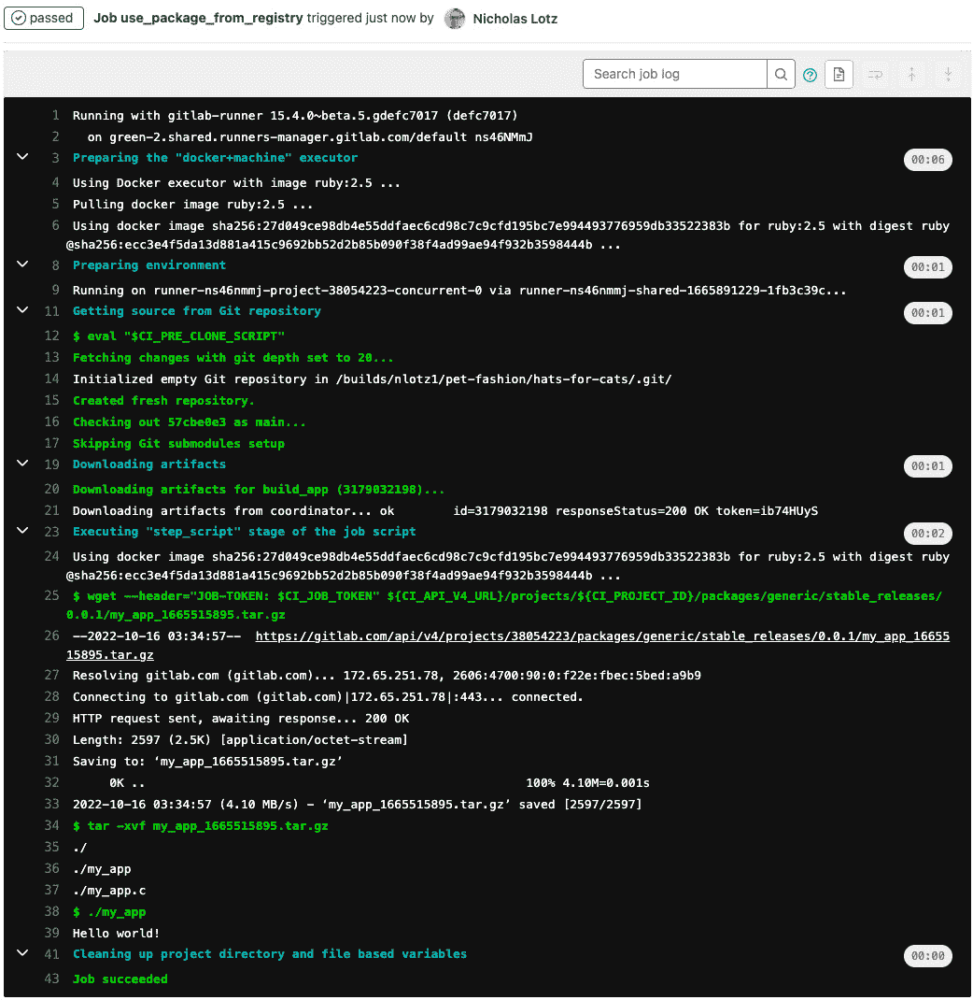

# 打包和部署代码

在前几章中，你已经学习了如何使用 GitLab 进行源代码管理，并设置 CI/CD 管道来构建、测试和对已提交的代码进行安全扫描。你现在应该已经自信地理解了 GitLab CI/CD 周围的基础设施以及用于编写管道的语法。

本章中，我们将继续软件开发阶段的旅程，现在专注于打包和部署代码。我们将结合使用 GitLab 的内置功能和常见的行业工具，将我们的代码部署到端点或环境。目标是回答这个问题，*我们如何使已经构建和测试的应用程序可供我们的用户使用？*

本章将介绍新词汇，扩展我们对 GitLab CI/CD 语法的理解。还会提到并使用第三方工具，如 Docker，以及云服务提供商，如 Google Cloud Platform。由于本书的核心重点是 GitLab 的功能，我们没有空间对每个可以与 GitLab 配合使用的工具进行技术性深入探讨，因此你可能对本章中提到的某些技术不太熟悉。因此，我们将尽力使用行业标准语言，重点介绍每个工具与 GitLab 的集成，并提供可以复制的示例，不要求读者拥有进一步的知识。完成本章后，你将掌握使用 GitLab 原生软件包和容器注册表功能来托管已完成构建所需的技能。你还将扩展对 GitLab CI/CD 的知识，包括使用传统或云原生基础设施将代码部署到评审和生产环境。

以下是本章将涵盖的主题：

+   将代码存储在 GitLab 的软件包注册表中，以备后续重用

+   将代码存储在 GitLab 的容器和软件包注册表中，以备后续部署

+   使用 GitLab Flow 部署到不同环境

+   部署到评审应用进行测试

+   部署到实际生产环境

+   部署到 Kubernetes 集群

# 技术要求

与前几章一样，如果你有一个 GitLab 实例账户（SaaS 或自托管），你将能最大限度地从本章中受益。此外，本章的主题和示例将越来越侧重于部署到 GitLab 之外的环境。提到的基础设施工具包括：

+   托管 GitLab 的服务器（或 GitLab.com）

+   自托管运行器（或托管在 GitLab.com 上的 SaaS 运行器）

+   Docker（也可在托管在 GitLab.com 上的 SaaS 运行器上使用）

+   Kubernetes

+   云平台服务（如 Amazon Web Services、Google Cloud Platform 或 Heroku）

如果您希望最小化需要安装和维护的工具量，我们建议使用 GitLab.com 和 SaaS 运行器。如果您希望练习将应用部署到实时或复杂的基础设施，我们也建议在云服务平台上创建一个帐户。只要注意使用这些服务时可能产生的费用。

# 将代码存储在 GitLab 的软件包注册表中以供后续重用

作为作为完整 DevOps 平台的目标之一，GitLab 在每个项目中都包含启用软件包和容器注册表的选项。软件包注册表支持以多种格式托管软件包和语言包，容器注册表作为专用容器镜像的仓库。这些功能使团队能够方便地托管、组织和版本控制完成的构建，并与源代码一起使用。我们将依次讨论软件包和容器注册表。

## 定位 GitLab 的容器和软件包注册表

GitLab 项目技术上支持三种内置注册表。它们是软件包、容器和基础设施注册表，可用于存储完成的代码，无论是供终端用户使用还是供其他软件项目使用。本书将重点讨论软件包和容器注册表；基础设施注册表是 GitLab 最近添加的功能，专门用于托管 Terraform 模块。GitLab 还支持将构件推送到外部或第三方注册表，尽管这超出了我们在此讨论的范围。

*图 8.1* 显示了在项目和组级别下，GitLab 的软件包和容器注册表的位置，在左侧导航窗格中的 **软件包和注册表** 下。


图 8.1 – 左侧边栏中的软件包和注册表

当你将鼠标悬停在 **软件包和注册表** 上时，你会看到软件包、容器和基础设施注册表都有各自的页面可以导航，如 *图 8.2* 所示。


图 8.2 – 软件包和注册表子菜单项

如果我们还没有配置或推送任何构件到注册表，当我们访问注册表页面时，会看到一条适当的提示信息。*图 8.3* 显示了我们在 **软件包注册表** 页面上看到的提示信息，并附带了使用软件包注册表的 GitLab 文档链接。


图 8.3 – 没有软件包的项目软件包注册表

*图 8.4* 向我们展示了一个未填充的 **容器注册表**。在这里，GitLab 提示我们可以使用 Docker 命令构建应用程序的容器化版本，然后将其推送到容器注册表。


图 8.4 – 没有容器镜像的项目容器注册表

我们很快会看到，将内容推送到 GitLab 注册表的典型方式是配置执行构建工件的命令的 CI/CD 作业，对其进行身份验证并将工件推送到注册表，通常使用 GitLab 的 API。

## 开始使用软件包注册表

在 GitLab 中，软件包注册表默认启用，尽管管理员可以在实例级别禁用它。在项目设置中，你还可以选择在 **设置** | **常规** | **可见性、项目功能、权限** 下启用或禁用软件包注册表功能。如果将 **Packages** 选项关闭，则左侧边栏将无法显示该功能。*图 8.5* 显示了在项目设置中启用或禁用软件包注册表的位置。


图 8.5 – 在项目设置中启用软件包注册表

现在问题来了，我们如何使用软件包注册表？也就是说，我们如何将软件填充到其中？填充软件包注册表有两个主要步骤：首先是对注册表进行身份验证，然后是通过 CI/CD 作业构建并上传软件包。但在深入了解这些步骤之前，我们先列出 GitLab 支持的软件包格式。

## 支持的软件包格式

截至本书写作时，以下软件包管理器格式通常可用并已完全支持 GitLab 的软件包注册表：

+   通用软件包

+   Maven

+   npm

+   NuGet

+   PyPI

以下软件包格式要么是受功能标志控制，要么使用时存在已知问题：

+   Composer

+   Conan

+   Debian

+   Go

+   Helm

+   Ruby Gems

每个软件包管理器都有自己的配置格式和语法。为了保持一致性，并专注于 GitLab 软件包的核心概念，我们将使用通用的软件包格式来展示示例。我们将从对 GitLab 软件包注册表进行身份验证开始。

## 对注册表进行身份验证

我们在本章前面提到过，使用 GitLab 的注册表主要通过 CI/CD 作业进行。身份验证、上传到注册表和使用注册表中的软件包的操作应该通过 GitLab CI/CD 配置中定义的作业任务来表示。一般来说，你可以通过以下四种凭据之一来验证 GitLab 的软件包注册表：

+   个人访问令牌，用于使用用户权限进行身份验证

+   项目部署令牌，用于访问项目中的所有软件包

+   一个组部署令牌，用于访问组内或其子组中所有项目的所有软件包

+   一个作业令牌，用于访问定义 CI/CD 作业的项目中的软件包

部署令牌和作业令牌与用户无关

与个人访问令牌不同，部署令牌和作业令牌是特殊类型的 GitLab 凭证，它们与特定用户无关，而是可以作为一种无需指定用户凭证的替代身份验证方式。部署令牌和作业令牌通常用于以编程方式访问代码库，或者在我们的案例中，用于读取和写入包注册表。

在我们的示例中，我们将在“Hats for Cats”项目中创建一个项目级部署令牌。*图 8.6*显示了我们可以在项目**设置** | **代码库** | **部署令牌**下创建新的部署令牌的位置。在这里，我们可以为令牌指定一个易于识别的名称、一个可选的过期日期，以及一个可选的与令牌相关的用户名（如果不输入用户名，GitLab 将自动为我们生成一个）。

最后，我们选择要授予令牌的权限。权限名称可能略显模糊，但`read_registry`和`write_registry`仅指容器注册表的读取和写入，而`read_package_registry`和`write_package_registry`则指包注册表的读取和写入。


图 8.6 – 创建新的部署令牌

一旦我们创建了部署令牌，GitLab 将提供一个密码，我们需要将其保存在安全的地方（见*图 8.7*）。我们将使用部署令牌密码对命令进行身份验证，以访问包或容器注册表。


图 8.7 – 部署令牌密码

别忘了保存您的部署令牌！

一定要把部署令牌的密码保存在安全的地方！一旦离开页面，您将无法恢复密码，因为 GitLab 不会永久存储凭证。

完成创建部署令牌并保存密码后，GitLab 将在**活跃的部署令牌**下显示该令牌及其详细信息，如*图 8.8*所示。如果不再需要使用该令牌，项目维护者或所有者可以选择撤销该令牌。


图 8.8 – 活跃的部署令牌

现在，我们可以使用我们创建的令牌进行注册表身份验证。我们用于身份验证的确切语法将取决于我们的包管理器，即我们正在创建或使用的包类型。在最简单的情况下，我们可以将凭证包含在`curl`命令的头部，如下所示：

```
curl --user "hfc-generic-build:<deploy token password>" ${CI_API_V4_URL}/projects/${CI_PROJECT_ID}/packages/generic/stable-releases/0.0.1/my_app.tar.gz
```

当在 CI/CD 作业中运行时，前述命令会对运行管道的项目的包注册表进行身份验证。身份验证凭证由`--user`标志提供，我们在其中提供部署密钥的用户名和密码（这里显示为占位符）。该命令的输出将下载`my_app.tar.gz`包。

使用部署密钥是一种从注册表拉取或下载的编程方式。下载包文件也可以通过 UI 完成。*图 8.9* 显示了一个 `stable_releases` 包的示例，版本为 0.0.1，已被添加到包注册表中。


图 8.9 – 包注册表中的条目

如果我们点击 **stable_releases**，我们可以在 **Assets** 标题下看到可下载的应用文件（见 *图 8.10*）。我们可以看到文件名（通过扩展名可以识别文件类型）、大小和创建日期。选择文件名会将文件下载到本地计算机。在 **History** 部分，我们可以看到它何时发布到注册表、哪个管道构建推送了包、哪个提交启动了管道，以及包的名称和版本。


图 8.10 – 包文件和构建历史

现在我们已经了解了如何进行身份验证并访问包注册表中的包，接下来我们将使用 CI/CD 作业来构建、推送和更新注册表中的包。

## 构建和推送包到包注册表

正如我们已经提到的几次，GitLab 推荐使用 CI/CD 作业来构建和发布到注册表。从技术上讲，写入注册表可以通过 API 调用进行，因此 GitLab CI/CD 并不是严格必要的。然而，构建和产物管理非常适合 GitLab 流程，并且将此过程标准化，与其他软件开发工作流类似，是很有帮助的。出于这个原因，我们将创建一个 CI/CD 管道来构建并推送到注册表。

精确的作业语法将取决于您用来构建软件的编程语言和包管理器。GitLab 文档提供了用于使用 Python、Maven 和其他工具进行身份验证、读取和写入注册表的特定语法示例。为了保持概念性，并且因为我们没有空间展示每种受支持的语言或工具，我们将使用通用包作为示例，并且我们的命令将是 `curl` 风格的 API 调用。

一个 CI/CD 配置可能如下所示：

```
stages:
  - build
  - publish
build_app:
  stage: build
  script:
    - make my_app
    - tar -czvf my_app.tar.gz .
  artifacts:
    paths:
      - my_app.tar.gz
publish_to_registry:
  stage: publish
  script:
    - $PACKAGE_FILE=$(ls | grep *.tar.gz)
    - curl --user "hfc-generic-build:<deploy token password>" --upload-file my_app.tar.gz "${CI_API_V4_URL}/projects/${CI_PROJECT_ID}/packages/generic/stable_releases/0.0.1/$PACKAGE_FILE"
  dependencies:
    - build_app
```

前面的示例 `.gitlab-ci.yml` 内容包含两个阶段：一个 `build` 阶段，它编译一个 C 风格的应用程序，另一个是 `publish` 阶段，它将构建产物推送到包注册表中。`build` 阶段包含一个作业来构建我们的代码。然后，我们创建一个包含完成的构建和支持文件的归档文件。该归档文件在构建作业中作为产物指定，以便下游的 `publish` 作业可以访问它。

`publish_to_registry`作业对注册表进行身份验证并上传构建产物。注意`curl`命令中的一些动态 CI/CD 变量（即以`CI_`开头的术语）。这些变量是引用项目中正确的注册表 URL 和路径的便捷方式。还要注意，我们将构建分类为通用包，属于“稳定发布”版本 0.0.1 的一部分。

我们还可以添加一个 Unix 时间戳，以区分注册表中的不同构建。我们可以按如下方式修改构建作业，以在产物文件名中包含时间戳：

```
build_app:
  stage: build
  script:
    - make my_app
    - TIMESTAMP=$(date +%s)
    - tar -czvf my_app_$TIMESTAMP.tar.gz .
  artifacts:
  paths:
    - ./*.tar.gz
```

*图 8.11* 显示了注册表中更新的文件资产。注意在构建脚本中的`tar`命令文件名中的时间戳。归档文件的大小和创建日期也会显示。开发人员可以点击文件名以下载该归档文件，然后可以在本地系统上解压。


图 8.11 – 带有时间戳的包注册表中的文件

## 构建并推送包到容器注册表

GitLab 还提供了用于存储 Docker 镜像的容器注册表。与包注册表类似，可以通过 CI/CD 作业创建并推送 Docker 镜像到注册表。身份验证的概念与包注册表相似，但你需要使用容器平台工具（如 Docker）来进行身份验证、构建、推送和拉取容器镜像。

以下 Docker 命令可用于使用我们之前的部署令牌对容器注册表进行身份验证。我们将使用类似的 Docker 命令来构建我们应用程序的容器化版本，并将其推送到注册表：

```
docker login -–username "hfc-generic-build" --password "eBYj_qvLTFSMcFrS-4tA" $CI_REGISTRY
```

我们的 CI/CD 作业用于“容器化”我们的应用程序并将其推送到注册表，可能如下所示：

```
publish_to_container_registry:
  stage: publish
  image: docker:stable
  services:
    - docker:dind
  variables:
    IMAGE: $CI_REGISTRY_IMAGE/my_app/0.0.1
  script:
    - docker login -u "hfc-generic-build" -p "<deploy token password>" $CI_REGISTRY
    - docker build -t $IMAGE .
    - docker push $IMAGE
```

让我们一步步解释前述 CI/CD 作业中发生的事情：

1.  我们将作业命名为`publish_to_container_registry`，作为**发布**阶段的一部分。

1.  然后，我们在 CI/CD 作业的运行时环境中包含两个容器：一个包含官方 Docker 工具的容器（`image: docker:stable`），以及一个带有“Docker-in-Docker”工具的服务容器（`docker:dind`）。后者容器类型允许我们在已经容器化的 CI/CD 作业环境中构建容器（因此被称为 Docker-*in*-Docker）。

1.  接下来，我们定义一个名为`IMAGE`的变量，用于指定我们的容器镜像的名称，以及其在容器注册表中的目标端点。`IMAGE`变量将在`docker`命令中作为参数引用。

1.  最后，我们的 CI/CD 作业脚本部分包含三个命令：

    +   第一个命令，`docker login`，使用我们的部署令牌对容器注册表进行身份验证。

    +   第二个命令，`docker build`，构建我们应用程序的容器化版本。

    +   最后的命令，`docker push`，将新构建的容器镜像推送到容器注册表。

在使用 Docker-in-Docker 构建容器时要小心。

虽然这很简单直接，但 Docker-in-Docker 默认使用`--docker-privileged`标志，这可能会使运行容器的服务获得对主机机器的 root 访问权限。如果这是一个安全问题，GitLab 还提供了使用名为**kaniko**的构建工具从 Dockerfile 构建容器镜像的说明。请参阅 GitLab 文档以获取更多详情。

结果发现，如果我们仅将前面的任务添加到我们的 CI/CD 管道配置中并运行管道，那么任务将失败。这是因为我们缺少构建容器镜像的另一个必要组件。我们的代码库中有一个名为`Dockerfile`的文件，它作为容器镜像构建的“食谱”，规定了容器镜像的构建方式及其内容。通常，Dockerfile 会包含一些指令，例如应该安装的依赖项、需要启动的服务或需要开放的端口。在这个例子中，我们将 Dockerfile 保持得非常简单。一个非常简单的 Dockerfile 可能包含以下内容：

```
FROM alpine:latest
# copy all of the files in this project into the Docker image
RUN mkdir public-app/
ADD . public-app/
WORKDIR public-app
```

上面的 Dockerfile 执行了以下操作：

+   它使用一个名为 Alpine Linux 的最小化 Linux 发行版作为我们构建容器的基础操作系统

+   它在容器中创建了一个名为`public-app/`的目录

+   它将我们所有的代码库文件放在`public-app/`目录中

+   它在容器启动时将`public-app/`设置为工作目录

*图 8**.12*显示了在更新`.gitlab-ci.yml`文件并创建 Dockerfile 后，我们的项目代码库可能的样子。


图 8.12 – 我们的代码库与 Dockerfile

现在，当我们运行 CI/CD 管道时，可以在`publish_to_container_registry`任务日志中看到 Docker 命令，如下图所示（*图 8**.13*）。注意，`docker build`命令的输出显示它遵循我们在`Dockerfile`中指定的食谱。任务脚本最后确认容器镜像已推送到项目的容器注册表。


图 8.13 – 推送到容器注册表的任务日志

检查容器注册表时，实际上可以看到我们在 CI/CD 任务中指定的容器名称的引用（*图 8**.14*）。


图 8.14 – 容器注册表中的镜像库

如果我们点击容器名称，就可以看到构建本身（*图 8**.15*）。


图 8.15 – 项目容器注册表中的最新工件

到目前为止，我们讨论的内容涵盖了查找、验证以及写入 GitLab 的包和容器注册表。在本章的下一节中，我们将实际使用和部署我们创建并上传的资产。

# 将代码存储在 GitLab 的容器和包注册表中，以便以后部署

GitLab 的包和容器注册表不仅有助于将软件提供给用户下载，还用于存储包和库，以便在 CI/CD 管道中使用，或部署到环境中。在本节中，我们将讨论如何通过 CI/CD 作业以编程方式与注册表进行交互。

## 使用来自容器注册表的镜像

在上一节中，我们构建了一个容器化的应用程序版本，并将镜像推送到 GitLab 的容器注册表。回想一下，我们用来构建容器镜像的 CI/CD 作业本身是在容器中运行的，因此提到了诸如 `docker:stable` 和 `docker:dnd` 这样的术语。在这个例子中，我们是从公共容器注册表（即 Docker Hub）中拉取镜像。

然而，我们也可以拉取我们推送到 GitLab 容器注册表的容器镜像，并将其作为运行 CI/CD 作业的基础。我们可以像使用公共容器镜像一样，在管道中使用它们，使用 `image` 关键字，如下片段所示：

```
use_container_from_registry:
  stage: run
  image: registry.gitlab.com/nlotz1/pet-fashion/hats-for-cats/my_app/0.0.1:latest
  script:
    - ls –al      # Show the current directory as our container's working directory
```

*图 8.16* 显示了当我们从本地注册表拉取容器并运行作业时的作业输出。

.


图 8.16 – 在 CI/CD 作业中使用本地容器

请注意，作业日志显示了 GitLab 从容器注册表中拉取镜像的过程，以及容器文件系统的内容（即我们在第一次构建容器时包含的文件）。

## 使用包管理器注册表中的包

使用包管理器注册表中的包遵循与发布包到注册表类似的主题。从注册表拉取包的确切步骤和语法将取决于包的类型。通常，你需要指定包所在的组和项目（即 GitLab 中的命名空间）、包名以及包版本。与之前的示例一致，我们可能会使用 CI/CD 作业从我们的注册表中拉取并运行一个通用包：

```
use_package_from_registry:
  stage: run_package
  script:
    - 'wget --header="JOB-TOKEN: $CI_JOB_TOKEN" ${CI_API_V4_URL}/projects/${CI_PROJECT_ID}/packages/generic/stable_releases/0.0.1/my_app_1665515895.tar.gz'
    - tar -xvf my_app_1665515895.tar.gz
    - ./my_app
```

*图 8.17* 中的作业日志显示了通过 GitLab 的 API 认证并下载包文件的输出。在这个例子中，包被从其压缩文件中提取并运行。



图 8.17 – 在 CI/CD 作业中使用来自注册表的包

GitLab 的文档展示了为不同包管理器认证并下载包的不同步骤，但原则保持一致。

现在我们已经理解了如何在 CI/CD 作业的背景下发布和下载包，接下来我们将把这些步骤融入到典型的 GitLab 开发工作流中。

# 使用 GitLab Flow 部署到不同的环境

到目前为止，我们已经讨论了如何通过 GitLab 的包和容器注册表发布和拉取我们的完成代码。现在，我们将学习 GitLab 的一些功能，用于组织将代码部署到特定环境。

GitLab 有两个术语，**环境**和**部署**，用于描述和分类已部署应用的位置和版本。环境通过名称和 URL 表示，作为 GitLab 中的组织标签。每当应用通过 CI/CD 部署到该环境时，GitLab 会创建并将其分类为新的部署。

环境是通过`testing`创建的，且该环境将应用部署到名为`production`的通用应用中：

```
use_package_from_registry:
  stage: run_package
  script:
    - 'wget --header="JOB-TOKEN: $CI_JOB_TOKEN" ${CI_API_V4_URL}/projects/${CI_PROJECT_ID}/packages/generic/stable_releases/0.0.1/my_app_1665515895.tar.gz'
    - tar -xvf my_app_1665515895.tar.gz
    - ./my_app
  environment:
    name: testing
    url: https://test.example.com
use_container_from_registry:
  stage: run_container
  image: registry.gitlab.com/nlotz1/pet-fashion/hats-for-cats/my_app/0.0.1:latest
  script:
    - ls -la
  environment:
    name: production
    url: https://prod.example.com
```

*图 8.18* 显示了环境在 GitLab UI 中如何在**部署** | **环境**下进行表示。


图 8.18 – GitLab UI 中的环境

每当一个新的提交创建一个 CI/CD 管道并部署到该环境时，环境就会被更新。GitLab UI 会显示最新部署的提交 SHA、触发该提交的 GitLab 用户、触发提交的分支以及部署到该环境的 CI/CD 作业。(`https://prod.example.com`)。

我们可以看到，通过将环境集成到 GitLab CI/CD 中，我们可以设置更高级的工作流，例如使用 CI/CD 关键字如**规则**，以确保只有在特定分支上代码更改时，某些环境才会被更新。本章的下一部分将展示这样的示例。

# 部署到审查应用进行测试

GitLab 有一个名为`.gitlab-ci.yml`的功能，它创建了一个作业，该作业部署到审查应用环境。


图 8.19 – 启用审查应用

在作业内容中有两个关键点需要注意。第一个是使用预定义的 CI/CD 变量来指定环境名称和 URL。审查环境的名称将根据触发的分支动态更新，URL 也将根据动态环境名称进行更新。这对于在开发过程中快速启动临时的即席环境非常有用。

在审查应用 CI/CD 作业中需要注意的第二个点是其`only`/`except`关键字。审查应用环境*仅*在 Git 分支上触发管道时才会被部署，*除非*是主分支。其逻辑是，分支代表一个开发线，而主分支可能是一个更稳定的暂存或生产环境，是静态的而非动态的。

审查应用的另一个有用元素是它们可以通过合并请求轻松访问。如果合并请求的管道已定义触发分支的审查应用作业，则可以从合并请求页面访问审查应用的 URL 链接（见*图 8.20*）。


图 8.20 – 从合并请求查看评审应用程序

你也可以在 CI/CD 作业日志中看到指向评审环境的链接（见*图 8.21*）。


图 8.21 – 评审应用程序 CI/CD 作业日志

总结来说，评审应用程序只是扩展了我们对环境的理解，涵盖了动态创建和更新。它们最适合用于表示快速变化的开发环境，且开发人员和评审人员可以轻松访问，用于预览应用程序的最新版本。

现在我们已经了解了如何通过评审应用程序预览变更，最后让我们来讨论一下如何将应用程序部署到生产环境。

# 部署到实际的生产环境

到目前为止，我们展示的例子表明，环境仅仅是 GitLab 中的组织类别，具有相关的名称和网址。然而，在现实世界中，环境代表的是实际的基础设施，无论是你自己的计算机还是其他人的计算机。这意味着要认识到可用资源的限制，以及适当的安全性和访问控制的重要性。

在当今时代，使用 AWS、Microsoft Azure 和 Google Cloud Platform 等云服务提供商来托管应用程序变得越来越普遍。这些服务不仅外包了基础设施管理的需求，还提供了用于管理环境的程序化接口。

此外，随着云服务提供商的兴起，管理这些资源的开发工具套件也应运而生，除了云供应商提供的工具外，像 Terraform、Ansible 和 Chef 等软件可以声明式地管理云资源。也就是说，它们让你以文本形式将基础设施的描述存储在 Git 仓库中。因此，管理基础设施变更的工作流可以与应用程序开发管理的工作流类似。

利用云服务的内容远超本章所能覆盖的范围。不过，值得指出的是 GitLab 如何在应用环境管理的一个重要方面提供帮助：秘密管理。我们已经解释了 CI/CD 变量的概念，以及它们如何在 CI/CD 配置中使用并导出到作业运行的环境中。对于敏感性质的变量，例如部署密钥，GitLab 在组级或项目级设置中提供了一个特殊的地方，以确保这些值不会暴露在项目的代码库中。

比如说，你希望部署到 AWS 托管的环境中。你需要提供凭据来验证 AWS，通常是 AWS 访问密钥和秘密密钥的形式。然而，你不希望将这些值直接输入到 CI/CD 部署脚本中，因为这会将凭据泄露到代码库及其版本历史中。

你可以像处理其他变量一样，导航到项目的`.gitlab-ci.yml`文件，而无需将其值硬编码到配置中。


图 8.22 – 项目级 CI/CD 变量

值得注意的是，以这种方式创建变量为其使用和暴露提供了额外的门控保护。除了设置变量的名称和值外，你还可以限制其可用的环境。你还可以选择将变量限制在受保护的分支和标签中（即，对贡献或修改它们的人有限制的分支和标签）。而*图 8.23*显示，你还可以将变量进行屏蔽，这意味着如果有尝试泄漏其值，作业日志中只会显示星号或**[MASKED]**。


图 8.23 – 项目级 CI/CD 变量设置

这些解释仅仅触及了实际环境中部署考虑的表面。然而，在如今这个高度关注安全的时代，我们发现最好专注于秘密管理这一关键领域，以展示 GitLab 如何使部署过程既顺畅又安全。在接下来的最后一部分，我们将学习 GitLab 与 Kubernetes 的集成，支持云原生部署。

# 部署到 Kubernetes 集群

我们之前讨论了云服务作为自托管基础设施的替代方案的普遍性。类似地，Kubernetes 等容器编排系统也越来越受欢迎，成为手动管理裸金属服务器或容器主机的替代方案。

使用 GitLab CI/CD 部署到 Kubernetes 在概念上与我们迄今为止讨论的工作流相似。你可以设置一个带有 Kubernetes 执行器的 GitLab runner，该执行器通过 Kubernetes API 与集群进行通信。或者，GitLab 还提供了一个名为**GitOps 工作流**的附加方法，它并不完全依赖于 CI/CD 流水线。我们将依次总结它们。

## CI/CD 工作流

利用迄今为止的概念，你可以使用正常的 CI/CD 设置将容器化应用程序部署到 Kubernetes。这需要一个已注册 Kubernetes 执行器的 runner。在 runner 注册过程中，会提供集群主机和认证信息等内容。然后，CI/CD 脚本会包含集群中的直接 API 调用，指定构建、测试或部署代码的命令。

由于这个工作流涉及 runner 向 Kubernetes 集群发送命令，因此我们称之为**基于推送的**工作流。它的方便之处在于无需额外的依赖即可与 Kubernetes 交互。然而，如果集群或部署在 CI/CD 工作流之外发生任何变化，可能会遇到问题，导致集群处于与 CI/CD 作业预期不同的状态，从而产生潜在的问题。

因此，GitLab 越来越推荐一种与 Kubernetes 合作的不同方法，称为 GitOps 工作流。

## 一个 GitOps 工作流

GitLab 提供了一种替代的 Kubernetes 集成方法，不直接使用 CI/CD。相反，它使用安装在 Kubernetes 集群上的代理与 GitLab 实例进行通信。你可以通过导航到**基础设施** | **Kubernetes 集群**，然后选择**连接集群**，按照提供的说明创建并注册新的代理（见*图 8.24*）。


图 8.24 – 将 Kubernetes 集群连接到 GitLab

一旦建立连接，代理会在配置和部署文件在代码库中更新时自动检测变化，并相应地更改集群状态。这是由于集群代理与 GitLab 服务器之间的双向流式传输。实际上，代理启动所有通信，以绕过任何妨碍 Kubernetes 集群的网络限制（见*图 8.25*）。


图 8.25 – GitLab 代理用于 Kubernetes 架构

因此，GitLab 将 GitOps 工作流称为**拉取式方法**，这种方法正越来越受到 CI/CD 流水线传统推送方法的青睐。

# 总结

本章中，我们描述了打包和部署代码的各种方式，包括利用 GitLab 的包和容器注册表、CI/CD 环境以及与云原生基础设施交互的方法。

即使你可能在日常工作中不会使用所有讨论的功能或服务，我们希望本章为 GitLab 特性提供了一个有用的桥梁，帮助你理解更多实际、现实世界中的应用场景。

下一章将在我们已学到的基础上进一步发展。它还将介绍提高 CI/CD 速度和性能的高级功能，提高开发者生产力，并优化快速构建和交付软件的能力。

# 第三部分 使用 GitLab 改进应用程序的下一步

本书的这一部分将带你深入了解高级 CI/CD 流水线主题，包括使用有向无环图加速流水线、将第三方工具集成到流水线中、利用流水线发现代码中的性能问题以及其他许多话题。你还将有机会通过一个端到端的示例，回顾你迄今为止学到的所有内容，展示如何使用 GitLab 将一个真实的软件项目带入整个软件开发生命周期。最后，你将学习如何解决 GitLab 流水线中常见的问题，并提前了解 GitLab 未来的发展方向。

本部分包括以下章节：

+   *第九章*，*提高 CI/CD 流水线的速度和可维护性*

+   *第十章*，*扩展 CI/CD 管道的应用范围*

+   *第十一章*，*端到端示例*

+   *第十二章*，*GitLab 的故障排除与未来发展*
